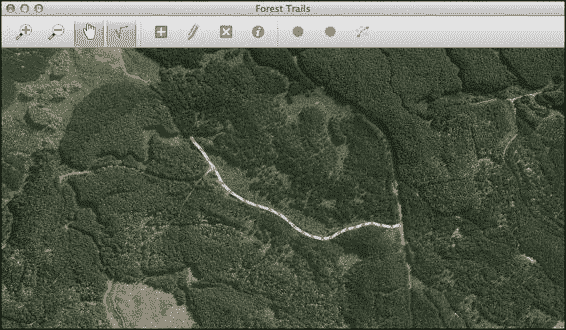
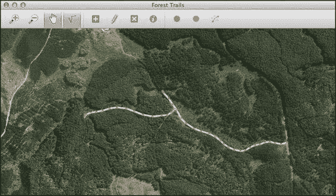
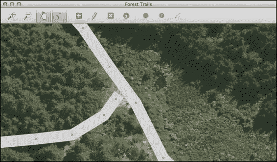
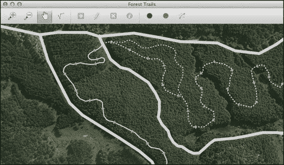
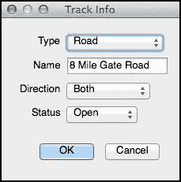
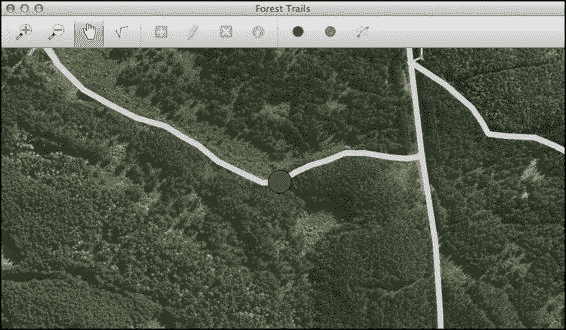
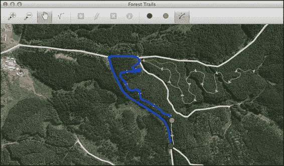

# 第九章 完成 ForestTrails 应用程序

在本章中，我们将完成我们在上一章中开始构建的 ForestTrails 应用程序的实施。到目前为止，我们的应用程序显示了基础地图，并允许用户在地图上缩放和平移。我们已实现了轨道编辑模式，尽管用户还不能输入或编辑轨道数据。

在本章中，我们将向 ForestTrails 应用程序添加以下功能：

+   允许用户添加、编辑和删除轨迹的地图工具

+   一个工具栏动作，允许用户查看和编辑轨迹的属性

+   **设置起点** 和 **设置终点** 动作

+   使用基于内存的地图层计算并显示两个选定点之间的最短可用路径

# 添加轨迹地图工具

我们的首要任务是让用户在轨道编辑模式下添加新的轨迹。这涉及到定义一个新的地图工具，我们将称之为 `AddTrackTool`。然而，在我们开始实现 `AddTrackTool` 类之前，我们将创建一个混合类，为我们的地图工具提供各种辅助方法。我们将把这个混合类称为 `MapToolMixin`。

这里是我们 `MapToolMixin` 类的初始实现，应该放在你的 `mapTools.py` 模块顶部附近：

```py
class MapToolMixin
    def setLayer(self, layer):
        self.layer = layer

    def transformCoordinates(self, screenPt):
        return (self.toMapCoordinates(screenPt),
                self.toLayerCoordinates(self.layer, screenPt))

    def calcTolerance(self, pos):
        pt1 = QPoint(pos.x(), pos.y())
        pt2 = QPoint(pos.x() + 10, pos.y())

        mapPt1,layerPt1 = self.transformCoordinates(pt1)
        mapPt2,layerPt2 = self.transformCoordinates(pt2)
        tolerance = layerPt2.x() - layerPt1.x()

        return tolerance
```

我们在创建第七章 选择和编辑 PyQGIS 应用程序中的要素 中的几何编辑地图工具时已经看到了 `transformCoordinates()` 和 `calcTolerance()` 方法。唯一的区别是我们存储了对编辑地图层的引用，这样我们就不必每次计算容差或转换坐标时都提供它。

我们现在可以开始实现 `AddTrackTool` 类。这与我们在第七章 选择和编辑 PyQGIS 应用程序中的要素 中定义的 `CaptureTool` 非常相似，除了它只捕获 LineString 几何形状，并且在用户完成定义轨迹时创建一个新的具有默认属性的轨迹要素。以下是新地图工具的类定义和 `__init__()` 方法，应该放在 `mapTools.py` 模块中：

```py
class AddTrackTool(QgsMapTool, MapToolMixin):
    def __init__(self, canvas, layer, onTrackAdded):
        QgsMapTool.__init__(self, canvas)
        self.canvas         = canvas
        self.onTrackAdded   = onTrackAdded
        self.rubberBand     = None
        self.tempRubberBand = None
        self.capturedPoints = []
        self.capturing      = False
        self.setLayer(layer)
        self.setCursor(Qt.CrossCursor)
```

如您所见，我们的类从 `QgsMapTool` 和 `MapToolMixin` 继承。我们还调用了 `setLayer()` 方法，这样混合类就知道要使用哪个图层。这也使得当前编辑的图层通过 `self.layer` 可用。

我们接下来定义了我们地图工具的各种事件处理方法：

```py
    def canvasReleaseEvent(self, event):
        if event.button() == Qt.LeftButton:
            if not self.capturing:
                self.startCapturing()
            self.addVertex(event.pos())
        elif event.button() == Qt.RightButton:
            points = self.getCapturedPoints()
            self.stopCapturing()
            if points != None:
                self.pointsCaptured(points)

    def canvasMoveEvent(self, event):
        if self.tempRubberBand != None and self.capturing:
            mapPt,layerPt = self.transformCoordinates(event.pos())
            self.tempRubberBand.movePoint(mapPt)

    def keyPressEvent(self, event):
        if event.key() == Qt.Key_Backspace or \
           event.key() == Qt.Key_Delete:
            self.removeLastVertex()
            event.ignore()
        if event.key() == Qt.Key_Return or \
           event.key() == Qt.Key_Enter:
            points = self.getCapturedPoints()
            self.stopCapturing()
            if points != None:
                self.pointsCaptured(points)
```

再次，我们在 `CaptureTool` 类中看到了这种逻辑。唯一的区别是我们只捕获 LineString 几何形状，所以我们不需要担心捕获模式。

现在，我们来到了 `startCapturing()` 和 `stopCapturing()` 方法。这些方法创建并释放我们地图工具使用的橡皮筋：

```py
    def startCapturing(self):
        color = QColor("red")
        color.setAlphaF(0.78)

        self.rubberBand = QgsRubberBand(self.canvas, QGis.Line)
        self.rubberBand.setWidth(2)
        self.rubberBand.setColor(color)
        self.rubberBand.show()

        self.tempRubberBand = QgsRubberBand(self.canvas, QGis.Line)
        self.tempRubberBand.setWidth(2)
        self.tempRubberBand.setColor(color)
        self.tempRubberBand.setLineStyle(Qt.DotLine)
        self.tempRubberBand.show()

        self.capturing = True

    def stopCapturing(self):
        if self.rubberBand:
            self.canvas.scene().removeItem(self.rubberBand)
            self.rubberBand = None
        if self.tempRubberBand:
            self.canvas.scene().removeItem(self.tempRubberBand)
            self.tempRubberBand = None
        self.capturing = False
        self.capturedPoints = []
        self.canvas.refresh()
```

接下来，我们有 `addVertex()` 方法，它将一个新的顶点添加到轨迹中：

```py
    def addVertex(self, canvasPoint):
        mapPt,layerPt = self.transformCoordinates(canvasPoint)

        self.rubberBand.addPoint(mapPt)
        self.capturedPoints.append(layerPt)

        self.tempRubberBand.reset(QGis.Line)
        self.tempRubberBand.addPoint(mapPt)
```

注意，我们调用了 `self.transformCoordinates()`，这是我们混合类定义的一个方法。

我们的下一种方法是 `removeLastVertex()`。当用户按下*删除*键时，它会删除最后添加的顶点：

```py
    def removeLastVertex(self):
        if not self.capturing: return

        bandSize     = self.rubberBand.numberOfVertices()
        tempBandSize = self.tempRubberBand.numberOfVertices()
        numPoints    = len(self.capturedPoints)

        if bandSize < 1 or numPoints < 1:
            return

        self.rubberBand.removePoint(-1)

        if bandSize > 1:
            if tempBandSize > 1:
                point = self.rubberBand.getPoint(0, bandSize-2)
                self.tempRubberBand.movePoint(tempBandSize-2,
                                              point)
        else:
            self.tempRubberBand.reset(QGis.Line)

        del self.capturedPoints[-1]
```

我们现在定义 `getCapturedPoints()` 方法，它返回用户点击的点集或 `None`（如果用户点击的点不足以形成一个 LineString）：

```py
    def getCapturedPoints(self):
        points = self.capturedPoints
        if len(points) < 2:
            return None
        else:
            return points
```

我们的最后一种方法是 `pointsCaptured()`，当用户完成对新轨迹点的点击时，它会做出响应。与 `CaptureTool` 中的等效方法不同，我们必须为新轨迹设置各种属性：

```py
    def pointsCaptured(self, points):
        fields = self.layer.dataProvider().fields()

        feature = QgsFeature()
        feature.setGeometry(QgsGeometry.fromPolyline(points))
        feature.setFields(fields)
        feature.setAttribute("type",      TRACK_TYPE_ROAD)
        feature.setAttribute("status",    TRACK_STATUS_OPEN)
        feature.setAttribute("direction", TRACK_DIRECTION_BOTH)

        self.layer.addFeature(feature)
        self.layer.updateExtents()
        self.onTrackAdded()
```

现在我们已经定义了我们的地图工具，让我们更新我们的应用程序以使用这个工具。回到 `forestTrails.py` 模块，在 `setupMapTools()` 方法的末尾添加以下内容：

```py
        self.addTrackTool = AddTrackTool(self.mapCanvas,
                                         self.trackLayer,
                                         self.onTrackAdded)
        self.addTrackTool.setAction(self.actionAddTrack)
```

我们现在可以定义我们的 `addTrack()` 方法如下：

```py
    def addTrack(self):
        if self.actionAddTrack.isChecked():
            self.mapCanvas.setMapTool(self.addTrackTool)
        else:
            self.setPanMode()
```

如果用户勾选了**添加轨迹**操作，我们将激活添加轨迹工具。如果用户再次点击取消勾选该操作，我们将切换回平移模式。

最后，我们必须定义一个名为 `onTrackAdded()` 的辅助方法。该方法在用户将新轨迹添加到我们的轨迹层时做出响应。以下是此方法的实现：

```py
    def onTrackAdded(self):
        self.modified = True
        self.mapCanvas.refresh()
        self.actionAddTrack.setChecked(False)
        self.setPanMode()
```

# 测试应用程序

在实现了所有这些代码后，是时候测试我们的应用程序了。运行适当的启动脚本，并在地图上稍微放大。然后点击**编辑**操作，然后点击**添加轨迹**操作。如果一切顺利，你应该能够点击地图来定义新轨迹的顶点。完成时，按*回车*键创建新轨迹。结果应该类似于以下截图：



如果你然后再次点击编辑轨迹图标，你会被问是否要保存你的更改。继续操作，你的新轨迹应该被永久保存。

现在回到轨迹编辑模式，尝试创建一个与第一个轨迹连接的第二个轨迹。例如：



如果你然后放大，你会很快发现我们应用程序设计中的一个重大缺陷，如下一张截图所示：



轨迹没有连接在一起。由于用户可以在地图上的任何地方点击，因此无法确保轨迹是连接的——如果轨迹没有连接，**找到最短路径**命令将无法工作。

我们有几种方法可以解决这个问题，但在这个情况下，最简单的方法是实现**顶点吸附**，也就是说，如果用户点击接近一个现有的顶点，我们将点击位置吸附到顶点上，以便将各种轨迹连接起来。

# 顶点吸附

为了实现顶点吸附，我们将在 `MapToolMixin` 中添加一些新方法。我们将从 `findFeatureAt()` 方法开始。此方法找到点击位置附近的一个特征。以下是此方法的实现：

```py
    def findFeatureAt(self, pos, excludeFeature=None):
        mapPt,layerPt = self.transformCoordinates(pos)
        tolerance = self.calcTolerance(pos)
        searchRect = QgsRectangle(layerPt.x() - tolerance,
                                  layerPt.y() - tolerance,
                                  layerPt.x() + tolerance,
                                  layerPt.y() + tolerance)

        request = QgsFeatureRequest()
        request.setFilterRect(searchRect)
        request.setFlags(QgsFeatureRequest.ExactIntersect)

        for feature in self.layer.getFeatures(request):
            if excludeFeature != None:
                if feature.id() == excludeFeature.id():
                    continue
            return feature

        return None
```

### 注意

如你所见，这种方法包含一个可选的 `excludeFeature` 参数。这允许我们排除搜索中的特定功能，这在之后会变得很重要。

接下来，我们将定义 `findVertexAt()` 方法，该方法用于识别接近给定点击位置的顶点（如果有的话）。以下是该方法的实现：

```py
    def findVertexAt(self, feature, pos):
        mapPt,layerPt = self.transformCoordinates(pos)
        tolerance     = self.calcTolerance(pos)

        vertexCoord,vertex,prevVertex,nextVertex,distSquared = \
            feature.geometry().closestVertex(layerPt)

        distance = math.sqrt(distSquared)
        if distance > tolerance:
            return None
        else:
            return vertex
```

如你所见，我们使用 `QgsGeometry.closestVertex()` 方法来找到接近给定位置的顶点，然后查看该顶点是否在容差距离内。如果是这样，我们返回被点击顶点的顶点索引；否则，我们返回 `None`。

注意到这种方法使用了 `math.sqrt()` 函数。为了能够使用这个函数，你需要在模块顶部附近添加以下内容：

```py
import math
```

定义了这两个新方法后，我们就可以开始实现顶点吸附功能了。下面是我们将要编写的函数签名：

```py
snapToNearestVertex(pos, trackLayer, excludeFeature=None)
```

在这个方法中，`pos` 是点击位置（在画布坐标中），`trackLayer` 是对我们轨迹层的引用（其中包含我们需要检查的功能和顶点），而 `excludeFeature` 是在寻找附近顶点时可选排除的功能。

### 注意

当我们开始编辑轨迹时，`excludeFeature` 参数将很有用。我们将使用它来阻止轨迹吸附到自身。

完成后，我们的方法将返回被点击顶点的坐标。如果用户没有点击在功能附近，或者接近顶点，那么这个方法将返回点击位置，并转换为图层坐标。这使得用户可以在地图画布上点击远离任何顶点的地方来绘制新功能，同时当用户点击时仍然吸附到现有的顶点上。

下面是我们 `snapToNearestVertex()` 方法的实现：

```py
    def snapToNearestVertex(self, pos, trackLayer,
                            excludeFeature=None):
        mapPt,layerPt = self.transformCoordinates(pos)
        feature = self.findFeatureAt(pos, excludeFeature)
        if feature == None: return layerPt

        vertex = self.findVertexAt(feature, pos)
        if vertex == None: return layerPt

        return feature.geometry().vertexAt(vertex)
```

如你所见，我们使用 `findFeatureAt()` 方法来搜索接近给定点击点的功能。如果我们找到一个功能，我们就调用 `self.findVertexAt()` 来找到接近用户点击位置的顶点。最后，如果我们找到一个顶点，我们就返回该顶点的坐标。否则，我们返回原始点击位置转换为图层坐标。

通过扩展我们的混合类，我们可以轻松地为 `AddTrack` 工具添加吸附功能。我们只需要将我们的 `addVertex()` 方法替换为以下内容：

```py
    def addVertex(self, canvasPoint):
        snapPt = self.snapToNearestVertex(canvasPoint, self.layer)
        mapPt = self.toMapCoordinates(self.layer, snapPt)

        self.rubberBand.addPoint(mapPt)
        self.capturedPoints.append(snapPt)

        self.tempRubberBand.reset(QGis.Line)
        self.tempRubberBand.addPoint(mapPt)
```

现在我们已经启用了顶点吸附功能，确保我们的轨迹连接起来将变得容易。请注意，我们还将使用顶点吸附来编辑轨迹，以及当用户选择最短可用路径计算的开始和结束点时。这就是为什么我们将这些方法添加到我们的混合类中，而不是添加到 `AddTrack` 工具中。

# 编辑轨迹图工具

我们下一个任务是实现编辑路径动作。为此，我们将使用在第七章中定义的 `EditTool`，即 *在 PyQGIS 应用程序中选择和编辑要素*，并修改它以专门用于路径。幸运的是，我们只需要支持 LineString 几何形状，并可以利用我们的混合类，这将简化新地图工具的实现。

让我们从向 `mapTools.py` 模块添加我们的新类定义以及 `__init__()` 方法开始：

```py
class EditTrackTool(QgsMapTool, MapToolMixin):
    def __init__(self, canvas, layer, onTrackEdited):
        QgsMapTool.__init__(self, canvas)
        self.onTrackEdited = onTrackEdited
        self.dragging      = False
        self.feature       = None
        self.vertex        = None
        self.setLayer(layer)
        self.setCursor(Qt.CrossCursor)
```

我们现在定义我们的 `canvasPressEvent()` 方法，以响应用户在地图画布上按下鼠标按钮：

```py
    def canvasPressEvent(self, event):
        feature = self.findFeatureAt(event.pos())
        if feature == None:
            return

        vertex = self.findVertexAt(feature, event.pos())
        if vertex == None: return

        if event.button() == Qt.LeftButton:
            # Left click -> move vertex.
            self.dragging = True
            self.feature  = feature
            self.vertex   = vertex
            self.moveVertexTo(event.pos())
            self.canvas().refresh()
        elif event.button() == Qt.RightButton:
            # Right click -> delete vertex.
            self.deleteVertex(feature, vertex)
            self.canvas().refresh()
```

如您所见，我们正在使用我们的混合类的方法来查找点击的要素和顶点。这简化了 `canvasPressedEvent()` 方法的实现。

我们现在来到 `canvasMoveEvent()` 和 `canvasReleaseEvent()` 方法，它们基本上与在 第七章 中定义的 `EditTool` 方法相同，即 *在 PyQGIS 应用程序中选择和编辑要素*：

```py
    def canvasMoveEvent(self, event):
        if self.dragging:
            self.moveVertexTo(event.pos())
            self.canvas().refresh()

    def canvasReleaseEvent(self, event):
        if self.dragging:
            self.moveVertexTo(event.pos())
            self.layer.updateExtents()
            self.canvas().refresh()
            self.dragging = False
            self.feature  = None
            self.vertex   = None
```

我们的 `canvasDoubleClickEvent()` 方法也非常相似，唯一的区别在于我们可以使用由我们的混合类定义的 `findFeatureAt()` 方法：

```py
    def canvasDoubleClickEvent(self, event):
        feature = self.findFeatureAt(event.pos())
        if feature == None:
            return

        mapPt,layerPt = self.transformCoordinates(event.pos())
        geometry      = feature.geometry()

        distSquared,closestPt,beforeVertex = \
            geometry.closestSegmentWithContext(layerPt)

        distance = math.sqrt(distSquared)
        tolerance = self.calcTolerance(event.pos())
        if distance > tolerance: return

        geometry.insertVertex(closestPt.x(), closestPt.y(),
                              beforeVertex)
        self.layer.changeGeometry(feature.id(), geometry)
        self.onTrackEdited()
        self.canvas().refresh()
```

我们现在有 `moveVertexTo()` 方法，它将点击的顶点移动到当前鼠标位置。虽然逻辑与我们的 `EditTool` 中同名方法非常相似，但我们还希望支持顶点吸附，以便用户可以点击现有的顶点将两条路径连接起来。以下是此方法的实现：

```py
    def moveVertexTo(self, pos):
        snappedPt = self.snapToNearestVertex(pos, self.layer,
                                             self.feature)

        geometry = self.feature.geometry()
        layerPt = self.toLayerCoordinates(self.layer, pos)
        geometry.moveVertex(snappedPt.x(), snappedPt.y(),
                            self.vertex)
        self.layer.changeGeometry(self.feature.id(), geometry)
        self.onTrackEdited()
```

注意，我们的 `snapToNearestVertex()` 调用使用了 `excludeFeature` 参数来排除点击的要素，以便在寻找吸附顶点时排除。这确保了我们不会将一个要素吸附到它自己上。

最后，我们有 `deleteVertex()` 方法，它几乎是从 `EditTool` 类直接复制过来的：

```py
    def deleteVertex(self, feature, vertex):
        geometry = feature.geometry()

        lineString = geometry.asPolyline()
        if len(lineString) <= 2:
            return

        if geometry.deleteVertex(vertex):
            self.layer.changeGeometry(feature.id(), geometry)
            self.onTrackEdited()
```

在实现了这个复杂的地图工具之后，我们现在可以使用它来让用户编辑一条路径。回到 `forestTrails.py` 模块，在 `setupMapTools()` 方法的末尾添加以下内容：

```py
        self.editTrackTool = EditTrackTool(self.mapCanvas,
                                           self.trackLayer,
                                           self.onTrackEdited)
        self.editTrackTool.setAction(self.actionEditTrack)
```

我们现在想用以下内容替换我们的 `editTrack()` 方法占位符：

```py
    def editTrack(self):
        if self.actionEditTrack.isChecked():
            self.mapCanvas.setMapTool(self.editTrackTool)
        else:
            self.setPanMode()
```

与 `addTrack()` 方法一样，当用户点击我们的动作时，我们切换到编辑工具，如果用户再次点击动作，则切换回平移模式。

我们最后需要做的是实现 `ForestTrailsWindow.onTrackEdited()` 方法，以响应用户对路径的更改。以下是这个新方法：

```py
    def onTrackEdited(self):
        self.modified = True
        self.mapCanvas.refresh()
```

我们只需要记住轨道层已被修改，并重新绘制地图画布以显示更改。请注意，我们不会切换回平移模式，因为用户将继续修改轨道顶点，直到他们通过点击工具栏图标第二次或从工具栏中选择不同的操作来明确关闭编辑工具。

实现此功能后，您可以重新运行您的程序，切换到轨道编辑模式，并点击**编辑轨道**操作来添加、移动或删除顶点。如果您仔细观察，您会发现当您将鼠标移到您正在拖动的顶点附近时，该顶点会自动吸附到另一个特征的顶点上。与`EditTool`一样，您可以通过双击一个段来添加一个新顶点，或者按住*Ctrl*键并点击一个顶点来删除它。

# 删除轨道地图工具

现在，我们想要实现**删除轨道**操作。幸运的是，执行此操作的地图工具非常简单，多亏了我们的 mixin 类。将以下类定义添加到`mapTools.py`模块中：

```py
class DeleteTrackTool(QgsMapTool, MapToolMixin):
    def __init__(self, canvas, layer, onTrackDeleted):
        QgsMapTool.__init__(self, canvas)
        self.onTrackDeleted = onTrackDeleted
        self.feature        = None
        self.setLayer(layer)
        self.setCursor(Qt.CrossCursor)

    def canvasPressEvent(self, event):
        self.feature = self.findFeatureAt(event.pos())

    def canvasReleaseEvent(self, event):
        feature = self.findFeatureAt(event.pos())
        if feature != None and feature.id() == self.feature.id():
            self.layer.deleteFeature(self.feature.id())
            self.onTrackDeleted()
```

然后，在`forestTrails.py`模块中，将以下内容添加到`setupMapTools()`方法的末尾：

```py
        self.deleteTrackTool = DeleteTrackTool(
            self.mapCanvas, self.trackLayer, self.onTrackDeleted)
        self.deleteTrackTool.setAction(self.actionDeleteTrack)
```

然后将占位符`deleteTrack()`方法替换为以下内容：

```py
    def deleteTrack(self):
        if self.actionDeleteTrack.isChecked():
            self.mapCanvas.setMapTool(self.deleteTrackTool)
        else:
            self.setPanMode()
```

最后，添加一个新的`onTrackDeleted()`方法来响应用户删除轨道的情况：

```py
    def onTrackDeleted(self):
        self.modified = True
        self.mapCanvas.refresh()
        self.actionDeleteTrack.setChecked(False)
        self.setPanMode()
```

使用这个地图工具，我们现在拥有了添加、编辑和删除轨道所需的所有逻辑。我们现在有一个完整的地图应用程序，用于维护森林小径数据库，并且您可以使用这个程序输入您想要的任何数量的轨道。



当然，我们还没有完成。特别是，我们目前还不能指定轨道的类型；目前每个轨道都是一条道路。为了解决这个问题，我们的下一个任务是实现**获取信息**操作。

# 获取信息地图工具

当用户点击工具栏中的**获取信息**项时，我们将激活一个自定义地图工具，允许用户点击轨道以显示和编辑该轨道的属性。让我们一步一步地实现这个功能，从`GetInfoTool`类本身开始。将以下内容添加到您的`mapTools.py`模块中：

```py
class GetInfoTool(QgsMapTool, MapToolMixin):
    def __init__(self, canvas, layer, onGetInfo):
        QgsMapTool.__init__(self, canvas)
        self.onGetInfo = onGetInfo
        self.setLayer(layer)
        self.setCursor(Qt.WhatsThisCursor)

    def canvasReleaseEvent(self, event):
        if event.button() != Qt.LeftButton: return
        feature = self.findFeatureAt(event.pos())
        if feature != None:
            self.onGetInfo(feature)
```

当用户点击轨道时，此地图工具会调用`onGetInfo()`方法（该方法作为参数传递给地图工具的初始化器）。现在，让我们在我们的`forestTrails.py`模块中添加以下代码到`setupMapTools()`方法的末尾，以在程序中使用此地图工具：

```py
        self.getInfoTool = GetInfoTool(self.mapCanvas,
                                       self.trackLayer,
                                       self.onGetInfo)
        self.getInfoTool.setAction(self.actionGetInfo)
```

我们可以将我们的占位符`getInfo()`方法替换为以下内容：

```py
    def getInfo(self):
        self.mapCanvas.setMapTool(self.getInfoTool)
```

这会在用户点击工具栏图标时激活地图工具。最后一步是实现`onGetInfo()`方法，该方法在用户选择地图工具并点击轨道时被调用。

当调用`onGetInfo()`时，我们希望向用户显示点击的轨迹的各种属性。这些属性将在对话框中显示，用户如果愿意可以做出更改。当用户提交更改时，我们必须更新特征以包含新的属性值，并指示轨迹已被更改。

我们的大部分工作将是设置对话框窗口，以便用户可以显示和编辑属性。为此，我们将创建一个新的类`TrackInfoDialog`，它将是`QDialog`的子类。

将以下代码添加到`forestTrails.py`模块中，在`main()`函数定义之前立即添加：

```py
class TrackInfoDialog(QDialog):
    def __init__(self, parent=None):
        QDialog.__init__(self, parent)
        self.setWindowTitle("Track Info")
```

`__init__()`方法将设置对话框窗口的内容。到目前为止，我们已经初始化了对话框对象本身，并给窗口添加了一个标题。现在让我们定义一个用户可以选择的可用轨迹类型列表：

```py
        self.trackTypes = ["Road",
                           "Walking Trail",
                           "Bike Trail",
                           "Horse Trail"]
```

同样，我们想要一个可用的方向选项列表：

```py
        self.directions = ["Both",
                           "Forward",
                           "Backward"]
```

我们还想要一个可用的轨迹状态选项列表：

```py
        self.statuses = ["Open",
                         "Closed"]
```

在定义了上述选项集之后，我们现在可以开始布置对话框窗口的内容。我们将从使用一个`QFormLayout`对象开始，它允许我们将表单标签和小部件并排排列：

```py
        self.form = QFormLayout()
```

接下来，我们想要定义我们将用于显示和更改轨迹属性的各个输入小部件：

```py
        self.trackType = QComboBox(self)
        self.trackType.addItems(self.trackTypes)

        self.trackName = QLineEdit(self)

        self.trackDirection = QComboBox(self)
        self.trackDirection.addItems(self.directions)

        self.trackStatus = QComboBox(self)
        self.trackStatus.addItems(self.statuses)
```

现在我们已经有了小部件本身，让我们将它们添加到表单中：

```py
        self.form.addRow("Type",      self.trackType)
        self.form.addRow("Name",      self.trackName)
        self.form.addRow("Direction", self.trackDirection)
        self.form.addRow("Status",    self.trackStatus)
```

接下来，我们想要定义对话框窗口底部的按钮：

```py
        self.buttons = QHBoxLayout()

        self.okButton = QPushButton("OK", self)
        self.connect(self.okButton, SIGNAL("clicked()"),
                     self.accept)

        self.cancelButton = QPushButton("Cancel", self)
        self.connect(self.cancelButton, SIGNAL("clicked()"),
                     self.reject)

        self.buttons.addStretch(1)
        self.buttons.addWidget(self.okButton)
        self.buttons.addWidget(self.cancelButton)
```

最后，我们可以在对话框中放置表单和我们的按钮，并安排好一切：

```py
        self.layout = QVBoxLayout(self)
        self.layout.addLayout(self.form)
        self.layout.addSpacing(10)

        self.layout.addLayout(self.buttons)
        self.setLayout(self.layout)
        self.resize(self.sizeHint())
```

关于`__init__()`方法就到这里。设置好对话框后，我们接下来想要定义一个方法，用于在对话框窗口中复制特征的属性：

```py
    def loadAttributes(self, feature):
        type_attr      = feature.attribute("type")
        name_attr      = feature.attribute("name")
        direction_attr = feature.attribute("direction")
        status_attr    = feature.attribute("status")

        if   type_attr == TRACK_TYPE_ROAD:    index = 0
        elif type_attr == TRACK_TYPE_WALKING: index = 1
        elif type_attr == TRACK_TYPE_BIKE:    index = 2
        elif type_attr == TRACK_TYPE_HORSE:   index = 3
        else:                                 index = 0
        self.trackType.setCurrentIndex(index)

        if name_attr != None:
            self.trackName.setText(name_attr)
        else:
            self.trackName.setText("")

        if   direction_attr == TRACK_DIRECTION_BOTH:     index = 0
        elif direction_attr == TRACK_DIRECTION_FORWARD:  index = 1
        elif direction_attr == TRACK_DIRECTION_BACKWARD: index = 2
        else:                                            index = 0
        self.trackDirection.setCurrentIndex(index)

        if   status_attr == TRACK_STATUS_OPEN:   index = 0
        elif status_attr == TRACK_STATUS_CLOSED: index = 1
        else:                                    index = 0
        self.trackStatus.setCurrentIndex(index)
```

我们在这里需要定义的最后一个方法是`saveAttributes()`，它将存储从对话框窗口中返回的特征属性中的更新值：

```py
    def saveAttributes(self, feature):
        index = self.trackType.currentIndex()
        if   index == 0: type_attr = TRACK_TYPE_ROAD
        elif index == 1: type_attr = TRACK_TYPE_WALKING
        elif index == 2: type_attr = TRACK_TYPE_BIKE
        elif index == 3: type_attr = TRACK_TYPE_HORSE
        else:            type_attr = TRACK_TYPE_ROAD

        name_attr = self.trackName.text()

        index = self.trackDirection.currentIndex()
        if   index == 0: direction_attr = TRACK_DIRECTION_BOTH
        elif index == 1: direction_attr = TRACK_DIRECTION_FORWARD
        elif index == 2: direction_attr = TRACK_DIRECTION_BACKWARD
        else:            direction_attr = TRACK_DIRECTION_BOTH

        index = self.trackStatus.currentIndex()
        if   index == 0: status_attr = TRACK_STATUS_OPEN
        elif index == 1: status_attr = TRACK_STATUS_CLOSED
        else:            status_attr = TRACK_STATUS_OPEN

        feature.setAttribute("type",      type_attr)
        feature.setAttribute("name",      name_attr)
        feature.setAttribute("direction", direction_attr)
        feature.setAttribute("status",    status_attr)
```

在定义了`TrackInfoDialog`类之后，我们最终可以在`ForestTrailsWindow`类中实现`onGetInfo()`方法，用于在对话框中显示点击的轨迹的属性，并在用户点击**确定**按钮时保存更改：

```py
    def onGetInfo(self, feature):
        dialog = TrackInfoDialog(self)
        dialog.loadAttributes(feature)
        if dialog.exec_():
            dialog.saveAttributes(feature)
            self.trackLayer.updateFeature(feature)
            self.modified = True
            self.mapCanvas.refresh()
```

现在您应该能够运行程序，切换到编辑模式，点击**获取信息**工具栏图标，然后点击一个特征以显示该特征的属性。生成的对话框窗口应该看起来像这样：



您应该能够更改这些属性中的任何一个，然后点击**确定**按钮以保存更改。当您更改轨迹类型、状态和方向时，您应该看到更改反映在地图上轨迹的显示方式上。

# 设置起点和设置终点操作

**设置起点**和**设置终点**工具栏操作允许用户设置起点和终点，以便计算这两个点之间的最短路径。为了实现这些操作，我们需要一个新的地图工具，允许用户点击轨道顶点来选择起始点或结束点。

### 注意

通过将起点和终点定位在顶点上，我们确保这些点位于轨道的 LineString 上。理论上我们可以更复杂一些，将起始点和结束点捕捉到轨道段上的任何位置，但这需要更多的工作，而我们正在尝试保持实现简单。

回到`mapTools.py`模块，并将以下类定义添加到该文件中：

```py
class SelectVertexTool(QgsMapTool, MapToolMixin):
    def __init__(self, canvas, trackLayer, onVertexSelected):
        QgsMapTool.__init__(self, canvas)
        self.onVertexSelected = onVertexSelected
        self.setLayer(trackLayer)
        self.setCursor(Qt.CrossCursor)

    def canvasReleaseEvent(self, event):
        feature = self.findFeatureAt(event.pos())
        if feature != None:
            vertex = self.findVertexAt(feature, event.pos())
            if vertex != None:
                self.onVertexSelected(feature, vertex)
```

这个地图工具使用混入的方法来识别用户点击了哪个特征和顶点，然后调用`onVertexSelected()`回调，允许应用程序响应用户的选择。

让我们使用这个地图工具来实现**设置起点**和**设置终点**操作。回到`forestTrails.py`模块，在`setupMapTools()`方法的末尾添加以下内容：

```py
        self.selectStartPointTool = SelectVertexTool(
            self.mapCanvas, self.trackLayer,
            self.onStartPointSelected)

        self.selectEndPointTool = SelectVertexTool(
            self.mapCanvas, self.trackLayer,
            self.onEndPointSelected)
```

这两个`SelectVertexTool`实例使用不同的回调方法来响应用户点击轨道顶点。使用这些工具，我们现在可以实施`setStartPoint()`和`setEndPoint()`方法，这些方法之前只是占位符：

```py
    def setStartPoint(self):
        if self.actionSetStartPoint.isChecked():
            self.mapCanvas.setMapTool(self.selectStartPointTool)
        else:
            self.setPanMode()

    def setEndPoint(self):
        if self.actionSetEndPoint.isChecked():
            self.mapCanvas.setMapTool(self.selectEndPointTool)
        else:
            self.setPanMode()
```

如往常一样，当用户点击工具栏操作时，我们激活地图工具，如果用户再次点击操作，则切换回平移模式。

现在只剩下两个回调方法，`onStartPointSelected()`和`onEndPointSelected()`。让我们从`onStartPointSelected()`的实现开始。这个方法将首先要求特征的几何形状返回被点击顶点的坐标，我们将这些坐标存储到`self.curStartPt`中：

```py
    def onStartPointSelected(self, feature, vertex):
        self.curStartPt = feature.geometry().vertexAt(vertex)
```

现在我们知道了起点在哪里，我们想在地图上显示这个起点。如果你记得，我们之前创建了一个基于内存的地图层`startPointLayer`来显示这个点。我们需要首先清除这个内存层的内容，删除任何现有特征，然后在给定的坐标处创建一个新的特征：

```py
        self.clearMemoryLayer(self.startPointLayer)

        feature = QgsFeature()
        feature.setGeometry(QgsGeometry.fromPoint(
                                            self.curStartPt))
        self.startPointLayer.dataProvider().addFeatures([feature])
        self.startPointLayer.updateExtents()
```

最后，我们将重新绘制地图画布以显示新添加的点，并切换回平移模式：

```py
        self.mapCanvas.refresh()
        self.setPanMode()
        self.adjustActions()
```

我们需要实现`clearMemoryLayer()`方法，但在我们这样做之前，让我们也定义`onEndPointSelected()`回调方法，这样我们就可以在用户点击终点时做出响应。这段代码几乎与`onStartPointSelected()`的代码相同：

```py
    def onEndPointSelected(self, feature, vertex):
        self.curEndPt = feature.geometry().vertexAt(vertex)

        self.clearMemoryLayer(self.endPointLayer)

        feature = QgsFeature()
        feature.setGeometry(QgsGeometry.fromPoint(self.curEndPt))
        self.endPointLayer.dataProvider().addFeatures([feature])
        self.endPointLayer.updateExtents()
        self.mapCanvas.refresh()
        self.setPanMode()
        self.adjustActions()
```

为了完成这两个操作，我们需要实现`clearMemoryLayer()`方法，并初始化`curStartPt`和`curEndPt`实例变量，以便程序知道何时首次设置这些变量。

这是`clearMemoryLayer()`方法的实现：

```py
    def clearMemoryLayer(self, layer):
        featureIDs = []
        provider = layer.dataProvider()
        for feature in provider.getFeatures(QgsFeatureRequest()):
            featureIDs.append(feature.id())
        provider.deleteFeatures(featureIDs)
```

我们只需获取给定内存层中所有特征的列表，然后要求数据提供者删除它们。由于这些数据是瞬时的且存储在内存中，删除所有特征并不是什么大问题。

最后，让我们初始化这两个实例变量。将以下内容添加到 `ForestTrailsWindow.__init__()` 方法的末尾：

```py
        self.curStartPt = None
        self.curEndPt   = None
```

实现了所有这些之后，用户现在可以点击一个顶点来设置起点或终点，如下面的截图所示：



# 查找最短路径操作

这是我们将要实现的 ForestTrails 的最后一个功能。当用户点击此工具栏图标时，我们希望计算给定起点和终点之间的最短可用路径。幸运的是，QGIS **网络分析库**将为我们执行实际计算。我们只需要在轨迹层上运行最短路径计算，构建与该最短路径相对应的 LineString，并在基于内存的地图层中显示该 LineString 几何形状。

所有这些逻辑都将实现在 `findShortestPath()` 方法中。我们将从一些基本工作开始我们的实现：如果用户取消选中**查找最短路径**工具栏图标，我们将清除最短路径内存层，切换回平移模式，并重新绘制地图画布以显示没有之前路径的地图：

```py
    def findShortestPath(self):
        if not self.actionFindShortestPath.isChecked():
            self.clearMemoryLayer(self.shortestPathLayer)
            self.setPanMode()
            self.mapCanvas.refresh()
            return
```

当用户点击**查找最短路径**工具栏操作并选中它时，方法的其他部分将执行。将以下代码添加到你的方法中：

```py
        directionField = self.trackLayer.fieldNameIndex(
            "direction")
        director = QgsLineVectorLayerDirector(
                       self.trackLayer, directionField,
                       TRACK_DIRECTION_FORWARD,
                       TRACK_DIRECTION_BACKWARD,
                       TRACK_DIRECTION_BOTH, 3)

        properter = QgsDistanceArcProperter()
        director.addProperter(properter)

        crs = self.mapCanvas.mapRenderer().destinationCrs()
        builder = QgsGraphBuilder(crs)

        tiedPoints = director.makeGraph(builder, [self.curStartPt,
                                                  self.curEndPt])
        graph = builder.graph()

        startPt = tiedPoints[0]
        endPt   = tiedPoints[1]

        startVertex = graph.findVertex(startPt)
        tree = QgsGraphAnalyzer.shortestTree(graph,
                                             startVertex, 0)

        startVertex = tree.findVertex(startPt)
        endVertex   = tree.findVertex(endPt)

        if endVertex == -1:
            QMessageBox.information(self.window,
                                    "Not Found",
                                    "No path found.")
            return

        points = []
        while startVertex != endVertex:
            incomingEdges = tree.vertex(endVertex).inArc()
            if len(incomingEdges) == 0:
                break
            edge = tree.arc(incomingEdges[0])
            points.insert(0, tree.vertex(edge.inVertex()).point())
            endVertex = edge.outVertex()

        points.insert(0, startPt)
```

上述代码是从 PyQGIS 烹饪书复制的，并对变量名进行了一些更改以使意义更清晰。最后，`points` 将是一个包含 `QgsPoint` 对象的列表，这些对象定义了连接起点和终点的 LineString 几何形状。这种方法最有趣的部分如下：

```py
director = QgsLineVectorLayerDirector(
                       self.trackLayer, directionField,
                       TRACK_DIRECTION_FORWARD,
                       TRACK_DIRECTION_BACKWARD,
                       TRACK_DIRECTION_BOTH, 3)
```

这段代码创建了一个对象，该对象将一组 LineString 特征转换为层特征的抽象**图**。各种参数指定了哪些轨迹属性将被用来定义轨迹可以跟随的各种方向。双向轨迹可以双向跟随，而正向和反向方向的轨迹只能单向跟随。

### 注意

最后一个参数，值为 `3`，告诉导演将任何没有有效方向值的轨迹视为双向。

一旦我们有了定义最短路径的点集，很容易将这些点作为 LineString 显示在内存层中，并在地图上显示结果路径：

```py
        self.clearMemoryLayer(self.shortestPathLayer)

        provider = self.shortestPathLayer.dataProvider()
        feature = QgsFeature()
        feature.setGeometry(QgsGeometry.fromPolyline(points))
        provider.addFeatures([feature])
        self.shortestPathLayer.updateExtents()
        self.mapCanvas.refresh()
```

如果你定义了起点和终点，然后点击**查找最短路径**工具栏操作，结果路径将在地图上以蓝色线条显示，如下面的截图所示：



如果您仔细查看前面的截图，您会看到所走的路径并不是最短的；起点在底部，终点在单行自行车道的末端附近，因此最短可用路径涉及返回单行道的起点，然后跟随它到终点。这正是我们预期的行为，并且考虑到轨迹的单向性质，这是正确的。

# 调整工具栏操作

现在我们已经完成了所有必要的地图工具和实例变量的创建，我们最终可以实施`adjustActions()`方法的其余部分，以调整工具栏和菜单项以反映系统的当前状态。首先，我们希望更改本方法的最后一行，以便**查找最短路径**操作仅在起点和终点都已设置时启用：

```py
self.actionFindShortestPath.setEnabled(
     self.curStartPt != None andself.curEndPt != None)
```

在本方法的最后部分，我们希望找到与当前地图工具关联的操作并检查该操作，同时取消选中所有其他操作。为此，请将以下代码添加到您的`adjustActions()`方法末尾：

```py
        curTool = self.mapCanvas.mapTool()

        self.actionPan.setChecked(curTool == self.panTool)
        self.actionEdit.setChecked(self.editing)
        self.actionAddTrack.setChecked(
                        curTool == self.addTrackTool)
        self.actionEditTrack.setChecked(
                        curTool == self.editTrackTool)
        self.actionDeleteTrack.setChecked(
                        curTool == self.deleteTrackTool)
        self.actionGetInfo.setChecked(curTool == self.getInfoTool)
        self.actionSetStartPoint.setChecked(
                        curTool == self.selectStartPointTool)
        self.actionSetEndPoint.setChecked(
                        curTool == self.selectEndPointTool)
        self.actionFindShortestPath.setChecked(False)
```

### 小贴士

注意，此代码应放在您已在本方法中输入的`if...else`语句之外。

这完成了我们对`adjustActions()`方法的实现，实际上也完成了对整个 ForestTrails 系统的实现。恭喜！我们现在有一个完整的运行映射应用程序，所有功能都已实现并正常工作。

# 建议的改进

当然，没有任何应用程序是完全完成的，总有可以改进的地方。以下是一些您可以采取的改进 ForestTrails 应用程序的建议：

+   在轨迹图层上添加标签，使用`QgsPalLabeling`引擎在地图足够放大以便读取名称时仅显示轨迹名称。

+   根据轨迹类型更改用于轨迹的颜色。例如，您可能会用红色绘制所有自行车道，用绿色绘制所有步行道，用黄色绘制所有马道。

+   添加一个**视图**菜单，用户可以选择要显示的轨迹类型。例如，用户可能选择隐藏所有马道，或者只显示步行道。

+   扩展最短路径计算的逻辑，排除任何当前关闭的轨迹。

+   添加另一个地图图层以在地图上显示各种障碍物。障碍物可能是阻挡轨迹的东西，可以用点几何表示。典型的障碍物可能包括倒下的树木、山体滑坡和正在进行的轨迹维护。根据障碍物，轨迹可能会关闭，直到障碍物被清除。

+   使用**打印作曲家**生成地图的可打印版本。这可以用于根据当前森林小径的状态打印地图。

# 摘要

在本章中，我们完成了 ForestTrails 地图应用的开发。我们的应用现在允许用户添加、编辑和删除路径；查看和输入路径属性；设置起点和终点；并显示这两点之间的最短可用路径。在我们实现应用的过程中，我们发现路径无法连接的问题，并通过添加顶点吸附功能解决了这个问题。我们还学会了如何编写自定义的 `QDialog` 以供用户查看和编辑属性，以及如何使用 QGIS 网络分析库来计算两点之间的最短可用路径。

虽然 ForestTrails 应用只是一个专业地图应用的例子，但它提供了一个很好的示例，说明了如何使用 PyQGIS 实现独立的地图应用。你应该能够使用大部分代码来开发自己的地图应用，同时在你使用 Python 和 QGIS 编写自己的地图应用时，也可以在前面章节介绍的技术基础上进行扩展。

希望你们已经享受了这次旅程，并且学到了很多关于如何在 Python 程序中使用 QGIS 作为地图工具包的知识。继续前进吧！
