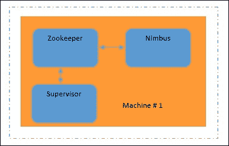
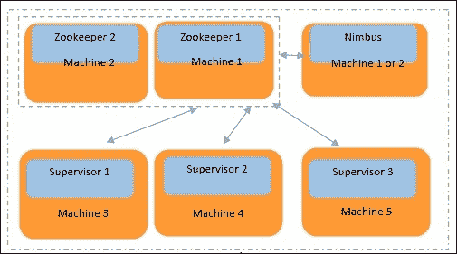

# 第一章. 熟悉 Storm

在本章中，你将熟悉以下主题：

+   Storm 概述

+   “Storm 之前”的时代和 Storm 的关键特性

+   Storm 集群模式

+   Storm 安装

+   启动各种守护进程

+   玩转 Storm 配置

在本章的整个过程中，你将了解为什么 Storm 在业界引起了轰动，以及为什么它在当今场景中是相关的。什么是实时计算？我们还将解释 Storm 的不同集群模式、安装和配置方法。

# Storm 概述

Storm 是一个分布式、容错且高度可扩展的平台，用于实时处理流数据。它在 2014 年 9 月成为 Apache 顶级项目，之前自 2013 年 9 月起一直是 Apache 孵化器项目。

在大规模上实时处理已成为企业的需求。Apache Storm 提供了实时处理数据（即元组或流）的能力，这些数据（元组或流）在到达时即可处理，具有分布式计算选项。能够向 Storm 集群添加更多机器使 Storm 可扩展。然后，随着 Storm 而来的第三件最重要的事情是容错性。如果 Storm 程序（也称为拓扑）配备了可靠的 spout，它可以重新处理由于机器故障而丢失的失败元组，并提供容错性。它基于 XOR 魔法，将在第二章*Storm 解剖*中解释。

Storm 最初是由 Nathan Marz 及其团队在 BackType 创建的。该项目在被 Twitter 收购后开源。有趣的是，Storm 被标记为实时 Hadoop。

Storm 非常适合许多实时用例。以下是一些有趣的用例说明：

+   **ETL 管道**：ETL 代表**提取**、**转换**和**加载**。这是 Storm 非常常见的用例。数据可以从任何来源提取或读取。在这里，数据可以是复杂的 XML、JDBC 结果集行，或者仅仅是几个键值记录。数据（在 Storm 中也称为元组）可以即时地添加更多信息，转换为所需的存储格式，并存储在 NoSQL/RDBMS 数据存储中。所有这些都可以通过简单的 Storm 程序以非常高的吞吐量实时完成。使用 Storm ETL 管道，你可以高速地将数据导入大数据仓库。

+   **趋势话题分析**：Twitter 使用此类用例来了解在给定时间段或当前的趋势话题。有无数种用例，并且需要实时地找到最热门的趋势。Storm 非常适合此类用例。你还可以借助任何数据库执行值的运行聚合。

+   **监管检查引擎**：实时事件数据可以通过业务特定的监管算法进行传递，该算法可以实时执行合规性检查。银行使用这些工具进行实时交易数据检查。

Storm 理想地适用于任何需要快速且可靠地处理数据的用例，每秒处理超过 10,000 条消息，数据一到即可处理。实际上，10,000+ 是一个较小的数字。Twitter 能够在大型集群上每秒处理数百万条推文。这取决于 Storm 拓扑编写的好坏、调优程度以及集群大小。

Storm 程序（即拓扑）设计为全天候运行，除非有人明确停止它们，否则不会停止。

Storm 使用 Clojure 和 Java 编写。Clojure 是一种运行在 JVM 上的 Lisp 函数式编程语言，非常适合并发和并行编程。Storm 利用过去 10 年中构建的成熟 Java 库。所有这些都可以在 `storm`/`lib` 文件夹中找到。

## 在 Storm 时代之前

在 Storm 流行之前，实时或准实时处理问题是通过中间代理和消息队列的帮助解决的。监听器或工作进程使用 Python 或 Java 语言运行。对于并行处理，代码依赖于编程语言本身提供的线程模型。很多时候，旧的工作方式没有很好地利用 CPU 和内存。在某些情况下，也使用了大型机，但随着时间的推移，它们也变得过时了。分布式计算并不容易。在旧的工作方式中，要么有大量的中间输出，要么有多个跳跃。无法自动执行故障重放。Storm 非常好地解决了所有这些痛点。它是可用的最佳实时计算框架之一。

## Storm 的关键特性

这里是 Storm 的关键特性；它们解决了上述问题：

+   **易于编程**：学习 Storm 框架很容易。你可以使用你选择的编程语言编写代码，也可以使用该编程语言的现有库。没有任何妥协。

+   **Storm 已经支持大多数编程语言**：然而，即使某些语言不受支持，也可以通过提供代码和配置，使用在 Storm **数据规范语言**（**DSL**）中定义的 JSON 协议来实现。

+   **水平扩展或分布式计算是可能的**：通过向 Storm 集群添加更多机器来增加计算能力，而无需停止正在运行的程序，也称为拓扑。

+   **容错性**: Storm 管理工作节点和机器级别的故障。每个进程的心跳被跟踪以管理不同类型的故障，例如一台机器上的任务故障或整个机器的故障。

+   **保证消息处理**：在 Storm 进程中，对消息（元组）进行自动和显式 ACK 有相应的机制。如果没有收到 ACK，Storm 可以对消息进行回复。

+   **免费、开源，并且拥有大量的开源社区支持**：作为 Apache 项目，Storm 具有免费分发和修改的权利，无需担心法律方面的问题。Storm 受到了开源社区的广泛关注，并吸引了许多优秀的开发者为其代码贡献力量。

## Storm 集群模式

根据需求，Storm 集群可以设置为四种模式。如果你想搭建一个大型集群，可以选择分布式安装。如果你想学习 Storm，那么可以选择单机安装。如果你想连接到现有的 Storm 集群，请使用客户端模式。最后，如果你想在一个 IDE 上进行开发，只需解压`storm` TAR 文件，并指向`storm`库的所有依赖项。在初始学习阶段，单机 Storm 安装实际上是你所需要的。

### 开发者模式

开发者可以从分发站点下载 Storm，将其解压到`$HOME`目录下的某个位置，并以本地模式提交 Storm 拓扑。一旦拓扑在本地成功测试，就可以提交到集群上运行。

### 单机 Storm 集群

这种模式最适合学生和中等规模的计算。在这里，包括**Zookeeper**、**Nimbus**和**Supervisor**在内的所有操作都在单台机器上运行。使用`Storm/bin`目录下的所有命令。此外，不需要额外的 Storm 客户端。你可以在同一台机器上完成所有操作。以下图示很好地展示了这种情况：



### 多机 Storm 集群

当你有大规模计算需求时，这个选项是必需的。这是一个水平扩展选项。以下图详细解释了这种情况。在这个图中，我们有五台物理机器，为了提高系统的容错性，我们在两台机器上运行 Zookeeper。如图所示，**机器 1**和**机器 2**是一组 Zookeeper 机器；在任何时候，其中一台是领导者，当它死亡时，另一台成为领导者。**Nimbus**是一个轻量级进程，因此它可以在机器 1 或机器 2 上运行。我们还有**机器 3**、**机器 4**和**机器 5**专门用于执行实际处理。这些机器（3、4 和 5）都需要一个 supervisor 守护进程来运行。机器 3、4 和 5 应该知道 Nimbus/Zookeeper 守护进程在哪里运行，并且这个条目应该出现在它们的`storm.yaml`文件中。



因此，每台物理机器（3、4 和 5）运行一个监督守护进程，每台机器的 `storm.yaml` 文件指向运行 Nimbus 的机器的 IP 地址（这可以是 1 或 2）。所有监督机器都必须将 Zookeeper IP 地址（1 和 2）添加到 `storm.yaml` 文件中。Storm UI 守护进程应该在 Nimbus 机器上运行（这可以是 1 或 2）。

### Storm 客户端

当你有一个多机 Storm 集群时，才需要 Storm 客户端。要启动客户端，解压 Storm 发行版并将 Nimbus IP 地址添加到 `storm.yaml` 文件中。Storm 客户端可以用于从命令行选项提交 Storm 拓扑并检查运行拓扑的状态。Storm 版本低于 0.9 的应该将 `yaml` 文件放在 `$STORM_HOME/.storm/storm.yaml` 内（对于新版本不是必需的）。

### 注意

`jps` 命令是一个非常有用的 Unix 命令，用于查看 Zookeeper、Nimbus 和 Supervisor 的 Java 进程 ID。`kill -9 <pid>` 选项可以停止正在运行的过程。`jps` 命令只有在 `JAVA_HOME` 设置在 `PATH` 环境变量中时才会工作。

## Storm 安装的先决条件

安装 Java 和 Python 很简单。假设我们的 Linux 机器已经安装了 Java 和 Python：

+   一台 Linux 机器（Storm 版本 0.9 及以后的版本也可以在 Windows 机器上运行）

+   Java 6 (`set export PATH=$PATH:$JAVA_HOME/bin`)

+   Python 2.6（运行 Storm 守护进程和管理命令所必需）

我们将对 storm 配置文件（即 `storm.yaml`）进行很多修改，该文件实际上位于 `$STORM_HOME/config` 下。首先，我们启动 Zookeeper 进程，该进程执行 Nimbus 和监督者之间的协调。然后，我们启动 Nimbus 主守护进程，该守护进程在 Storm 集群中分发代码。接下来，监督守护进程监听分配给其运行的节点的工作（由 Nimbus 分配），并根据需要启动和停止工作进程。

ZeroMQ/JZMQ 和 Netty 是 JVM 间通信库，允许两台机器或两个 JVM 之间相互发送和接收进程数据（元组）。JZMQ 是 ZeroMQ 的 Java 绑定。Storm（0.9+）的最新版本已经迁移到 Netty。如果你下载了 Storm 的旧版本，则需要安装 ZeroMQ 和 JZMQ。在这本书中，我们将只考虑 Storm 的最新版本，因此你实际上不需要 ZeroMQ/JZMQ。

### Zookeeper 安装

Zookeeper 是 Storm 集群的协调器。Nimbus 和工作节点之间的交互是通过 Zookeeper 完成的。Zookeeper 的安装过程在官方网站上解释得非常详细，请参阅[`zookeeper.apache.org/doc/trunk/zookeeperStarted.html#sc_InstallingSingleMode`](http://zookeeper.apache.org/doc/trunk/zookeeperStarted.html#sc_InstallingSingleMode)。

设置可以从以下链接下载：

[`archive.apache.org/dist/zookeeper/zookeeper-3.3.5/zookeeper-3.3.5.tar.gz`](https://archive.apache.org/dist/zookeeper/zookeeper-3.3.5/zookeeper-3.3.5.tar.gz)。下载后，编辑 `zoo.cfg` 文件。

以下是用到的 Zookeeper 命令：

+   启动 `zookeeper` 进程：

    ```py
    ../zookeeper/bin/./zkServer.sh start
    ```

+   检查 `zookeeper` 服务的运行状态：

    ```py
    ../zookeeper/bin/./zkServer.sh status
    ```

+   停止 `zookeeper` 服务：

    ```py
    ../zookeeper/bin/./zkServer.sh stop
    ```

或者，使用 `jps` 查找 `<pid>`，然后使用 `kill -9 <pid>` 杀死进程。

# Storm 安装

Storm 可以通过以下两种方式之一进行安装：

1.  使用 Git 从此位置获取 Storm 发布版：

    +   [`github.com/nathanmarz/storm.git`](https://github.com/nathanmarz/storm.git)

1.  直接从以下链接下载：[`storm.apache.org/downloads.html`](https://storm.apache.org/downloads.html)

Storm 配置可以通过 `storm.yaml` 完成，该文件位于 `conf` 文件夹中。

以下是一个单机 Storm 集群安装的配置。

端口 `# 2181` 是 Zookeeper 的默认端口。要添加多个 `zookeeper`，请保持条目之间用空格分隔：

```py
storm.zookeeper.servers:
 - "localhost"

# you must change 2181 to another value if zookeeper running on another port.
storm.zookeeper.port: 2181
# In single machine mode nimbus run locally so we are keeping it localhost.
# In distributed mode change localhost to machine name where nimbus daemon is running.
nimbus.host: "localhost"
# Here storm will generate logs of workers, nimbus and supervisor.
storm.local.dir: "/var/stormtmp"
java.library.path: "/usr/local/lib"
# Allocating 4 ports for workers. More numbers can also be added.
supervisor.slots.ports:
 - 6700
 - 6701
 - 6702
 - 6703
# Memory is allocated to each worker. In below case we are allocating 768 mb per worker.worker.childopts: "-Xmx768m"
# Memory to nimbus daemon- Here we are giving 512 mb to nimbus.
nimbus.childopts: "-Xmx512m"
# Memory to supervisor daemon- Here we are giving 256 mb to supervisor.
```

### 注意

注意 `supervisor.childopts: "-Xmx256m"`。在此设置中，我们预留了四个 supervisor 端口，这意味着最多有四个工作进程可以在此机器上运行。

`storm.local.dir`：如果启动 Nimbus 和 Supervisor 时出现问题，应清理此目录位置。在 Windows 机器上在本地 IDE 上运行拓扑时，应清理 `C:\Users\<用户名>\AppData\Local\Temp`。

## 启用本地（仅 Netty）依赖项

Netty 允许 JVM 之间的通信，并且使用起来非常简单。

### Netty 配置

您实际上不需要为 Netty 安装任何额外的软件。这是因为它是一个基于纯 Java 的通信库。所有新的 Storm 版本都支持 Netty。

将以下行添加到您的 `storm.yaml` 文件中。根据您的使用情况配置和调整这些值：

```py
storm.messaging.transport: "backtype.storm.messaging.netty.Context"
storm.messaging.netty.server_worker_threads: 1
storm.messaging.netty.client_worker_threads: 1
storm.messaging.netty.buffer_size: 5242880
storm.messaging.netty.max_retries: 100
storm.messaging.netty.max_wait_ms: 1000
storm.messaging.netty.min_wait_ms: 100
```

### 启动守护进程

Storm 守护进程是在您将程序提交到集群之前需要预先运行的进程。当您在本地 IDE 上运行拓扑程序时，这些守护进程会在预定义的端口上自动启动，但在集群中，它们必须始终运行：

1.  启动主守护进程 `nimbus`。转到 Storm 安装目录下的 `bin` 目录并执行以下命令（假设 `zookeeper` 正在运行）：

    ```py
     ./storm nimbus
     Alternatively, to run in the background, use the same command with nohup, like this:
     Run in background
     nohup ./storm nimbus &
    ```

1.  现在我们必须启动 `supervisor` 守护进程。转到 Storm 安装目录下的 `bin` 目录并执行以下命令：

    ```py
     ./storm supervisor
    ```

    要在后台运行，请使用以下命令：

    ```py
     nohup ./storm  supervisor &
    ```

    ### 注意

    如果 Nimbus 或 Supervisors 重新启动，正在运行的拓扑不受影响，因为它们都是无状态的。

1.  让我们启动 `storm` UI。Storm UI 是一个可选进程。它帮助我们查看正在运行的拓扑的 Storm 统计信息。您可以看到分配给特定拓扑的执行器和工人数。运行 storm UI 所需的命令如下：

    ```py
     ./storm ui
    ```

    或者，要在后台运行，请使用带有 `nohup` 的以下行：

    ```py
     nohup ./storm ui &
    ```

    要访问 Storm UI，请访问 `http://localhost:8080`。

1.  我们现在将启动 `storm logviewer`。Storm UI 是另一个可选进程，用于通过浏览器查看日志。您还可以使用 `$STORM_HOME/logs` 文件夹中的命令行选项查看 `storm` 日志。要启动日志查看器，请使用此命令：

    ```py
     ./storm logviewer
    ```

    要在后台运行，请使用以下带有 `nohup` 的行：

    ```py
     nohup ./storm logviewer &
    ```

    ### 注意

    要访问 Storm 的日志，请访问 `http://localhost:8000log viewer` 守护进程应在每台机器上运行。另一种访问 `<machine name>` 的 `6700` 工作端口日志的方法如下：

    ```py
    <Machine name>:8000/log?file=worker-6700.log
    ```

1.  DRPC 守护进程：DRPC 是另一个可选服务。**DRPC** 代表 **分布式远程过程调用**。如果您想通过 DRPC 客户端将参数外部提供给 Storm 拓扑，则需要 DRPC 守护进程。请注意，参数只能提供一次，并且 DRPC 客户端可以长时间等待 Storm 拓扑完成处理并返回。由于首先，它会对客户端造成阻塞，其次，您一次只能提供一个参数，因此 DRPC 并不是在项目中使用的一个流行选项。Python 和 Petrel 不支持 DRPC。

总结，启动进程的步骤如下：

1.  首先，所有的 Zookeeper 守护进程。

1.  Nimbus 守护进程。

1.  在一台或多台机器上的管理守护进程。

1.  运行在 Nimbus 上的 UI 守护进程（可选）。

1.  日志查看器守护进程（可选）。

1.  提交拓扑。

您可以随时重启 `nimbus` 守护进程，而不会对现有进程或拓扑造成任何影响。您也可以重启管理守护进程，并且可以随时向 Storm 集群添加更多管理节点。

要将 `jar` 提交给 Storm 集群，请转到 Storm 安装目录的 `bin` 目录并执行以下命令：

```py
./storm jar <path-to-topology-jar> <class-with-the-main> <arg1> … <argN>
```

## 玩转可选配置

所有之前的设置都是启动集群所必需的，但还有许多其他设置是可选的，可以根据拓扑的需求进行调整。前缀可以帮助找到配置的性质。完整的默认 `yaml` 配置列表可在 [`github.com/apache/storm/blob/master/conf/defaults.yaml`](https://github.com/apache/storm/blob/master/conf/defaults.yaml) 找到。

配置可以通过其前缀来识别。例如，所有 UI 配置都以 `ui*` 开头。

| 配置的性质 | 查找前缀 |
| --- | --- |
| 一般 | `storm.*` |
| Nimbus | `nimbus.*` |
| UI | `ui.*` |
| 日志查看器 | `logviewer.*` |
| DRPC | `drpc.*` |
| 管理器 | `supervisor.*` |
| 拓扑 | `topology.*` |

所有这些可选配置都可以添加到 `STORM_HOME/conf/storm.yaml` 中，以更改除默认值之外的所有设置。所有以 `topology.*` 开头的设置既可以从拓扑中程序化设置，也可以从 `storm.yaml` 中设置。所有其他设置只能从 `storm.yaml` 文件中设置。例如，以下表格显示了三种不同的参数设置方式。然而，这三种方式都做了同样的事情：

| /conf/storm.yaml | 拓扑构建器 | 自定义 yaml |
| --- | --- | --- |
| 更改 `storm.yaml`(影响集群中所有拓扑) | 在编写代码时更改拓扑构建器(仅影响当前拓扑) | 将 `topology.yaml` 作为命令行选项提供(仅影响当前拓扑) |
| `topology.workers: 1` | `conf.setNumberOfWorker(1);` 这是通过 Python 代码提供的 | 创建包含类似 `storm.yaml` 的条目的 `topology.yaml`，并在运行拓扑时提供它 Python:`petrel submit --config topology.yaml` |

在 `storm.yaml` 中的任何配置更改都将影响所有正在运行拓扑，但当你使用代码中的 `conf.setXXX` 选项时，不同的拓扑可以覆盖该选项，最适合它们的是哪个。

# 摘要

这里是第一章的结论。本章概述了在 Storm 出现之前应用程序是如何开发的。随着我们阅读本章并接近结论，我们也获得了对实时计算是什么以及 Storm 作为一个编程框架为何如此受欢迎的简要了解。本章教会了你如何执行 Storm 配置。它还提供了关于 Storm 守护进程、Storm 集群及其升级的详细信息。在下一章中，我们将探讨 Storm 结构的细节。
