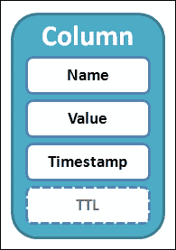
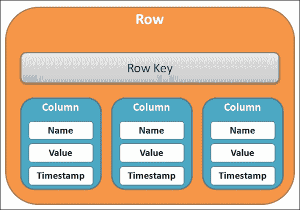
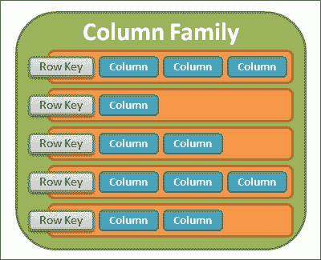
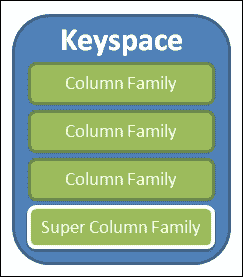
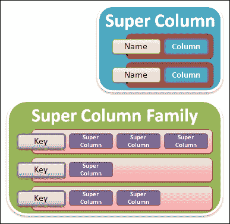
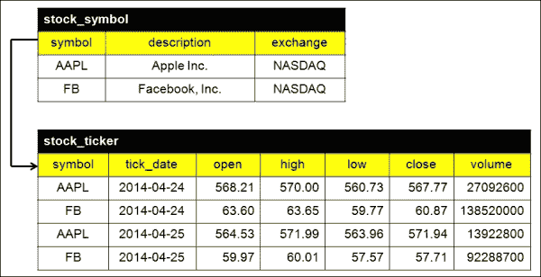
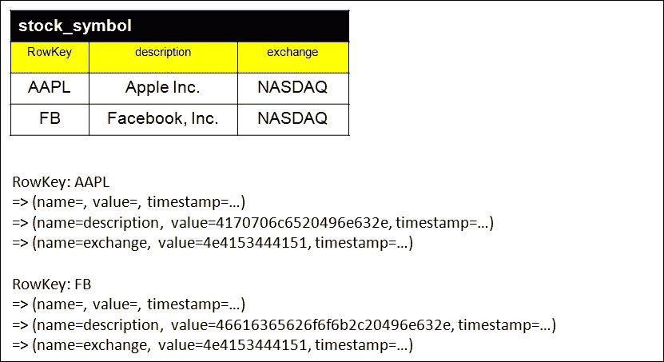
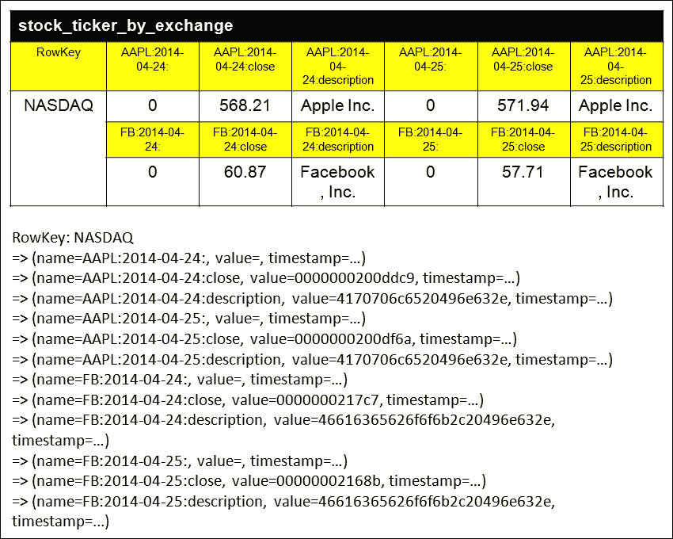
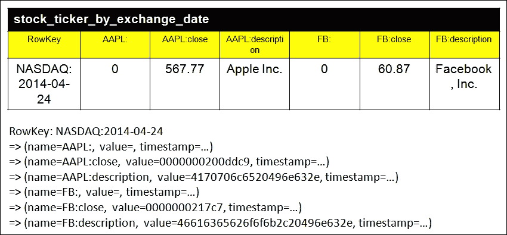

# 第二章：Cassandra 数据建模

在本章中，我们将打开通往 Cassandra 数据建模世界的大门。我们将简要介绍其构建模块，与关系数据模型的主要区别，以及如何在 Cassandra 数据模型上构建查询的示例。

Cassandra 通过使用从其 Google BigTable 父级继承的术语来描述其数据模型组件，例如列族、列、行等。其中一些术语也存在于关系型数据模型中。然而，它们的含义却完全不同。这常常会让有关系型背景的开发人员和管理员感到困惑。乍一看，Cassandra 数据模型似乎反直觉，非常难以把握和理解。

在关系型世界中，你通过创建实体并根据关系理论指导下的指南将它们关联起来来建模数据。这意味着你可以只关注数据的逻辑视图或结构，而不必考虑应用程序如何访问和操作数据。目标是拥有一个符合关系型指导原则的稳定数据模型。应用程序的设计可以单独完成。例如，你可以通过构建不同的 SQL 语句来回答不同的查询，这在数据建模过程中并不需要你关心。简而言之，关系型数据建模是面向过程的，基于明确的关注点分离。

相反，在 Cassandra 中，你将上述步骤颠倒过来，始终从你想要在应用程序的查询中回答的问题开始。查询对底层数据模型产生了相当大的影响。你还需要考虑物理存储和集群拓扑。因此，查询和数据模型是孪生兄弟，因为它们是同时诞生的。Cassandra 数据建模是基于对查询在 Cassandra 内部如何工作的清晰理解的结果导向型。

由于 Cassandra 独特的架构，关系型数据库中的许多简单事物，如序列和排序，不能假设。它们在实现时需要你特别处理。此外，它们通常是你在数据建模过程中需要提前做出的设计决策。这可能是在获得卓越的可伸缩性、性能和容错能力的过程中所付出的代价。

为了享受阅读这本书，建议你暂时以关系型和 NoSQL 两种方式思考。尽管你可能不会成为 Cassandra 的朋友，但你将会有一个令人耳目一新的体验，意识到世界上存在不同的工作方式。

# Cassandra 数据模型有什么独特之处？

如果让我用一句话来描述 Cassandra 的数据模型，我会说它是一个非关系型数据模型，仅此而已。这意味着你需要忘记你在关系型数据库中进行数据建模的方式。

你需要根据关系理论来建模数据。然而，在 Cassandra 以及其他 NoSQL 数据库中，除了数据本身之外，你还需要关注应用。这意味着你需要考虑在应用中如何查询数据。对于那些来自关系世界的人来说，这是一个范式转变。接下来的章节中会给出示例，以确保你理解为什么不能将关系理论应用于 Cassandra 中的数据建模。

在 Cassandra 数据建模中，另一个重要的考虑因素是你需要考虑 Cassandra 集群的物理拓扑。在关系型数据库中，主要目标是通过对数据进行规范化来消除数据冗余，以有一个单一的数据源。这使得关系型数据库很容易实现 ACID 一致性。相关的存储空间需求也得到了优化。相反，Cassandra 是设计用于在难以实现 ACID 一致性和必须进行复制的海量规模分布式环境中工作。你必须意识到在 Cassandra 数据建模过程中这些差异。

## Map 和 SortedMap

在 第一章 中，你学习了 Cassandra 的存储模型是基于 BigTable，一个列式存储。列式存储是一个多维映射。具体来说，它是一个称为 **Map** 的数据结构。以下是一个声明 Map 数据结构的示例：

```py
Map<RowKey, SortedMap<ColumnKey, ColumnValue>>
```

`Map` 数据结构提供了高效的关键字查找，并且其排序特性提供了高效的扫描。`RowKey` 是一个唯一键，可以存储一个值。内部的 `SortedMap` 数据结构允许存储可变数量的 `ColumnKey` 值。这是 Cassandra 使用以实现无模式并且允许数据模型随时间自然演化的技巧。需要注意的是，每个列都有一个客户端提供的时间戳与之关联，但在数据建模过程中可以忽略。Cassandra 在内部使用时间戳来解决事务冲突。

在关系型数据库中，列名只能是字符串，并存储在表元数据中。在 Cassandra 中，`RowKey` 和 `ColumnKey` 都可以是字符串、长整数、通用唯一标识符或任何类型的字节数组。此外，`ColumnKey` 存储在每个列中。你可能认为反复存储 `ColumnKey` 值会浪费存储空间。然而，这为 Cassandra 带来了一个非常强大的特性。`RowKey` 和 `ColumnKey` 可以存储数据，而不仅仅是 `ColumnValue`。我们目前不会深入探讨这一点；我们将在后面的章节中重新讨论。

### 注意

**通用唯一标识符**

**通用唯一标识符（UUID**）是**互联网工程任务组（IETF**）标准，**请求评论（RFC**）4122，旨在使分布式系统能够在不进行重大中央协调的情况下唯一标识信息。它是一个由 32 个小写十六进制数字表示的 128 位数字，以五组由连字符分隔的形式显示，例如：`0a317b38-53bf-4cad-a2c9-4c5b8e7806a2`

## 逻辑数据结构

有几个逻辑构建块可以构建 Cassandra 数据模型。以下将逐一介绍它们。

### 列

列是 Cassandra 中最小的数据模型元素和存储单元。尽管它也存在于关系型数据库中，但在 Cassandra 中是不同的事物。如图所示，列是一个具有戳记和可选的**生存时间（Time-To-Live，TTL**）值的名称-值对：



列的元素

名称和值（在`SortedMap`中分别为`ColumnKey`和`ColumnValue`）是字节数组，Cassandra 提供了一组内置数据类型，这些数据类型会影响值的排序顺序。这里的戳记用于冲突解决，并在写入操作期间由客户端应用程序提供。生存时间（Time-To-Live）是一个可选的过期值，用于标记在过期后删除的列。然后，在压缩过程中物理删除该列。

### 行

上一个级别是行，如图所示。它是一组具有唯一行键的可排序列，也称为主键：



行的结构

行键可以是与列相同的任何内置数据类型。可排序的意思是列按其列名排序存储。

### 注意

排序顺序非常重要，因为 Cassandra 不能像我们在关系型数据库中那样按值排序。

不同行中的列可能有不同的名称。这就是为什么 Cassandra 既是行导向又是列导向。应该指出的是，行没有戳记。此外，行不能分割以存储在集群的两个节点之间。这意味着如果行存在于一个节点上，整个行都存在于该节点上。

### 列族

上一个级别是列族。如图所示，它是一个具有名称的行集合的容器：



列族的结构

列族中的行键必须是唯一的，并用于排序。列族在关系型数据库中类似于表，但你不应该过分依赖这个想法。列族通过允许不同行中的不同列提供了更大的灵活性。任何列都可以在任何时候自由添加到任何列族中。再次强调，这有助于 Cassandra 的无模式性。

列族中的列按比较器排序。比较器决定了 Cassandra 在查询中返回列时的排序和顺序。它接受列名的数据类型为长整型、字节和 UTF8，以及列在行内存储的排序顺序。

物理上，列族存储在磁盘上的单个文件中。因此，保持相关列在同一个列族中对于节省磁盘 I/O 和提高性能很重要。

### 键空间

如下所示图所示，最外层数据模型元素是键空间：



键空间的结构

键空间是一组列族和超列族，将在下一节中介绍。它在关系世界中类似于模式或数据库。每个 Cassandra 实例都有一个系统键空间来存储系统级元数据。

键空间包含复制设置，控制数据在集群中的分布和复制方式。通常，一个集群中只有一个键空间。

### 超列和超列族

如下所示图所示，超列是一组列的命名映射，而超列族只是超列的集合：



超列和超列族的结构

超列在 Cassandra 的早期版本中很受欢迎，但不再推荐使用，因为它们不受 Cassandra 查询语言（CQL），一种类似于 SQL 的语言来操作和查询 Cassandra 的支持，并且必须通过使用低级的 Thrift API 来访问。在大多数情况下，一个列族就足够了。

### 注意

**Thrift**

Thrift 是一个用于开发可扩展跨语言服务的软件框架。它结合了一个软件栈和一个代码生成引擎来构建与多种编程语言高效且无缝工作的服务。它被用作 **远程过程调用** (**RPC**) 框架，并由 Facebook 公司开发。现在它是 Apache 软件基金会的一个开源项目。

还有其他替代方案，例如，Protocol Buffers、Avro、MessagePack、JSON 等等。

## 集合

Cassandra 允许集合，即集合、列表和映射，作为数据模型的一部分。集合是一种复杂类型，可以在查询中提供灵活性。

Cassandra 允许以下集合：

+   **集合**：这些提供了一种保持唯一值集的方法。这意味着可以轻松解决跟踪唯一值的问题。

+   **列表**：这些适合维护集合中值的顺序。列表按所选类型的自然顺序排序。

+   **映射**：这些类似于键值对的存储。它们对于在单行内存储类似表的数据很有用。它们可以作为一种在没有连接的情况下存储数据的解决方案。

在这里，我们只提供了一个简要的介绍，我们将在后续章节中重新讨论集合。

## 没有外键

外键在关系数据库中用于维护引用完整性，这定义了两个表之间的关系。它们用于在关系数据模型中强制关系，以便不同但相关的表中的数据可以连接起来以回答查询。Cassandra 没有引用完整性的概念，因此不允许连接。

## 无连接

外键和连接是关系数据模型中规范化的产物。Cassandra 既没有外键也没有连接。相反，它鼓励并在此数据模型去规范化时表现最佳。

事实上，在关系型世界中，去规范化并非完全被禁止，例如，建立在关系数据库之上的数据仓库。在实践中，去规范化是解决高度复杂的关系型查询性能不佳的问题的一种解决方案，这些查询涉及大量表连接。

### 注意

在 Cassandra 中，去规范化是正常的。

通过适当的数据建模，可以在 Cassandra 中避免外键和连接。

## 无序列

在关系数据库中，序列通常用于为代理键生成唯一值。Cassandra 没有序列，因为它在点对点分布式系统中实现起来极其困难。然而，有一些解决方案，如下所述：

+   使用部分数据生成唯一键

+   使用 UUID

在大多数情况下，最佳实践是选择第二个解决方案。

## 计数器

计数列是一个特殊列，用于存储持续计数的数值。计数可以是增加或减少，且不需要时间戳。

计数列不应用于生成代理键。它只是设计用来存储适合分布式计数的分布式计数器。同时请注意，更新计数器不是幂等的。

### 注意

**幂等（Idempotent**）

幂等最初是数学中的一个术语。但在计算机科学中，幂等被更广泛地用来描述一个操作，如果执行一次或多次，将产生相同的结果。

## 存活时间（Time-To-Live）

**存活时间（TTL**）仅在列上设置。单位是秒。当在列上设置时，它将自动递减，然后在服务器端自动过期，无需客户端应用程序的任何干预。

典型用例包括生成安全令牌和一次性令牌、自动清除过时的列等。

## 二级索引

需要记住的一个重要事项是，Cassandra 中的二级索引与关系数据库中的二级索引并不相同。Cassandra 中的二级索引可以创建来查询不是主键部分的列。一个列族可以拥有多个二级索引。在幕后，它被实现为一个由 Cassandra 内部进程自动维护的独立隐藏表。

二级索引不支持集合，并且不能创建在主键本身上。主键和二级索引之间的主要区别在于，前者是一个分布式索引，而后者是一个本地索引。主键用于确定节点位置，因此对于给定的行键，其节点位置可以立即找到。然而，二级索引仅用于在本地节点上索引数据，并且可能无法立即知道所有匹配行的位置，除非检查了集群中的所有节点。因此，性能是不可预测的。

在后续章节中，我们将提供有关二级索引的更多信息。

# 查询建模

在上一节中，我们获得了关于关系型数据库和 Cassandra 之间差异的基本理解。最重要的差异是，关系型数据库通过关系来建模数据，而 Cassandra 通过查询来建模数据。现在让我们从一个简单的例子开始，看看查询建模意味着什么。

## 关系版本

下图显示了股票报价应用的简单关系数据模型：



股票报价应用的关系数据模型（来源：Yahoo! Finance）

`stock_symbol`表是一个实体，代表股票主信息，如股票的符号、股票的描述以及股票交易的交易所。`stock_ticker`表是另一个实体，存储股票在交易日的开盘价、最高价、最低价、收盘价和成交量的价格。显然，这两个表基于`symbol`列存在关系。这是一个众所周知的一对多关系。

下面的两个表是**数据定义语言**（**DDL**）：

```py
CREATE TABLE stock_symbol (
symbol varchar PRIMARY KEY,
description varchar,
exchange varchar
);

CREATE TABLE stock_ticker (
symbol varchar references stock_symbol(symbol),
tick_date varchar,
open decimal,
high decimal,
low decimal,
close decimal,
volume bigint,
PRIMARY KEY (symbol, tick_date)
);
```

考虑以下三种情况：首先，我们想要列出所有交易所中所有股票及其描述。这个 SQL 查询非常简单：

```py
// Query A
SELECT symbol, description, exchange
FROM stock_symbol;
```

第二，如果我们想知道纳斯达克交易所上市的所有股票的每日收盘价和描述，我们可以编写以下 SQL 查询：

```py
// Query B
SELECT stock_symbol.symbol, stock_symbol.description,
stock_ticker.tick_date, stock_ticker.close
FROM stock_symbol, stock_ticker
WHERE stock_symbol.symbol = stock_ticker.symbol
AND stock_symbol.exchange = ''NASDAQ'';
```

此外，如果我们想知道 2014 年 4 月 24 日纳斯达克交易所上市的所有股票的每日收盘价和描述，我们可以使用以下 SQL 查询：

```py
// Query C
SELECT stock_symbol.symbol, stock_symbol.description,
stock_ticker.tick_date, stock_ticker.open,
stock_ticker.high, stock_ticker.low, stock_ticker_close,
stock_ticker.volume
FROM stock_symbol, stock_ticker
WHERE stock_symbol.symbol = stock_ticker.symbol
AND stock_symbol.exchange = ''NASDAQ''
AND stock_ticker.tick_date = ''2014-04-24'';
```

依靠关系数据模型，我们可以简单地编写不同的 SQL 查询来返回不同的结果，而无需对底层数据模型进行任何更改。

## Cassandra 版本

现在，让我们转向 Cassandra。上一节中的 DDL 语句可以稍作修改，以在 Cassandra 中创建列族，或表，如下所示：

```py
CREATE TABLE stock_symbol (
symbol varchar PRIMARY KEY,
description varchar,
exchange varchar
);

CREATE TABLE stock_ticker (
symbol varchar,
tick_date varchar,
open decimal,
high decimal,
low decimal,
close decimal,
volume bigint,
PRIMARY KEY (symbol, tick_date)
);
```

它们乍一看似乎是正确的。

对于`查询 A`，我们可以以完全相同的方式查询 Cassandra 的`stock_symbol`表：

```py
// Query A
SELECT symbol, description, exchange
FROM stock_symbol;
```

下图描述了`stock_symbol`表的逻辑和物理存储视图：



查询 A 的 Cassandra 数据模型

`stock_symbol`表的主键只涉及一个单独的列，`symbol`，它也用作列族的行键和分区键。我们可以将`stock_symbol`表视为前一小节中提到的排序映射数据结构：

```py
Map<RowKey, SortedMap<ColumnKey, ColumnValue>>
```

分配的值如下：

```py
RowKey=AAPL
ColumnKey=description
ColumnValue=Apple Inc.
ColumnKey=exchange
ColumnValue=NASDAQ
```

到目前为止，一切顺利，对吧？

然而，没有外键和连接，我们如何在 Cassandra 中获取`Query B`和`Query C`相同的查询结果？这确实突显了我们需要另一种方式来做。简短的答案是使用反规范化。

对于`Query B`，我们想要的是在纳斯达克交易所上市的股票的当日收盘价和描述。涉及的列有`symbol`、`description`、`tick_date`、`close`和`exchange`。前四列很明显，但为什么我们需要`exchange`列呢？`exchange`列是作为查询的过滤器的必要条件。另一个含义是，`exchange`列必须是行键，或者至少是行键的一部分。

记住两个规则：

1.  行键被视为分区键以定位存储该行的节点。

1.  行不能跨越两个节点。

在由 Cassandra 支持的分布式系统中，我们应该尽可能减少不必要的网络流量。换句话说，查询需要与之交互的节点越少，数据模型的表现就越好。我们必须迎合集群拓扑以及数据模型的物理存储。

因此，我们应该为`Query B`创建一个类似于之前的列族：

```py
// Query B
CREATE TABLE stock_ticker_by_exchange (
exchange varchar,
symbol varchar,
description varchar,
tick_date varchar,
close decimal,
PRIMARY KEY (exchange, symbol, tick_date)
);
```

`stock_ticker_by_exchange`的逻辑和物理存储视图如下所示：



`Query B`的 Cassandra 数据模型

行键是`exchange`列。然而，这次，列键不再是`symbol`、`tick_date`、`close`和`description`。现在有 12 个列，包括`APPL:2014-04-24:`、`APPL:2014-04-24:close`、`APPL:2014-04-24:description`、`APPL:2014-04-25:`、`APPL:2014-04-25:close`、`APPL:2014-04-25:description`、`FB:2014-04-24:`、`FB:2014-04-24:close`、`FB:2014-04-24:description`、`FB:2014-04-25:`、`FB:2014-04-25:close`和`FB:2014-04-25:description`，分别。最重要的是，列键现在是动态的，并且能够在单行中存储数据。这种动态使用的行称为宽行，与包含`stock_symbol`表静态列的行相对——称为瘦行。

一个列族存储的是瘦行还是宽行，取决于主键是如何定义的。

### 注意

如果主键只包含一个列，则行是一个瘦行。

如果主键包含多个列，则称为复合主键，行就是一个宽行。

在任何情况下，主键定义中的第一列都是行键。

最后，我们来到了 `Query C`。同样，我们使用了反规范化。`Query C` 与 `Query B` 的不同之处在于在 2014 年 4 月 24 日添加了一个额外的日期过滤器。你可能认为可以重用 `stock_ticker_by_exchange` 表来处理 `Query C`。答案是错误的。为什么？线索是主键，它由三个列组成，分别是 `exchange`、`symbol` 和 `tick_date`。如果你仔细观察 `stock_ticker_by_exchange` 表的列键，你会发现由于 `symbol` 和 `tick_date` 列的存在，列键是动态的。因此，Cassandra 是否能够在不知道你确切想要哪些符号的情况下确定列键？否定。

为 `Query C` 选择合适的列族应类似于以下代码：

```py
// Query C
CREATE TABLE stock_ticker_by_exchange_date (
exchange varchar,
symbol varchar,
description varchar,
tick_date varchar,
close decimal,
PRIMARY KEY ((exchange, tick_date), symbol)
);
```

这次你应该注意主键的定义了。有趣的是，`exchange` 和 `tick_date` 列还有一个额外的括号。让我们看看 `stock_ticker_by_exchange_date` 的逻辑和物理存储视图，如图所示：



`Query C` 的 Cassandra 数据模型

你应该注意这里的列键数量。它只有六个，而不是 `stock_ticker_by_exchange` 的 `12` 个。列键仍然是根据 `symbol` 列动态的，但行键现在是 `NASDAQ:2014-04-24`，而不是 `Query B` 中的仅仅 `NASDAQ`。你还记得之前提到的额外一对括号吗？如果你以这种方式定义主键，你打算使用多个列作为行键和分区键。这被称为复合分区键。目前，你只需要知道这个术语即可。更多信息将在后面的章节中给出。

到目前为止，你可能已经感到头晕目眩，尤其是对于那些在关系数据模型方面有多年经验的人。我也发现 Cassandra 数据模型在第一次接触时非常难以理解。然而，你应该意识到关系数据模型和 Cassandra 数据模型之间的细微差别。你必须非常小心地处理你的查询。查询始终是设计 Cassandra 数据模型的起点。作为一个类比，查询是一个问题，数据模型是答案。你只是使用数据模型来回答查询。这正是查询建模的含义。

# 数据建模考虑因素

除了查询建模之外，在设计 Cassandra 数据模型时，我们还需要牢记一些重要的要点。我们还可以考虑一些在本节中将要介绍的良好模式。

## 数据重复

在关系型数据模型中，去规范化是一个邪恶，但在 Cassandra 中不是。事实上，这是一个好习惯。这仅仅是因为 Cassandra 不使用高端磁盘存储子系统。Cassandra 喜欢商品级硬盘驱动器，因此磁盘空间便宜。由于去规范化导致的数据重复绝对不再是问题；Cassandra 欢迎它。

## 排序

在关系型数据库中，可以使用 SQL 查询中的`ORDER BY`子句轻松控制排序。或者，可以创建一个二级索引来进一步加快排序操作。

然而，在 Cassandra 中，排序是按设计进行的，因为在创建列族时必须确定如何比较数据。列族的比较器决定了读取时行是如何排序的。此外，列按其列名排序，也是通过比较器来排序的。

## 宽行

使用宽行进行排序、分组和高效过滤是很常见的。此外，还可以使用瘦行。你只需要考虑行包含的列数。

值得注意的是，对于存储瘦行的列族，列键会在每个列中重复存储。尽管这会浪费一些存储空间，但在廉价的商品硬盘上并不是问题。

## 桶分区

尽管宽行可以容纳高达 20 亿个变量列，但这仍然是一个硬限制，无法阻止大量数据填满一个节点。为了突破 20 亿列的限制，我们可以使用一种称为桶分区的折衷技术来跨多个节点拆分数据。

桶分区需要客户端应用程序生成一个桶 ID，这通常是一个随机数。通过将桶 ID 包含在复合分区键中，可以将数据段拆分并分布到不同的节点。然而，不应滥用此方法。将数据拆分到多个节点会导致读取操作消耗额外的资源来合并和重新排序数据。因此，这是一个昂贵的操作，并且不是一个理想的方法，因此应该只作为最后的手段。

## 无值列

列键可以存储值，如*通过查询建模*部分所示。在 Cassandra 中不存在“非空”概念，因此列值可以存储空值而不会出现任何问题。简单地将数据存储在列键中，而将空值留在列中，这种称为无值列的做法有时是故意为之。这是 Cassandra 中的一种常见做法。

无值列的一个动机是 Cassandra 的按列键排序功能。尽管如此，也有一些限制和注意事项。列键的最大大小为 64 KB，而列值的最大大小为 2 GB。因此，列键的空间是有限的。此外，仅使用时间戳作为列键可能会导致时间戳冲突。

## 时间序列数据

什么是时序数据？它是指任何基于时间变化的变量，例如处理器利用率、传感器数据、点击流和股票行情。之前介绍的股票报价数据模型就是一个例子。Cassandra 非常适合存储时序数据。为什么？因为一行可以容纳多达 20 亿个变量列。它是在存储模型基础上的单一布局。因此，Cassandra 可以以极快的速度处理大量时序数据。TTL（Time To Live）是另一个简化数据管理的优秀特性。

在本书的后半部分，将开发一个完整的股票报价技术分析应用，以进一步解释使用 Cassandra 处理时序数据的细节。

# Cassandra 查询语言

其他作者通常从 CQL（Cassandra Query Language）开始介绍 Cassandra 数据模型。在本章中，我采用了一种不同的方法。我试图在我们对 Cassandra 如何处理其物理存储有一个明确理解之前，避免对 CQL 进行过于深入的探讨。

CQL 的语法设计得非常类似于 SQL。这种意图对于习惯在关系型世界中编写 SQL 语句的人来说是好的，以便迁移到 Cassandra。然而，由于 CQL 和 SQL 之间的高度相似性，如果我们使用 CQL 来解释如何在 Cassandra 中建模数据，那么抛弃关系型思维模式就更加困难。这最终可能会导致更多的混淆。我更喜欢从微观角度观察数据模型与物理存储之间的关系的方法。通过这样做，你可以更快地抓住关键点，更清楚地理解其内部工作机制。CQL 将在下一章中详细介绍。

# 摘要

在本章中，我们了解了 Cassandra 数据模型的基础知识，现在我们对列、行、列族、键空间、计数器和其他相关术语都很熟悉。还给出了关系数据模型和 Cassandra 数据模型之间主要差异的比较，以解释一开始看起来可能令人震惊和反直觉的查询建模概念。然后介绍了一些关于数据建模和典型使用模式的重要考虑因素。最后，解释了为什么故意推迟引入 CQL。

本章只是关于 Cassandra 数据建模的第一部分。在下一章中，我们将继续游览的第二部分，即 Cassandra 查询语言。
