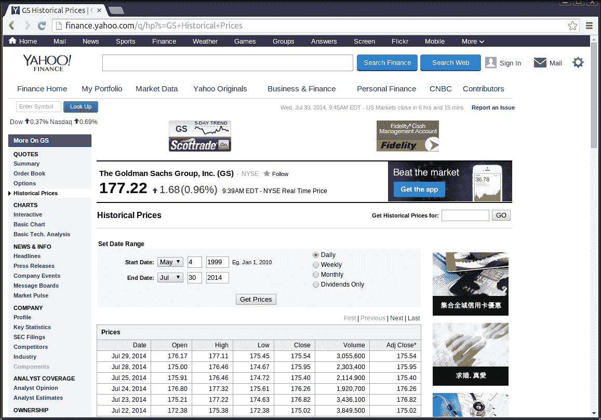
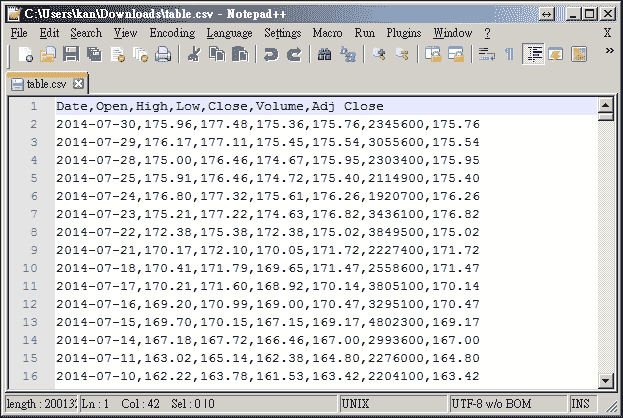
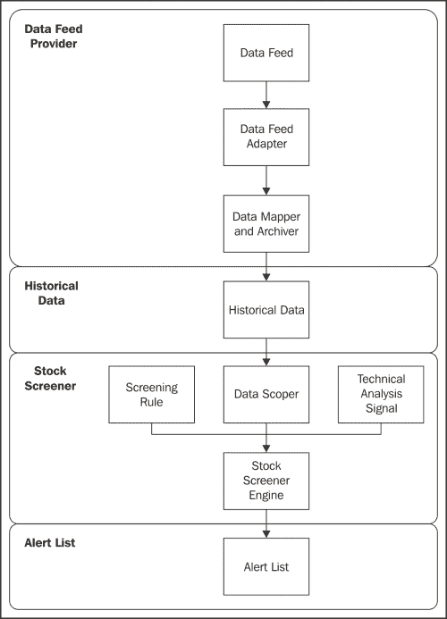
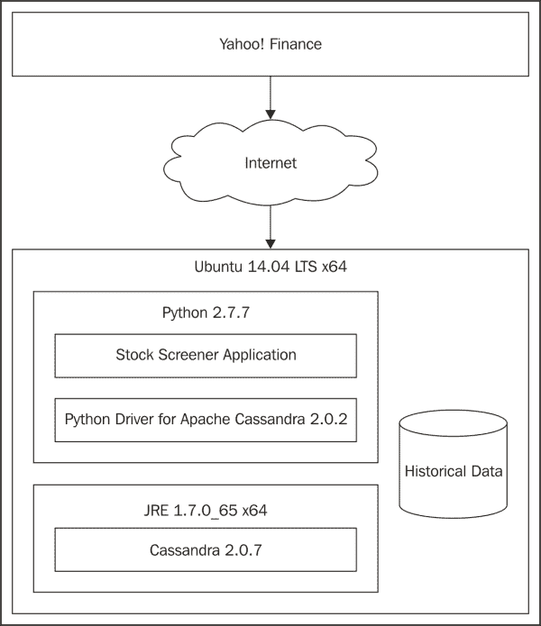
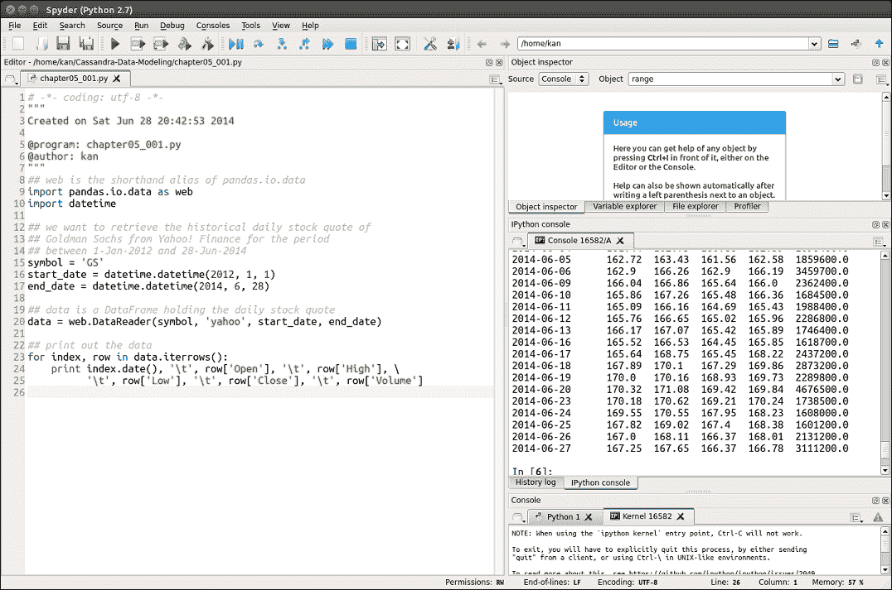
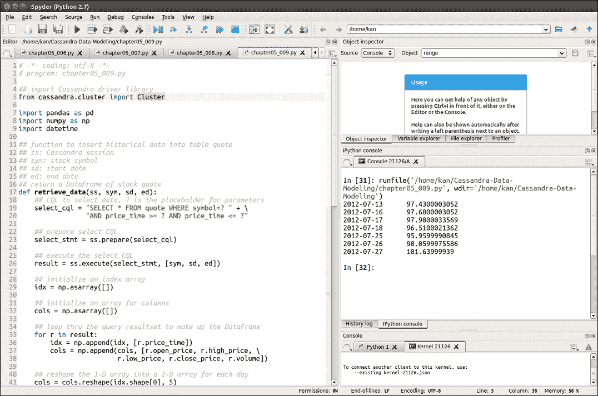

# 第五章. 初步设计和实现

基于前几章中解释的 Cassandra 数据模型组件，现在是时候将它们应用到实际的工作应用中了。我们将开始定义在数据模型中真正想要存储和查询的内容，设置环境，编写程序代码，并最终测试应用。

要构建的应用是一个股票筛选器应用，它将历史股票报价存储在 Cassandra 数据库中，用于技术分析。该应用从互联网上的免费来源收集股票报价数据，然后应用一些技术分析指标来找出买卖参考信号。为了使您能够轻松理解应用的功能，这里给出技术分析的一个简短快速介绍。尽管在架构上过于简化，功能上也不完整，但它确实为您提供了进一步改进更多高级功能的基础。

### 注意

**免责声明**

应假定本书中讨论的方法、技术或指标将是有利可图的，不会导致损失。不能保证所提出的策略和方法将成功，或者您将成为一个有利可图的交易者。任何交易系统或交易方法的历史表现和结果并不一定预示未来的结果。您不应使用无法承受损失的资金进行交易。本书中讨论和展示的例子仅用于教育目的。这些不是购买或出售任何订单的招揽。我对您的交易结果不承担任何责任。没有表示任何账户将或可能实现与本书中讨论的类似利润或损失。交易风险非常高。在做出任何投资或交易决策之前，鼓励您咨询认证的财务顾问。

# 股票筛选器应用

在本节中，我们将学习一些关于示例应用的背景信息。然后，我们将讨论数据源、初始数据模型以及应用的高级处理逻辑。

## 金融分析简介

股票筛选器是一个使用一定套标准来筛选大量符合您偏好的股票的实用程序。它类似于股票搜索引擎，而不是网站搜索引擎。筛选标准可能基于基本面和/或技术分析方法。

首先，让我们看看什么是基本面分析。

### 注意

**基本面分析**

基本面分析涉及分析一家公司的历史和当前财务报表和健康状况，其管理和竞争优势，以及其竞争对手和市场，以便评估和计算公司股票的价值并预测其可能的价格走势。目标是进行财务预测并找出被低估的股票（换句话说，就是便宜的股票）用于买入并持有。

相比之下，技术分析是一种完全不同的方法。

### 注意

**技术分析**

技术分析是一种股票分析方法，通过研究过去的市场数据（主要是价格和成交量）来预测价格走势。技术分析的基本原理是市场价格反映了所有相关信息，因此分析关注的是交易模式的过去历史，而不是外部驱动因素，如经济、基本面和新闻事件。

在本书中，技术分析仅用于股票筛选器应用。由于技术分析侧重于价格行为，股票筛选器应用需要股票价格数据作为其输入，然后应用技术分析技术来确定股票是否满足买入或卖出条件。每当满足这种条件时，我们就可以说触发了交易信号。

股票筛选器应用程序的概念设计如图所示：


我们将从左到右依次解释前面的图示。**数据提供者**是股票报价数据的来源，这些数据是从互联网上的免费数据提供者收集的，例如雅虎财经。需要注意的是，雅虎财经提供免费的**每日收盘价**（**EOD**）股票报价数据，因此提供每日股票报价。如果您希望**股票筛选器**产生日内信号，您需要寻找其他数据提供者，他们通常提供广泛的付费服务。**历史数据**是一个存储历史股票报价数据的仓库。**股票筛选器**是本章要开发的应用程序。最后，**警报列表**是**股票筛选器**找到的交易信号列表。

在我们继续进行**股票筛选器**的高级设计之前，我想强调建立**历史数据**仓库的原因。主要有三个原因。首先，它可以节省大量网络带宽，避免从数据提供者（实际上，雅虎财经提供了多达 10 年的历史价格数据）反复下载历史股票报价数据。其次，它作为规范的数据模型，这样**股票筛选器**就不需要适应不同数据提供者的不同数据格式。最后，即使**股票筛选器**与互联网断开连接，它仍然可以对历史数据进行技术分析。

## 股票报价数据

技术分析只关注价格动作。那么，价格动作是什么？价格动作简单地说就是股票价格的运动。它包含在技术分析和图表模式分析中，试图发现价格看似随机运动中的秩序。

在单日，股票的价格动作可以总结为四个重要的价格：

+   **开盘价**：这是当天的起始价格

+   **最高价**：这是当天的最高价格

+   **最低价**：这是当天的最低价格

+   **收盘价**：这是当天的收盘价格

这四个价格通常被缩写为 OHLC。除了 OHLC 之外，衡量在特定时间段内给定股票交易量的另一个指标被称为成交量。对于完整交易日，成交量被称为日成交量。

只有开盘价、最高价、最低价、收盘价和成交量（**OHLC**）这五个属性，就提供了进行股票技术分析所需的所有必要和充分的数据。现在我们知道了技术分析的输入，但我们如何获取它们呢？

许多网站提供免费且易于获取的股票报价数据，特别适合业余或零售交易者。以下是一些供您参考的网站：

+   Yahoo! Finance: [`finance.yahoo.com`](http://finance.yahoo.com)

+   Google Finance: [`www.google.com/finance`](https://www.google.com/finance)

+   EODData: [`eoddata.com`](http://eoddata.com)

然而，有一个需要注意的问题，即股票报价数据可能存在错误，例如，最高价和最低价不正确。在这本书中，我选择了雅虎财经作为主要的数据流提供商。以下截图是名为*GS*的股票的历史价格样本：



当你滚动到网页底部时，你会看到一个链接*下载到电子表格*。当你点击这个链接时，可以下载历史股票报价数据作为**逗号分隔值**（**CSV**）文件。以下截图显示了 CSV 文件的一个片段：



当然，我们可以从网站上手动下载历史股票报价数据。然而，当我们需要每天下载许多不同股票的数据时，这变得不切实际。因此，我们将开发一个程序来自动收集数据流。

## 初始数据模型

我们现在知道，单个每日价格动作包括股票代码、交易日期、开盘价、最高价、最低价、收盘价和成交量。显然，在连续交易日的价格动作序列是时间序列性质的，Cassandra 非常适合存储这种类型的数据。

如前所述，将收集到的股票报价数据本地存储在仓库中是有益的。因此，我们将实现一个 Cassandra 数据库中的表作为仓库。

我们可以使用 CQL 定义一个名为`quote`的表来存储历史价格：

```py
// table to store historical stock quote data
CREATE TABLE quote (
  symbol varchar, // stock symbol
  price_time timestamp, // timestamp of quote
  open_price float, // open price
  high_price float, // high price
  low_price float, // low price
  close_price float, // close price
  volume double, // volume
  PRIMARY KEY (symbol, price_time) // primary key
);
```

列的数据类型和名称是自解释的。

设计 Cassandra 数据模型的一个有用技术是想象行内部存储的视觉表示。以下是一个这样的例子：


根据主键的设计，行键是`symbol`，聚类列是`price_time`。预计随着更多历史股票报价数据的添加，行将变成宽行。如果没有内部存储图，在初始数据模型设计阶段可能不容易发现这一点。目前，我们只需注意潜在的宽行问题，并保持现状（一个可能的解决方案是日期桶模式）。

## 处理流程

以下图显示了**股票筛选器**的处理流程，它通过更详细的步骤序列详细阐述了概念设计。每个构建块的解释从顶部开始，如下面的截图所示：



**数据馈送提供者**由**数据馈送**、**数据馈送适配器**和**数据映射器和归档器**组成。Yahoo! Finance 被选为数据馈送。**数据馈送适配器**用于处理如果我们切换到其他数据馈送提供者时的不同连接性和接口方法。**数据映射器和归档器**针对不同的股票报价数据格式，并将它们标准化为`quote`表的相应列。

`quote`表是**历史数据**存储库，之前已经解释过。

我们现在将重点转向核心**股票筛选器**。**股票筛选器**的核心是**股票筛选器引擎**，它使用**筛选规则**在**历史数据**上，这些数据通过**数据范围器**过滤。**筛选规则**被一个或多个**技术分析信号**使用，以便当**技术分析信号**的条件满足时，**股票筛选器引擎**生成警报。

**股票筛选器引擎**生成的警报以**警报列表**的形式呈现，可以保留为记录或通过其他方式分发。

基本上，**数据馈送提供者**和**股票筛选器**不需要在同一个进程中运行。它们以异步模式工作。这意味着**数据馈送提供者**可以收集、映射和归档历史股票报价数据到**历史数据**存储库，而**股票筛选器**可以独立分析和生成警报。

我们已经提出了应用程序的高级设计，接下来要做的事情可能是看看它如何实现。

# 系统设计

在本节中，我们将选择适合各种系统组件的适当软件。

## 操作系统

在考虑实施时，第一个基本选择是操作系统。最重要的限制条件是它必须得到 Cassandra 的支持。对于这本书，我选择了 Ubuntu 14.04 LTS 64 位版本，可以在官方 Ubuntu 网站上获取，[`www.ubuntu.com/`](http://www.ubuntu.com/)。你应该能够通过遵循详细的安装说明轻松地设置你的 Linux 系统。

然而，使用任何其他由 Cassandra 支持的操作系统（如 Microsoft Windows 和 Mac OS X）完全取决于你。请遵循相应操作系统的安装说明来设置你的机器。我已经考虑了 Stock Screener 的可移植性。正如你将在后续章节中看到的，Stock Screener 应用程序被设计和开发成与大量操作系统兼容。

## Java 运行时环境

由于 Cassandra 是基于 Java 的，因此需要一个**Java 运行时环境**（**JRE**）作为先决条件。我使用了 Oracle Java SE 运行时环境 7 64 位版本 1.7.0_65。可以在以下 URL 获取：[`www.oracle.com/technetwork/java/javase/downloads/jre7-downloads-1880261.html`](http://www.oracle.com/technetwork/java/javase/downloads/jre7-downloads-1880261.html)。

当然，我已经下载了 Linux x64 二进制文件，并遵循了[`www.datastax.com/documentation/cassandra/2.0/cassandra/install/installJreDeb.html`](http://www.datastax.com/documentation/cassandra/2.0/cassandra/install/installJreDeb.html)上的说明来正确设置 JRE。

在撰写本文时，Java SE 已更新到版本 8。然而，我尚未测试 JRE 8，DataStax 也建议对于 Cassandra 2.0 使用 JRE 7。因此，在这本书中，我将坚持使用 JRE 7。

## Java 本地访问

如果你想在 Linux 平台上将 Cassandra 用于生产部署，**Java 本地访问**（**JNA**）是必需的，以提高 Cassandra 的内存使用。安装和配置完成后，Linux 不会交换**Java 虚拟机**（**JVM**），从而避免任何与性能相关的问题。即使要安装的 Cassandra 不是用于生产用途，这也是一种最佳实践。

要在 Ubuntu 上安装 JNA，只需在终端中使用以下命令通过 Aptitude 软件包管理器：

```py
$ sudo apt-get install libjna-java

```

## Cassandra 版本

我使用了由 DataStax Community 分发的 Cassandra 版本 2.0.9，适用于 Debian 或 Ubuntu。安装步骤在[`www.datastax.com/documentation/getting_started/doc/getting_started/gettingStartedDeb_t.html`](http://www.datastax.com/documentation/getting_started/doc/getting_started/gettingStartedDeb_t.html)上有很好的文档说明。

安装过程通常需要几分钟，具体取决于你的网络带宽和机器的性能。

### 注意

**DataStax**

DataStax 是一家位于加利福尼亚州圣克拉拉的计算机软件公司，它在 DataStax Enterprise 产品中提供 Apache Cassandra 的商业企业级支持。它还为 Apache Cassandra 社区提供巨大的支持。

## 编程语言

现在是时候将我们的注意力转向用于实现股票筛选器应用程序的编程语言了。对于这本书，我选择了 Python。Python 是一种为开发速度而设计的面向高级的编程语言。它是开源的、免费的，并且跨平台。它拥有几乎涵盖你所能想象到的几乎所有流行算法的丰富库集。

如果你不太熟悉 Python，不必害怕学习 Python。Python 的设计使得与其他编程语言（如 C++）相比，学习起来非常容易。编写 Python 程序几乎就像编写伪代码，这可以加快开发速度。

此外，还有许多用于数据分析的知名 Python 库，例如 NumPy、SciPy、pandas、scikit-learn 和 matplotlib。你可以利用它们快速构建一个功能齐全的应用程序，包括所有功能。对于股票筛选器应用程序，你将广泛使用 NumPy 和 pandas。

当谈到高性能时，Python 也可以利用 Cython，这是一个用于 Python 程序的优化静态编译器，可以使程序运行得和原生 C 或 C++程序一样快。

Python 的最新主要版本是 Python 3。然而，仍然有许多程序是用 Python 2 编写的。这是由于 Python 3 向后不兼容性造成的，使得许多用 Python 2 编写的库迁移到 Python 3 变得非常漫长。因此，预计 Python 2 和 Python 3 在未来相当长一段时间内会共存。对于这本书，使用 Python 2.7.x。

以下步骤用于在 Ubuntu 中使用终端安装 Python 2.7：

```py
$ sudo apt-get –y update
$ sudo apt-get –y upgrade
$ sudo apt-get install python-pip python-dev \
$ python2.7-dev build-essential

```

安装完成后，输入以下命令：

```py
$ python --version

```

你应该能看到 Python 返回的版本字符串，这告诉你安装已经成功。

许多 Python 初学者面临的一个问题是各种库包的繁琐安装。为了解决这个问题，我建议读者下载 Anaconda 发行版。Anaconda 完全免费，包括近 200 个最流行的 Python 科学、数学、工程和数据分析包。尽管它体积相当大，但它让你摆脱了 Python 包的烦恼。Anaconda 可以在[`continuum.io/downloads`](http://continuum.io/downloads)下载，在那里你可以选择合适的 Python 版本和操作系统。按照安装说明安装 Anaconda 非常简单，所以这里不会详细说明步骤。

## Cassandra 驱动程序

系统环境的最后一个是 Python 连接到 Cassandra 数据库的驱动软件。实际上，有几种选择，例如 pycassa、Cassandra 驱动程序和 Thrift。我选择了 DataStax 分发的 Apache Cassandra Python 驱动程序 2.0。它仅支持 CQL 3 和 Cassandra 在 1.2 版本中引入的新二进制协议。更详细的信息可以在[`www.datastax.com/documentation/developer/python-driver/2.0/common/drivers/introduction/introArchOverview_c.html`](http://www.datastax.com/documentation/developer/python-driver/2.0/common/drivers/introduction/introArchOverview_c.html)找到。

驱动程序可以很容易地在 Ubuntu 终端中使用 pip 安装：

```py
$ pip install cassandra-driver

```

### 注意

**pip**

pip 是一个用于安装和管理 Python 库包的命令行包管理系统。其项目页面可在 GitHub 上找到，[`github.com/pypa/pip`](https://github.com/pypa/pip)。

## 集成开发环境

Spyder 是一个开源的、跨平台的**集成开发环境**（**IDE**），通常用于 Python 的科学编程。它由 Anaconda 自动安装，并集成了 NumPy、SciPy、matplotlib、IPython 和其他开源软件。它也是我最喜欢的 Python 开发环境。

还有许多其他优秀且流行的 Python IDE，如 IPython 和 Eclipse。本书中的代码对这些 IDE 友好。

## 系统概述

好的，我们已经了解了 Stock Screener 应用程序的主要系统组件，并决定了它们的实现。以下图展示了应用程序实现的系统概述：



值得注意的是，系统将首先在单个 Ubuntu 机器上开发，然后在一个单节点 Cassandra 集群上开发（在第七章中，我们将集群扩展到双节点集群）。这限制了 Cassandra 卓越的集群能力。然而，从软件开发的角度来看，最重要的是完全实现所需的功能，而不是将大量精力分散在系统或基础设施组件上，这些组件的优先级较低。

# 代码设计和开发

我们现在进入开发阶段。我将逐步向您展示应用程序构建块的编码。从逻辑上讲，将构建两个核心模块，即数据源提供者和 Stock Screener。首先，我们将构建数据源提供者。

## 数据源提供者

数据源提供者实现了以下三个任务：

1.  从 Yahoo! Finance 收集历史股票报价数据。

1.  将接收到的数据转换为标准格式。

1.  将标准化数据保存到 Cassandra 数据库中。

Python 有一个著名的数据分析库，称为 pandas。它是一个开源库，提供高性能、易于使用的数据结构和数据分析工具，特别是针对时间序列数据。您可以访问[`pandas.pydata.org/`](http://pandas.pydata.org/)获取更多详细信息。

### 收集股票报价

pandas 在其`pandas.io.data`包中提供了一个`DataReader`函数。`DataReader`从各种互联网来源提取金融数据到称为`DataFrame`的数据结构中。Yahoo! Finance 是支持的互联网来源之一，使得收集历史股票报价数据变得轻而易举。参考以下 Python 代码，`cha` `pter05_001.py`：

```py
# -*- coding: utf-8 -*-
# program: chapter05_001.py

## web is the shorthand alias of pandas.io.data
import pandas.io.data as web
import datetime

## we want to retrieve the historical daily stock quote of
## Goldman Sachs from Yahoo! Finance for the period
## between 1-Jan-2012 and 28-Jun-2014
symbol = 'GS'
start_date = datetime.datetime(2012, 1, 1)
end_date = datetime.datetime(2014, 6, 28)

## data is a DataFrame holding the daily stock quote
data = web.DataReader(symbol, 'yahoo', start_date, end_date)

## use a for-loop to print out the data
for index, row in data.iterrows():
    print index.date(), '\t', row['Open'], '\t', row['High'], \
          '\t', row['Low'], '\t', row['Close'], '\t', row['Volume']
```

需要简要说明。pandas 提供了一个非常实用的数据结构，称为`DataFrame`，它是一个具有不同类型列的二维标签数据结构。您可以将其视为电子表格或 SQL 表。它通常是 pandas 中最常用的对象。

以下是一个使用 Spyder 编写和测试`chapter05_001.py`代码的截图：



Spyder IDE 的左侧是您编写 Python 代码的地方。右侧中间面板是**IPython 控制台**，用于运行代码。

### 数据转换

除了`DataFrame`中的数据外，您还可以选择性地传递索引（行标签）和列（列标签）。可以通过访问索引和列属性分别访问行和列标签。例如，您可以回顾`table.csv`的截图，并看到 Yahoo! Finance 返回的列名分别是**日期**、**开盘价**、**最高价**、**最低价**、**收盘价**、**成交量**和**调整后收盘价**，分别。`DataReader`使用**日期**作为返回的`DataFrame`的索引。其余的列名成为`DataFrame`的列标签。

`chapter05_001.py`中的最后一个 for 循环也值得注意。`DataFrame`有一个名为`iterrows()`的函数，用于遍历其行作为（索引，列）对。因此，for 循环使用`iterrows()`遍历每日股票报价，我们简单地打印出索引（通过`date()`函数转换为字符串），以及通过传递相应的列标签到行的**开盘价**、**最高价**、**最低价**、**收盘价**、**成交量**列。**调整后收盘价**是经过股票分割、合并和股息调整的收盘价。我们不使用它，因为我们想专注于纯价格。

请注意，来自不同来源的股票报价数据可能有不同的格式，不用说，列名也不同。因此，在将它们映射到我们的标准化数据模型时，我们需要注意这种细微的差异。`DataFrame`提供了一个非常方便的方法通过列名检索数据，以及一些有用的函数来操作索引和列。我们可以利用它们来标准化数据格式，如`chapter05_002.py`所示：

```py
# -*- coding: utf-8 -*-
# program: chapter05_002.py

## web is the shorthand alias of pandas.io.data
import pandas.io.data as web
import datetime

## we want to retrieve the historical daily stock quote of
## Goldman Sachs from Yahoo! Finance for the period
## between 1-Jan-2012 and 28-Jun-2014
symbol = 'GS'
start_date = datetime.datetime(2012, 1, 1)
end_date = datetime.datetime(2014, 6, 28)

## data is a DataFrame holding the daily stock quote
data = web.DataReader(symbol, 'yahoo', start_date, end_date)

## standardize the column names
## rename index column to price_date to match the Cassandra table
data.index.names=['price_date']

## drop extra column 'Adj Close'
data = data.drop(['Adj Close'], axis=1)

## rename the columns to match the respective columns in Cassandra
data = data.rename(columns={'Open':'open_price', \
                            'High':'high_price', \
                            'Low':'low_price', \
                            'Close':'close_price', \
                            'Volume':'volume'})

## use a for-loop to print out the transformed data
for index, row in data.iterrows():
    print index.date(), '\t', row['open_price'], '\t', \
                              row['high_price'], '\t', \
                              row['low_price'], '\t', \
                              row['close_price'], '\t', \
                              row['volume']
```

### 在 Cassandra 中存储数据

在将检索到的数据存储到 Cassandra 之前，我们需要在 Cassandra 数据库中创建键空间和表。我们将在`chapter05_003.py`中创建一个名为`packtcdma`的键空间和一个名为`quote`的表来存储历史数据，如下面的代码所示：

```py
# -*- coding: utf-8 -*-
# program: chapter05_003.py

## import Cassandra driver library
from cassandra.cluster import Cluster

## create Cassandra instance
cluster = Cluster()

## establish Cassandra connection, using local default
session = cluster.connect()

## create keyspace packtcdma if not exists
## currently it runs on a single-node cluster
session.execute("CREATE KEYSPACE IF NOT EXISTS packtcdma " + \
                "WITH replication" + \
                "={'class':'SimpleStrategy', " + \
                "'replication_factor':1}")

## use packtcdma keyspace
session.set_keyspace('packtcdma')

## execute CQL statement to create quote table if not exists
session.execute('CREATE TABLE IF NOT EXISTS quote (' + \
                'symbol varchar,' + \
                'price_time timestamp,' + \
                'open_price float,' + \
                'high_price float,' + \
                'low_price float,' + \
                'close_price float,' + \
                'volume double,' + \
                'PRIMARY KEY (symbol, price_time))')

## close Cassandra connection
cluster.shutdown()
```

代码注释足以解释它在做什么。现在，我们已经准备好了历史数据存储库，接下来是将接收到的数据存储到其中。这正是`chapter05_004.py`的目的，其中创建了一个 Python 函数来插入数据，如下面的代码所示：

```py
# -*- coding: utf-8 -*-
# program: chapter05_004.py

## import Cassandra driver library
from cassandra.cluster import Cluster
from decimal import Decimal

## function to insert historical data into table quote
## ss: Cassandra session
## sym: stock symbol
## d: standardized DataFrame containing historical data
def insert_quote(ss, sym, d):
    ## CQL to insert data, ? is the placeholder for parameters
    insert_cql = 'INSERT INTO quote (' + \
                 'symbol, price_time, open_price, high_price,' + \
                 'low_price, close_price, volume' + \
                 ') VALUES (' + \
                 '?, ?, ?, ?, ?, ?, ?' + \
                 ')'
    ## prepare the insert CQL as it will run repeatedly
    insert_stmt = ss.prepare(insert_cql)

    ## set decimal places to 4 digits
    getcontext().prec = 4

    ## loop thru the DataFrame and insert records
    for index, row in d.iterrows():
        ss.execute(insert_stmt, \
                   [sym, index, \
                   Decimal(row['open_price']), \
                   Decimal(row['high_price']), \
                   Decimal(row['low_price']), \
                   Decimal(row['close_price']), \
                   Decimal(row['volume']) \
                   ])
```

虽然`chapter05_004.py`的代码行数不到十行，但它相当复杂，需要一些解释。

我们可以使用`def`关键字在 Python 中创建一个函数。这必须后跟函数名和括号内的形式参数列表。构成函数主体的代码从下一行开始，缩进一个制表符。因此，在`chapter05_004.py`中，函数名为`insert_quote()`，有三个参数，分别是`ss`、`sym`和`d`。

### 注意

**Python 中的缩进**

在 Python 中，逻辑行开头的空白（空格和制表符）用于计算行的缩进级别，这反过来又用于确定语句的分组。对此要非常小心。大多数 Python IDE 都有检查缩进的特性。关于 Python 缩进神话的文章值得一读，可在[`www.secnetix.de/olli/Python/block_indentation.hawk`](http://www.secnetix.de/olli/Python/block_indentation.hawk)找到。

第二个有趣的事情是`prepare()`函数。它用于准备由 Cassandra 解析并随后保存以供以后使用的 CQL 语句。当驱动程序使用预定义语句时，它只需要发送绑定参数的值。这避免了每次重新解析语句，从而降低了网络流量和 CPU 利用率。

预定义语句的占位符是`?`字符，这样参数就可以按顺序传递。这种方法称为位置参数传递。

代码的最后一段是一个 for 循环，它遍历`DataFrame`并将每一行插入到 quote 表中。我们还使用`Decimal()`函数将字符串转换为数值。

### 将它们全部放在一起

所有 Python 代码片段都可以组合起来制作数据馈送提供者。为了使代码更简洁，收集股票报价的代码片段被封装在一个名为`collect_data()`的函数中，而数据转换的代码片段被封装在`transform_yahoo()`函数中。完整的程序`chapter05_005.py`如下所示：

```py
# -*- coding: utf-8 -*-
# program: chapter05_005.py

## import Cassandra driver library
from cassandra.cluster import Cluster
from decimal import Decimal

## web is the shorthand alias of pandas.io.data
import pandas.io.data as web
import datetime

## function to insert historical data into table quote
## ss: Cassandra session
## sym: stock symbol
## d: standardized DataFrame containing historical data
def insert_quote(ss, sym, d):
    ## CQL to insert data, ? is the placeholder for parameters
    insert_cql = "INSERT INTO quote (" + \
                 "symbol, price_time, open_price, high_price," + \
                 "low_price, close_price, volume" + \
                 ") VALUES (" + \
                 "?, ?, ?, ?, ?, ?, ?" + \
                 ")"
    ## prepare the insert CQL as it will run repeatedly
    insert_stmt = ss.prepare(insert_cql)

    ## set decimal places to 4 digits
    getcontext().prec = 4

    ## loop thru the DataFrame and insert records
    for index, row in d.iterrows():
        ss.execute(insert_stmt, \
                   [sym, index, \
                   Decimal(row['open_price']), \
                   Decimal(row['high_price']), \
                   Decimal(row['low_price']), \
                   Decimal(row['close_price']), \
                   Decimal(row['volume']) \
                   ])

## retrieve the historical daily stock quote from Yahoo! Finance
## Parameters
## sym: stock symbol
## sd: start date
## ed: end date
def collect_data(sym, sd, ed):
    ## data is a DataFrame holding the daily stock quote
    data = web.DataReader(sym, 'yahoo', sd, ed)
    return data

## transform received data into standardized format
## Parameter
## d: DataFrame containing Yahoo! Finance stock quote
def transform_yahoo(d):
    ## drop extra column 'Adj Close'
    d1 = d.drop(['Adj Close'], axis=1)

    ## standardize the column names
    ## rename index column to price_date
    d1.index.names=['price_date']

    ## rename the columns to match the respective columns
    d1 = d1.rename(columns={'Open':'open_price', \
                            'High':'high_price', \
                            'Low':'low_price', \
                            'Close':'close_price', \
                            'Volume':'volume'})
    return d1

## create Cassandra instance
cluster = Cluster()

## establish Cassandra connection, using local default
session = cluster.connect('packtcdma')

symbol = 'GS'
start_date = datetime.datetime(2012, 1, 1)
end_date = datetime.datetime(2014, 6, 28)

## collect data
data = collect_data(symbol, start_date, end_date)

## transform Yahoo! Finance data
data = transform_yahoo(data)

## insert historical data
insert_quote(session, symbol, data)

## close Cassandra connection
cluster.shutdown()
```

## 股票筛选器

股票筛选器从 Cassandra 数据库中检索历史数据，并应用技术分析技术以产生警报。它包含以下四个组件：

1.  在指定时间段内检索历史数据

1.  为时间序列数据编程技术分析指标

1.  将筛选规则应用于历史数据

1.  产生警报信号

### 数据范围

为了利用技术分析技术，需要足够数量的股票报价数据进行计算。我们不需要使用所有存储的数据，因此应该检索数据的一个子集进行处理。以下代码`chapte05_006.py`从指定日期范围内的`quote`表中检索历史数据：

```py
# -*- coding: utf-8 -*-
# program: chapter05_006.py

import pandas as pd
import numpy as np

## function to insert historical data into table quote
## ss: Cassandra session
## sym: stock symbol
## sd: start date
## ed: end date
## return a DataFrame of stock quote
def retrieve_data(ss, sym, sd, ed):
    ## CQL to select data, ? is the placeholder for parameters
    select_cql = "SELECT * FROM quote WHERE symbol=? " + \"AND price_time >= ? AND price_time <= ?"

    ## prepare select CQL
    select_stmt = ss.prepare(select_cql)

    ## execute the select CQL
    result = ss.execute(select_stmt, [sym, sd, ed])

    ## initialize an index array
    idx = np.asarray([])

    ## initialize an array for columns
    cols = np.asarray([])

    ## loop thru the query resultset to make up the DataFrame
    for r in result:
        idx = np.append(idx, [r.price_time])
        cols = np.append(cols, [r.open_price, r.high_price, \r.low_price, r.close_price, r.volume])

    ## reshape the 1-D array into a 2-D array for each day
    cols = cols.reshape(idx.shape[0], 5)

    ## convert the arrays into a pandas DataFrame
    df = pd.DataFrame(cols, index=idx, \
                      columns=['close_price', 'high_price', \
                      'low_price', 'close_price', 'volume'])
    return df
```

函数的前一部分应该容易理解。它执行一个针对特定股票符号和指定日期段的`select_cql`查询。聚类列`price_time`使得范围查询成为可能。查询结果集被返回并用于填充两个 NumPy 数组，`idx`用于索引，`cols`用于列。然后`cols`数组被重塑为一个二维数组，其中包含每天的价格和成交量行。最后，使用`idx`和`cols`数组创建一个`DataFrame`以返回`df`。

### 时间序列数据

作为简单的说明，我们使用 10 天的**简单移动平均**（**SMA**）作为股票筛选的技术分析信号。pandas 提供了一套丰富的函数来处理时间序列数据。SMA 可以通过`rolling_mean()`函数轻松计算，如`chapter05_007.py`所示：

```py
# -*- coding: utf-8 -*-
# program: chapter05_007.py

import pandas as pd

## function to compute a Simple Moving Average on a DataFrame
## d: DataFrame
## prd: period of SMA
## return a DataFrame with an additional column of SMA
def sma(d, prd):
    d['sma'] = pd.rolling_mean(d.close_price, prd)
    return d
```

### 筛选规则

当计算简单移动平均（SMA）时，我们可以应用一个筛选规则来寻找交易信号。采用一个非常简单的规则：只要交易日的收盘价高于 10 日 SMA，就生成一个买入并持有的信号。在 Python 中，这只是一个利用 pandas 功能的单行代码。太棒了！以下是一个示例：

```py
# -*- coding: utf-8 -*-
# program: chapter05_008.py

## function to apply screening rule to generate buy signals
## screening rule, Close > 10-Day SMA
## d: DataFrame
## return a DataFrame containing buy signals
def signal_close_higher_than_sma10(d):
    return d[d.close_price > d.sma]
```

### 股票筛选引擎

到目前为止，我们编写了股票筛选器的组件。现在我们将它们组合起来生成警报列表，如下面的代码所示：

```py
# -*- coding: utf-8 -*-
# program: chapter05_009.py

## import Cassandra driver library
from cassandra.cluster import Cluster

import pandas as pd
import numpy as np
import datetime

## function to insert historical data into table quote
## ss: Cassandra session
## sym: stock symbol
## sd: start date
## ed: end date
## return a DataFrame of stock quote
def retrieve_data(ss, sym, sd, ed):
    ## CQL to select data, ? is the placeholder for parameters
    select_cql = "SELECT * FROM quote WHERE symbol=? " + \"AND price_time >= ? AND price_time <= ?"

    ## prepare select CQL
    select_stmt = ss.prepare(select_cql)

    ## execute the select CQL
    result = ss.execute(select_stmt, [sym, sd, ed])

    ## initialize an index array
    idx = np.asarray([])

    ## initialize an array for columns
    cols = np.asarray([])

    ## loop thru the query resultset to make up the DataFrame
    for r in result:
        idx = np.append(idx, [r.price_time])
        cols = np.append(cols, [r.open_price, r.high_price, \
                         r.low_price, r.close_price, r.volume])

    ## reshape the 1-D array into a 2-D array for each day
    cols = cols.reshape(idx.shape[0], 5)

    ## convert the arrays into a pandas DataFrame
    df = pd.DataFrame(cols, index=idx, \
                      columns=['open_price', 'high_price', \
                      'low_price', 'close_price', 'volume'])
    return df

## function to compute a Simple Moving Average on a DataFrame
## d: DataFrame
## prd: period of SMA
## return a DataFrame with an additional column of SMA
def sma(d, prd):
    d['sma'] = pd.rolling_mean(d.close_price, prd)
    return d

## function to apply screening rule to generate buy signals
## screening rule, Close > 10-Day SMA
## d: DataFrame
## return a DataFrame containing buy signals
def signal_close_higher_than_sma10(d):
    return d[d.close_price > d.sma]

## create Cassandra instance
cluster = Cluster()

## establish Cassandra connection, using local default
session = cluster.connect('packtcdma')
## scan buy-and-hold signals for GS over 1 month since 28-Jun-2012
symbol = 'GS'
start_date = datetime.datetime(2012, 6, 28)
end_date = datetime.datetime(2012, 7, 28)

## retrieve data
data = retrieve_data(session, symbol, start_date, end_date)

## close Cassandra connection
cluster.shutdown()

## compute 10-Day SMA
data = sma(data, 10)

## generate the buy-and-hold signals
alerts = signal_close_higher_than_sma10(data)

## print out the alert list
for index, r in alerts.iterrows():
    print index.date(), '\t', r['close_price']
```

# 测试运行

一个端到端测试包括两个部分。首先，我们测试和验证`chapter05_005.py`，这是完整的数据提供者模块。然后在 Spyder 中运行`chapter05_005.py`。历史股票报价数据应存储在 Cassandra 数据库中。然后运行并验证股票筛选模块`chapter05_009.py`，同样在 Spyder 中。

以下截图显示了测试运行的样本筛选。警报列表应该有七个买入并持有的交易信号：



# 摘要

本章内容相当紧凑。我们设计了一个简单的股票筛选应用程序，该程序从雅虎财经收集股票报价数据，其存储库使用 Cassandra。还介绍了应用程序的系统环境以及简要的设置说明。然后我们使用 Python 逐步解释开发了这个应用程序。尽管只使用了一个 Cassandra 表，但基本的行操作逻辑已经得到了演示。

在下一章中，我们将继续增强股票筛选应用程序，以收集一批股票的股票报价数据，并通过几个改进来优化应用程序。
