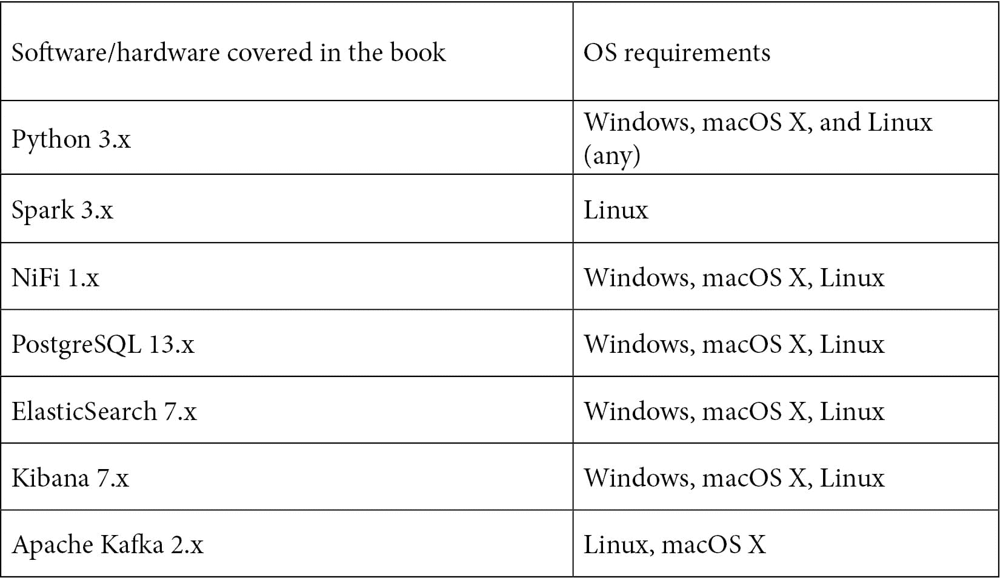

# 前言

数据工程为数据科学和分析提供了基础，并构成所有业务的重要方面。本书将帮助你探索用于使用 Python 理解数据工程过程的多种工具和方法。本书将向你展示如何应对数据工程不同方面常见挑战。你将从数据工程的基础知识介绍开始，包括构建用于处理大数据集的数据管道所需的技术和框架。你将学习如何转换和清洗数据，并执行分析以充分利用你的数据。随着你的进步，你将发现如何处理不同复杂性的大数据和数据库，并构建数据管道。通过实际案例，你将构建架构，并学习如何部署数据管道。

在完成这本 Python 书之后，你将清楚地理解数据建模技术，并能够自信地构建用于跟踪数据、运行质量检查以及在生产中进行必要更改的数据工程管道。

# 这本书面向谁

本书面向数据分析师、ETL 开发人员以及希望开始或过渡到数据工程领域或使用 Python 刷新数据工程知识的人。本书对计划在数据工程或 IT 领域建立职业生涯的学生以及为过渡做准备的专业人士也很有用。不需要具备数据工程的前置知识。

# 本书涵盖的内容

*第一章*, *什么是数据工程*，定义了数据工程。它将向你介绍数据工程师的技能、角色和责任。你还将了解数据工程如何与其他学科，如数据科学相结合。

*第二章*, *构建我们的数据工程基础设施*，解释了如何安装和配置本书中使用的工具。你将安装两个数据库——ElasticSearch 和 PostgreSQL——以及 NiFi、Kibana，当然还有 Python。

*第三章*, *读取和写入文件*，介绍了在 Python 中读取和写入文件以及 NiFi 中的数据管道。它将重点介绍**逗号分隔值**（**CSV**）和**JavaScript 对象表示法**（**JSON**）文件。

*第四章*, *与数据库一起工作*，解释了与 SQL 和 NoSQL 数据库一起工作的基础知识。你将查询这两种类型的数据库，并在 Python 和通过使用 NiFi 中查看结果。你还将学习如何读取文件并将其插入到数据库中。

*第五章*，*清洗和转换数据*，解释了如何处理文件或数据库查询并执行基本的数据探索性分析。这种分析将使你能够查看常见的数据问题。然后，你将使用 Python 和 NiFi 来清洗和转换数据，以解决这些常见的数据问题。

*第六章*，*项目 - 构建一个 311 数据管道*，介绍了一个项目，在这个项目中你将构建一个完整的数据管道。你将学习如何从 API 读取并使用之前章节中获得的所有技能。你将对数据进行清洗和转换，并使用额外的数据对其进行丰富。最后，你将把数据插入仓库并构建仪表板来可视化它。

*第七章*，*生产数据管道的功能*，涵盖了数据管道为准备生产所需的内容。你将了解原子事务以及如何使数据管道具有幂等性。

*第八章*，*使用 NiFi Registry 进行版本控制*，解释了如何对数据管道进行版本控制。你将安装和配置 NiFi 注册表。你还将学习如何配置注册表以使用 GitHub 作为 NiFi 处理器的源。

*第九章*，*监控和日志数据管道*，教你监控和日志数据管道的基础知识。你将了解 NiFi GUI 的监控功能。你还将学习如何使用 NiFi 处理器从你的数据管道内部进行日志记录和监控性能。最后，你将了解 NiFi API 的基础知识。

*第十章*，*部署你的数据管道*，提出了一种为 NiFi 构建测试和生产环境的方法。你将学习如何将完成并进行了版本控制的数据管道移动到生产环境中。

*第十一章*，*项目 - 构建生产数据管道*，解释了如何构建生产数据管道。你将使用来自*第六章*的项目并添加一些功能。你将对数据管道进行版本控制，并添加监控和日志功能。

*第十二章*，*构建 Apache Kafka 集群*，解释了如何安装和配置一个三节点的 Apache Kafka 集群。你将学习 Kafka 的基础知识——流、主题和消费者。

*第十三章*，*使用 Kafka 进行数据流*，解释了如何使用 Python 写入 Kafka 主题以及如何消费这些数据。你将使用第三方 Python 库编写消费者和生产者的 Python 代码。

第十四章，*使用 Apache Spark 进行数据处理*，将指导您安装和配置一个三节点 Apache Spark 集群。您将学习如何使用 Python 在 Spark 中操作数据。这将让人联想到本书第一部分中与 pandas DataFrames 一起工作的方式。

第十五章，*项目 - 实时边缘数据 - Kafka、Spark 和 MiNiFi*，介绍了 MiNiFi，这是一个独立的项目，旨在将 NiFi 部署到资源有限的设备上，如物联网设备。您将构建一个数据管道，将数据从 MiNiFi 发送到您的 NiFi 实例。

附录介绍了使用 Apache NiFi 进行聚类的基础知识。您将学习如何分配数据管道以及这样做的一些注意事项。您还将学习如何允许数据管道在单个指定的节点上运行，而不是在集群中分布式运行。

# 要充分利用本书

您应该对 Python 有一个基本的了解。您不需要了解任何现有的库，只需对变量、函数以及如何运行程序有一个基本理解。您还应该了解 Linux 的基础知识。如果您能在终端中运行命令并打开新的终端窗口，那么这应该就足够了。



**如果您使用的是本书的数字版，我们建议您亲自输入代码或通过 GitHub 仓库（下一节中提供链接）访问代码。这样做将帮助您避免与代码复制粘贴相关的任何潜在错误。**

# 下载示例代码文件

您可以从[`github.com/PacktPublishing/Data-Engineering-with-Python`](https://github.com/PacktPublishing/Data-Engineering-with-Python)下载本书的示例代码文件。如果代码有更新，它将在现有的 GitHub 仓库中更新。

我们还提供了一些来自我们丰富的图书和视频目录的代码包，可在[`github.com/PacktPublishing/`](https://github.com/PacktPublishing/)找到。查看它们吧！

# 下载彩色图像

我们还提供了一份包含本书中使用的截图/图表的彩色图像的 PDF 文件。您可以从这里下载：[`www.packtpub.com/sites/default/files/downloads/9781839214189_ColorImages.pdf`](http://www.packtpub.com/sites/default/files/downloads/9781839214189_ColorImages.pdf)。

# 使用的约定

本书使用了多种文本约定。

`文本中的代码`：表示文本中的代码单词、数据库表名、文件夹名、文件名、文件扩展名、路径名、虚拟 URL、用户输入和 Twitter 昵称。以下是一个示例：“接下来，将参数字典传递给`DAG()`。”

代码块设置如下：

```py
import datetime as dt from datetime import timedelta
from airflow import DAG from airflow.operators.bash_operator import BashOperator from airflow.operators.python_operator import PythonOperator
import pandas as pd
```

任何命令行输入或输出都应如下编写：

```py
# web properties #
nifi.web.http.port=9300
```

**粗体**：表示新术语、重要单词或屏幕上看到的单词。例如，菜单或对话框中的单词在文本中显示如下。以下是一个示例：“点击 **DAG** 并选择 **树视图**。”

小贴士或重要注意事项

看起来是这样的。

# 联系我们

我们欢迎读者反馈。

`customercare@packtpub.com`。

**勘误表**：尽管我们已经尽最大努力确保内容的准确性，但错误仍然可能发生。如果您在这本书中发现了错误，如果您能向我们报告这一点，我们将不胜感激。请访问 [www.packtpub.com/support/errata](http://www.packtpub.com/support/errata)，选择您的书籍，点击勘误表提交表单链接，并输入详细信息。

`copyright@packt.com` 并附上相关材料的链接。

**如果您有兴趣成为作者**：如果您在某个领域有专业知识，并且您有兴趣撰写或为书籍做出贡献，请访问 [authors.packtpub.com](http://authors.packtpub.com)。

# 评论

请留下评论。一旦您阅读并使用过这本书，为何不在购买它的网站上留下评论呢？潜在读者可以查看并使用您的客观意见来做出购买决定，Packt 公司可以了解您对我们产品的看法，我们的作者也可以看到他们对书籍的反馈。谢谢！

想了解更多关于 Packt 的信息，请访问 [packt.com](http://packt.com)。
