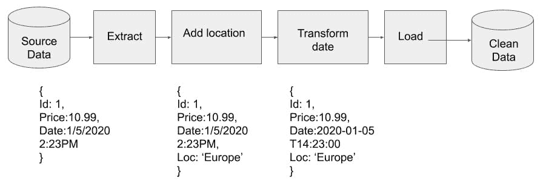
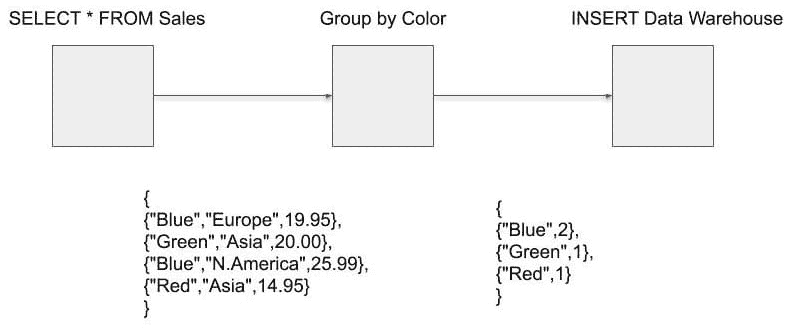
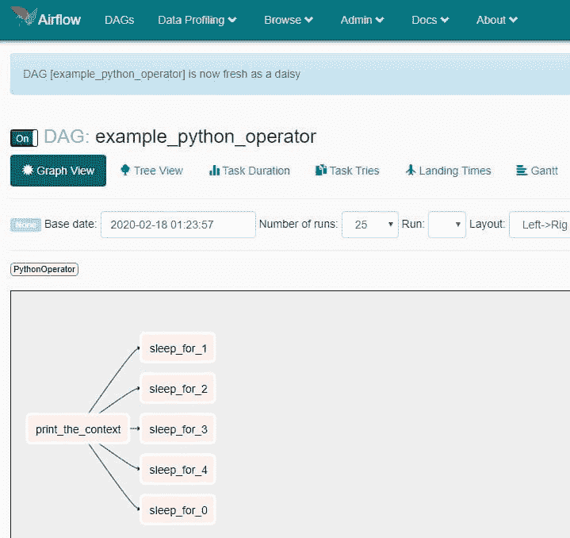
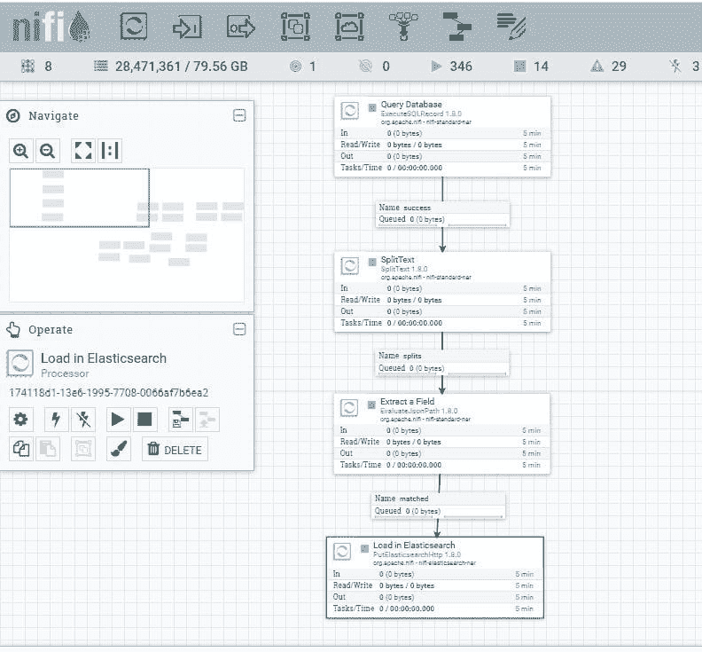

# *第一章*: 什么是数据工程？

欢迎来到《Python 数据工程》。虽然数据工程不是一个新兴领域，但它似乎最近从幕后走到了台前，开始成为焦点。本书将向您介绍数据工程的领域。您将了解数据工程师使用的工具和技术，以及如何将它们结合起来构建数据管道。完成本书后，您将能够连接到多个数据源，提取数据，转换数据，并将其加载到新的位置。您将能够构建自己的数据工程基础设施，包括集群应用程序以增加其数据处理能力。

在本章中，您将了解数据工程师的角色和职责以及数据工程如何支持数据科学。您将介绍数据工程师使用的工具，以及您需要精通的不同技术领域，以成为一名数据工程师。

在本章中，我们将涵盖以下主要主题：

+   数据工程师的工作内容

+   数据工程与数据科学的比较

+   数据工程工具

# 数据工程师的工作内容

**数据工程**是大数据生态系统的一部分，与数据科学紧密相连。数据工程师在幕后工作，并不像数据科学家那样受到同样的关注，但他们对于数据科学的过程至关重要。数据工程师的角色和职责根据组织的数据处理成熟度和人员配置水平而有所不同；然而，有一些任务，如数据的提取、加载和转换，是数据工程师角色的基础。

在最底层，数据工程涉及将数据从一个系统或格式移动到另一个系统或格式。使用更常见的术语，数据工程师从源（提取）查询数据，他们对数据进行一些修改（转换），然后将这些数据放置在用户可以访问并且知道它是生产质量的地方（加载）。本书中会多次使用**提取**、**转换**和**加载**这些术语，通常缩写为**ETL**。这种数据工程的定义是宽泛且简化的。通过一个例子，让我们更深入地了解数据工程师的工作内容。

一家在线零售商有一个网站，您可以在网站上购买各种颜色的 widgets。该网站由关系型数据库支持。每次交易都存储在数据库中。零售商在上个季度卖出了多少蓝色的 widgets？

为了回答这个问题，您可以在数据库上运行一个 SQL 查询。这并不需要数据工程师。但随着网站的增长，在生产数据库上运行查询不再实用。此外，可能存在多个记录交易的数据库。可能存在位于不同地理位置的数据库——例如，北美零售商可能有一个与亚洲、非洲和欧洲零售商不同的数据库。

现在，您已经进入了数据工程的领域。为了回答前面的问题，数据工程师会为每个地区的所有交易数据库创建连接，提取数据，并将其加载到数据仓库中。从那里，您现在可以计算所有蓝色 widgets 的销售数量。

与寻找销售了多少蓝色 widgets 相比，公司更希望找到以下问题的答案：

+   我们如何找出哪些位置销售最多的 widgets？

+   我们如何找出销售 widgets 的峰值时间？

+   有多少用户将 widgets 放入购物车并在之后移除？

+   我们如何找出一起销售的 widgets 组合？

回答这些问题不仅需要提取数据并将其加载到单个系统中，在提取和加载之间还需要进行转换。不同地区存在时区差异。例如，仅美国就有四个时区。因此，您需要将时间字段转换为标准格式。您还需要一种方法来区分每个地区的销售情况。这可以通过在数据中添加一个位置字段来实现。这个字段应该是空间性的——以坐标或已知文本的形式——还是仅仅是以文本形式，可以在数据工程管道中进行转换？

在这里，数据工程师需要从每个数据库中提取数据，然后通过添加一个额外的位置字段来转换数据。为了比较时区，数据工程师需要熟悉数据标准。对于时间，国际标准化组织（**ISO**）有一个标准——**ISO 8601**。

现在我们逐一回答前面列表中的问题：

+   从每个数据库中提取数据。

+   在数据中为每个交易的地点添加一个标记字段

+   将日期从本地时间转换为 ISO 8601。

+   将数据加载到数据仓库中。

通过创建数据管道来完成提取、加载和转换数据的过程。数据以原始或脏数据的形式进入管道，即可能存在缺失数据或数据中的错误，然后在管道中流动时被清理。之后，它从管道的另一侧流出进入数据仓库，在那里可以进行查询。以下图表显示了完成此任务所需的数据管道：

图 1.1 – 一个添加位置并修改日期的管道

对数据工程是什么以及数据工程师做什么有更多的了解，你应该开始对数据工程师需要获取的责任和技能有感觉。下一节将详细阐述这些技能。

## 成为数据工程师所需的专业技能和知识

在前面的例子中，应该很清楚数据工程师需要熟悉许多不同的技术，而我们甚至还没有提到业务流程或需求。

在数据管道的开始阶段，数据工程师需要知道如何从不同格式或不同类型的数据库中的文件中提取数据。这意味着数据工程师需要了解用于执行许多不同任务的几种语言，例如 SQL 和 Python。

在数据管道的转换阶段，数据工程师需要熟悉数据建模和结构。他们还需要了解业务以及他们希望从数据中提取的知识和见解，因为这会影响数据模型的设计。

将数据加载到数据仓库中意味着需要一个具有模式以存储数据的数据库。这通常也是数据工程师的责任。数据工程师需要了解数据仓库设计的基础知识，以及在其构建中使用的数据库类型。

最后，数据管道运行在其上的整个基础设施可能也是数据工程师的责任。他们需要知道如何管理 Linux 服务器，以及如何安装和配置 Apache Airflow 或 NiFi 等软件。随着组织向云迁移，数据工程师现在需要熟悉在组织使用的云平台上启动基础设施——亚马逊、谷歌云平台或 Azure。

通过了解数据工程师的工作示例，我们现在可以更广泛地定义数据工程。

信息

数据工程是在本地或云（或混合或多云）上开发、运营和维护数据基础设施，包括数据库和用于提取、转换和加载数据的管道。

# 数据工程与数据科学

数据工程是使数据科学成为可能的基础。再次强调，根据组织的成熟度，数据科学家可能需要清理和移动分析所需的数据。这不是数据科学家最佳的时间利用方式。数据科学家和数据工程师使用类似的工具（例如 Python），但他们专注于不同的领域。数据工程师需要了解数据格式、模型和结构，以便有效地传输数据，而数据科学家则利用这些工具来构建统计模型和数学计算。

数据科学家将连接到数据工程师构建的数据仓库。从那里，他们可以提取用于机器学习模型和分析所需的数据。数据科学家的模型可能被纳入数据工程管道中。数据工程师和数据科学家之间应该存在紧密的关系。了解数据科学家在数据中需要什么，只会帮助数据工程师提供更好的产品。

在下一节中，你将了解数据工程师最常用的工具。

# 数据工程工具

为了构建数据管道，数据工程师需要选择适合工作的正确工具。数据工程是大数据生态系统的一部分，必须考虑到大数据的三个 V：

+   **体积**：数据量已经大幅增长。从一个数据库中移动一千条记录需要与移动数百万行或每分钟处理数百万笔交易不同的工具和技术。

+   **多样性**：数据工程师需要能够处理不同位置（数据库、API、文件）中各种数据格式的工具。

+   **速度**：数据速度总是不断增长。跟踪社交网络上数百万用户的活动或全球各地用户的购买行为，要求数据工程师经常在近乎实时的情况下进行操作。

## 编程语言

数据工程的通用语言是**SQL**。无论你使用低代码工具还是特定的编程语言，几乎无法绕过对 SQL 的了解。在 SQL 方面有坚实的基础，可以让数据工程师优化查询以提高速度，并有助于数据转换。SQL 在数据工程中如此普遍，以至于数据湖和非 SQL 数据库都有工具允许数据工程师使用 SQL 查询它们。

大量开源数据工程工具使用**Java**和**Scala**（Apache 项目）。Java 是一种流行的、主流的面向对象编程语言。虽然存在争议，但 Java 正逐渐被运行在**Java 虚拟机**（**JVM**）上的其他语言所取代。Scala 是这些语言之一。在 JVM 上运行的其他语言包括**Clojure**和**Groovy**。在下一章中，你将介绍**Apache NiFi**。NiFi 允许你使用 Java、Clojure、Groovy 和**Jython**开发自定义处理器。虽然 Java 是一种面向对象的语言，但已经出现了一种向函数式编程语言转变的趋势，其中 Clojure 和 Scala 是成员。

本书重点关注使用 Python 进行数据工程。它有很好的文档记录，拥有更大的用户基础和跨平台支持。Python 已成为数据科学和数据工程的默认语言。Python 拥有一系列丰富的标准库和第三方库。Python 的数据科学环境在其它语言中是无与伦比的。`pandas`、`matplotlib`、`numpy`、`scipy`、`scikit-learn`、`tensorflow`、`pytorch` 和 `NLTK` 等库构成了一个极其强大的数据工程和数据科学环境。

## 数据库

在大多数生产系统中，数据将存储在 **关系数据库** 中。大多数专有解决方案将使用 **Oracle** 或 **Microsoft SQL Server**，而开源解决方案倾向于使用 **MySQL** 或 **PostgreSQL**。这些数据库以行存储数据，非常适合记录交易。表之间也存在关系，利用主键将一个表中的数据与另一个表中的数据连接起来——因此它们是关系型的。以下表格图显示了简单的数据模型和表之间的关系：

![图 1.2 – 在 Region = RegionID 上连接的关系表。

![图 1.2 – 在 Region = RegionID 上连接的关系表。

图 1.2 – 在 Region = RegionID 上连接的关系表。

在数据仓库中使用的最常见数据库是 **Amazon Redshift**、**Google BigQuery**、**Apache Cassandra** 以及其他 NoSQL 数据库，例如 **Elasticsearch**。Amazon Redshift、Google BigQuery 和 Cassandra 与传统的行式关系数据库不同，它们以列式格式存储数据，如下所示：

![图 1.3 – 以列式格式存储的行

![img/B15739_01_03.jpg]

图 1.3 – 以列式格式存储的行

列式数据库更适合快速查询——因此非常适合数据仓库。这三个列式数据库都可以使用 SQL 进行查询——尽管 Cassandra 使用 Cassandra 查询语言，但它们是相似的。

与列式数据库相反，还有文档型或 NoSQL 数据库，例如 Elasticsearch。Elasticsearch 实际上是一个基于 **Apache Lucene** 的搜索引擎。它与 **Apache Solr** 类似，但更易于使用。Elasticsearch 是开源的，但它确实有一些专有组件——最显著的是用于机器学习、图、安全和警报/监控的 X-Pack 插件。Elasticsearch 使用 Elastic 查询 **DSL**（**领域特定语言**）。它不是 SQL，而是一种 JSON 查询。Elasticsearch 以文档的形式存储数据，尽管它有父子文档，但它是非关系型的（类似于列式数据库）。

一旦数据工程师从数据库中提取数据，他们就需要对其进行转换或处理。在大数据中，使用数据处理引擎很有帮助。

## 数据处理引擎

数据处理引擎允许数据工程师将数据转换为批量或流式数据。这些引擎允许并行执行转换任务。最受欢迎的引擎是**Apache Spark**。Apache Spark 允许数据工程师使用 Python、Java 和 Scala 编写转换。

Apache Spark 与 Python DataFrames 一起工作，使其成为 Python 程序员的理想工具。Spark 还有**弹性分布式数据集**(**RDDs**)。RDDs 是一个不可变和分布式的对象集合。你主要通过加载外部数据源来创建它们。RDDs 允许快速和分布式处理。RDD 中的任务在集群中的不同节点上运行。与 DataFrames 不同，它们不会尝试猜测你的数据模式。

其他流行的处理引擎包括**Apache Storm**，它使用喷泉(spouts)读取数据，使用螺栓(bolts)执行转换。通过连接它们，你可以构建一个处理管道。**Apache Flink**和**Samza**是更现代的流式和批量处理框架，允许你处理无界流。无界流是没有已知终点的数据，例如，温度传感器就是一个无界流。它不断地报告温度。如果你使用 Apache Kafka 从系统中流式传输数据，Flink 和 Samza 是绝佳的选择。你将在本书的后面部分了解更多关于 Apache Kafka 的内容。

## 数据管道

将事务型数据库、编程语言、处理引擎和数据仓库结合起来，就形成了一个管道。例如，如果你从数据库中选择所有小部件销售的记录，通过 Spark 将其数据减少到小部件和计数，然后将结果存入数据仓库，你就拥有了一个管道。但是，如果你每次想要运行它时都必须手动执行，这个管道就不是很实用。数据管道需要一个调度器来允许它们在指定的时间间隔运行。最简单的方法是使用**crontab**。为你的 Python 文件安排一个 cron 作业，然后坐下来观看它每隔*X*小时运行一次。

在 crontab 中管理所有管道很快就会变得困难。你如何跟踪管道的成功和失败？你如何知道什么运行了，什么没有运行？你如何处理背压——如果一个任务比下一个任务运行得快，你如何阻止数据，以免它压倒任务？随着你的管道变得更加复杂，你将很快超出 crontab 的范围，需要一个更好的框架。

### Apache Airflow

在 Python 中构建数据工程管道最流行的框架是**Apache Airflow**。Airflow 是由 Airbnb 构建的工作流管理平台。Airflow 由一个网络服务器、一个调度器、一个元存储、一个排队系统和执行器组成。你可以运行 Airflow 作为一个单一实例，或者将其拆分为具有许多执行节点集群——这可能是你在生产中运行它的方式。Airflow 使用**有向无环图**(**DAGs**)。

DAG 是指定任务的 Python 代码。图是由关系或依赖连接的一系列节点。在 Airflow 中，它们是定向的，因为它们以方向流动，每个任务在其依赖项之后进行。使用前面的示例管道，第一个节点将执行一个 SQL 语句，获取所有小部件的销售情况。此节点将连接到下游的另一个节点，该节点将汇总小部件和计数。最后，此节点将连接到最终节点，将数据加载到仓库中。管道 DAG 将看起来如下所示：

图 1.4 – 展示节点间数据流的一个 DAG。任务沿着箭头（有方向性）从左到右进行

本书将介绍 Apache Airflow 的基础知识，但主要将使用 Apache NiFi 来演示数据工程的原则。以下是一个 Airflow 中 DAG 的截图：

图 1.5 – 显示 DAG 详细信息的 Airflow 图形用户界面

图形用户界面不如 NiFi 精炼，我们将在下一节讨论。

### Apache NiFi

Apache NiFi 是另一个用于构建数据工程管道的框架，它也利用了 DAG。Apache NiFi 由国家安全局构建，并在几个联邦机构中使用。Apache NiFi 更容易设置，对新数据工程师很有用。图形用户界面非常出色，虽然你可以使用 Jython、Clojure、Scala 或 Groovy 来编写处理器，但通过简单配置现有处理器，你可以完成很多事情。以下截图显示了 NiFi 图形用户界面和示例 DAG：

图 1.6 – 从数据库提取数据并发送到 Elasticsearch 的示例 NiFi 流

Apache NiFi 还允许集群和远程执行管道。它具有内置的调度程序，并提供管道的背压和监控。此外，Apache NiFi 使用 NiFi Registry 进行版本控制，并可用于使用 MiNiFi 收集边缘数据。

另一个用于数据工程管道的基于 Python 的工具是 Luigi – 由 Spotify 开发。Luigi 也使用图结构，并允许你连接任务。它有一个类似于 Airflow 的图形用户界面。Luigi 不会在本书中介绍，但它是基于 Python 的数据工程的优秀选择。

# 摘要

在本章中，你学习了数据工程是什么。数据工程的角色和责任取决于组织数据基础设施的成熟度。但数据工程在最简单的情况下，是创建管道以将数据从一个源或格式移动到另一个源或格式。这可能涉及或不涉及数据转换、处理引擎和基础设施的维护。

数据工程师使用各种编程语言，但最常见的是 Python、Java 或 Scala，以及专有和开源的事务性数据库和数据仓库，无论是在本地还是在云端，或者两者混合。数据工程师需要在许多领域具备知识——编程、运维、数据建模、数据库和操作系统。该领域的广度是使其有趣、激动人心和具有挑战性的部分。对于那些愿意接受挑战的人来说，数据工程是一个有回报的职业。

在下一章中，我们将首先设置一个环境以开始构建数据管道。
