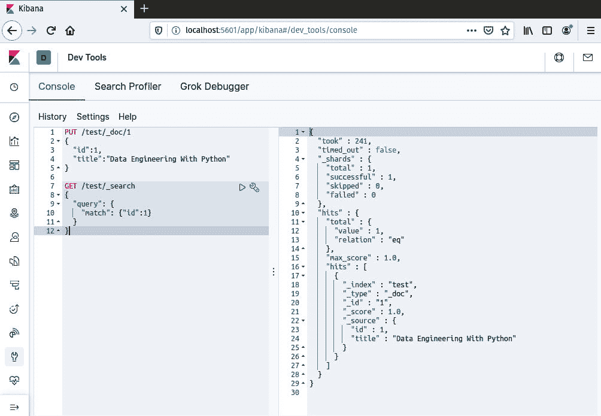

# *第二章*：构建我们的数据工程基础设施

在上一章中，您学习了数据工程师的工作内容以及他们的角色和职责。您还介绍了一些他们使用的工具，主要是不同类型的数据库、编程语言以及数据管道创建和调度工具。

在本章中，您将安装和配置一些工具，这些工具将帮助您完成本书的其余部分。您将学习如何安装和配置两种不同的数据库——PostgreSQL 和 Elasticsearch——两种辅助构建工作流程的工具——Airflow 和 Apache NiFi，以及两种管理工具——PostgreSQL 的 pgAdmin 和 Elasticsearch 的 Kibana。

使用这些工具，您将能够编写数据工程管道，将数据从一个源移动到另一个源，并且还能够可视化结果。随着您学习如何构建管道，看到数据和它的转换情况将有助于您在调试任何错误时。随着您的进步，您可能不再需要这些工具，但您将支持的其它角色和用户可能需要它们，因此对工具的基本理解将是有用的。

本章将涵盖以下主题：

+   安装和配置 Apache NiFi

+   安装和配置 Apache Airflow

+   安装和配置 Elasticsearch

+   安装和配置 Kibana

+   安装和配置 PostgreSQL

+   安装 pgAdmin 4

# 安装和配置 Apache NiFi

Apache NiFi 是本书中用于构建数据工程管道的主要工具。NiFi 允许您使用预先构建的处理器来构建数据管道，您可以根据自己的需求对其进行配置。您不需要编写任何代码就能让 NiFi 管道工作。它还提供了一个调度器，用于设置您希望管道运行的频率。此外，它还能处理背压——如果某个任务比另一个任务运行得快，您可以减慢该任务的运行速度。

要安装 Apache NiFi，您需要从 [`nifi.apache.org/download.html`](https://nifi.apache.org/download.html) 下载它：

1.  通过使用 `curl`，您可以使用以下命令行下载 NiFi：

    ```py
    curl https://mirrors.estointernet.in/apache/nifi/1.12.1/nifi-1.12.1-bin.tar.gz
    ```

1.  使用以下命令从 `.tar.gz` 文件中提取 NiFi 文件：

    ```py
    tar xvzf nifi.tar.gz
    ```

1.  现在，您将有一个名为 `nifi-1.12.1` 的文件夹。您可以通过在文件夹内执行以下命令来运行 NiFi：

    ```py
     bin/nifi.sh start
    ```

1.  如果您已经安装并配置了 Java，当您运行以下片段中的状态工具时，您将看到为 `JAVA_HOME` 设置的路径：

    ```py
    sudo bin/nifi.sh status
    ```

1.  如果您没有看到已设置 `JAVA_HOME`，您可能需要使用以下命令安装 Java：

    ```py
    sudo apt install openjdk-11-jre-headless
    ```

1.  然后，您应该编辑 `.bash_profile` 以包含以下行，以便 NiFi 可以找到 `JAVA_HOME` 变量：

    ```py
    export JAVA_HOME=/usr/lib/jvm/java11-openjdk-amd64
    ```

1.  最后，重新加载 `.bash_profile`：

    ```py
    source .bash_profile
    ```

1.  当您对 NiFi 运行状态时，您现在应该看到 `JAVA_HOME` 的路径：

    图 2.1 – NiFi 正在运行

1.  当 NiFi 准备就绪时，这可能需要一分钟，打开你的网页浏览器并访问 `http://localhost:8080/nifi/`。你应该看到以下屏幕：


图 2.2 – NiFi 图形用户界面

在后续章节中，你将了解许多可用的 NiFi 配置，但到目前为止，你将只更改 NiFi 运行的端口。在 `conf/nifi.properties` 文件中，将 `web properties` 标题下的 `nifi.web.http.port=8080` 修改为 `9300`，如下所示：

```py
# web properties #
nifi.web.http.port=9300
```

如果你的防火墙已开启，你可能需要打开端口：

```py
sudo ufw allow 9300/tcp
```

现在，你可以重新启动 NiFi 并在 `http://localhost:9300/nifi/` 上查看 GUI。

## NiFi 快速浏览

NiFi 图形用户界面将空白，因为你还没有添加任何处理器或处理器组。屏幕顶部是组件工具栏和状态栏。组件工具栏包含构建数据流所需的工具。状态栏，正如标题所暗示的，提供了你对 NiFi 实例当前状态的概述：


图 2.3 – NiFi 组件工具栏和状态栏

你将使用最多的工具是 **处理器** 工具。其他工具，从左到右，如下所示：

+   **输入端口**

+   **输出端口**

+   **处理器组**

+   **远程处理器组**

+   **漏斗**

+   **模板**

+   **标签**

使用这些有限的工具，你能够构建复杂的数据流。

NiFi 数据流由处理器、连接和关系组成。NiFi 有超过 100 个处理器可供你使用。通过点击 **处理器** 工具并将其拖动到画布上，你将被提示选择你想要使用的处理器，如下面的截图所示：


图 2.4 – 可以添加到画布上的处理器

使用搜索栏，你可以搜索 `GenerateFlowFile`。选择处理器，它将被添加到画布上。此处理器将允许你创建带有文本的 FlowFiles。拖动 `PutFile`，然后选择处理器。此处理器将把 FlowFile 保存到磁盘上的文件。你现在应该有一个如下截图所示的画布：


图 2.5 – 添加到画布上的处理器 – 存在错误

当你添加处理器时，框的左上角将有一个警告符号。它们尚未配置，因此你会收到警告和错误。前面的截图显示 `PutFile` 处理器缺少 `Directory` 参数，没有上游连接，并且成功和失败的关系尚未处理。

要配置处理器，你可以双击处理器或右键单击并选择 **属性**。以下截图显示了处理器的属性：


图 2.6 – 配置 GenerateFlowFile 处理器

应遵循以下步骤来配置处理器：

1.  您必须为任何粗体的参数设置值。每个参数都有一个问号图标以帮助您。

1.  您也可以右键单击进程并选择使用选项。

1.  对于 `GenerateFlowfile`，所有必需的参数已经填写完毕。

1.  在前面的截图中，我已经为 **自定义文本** 参数添加了一个值。要添加自定义属性，您可以在窗口右上角单击加号。您将被提示输入名称和值。我已经添加了我的属性文件名，并将其值设置为 **这是一个来自 nifi 的文件**。

1.  一旦配置完成，框中的黄色警告图标将变为方形（停止按钮）。

现在您已经配置了第一个处理器，您需要创建一个连接并指定一个关系 – 关系通常是成功或失败，但关系类型会根据处理器而变化。

要创建连接，将鼠标悬停在处理器框上，会出现一个圆圈和箭头：

1.  将圆圈拖到下面的处理器下面（`PutFile`）。

    它会自动定位，然后提示您指定要为此连接设置哪种关系。唯一的选择将是 **成功**，并且它已经选中。

1.  选择 `GenerateFlowFile` 处理器并选择 **运行**。

红色方块图标将变为绿色播放按钮。现在您应该有一个如图下截图所示的数据流：

![图 2.7 – 数据流半运行

![图片 B15739_02_07.jpg]

图 2.7 – 数据流半运行

在两个处理器框之间，您可以看到队列。它将显示 FlowFiles 的数量和大小。如果您右键单击队列，您将看到一个 FlowFiles 列表，您可以获取每个 FlowFile 的详细信息，查看其内容，并下载它们。以下截图显示了队列中 FlowFiles 的列表视图：

![图 2.8 – 队列中的 FlowFiles 列表

![图片 B15739_02_08.jpg]

图 2.8 – 队列中的 FlowFiles 列表

您可以查看流和内容的详细信息。详细信息视图有两个表格 – 详细信息和属性。从 **详细信息** 选项卡，您将看到一些 NiFi 元数据，并具有查看或下载 FlowFile 的能力。**属性** 选项卡包含 NiFi 分配的属性以及您可能在数据管道中创建的任何属性。**详细信息** 选项卡如图下截图所示：

![图 2.9 – FlowFile 的详细信息

![图片 B15739_02_09.jpg]

图 2.9 – FlowFile 的详细信息

从 **详细信息** 选项卡，如果您选择查看 FlowFile，您将在窗口中看到内容。这对于基于文本的数据效果最好，但也可以选择以十六进制格式查看 FlowFile。还有选项显示原始或格式化文本。以下截图显示了原始 FlowFile 数据，它只是一个简单的文本字符串：

![图 2.10 – FlowFile 的内容

![图片 B15739_02_10.jpg]

图 2.10 – FlowFile 的内容

`PutFile` 处理程序将 FlowFile 保存为机器上的文件，位于 `opt/nifioutput`。位置可以在处理器的配置中指定。如果您没有 root 权限，您可以将其更改为您的家目录。现在您有一个完整的数据流。这不是一个非常好的数据流，但它将每 10 秒生成一个文件并将其写入磁盘，因此会覆盖旧文件。下面的截图显示了在处理器中配置的目录，以及为输出配置的文本文件。它还显示了文件的内容，这些内容将与 `GenerateFlowFile` 处理器生成的 FlowFiles 的内容相匹配：

![图 2.11 – 数据流输出

![img/B15739_02_11.jpg]

图 2.11 – 数据流输出

NiFi 将是本书的主要焦点，您将在下一章开始学习更多关于构建数据流的知识。您还将学习另一个工具，Apache Airflow，我们将在下一节进行安装。

## PostgreSQL 驱动程序

在本章的后面部分，您将安装 PostgreSQL。为了使用 NiFi 的 `ExecuteSQL` 处理器连接到 PostgreSQL 数据库，您需要一个连接池，而这需要您将要连接到的数据库的 **Java 数据库连接**（**JDBC**）驱动程序。本节将向您展示如何下载该驱动程序以供以后使用。要下载它，请访问 [`jdbc.postgresql.org/download.html`](https://jdbc.postgresql.org/download.html) 并下载 **PostgreSQL JDBC 4.2 驱动程序，版本 42.2.10**。

在您的 NiFi 安装目录中创建一个名为 `drivers` 的新文件夹。将 `postgresql-42.2.10.jar` 文件移动到该文件夹中。稍后您将在 NiFi 处理器中引用此 `jar` 文件。

# 安装和配置 Apache Airflow

Apache Airflow 执行与 Apache NiFi 相同的角色；然而，它允许您使用纯 Python 创建数据流。如果您是一位强大的 Python 开发者，这可能是一个理想的工具。它目前是最受欢迎的开源数据管道工具之一。与 NiFi 相比，它在精炼的 GUI 方面可能有所欠缺，但它以强大的功能和创建任务的自由度来弥补这一点。

使用 `pip` 可以完成 Apache Airflow 的安装。但在安装 Apache Airflow 之前，您可以通过导出 `AIRFLOW_HOME` 来更改 Airflow 安装的位置。如果您希望 Airflow 安装到 `opt/airflow`，请导出 `AIRLFOW_HOME` 变量，如下所示：

```py
export AIRFLOW_HOME=/opt/airflow
```

Airflow 的默认位置是 `~/airflow`，对于本书，我将使用此位置。在安装 Airflow 之前，您需要考虑的是确定您想要安装哪些子包。如果您没有指定任何子包，Airflow 将仅安装运行所需的内容。如果您知道您将使用 PostgreSQL，那么您应该通过运行以下命令来安装子包：

```py
apache-airflow[postgres]
```

有一个选项可以使用 `all` 安装所有内容，或者使用 `all_dbs` 安装所有数据库。本书将安装 `postgreSQL`、`slack` 和 `celery`。以下表格列出了所有选项：


图 2.12 – 所有包命令选项表

要使用 `postgreSQL`、`slack` 和 `celery` 选项安装 Apache Airflow，请使用以下命令：

```py
pip install 'apache-airflow[postgres,slack,celery]' 
```

要运行 Airflow，您需要使用以下命令初始化数据库：

```py
airflow initdb
```

Airflow 的默认数据库是 SQLite。这对于测试和在单台机器上运行是可以接受的，但要在生产环境和集群中运行，您需要将数据库更改为其他类型，例如 PostgreSQL。

无命令 Airflow

如果找不到 `airflow` 命令，您可能需要将其添加到您的路径中：

```py
export PATH=$PATH:/home/<username>/.local/bin
```

Airflow Web 服务器运行在端口 `8080` 上，与 Apache NiFi 的端口相同。您已经在 `nifi.properties` 文件中将 NiFi 端口更改为 `9300`，因此可以使用以下命令启动 Airflow Web 服务器：

```py
airflow webserver
```

如果您没有更改 NiFi 端口，或者有其他进程在端口 `8080` 上运行，您可以使用 `-p` 标志指定 Airflow 的端口，如下所示：

```py
airflow webserver -p 8081
```

接下来，启动 Airflow 调度器，以便您可以在设定的时间间隔运行您的数据流。在另一个终端中运行此命令，以免终止 Web 服务器：

```py
airflow scheduler
```

Airflow 可以在没有调度器的情况下运行，但如果调度器没有运行，则在启动 Web 服务器时您将收到警告。警告截图如下：


图 2.13 – 错误信息。调度器没有运行

当调度器运行时，您将看到有关由于使用 SQLite 而将并行度设置为 1 的警告。现在您可以忽略此警告，但稍后您将希望能够同时运行多个任务。警告截图如下：


图 2.14 – 调度器正在运行但警告关于 SQLite

在初始化数据库、运行中的 Web 服务器和调度器运行后，您现在可以浏览到 `http://localhost:8080` 并查看 Airflow GUI。Airflow 在安装期间安装了几个示例数据流（**有向无环图**（**DAG**））。您应该在主屏幕上看到它们，如下所示：


图 2.15 – 安装多个示例的 Airflow

Airflow DAG 是使用代码创建的，因此本节不会深入探讨 GUI，但在后续章节中您将更多地探索它。选择第一个 DAG – `example_bash_operator` – 您将被带到树视图。点击 **图形视图** 选项卡，您应该会看到以下截图中的 DAG：


图 2.16 – execute_bash_operator DAG 的图形视图

图形视图清楚地显示了 DAG 中的依赖关系以及任务将运行的顺序。要观察 DAG 运行，切换回 **树视图**。在 DAG 名称的左侧，将 DAG 切换到 **开启**。选择 **触发 DAG**，你将被提示是否现在运行它。选择 **是**，页面将刷新。我已经运行了 DAG 几次，你可以在下面的截图中看到这些运行的状况：


图 2.17 – execute_bash_operator DAG 的多次运行

注意，有两个 DAG 运行成功完成，有三个 DAG 运行中，这些运行中有四个待处理任务。这些示例非常适合学习如何使用 Airflow GUI，但稍后它们会变得杂乱。虽然这不一定造成问题，但如果没有所有额外的信息，更容易找到你创建的任务。

你可以通过编辑 `airflow.cfg` 文件来删除示例。使用 `vi` 或你选择的编辑器，找到以下行并将 `True` 更改为 `False`：

```py
load_examples = True
```

以下截图显示了 `airflow.cfg` 文件，光标位于你需要编辑的行上：


图 2.18 – 设置 load_examples = False

一旦你编辑了 `airflow.cfg` 文件，你必须关闭 web 服务器。一旦 web 服务器停止，需要将配置更改加载到数据库中。记住，你之前已经设置了数据库，这是在 `pip` 安装 Airflow 之后的第一个步骤，使用以下命令：

```py
airflow initdb
```

要更改数据库，这是你在更改 `airflow.cfg` 文件后想要做的，你需要重置它。你可以使用以下代码片段来完成：

```py
airflow resetdb
```

这将把 `airflow.cfg` 中的更改加载到元数据库中。现在，你可以重新启动 web 服务器。当你打开 `http://localhost:8080` 上的 GUI 时，它应该是空的，如下面的截图所示：


图 2.19 – 清洁的 Airflow。一个 DAG 都看不到

Airflow 清洁且已准备好加载你将在下一章中创建的 DAG。

# 安装和配置 Elasticsearch

Elasticsearch 是一个搜索引擎。在这本书中，你将把它用作 NoSQL 数据库。你将把数据从 Elasticsearch 移到其他位置，并从其他位置移到 Elasticsearch。要下载 Elasticsearch，请按照以下步骤操作：

1.  使用 `curl` 下载文件，如下所示：

    ```py
    curl https://artifacts.elastic.co/downloads/elasticsearch/elasticsearch-7.6.0-darwin-x86_64.tar.gz --output elasticsearch.tar.gz
    ```

1.  使用以下命令提取文件：

    ```py
    tar xvzf elasticsearch.tar.gz
    ```

1.  你可以通过编辑 `config/elasticsearch.yml` 文件来命名你的节点和集群。在这本书的后面部分，你将设置一个具有多个节点的 Elasticsearch 集群。目前，我已经更改了以下属性：

    ```py
    cluster.name: DataEngineeringWithPython 
    node.name: OnlyNode
    ```

1.  现在，你可以开始启动 Elasticsearch。要启动 Elasticsearch，请运行以下命令：

    ```py
    bin/elasticsearch
    ```

1.  一旦 Elasticsearch 启动，您可以在 `http://localhost:9200` 看到结果。您应该看到以下输出：


图 2.20 – Elasticsearch 运行中

现在您已经运行了一个 NoSQL 数据库，您还需要一个关系型数据库。

# 安装和配置 Kibana

Elasticsearch 不附带 GUI，而是提供 API。要向 Elasticsearch 添加 GUI，您可以使用 Kibana。通过使用 Kibana，您可以更好地管理和与 Elasticsearch 交互。Kibana 允许您在 GUI 中访问 Elasticsearch API，但更重要的是，您可以使用它来构建存储在 Elasticsearch 中的数据的可视化仪表板。要安装 Kibana，请按照以下步骤操作：

1.  使用 `wget` 添加以下键：

    ```py
    wget -qO - https://artifacts.elastic.co/GPG-KEY-elasticsearch | sudo apt-key add -
    ```

1.  然后，添加相应的仓库：

    ```py
    echo "deb https://artifacts.elastic.co/packages/7.x/apt stable main" | sudo tee -a /etc/apt/sources.list.d/elastic-7.x.list
    ```

1.  最后，更新 `apt` 并安装 Kibana：

    ```py
    sudo apt-get update
    sudo apt-get install kibana
    ```

1.  Kibana 的配置文件位于 `etc/kibana`，应用程序位于 `/usr/share/kibana/bin`。要启动 Kibana，请运行以下命令：

    ```py
    bin/kibana
    ```

1.  当 Kibana 准备就绪后，浏览到 `http://localhost:5601`。Kibana 将在 `localhost` 的 `9200` 端口上查找任何正在运行的 Elasticsearch 实例。这就是您之前安装 Elasticsearch 的位置，也是您为什么没有在配置中更改端口的理由。当 Kibana 打开时，您将需要选择 **尝试我们的样本数据** 和 **自行探索**，如下所示：


图 2.21 – 首次启动 Kibana

**自行探索** 将带您进入主 Kibana 屏幕，但由于您尚未创建 Elasticsearch 索引且未加载任何数据，应用程序将是空的。

要查看 Kibana 中可用的不同工具，请选择 **尝试我们的样本数据**，并选择电子商务数据。以下截图显示了 **加载我们的样本数据** 的选项：


图 2.22 – 加载样本数据和可视化

一旦您加载了样本数据，请选择 **发现** 图标。从 **发现** 部分，您能够查看数据中的记录。如果有日期，您将看到给定时间范围内的计数条形图。您可以从此标签页选择条形或更改日期范围。选择记录将显示数据作为表格或文档的 JSON 表示。您还可以从此标签页对数据进行查询，并将它们保存为对象以供以后在可视化中使用。以下截图显示了主要的 **发现** 屏幕：


图 2.23 – 发现标签页

您可以从 **发现**选项卡中的数据或从保存的查询中创建可视化。可视化包括条形图 – 水平和垂直，饼图/甜甜圈图，计数，Markdown，热图，甚至一个地图小部件来处理地理空间数据。电子商务数据在国家级别包含地理空间数据，但地图也可以处理坐标。以下截图显示了电子商务数据的区域地图：


图 2.24 – 地图可视化

当您创建了许多可视化，来自单个索引或多个 Elasticsearch 索引时，您可以将它们添加到仪表板中。Kibana 允许您使用来自多个索引的数据加载小部件。当您在仪表板中进行查询或筛选时，只要字段名称存在于每个索引中，所有的小部件都将更新。以下截图显示了一个仪表板，由多个电子商务数据的可视化组成：


图 2.25 – 使用来自电子商务数据的多个小部件的仪表板

**开发者工具**选项卡在快速测试 Elasticsearch 查询并在数据工程管道中实现之前非常有用。从该选项卡，您可以创建索引和数据，执行查询以过滤、搜索或聚合数据。结果将在主窗口中显示。以下截图显示了一个记录被添加到索引中，然后针对特定 ID 进行搜索：



图 2.26 – 对单个测试记录的查询

现在你已经安装了 Elasticsearch 和 Kibana，接下来的两个部分将指导你安装 PostgreSQL 和 pgAdmin 4。之后，你将拥有一个 SQL 和一个 NoSQL 数据库来探索。

# 安装和配置 PostgreSQL

PostgreSQL 是一个开源的关系型数据库。它与 Oracle 或 Microsoft SQL Server 相当。PostgreSQL 还有一个插件 – postGIS – 它允许在 PostgreSQL 中实现空间功能。在这本书中，它将是首选的关系型数据库。PostgreSQL 可以作为软件包安装在 Linux 上：

1.  对于基于 Debian 的系统，使用 `apt-get`，如下所示：

    ```py
    sudo apt-get install postgresql-11
    ```

1.  一旦安装完成，您可以使用以下命令启动数据库：

    ```py
    sudo pg_ctlcluster 11 main start
    ```

1.  默认用户 `postgres` 没有密码。要添加一个，请连接到默认数据库：

    ```py
    sudo -u postgres psql
    ```

1.  连接后，您可以更改用户并分配密码：

    ```py
    ALTER USER postgres PASSWORD ‚postgres';
    ```

1.  要创建数据库，您可以输入以下命令：

    ```py
    sudo -u postgres createdb dataengineering
    ```

使用命令行速度快，但有时，GUI 会让生活变得更简单。PostgreSQL 有一个管理工具 – pgAdmin 4\.

# 安装 pgAdmin 4

如果您是关系型数据库的新手，pgAdmin 4 将使管理 PostgreSQL 变得更加容易。基于 Web 的 GUI 将允许您查看数据，并允许您直观地创建表。要安装 pgAdmin 4，请按照以下步骤操作：

1.  您需要将存储库添加到 Ubuntu。以下命令应添加到存储库中：

    ```py
    wget --quiet -O - https://www.postgresql.org/media/keys/ACCC4CF8.asc | sudo apt-key add -
    sudo sh -c 'echo "deb http://apt.postgresql.org/pub/repos/apt/ `lsb_release -cs`-pgdg main" >> /etc/apt/sources.list.d/pgdg.list'
    sudo apt update
    sudo apt install pgadmin4 pgadmin4-apache2 -y
    ```

1.  您将被提示输入用户名和电子邮件地址，然后输入密码。您应该看到以下屏幕：![图 2.27 – 为 pgAdmin 4 创建用户

    ![图片 B15739_02_25.jpg]

    图 2.27 – 为 pgAdmin 4 创建用户

1.  安装完成后，您可以浏览到 `http://localhost/pgadmin4` 并会看到登录屏幕，如下面的截图所示。输入安装过程中创建的用户凭据：

![图 2.28 – 登录 pgAdmin 4

![图片 B15739_02_26.jpg]

图 2.28 – 登录 pgAdmin 4

登录后，您可以从 GUI 管理您的数据库。下一节将为您简要介绍 pgAdmin 4。

## pgAdmin 4 导览

登录 pgAdmin 4 后，您将在左侧看到带有服务器图标的主面板。目前尚未配置任何服务器，因此您将想要添加本章中较早安装的服务器。

点击仪表板上的 **添加新服务器** 图标。您将看到一个弹出窗口。添加您的 PostgreSQL 实例信息，如下面的截图所示：

![图片 B15739_02_29.jpg]

![图片 B15739_02_27.jpg]

图 2.29 – 添加新服务器

添加服务器后，您可以展开服务器图标，应该会看到您之前创建的数据库 – `dataengineering`。展开 `dataengineering` 数据库，然后是 `schemas`，然后是 `public`。您将能够右键单击 **表** 来向数据库添加表，如下面的截图所示：

![图 2.30 – 创建表

![图片 B15739_02_28.jpg]

图 2.30 – 创建表

要用数据填充表，请命名表，然后选择 **列** 选项卡。创建一个包含有关人员信息的表。表如下面的截图所示：

![图 2.31 – 表数据

![图片 B15739_02_29.jpg]

图 2.31 – 表数据

在下一章中，您将使用 Python 和 `faker` 库来填充此表中的数据。

# 摘要

在本章中，您学习了如何安装和配置数据工程师使用的许多工具。完成这些操作后，您现在拥有了一个可以构建数据管道的工作环境。在生产环境中，您不会在单个机器上运行所有这些工具，但在接下来的几章中，这将帮助您快速学习和入门。您现在有两个工作数据库 – Elasticsearch 和 PostgreSQL – 以及两个构建数据管道的工具 – Apache NiFi 和 Apache Airflow。

在下一章中，您将开始使用 Apache NiFi 和 Apache Airflow（Python）来连接文件，以及 Elasticsearch 和 PostgreSQL。您将在 NiFi 和 Airflow 中构建您的第一个管道，将 CSV 文件移动到数据库中。
