# *第六章*：构建 311 数据管道

在前三个章节中，你学习了如何使用 Python、Airflow 和 NiFi 来构建数据管道。在本章中，你将使用这些技能来创建一个连接到 **SeeClickFix** 并下载一个城市所有问题的管道，然后将其加载到 Elasticsearch 中。我目前每 8 小时运行这个管道一次。我将这个管道用作开源情报的来源——用它来监控社区的生活质量问题，以及废弃车辆、涂鸦和针头的报告。而且，看到人们向他们的城市抱怨什么类型的事情也非常有趣——在 COVID-19 大流行期间，我的城市看到了几起人们在俱乐部不保持社交距离的报告。

在本章中，我们将涵盖以下主要主题：

+   构建数据管道

+   构建一个 Kibana 仪表板

# 构建数据管道

这个数据管道将与之前的管道略有不同，因为我们需要使用一个技巧来启动它。我们将有两个指向同一数据库的路径——其中一个在第一次运行后我们将关闭它，并且我们将有一个连接到自身的处理器来建立成功关系。以下截图显示了完成的管道：

![Figure 6.1 – The complete pipeline

![img/Figure_6.1_B15739.jpg]

图 6.1 – 完整的管道

上述截图可能看起来很复杂，但我向你保证，到本章结束时你会明白它的意义。

## 映射数据类型

在你构建管道之前，你需要将 Elasticsearch 中的一个字段进行映射，以便通过将它们映射为地理点数据类型来获得坐标的好处。为此，打开 Kibana，网址为 `http://localhost:5601`。在工具栏上，选择 **Dev Tools**（扳手图标）并输入以下截图左侧面板中显示的代码，然后点击运行箭头。如果成功，你将在右侧面板中看到输出，如下面的截图所示：

![Figure 6.2 – Adding geopoint mapping

![img/Figure_6.2_B15739.jpg]

图 6.2 – 添加地理点映射

现在你已经创建了具有地理点映射的 `scf` 索引，当你运行你的管道时，`coords` 字段将被转换为 Elasticsearch 中的空间坐标。

让我们开始构建。

## 触发管道

在上一节中，我提到你需要欺骗数据管道以启动。记住，这个管道将连接到一个 API 端点，为了做到这一点，调用 HTTP 端点的 NiFi 处理器以及你将使用的 `ExecuteScript` 处理器都需要一个传入的 flowfile 来启动它们。这个处理器不能是数据管道中的第一个处理器。

要启动数据管道，你将使用 `GenerateFlowFile` 处理器。将处理器拖放到画布上。双击它以更改配置。在 `Start Flow Fake Data` 中。这让我们知道这个处理器发送的是假数据，只是为了启动流程。配置将使用所有默认值，如下面的截图所示：

![图 6.3 – 配置 GenerateFlowfile 处理器

![img/Figure_6.3_B15739.jpg]

图 6.3 – 配置 GenerateFlowfile 处理器

最后，在 **SCHEDULING** 选项卡中，将处理器设置为按你希望的间隔运行。我使用 8，因为我不想压倒 API。

当处理器运行时，它将生成一个包含 0 字节数据的单个 flowfile。它是空的，但它确实包含由 NiFi 生成的元数据。然而，这个空 flowfile 将会起到作用并启动下一个处理器。这就是工作的开始之处。

## 查询 SeeClickFix

在之前的 NiFi 示例中，你没有使用任何代码，只是配置来让处理器完成你需要的工作。我们可以在这个管道中这样做。然而，现在是一个很好的时机，将使用 Python – Jython 编码引入你的管道中。

将 `ExecuteScript` 处理器拖放到画布上。双击它以编辑配置。从 `Query SCF` 开始，这样我知道它查询的是 **SeeClickFix**。在 **Properties** 选项卡中，将 **Script Engine** 设置为 **Python**。在 **Script Body** 参数中，你将编写处理器将执行的 Python 代码。查询步骤如下：

1.  你需要导入所需的库。以下代码是你会始终需要包含的库：

    ```py
    import java.io
    from org.apache.commons.io import IOUtils
    from java.nio.charset import StandardCharsets
    from org.apache.nifi.processor.io import StreamCallback
    from org.python.core.util import StringUtil
    ```

1.  接下来，你将创建一个将被调用来处理工作的类。`process` 函数将包含执行任务的代码：

    ```py
    class ModJSON(StreamCallback):
      def __init__(self):
            pass
      def process(self, inputStream, outputStream):
        # Task Goes Here
    ```

1.  最后，假设没有发生错误，检查是否存在 flowfile。如果存在，调用类的 flowfile。接下来，检查是否发生了错误。如果有错误，你将把 flowfile 发送到失败关系，否则，发送到成功关系：

    ```py
    errorOccurred=False
    flowFile = session.get()
    if (flowFile != None):
      flowFile = session.write(flowFile, ModJSON())
      #flowFile = session.putAttribute(flowFile)
      if(errorOccurred):
        session.transfer(flowFile, REL_FAILURE)
     else:
        session.transfer(flowFile, REL_SUCCESS)
    ```

    之前的代码是任何 Python `ExecuteScript` 处理器的模板。你需要更改的唯一内容将是在过程函数中，我们将在接下来的步骤中完成这一操作。

    由于 NiFi 使用 Jython，你可以向 Jython 环境添加许多 Python 库，但这超出了本书的范围。现在，你将使用标准库。

1.  要调用 SeeClickFix API，你需要导入 `urllib` 库和 `json`，如下所示：

    ```py
    import urllib
    import urllib2
    import json
    ```

1.  接下来，你将在 `process` 函数中放置代码。代码将是一个 `try` `except` 块，它向 HTTP 端点发出请求并将响应写入 `outputStream`。如果有错误，`except` 块将 `errorOccurred` 设置为 `True`，这将触发其余代码将文件流发送到 `Failure` 关系。`try` 块中不标准的 Python 代码行是 `outputStream.write()`。这是你写入文件流的地方：

    ```py
        try:
            param = {'place_url':'bernalillo-county',
                    'per_page':'100'}
            url = 'https://seeclickfix.com/api/v2/issues?' + 
                   urllib.urlencode(param)
            rawreply = urllib2.urlopen(url).read()
            reply = json.loads(rawreply)
            outputStream.write(bytearray(json.dumps(reply,
                   indent=4).encode('utf-8')))
        except:
            global errorOccurred
            errorOccurred=True

            outputStream.write(bytearray(json.dumps(reply,
                   indent=4).encode('utf-8'))) 
    ```

前面的代码在成功时将输出一个 JSON 文件流。文件流的内容将包含一些元数据和问题数组。我们将感兴趣的元数据是 **page** 和 **pages**。

你已经抓取了伯纳利县的前 100 个问题，并将把这个文件流传递给两个不同的处理器——`GetEveryPage` 和 `SplitJson`。我们将遵循 `SplitJson` 路径，因为这个路径会将数据发送到 Elasticsearch。

## 将数据转换为 Elasticsearch

以下是将数据转换为 Elasticsearch 的步骤：

1.  将 `SplitJson` 处理器拖放到画布上。双击它以修改属性。在 **属性** 选项卡中，将 **JsonPath 表达式** 属性设置为 **$.issues**。这个处理器现在将 100 个问题分割成它们自己的文件流。

1.  接下来，你需要添加符合 NiFi 期望格式的坐标。我们将使用一个名为 `coords` 的 `x`、`y` 字符串。为此，将 `ExecuteScript` 处理器拖放到画布上。双击它并点击 `import json` 语句。

1.  `process` 函数将输入流转换为字符串。输入流是来自前一个处理器的文件流内容。在这种情况下，它是一个单一的问题。然后它将使用 `json` 库将其加载为 `json`。然后你添加一个名为 `coords` 的字段，并将其分配给 `lat` 和 `lng` 字段在文件流 JSON 中的连接字符串值。最后，你将 JSON 写回输出流作为新的文件流：

    ```py
    def process(self, inputStream, outputStream):
        try:
            text = IOUtils.toString(inputStream,
                                    StandardCharsets.UTF_8)
            reply=json.loads(text)
            reply['coords']=str(reply['lat'])+',                           '+str(reply['lng'])
            d=reply['created_at'].split('T')
            reply['opendate']=d[0]
            outputStream.write(bytearray(json.dumps(reply, 
                               indent=4).encode('utf-8')))
        except:
            global errorOccurred
            errorOccurred=True        
            outputStream.write(bytearray(json.dumps(reply,
                               indent=4).encode('utf-8')))
    ```

    现在你有一个单独的问题，有一个名为 `coords` 的新字段，它是一个 Elasticsearch 识别为地理点的字符串格式。你几乎准备好在 Elasticsearch 中加载数据了，但首先你需要一个唯一的标识符。

1.  要在 Elasticsearch 中创建主键的等效项，你可以指定一个 ID。JSON 为每个问题都有一个 ID，你可以使用它。为此，将 `EvaluateJsonPath` 处理器拖放到画布上。双击它并选择值为 `$.id` 的 `id`。记住，`$.` 允许你指定要提取的 JSON 字段。现在文件流包含从 JSON 中提取的唯一 ID。

1.  将`PutElasticsearchHttp`处理器拖放到画布上。双击它以编辑属性。设置`http://localhost:9200`。在可选的**标识符属性**中，将值设置为**id**。这是您在之前的处理器中提取的属性。将**索引**设置为**SCF**（代表**SeeClickFix**），将**类型**设置为**doc**。最后，您将设置**索引操作**属性为**upsert**。在 Elasticsearch 中，**upsert**如果 ID 不存在，则会索引文档，如果 ID 存在且数据不同，则会更新。否则，不会发生任何操作，记录将被忽略，如果数据已经相同，这正是您想要的。

问题现在正在加载到 Elasticsearch 中，如果您检查，您将在`scf`索引中找到 100 个文档。但 Bernalillo 县 SeeClickFix 数据中记录的数量远不止 100 条；根据`QuerySCF`处理器的元数据，有 44 页的记录（4,336 个问题）。

以下部分将向您展示如何抓取所有数据。

## 获取每一页

当您查询 SeeClickFix 时，您将结果发送到两个路径。我们选择了`SplitJson`路径。这样做的原因是因为在初始查询中，您收到了 100 个问题和存在多少页问题（作为元数据的一部分）。您将问题发送到`SplitJson`路径，因为它们已经准备好处理，但现在您需要处理页数。我们将通过遵循`GetEveryPage`路径来完成这项工作。

将`ExecuteScript`处理器拖放到画布上。双击它以编辑`urllib`和`json`库。

`process`函数将输入流转换为 JSON，然后使用`json`库加载它。函数的主要逻辑表明，如果当前页小于或等于总页数，则调用 API 并请求下一页（`next_page_url`），然后将 JSON 作为流文件写入。否则，它将停止。代码如下：

```py
try:
        text = IOUtils.toString(inputStream, 
                                StandardCharsets.UTF_8)
        asjson=json.loads(text)
        if asjson['metadata']['pagination']
        ['page']<=asjson['metadata']['pagination']['pages']:
          url = asjson['metadata']['pagination']
                                  ['next_page_url']
          rawreply = urllib2.urlopen(url).read()
          reply = json.loads(rawreply)
          outputStream.write(bytearray(json.dumps(reply,
                             indent=4).encode('utf-8')))
        else:
          global errorOccurred
          errorOccurred=True        
          outputStream.write(bytearray(json.dumps(asjson,
                             indent=4).encode('utf-8')))        
    except:
        global errorOccurred
        errorOccurred=True       
        outputStream.write(bytearray(json.dumps(asjson, 
                           indent=4).encode('utf-8')))
```

您将连接此处理器的成功关系到最后一条路径中我们使用的`SplitJson`处理器。流文件将在问题上分割，添加坐标，提取 ID，然后将问题发送到 Elasticsearch。然而，我们需要这样做 42 次。

为了保持处理页面，您需要将成功关系连接到自身。没错；您可以将处理器连接到自身。当您通过此处理器处理第一页时，下一页是 2。问题被发送到`SplitJson`，然后回到这个处理器，它说当前页是小于 44，下一页是 3。

您现在有一个包含 SeeClickFix 所有当前问题的 Elasticsearch 索引。然而，Bernalillo 县的问题数量远大于当前问题的集合——存在一个存档。现在，您有一个每 8 小时拉取新问题的管道，您将始终是最新的，但您也可以将所有存档问题回填到 Elasticsearch 中。然后您将拥有问题的完整历史记录。

## 回填数据

要将历史数据仅回填到`SCF`索引中，只需在`QuerySCF`处理器中的`params`对象中添加一个参数。为此，右键单击`QuerySCF`处理器并选择`QuerySCFArchive`。在以下代码中的`params`对象中：

```py
param = {'place_url':'bernalillo-county', 'per_page': '100', 'status':'Archived'}
```

添加了`status`参数，其值为`Archived`。现在，将`GenerateFlowfile`处理器连接到这个回填处理器以启动它。然后，将处理器连接到`SplitJson`处理器以建立成功关系。这将把问题发送到 Elasticsearch。但您需要遍历所有页面，因此将处理器连接到`GetEveryPage`处理器。这将遍历存档并将所有问题发送到 Elasticsearch。一旦这个管道完成，您就可以停止`QuerySCFArchive`处理器。

当您有一个不断添加新记录的系统时——就像一个事务性系统——您将经常遵循这个模式。您将构建一个数据管道来提取最近的记录，并在固定的时间间隔提取新记录——每天或每小时，这取决于系统更新的频率或您需要实时数据的程度。一旦您的管道开始工作，您将添加一系列处理器来抓取所有历史数据并回填您的仓库。您可能不需要回到时间的开始，但在这个案例中，记录数量足够少，使其可行。

如果出现问题或需要填充新的仓库，您也会遵循这个模式。如果您的仓库损坏或您上线了新的仓库，您可以重新运行这个回填管道以再次引入所有数据，使新的数据库完整。但它将只包含当前状态。下一章将处理生产管道，并将通过改进您的管道来帮助您解决这个问题。现在，让我们在 Kibana 中可视化您的新 Elasticsearch 索引。

# 构建 Kibana 仪表板

现在您的 SeeClickFix 数据管道已将数据加载到 Elasticsearch 中，分析师也希望看到数据的结果。使用 Kibana，您可以做到这一点。在本节中，您将为您的数据管道构建一个 Kibana 仪表板。

要打开 Kibana，浏览到`http://localhost:5601`，您将看到主窗口。在工具栏底部（屏幕左侧；您可能需要展开它），点击底部的管理图标。您需要选择`scf*`，如下面的截图所示：

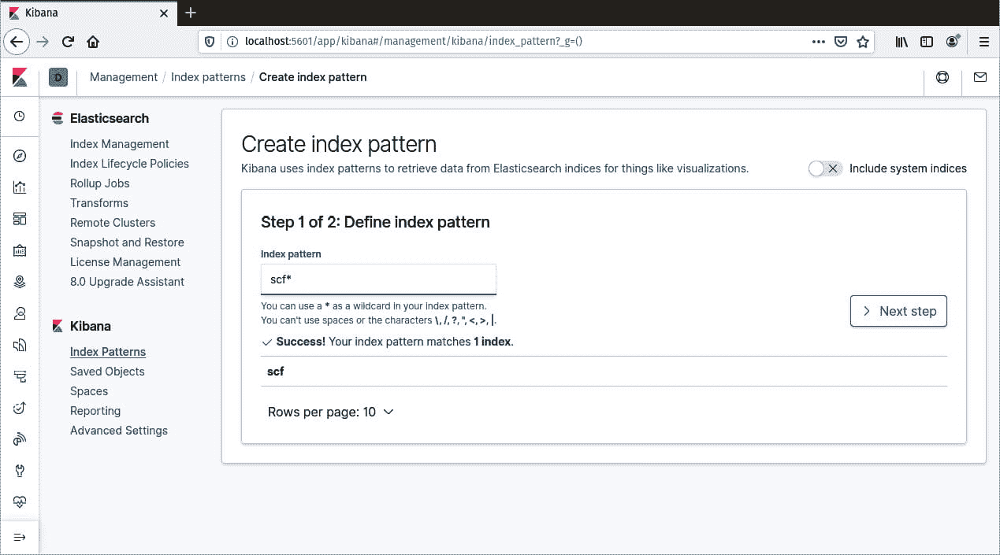

图 6.4 – 在 Kibana 中创建索引模式

当您点击下一步时，您将被要求选择一个`created_at`，如下面的截图所示：

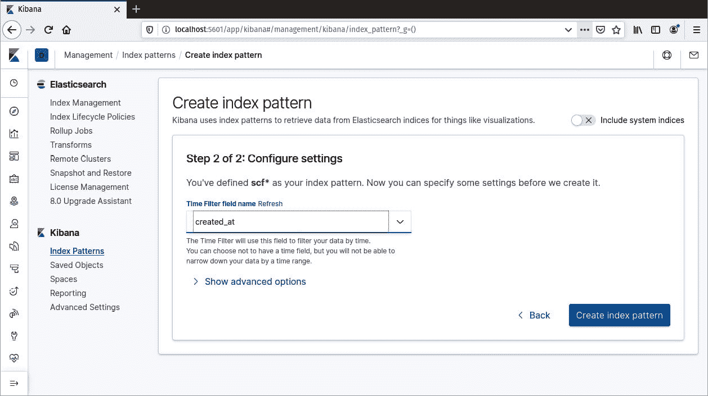

图 6.5 – 选择时间过滤器字段

一旦在 Kibana 中创建了索引，您就可以继续进行可视化。

## 创建可视化

要创建可视化，请选择工具栏中的可视化图标。选择**创建可视化**，您将看到各种类型，如下面的截图所示：

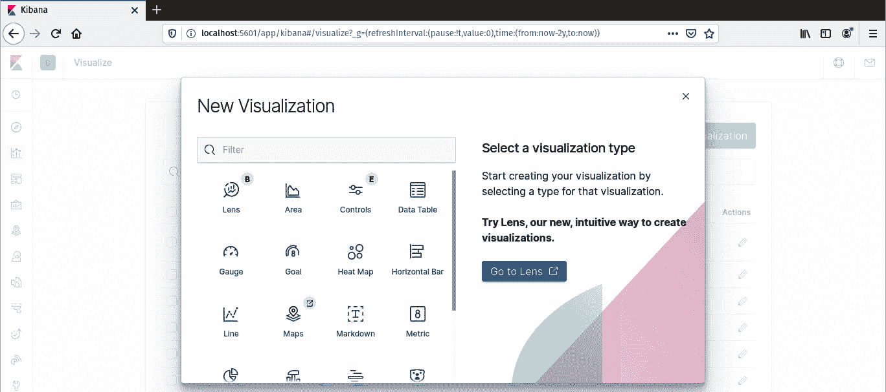

图 6.6 – 可用的可视化类型

您将看到`scf`——这将适用于本章节中所有可视化。将 y 轴保留为`created_at`，间隔将是**每月**。您将看到一个如下面的截图所示的图表（您的可能不同）：

![图 6.7 – 按月份创建的`created_at`计数的条形图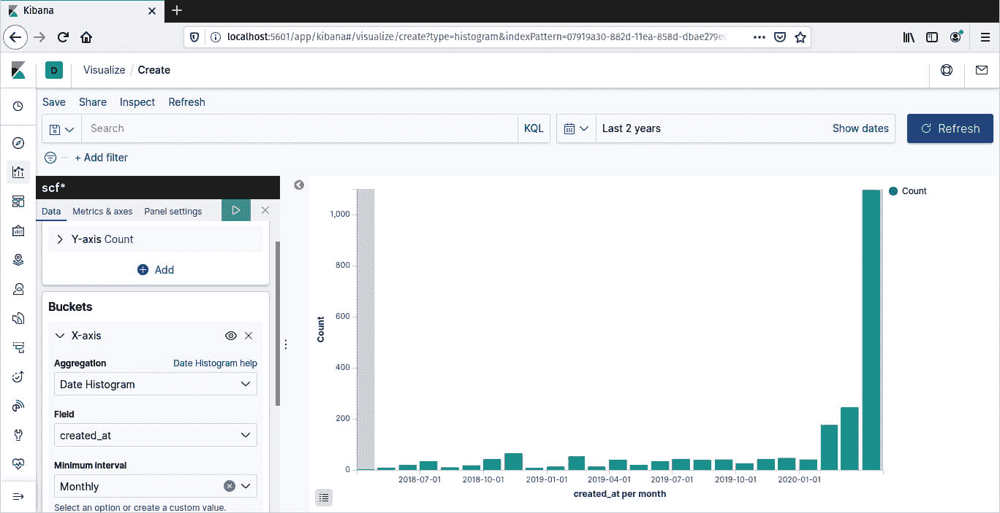

图 6.7 – 按月份创建的`created_at`计数的条形图

保存条形图并命名为`scf-bar`，或任何您能与之关联的 SeeClickFix 数据。

接下来，再次选择可视化并选择度量。您只需在**度量**选项下添加一个自定义标签。我选择了**问题**。通过这样做，您移除了默认的计数，该计数被放置在度量下的数字下面。这个可视化正在给我们提供问题的计数，并且当我们在仪表板上应用过滤器时将发生变化。配置如下面的截图所示：

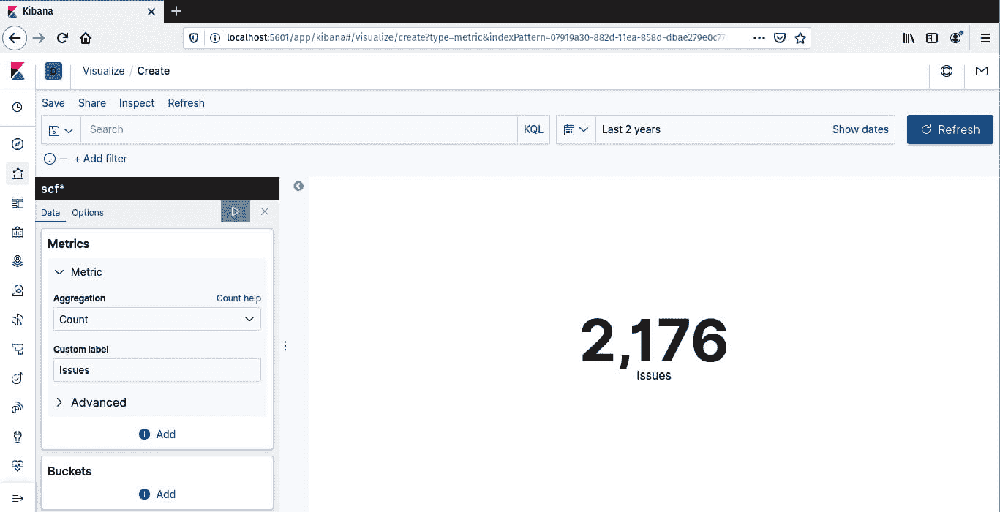

图 6.8 – 度量可视化配置

再次，使用任何约定保存可视化，或者像我一样以`scf`为前缀。

对于下一个可视化，选择饼图——默认为甜甜圈。在**桶**下选择**分割切片**。对于**聚合**，选择**术语**。对于**字段**，选择**request_type.title.keyword**。保留其余默认设置。这将给出前五个标题。结果如下面的截图所示：

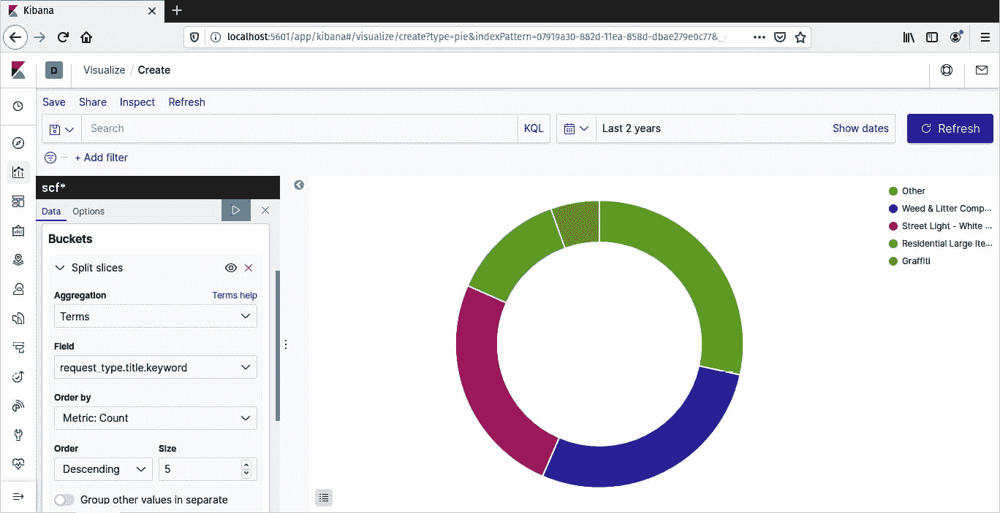

图 6.9 – 前五项问题标题

虽然不是可视化，但**Markdown**可以通过提供一些上下文或描述来为您的仪表板增加价值。从可视化选项中选择**Markdown**。您可以在左侧面板中输入 Markdown，通过点击运行符号，在右侧面板中查看预览。我刚刚添加了一个 H1 标题，一些文本，以及一个项目符号列表，如下面的截图所示：

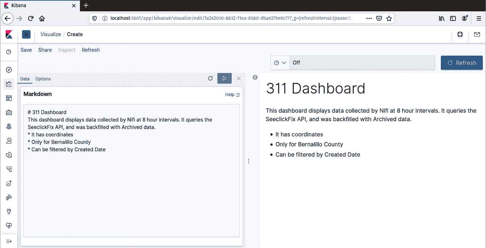

图 6.10 – 使用 Markdown 编辑器

最后一个可视化，`scf`。一旦进入地图屏幕，选择**添加图层**，源将是**文档**。这允许您选择一个索引。以下截图显示了您应该看到的内容：

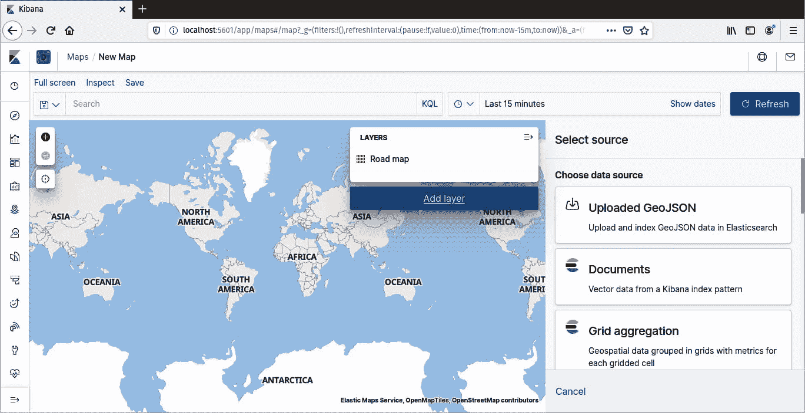

图 6.11 – 使用文档作为源添加新层

当您选择 `scf` 作为索引模式时，Kibana 将识别适当的字段并将数据添加到地图中。您的地图将是空的，您可能会想知道出了什么问题。Kibana 将时间过滤器设置为最后 15 分钟，并且您没有超过最后 8 小时的新数据。将过滤器设置为更长的时间范围，如果 `create_at` 字段在窗口中，数据将出现。以下截图显示了结果：

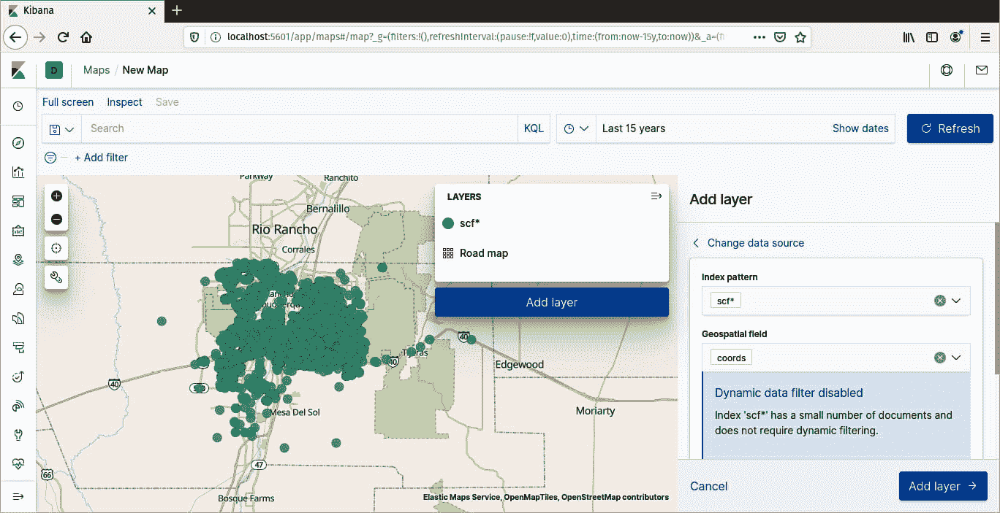

图 6.12 – 来自 Elasticsearch 索引的地图可视化

现在您已经从数据中创建了可视化，您可以继续将它们组合到一个仪表板中。下一节将向您展示如何操作。

## 创建仪表板

要构建仪表板，请选择工具栏上的仪表板图标。然后您将选择 `scf` – 或您用于保存可视化的任何名称。将它们添加到仪表板后，您可以调整它们的位置和大小。确保在设置完成后保存您的仪表板。以下截图显示了我在仪表板中构建的内容：

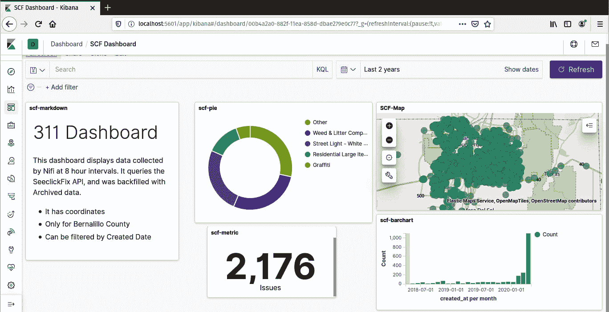

图 6.13 – SeeClickFix 仪表板

仪表板中添加了 Markdown、饼图、地图、指标和柱状图。我通过抓住面板的顶部来移动它们，通过抓住右下角来调整大小。您还可以点击齿轮图标并为您的面板添加新名称，这样它们就不会使用您保存可视化时使用的名称。

使用您的仪表板，您可以过滤数据，并且所有可视化都会相应改变。例如，我点击了饼图中的 Graffiti 标签，以下截图显示了结果：

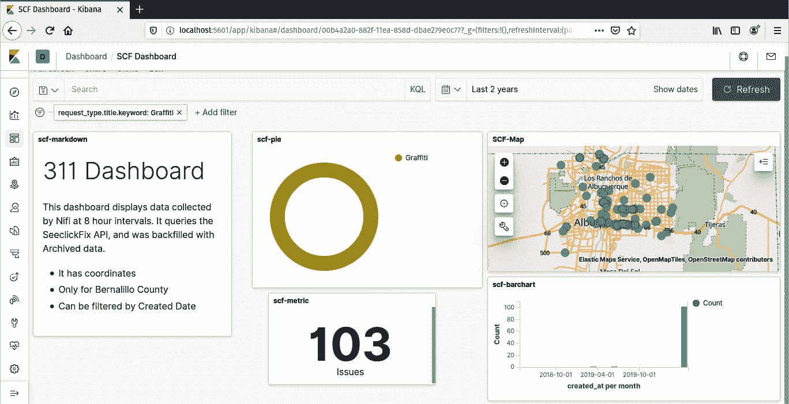

图 6.14 – 在涂鸦上过滤

使用过滤器时，度量可视化就派上用场了。知道记录的数量是件好事。您可以看到地图和柱状图也发生了变化。您还可以按日期范围进行过滤。我在过滤器中选择了最后 7 天，如下截图所示：

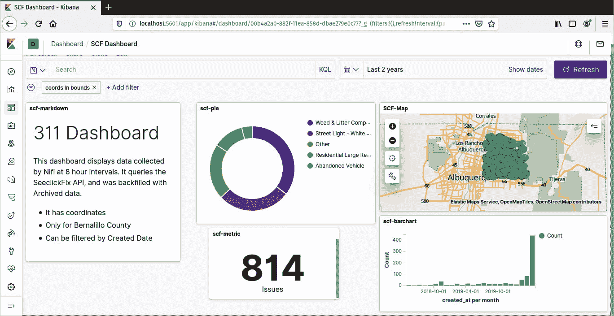

图 6.15 – 在仪表板中按时间过滤

时间过滤器允许您选择**现在**、**相对**或**绝对**。**相对**是指从**现在**起的一定天数、月数、年数等，而**绝对**允许您在日历上指定开始和结束时间。以下截图显示了七天过滤器的结果：

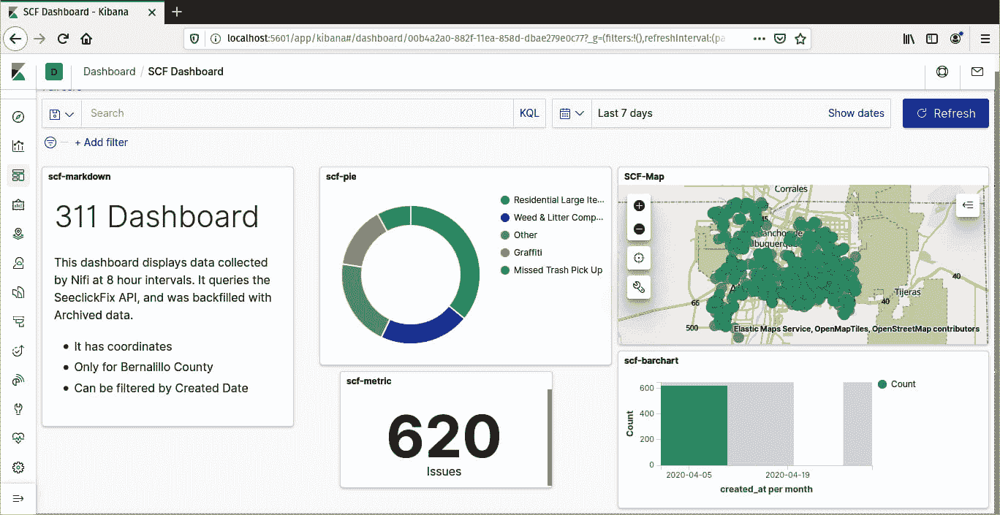

图 6.16 – 带有七天过滤器的仪表板

我将要展示的最后一种过滤器是地图过滤器。你可以在地图上选择一个区域或绘制一个多边形来过滤你的仪表板。通过点击地图工具图标，选项将如以下截图所示出现：

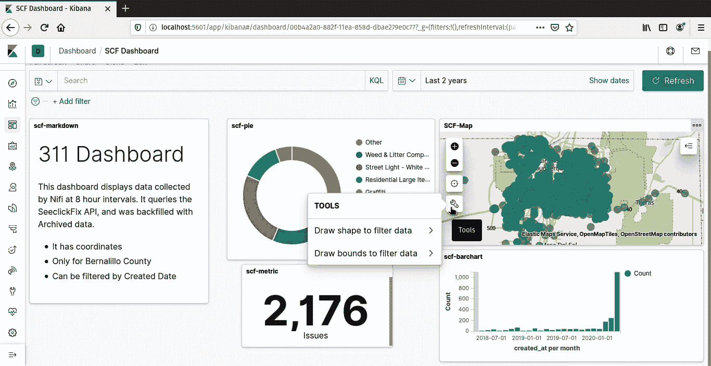

图 6.17 – 地图上的工具图标

使用**绘制**边界来过滤数据，我在地图上画了一个矩形，结果如下截图所示：

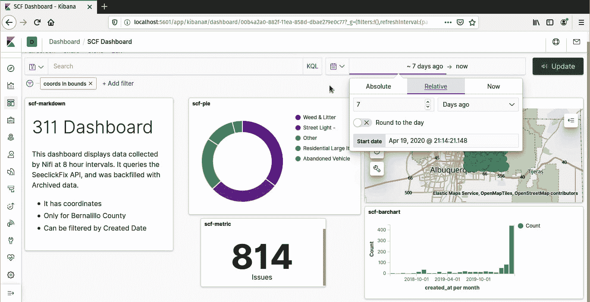

图 6.18 – 使用地图过滤数据

在前面的仪表板中，你可以看到完美的点矩形。地图过滤器是我最喜欢的过滤器之一。

Kibana 仪表板使你的数据管道对非数据工程师变得有用。你投入的数据移动和转换工作变成了可以由分析师和管理员用于探索和从数据中学习的实时数据。Kibana 仪表板也是你，作为数据工程师，可视化你提取、转换和加载的数据的绝佳方式，以查看你的数据管道中是否存在任何明显的问题。它们可以是一种调试工具。

# 摘要

在本章中，你学习了如何使用来自 REST API 的数据构建数据管道。你还向数据管道添加了一个流程，以便你可以回填数据，或者使用单个管道重新创建包含所有数据的数据库。

本章的后半部分提供了如何使用 Kibana 构建仪表板的基本概述。通常，仪表板的构建不会是数据工程师的责任。然而，在小公司中，这完全可能是你的工作。此外，能够快速构建仪表板可以帮助验证你的数据管道，并查找数据中可能存在的任何错误。

在下一章中，我们将开始本书的新章节，你将利用你学到的技能，通过使你的管道准备就绪用于生产来提高它们。你将学习关于部署、更好的验证技术以及在生产环境中运行管道时所需的其它技能。
