# *第八章*：使用 NiFi 注册表进行版本控制

在前面的章节中，您构建了几个数据管道，但我们遗漏了一个非常重要的组件——版本控制。任何优秀的软件开发者几乎都会在开始编写任何代码之前为他们的项目设置版本控制。为生产构建数据管道也是如此。数据工程师使用了许多与软件工程师相同的工具和流程。使用版本控制可以让您在无需担心破坏数据管道的情况下进行更改。您始终可以回滚到之前的版本。NiFi 注册表还允许您连接新的 NiFi 实例，并完全访问您现有的所有数据管道。在本章中，我们将涵盖以下主要主题：

+   安装和配置 NiFi 注册表

+   在 NiFi 中使用注册表

+   数据管道版本控制

+   使用 git-persistence 与 NiFi 注册表一起使用

# 安装和配置 NiFi 注册表

当您听到版本控制时，您可能已经习惯了听到 Git。在本章的后面部分，我们将使用 Git，但 Apache NiFi 有一个子项目可以处理我们所有的版本控制需求——NiFi 注册表：

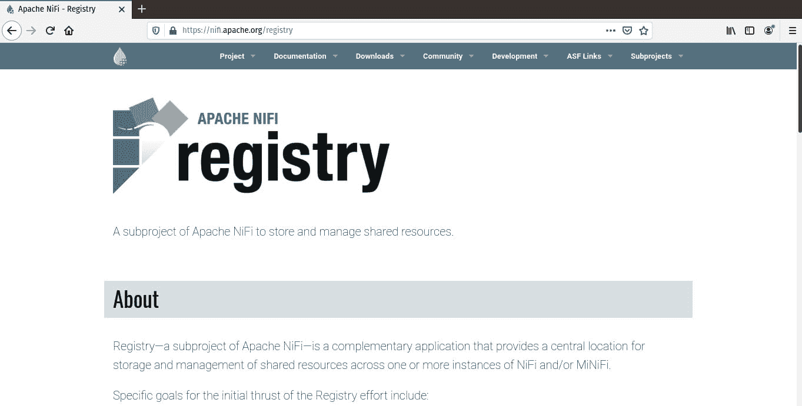

图 8.1 – NiFi 注册表主页

现在我们来安装注册表。

## 安装 NiFi 注册表

要安装 NiFi 注册表，请访问网站 [`nifi.apache.org/registry`](https://nifi.apache.org/registry) 并滚动到 **发布**。以下截图显示了可用的发布版本：

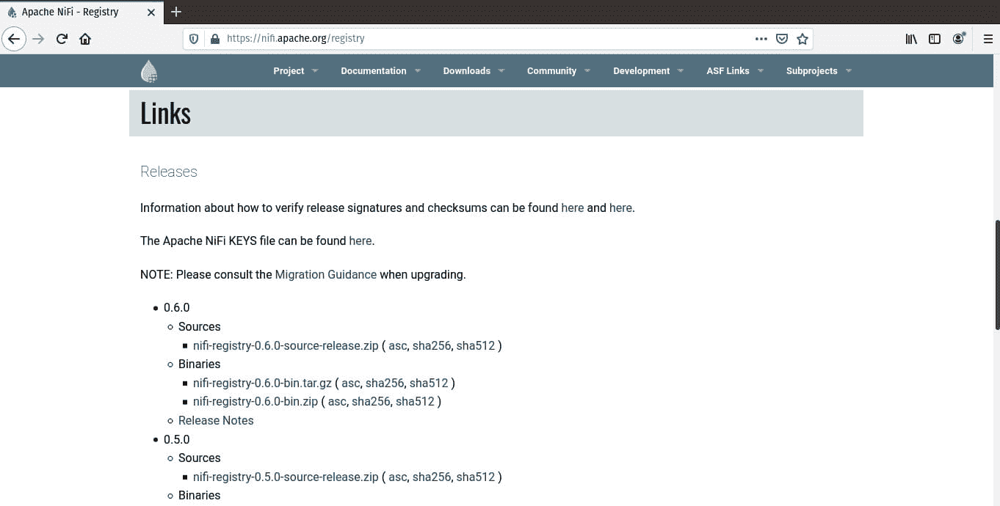

图 8.2 – NiFi 注册表

您将看到当前版本的源发布版和两个二进制文件，撰写本文时，版本号为 0.6.0。在 Windows 上，您可以下载 zip 版本，但由于我使用的是 Linux，我将下载 `nifi-registry-0.6.0-bin.tar.gz` 文件。

文件下载完成后，将其移动到您的家目录，提取内容，然后使用以下命令删除存档：

```py
mv Downloads/nifi-r* ~/
tar -xvzf nifi-registry-0.6.0-bin.tar.gz
rm nifi-registry-0.6.0-bin.tar.gz
```

现在，您将有一个名为 `nifi-registry-0.6.0` 的文件夹。要使用默认设置（HTTP 在端口 `18080` 上运行）运行注册表，从目录中，使用以下命令：

```py
sudo ./bin/nifi-registry.sh start
```

一旦启动了注册表，请通过 `http://localhost:18080/nifi-registry` 浏览到它。您应该看到以下屏幕：

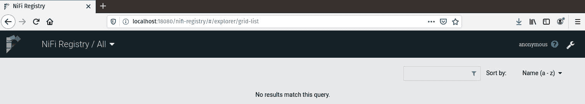

图 8.3 – NiFi 注册表

如您所见，它是空的，用户是匿名的。您没有更改任何默认设置或添加任何身份验证，并且您还没有添加任何数据管道。

NiFi 注册表使用桶来存储您的数据管道。桶类似于文件夹。您可以分组相似的管道，或者为每个源创建一个文件夹，或者为目的地创建一个文件夹，或者以任何适合您需求和用例的方式创建。下一节将指导您配置 NiFi 注册表。

## 配置 NiFi 注册表

注册表启动并运行后，您需要创建一个文件夹来存放您的数据管道。要创建文件夹，点击屏幕右上角的扳手。屏幕上会出现一个弹出窗口。点击 **新建存储桶** 按钮。在下一个弹出窗口中，输入存储桶名称，如图下所示：

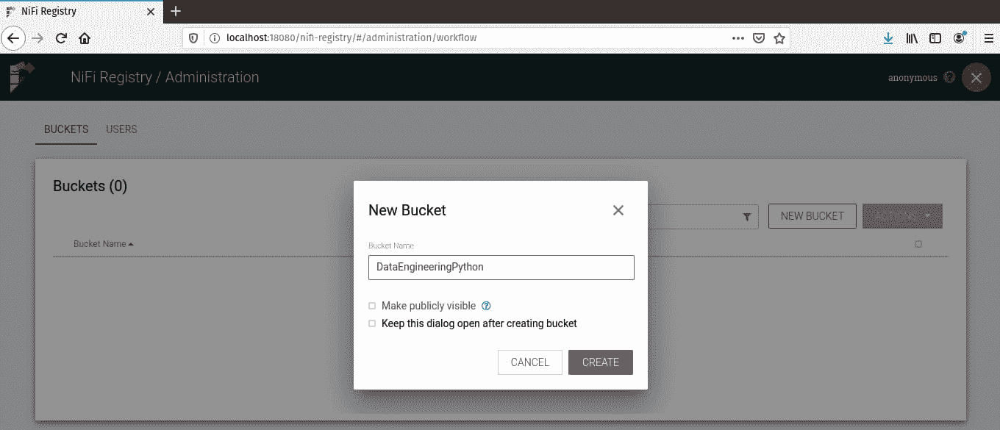

图 8.4 – 创建新的存储桶

一旦创建了存储桶，您将在主注册表屏幕上看到它。您的注册表现在应该看起来像以下截图：

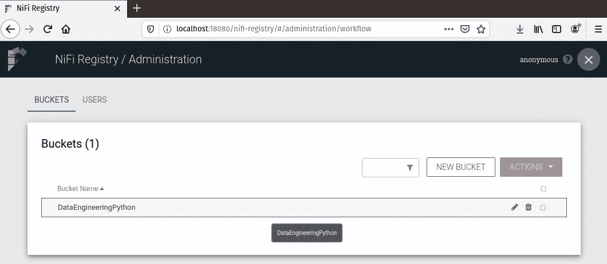

图 8.5 – 带有新存储桶的注册表

现在您已经部署了注册表并创建了一个存储桶，您现在可以将其注册到 NiFi 中并开始对数据管道进行版本控制。下一节将引导您完成此过程。

# 在 NiFi 中使用注册表

注册表已启动并运行，现在您需要告诉 NiFi 关于它的信息，以便您可以使用它来对数据管道进行版本控制。NiFi 图形用户界面将处理所有配置和版本控制。在下一节中，您将向 NiFi 添加注册表。

## 将注册表添加到 NiFi

要将注册表添加到 NiFi，点击窗口右上角的网格菜单，然后从下拉菜单中选择 **控制器设置**，如图下所示：

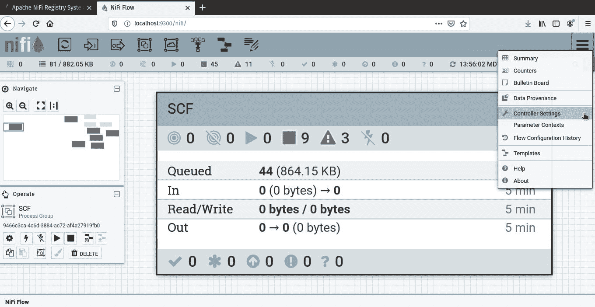

图 8.6 – Nifi 中的控制器设置

在 **控制器设置** 弹出窗口中，有几个选项卡。您将选择最后一个选项卡—**注册表客户端**。点击窗口右上角的加号，您将添加您的注册表，如图下所示：

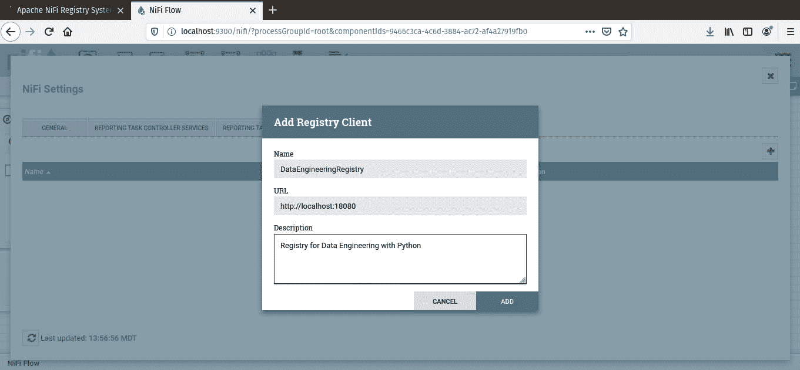

图 8.7 – 将 NiFi 注册表添加到 NiFi

点击 **添加** 按钮后，您的注册表将连接到 NiFi。关闭窗口，您将进入主 NiFi 画布。现在您已经准备好对数据管道进行版本控制了。

# 对数据管道进行版本控制

您可以使用 NiFi 注册表在处理器组内部对数据管道进行版本控制。我正在运行 NiFi，并将画布缩放到来自 *第六章**，构建 311 数据管道* 的 `SeeClickFix` 处理器组。要开始对此数据管道进行版本控制，右键单击处理器组标题栏并选择 **版本** | **启动版本控制**，如图下所示：

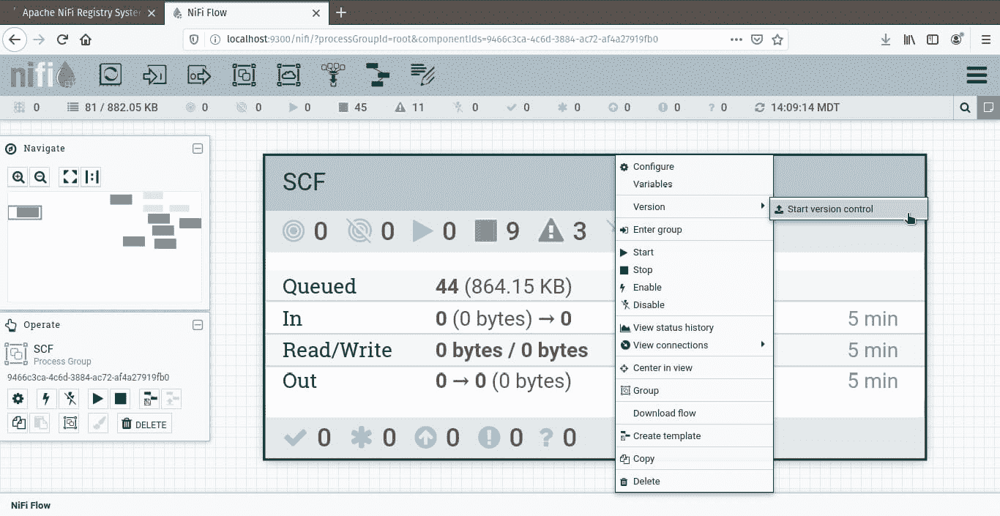

图 8.8 – 在处理器组上启动版本控制

您的处理器组现在正在通过版本控制进行跟踪。您将在处理器组标题框的左侧看到一个绿色勾号，如图下所示：

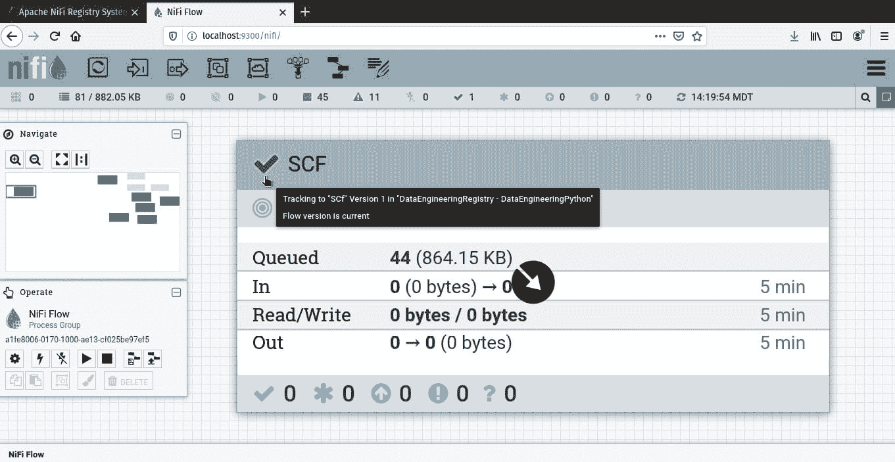

图 8.9 – 使用版本控制的处理器组

如果你浏览回 NiFi 注册表，你会看到 **Scf-DataEngineeringPython** 正在被跟踪。你还可以通过展开条形图来查看详细信息。详细信息显示了你的描述和版本说明（**第一次提交**），以及一些标识符。结果如下面的截图所示：


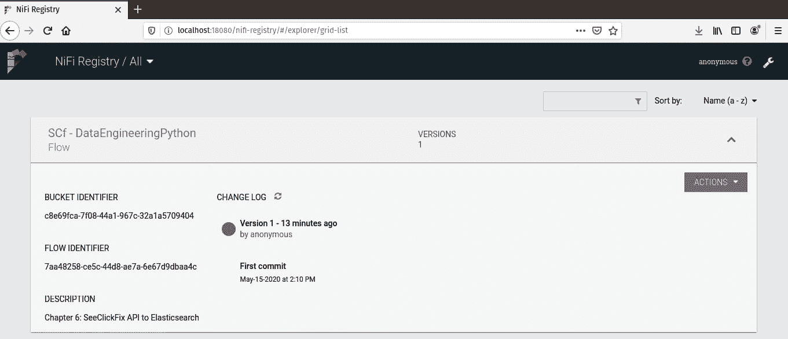

图 8.10 – 注册表中数据管道的详细信息

你没有在注册表中跟踪数据管道。在下一节中，你将进行更改并更新注册表。

### 编辑版本化管道

在正常的工作流程中，你会创建一个处理器组并将其添加到注册表（换句话说，开始版本化处理器）。然后你会进行更改，并将这些更改提交到注册表，并始终确保你使用的是适当的版本。

让我们对 SeeClickFix 数据管道进行更改。你的管道正在运行，一切工作得非常完美。然后你的主管说有一个新的仓库需要开始接收 SeeClickFix 数据。你不需要构建新的数据管道；你只需要将仓库添加到当前的管道中。进入处理器组，我在原始处理器旁边添加了一个 `NewDataWarehouse` 处理器。以下截图显示了更改：


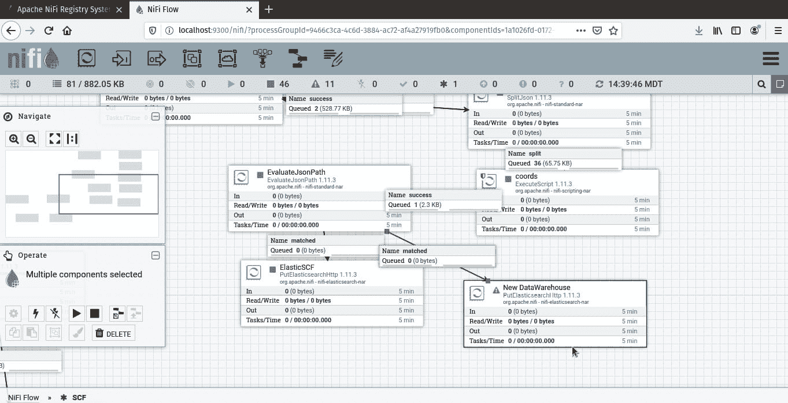

图 8.11 – 将新的数据仓库添加到数据管道

退出处理器组回到主画布。查看处理器组的标题栏，你会看到绿色的勾号消失了，取而代之的是一个星号。将鼠标悬停在其上，会显示所做的本地更改，如下面的截图所示：


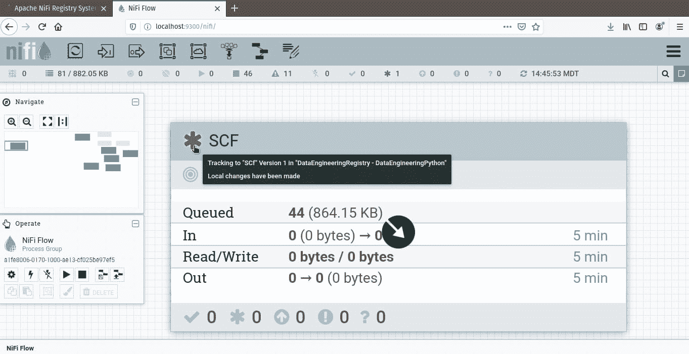

图 8.12 – 处理器组内已进行本地更改

在进行任何更改后，你需要提交这些更改，并将它们添加到注册表中。右键单击标题栏并选择**版本**。在提交本地更改之前，让我们查看更改。选择**显示本地更改**。以下截图显示了更改：


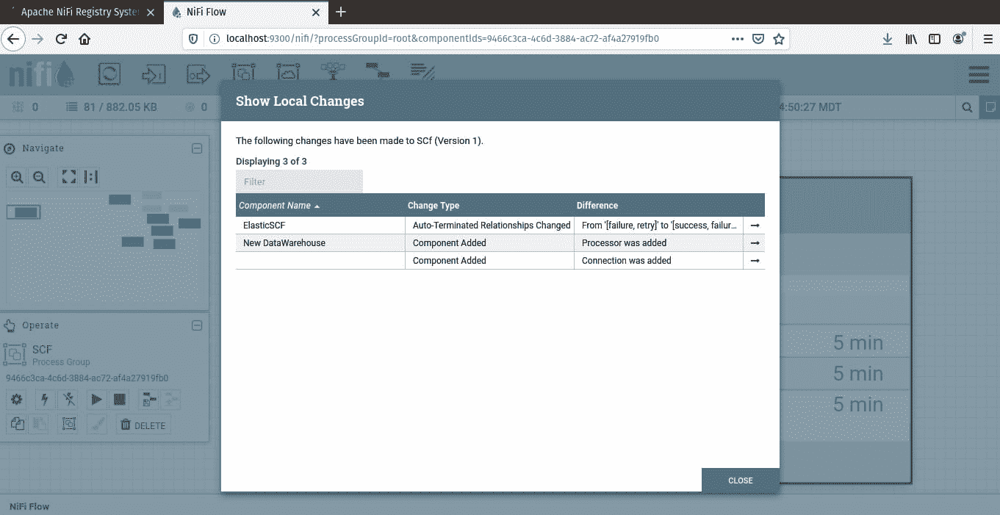

图 8.13 – 显示本地更改

如前一个截图所示，添加了一个处理器和一个关系。现在你可以选择**版本** | **提交本地更改**来将它们添加到注册表。你将被提示添加一个描述。一旦保存，你将在标题栏中看到一个绿色的勾号。NiFi 注册表现在将显示你有两个版本，并将显示最新版本的详细信息。

使用多个版本，你现在可以右键单击标题栏并选择**版本** | **更改版本**。更改为**版本 1**将导致一个带有向上箭头的橙色圆圈警告你，你正在使用不是最新版本。

当处理器组被版本控制跟踪时，你可以进行更改、回滚并提交新的更改。如果你犯了一个错误，你可以回滚你的工作并重新开始。但你也可以导入其他用户可能在他们的本地 NiFi 开发副本中创建的处理器。下一节将向你展示如何操作。

### 从 NiFi 注册表中导入处理器组

让我们假设你和另一位工作人员正在你自己的 NiFi 本地副本中构建数据管道。你们都将更改提交到 NiFi 注册表，就像软件开发者使用 Git 一样。现在你被分配去修复你的同事正在努力解决的问题。你如何使用他们的工作？你可以让他们导出一个模板，然后你可以导入它。这是在注册表之前事情通常是如何做的。但现在，你将使用注册表。

将处理器组拖动到 NiFi 画布上。注意，在为组命名文本框下方，现在有一个导入选项，如下截图所示：

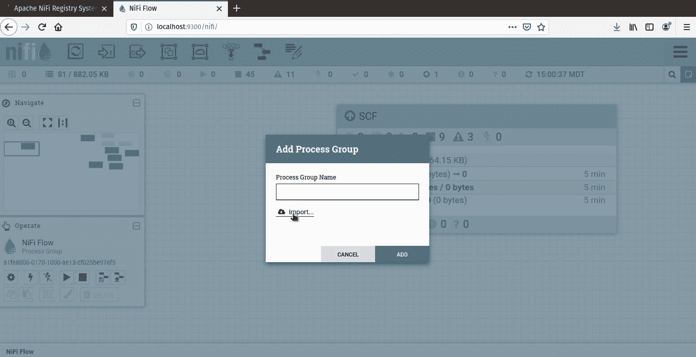

Figure 8.14 – 现在处理器组有导入选项

现在 NiFi 可以访问 NiFi 注册表，它已经添加了导入处理器组的选项。通过点击**导入**，你将能够选择一个注册表、一个桶和一个流程。在下面的截图中，我选择了**SCf**流程：

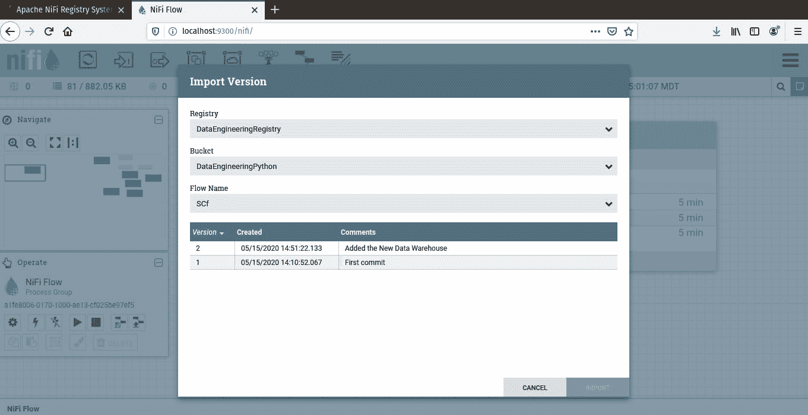

Figure 8.15 – 选择流程和版本

导入流程后，你可以看到它现在已经被添加到画布上。在前一节中，我将处理器组改回**版本 1**，所以你可以看到我有一个版本，带有橙色圆圈和箭头，以及导入的当前版本带有绿色勾选标记。

当你引入新的数据工程师，或者设置新的 NiFi 实例时，你可以将所有生产管道导入到新的环境中。这保证了每个人都在相同的源上工作，同时也保证了所有更改在开发环境之间被跟踪和共享。

# 使用 NiFi 注册表进行 git-persistence

就像软件开发者一样，你也可以使用 Git 来进行你的数据处理管道的版本控制。NiFi 注册表允许你通过一些配置使用 git-persistence。要使用 Git 进行数据处理管道的版本控制，你首先需要创建一个仓库。

登录到 GitHub 并为你的数据处理管道创建一个仓库。我已经登录到我的账户并创建了如下截图所示的仓库：

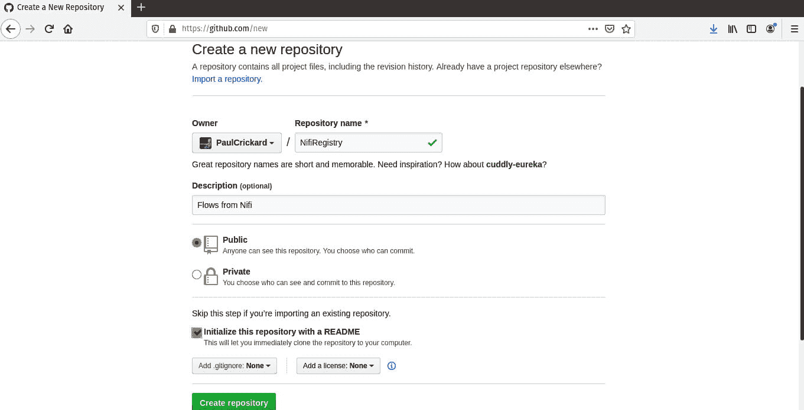

Figure 8.16 – 创建 GitHub 仓库

在创建存储库后，你需要为注册表创建一个访问令牌，以便它可以使用该令牌读取和写入存储库。在 GitHub**设置**中，转到**开发者设置**，然后**个人访问令牌**，然后点击以下截图所示的**生成个人访问令牌**超链接：

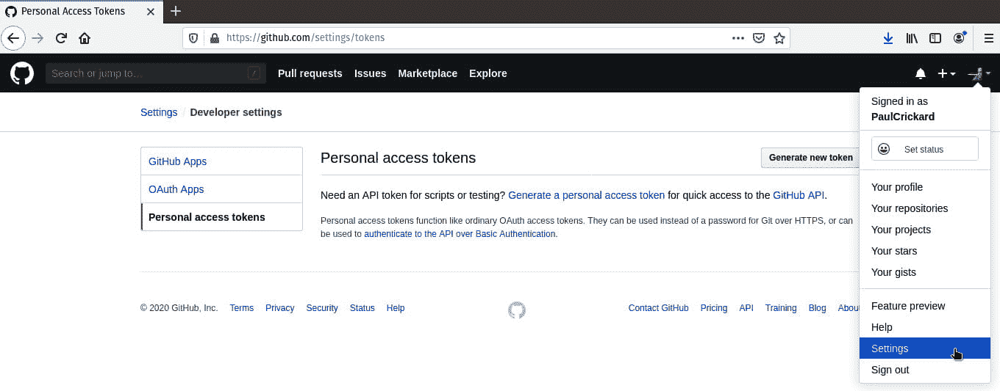

图 8.17 – 创建访问令牌的设置

你可以为此令牌添加一个备注，以便你可以记住使用它的服务。然后选择作用域访问——勾选 repo 标题。以下截图显示了设置：

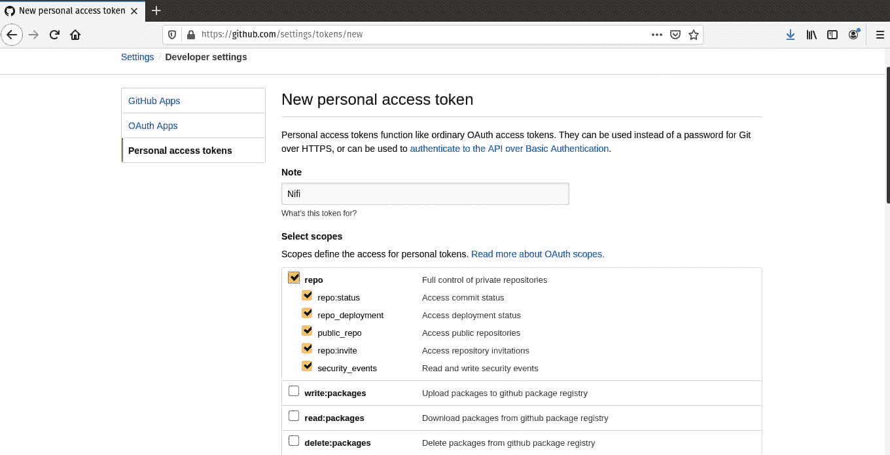

图 8.18 – 分配访问令牌作用域

现在，将存储库克隆到你的本地文件系统中。你可以通过点击 GitHub 存储库中的**克隆或下载**按钮来获取链接。然后，在你的终端中运行以下命令来克隆它：

```py
git clone https://github.com/PaulCrickard/NifiRegistry.git
```

你将看到一些输出，并且现在应该将存储库作为一个文件夹放在当前目录中。命令的输出如下截图所示：

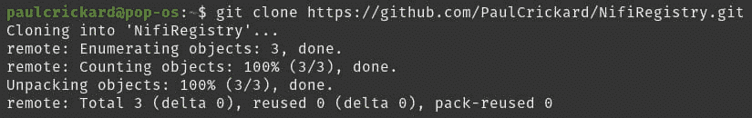

图 8.19 – 克隆 GitHub 存储库

你需要将 GitHub 信息输入到 NiFi 注册表中。你可以在`conf`目录下的`providers.xml`文件中这样做。你将在名为`flowPersistenceProvider`的标题下方进行编辑。配置如下截图所示：


图 8.20 – 在`providers.xml`中将 GitHub 信息添加到注册表中

修改`providers.xml`文件后，你需要重新启动注册表。你可以使用以下命令来重新启动它：

```py
sudo ./bin/nifi-registry.sh start
```

当注册表重新启动时，前往你的 NiFi 画布，并将第三个数据仓库添加到`SeeClickFix`处理器组中。当你退出组时，你会看到有一些本地更改尚未提交——绿色的勾号消失了，出现了一个星号。在标题菜单上右键单击，然后选择**版本**然后**提交本地版本**。这次会花费更长的时间，因为文件正在发送到你的 GitHub 存储库。

查看 NiFi 注册表，你可以看到我现在有三个版本，如下截图所示：

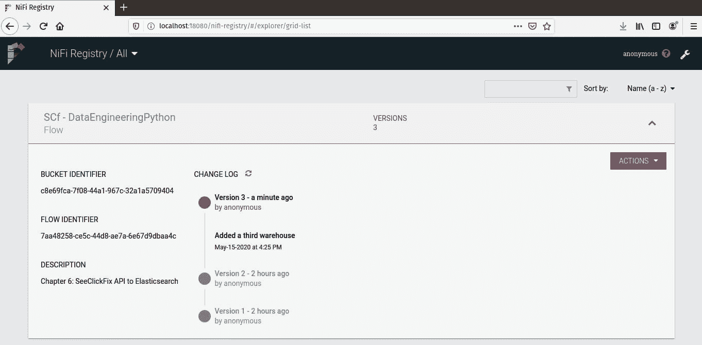

图 8.21 – 版本 3 在注册表中

浏览到存储库，你会看到为注册表中的存储桶名称创建了一个文件夹，然后添加了流程数据。以下截图显示了文件夹的内容：

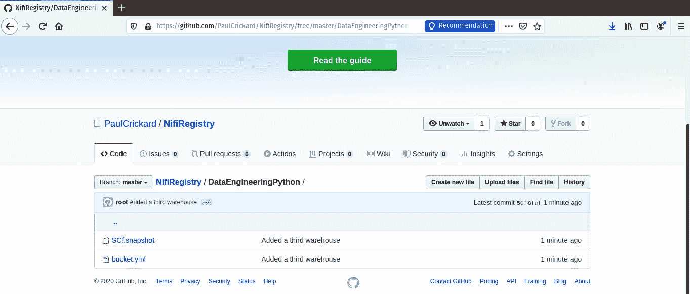

图 8.22 – 注册表存储桶和保存到 GitHub 存储库中的流程

现在您的数据管道正在通过 NiFi 注册表使用版本控制，并持久化存储在您本地的磁盘和 GitHub 在线上。

恭喜您，您现在拥有了一个功能齐全的 NiFi 注册表，并将您的数据管道保存到了 Git 仓库中。在您的职业生涯的某个时刻，您将需要运行一个类似于几个月前您所做的那样数据管道。而不再是翻阅您的文件并试图回忆起当时您所做的一切，现在您可以通过浏览到您的 NiFi 注册表并选择适当的数据管道版本。如果您的服务器崩溃并且一切丢失？现在您可以通过重新安装 NiFi 并将其连接到由 Git 仓库支持的 NiFi 注册表来恢复您所有的辛勤工作。

# 摘要

在本章中，您学习了生产数据管道最重要的功能之一：版本控制。软件开发者不会在没有使用版本控制的情况下编写代码，数据工程师也不应该这样做。您已经学习了如何安装和配置 Nifi 注册表，以及如何开始跟踪处理器组的版本。最后，您现在能够将版本持久化到 GitHub。对您的数据管道的任何更改都将被保存，如果您需要回滚，您也可以这样做。随着您的团队壮大，所有数据工程师都将能够管理数据管道，并确保他们拥有最新版本，同时在本地上进行开发。

在下一章中，您将学习如何记录和监控您的数据管道。如果出现问题，这是不可避免的，您将需要了解它。良好的数据管道记录和监控将允许您在发生错误时捕捉到错误，并调试它们以恢复您的数据流。
