# *第九章*：监控数据管道

您现在知道如何构建生产就绪的数据管道——它们是幂等的、使用原子事务，并且是版本控制的。它们准备好在生产环境中运行，但在您部署它们之前，您需要能够监控它们。代码、数据、网络或其他您无法控制区域可能会出现错误。您需要知道错误何时发生，以及何时一切按预期运行。

在本章中，我们将涵盖以下主要主题：

+   在 GUI 中监控 NiFi

+   使用处理器监控 NiFi

+   使用 Python 和 REST API 监控 NiFi

# 使用 GUI 监控 NiFi

NiFi GUI 提供了几种监控数据管道的方法。使用 GUI 是开始监控 NiFi 实例的最简单方法。

## 使用状态栏监控 NiFi

您需要的大部分信息都在状态栏上。状态栏位于组件工具栏下方，如下面的屏幕截图所示：


图 9.1 – 组件和状态工具栏

从状态栏的左侧开始，让我们看看正在监控的内容：

+   **活动线程**：这可以让您知道有多少线程正在运行。您可以了解任务和负载。

+   **总排队数据**：flowfiles 的数量和磁盘上的总大小。

+   **是否传输远程进程组和不传输远程进程组**：您可以在多台机器或同一台机器上的多个实例上运行 NiFi，并允许进程组进行通信。这些图标告诉您它们是否正在通信。

+   **运行中的组件、停止的组件、无效的组件和禁用的组件**：这些显示您组件的状态。运行不一定意味着组件当前正在处理数据，但表示它已开启并计划这样做。

+   **最新版本的进程组、本地修改的版本化进程组、过时的版本化进程组、本地修改和过时的版本化进程组以及同步失败版本化进程组**：这组图标显示了您的处理器组的版本信息。从这里您可以判断是否有未提交的更改或是否使用较旧版本。

+   **最后刷新**：这可以让您知道工具栏中的数据何时有效。刷新通常每五分钟进行一次。

状态栏为您提供所有处理器的监控信息，但每个处理器组以及每个处理器都有一个状态工具栏。您可以在以下屏幕截图中看到相同指标的监控状态：

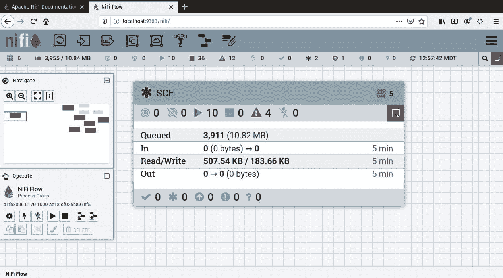

图 9.2 – 处理器组监控

**输入**和**输出**指标显示是否有数据从另一个处理器或组流入处理组。您将在下一章中学习如何连接处理器组。版本信息不在工具栏上，而在处理器组标题的左侧。处理器组右侧的红色方块是一个**公告**。这提供了处理器组内错误的信息。悬停在它上面会显示错误，如下面的屏幕截图所示：

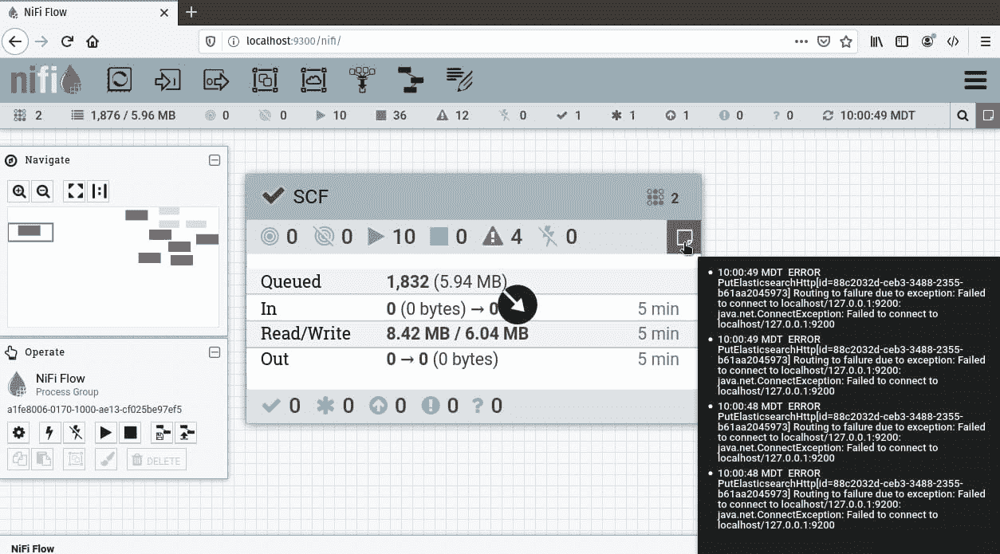

图 9.3 – 查看处理器组的公告

我目前没有运行 Elasticsearch，因此将数据发送到 Elasticsearch 的处理器由于连接超时而失败。如果您进入处理器组，您可以看到特定处理器的公告，如下面的屏幕截图所示：

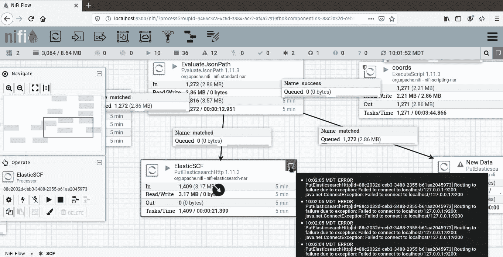

图 9.4 – 特定处理器的公告

要更改公告消息，您可以在**设置**下的处理器配置中调整级别。**公告级别**下拉菜单允许您根据严重性显示更多或更少的内容，如下面的屏幕截图所示：

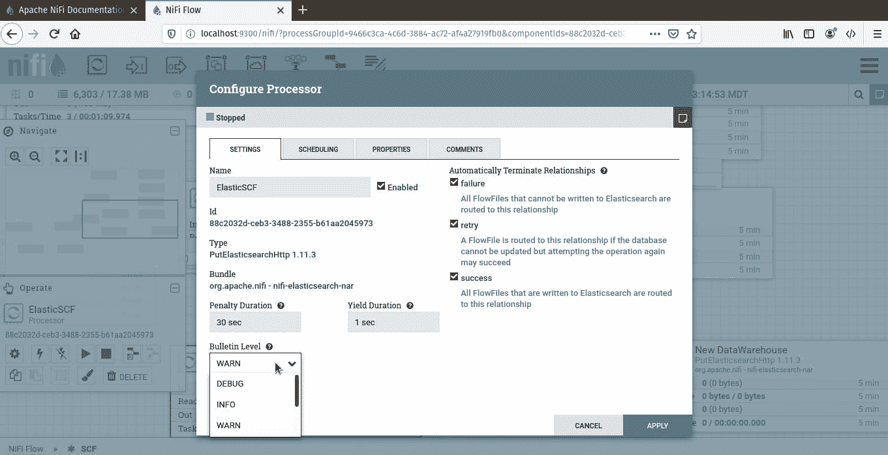

图 9.5 – 设置公告级别

您可以使用**公告板**查看所有 NiFi 处理器的公告信息，公告板可通过 NiFi 上方右角的格子菜单访问。选择**公告板**将显示所有消息，如下面的屏幕截图所示：

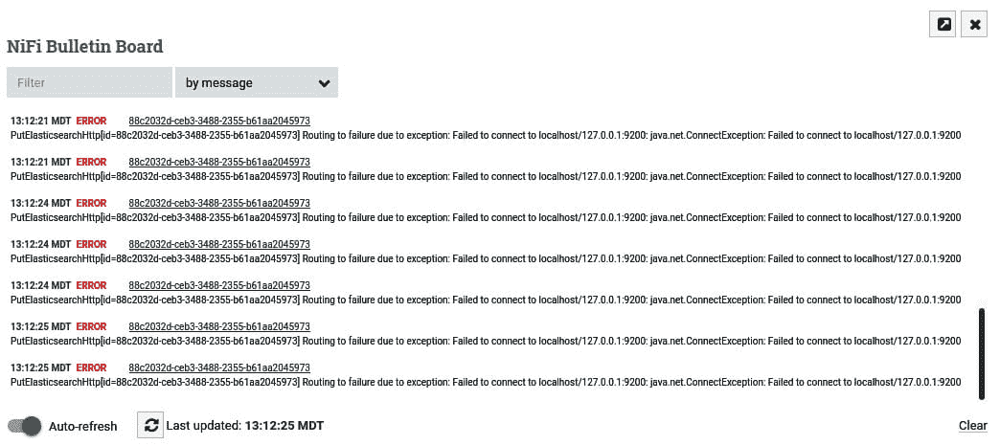

图 9.6 – 显示所有通知的公告板

在每个处理器组中，每个处理器也有状态信息，如下面的屏幕截图所示：

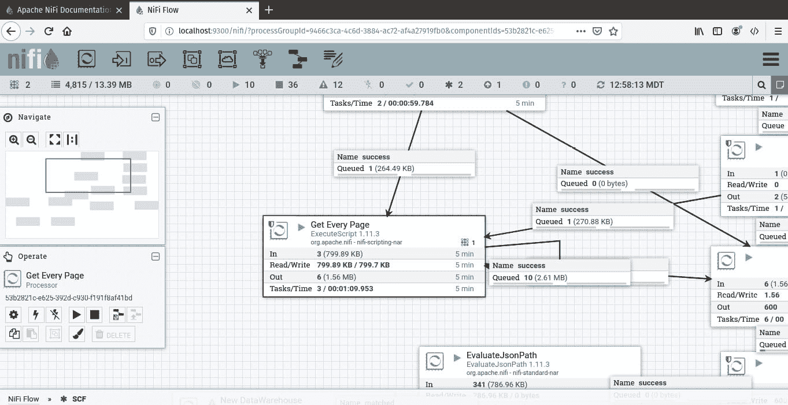

图 9.7 – 单个处理器的状态

处理器中的**输入**和**输出**指标显示在过去五分钟内有多少数据（流文件大小）通过了处理器。

### 使用计数器

与公告类似，您可以创建递增或递减计数器。计数器不会告诉您某事是否成功或失败，但它们可以给您一个关于在任何数据管道中的任何一点正在处理多少流文件的线索。

在 `EvaluateJsonPath` 和 `ElasticSCF` 处理器之间的 `UpdateCounter` 处理器中。这意味着在流文件被插入 Elasticsearch 之前，计数器将被更新。流程如下面的屏幕截图所示：

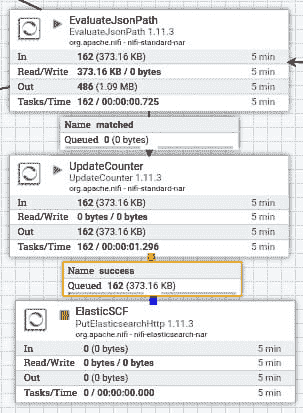

图 9.8 – 添加到数据管道的 UpdateCounter 处理器

如前述截图所示，162 个 flowfiles 通过处理器发送。你将在本节后面的内容中看到这些结果。但首先，为了配置处理器，你需要指定**计数器名称**和**增量**。**增量**是增加或减少的数值。我已经按照以下截图所示配置了处理器：

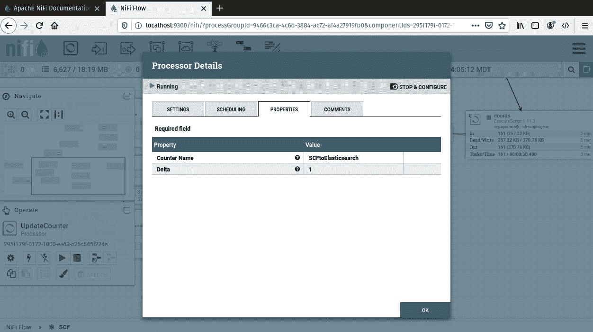

Figure 9.9 – UpdateCounter 处理器的配置

当你配置了处理器并运行了数据管道后，你将有一个计数。在我运行它之前，162 条记录通过了数据管道。要查看你的计数器，点击 NiFi 窗口右上角的蜂巢菜单，并选择**计数器**，如图所示：

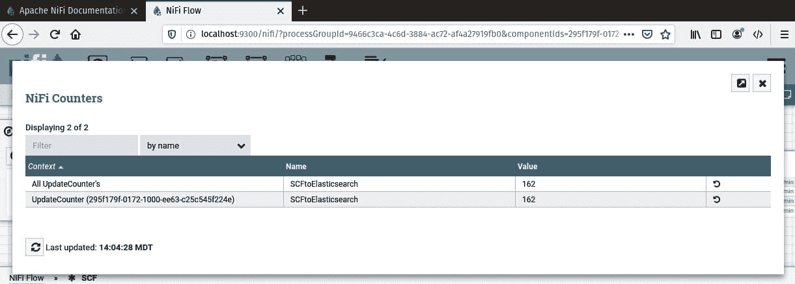

Figure 9.10 – NiFi 计数器

上述截图显示了计数器的计数和聚合值。如果我们有其他更新相同计数器的`UpdateCounter`处理器，它将聚合这些值。

使用 GUI 是快速查看你的处理器组和处理器运行情况的好方法。但你也可以使用处理器来监控数据管道。

在上一节中，你学习了关于 NiFi 公告板的内容。你可以使用后台任务来监控 NiFi，并通过报告任务将数据发布到 NiFi 公告板。报告任务就像在后台运行的处理器，执行任务。结果将显示在公告板中，或者你可以将其发送到其他位置。

要创建报告任务，在蜂巢菜单中选择**控制器设置**，然后导航到**报告任务**选项卡。列表应该是空的，但你可以在窗口右上角的加号处添加一个新任务。你将看到可用任务的列表。单击其中一个以查看描述。你应该会看到一个类似于以下截图的列表：

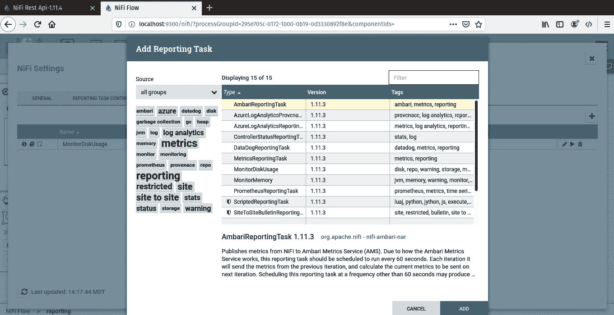

Figure 9.11 – NiFi 中可用的报告任务

对于这个示例，双击**MonitorDiskUsage**任务。它将出现在可编辑的列表中。点击铅笔图标进行编辑，将**阈值**设置为**1%**，并将目录设置为您的 NiFi 目录。配置将类似于以下截图：

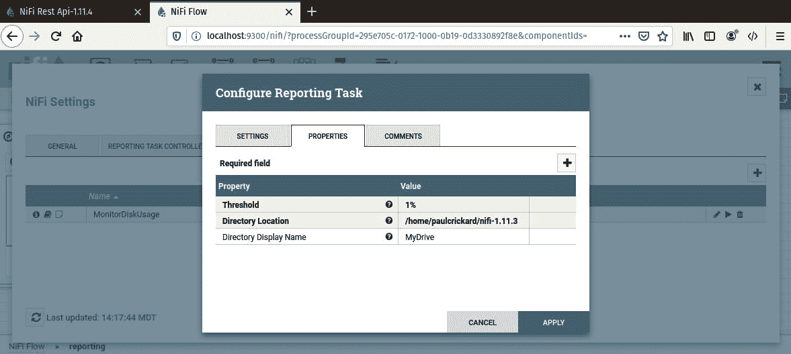

Figure 9.12 – 配置 MonitorDiskUsage 任务

你可以使用百分比或 20 千兆字节这样的值。我将其设置为 1%，以便将其发布到公告板。我选择 NiFi 目录，因为它包含所有日志和存储库。

运行**报告任务**处理器，你应该在主 NiFi 窗口中看到一个公告板。消息将是**MonitorDiskUsage**任务超过了 1%的阈值。以下截图显示了公告板：

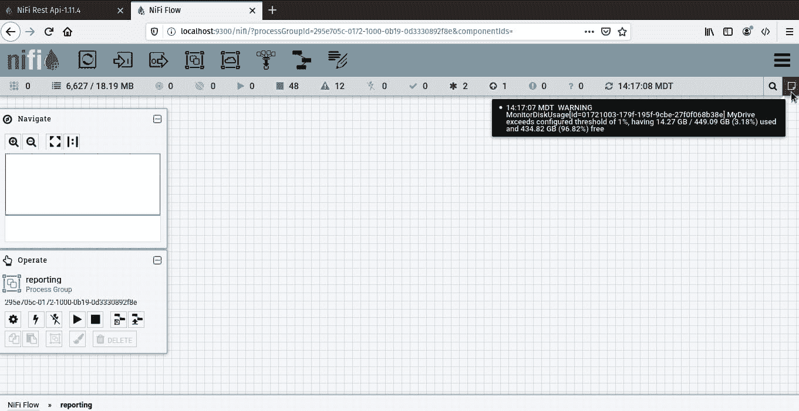

图 9.13 – 报告任务公告

您可以为许多其他指标创建报告任务。使用 GUI 很有用且方便，但您很可能无法整天坐在 NiFi 前观看。这将非常低效。更好的方法是将 NiFi 发送给您消息。您可以使用处理器来实现这一点。下一节将向您展示如何操作。

# 使用处理器监控 NiFi

而不是依赖于监视 NiFi GUI，您可以在数据管道中插入一个处理器来报告管道正在发生的事情。例如，您可以使用`PutSlack`处理器在失败或成功时发送消息。

要发送 Slack 消息，您需要在您的 Slack 工作区中创建一个应用。您可以通过浏览到[`api.slack.com/apps`](https://api.slack.com/apps)来完成此操作。点击**创建新应用**，如下面的截图所示：

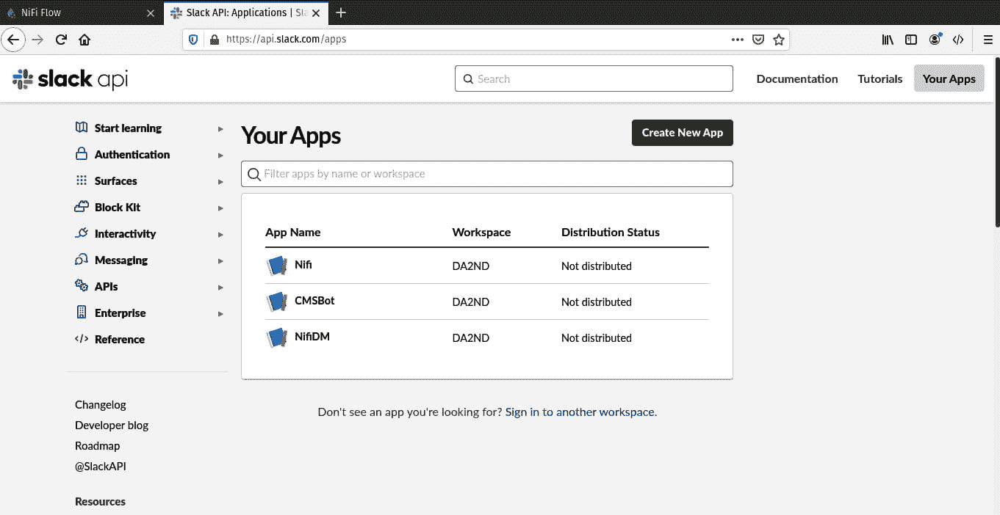

图 9.14 – 创建新应用

Slack 将要求您为应用命名，然后选择一个工作区，如下面的截图所示：

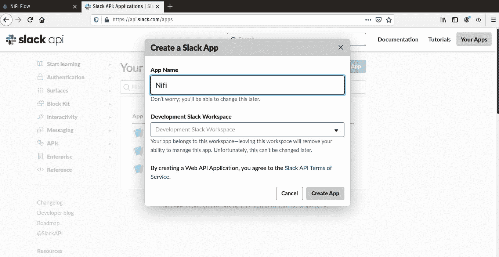

图 9.15 – 为您的应用指定名称和工作区

完成后，您将被重定向到应用页面。在**功能**标题下，点击**入站 Webhooks**并开启它，如下面的截图所示：

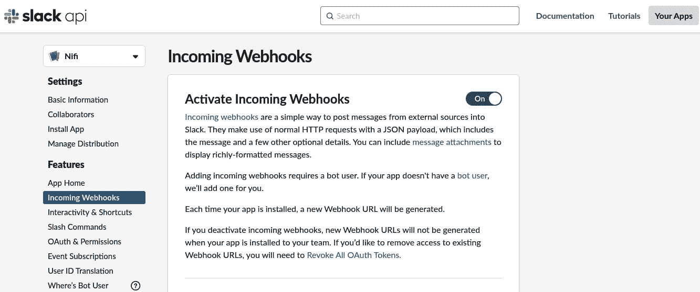

图 9.16 – 激活入站 Webhooks

您将被要求选择一个用于 Webhook 的通道。我选择了自己，以便通道成为直接发给我的消息。您可以为数据管道创建一个通道，以便多个人可以加入并查看消息。完成此步骤后，滚动到页面底部以查看新的 Webhook。点击复制按钮并打开 NiFi。现在是时候将`PutSlack`添加到您的数据管道中。

在 NiFi 中，我打开了**SCF**处理器组。我找到了**ElasticSCF**处理器——将问题发送到 Elasticsearch 的处理器。将处理器图标从控制工具栏拖放到画布上，并选择**PutSlack**。为关系失败创建**ElasticSCF**和**PutSlack**之间的连接，如下面的截图所示：

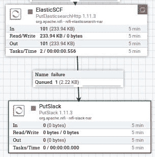

图 9.17 – 将 PutSlack 添加到数据管道的末尾

要配置 `PutSlack` 处理器，将复制的 URL 粘贴到 **Webhook URL** 属性。NiFi 会隐藏 URL，因为它是一个敏感属性。**Username** 属性是你希望 Slack 在发送消息时显示的内容。你也可以设置一个图标或表情符号。**Webhook Text** 属性是将会发送的消息。你可以将消息设置为纯文本，说明处理器失败，或者因为 **Webhook Text** 属性接受 NiFi 表达式语言，你可以使用流文件属性和文本的组合。我已将处理器配置如下所示：

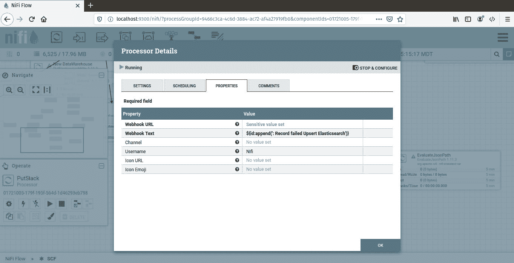


图 9.18 – PutSlack 配置

我使用了 NiFi 表达式语言的附加方法。该语句如下：

```py
${id:append(': Record failed Upsert Elasticsearch')}
```

前面的语句获取 `id` 属性，`${id},` 并调用 `append`，`:append()`。在 `append()` 方法内部是文本。结果将是一个像以下截图所示的消息：

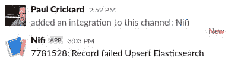


图 9.19 – 来自 NiFi 的 Slack 直接消息

前面的截图是我的直接消息。你可以看到我已将 NiFi 集成到工作区，然后收到了来自 NiFi 的消息。消息是 **SeeClickFix** 问题的 ID 以及一些说明它失败的文本。我现在可以采取行动。

你可以使用处理器发送电子邮件、写入文件或执行许多其他监控数据管道的操作。你还可以使用 Python 在 NiFi 之外编写自己的监控应用程序。下一节将介绍 NiFi REST API。

# 使用 Python 和 NiFi REST API

使用 Python 和 NiFi REST API，你可以编写自己的监控工具，或者搭建仪表板。NiFi REST API 文档位于 [`nifi.apache.org/docs/nifi-docs/rest-api/index.html`](https://nifi.apache.org/docs/nifi-docs/rest-api/index.html)。你可以通过类型查看所有不同的端点以及它们的一些信息。本节将突出显示一些你在本章中通过 GUI 覆盖的端点。

我们可以首先查看系统诊断。系统诊断将显示你的资源使用情况。你可以看到堆大小、线程、存储库使用情况以及几个其他指标。要使用 requests 调用端点，你可以使用以下代码：

```py
r=requests.get('http://localhost:9300/nifi-api/system-diagnostics')
data=r.json()
data['systemDiagnostics']['aggregateSnapshot']['maxHeap']
#'512 MB'
data['systemDiagnostics']['aggregateSnapshot']['totalThreads']
#108
data['systemDiagnostics']['aggregateSnapshot']['heapUtilization']
#'81.0%'
```

其他感兴趣的端点是处理器组。使用此端点，你可以找到任何处理器组的基本信息。你需要在 NiFi 中获取组 ID。你可以在 URL 中找到它作为 `processGroupId` 参数。有了它，你可以使用过程组端点，如下面的代码所示：

```py
pg=requests.get('http://localhost:9300/nifi-api/process-groups/9466c3ca-4c6d-3884-ac72-af4a27919fb0')
pgdata=pg.json()
pgdata['component']['name']
#'SCF'
pgdata['status']
```

`status` 对象包含了你在状态工具栏中找到的大部分相关信息。输出如下：

```py
{'id': '9466c3ca-4c6d-3884-ac72-af4a27919fb0', 'name': 'SCF', 'statsLastRefreshed': '16:11:16 MDT', 'aggregateSnapshot': {'id': '9466c3ca-4c6d-3884-ac72-af4a27919fb0', 'name': 'SCF', 'versionedFlowState': 'LOCALLY_MODIFIED', 'flowFilesIn': 0, 'bytesIn': 0, 'input': '0 (0 bytes)', 'flowFilesQueued': 6481, 'bytesQueued': 18809602, 'queued': '6,481 (17.94 MB)', 'queuedCount': '6,481', 'queuedSize': '17.94 MB', 'bytesRead': 0, 'read': '0 bytes', 'bytesWritten': 0, 'written': '0 bytes', 'flowFilesOut': 0, 'bytesOut': 0, 'output': '0 (0 bytes)', 'flowFilesTransferred': 0, 'bytesTransferred': 0, 'transferred': '0 (0 bytes)', 'bytesReceived': 0, 'flowFilesReceived': 0, 'received': '0 (0 bytes)', 'bytesSent': 0, 'flowFilesSent': 0, 'sent': '0 (0 bytes)', 'activeThreadCount': 0, 'terminatedThreadCount': 0}}
```

使用处理器端点，您可以具体查看单个处理器。您可以使用`status`对象查看状态栏信息，如下面的代码所示：

```py
p=requests.get('http://localhost:9300/nifi-api/processors/8b63e4d0-eff2-3093-f4ad-0f1581e56674')
pdata=p.json()
pdata['component']['name']
#'Query SCF - Archive'
pdata['status']
```

使用 NiFi API，您甚至可以查看队列并下载 flowfiles。要获取 flowfile 的内容，您需要遵循以下步骤：

1.  向队列发起列表请求：

    ```py
    q=requests.post('http://localhost:9300/nifi-api/flowfile-queues/295fc119-0172-1000-3949-54311cdb478e/listing-requests')
    qdata=q.json()
    listid=qdata['listingRequest']['id']  
    # '0172100b-179f-195f-b95c-63ea96d151a3'
    ```

1.  然后，您将通过传递请求（`listid`）来获取列表请求的状态：

    ```py
    url="http://localhost:9300/nifi-api/flowfile-queues/295fc119-0172-1000-3949-54311cdb478e/listing-requests/"+listid
    ff=requests.get(url)
    ffdata=ff.json()
    ffid=ffdata['listingRequest']['flowFileSummaries'][0]['uuid']
    #'3b2dd0fa-dfbe-458b-83e9-ea5f9dbb578f'
    ```

1.  最后，您将调用 flowfiles 端点，传递 flowfile ID（`ffid`），然后请求内容。flowfile 是 JSON 格式，因此结果将是 JSON：

    ```py
    ffurl="http://localhost:9300/nifi-api/flowfile-queues/295fc119-0172-1000-3949-54311cdb478e/flowfiles/"+ffid+"/content"
    download=requests.get(ffurl)
    download.json()
    ```

    现在，您已经拥有了整个 flowfile 的内容：

    ```py
    {'request_type': {'related_issues_url': 'https://seeclickfix.com/api/v2/issues?lat=35.18151754051&lng=-106.689667822892&request_types=17877&sort=distance', 'title': 'Missed Trash Pick Up', 'url': 'https://seeclickfix.com/api/v2/request_types/17877', 'organization': 'City of Albuquerque', 'id': 17877}, 'shortened_url': None, 'rating': 2, 'description': 'Yard waste in bags', 'created_at': '2020-05-08T17:15:57-04:00', 'opendate': '2020-05-08', 'media': {'image_square_100x100': None, 'image_full': None, 'video_url': None, 'representative_image_url': 'https://seeclickfix.com/assets/categories/trash-f6b4bb46a308421d38fc042b1a74691fe7778de981d59493fa89297f6caa86a1.png'}, 'private_visibility': False, 'transitions': {}, 'point': {'coordinates': [-106.689667822892, 35.18151754051], 'type': 'Point'}, 'updated_at': '2020-05-10T16:31:42-04:00', 'id': 7781316, 'lat': 35.18151754051, 'coords': '35.1815175405,-106.689667823', 'summary': 'Missed Trash Pick Up', 'address': '8609 Tia Christina Dr Nw Albuquerque NM 87114, United States', 'closed_at': '2020-05-08T17:24:55-04:00', 'lng': -106.689667822892, 'comment_url': 'https://seeclickfix.com/api/v2/issues/7781316/comments', 'reporter': {'role': 'Registered User', 'civic_points': 0, 'avatar': {'square_100x100': 'https://seeclickfix.com/assets/no-avatar-100-5e06fcc664c6376bbf654cbd67df857ff81918c5f5c6a2345226093147382de9.png', 'full': 'https://seeclickfix.com/assets/no-avatar-100-5e06fcc664c6376bbf654cbd67df857ff81918c5f5c6a2345226093147382de9.png'}, 'html_url': 'https://seeclickfix.com/users/347174', 'name': 'Gmom', 'id': 347174, 'witty_title': ''}, 'flag_url': 'https://seeclickfix.com/api/v2/issues/7781316/flag', 'url': 'https://seeclickfix.com/api/v2/issues/7781316', 'html_url': 'https://seeclickfix.com/issues/7781316', 'acknowledged_at': '2020-05-08T17:15:58-04:00', 'status': 'Archived', 'reopened_at': None}
    ```

1.  您可以通过发起`drop`请求来清除队列：

    ```py
    e=requests.post('http://localhost:9300/nifi-api/flowfile-queues/295fc119-0172-1000-3949-54311cdb478e/drop-requests')
    edata=e.json()
    ```

1.  您可以将列表请求 ID 传递到前面的 URL 末尾以查看它是否成功。或者，您可以打开 NiFi 并浏览到队列，您将看到它是空的。

1.  您可以通过调用公告板端点来读取 NiFi 公告：

    ```py
    b=requests.get('http://localhost:9300/nifi-api/flow/bulletin-board')
    bdata=b.json()
    bdata
    ```

    结果是一条单一的消息，表示我没有运行 Elasticsearch。输出如下：

    ```py
    {'bulletinBoard': {'bulletins': [{'id': 2520, 'groupId': '9466c3ca-4c6d-3884-ac72-af4a27919fb0', 'sourceId': 'e5fb7c4b-0171-1000-ac53-9fd365943393', 'timestamp': '17:15:44 MDT', 'canRead': True, 'bulletin': {'id': 2520, 'category': 'Log Message', 'groupId': '9466c3ca-4c6d-3884-ac72-af4a27919fb0', 'sourceId': 'e5fb7c4b-0171-1000-ac53-9fd365943393', 'sourceName': 'ElasticSCF', 'level': 'ERROR', 'message': 'PutElasticsearchHttp[id=e5fb7c4b-0171-1000-ac53-9fd365943393] Routing to failure due to exception: Failed to connect to localhost/127.0.0.1:9200: java.net.ConnectException: Failed to connect to localhost/127.0.0.1:9200', 'timestamp': '17:15:44 MDT'}}], 'generated': '17:16:20 MDT'}}
    ```

1.  您还可以读取您之前创建的计数器。以下代码将向计数器端点发送`get`请求：

    ```py
    c=requests.get('http://localhost:9300/nifi-api/counters')
    cdata=c.json()
    cdata
    ```

    在下面的代码块中，您将看到我添加了一个额外的计数器：

    ```py
    {'counters': {'aggregateSnapshot': {'generated': '17:17:17 MDT', 'counters': [{'id': '6b2fdf54-a984-38aa-8c56-7aa4a544e8a3', 'context': 'UpdateCounter (01721000-179f-195f-6715-135d1d999e33)', 'name': 'SCFSplit', 'valueCount': 1173, 'value': '1,173'}, {'id': 'b9884362-c70e-3634-8e53-f0151396be0b', 'context': "All UpdateCounter's", 'name': 'SCFSplit', 'valueCount': 1173, 'value': '1,173'}, {'id': 'fb06d19f-682c-3f85-9ea2-f12b090c4abd', 'context': "All UpdateCounter's", 'name': 'SCFtoElasticsearch', 'valueCount': 162, 'value': '162'}, {'id': '72790bbc-3115-300d-947c-22d889f15a73', 'context': 'UpdateCounter (295f179f-0172-1000-ee63-c25c545f224e)', 'name': 'SCFtoElasticsearch', 'valueCount': 162, 'value': '162'}]}}}
    ```

1.  最后，您还可以获取有关您报告任务的信息。您可以在公告板上查看结果，但此端点允许您查看其状态；在这种情况下，我已经将它们停止。以下代码显示了如何操作：

    ```py
    rp=requests.get('http://localhost:9300/nifi-api/reporting-tasks/01721003-179f-195f-9cbe-27f0f068b38e')
    rpdata=rp.json()
    rpdata
    ```

    报告任务的信息如下：

    ```py
    {'revision': {'clientId': '2924cbec-0172-1000-ab26-103c63d8f745', 'version': 8}, 'id': '01721003-179f-195f-9cbe-27f0f068b38e', 'uri': 'http://localhost:9300/nifi-api/reporting-tasks/01721003-179f-195f-9cbe-27f0f068b38e', 'permissions': {'canRead': True, 'canWrite': True}, 'bulletins': [], 'component': {'id': '01721003-179f-195f-9cbe-27f0f068b38e', 'name': 'MonitorDiskUsage', 'type': 'org.apache.nifi.controller.MonitorDiskUsage', 'bundle': {'group': 'org.apache.nifi', 'artifact': 'nifi-standard-nar', 'version': '1.12.1'}, 'state': 'STOPPED', 'comments': '', 'persistsState': False, 'restricted': False, 'deprecated': False, 'multipleVersionsAvailable': False, 'schedulingPeriod': '5 mins', 'schedulingStrategy': 'TIMER_DRIVEN', 'defaultSchedulingPeriod': {'TIMER_DRIVEN': '0 sec', 'CRON_DRIVEN': '* * * * * ?'}, 'properties': {'Threshold': '1%', 'Directory Location': '/home/paulcrickard/nifi-1.12.1', 'Directory Display Name': 'MyDrive'}, 'descriptors': {'Threshold': {'name': 'Threshold', 'displayName': 'Threshold', 'description': 'The threshold at which a bulletin will be generated to indicate that the disk usage of the partition on which the directory found is of concern', 'defaultValue': '80%', 'required': True, 'sensitive': False, 'dynamic': False, 'supportsEl': False, 'expressionLanguageScope': 'Not Supported'}, 'Directory Location': {'name': 'Directory Location', 'displayName': 'Directory Location', 'description': 'The directory path of the partition to be monitored.', 'required': True, 'sensitive': False, 'dynamic': False, 'supportsEl': False, 'expressionLanguageScope': 'Not Supported'}, 'Directory Display Name': {'name': 'Directory Display Name', 'displayName': 'Directory Display Name', 'description': 'The name to display for the directory in alerts.', 'defaultValue': 'Un-Named', 'required': False, 'sensitive': False, 'dynamic': False, 'supportsEl': False, 'expressionLanguageScope': 'Not Supported'}}, 'validationStatus': 'VALID', 'activeThreadCount': 0, 'extensionMissing': False}, 'operatePermissions': {'canRead': True, 'canWrite': True}, 'status': {'runStatus': 'STOPPED', 'validationStatus': 'VALID', 'activeThreadCount': 0}}
    ```

使用这些 NiFi 端点，您可以收集有关系统、流程组、处理器和队列的信息。您可以使用这些信息构建自己的监控系统或创建仪表板。API 具有很大的潜力——您甚至可以使用 NiFi 本身调用 API。

# 摘要

在本章中，您学习了如何使用 NiFi GUI 通过状态栏、公告板和计数器来监控您的数据管道。您还学习了如何添加可以向您数据管道内部发送信息的处理器。使用`PutSlack`处理器，您能够在出现故障时发送给自己直接消息，并且您使用 NiFi 表达式语言将 flowfile 中的数据传递到消息中。最后，您学习了如何使用 API 编写自己的监控工具并抓取与 NiFi GUI 中相同的数据——甚至可以读取单个 flowfile 的内容。

在下一章中，您将学习如何部署您的生产管道。您将学习如何使用处理器组、模板、版本和变量来允许您以最小配置将数据管道导入生产 NiFi 实例。
