# *第十章*：部署数据管道

在软件工程中，你通常会有**开发**、**测试**和**生产**环境。测试环境可能被称为**质量控制**、**预发布**或某些其他名称，但理念是相同的。你在某个环境中开发，然后将其推送到另一个环境，该环境将是生产环境的克隆，如果一切顺利，它将被推送到生产环境。在数据工程中，也使用相同的方法。到目前为止，你已经构建了数据管道并在单个机器上运行它们。在本章中，你将学习构建可以部署到生产环境的数据管道的方法。

在本章中，我们将涵盖以下主要主题：

+   为生产环境最终确定你的数据管道

+   使用 NiFi 变量注册表

+   部署你的数据管道

# 为生产环境最终确定你的数据管道

在最后几章中，你已经学习了创建生产数据管道的功能和方法。在你能够部署你的数据管道之前，还需要一些其他功能——背压、具有输入和输出端口的处理器组，以及漏斗。本节将带你了解这些功能的每一个。

## 背压

在你的数据管道中，每个处理器或任务完成所需的时间不同。例如，一个数据库查询可能返回数十万个结果，这些结果在几秒钟内被分割成单个流文件，但评估和修改流文件内属性的处理器可能需要更长的时间。将所有数据以比下游处理器实际处理速度更快的速度放入队列中是没有意义的。Apache NiFi 允许你控制发送到队列的流文件数量或数据大小。这被称为**背压**。

为了理解背压是如何工作的，让我们创建一个生成数据并将其写入文件的管道。数据管道如下截图所示：

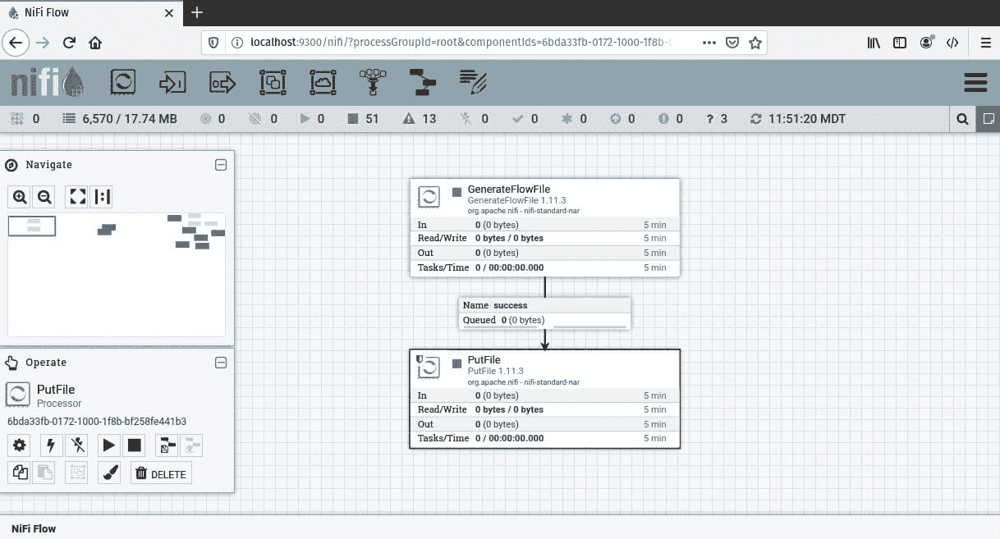

图 10.1 – 生成数据并将流文件写入文件的管道

之前的数据管道 a 创建了`GenerateFlowFile`处理器和`PutFile`处理器之间的连接，用于成功关系。我已经配置了`PutFile`处理器将文件写入`/home/paulcrickard/output`。`GenerateFlowFile`处理器使用默认配置。

如果你只通过启动`GenerateFlowFile`处理器来运行数据管道，你会看到队列中有 10,000 个流文件，并且是红色的，如下面的截图所示：

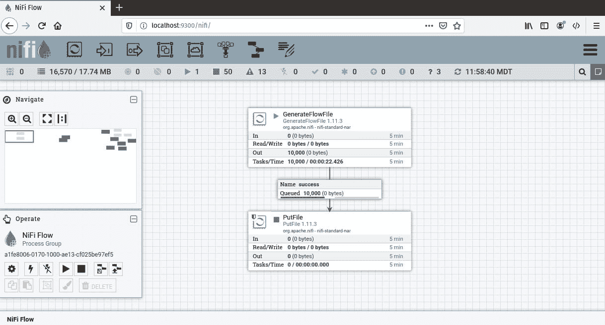

图 10.2 – 填满 10,000 个流文件的完整队列

如果你刷新 NiFi，队列中流文件的数量不会增加。它有 10,000 个流文件，不能再容纳更多。但 10,000 是最大数量吗？

队列的配置方式与为其提供数据的处理器类似。右键点击队列并选择**配置**。选择**设置**选项卡，你将看到以下选项：

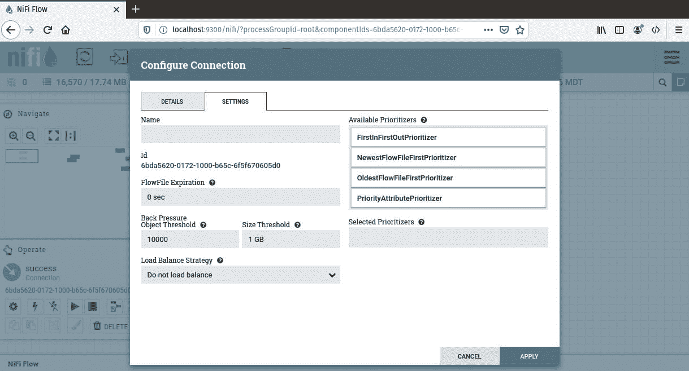

图 10.3 – 队列配置设置

你会注意到有`10000`个流文件和`1 GB`。`GenerateFlowFile`处理器将每个流文件的大小设置为 0 字节，因此对象阈值在大小阈值之前被触发。你可以通过更改`GenerateFlowFile`处理器来测试触发大小阈值。我已经将其更改为 50 MB。当我启动处理器时，队列现在停止在 21 个流文件，因为它已经超过了 1 GB 的数据。以下截图显示了完整的队列：

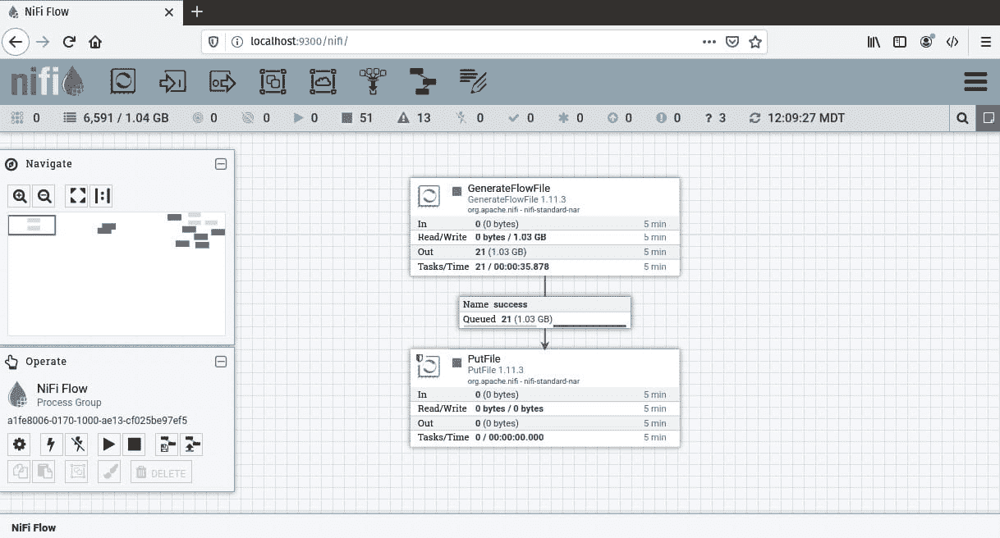

图 10.4 – 具有大小阈值的队列

通过调整**对象阈值**或**大小阈值**，你可以控制发送到队列的数据量，并创建反向压力以减缓上游处理器。虽然加载队列不会破坏你的数据管道，但如果数据流动更加均匀，它将运行得更加顺畅。

下一节将放大你的数据管道，并展示其他改进处理器组使用的技术。

## 改进处理器组

到目前为止，你已经使用了处理器组来保存单个数据管道。如果你要将所有这些数据管道推送到生产环境，你很快就会意识到每个处理器组中有很多处理器正在执行完全相同的任务。例如，你可能有多几个使用`SplitJson`的处理器后面跟着一个`EvaluateJsonPath`处理器，用于从流文件中提取 ID。或者，你可能有多几个将流文件插入到 Elasticsearch 的处理器。

你不会在代码中有几个执行相同操作但针对不同变量的函数；你会有一个接受参数的函数。同样的规则适用于数据处理管道，你通过使用具有输入和输出端口的处理器组来实现这一点。

为了说明如何将数据处理管道分解成逻辑部分，让我们通过一个例子来演示：

1.  在 NiFi 中创建一个处理器组，并将其命名为`Generate Data`。

1.  在处理器组内部，将`GenerateFlowFile`处理器拖到画布上。我已经设置了`{"ID":123}`。

1.  接下来，将一个输出端口拖到画布上。你将被提示选择`FromGeneratedData`，并将**发送到**设置为**本地连接**。

1.  最后，将`GenerateFlowfile`处理器连接到**输出端口**。你将在输出端口上收到一个警告，表明它无效，因为它没有出向连接。我们将在下一步中修复这个问题。

1.  退出处理器组。

1.  创建一个新的处理器组，并将其命名为`Write Data`。

1.  进入处理器组，将`EvaluateJsonPath`处理器拖到画布上。通过创建一个值为`$.{ID}`的属性 ID 来配置它，并将**目标**属性设置为**flowfile-attribute**。

1.  接下来，将“更新属性”处理器拖动到画布上，并创建一个新的属性文件名，将其值设置为`${ID}`。

1.  现在，将`PutFile`处理器拖动到画布上。设置`/home/paulcrickard/output`。

1.  最后，将一个**输入端口**拖动到画布上，并使其成为数据管道中的第一个处理器。完成的管道应如下截图所示：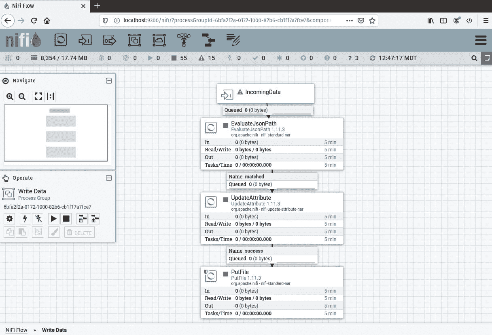

    图 10.5 – 以输入端口开始的数据管道

1.  退出处理器组。现在，您应该在画布上看到两个处理器组——“生成数据”和“写入数据”。您可以像连接单个处理器一样连接这些处理器组。当您通过从“生成数据”拖动箭头到“写入数据”来连接它们时，您将提示选择要连接的端口，如下面的截图所示：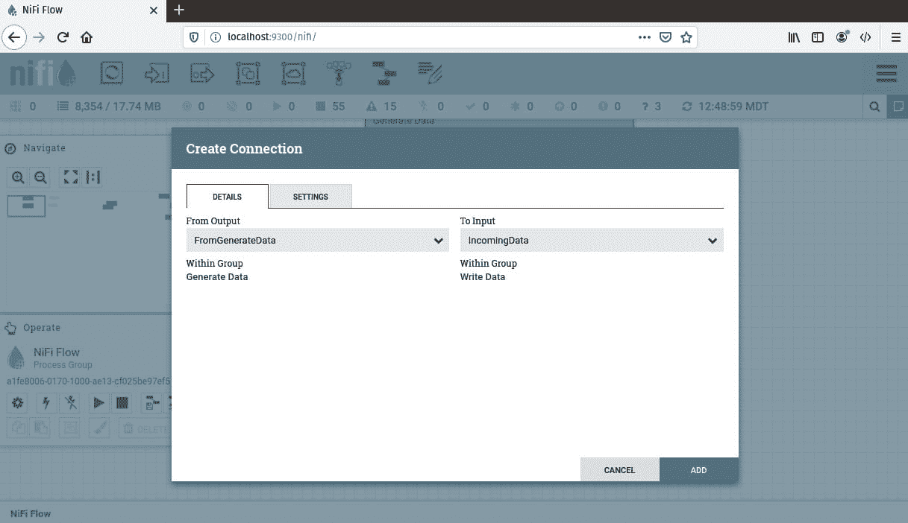

    图 10.6 – 连接两个处理器组

1.  默认值将适用，因为您只有一个输出端口和一个输入端口。如果您有更多，可以使用下拉菜单选择正确的端口。这就是将它们命名为除输入和输出之外的其他名称变得重要的地方。使名称具有描述性。

1.  连接处理器组后，仅启动“生成数据”组。您将看到队列中充满了流文件。要了解端口的工作方式，进入“写入数据”处理器组。

1.  仅启动传入数据输入端口。一旦开始运行，下游队列将充满流文件。

1.  右键单击队列并选择“生成数据”处理器组。现在您可以启动其他处理器。

1.  随着数据管道的运行，您将在输出目录中创建一个名为`123`的文件。

您已成功使用输入和输出端口连接了两个处理器组。在生产环境中，现在您可以有一个单独的处理器组将数据写入文件，并且它可以接收任何需要写入数据的处理器组的数据，如下面的截图所示：

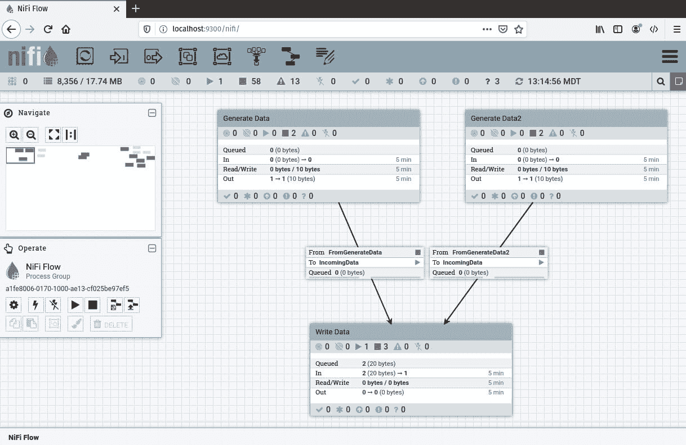

图 10.7 – 两个处理器组使用“写入数据”处理器组

在前面的数据管道中，我复制了“生成数据”，并配置了`{"ID":456}`，并将运行计划设置为每小时一次，这样我就可以从每个处理器——`生成数据`和`生成数据 2`——只获取一个流文件。运行所有处理器组，您会列出队列并确认每个处理器组都来自一个流文件，并且您的输出目录现在有两个文件——`123`和`456`。

# 使用 NiFi 变量注册表

当您构建数据管道时，您正在硬编码变量——除了某些表达式语言，您可以从 flowfile 中提取数据。当您将数据管道移动到生产环境时，您需要更改数据管道中的变量，这可能既耗时又容易出错。例如，您将有一个与生产不同的测试数据库。当您将数据管道部署到生产环境时，您需要指向生产并更改处理器。或者，您可以使用变量注册表。

使用来自*第四章**，*与数据库一起工作*的`postgresToelasticsearch`处理器组，我将修改数据管道以使用 NiFi 变量注册表。作为提醒，数据管道如下所示：

![Figure 10.8 – A data pipeline to query PostgreSQL and save the results to Elasticsearch

![img/Figure_10.8_B15739.jpg]

图 10.8 – 一个查询 PostgreSQL 并将结果保存到 Elasticsearch 的数据管道

从处理器组外部，右键单击它并选择**变量**。要添加新变量，您可以点击加号并提供名称和值。这些变量现在与处理器组相关联。

就像编程中的函数一样，变量有作用域。处理器组中的变量是局部变量。您可以在 NiFi 画布上右键单击并创建一个变量，您可以考虑它在作用域上是全局的。我创建了两个局部变量`elastic`和`index`，以及一个全局变量`elastic`。当我打开组中的变量时，它看起来如下所示：

![Figure 10.9 – NiFi variable registry

![img/Figure_10.9_B15739.jpg]

图 10.9 – NiFi 变量注册表

在前面的屏幕截图中，您可以看到作用域。`elastic`的作用域，局部变量具有优先级。

您现在可以使用表达式语言引用这些变量。在`PutElasticsearchHttp`过程中，我设置了`${elastic}`和`${index}`。这些将填充为局部变量——`http://localhost:9200`和`nifivariable`。

运行数据管道，您可以在 Elasticsearch 中看到结果。现在有一个名为`nifivariable`的新索引和 1,001 条记录。以下屏幕截图显示了结果：

![Figure 10.10 – The new index, nifivariable, is the second row

![img/Figure_10.10_B15739.jpg]

图 10.10 – 新索引，nifivariable，是第二行

您现在已经完成了生产管道的收尾工作，并完成了部署所需的全部步骤。下一节将向您介绍不同的部署数据管道的方法。

# 部署您的数据管道

处理不同环境——**开发**、**测试**、**生产**——有许多方法，您如何选择取决于最适合您的业务实践。话虽如此，您采取的任何策略都应该涉及使用 NiFi 注册表。

## 使用最简单的策略

最简单的策略是在网络上运行 NiFi 并将画布分割成多个环境。当你提升了一个流程组时，你会将其移动到下一个环境。当你需要重建数据管道时，你会将其添加回开发环境并修改它，然后更新生产数据管道到最新版本。你的 NiFi 实例将如下截图所示：

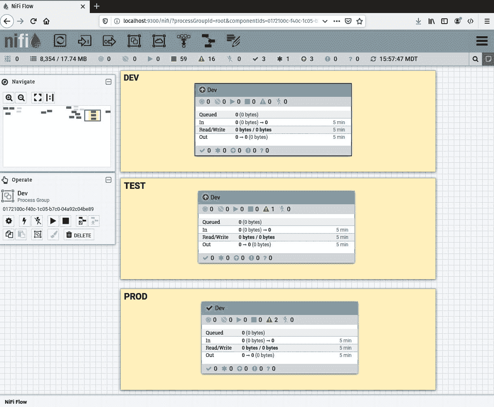

图 10.11 – 单个 NiFi 实例作为 DEV、TEST 和 PROD 运行

注意在前面的截图中，只有`PROD`有一个绿色的勾选标记。`DEV`环境创建了处理器组，然后提交了更改，并将它们带入`TEST`。如果进行了任何更改，它们将被提交，并将最新版本带入`PROD`。为了以后改进数据管道，你会将最新版本带入`DEV`并重新开始，直到`PROD`也有最新版本。

虽然这样做也可以，但如果你有资源构建一个独立的 NiFi 实例，你应该这样做。

## 使用中间策略

中间策略利用 NiFi 注册表，但还添加了一个生产 NiFi 实例。我在另一台机器上安装了 NiFi，这台机器与本书中使用的机器不同，也在运行 NiFi 注册表——这也可以位于另一台机器上。

在启动我的新 NiFi 实例后，我添加了 NiFi 注册表，如下截图所示：

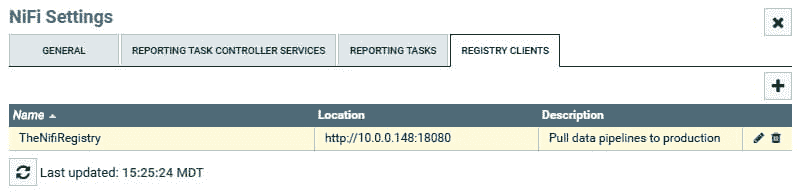

图 10.12 – 将 NiFi 注册表添加到另一个 NiFi 实例

在开发机器上，注册表使用 localhost 创建。然而，其他机器可以通过指定主机机的 IP 地址进行连接。读取后，NiFi 实例可以访问所有版本化的数据管道。

将处理器组拖到画布上并选择**导入**。你现在可以选中已提升到生产的处理器组，如下截图所示：

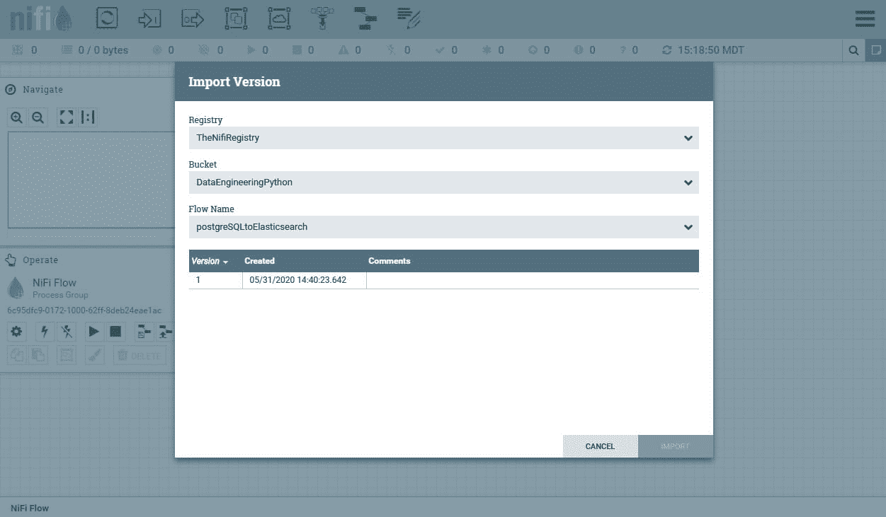

图 10.13 – 导入处理器组

一旦你导入了处理器，它将带有在开发环境中定义的变量。你可以覆盖变量的值。一旦你更改了变量，你就不需要再次这样做。你可以在开发环境中进行更改并更新生产环境，新变量将保留。更新的变量如下截图所示：

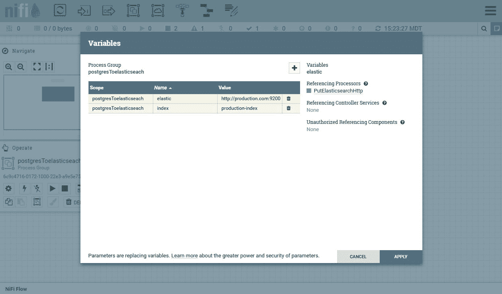

图 10.14 – 更新用于生产的本地变量

在开发环境中，你可以更改处理器并提交本地更改。现在，生产环境将显示有新版本可用，如下截图所示：

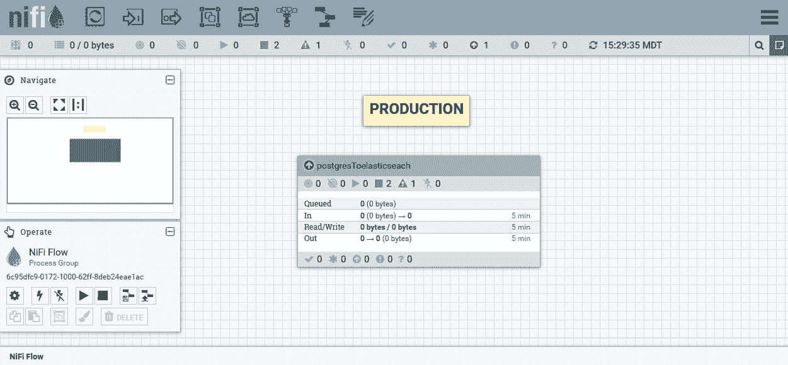

图 10.15 – 生产不再使用当前版本

你可以右键单击处理器组并选择新版本。以下截图显示了版本 2：

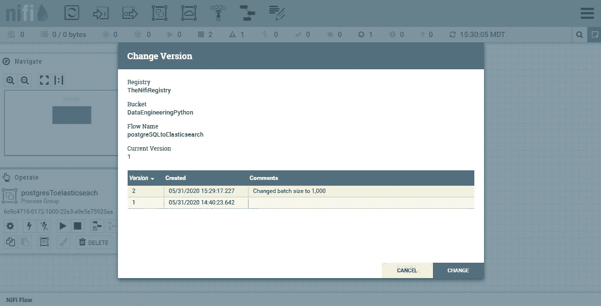

图 10.16 – 新版本

选择新版本后，生产环境现在是最新的。以下截图显示了生产环境。你可以右键单击处理器组以查看变量仍然指向生产值：

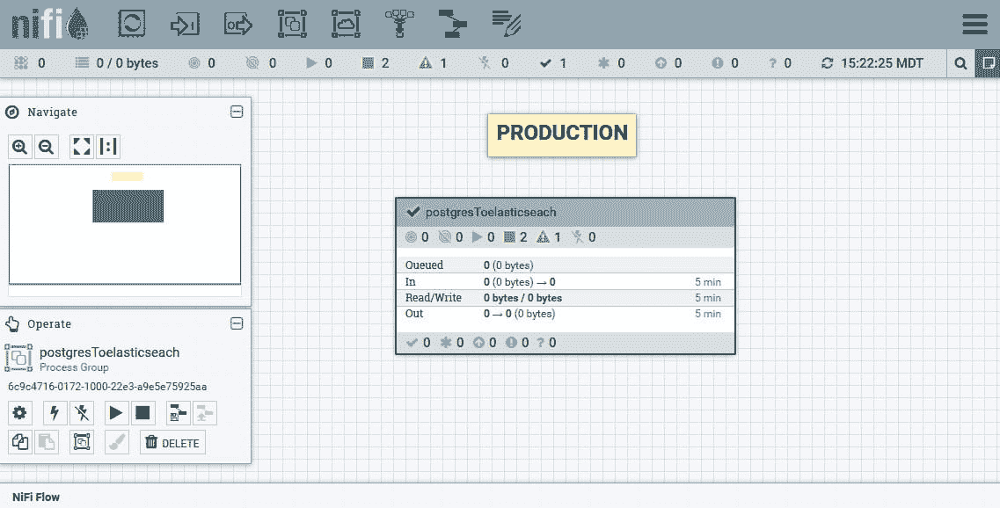

图 10.17 – 生产状态是最新的

这种策略应该适用于大多数用户的需求。在这个例子中，我使用了开发和生产环境，但你也可以添加 `TEST` 并在这里使用相同的策略，只需更改本地变量以指向你的测试数据库。

之前使用的策略使用了单个 NiFi 注册表，但你可以为每个环境使用一个注册表。

## 使用多个注册表

管理开发、测试和生产的一个更高级策略是使用多个 NiFi 注册表。在这个策略中，你会设置两个 NiFi 注册表——一个用于开发，一个用于测试和生产。你会将开发环境连接到开发注册表，将测试和生产环境连接到第二个注册表。

当你将数据管道提升到测试阶段时，管理员会使用 NiFi CLI 工具导出数据管道并将其导入到第二个 NiFi 注册表中。从那里，你可以对其进行测试并将其提升到开发阶段。你会将第二个注册表中的版本导入到生产环境中，就像在中端策略中所做的那样。这种策略使得错误处理变得更加困难，因为你不能在没有手动操作的情况下将数据管道提交到测试和生产环境。这是一个非常好的策略，但需要更多的资源。

# 摘要

在本章中，你学习了如何将数据管道最终化以部署到生产环境。通过使用特定任务的处理器组，就像代码中的函数一样，你可以减少处理器的重复。使用输入和输出端口，你将多个处理器组连接在一起。为了部署数据管道，你学习了如何使用 NiFi 变量来声明全局和局部作用域的变量。

在下一章中，你将使用在本节中学到的所有技能来创建和部署生产数据管道。
