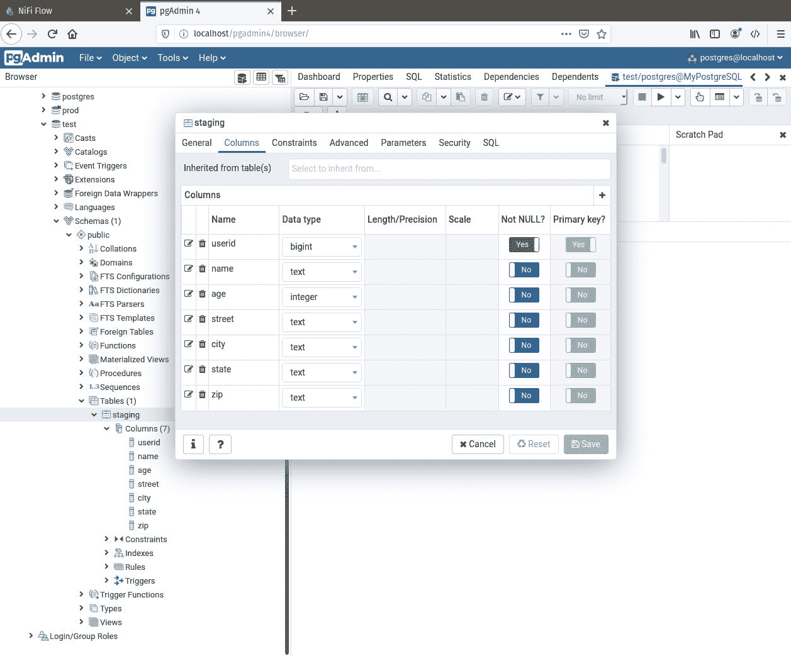
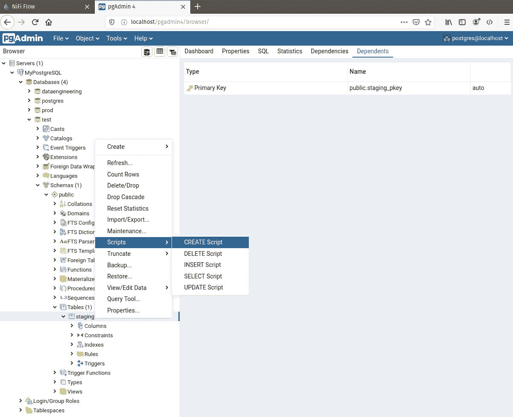
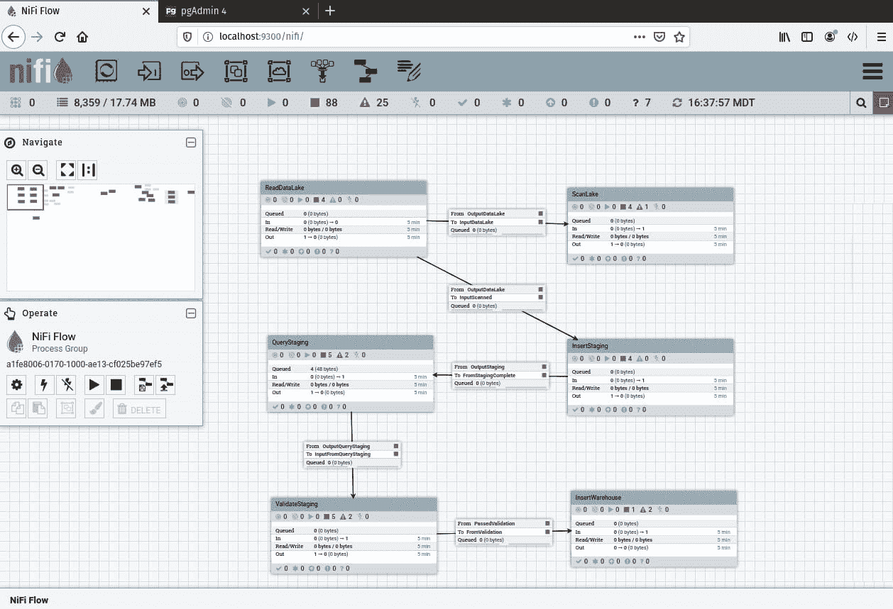
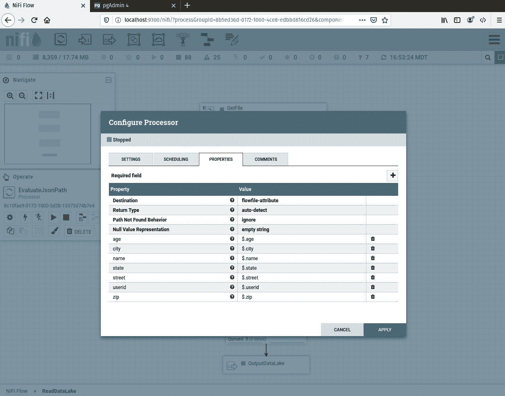
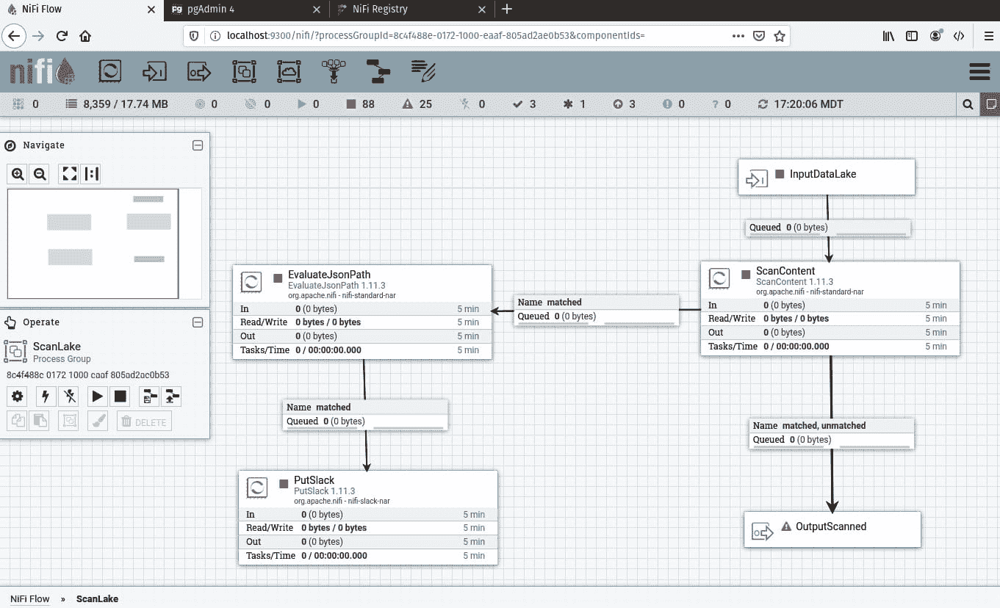
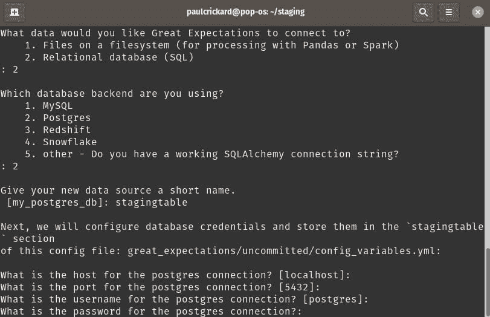
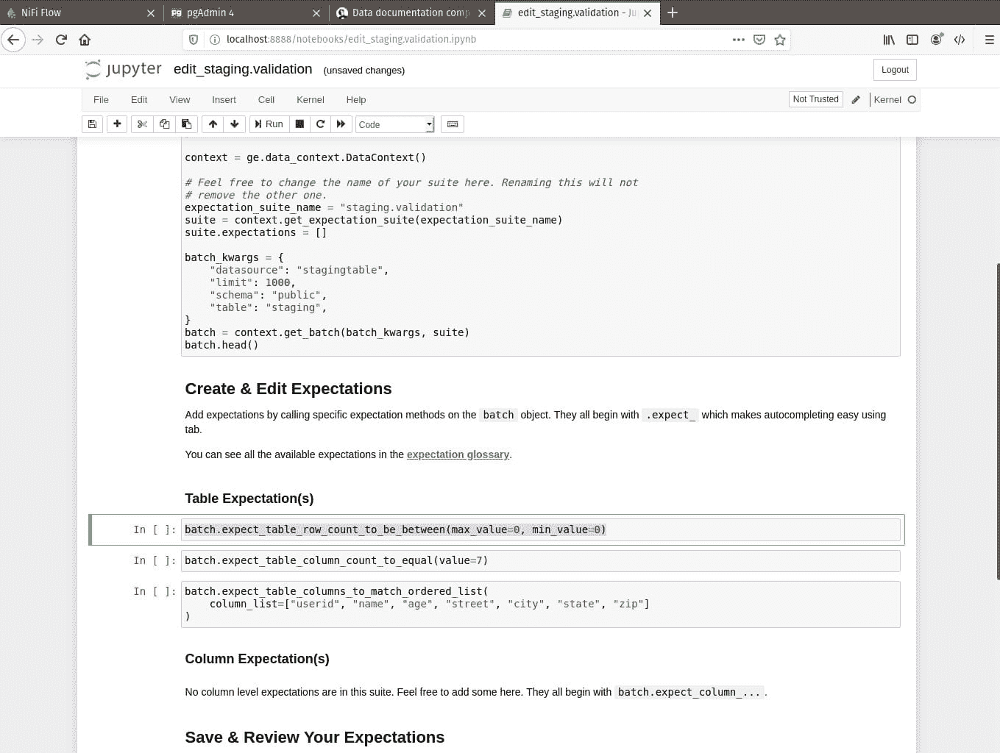
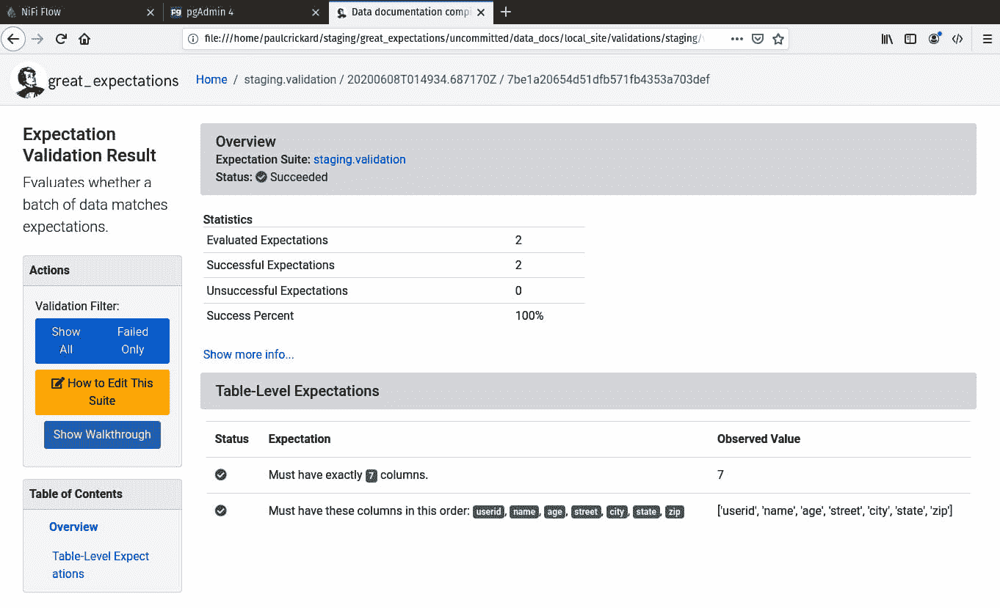

# *第十一章*: 构建生产数据管道

在本章中，您将使用本书本节中学到的功能和技巧来构建生产数据管道。数据管道将被分成执行单个任务的处理器组。这些组将进行版本控制，并且它们将使用 NiFi 变量注册表，以便它们可以在生产环境中部署。

在本章中，我们将介绍以下主要内容：

+   创建测试和生产环境

+   构建生产数据管道

+   在生产环境中部署数据管道

# 创建测试和生产环境

在本章中，我们将回到使用 PostgreSQL 进行数据的提取和加载。数据管道需要一个测试和生产环境，每个环境都将有一个临时表和仓库表。要创建数据库和表，您将使用**PgAdmin4**。

## 创建数据库

要使用 PgAdmin4，请执行以下步骤：

1.  浏览到`http://localhostw/pgadmin4/l`，输入您的用户名和密码，然后点击**登录**按钮。登录后，展开左侧面板中的服务器图标。

1.  要创建数据库，右键点击数据库图标并选择`test`。

1.  接下来，您需要添加表格。要创建临时表，右键点击`staging`。然后，选择**Columns**选项卡。使用加号创建以下截图所示的字段：

    图 11.1 – 临时表中使用的列

1.  完成后保存表格。您需要为测试数据库创建此表一次，为生产数据库创建两次。为了节省时间，您可以使用**CREATE Script**来自动完成此操作。右键点击临时表，然后选择**Scripts** | **CREATE Script**，如图下所示：

    图 11.2 – 生成 CREATE 脚本

1.  主屏幕将打开一个窗口，显示生成表的 SQL 语句。通过将名称从`staging`更改为`warehouse`，您可以在测试环境中创建仓库表，这将与临时表相同。一旦您进行了更改，点击工具栏中的播放按钮。

1.  最后，右键点击`production`。使用脚本创建这两个表。

现在您已经为测试和生产环境创建了表，您将需要一个数据湖。

## 填充数据湖

**数据湖**通常是一个磁盘上的存储文件的地方。通常，您会使用 Hadoop 的**Hadoop 分布式文件系统**（**HDFS**）和其他构建在 Hadoop 生态系统之上的工具来找到数据湖。在本章中，我们将在一个文件夹中放置文件来模拟从数据湖中读取的工作方式。

要创建数据湖，你可以使用 Python 和 Faker 库。在编写代码之前，创建一个文件夹作为数据湖。我在我的主目录中创建了一个名为 `datalake` 的文件夹。

要填充数据湖，你需要编写包含个人信息的 JSON 文件。这与你在本书第一部分编写的 JSON 和 CSV 代码类似。步骤如下：

1.  导入库，设置数据湖目录，并将 `userid` 设置为 `1`。`userid` 变量将成为主键，因此我们需要它具有唯一性 – 增量将为我们完成这项工作：

    ```py
    from faker import Faker
    import json
    import os
    os.chdir("/home/paulcrickard/datalake")
    fake=Faker()
    userid=1
    ```

1.  接下来，创建一个循环，生成包含用户 ID、姓名、年龄、街道、城市、州和邮编的虚构个人的数据对象。`fname` 变量包含一个人的首名和姓氏，中间没有空格。如果你有一个空格，Linux 将用引号包裹文件：

    ```py
    for i in range(1000):
        name=fake.name()
        fname=name.replace(" ","-")+'.json'
        data={
            "userid":userid,
            "name":name,
            "age":fake.random_int(min=18, max=101, step=1),
            "street":fake.street_address(),
            "city":fake.city(),
            "state":fake.state(),
            "zip":fake.zipcode()
        }
    ```

1.  最后，将 JSON 对象导出，然后将其写入以人为名的文件。关闭文件并让循环继续：

    ```py
        datajson=json.dumps(data)
        output=open(fname,'w')
        userid+=1
        output.write(datajson)
        output.close()
    ```

运行前面的代码，你将在数据湖中拥有 1,000 个 JSON 文件。现在你可以开始构建数据管道。

# 构建生产数据管道

你构建的数据管道将执行以下操作：

+   从数据湖中读取文件。

+   将文件插入到临时存储中。

+   验证临时存储数据。

+   将临时存储移动到仓库。

最终的数据管道将如下截图所示：



Figure 11.3 – 数据管道的最终版本

我们将按处理器组构建数据管道处理器组。第一个处理器组将读取数据湖。

## 读取数据湖

在本书的第一部分，你从 NiFi 读取文件，这里也将做同样的事情。这个处理器组将包括三个处理器 – `GetFile`、`EvaluateJsonPath` 和 `UpdateCounter` – 以及一个输出端口。将处理器和端口拖到画布上。在接下来的章节中，你将配置它们。

### GetFile

`GetFile` 处理器从文件夹中读取文件，在这种情况下，我们的数据湖。如果你正在读取 Hadoop 中的数据湖，你需要将此处理器替换为 `GetHDFS` 处理器。要配置处理器，指定输入目录；在我的情况下，它是 `/home/paulcrickard/datalake`。确保 `^.*\.([jJ][sS][oO][nN]??)$`。如果你保留默认值，它将正常工作，但如果文件夹中有其他文件，NiFi 将尝试抓取它们并失败。

### EvaluateJsonPath

`EvaluateJsonPath` 处理器将从 JSON 中提取字段并将它们放入 flowfile 属性中。为此，将 **Destination** 属性设置为 **flowfile-attribute**。保留其余属性为默认值。使用加号，为 JSON 中的每个字段创建一个属性。配置如下截图所示：



Figure 11.4 – EvaluateJsonPath 处理器的配置

这就足够完成从数据湖读取的任务了，但我们将添加一个处理器用于监控。

### 更新计数器

此处理器允许您创建一个增量计数器。随着流文件通过，我们可以统计正在处理的文件数量。此处理器不会操纵或更改我们的数据，但将允许我们监控处理器组的进度。我们将能够看到通过处理器的 FlowFiles 数量。这比使用 GUI 显示更准确，但它只显示过去 5 分钟内的记录数量。要配置处理器，保留`1`并设置`datalakerecordsprocessed`。

要完成这一节的数据管道，将一个输出端口拖到画布上并命名为`OutputDataLake`。退出处理器组，右键单击，选择`ReadDataLake`，编写简短描述和版本注释，然后保存。

NiFi-Registry

我已创建了一个名为`DataLake`的新存储桶。要创建存储桶，您可以浏览到`http://localhost:18080/nifi-registry/`上的注册表。点击右下角的扳手，然后点击**新建存储桶**按钮。命名并保存存储桶。

第一个处理器组已完成。您可以在需要从数据湖读取数据时使用此处理器组。处理器组将向您提供每个字段提取的每个文件。如果数据湖发生变化，您只需修复这个处理器组即可更新所有数据管道。

在继续向下进行数据管道之前，下一节将稍微偏离一下，展示如何附加其他处理器组。

## 扫描数据湖

数据管道的目标是从数据湖读取数据并将数据放入数据仓库。但让我们假设我们公司里还有另一个部门需要监控某些人的数据湖——可能是 VIP 客户。你不必构建一个新的数据管道，只需将他们的任务添加到`ReadDataLake`处理器组中即可。

`ScanLake`处理器组有一个输入端口，该端口连接到`ReadDataLake`处理器的输出。它使用连接到`EvaluateJsonPath`处理器的`ScanContent`处理器，该处理器终止于`PutSlack`处理器，同时将数据发送到输出端口。流程如下面的截图所示：



图 11.5 – ScanLake 处理器组

上一章使用了`PutSlack`处理器，您已经熟悉了`EvaluateJsonPath`处理器。然而，`ScanContent`是一个新的处理器。`ScanContent`处理器允许您查看 flowfile 内容中的字段，并将它们与一个字典文件进行比较——一个包含您要查找的每行内容的文件。我已经在`/home/paulcrickard/data.txt`文件中放入了一个单独的名称。我通过将路径设置为**字典文件**属性的值来配置处理器。现在，当包含该名称的文件通过时，我将在 Slack 上收到一条消息。

## 将数据插入临时表

我们读取的数据来自数据湖，并且不会被删除，因此我们不需要采取任何中间步骤，例如将数据写入文件，就像数据来自事务数据库时那样。但我们将要做的是将数据放入一个临时表中，以确保在将其放入数据仓库之前一切按预期工作。仅要将数据插入临时表就需要一个处理器，`PutSQL`。

### PutSQL

`PutSQL`处理器将允许您在数据库表中执行`INSERT`或`UPDATE`操作。处理器允许您在 flowfile 的内容中指定查询，或者您可以将查询硬编码为处理器中的一个属性。在这个例子中，我已经在**SQL 语句**属性中硬编码了查询，如下所示：

```py
INSERT INTO ${table} VALUES ('${userid}', '${name}',${age},'${street}','${city}','${state}','${zip}');
```

上述查询从 flowfile 中获取属性并将它们传递到查询中，因此虽然它是硬编码的，但它将根据它接收到的 flowfiles 而变化。您可能已经注意到，您在所有的`EvaluateJsonPath`处理器中都没有使用`${table}`。我使用 NiFi 注册声明了一个变量，并将其添加到处理器组作用域中。对于这个测试环境，表的值将是`staging`，但当我们将数据管道部署到生产环境时，它将稍后更改。

您还需要添加一个**Java 数据库连接**（**JDBC**）池，这在本书的前几章中已经完成。您可以指定批量大小、要检索的记录数以及是否希望在失败时回滚。将**失败时回滚**设置为**True**是您在事务中创建原子性的方法。如果批处理中的单个 flowfile 失败，处理器将停止，其他任何操作都无法继续。

我已经将处理器连接到另一个`UpdateCounter`处理器。此处理器创建并更新`InsertedStaging`。当一切完成后，计数器应与`datalakerecordsprocessor`匹配。`UpdateCounter`处理器连接到名为`OutputStaging`的输出端口。

## 查询临时数据库

下一个处理器组用于查询阶段数据库。现在数据已经加载，我们可以查询数据库以确保所有记录实际上都已进入。您可以执行其他验证步骤或查询，以查看结果是否符合您的预期 – 如果您有数据分析师，他们将是定义这些查询的良好信息来源。在以下章节中，您将查询阶段数据库并根据是否符合您的标准来路由结果。

### ExecuteSQLRecord

在上一个处理器组中，您使用了`PutSQL`处理器将数据插入到数据库中，但在这个处理器组中，您想要执行一个`select`查询。`select`查询如下所示：

```py
select count(*) from ${table}
```

前面的查询被设置为可选 SQL `select`查询属性的值。`${table}`是分配给处理器组的 NiFi 变量注册表变量，其值为`staging`。您需要在处理器属性中定义一个 JDBC 连接和一个记录写入器。记录写入器是一个 JSON 记录集写入器。处理器的返回值将是一个包含一个字段 – `count`的 JSON 对象。这个处理器被发送到`EvaluateJsonPath`处理器以提取`recordcount`。然后，该处理器被发送到下一个处理器。

### RouteOnAttribute

`RouteOnAttribute`处理器允许您使用表达式或值来定义一个流文件的去向。为了配置处理器，我已经设置了`allrecords`并将值设置为 NiFi 表达式，如下所示：

```py
${recordcount:ge( 1000 )}
```

前面的表达式评估`recordcount`属性以查看它是否大于或等于 1,000。如果是，它将基于这个关系进行路由。我已经将输出附加到名为`OutputQueryStaging`的输出端口。

## 验证阶段数据

前一个处理器组进行了一些验证，您可以在那里停止。然而，Great Expectations 是一个处理验证的出色库。您在*第七章**，生产管道功能*中学习了关于 Great Expectations 的内容，但我会在这里快速再次介绍它。

要使用 Great Expectations，您需要创建一个项目文件夹。我在下面的代码片段中已经创建了它，并初始化了 Great Expectations：

```py
mkdir staging
great_expectations init
```

您将被提示创建您的验证套件。选择**关系数据库（SQL**），然后**Postgres**，并提供所需信息。提示将类似于以下截图：



图 11.6 – 配置 Great Expectations 以与 PostgreSQL 协同工作

当它完成后，Great Expectations 将尝试连接到数据库。如果成功，它将提供您文档的 URL。由于表是空的，它不会创建一个非常详细的验证套件。您可以使用以下命令编辑套件：

```py
great_expectations suite edit staging.validation
```

这将启动一个包含套件代码的 Jupyter 笔记本。我已经删除了一行，该行设置了行数在 0 到 0 之间，如下面的截图所示：



图 11.7 – 编辑 Great Expectations 套件

删除高亮显示的行后，运行笔记本中的所有单元格。现在您可以刷新您的文档，您将看到行数期望不再作为套件的一部分，如下面的截图所示：



图 11.8 – 套件的 Great Expectations 文档

现在套件已完成，你需要生成一个可以运行以启动验证的文件。使用以下命令使用 `staging.validation` 套件创建一个 tap 并输出 `sv.py` 文件：

```py
great_expectations tap new staging.validation sv.py
```

现在您可以运行此文件以验证测试数据库的阶段表。

第一个处理器从连接到 `QueryStaging` 处理器组输出端口的输入端口接收流文件。它连接到一个 `ExecuteStreamCommand` 处理器。

### ExecuteStreamCommand

`ExecuteStreamCommand` 将执行一个命令并监听输出，流式传输结果。由于 `sv.py` 文件只打印一行并退出，因此没有流，但如果你的命令有多个输出，处理器会捕获它们的所有输出。

要配置处理器，设置 `sv.py` 文件。

处理器连接到一个 `EvaluateJsonPath` 处理器，该处理器提取 `$.result` 并将其发送到 `RouteOnAttribute` 处理器。我已经配置了一个属性并赋予它值 `pass`：

```py
${result:startsWith('pass')}
```

上述表达式检查结果属性以查看它是否与 `pass` 匹配。如果是这样，处理器将流文件发送到输出端口。

## Insert Warehouse

你已经到达了最后一个处理器组 - `ExecuteSQLRecord` 和一个 `PutSQL` 处理器。

### ExecuteSQLRecord

`ExecuteSQLProcessor` 在阶段表中执行选择操作。它有一个在 NiFi 变量注册表中定义的变量表，指向阶段。查询是一个 `select *` 查询，如下所示：

```py
select * from ${table}
```

此查询是 SQL `select` 查询属性的值。您需要设置一个 `Database Pooling Connection` 服务和一个 `Record Writer` 服务。`Record Writer` 将是一个 `JsonRecordSetWriter`，您需要确保设置了 `SplitText` 处理器，该处理器连接到 `EvalueJsonPath` 处理器，它是来自 `ReadDataLake` 处理器组的直接副本，连接到最终的 `PutSQL` 处理器。

### PutSQL

`PutSQL`处理器将`staging`表中的所有数据放入最终数据`warehouse`表。您可以配置批量大小和失败回滚属性。我已经将 SQL 语句属性设置为与它被插入到`staging`时相同，除了表变量已被更改为`warehouse`，我们在 NiFi 变量注册表中将其设置为`warehouse`。查询如下：

```py
INSERT INTO ${warehouse} VALUES ('${userid}', '${name}',${age},'${street}','${city}','${state}','${zip}');
```

我已终止了所有关系的处理器，因为这标志着数据管道的结束。如果您启动所有处理器组，您将在`staging`和`warehouse`表中获得数据。您可以检查计数器以查看处理的记录数是否与插入的记录数相同。如果一切正常，您现在可以将数据管道部署到生产环境。

# 在生产中部署数据管道

在上一章中，您学习了如何将数据部署到生产环境，所以在这里我不会深入探讨，只是提供一个回顾。要将新的数据管道投入生产，请执行以下步骤：

1.  浏览到您的生产 NiFi 实例。我在本地主机上运行了另一个 NiFi 实例，端口号为`8080`。

1.  将处理器组拖放到画布上并选择**导入**。选择您刚刚构建的处理器组的最新版本。

1.  修改处理器组上的变量，使其指向数据库生产。表名可以保持不变。

然后，您可以运行数据管道，您将看到数据已填充到生产数据库的`staging`和`warehouse`表中。

您刚刚构建的数据管道从数据湖读取文件，将它们放入数据库表，运行查询以验证表，然后将它们插入到仓库。您可以用几个处理器构建这个数据管道并完成，但当你为生产构建时，您需要提供错误检查和监控。在前期花时间正确构建您的数据管道将节省您在生产中遇到变化或故障时的大量时间。您将处于调试和修改数据管道的有利位置。

# 摘要

在本章中，你学习了如何构建和部署生产数据管道。你学习了如何创建 `TEST` 和 `PRODUCTION` 环境，并在 `TEST` 中构建了数据管道。你使用文件系统作为示例数据湖，并学习了如何从湖中读取文件以及如何监控它们在处理过程中的状态。本章不是教你将数据加载到数据仓库中，而是教你如何使用临时数据库来存储数据，以便在将其加载到数据仓库之前进行验证。使用 Great Expectations，你能够构建一个验证处理器组，该组将扫描临时数据库以确定数据是否已准备好加载到数据仓库中。最后，你学习了如何将数据管道部署到 `PRODUCTION`。掌握了这些技能，你现在可以完全构建、测试和部署生产批量数据管道。

在下一章中，你将学习如何构建 Apache Kafka 集群。使用 Kafka，你将开始学习如何处理数据流。这些数据通常是接近实时，与您目前一直在处理的批量处理相比。你将安装和配置集群，使其在单个机器上运行，或者如果你有多个设备，也可以在多个设备上运行。
