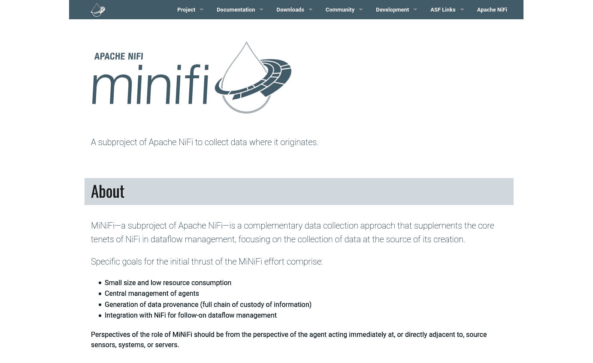
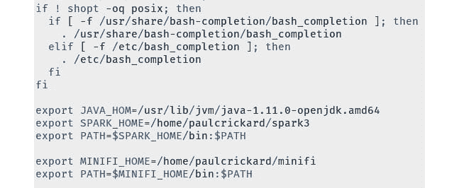
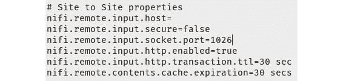
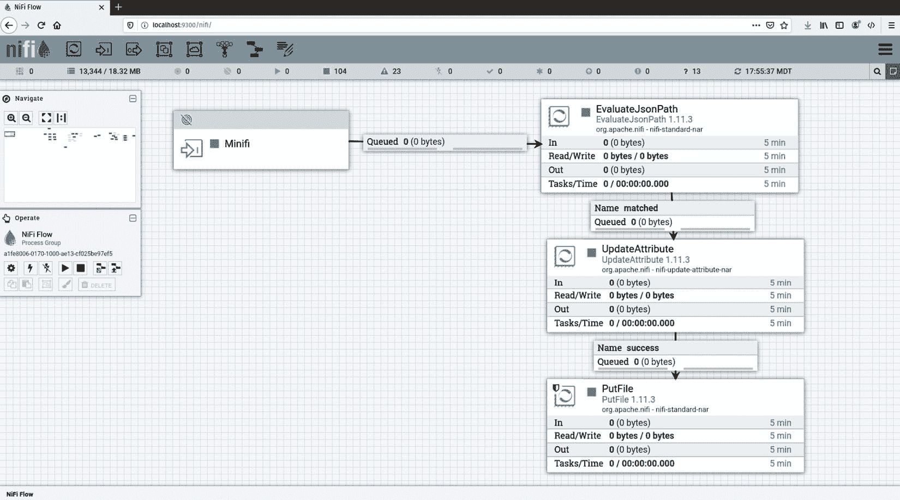
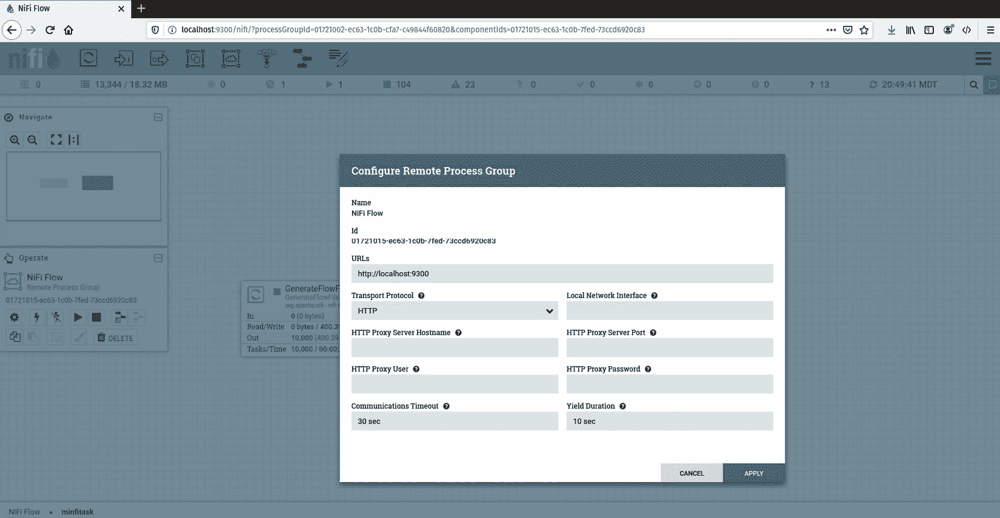
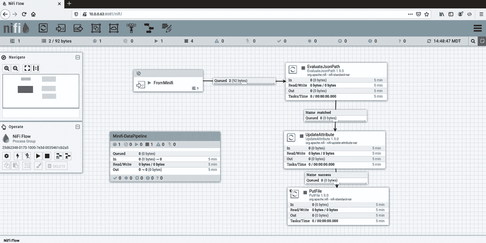

# *第十五章*：使用 MiNiFi、Kafka 和 Spark 的实时边缘数据

在本章中，您将学习如何使用 Apache NiFi 将 **物联网**（**IoT**）设备、小型计算机和传感器发送数据到数据管道。对于处理能力较小的计算机或设备，MiNiFi 允许它们成为 NiFi 数据管道的一部分。MiNiFi 是 NiFi 的轻量级版本，具有精简的处理器集和没有图形用户界面。它是构建用于通过内置在 NiFi 中的数据管道发送数据，并部署到设备上的。

在本章中，我们将涵盖以下主要主题：

+   在设备上设置 MiNiFi

+   在 NiFi 中构建和部署 MiNiFi 任务

# 设置 MiNiFi

Apache MiNiFi 是 NiFi 的轻量级版本，用于在数据源处进行数据收集。来源越来越小，包括物联网设备、传感器和低功耗计算机，如 Raspberry Pi。要将这些设备纳入您的数据管道，您需要一种方法从设备中获取数据。MiNiFi 允许您将数据作为标准数据管道的一部分流式传输到 NiFi。

要获取 MiNiFi 二进制文件，请浏览到 [`nifi.apache.org/minifi/`](https://nifi.apache.org/minifi/)。以下截图是 MiNiFi 主页，并将为您提供有关项目和文档的信息：



图 15.1 – Apache MiNiFi 主页

从主导航栏进入 **下载** 并选择 **下载 MiNiFi 组件** 选项。您需要决定您是想运行 MiNiFi Java 还是 MiNiFi C++ 版本。哪个版本适合将取决于 MiNiFi 将驻留的设备的规格。如果您需要最小的占用空间和内存使用，那么 C++ 版本适合您。如果您有更多资源并且需要更广泛的可用处理器选择，那么 Java 版本将是您的最佳选择。您可以通过类别查找处理器列表，其中包含描述。[`nifi.apache.org/docs/nifi-docs/html/getting-started.html#what-processors-are-available`](https://nifi.apache.org/docs/nifi-docs/html/getting-started.html#what-processors-are-available)。

您始终可以复制 NiFi 中任何处理器的 `NAR` 文件并将其放入 MiNiFi 的 `lib` 目录。某些处理器可能还需要您复制并发送控制器服务的 `NAR` 文件。本章将使用 MiNiFi Java 版本。

下载当前版本的 MiNiFi（Java），目前为 0.5.0。选择 `minifi-0.5.0-bin.tar.gz` 链接并下载它。您还需要向下滚动页面并选择 MiNiFi 工具包二进制文件的相应版本。C++ 和 Java 版本使用相同的工具包，因此您只需选择正确的发布版本 – 0.5.0。下载 `minifi-toolkit-0.5.0-bin.tar.gz` 文件。

使用以下命令提取并复制 MiNiFi 和 MiNiFi 工具包到您的家目录：

```py
tar -xvzf minifi-0.5.0-bin.tar.gz
tar -xvzf minifi-toolkit-0.5.0-bin.tar.gz
mv minifi-0.5.0 ~/minifi
mv minifi-toolkit-0.5.0 ~/minifi-toolkit
```

当我将`minifi`和`minifi-toolkit`移动到我的主目录时，我删除了`-0.5.0`。在本章中，我将在与 NiFi 相同的机器上运行 MiNiFi – 就像我已经与 Kafka 和 Spark 做的那样 – 但如果你想在另一个设备上运行 MiNiFi，就像在生产环境中一样，将`minifi-0.5.0`目录复制到该机器上。MiNiFi 工具包保持在 NiFi 机器上。

最后一步是将`$MINIFI_HOME`变量设置为 MiNiFi 的位置。你可以导出变量并将其添加到你的路径中，或者更好的方法是编辑你的`.bashrc`文件，如下所示：

```py
export MINIFI_HOME=/home/paulcrickard/minifi
export PATH=$MINIFI_HOME/bin:$PATH
```

你的`.bashrc`文件将看起来如下面的屏幕截图所示。注意，我在 Apache Spark 的编辑上方有 MiNiFi 的编辑：



图 15.2 – 包含 Spark 和 MiNiFi 导出设置的.bashrc 文件

现在你已经配置了 MiNiFi 并且 MiNiFi 工具包准备就绪，是时候在 Apache NiFi 中创建你的第一个数据管道了。下一节将指导你创建一个。

# 在 NiFi 中构建 MiNiFi 任务

在本节中，你将构建一个数据管道并将其部署到 MiNiFi。该数据管道将生成流文件并将它们发送到 NiFi。下一节将进一步介绍并使用 MiNiFi 未包含的处理程序。

要使用 MiNiFi，你需要一个较旧的 NiFi 版本。当前的工具 – 0.5.0 – 由于`nifi`模板输出的属性更改而损坏。它将在 0.6.0 中修复，但在此之前，你需要至少使用 NiFi 的 1.9.0 版本。你可以在[`archive.apache.org/dist/nifi/1.9.0/`](https://archive.apache.org/dist/nifi/1.9.0/)获取较旧的 NiFi 版本。使用带有`-xvzf`标志的`tar`命令解压 NiFi。使用`mv`或你的文件资源管理器工具将文件夹放置在你的主目录中。

你还需要一个较旧的 Java 版本。要安装正确的 Java 版本，请使用以下命令：

```py
sudo apt-get install openjdk-8-jre
```

最后，你还需要确保 NiFi 已配置为允许站点到站点连接。在终端中，转到`$NIFI_HOME/conf`并打开`nifi.properties`文件。滚动到文件大约一半的位置，你会看到`站点到站点属性`部分。在我的文件中，`nifi.remote.input.socket.port`是空的。如果没有指定端口，编辑文件以便端口为`1026`，如下面的屏幕截图所示：



图 15.3 – 当 input.socket.port 设置为 1026 时的站点到站点属性

接下来，启动 NiFi 并创建一个输入端口以连接 MiNiFi 和 NiFi。将输入端口拖放到画布上，并将其命名为`minifi`。来自 MiNiFi 的数据将通过此端口进入 NiFi。

将输入端口连接到数据管道。管道在以下屏幕截图中显示：



图 15.4 – 将 MiNiFi 数据消费并写入 NiFi 主机上的文件的数据管道

要构建数据管道，请按照以下步骤操作：

1.  将 `EvaluteJsonPath` 处理器拖放到画布上。配置 `flowfile-attribute`。创建一个名为 `fname` 的新属性，并将其值设置为 `$.fname`。这将来自 MiNiFi 的 JSON 接收到的信息。

1.  将 `UpdateAttribute` 处理器拖放到画布上。创建一个名为 `filename` 的新属性，并将其值设置为 `${fname}`。

1.  将 `PutFile` 处理器拖放到画布上。设置 `/home/paulcrickard/output`。将其他属性保留为默认值。

上述步骤创建了从 MiNiFi 到 NiFi 的连接，但到目前为止，我们还没有为 MiNiFi 创建数据管道。要创建 MiNiFi 数据管道，将处理器组拖放到画布上，并将其命名为 `minifitask`。

在处理器组内部，将 `GenerateFlowfile` 处理器拖放到画布上。在 `30 sec` 上设置 `{"fname":"minifi.txt","body":"Some text"}`。

接下来，您将添加 `http://localhost:9300` 和 `HTTP`。其余部分保留为默认值或留空。设置应如图下截图所示：



图 15.5 – 远程处理器组配置

将 `GenerateFlowFile` 处理器连接到 **远程处理器组**。**创建连接** 弹出窗口将允许您选择输入端口为 **To Input**。它应该正确猜测并选择 MiNiFi。如果不是，请使用下拉菜单选择您在上一步骤中创建的 MiNiFi 端口。一旦处理器连接，右键单击 **远程处理器组** 并选择 **启用传输**。图标现在应该是一个蓝色圆圈，如图下截图所示：

![Figure 15.6 – MiNiFi data pipeline to a remote processor group]

![img/Figure_15.6_B15739.jpg]

图 15.6 – 将 MiNiFi 数据管道连接到远程处理器组

MiNiFi 数据管道已完成。为了确保它可以在 MiNiFi 上运行，您需要对其进行转换。要转换它，您需要将其导出为模板。要创建模板，退出处理器组。右键单击处理器组，然后通过点击表格右侧的下载图标选择 `minifitask` 模板。这将下载数据管道的 XML 版本。

要转换模板，您需要在 MiNiFi 工具包中运行 `config.sh`。我在我的主目录中创建了一个 `minifi-templates` 文件夹。切换到 `$MINIFI_HOME` 目录，运行以下命令：

```py
./bin/config.sh transform /home/paulcrickard/Downloads/minifitask.xml /home/paulcrickard/minifi-templates/config.yml
```

如果一切正常工作，你应该会收到如下截图所示的类似消息：

![Figure 15.7 – minifi-toolkit transforming the XML template into a YML file]

![img/Figure_15.7_B15739.jpg]

图 15.7 – minifi-toolkit 将 XML 模板转换为 YML 文件

现在，你将在`minifi-templates`目录中有一个`config.yml`文件。将此文件复制到`$MINIFI_HOME/conf`目录。你可以覆盖 MiNiFi 附带的原有`config.yml`文件。

从`$MINIFI_HOME/bin`目录，你可以启动`minifi`，当它启动时将读取你的`config.yml`文件。使用以下命令来启动 MiNiFi：

```py
./minifi.sh start
```

你的 MiNiFi 数据管道现在正在运行。你可以在`$MINIFI_HOME/logs/minifi-app.log`中查看日志。但你现在也可以打开 NiFi，通过`FromMinifi`输入端口查看从 MiNiFi 流进来的数据。你的 NiFi 数据管道应该看起来如下截图所示：



图 15.8 – 从 MiNiFi 输入端口接收数据的管道

你会注意到你用来创建模板的处理器组已经停止。数据正从 MiNiFi 流入 NiFi 实例，并被处理并保存到 NiFi 机器的磁盘上。MiNiFi 机器只发送数据，这允许它不会因为尝试在本地运行 NiFi 的版本或需要定期与其他机器建立远程连接来写入文件而超负荷。可以从 MiNiFi 机器向 NiFi 发送流数据。

一旦 MiNiFi 数据流进入 NiFi，你将拥有处理这些数据的全部工具。你可以将其发送到如*第十三章*中所示的主题，即使用 Kafka 的*流式数据*，并使其对监听该主题的许多其他工具可用。MiNiFi 开启了从小型设备捕获数据的可能性。

# 摘要

在本章中，你学习了 MiNiFi 提供了一种方法，通过它可以流式传输数据到 NiFi 实例。使用 MiNiFi，你可以从传感器、如树莓派等较小的设备，或数据所在的传统服务器捕获数据，而无需安装完整的 NiFi。你学习了如何设置和配置远程处理器组，允许你与远程 NiFi 实例通信。

在*附录*中，你将学习如何对 NiFi 进行集群以在不同的机器上运行你的数据管道，以便你可以进一步分散负载。这将允许你为特定任务保留服务器，或将大量数据水平地跨集群分散。通过将 NiFi、Kafka 和 Spark 组合成集群，你将能够处理比任何单个机器更多的数据。
