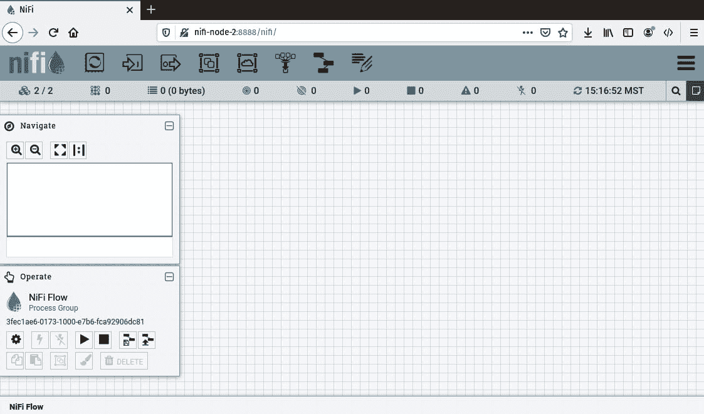
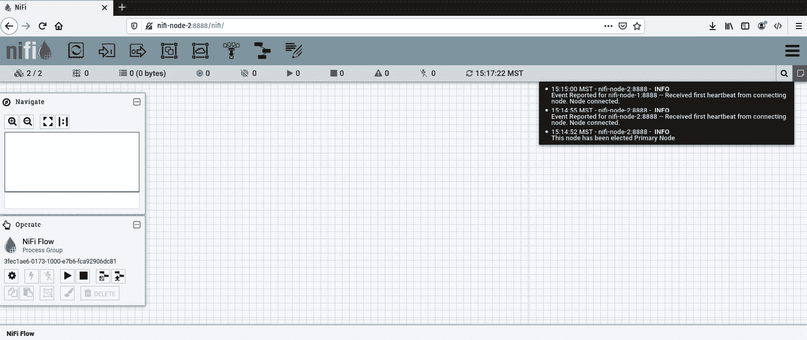
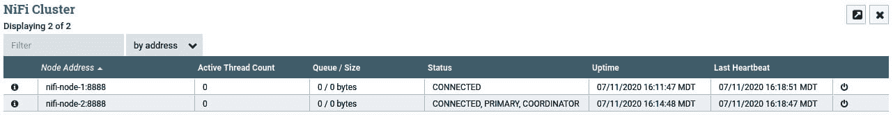
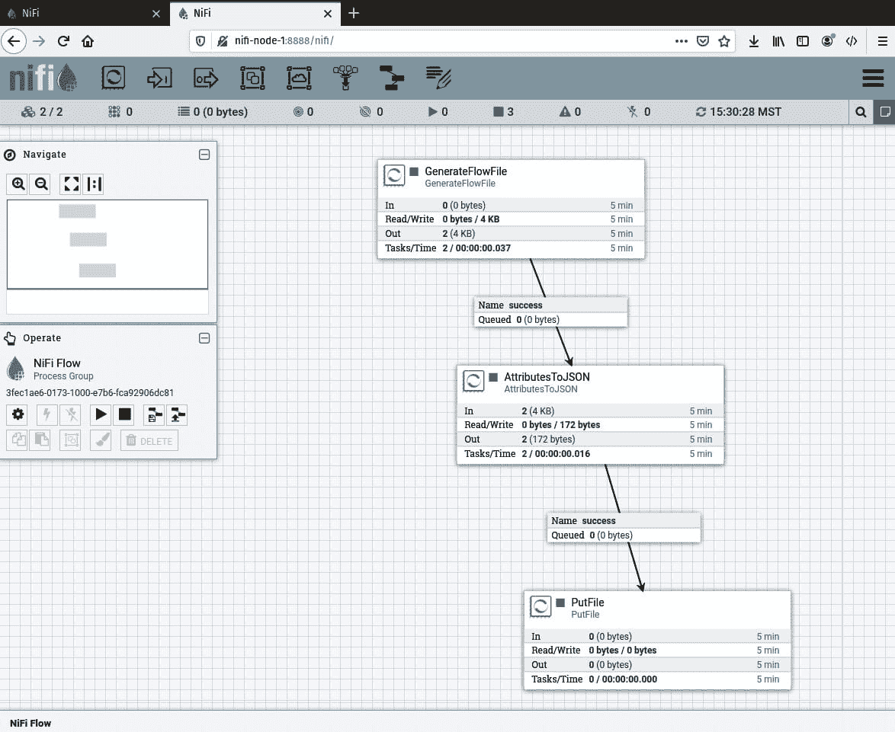
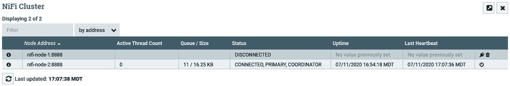
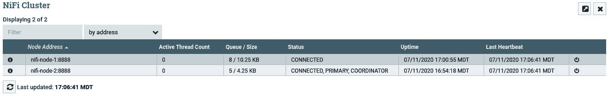
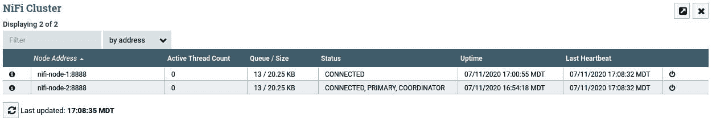

# *附录*

# 构建 NiFi 集群

在这本书中，你已经构建了 Kafka 集群、ZooKeeper 集群和 Spark 集群。通过集群，你能够增加更多机器来提高数据管道的处理能力，而不是增加单个服务器的功率。在本章中，你将学习如何集群化 NiFi，以便你的数据管道可以在多台机器上运行。

在本附录中，我们将涵盖以下主要主题：

+   NiFi 集群的基本知识

+   构建 NiFi 集群

+   构建分布式数据处理管道

+   管理分布式数据处理管道

# NiFi 集群的基本知识

Apache NiFi 中的集群遵循**零主集群**架构。在这种类型的集群中，没有预定义的主节点。每个节点都可以执行相同的任务，数据在他们之间分配。当作为集群部署时，NiFi 使用 Zookeeper。

Zookeeper 将选举一个**集群协调器**。集群协调器负责决定新节点是否可以加入——节点将连接到协调器——并提供更新后的流程给新节点。

虽然听起来集群协调器是主节点，但实际上并非如此。你可以在任何节点上更改数据管道，并且这些更改将被复制到所有其他节点，这意味着非集群协调器或非主节点可以提交更改。

`ExecuteSQL`处理器可以在主节点上运行，然后将数据分发到下游的其他节点进行处理。你将在本章后面看到这是如何操作的。

集群允许你构建能够处理比单台机器更多数据量的数据管道。此外，它允许单个点构建和监控数据管道。如果你运行了多个单节点 NiFi 实例，你需要管理所有这些实例。一个数据管道的更改需要复制到其他实例，或者至少检查以确保它不是重复的。数据仓库管道又是在哪台机器上运行的？我忘了。从任何节点管理集群，会使它更加容易和高效。

# 构建 NiFi 集群

在本节中，你将在不同的机器上构建一个双节点集群。然而，与 MiNiFi 一样，NiFi 和 Zookeeper 的最新版本存在一些兼容性问题。为了解决这些问题并展示概念，本章将使用较旧的 NiFi 版本和预捆绑的 Zookeeper。要构建 NiFi 集群，请执行以下步骤：

1.  以 root 用户或使用 sudo，打开你的`/etc/hosts`文件。你需要为你的集群中使用的机器分配名称。最佳实践是使用主机名而不是 IP 地址。你的 hosts 文件应该看起来像以下示例：

    ```py
    127.0.0.1	localhost
    ::1		localhost
    127.0.1.1	pop-os.localdomain	pop-os
    10.0.0.63	nifi-node-2
    10.0.0.148	nifi-node-1
    ```

1.  在前面的 hosts 文件中，我已经添加了最后两行。节点是 `nifi-node-1` 和 `nifi-node-2`，您可以看到它们有不同的 IP 地址。请在每台机器的 hosts 文件中做出这些更改。完成之后，您可以通过使用 `ping` 来测试它是否工作。从每台机器，尝试通过主机名使用 `ping` 来击中另一台机器。以下是从 `nifi-node-1` 机器击中 `nifi-node-2` 的命令：

    ```py
    paulcrickard@pop-os:~$ ping nifi-node-2
    PING nifi-node-2 (10.0.0.63) 56(84) bytes of data.
    64 bytes from nifi-node-2 (10.0.0.63): icmp_seq=1 ttl=64 time=55.1 ms
    64 bytes from nifi-node-2 (10.0.0.63): icmp_seq=2 ttl=64 time=77.1 ms
    64 bytes from nifi-node-2 (10.0.0.63): icmp_seq=3 ttl=64 time=101 ms
    64 bytes from nifi-node-2 (10.0.0.63): icmp_seq=4 ttl=64 time=32.8 ms
    ```

1.  如果您对另一个节点，`nifi-node-2`，做相反的操作，您应该得到相同的结果——`nifi-node-1` 将返回数据。

1.  接下来，下载 Apache NiFi 的旧版本，1.0.0，请访问 [`archive.apache.org/dist/nifi/1.0.0/`](https://archive.apache.org/dist/nifi/1.0.0/)。选择 `-bin.tar.gz` 文件，因为它包含二进制文件。一旦文件下载完成，使用您的文件管理器或以下命令提取文件：

    ```py
    tar -xvzf nifi-1.0.0-bin.tar.gz
    ```

    一旦您提取了文件，您将编辑配置文件。

1.  要编辑 Zookeeper 配置文件，请在 `$NIFI_HOME/conf` 目录中打开 `zookeeper.properties` 文件。在文件底部，按照以下示例添加您的服务器：

    ```py
    server.1=nifi-node-1:2888:3888
    server.2=nifi-node-2:2888:3888
    ```

1.  在文件顶部，您将看到 `clientPort` 和 `dataDir`。它应该看起来像以下示例：

    ```py
    clientPort=2181
    initLimit=10
    autopurge.purgeInterval=24
    syncLimit=5
    tickTime=2000
    dataDir=./state/zookeeper
    autopurge.snapRetainCount=30
    ```

1.  在 `dataDir` 中，您需要添加一个名为 `myfile` 的文件，其内容为服务器的编号。在 `server.1` (`nifi-node-1`) 上，您将创建一个 `myid` ID，内容为 `1`。为此，从 `$NIFI_HOME` 目录，使用以下命令：

    ```py
    mkdir state
    mkdir state/zookeeper
    echo 1 >> myid
    ```

1.  在 `nifi-node-2` 上，重复前面的步骤，除了将 `echo` 改为以下行：

    ```py
    nifi.properties file.
    ```

1.  要编辑 `nifi.properties`，您需要更改几个属性。第一个属性是 `nifi.state.management.embedded.zookeeper.start`，需要将其设置为 `true`。文件的部分内容如下所示：

    ```py
    ####################
    # State Management #
    ####################
    nifi.state.management.configuration.file=./conf/state-management.xml
    # The ID of the local state provider
    nifi.state.management.provider.local=local-provider
    # The ID of the cluster-wide state provider. This will be ignored if NiFi is not clustered but must be populated if running in a cluster.
    nifi.state.management.provider.cluster=zk-provider
    # Specifies whether or not this instance of NiFi should run an embedded ZooKeeper server
    nifi.state.management.embedded.zookeeper.start=true  
    # Properties file that provides the ZooKeeper properties to use if <nifi.state.management.embedded.zookeeper.start> is set to true
    nifi.state.management.embedded.zookeeper.properties=./conf/zookeeper.properties
    ```

    上述命令告诉 NiFi 使用内嵌版本的 Zookeeper。

1.  您现在需要告诉 NiFi 如何在 `nifi.zookeeper.connect.string` 中连接到 Zookeeper。该字符串是逗号分隔的 Zookeeper 服务器列表，格式为 `<hostname>:<port>`，端口是 `zookeeper.config` 文件中的 `clientPort`，它是 `2181`。文件的部分内容如下所示：

    ```py
    # zookeeper properties, used for cluster management #
    nifi.zookeeper.connect.string=nifi.zookeeper.connect.string=nifi-node-1:2181,nifi-node-2:2181 
    nifi.zookeeper.connect.timeout=3 secs
    nifi.zookeeper.session.timeout=3 secs
    nifi.zookeeper.root.node=/nifi
    ```

1.  接下来，您将配置 NiFi 的 `cluster` 属性。具体来说，您将设置 `nifi.cluster.node` 为 `true`。您将添加节点的主机名到 `nifi.cluster.node.address`，以及添加端口到 `nifi.cluster.node.protocol.port`。您可以将其设置为任何可用且足够高的端口，这样您就不需要 root 权限来访问它（超过 `1024`）。最后，您可以将 `nifi.cluster.flow.election.max.wait.time` 更改为小于 5 分钟，并为 `nifi.cluster.flow.election.max.candidates` 添加一个值。我已经将等待时间更改为 `1` 分钟，并留空候选人。文件的部分内容如下所示：

    ```py
    # cluster node properties (only configure for cluster nodes) #
    nifi.cluster.is.node=true 
    nifi.cluster.node.address=nifi-node-1 
    nifi.cluster.node.protocol.port=8881 
    nifi.cluster.node.protocol.threads=10
    nifi.cluster.node.protocol.max.threads=50
    nifi.cluster.node.event.history.size=25
    nifi.cluster.node.connection.timeout=5 sec
    nifi.cluster.node.read.timeout=5 sec
    nifi.cluster.node.max.concurrent.requests=100
    nifi.cluster.firewall.file=
    nifi.cluster.flow.election.max.wait.time=1 mins 
    nifi.cluster.flow.election.max.candidates=
    ```

1.  网络属性需要机器的主机名以及端口号。默认情况下，`nifi.web.http.port` 是 `8080`，但如果该端口上已经运行了其他东西，您可以更改它。我已经将其更改为 `8888`。主机名是 `nifi-node-1` 或 `nifi-mode-2`。网络属性在以下代码块中显示：

    ```py
    # web properties #
    nifi.web.war.directory=./lib
    nifi.web.http.host=nifi-node-1 <----------------------
    nifi.web.http.port=8888
    ```

1.  最后，NiFi 使用站点到站点进行通信。您需要将 `nifi.remote.input.host` 属性配置为机器的主机名，并将 `nifi.remote.input.socket.port` 配置为可用端口。属性文件在以下代码块中显示：

    ```py
    nifi.properties file, with the exception of changing the hostname to the appropriate number, nifi-node-#.
    ```

您的集群现在已配置完成，您准备好启动两个节点。从每台机器上，使用以下命令以正常方式启动 NiFi：

```py
./nifi.sh start
```

您现在应该能够浏览到 `http://nifi-node-1:8888/nifi` 上的任何节点。您将看到与往常一样的 NiFi，如下面的屏幕截图所示：



图 16.1 – 以集群方式运行的 NiFi

一切看起来都完全一样，只是在状态栏的左上角。现在您应该有一个带有 **2/2** 的云图标。这表示 NiFi 作为一个集群运行，有 2 个节点中的 2 个可用并连接。您可以通过在状态栏右侧的消息上悬停来查看事件。以下屏幕截图显示了节点的选举和连接：



图 16.2 – 显示集群中事件的消息

最后，您可以通过在 NiFi 窗口右上角的 waffle 菜单中选择**集群**来打开集群窗口。集群在以下屏幕截图中显示：



图 16.3 – 集群详细信息

之前的屏幕截图显示了哪个节点是主节点，以及控制器节点和一个常规节点。从这里你还可以查看有关队列的详细信息，或者断开或重新连接节点。集群正在运行，你现在可以构建一个分布式数据管道。

# 构建分布式数据管道

构建分布式数据管道几乎与构建在单台机器上运行的数据管道完全相同。NiFi 将处理传递和重新组合数据的物流。以下屏幕截图显示了基本数据管道：



图 16.4 – 一个基本的数据管道，用于生成数据、提取属性到 JSON 并写入磁盘

之前的数据管道使用 `GenerateFlowFile` 处理器来创建唯一的流文件。这些文件随后传递到 `AttributesToJSON` 处理器，该处理器提取属性并将它们写入流文件内容。最后，文件被写入到 `/home/paulcrickard/output` 目录下的磁盘。

在运行数据管道之前，你需要确保每个节点上都有`PutFile`处理器的输出目录。之前我说过，在分布式情况下数据管道没有不同，但是有一些事情你必须记住，其中之一就是`PutFile`默认情况下会在每个节点上写入磁盘。你需要配置你的处理器以便在任何节点上运行。我们将在本节稍后解决这个问题。

在运行数据管道之前还有一件事。打开浏览器到你的另一个节点。你将看到那个节点上完全相同的数据管道。甚至处理器的布局也是一样的。对任何节点的更改都将分布到所有其他节点。你可以在任何节点上工作。

当你运行数据管道时，你将看到两个节点的输出目录中都有文件被写入。数据管道正在运行并将负载分配到各个节点。以下截图显示了数据管道的输出：

![Figure 16.5 – Data pipeline writing flowfiles to a node

![img/Figure_16.5_B15739.jpg]

图 16.5 – 数据管道将流文件写入节点

如果你得到的结果与前面的截图相同，恭喜你，你刚刚构建了一个分布式数据管道。接下来，你将学习 NiFi 集群的一些更多功能。

# 管理分布式数据管道

前面的数据管道在每个节点上运行。为了补偿这一点，你必须为`PutFile`处理器在两个节点上创建相同的路径才能工作。之前你了解到有几个处理器会导致竞争条件——尝试同时读取相同的文件，这将会引起问题。为了解决这些问题，你可以指定一个处理器应该只在主节点上运行——作为一个独立的过程。

在`PutFile`处理器的配置中，选择**调度**选项卡。在**调度策略**下拉菜单中，选择**主节点**，如下截图所示：

![Figure 16.6 – Running a processor on the Primary Node only

![img/Figure_16.6_B15739.jpg]

图 16.6 – 仅在主节点上运行处理器

现在，当你运行数据管道时，文件将只放置在主节点上。你可以调度像`GetFile`或`ExecuteSQL`这样的处理器来完成相同的事情。

要查看每个节点上数据管道的负载，你可以从 waffle 菜单查看集群详情。当数据通过数据管道移动时，你可以看到有多少流文件坐在每个节点的队列中。以下截图显示了在我集群上运行的管道：

![Figure 16.7 – Viewing the queues of each node. Each node has four flowfiles

![img/Figure_16.7_B15739.jpg]

图 16.7 – 查看每个节点的队列。每个节点有四个流文件

数据管道正在将 flowfiles 均匀地分配到各个节点。在**零主集群**中，数据不会被复制或复制。它只存在于正在处理它的节点上。如果一个节点宕机，数据需要重新分配。这只能在节点仍然连接到网络的情况下发生，否则，它将不会发生，直到节点重新加入。

你可以通过点击节点行右侧的电源图标手动断开节点连接。以下截图显示了节点正在断开连接的情况：



图 16.8 – nifi-node-1 已从集群断开连接

在前面的截图中，你可以看到`nifi-node-1`的状态为**断开连接**。但你也应该注意到它有八个需要重新分配的 flowfiles。由于你断开了节点，但没有将其从网络中删除，NiFi 将重新分配 flowfiles。你可以通过刷新屏幕看到结果，如下面的截图所示：



图 16.9 – 从断开连接的节点重新分配的 flowfiles

你还可以重新连接任何断开的节点。你通过点击插头图标来完成此操作。当你这样做时，节点将重新加入集群，flowfiles 将被重新分配。以下截图显示了节点重新加入集群的情况：



图 16.10 – 重新连接节点和 flowfile 重新分配

在前面的截图中，由于节点断开连接，flowfiles 在节点之间均匀累积。

# 摘要

在本附录中，你学习了 NiFi 集群的基本知识，以及如何使用嵌入式 Zookeeper 构建集群以及如何构建分布式数据管道。NiFi 处理大部分数据分布；你只需要记住一些注意事项——例如竞争条件和处理器需要配置在任意节点上运行。使用 NiFi 集群允许你从单个实例管理多个机器上的 NiFi。它还允许你处理大量数据，并在实例崩溃的情况下提供一些冗余。
