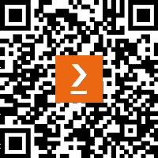

# 前言

欢迎来到*Python 数据摄取食谱*。我希望你像我一样兴奋地进入数据工程的世界。

*Python 数据摄取食谱*是一本实用的指南，将赋予你设计和实施高效数据摄取管道的能力。通过实际案例和知名开源工具，本书直面你的疑问和障碍。

从设计管道开始，你将探索在有和无数据模式的情况下工作，使用 Airflow 构建监控工作流程，并在遵循最佳实践的同时拥抱数据可观察性原则。面对读取不同数据源和格式的挑战，你将全面理解所有这些内容。

我们的旅程继续，我们将深入了解错误日志记录、识别、解决、数据编排和有效监控。你将发现存储日志的最佳方法，确保未来可以轻松访问和引用它们。

在本书结束时，你将拥有一个完全自动化的设置，用于启动数据摄取和管道监控。这个简化的流程将无缝集成到**提取、转换和加载**（**ETL**）过程的后续阶段，推动你的数据集成能力达到新的高度。准备好开始一段启发性和变革性的数据摄取之旅吧。

# 本书面向对象

这本全面的书专门为数据工程师、数据集成专家和对数据摄取过程、数据流以及沿途遇到的典型挑战有深入了解热情的数据爱好者而设计。它提供了宝贵的见解、最佳实践和实用知识，以增强你在有效处理数据摄取任务方面的技能和熟练度。

无论你是数据世界的初学者还是经验丰富的开发者，这本书都适合你。建议了解 Python 编程基础，并具备基本的 Docker 知识，以便阅读和运行本书的代码。

# 本书涵盖内容

*第一章*，*数据摄取简介*，介绍了数据摄取最佳实践和与不同数据源一起工作的挑战。它解释了书中涵盖的工具的重要性，展示了它们，并提供了安装说明。

*第二章*，*数据访问原则 – 访问你的数据*，探讨了与数据治理相关的数据访问概念，涵盖了熟悉的数据源（如 SFTP 服务器、API 和云提供商）的工作流程和管理。它还提供了在数据库、数据仓库和云中创建数据访问策略的示例。

*第三章*，*在摄取数据之前理解我们的数据*，教授您在数据摄取之前执行数据发现过程的重要性。它涵盖了手动发现、文档记录以及使用开源工具 OpenMetadata 进行本地配置。

*第四章*，*读取 CSV 和 JSON 文件并解决问题*，向您介绍使用 Python 和 PySpark 摄取 CSV 和 JSON 文件。它展示了在处理不同数据量和基础设施的同时，解决常见挑战并提供解决方案。

*第五章*，*从结构化和非结构化数据库中摄取数据*，涵盖了关系型和非关系型数据库的基本概念，包括日常用例。您将学习如何读取和处理这些模型中的数据，了解重要考虑事项，并解决潜在的错误。

*第六章*，*使用定义和非定义模式下的 PySpark*，深入探讨了常见的 PySpark 用例，重点关注处理定义和非定义模式。它还探讨了从 Spark（PySpark 核心）读取和理解复杂日志以及便于调试的格式化技术。

*第七章*，*摄取分析数据*，向您介绍分析数据以及读取和写入的常见格式。它探讨了为提高性能读取分区数据，并讨论了反向 ETL 理论及其在实际工作流程和图表中的应用。

*第八章*，*设计受监控的数据工作流*，涵盖了数据摄取的最佳日志记录实践，便于错误识别和调试。例如，监控文件大小、行数和对象数等技术，可以改善仪表板、警报和洞察力的监控。

*第九章*，*利用 Airflow 整合一切*，总结了之前介绍的信息，并指导您使用 Airflow 构建一个真实的数据摄取应用程序。它涵盖了过程中的基本组件、配置和问题解决。

*第十章*，*在 Airflow 中记录和监控您的数据摄取*，探讨了使用 Airflow 进行数据摄取的高级日志记录和监控。它涵盖了创建自定义操作符、设置通知以及监控数据异常。还涵盖了为 Slack 等工具配置通知，以保持对数据摄取过程的更新。

*第十一章*，*自动化您的数据摄取管道*，侧重于使用之前学到的最佳实践自动化数据摄取，实现读者自主权。它解决了与调度器或编排工具相关的常见挑战，并提供了避免生产集群中问题的解决方案。

*第十二章**，* *使用数据可观察性进行调试、错误处理和预防停机时间*，探讨了数据可观察性概念、流行的监控工具如 Grafana，以及日志存储和数据血缘的最佳实践。它还涵盖了使用 Airflow 配置和数据摄取脚本来创建可视化图表以监控数据源问题。

# 为了充分利用这本书

要执行本书中的代码，您至少需要具备基本的 Python 知识。我们将使用 Python 作为执行代码的核心语言。代码示例已使用 Python 3.8 进行测试。然而，预计它仍然可以使用未来的语言版本运行。

除了 Python 之外，本书还使用 Docker 在我们的本地机器上模拟数据系统和应用程序，例如 PostgreSQL、MongoDB 和 Airflow。因此，建议您具备基本的 Docker 知识，以便编辑容器镜像文件以及运行和停止容器。

请记住，某些命令行命令可能需要根据您的本地设置或操作系统进行调整。代码示例中的命令基于 Linux 命令行语法，可能需要在 Windows PowerShell 上运行时进行一些调整。

| **本书涵盖的软件/硬件** | **操作系统要求** |
| --- | --- |
| Python 3.8 或更高版本 | Windows, Mac OS X, 和 Linux（任何） |
| Docker Engine 24.0 / Docker Desktop 4.19 | Windows, Mac OS X, 和 Linux（任何） |

*对于本书中的几乎所有食谱，您都可以使用 Jupyter Notebook 来执行代码。尽管安装它不是强制性的，但这个工具可以帮助您测试代码并在代码上尝试新事物，因为它具有* *友好的界面。*

**如果您正在使用本书的数字版，我们建议您亲自输入代码或通过 GitHub 仓库（下一节中提供链接）访问代码。这样做将帮助您避免与代码复制和粘贴相关的任何潜在错误。**

## 下载示例代码文件

您可以从 GitHub 下载本书的示例代码文件[`github.com/PacktPublishing/Data-Ingestion-with-Python-Cookbook`](https://github.com/PacktPublishing/Data-Ingestion-with-Python-Cookbook)。如果代码有更新，它将在现有的 GitHub 仓库中更新。

我们还有来自我们丰富的书籍和视频目录中的其他代码包，可在[`github.com/PacktPublishing/`](https://github.com/PacktPublishing/)找到。查看它们吧！

# 下载彩色图像

我们还提供了一份包含本书中使用的截图/图表的彩色图像的 PDF 文件。您可以从这里下载：[`packt.link/xwl0U`](https://packt.link/xwl0U)

# 使用的约定

本书使用了多种文本约定。

`文本中的代码`：表示文本中的代码单词、数据库表名、文件夹名、文件名、文件扩展名、路径名、虚拟 URL、用户输入和 Twitter 昵称。以下是一个示例：“然后我们使用`with` `open`语句继续操作。”

代码块设置如下：

```py
def gets_csv_first_line (csv_file):
    logging.info(f"Starting function to read first line")
    try:
        with open(csv_file, 'r') as file:
            logging.info(f"Reading file")
```

任何命令行输入或输出都应如下编写：

```py
$ python3 –-version
Python 3.8.10
```

`showString at NativeMethodAccessorImpl.java:0`，这使我们转向**阶段**页面。”

小贴士或重要注意事项

看起来像这样。

# 部分

在本书中，您将找到几个频繁出现的标题（*准备就绪*，*如何操作...*，*它是如何工作的...*，*还有更多...*，和*另请参阅*）。

为了清楚地说明如何完成食谱，请按照以下方式使用这些部分：

## 准备就绪

本节告诉您在食谱中可以期待什么，并描述如何设置任何软件或任何为食谱所需的初步设置。

## 如何操作…

本节包含遵循食谱所需的步骤。

## 它是如何工作的…

本节通常包含对前一个节中发生情况的详细解释。

## 还有更多…

本节包含有关食谱的附加信息，以便您对食谱有更多的了解。

## 另请参阅

本节提供了对食谱中其他有用信息的链接。

# 联系我们

我们始终欢迎读者的反馈。

**一般反馈**: 如果您对本书的任何方面有疑问，请在邮件主题中提及书名，并通过 customercare@packtpub.com 与我们联系。

**勘误**: 尽管我们已经尽一切努力确保内容的准确性，但错误仍然可能发生。如果您在此书中发现错误，我们将不胜感激，如果您能向我们报告，我们将不胜感激。请访问[www.packtpub.com/support/errata](http://www.packtpub.com/support/errata)，选择您的书籍，点击勘误提交表单链接，并输入详细信息。

**盗版**: 如果您在互联网上以任何形式遇到我们作品的非法副本，如果您能提供位置地址或网站名称，我们将不胜感激。请通过版权@packt.com 与我们联系，并提供材料的链接。

**如果您有兴趣成为作者**: 如果您在某个主题上具有专业知识，并且您有兴趣撰写或为书籍做出贡献，请访问[authors.packtpub.com](http://authors.packtpub.com)。

# 分享您的想法

一旦您阅读了《使用 Python 进行数据摄取烹饪书》，我们很乐意听听您的想法！请[点击此处直接访问此书的亚马逊评论页面](https://packt.link/r/183763260X)并分享您的反馈。

您的评论对我们和科技社区都很重要，并将帮助我们确保我们提供高质量的内容。

# 下载此书的免费 PDF 副本

感谢您购买此书！

您喜欢在路上阅读，但无法携带您的印刷书籍到处走？

您的电子书购买是否与您选择的设备不兼容？

别担心，现在，随着每本 Packt 书籍，您都可以免费获得该书的 DRM 免费 PDF 版本。

在任何地方、任何设备上阅读。直接从您喜欢的技术书籍中搜索、复制和粘贴代码到您的应用程序中。

优惠远不止于此，您还可以获得独家折扣、时事通讯和每日免费内容的每日访问权限

按照以下简单步骤获取福利：

1.  扫描下面的二维码或访问以下链接



[`packt.link/free-ebook/9781837632602`](https://packt.link/free-ebook/9781837632602)

1.  提交您的购买证明

1.  就这样！我们将直接将您的免费 PDF 和其他福利发送到您的邮箱

# 第一部分：数据摄取基础

在这部分，您将了解数据摄取和数据工程的基础知识，包括摄取管道的基本定义、常见的数据源类型以及涉及的技术。

本部分包含以下章节：

+   *第一章*，*数据摄取简介*

+   *第二章*，*数据访问原则 – 访问您的数据*

+   *第三章*，*数据发现 – 在摄取数据之前理解我们的数据*

+   *第四章*，*读取 CSV 和 JSON 文件并解决问题*

+   *第五章*，*从结构化和非结构化数据库中摄取数据*

+   *第六章*，*使用 PySpark 与定义和非定义模式*

+   *第七章*，*摄取分析数据*
