# 第二章：数据访问原则 – 访问您的数据

**数据访问**是一个术语，指的是将数据从一个系统或应用程序存储、检索、传输和复制到另一个系统或应用程序的能力。它涉及安全性、法律，在某些情况下还涉及国家事务。除了最后两点，我们还将在本章中涵盖一些安全主题。

作为数据工程师或科学家，知道如何正确检索数据是必要的。其中一些可能需要**加密身份验证**，为此，我们需要了解一些解密库的工作原理以及如何在不泄露敏感数据的情况下使用它们。数据访问还涉及系统或数据库的授权级别，从管理到只读角色。

在本章中，我们将介绍数据访问级别是如何定义的，以及在数据摄取过程中最常用的库和身份验证方法。

在本章中，你将完成以下食谱：

+   在数据访问工作流程中实施治理

+   访问数据库和数据仓库

+   访问**SSH 文件传输协议**（**SFTP**）文件

+   使用 API 身份验证检索数据

+   管理加密文件

+   从 AWS 访问数据

+   从 GCP 访问数据

# 技术要求

如果你已经有 Gmail 账户，可以轻松创建 Google Cloud 账户，并且大部分资源都可以使用免费层访问。它还提供了 300 美元的信用额度，用于非免费资源。如果你想在 GCP 中使用本书中的其他食谱进行其他测试，这是一个很好的激励措施。

要访问和启用 Google Cloud 账户，请访问[`cloud.google.com/`](https://cloud.google.com/)页面，并按照屏幕上提供的步骤操作。

注意

本章涵盖的所有食谱都适用于免费层。

你也可以在这个 GitHub 仓库中找到本章的代码：[`github.com/PacktPublishing/Data-Ingestion-with-Python-Cookbook`](https://github.com/PacktPublishing/Data-Ingestion-with-Python-Cookbook)。

# 在数据访问工作流程中实施治理

正如我们之前看到的，**数据访问**或**可访问性**是**治理**支柱，与安全性密切相关。数据安全不仅是管理员或经理的担忧，也是所有与数据相关的人的担忧。话虽如此，了解如何设计一个基础工作流程以实施数据的安全层，只允许授权人员读取或操作数据，这是至关重要的。

此食谱将创建一个包含实施数据访问管理必要主题的工作流程。

## 准备工作

在设计我们的工作流程之前，我们需要确定干扰我们数据访问的向量。

那么，什么是数据向量呢？

向量是某人可以用来未经授权访问服务器、网络或数据库的路径。在这种情况下，我们将识别与数据泄露相关的向量。

让我们以以下图表所示的形式来探索它们：


图 2.1 – 数据治理向量

让我们在这里理解路径中的每个阶段：

1.  **数据创建**：在这个步骤中，我们确定数据在哪里创建以及由谁创建。有了这个定义，我们可以确保只有**负责**的人可以访问创建或更新数据。

1.  **数据存储**：在创建后，了解我们的数据在哪里或将被存储非常重要。根据这个问题的答案，检索数据的方法将不同，可能需要额外的步骤。

1.  **用户和服务管理**：数据必须被使用，人们需要访问。在这里，我们定义了**参与者**或我们可能拥有的角色，常见的类型是**管理员**、**写入**和**只读**角色。

1.  **数据传输**：我们的数据将如何传输？决定它是实时、近实时还是批量传输至关重要。你可以在你的工作流程中添加更多问题，例如数据将通过 API 或其他方法进行传输时将如何可用。

## 如何操作…

在确定我们的向量后，我们可以定义数据访问管理的实施工作流程。

为了让大家更容易理解如何实现它，让我们设想一个假设的场景，在这个场景中，我们想要从患者那里检索医疗记录。

这是我们的做法：

1.  第一步是记录所有我们的数据并将其分类。如果有机密数据，我们需要制定如何识别它的方法。

1.  然后，我们将开始定义谁可以访问数据，并相应地确定必要的使用权限。例如，我们确定数据管理员并在此处设置读写权限。

1.  一旦实现了数据访问级别，我们就开始观察用户的操作。将日志记录到数据库、数据仓库或任何其他具有用户活动记录的系统至关重要。

1.  最后，我们检查整个流程，以确定是否需要任何更改。

最后，我们将得到一个类似于以下流程图的流程：

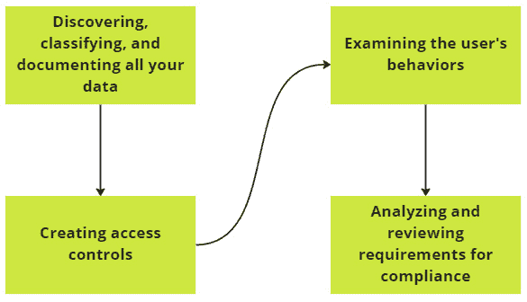

图 2.2 – 开始实施数据治理的流程图

## 它是如何工作的…

数据访问管理是一个持续的过程。每天，我们都会摄取并创建新的管道，供不同团队中的多个人使用。以下是具体步骤：

1.  **发现、分类和记录所有数据**：首先要组织的是我们的数据。我们将检索哪位患者的数据？它是否包含**个人身份信息**（**PII**）或**受保护/个人健康信息**（**PHI**）？由于这是我们第一次摄取这些数据，我们需要用有关 PII 和谁负责源数据的标志对其进行编目。

1.  **创建访问控制**：在这里，我们根据角色定义访问权限，因为并非每个人都需要访问患者病史。我们根据角色、职责和分类分配数据权限。

1.  **检查用户行为**：在这个步骤中，我们观察用户在其角色中的行为。创建、更新和删除操作被记录下来以便监控和必要时审查。如果医疗部门不再使用某个报告，我们可以限制他们的访问，甚至阻止他们获取信息。

1.  **分析和审查合规性要求**：我们必须确保我们的访问管理遵循合规性和当地法规。不同类型的数据有不同的法律规范，这需要考虑。

## 相关内容

+   *医疗数据泄露* *统计数据*：[`www.hipaajournal.com/healthcare-data-breach-statistics/`](https://www.hipaajournal.com/healthcare-data-breach-statistics/)

+   *欧洲数据保护专员。工作空间中的健康数据*：[`edps.europa.eu/data-protection/data-protection/reference-library/health-data-workplace_en`](https://edps.europa.eu/data-protection/data-protection/reference-library/health-data-workplace_en)

# 访问数据库和数据仓库

**数据库**是任何系统或应用的基石，无论你的架构如何。有时需要数据库来存储日志、用户活动或信息，以及系统相关内容。

从更大的角度来看，数据仓库有相同的用途，但与分析数据相关。在摄取和转换数据后，我们需要将其加载到更容易检索用于仪表板、报告等的地方。

目前，可以找到多种类型的数据库（SQL 和 NoSQL 类型）和数据仓库架构。然而，这个配方旨在介绍通常如何对关系结构进行访问控制。目标是了解访问级别是如何定义的，即使是在一个通用场景中。

## 准备工作

对于这个配方，我们将使用 MySQL。你可以按照 MySQL 官方页面上的说明进行安装：[`dev.mysql.com/downloads/installer/`](https://dev.mysql.com/downloads/installer/)。

你可以使用你选择的任何 SQL 客户端来执行这里的查询。在我的情况下，我将使用 MySQL Workbench：

1.  首先，我们将使用我们的`root`用户创建一个数据库。你可以给它取任何名字。我的建议是设置字符集为`UTF-8`：

    ```py
    CREATE SCHEMA `your_schema_name` DEFAULT CHARACTER SET utf8 ;
    ```

我的模式将被称为`cookbook-data`。

1.  下一步是创建表。仍然使用 root 账户，我们将使用**数据定义语言**（**DDL**）语法创建一个`people_city`表：

    ```py
    CREATE TABLE `cookbook-data`.`people_city` (
      `id` INT NOT NULL,
      `name` VARCHAR(45) NULL,
      `country` VARCHAR(45) NULL,
      `occupation` VARCHAR(45) NULL,
      PRIMARY KEY (`id`));
    ```

## 如何操作...

注意

自从 MySQL 8.0 的最后一个更新以来，我们无法直接使用`GRANT`命令创建用户。将出现这样的错误：

`ERROR 1410 (42000): 您不允许使用 GRANT 创建用户`

为了解决这个问题，我们将采取一些额外的步骤。我们还需要至少打开两次 MySQL，所以如果你选择直接在命令行中执行命令，请记住这一点。

我还想感谢 Lefred 的博客为此解决方案和对社区的贡献。你可以在他们的博客中找到更多详细信息和其他有用的信息：[`lefred.be/content/how-to-grant-privileges-to-users-in-mysql-8-0/`](https://lefred.be/content/how-to-grant-privileges-to-users-in-mysql-8-0/)。

让我们看看执行这个菜谱的步骤：

1.  首先，让我们创建`admin`用户。在这里，如果我们没有正确遵循以下步骤，我们将会遇到问题。我们需要创建一个用户作为我们的超级用户或管理员，使用我们的`root 用户`：

    ```py
    CREATE user 'admin'@'localhost' identified by 'password';
    > Query OK, 0 rows affected
    ```

1.  然后，我们使用`admin`用户登录。使用你在*步骤 1*中定义的密码，使用`admin`用户登录 MySQL 控制台。在 SQL 软件客户端上，我们目前还看不到任何数据库，但在接下来的步骤中我们会解决这个问题。登录到控制台后，你可以看到准备使用的 SQL 命令：

    ```py
    $ mysql -u admin -p password -h localhost
    Type 'help;' or '\h' for help. Type '\c' to clear the current input statement.
    mysql>
    ```

保持此会话开启。

1.  然后，我们通过角色授予`admin`用户权限。在 root 会话中，让我们创建一个名为`administration`的角色，并将数据库的完全访问权限授予`admin`用户：

    ```py
    create ROLE administration;
    ```

然后，我们授予角色权限：

```py
grant alter,create,delete,drop,index,insert,select,update,trigger,alter routine,create routine, execute, create temporary tables on `cookbook_data`.* to 'administration';
```

然后，我们将角色授予我们的`admin`用户：

```py
grant 'administration' to 'admin';
```

然后，我们将此角色设置为默认：

```py
set default role 'administration' to 'admin';
```

1.  接下来，就像在*步骤 2*中一样，我们创建另外两个用户，`write`和`read-only`角色。

重复*步骤 3*，给出新的角色名称，并且对于这两个角色，我的建议是授予以下权限：

+   `alter`、`create`、`index`、`insert`、`select`、`update`、`trigger`、`alter routine`、`create routine`、`execute`和`create` `temporary tables`

+   `select`和`execute`

1.  接下来，我们执行操作。如果我们尝试使用我们的`admin`或`write`角色执行`INSERT`，我们可以看到它是可行的：

    ```py
    INSERT INTO `cookbook_data`.`people_city` (id, `name`, country, occupation)
    VALUES (1, 'Lin', 'PT', 'developer');
    > 1 row(s) affected
    ```

然而，`read-only`用户却不能这样做：

```py
Error Code: 1142\. INSERT command denied to user 'reader'@'localhost' for table 'people_city'
```

## 它是如何工作的…

在实际项目中，大多数情况下，会有一个专门的人员（或数据库管理员）来处理和照顾数据库或数据仓库的访问。尽管如此，任何需要访问关系型数据源的人员都需要了解访问级别的基本概念，以便请求其权限（并证明其合理性）。

在这个菜谱中，我们使用了`show` `privileges`命令。

`alter`、`create`、`delete`、`drop`、`index`、`insert`、`select`、`update`、`trigger`、`alter routine`、`create routine`、`execute`和`create temporary tables`是日常使用中常用的命令，了解它们有助于更容易地识别错误。以先前的错误为例：

```py
Error Code: 1142\. INSERT command denied to user 'reader'@'localhost' for table 'people_city'
```

第一行精确地显示了我们需要权限。第二行显示了哪个用户（`reader`）缺少权限，他们使用的连接`(@localhost)`，以及他们想要访问的表（`people_city`）。

此外，如果你是系统管理员，你也可以识别出不被允许的行为并帮助解决它。

## 还有更多…

如果你感兴趣了解更多，也可以找到数据库和数据仓库的另外三种访问控制类型：

+   **自主访问控制**（**DAC**）

+   **强制访问控制**（**MAC**）

+   **基于属性的访问控制**（**ABAC**）

下图以简化的形式说明了访问控制，如下所示：

](img/Figure_2.3_B19453.jpg)

图 2.3 – 数据库访问控制比较 – 来源：[`www.cloudradius.com/access-control-paradigms-compared-rbac-vs-pbac-vs-abac/`](https://www.cloudradius.com/access-control-paradigms-compared-rbac-vs-pbac-vs-abac/)

即使前一个图中没有描述，我们也可以找到使用**基于行和列的访问控制**的数据库。更多关于它的信息可以在这里找到：[`documentation.datavirtuality.com/23/reference-guide/authentication-access-control-and-security/access-control/data-roles/permissions/row-and-column-based-security`](https://documentation.datavirtuality.com/23/reference-guide/authentication-access-control-and-security/access-control/data-roles/permissions/row-and-column-based-security).

## 参考信息

+   这里是*Raimundas Matulevicius*和*Henri Lakk*关于 RBAC 的文章，深入讨论了几个案例中的最佳方法：[`www.researchgate.net/publication/281479020_A_Model-driven_Role-based_Access_Control_for_SQL_Databases`](https://www.researchgate.net/publication/281479020_A_Model-driven_Role-based_Access_Control_for_SQL_Databases)

+   这篇文章由*Arundhati Singh*撰写，提供了关于企业网络中 RBAC 模式实现的视角：[`dspace.mit.edu/bitstream/handle/1721.1/87870/53700676-MIT.pdf?sequence=2`](https://dspace.mit.edu/bitstream/handle/1721.1/87870/53700676-MIT.pdf?sequence=2)

# 访问 SSH 文件传输协议（SFTP）文件

**文件传输协议**（**FTP**）于 20 世纪 70 年代在**麻省理工学院**（**MIT**）推出，基于**传输控制协议/互联网协议**（**TCP/IP**）的应用层。自 20 世纪 80 年代以来，它被广泛用于在计算机之间传输文件。

随着计算机和互联网使用的增加，多年来，引入一种更安全的解决方案使用方式变得必要。为了提高**FTP 事务**的安全性，实现了**SSH 层**，创建了**SSH 文件传输协议**（**SFTP**）协议。

现在，从 SFTP 服务器中获取数据是很常见的，在这个菜谱中，我们将努力从公共 SFTP 服务器检索数据。

## 准备工作

在这个菜谱中，我们将使用 Python 和`pysftp`库编写代码，以连接并从公共 SFTP 服务器检索样本数据。

如果你拥有 SFTP 服务器，可以自由地测试这里提供的 Python 代码来练习更多：

1.  首先，我们将获取 SFTP 凭证。访问 SFTP.NET 地址 https://www.sftp.net/public-online-sftp-servers，并在记事本上保存**主机名**和**登录**（用户名/密码）信息。


图 2.4 – SFTP.NET 主页

注意

此 SFTP 服务器仅用于测试和研究目的。因此，凭证是不安全的，并且是公开可用的；对于生产目的，该信息需要在密码保险库中安全存储，并且永远不要通过代码共享。

1.  然后，我们使用命令行安装 Python 的`pysftp`包：

    ```py
    $ pip install pysftp
    ```

## 如何操作...

执行此菜谱的步骤如下：

1.  首先，让我们创建一个名为`accessing_sftp_files.py`的 Python 文件。然后，我们插入以下代码以使用 Python 创建我们的 SFTP 连接：

    ```py
    import pysftp
    host = " test.rebex.net"
    username = "demo"
    password = "password"
    with pysftp.Connection(host=host, username=username, password=password) as sftp:
        print("Connection successfully established ... ")
    ```

您可以使用以下命令调用该文件：

```py
$ python accessing_sftp_files.py
```

这是它的输出：

```py
Connection successfully established ...
```

在这里，可能会出现一个已知错误——`SSHException: No hostkey for host` `test.rebex.net found`.

这是因为 pysftp 在您的 KnowHosts 中找不到 hostkey。

如果出现此错误，请按照以下步骤操作：

1.  打开您的命令行并执行`ssh demo@test.rebex.net`：

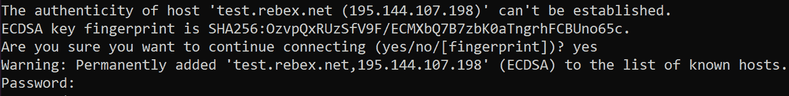

图 2.5 – 将主机添加到 known_hosts 列表

1.  输入`demo`用户的密码并退出 Rebex 虚拟外壳：

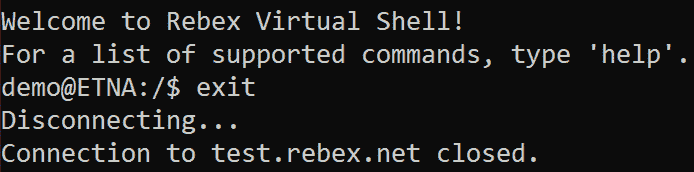

图 2.6 – 来自 Rebex SFTP 服务器的欢迎信息

1.  然后，我们列出 SFTP 服务器上的文件：

    ```py
    import pysftp
    host = "test.rebex.net"
    username = "demo"
    password = "password"
    with pysftp.Connection(host=host, username=username, password=password) as sftp:
        print("Connection successfully established ... ")
        # Switch to a remote directory
        sftp.cwd('pub/example/')
        # Obtain structure of the remote directory '/pub/example'
        directory_structure = sftp.listdir_attr()
        # Print data
        for attr in directory_structure:
            print(attr.filename, attr)
    ```

现在，让我们下载`readme.txt`文件：

让我们将代码的最后几行修改一下，以便能够下载`readme.txt`：

```py
import pysftp
host = "test.rebex.net"
username = "demo"
password = "password"
with pysftp.Connection(host=host, username=username, password=password) as sftp:
    print("Connection successfully established ... ")
    # Switch to a remote directory
    sftp.cwd('pub/example/')
    print("Changing to pub/example directory... ")
    sftp.get('readme.txt', 'readme.txt')
    print("File downloaded ... ")
    sftp.close()
```

其输出如下：

```py
Connection successfully established ...
Changing to pub/example directory...
File downloaded ...
```

## 它是如何工作的...

`pysftp`是一个 Python 库，允许开发者连接、上传和从 SFTP 服务器下载数据。它的使用很简单，并且该库具有众多功能。

注意，我们的大部分代码都位于`pysftp.Connection`内部缩进。这是因为我们为特定凭证创建了一个连接会话。`with`语句负责资源的获取和释放，如您所见，它在文件流、锁、套接字等中广泛使用。

我们还使用了`sftp.cwd()`方法，允许我们更改目录，并在需要列出或检索文件时避免指定路径。

最后，使用`sftp.get()`完成了下载，其中第一个参数是我们想要下载的文件的路径和名称，第二个参数是我们将放置它的位置。由于我们已经在文件的目录中，我们可以将其保存在我们的本地`HOME`目录中。

最后但同样重要的是，`sftp.close()`关闭了连接。这是在脚本中避免与网络并发或其他管道或 SFTP 服务器的好做法。

## 更多内容...

如果您想深入了解并进行其他测试，您还可以创建一个本地 SFTP 服务器。

对于 Linux 用户来说，可以使用`ssh`命令行来完成这项操作。更多内容请查看这里：[`linuxhint.com/setup-sftp-server-ubuntu/`](https://linuxhint.com/setup-sftp-server-ubuntu/).

对于 Windows 用户，请转到此处的**SFTP 服务器**部分：[`www.sftp.net/servers`](https://www.sftp.net/servers).

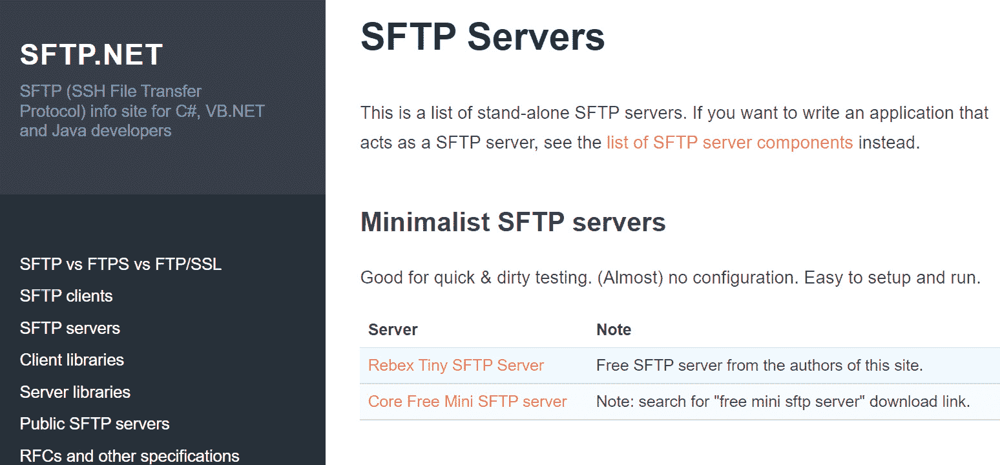

图 2.7 – SFTP.NET 页面，包含创建小型 SFTP 服务器的教程链接

在 **Minimalist SFTP servers** 下选择 **Rebex Tiny SFTP Server**，下载并启动程序。

## 参见

+   使用 Docker 创建本地 SFTP 服务器：[`hub.docker.com/r/atmoz/sftp`](https://hub.docker.com/r/atmoz/sftp)

# 使用 API 身份验证获取数据

**应用程序编程接口（API**）是一组配置，允许两个系统或应用程序相互通信或传输数据。近年来，其概念得到了改进，允许使用 **OAuth** 方法实现更快的传输和更高的安全性，防止 **拒绝服务（DoS**）或 **分布式拒绝服务（DDoS**）攻击等。

它在数据摄取中得到了广泛应用，无论是从应用程序中检索数据以获取分析的最新日志，还是从 **BigQuery** 使用云服务提供商（如 Google）检索数据。如今，大多数应用程序都通过 API 服务提供其数据，这使得数据世界从中获得了许多好处。关键在于知道如何使用最接受的认证形式从 API 服务中检索数据。

在这个菜谱中，我们将使用 API 密钥身份验证从公共 API 获取数据，这是一种标准的数据收集方法。

## 准备工作

由于我们将使用两种不同的方法，本节将分为两部分，以便更容易理解如何处理它们。

对于本节，我们将使用 HolidayAPI，这是一个公开且免费的 API，提供有关全球假期的信息：

1.  安装 Python 的 `requests` 库：

    ```py
    $ pip3 install requests
    ```

1.  然后，访问 Holiday API 网站。访问 [`holidayapi.com/`](https://holidayapi.com/) 并点击 **获取您的免费 API 密钥**。你应该会看到以下页面：

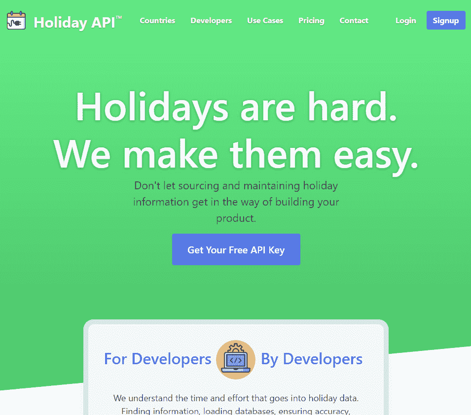

图 2.8 – Holidays API 主网页

1.  然后，我们创建一个账户并获取 API 密钥。要创建账户，您可以使用电子邮件和密码，或者使用 GitHub 账户注册：

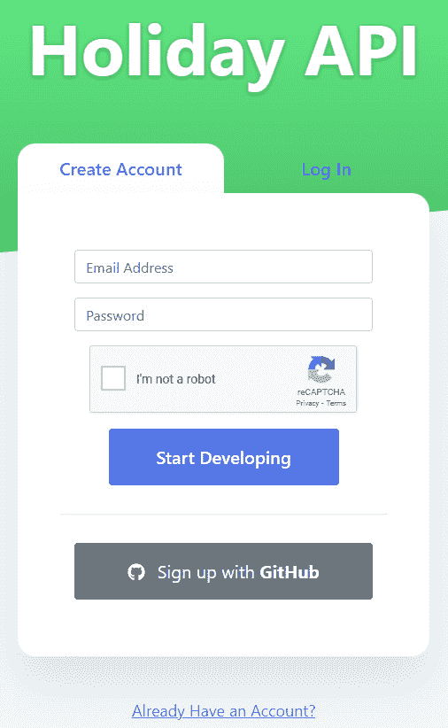

图 2.9 – Holiday API 用户身份验证页面

身份验证后，你可以看到并复制你的 API 密钥。请注意，你可以在任何时候生成一个新的密钥。

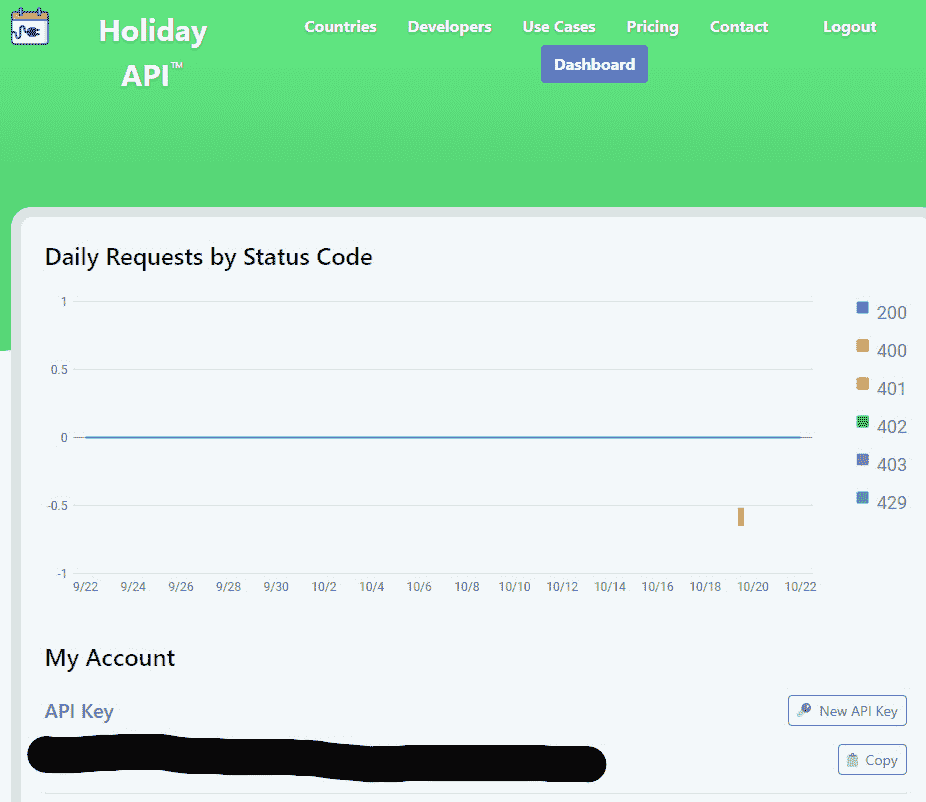

图 2.10 – Holiday API 页面上的用户仪表板页面

注意

我们将使用此 API 的免费层，每月请求量有限。它也禁止用于商业用途。

## 如何操作…

下面是执行菜谱的步骤：

1.  我们使用 `requests` 库创建一个 Python 脚本：

    ```py
    import requests
    import json
    params = { 'key': 'YOUR-API-KEY',
              'country': 'BR',
              'year': 2022
    }
    url = "https://holidayapi.com/v1/holidays?"
    req = requests.get(url, params=params)
    print(req.json())
    ```

确保您使用与上一年相同的 `year` 值，因为我们正在使用 API 的免费版本，该版本仅限于去年的历史数据。

这里是代码的输出：

```py
{'status': 200, 'warning': 'These results do not include state and province holidays. For more information, please visit https://holidayapi.com/docs', 'requests': {'used': 7, 'available': 9993, 'resets': '2022-11-01 00:00:00'}, 'holidays': {'name': "New Year's Day", 'date': '2021-01-01', 'observed': '2021-01-01', 'public': True, 'country': 'BR', 'uuid': 'b58254f9-b38b-42c1-8b30-95a095798b0c',{...}
```

注意

作为最佳实践，API 密钥绝不应该在脚本中硬编码。这里的定义仅用于教育目的。

1.  然后，我们将我们的 API 请求保存为 JSON 文件：

    ```py
    import requests
    import json
    params = { 'key': 'YOUR-API-KEY',
              'country': 'BR',
              'year': 2022
    }
    url = "https://holidayapi.com/v1/holidays?"
    req = requests.get(url, params=params)
    with open("holiday_brazil.json", "w") as f:
        json.dump(req.json(), f)
    ```

## 它是如何工作的…

Python 的 `requests` 库是 PyPi 服务器上下载量最大的库之一。这种流行度并不令人惊讶，因为我们将在使用库时看到它的强大和多功能性。

在 *步骤 1* 中，我们在 Python 脚本的开始处导入了 `requests` 和 `json` 模块。`params` 字典是发送到 API 的有效载荷发送者，因此我们插入了 API 密钥和另外两个必填字段。

注意

此 API 授权密钥是通过有效载荷请求发送的；然而，这取决于 API 的构建方式。一些请求要求通过 `Header` 定义发送认证，例如。始终检查 API 文档或开发者以了解如何正确认证。

在 *步骤 1* 中的 `print()` 函数用作测试，以查看我们的调用是否已认证。

当 API 调用返回 `200` 状态码时，我们继续保存 `JSON` 文件，您应该有如下输出：


您还可以使用 **Google 日历 API** 测试此类型的认证。要启用 OAuth 方法，请按照以下步骤操作：(https://edps.europa.eu/data-protection/data-protection/reference-library/health-data-workplace_en)

1.  通过访问页面 [`developers.google.com/calendar/api/quickstart/python`](https://developers.google.com/calendar/api/quickstart/python) 来 **启用 Google 日历 API**，然后转到 **启用** **API** 部分。

将打开一个新标签页，**Google Cloud** 将要求您选择或创建一个新项目。选择您想要使用的项目。

注意

如果您选择创建一个新项目，请在 **项目名称** 字段中输入项目名称，并将 **组织** 字段保留为默认值（**无组织**）。

选择 **下一步** 以确认您的项目，然后点击 **激活**；您应该会看到这个页面：

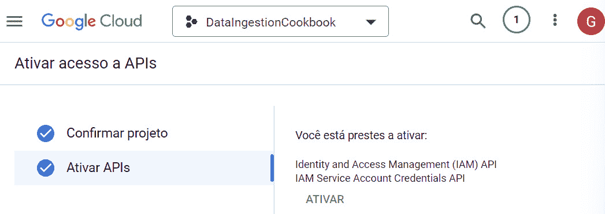

图 2.12 – 激活资源 API 的 GCP 页面

现在，我们几乎准备好获取我们的凭证了。

1.  通过返回到[`developers.google.com/calendar/api/quickstart/python`](https://developers.google.com/calendar/api/quickstart/python)页面，点击**转到凭证**，并遵循**为桌面应用程序授权凭证**下的说明来启用 OAuth 认证。

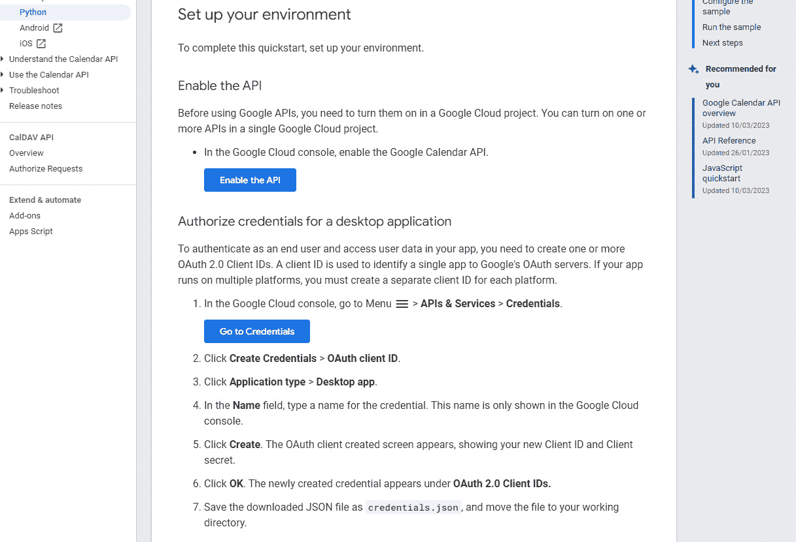

图 2.13 – 创建 credentials.json 文件的 GCP 教程页面

最后，您应该为这个配方有一个`credentials.json`文件。请妥善保管此文件，因为所有对 Google API 的调用都需要它来验证您的真实性。

您可以使用 GCP 脚本示例之一来测试此认证方法。Google 提供了一个用于从**Google 日历 API**检索数据的 Python 脚本示例，可以在此处访问：[`github.com/googleworkspace/python-samples/blob/main/calendar/quickstart/quickstart.py`](https://github.com/googleworkspace/python-samples/blob/main/calendar/quickstart/quickstart.py)。

### 其他认证方法

尽管我们已经介绍了两种最常用的 API 认证方法，但数据摄取管道并不局限于这些。在您的日常工作中，您可能会遇到需要其他形式认证的遗留系统或应用程序。

**HTTP 基本认证**、**Bearer**、**OpenID Connect**和**OpenAPI 安全方案**等方法也广泛使用。您可以在由*Guy* *Levin*撰写的这篇文章中找到更多关于它们的信息：[`blog.restcase.com/4-most-used-rest-api-authentication-methods/`](https://blog.restcase.com/4-most-used-rest-api-authentication-methods/)。

### SFTP 与 API 的比较

你可能想知道，从 SFTP 服务器和 API 中摄取数据有什么区别？很明显，它们的认证方式不同，代码的行为也各不相同。但我们应该在何时实现 SFTP 或 API 来使数据可用于摄取？

FTP 或 SFTP 事务旨在使用**平面文件**，例如**CSV**、**XML**和**JSON**文件。这两种类型的事务在需要传输大量数据时也表现良好，并且是旧系统唯一可用的方法。API 提供实时数据交付和更安全的基于互联网的连接，并且由于其与多个云应用程序的集成，在数据摄取领域变得流行。然而，API 调用有时是根据请求数量付费的。

本文件事务架构讨论主要针对金融和人力资源系统，这些系统可能使用一些旧的编程语言版本。系统架构讨论基于更现代和基于云的应用程序中的平面文件或实时数据。

## 参见

+   您可以在此处找到具有不同类型认证方法的公共 API 列表：[`github.com/public-apis/public-apis`](https://github.com/public-apis/public-apis)

+   Holiday API Python 客户端：[`github.com/holidayapi/holidayapi-python`](https://github.com/holidayapi/holidayapi-python)

+   Python `requests` 库文档：[`requests.readthedocs.io/en/latest/user/quickstart/`](https://requests.readthedocs.io/en/latest/user/quickstart/)

# 管理加密文件

当处理敏感数据是常见的情况时，一些字段甚至整个文件都会被加密。当实施这种文件安全措施时，这是全面的，因为敏感数据可能会暴露用户的生命。毕竟，加密是将信息转换为隐藏原始内容的代码的过程。

尽管如此，我们仍然需要在我们的数据管道中摄取和处理这些加密文件。为了能够做到这一点，我们需要了解更多关于加密是如何工作以及如何进行的。

在这个菜谱中，我们将使用 Python 库和最佳实践解密 GnuPG 加密的文件（其中 **GnuPG** 代表 **GNU Privacy Guard**）。

## 准备工作

在进入有趣的部分之前，我们必须在本地机器上安装 GnuPG 库并下载加密的数据集。

对于 GnuPG 文件，您需要安装两个版本 – 一个用于 **操作系统**（**OS**），另一个用于 Python 包。这是因为 Python 包需要从已安装的 OS 包中获取内部资源：

1.  要使用 Python 封装库，我们首先需要在本地机器上安装 GnuPG：

    ```py
    $ sudo apt-get install gnupg
    ```

对于 Windows 用户，建议在此处下载可执行文件：[`gnupg.org/download/index.xhtml`](https://gnupg.org/download/index.xhtml)。

Mac 用户可以使用 Homebrew 安装它：[`formulae.brew.sh/formula/gnupg`](https://formulae.brew.sh/formula/gnupg)。

1.  然后，我们按照以下方式安装 Python GnuPG 封装库：

    ```py
    $ pip3 install python-gnupg
    Collecting python-gnupg
      Downloading python_gnupg-0.5.0-py2.py3-none-any.whl (18 kB)
    Installing collected packages: python-gnupg
    Successfully installed python-gnupg-0.5.0
    ```

1.  接下来，我们下载 **spotify tracks chart encrypted** 加密数据集。您可以使用此链接下载文件：[`github.com/PacktPublishing/Data-Ingestion-with-Python-Cookbook/tree/main/Chapter_2/managing_encrypted_%EF%AC%81les`](https://github.com/PacktPublishing/Data-Ingestion-with-Python-Cookbook/tree/main/Chapter_2/managing_encrypted_%EF%AC%81les)。

## 如何操作…

我们将需要一个密钥来使用 GnuPG 解密文件。您可以在 `| 管理加密文件` 文件夹中找到它。访问链接在本书开头的 *技术要求* 部分中：

1.  首先，我们导入我们的密钥：

    ```py
    import gnupg
    # Create gnupg directory
    gpg = gnupg.GPG(gnupghome='gpghome')
    # Open and import the key
    key_data = open('mykeyfile.asc').read()
    import_result = gpg.import_keys(key_data)
    # Show the fingerprint of our key
    print(import_result.results)
    ```

1.  然后，我们解密导入文件：

    ```py
    with open('spotify_data.csv.gpg', 'rb') as f:
        status = gpg.decrypt_file(f, passphrase='mypassphrase', output='spotify_data.csv')
    print(status.ok)
    print(status.status)
    print('error: ', status.stderr)
    ```

## 它是如何工作的…

关于加密的最佳实践，GnuPG 是一个安全参考，广泛使用，并在 **RFC 4880** 中进行了记录。您可以在以下链接中了解更多信息：[`www.rfc-editor.org/rfc/rfc4880`](https://www.rfc-editor.org/rfc/rfc4880)。

注意

**请求评论**（**RFC**）是由 **互联网工程任务组**（**IETF**）开发和维护的技术文档。该机构规定了互联网上协议、服务和模式的最佳实践。

在这里，我们看到了一个 GnuPG 应用程序的实际例子，尽管它看起来很简单。让我们通过代码中的一些重要行来了解一下：

在 `gpg = gnupg.GPG(gnupghome='gpghome')` 这一行中，我们实例化了我们的 `GPG` 类，并传递了它存储临时文件的位置，你可以设置任何你想要的路径。在我的情况下，我在我的主目录中创建了一个名为 `gpghome` 的文件夹。

在接下来的几行中，我们导入了密钥，并仅为了演示目的打印了它的指纹。

对于 *步骤 2*，我们使用 `with open` 语句打开我们想要解密的文件，并对其进行解密。你可以看到为 `passphrase` 设置了一个参数。这是因为 GnuPG 的较新版本要求加密的文件设置密码。由于这个食谱仅用于教育目的，这里的密码很简单且是硬编码的。

之后，你应该能够无问题地打开 `.csv` 文件。


图 2.14 – 解密后的 Spotify CSV 文件

## 还有更多...

通常，GnuPG 是加密文件的首选工具，但还有其他市场解决方案，例如 Python 的 `cryptography` 库，它有一个 `Fernet` 类，是一种对称加密方法。正如你在以下代码中所看到的，它的使用与我们在这个食谱中所做的是非常相似的：

```py
from cryptography.fernet import Fernet
# Retrieving key
fernet_key = Fernet(key)
# Getting and opening the encrypted file
with open('spotify_data.csv', 'rb') as enc_file:
    encrypted = enc_file.read()
# Decrypting the file
decrypted = fernet_key.decrypt(encrypted)
# Creating a decrypted file
with open('spotify_data.csv', 'wb') as dec_file:
    dec_file.write(decrypted)
```

尽管如此，`Fernet` 方法在数据世界中并不广泛使用。这是因为带有敏感数据的加密文件通常来自使用 GnuPG 混合加密的应用程序或软件，正如我们在 *如何工作…* 部分所看到的，它符合 RFC 4880。

你可以在 `cryptography` 库的文档中找到更多详细信息：[`cryptography.io/en/latest/fernet/`](https://cryptography.io/en/latest/fernet/)。

## 另请参阅

+   如何使用 **GnuPG 的 Python 包装器** 创建和加密文件：[`gnupg.readthedocs.io/en/latest/`](https://gnupg.readthedocs.io/en/latest/)。

+   GnuPG 官方页面和文档：[`gnupg.org/`](https://gnupg.org/)。

+   如果你对于 RFC 4880 感兴趣并想深入了解，David Steele 在他的博客中写了一篇关于它的总结文章：[`davesteele.github.io/gpg/2014/09/20/anatomy-of-a-gpg-key/`](https://davesteele.github.io/gpg/2014/09/20/anatomy-of-a-gpg-key/)。

+   *由 opentext 提供的电压* 是一款用于数据安全性的优秀工具，并被许多公司推荐。你可以在这里了解更多信息：[`www.microfocus.com/en-us/cyberres/data-privacy-protection`](https://www.microfocus.com/en-us/cyberres/data-privacy-protection)。

# 使用 S3 从 AWS 访问数据

AWS 是最受欢迎的云服务提供商之一，它混合了不同的服务架构，并允许轻松快速的实施。

尽管它为关系型和非关系型数据库提供了各种解决方案，但在本食谱中，我们将介绍如何管理从**S3 存储桶**的数据访问，这是一个允许上传文本文件、媒体以及物联网和大数据领域使用的其他几种类型文件的对象存储服务。

对于 S3 存储桶，有两种常用的数据访问管理类型，都在数据摄取管道中使用 – **用户控制**和**存储桶策略**。在本食谱中，我们将学习如何通过用户控制来管理访问，鉴于它是数据摄取管道中最常用的方法。

## 准备工作

要完成这个食谱，拥有或创建 AWS 账户不是强制性的。目标是构建一个逐步的**身份访问管理**（**IAM**）策略，使用您理解的良好数据访问实践从 S3 存储桶中检索数据。

然而，如果您想创建一个免费的 AWS 账户来测试，您可以按照以下提供的**AWS 官方文档**中的步骤进行：[`docs.aws.amazon.com/accounts/latest/reference/manage-acct-creating`](https://docs.aws.amazon.com/accounts/latest/reference/manage-acct-creating).xhtml。创建您的 AWS 账户后，按照以下步骤操作：

1.  让我们创建一个用户来测试我们的 S3 策略。要创建用户，请查看以下 AWS 链接：[`docs.aws.amazon.com/IAM/latest/UserGuide/id_users_create.xhtml`](https://docs.aws.amazon.com/IAM/latest/UserGuide/id_users_create.xhtml)。您无需担心将其附加到策略上，因此请跳过本教程的这一部分。目的是探索没有任何策略附加的用户在 AWS 控制台中能做什么。

1.  接下来，让我们使用我们的管理员用户创建一个 S3 存储桶。在搜索栏中输入`S3`并点击第一个链接：

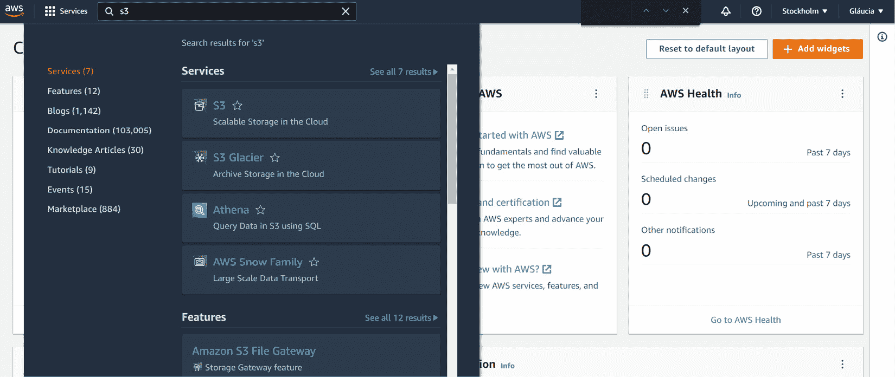

图 2.15 – AWS 搜索栏

1.  然后，点击**创建存储桶**按钮，将加载一个新页面如下：

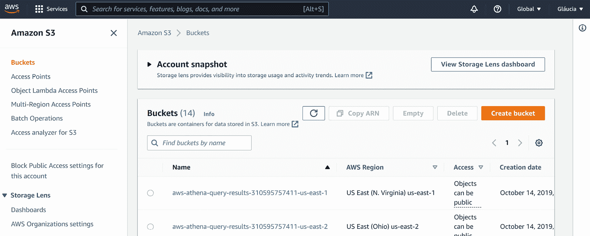

图 2.16 – AWS S3 主页面

将加载一个新页面如下：

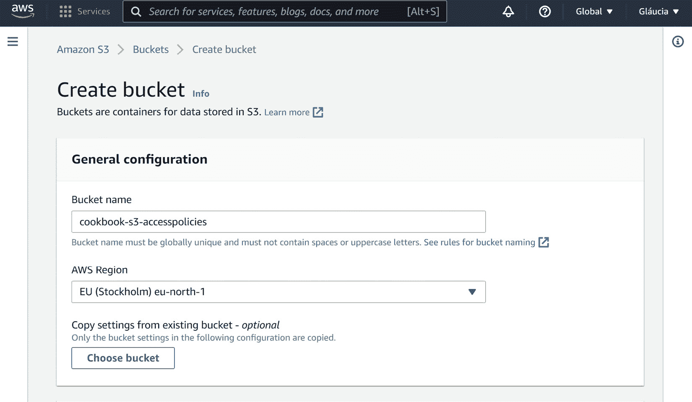

图 2.17 – 创建新存储桶的 AWS S3 页面

在本食谱中，我们选择在**斯德哥尔摩**进行操作，因为它是我居住地最近的一个区域。现在请跳过其他字段，向下滚动并点击**创建存储桶**按钮：

在 S3 页面上，您应该能够看到并选择您创建的存储桶：

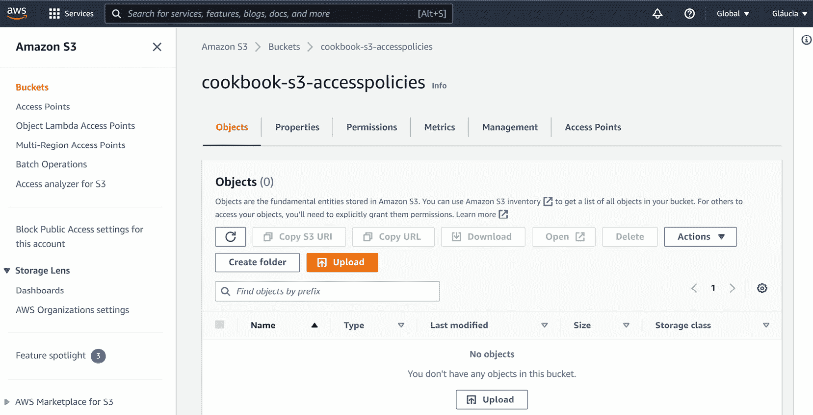

图 2.18 – S3 存储桶对象页面

如果您想测试，可以在这里上传任何文件。

完成步骤后，在您的浏览器中打开另一个窗口并切换到您为测试创建的用户。如果可能的话，尽量在不同的浏览器中保持管理员和测试用户登录，这样您就可以实时看到变化。

我们已准备好开始创建和应用访问策略。

## 如何操作...

如果我们尝试列出**S3**，我们可以看到存储桶，但当点击任何存储桶时，将会发生以下错误：

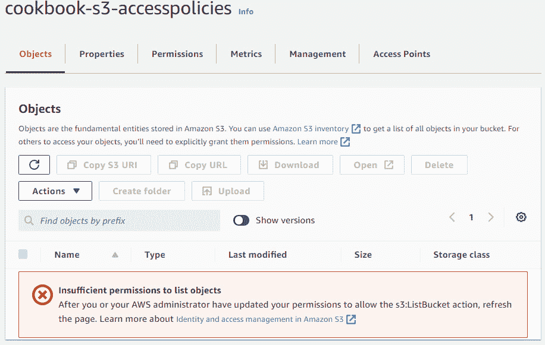

图 2.19 – 使用权限不足的消息测试 S3 桶的用户视图

让我们通过以下步骤创建并附加一个策略来解决这个问题：

1.  首先，我们将为用户定义一个访问策略。用户将能够列出、检索和删除我们创建的 S3 存储桶中的任何对象。让我们首先创建一个包含 AWS 策略要求的 JSON 文件，使其成为可能。请参阅以下文件：

    ```py
    {
       "Version":"2012-10-17",
       "Statement":[
          {
             "Effect":"Allow",
             "Action": "s3:ListAllMyBuckets",
             "Resource":"*"
          },
          {
             "Effect":"Allow",
             "Action":["s3:ListBucket","s3:GetBucketLocation"],
             "Resource":"arn:aws:s3:::cookbook-s3-accesspolicies"
          },
          {
             "Effect":"Allow",
             "Action":[
                "s3:PutObject",
                "s3:PutObjectAcl",
                "s3:GetObject",
                "s3:GetObjectAcl",
                "s3:DeleteObject"
             ],
             "Resource":"arn:aws:s3:::cookbook-s3-accesspolicies /*"
          }
       ]
    }
    ```

1.  接下来，我们允许用户通过 IAM 策略访问存储桶。在用户 IAM 页面上，按照以下步骤点击**添加内联策略**：


图 2.20 – AWS 用户权限策略部分

将上一段代码插入到**JSON**选项卡中，然后点击**审查策略**。在**审查策略**页面，输入策略的名称并点击**创建策略**以确认，如下所示：

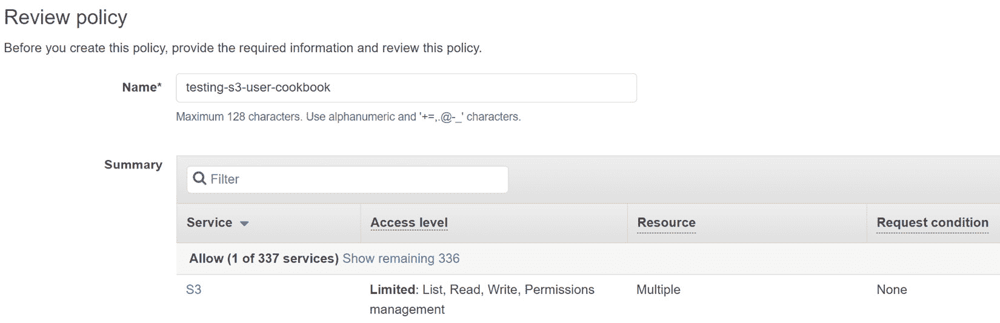

图 2.21 – AWS IAM 审查策略页面

如果我们现在检查，我们可以看到添加文件是可能的，但删除文件则不行。

## 它是如何工作的...

在本食谱的开始，我们的测试用户没有权限访问 AWS 上的任何资源。例如，当我们访问我们创建的存储桶时，页面上会出现警告。然后我们允许用户访问并上传文件或对象到存储桶。

在*步骤 1*中，我们按照以下步骤构建了一个内联 IAM 策略：

1.  首先，我们允许测试用户列出相应 AWS 账户内的所有存储桶：

    ```py
    "Statement":[
          {
             "Effect":"Allow",
             "Action": "s3:ListAllMyBuckets",
             "Resource":"*"
          },
    ```

1.  第二个语句允许用户列出对象并获取存储桶的位置。请注意，在**资源**键中，我们只指定了一个目标 S3 存储桶**AWS 资源** **名称**（**ARN**）：

    ```py
    {
             "Effect":"Allow",
             "Action":["s3:ListBucket","s3:GetBucketLocation"],
             "Resource":"arn:aws:s3:::cookbook-s3-accesspolicies"
          },
    ```

1.  最后，我们创建另一个语句以允许对象的插入和检索。在这种情况下，资源现在在 ARN 的末尾也有一个`/*`字符。这代表将影响相应存储桶对象的策略：

    ```py
    {
             "Effect":"Allow",
             "Action":[
                "s3:PutObject",
                "s3:PutObjectAcl",
                "s3:GetObject",
                "s3:GetObjectAcl",
             ],
             "Resource":"arn:aws:s3:::cookbook-s3-accesspolicies /*"
          }
    ```

根据您想要管理访问的 AWS 资源，**操作**键可以非常不同，并且可以有不同的应用。关于 S3 存储桶和对象，您可以在 AWS 文档中找到所有可能的操作：[`docs.aws.amazon.com/AmazonS3/latest/userguide/using-with-s3-actions.xhtml`](https://docs.aws.amazon.com/AmazonS3/latest/userguide/using-with-s3-actions.xhtml)。

## 还有更多...

当导入数据时，用户控制方法是使用最频繁的。这是因为像**Airflow**或**Elastic MapReduce**（**EMR**）这样的应用程序通常可以连接到存储桶。从管理控制的角度来看，它也更容易处理，只需要少量程序性访问，而不是公司中每个用户的单独访问。

当然，会有一些场景，每个数据工程师都有一个具有权限设置的账户。但通常（并且应该是）这样的场景是一个开发环境，其中包含数据样本。

### 存储桶策略

存储桶策略可以为控制外部资源对内部对象的访问添加一个安全层。使用这些策略，可以限制对特定 IP 地址、特定资源（如**CloudFront**）或**HTTP**方法请求类型的访问。在 AWS 官方文档中，您可以查看一系列实用示例：[`docs.aws.amazon.com/AmazonS3/latest/userguide/example-bucket-policies.xhtml`](https://docs.aws.amazon.com/AmazonS3/latest/userguide/example-bucket-policies.xhtml)。

## 参见

在 AWS 官方文档中，您还可以看到其他类型的访问控制，如**访问控制列表**（**ACLs**）和**跨源资源共享**（**CORS**）：[`docs.aws.amazon.com/AmazonS3/latest/userguide/s3-access-control.xhtml`](https://docs.aws.amazon.com/AmazonS3/latest/userguide/s3-access-control.xhtml)。

# 使用云存储从 GCP 访问数据

**Google Cloud Platform**（**GCP**）是一个提供多种服务的云提供商，从云计算到**人工智能**（**AI**），只需几个步骤即可实现。它还提供广泛范围的存储服务，称为**云存储**。

在本配方中，我们将逐步构建策略来控制对**云存储桶**内数据的访问。

## 准备工作

此配方将使用由 Google Cloud 团队定义的**统一**方法：

1.  首先，我们将创建一个测试用户。转到**IAM**页面（[`console.cloud.google.com/iam-admin/iam`](https://console.cloud.google.com/iam-admin/iam)）并选择**授予权限**。在**新主体**字段中添加一个有效的 Gmail 地址。目前，此用户将只有**浏览器**角色：

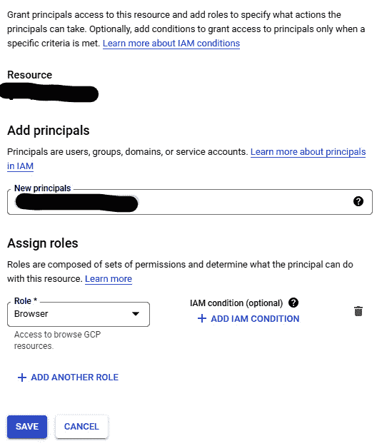

图 2.22 – 将策略附加到用户的 GCP IAM 页面

1.  然后，我们将创建一个云存储桶。转到**云存储**页面并选择**创建一个****存储桶**：[`console.cloud.google.com/storage/create-bucket`](https://console.cloud.google.com/storage/create-bucket)。

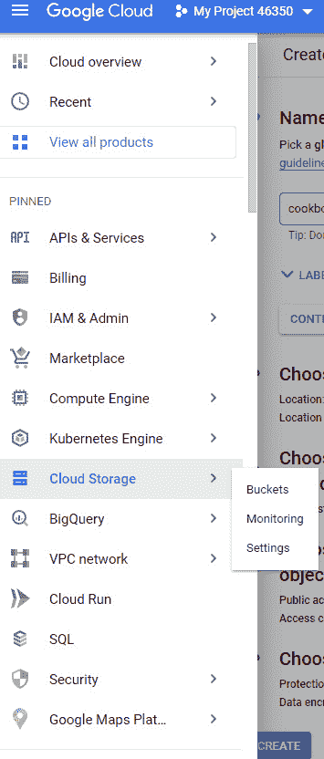

图 2.23 – 已选择云存储的 GCP 搜索栏

为您的存储桶添加一个唯一的名称，并保留其他选项不变：

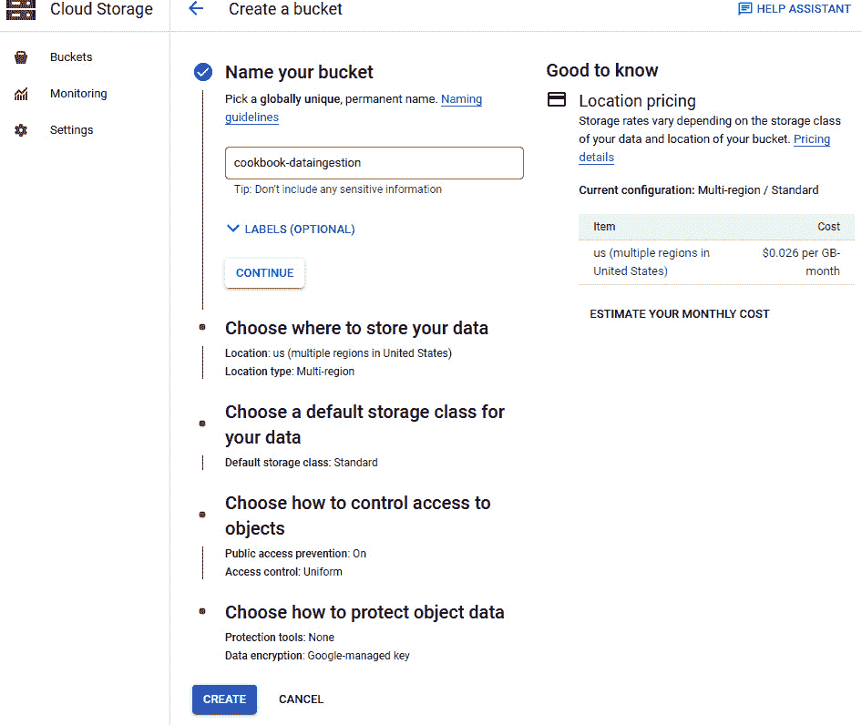

图 2.24 – 创建新存储桶的 GCP 页面

## 如何做到这一点...

执行此配方的步骤如下：

1.  我们将尝试访问云存储对象。首先，让我们尝试使用我们刚刚创建的用户访问存储桶。应该会显示一个错误消息：

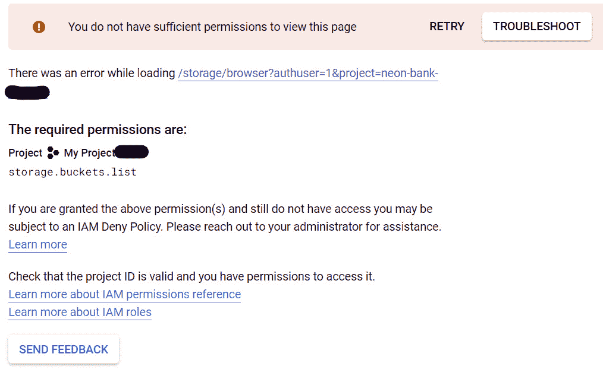

图 2.25 – GCP 控制台中测试用户的权限不足信息

1.  然后，我们在云存储中授予 **编辑者** 权限。转到 **IAM** 页面并选择你创建的测试用户。在编辑用户页面上，选择 **编辑者**。

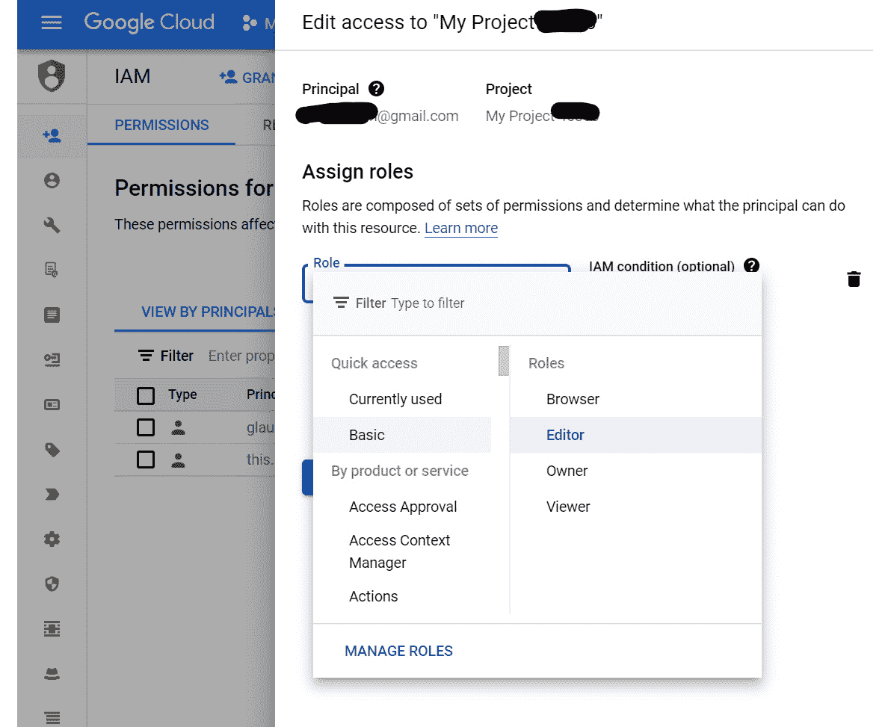

图 2.26 – GCP IAM 页面 – 将编辑者角色分配给测试用户

注意

如果你对角色有疑问，请使用 Google Cloud 中的策略模拟器：[`console.cloud.google.com/iam-admin/simulator`](https://console.cloud.google.com/iam-admin/simulator).

1.  接下来，我们使用适当的角色访问云存储。用户应该能够查看并将对象上传到存储桶：

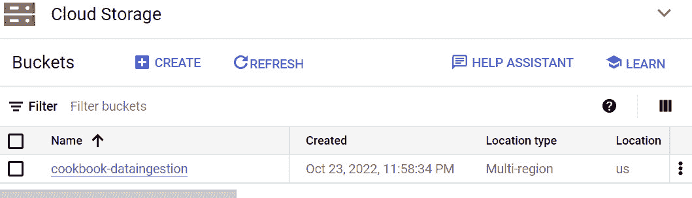

图 2.27 – 测试用户对 GCP 存储桶的视图

## 它是如何工作的...

在 *步骤 1* 中，我们的测试用户只有浏览权限，当尝试查看存储桶列表时出现了错误信息。然而，云存储的 **编辑者** 角色通过授予对存储桶（以及大多数其他基本 Google Cloud 资源）的访问权限解决了这个问题。此时，也可以创建一个条件，仅允许访问这个存储桶。

Google Cloud 的访问层次结构基于其组织和项目。为了提供对相应存储桶的访问权限，我们需要确保我们也有对项目资源的访问权限。请参考以下截图：

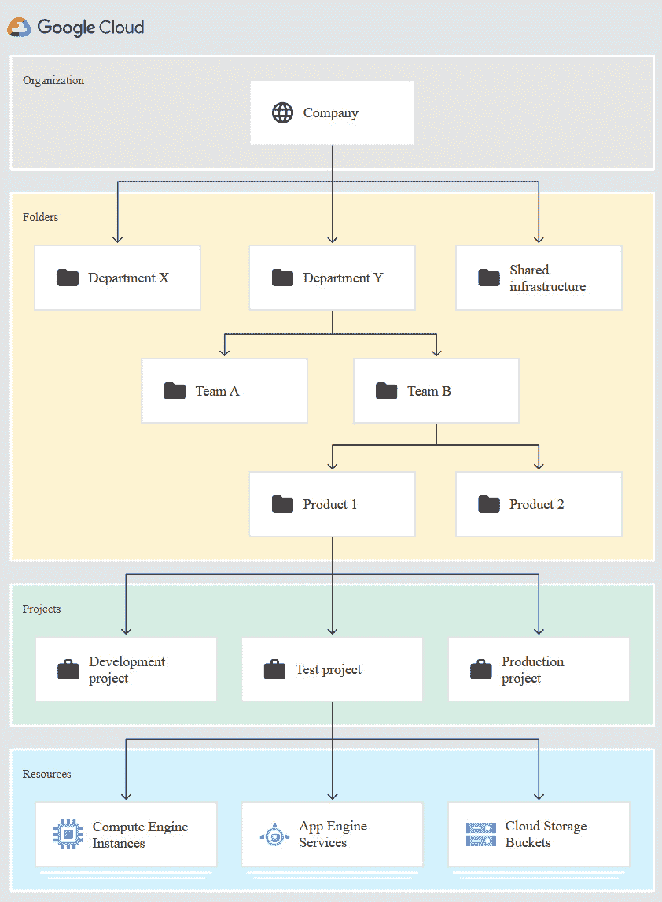

图 2.28 – GCP 控制访问层次结构 – 来源：https://cloud.google.com/resource-manager/docs/cloud-platform-resource-hierarchy#inheritance

一旦定义了访问层次结构，我们就可以在 IAM 页面上选择几个内置的用户权限组，并在需要时添加条件。与 AWS 不同，Google Cloud 策略通常以“角色”的形式创建，并分组以服务于特定的区域或部门。可以为特定情况创建额外的权限或条件，但它们不会共享。

尽管统一的方法看起来很简单，但通过适当分组、修订并统一授予权限，它可以成为一种管理 Google Cloud 访问的强大方式。在我们的案例中，**编辑者** 角色解决了我们的问题，但在与大型团队和不同类型的访问策略一起工作时，建议咨询该领域的专家。

## 还有更多...

与 S3 类似，云存储还有另一种名为**细粒度**的访问控制。它由 IAM 策略和 ACLs 的混合组成，在存储连接到 S3 存储桶等情况下推荐使用。正如其名所示，权限被细化到存储桶和单个对象级别。由于数据暴露可能会因[**ACL 策略**设置不正确而加剧]，因此需要由具有高度安全知识的人（或团队）进行配置。

你可以在这里了解更多关于 ACLs 的信息：[云存储 ACLs](https://cloud.google.com/storage/docs/access-control/lists).

# 进一步阅读

+   [数据复制](https://www.manageengine.com/device-control/data-replication.xhtml)

+   [数据库复制技术](https://www.keboola.com/blog/database-replication-techniques)

+   [数据库访问控制全面指南](https://satoricyber.com/access-control/access-control-101-a-comprehensive-guide-to-database-access-control/)

+   [最佳基于角色的访问控制（RBAC）数据库模型](https://stackoverflow.com/questions/190257/best-role-based-access-control-rbac-database-model)

+   [基于模型的 SQL 数据库基于角色的访问控制](https://www.researchgate.net/publication/281479020_A_Model-driven_Role_based_Access_Control_for_SQL_Databases)

+   [MIT PDF](https://dspace.mit.edu/bitstream/handle/1721.1/87870/53700676-MIT.pdf?sequence=2)

+   [下载 PDF](https://scholarworks.calstate.edu/downloads/sb397840v)

+   [公共在线 SFTP 服务器](https://www.sftp.net/public-online-sftp-servers)

+   [如何在 Python 中访问 SFTP 服务器](https://www.ittsystems.com/how-to-access-sftp-server-in-python/)

+   [使用 Python 加密和解密文件 - Python 编程 - PyShark](https://towardsdatascience.com/encrypt-and-decrypt-files-using-python-python-programming-pyshark-a67774bbf9f4)

+   [使用 Python 加密和解密文件](https://www.geeksforgeeks.org/encrypt-and-decrypt-files-using-python/)

+   [Python gnupg/gpg 示例](https://www.saltycrane.com/blog/2011/10/python-gnupg-gpg-example/)

+   [数据安全最佳实践](https://www.ekransystem.com/en/blog/data-security-best-practices)

+   [数据访问管理基础实施策略](https://www.ovaledge.com/blog/data-access-management-basics-implementation-strategy)
