# 第三章：数据发现 – 在摄取之前理解我们的数据

正如你可能已经注意到的，**数据摄取**不仅仅是将数据从源处检索出来并插入到另一个地方。它涉及到理解一些业务概念，确保对数据的安全访问，以及如何存储它，而现在发现我们的数据变得至关重要。

**数据发现**是理解我们数据模式和行为的流程，确保整个数据管道将成功。在这个过程中，我们将了解我们的数据是如何建模和使用的，这样我们就可以根据最佳匹配来设置和计划我们的摄取。

在本章中，你将了解以下内容：

+   记录数据发现过程

+   配置 OpenMetadata

+   将 OpenMetadata 连接到我们的数据库

# 技术要求

你也可以在这里找到本章的代码，GitHub 仓库：[`github.com/PacktPublishing/Data-Ingestion-with-Python-Cookbook`](https://github.com/PacktPublishing/Data-Ingestion-with-Python-Cookbook)。

# 记录数据发现过程

近年来，手动数据发现迅速被淘汰，机器学习和其他自动化解决方案兴起，为存储或在线电子表格（如 Google Sheets）中的数据带来了快速洞察。

然而，许多小型公司刚开始他们的业务或数据领域，因此立即实施付费或成本相关的解决方案可能不是一个好主意。作为数据专业人士，我们在将第一个解决方案应用于问题时也需要具有可塑性 – 总是会有空间来改进它。

## 准备工作

这个配方将涵盖有效启动数据发现过程的步骤。尽管在这里，这个过程更多地与手动发现步骤相关，但你也会看到它也适用于自动化步骤。

让我们从下载数据集开始。

对于这个配方，我们将使用*病毒和细菌中基因的演变*数据集([`www.kaggle.com/datasets/thedevastator/the-evolution-of-genes-in-viruses-and-bacteria`](https://www.kaggle.com/datasets/thedevastator/the-evolution-of-genes-in-viruses-and-bacteria))，以及另一个包含*医院管理*信息([`www.kaggle.com/datasets/girishvutukuri/hospital-administration`](https://www.kaggle.com/datasets/girishvutukuri/hospital-administration))的数据集。

注意

这个配方不需要使用提到的确切数据集 – 它普遍地说明了如何将方法论应用于数据集或任何数据源。请随意使用你想要的数据。 

下一个阶段是创建文档。你可以使用任何适合你的软件或在线应用程序 – 重要的是要有一个地方来详细和分类信息。

我将使用 **Notion** ([`www.notion.so/`](https://www.notion.so/))。其主页如 *图 3.1* 所示。它提供免费计划，并允许您为不同类型的文档创建单独的位置。然而，一些公司使用 **Atlassian 的 Confluence** 来记录他们的数据。这始终取决于您所处的场景。

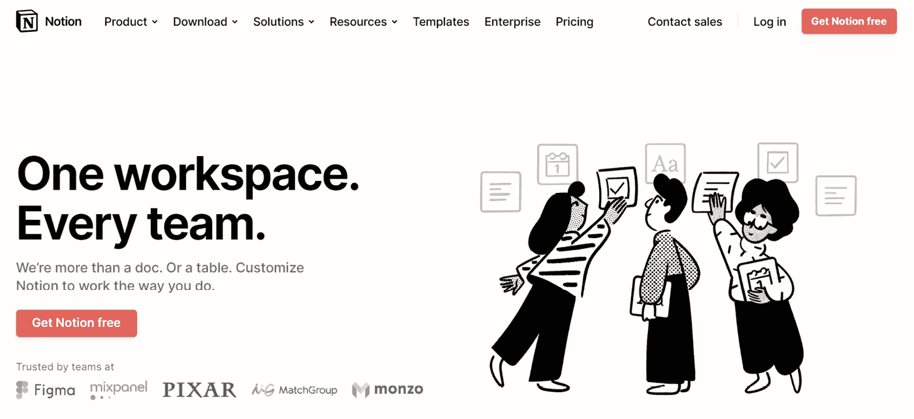

图 3.1 – Notion 主页

这是一个可选阶段，我们正在创建 Notion 账户。在主页上，点击 **获取 Notion 免费版**。

另一个页面将出现，您可以使用 Google 或 Apple 邮箱创建账户，如下所示：

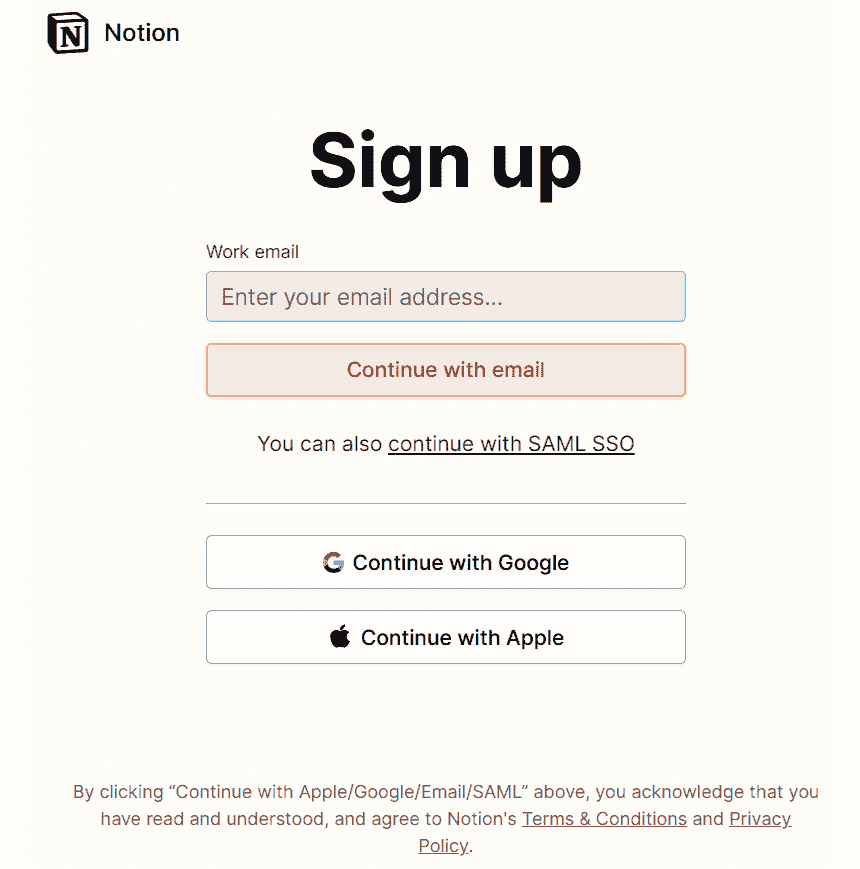

图 3.2 – Notion 注册页面

之后，您应该会看到一个带有 Notion 欢迎信息的空白页面。如果需要采取其他操作，只需遵循页面说明。

## 如何操作…

让我们想象一个场景，我们在一家医院工作，需要应用数据发现过程。以下是我们的操作步骤：

1.  **识别我们的数据来源**：两个主要部门需要他们的数据被摄取——行政部门和研究部门。我们知道他们通常将 CSV 文件保存在本地数据中心，因此我们可以通过内网访问它们。不要在意文件名；通常，在实际应用中，它们不受支持。

以下为研究部门的文件：

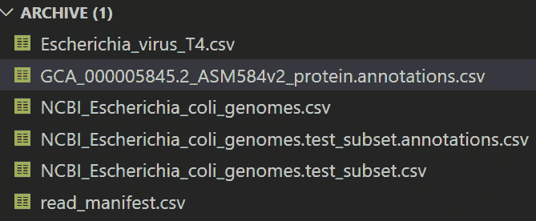

图 3.3 – 关于大肠杆菌基因演化的研究文件

以下为行政部门文件：

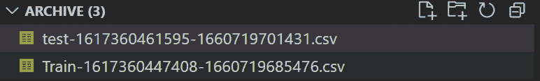

图 3.4 – 医院行政部门文件

1.  **按部门或项目分类数据**：在这里，我们创建与部门和数据类型（关于患者或特定疾病）相关的文件夹和子文件夹。

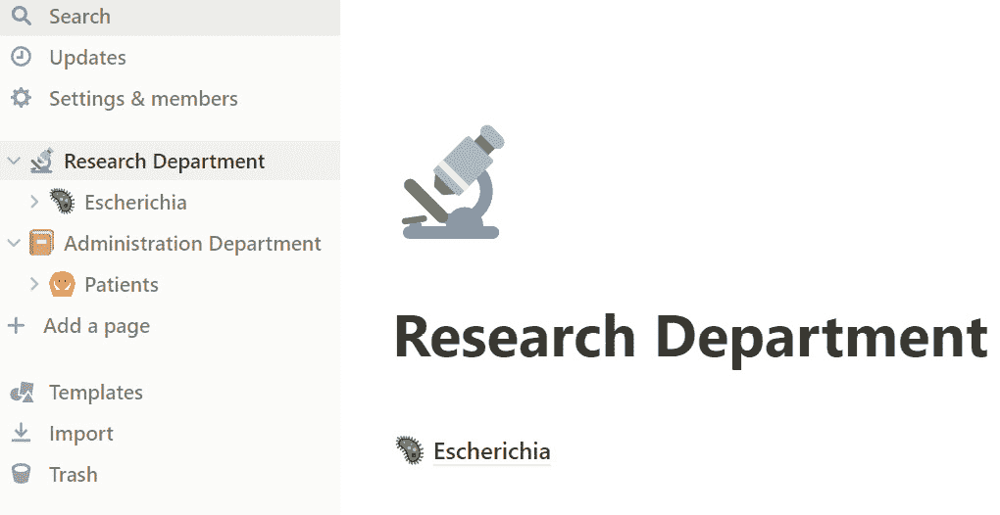

图 3.5 – 研究部门页面

1.  **识别数据集或数据库**：在查看文件时，我们可以找到四种模式。有专属数据集：**大肠杆菌基因组**、**蛋白质注释**、**一般大肠杆菌病毒**和**患者**。

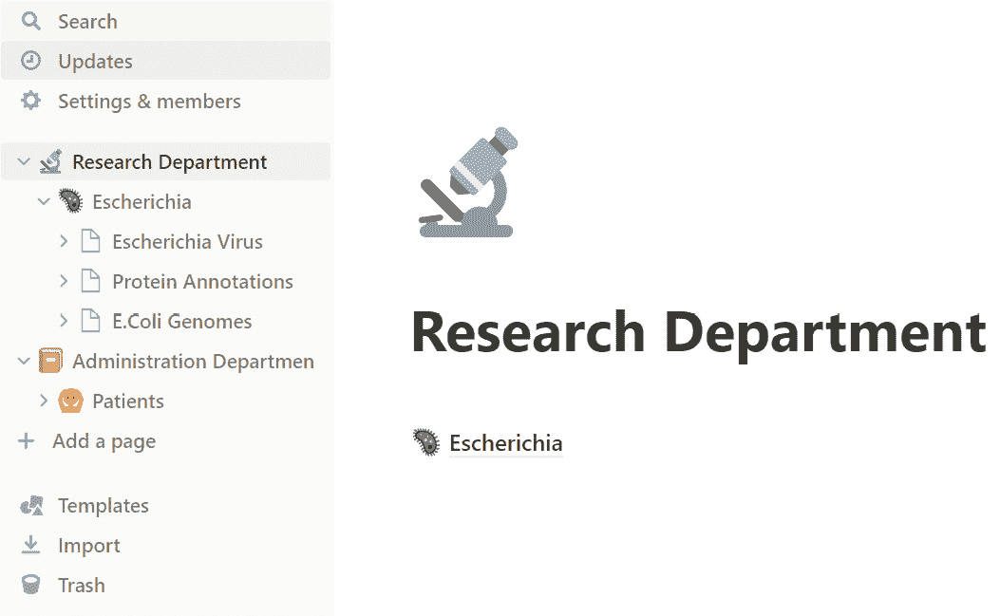

图 3.6 – 根据研究类型和医院行政部门主题创建的子部分

1.  **描述我们的数据**：现在，在数据集级别，我们需要有关它的有用信息，例如该数据集表的总体描述、更新时间、其他团队可以找到它的位置、表中每一列的描述，以及最后但同样重要的是，所有元数据。


图 3.7 – 使用 Notion 记录患者数据

注意

文件存储位置的描述可能并不适用于所有情况。你可以找到数据库名称的引用，例如 `'admin_database.patients'`。

## 它是如何工作的…

在开始数据发现时，第一个目标是识别模式并将它们分类以创建逻辑流程。通常，最初的分类是按部门或项目，然后是数据库和数据集的识别，最后是描述数据本身。

有一些方法可以手动记录数据发现。那些更习惯于老式风格**BI**（即**商业智能**）的人倾向于创建更美观的视觉模型来应用发现。然而，这个菜谱的目标是使用像 Notion 这样的简单工具创建一个目录：

1.  **按部门或项目对数据进行分类**：我们首先做的是确定每份数据负责的部门。在摄入问题或数据集损坏的情况下，谁是联系人？在正式术语中，他们也被称为数据管理员。在一些公司，按项目分类也可以应用，因为一些公司可能有他们特定的需求和数据。

1.  **识别数据集或数据库**：在这里，我们只使用了数据集。在项目或部门下，我们插入每个表的名字和其他有用的信息。如果表是定期更新的，记录这一点也是一个好的做法。

1.  **描述我们的数据**：最后，我们详细记录了预期的列及其数据类型。这有助于数据工程师在导入原始数据时规划脚本；如果自动化后出现问题，他们可以轻松地检测到问题。

你可能会注意到一些数据表现得很奇怪。例如，*图 3.7*中的**medical_speciality**列有描述和数字来参考其他内容。在实际项目中，有必要在我们的摄入过程中创建辅助数据来创建模式，并随后便于报告或仪表板。

# 配置 OpenMetadata

**OpenMetadata**是一个开源工具，用于元数据管理，允许进行**数据发现**和**治理**。你可以在这里了解更多信息：[`open-metadata.org/`](https://open-metadata.org/)。

通过执行几个步骤，可以使用**Docker**或**Kubernetes**创建本地或生产实例。OpenMetadata 可以连接到多个资源，如**MySQL**、**Redis**、**Redshift**、**BigQuery**等，以获取构建数据目录所需的信息。

## 准备工作

在开始我们的配置之前，我们必须安装**OpenMetadata**并确保 Docker 容器正在正确运行。让我们看看它是如何完成的：

注意

在本书编写时，应用程序处于 0.12 版本，并有一些文档和安装改进。这意味着安装的最佳方法可能会随时间而改变。请参阅官方文档，链接如下：[`docs.open-metadata.org/quick-start/local-deployment`](https://docs.open-metadata.org/quick-start/local-deployment)。

1.  让我们创建一个文件夹和 `virtualenv`（可选）：

    ```py
    $ mkdir openmetadata-docker
    $ cd openmetadata-docker
    ```

由于我们正在使用 Docker 环境在本地部署应用程序，你可以使用 `virtualenv` 创建它，也可以不使用：

```py
$ python3 -m venv openmetadata
$ source openmetadata /bin/activate
```

1.  接下来，我们按照以下方式安装 OpenMetadata：

    ```py
    $ pip3 install --upgrade "openmetadata-ingestion[docker]"
    ```

1.  然后我们检查安装，如下所示：

    ```py
    $ metadata
    Usage: metadata [OPTIONS] COMMAND [ARGS]...
      Method to set logger information
    Options:
      --version                       Show the version and exit.
      --debug / --no-debug
      -l, --log-level [INFO|DEBUG|WARNING|ERROR|CRITICAL]
                                      Log level
      --help                          Show this message and exit.
    Commands:
      backup                          Run a backup for the metadata DB.
      check
      docker                          Checks Docker Memory Allocation Run...
      ingest                          Main command for ingesting metadata...
      openmetadata-imports-migration  Update DAG files generated after...
      profile                         Main command for profiling Table...
      restore                         Run a restore for the metadata DB.
      test                            Main command for running test suites
      webhook                         Simple Webserver to test webhook...
    ```

## 如何操作…

在下载 **Python** 包和 **Docker** 之后，我们将继续进行如下配置：

1.  **运行容器**：首次执行时可能需要一些时间才能完成：

    ```py
    $ metadata docker –start
    ```

注意

这种类型的错误很常见：

**错误响应来自守护进程：在端点 openmetadata_ingestion (3670b9566add98a3e79cd9a252d2d0d377dac627b4be94b669482f6ccce350e0) 上编程外部连接失败：绑定 0.0.0.0:8080 失败：端口已被** **占用**

这意味着其他容器或应用程序已经使用了端口 `8080`。为了解决这个问题，指定另一个端口（例如 `8081`）或停止其他应用程序。

第一次运行此命令时，由于与之相关的其他容器，结果可能需要一段时间。

最后，你应该看到以下输出：

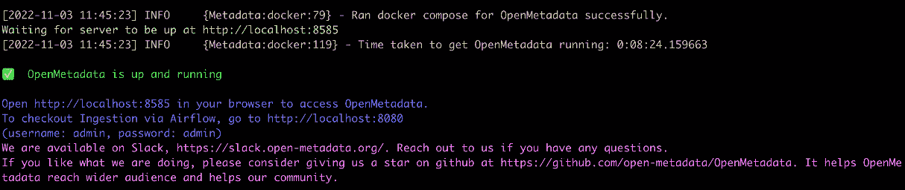

图 3.8 – 命令行显示成功运行 OpenMetadata 容器

1.  `http://localhost:8585` 地址：

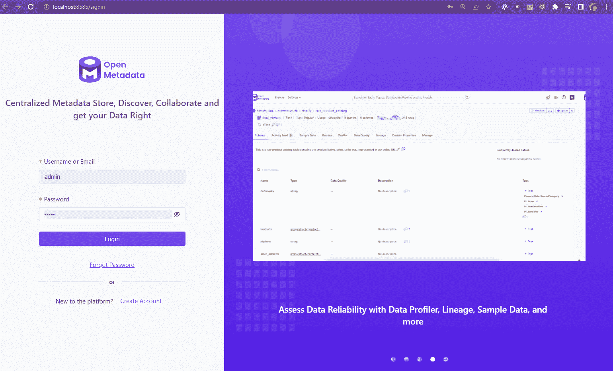

图 3.9 – 浏览器中的 OpenMetadata 登录页面

1.  **创建用户账户和登录**：要访问 UI 面板，我们需要按照以下方式创建用户账户：

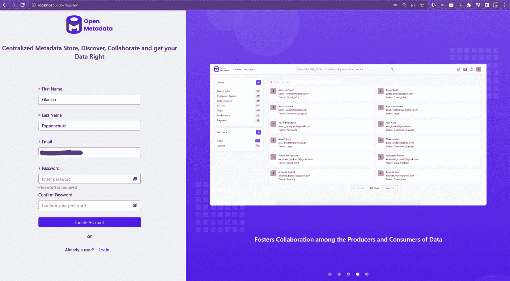

图 3.10 – 在 OpenMetadata 创建账户部分创建用户账户

之后，我们将被重定向到主页，并能够访问面板，如下所示：

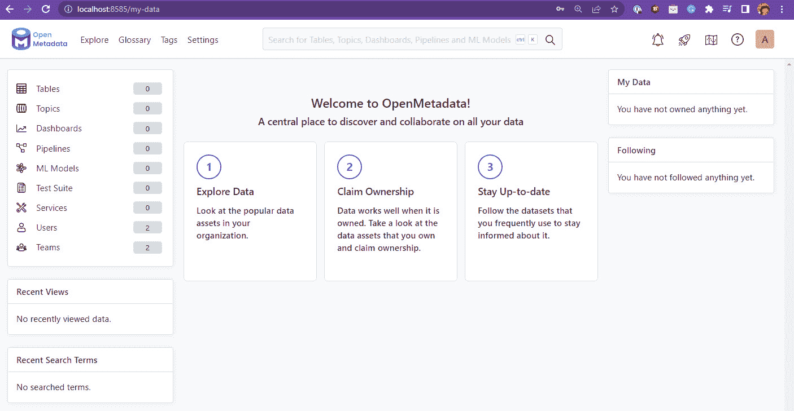

图 3.11 – OpenMetadata 主页

注意

也可以通过输入用户名 admin@openmetadata.org 和密码 `admin` 使用默认管理员用户登录。

对于生产问题，请参阅此处启用安全指南：[`docs.open-metadata.org/deployment/docker/security`](https://docs.open-metadata.org/deployment/docker/security)。

1.  **创建团队**：在 **设置** 部分中，你应该看到几种可能的配置，从创建用户以访问控制台到与 **Slack** 或 **MS Teams** 等消息传递程序的集成。

一些摄取和集成需要用户被分配到团队中。要创建团队，我们首先需要以`admin`身份登录。然后，转到**设置** | **团队** | **创建** **新团队**：

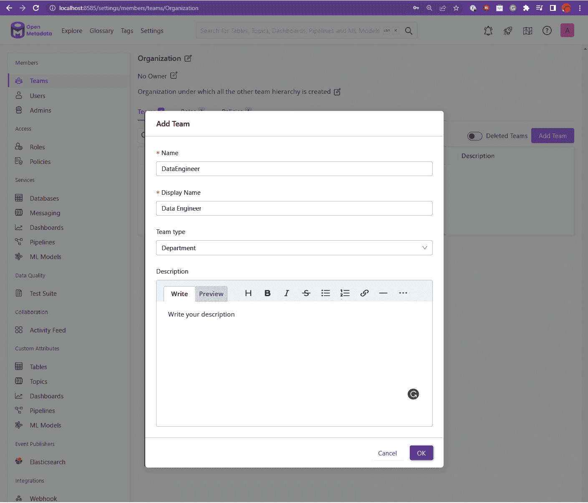

图 3.12 – 在 OpenMetadata 设置中创建团队

1.  **向我们的团队添加用户**：选择您刚刚创建的团队并转到**用户**选项卡。然后选择您想要添加的用户。

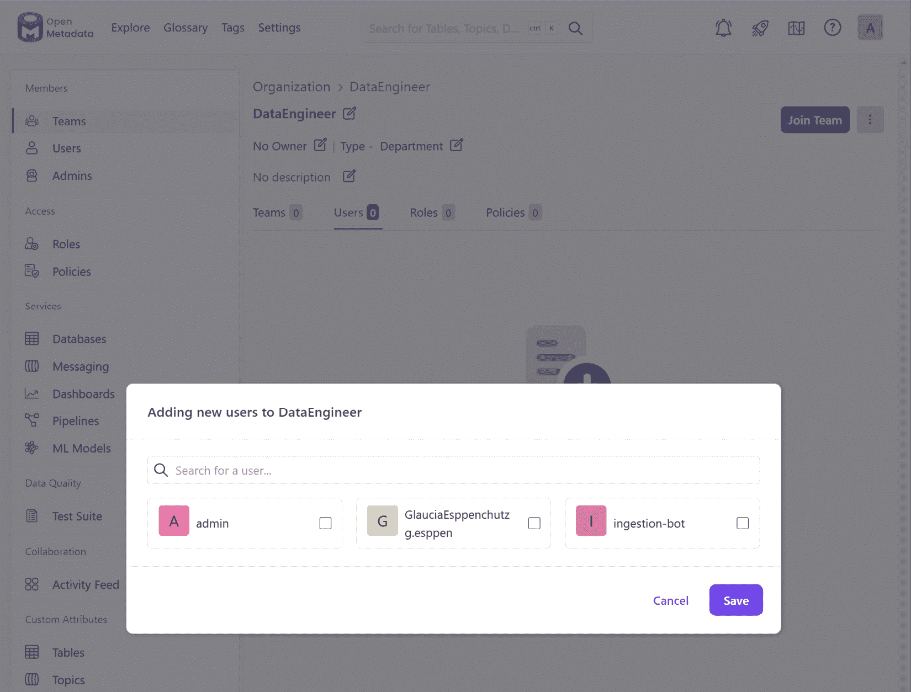

图 3.13 – 向团队添加用户

创建团队非常方便，可以跟踪用户的活动并定义一组角色和政策。在以下情况下，添加到该团队的所有用户都将能够导航并创建他们的数据发现管道。

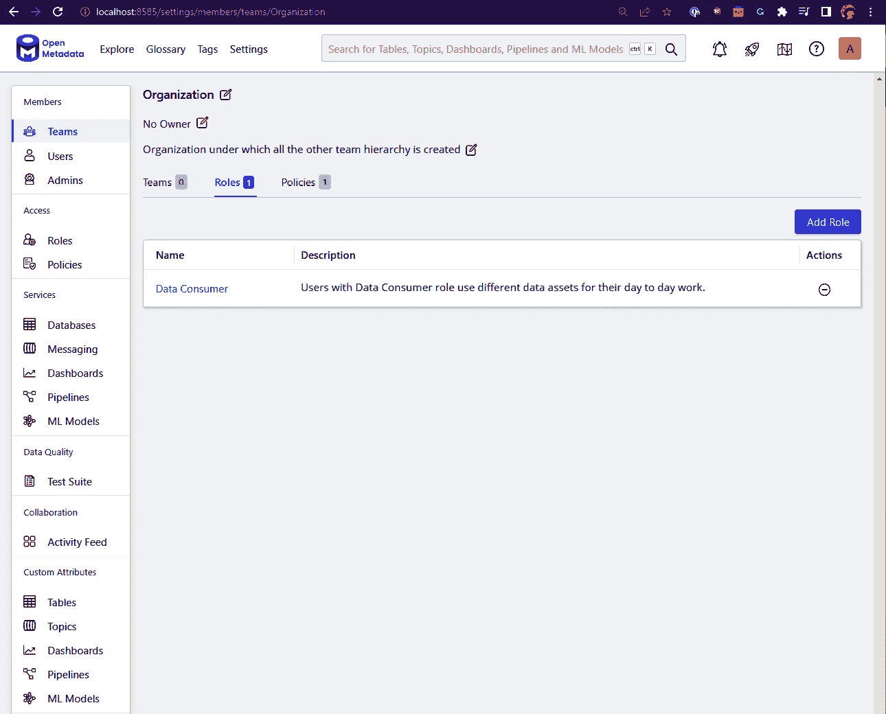

图 3.14 – 团队页面和默认关联的数据消费者角色

我们必须为本章和以下食谱中的活动设置一个数据管理员或管理员角色。数据管理员角色几乎与管理员角色具有相同的权限，因为它是一个负责定义和实施数据策略、标准和程序以管理数据使用并确保一致性的职位。

您可以在此处了解更多关于 OpenMetadata 的**角色和策略**：[`github.com/open-metadata/OpenMetadata/issues/4199`](https://github.com/open-metadata/OpenMetadata/issues/4199)。

## 它是如何工作的…

现在，让我们更深入地了解 OpenMetadata 是如何工作的。

OpenMetadata 是一个开源元数据管理工具，旨在帮助组织跨不同系统或平台管理其数据和元数据。由于它将数据信息集中在一个地方，因此使发现和理解数据变得更加容易。

它也是一个灵活且可扩展的工具，因为它使用诸如**Python**（主要核心代码）和 Java 等编程语言，因此可以与 Apache Kafka、Apache Hive 等工具集成。

要协调和从源中摄取元数据，OpenMetadata 使用 Airflow 代码来计数源。如果你查看其核心，所有 Airflow 代码都可以在`openmetadata-ingestion`中找到。对于更多希望调试此框架中与摄取过程相关的任何问题的重用用户，当元数据 Docker 容器启动并运行时，可以轻松访问`http://localhost:8080/`。

它还使用**MySQL DB**来存储用户信息和关系，并使用**Elasticsearch**容器创建高效的索引。请参阅以下图示（[`docs.open-metadata.org/developers/architecture`](https://docs.open-metadata.org/developers/architecture)）：

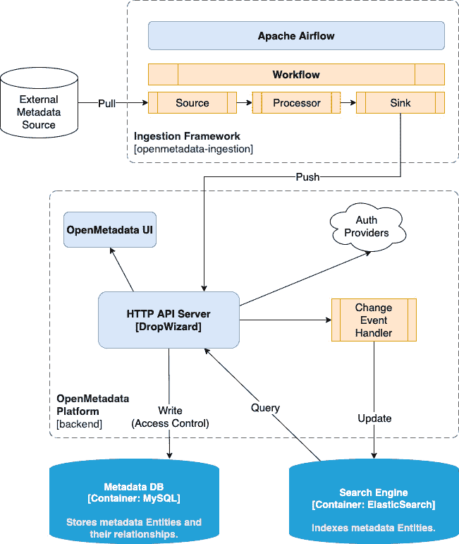

图 3.15 – OpenMetadata 架构图 字体来源：OpenMetadata 文档

关于设计决策的更详细信息，您可以访问 **主概念** 页面并详细了解其背后的理念：[`docs.open-metadata.org/main-concepts/high-level-design`](https://docs.open-metadata.org/main-concepts/high-level-design)。

## 更多...

我们看到了如何轻松地在我们的机器上本地配置和安装 **OpenMetadata**，以及其架构的简要概述。然而，市场上还有其他优秀的选项可以用来记录数据，甚至可以使用基于 **Google Cloud** 的 **OpenMetadata** 的 **SaaS** 解决方案。

### OpenMetadata SaaS 沙盒

最近，OpenMetadata 实现了一个使用 Google 的 **软件即服务** (**SaaS**) 沙盒 ([`sandbox.open-metadata.org/signin`](https://sandbox.open-metadata.org/signin))，这使得部署和启动发现和目录过程变得更加容易。然而，它可能会产生费用，所以请记住这一点。

## 参见

+   您可以在他们的博客中了解更多关于 OpenMetadata 的信息：[`blog.open-metadata.org/why-openmetadata-is-the-right-choice-for-you-59e329163cac`](https://blog.open-metadata.org/why-openmetadata-is-the-right-choice-for-you-59e329163cac)

+   在 GitHub 上探索 OpenMetadata：[`github.com/open-metadata/OpenMetadata`](https://github.com/open-metadata/OpenMetadata)

# 将 OpenMetadata 连接到我们的数据库

现在我们已经配置了我们的 **数据发现** 工具，让我们创建一个到本地数据库实例的示例连接。让我们尝试使用 PostgreSQL 进行简单的集成并练习另一种数据库的使用。

## 准备工作

首先，确保我们的应用程序通过访问 `http://localhost:8585/my-data` 地址运行得当。

注意

在 OpenMetadata 内部，用户必须使用我们之前看到的凭据以 `admin` 用户身份。

您可以在此处检查 Docker 状态：

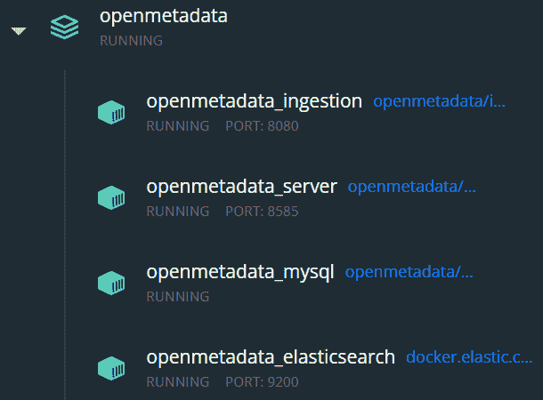

图 3.16 – 在 Docker 桌面应用程序中显示活动容器

使用 PostgreSQL 进行测试。由于我们已经有了一个准备好的 Google 项目，让我们使用 PostgreSQL 引擎创建一个 SQL 实例。

由于我们在 *第二章* 中将创建数据库和表的查询保持不变，我们可以在 Postgres 中再次构建它。这些查询也可以在本章的 GitHub 仓库中找到。但是，请随意创建您自己的数据。

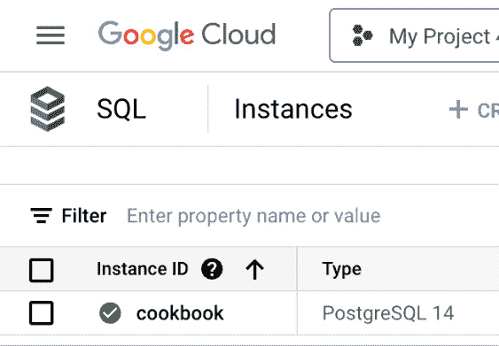

图 3.17 – SQL 实例的 Google Cloud 控制台标题

请记住让此实例允许公共访问；否则，我们的本地 OpenMetadata 实例将无法访问它。

## 如何操作...

在浏览器标题栏中输入 `http://localhost:8585/my-data` 以访问 OpenMetadata 主页：

1.  **向 OpenMetadata 添加新的数据库**：转到 **设置** | **服务** | **数据库**，然后点击 **添加新的数据库服务**。将出现一些选项。点击 **Postgres**：


图 3.18 – 打开 OpenMetadata 页面以添加数据库作为源

点击 `CookBookData`。

1.  **添加我们的连接设置**：再次点击 **下一步** 后，将出现一个包含一些输入 MySQL 连接设置的页面的字段：

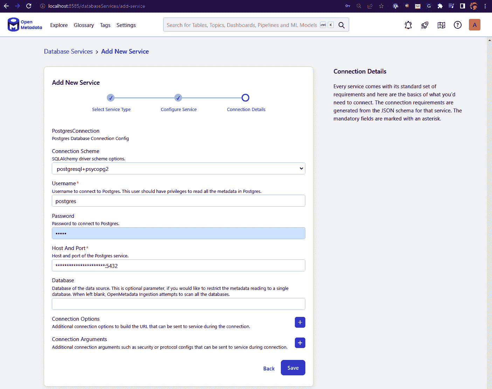

图 3.19 – 添加新的数据库连接信息

1.  **测试我们的连接**：在所有凭据就绪后，我们需要测试到数据库的连接。

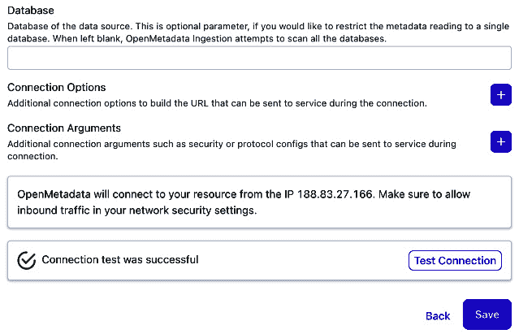

图 3.20 – 数据库连接测试成功消息

1.  **创建摄取管道**：您可以将所有字段保持原样，无需担心 **数据库工具**（**DBT**）。对于 **调度间隔**，您可以设置最适合您的选项。我将将其设置为 **每日**。

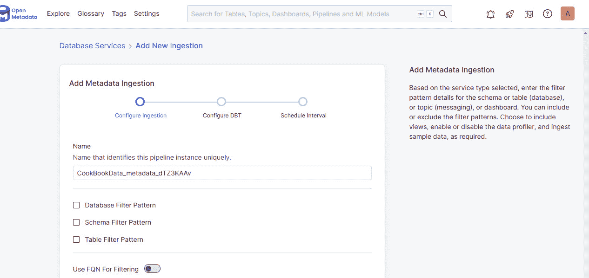

图 3.21 – 添加数据库元数据摄取

1.  **摄取元数据**：前往 **摄取**，我们的数据库元数据已成功摄取。

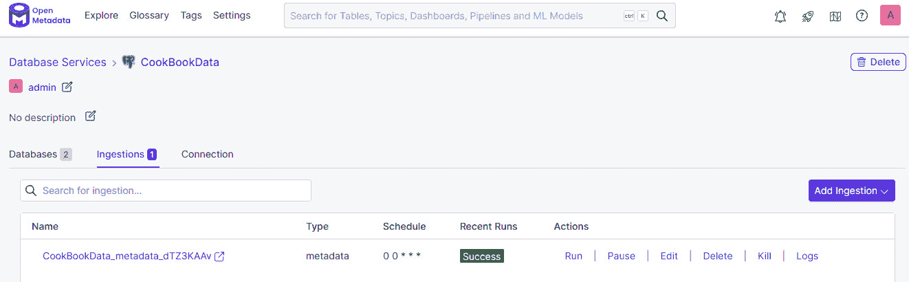

图 3.22 – 成功摄取的 Postgres 元数据

1.  **探索我们的元数据**：要探索元数据，请转到 **探索** | **表**：

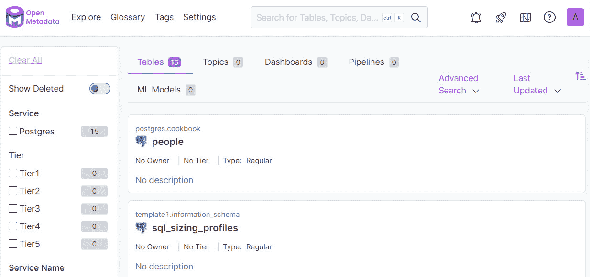

图 3.23 – 显示已摄取的表元数据的探索页面

您可以看到 `people` 表与其他内部表一起存在：

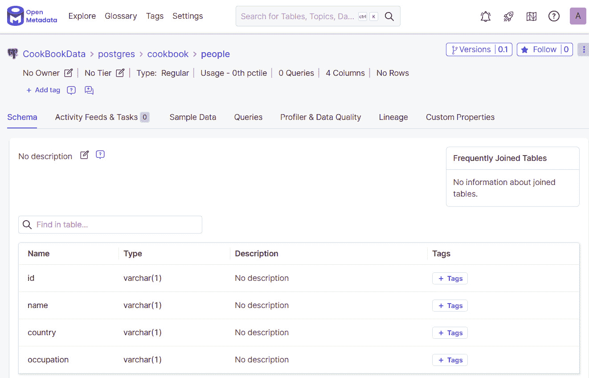

图 3.24 – 人员表元数据

在这里，您可以探索应用程序的一些功能，例如定义对组织及其所有者的重要性级别，查询表，以及其他功能。

## 它是如何工作的…

正如我们之前看到的，OpenMetadata 使用 Python 来构建和连接到不同的来源。

在 `连接方案` 中使用 `psycopg2`，这是一个在 Python 中广泛使用的库。所有其他参数都传递给背后的 Python 代码以创建连接字符串。

对于每次元数据摄取，OpenMetadata 都会创建一个新的 Airflow **有向无环图**（**DAG**）来处理它，基于一个通用的 DAG。为每次元数据摄取创建一个单独的 DAG，在出现错误时使调试更加容易管理。

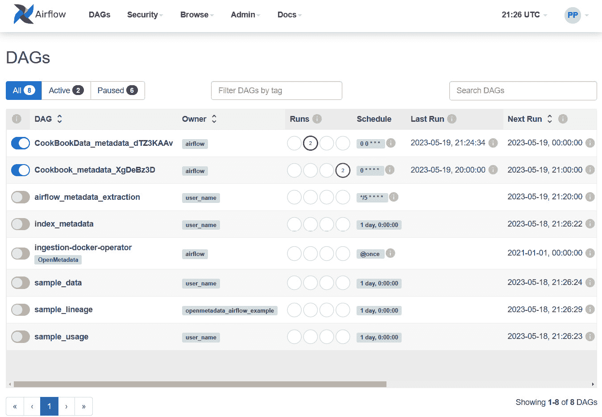

图 3.25 – OpenMetadata 创建的 Airflow DAG

如果您打开 OpenMetadata 使用的 Airflow 实例，您可以清楚地看到它，并获得有关元数据摄取的其他信息。这是一个在发生错误时进行调试的好地方。了解我们的解决方案是如何工作的，以及遇到问题时应该查看哪些地方，有助于更有效地识别和解决问题。

# 进一步阅读

+   [数据发现](https://nira.com/data-discovery/)

+   [数据发现](https://coresignal.com/blog/data-discovery/)

+   [什么是数据发现指南](https://www.polymerhq.io/blog/diligence/what-is-data-discovery-guide/)

+   [数据发现](https://bi-survey.com/data-discovery)

+   [数据发现](https://www.heavy.ai/technical-glossary/data-discovery)

+   [数据发现工具](https://www.datapine.com/blog/what-are-data-discovery-tools/)

+   [数据发现如何与 BI 相关联 - 发现](https://www.knowsolution.com.br/data-discovery-como-relaciona-bi-descubra/)（葡萄牙语）

## 其他工具

如果你对市场上可用的其他数据发现工具感兴趣，以下是一些：

+   **Tableau**：Tableau ([Tableau 官网](https://www.tableau.com/)) 更广泛地用于数据可视化和仪表板，但也提供了一些发现和编目数据的特性。你可以在他们的资源页面上了解更多关于如何使用 Tableau 进行数据发现的信息：[数据驱动的组织 - 7 个数据发现关键](https://www.tableau.com/learn/whitepapers/data-driven-organization-7-keys-data-discovery)。

+   **OpenDataDiscovery**（免费和开源）：OpenDataDiscovery 最近进入市场，可以提供一个非常好的起点。查看这里：[OpenDataDiscovery 官网](https://opendatadiscovery.org/)。

+   **Atlan**：Atlan ([Atlan 官网](https://atlan.com/)) 是一个完整的解决方案，同时也带来了数据治理结构；然而，成本可能很高，并且需要与他们的销售团队联系以启动 **MVP**（即 **最小可行产品**）。

+   **Alation**：Alation 是一款企业级工具，提供包括数据治理所有支柱在内的多种数据解决方案。了解更多信息请访问：[Alation 官网](https://www.alation.com/)。
