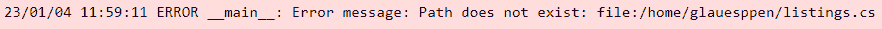

# 第六章：使用 PySpark 与定义和非定义模式

通常，模式是用来创建或应用结构到数据的形式。作为一个处理或将要处理大量数据的人，理解如何操作 DataFrame 并在需要为涉及的信息提供更多上下文时应用结构是至关重要的。

然而，如前几章所见，数据可能来自不同的来源或以未定义的结构存在，应用模式可能具有挑战性。在这里，我们将看到如何使用 PySpark 创建模式和标准格式，无论是结构化数据还是非结构化数据。

在本章中，我们将涵盖以下食谱：

+   应用模式到数据摄入

+   使用已定义模式导入结构化数据

+   使用未定义模式的非结构化数据导入

+   使用已定义和非定义模式导入结构化数据

+   插入格式化的 SparkSession 日志以方便你的工作

# 技术要求

你也可以在这个 GitHub 仓库中找到本章的代码：[`github.com/PacktPublishing/Data-Ingestion-with-Python-Cookbook`](https://github.com/PacktPublishing/Data-Ingestion-with-Python-Cookbook)。

使用 **Jupyter Notebook** 不是强制性的，但它可以帮助你交互式地查看代码的工作方式。由于我们将执行 Python 和 PySpark 代码，这可以帮助我们更好地理解脚本。一旦安装完成，你可以使用以下命令来运行 Jupyter：

```py
$ jupyter Notebook
```

建议创建一个单独的文件夹来存储本章中将要涵盖的 Python 文件或 Notebooks；然而，你可以自由地以最适合你的方式组织文件。

在本章中，所有食谱都需要初始化一个 `SparkSession` 实例，并且你可以为它们使用相同的会话。你可以使用以下代码来创建你的会话：

```py
from pyspark.sql import SparkSession
spark = SparkSession.builder \
      .master("local[1]") \
      .appName("chapter6_schemas") \
      .config("spark.executor.memory", '3g') \
      .config("spark.executor.cores", '1') \
      .config("spark.cores.max", '1') \
      .getOrCreate()
```

注意

在某些情况下，预期输出会有 `WARN` 消息，特别是如果你在 Windows 上使用 WSL，所以你不需要担心。

# 应用模式到数据摄入

在处理数据时，应用模式是一种常见的做法，PySpark 本地支持将这些模式应用到 DataFrame 中。为了定义并应用模式到我们的 DataFrame，我们需要了解一些 Spark 的概念。

本食谱介绍了使用 PySpark 处理模式的基本概念及其最佳实践，以便我们可以在以后将它们应用到结构化和非结构化数据中。

## 准备工作

确保你的机器上安装并运行了 PySpark，你可以通过在命令行中运行以下代码来检查此要求：

```py
$ pyspark --version
```

你应该看到以下输出：


图 6.1 – PySpark 版本控制台输出

如果你没有在本地机器上安装 PySpark，请参考 *第一章* 中的 *安装 PySpark* 食谱。

我将使用 Jupyter Notebook 来执行代码，使其更具交互性。你可以使用此链接并遵循屏幕上的说明来安装它：[`jupyter.org/install`](https://jupyter.org/install)。

如果你已经安装了它，请使用以下命令行代码检查版本：

```py
$ jupyter --version
```

以下截图显示了预期的输出：


图 6.2 – Jupyter 包版本

如你所见，本书编写时 Notebook 版本是 `6.4.4`。请确保始终使用最新版本。

## 如何做到这一点…

这里是执行食谱的步骤：

1.  **创建模拟数据**：在将模式应用到我们的 DataFrame 之前，我们需要创建一个包含模拟数据的简单集合，这些数据以以下格式表示人的信息——ID、姓名、姓氏、年龄和性别：

    ```py
    my_data = [("3456","Cristian","Rayner",30,"M"),
                ("3567","Guto","Flower",35,"M"),
                ("9867","Yasmin","Novak",23,"F"),
                ("3342","Tayla","Mejia",45,"F"),
                ("8890","Barbara","Kumar",20,"F")
                ]
    ```

1.  **导入和构建模式**：下一步是导入类型并创建我们模式的结构：

    ```py
    from pyspark.sql.types import StructType, StructField, StringType, IntegerType
    schema = StructType([ \
        StructField("id",StringType(),True), \
        StructField("name",StringType(),True), \
        StructField("lastname",StringType(),True), \
        StructField("age", IntegerType(), True), \
        StructField("gender", StringType(), True), \
      ])
    ```

1.  **创建 DataFrame**：然后，我们创建 DataFrame，应用我们创建的模式：

    ```py
    df = spark.createDataFrame(data=my_data,schema=schema)
    ```

当使用 `.printSchema()` 方法打印我们的 DataFrame 模式时，这是预期的输出：


图 6.3 – DataFrame 模式

## 它是如何工作的…

在理解 *步骤 2* 中的方法之前，让我们稍微回顾一下 DataFrame 的概念。

DataFrame 类似于一个存储和组织在二维数组中的数据表，它类似于 MySQL 或 Postgres 等关系型数据库中的表。每一行对应一个记录，pandas 和 PySpark 等库默认情况下会为每一行（或索引）分配一个内部记录号。


图 6.4 – GeeksforGeeks DataFrame 解释

注意

谈到 Pandas 库，通常将 Pandas DataFrame 中的列称为序列，并期望它像 Python 列表一样表现。这使得分析数据和处理可视化变得更加容易。

使用 DataFrame 的目的是利用 Spark 在底层提供的多个数据处理的优化，这些优化与并行处理直接相关。

回到 `schema` 变量中的模式定义，让我们看看我们创建的代码：

```py
schema = StructType([ \
    StructField("id",StringType(),True), \
    StructField("name",StringType(),True), \
    StructField("lastname",StringType(),True), \
    StructField("age", IntegerType(), True), \
    StructField("gender", StringType(), True), \
  ])
```

我们声明的第一个对象是 `StructType` 类。这个类将创建一个集合或我们行对象的实例。接下来，我们声明一个 `StructField` 实例，它代表我们的列，包括其名称、数据类型、是否可空以及适用时的元数据。`StructField` 必须按照 DataFrame 中列的顺序排列；否则，由于数据类型不兼容（例如，列具有字符串值，而我们将其设置为整数）或存在空值，可能会产生错误。定义 `StructField` 是标准化 DataFrame 名称以及因此分析数据的绝佳机会。

最后，`StringType`和`IntegerType`是将数据类型转换为相应列的方法。它们在菜谱开始时导入，并来自 PySpark 内部的 SQL 类型。在我们的模拟数据示例中，我们将`id`和`age`列定义为`IntegerType`，因为我们预计其中不会有其他类型的数据。然而，在许多情况下，`id`列被称为字符串类型，通常当数据来自不同的系统时。

在这里，我们使用了`StringType`和`IntegerType`，但还可以使用许多其他类型来创建上下文并标准化我们的数据。请参考以下图表：


图 6.5 – SparkbyExample 中 Spark 的数据类型表

您可以在 Spark 官方文档中了解如何应用**Spark 数据类型**：[`spark.apache.org/docs/latest/sql-ref-datatypes.xhtml`](https://spark.apache.org/docs/latest/sql-ref-datatypes.xhtml)。

## 还有更多…

在处理术语时，需要对使用数据集或 DataFrame 有一个共同的理解，尤其是如果您是数据世界的新手。

数据集是一组包含行和列（例如，关系型数据）或文档和文件（例如，非关系型数据）的数据集合。它来自一个源，并以不同的文件格式提供。

另一方面，DataFrame 是从数据集派生出来的，即使不是主要格式，也会以表格形式呈现数据。DataFrame 可以根据创建时设置的配置将 MongoDB 文档集合转换为表格组织。

## 参见

更多关于*SparkbyExample*网站的示例可以在以下链接找到：[`sparkbyexamples.com/pyspark/pyspark-sql-types-datatype-with-examples/`](https://sparkbyexamples.com/pyspark/pyspark-sql-types-datatype-with-examples/)。

# 使用定义良好的模式导入结构化数据

如前一章所述，在“从结构化和非结构化数据库中摄取数据”中，结构化数据具有标准的行和列格式，通常存储在数据库中。

由于其格式，DataFrame 模式的适用性通常较为简单，并且具有几个优点，例如确保摄取的信息与数据源相同或遵循规则。

在这个菜谱中，我们将从结构化文件（如 CSV 文件）中摄取数据，并应用 DataFrame 模式以更好地理解它在现实世界场景中的应用。

## 准备工作

此练习需要 GitHub 存储库中这本书的`listings.csv`文件。同时，请确保您的`SparkSession`已初始化。

此菜谱中的所有代码都可以在 Jupyter Notebook 单元格或 PySpark shell 中执行。

## 如何做…

执行此菜谱的步骤如下：

1.  `StringType`和`IntegerType`，我们将在导入中包含两种更多数据类型，即`FloatType`和`DateType`，如下所示：

    ```py
    from pyspark.sql.types import StructType, StructField, StringType, IntegerType, FloatType, DateType, DoubleType
    ```

1.  将`StructField`分配给相应的数据类型：

    ```py
    schema = StructType([ \
        StructField("id",IntegerType(),True), \
        StructField("name",StringType(),True), \
        StructField("host_id",IntegerType(),True), \
        StructField("host_name",StringType(),True), \
        StructField("neighbourhood_group",StringType(),True), \
        StructField("neighbourhood",StringType(),True), \
        StructField("latitude",DoubleType(),True), \
        StructField("longitude",DoubleType(),True), \
        StructField("room_type",StringType(),True), \
        StructField("price",FloatType(),True), \
        StructField("minimum_nights",IntegerType(),True), \
        StructField("number_of_reviews",IntegerType(),True), \
        StructField("last_review",DateType(),True), \
        StructField("reviews_per_month",FloatType(),True), \
          StructField("calculated_host_listings_count",IntegerType(),True), \
        StructField("availability_365",IntegerType(),True), \
        StructField("number_of_reviews_ltm",IntegerType(),True), \
        StructField("license",StringType(),True)
      ])
    ```

1.  将`.options()`配置和`.schema()`方法与*步骤 2*中看到的`schema`变量一起添加到`listings.csv`文件中。

    ```py
    df = spark.read.options(header=True, sep=',',
                              multiLine=True, escape='"')\
                    .schema(schema) \
                    .csv('listings.csv')
    ```

如果一切设置正确，你应该不会看到此执行的任何输出。

1.  **检查读取的 DataFrame**：我们可以通过执行以下代码来检查我们 DataFrame 的模式：

    ```py
    df.printSchema()
    ```

你应该看到以下输出：


图 6.6 – listings.csv DataFrame 模式

## 它是如何工作的……

在这个练习中，我们做了一些与上一个食谱*应用模式到数据摄取*不同的添加。 

如同往常，我们首先导入使脚本工作的必需方法。我们添加了三种更多数据类型：float、double 和 date。选择是基于 CSV 文件的内容。让我们看看我们文件的第一个行，如下面的截图所示：


图 6.7 – 从 Microsoft Excel 查看 listings.csv

我们可以观察到不同类型的数值字段；一些需要更多的小数位数，而`last_review`是日期格式。因此，我们添加了额外的库导入，如下面的代码片段所示：

```py
from pyspark.sql.types import StructType, StructField, StringType, IntegerType, FloatType, DoubleType, DateType
```

*步骤 2*与之前我们所做的是相似的，其中我们分配了列名及其相应的数据类型。在*步骤 3*中，我们使用`SparkSession`类的`schema()`方法进行了模式分配。如果模式包含与文件相同的列数，我们应该在这里看不到任何输出；否则，将出现此消息：


图 6.8 – 当模式不匹配时输出警告信息

即使是`WARN`日志消息，内容也很重要。仔细观察，它说模式与文件中的列数不匹配。这可能在 ETL 管道的后期加载数据到数据仓库或任何其他分析数据库时成为问题。

## 还有更多……

如果你回到*第四章*，你会注意到我们 CSV 读取中的一个`inferSchema`参数被插入到`options()`方法中。参考以下代码：

```py
df_2 = spark.read.options(header=True, sep=',',
                          multiLine=True, escape='"',
                         inferSchema=True) \
                .csv('listings.csv')
```

此参数告诉 Spark 根据行的特征推断数据类型。例如，如果一行没有引号且是数字，那么这很可能是一个整数。然而，如果它包含引号，Spark 可以将其解释为字符串，任何数值操作都会失败。

在食谱中，如果我们使用`inferSchema`，我们将看到与我们所定义的模式非常相似的`printSchema`输出，除了某些被解释为`DoubleType`的字段，而我们将其声明为`FloatType`或`DateType`。这如下面的截图所示：


图 6.9 – 使用带有 inferSchema 模式的模式比较输出

即使这看起来像是一个微不足道的细节，但在处理流数据或大数据集以及有限的计算资源时，它可能会产生影响。浮点类型具有较小的范围，并带来较高的处理能力。双精度数据类型提供了更多的精度，并用于减少数学误差或避免十进制数据类型四舍五入的值。

## 参见

在*Hackr IO*网站上了解更多关于浮点型和双精度类型的信息：[`hackr.io/blog/float-vs-double`](https://hackr.io/blog/float-vs-double)。

# 在没有模式的情况下导入非结构化数据

如前所述，非结构化数据或**NoSQL**是一组不遵循格式（如关系型或表格数据）的信息。它可以表示为图像、视频、元数据、转录等。数据摄取过程通常涉及 JSON 文件或文档集合，正如我们之前在从**MongoDB**摄取数据时所见。

在这个菜谱中，我们将读取一个 JSON 文件并将其转换为没有模式的 DataFrame。尽管非结构化数据应该具有更灵活的设计，但我们将看到在没有模式或结构的情况下 DataFrame 的一些影响。

## 准备工作...

在这里，我们将使用`holiday_brazil.json`文件来创建 DataFrame。你可以在 GitHub 仓库中找到它：[`github.com/PacktPublishing/Data-Ingestion-with-Python-Cookbook`](https://github.com/PacktPublishing/Data-Ingestion-with-Python-Cookbook)。

我们将使用`SparkSession`来读取 JSON 文件并创建一个 DataFrame，以确保会话处于运行状态。

所有代码都可以在 Jupyter Notebook 或 PySpark shell 中执行。

## 如何操作...

让我们现在读取我们的`holiday_brazil.json`文件，观察 Spark 是如何处理它的：

1.  将`multiline`作为`options()`方法的参数。我们还将让 PySpark 推断其中的数据类型：

    ```py
    df_json = spark.read.option("multiline","true") \
                        .json('holiday_brazil.json')
    ```

如果一切顺利，你应该看不到任何输出。

1.  使用`printSchema()`方法，我们可以看到 PySpark 如何解释每个键的数据类型：

    ```py
    df_json.printSchema()
    ```

以下截图是预期的输出：


图 6.10 – holiday_brazil.json DataFrame 模式

1.  使用`toPandas()`函数来更好地可视化我们的 DataFrame：

    ```py
    df_json.toPandas()
    ```

你应该看到以下输出：


图 6.11 – 从 DataFrame 中 toPandas()视图的输出

## 它是如何工作的...

让我们看一下*步骤 2*的输出：


图 6.12 – Holiday_brasil.json DataFrame 模式

如我们所观察到的，Spark 只带来了四个列，JSON 文件中的前四个键，并且通过将它们保留在主要的四个键中忽略了其他嵌套键。这是因为 Spark 需要通过展平嵌套字段中的值来更好地处理参数，尽管我们在`options()`配置中传递了`multiline`作为参数。

另一个重要点是，对`weekday`数组内`numeric`键推断的数据类型是字符串值，应该是整数。这是因为这些值有引号，正如你在以下图中可以看到的：


图 6.13 – 星期对象

将此应用于一个需要定性评估的现实世界场景，这些未格式化和无模式的 DataFrame 在上传到数据仓库时可能会引起问题。如果一个字段突然更改了名称或在源中不可用，它可能导致数据不一致。有一些方法可以解决这个问题，我们将在下一个食谱*使用定义良好的模式和格式导入非结构化数据*中进一步介绍。

然而，还有许多其他场景中不需要定义模式或非结构化数据不需要标准化。一个很好的例子是应用程序日志或元数据，其中数据通常与应用程序或系统的可用性相关联，以发送信息。在这种情况下，像**ElasticSearch**、**DynamoDB**和许多其他提供查询支持的存储选项都是好的选择。换句话说，这里的大部分问题将更倾向于生成定量输出。

# 使用定义良好的模式和格式导入非结构化数据

在上一个食谱中，*无模式导入非结构化数据*，我们读取了一个没有任何模式或格式化应用的 JSON 文件。这导致了一个奇怪的结果，可能会引起混淆，并在数据管道的后续阶段需要额外的工作。虽然这个例子具体涉及到一个 JSON 文件，但它也适用于所有其他需要转换为分析数据的 NoSQL 或非结构化数据。

目标是继续上一个食谱，并应用一个模式和标准到我们的数据中，使其在后续的**ETL**阶段更易于阅读和处理。

## 准备工作

这个食谱与*无模式导入无* *模式*食谱有完全相同的要求。

## 如何做到这一点…

我们将执行以下步骤来完成这个食谱：

1.  **导入数据类型**：像往常一样，让我们从 PySpark 库中导入我们的数据类型：

    ```py
    from pyspark.sql.types import StructType, ArrayType, StructField, StringType, IntegerType, MapType
    ```

1.  **结构化 JSON 模式**：接下来，我们根据 JSON 的结构设置模式：

    ```py
    schema = StructType([ \
            StructField('status', StringType(), True),
            StructField('holidays', ArrayType(
                StructType([
                    StructField('name', StringType(), True),
                    StructField('date', DateType(), True),
                    StructField('observed', StringType(), True),
                    StructField('public', StringType(), True),
                    StructField('country', StringType(), True),
                    StructField('uuid', StringType(), True),
                    StructField('weekday', MapType(StringType(), MapType(StringType(),StringType(),True),True))
                ])
            ))
        ])
    ```

1.  使用上一个步骤中创建的模式应用`schema()`方法：

    ```py
    df_json = spark.read.option("multiline","true") \
                        .schema(schema) \
                        .json('holiday_brazil.json')
    ```

1.  使用`explode()`方法，让我们扩展`holidays`列内的字段：

    ```py
    from pyspark.sql.functions import explode
    exploded_json = df_json.select('status', explode("holidays").alias("holidaysExplode"))\
            .select("status", "holidaysExplode.*")
    ```

1.  **扩展更多列**：这是一个可选步骤，但如果需要，我们可以继续增长并展平包含嵌套内容的其他列：

    ```py
    exploded_json2 = exploded_json.select("*", explode('weekday').alias('weekday_type', 'weekday_objects'))
    ```

1.  使用 `toPandas()` 函数，我们可以更好地查看我们的 DataFrame 现在的样子：

    ```py
    exploded_json2.toPandas()
    ```

你应该看到以下输出：


图 6.14 – 扩展列的 DataFrame

最终的 DataFrame 可以保存为 Parquet 文件，这将使数据管道中的下一步更容易处理。

## 它是如何工作的…

如你所见，这个 JSON 文件由于嵌套对象的数量而具有一定的复杂性。当处理这样的文件时，我们可以使用多种方法。在编码时，有许多达到解决方案的方法。让我们了解这个食谱是如何工作的。

在 *步骤 1* 中，导入了两种新的数据类型—`ArrayType` 和 `MapType`。尽管在使用每种类型时有些困惑，但当我们查看 JSON 结构时，它相对简单易懂。

我们使用 `ArrayType` 为 `holiday` 键，因为它的结构看起来像这样：

```py
holiday : [{},{}...]
```

它是一个对象数组（如果我们使用 Python 则为列表），每个对象代表巴西的一个节日。当 `ArrayType` 包含其他对象时，我们需要重新使用 `StructType` 来告知 Spark 内部对象的架构。这就是为什么在 *步骤 2* 中，我们的模式开始看起来是这样的：

```py
StructField('holidays', ArrayType(
            StructType([
  ...
])
))
```

以下新的数据类型是 `MapType`。这种类型指的是包含其他对象的对象。如果我们只使用 Python，它可以被称为字典。PySpark 从 Spark 的 **超类** 中扩展了这种数据类型，你可以在这里了解更多信息：[`spark.apache.org/docs/2.0.1/api/java/index.xhtml?org/apache/spark/sql/types/MapType.xhtml`](https://spark.apache.org/docs/2.0.1/api/java/index.xhtml?org/apache/spark/sql/types/MapType.xhtml)。

`MapType` 的语法需要键值类型、值类型以及它是否接受空值。我们在 `weekday` 字段中使用了这种类型，正如你所见：

```py
StructField('weekday', MapType(
StringType(),MapType(
StringType(),StringType(),True)
,True))
```

这可能是我们迄今为止见过的最复杂的结构，这归因于 JSON 通过它的结构：

```py
weekday : {
 day : {{}, {}},
 observed : {{}, {}}
}
```

我们模式中的结构为 `weekday` 以及随后的键 `day` 和 `observed` 创建了 `MapType`。

一旦我们的模式被定义并应用到我们的 DataFrame 上，我们可以使用 `df_json.show()` 来预览它。如果模式与 JSON 结构不匹配，你应该看到以下输出：


图 6.15 – df_json 打印

这表明 Spark 无法正确创建 DataFrame。在这种情况下，最好的行动是逐步应用模式，直到问题得到解决。

为了展平 `holidays` 列内的字段，我们需要使用 PySpark 中的一个函数 `explode`，正如你所见：

```py
from pyspark.sql.functions import explode
```

要应用这些更改，我们需要将结果分配给一个变量，这将创建一个新的 DataFrame：

```py
exploded_json = df_json.select('status', explode("holidays").alias("holidaysExplode"))\
        .select("holidaysExplode.*")
```

注意

虽然看起来有些多余，但防止原始 DataFrame 被修改是一个好习惯。如果出了问题，我们不需要重新读取文件，因为我们有原始 DataFrame 的完整状态。

使用 `select()` 方法，我们选择将保持不变的列并展开所需的列。我们这样做是因为 Spark 至少需要一个展开的列作为参考。正如你所观察到的，关于 **API** 数据摄取状态的其它列已从该模式中移除。

`select()` 方法的第二个参数是 `explode()` 方法，其中我们传递 `holiday` 列并赋予一个别名。第二个链式调用 `select()` 将仅检索 `holidaysExplode` 列。*步骤 5* 遵循相同的流程，但针对的是 `weekdays` 列。

## 更多内容…

正如我们之前讨论的，有许多方法可以展平 JSON 并应用模式。你可以在托马斯的 *Medium 博客* 上看到一个例子：[`medium.com/@thomaspt748/how-to-flatten-json-files-dynamically-using-apache-pyspark-c6b1b5fd4777`](https://medium.com/@thomaspt748/how-to-flatten-json-files-dynamically-using-apache-pyspark-c6b1b5fd4777).

他使用 Python 函数来解耦嵌套字段，然后应用 PySpark 代码。

*数据科学之路* 也提供了一个使用 Python 的 lambda 函数的解决方案。你可以在这里看到它：[`towardsdatascience.com/flattening-json-records-using-pyspark-b83137669def`](https://towardsdatascience.com/flattening-json-records-using-pyspark-b83137669def).

展平 JSON 文件可以是一个极好的方法，但需要更多关于复杂 Python 函数的知识。同样，没有正确的方法来做这件事；重要的是要提供一个你和你团队都能支持的解决方案。

## 参见

你可以在这里了解更多关于 PySpark 数据结构的信息：[`sparkbyexamples.com/pyspark/pyspark-structtype-and-structfield/`](https://sparkbyexamples.com/pyspark/pyspark-structtype-and-structfield/).

# 插入格式化的 SparkSession 日志以方便你的工作

一个常被低估的最佳实践是如何创建有价值的日志。记录信息和小型代码文件的应用程序可以节省大量的调试时间。这在摄取或处理数据时也是如此。

这个配方探讨了在 PySpark 脚本中记录事件的最佳实践。这里提供的示例将给出一个更通用的概述，它可以应用于任何其他代码片段，甚至会在本书的后续部分使用。

## 准备工作

我们将使用 `listings.csv` 文件来执行 Spark 的 `read` 方法。你可以在本书的 GitHub 仓库中找到这个数据集。确保你的 `SparkSession` 正在运行。

## 如何做到这一点…

执行此配方的步骤如下：

1.  `sparkContext`，我们将分配日志级别：

    ```py
    spark.sparkContext.setLogLevel("INFO")
    ```

1.  `getLogger()` 方法：

    ```py
    Logger= spark._jvm.org.apache.log4j.Logger
    syslogger = Logger.getLogger(__name__)
    ```

1.  `getLogger()` 实例化后，我们现在可以调用表示日志级别的内部方法，例如 `ERROR` 或 `INFO`：

    ```py
    syslogger.error("Error message sample")
    syslogger.info("Info message sample")
    ```

这将给我们以下输出：


图 6.16 – Spark 日志消息输出示例

1.  **创建 DataFrame**：现在，让我们使用本章中已经看到的一个文件来创建一个 DataFrame，并观察输出：

    ```py
    try:
        df = spark.read.options(header=True, sep=',',
                                  multiLine=True, escape='"',
                                 inferSchema=True) \
                        .csv('listings.csv')
    except Exception as e:
        syslogger.error(f"Error message: {e}")
    ```

你应该看到以下输出：


图 6.17 – PySpark 日志输出

如果你的控制台显示了更多行，不要担心；图片被裁剪以使其更易于阅读。

## 它是如何工作的…

让我们探索一下这个配方中做了些什么。Spark 有一个名为`log4j`或`rootLogger`的本地库。`log4j`是 Spark 使用的默认日志机制，用于抛出所有日志消息，如`TRACE`、`DEBUG`、`INFO`、`WARN`、`ERROR`和`FATAL`。消息的严重性随着每个级别的增加而增加。默认情况下，Spark 的日志级别为`WARN`，因此当我们将其设置为`INFO`时，开始出现新的消息，例如内存存储信息。

当我们执行`spark-submit`命令来运行 PySpark 时，我们将观察到更多的`INFO`日志（我们将在第十一章中稍后介绍）。

根据我们的脚本大小和所属的环境，只将其设置为显示`ERROR`消息是一个好习惯。我们可以使用以下代码更改日志级别：

```py
spark.sparkContext.setLogLevel("ERROR")
```

如你所见，我们使用`sparkContext`来设置日志级别。`sparkContext`是 Spark 应用程序中的一个关键组件。它管理集群资源，协调任务执行，并为与分布式数据集交互以及以分布式和并行方式执行计算提供接口。定义我们代码的日志级别将防止`ERROR`级别以下的级别出现在控制台上，使其更干净：

```py
Logger= spark._jvm.org.apache.log4j.Logger
syslogger = Logger.getLogger(__name__)
```

接下来，我们从实例化的会话中检索了`log4j`模块及其`Logger`类。这个类有一个方法可以显示像 Spark 那样格式化的日志。`__name__`参数将从 Python 内部检索当前模块的名称；在我们的例子中，它是`main`。

通过这种方式，我们可以创建如下自定义日志：

```py
syslogger.error("Error message sample")
syslogger.info("Info message sample")
```

当然，你也可以将 PySpark 日志与 Python 输出结合起来，使用`try...except`异常处理闭包来获得完整的解决方案。让我们通过将错误的文件名传递给我们的读取函数来模拟一个错误，如下所示：

```py
try:
    df = spark.read.options(header=True, sep=',',
                              multiLine=True, escape='"',
                             inferSchema=True) \
                    .csv('listings.cs') # Error here
except Exception as e:
    syslogger.error(f"Error message: {e}")
```

你应该看到以下输出消息：



图 6.18 – 由 log4j 格式化的错误消息

## 更多内容…

在`log4j`中还有许多可用的自定义选项，但这可能需要一点更多的工作。例如，你可以将一些`WARN`消息更改为`ERROR`消息，以防止脚本继续被处理。本章的一个实际例子是使用**预定义的架构**导入结构化数据时，架构中的列数与文件不匹配。

你可以在 *Ivan Trusov* 的博客页面上了解更多相关信息：[`polarpersonal.medium.com/writing-pyspark-logs-in-apache-spark-and-databricks-8590c28d1d51`](https://polarpersonal.medium.com/writing-pyspark-logs-in-apache-spark-and-databricks-8590c28d1d51).

## 另请参阅

+   你可以在这里找到更多关于 PySpark 最佳实践的介绍：[`climbtheladder.com/10-pyspark-logging-best-practices/`](https://climbtheladder.com/10-pyspark-logging-best-practices/).

+   在 Spark 官方文档中了解更多关于 `sparkContext` 及其工作原理的信息：[`spark.apache.org/docs/3.2.0/api/java/org/apache/spark/SparkContext.xhtml`](https://spark.apache.org/docs/3.2.0/api/java/org/apache/spark/SparkContext.xhtml).

# 进一步阅读

+   [`www.tibco.com/reference-center/what-is-structured-data`](https://www.tibco.com/reference-center/what-is-structured-data)

+   [`spark.apache.org/docs/latest/sql-programming-guide.xhtml`](https://spark.apache.org/docs/latest/sql-programming-guide.xhtml)

+   [`mungingdata.com/pyspark/schema-structtype-structfield/`](https://mungingdata.com/pyspark/schema-structtype-structfield/)

+   [`sparkbyexamples.com/pyspark/pyspark-select-nested-struct-columns/`](https://sparkbyexamples.com/pyspark/pyspark-select-nested-struct-columns/)

+   [`benalexkeen.com/using-pyspark-to-read-and-flatten-json-data-using-an-enforced-schema/`](https://benalexkeen.com/using-pyspark-to-read-and-flatten-json-data-using-an-enforced-schema/)

+   [`towardsdatascience.com/json-in-databricks-and-pyspark-26437352f0e9`](https://towardsdatascience.com/json-in-databricks-and-pyspark-26437352f0e9)
