# 第七章：摄入分析数据

分析数据是一组数据，它为公司、大学或任何其他机构中的多个领域（如财务、营销和销售）提供服务，以促进决策，尤其是在战略问题上。当将分析数据转换为数据管道或常规的 **提取、转换和加载**（**ETL**）过程时，它对应于最终步骤，其中数据已经摄取、清理、聚合，并根据业务规则进行了其他转换。

在许多场景中，数据工程师必须从包含分析数据的数据仓库或其他存储中检索数据。本章的目标是学习如何读取分析数据和其标准格式，并涵盖与反向 ETL 概念相关的实际用例。

在本章中，我们将学习以下主题：

+   摄入 Parquet 文件

+   摄入 Avro 文件

+   将模式应用于分析数据

+   过滤数据和处理常见问题

+   摄入分区数据

+   应用反向 ETL

+   选择用于反向 ETL 的分析数据

# 技术要求

如同 *第六章*，在本章中，一些菜谱也需要初始化 `SparkSession`，并且您可以使用相同的会话来执行所有这些。您可以使用以下代码来创建您的会话：

```py
from pyspark.sql import SparkSession
spark = SparkSession.builder \
      .master("local[1]") \
      .appName("chapter7_analytical_data") \
      .config("spark.executor.memory", '3g') \
      .config("spark.executor.cores", '2') \
      .config("spark.cores.max", '2') \
      .getOrCreate()
```

注意

在某些情况下，您可能会看到 `WARN` 消息作为输出，尤其是如果您在 Windows 上使用 WSL，所以如果您收到一个，您不需要担心。

您也可以在此章节的 GitHub 仓库中找到代码：[`github.com/PacktPublishing/Data-Ingestion-with-Python-Cookbook`](https://github.com/PacktPublishing/Data-Ingestion-with-Python-Cookbook).

# 摄入 Parquet 文件

**Apache Parquet** 是一种开源的列式存储格式，旨在支持快速处理。它在 **Hadoop 生态系统** 中的任何项目中都可用，并且可以用不同的编程语言读取。

由于其压缩和快速处理能力，这是在需要大量分析数据时最常用的格式之一。本菜谱的目标是了解如何在现实场景中使用 **PySpark** 读取一组 Parquet 文件。

## 准备工作

对于这个菜谱，我们需要初始化 `SparkSession`。您可以使用本章开头提供的代码来完成此操作。

本菜谱的数据集将是 *纽约黄色出租车行程记录*。您可以通过访问 **纽约市政府网站** 并选择 **2022** | **一月** | **黄色出租车行程记录** 或使用此链接下载：

[`d37ci6vzurychx.cloudfront.net/trip-data/yellow_tripdata_2022-01.parquet`](https://d37ci6vzurychx.cloudfront.net/trip-data/yellow_tripdata_2022-01.parquet)

您可以自由地使用 Jupyter 笔记本或 PySpark 壳会话执行代码。

## 如何操作…

执行此菜谱的步骤如下：

1.  **设置 Parquet 文件路径**：为了根据 Parquet 文件创建 DataFrame，我们有两种选择：传递文件名或 Parquet 文件的路径。在下面的代码块中，你可以看到一个只传递文件名的示例：

    ```py
    df = spark.read.parquet('chapter7_parquet_files/yellow_tripdata_2022-01.parquet')
    ```

对于第二种情况，我们移除了 Parquet 文件名，Spark 处理其余部分。你可以在下面的代码块中看到代码的样式：

```py
df = spark.read.parquet('chapter7_parquet_files/')
```

1.  `.printSchema()` 函数用于查看 DataFrame 是否成功创建：

    ```py
    df.printSchema()
    ```

你应该看到以下输出：

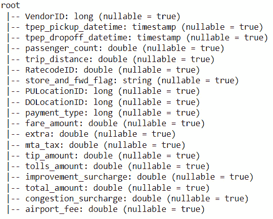

图 7.1 – 黄色出租车行程 DataFrame 模式

1.  **使用 pandas 可视化**：这是一个可选步骤，因为它要求你的本地机器有足够的处理能力，并且可能会在尝试处理时冻结内核。

为了更好地查看 DataFrame，让我们使用 `.toPandas()`，如下所示：

```py
df.toPandas().head(10)
```

你应该看到以下输出：

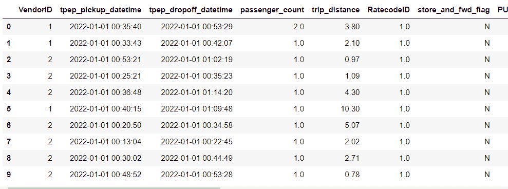

图 7.2 – 黄色出租车行程 DataFrame 与 pandas 可视化

## 它是如何工作的…

如前述代码所示，读取 Parquet 文件很简单。像许多 Hadoop 工具一样，PySpark 本地支持读取和写入 Parquet。

与 JSON 和 CSV 文件类似，我们使用一个从 `.read` 方法派生的函数来通知 PySpark 将读取 Parquet 文件，如下所示：

```py
spark.read.parquet()
```

我们还看到了两种读取方式，只传递 Parquet 文件所在的文件夹或传递带有 Parquet 文件名的路径。最佳实践是使用第一种情况，因为通常有多个 Parquet 文件，只读取一个可能会导致多个错误。这是因为每个 Parquet 文件都对应于相应 Parquet 文件夹中的数据的一部分。

在读取并将数据集转换为 DataFrame 后，我们使用 `.printSchema()` 方法打印了其模式。正如其名所示，它将打印并显示 DataFrame 的模式。由于我们没有指定我们想要的 DataFrame 模式，Spark 将根据列内的数据模式推断它。现在不用担心这个问题；我们将在 *将模式应用于分析数据* 菜谱中进一步介绍。

在 DataFrame 中进行任何操作之前使用 `.printSchema()` 方法是理解处理 DataFrame 内部数据的最佳方式的优秀实践。

最后，作为菜谱的最后一步，我们使用了 `.toPandas()` 方法来更好地可视化我们的数据，因为 `.show()` Spark 方法并不旨在提供像 pandas 那样的友好可视化。然而，在使用 `.toPandas()` 方法时必须谨慎，因为它需要计算能力和内存来将 Spark DataFrame 转换为 pandas DataFrame。

## 更多内容…

现在，让我们了解为什么 `parquet` 是大数据优化的文件格式。Parquet 文件是列式存储的，以数据块和小块（数据片段）的形式存储，允许优化的读写操作。在下面的图中，你可以从高层次上观察 `parquet` 如何组织数据：

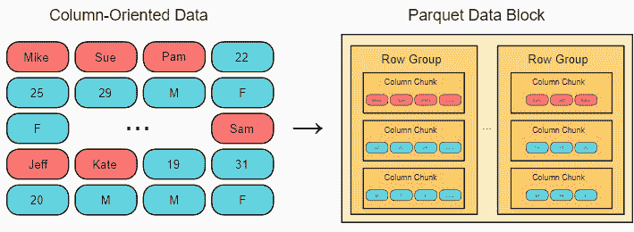

图 7.3 – 由 Darius Kharazi 制作的 Parquet 文件结构图（https://dkharazi.github.io/blog/parquet）

Parquet 文件通常以压缩形式存在。这为提高数据存储和传输效率增加了另一层。压缩的 Parquet 文件看起来像这样：

```py
yellow_tripdata_2022-01.snappy.parquet
```

`snappy` 名称告诉我们压缩类型，在创建 `gzip` 格式的表时至关重要，但更适用于大量数据。

## 参考内容

+   你可以在官方文档中了解更多关于 Apache Parquet 的信息：[`parquet.apache.org/docs/overview/motivation/`](https://parquet.apache.org/docs/overview/motivation/)

+   如果你想要测试其他 Parquet 文件并探索来自 *Open Targets Platform* 的更多数据，请访问此链接：[`ftp.ebi.ac.uk/pub/databases/opentargets/platform/22.11/output/etl/parquet/hpo/`](http://ftp.ebi.ac.uk/pub/databases/opentargets/platform/22.11/output/etl/parquet/hpo/)

# 导入 Avro 文件

与 Parquet 类似，**Apache Avro** 是一种广泛使用的格式，用于存储分析数据。Apache Avro 是记录数据的主要序列化方法，依赖于模式。它还提供了 **远程过程调用**（**RPCs**），使得数据传输更加容易，并解决诸如字段缺失、额外字段和字段命名等问题。

在这个菜谱中，我们将了解如何正确读取 Avro 文件，然后理解它是如何工作的。

## 准备工作

此菜谱将需要具有与之前 *导入 Parquet 文件* 菜谱中不同的配置的 `SparkSession`。如果你已经运行了 `SparkSession`，请使用以下命令停止它：

```py
spark.stop()
```

我们将在 *如何操作* 部分创建另一个会话。

在这里使用的数据集可以在以下链接找到：[`github.com/PacktPublishing/Data-Ingestion-with-Python-Cookbook/tree/main/Chapter_7/ingesting_avro_files`](https://github.com/PacktPublishing/Data-Ingestion-with-Python-Cookbook/tree/main/Chapter_7/ingesting_avro_files).

随意执行 Jupyter notebook 或 PySpark shell 会话中的代码。

## 如何操作…

这里是执行此菜谱的步骤：

1.  要处理 `avro` 文件，我们需要在我们的 `SparkSession` 配置中导入一个 `.jars` 文件，如下所示：

    ```py
    from pyspark.sql import SparkSession
    spark = SparkSession.builder \
          .master("local[1]") \
          .appName("chapter7_analytical_data_avro") \
          .config("spark.executor.memory", '3g') \
          .config("spark.executor.cores", '2') \
          .config("spark.cores.max", '2') \
          .config("spark.jars.packages", 'org.apache.spark:spark-avro_2.12:2.4.4') \
          .getOrCreate()
    ```

执行时，此代码将提供类似以下输出：

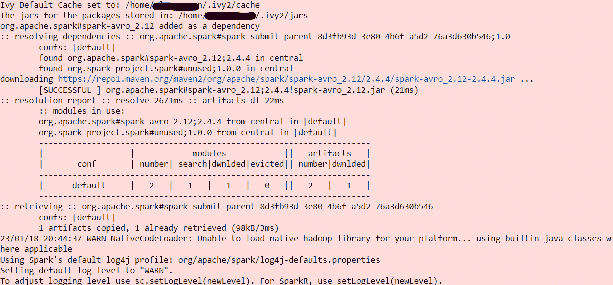

图 7.4 – 下载 Avro 文件包时 SparkSession 的日志

这意味着 `avro` 包已成功下载并准备好使用。我们将在后面介绍它是如何工作的。

1.  配置了`.jars`文件后，我们将传递文件格式到`.read`并添加文件的路径：

    ```py
    df = spark.read.format('avro').load('chapter7_avro_files/file.avro')
    ```

1.  `.printSchema()`，让我们检索这个 DataFrame 的架构：

    ```py
    df.printSchema()
    ```

你将观察到以下输出：


图 7.5 – 从 Avro 文件中获取的 DataFrame 架构

正如我们所观察到的，这个 DataFrame 包含与上一道菜中提到的 Parquet 文件相同的数据，即*摄取* *Parquet 文件*。

## 它是如何工作的...

正如你所观察到的，我们通过创建具有自定义配置的`SparkSession`来开始这道菜，这与 Spark 自 2.4 版本以来没有提供读取或写入 Avro 文件的内部 API 有关。

如果你尝试读取这里使用的文件而不下载`.jars`文件，你将得到以下错误信息：

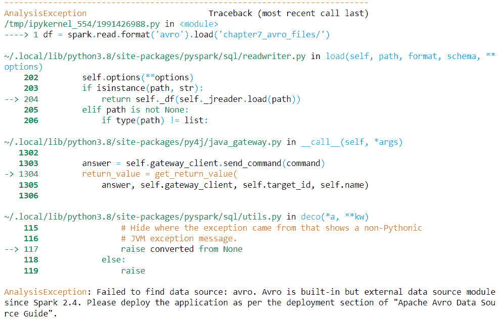

图 7.6 – 当 Spark 找不到 Avro 文件包时的错误信息

从错误信息中，我们可以注意到建议搜索一个名为`avro`的第三方（或外部）源。查看 Spark 第三方文档，可以在以下位置找到：[`spark.apache.org/docs/latest/sql-data-sources-avro.xhtml#data-source-option`](https://spark.apache.org/docs/latest/sql-data-sources-avro.xhtml#data-source-option)。

尽管文档中提供了一些关于如何为不同语言设置它的有用信息，例如`org.apache.spark:spark-avro_2.12:3.3.1.jars`文件与某些 PySpark 版本不兼容，因此建议使用`org.apache.spark:spark-avro_2.12:2.4.4`。

需要下载`.jars`文件，但它也与某些版本的 PySpark 不兼容：`com.databricks:spark-avro_2.11:4.0.0`。

由于没有内部 API 来处理此文件，我们需要通知 Spark 文件的格式，如下所示：

```py
spark.read.format('avro')
```

在读取**MongoDB**集合时，我们做了同样的事情，如第五章中所述，在*使用 PySpark 从 MongoDB 中摄取数据*的配方中。

一旦我们的文件被转换为 DataFrame，所有其他功能和操作都是相同的，没有偏见。正如我们所见，Spark 将推断架构并将其转换为列格式。

## 还有更多...

现在我们已经了解了 Apache Parquet 和 Apache Avro，你可能想知道何时使用哪一个。尽管两者都用于存储分析数据，但存在一些关键差异。

主要区别在于它们存储数据的方式。Parquet 存储在列格式中，而 Avro 以行格式存储数据，如果你想要检索整个行或数据集，这可以非常高效。然而，列格式在聚合或更大的数据集方面进行了更多优化，`parquet`还支持使用大规模数据和压缩进行更有效的查询。

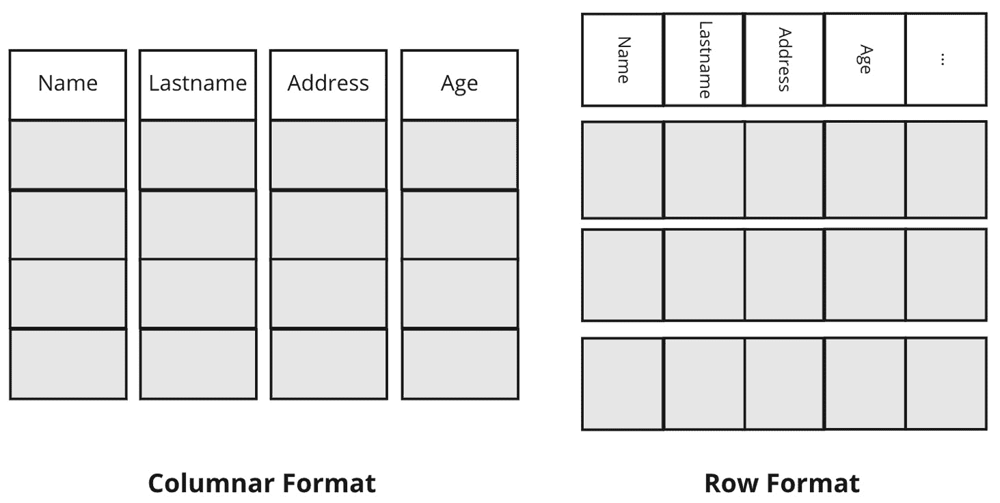

图 7.7 – 列格式与行格式

另一方面，Avro 文件通常用于数据流。一个很好的例子是使用 **Kafka** 和 **Schema Registry**，它将允许 Kafka 在实时验证文件的预期架构。您可以在 Databricks 文档中看到一些示例代码：[`docs.databricks.com/structured-streaming/avro-dataframe.xhtml`](https://docs.databricks.com/structured-streaming/avro-dataframe.xhtml)。

## 参见

在官方文档页面上了解更多关于 Apache Avro 的工作原理及其功能：[`avro.apache.org/docs/`](https://avro.apache.org/docs/)。

# 将架构应用于分析数据

在上一章中，我们看到了如何将架构应用于结构化和非结构化数据，但架构的应用不仅限于原始文件。

即使在处理已处理的数据时，也可能会遇到需要将列的值转换为其他部门使用的格式或更改列名的情况。在本菜谱中，我们将学习如何将架构应用于 Parquet 文件以及它是如何工作的。

## 准备工作

我们需要 `SparkSession` 来完成此菜谱。请确保您有一个正在运行和启动的会话。我们将使用与 *Ingesting Parquet 文件* 菜谱中相同的数据集。

您可以自由地使用 Jupyter notebook 或您的 PySpark shell 会话执行代码。

## 如何做…

执行此菜谱的步骤如下：

1.  **查看我们的列**：如 *Ingesting Parquet 文件* 菜谱中所示，我们可以列出列及其推断的数据类型。您可以看到以下列表：

    ```py
     VendorID: long
     tpep_pickup_datetime: timestamp
     tpep_dropoff_datetime: timestamp
     passenger_count: double
     trip_distance: double
     RatecodeID: double
     store_and_fwd_flag: string
     PULocationID: long
     DOLocationID: long
     payment_type: long
     fare_amount: double
     extra: double
     mta_tax: double
     tip_amount: double
     tolls_amount: double
     improvement_surcharge: double
     total_amount: double
     congestion_surcharge: double
    ```

1.  将 `VendorID` 转换为更易读的形式。请参考以下代码：

    ```py
    from pyspark.sql.types import StructType, StructField, StringType, LongType, DoubleType, TimestampType
    schema = StructType([ \
        StructField("vendorId", LongType() ,True), \
        StructField("tpep_pickup_datetime", TimestampType() ,True), \
        StructField("tpep_dropoff_datetime", TimestampType() ,True), \
        StructField("passenger_count", DoubleType() ,True), \
        StructField("trip_distance", DoubleType() ,True), \
        StructField("ratecodeId", DoubleType() ,True), \
        StructField("store_and_fwd_flag", StringType() ,True), \
        StructField("puLocationId", LongType() ,True), \
        StructField("doLocationId", LongType() ,True), \
        StructField("payment_type", LongType() ,True), \
        StructField("fare_amount", DoubleType() ,True), \
        StructField("extra", DoubleType() ,True), \
        StructField("mta_tax", DoubleType() ,True), \
        StructField("tip_amount", DoubleType() ,True), \
        StructField("tolls_amount", DoubleType() ,True), \
        StructField("improvement_surcharge", DoubleType() ,True), \
        StructField("total_amount", DoubleType() ,True), \
        StructField("congestion_surcharge", DoubleType() ,True), \
        StructField("airport_fee", DoubleType() ,True), \
    ])
    ```

1.  `parquet` 文件：

    ```py
    df_new_schema = spark.read.schema(schema).parquet('chapter7_parquet_files/yellow_tripdata_2022-01.parquet')
    ```

1.  **打印新的 DataFrame 架构**：当打印架构时，我们可以看到一些列的名称已更改，正如我们在 *步骤 1* 中在架构对象上设置的那样：

    ```py
    df_new_schema.printSchema()
    ```

执行前面的代码将提供以下输出：

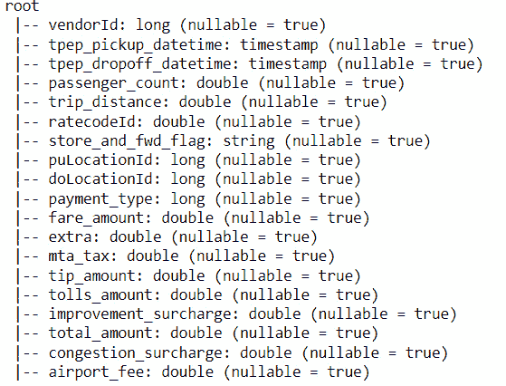

图 7.8 – 应用新架构的 DataFrame

1.  `.toPandas()` 函数，如下所示：

    ```py
    df_new_schema.toPandas().head(10)
    ```

输出看起来像这样：

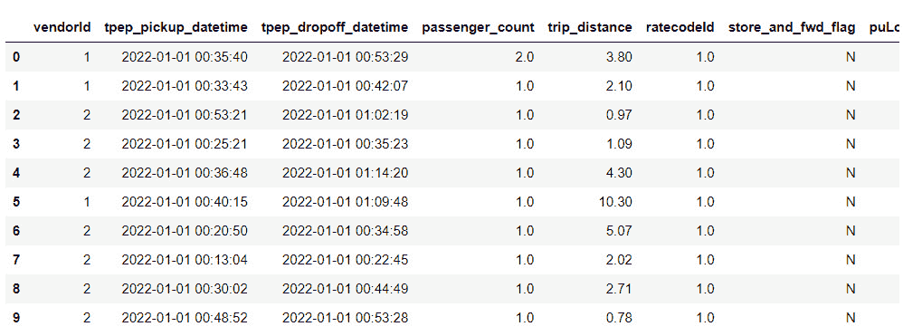

图 7.9 – 使用 pandas 可视化的黄色出租车行程 DataFrame

如您所见，没有数值数据发生变化，因此数据完整性保持不变。

## 它是如何工作的…

如我们所观察到的，为 DataFrame 定义和设置架构并不复杂。然而，当我们考虑了解数据类型或声明 DataFrame 的每一列时，它可能会有些费时。

开始架构定义的第一步是了解我们需要处理的数据集。这可以通过咨询数据目录或甚至与数据有更多联系的人来完成。作为最后的选项，您可以创建 DataFrame，让 Spark 推断架构，并在重新创建 DataFrame 时进行调整。

当在 Spark 中创建架构结构时，有一些事项我们需要注意，正如您在这里所看到的：

+   `StructType` 对象，它表示 `StructField` 列表的模式。

+   `StructField` 将定义名称、数据类型以及列是否允许空或空字段。

+   **数据类型**：最后要注意的是，我们将在哪里定义列的数据类型；正如你所想象的那样，有几种数据类型可用。你总是可以查阅文档以查看这里支持的数据类型：[`spark.apache.org/docs/latest/sql-ref-datatypes.xhtml`](https://spark.apache.org/docs/latest/sql-ref-datatypes.xhtml)。

一旦我们定义了模式对象，就可以很容易地使用 `.schema()` 方法将其分配给创建 DataFrame 的函数，就像我们在 *步骤 3* 中看到的那样。

创建 DataFrame 后，所有以下命令保持不变。

## 更多内容…

让我们做一个实验，在这个实验中，我们不是使用 `TimestampType()`，而是使用 `DateType()`。请看以下更改后的代码片段：

```py
    StructField("tpep_pickup_datetime", DateType() ,True), \
    StructField("tpep_dropoff_datetime", DateType() ,True), \
```

如果我们重复使用前面的代码更改步骤，当我们尝试可视化数据时将出现错误信息：


图 7.10 – 在分配不兼容的数据类型时读取 DataFrame 出错

这背后的原因是这两种数据类型在格式化列内数据时的不兼容性。`DateType()` 使用 `yyyy-MM-dd` 格式，而 `TimestampType()` 使用 `yyy-MM-dd HH:mm:ss.SSSS`。

仔细观察这两个列，我们看到小时、分钟和秒的信息。如果我们尝试将其强制转换为另一种格式，可能会损坏数据。

## 参见

在这里了解更多关于 Spark 数据类型的信息：[`spark.apache.org/docs/3.0.0-preview/sql-ref-datatypes.xhtml`](https://spark.apache.org/docs/3.0.0-preview/sql-ref-datatypes.xhtml)。

# 过滤数据和处理常见问题

过滤数据是一个排除或仅选择必要信息用于或存储的过程。即使是分析数据也必须重新过滤以满足特定需求。一个很好的例子是 **数据集市**（我们将在本食谱的后面部分介绍）。

本食谱旨在通过一个实际例子了解如何创建和应用过滤数据。

## 准备工作

此食谱需要 `SparkSession`，请确保你的已经启动并运行。你可以使用章节开头提供的代码或创建自己的代码。

这里使用的数据集将与 *Ingesting Parquet* *文件* 食谱中使用的相同。

为了使这个练习更加实用，让我们假设我们想要分析两个场景：每个供应商完成了多少次行程以及一天中的哪个小时段有更多的接单。我们将创建一些聚合并过滤我们的数据集以执行这些分析。

## 如何做到这一点…

执行此食谱的步骤如下：

1.  **读取 Parquet 文件**：让我们从读取我们的 Parquet 文件开始，如下面的代码所示：

    ```py
    df = spark.read.parquet('chapter7_parquet_files/')
    ```

1.  `vendorId` 实例以及每个供应商在 1 月（我们的数据集的时间范围）中执行了多少次行程。我们可以使用 `.groupBy()` 函数和 `.count()`，如下所示：

    ```py
    df.groupBy("vendorId").count().orderBy("vendorId").show()
    ```

这就是供应商行程计数的样子：


图 7.11 – vendorId 行程计数

1.  `tpep_pickup_datetime` 列，如下面的代码所示。然后，我们进行计数并按升序排序：

    ```py
    from pyspark.sql.functions import year, month, dayofmonth
    df.groupBy(hour("tpep_pickup_datetime")).count().orderBy("count").show()
    ```

这就是输出看起来像这样：

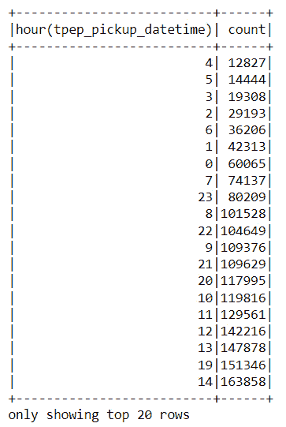

图 7.12 – 每小时的行程计数

如您所观察到的，在 `14` 小时和 `19` 小时，接货数量有所增加。我们可以考虑一些可能的原因，例如午餐时间和高峰时段。

## 它是如何工作的…

由于我们已经非常熟悉用于创建 DataFrame 的读取操作，让我们直接进入 *步骤 2*：

```py
df.groupBy("vendorId").count().orderBy("vendorId").show()
```

如您所观察到的，这里的函数链非常类似于 SQL 操作。这是因为，在幕后，我们正在使用 DataFrame 支持的本地 SQL 方法。

注意

与 SQL 操作类似，链中方法的顺序会影响结果，甚至可能影响操作的成功与否。

在 *步骤 3* 中，我们通过从 `tpep_pickup_datetime` 列中提取小时值增加了一些复杂性。这仅因为此列是时间戳数据类型。此外，我们这次按计数列排序，该列是在调用 `.count()` 函数后创建的，类似于 SQL。您可以在下面的代码中看到这一点：

```py
df.groupBy(hour("tpep_pickup_datetime")).count().orderBy("count").show()
```

还有许多其他函数，例如 `.filter()` 和 `.select()`。您可以在以下位置找到更多 PySpark 函数：[`spark.apache.org/docs/latest/api/python/reference/pyspark.sql/functions.xhtml`](https://spark.apache.org/docs/latest/api/python/reference/pyspark.sql/functions.xhtml)。

## 还有更多…

在这个配方中进行的分析使用了 PySpark 本地支持的 SQL 函数。然而，这些函数并不适合更复杂的查询。

在这些情况下，最佳实践是使用 Spark 的 **SQL API**。让我们看看接下来的代码是如何实现的：

1.  `.createOrReplaceTempView()` 方法并传递一个临时视图的名称，如下所示：

    ```py
    df.createOrReplaceTempView("ny_yellow_taxi_data")
    ```

1.  `SparkSession` 变量 (`spark`)，我们将调用 `.sql()` 并传递一个包含所需 SQL 代码的多行字符串。为了更容易可视化结果，我们还将它分配给一个名为 `vendor_groupby` 的变量。

观察到我们使用临时视图名称来指示查询将在哪里进行：

```py
vendor_groupby = spark.sql(
"""
SELECT vendorId, COUNT(*) FROM ny_yellow_taxi_data
GROUP BY vendorId
ORDER BY COUNT(*)
"""
)
```

执行此代码不会生成输出。

1.  `.show()` 方法将用于显示结果，如下面的代码所示：

    ```py
    vendor_groupby.show()
    ```

这是输出：

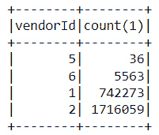

图 7.13 – 使用 SQL 代码的 vendorId 行程计数

使用 SQL API 的缺点是错误日志有时可能不清楚。请参见以下截图：

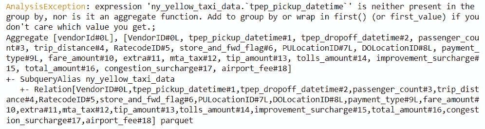

图 7.14 – 当 SQL 语法错误时的 Spark 错误

此截图显示了当按 `tpep_pickup_datetime` 列分组时语法错误的查询结果。在这种情况下，最佳方法是分步调试，逐个执行查询操作和条件。如果您的 DataFrame 来自数据库中的表，请尝试直接在数据库中重现查询，并查看是否有更直观的错误消息。

### 数据集市

如本配方开头所述，导入和重新过滤分析数据的一个常见用例是将其用于数据集市。

数据集市是数据仓库的一个较小版本，数据集中在单一主题上，例如来自财务或销售部门。以下图示显示了它们的组织方式：

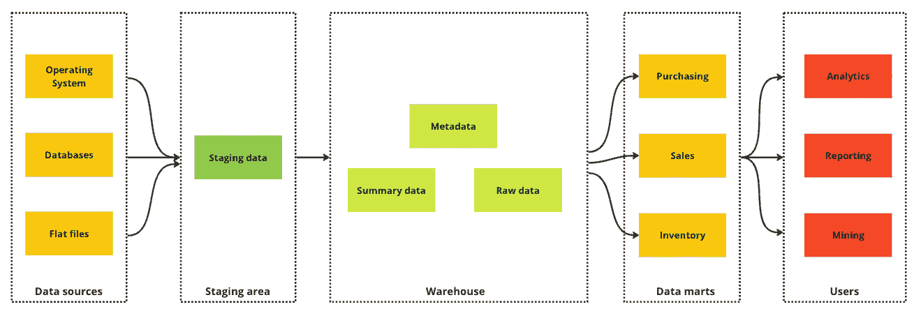

图 7.15 – 数据集市图

实施数据集市概念有许多好处，例如获取特定信息或确保在项目中对严格的数据片段进行临时访问，而无需管理多个用户对数据仓库的安全访问。

## 参考以下内容

在 Panoply.io 博客上了解更多关于数据集市和数据仓库概念：[`panoply.io/data-warehouse-guide/data-mart-vs-data-warehouse/`](https://panoply.io/data-warehouse-guide/data-mart-vs-data-warehouse/).

# 导入分区数据

数据分区的实践并非最近才出现。它在数据库中实现，用于在多个磁盘或表中分配数据。实际上，数据仓库可以根据数据内部的目的和使用情况来分区数据。您可以在此处了解更多信息：[`www.tutorialspoint.com/dwh/dwh_partitioning_strategy.htm`](https://www.tutorialspoint.com/dwh/dwh_partitioning_strategy.htm).

在我们的案例中，数据分区与我们的数据将被分割成小块并处理的方式有关。

在本配方中，我们将学习如何导入已分区数据以及它如何影响我们代码的性能。

## 准备工作

此配方需要初始化的 `SparkSession`。您可以创建自己的或使用本章开头提供的代码。

完成步骤所需的数据可以在此处找到：[`github.com/PacktPublishing/Data-Ingestion-with-Python-Cookbook/tree/main/Chapter_7/ingesting_partitioned_data`](https://github.com/PacktPublishing/Data-Ingestion-with-Python-Cookbook/tree/main/Chapter_7/ingesting_partitioned_data).

您可以使用 Jupyter 笔记本或 PySpark 壳会话来执行代码。

## 如何做…

使用以下步骤执行此配方：

1.  **创建 2 月数据的 DataFrame**：让我们使用从 Parquet 文件创建 DataFrame 的常规方法，但这次只传递我们想要读取的月份：

    ```py
    df_partitioned = spark.read.parquet("chapter7_partitioned_files/month=2/")
    ```

您应该看不到此执行的任何输出。

1.  **使用 pandas 显示结果**：一旦创建 DataFrame，我们可以使用 pandas 更好地可视化结果：

    ```py
    df_partitioned.toPandas()
    ```

你应该观察以下输出：

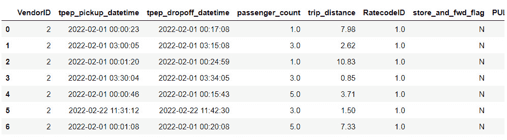

图 7.16 – 使用分区数据可视化黄色出租车行程 DataFrame

观察到在`tpep_pickup_datetime`列中，只有 2 月份的数据，现在我们不需要过分关注我们本地机器的处理能力。

## 它是如何工作的…

这是一个非常简单的配方，但有一些重要的概念我们需要稍微了解一下。

正如你所观察到的，所有的魔法都在 DataFrame 的创建过程中发生，我们不仅传递了存储 Parquet 文件的路径，还传递了包含月份参考的另一个子文件夹的名称。让我们看看以下截图中的文件夹是如何组织的：

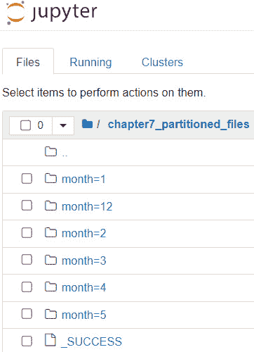

图 7.17 – 按月份分区的文件夹

注意

`_SUCCESS`文件表示分区写入过程已成功完成。

在`chapter7_partitioned_files`文件夹内，存在其他带有多个参考的子文件夹。这些子文件夹中的每一个代表一个分区，在这种情况下，按月份进行分类。

如果我们查看子文件夹内部，我们可以观察到一个或多个 Parquet 文件。参考以下截图：

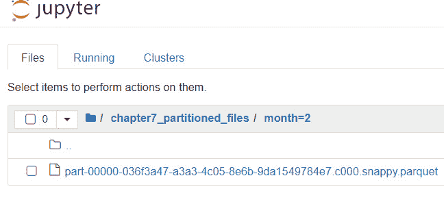

图 7.18 – 2 月份的 Parquet 文件

分区是从数据集中读取或写入特定数量数据的优化形式。这就是为什么这次使用 pandas 可视化 DataFrame 更快。

分区还使得转换的执行更快，因为数据将通过 Spark 内部工作节点之间的并行处理来处理。你可以在以下图中更好地可视化它：

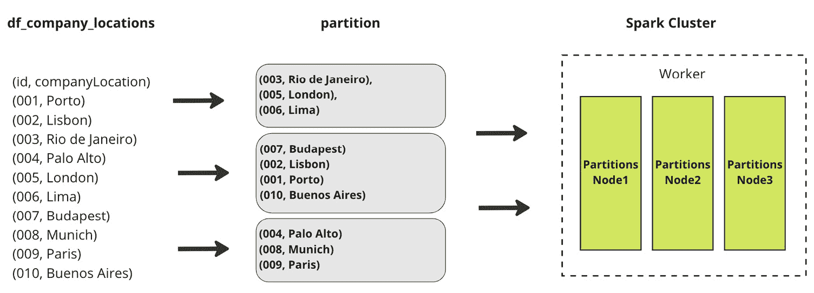

图 7.19 – 分区并行性图

## 更多内容…

正如我们所看到的，使用分区在大规模上保存数据带来了许多好处。然而，知道如何分区你的数据是高效读取和写入数据的关键。让我们列出编写分区时最重要的三个最佳实践：

+   `month`，但也可以对任何列进行分区，甚至可以使用包含年、月或日的列来提供更多粒度。通常，分区反映了检索数据最佳的方式。

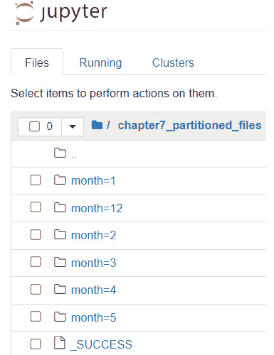

图 7.20 – 按月份分区文件夹

+   `SparkSession`配置或它将写入最终文件的位置，Spark 可以创建小的`parquet`/`avro`文件。从大数据规模的角度来看，读取这些小文件可能会影响性能。

一个好的做法是在调用`write()`函数时使用`coalesce()`来聚合文件成少量。以下是一个示例：

```py
df.coalesce(1).write.parquet('myfile/path')
```

你可以在这里找到一篇关于它的好文章：[`www.educba.com/pyspark-coalesce/`](https://www.educba.com/pyspark-coalesce/)。

+   **避免过度分区**：这与前面的逻辑相同。过度分区将创建小文件，因为我们使用粒度规则将它们分割，然后 Spark 的并行性会减慢。

## 参考以下内容

你可以在这里找到更多最佳实践：[`climbtheladder.com/10-spark-partitioning-best-practices/`](https://climbtheladder.com/10-spark-partitioning-best-practices/)。

与分区主题相关，我们还有*数据库分片*的概念。这是一个非常有趣的话题，MongoDB 官方文档中有一篇非常好的文章介绍它：[`www.mongodb.com/features/database-sharding-explained`](https://www.mongodb.com/features/database-sharding-explained)。

# 应用反向 ETL

正如其名所示，**反向 ETL**从数据仓库中提取数据并将其插入到如**HubSpot**或**Salesforce**这样的业务应用程序中。这样做的原因是为了使数据更具操作性，并使用业务工具为已经以分析或分析格式准备好的数据带来更多见解。

本食谱将教会我们如何构建反向 ETL 管道，以及常用的工具。

## 准备工作

本食谱没有技术要求。然而，鼓励使用白板或记事本来记录笔记。

在这里，我们将处理一个场景，即我们从**在线学习平台**中摄取数据。想象一下，我们收到了市场部门的请求，希望使用 Salesforce 系统更好地了解平台上的用户行为。

此处的目标将是创建一个从数据源到 Salesforce 平台的数据流过程图。

## 如何做…

为了使这个练习更直接，我们假设我们已经在数据库中存储了在线学习平台的数据：

1.  **从网站摄取用户行为数据**：让我们假设我们有一个前端 API，它将有关用户在在线学习平台上的行为和操作的有用信息发送到我们的后端数据库。参考以下图表，看看它是什么样子：

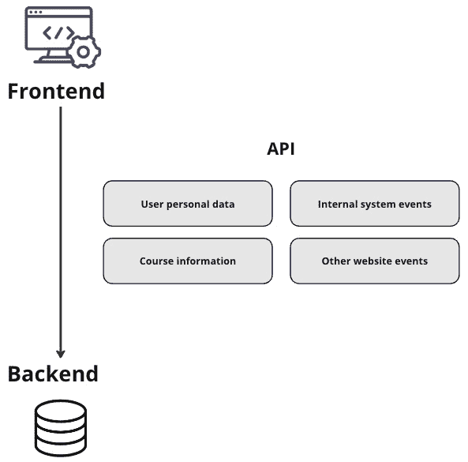

图 7.21 – 前端到后端 API 的数据流

1.  **使用 ETL 进行处理**：有了可用的数据，我们可以挑选出市场部门需要的信息，并将其放入 ETL 流程中。我们将从后端数据库中摄取它，应用所需的任何清洗或转换，然后将它加载到我们的数据仓库中。

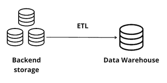

图 7.22 – 显示后端存储到数据仓库的图

1.  **在数据仓库中存储数据**：数据准备好并转换为分析格式后，它将被存储在数据仓库中。我们在这里不需要担心数据是如何建模的。让我们假设将创建一个新的分析表，专门用于此处理目的。

1.  **ETL 到 Salesforce**：一旦数据在数据仓库中填充，我们需要将其插入 Salesforce 系统中。如下图所示，让我们使用 PySpark 来完成这个操作：

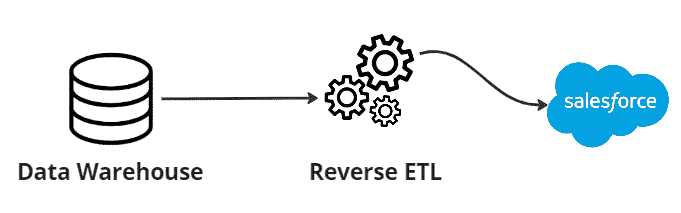

图 7.23 – 数据仓库数据流向 Salesforce

在 Salesforce 内部有数据的情况下，我们可以向营销团队提供建议，并自动化此过程，使其在必要的时间表上触发。

## 它是如何工作的……

虽然看起来很复杂，但反向 ETL 过程与数据摄取作业类似。在某些情况下，可能需要添加一些额外的转换以适应最终的应用模型，但这并不复杂。现在，让我们更详细地看看我们在配方中做了什么。

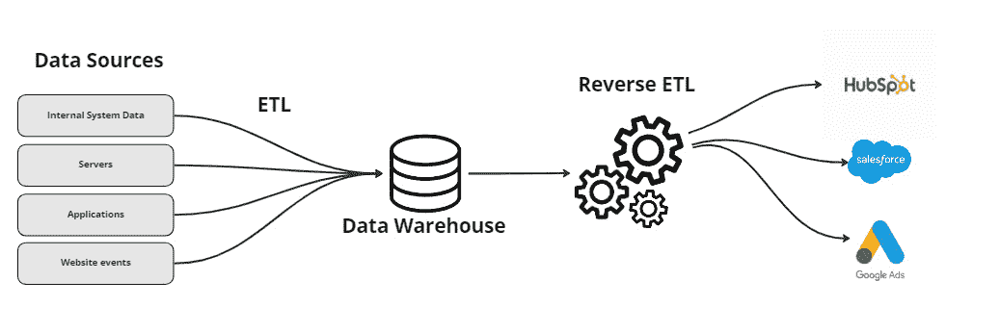

图 7.24 – 反向 ETL 概述

首先，我们需要了解我们是否已经在我们内部数据库中存储了所需的原始数据，以满足营销部门的需求。如果没有，数据团队负责联系负责的开发人员以验证如何完成这项工作。

一旦检查无误，我们就继续进行常规的 ETL 管道。通常，会有 SQL 转换来根据分析需求过滤或分组信息。然后，我们将它存储在*事实来源*中，例如主数据仓库。

在*步骤 4*中发生反向 ETL。这个名称的来源是因为，通常，ETL 过程涉及从应用程序（如 Salesforce）检索数据并将其存储在数据仓库中。然而，近年来，这些工具已成为更好地理解用户如何行为或与我们的应用程序交互的另一种形式。

通过以用户为中心的分析数据反馈解决方案，我们可以更好地了解并访问具体结果。除了 Salesforce 之外，另一个例子可以是**机器学习**解决方案，用于预测电子学习平台的一些变化是否会导致用户保留率的提高。

## 更多内容……

要执行反向 ETL，我们可以创建自己的解决方案或使用商业解决方案。市场上有很多解决方案可以从数据仓库中检索数据，并动态地与业务解决方案连接。一些还可以生成报告，向数据仓库提供反馈，从而提高发送信息的质量，甚至创建其他分析。这些工具的缺点是大多数都是付费解决方案，免费层通常包括一个或几个连接。

最常用的反向 ETL 工具之一是**Hightouch**；您可以在此处了解更多信息：[`hightouch.com/`](https://hightouch.com/).

## 另请参阅

你可以在*Astasia Myers*的 Medium 博客上了解更多关于反向 ETL 的信息：[`medium.com/memory-leak/reverse-etl-a-primer-4e6694dcc7fb`](https://medium.com/memory-leak/reverse-etl-a-primer-4e6694dcc7fb)。

# 选择用于反向 ETL 的分析数据

既然我们已经了解了反向 ETL 是什么，下一步就是了解哪些类型的分析数据适合加载到 Salesforce 应用程序中，例如。

这个菜谱从上一个菜谱“应用反向 ETL”继续，目的是展示一个决定将哪些数据传输到 Salesforce 应用程序的真实场景。

## 准备工作

这个菜谱没有技术要求，但你可以用白板或便签纸进行注释。

仍然以市场营销部门请求将数据加载到他们的 Salesforce 账户的情景为例，我们现在将进一步深入，看看哪些信息对他们的分析是相关的。

我们收到了市场营销团队的一个请求，希望了解电子学习平台中的用户旅程。他们想了解哪些课程被观看最多，以及是否有一些需要改进。目前，他们不知道我们后端数据库中有什么信息。

## 如何操作...

让我们分步骤来处理这个情景。这里的目的是了解我们需要哪些数据来完成这项任务：

1.  **咨询数据目录**：为了简化我们的工作，让我们假设我们的数据工程师已经创建了一个包含收集并存储在后端数据库中的用户信息的数据目录。在下面的图中，我们可以更好地看到信息是如何存储的：

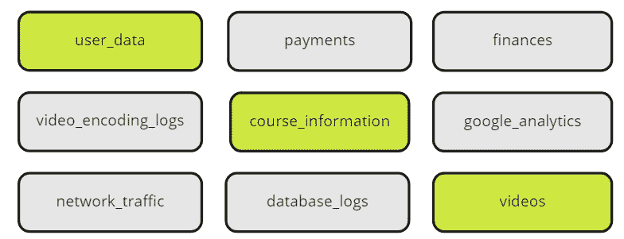

图 7.25 – 高亮显示的用于反向 ETL 的感兴趣表

如我们所见，有三个表可能包含需要检索的相关信息：`user_data`、`course_information`和`videos`。

1.  **选择原始数据**：在下面的图中，我们可以看到高亮显示的列可以提供分析所需的信息：

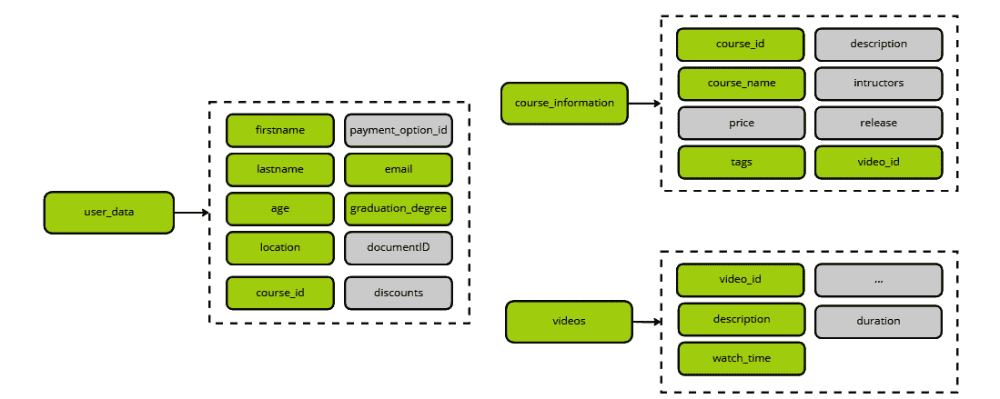

图 7.26 – 高亮显示的表及其相关列，这些列对反向 ETL 相关

1.  **转换和过滤数据**：由于我们需要一个单独的表来加载 Salesforce 中的数据，我们可以创建一个 SQL 过滤器并将信息连接起来。

## 它是如何工作的...

如同菜谱开头所述，市场营销团队希望了解电子学习应用中的用户旅程。首先，让我们了解一下什么是用户旅程。

用户旅程是指用户在系统或应用上执行的所有动作和交互，从他们选择使用或购买一项服务，直到他们登出或离开为止。在这种情况下，诸如他们观看的内容类型以及观看时长等信息非常重要。

让我们看看我们收集到的字段以及它们为什么重要。前六列将给我们一个关于用户和他们居住地的概念。我们可以在以后使用这些信息来查看内容偏好的任何模式。

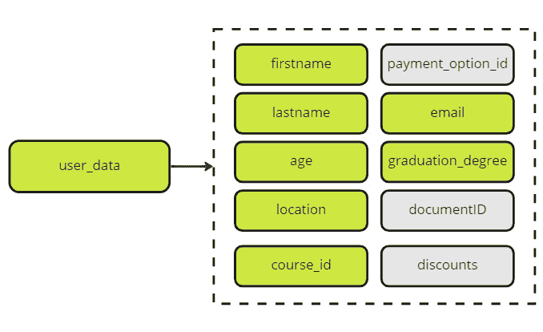

图 7.27 – 反向 ETL 的相关用户数据列

然后，最后几列提供了关于用户正在观看的内容以及内容类型之间是否存在任何关系的详细信息。例如，如果他们购买了一门 Python 课程和一门 SQL 课程，我们可以使用内容元数据中的一个标签（例如，`编程课程`）来创建一个相关性过滤器。

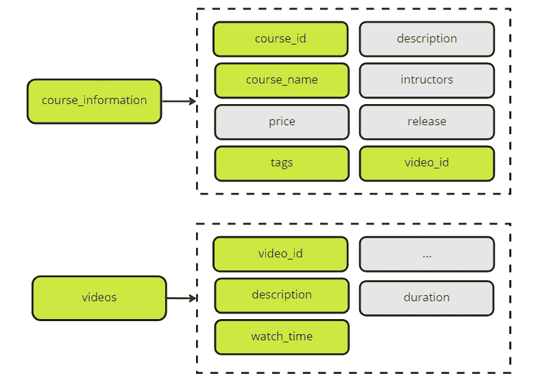

图 7.28 – 高亮显示列的课程信息和视频

将所有这些信息反馈到 Salesforce 可以帮助回答关于用户旅程的以下问题：

+   用户是否有在完成一个课程之前开始另一个课程的倾向？

+   用户是否倾向于同时观看多个课程？

+   教育团队是否需要因为高流失率而重新制定课程？

## 参见

在这里可以找到更多用例：[`www.datachannel.co/blogs/reverse-etl-use-cases-common-usage-patterns`](https://www.datachannel.co/blogs/reverse-etl-use-cases-common-usage-patterns)。

# 进一步阅读

这里有一份您可以参考的网站列表，以进一步扩展您的知识：

+   [`segment.com/blog/reverse-etl/`](https://segment.com/blog/reverse-etl/)

+   [`hightouch.com/blog/reverse-etl`](https://hightouch.com/blog/reverse-etl)

+   [`www.oracle.com/br/autonomous-database/what-is-data-mart/`](https://www.oracle.com/br/autonomous-database/what-is-data-mart/)

+   [`www.netsuite.com/portal/resource/articles/ecommerce/customer-lifetime-value-clv.shtml`](https://www.netsuite.com/portal/resource/articles/ecommerce/customer-lifetime-value-clv.shtml)

+   [`www.datachannel.co/blogs/reverse-etl-use-cases-common-usage-patterns`](https://www.datachannel.co/blogs/reverse-etl-use-cases-common-usage-patterns)

# 第二部分：结构化摄取管道

在本书的第二部分，您将了解监控实践，并了解如何使用市场上推荐的工具创建您自己的第一个数据摄取管道，同时应用最佳数据工程实践。

本部分包含以下章节：

+   *第八章*，*设计监控数据工作流*

+   *第九章*，*使用 Airflow 整合所有内容*

+   *第十章*，*在 Airflow 中记录和监控您的数据摄取*

+   *第十一章*，*自动化您的数据摄取管道*

+   *第十二章*，*使用数据可观察性进行调试、错误处理和预防停机*
