# 第九章：使用 Airflow 整合一切

到目前为止，我们已经涵盖了数据采集的不同方面和步骤。我们看到了如何配置和采集结构化和非结构化数据，什么是分析数据，以及如何改进日志以进行更有洞察力的监控和错误处理。现在是时候将这些信息组合起来，创建一个类似于真实世界项目的结构。

从现在开始，在接下来的章节中，我们将使用 Apache Airflow，这是一个开源平台，允许我们创建、调度和监控工作流程。让我们通过配置和理解 Apache Airflow 的基本概念以及这个工具的强大功能开始我们的旅程。

在本章中，您将了解以下主题：

+   配置 Airflow

+   创建 DAG

+   创建自定义操作符

+   配置传感器

+   在 Airflow 中创建连接器

+   创建并行数据采集任务

+   定义依赖数据采集的 DAG

到本章结束时，您将了解 Airflow 的最重要的组件以及如何配置它们，包括在此过程中解决相关问题的方法。

# 技术要求

您可以在此 GitHub 仓库中找到本章的代码：[`github.com/PacktPublishing/Data-Ingestion-with-Python-Cookbook`](https://github.com/PacktPublishing/Data-Ingestion-with-Python-Cookbook)

## 安装 Airflow

本章要求您在本地机器上安装 Airflow。您可以直接在您的**操作系统**（**OS**）上安装它，或者使用 Docker 镜像。有关更多信息，请参阅*第一章*中的*配置 Docker 用于 Airflow*配方。

# 配置 Airflow

**Apache Airflow** 具有许多功能和快速设置，这有助于我们以代码的形式开始设计我们的工作流程。随着我们工作流程和数据处理的进展，可能需要一些额外的配置。幸运的是，Airflow 有一个专门的文件，用于插入其他安排，而无需更改其核心中的任何内容。

在这个配方中，我们将了解更多关于 `airflow.conf` 文件的信息，如何使用它，以及执行本章中其他配方所需的其他有价值配置。我们还将介绍在哪里可以找到此文件，以及其他环境变量如何与此工具一起工作。在实践中理解这些概念有助于我们识别潜在的改进或解决问题。

## 准备工作

在继续代码之前，请确保您的 Airflow 运行正确。您可以通过检查此链接的 Airflow UI 来做到这一点：`http://localhost:8080`。

如果您像我一样使用 Docker 容器来托管您的 Airflow 应用程序，您可以使用以下命令在终端检查其状态：

```py
$ docker ps
```

这是输出：


图 9.1 – 运行的 Airflow Docker 容器

或者，您可以在 Docker Desktop 上检查容器状态，如下面的截图所示：


图 9.2 – Docker Desktop 中运行 Airflow 容器的视图

## 如何操作...

执行此食谱的步骤如下：

1.  让我们先安装 Airflow 的 MongoDB 附加提供程序。如果你使用的是`docker-compose.yaml`文件，打开它，并在`_PIP_ADDITIONAL_REQUIREMENTS`内添加`apache-airflow-providers-mongo`。你的代码将看起来像这样：

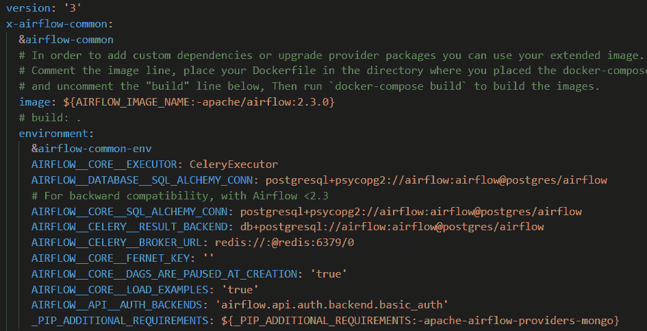

图 9.3 – 环境变量部分中的 docker-compose.yaml 文件

如果你直接在你的机器上托管 Airflow，你可以使用**PyPi**进行相同的安装：[`pypi.org/project/apache-airflow-providers-mongo/`](https://pypi.org/project/apache-airflow-providers-mongo/)。

1.  接下来，我们将创建一个名为`files_to_test`的文件夹，并在其中创建两个额外的文件夹：`output_files`和`sensors_files`。你目前不需要担心它的用途，因为它将在本章的后面使用。你的 Airflow 文件夹结构应该看起来像这样：

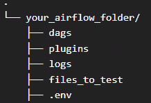

图 9.4 – Airflow 本地目录文件夹结构

1.  现在，让我们挂载 Docker 镜像的卷。如果你不是使用 Docker 托管 Airflow，可以跳过这部分。

在你的`docker-compose.yaml`文件中，在`volume`参数下，添加以下内容：

```py
- ./config/airflow.cfg:/usr/local/airflow/airflow.cfg
- ./files_to_test:/opt/airflow/files_to_test
```

你的最终`volumes`部分将看起来像这样：

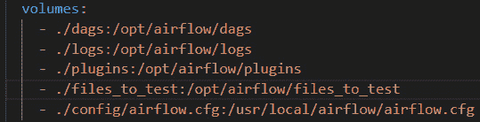

图 9.5 – docker-compose.yaml 的 volumes 部分

停止并重新启动你的容器，以便这些更改可以传播。

1.  最后，我们将修复`docker-compose.yaml`文件中的错误。这个错误的官方修复在 Airflow 官方文档中，因此没有包含在 Docker 镜像中。你可以在这里看到完整的问题和解决方案：[`github.com/apache/airflow/discussions/24809`](https://github.com/apache/airflow/discussions/24809)。

要修复错误，请转到`docker-compose`文件的`airflow-init`部分，并在`environment`参数内插入`_PIP_ADDITIONAL_REQUIREMENTS: ''`。你的代码将看起来像这样：

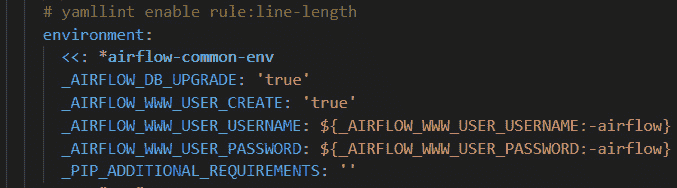

图 9.6 – docker-compose.yaml 中带有 PIP_ADDITIONAL_REQUIREMENTS 的环境变量部分

此操作将修复 GitHub 上注册的以下问题：[`github.com/apache/airflow/pull/23517`](https://github.com/apache/airflow/pull/23517)。

## 它是如何工作的...

这里展示的配置很简单。然而，它保证了应用程序将保持通过本章食谱的正常运行。

让我们从 *步骤 1* 中安装的软件包开始。与其他框架或平台一样，Airflow 也包含其 *电池*，这意味着它已经包含了各种软件包。但随着其知名度的提高，它开始需要其他类型的连接或操作符，这是开源社区负责的。

您可以在此处找到可以安装在 Airflow 上的已发布软件包列表：[`airflow.apache.org/docs/apache-airflow-providers/packages-ref.xhtml`](https://airflow.apache.org/docs/apache-airflow-providers/packages-ref.xhtml)。

在跳转到其他代码解释之前，让我们先了解 `docker-compose.yaml` 文件中的 `volume` 部分。这个配置允许 Airflow 看到哪些文件夹反映了 Docker 容器内部相应的文件夹，而无需每次都使用 Docker 命令上传代码。换句话说，我们可以同步添加我们的 **有向无环图** (**DAG**) 文件和新的操作符，并查看一些日志等，这些都会在容器内部反映出来。

接下来，我们声明了 Docker 挂载卷配置的两个部分：我们创建的新文件夹（`files_to_test`）和 `airflow.cfg` 文件。第一个将允许 Airflow 在容器内部复制 `files_to_test` 本地文件夹，这样我们就可以更简单地使用文件。否则，如果我们尝试在不挂载卷的情况下使用它，当尝试检索任何文件时，将会出现以下错误：

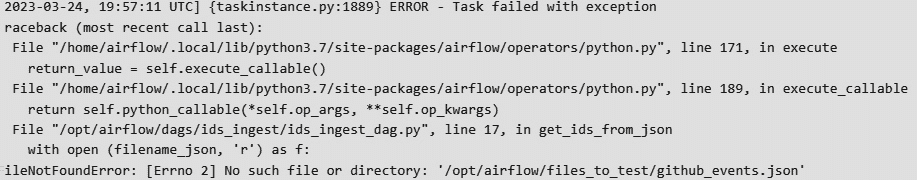

图 9.7 – 当文件夹未在容器卷中引用时 Airflow 中的错误

虽然我们现在不会使用 `airflow.cfg` 文件，但了解如何访问此文件以及它的用途是一个好的实践。此文件包含 Airflow 的配置，并且可以编辑以包含更多内容。通常，敏感数据存储在其中，以防止其他人不当访问，因为默认情况下，`airflow.cfg` 文件的内容在 UI 中无法访问。

注意

在更改或处理 `airflow.cfg` 文件时要非常小心。此文件包含所有必需的配置以及其他相关设置，以使 Airflow 运作。我们将在 *第十章** 中进一步探讨这个问题。

## 参见

有关 Docker 镜像的更多信息，请参阅以下文档页面：[`airflow.apache.org/docs/apache-airflow/stable/howto/docker-compose/index.xhtml`](https://airflow.apache.org/docs/apache-airflow/stable/howto/docker-compose/index.xhtml)。

# 创建 DAG

Airflow 的核心概念基于 DAG，它收集、分组和组织以特定顺序执行的任务。DAG 还负责管理其任务之间的依赖关系。简单来说，它不关心任务在做什么，而只是关心*如何*执行它。通常，DAG 从预定时间开始，但我们也可以定义其他 DAG 之间的依赖关系，以便它们根据其执行状态启动。

我们将在本食谱中创建我们的第一个 DAG，并设置它根据特定的计划运行。通过这一步，我们实际上进入了设计第一个工作流程。

## 准备就绪

请参考“准备就绪”部分中的“配置 Airflow”食谱，因为我们将使用相同的技术来处理它。

此外，让我们在 `dags` 文件夹内创建一个名为 `ids_ingest` 的目录。在 `ids_ingest` 文件夹内，我们将创建两个文件：`__init__.py` 和 `ids_ingest_dag.py`。最终的目录结构将如下所示：

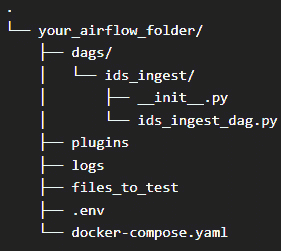

图 9.8 – 包含 ids_ingest DAG 的 Airflow 本地目录结构

## 如何做到这一点…

在这个练习中，我们将编写一个 DAG，用于检索 `github_events.json` 文件的 IDs。打开 `ids_ingest_dag.py`，让我们添加内容来编写我们的第一个 DAG：

1.  让我们先导入在这个脚本中将使用的库。我喜欢将 Airflow 库和 Python 库的导入分开，作为一种良好的实践：

    ```py
    from airflow import DAG
    from airflow.settings import AIRFLOW_HOME
    from airflow.operators.bash import BashOperator
    from airflow.operators.python_operator import PythonOperator
    import json
    from datetime import datetime, timedelta
    ```

1.  然后，我们将为我们的 DAG 定义 `default_args`，正如您在这里可以看到的：

    ```py
    # Define default arguments
    default_args = {
        'owner': 'airflow',
        'depends_on_past': False,
        'start_date': datetime(2023, 3, 22),
        'retries': 1,
        'retry_delay': timedelta(minutes=5)
    }
    ```

1.  现在，我们将创建一个 Python 函数，该函数接收 JSON 文件并返回其中的 IDs。由于这是一个小型函数，我们可以在 DAG 的文件中创建它：

    ```py
    def get_ids_from_json(filename_json):
        with open (filename_json, 'r') as f:
            git = json.loads(f.read())
        print([item['id'] for item in git])
    ```

1.  接下来，我们将实例化我们的 DAG 对象，并在其中定义两个操作符：一个 `BashOperator` 实例用于显示控制台消息，以及 `PythonOperator` 来执行我们刚刚创建的函数，如下所示：

    ```py
    # Instantiate a DAG object
    with DAG(
        dag_id='simple_ids_ingest',
        default_args=default_args,
        schedule_interval=timedelta(days=1),
    ) as dag:
        first_task = BashOperator(
                task_id="first_task",
                bash_command="echo $AIRFLOW_HOME",
            )
        filename_json = f"{AIRFLOW_HOME}/files_to_test/github_events.json"
        get_id_from_json = PythonOperator(
            task_id="get_id_from_json",
            python_callable=get_ids_from_json,
            op_args=[filename_json]
        )
    ```

确保在跳到下一步之前保存文件。

1.  现在，前往 Airflow UI。尽管 Airflow 团队提供了大量的 DAG 示例，但您应该寻找一个名为 `simple_ids_ingest` 的 DAG。您会注意到 DAG 未启用。点击切换按钮以启用它，您应该看到如下内容：


图 9.9 – 在 UI 上启用的 Airflow DAG

1.  一旦启用，DAG 将开始运行。点击 DAG 名称，将重定向到 DAG 的页面，如下面的截图所示：

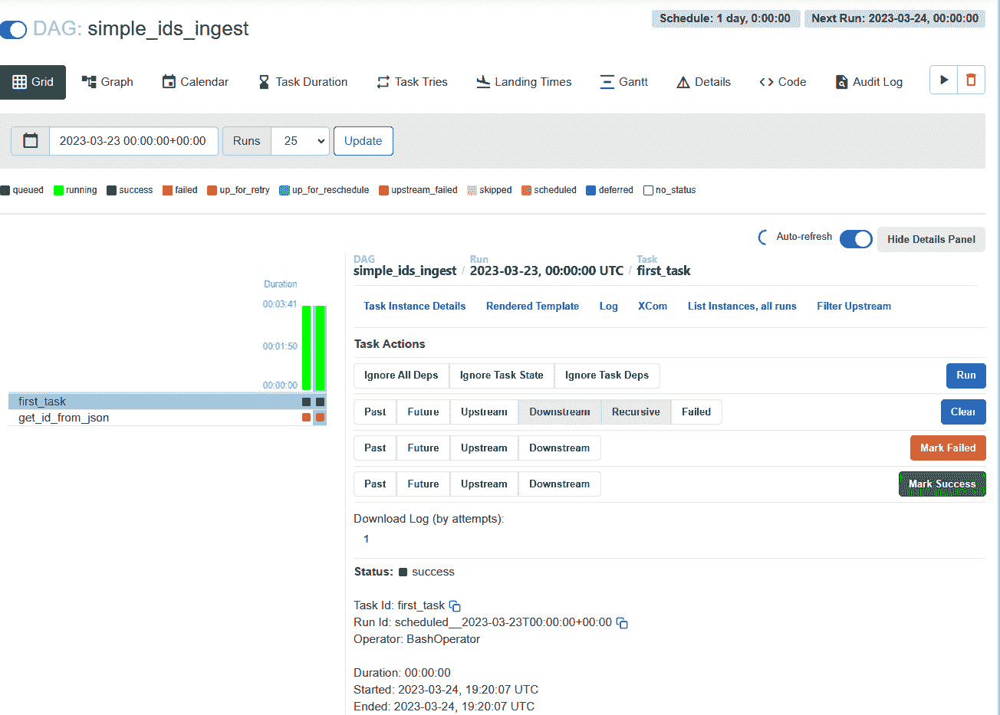

图 9.10 – DAG 网格页面视图

如果一切配置正确，您的页面应该看起来像这样：

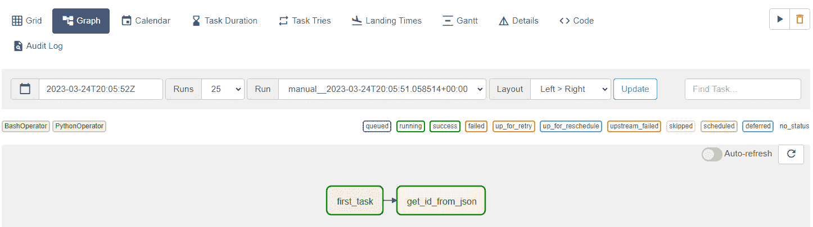

图 9.11 – 图形页面视图中的 DAG 成功运行

1.  然后，点击 `get_id_from_json` 任务。会出现一个小窗口，如下所示：

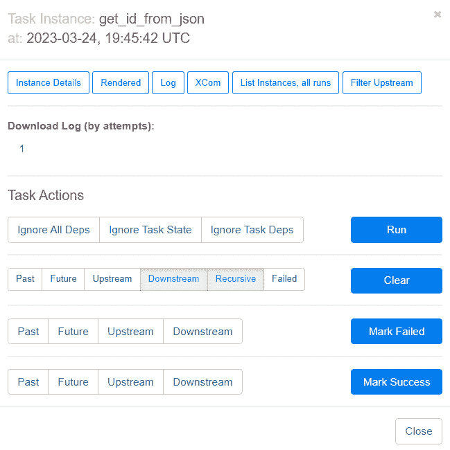

图 9.12 – 任务选项

1.  然后，点击**日志**按钮。您将被重定向到一个新页面，其中包含此任务的日志，如下所示：

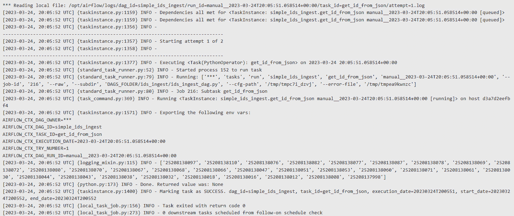

图 9.13 – Airflow UI 中的任务日志

如前一个屏幕截图所示，我们的任务成功完成并返回了我们预期的 ID。您可以在`AIRFLOW_CTX_DAG_RUN`消息下的`INFO`日志中看到结果。

## 它是如何工作的...

我们用几行代码创建了我们的第一个 DAG，用于检索并显示从 JSON 文件中获取的 ID 列表。现在，让我们了解它是如何工作的。

首先，我们在`dags`目录下创建了我们的文件。这是因为，默认情况下，Airflow 会将它里面的所有内容都理解为一个 DAG 文件。我们在其中创建的文件夹只是为了组织目的，Airflow 会忽略它。除了`ids_ingest_dag.py`文件外，我们还创建了一个`__init__.py`文件。此文件内部告诉 Airflow 查看这个文件夹。因此，您将看到以下结构：

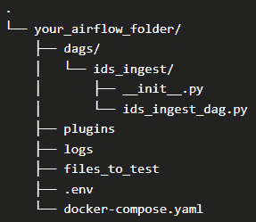

图 9.14 – 带有 ids_ingest DAG 的 Airflow 本地目录结构

注意

正如你可能想知道的，可以更改此配置，但我根本不推荐这样做，因为其他内部包可能依赖于它。只有在极端必要的情况下才这样做。

现在，让我们看看我们的实例化 DAG：

```py
with DAG(
    dag_id='simple_ids_ingest',
    default_args=default_args,
    schedule_interval=timedelta(days=1),
) as dag:
```

如您所观察到的，创建一个 DAG 很简单，其参数是自发的。`dag_id`至关重要，必须是唯一的；否则，它可能会造成混淆并与其他 DAG 合并。我们在*步骤 2*中声明的`default_args`将指导 DAG，告诉它何时需要执行，它的用户所有者，在失败情况下的重试次数以及其他有价值的参数。在`as dag`声明之后，我们插入了 bash 和 Python 运算符，并且它们必须缩进来被理解为 DAG 的任务。

最后，为了设置我们的工作流程，我们声明了以下行：

```py
first_task >> get_id_from_json
```

正如我们可能猜测的那样，它设置了任务执行的顺序。

## 更多内容...

我们看到了创建一个任务来执行 Python 函数和 bash 命令是多么容易。默认情况下，Airflow 附带了一些方便的运算符，可以在数据摄取管道中每天使用。更多信息，您可以参考官方文档页面：[`airflow.apache.org/docs/apache-airflow/stable/_api/airflow/operators/index.xhtml`](https://airflow.apache.org/docs/apache-airflow/stable/_api/airflow/operators/index.xhtml)。

### 任务、运算符、XCom 和其他

Airflow DAG 是一种强大的方式来分组和执行操作。除了我们在这里看到的任务和操作符之外，DAG 还支持其他类型的工作负载和跨其他任务或 DAG 的通信。不幸的是，由于这并不是本书的主要内容，我们不会详细涵盖这些概念，但我强烈建议您阅读官方文档：[`airflow.apache.org/docs/apache-airflow/stable/core-concepts/index.xhtml`](https://airflow.apache.org/docs/apache-airflow/stable/core-concepts/index.xhtml)。

### 错误处理

如果在构建此 DAG 时遇到任何错误，您可以使用 *步骤 7* 和 *步骤 8* 中的说明来调试它。您可以看到错误发生时任务的外观预览：

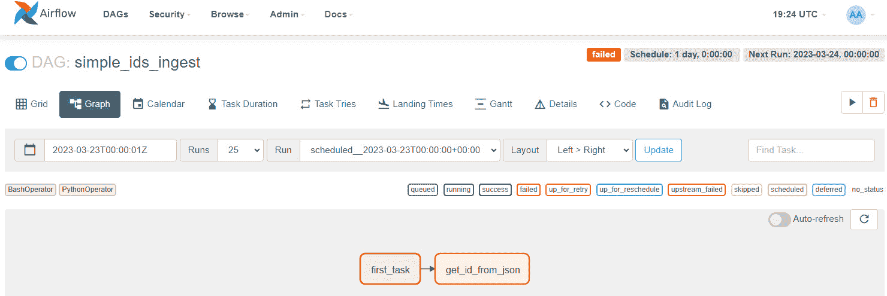

图 9.15 – DAG 图页面视图显示运行错误

## 参见

您可以在他们的官方 GitHub 页面找到 Airflow 示例 DAG 的代码：[`github.com/apache/airflow/tree/main/airflow/example_dags`](https://github.com/apache/airflow/tree/main/airflow/example_dags)。

# 创建自定义操作符

如前一个菜谱 *创建 DAG* 所见，创建一个没有实例化任务或换句话说，定义操作符的 DAG 几乎是不可能的。操作符负责在管道中处理数据所需的逻辑。

我们还知道 Airflow 已经有预定义的操作符，允许以数十种方式摄取和处理数据。现在，是时候将创建自定义操作符的实践付诸实施了。自定义操作符允许我们将特定的逻辑应用于相关项目或数据管道。

在本菜谱中，您将学习如何创建一个简单的自定义操作符。虽然它非常基础，但您将能够将此技术的基石应用于不同的场景。

在本菜谱中，我们将创建一个自定义操作符来连接并从 HolidayAPI 检索数据，就像我们在 *第二章* 中看到的那样。

## 准备工作

请参阅 *准备工作* 部分，该部分在 *配置 Airflow* 菜单中，因为我们将使用相同的技术来处理它。

我们还需要添加一个环境变量来存储我们的 API 密钥。为此，在 Airflow UI 的 **Admin** 菜单下选择 **Variable** 项，然后您将被重定向到所需页面。现在，点击 **+** 按钮添加一个新变量，如下所示：

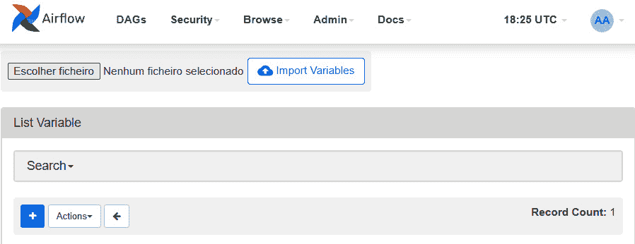

图 9.16 – Airflow UI 中的变量页面

在 **Key** 字段下的 `SECRET_HOLIDAY_API` 和 **Value** 字段下的您的 API 密钥。使用您在 *第二章* 中执行 *使用 API 认证检索数据* 菜单时使用的相同值。保存它，然后您将被重定向到 **Variables** 页面，如下面的截图所示：

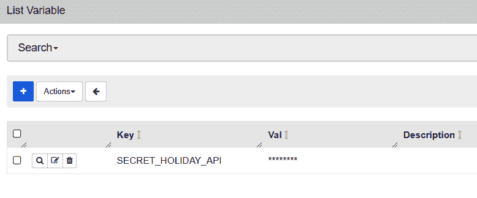

图 9.17 – 带有存储 HolidayAPI 密钥的新变量的 Airflow UI

现在，我们已准备好创建我们的自定义操作符。

## 如何做到这一点…

我们将用于创建自定义操作符的代码与我们在 *第二章* 的 *使用 API 认证检索数据* 菜单中看到的代码相同，但进行了一些修改以适应 Airflow 的要求。以下是它的步骤：

1.  让我们从在 `plugins` 文件夹内创建结构开始。由于我们想要创建一个自定义操作符，我们需要创建一个名为 `operators` 的文件夹，我们将在这里放置一个名为 `holiday_api_plugin.py` 的 Python 文件。您的文件树应该看起来像这样：

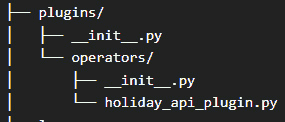

图 9.18 – Airflow 插件文件夹的本地目录结构

1.  我们将在 `holiday_api_plugin.py` 中创建一些代码，从库导入和声明一个全局变量开始，该变量用于指定我们的文件输出需要放置的位置：

    ```py
    from airflow.settings import AIRFLOW_HOME
    from airflow.models.baseoperator import BaseOperator
    import requests
    import json
    file_output_path = f"{AIRFLOW_HOME}/files_to_test/output_files/"
    ```

1.  然后，我们需要创建一个 Python 类，声明其构造函数，并最终将 *第二章* 中的确切代码插入到名为 `execute` 的函数中：

    ```py
    class HolidayAPIIngestOperator(BaseOperator):
        def __init__(self, filename, secret_key, country, year, **kwargs):
            super().__init__(**kwargs)
            self.filename = filename
            self.secret_key = secret_key
            self.country = country
            self.year = year
        def execute(self, context):
            params = { 'key': self.secret_key,
                    'country': self.country,
                    'year': self.year
            }
            url = "https://holidayapi.com/v1/holidays?"
            output_file = file_output_path + self.filename
            try:
                req = requests.get(url, params=params)
                print(req.json())
                with open(output_file, "w") as f:
                    json.dump(req.json(), f)
                return "Holidays downloaded successfully"
            except Exception as e:
                raise e
    ```

保存文件，我们的操作符就准备好了。现在，我们需要创建 DAG 来执行它。

1.  使用与 *创建 DAG* 菜单相同的逻辑，我们将创建一个名为 `holiday_ingest_dag.py` 的文件。您的新 DAG 目录树应该看起来像这样：

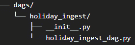

图 9.19 – holiday_ingest DAG 文件夹的 Airflow 目录结构

1.  现在，让我们将我们的 DAG 代码插入到 `holiday_ingest_dag.py` 文件中并保存：

    ```py
    from airflow import DAG
    # Other imports
    from operators.holiday_api_plugin import HolidayAPIIngestOperator
    # Define default arguments
    # Instantiate a DAG object
    with DAG(
        dag_id='holiday_ingest',
        default_args=default_args,
        schedule_interval=timedelta(days=1),
    ) as dag:
        filename_json = f"holiday_brazil.json"
        task = HolidayAPIIngestOperator(
            task_id="holiday_api_ingestion",
            filename=filename_json,
            secret_key=Variable.get("SECRET_HOLIDAY_API"),
            country="BR",
            year=2022
        )
    task
    ```

对于完整代码，请参阅以下 GitHub 仓库：[`github.com/PacktPublishing/Data-Ingestion-with-Python-Cookbook/tree/main/Chapter_9/creating_custom_operators`](https://github.com/PacktPublishing/Data-Ingestion-with-Python-Cookbook/tree/main/Chapter_9/creating_custom_operators)。

1.  然后，转到 Airflow UI，查找 `holiday_ingest` DAG，并启用它。它将看起来像以下图所示：


图 9.20 – 在 Airflow UI 中启用的 holiday_ingest DAG

您的工作将立即开始。

1.  现在，让我们按照 *创建 DAG* 菜单中的相同步骤查找任务日志，但现在点击 `holiday_api_ingestion` 任务。您的日志页面应该看起来像以下图所示：

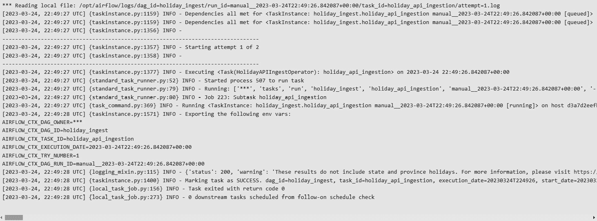

图 9.21 – holiday_api_ingestion 任务日志

1.  最后，让我们看看输出文件是否成功创建。前往 `files_to_test` 文件夹，点击 `output_files` 文件夹，如果一切配置成功，里面将包含一个名为 `holiday_brazil.json` 的文件。参见以下图示以供参考：


图 9.22 – output_files 截图中的 holiday_brazil.json

输出文件的开始部分应如下所示：

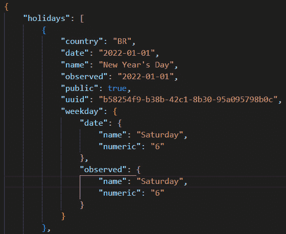

图 9.23 – holiday_brazil.json 的第一行

## 它是如何工作的…

如您所见，自定义 Airflow 操作符是一个具有独特目的的独立类。通常，自定义操作符是为了被其他团队或 DAG 使用而创建的，这避免了代码冗余或重复。现在，让我们了解它是如何工作的。

我们通过在 `plugin` 文件夹内创建用于托管新操作符的文件来开始配方。我们这样做是因为，从内部来看，Airflow 理解它内部的一切都是自定义代码。由于我们只想创建一个操作符，所以我们将其放在一个具有相同名称的文件夹中。然而，也可以创建另一个名为 **Hooks** 的资源。您可以在以下位置了解更多关于在 Airflow 中创建钩子的信息：[`airflow.apache.org/docs/apache-airflow/stable/howto/custom-operator.xhtml`](https://airflow.apache.org/docs/apache-airflow/stable/howto/custom-operator.xhtml)。

现在，让我们转向操作符代码，我们在这里声明我们的代码，在类中摄入 HolidayAPI，正如您在这里可以看到的：

```py
class HolidayAPIIngestOperator(BaseOperator):
    def __init__(self, filename, secret_key, country, year, **kwargs):
        super().__init__(**kwargs)
        self.filename = filename
        self.secret_key = secret_key
        self.country = country
        self.year = year
```

我们这样做是为了扩展 Airflow 的 `BaseOperator`，以便我们可以自定义它并插入新的构造函数。`filename`、`secret_key`、`country` 和 `year` 是执行 API 摄入所需的参数。

然后，我们声明了 `execute` 函数来从 API 摄入数据。上下文是一个 Airflow 参数，允许函数读取配置值：

```py
def execute(self, context):
```

然后，我们的最后一步是创建一个 DAG 来执行我们制作的操作符。代码类似于我们在“创建 DAGs”配方中创建的之前的 DAG，只是增加了一些新项目。第一个项目是新的 `import` 实例，正如您在这里可以看到的：

```py
from airflow.models import Variable
from operators.holiday_api_plugin import HolidayAPIIngestOperator
```

第一个 `import` 语句允许我们使用通过 UI 插入的 `SECRET_HOLIDAY_API` 的值，第二个导入了我们的自定义操作符。注意，我们只使用了 `operators.holiday_api_plugin` 路径。由于 Airflow 的内部配置，它理解 `operators` 文件夹（位于 `plugins` 文件夹内）中的代码是一个操作符。

现在，我们可以通过传递所需的参数，像在 Airflow 中使用任何内置操作符一样实例化自定义操作符，正如代码所示：

```py
task = HolidayAPIIngestOperator(
        task_id="holiday_api_ingestion",
        filename=filename_json,
        secret_key=Variable.get("SECRET_HOLIDAY_API"),
        country="BR",
        year=2022)
```

## 还有更多…

如果整个项目在从特定 API 或数据库检索数据时具有相同的身份验证形式，创建自定义操作符或钩子是避免代码重复的有价值方式。

然而，在兴奋地开始创建你的插件之前，请记住，Airflow 社区已经提供了许多操作符。例如，如果你在日常工作中使用 AWS，你不需要担心创建一个新的操作符来连接 AWS Glue，因为那已经由 Apache 社区完成并批准。请参阅以下文档：[`airflow.apache.org/docs/apache-airflow-providers-amazon/stable/operators/glue.xhtml`](https://airflow.apache.org/docs/apache-airflow-providers-amazon/stable/operators/glue.xhtml)。

你可以在这里看到 AWS 操作符的完整列表：[`airflow.apache.org/docs/apache-airflow-providers-amazon/stable/operators/index.xhtml`](https://airflow.apache.org/docs/apache-airflow-providers-amazon/stable/operators/index.xhtml)。

## 参见

对于更多自定义操作符示例，请参阅以下 Virajdatt Kohir 的博客：[`kvirajdatt.medium.com/airflow-writing-custom-operators-and-publishing-them-as-a-package-part-2-3f4603899ec2`](https://kvirajdatt.medium.com/airflow-writing-custom-operators-and-publishing-them-as-a-package-part-2-3f4603899ec2)。

# 配置传感器

在操作符的伞下，我们有传感器。传感器被设计成等待直到某个事件发生才执行任务。例如，当文件落在`HDFS`文件夹中时，传感器会触发管道（或任务），如下所示：[`airflow.apache.org/docs/apache-airflow-providers-apache-hdfs/stable/_api/airflow/providers/apache/hdfs/sensors/hdfs/index.xhtml`](https://airflow.apache.org/docs/apache-airflow-providers-apache-hdfs/stable/_api/airflow/providers/apache/hdfs/sensors/hdfs/index.xhtml)。你可能想知道，也有针对特定时间表或时间差的传感器。

传感器是创建自动化和事件驱动管道的基本部分。在这个菜谱中，我们将配置一个`weekday`传感器，它会在一周中的特定一天执行我们的数据管道。

## 准备工作

由于我们将使用相同的技术来处理它，因此请参考“准备工作”部分中的“配置 Airflow”菜谱。

此外，让我们将一个 JSON 文件放入 Airflow 文件夹内的以下路径：`files_to_test/sensors_files/`。

在我的情况下，我将使用`github_events.json`文件，但你也可以使用你喜欢的任何文件。

## 如何操作…

这里是执行此菜谱的步骤：

1.  让我们从导入所需的库、定义`default_args`和实例化我们的 DAG 开始编写我们的 DAG 脚本，如下所示：

    ```py
    from airflow import DAG
    from airflow.settings import AIRFLOW_HOME
    from airflow.operators.bash import BashOperator
    from airflow.sensors.weekday import DayOfWeekSensor
    from airflow.utils.weekday import WeekDay
    from datetime import datetime, timedelta
    default_args = {
        'owner': 'airflow',
        'start_date': datetime(2023, 3, 22),
        'retry_delay': timedelta(minutes=5)
    }
    # Instantiate a DAG object
    with DAG(
        dag_id='sensors_move_file',
        default_args=default_args,
        schedule_interval="@once",
    ) as dag:
    ```

1.  现在，让我们使用`DayOfWeekSensor`定义我们的第一个任务。代码如下：

    ```py
        move_file_on_saturdays = DayOfWeekSensor(
            task_id="move_file_on_saturdays",
            timeout=120,
            soft_fail=True,
            week_day=WeekDay.SATURDAY
        )
    ```

我建议在执行此练习时设置一周中的某一天作为参数，以确保没有混淆。例如，如果你想它在星期一执行，将`week_day`设置为`WeekDay.MONDAY`，依此类推。

1.  然后，我们将使用`BashOperator`定义另一个任务。这个任务将执行将 JSON 文件从`files_to_test/sensors_files/`移动到`files_to_test/output_files/`的命令。你的代码应该看起来像这样：

    ```py
        move_file_task = BashOperator(
                task_id="move_file_task",
                bash_command="mv $AIRFLOW_HOME/files_to_test/sensors_files/*.json $AIRFLOW_HOME/files_to_test/output_files/",
            )
    ```

1.  然后，我们将定义我们的 DAG 的执行工作流程，正如你所看到的：

    ```py
    move_file_on_saturdays.set_downstream(move_file_task)
    ```

`.set_downstream()` 函数的工作方式将与我们已经用来定义工作流的两个箭头（`>>`）类似。你可以在这里了解更多信息：[`airflow.apache.org/docs/apache-airflow/1.10.3/concepts.xhtml?highlight=trigger#bitshift-composition`](https://airflow.apache.org/docs/apache-airflow/1.10.3/concepts.xhtml?highlight=trigger#bitshift-composition).

1.  如同本章前两个食谱所示，现在我们将启用我们的 `sensors_move_file` DAG，它将立即启动。如果你将工作日设置为执行此练习的同一日，你的 DAG **图形** 视图将看起来像这样，表示成功：

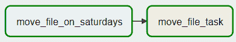

图 9.24 – sensors_move_file 任务显示成功状态

1.  现在，让我们看看我们的文件是否已移动到目录中。正如 *准备就绪* 部分所述，我在 `sensor_files` 文件夹中放置了一个名为 `github_events.json` 的 JSON 文件。现在，它将位于 `output_files` 中，正如你所看到的：

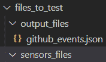

图 9.25 – output_files 文件夹内的 github_events.json

这表明我们的传感器按预期执行了！

## 它是如何工作的……

传感器是有价值的操作符，根据状态执行动作。它们可以在文件进入目录、白天、外部任务完成等情况下触发。在这里，我们使用数据团队常用的一天作为示例，将文件从摄取文件夹移动到冷存储文件夹。

传感器依赖于一个名为 `poke` 的内部方法，它将检查资源的状态，直到满足条件。如果你查看 `move_file_on_saturday` 日志，你会看到类似以下内容：

```py
[2023-03-25, 00:19:03 UTC] {weekday.py:83} INFO - Poking until weekday is in WeekDay.SATURDAY, Today is SATURDAY
[2023-03-25, 00:19:03 UTC] {base.py:301} INFO - Success criteria met. Exiting.
[2023-03-25, 00:19:03 UTC] {taskinstance.py:1400} INFO - Marking task as SUCCESS. dag_id=sensors_move_file, task_id=move_file_on_saturdays, execution_date=20230324T234623, start_date=20230325T001903, end_date=20230325T001903
[2023-03-25, 00:19:03 UTC] {local_task_job.py:156} INFO - Task exited with return code 0
```

观察以下代码，我们没有定义 `reschedule` 参数，因此作业将停止，直到我们手动再次触发它：

```py
    move_file_on_saturdays = DayOfWeekSensor(
        task_id="move_file_on_saturdays",
        timeout=120,
        soft_fail=True,
        week_day=WeekDay.SATURDAY
    )
```

我们定义的其他参数包括 `timeout`，它表示在失败或停止重试之前的时间（以秒为单位），以及 `soft_fail`，它将任务标记为 `SKIPPED` 以表示失败。

你可以在这里看到其他允许的参数：[`airflow.apache.org/docs/apache-airflow/stable/_api/airflow/sensors/base/index.xhtml`](https://airflow.apache.org/docs/apache-airflow/stable/_api/airflow/sensors/base/index.xhtml).

当然，就像其他操作符一样，我们可以通过扩展 Airflow 中的 `BaseSensorOperator` 类来创建我们的自定义传感器。这里的挑战主要是，为了被视为传感器，它需要覆盖 `poke` 参数，而不创建递归或无限循环的功能。

## 参见

您可以在官方文档页面这里看到默认的 Airflow 传感器的列表：[`airflow.apache.org/docs/apache-airflow/stable/_api/airflow/sensors/index.xhtml`](https://airflow.apache.org/docs/apache-airflow/stable/_api/airflow/sensors/index.xhtml)。

# 在 Airflow 中创建连接器

没有连接到任何外部源就拥有 DAGs 和操作符是没有用的。当然，有很多方法可以摄取文件，甚至来自其他 DAGs 或任务结果。然而，数据摄取通常涉及使用外部源，如 API 或数据库作为数据管道的第一步。

为了实现这一点，在这个菜谱中，我们将了解如何在 Airflow 中创建连接器以连接到示例数据库。

## 准备工作

由于我们将使用相同的技术来处理它，因此请参考 *Configuring Airflow* 菜谱中的 *Getting ready* 部分。

这个练习还需要 MongoDB 本地数据库处于运行状态。请确保您已按照 *第一章* 中的说明进行配置，并且至少有一个数据库和集合。您可以使用 *第五章* 中 *连接到 NoSQL 数据库 (MongoDB)* 菜单中的说明。

## 如何做到这一点...

执行此菜谱的步骤如下：

1.  让我们从打开 Airflow UI 开始。在顶部菜单中，选择 **Admin** 按钮，然后选择 **Connections**，您将被重定向到 **Connections** 页面。由于我们还没有进行任何配置，这个页面将是空的，正如您在下面的屏幕截图中所看到的：


图 9.26 – Airflow UI 中的连接页面

1.  然后，点击 **+** 按钮将被重定向到 **Add Connection** 页面。在 **Connection Type** 字段下，搜索并选择 **MongoDB**。在相应的字段下插入您的连接值，如以下屏幕截图所示：

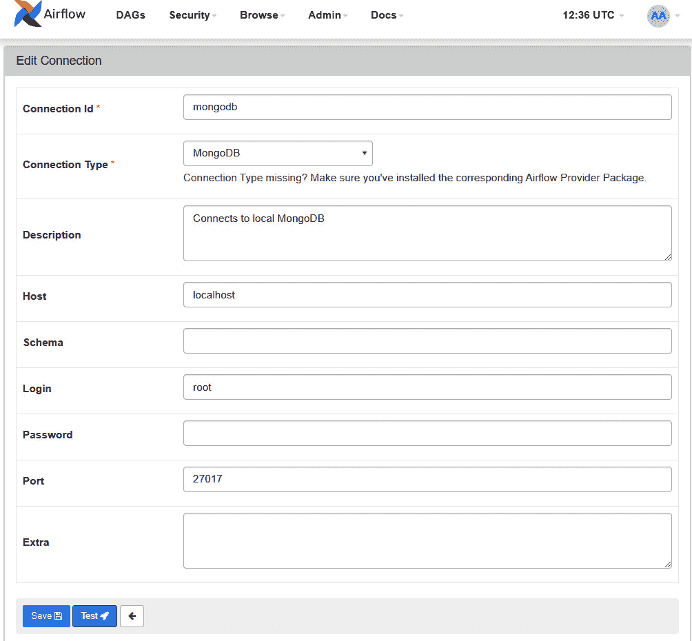

图 9.27 – 在 Airflow UI 中创建新的连接器

点击 **Save** 按钮，您应该在 **Connection** 页面上看到类似的内容：

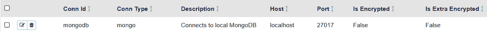

图 9.28 – 在 Airflow UI 中创建的 MongoDB 连接器

1.  让我们使用与我们在 *创建 DAGs* 菜谱中看到的相同的文件夹和文件树结构创建我们的新 DAG。我将称这个 `mongodb_check_conn_dag.py` DAG 文件。

1.  在 DAG 文件内部，让我们首先导入和声明所需的库和变量，正如您在这里所看到的：

    ```py
    from airflow import DAG
    from airflow.settings import AIRFLOW_HOME
    from airflow.providers.mongo.hooks.mongo import MongoHook
    from airflow.operators.python import PythonOperator
    import os
    import json
    from datetime import datetime, timedelta
    default_args = {
        'owner': 'airflow',
        'depends_on_past': False,
        'start_date': datetime(2023, 3, 22),
        'retries': 1,
        'retry_delay': timedelta(minutes=5)
    }
    ```

1.  现在，我们将创建一个函数来连接本地 MongoDB 并从 `db_airbnb` 数据库中打印 `collection` `reviews`，正如您在这里所看到的：

    ```py
    def get_mongo_collection():
        hook = MongoHook(conn_id ='mongodb')
        client = hook.get_conn()
        print(client)
        print( hook.get_collection(mongo_collection="reviews", mongo_db="db_airbnb"))
    ```

1.  然后，让我们继续处理 DAG 对象：

    ```py
    # Instantiate a DAG object
    with DAG(
        dag_id='mongodb_check_conn',
        default_args=default_args,
        schedule_interval=timedelta(days=1),
    ) as dag:
    ```

1.  最后，让我们使用 `PythonOperator` 来调用我们在 *步骤 5* 中定义的 `get_mongo_collection` 函数：

    ```py
        mongo_task = PythonOperator(
            task_id='mongo_task',
            python_callable=get_mongo_collection
        )
    ```

不要忘记将您的任务名称放在 DAG 的缩进中，如下所示：

```py
mongo_task
```

1.  转到 Airflow UI，让我们启用 DAG 并等待其执行。成功完成后，您的 `mongodb_task` 日志应如下所示：

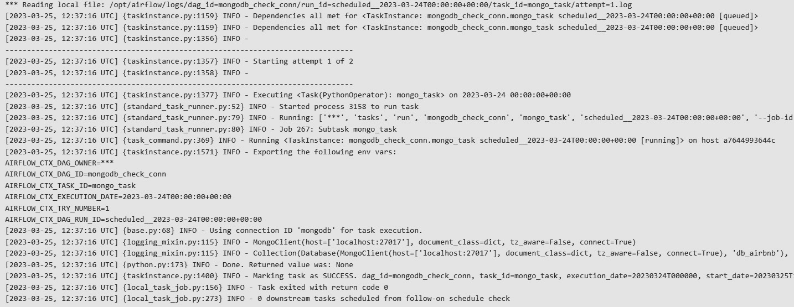

图 9.29 – mongodb_task 日志

如您所见，我们已经连接并从 MongoDB 中检索了 `Collection` 对象。

## 它是如何工作的...

在 Airflow 中创建连接非常简单，就像这里使用 UI 展示的那样。也可以使用 `Connection` 类编程创建连接。

在我们设置了 MongoDB 连接参数后，我们需要创建一个表单来访问它，我们使用钩子做到了这一点。**钩子**是一个高级接口，允许连接到外部源，而无需担心低级代码或特殊库。

记住，我们在 *配置 Airflow* 的配方中配置了一个外部包？它是一个提供程序，允许轻松连接到 MongoDB：

```py
from airflow.providers.mongo.hooks.mongo import MongoHook
```

在 `get_mongo_collection` 函数中，我们实例化了 `MongoHook` 并传递了在 `Connection` 页面上设置的相同连接 ID 名称，正如您在这里所看到的：

```py
hook = MongoHook(conn_id ='mongodb')
```

使用该实例，我们可以调用 `MongoHook` 类的方法，甚至可以传递其他参数来配置连接。有关此类文档，请参阅此处：[`airflow.apache.org/docs/apache-airflow-providers-mongo/stable/_api/airflow/providers/mongo/hooks/mongo/index.xhtml`](https://airflow.apache.org/docs/apache-airflow-providers-mongo/stable/_api/airflow/providers/mongo/hooks/mongo/index.xhtml)。

## 还有更多...

您还可以使用 `airflow.cfg` 文件来设置连接字符串或任何其他环境变量。将敏感信息（如凭证）存储在此处是一个好习惯，因为它们不会在 UI 中显示。还可能通过额外的配置对这些值进行加密。

更多信息，请参阅此处文档：[`airflow.apache.org/docs/apache-airflow/stable/howto/set-config.xhtml`](https://airflow.apache.org/docs/apache-airflow/stable/howto/set-config.xhtml)。

## 参见

+   您可以在 Airflow 官方文档页面了解有关 MongoDB 提供程序的更多信息：[`airflow.apache.org/docs/apache-airflow-providers-mongo/stable/_api/airflow/providers/mongo/index.xhtml`](https://airflow.apache.org/docs/apache-airflow-providers-mongo/stable/_api/airflow/providers/mongo/index.xhtml)

+   如果您想了解更多关于连接的信息，请参阅此链接：https://airflow.apache.org/docs/apache-airflow/stable/howto/connection.xhtml#custom-connection-types

# 创建并行摄取任务

当处理数据时，我们很少一次只执行一个摄取操作，现实世界的项目通常涉及许多同时发生的摄取操作，通常是并行的。我们知道可以安排两个或更多 DAG 同时运行，但一个 DAG 内部的任务呢？

本食谱将说明如何在 Airflow 中创建并行任务执行。

## 准备工作

请参考 *准备工作* 部分，该部分在 *配置 Airflow* 食谱中，因为我们将使用相同的技术来处理它。

为了避免在这个练习中产生冗余，我们不会明确包含导入和主 DAG 配置。相反，重点是组织操作符的工作流程。你可以使用与 *创建* *DAG* 食谱中相同的逻辑来创建你的 DAG 结构。

对于这里使用的完整 Python 文件，请访问 GitHub 页面：[`github.com/PacktPublishing/Data-Ingestion-with-Python-Cookbook/tree/main/Chapter_9/creating_parallel_ingest_tasks`](https://github.com/PacktPublishing/Data-Ingestion-with-Python-Cookbook/tree/main/Chapter_9/creating_parallel_ingest_tasks)。

## 如何做…

对于这个练习，我的 DAG 将被称为 `parallel_tasks_dag`。现在，让我们试试看：

1.  让我们从创建五个 `BashOperator` 实例开始，如下所示：

    ```py
    # (DAG configuration above)
        t_0 = BashOperator(
                task_id="t_0",
                bash_command="echo 'This tasks will be executed first'",
            )
        t_1 = BashOperator(
                task_id="t_1",
                bash_command="echo 'This tasks no1 will be executed in parallel with t_2 and t_3'",
            )
        t_2 = BashOperator(
                task_id="t_2",
                bash_command="echo 'This tasks no2 will be executed in parallel with t_1 and t_3'",
            )
        t_3 = BashOperator(
                task_id="t_3",
                bash_command="echo 'This tasks no3 will be executed in parallel with t_1 and t_2'",
            )
        t_final = BashOperator(
            task_id="t_final",
            bash_command="echo 'Finished all tasks in parallel'",
        )
    ```

1.  策略是让其中三个并行执行，因此它们将位于方括号内。第一个和最后一个任务将具有与我们在 *创建 DAG* 章节中看到的相同的流程声明，使用 `>>` 字符。最终的流程结构将如下所示：

    ```py
    t_0 >> [t_1, t_2, t_3] >> t_final
    ```

1.  最后，启用你的 DAG，让我们看看它在 DAG **图形** 页面上看起来像什么。它应该类似于以下图：

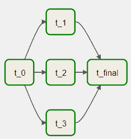

图 9.30 – Airflow 中的 parallel_tasks_dag 任务

如你所见，方括号内的任务以并行方式显示，将在 `t_0` 完成其工作后开始。

## 它是如何工作的…

虽然在 DAG 内创建并行任务很简单，但这种工作流程安排在处理数据时具有优势。

考虑一个数据摄取的例子：我们需要保证在移动到下一个管道阶段之前，我们已经摄取了所有期望的端点。以下图作为参考：

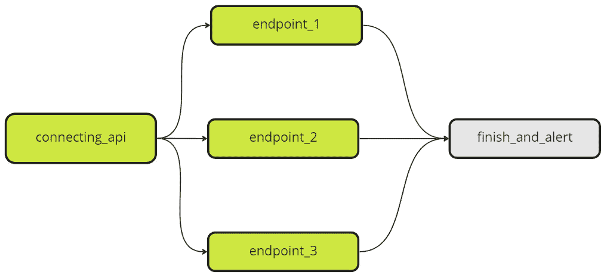

图 9.31 – 并行执行的示例

并行执行只有在所有并行任务成功完成后才会移动到最后一个任务。通过这种方式，我们保证数据管道不会只摄取一小部分数据，而是所有所需的数据。

回到我们的练习，我们可以通过删除一个简单引号来模拟这种行为，创建一个 `t_2`。在下面的图中，你可以看到 DAG 图将如何看起来：

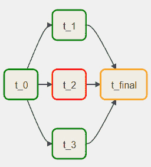

图 9.32 – Airflow 的 parallel_tasks_dag 中有错误 t_2 任务

`t_final` 任务将重试执行，直到我们修复 `t_2` 或重试次数达到其限制。

然而，避免执行许多并行任务是一种良好的实践，尤其是在你只有有限的资源来处理这些任务时。有许多方法可以创建对外部任务或 DAG 的依赖，我们可以利用它们来创建更高效的管道。

## 更多内容…

除了任务并行性的概念，我们还有`BranchOperator`。`BranchOperator`根据匹配的准则同时执行一个或多个任务。让我们用以下图例来说明这一点：

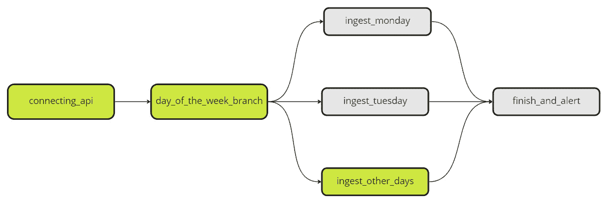

图 9.33 – 分支任务图示例

根据一周中的日期标准，`day_of_the_week_branch`任务将触发特定于该天的任务。

如果你想了解更多，*Analytics Vidhya*有一个关于它的很好的博客文章，你可以在这里阅读：[`www.analyticsvidhya.com/blog/2023/01/data-engineering-101-branchpythonoperator-in-apache-airflow/`](https://www.analyticsvidhya.com/blog/2023/01/data-engineering-101-branchpythonoperator-in-apache-airflow/)。

## 参考以下内容

+   BetterDataScience 有一个关于 Airflow 中并行任务的很好的博客文章。你可以在这里找到它：[`betterdatascience.com/apache-airflow-run-tasks-in-parallel/`](https://betterdatascience.com/apache-airflow-run-tasks-in-parallel/)。

+   你可以在这里了解更多关于 Airflow 任务并行性的信息：[`hevodata.com/learn/airflow-parallelism/`](https://hevodata.com/learn/airflow-parallelism/)。

# 定义依赖导入的 DAGs

在数据世界中，关于如何组织 Airflow DAGs 的讨论相当多。我通常使用的方法是创建一个基于业务逻辑或最终目的地的特定管道的 DAG。然而，有时，为了在 DAG 内部执行任务，我们依赖于另一个 DAG 来完成流程并获取输出。

在这个配方中，我们将创建两个 DAG，其中第一个依赖于第二个的成功结果。否则，它将不会完成。为了帮助我们，我们将使用`ExternalTaskSensor`操作员。

## 准备

请参考*配置 Airflow*配方中的*准备*部分，因为我们将使用相同的技术来处理它。

这个配方依赖于在*创建自定义操作员*配方中创建的`holiday_ingest` DAG，所以请确保你有它。

在这个练习中，我们将不会明确引用导入和主 DAG 配置，以避免冗余和重复。这里的目的是如何组织操作员的作业流程。你可以使用与*创建* *DAGs*配方中相同的逻辑来创建你的 DAG 结构。

对于这里使用的完整 Python 文件，请访问以下 GitHub 页面：

[`github.com/PacktPublishing/Data-Ingestion-with-Python-Cookbook/tree/main/Chapter_9/de%EF%AC%81ning_dependent_ingests_DAGs`](https://github.com/PacktPublishing/Data-Ingestion-with-Python-Cookbook/tree/main/Chapter_9/de%EF%AC%81ning_dependent_ingests_DAGs)

## 如何做到这一点…

对于这个练习，让我们创建一个在 `holiday_ingest` 成功完成后触发的 DAG，并在控制台输出中返回所有假日日期。我的 DAG 将被称为 `external_sensor_dag`，但请随意提供任何其他 ID 名称。只需确保它是唯一的，因此不会影响其他 DAG：

1.  除了我们已有的默认导入外，我们还可以添加以下内容：

    ```py
    from airflow.sensors.external_task import ExternalTaskSensor
    ```

1.  现在，我们将在 `holiday_brazil.json` 文件中插入一个 Python 函数来返回假日日期，这是 `holiday_ingest` DAG 的输出：

    ```py
    def get_holiday_dates(filename_json):
        with open (filename_json, 'r') as f:
            json_hol = json.load(f)
            holidays = json_hol["holidays"]
        print([item['date'] for item in holidays])
    ```

1.  然后，我们将定义 DAG 的两个操作符和流程：

    ```py
        wait_holiday_api_ingest = ExternalTaskSensor(
            task_id='wait_holiday_api_ingest',
            external_dag_id='holiday_ingest',
            external_task_id='holiday_api_ingestion',
            allowed_states=["success"],
            execution_delta = timedelta(minutes=1),
            timeout=600,
        )
        filename_json = f"{AIRFLOW_HOME}/files_to_test/output_files/holiday_brazil.json"
        date_tasks = PythonOperator(
            task_id='date_tasks',
            python_callable=get_holiday_dates,
            op_args=[filename_json]
        )
    wait_holiday_api_ingest >> date_tasks
    ```

保存它并在 Airflow UI 中启用此 DAG。一旦启用，你会注意到 `wait_holiday_api_ingest` 任务将处于 `RUNNING` 状态，并且不会继续到其他任务，如下所示：

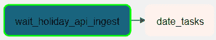

图 9.34 – 运行状态下的 wait_holiday_api_ingest 任务

你还会注意到这个任务的日志看起来像以下这样：

```py
[2023-03-26, 20:50:23 UTC] {external_task.py:166} INFO - Poking for tasks ['holiday_api_ingestion'] in dag holiday_ingest on 2023-03-24T23:50:00+00:00 ...
[2023-03-26, 20:51:23 UTC] {external_task.py:166} INFO - Poking for tasks ['holiday_api_ingestion'] in dag holiday_ingest on 2023-03-24T23:50:00+00:00 ...
```

1.  现在，我们将启用并运行 `holiday_ingest`（如果尚未启用）。

1.  然后，回到 `external_sensor_dag`，你会看到它已成功完成，如下所示：

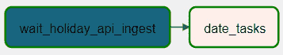

图 9.35 – 显示成功的 external_sensor_dag

如果我们检查 `date_tasks` 的日志，你将在控制台看到以下输出：

```py
[2023-03-25, 16:39:31 UTC] {logging_mixin.py:115} INFO - ['2022-01-01', '2022-02-28', '2022-03-01', '2022-03-02', '2022-03-20', '2022-04-15', '2022-04-17', '2022-04-21', '2022-05-01', '2022-05-08', '2022-06-16', '2022-06-21', '2022-08-14', '2022-09-07', '2022-09-23', '2022-10-12', '2022-11-02', '2022-11-15', '2022-12-21', '2022-12-24', '2022-12-25', '2022-12-31']
```

这里是完整的日志供参考：


图 9.36 – Airflow UI 中的 date_tasks 日志

现在，让我们在下一节中了解它是如何工作的。

## 工作原理…

让我们先看看我们的 `wait_holiday_api_ingest` 任务：

```py
wait_holiday_api_ingest = ExternalTaskSensor(
        task_id='wait_holiday_api_ingest',
        external_dag_id='holiday_ingest',
        external_task_id='holiday_api_ingestion',
        allowed_states=["success"],
        execution_delta = timedelta(minutes=1),
        timeout=300,
    )
```

`ExternalTaskSensor` 是一种传感器类型，只有当其 DAG 外部的另一个任务以在 `allowed_states` 参数上定义的特定状态完成时才会执行。此参数的默认值为 `SUCCESS`。

传感器将使用 `external_dag_id` 和 `external_task_id` 参数在 Airflow 中搜索特定的 DAG 和任务，我们将它们分别定义为 `holiday_ingest` 和 `holiday_api_ingestion`。最后，`execution_delta` 将确定再次戳击外部 DAG 的时间间隔。

一旦完成，除非我们在默认参数中定义不同的行为，否则 DAG 将保持 `SUCCESS` 状态。如果我们清除其状态，它将返回到 `RUNNING` 模式，直到传感器条件再次满足。

## 还有更多…

我们知道 Airflow 是一个强大的工具，但它并非不会偶尔出现故障。内部，Airflow 有其路线来访问内部和外部 DAG，这些路线偶尔会失败。例如，这些错误之一可能是一个 DAG 未找到，这可能是由于各种原因，如配置错误或连接问题。你可以在这里看到这些错误之一的截图：

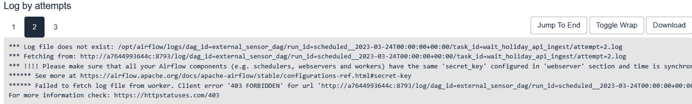

图 9.37 – Airflow 任务中的偶尔 403 错误日志

仔细观察，我们可以发现，在几秒钟内，Airflow 的一个工作节点失去了访问或从另一个工作节点检索信息的权限。如果这种情况发生在您身上，请禁用您的 DAG，然后再次启用它。

### XCom

在这个练习中，我们使用输出文件来执行操作，但也可以使用任务输出而不需要它写入文件。相反，我们可以使用**XCom**（即**跨通信**）机制来帮助我们。

要在任务间使用 XCom，我们可以简单地使用`xcom_push`和`xcom_pull`方法在所需任务中*推送*和*拉取*值。在幕后，Airflow 将这些值临时存储在其数据库之一中，使其更容易再次访问。

要在 Airflow UI 中检查您的存储 XComs，请点击**管理员**按钮并选择**XCom**。

注意

在生产环境中，XComs 可能有一个清除程序。如果您需要保留值更长时间，请咨询 Airflow 管理员。

您可以在官方文档页面了解更多关于 XComs 的信息：[`airflow.apache.org/docs/apache-airflow/stable/core-concepts/xcoms.xhtml`](https://airflow.apache.org/docs/apache-airflow/stable/core-concepts/xcoms.xhtml)。

## 参见

您可以在 Airflow 官方文档页面了解更多关于此操作符的信息：[`airflow.apache.org/docs/apache-airflow/stable/howto/operator/external_task_sensor.xhtml`](https://airflow.apache.org/docs/apache-airflow/stable/howto/operator/external_task_sensor.xhtml)。

# 进一步阅读

+   [`airflow.apache.org/docs/apache-airflow/stable/core-concepts/dags.xhtml`](https://airflow.apache.org/docs/apache-airflow/stable/core-concepts/dags.xhtml)

+   [`airflow.apache.org/docs/apache-airflow/2.2.4/best-practices.xhtml`](https://airflow.apache.org/docs/apache-airflow/2.2.4/best-practices.xhtml)

+   [`www.qubole.com/tech-blog/apache-airflow-tutorial-dags-tasks-operators-sensors-hooks-xcom`](https://www.qubole.com/tech-blog/apache-airflow-tutorial-dags-tasks-operators-sensors-hooks-xcom)

+   [`python.plainenglish.io/apache-airflow-how-to-correctly-setup-custom-plugins-2f80fe5e3dbe`](https://python.plainenglish.io/apache-airflow-how-to-correctly-setup-custom-plugins-2f80fe5e3dbe)

+   [`copyprogramming.com/howto/airflow-how-to-mount-airflow-cfg-in-docker-container`](https://copyprogramming.com/howto/airflow-how-to-mount-airflow-cfg-in-docker-container)
