# 在 Airflow 中记录和监控您的数据摄取

我们已经知道日志记录和监控对于管理应用程序和系统是多么重要，Airflow 也不例外。事实上，**Apache Airflow** 已经内置了创建日志并导出的模块。但如何改进它们呢？

在上一章中，*使用 Airflow 整合一切*，我们介绍了 Airflow 的基本方面，如何启动我们的数据摄取，以及如何编排管道和使用最佳数据开发实践。现在，让我们将最佳技术付诸实践，以增强日志记录并监控 Airflow 管道。

在本章中，您将学习以下食谱：

+   在 Airflow 中创建基本日志

+   在远程位置存储日志文件

+   在 `airflow.cfg` 中配置日志

+   设计高级监控

+   使用通知操作员

+   使用 SQL 操作员进行数据质量

# 技术要求

您可以在此 GitHub 仓库中找到本章的代码：[`github.com/PacktPublishing/Data-Ingestion-with-Python-Cookbook`](https://github.com/PacktPublishing/Data-Ingestion-with-Python-Cookbook)。

## 安装和运行 Airflow

本章要求您的本地机器上安装了 Airflow。您可以直接在您的 **操作系统**（**OS**）上安装它，或者使用 Docker 镜像。有关更多信息，请参阅 *第一章* 中的 *配置 Docker 以用于 Airflow* 食谱。

在遵循 *第一章* 中描述的步骤之后，请确保您的 Airflow 运行正确。您可以通过检查 Airflow UI 来做到这一点：`http://localhost:8080`。

如果您像我一样使用 Docker 容器来托管您的 Airflow 应用程序，您可以通过运行以下命令在终端检查其状态：

```py
$ docker ps
```

您可以看到这里正在运行的命令：

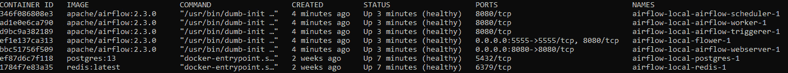

图 10.1 – 运行的 Airflow 容器

对于 Docker，请检查 **Docker Desktop** 上的容器状态，如下面的截图所示：

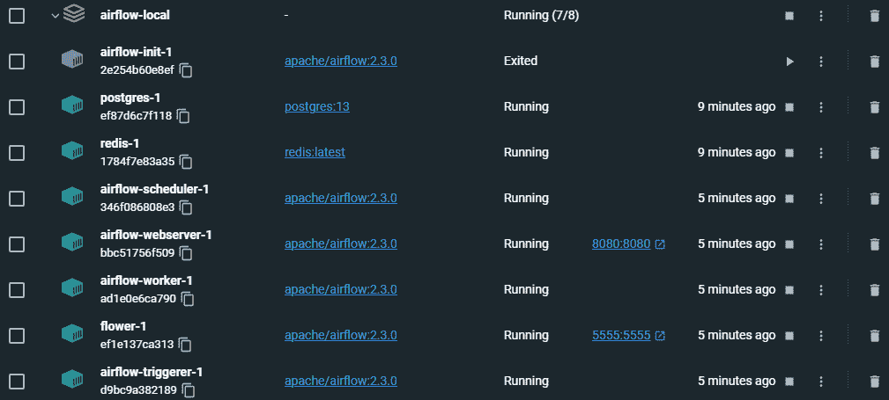

图 10.2 – 运行的 Docker Desktop 版本 Airflow 容器

### docker-compose 中的 Airflow 环境变量

本节针对在 Docker 容器中运行 Airflow 的用户。如果您直接在您的机器上安装它，您可以跳过这一部分。

我们需要配置或更改 Airflow 环境变量来完成本章的大部分食谱。这种配置应该通过编辑 `airflow.cfg` 文件来完成。然而，如果您选择使用 `docker-compose` 运行您的 Airflow 应用程序，这可能会很棘手。

理想情况下，我们应该能够通过在 `docker-compose.yaml` 中挂载卷来访问 `airflow.cfg` 文件，如下所示：

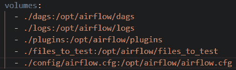

图 10.3 – docker-compose.yaml 卷

然而，它不是在本地机器上反映文件，而是创建一个名为`airflow.cfg`的目录。这是社区已知的一个错误（见[`github.com/puckel/docker-airflow/issues/571`](https://github.com/puckel/docker-airflow/issues/571)），但没有解决方案。

为了解决这个问题，我们将使用环境变量在`docker-compose.yaml`中设置所有`airflow.cfg`配置，如下例所示：

```py
# Remote logging configuration
AIRFLOW__LOGGING__REMOTE_LOGGING: "True"
```

对于直接在本地机器上安装和运行 Airflow 的用户，您可以按照指示如何编辑`airflow.cfg`文件的步骤进行操作。

# 在 Airflow 中创建基本日志

Airflow 的内部日志库基于 Python 内置的日志，它提供了灵活和可配置的形式来捕获和存储使用**有向无环图**（**DAGs**）不同组件的日志消息。让我们从介绍 Airflow 日志的基本概念开始这一章。这些知识将使我们能够应用更高级的概念，并在实际项目中创建成熟的数据摄取管道。

在这个食谱中，我们将创建一个简单的 DAG，根据 Airflow 的默认配置生成日志。我们还将了解 Airflow 内部如何设置日志架构。

## 准备工作

参考此食谱的*技术要求*部分，因为我们将以相同的技术处理它。

由于我们将创建一个新的 DAG，让我们在`dag/`目录下创建一个名为`basic_logging`的文件夹，并在其中创建一个名为`basic_logging_dag.py`的文件来插入我们的脚本。最终，您的文件夹结构应该如下所示：

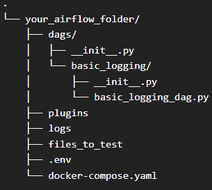

图 10.4 – 带有 basic_logging DAG 结构的 Airflow 目录

## 如何操作...

目标是理解如何在 Airflow 中正确创建日志，以便 DAG 脚本将非常简单明了：

1.  让我们从导入 Airflow 和 Python 库开始：

    ```py
    from airflow import DAG
    from airflow.operators.python_operator import PythonOperator
    from datetime import datetime, timedelta
    import logging
    ```

1.  然后，让我们获取我们想要使用的日志配置：

    ```py
    # Defining the log configuration
    logger = logging.getLogger("airflow.task")
    ```

1.  现在，让我们定义`default_args`和 Airflow 可以创建的 DAG 对象：

    ```py
    default_args = {
        'owner': 'airflow',
        'depends_on_past': False,
        'start_date': datetime(2023, 4, 1),
        'retries': 1,
        'retry_delay': timedelta(minutes=5)
    }
    dag = DAG(
        'basic_logging_dag',
        default_args=default_args,
        description='A simple ETL job using Python and Airflow',
        schedule_interval=timedelta(days=1),
    )
    ```

注意

与*第九章*不同，在这里我们将通过将任务分配到本食谱的*步骤 5*中的操作实例化来定义哪些任务属于这个 DAG。

1.  现在，让我们创建三个仅返回日志消息的示例函数。这些函数将根据 ETL 步骤命名，正如您在这里所看到的：

    ```py
    def extract_data():
        logger.info("Let's extract data")
        pass
    def transform_data():
        logger.info("Then transform data")
        pass
    def load_data():
        logger.info("Finally load data")
        logger.error("Oh, where is the data?")
        pass
    ```

如果您想的话，可以插入更多的日志级别。

1.  对于每个函数，我们将使用`PythonOperator`设置一个任务，并指定执行顺序：

    ```py
    extract_task = PythonOperator(
        task_id='extract_data',
        python_callable=extract_data,
        dag=dag,
    )
    transform_task = PythonOperator(
        task_id='transform_data',
        python_callable=transform_data,
        dag=dag,
    )
    load_task = PythonOperator(
        task_id='load_data',
        python_callable=load_data,
        dag=dag,
    )
    extract_task >> transform_task >> load_task
    ```

您可以看到我们通过将*步骤 4*中定义的`dag`对象分配给`dag`参数来引用 DAG 到每个任务。

保存文件并转到 Airflow UI。

1.  在 Airflow UI 中，查找**basic_logging_dag** DAG，并通过点击切换按钮来启用它。作业将立即开始，如果您检查 DAG 的**图形**视图，您应该会看到以下截图类似的内容：

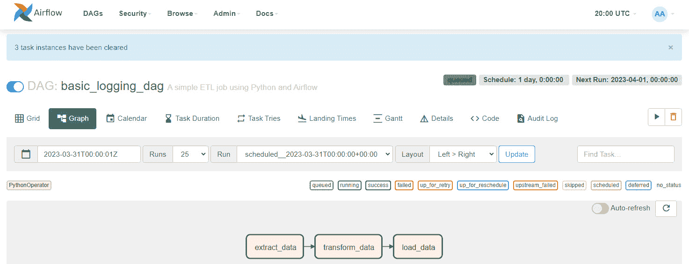

图 10.5 – 显示任务成功状态的 DAG 图视图

这意味着管道运行成功！

1.  让我们检查本地机器上的 `logs/` 目录。这个目录与 `DAGs` 文件夹处于同一级别，我们将脚本放在那里。

1.  如果您打开 `logs/` 文件夹，您可以看到更多文件夹。寻找以 `dag_id= basic_logging` 开头的文件夹并打开它。

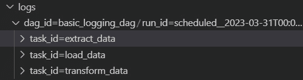

图 10.6 – basic_logging DAG 及其任务的 Airflow 日志文件夹

1.  现在，选择名为 `task_id=transform_data` 的文件夹并打开其中的日志文件。您应该会看到以下截图中的内容：

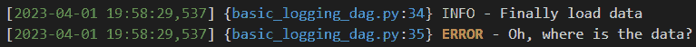

图 10.7 – transform_data 任务的日志消息

如您所见，日志被打印在输出上，并且根据日志级别进行了相应的着色，其中 **INFO** 为绿色，**ERROR** 为红色。

## 它是如何工作的…

这个练习很简单，但如果我告诉你许多开发者都难以理解 Airflow 如何创建其日志呢？这通常有两个原因——开发者习惯于插入 `print()` 函数而不是日志方法，并且只检查 Airflow UI 中的记录。

根据 Airflow 的配置，它不会在 UI 上显示 `print()` 消息，用于调试或查找代码运行位置的日志消息可能会丢失。此外，Airflow UI 对显示的记录行数有限制，在这种情况下，Spark 错误消息很容易被省略。

正因如此，理解默认情况下 Airflow 将所有日志存储在 `logs/` 目录下至关重要，甚至按照 `dag_id`、`run_id` 和每个任务分别组织，正如我们在 *步骤 7* 中所看到的。这个文件夹结构也可以根据您的需求进行更改或改进，您只需修改 `airflow.cfg` 中的 `log_filename_template` 变量。以下是其默认设置：

```py
# Formatting for how airflow generates file names/paths for each task run.
log_filename_template = dag_id={{ ti.dag_id }}/run_id={{ ti.run_id }}/task_id={{ ti.task_id }}/{%% if ti.map_index >= 0 %%}map_index={{ ti.map_index }}/{%% endif %%}attempt={{ try_number }}.log
```

现在，查看日志文件，你可以看到它与 UI 上的内容相同，如下面的截图所示：

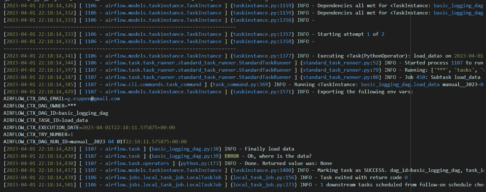

图 10.8 – 存储在本地 Airflow 日志文件夹中的日志文件中的完整日志消息

在前几行中，我们可以看到 Airflow 启动任务时调用的内部调用，甚至可以看到特定的函数名称，例如 `taskinstance.py` 或 `standard_task_runner.py`。这些都是内部脚本。然后，我们可以在文件下方看到我们的日志消息。

如果您仔细观察，您可以看到我们的日志格式与 Airflow 核心类似。这有两个原因：

+   在我们的代码开头，我们使用了 `getLogger()` 方法来检索 `airflow.task` 模块使用的配置，如下所示：

    ```py
    logger = logging.getLogger("airflow.task")
    ```

+   `airflow.task` 使用 Airflow 默认配置来格式化所有日志，这些配置也可以在 `airflow.cfg` 文件中找到。现在不用担心这个问题；我们将在 *在 airflow.cfg 中配置日志* 菜谱中稍后介绍。

在定义 `logger` 变量和设置日志类配置之后，脚本的其他部分就很简单了。

## 参见

你可以在 Astronomer 页面这里了解更多关于 Airflow 日志的详细信息：[`docs.astronomer.io/learn/logging`](https://docs.astronomer.io/learn/logging)。

# 在远程位置存储日志文件

默认情况下，Airflow 将其日志存储和组织在本地文件夹中，便于开发者访问，这有助于在预期之外出现问题时的调试过程。然而，对于较大的项目或团队来说，让每个人都能够访问 Airflow 实例或服务器几乎是不切实际的。除了查看 DAG 控制台输出外，还有其他方法可以允许访问日志文件夹，而无需授予对 Airflow 服务器的访问权限。

最直接的一种解决方案是将日志导出到外部存储，例如 S3 或 **Google Cloud Storage**。好消息是 Airflow 已经原生支持将记录导出到云资源。

在这个菜谱中，我们将在 `airflow.cfg` 文件中设置一个配置，允许使用远程日志功能，并使用示例 DAG 进行测试。

## 准备工作

请参阅此菜谱的 *技术要求* 部分。

### AWS S3

要完成这个练习，需要创建一个 **AWS S3** 存储桶。以下是完成此任务的步骤：

1.  按照以下步骤创建 AWS 账户：[`docs.aws.amazon.com/accounts/latest/reference/manage-acct-creating.xhtml`](https://docs.aws.amazon.com/accounts/latest/reference/manage-acct-creating.xhtml)

1.  然后，根据 AWS 文档在此处创建 S3 存储桶：[`docs.aws.amazon.com/AmazonS3/latest/userguide/creating-bucket.xhtml`](https://docs.aws.amazon.com/AmazonS3/latest/userguide/creating-bucket.xhtml)

在我的情况下，我将创建一个名为 `airflow-cookbook` 的 S3 存储桶，用于本菜谱，如下截图所示：

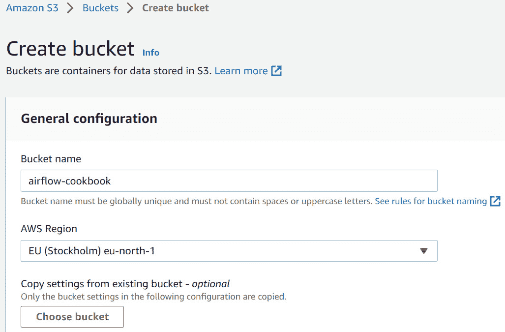

图 10.9 – AWS S3 创建存储桶页面

### Airflow DAG 代码

为了避免冗余并专注于本菜谱的目标，即配置 Airflow 的远程日志，我们将使用与 *在 Airflow 中创建基本日志* 菜谱相同的 DAG，但你可以自由地创建另一个具有不同名称但相同代码的 DAG。

## 如何操作...

这里是执行此菜谱的步骤：

1.  首先，让我们在我们的 AWS 账户中创建一个程序化用户。Airflow 将使用此用户在 AWS 上进行身份验证，并将能够写入日志。在您的 AWS 控制台中，选择**IAM 服务**，您将被重定向到一个类似于以下页面：

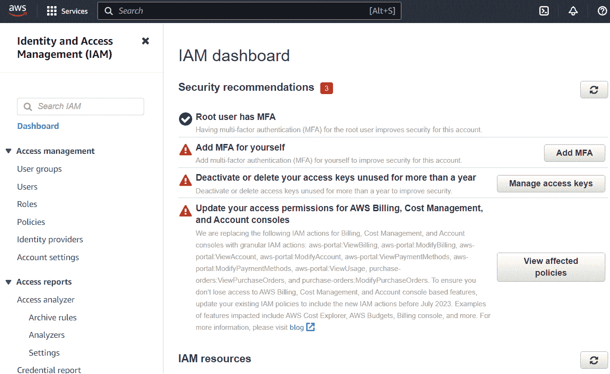

图 10.10 – AWS IAM 主页面

1.  由于这是一个具有严格目的的测试账户，我将忽略 IAM 仪表板上的警报。

1.  然后，选择**用户**和**添加用户**，如图所示：

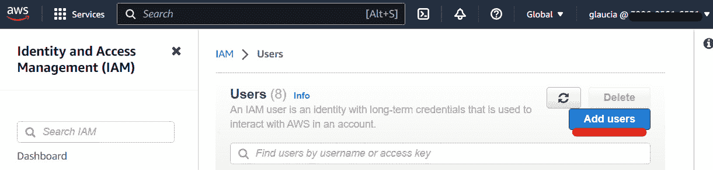

图 10.11 – AWS IAM 用户页面

在**创建用户**页面，插入一个易于记忆的用户名，如图所示：

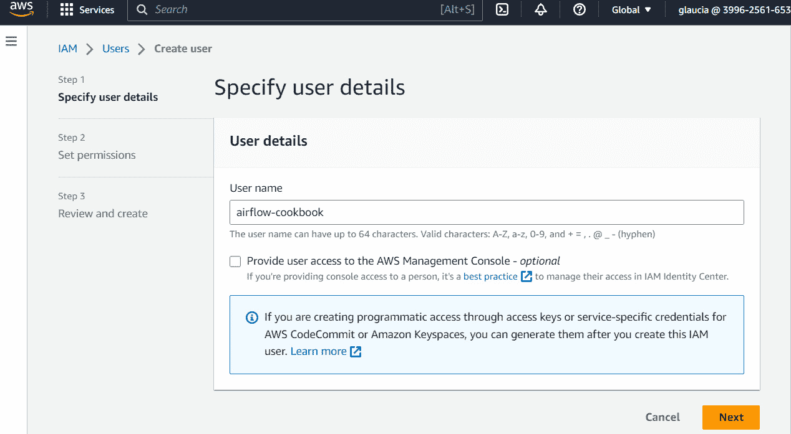

图 10.12 – AWS IAM 新用户详情

保持复选框未勾选，并选择**下一步**以添加访问策略。

1.  在**设置权限**页面，选择**直接附加策略**，然后在**权限策略**复选框中查找**AmazonS3FullAccess**：

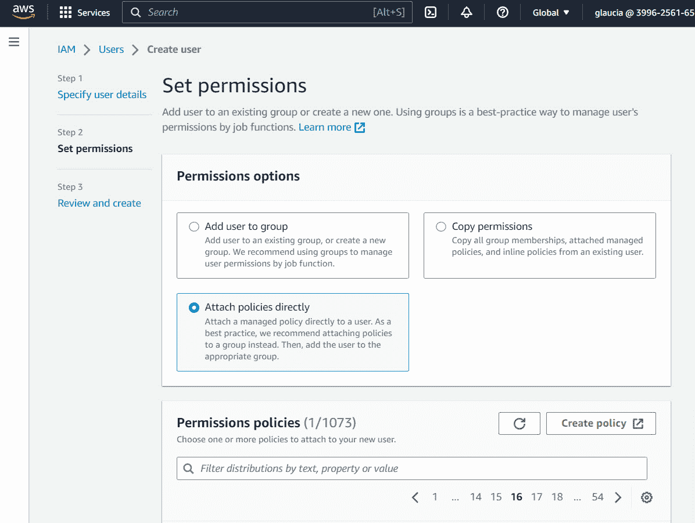

图 10.13 – AWS IAM 为用户创建设置权限

由于这是一个测试练习，我们可以使用对 S3 资源的完全访问权限。然而，请记住，在生产环境中访问资源时附加特定的策略。

选择**下一步**，然后点击**创建用户**按钮。

1.  现在，通过选择您创建的用户，转到**安全凭证**，然后向下滚动直到您看到**访问密钥**框。然后创建一个新的，并将 CSV 文件保存在易于访问的地方：

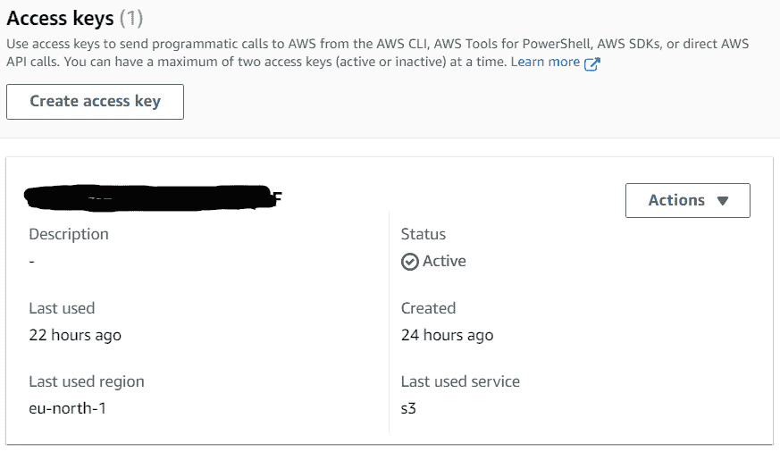

图 10.14 – 用户访问密钥创建

1.  现在，回到 Airflow，让我们配置 Airflow 与我们的 AWS 账户之间的连接。

使用 Airflow UI 创建一个新的连接，并在**连接类型**字段中选择**Amazon S3**。在**额外**字段中，插入以下行，该行是在*步骤 4*中检索到的凭证：

```py
{"aws_access_key_id": "your_key", "aws_secret_access_key": "your_secret"}
```

您的页面将看起来如下所示：

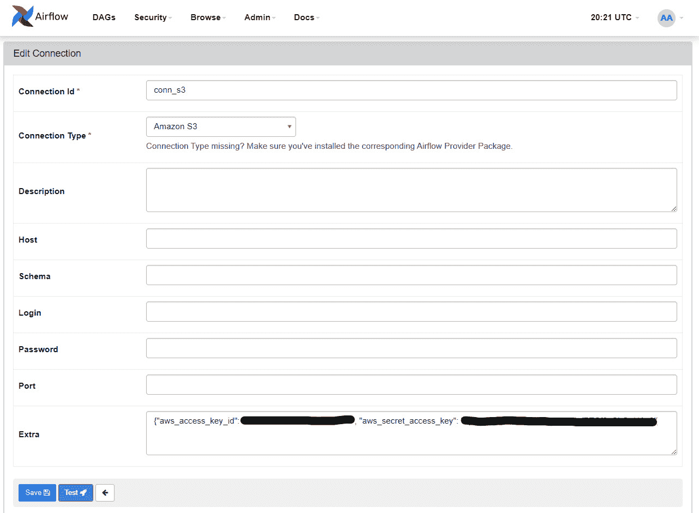

图 10.15 – 添加新的 AWS S3 连接时的 Airflow UI

保存它，并在您的 Airflow 目录中打开您的代码编辑器。

1.  现在，让我们将配置添加到我们的`airflow.cfg`文件中。如果您使用 Docker 托管 Airflow，请在环境设置下将以下行添加到您的`docker-compose.yaml`文件中：

    ```py
    AIRFLOW__LOGGING__REMOTE_LOGGING: "True"
    AIRFLOW__LOGGING__REMOTE_BASE_LOG_FOLDER: "s3://airflow-cookbook"
    AIRFLOW__LOGGING__REMOTE_LOG_CONN_ID: conn_s3
    AIRFLOW__LOGGING__ENCRYPT_S3_LOGS: "False"
    ```

您的`docker-compose.yaml`文件将类似于以下内容：

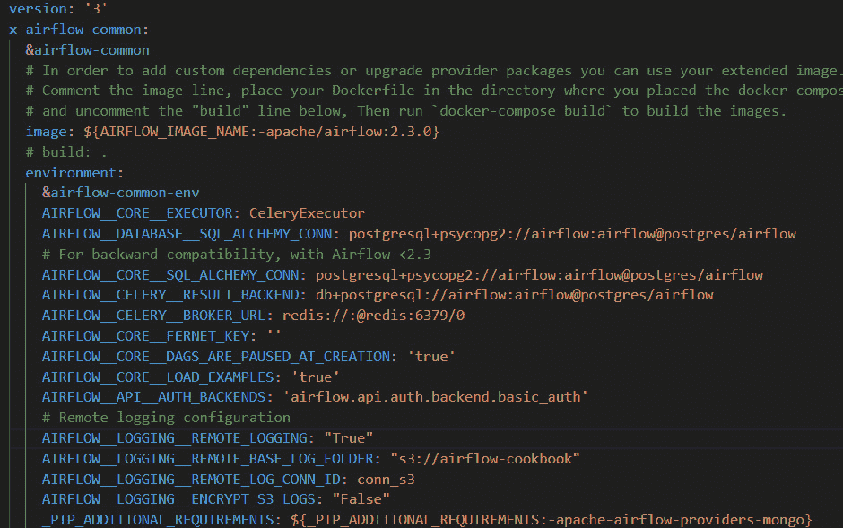

图 10.16 – docker-compose.yaml 中的远程日志配置

如果您直接在本地机器上安装了 Airflow，您可以立即更改`airflow.cfg`文件。在`airflow.cfg`中更改以下行并保存它：

```py
[logging]
# Users must supply a remote location URL (starting with either 's3://...') and an Airflow connection
# id that provides access to the storage location.
remote_logging = True
remote_base_log_folder = s3://airflow-cookbook
remote_log_conn_id = conn_s3
# Use server-side encryption for logs stored in S3
encrypt_s3_logs = False
```

1.  在前面的更改之后，重新启动您的 Airflow 应用程序。

1.  使用你更新的 Airflow，运行 `basic_logging_dag` 并打开你的 AWS S3\. 选择你在 *准备就绪* 部分创建的桶，你应该能在其中看到一个新对象，如下所示：

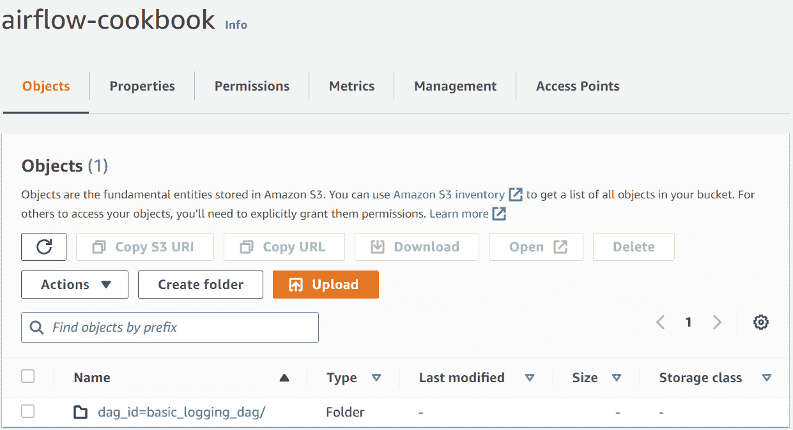

图 10.17 – AWS S3 airflow-cookbook 中的 bucket 对象

1.  然后，选择创建的对象，你应该能看到更多与执行的任务相关的文件夹，如下所示：

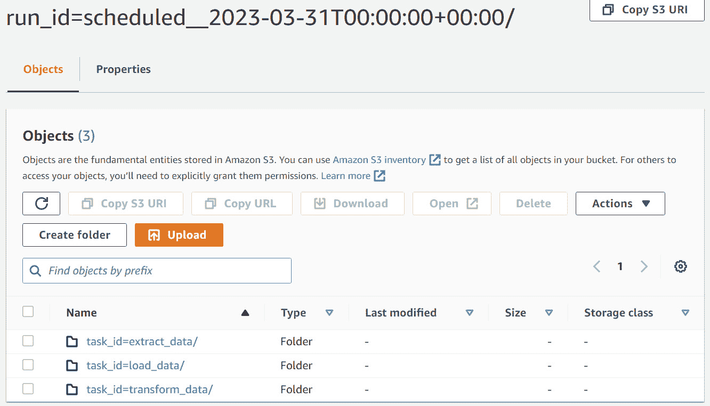

图 10.18 – AWS S3 airflow-cookbook 显示远程日志

1.  最后，如果你选择其中一个文件夹，你将看到与在 *在 Airflow 中创建基本日志* 菜单中看到相同的文件。我们在远程位置成功写入了日志！

## 它是如何工作的…

如果你从整体上查看这个菜谱，可能会觉得这是一项相当大的工作。然而，记住我们是从零开始进行配置，这通常需要时间。由于我们已经习惯了创建 AWS S3 桶和执行 DAG（分别见 *第二章* 和 *第九章*），让我们专注于设置远程日志配置。

我们的第一步是在 Airflow 中创建一个连接，使用在 AWS 上生成的访问密钥。这一步是必需的，因为，内部上，Airflow 将使用这些密钥在 AWS 中进行身份验证并证明其身份。

然后，我们按以下方式更改了以下 Airflow 配置：

```py
AIRFLOW__LOGGING__REMOTE_LOGGING: "True"
AIRFLOW__LOGGING__REMOTE_BASE_LOG_FOLDER: "s3://airflow-cookbook"
AIRFLOW__LOGGING__REMOTE_LOG_CONN_ID: conn_s3
AIRFLOW__LOGGING__ENCRYPT_S3_LOGS: "False"
```

前两行是字符串配置，用于在 Airflow 中设置是否启用远程日志以及将使用哪个 bucket 路径。最后两行与我们在 `True` 时创建的连接名称有关，如果我们处理敏感信息。

在重启 Airflow 后，配置将在我们的应用程序中体现出来，通过执行 DAG，我们就可以看到在 S3 桶中写入的日志。

如本菜谱介绍中所述，这种配置不仅在大项目中有益，而且在使用 Airflow 时也是一种良好的实践，允许开发者在不访问集群或服务器的情况下调试或检索有关代码输出的信息。

在这里，我们介绍了一个使用 AWS S3 的示例，但也可以使用 **Google Cloud Storage** 或 **Azure Blob Storage**。你可以在这里了解更多信息：[`airflow.apache.org/docs/apache-airflow/1.10.13/howto/write-logs.xhtml`](https://airflow.apache.org/docs/apache-airflow/1.10.13/howto/write-logs.xhtml)。

注意

如果你不再想使用远程日志，你可以简单地从你的 `docker-compose.yaml` 中移除环境变量，或者将 `REMOTE_LOGGING` 设置回 `False`。

## 参见

你可以在 Apache Airflow 官方文档页面上了解更多关于 S3 中的远程日志信息：[`airflow.apache.org/docs/apache-airflow-providers-amazon/stable/logging/s3-task-handler.xhtml`](https://airflow.apache.org/docs/apache-airflow-providers-amazon/stable/logging/s3-task-handler.xhtml)。

# 在 airflow.cfg 中配置日志

我们在 *将日志文件存储在远程位置* 配方中第一次接触了 `airflow.cfg` 文件。一眼望去，我们看到了这个配置文件是多么强大和方便。只需编辑它，就有许多方法可以自定义和改进 Airflow。

这个练习将教会你如何通过在 `airflow.cfg` 文件中设置适当的配置来增强你的日志。

## 准备工作

请参阅本配方的 *技术要求* 部分，因为我们将以相同的技术来处理它。

### Airflow DAG 代码

为了避免冗余并专注于本配方的目标，即配置 Airflow 的远程日志，我们将使用与 *在 Airflow 中创建基本日志* 配方相同的 DAG。然而，你也可以创建另一个具有不同名称但相同代码的 DAG。

## 如何操作…

由于我们将使用与 *在 Airflow 中创建基本日志* 相同的 DAG 代码，让我们直接跳到格式化日志所需配置：

1.  让我们从在我们的 `docker-compose.yaml` 中设置配置开始。在环境部分，插入以下行并保存文件：

    ```py
    AIRFLOW__LOGGING__LOG_FORMAT: "[%(asctime)s] [ %(process)s - %(name)s ] {%(filename)s:%(lineno)d} %(levelname)s - %(message)s"
    ```

你的 `docker-compose` 文件应该看起来像这样：

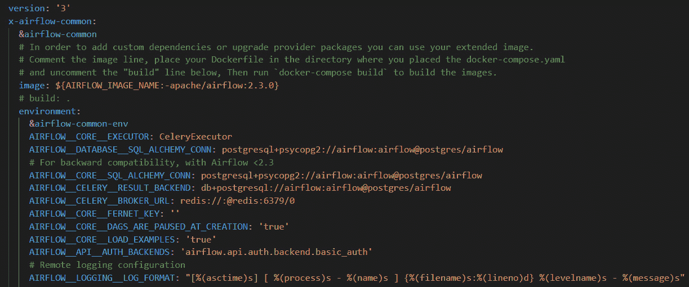

图 10.19 – 在 docker-compose.yaml 中格式化日志配置

如果你直接编辑 `airflow.cfg` 文件，搜索 `log_format` 变量，并将其更改为以下行：

```py
log_format = [%%(asctime)s] [ %%(process)s - %%(name)s ] {%%(filename)s:%%(lineno)d} %%(levelname)s - %%(message)s
```

你的代码将看起来像这样：

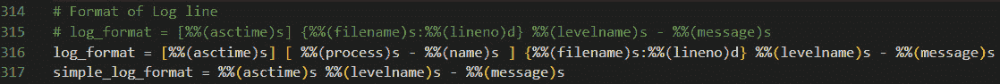

图 10.20 – airflow.cfg 中的 log_format

保存它，然后进行下一步。

我们在日志行中添加了一些更多项目，我们将在稍后介绍。

注意

在这里要非常注意。在 `airflow.cfg` 文件中，`%` 字符是双写的，与 `docker-compose` 文件不同。

1.  现在，让我们重新启动 Airflow。你可以通过停止 Docker 容器并使用以下命令重新运行它来完成：

    ```py
    $ docker-compose stop      # Or press Crtl-C
    $ docker-compose up
    ```

1.  然后，让我们前往 Airflow UI 并运行我们称为 `basic_logging_dag` 的 DAG。在 DAG 页面上，查看右上角并选择播放按钮（由箭头表示），然后选择 **触发 DAG**，如下所示：

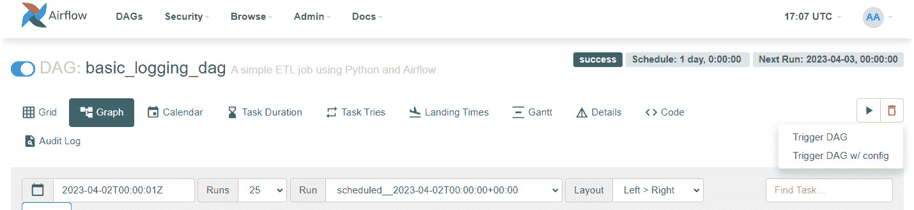

图 10.21 – 页面右侧的基本日志触发按钮

DAG 将立即开始运行。

1.  现在，让我们看看一个任务生成的日志。我将选择 `extract_data` 任务，日志将看起来像这样：

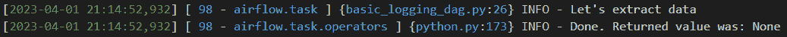

图 10.22 – extract_data 任务的格式化日志输出

如果你仔细观察，你会看到现在输出中显示了进程号。

注意

如果你选择从上一个配方中保持连续性，*将日志文件存储在远程位置*，请记住你的日志存储在远程位置。

## 它是如何工作的…

如我们所见，更改任何日志信息都很简单，因为 Airflow 在幕后使用 Python 日志库。现在，让我们看看我们的输出：

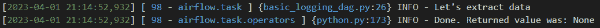

图 10.23 – extract_data 任务的格式化日志输出

如您所见，在进程名称（例如，`airflow.task`）之前，我们还有运行进程的编号。当同时运行多个进程时，这可以是有用的信息，使我们能够了解哪个进程完成得较慢以及正在运行什么。

让我们看看我们插入的代码：

```py
AIRFLOW__LOGGING__LOG_FORMAT: "[%(asctime)s] [ %(process)s - %(name)s ] {%(filename)s:%(lineno)d} %(levelname)s - %(message)s"
```

如您所见，变量如`asctime`、`process`和`filename`与我们之前在*第八章*中看到的相同。此外，由于底层是一个核心 Python 函数，我们可以根据允许的属性添加更多信息。您可以在这里找到列表：[`docs.python.org/3/library/logging.xhtml#logrecord-attributes`](https://docs.python.org/3/library/logging.xhtml#logrecord-attributes)。

### 深入了解 airflow.cfg

现在，让我们更深入地了解 Airflow 配置。如您所观察到的，Airflow 资源是由`airflow.cfg`文件编排的。使用单个文件，我们可以确定如何发送电子邮件通知（我们将在*使用通知操作符*配方中介绍），DAG 何时反映代码更改，日志如何显示等等。

这些配置也可以通过导出环境变量来设置，并且这比`airflow.cfg`上的配置设置具有优先级。这种优先级的发生是因为，从内部来说，Airflow 将`airflow.cfg`的内容转换为环境变量，广义上讲。您可以在这里了解更多：[`airflow.apache.org/docs/apache-airflow/stable/cli-and-env-variables-ref.xhtml#environment-variable`](https://airflow.apache.org/docs/apache-airflow/stable/cli-and-env-variables-ref.xhtml#environment-variable)。

让我们来看看 Airflow 的**引用**部分中的日志配置。我们可以看到许多其他定制可能性，例如着色、DAG 处理器的特定格式以及第三方应用的额外日志，如这里所示：

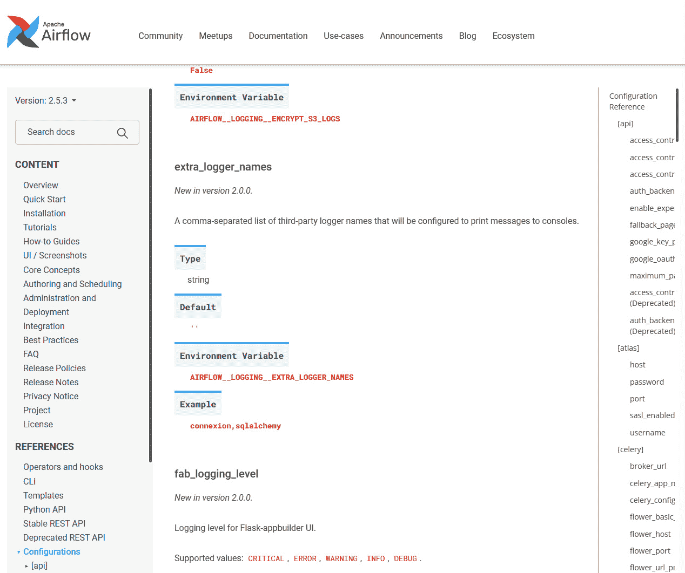

图 10.24 – Airflow 的日志配置文档

这份文档的精彩之处在于，我们可以在`airflow.cfg`或环境变量中直接配置引用。您可以在这里查看完整的引用列表：[`airflow.apache.org/docs/apache-airflow/stable/configurations-ref.xhtml#logging`](https://airflow.apache.org/docs/apache-airflow/stable/configurations-ref.xhtml#logging)。

在我们熟悉了 Airflow 的动态之后，测试新的配置或格式变得简单，尤其是当我们有一个测试服务器来做这件事时。然而，同时，我们在更改任何内部内容时需要谨慎；否则，我们可能会损害整个应用程序。

## 更多内容…

在*步骤 1*中，我们提到了在`docker-compose`中设置变量时避免使用双`%`字符 – 现在我们来解决这个问题！

我们传递给`docker-compose`的`string`变量将被一个内部的 Python 日志功能读取，它不会识别双`%`模式。相反，它将理解 Airflow 日志的默认格式需要等于该字符串变量，所有的 DAG 日志都将看起来像这样：

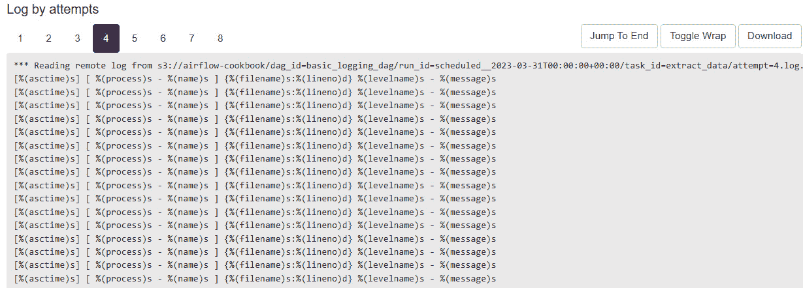

图 10.25 – 当 log_format 环境变量设置不正确时的错误

现在，在`airflow.cfg`文件中，双`%`字符是一个 Bash 格式模式，它像模运算符一样工作。

## 参见

在这里查看 Airflow 的完整配置列表：[`airflow.apache.org/docs/apache-airflow/stable/configurations-ref.xhtml`](https://airflow.apache.org/docs/apache-airflow/stable/configurations-ref.xhtml)。

# 设计高级监控

在花费一些时间学习和实践日志概念之后，我们可以在监控主题上更进一步。我们可以监控来自所有日志收集工作的结果，并生成有洞察力的监控仪表板和警报，同时存储正确的监控信息。

在本菜谱中，我们将介绍与 StatsD 集成的 Airflow 指标，StatsD 是一个收集系统统计信息的平台，以及它们的目的，帮助我们实现成熟的管道。

## 准备工作

本练习将专注于使 Airflow 监控指标更加清晰，以及如何构建一个健壮的架构来组织它。

作为本菜谱的要求，牢记以下基本 Airflow 架构至关重要：

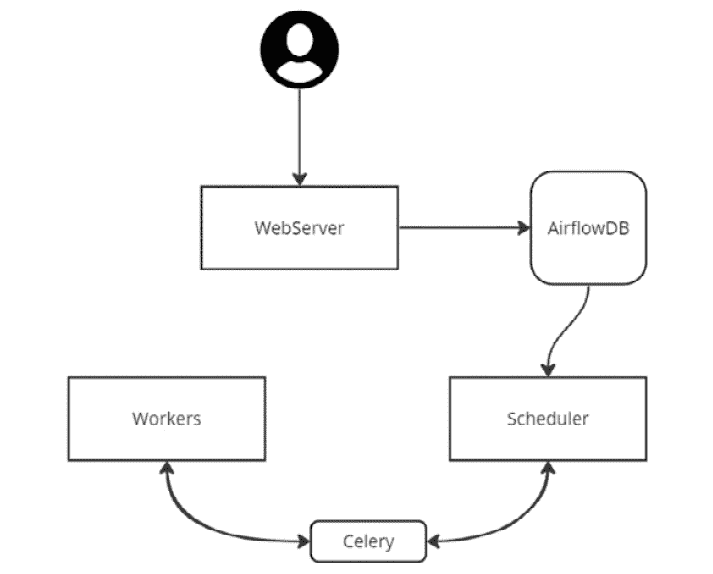

图 10.26 – Airflow 高级架构图

从高层次的角度来看，Airflow 组件由以下组成：

+   一个**Web 服务器**，我们可以访问 Airflow UI。

+   一个关系型数据库，用于存储元数据和 DAG 或任务中使用的其他有用信息。为了简化，我们将只使用一种类型的数据库；然而，可能会有多个。

+   **调度器**，将咨询数据库中的信息并将其发送给工作者。

+   一个**Celery**应用程序，负责排队来自调度器和工人的请求。

+   **工作者**，将执行 DAG 和任务。

考虑到这一点，我们可以继续到下一节。

## 如何操作…

让我们看看设计高级监控的主要项目：

+   **计数器**：正如其名所示，这个指标将提供关于 Airflow 内部操作计数的详细信息。此指标提供了正在运行的任务、失败的任务等的计数。在下面的图中，您可以看到一些示例：

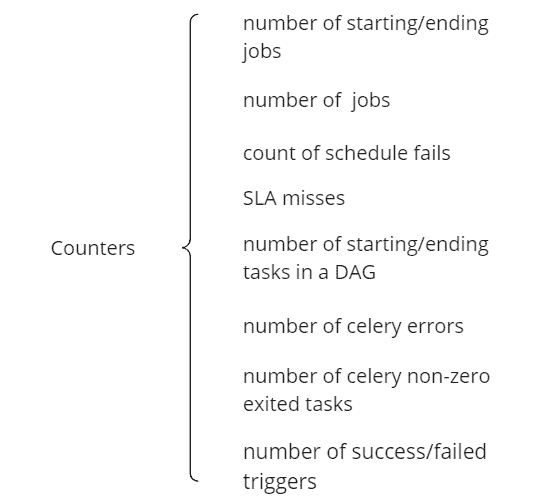

图 10.27 – 监控 Airflow 的计数器指标示例列表

+   **定时器**：这个指标告诉我们任务或 DAG 完成或加载文件所需的时间。在下面的图中，您可以看到更多：

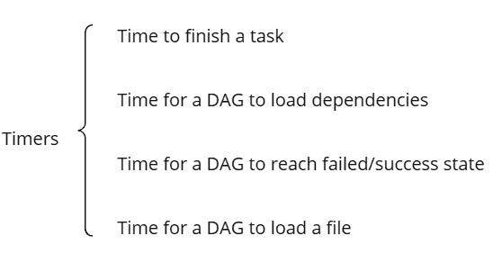

图 10.28 – 监控 Airflow 工作流的定时器示例列表

+   **量规**：最后，最后一种指标类型给我们提供了一个更直观的概览。量规使用定时器或计数器指标来表示我们是否达到了定义的阈值。在下面的图中，有一些量规的示例：

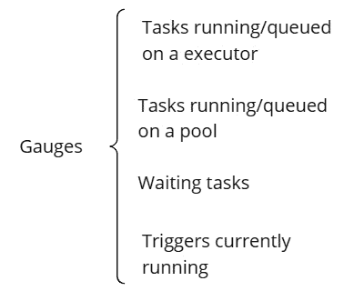

图 10.29 – 用于监控 Airflow 的量规示例列表

在定义了指标并将其纳入我们的视线后，我们可以继续进行架构设计以集成它。

+   **StatsD**：现在，让我们将**StatsD**添加到我们在“准备就绪”部分看到的架构图中。您将得到如下内容：

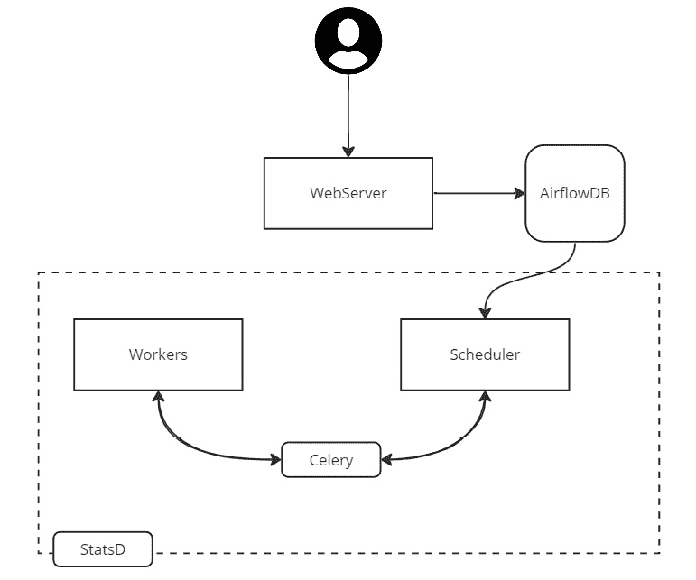

图 10.30 – StatsD 集成和覆盖 Airflow 组件架构

StatsD 可以从虚线框内的所有组件中收集指标并将它们直接发送到监控工具。

+   **Prometheus 和 Grafana**：然后，我们可以将 StatsD 连接到 Prometheus，它作为 Grafana 的数据源之一。将这些工具添加到我们的架构中看起来将如下所示：

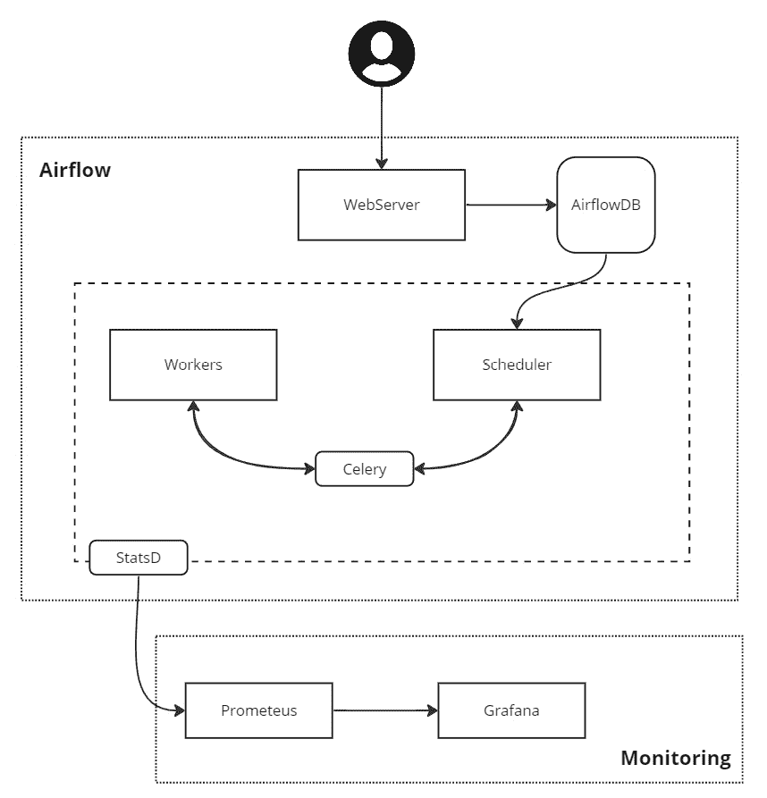

图 10.31 – Prometheus 和 Grafana 与 StatsD 和 Airflow 的集成图

现在，让我们了解这个架构背后的组件。

## 它是如何工作的...

让我们开始了解 StatsD 是什么。StatsD 是由 Etsy 公司开发的一个守护进程，用于聚合和收集应用程序指标。通常，任何应用程序都可以使用简单的协议，如**用户数据报协议**（**UDP**）发送指标。使用此协议，发送者不需要等待 StatsD 的响应，这使得过程变得简单。在监听和聚合数据一段时间后，StatsD 将指标发送到输出存储，即 Prometheus。

StatsD 的集成和安装可以使用以下命令完成：

```py
pip install 'apache-airflow[statsd]'
```

如果你想了解更多，可以参考 Airflow 文档此处：[`airflow.apache.org/docs/apache-airflow/2.5.1/administration-and-deployment/logging-monitoring/metrics.xhtml#counters`](https://airflow.apache.org/docs/apache-airflow/2.5.1/administration-and-deployment/logging-monitoring/metrics.xhtml#counters)。

然后，Prometheus 和 Grafana 将收集指标并将它们转换成更直观的资源。你现在不需要担心这个问题；我们将在*第十二章*中了解更多。

对于在“如何做…”部分的前三个步骤中看到的每个指标，我们都可以设置一个阈值，当它超过阈值时触发警报。所有指标都在“如何做…”部分中展示，更多指标可以在这里找到：https://airflow.apache.org/docs/apache-airflow/2.5.1/administration-and-deployment/logging-monitoring/metrics.xhtml#counters。

## 还有更多…

除了 StatsD，我们还可以将其他工具集成到 Airflow 中以跟踪特定的指标或状态。例如，对于深度错误跟踪，我们可以使用 **Sentry**，这是一个由 IT 运维团队使用的专业工具，用于提供支持和见解。你可以在这里了解更多关于此集成：[`airflow.apache.org/docs/apache-airflow/stable/administration-and-deployment/logging-monitoring/errors.xhtml`](https://airflow.apache.org/docs/apache-airflow/stable/administration-and-deployment/logging-monitoring/errors.xhtml)。

另一方面，如果跟踪用户活动是一个关注点，可以将 Airflow 与 Google Analytics 集成。你可以在这里了解更多：[`airflow.apache.org/docs/apache-airflow/stable/administration-and-deployment/logging-monitoring/tracking-user-activity.xhtml`](https://airflow.apache.org/docs/apache-airflow/stable/administration-and-deployment/logging-monitoring/tracking-user-activity.xhtml)。

## 参见

+   更多关于 Airflow 架构的信息请见此处：[`airflow.apache.org/docs/apache-airflow/stable/administration-and-deployment/logging-monitoring/logging-architecture.xhtml`](https://airflow.apache.org/docs/apache-airflow/stable/administration-and-deployment/logging-monitoring/logging-architecture.xhtml)

+   关于 StatsD 的更多信息请见此处：[`www.datadoghq.com/blog/statsd/`](https://www.datadoghq.com/blog/statsd/)

# 使用通知操作员

到目前为止，我们一直专注于确保代码有良好的日志记录，并且有足够的信息来提供有效的监控。然而，拥有成熟和结构化的管道的目的是避免手动干预的需要。在忙碌的日程和其他项目之间，持续查看监控仪表板以检查一切是否正常是很困难的。

幸运的是，Airflow 还具有本机操作员，可以根据其配置的情况触发警报。在这个菜谱中，我们将配置一个电子邮件操作员，以便在管道成功或失败时触发消息，使我们能够快速解决问题。

## 准备工作

请参考此菜谱的*技术要求*部分，因为我们将以相同的技术来处理它。

此外，你还需要为你的 Google 账户创建一个应用密码。这个密码将允许我们的应用程序进行身份验证并使用 Google 的 **简单邮件传输协议** (**SMTP**) 主机来触发电子邮件。你可以在以下链接中生成应用密码：[`security.google.com/settings/security/apppasswords`](https://security.google.com/settings/security/apppasswords)。

一旦你访问了链接，你将需要使用你的 Google 凭据进行身份验证，并将出现一个新页面，类似于以下内容：

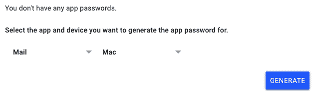

图 10.32 – Google 应用密码生成页面

在第一个框中，选择 **邮件**，在第二个框中，选择将使用应用密码的设备。由于我使用的是 Macbook，所以我将选择 **Mac**，如前述截图所示。然后，点击 **生成**。

将会出现一个类似于以下窗口：

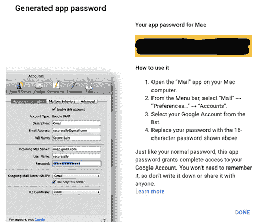

图 10.33 – Google 生成的应用密码弹出窗口

按照页面上的步骤操作，并将密码保存在你可以记住的地方。

### Airflow DAG 代码

为了避免冗余并专注于此菜谱的目标，即配置 Airflow 中的远程日志，我们将使用与 *在 Airflow 中创建基本日志* 菜谱相同的 DAG。然而，你也可以创建另一个具有不同名称但相同代码的 DAG。

尽管如此，你仍然可以在以下 GitHub 仓库中找到最终的代码：

[`github.com/PacktPublishing/Data-Ingestion-with-Python-Cookbook/tree/main/Chapter_10/Using_notifications_operators`](https://github.com/PacktPublishing/Data-Ingestion-with-Python-Cookbook/tree/main/Chapter_10/Using_notifications_operators)

## 如何做…

执行以下步骤来尝试这个菜谱：

1.  让我们先从在 Airflow 中配置 SMTP 服务器开始。在你的 `docker-compose.yaml` 文件的环境部分插入以下行：

    ```py
        # SMTP settings
        AIRFLOW__SMTP__SMTP_HOST: "smtp.gmail.com"
        AIRFLOW__SMTP__SMTP_USER: "your_email_here"
        AIRFLOW__SMTP__SMTP_PASSWORD: "your_app_password_here"
        AIRFLOW__SMTP__SMTP_PORT: 587
    ```

你的文件应该看起来像这样：

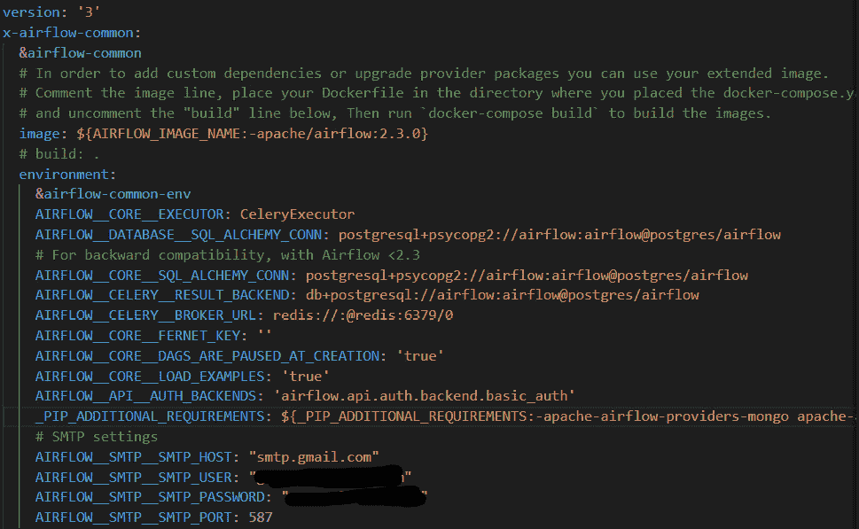

图 10.34 – 包含 SMTP 环境变量的 docker-compose.yaml

如果你直接编辑 `airflow.cfg` 文件，编辑以下行：

```py
[smtp]
# If you want airflow to send emails on retries, failure, and you want to use
# the airflow.utils.email.send_email_smtp function, you have to configure an
# smtp server here
smtp_host = smtp.gmail.com
smtp_starttls = True
smtp_ssl = False
# Example: smtp_user = airflow
smtp_user = your_email_here
# Example: smtp_password = airflow
smtp_password = your_app_password_here
smtp_port = 587
smtp_mail_from = airflow@example.com
smtp_timeout = 30
smtp_retry_limit = 5
```

在保存这些配置后，不要忘记重新启动 Airflow。

1.  现在，让我们编辑我们的 `basic_logging_dag` DAG，以便它可以使用 `EmailOperator` 发送电子邮件。让我们向我们的导入中添加以下行：

    ```py
    from airflow.operators.email import EmailOperator
    ```

导入将按照以下方式组织：

```py
from airflow import DAG
from airflow.operators.python_operator import PythonOperator
from airflow.operators.email import EmailOperator
from datetime import datetime, timedelta
import logging
# basic_logging_dag DAG code
# ...
```

1.  在 `default_args` 中，我们将添加三个新参数 – `email`、`email_on_failure` 和 `email_on_retry`。你在这里可以看到它的样子：

    ```py
    # basic_logging_dag DAG imports above this line
    default_args = {
        'owner': 'airflow',
        'depends_on_past': False,
        'start_date': datetime(2023, 4, 1),
        'email': ['sample@gmail.com'],
        'email_on_failure': True,
        'email_on_retry': True,
        'retries': 1,
        'retry_delay': timedelta(minutes=5)
    }
    # basic_logging_dag DAG code
    # …
    ```

目前你不需要担心这些新参数。我们将在 *它是如何工作的* 部分介绍它们。

1.  然后，让我们在我们的 DAG 中添加一个名为`success_task`的新任务。如果所有其他任务都成功，这个任务将触发`EmailOperator`来提醒我们。将以下代码添加到`basic_logging_dag`脚本中：

    ```py
    success_task = EmailOperator(
        task_id="success_task",
        to= "g.esppen@gmail.com",
        subject="The pipeline finished successfully!",
        html_content="<h2> Hello World! </h2>",
        dag=dag
    )
    ```

1.  最后，在脚本末尾，让我们添加工作流程：

    ```py
    extract_task >> transform_task >> load_task >> success_task
    ```

不要忘记，您始终可以在这里检查最终代码的样式：[`github.com/PacktPublishing/Data-Ingestion-with-Python-Cookbook/tree/main/Chapter_10/Using_noti%EF%AC%81cations_operators`](https://github.com/PacktPublishing/Data-Ingestion-with-Python-Cookbook/tree/main/Chapter_10/Using_noti%EF%AC%81cations_operators)

1.  如果你检查你的 DAG 图，你可以看到出现了一个名为`success_task`的新任务。它表明我们的操作符已经准备好使用。让我们通过在右上角选择播放按钮来触发我们的 DAG，就像我们在*步骤 3*中配置*airflow.cfg*日志时做的那样。

你的 Airflow UI 应该看起来像这样：

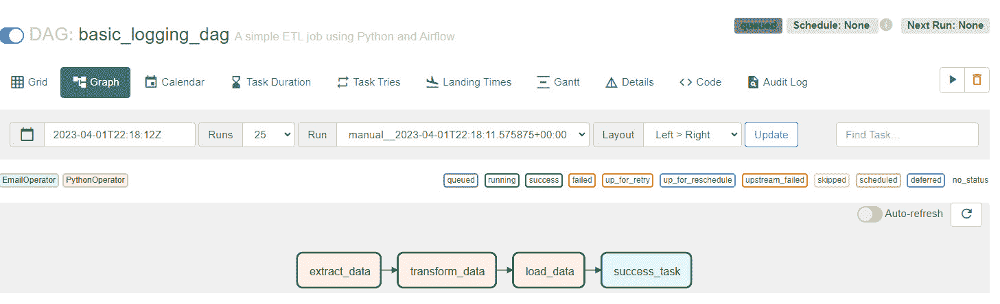

图 10.35 – basic_logging_dag 显示所有任务的成功运行

1.  然后，让我们检查我们的电子邮件。如果一切配置正确，你应该会看到以下类似的电子邮件：

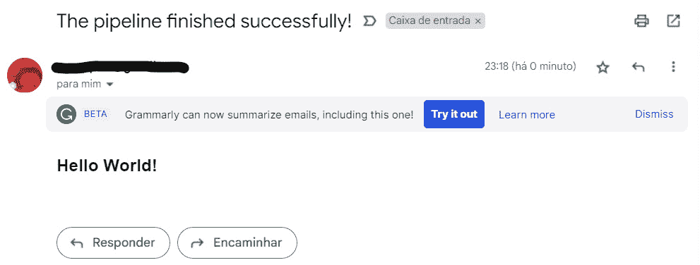

图 10.36 – 包含 Hello World!信息的电子邮件，表明 success_task 已成功执行

我们的`EmailOperator`工作得完全符合预期！

## 它是如何工作的…

让我们通过定义什么是 SMTP 服务器来开始解释代码。SMTP 服务器是电子邮件系统的一个关键组件，它使得服务器之间以及客户端到服务器的电子邮件消息传输成为可能。

在我们的案例中，Google 既作为发送者又作为接收者工作。我们借用一个 Gmail 主机来帮助我们从本地机器发送电子邮件。然而，当你在公司项目上工作时，你不需要担心这一点；你的 IT 运维团队会处理它。

现在，回到 Airflow – 一旦我们理解了 SMTP 的工作原理，其配置就很简单了。查阅 Airflow 配置的参考页面([`airflow.apache.org/docs/apache-airflow/stable/configurations-ref.xhtml`](https://airflow.apache.org/docs/apache-airflow/stable/configurations-ref.xhtml))，我们可以看到有一个专门针对 SMTP 的部分，正如你在这里看到的：

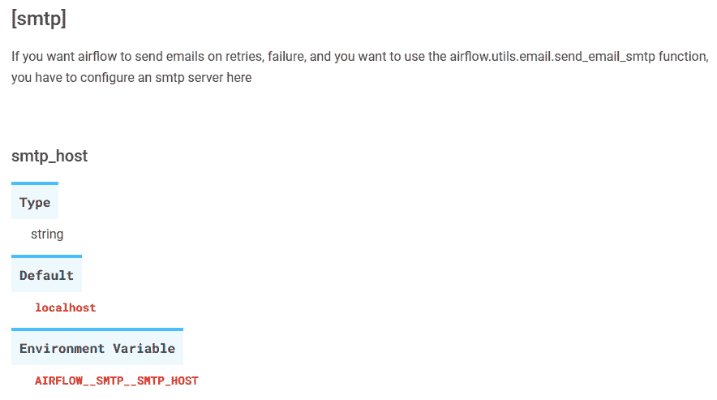

图 10.37 – Airflow SMTP 环境变量的文档页面

然后，我们只需要设置必要的参数，以允许主机（`smtp.gmail.com`）和 Airflow 之间的连接，正如你在这里看到的：

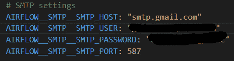

图 10.38 – 仔细查看 docker-compose.yaml 的 SMTP 设置

一旦完成这一步，我们将转到我们的 DAG 并声明`EmailOperator`，如下面的代码所示：

```py
success_task = EmailOperator(
    task_id="success_task",
    to="g.esppen@gmail.com",
    subject="The pipeline finished successfully!",
    html_content="<h2> Hello World! </h2>",
    dag=dag
)
```

电子邮件的参数非常直观，可以根据需要相应地设置。如果我们进一步深入，我们可以看到有很多可能性使这些字段的值更加抽象，以适应不同的功能结果。

还可以使用`html_content`中的格式化电子邮件模板，甚至附加完整的错误或日志消息。你可以在这里看到更多允许的参数：[`airflow.apache.org/docs/apache-airflow/stable/_api/airflow/operators/email/index.xhtml`](https://airflow.apache.org/docs/apache-airflow/stable/_api/airflow/operators/email/index.xhtml)。

在我们的案例中，这个操作员是在所有任务成功运行时触发的。但如果出现错误怎么办？让我们回到*步骤 3*并查看`default_args`：

```py
default_args = {
    'owner': 'airflow',
    'depends_on_past': False,
    'start_date': datetime(2023, 4, 1),
    'email': ['sample@gmail.com'],
    'email_on_failure': True,
    'email_on_retry': True,
    'retries': 1,
    'retry_delay': timedelta(minutes=5)
}
```

新增的两个参数（`email_on_failure`和`email_on_retry`）解决了 DAG 失败或重试任务的情况。`email`参数列表中的值是这些电子邮件的收件人。

由错误消息触发的默认电子邮件看起来像这样：

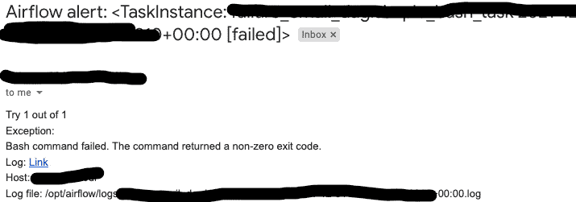

图 10.39 – Airflow 任务实例中的默认错误电子邮件

## 还有更多...

Airflow 的通知系统不仅限于发送电子邮件和计数，还提供了与 Slack、Teams 和 Telegram 的有用集成。

TowardsDataScience 有一篇关于如何将 Airflow 与 Slack 集成的精彩博客文章，你可以在这里找到它：[`towardsdatascience.com/automated-alerts-for-airflow-with-slack-5c6ec766a823`](https://towardsdatascience.com/automated-alerts-for-airflow-with-slack-5c6ec766a823)。

不仅限于企业工具，Airflow 还有一个 Discord 钩子：[`airflow.apache.org/docs/apache-airflow-providers-discord/stable/_api/airflow/providers/discord/hooks/discord_webhook/index.xhtml`](https://airflow.apache.org/docs/apache-airflow-providers-discord/stable/_api/airflow/providers/discord/hooks/discord_webhook/index.xhtml)。

我能给出的最好建议是始终查看 Airflow 社区文档。作为一个开源和活跃的平台，总有新的实现来帮助我们自动化并使我们的日常工作更轻松。

# 使用 SQL 操作员进行数据质量

优秀的**数据质量**对于一个组织来说至关重要，以确保其数据系统的有效性。通过在 DAG 中执行质量检查，可以在错误数据被引入生产湖或仓库之前停止管道并通知利益相关者。

尽管市场上有很多可用的工具提供**数据质量检查**，但最受欢迎的方法之一是通过运行 SQL 查询来完成。正如你可能已经猜到的，Airflow 提供了支持这些操作的服务提供者。

这个食谱将涵盖数据摄入过程中的数据质量主要主题，指出在这些情况下运行的最佳`SQLOperator`类型。

## 准备工作

在开始我们的练习之前，让我们创建一个简单的`customers`表。你可以看到它的样子如下：

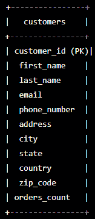

图 10.40 – 客户表列的一个示例

同样的表用其模式表示：

```py
CREATE TABLE customers (
    customer_id INT PRIMARY KEY,
    first_name VARCHAR(50),
    last_name VARCHAR(50),
    email VARCHAR(100),
    phone_number VARCHAR(20),
    address VARCHAR(200),
    city VARCHAR(50),
    state VARCHAR(50),
    country VARCHAR(50),
    zip_code VARCHAR(20)
);
```

你不需要担心在 SQL 数据库中创建此表。这个练习将专注于要检查的数据质量因素，并以这个表为例。

## 如何做到这一点...

下面是执行此食谱的步骤：

1.  让我们先定义以下基本数据质量检查：

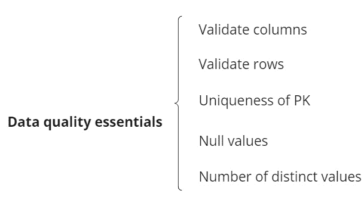

图 10.41 – 数据质量基本要点

1.  让我们想象使用集成并安装在我们 Airflow 平台中的`SQLColumnCheckOperator`来实现它。现在，让我们创建一个简单的任务来检查我们的表是否有唯一的 ID，以及所有客户是否都有`first_name`。我们的示例代码如下：

    ```py
    id_username_check = SQLColumnCheckOperator(
            task_id="id_username_check",
            conn_id= my_conn,
            table=my_table,
            column_mapping={
                "customer_id": {
                    "null_check": {
                        "equal_to": 0,
                        "tolerance": 0,
                    },
                    "distinct_check": {
                        "equal_to": 1,
                    },
                },
                "first_name": {
                    "null_check": {"equal_to": 0},
                },
            }
    )
    ```

1.  现在，让我们验证是否使用`SQLTableCheckOperator`摄入了所需的行数，如下所示：

    ```py
    customer_table_rows_count = SQLTableCheckOperator(
        task_id="customer_table_rows_count",
        conn_id= my_conn,
        table=my_table,
        checks={"row_count_check": {
                    "check_statement": "COUNT(*) >= 1000"
                }
            }
    )
    ```

1.  最后，让我们确保数据库中的客户至少有一个订单。我们的示例代码如下：

    ```py
    count_orders_check = SQLColumnCheckOperator(
        task_id="check_columns",
        conn_id=my-conn,
        table=my_table,
        column_mapping={
            "MY_NUM_COL": {
                "min": {"geq_to ": 1}
            }
        }
    )
    ```

`geq_to`键代表**大于或等于**。

## 它是如何工作的...

数据质量是一个复杂的话题，涉及许多变量，如项目或公司背景、商业模式以及团队之间的**服务水平协议**（**SLAs**）。基于此，本食谱的目标是提供数据质量的核心概念，并展示如何首先使用 Airflow SQLOperators 进行尝试。

让我们从*步骤 1*中的基本主题开始，如下所示：


图 10.42 – 数据质量基本要点

在一个通用场景中，这些项目是我们要处理和实施的主要主题。它们将保证基于列是否是我们预期的、创建行数的平均值、确保 ID 唯一以及控制特定列中的`null`和唯一值的最小数据可靠性。

使用 Airflow，我们采用了 SQL 方法来检查数据。正如本食谱开头所述，SQL 检查因其简单性和灵活性而广泛流行。不幸的是，为了模拟此类场景，我们需要设置一个勤奋的本地基础设施，而我们能想到的最好的办法是在 Airflow 中模拟任务。

在这里，我们使用了两种`SQLOperator`子类型——`SQLColumnCheckOperator`和`SQLTableCheckOperator`。正如其名称所示，第一个操作员更专注于通过检查是否存在 null 或唯一值来验证列的内容。在`customer_id`的情况下，我们验证了两种情况，并且对于`first_name`只有 null 值，如下所示：

```py
column_mapping={
            "customer_id": {
                "null_check": {
                    "equal_to": 0,
                    "tolerance": 0,
                },
                "distinct_check": {
                    "equal_to": 1,
                },
            },
            "first_name": {
                "null_check": {"equal_to": 0},
            },
        }
```

`SQLTableCheckOperator`将对整个表进行验证。它允许插入一个 SQL 查询来进行计数或其他操作，就像我们在*步骤 3*中验证预期行数一样，如以下代码片段所示：

```py
    checks={"row_count_check": {
                "check_statement": "COUNT(*) >= 1000"
            }
        }
```

然而，`SQLOperator`并不局限于这两者。在 Airflow 文档中，你可以看到其他示例和这些函数接受的完整参数列表：[`airflow.apache.org/docs/apache-airflow/2.1.4/_api/airflow/operators/sql/index.xhtml#module-airflow.operators.sql`](https://airflow.apache.org/docs/apache-airflow/2.1.4/_api/airflow/operators/sql/index.xhtml#module-airflow.operators.sql)。

一个值得关注的出色操作符是`SQLIntervalCheckOperator`，用于验证历史数据并确保存储的信息简洁。

在你的数据生涯中，你会发现数据质量是团队日常讨论和关注的话题。在这里最好的建议是持续寻找工具和方法来改进这一方法。

## 还有更多…

我们可以使用额外的工具来增强我们的数据质量检查。为此推荐的工具之一是**GreatExpectations**，这是一个用 Python 编写的开源平台，具有丰富的集成，包括 Airflow、**AWS S3**和**Databricks**等资源。

虽然这是一个你可以安装在任何集群上的平台，但**GreatExpectations**正在扩展到托管云版本。你可以在官方页面了解更多信息：[`greatexpectations.io/integrations`](https://greatexpectations.io/integrations)。

## 参见

+   *石川裕*有一篇关于在 Airflow 中使用 SQL 进行其他检查的精彩博客文章：[`yu-ishikawa.medium.com/apache-airflow-as-a-data-quality-checker-416ca7f5a3ad`](https://yu-ishikawa.medium.com/apache-airflow-as-a-data-quality-checker-416ca7f5a3ad)

+   关于 Airflow 中数据质量的更多信息，请在此处查看：[`docs.astronomer.io/learn/data-quality`](https://docs.astronomer.io/learn/data-quality)

# 进一步阅读

+   [`www.oak-tree.tech/blog/airflow-remote-logging-s3`](https://www.oak-tree.tech/blog/airflow-remote-logging-s3)

+   [`airflow.apache.org/docs/apache-airflow-providers-amazon/stable/connections/aws.xhtml#examples`](https://airflow.apache.org/docs/apache-airflow-providers-amazon/stable/connections/aws.xhtml#examples)

+   [`airflow.apache.org/docs/apache-airflow/stable/howto/email-config.xhtml`](https://airflow.apache.org/docs/apache-airflow/stable/howto/email-config.xhtml)

+   https://docs.astronomer.io/learn/logging

+   https://airflow.apache.org/docs/apache-airflow/stable/administration-and-deployment/logging-monitoring/metrics.xhtml#setup

+   https://hevodata.com/learn/airflow-monitoring/#aam

+   https://servian.dev/developing-5-step-data-quality-framework-with-apache-airflow-972488ddb65f
