# 12

# 使用数据可观察性进行调试、错误处理和预防停机

我们即将结束数据摄取之旅，已经涵盖了众多重要主题，并看到了它们如何应用于实际项目。现在，为了以精彩的方式结束这本书，最后一个主题是 **数据可观察性** 的概念。

数据可观察性指的是在大组织或小项目中监控、理解和调试数据健康、质量和其他关键方面的能力。简而言之，它确保数据在需要时准确、可靠且可用。

虽然本章中的每个食谱都可以单独执行，但目标是配置工具，当它们一起设置时，可以创建一个监控和可观察性架构，为项目或团队带来价值。

你将学习以下食谱：

+   设置 StatsD 以进行监控

+   设置 Prometheus 以存储指标

+   设置 Grafana 以进行监控

+   创建可观察性仪表板

+   设置自定义警报或通知

# 技术要求

本章要求 Airflow 安装在你的本地机器上。你可以直接在你的 **操作系统**（**OS**）上安装它，或者使用 Docker 镜像。有关更多信息，请参阅 *第一章* 和 *配置 Docker 以支持* *Airflow* 的食谱。

在遵循了 *第一章* 中描述的步骤之后，请确保 Airflow 运行正确。你可以通过检查此链接的 Airflow UI 来做到这一点：`http://localhost:8080`

如果你像我一样使用 Docker 容器来托管你的 Airflow 应用程序，你可以通过以下命令在终端中检查其状态：

```py
$ docker ps
```

下面是容器的状态：

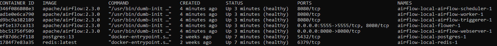

图 12.1 – 运行的 Airflow 容器

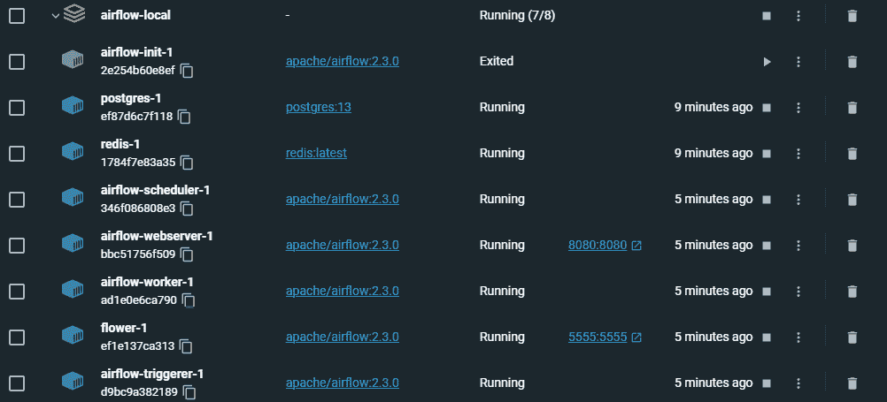

图 12.2 – 运行的 Airflow 容器在 Docker Desktop 中的视图

## Docker 镜像

本章要求创建其他 Docker 容器来构建监控和可观察性架构。如果你使用 `docker-compose.yaml` 文件来运行你的 Airflow 应用程序，你可以将此处提到的其他镜像添加到同一个 `docker-compose.yaml` 文件中，并一起运行。

如果你在本地上运行 Airflow，你可以单独创建和配置每个 Docker 镜像，或者只为本章中监控工具的方法创建一个 `docker-compose.yaml` 文件。

# 设置 StatsD 以进行监控

如在 *第十章* 中所述，**StatsD** 是一个开源守护进程，它收集和汇总关于应用程序行为的指标。由于其灵活性和轻量级，StatsD 被用于多个监控和可观察性工具，如 **Grafana**、**Prometheus** 和 **ElasticSearch**，以可视化和分析收集到的指标。

在此菜谱中，我们将使用 Docker 镜像作为构建监控管道的第一步来配置 StatsD。在这里，StatsD 将收集和汇总 Airflow 信息，并在 *为存储指标设置 Prometheus* 菜谱中使其对我们的监控数据库 Prometheus 可用。

## 准备工作

请参阅此菜谱的 *技术要求* 部分，因为我们将以相同的技术来处理它。

## 如何操作…

下面是执行此菜谱的步骤：

1.  让我们从定义我们的 StatsD Docker 配置开始。这些行将被添加到 `docker-compose` 文件中的 `services` 部分下：

    ```py
      statsd-exporter:
        image: prom/statsd-exporter
        container_name: statsd-exporter
        command: "--statsd.listen-udp=:8125 --web.listen-address=:9102"
        ports:
          - 9102:9102
          - 8125:8125/udp
    ```

1.  接下来，让我们设置 Airflow 环境变量以安装 StatsD 并将其指标导出到它，如下所示：

    ```py
    # StatsD configuration
    AIRFLOW__SCHEDULER__STATSD_ON: 'true'
    AIRFLOW__SCHEDULER__STATSD_HOST: statsd-exporter
    AIRFLOW__SCHEDULER__STATSD_PORT: 8125
    AIRFLOW__SCHEDULER__STATSD_PREFIX: airflow
    _PIP_ADDITIONAL_REQUIREMENTS: ${_PIP_ADDITIONAL_REQUIREMENTS:-apache-airflow[statsd]}
    ```

如果您需要帮助在 Airflow 中设置这些变量，请参阅 *第十章* 和 *在 airflow.cfg 中配置日志* 菜谱。

您在 `docker-compose` 文件中的 Airflow 变量应如下所示：

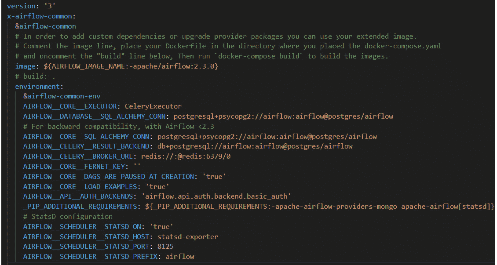

图 12.3 – 带有 StatsD 配置的 Airflow 环境变量

1.  现在，重新启动您的 Docker 容器以应用配置。

1.  一旦这样做，并且所有容器都启动并运行，让我们在浏览器中检查 `http://localhost:9102/` 地址。您应该看到以下页面：

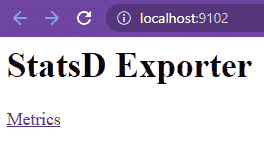

图 12.4 – 浏览器中的 StatsD 页面

1.  然后，点击 **指标**，将出现一个新页面，显示以下内容类似：

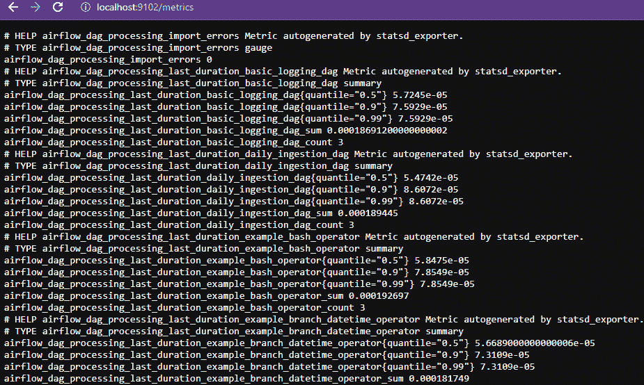

图 12.5 – 浏览器中显示的 StatsD 指标

浏览器中显示的行确认 StatsD 已成功安装并从 Airflow 收集数据。

## 它是如何工作的…

如您所观察到的，使用 Airflow 配置 StatsD 非常简单。实际上，StatsD 对我们来说并不陌生，因为我们已经在 *第十章* 中介绍了它，在 *设计高级监控* 菜谱中。然而，让我们回顾一些概念。

StatsD 是由 Etsy 员工构建的开源守护程序工具，它通过 **用户数据报协议**（**UDP**）接收信息，由于它不需要向发送者发送确认消息，因此使其快速且轻量级。

现在，查看代码，我们首先做的事情是将 Docker 容器设置为运行 StatsD。除了运行容器的所有常规参数外，关键点是 `command` 参数，如下所示：

```py
    command: "--statsd.listen-udp=:8125 --web.listen-address=:9102"
# StatsD configuration
AIRFLOW__SCHEDULER__STATSD_ON: 'true'
AIRFLOW__SCHEDULER__STATSD_HOST: statsd-exporter
AIRFLOW__SCHEDULER__STATSD_PORT: 8125
AIRFLOW__SCHEDULER__STATSD_PREFIX: airflow
_PIP_ADDITIONAL_REQUIREMENTS: ${_PIP_ADDITIONAL_REQUIREMENTS:-apache-airflow[statsd]}
```

## 相关内容

您可以在 **Docker Hub** 页面上检查 StatsD 的 Docker 镜像：[`hub.docker.com/r/prom/statsd-exporter`](https://hub.docker.com/r/prom/statsd-exporter)

# 为存储指标设置 Prometheus

虽然它通常被称为数据库，但 Prometheus 并不是像 MySQL 这样的传统数据库。相反，它的结构更类似于为监控和可观察性目的设计的时序数据库。

由于其灵活性和强大功能，此工具被 DevOps 和**站点可靠性工程师**（**SREs**）广泛用于存储系统与应用程序的相关指标和其他信息。与 Grafana（我们将在后续菜谱中探讨）一起，它是项目中团队最常用的监控工具之一。

此菜谱将配置一个 Docker 镜像以运行 Prometheus 应用程序。我们还将将其连接到 StatsD 以存储所有生成的指标。

## 准备工作

请参阅此菜谱的*技术要求*部分，因为我们将以相同的技术处理它。

## 如何操作…

执行此菜谱的步骤如下：

1.  让我们从在`docker-compose`文件的`services`部分添加以下行开始：

    ```py
      prometheus:
        image: prom/prometheus
        ports:
        - 9090:9090
        links:
          - statsd-exporter # Use the same name as your statsd container
        volumes:
          - ./prometheus:/etc/prometheus
        command:
          - '--config.file=/etc/prometheus/prometheus.yml'
          - --log.level=debug
          - --web.listen-address=:9090
          - --web.page-title='Prometheus - Airflow Metrics'
    ```

1.  现在，在`docker-compose`文件同一级别创建一个名为`prometheus`的文件夹。在该文件夹内，创建一个名为`prometheus.yml`的新文件，并按照以下代码进行保存：

    ```py
    scrape_configs:
      - job_name: 'prometheus'
        static_configs:
          - targets: ['prometheus:9090']
      - job_name: 'statsd-exporter'
        static_configs:
          - targets: ['statsd-exporter:9102']
    ```

在`static_configs`中，确保目标具有与 StatsD 容器相同的名称和暴露的端口。否则，你将面临与容器建立连接的问题。

1.  现在，重新启动你的 Docker 容器。

1.  当容器恢复并运行时，在浏览器中访问以下链接：`http://localhost:9090/`。

你应该会看到一个如下页面：

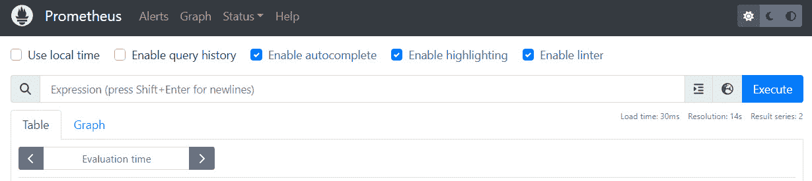

图 12.6 – Prometheus UI

1.  现在，点击页面右侧**执行**按钮旁边的列表图标。这将打开一个包含所有可用指标的列表。如果一切配置正确，你应该会看到以下类似的内容：

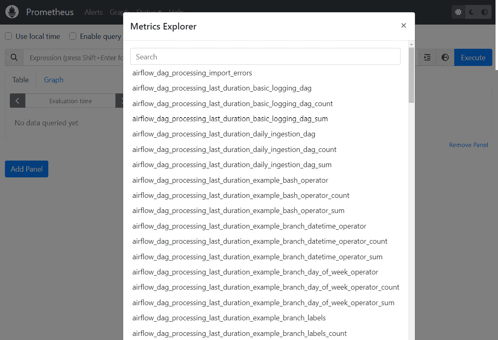

图 12.7 – Prometheus 可用指标列表

我们已成功设置 Prometheus，它已经存储了 StatsD 发送的指标！

## 它是如何工作的…

让我们通过检查*步骤 1*中的容器定义来更深入地探讨我们在这次练习中所做的工作。由于我们已经对 Docker 有基本了解，我们将涵盖容器设置中最关键的部分。

引人注目的是`docker-compose`文件中的`links`部分。在这个部分中，我们声明 Prometheus 容器必须连接并链接到在*设置 StatsD 以* *监控* 菜单中配置的 StatsD 容器：

```py
    links:
      - statsd-exporter # Use the same name as your statsd container
```

接下来，我们将`volumes`设置为将本地文件夹映射到容器内的文件夹。这一步至关重要，因为这样我们还可以镜像 Prometheus 的配置文件：

```py
    volumes:
      - ./prometheus:/etc/prometheus
```

最后，在`command`部分，我们声明了配置文件将在容器内放置的位置以及其他一些小设置：

```py
    command:
      - '--config.file=/etc/prometheus/prometheus.yml'
      - --log.level=debug
      - --web.listen-address=:9090
      - --web.page-title='Prometheus - Airflow Metrics'
```

然后，以下步骤是专门用于设置 Prometheus 配置文件的，正如你在这里可以看到的：

```py
scrape_configs:
  - job_name: 'prometheus'
    static_configs:
      - targets: ['prometheus:9090']
  - job_name: 'statsd-exporter'
    static_configs:
      - targets: ['statsd-exporter:9102']
```

根据定义，Prometheus 通过 HTTP 请求从自身和其他应用程序收集指标。换句话说，它解析响应并摄取收集的样本以进行存储。这就是为什么我们使用了 `scrape_configs`。

如果你仔细观察，你会注意到我们声明了两个抓取作业：一个用于 Prometheus，另一个用于 StatsD。由于这个配置，我们可以在 Prometheus 指标列表中看到 Airflow 指标。如果我们需要包含任何其他抓取配置，我们只需编辑本地的 `prometheus.yml` 文件并重新启动服务器即可。

Prometheus 中还有许多其他配置可用，例如设置抓取间隔。你可以在官方文档页面上了解更多关于其配置的信息：[`prometheus.io/docs/prometheus/latest/getting_started/`](https://prometheus.io/docs/prometheus/latest/getting_started/)。

## 更多内容...

在这个菜谱中，我们看到了如何设置 Prometheus 以存储来自 StatsD 的指标。这个时序数据库还有其他功能，例如在 Web UI 中创建小型可视化，以及与其他客户端库连接，并有一个名为 Alertmanager 的警报系统。

如果你想要深入了解 Prometheus 的工作原理和其他功能，Sudip Sengupta 有一个关于它的精彩博客文章，你可以在这里阅读：[`sudipsengupta.com/prometheus/`](https://sudipsengupta.com/prometheus/)

[`www.airplane.dev/blog/prometheus-metrics`](https://www.airplane.dev/blog/prometheus-metrics)

# 设置 Grafana 以进行监控

**Grafana** 是一个开源工具，用于创建可视化并监控来自其他系统和应用程序的数据。与 Prometheus 一起，由于其灵活性和丰富的功能，它成为最受欢迎的 DevOps 工具之一。

在这个练习中，我们将配置一个 Docker 镜像以运行 Grafana 并将其连接到 Prometheus。这个配置不仅将使我们能够进一步探索 Airflow 指标，而且还有机会在实践中学习如何使用一组最流行的监控和可观察性工具。

## 准备工作

参考此菜谱的 *技术要求* 部分，因为我们将以相同的技术来处理它。

在这个菜谱中，我将使用 Airflow 的相同 `docker-compose.yaml` 文件，并保留从 *设置 StatsD 以进行监控* 和 *设置 Prometheus 以存储指标* 菜谱中的配置，以将它们连接起来并继续进行监控和可观察性架构。

## 如何操作...

按照以下步骤尝试这个菜谱：

1.  如下所示，让我们像往常一样将 Grafana 容器信息添加到我们的 `docker-compose` 文件中。确保它在 `services` 部分下：

    ```py
      grafana:
        image: grafana/grafana:latest
        container_name: grafana
        environment:
          GF_SECURITY_ADMIN_USER: admin
          GF_SECURITY_ADMIN_PASSWORD: admin
          GF_PATHS_PROVISIONING: /grafana/provisioning
        links:
          - prometheus # use the same name of your Prometheus docker container
        ports:
          - 3000:3000
        volumes:
          - ./grafana/provisioning:/grafana/provisioning
    ```

随意使用不同的管理员用户名作为密码。

1.  现在，在你的 Docker 文件同一级别创建一个名为 `grafana` 的文件夹，并重新启动你的容器。

1.  在它恢复并运行后，将 `http://localhost:3000/login` 链接插入到你的浏览器中。将出现一个类似于这样的登录页面：

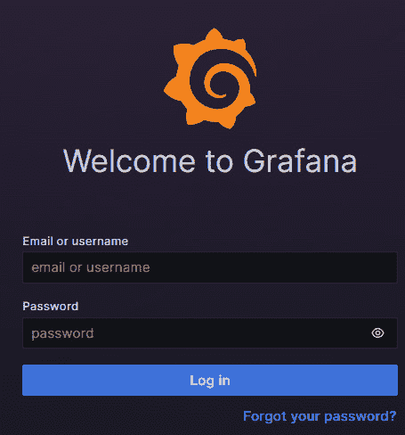

图 12.8 – Grafana 登录页面

这确认了 Grafana 已正确设置！

1.  然后，让我们使用管理员凭据登录到 Grafana 仪表板。认证后，你应该看到以下主页面：

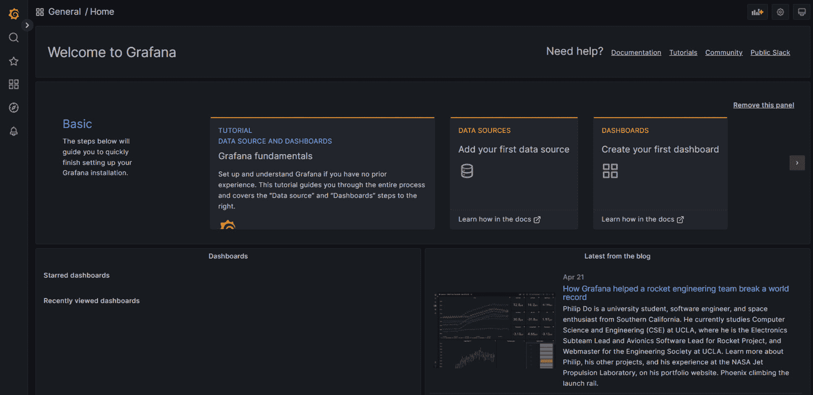

图 12.9 – Grafana 主页面

由于这是我们第一次登录，此页面没有任何显示。我们将在 *创建可观察性* *仪表板* 菜单中处理可视化。

1.  现在，让我们将 Prometheus 添加为 Grafana 的数据源。在页面左下角，将鼠标悬停在引擎图标上。在 **配置** 菜单中，选择 **数据源**。以下截图供参考：

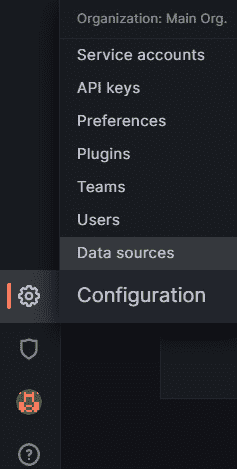

图 12.10 – Grafana 配置菜单

1.  在 **数据源** 页面上，选择 Prometheus 图标。你将被重定向到一个新页面，显示插入 Prometheus 设置的字段，如你所见：

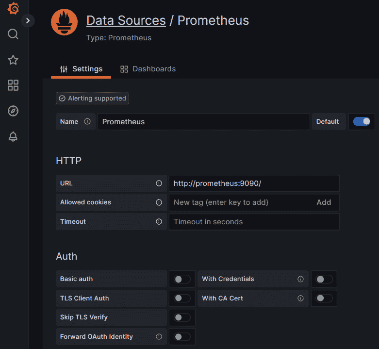

图 12.11 – Grafana 中的数据源页面

为此数据源插入一个名称。在 `http://prometheus:9090`。确保它与你的 Prometheus Docker 容器名称相同。

保存此配置，我们已经成功配置了带有 Prometheus 的 Grafana！

## 它是如何工作的…

在这个练习中，我们看到了如何简单配置 Grafana 并将其与 Prometheus 作为数据源集成。实际上，几乎所有的 Grafana 集成都非常简单，只需要几条信息。

现在，让我们探索一些我们的 Grafana 容器设置。尽管有标准的 Docker 容器设置，但有一些项目需要关注，如你所见：

```py
  grafana:
    ...
    environment:
      GF_SECURITY_ADMIN_USER: admin
      GF_SECURITY_ADMIN_PASSWORD: admin
      GF_PATHS_PROVISIONING: /grafana/provisioning
    ...
    volumes:
      - ./grafana/provisioning:/grafana/provisioning
```

第一件事是 `环境变量`，我们在这里定义了允许第一次登录的管理员凭据。然后，我们声明了 Grafana 配置的路径，并且，正如你所注意到的，我们还在 `volumes` 部分插入了这个路径。

在 `provisioning` 文件夹中，我们将有数据源连接、插件、仪表板等的配置文件。这样的配置允许仪表板和面板有更高的可靠性和版本控制。我们也可以使用 `.yaml` 配置文件创建 Prometheus 数据源连接，并将其放置在 `provisioning` 和 `datasources` 文件夹下。它看起来可能如下所示：

```py
apiVersion: 1
datasources:
  - name: Prometheus
    type: prometheus
    access: proxy
    url: http://prometheus:9090
```

任何额外的数据源都可以放置在这个 YAML 文件中。你可以在 Grafana 的官方文档页面了解更多关于配置配置的信息：[`grafana.com/docs/grafana/latest/administration/provisioning/`](https://grafana.com/docs/grafana/latest/administration/provisioning/)。

通过这种方式，我们创建了一个简单高效的监控和可观察性架构，能够从 Airflow（或任何其他应用程序，如果需要）收集指标，存储并显示它们。该架构可以定义为以下：


图 12.12 – 监控和可观察性高级架构

我们现在可以开始创建我们本章最后两个菜谱中的第一个仪表板和警报了！

## 更多内容…

除了 Prometheus 之外，Grafana 还为许多应用程序内置了核心数据源集成。它允许轻松配置和快速设置，这为项目带来了很多价值和成熟度。您可以在以下位置找到更多信息：[`grafana.com/docs/grafana/latest/datasources/#built-in-core-data-sources`](https://grafana.com/docs/grafana/latest/datasources/#built-in-core-data-sources)。

### Grafana Cloud

Grafana Labs 还将平台作为完全托管和云部署的服务提供。这对于没有专门运营团队来支持和维护 Grafana 的团队来说是一个很好的解决方案。更多信息请参阅：[`grafana.com/products/cloud/`](https://grafana.com/products/cloud/)。

# 创建可观察性仪表板

现在，随着我们的工具启动并运行，我们终于可以进入可视化仪表板了。监控和可观察性仪表板旨在帮助我们深入了解系统的健康和行为。您将在本练习中观察到 Grafana 如何帮助我们创建一个可观察性仪表板以及其中的许多功能。

在这个菜谱中，我们将创建一个包含几个面板的第一个仪表板，以更好地监控我们的 Airflow 应用程序。您将注意到，只需几个步骤，就可以对 Airflow 随时间的行为有一个概览，并准备好构建未来的面板。

## 准备工作

请参考此菜谱的 *技术要求* 部分，因为我们将以相同的技术来处理它。

要完成此练习，请确保 StatsD、Prometheus 和 Grafana 已正确配置并正在运行。

## 如何操作…

让我们创建我们的仪表板以跟踪 Airflow：

1.  在 Grafana 主页上，将光标悬停在左侧面板的四个方块图标上。然后，选择 **新建仪表板**，如以下截图所示：

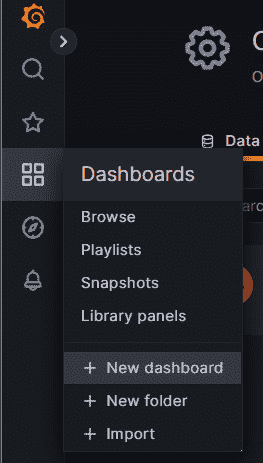

图 12.13 – Grafana 仪表板菜单

如果您需要帮助访问 Grafana，请参考 *设置 Grafana 进行* *监控* 菜谱。

1.  您将被重定向到一个标题为 **新仪表板** 的空白页面。在页面右上角，选择 **保存**，输入您仪表板的名称，然后再次点击 **保存** 按钮。请参考以下截图：

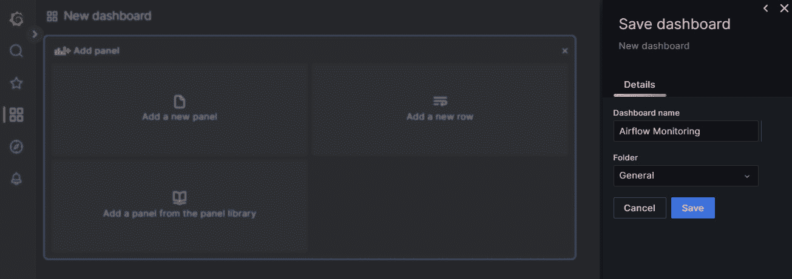

图 12.14 – 新仪表板页面

1.  现在，让我们通过点击仪表板页面右上角的 **添加面板** 图标来创建我们的第一个面板，如图所示：

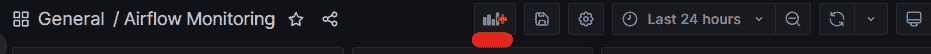

图 12.15 – 添加面板图标

1.  现在，让我们创建一个面板来显示 Airflow 内部的 DAG 数量。在 **编辑面板** 页面上，设置以下信息：

    +   **指标**：**airflow_dagbag_size**

    +   **标签过滤器**：**job**，**statsd-exporter**

    +   可视化类型：**统计**

您可以在以下屏幕截图中看到填写的信息：

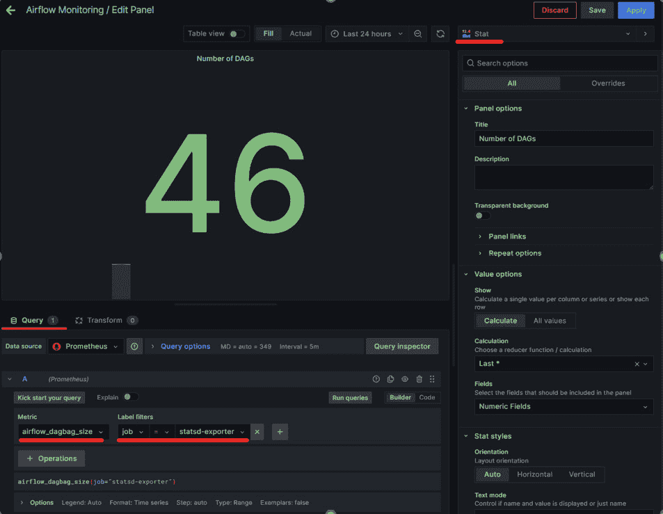

图 12.16 – Airflow DAG 数量面板计数

点击 **应用** 保存并返回仪表板页面。

1.  让我们按照 *步骤 3* 的相同方法创建另一个面板。这次我们将创建一个面板来显示 Airflow 导入错误的数量。填写以下值：

    +   **指标**：**airflow_dag_processing_import_errors**

    +   **标签过滤器**：**job**，**statsd-exporter**

    +   可视化类型：**统计**

您可以在以下屏幕截图中看到添加的信息：

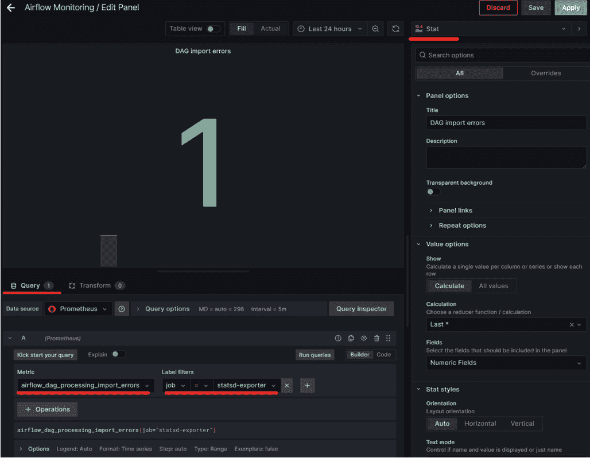

图 12.17 – DAG 导入错误面板计数

1.  现在，让我们创建两个带有以下信息的面板：

    +   `airflow_executor_queued_tasks`

    +   `job`，`statsd-exporter`

    +   可视化类型：**统计**

    +   **指标**：**airflow_scheduler_tasks_running**

    +   **标签过滤器**：**job**，**statsd-exporter**

    +   可视化类型：**统计**

1.  让我们再创建两个面板来展示两个不同 DAG 的执行时间。创建两个面板，并填写以下值：

    +   **指标**：**airflow_dag_processing_last_duration_basic_logging_dag**

    +   **标签过滤器**：**分位数**，**0.99**

    +   可视化类型：**时间序列**

请参考以下屏幕截图：

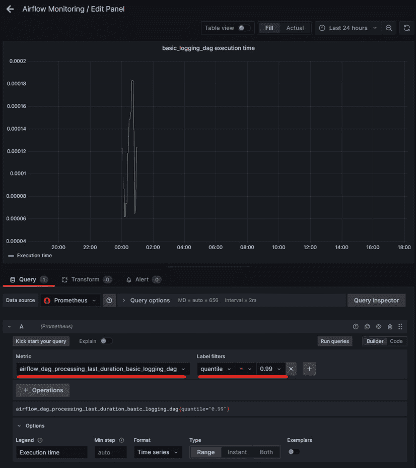

图 12.18 – basic_logging_dag 执行运行面板

+   **指标**：**airflow_dag_processing_last_duration_holiday_ingest_dag**

+   **标签过滤器**：**分位数**，**0.99**

+   可视化类型：**时间序列**

您可以在以下屏幕截图中看到完成的字段：

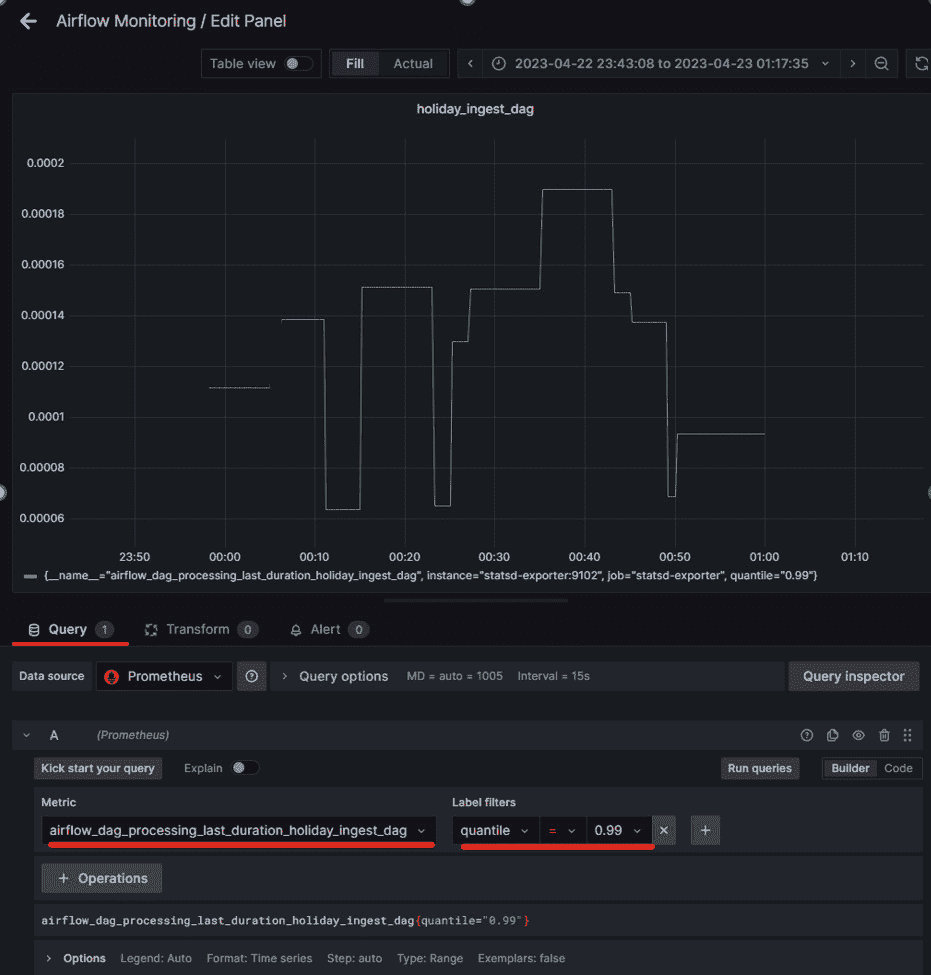

图 12.19 – holiday_ingest_dag 执行运行面板

最后，您将得到一个类似于以下仪表板的界面：

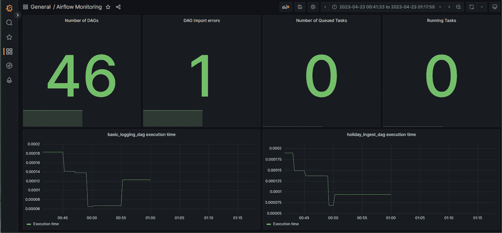

图 12.20 – 完整的 Airflow 监控仪表板视图

如果您的仪表板布局与 *图 12*.*20* 完全不同，请不要担心。您可以随意调整面板布局，以添加您自己的风格！

## 它是如何工作的...

市场上有很多 DevOps 可视化工具。然而，大多数都需要付费订阅或培训有素的人员来构建面板。正如你在这次练习中观察到的，使用 Grafana 创建第一个仪表板和面板可以相当简单。当然，随着你练习并学习 Grafana 的高级概念，你会观察到许多改进和增强仪表板的机会。

现在，让我们探索我们创建的六个面板。这些面板背后的想法是创建一个包含最少信息但已能带来价值的简易仪表板。

前四个面板提供了关于 Airflow 的快速和相关信息，如下所示：

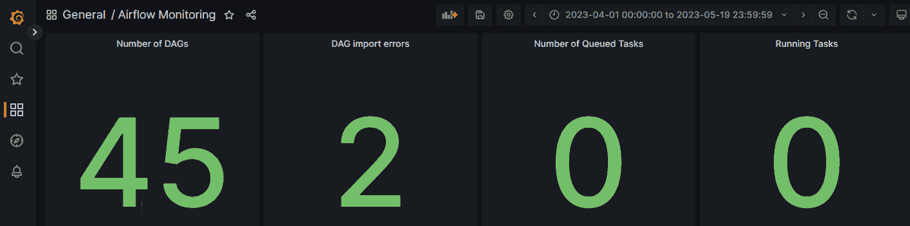

图 12.21 –Airflow 监控计数面板

它们显示了关于 DAG 数量、我们有多少个导入错误、等待执行的任务数量以及正在执行的任务数量的信息。尽管看起来很简单，但这些信息提供了 Airflow 当前行为的概述（因此，可观察性）。

最后两个面板显示了两个 DAG 执行持续时间的相关信息：

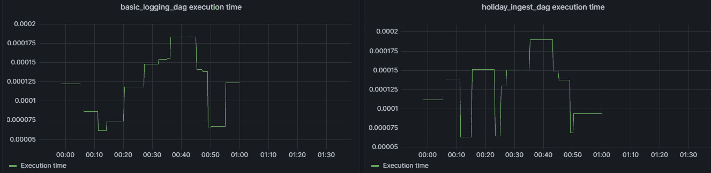

图 12.22 – Airflow 监控时间序列面板

了解 DAG 运行所需的时间是至关重要的信息，它可以提供改进代码或检查管道中使用的数据的可靠性的洞察。例如，如果 DAG 在预期时间的一半以下完成所有任务，这可能是一个没有正确处理数据的信号。

最后，你可以创建更多仪表板并将它们根据主题组织到文件夹中。你可以在 Grafana 的官方文档中查看仪表板组织的推荐最佳实践：[`grafana.com/docs/grafana/latest/dashboards/build-dashboards/best-practices/`](https://grafana.com/docs/grafana/latest/dashboards/build-dashboards/best-practices/)。

## 还有更多...

不幸的是，由于我们在仪表板上展示的数据有限，这次练习可能不像你预期的那么花哨。然而，你可以探索 Grafana 面板配置并掌握它们，以便在 Grafana playground 的进一步项目中使用：[`play.grafana.org/d/000000012/grafana-play-home?orgId=1`](https://play.grafana.org/d/000000012/grafana-play-home?orgId=1)。

在**Grafana Play Home**页面上，你将能够看到不同类型的面板应用，并探索它们是如何构建的。

# 设置自定义警报或通知

在配置我们的第一个仪表板以了解 Airflow 应用程序后，我们必须确保我们的监控始终处于观察之下。随着团队忙于其他任务，创建警报是确保我们仍然对应用程序保持监督的最佳方式。

创建警报和通知有许多方法，之前我们实现了一种类似的方法，当发生错误时通过发送电子邮件通知来监控我们的 DAG。现在，我们将尝试不同的方法，使用与 **Telegram** 的集成。

在这个菜谱中，我们将集成 Grafana 警报与 Telegram。使用不同的工具提供系统警报可以帮助我们理解最佳方法来建议我们的团队并打破总是使用电子邮件的循环。

## 准备中

请参考此菜谱的 **技术要求** 部分，因为我们将以相同的技术来处理它。

要完成这个练习，请确保 StatsD、Prometheus 和 Grafana 已正确配置并正在运行。此练习还需要一个 Telegram 账户。你可以在以下链接中找到创建账户的步骤：[`www.businessinsider.com/guides/tech/how-to-make-a-telegram-account`](https://www.businessinsider.com/guides/tech/how-to-make-a-telegram-account)。

## 如何做到这一点...

执行此菜谱的步骤如下：

1.  让我们从在 Telegram 上创建一个用于 Grafana 发送警报的机器人开始。在 Telegram 主页上，搜索 `@BotFather` 并按照以下方式开始对话：


图 12.23 – Telegram BotFather

1.  然后，输入 `/newbot` 并遵循提示指令。BotFather 将会发送给你一个机器人令牌。请将其保存在安全的地方；我们稍后会用到它。消息看起来如下所示：

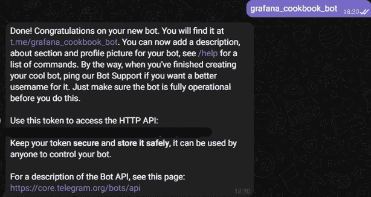

图 12.24 – 新建机器人消息

1.  接下来，在 Telegram 上创建一个群组，并以管理员权限邀请你的机器人加入。

1.  现在，让我们使用 Telegram API 来检查机器人所在的频道 ID。你可以在浏览器中使用以下地址来完成此操作：

    ```py
    https://api.telegram.org/bot<YOUR CODE HERE>/getUpdates
    ```

你应该在浏览器中看到类似的输出：

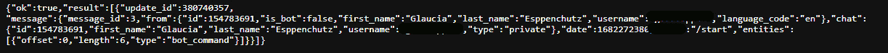

图 12.25 – Telegram API 消息与 Chat ID

我们稍后会使用 `id` 值，所以也请将其保存在安全的地方。

1.  然后，让我们继续创建一个 Grafana 通知组。在左侧菜单栏中，将鼠标悬停在铃铛图标上，并选择如下所示的 **联系人点**：

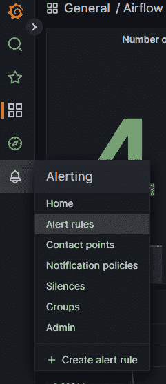

图 12.26 – Grafana 警报菜单

1.  在 **联系人点** 选项卡上，按照以下方式选择 **添加联系人点**：

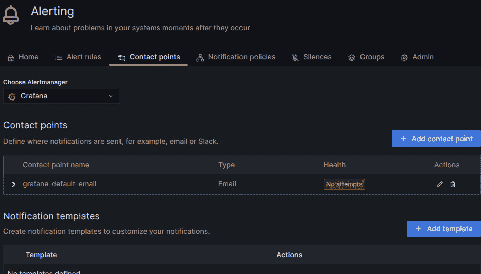

图 12.27 – Grafana 中的联系人点选项卡

1.  在 **新建联系人点** 页面上添加一个名称，并在 **集成** 下拉菜单中选择 **Telegram**。然后，完成 **Bot API 令牌** 和 **Chat ID** 字段。你可以在这里看到它的样子：

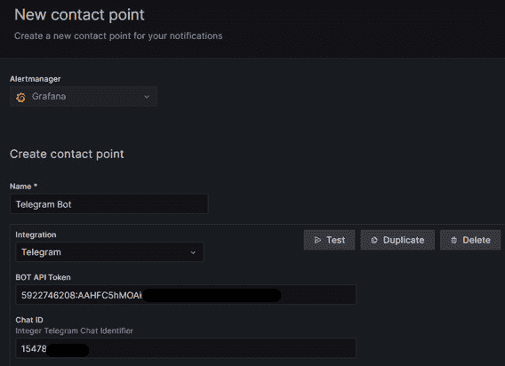

图 12.28 – 新联系人点页面

1.  现在，让我们确保在点击**测试**按钮时正确地插入了值。如果一切配置得当，你将在你的机器人所在的频道收到以下消息：

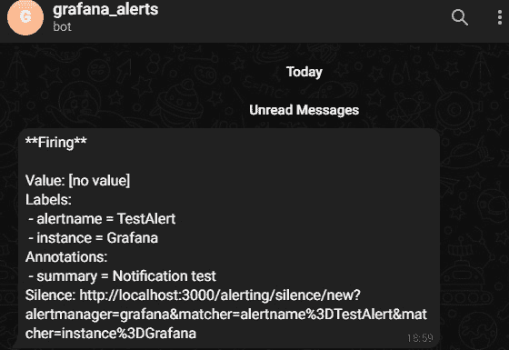

图 12.29 – Grafana 测试消息成功工作

这意味着我们的机器人已经准备好了！保存接触点并返回警报页面。

1.  在**通知策略**中，编辑**根策略**的接触点为以下内容：

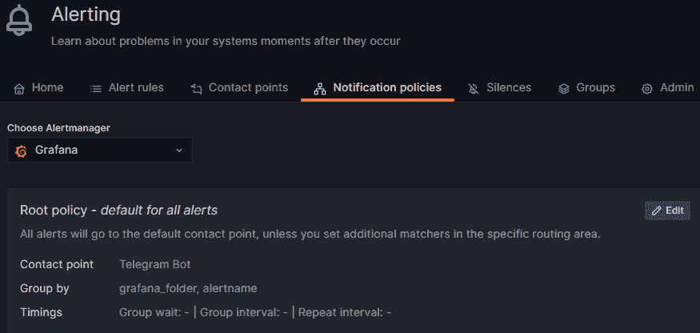

图 12.30 – Grafana 通知策略选项卡

1.  最后，让我们创建一个警报规则来触发警报通知。在**警报规则**页面，选择**创建警报规则**以跳转到新页面。在此页面的字段中插入以下值：

    +   **规则名称**: **导入错误**

    +   **指标**: **airflow_dag_processing_import_errors**

    +   **标签过滤器**: **实例**, **statsd-exporter:9102**

    +   **阈值**: **输入 A**，**IS** **ABOVE 1**

    +   **文件夹**: 在**评估组**中创建一个名为**Errors**和**test_group**的新文件夹

    +   **规则组评估间隔**: **3 分钟**

你应该会有以下类似的截图。你也可以将其用作参考来填写字段：

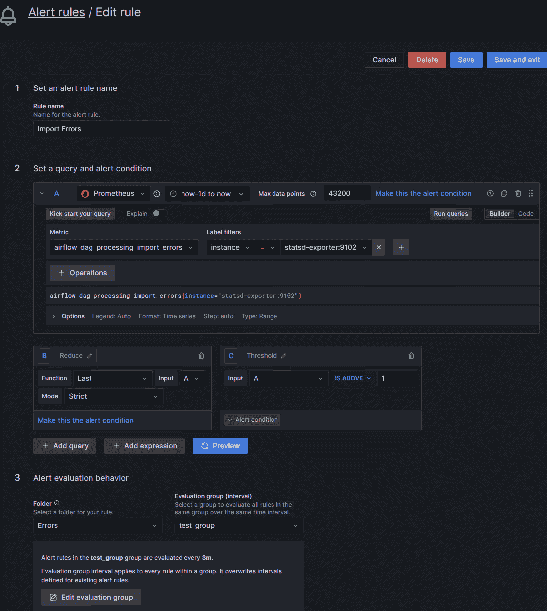

图 12.31 – Grafana 上 Airflow 导入错误的新的警报规则

保存它，然后在 Airflow 中模拟一个导入错误。

1.  在 Airflow 的 DAG 中创建任何导入错误后，你将在 Telegram 频道中收到类似以下的通知：

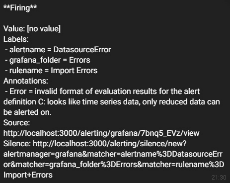

图 12.32 – 被 Grafana 警报触发的 Telegram 机器人显示通知

由于这是一个本地测试，目前你不需要担心**注释**部分。

我们的 Grafana 通知工作正常，并且已经完全集成到 Telegram 中！

## 它是如何工作的…

虽然这个食谱有很多步骤，但内容并不复杂。这个练习的目的是给你一个配置简单机器人以在需要时创建警报的实用端到端示例。

在 DevOps 中，机器人经常被用作通知动作的工具，这里也不例外。从**步骤 1**到**步骤 4**，我们专注于在 Telegram 中配置一个机器人以及一个可以发送 Grafana 通知的频道。选择 Telegram 作为我们的通讯工具没有特别的原因，只是因为创建账户的便利性。通常，像**Slack**或**Microsoft Teams**这样的通讯工具是运维团队的首选，而且有很多在线教程展示了如何使用它们。

配置好机器人后，我们继续将其与 Grafana 连接。配置只需要提供少量信息，例如认证令牌（用于控制机器人）和渠道 ID。正如你所观察到的，有许多类型的集成可用，并且在安装插件时可以添加更多。你可以在这里查看完整的插件列表：[Grafana 插件列表](https://grafana.com/grafana/plugins/)。

如果我们需要多个联系点，我们可以在**联系点**选项卡上创建它，并创建一个通知策略，将新联系点包括在内作为通知对象。

最后，我们根据 Airflow 导入错误的数量创建了一条警报规则。导入错误可能会影响一个或多个 DAG 的执行；因此，它们是值得监控的相关项目。

创建警报和通知有两种方式：在**警报规则**页面和直接在仪表板面板上。后者取决于面板类型，并非所有面板都支持集成警报。最安全的选择，也是最佳实践，是在**警报规则**页面上创建警报规则。

创建警报类似于面板，我们需要识别指标和标签，关键点是**阈值**和**警报评估**条件。这两个配置将决定指标值接受的极限以及它可能需要的时间。为了测试目的，我们设置了一个浅阈值和短评估时间，并故意引发了一个错误。然而，标准的警报规则可以有更多的时间容忍度和基于团队需求的阈值。

最后，在一切设置妥当后，我们看到了机器人的实际操作，一旦触发条件满足，它就会立即提供警报。

# 进一步阅读

+   [使用 Prometheus Statsd Exporter 和 Grafana 的指标](https://dev.to/kirklewis/metrics-with-prometheus-statsd-exporter-and-grafana-5145)

+   [Uber Cadence 的 Pull Request 4793 的文件差异](https://github.com/uber/cadence/pull/4793/files#diff-32d8136ee76608ed05392cfd5e8dce9a56ebdad629f7b87961c69a13edef88ec)

+   [使用 Prometheus Statsd 和 Grafana 监控 Airflow 的日常数据工程](https://databand.ai/blog/everyday-data-engineering-monitoring-airflow-with-prometheus-statsd-and-grafana/)

+   [可观察性与监控的区别](https://www.xenonstack.com/insights/observability-vs-monitoring)

+   [可观察性与监控的区别](https://www.instana.com/blog/observability-vs-monitoring/)

+   [评估数据可观察性工具的指南](https://acceldataio.medium.com/a-guide-to-evaluating-data-observability-tools-5589ad9d35ed)
