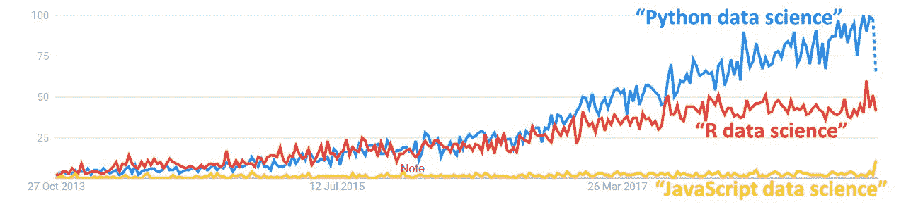
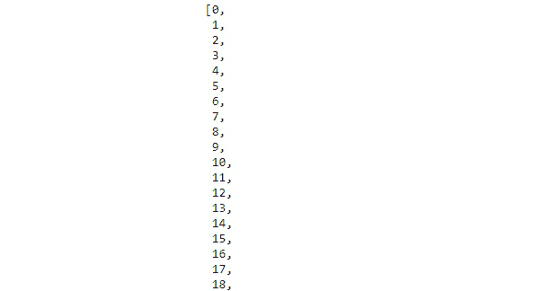
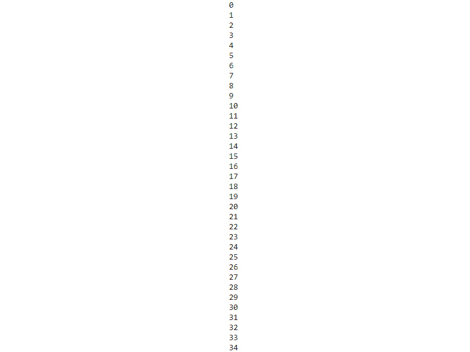
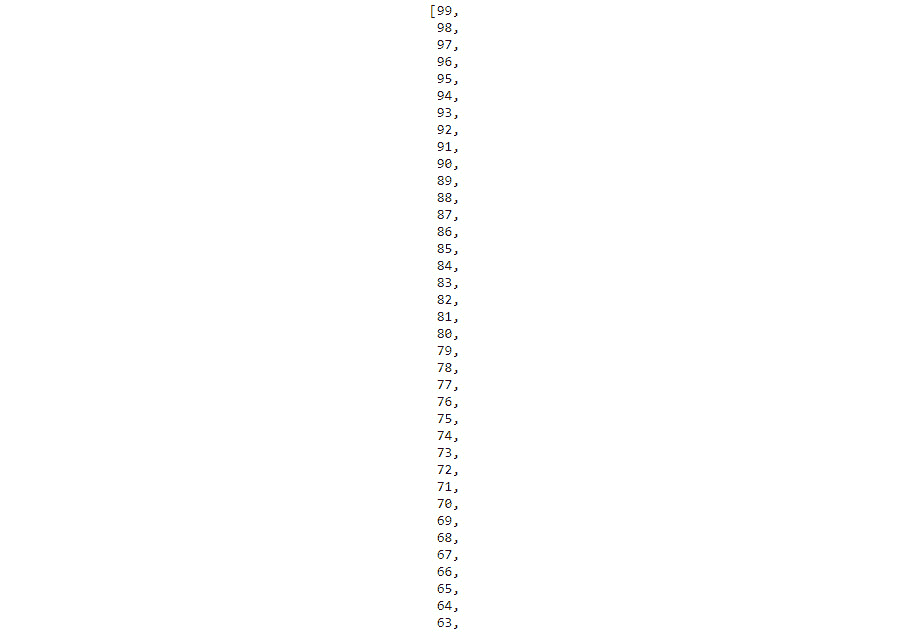
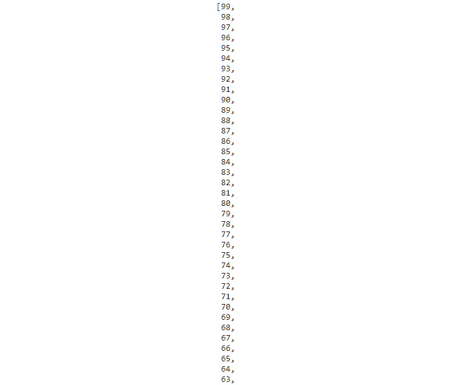
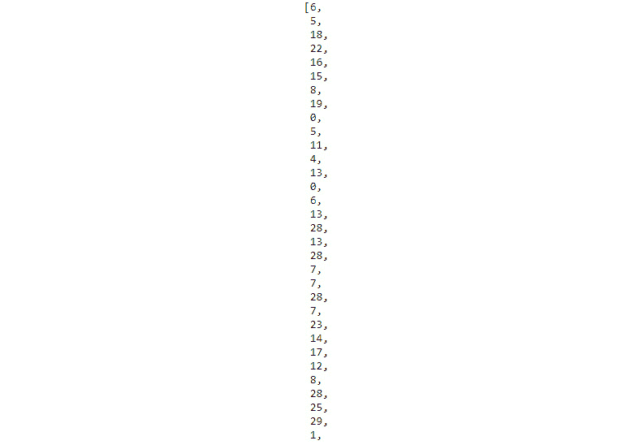
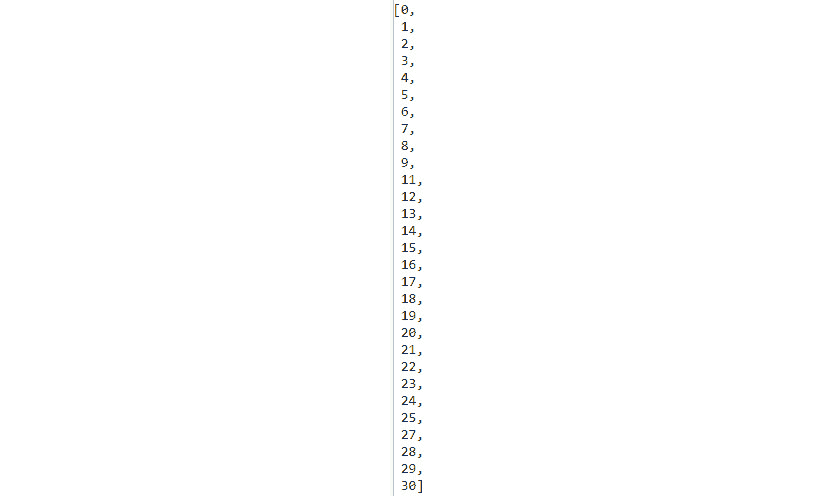
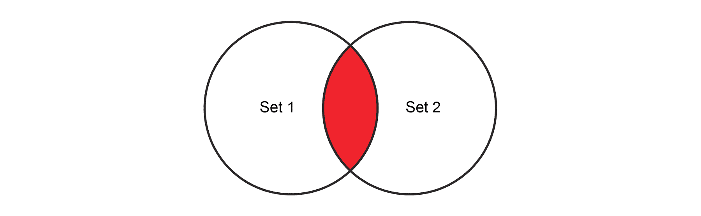
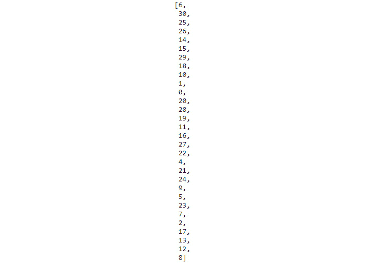

# 第二章：*第一章*

# Python 数据整理简介

## 学习目标

到本章结束时，你将能够做到以下几件事情：

+   定义数据整理在数据科学中的重要性

+   操作 Python 中可用的数据结构

+   比较内置 Python 数据结构的不同实现

本章描述了数据整理的重要性，确定了数据整理中要执行的重要任务，并介绍了基本的 Python 数据结构。

## 简介

数据科学和分析正在接管整个世界，数据科学家的职位通常被称为 21 世纪最酷的工作。但尽管对数据的强调，是科学使你——实践者——真正有价值。

要用高质量的科学数据进行实践，你需要确保数据来源正确、清洗、格式化和预处理。这本书教你这个数据科学流程中无价组件的最基本基础知识：数据整理。简而言之，数据整理是确保数据以干净、准确、格式化且准备好用于数据分析的格式的流程。

数据整理的一个显著例子是在加州大学圣地亚哥分校（UCSD）超级计算中心进行的。在加利福尼亚，野火非常常见，主要是因为干旱的天气和极端的高温，尤其是在夏季。UCSD 超级计算中心的数据科学家收集数据来预测火灾的性质和蔓延方向。来自气象站、森林中的传感器、消防站、卫星图像和 Twitter 流的数据可能仍然是不完整或缺失的。这些数据需要被清洗和格式化，以便用于预测未来野火的发生。

这是一个数据整理和数据科学如何证明是有帮助和相关的例子。

### 数据整理的重要性

石油不是从钻井平台直接以最终形式出现的；它必须经过提炼。同样，数据必须经过整理、按摩和提炼，才能用于智能算法和消费产品。这被称为整理。大多数数据科学家将大部分时间花在数据整理上。

数据整理通常是在数据科学/分析流程的第一个阶段进行的。在数据科学家确定了用于解决业务问题的有用数据源（例如，内部数据库存储或互联网或流式传感器数据）之后，他们接着从这些来源提取、清洗和格式化必要的数据。

通常，数据整理的任务包括以下步骤：

+   从多个来源（包括网页和数据库表）抓取原始数据

+   补充、格式化和转换——基本上是使其准备好用于建模过程（如高级机器学习）

+   处理读写错误

+   检测异常值

+   执行快速的可视化（绘图）和基本统计分析，以判断您整理后的数据质量

这是对数据整理在典型数据科学流程中的定位和基本功能角色的说明性表示：


###### 图 1.1：数据整理过程

数据整理的过程首先是要找到分析所需的数据。这些数据可能来自一个或多个来源，例如推文、关系型数据库中的银行交易报表、传感器数据等等。这些数据需要被清理。如果有缺失数据，我们将使用几种技术中的任何一种来删除或替换它。如果有异常值，我们首先需要检测它们，然后适当地处理它们。如果数据来自多个来源，我们将不得不执行连接操作来合并它们。

在极其罕见的情况下，可能不需要进行数据整理。例如，如果机器学习任务所需的数据已经以可接受格式存储在内部数据库中，那么一个简单的 SQL 查询可能就足够将数据提取到表格中，以便传递到建模阶段。

## 用于数据整理的 Python

总是有人争论是否应该使用企业工具还是使用编程语言及其相关框架来进行数据整理过程。有许多商业级的企业工具用于数据格式化和预处理，用户不需要编写太多代码。以下是一些例子：

+   通用数据分析平台，如 Microsoft Excel（带插件）

+   统计发现包，如 **JMP**（来自 SAS）

+   建模平台，如 **RapidMiner**

+   专注于数据整理的利基玩家提供的分析平台，如 **Trifacta**、**Paxata** 和 **Alteryx**

然而，与这些现成的工具相比，像 Python 这样的编程语言提供了更多的灵活性、控制和功能。

随着数据量、速度和多样性（大数据的三个 V）的快速变化，始终发展并培养大量内部数据整理专业知识，使用基本的编程框架，这样组织就不会对任何企业平台的基本任务——数据整理——产生依赖，这是一个很好的主意：



###### 图 1.2：过去五年全球 Google 趋势

使用开源、免费编程范式（如 Python）进行数据整理的一些明显优势如下：

+   通用开源范式不对您为特定问题开发的方法施加任何限制

+   快速、优化、开源库的卓越生态系统，专注于数据分析

+   越来越多的支持将 Python 连接到所有可能的数据源类型

+   易于使用的基本统计测试和快速可视化库来检查数据质量

+   数据处理输出与高级机器学习模型的无缝接口

Python 是目前机器学习和人工智能最受欢迎的选择语言。

## 列表、集合、字符串、元组和字典

现在我们已经学习了 Python 的重要性，我们将从探索 Python 中的各种基本数据结构开始。我们将学习处理数据的技术。这对数据从业者来说是无价的。

我们可以通过在命令提示符窗口中输入以下命令来启动一个新的 Jupyter 服务器：

```py
docker run -p 8888:8888 -v 'pwd':/notebooks -it rcshubhadeep/packt-data-wrangling-base:latest ipython
```

这将启动一个 jupyter 服务器，您可以在`[`http://localhost:8888](http://localhost:8888)`访问它，并使用密码`dw_4_all`访问主界面。

### 列表

列表是具有连续内存位置的 Python 基本数据结构，可以容纳不同的数据类型，并且可以通过索引进行访问。

我们将从列表和列表推导式开始。我们将生成一个数字列表，然后检查其中哪些是偶数。我们将进行排序、反转和检查重复项。我们还将看到我们可以以多少种不同的方式访问列表元素，遍历它们并检查元素的成员资格。

以下是一个简单列表的例子：

```py
list_example = [51, 27, 34, 46, 90, 45, -19]
```

以下也是一个列表的例子：

```py
list_example2 = [15, "Yellow car", True, 9.456, [12, "Hello"]]
```

如您所见，列表可以包含任何数量的允许的数据类型，如`int`、`float`、`string`和`Boolean`，列表也可以是不同数据类型的混合（包括嵌套列表）。

如果你来自强类型语言，如 C、C++或 Java，那么这可能会让你感到奇怪，因为在那些语言中不允许在单个数组中混合不同的数据类型。列表在某种程度上类似于数组，因为它们都是基于连续内存位置的，并且可以使用索引进行访问。但 Python 列表的力量在于它们可以容纳不同的数据类型，并且允许你操作数据。

#### 注意

虽然如此，但列表的强大功能和你可以混合不同数据类型的事实，实际上可能会创建微妙的错误，这些错误可能非常难以追踪。

### 练习 1：访问列表成员

在以下练习中，我们将创建一个列表，然后观察访问元素的不同方式：

1.  使用以下命令定义一个名为`list_1`的列表，包含四个整数成员：

    ```py
    list_1 = [34, 12, 89, 1]
    ```

    索引将自动分配，如下所示：

    

    ###### 图 1.3：显示正向和反向索引的列表

1.  使用正向索引从`list_1`中访问第一个元素：

    ```py
    list_1[0] #34
    ```

1.  使用正向索引从`list_1`中访问最后一个元素：

    ```py
    list_1[3] #1
    ```

1.  使用`len`函数从`list_1`中访问最后一个元素：

    ```py
    list_1[len(list_1) - 1] #1
    ```

    Python 中的`len`函数返回指定列表的长度。

1.  使用其反向索引从`list_1`中访问最后一个元素：

    ```py
    list_1[-1] #1
    ```

1.  使用正向索引从`list_1`中访问前三个元素：

    ```py
    list_1[1:3] # [12, 89]
    ```

    这也被称为列表切片，因为它通过仅提取列表的一部分来从原始列表中返回一个较小的列表。要切片一个列表，我们需要两个整数。第一个整数将表示切片的开始，第二个整数将表示结束-1 的元素。

    #### 注意

    注意切片没有包括第三个索引或结束元素。这就是列表切片的工作方式。

1.  通过切片从`list_1`中访问最后两个元素：

    ```py
    list_1[-2:] # [89, 1]
    ```

1.  使用反向索引访问前两个元素：

    ```py
    list_1[:-2] # [34, 12]
    ```

    当我们在冒号（`:`）的一侧留空时，我们基本上是在告诉 Python 要么走到列表的末尾，要么从列表的开始处开始。它将自动应用我们刚刚学到的列表切片规则。

1.  反转字符串中的元素：

    ```py
    list_1[-1::-1] # [1, 89, 12, 34]
    ```

    #### 注意

    最后一行代码的可读性不是很好，这意味着仅通过查看它并不能明显知道它在做什么。这与 Python 的哲学相悖。因此，尽管这种代码可能看起来很聪明，但我们应该抵制写这种代码的诱惑。

### 练习 2：生成列表

我们将检查生成列表的各种方法：

1.  使用`append`方法创建一个列表：

    ```py
    list_1 = []
    for x in range(0, 10):
        list_1.append(x)
    list_1
    ```

    输出将如下所示：

    ```py
    [0, 1, 2, 3, 4, 5, 6, 7, 8, 9]
    ```

    在这里，我们首先声明了一个空列表，然后使用一个`for`循环向其中添加值。`append`方法是由 Python 列表数据类型提供给我们的一种方法。

1.  使用以下命令生成一个列表：

    ```py
    list_2 = [x for x in range(0, 100)]
    list_2
    ```

    部分输出如下：

    

    ###### 图 1.4：列表推导式

    这是列表推导式，这是一种非常强大的工具，我们需要掌握。列表推导式的强大之处在于我们可以在推导式内部使用条件语句。

1.  使用`while`循环遍历一个列表以理解`while`循环和`for`循环之间的区别：

    ```py
    i = 0
    while i < len(list_1) :
        print(list_1[i]) 
        i += 1
    ```

    部分输出将如下所示：

    

    ###### 图 1.5：使用`while`循环显示`list_1`内容的输出

1.  创建包含能被`5`整除的数字的`list_3`：

    ```py
    list_3 = [x for x in range(0, 100) if x % 5 == 0]
    list_3
    ```

    输出将是一个包含从 1 到 100，增量为 5 的数字的列表：

    ```py
    [0, 5, 10, 15, 20, 25, 30, 35, 40, 45, 50, 55, 60, 65, 70, 75, 80, 85, 90, 95]
    ```

1.  通过添加两个列表来生成一个列表：

    ```py
    list_1 = [1, 4, 56, -1]
    list_2 = [1, 39, 245, -23, 0, 45]
    list_3 = list_1 + list_2
    list_3
    ```

    输出如下所示：

    ```py
    [1, 4, 56, -1, 1, 39, 245, -23, 0, 45]
    ```

1.  使用`extend`关键字扩展字符串：

    ```py
    list_1.extend(list_2)
    list_1
    ```

    部分输出如下所示：


###### 图 1.6：`list_1`的内容

第二个操作会改变原始列表（`list_1`），并将`list_2`的所有元素追加到它上面。所以使用时要小心。

### 练习 3：遍历列表并检查成员资格

我们将遍历一个列表并测试某个值是否存在于其中：

1.  遍历一个列表：

    ```py
    list_1 = [x for x in range(0, 100)]
    for i in range(0, len(list_1)):
        print(list_1[i])
    ```

    输出如下所示：

    

    ###### 图 1.7：`list_1`的部分

1.  然而，这并不太符合 Python 风格。符合 Python 风格意味着遵循和遵守多年来由数千名非常能干的开发者创建的一系列最佳实践和约定，在这种情况下意味着使用 `in` 关键字，因为 Python 没有索引初始化、边界检查或索引递增，这与传统语言不同。在 Python 中遍历列表的方式如下：

    ```py
    for i in list_1:
        print(i)
    ```

    输出如下：

    

    ###### 图 1.8：list_1 的一个部分

    注意，在第二种方法中，我们不再需要计数器来访问列表索引；相反，Python 的 `in` 操作符直接给出第 *i* 个位置的元素。

1.  使用 `in` 操作符检查整数 25 和 -45 是否在列表中：

    ```py
     25 in list_1
    ```

    输出为 **True**。

    ```py
     -45 in list_1
    ```

    输出为 **False**。

### 练习 4：排序列表

在上一个练习中，我们生成了一个名为 `list_1` 的列表。我们现在将对其进行排序：

1.  由于原始列表是一个从 `0` 到 `99` 的数字列表，我们将按相反方向对其进行排序。为此，我们将使用带有 `reverse=True` 的 `sort` 方法：

    ```py
    list_1.sort(reverse=True)
    list_1
    ```

    部分输出如下：

    

    ###### 图 1.9：显示反转列表的输出部分

1.  我们可以直接使用 `reverse` 方法来达到这个结果：

    ```py
    list_1.reverse()
    list_1
    ```

    输出如下：



###### 图 1.10：反转字符串后的输出部分

#### 注意

`sort` 函数和 `reverse` 函数之间的区别在于，我们可以使用 `sort` 与自定义排序函数一起进行自定义排序，而 `reverse` 只能用来反转列表。在这里，这两个函数都是在原地工作的，所以使用时请注意这一点。

### 练习 5：生成随机列表

在这个练习中，我们将生成一个包含随机数字的 `list`：

1.  导入 `random` 库：

    ```py
    import random
    ```

1.  使用 `randint` 函数生成随机整数并将它们添加到列表中：

    ```py
    list_1 = [random.randint(0, 30) for x in range (0, 100)]
    ```

1.  使用 `print(list_1)` 打印列表。注意，`list_1` 中将有重复的值：

    ```py
    list_1
    ```

    样本输出如下：



###### 图 1.11：样本输出中 list_1 的部分

获取唯一数字列表的方法有很多，虽然你可能能够通过使用循环和另一个列表写几行代码来实现（你应该实际尝试一下！），但让我们看看如何在不使用循环和单行代码的情况下完成这个任务。这将带我们到下一个数据结构，集合。

### 活动 1：处理列表

在这个活动中，我们将生成一个随机数字的 `list`，然后从这个 `list` 中生成另一个 `list`，它只包含能被三整除的数字。重复实验三次。然后，我们将计算两个列表长度平均差异。

完成此活动的步骤如下：

1.  创建一个包含 100 个随机数字的 `list`。

1.  从这个随机 `list` 中创建一个新的 `list`，包含能被 *3* 整除的数字。

1.  计算这两个列表的长度，并将差值存储在一个新变量中。

1.  使用循环，执行步骤 2 和 3，并找到差值变量三次。

1.  计算这三个差值的算术平均值。

    #### 注意

    本活动的解决方案可以在第 282 页找到。

### 集合

从数学的角度讲，集合仅仅是一组定义明确的、不同的对象集合。Python 通过其 `set` 数据类型为我们提供了一种直接处理它们的方法。

### 集合简介

使用我们生成的最后一个列表，我们将重新审视从其中去除重复元素的问题。我们可以通过以下代码行来实现：

```py
list_12 = list(set(list_1))
```

如果我们打印出来，我们会看到它只包含唯一的数字。我们使用了 `set` 数据类型将第一个列表转换成集合，从而去除所有重复的元素，然后我们再次使用 `list` 函数将其从集合转换回列表：

```py
list_12
```

输出将如下：



###### 图 1.12：list_21 输出的部分

### 集合的并集和交集

这就是两个集合之间的并集看起来：


###### 图 1.13：展示两个集合并集的维恩图

这仅仅意味着从两个集合中取出所有元素，但只取共有元素一次。

我们可以使用以下代码创建它：

```py
set1 = {"Apple", "Orange", "Banana"}
set2 = {"Pear", "Peach", "Mango", "Banana"}
```

要找到两个集合的并集，应使用以下指令：

```py
set1 | set2
```

输出如下：

```py
{'Apple', 'Banana', 'Mango', 'Orange', 'Peach', 'Pear'}
```

注意，结果集中共有的元素，香蕉，只出现一次。两个集合之间的共有元素可以通过获取两个集合的交集来识别，如下所示：



###### 图 1.14：展示两个集合交集的维恩图

在 Python 中，我们通过以下方式获取两个集合的交集：

```py
set1 & set2
```

这将给我们一个只包含一个元素的集合。输出如下：

```py
{'Banana'}
```

#### 注意

你也可以计算集合之间的差（也称为补集）。要了解更多信息，请参阅此链接：[`docs.python.org/3/tutorial/datastructures.html#sets`](https://docs.python.org/3/tutorial/datastructures.html#sets)。

### 创建空集

你可以通过创建一个不包含任何元素的集合来创建一个空集。你可以通过以下代码来完成：

```py
null_set_1 = set({})
null_set_1
```

输出如下：

```py
set()
```

然而，要创建字典，请使用以下命令：

```py
null_set_2 = {}
null_set_2
```

输出如下：

```py
{}
```

我们将在下一个主题中详细介绍这一点。

### 字典

字典就像一个列表，这意味着它是一个包含几个元素的集合。然而，在字典中，它是一个包含键值对的集合，其中键可以是任何可以散列的东西。通常，我们使用数字或字符串作为键。

要创建字典，请使用以下代码：

```py
dict_1 = {"key1": "value1", "key2": "value2"}
dict_1
```

输出如下：

```py
{'key1': 'value1', 'key2': 'value2'}
```

这也是一个有效的字典：

```py
dict_2 = {"key1": 1, "key2": ["list_element1", 34], "key3": "value3",
          "key4": {"subkey1": "v1"}, "key5": 4.5}
dict_2
```

输出如下：

```py
{'key1': 1,
 'key2': ['list_element1', 34],
 'key3': 'value3',
 'key4': {'subkey1': 'v1'},
 'key5': 4.5}
```

字典中的键必须是唯一的。

### 练习 6：在字典中访问和设置值

在这个练习中，我们将访问和设置字典中的值：

1.  访问字典中的特定键：

    ```py
    dict_2["key2"]
    ```

    这将返回与之关联的值，如下所示：

    ```py
    ['list_element1', 34]
    ```

1.  为键分配新值：

    ```py
    dict_2["key2"] = "My new value"
    ```

1.  定义一个空字典，然后使用键记法向它赋值：

    ```py
    dict_3 = {}  # Not a null set. It is a dict
    dict_3["key1"] = "Value1"
    dict_3
    ```

    输出如下：

    ```py
    {'key1': 'Value1'}
    ```

### 练习 7：遍历字典

在这个练习中，我们将遍历一个字典：

1.  创建 `dict_1`：

    ```py
    dict_1 = {"key1": 1, "key2": ["list_element1", 34], "key3": "value3", "key4": {"subkey1": "v1"}, "key5": 4.5}
    ```

1.  使用循环变量 `k` 和 `v`：

    ```py
    for k, v in dict_1.items():
        print("{} - {}".format(k, v))
    ```

    输出如下：

    ```py
    key1 - 1
    key2 - ['list_element1', 34]
    key3 - value3
    key4 - {'subkey1': 'v1'}
    key5 - 4.5
    ```

    #### 注意

    注意我们在列表上迭代的方式和这里的方式之间的区别。

### 练习 8：重新审视唯一值列表问题

我们将利用字典键不能重复的事实来生成具有唯一值的列表：

1.  首先，生成一个具有重复值的随机列表：

    ```py
    list_1 = [random.randint(0, 30) for x in range (0, 100)]
    ```

1.  从 `list_1` 创建一个具有唯一值的列表：

    ```py
    list(dict.fromkeys(list_1).keys())
    ```

    样本输出如下：



###### 图 1.15：显示唯一值列表的输出

在这里，我们使用了 Python 中 dict 数据类型的两个有用函数，`fromkeys` 和 `keys`。`fromkeys` 创建一个字典，其中键来自 `iterable`（在这种情况下，是一个列表），值默认为 None，而 `keys` 给我们字典的键。

### 练习 9：从字典中删除值

在这个练习中，我们将从一个 `dict` 中删除一个值：

1.  创建包含五个元素的 `list_1`：

    ```py
    dict_1 = {"key1": 1, "key2": ["list_element1", 34], "key3": "value3",
              "key4": {"subkey1": "v1"}, "key5": 4.5}
    dict_1
    ```

    输出如下：

    ```py
    {'key1': 1,
     'key2': ['list_element', 34],
     'key3': 'value3',
     'key4': {'subkey1': 'v1'},
     'key5': 4.5}
    ```

1.  我们将使用 `del` 函数并指定元素：

    ```py
    del dict_1["key2"]
    ```

    输出如下：

    ```py
    {'key3': 'value3', 'key4': {'subkey1': 'v1'}, 'key5': 4.5}
    ```

    #### 注意

    `del` 操作符也可以用来从列表中删除特定索引。

### 练习 10：字典理解

在这个关于 `dict` 的最后练习中，我们将回顾比列表理解更少使用的理解方式：字典理解。我们还将检查创建 `dict` 的两种其他方法，这些方法在将来会很有用。

字典理解与列表理解的工作方式完全相同，但我们需要指定键和值：

1.  生成一个字典，其中 `0` 到 `9` 作为键，键的平方作为值：

    ```py
    list_1 = [x for x in range(0, 10)]
    dict_1 = {x : x**2 for x in list_1}
    dict_1
    ```

    输出如下：

    ```py
    {0: 0, 1: 1, 2: 4, 3: 9, 4: 16, 5: 25, 6: 36, 7: 49, 8: 64, 9: 81}
    ```

    你能否使用 `dict` 理解生成一个 `dict`，其中键从 `0` 到 `9`，值是键的平方根？这次，我们不会使用列表。

1.  使用 `dict` 函数生成 `dictionary`：

    ```py
    dict_2 = dict([('Tom', 100), ('Dick', 200), ('Harry', 300)])
    dict_2
    ```

    输出如下：

    ```py
    {'Tom': 100, 'Dick': 200, 'Harry': 300}
    ```

    你也可以使用 `dict` 函数生成 `dictionary`，如下所示：

    ```py
    dict_3 = dict(Tom=100, Dick=200, Harry=300)
    dict_3
    ```

    输出如下：

    ```py
    {'Tom': 100, 'Dick': 200, 'Harry': 300}
    ```

    它非常灵活。因此，前面的两个命令都将生成有效的字典。

    我们刚才注意到的看起来奇怪的值对 ('Harry', 300) 被称为 `tuple`。这是 Python 中的另一个重要基本数据类型。我们将在下一个主题中学习元组。

### 元组

元组是 Python 中的另一种数据类型。它具有顺序性，类似于列表。

元组由逗号分隔的值组成，如下所示：

```py
tuple_1 = 24, 42, 2.3456, "Hello"
```

注意，与列表不同，这里我们没有打开和关闭方括号。

### 创建具有不同基数（cardinalities）的元组

这是我们创建空元组的方式：

```py
tuple_1 = ()
```

而且这就是我们创建只有一个值的元组的方式：

```py
tuple_1 = "Hello",
```

注意这里的尾随逗号。

我们可以嵌套元组，类似于列表和字典，如下所示：

```py
tuple_1 = "hello", "there"
tuple_12 = tuple_1, 45, "Sam"
```

元组的一个特殊之处在于它们是一个不可变的数据类型。因此，一旦创建，我们无法更改它们的值。我们只能访问它们，如下所示：

```py
tuple_1 = "Hello", "World!"
tuple_1[1] = "Universe!"
```

最后一行代码将导致`TypeError`，因为元组不允许修改。

这使得元组的使用案例在某种程度上与列表不同，尽管它们在几个方面看起来和行为非常相似。

### 解包元组

解包元组的术语简单地说就是获取元组中包含的值，并将它们放入不同的变量中：

```py
tuple_1 = "Hello", "World"
hello, world = tuple_1
print(hello)
print(world)
```

输出如下：

```py
Hello
World
```

当然，一旦我们这样做，我们就可以修改这些变量中包含的值。

### 练习 11：处理元组

1.  创建一个元组来演示元组是不可变的。解包它以读取所有元素，如下所示：

    ```py
    tupleE = "1", "3", "5"
    tupleE
    ```

    输出如下：

    ```py
    ('1', '3', '5')
    ```

1.  尝试从`tupleE`元组中覆盖一个变量：

    ```py
    tupleE[1] = "5"
    ```

    这一步将导致`TypeError`，因为元组不允许修改。

1.  尝试将一个序列赋值给`tupleE`元组：

    ```py
    1, 3, 5 = tupleE
    ```

1.  打印输出：

    ```py
    print(1)
    print(3)
    ```

    输出如下：

    ```py
    1
    3
    ```

到目前为止，我们主要看到了两种不同的数据类型。一种由数字表示；另一种由文本数据表示。虽然数字有其自己的技巧，我们将在后面看到，现在是时候更详细地研究文本数据了。

### 字符串

在本节的最后部分，我们将学习字符串。Python 中的字符串与其他编程语言中的字符串类似。

这是一个字符串：

```py
string1 = 'Hello World!' 
```

一个字符串也可以用这种方式声明：

```py
string2 = "Hello World 2!"
```

您可以使用单引号和双引号来定义字符串。

### 练习 12：访问字符串

Python 中的字符串行为类似于列表，除了一个大的注意事项。字符串是不可变的，而列表是可变的数据结构：

1.  创建一个名为`str_1`的字符串：

    ```py
    str_1 = "Hello World!"
    ```

    通过指定元素的位置来访问字符串的元素，就像我们在列表中做的那样。

1.  访问字符串的第一个成员：

    ```py
    str_1[0]
    ```

    输出如下：

    ```py
    'H'
    ```

1.  访问字符串的第四个成员：

    ```py
    str_1[4]
    ```

    输出如下：

    ```py
    'o'
    ```

1.  访问字符串的最后一个成员：

    ```py
    str_1[len(str_1) - 1]
    ```

    输出如下：

    ```py
    '!'
    ```

1.  访问字符串的最后一个成员：

    ```py
    str_1[-1]
    ```

    输出如下：

    ```py
    '!'
    ```

    上述每个操作都会给你特定索引处的字符。

    #### 注意

    访问字符串元素的方法类似于访问列表。

### 练习 13：字符串切片

就像列表一样，我们可以切片字符串：

1.  创建一个字符串，`str_1`：

    ```py
    str_1 = "Hello World! I am learning data wrangling"
    ```

1.  指定切片值并切片字符串：

    ```py
    str_1[2:10]
    ```

    输出如下：

    ```py
    'llo Worl'
    ```

1.  通过跳过切片值来切片字符串：

    ```py
    str_1[-31:]
    ```

    输出如下：

    ```py
    'd! I am learning data wrangling'
    ```

1.  使用负数来切片字符串：

    ```py
    str_1[-10:-5]
    ```

    输出如下：

    ```py
    ' wran'
    ```

### 字符串函数

要找出字符串的长度，我们只需使用`len`函数：

```py
str_1 = "Hello World! I am learning data wrangling"
len(str_1)
```

字符串的长度是 41。要转换字符串的大小写，我们可以使用`lower`和`upper`方法：

```py
str_1 = "A COMPLETE UPPER CASE STRING"
str_1.lower()
str_1.upper()
```

输出如下：

```py
'A COMPLETE UPPER CASE STRING'
```

要在字符串中搜索字符串，我们可以使用`find`方法：

```py
str_1 = "A complicated string looks like this"
str_1.find("complicated")
str_1.find("hello")# This will return -1
```

输出是-1。你能弄清楚`find`方法是否区分大小写吗？你认为`find`方法在找到字符串时返回什么？

要用一个字符串替换另一个字符串，我们可以使用`replace`方法。由于我们知道字符串是一个不可变的数据结构，`replace`实际上返回一个新的字符串，而不是替换并返回实际的字符串：

```py
str_1 = "A complicated string looks like this"
str_1.replace("complicated", "simple")
```

输出如下：

```py
'A simple string looks like this'
```

你应该在 Python 3 的标准文档中查找字符串方法，以了解更多关于这些方法的信息。

### 练习 14：分割和连接

这两个字符串方法需要分别介绍，因为它们允许你将字符串转换为列表，反之亦然：

1.  创建一个字符串，并使用`split`方法将其转换为列表：

    ```py
    str_1 = "Name, Age, Sex, Address"
    list_1 = str_1.split(",")
    list_1
    ```

    上述代码将给出一个类似以下列表：

    ```py
    ['Name', ' Age', ' Sex', ' Address']
    ```

1.  使用`join`方法将这个列表组合成另一个字符串：

    ```py
    " | ".join(list_1) 
    ```

    这段代码将给你一个类似这样的字符串：

    ```py
    'Name |  Age |  Sex |  Address'
    ```

通过这些，我们结束了本章的第二个主题。我们现在有了学习数据整理的动力，并使用 Python 对数据结构的基本原理有了坚实的介绍。这个主题还有更多内容，将在未来的章节中介绍。

我们为你设计了一个活动，让你可以练习你刚刚学到的所有技能。这个小活动应该需要大约 30 到 45 分钟来完成。

### 活动二：分析多行字符串并生成唯一单词计数

本节将确保你已经理解了各种基本数据结构和它们的操作。我们将通过一个专门为此目的设计的活动来实现这一点。

在这个活动中，我们将做以下事情：

+   获取多行文本并将其保存到 Python 变量中

+   使用字符串方法去除其中的所有换行符

+   从字符串中获取所有唯一的单词及其出现次数。

+   重复步骤以找到所有唯一的单词和出现次数，不考虑大小写。

    #### 注意

    为了简化这个活动，原始文本（可以在[`www.gutenberg.org/files/1342/1342-h/1342-h.htm`](https://www.gutenberg.org/files/1342/1342-h/1342-h.htm)找到）已经进行了一些预处理。

这些步骤将指导你完成这个活动的解决过程：

1.  通过复制《傲慢与偏见》的第一章文本来创建一个`mutliline_text`变量。

    #### 注意

    简·奥斯汀的《傲慢与偏见》的第一章已经在 GitHub 仓库[`github.com/TrainingByPackt/Data-Wrangling-with-Python/blob/master/Chapter01/Activity02/`](https://github.com/TrainingByPackt/Data-Wrangling-with-Python/blob/master/Lesson01/Activity02/)上提供。

1.  使用`type`和`len`命令获取`multiline_text`字符串的类型和长度。

1.  使用`replace`函数移除所有换行符和符号。

1.  使用`split`函数在`multiline_text`中找到所有的单词。

1.  从这个列表中创建一个只包含唯一单词的列表。

1.  使用`dict`中的`key`和`value`计算列表中唯一单词出现的次数。

1.  使用`slice`函数从你找到的唯一单词中找出前 25 个单词。

    你已经逐步创建了一个使用本章所学到的所有巧妙技巧的唯一单词计数器。

    #### 注意

    这个活动的解决方案可以在第 285 页找到。

## 摘要

在本章中，我们学习了数据清洗（data wrangling）这个术语的含义。我们还从各种实际的数据科学场景中获得了例子，在这些场景中，数据清洗非常有用，并且在工业界中得到应用。我们继续学习 Python 提供的不同内置数据结构。我们通过探索列表（lists）、集合（sets）、字典（dictionaries）、元组（tuples）和字符串（strings）来亲自动手实践。它们是 Python 数据结构的基本构建块，我们在使用 Python 处理和操作数据时需要它们。我们进行了几个小型的动手练习，以了解更多关于它们的信息。我们以一个精心设计的活动结束本章，这个活动让我们将所有不同数据结构中的许多不同技巧结合到实际场景中，并让我们观察它们之间的相互作用。

在下一章中，我们将学习 Python 中的数据结构，并利用它们来解决现实世界的问题。
