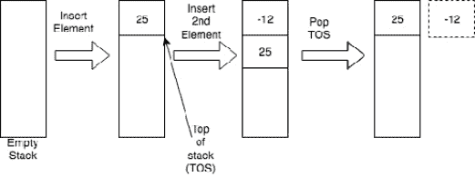
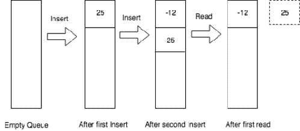
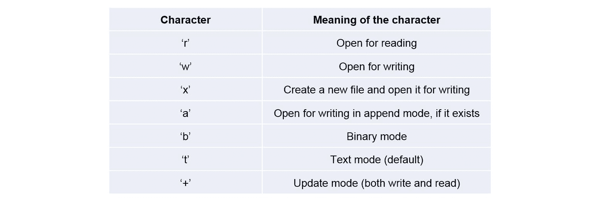
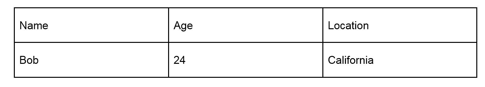

# 第三章：*第二章*

# 高级数据结构和文件处理

## 学习目标

到本章结束时，你将能够：

+   比较 Python 的高级数据结构

+   利用数据结构解决现实世界问题

+   利用操作系统文件处理操作

本章强调 Python 中的数据结构和本书基础的操作系统的函数。

## 引言

在上一章中，我们介绍了不同基本数据结构的基本概念。我们学习了列表、集合、字典、元组和字符串。它们是未来章节的基石，对于数据科学至关重要。

然而，到目前为止我们所涵盖的只是它们的基本操作。一旦你学会了如何有效地利用它们，它们将提供更多。在本章中，我们将进一步探索数据结构的世界。我们将学习高级操作和操作，并使用这些基本数据结构来表示更复杂和更高级的数据结构；这在现实生活中处理数据时非常有用。

在现实生活中，我们处理来自不同来源的数据，通常从文件或数据库中读取数据。我们将介绍与文件相关的操作。我们将看到如何打开文件，以及有多少种方法可以做到这一点，如何从其中读取数据，如何写入数据，以及完成工作后如何安全地关闭它。最后一部分，许多人往往忽略，但非常重要。我们经常在现实世界的系统中遇到非常奇怪且难以追踪的 bug，仅仅是因为一个进程打开了一个文件而没有正确关闭它。无需多言，让我们开始我们的旅程。

## 高级数据结构

我们将首先讨论高级数据结构。我们将通过回顾列表来实现这一点。我们将构建一个栈和一个队列，探索多个元素成员资格检查，并加入一些函数式编程来增加趣味。如果这一切听起来令人生畏，那么请不要担心。我们将一步一步地完成，就像上一章一样，一旦你完成了这一章，你将感到自信。

要开始本章，你需要打开一个空白的笔记本。为此，你可以在 shell 中简单地输入以下命令。建议你在输入命令之前，首先使用`cd`命令导航到一个空目录：

```py
docker run -p 8888:8888 -v 'pwd':/notebooks -it rcshubhadeep/packt-data-wrangling-base:latest
```

一旦 Docker 容器启动，将你的浏览器指向[`localhost:8888`](http://localhost:8888)，并使用`dw_4_all`作为密码来访问笔记本界面。

### 迭代器

我们将从这个主题开始，即列表。然而，在我们进入列表之前，我们将介绍迭代器的概念。迭代器是一个实现了`next`方法的对象，这意味着迭代器是一个可以遍历集合（列表、元组、字典等）的对象。它是状态化的，这意味着每次我们调用`next`方法时，它都会从集合中给出下一个元素。如果没有更多的元素，那么它将引发`StopIteration`异常。

#### 注意

当没有更多的值可以迭代时，迭代器的`next`方法会引发`StopIteration`异常。

如果你熟悉像 C、C++、Java、JavaScript 或 PHP 这样的编程语言，你可能已经注意到了这些语言中`for`循环实现的差异，它由三个不同的部分组成，即初始化、递增和终止条件，以及 Python 中的`for`循环。在 Python 中，我们不使用那种`for`循环。我们在 Python 中使用的是更类似于`foreach`循环的：`for` `i` `in` `list_1`。这是因为，在底层，`for`循环使用的是迭代器，所以我们不需要做所有额外的步骤。迭代器会为我们完成这些。

### 练习 15：迭代器简介

要生成数字列表，我们可以使用不同的方法：

1.  生成一个包含 10000000 个 1 的列表：

    ```py
    big_list_of_numbers = [1 for x in range(0, 10000000)]
    ```

1.  检查这个变量的大小：

    ```py
    from sys import getsizeof
    getsizeof(big_list_of_numbers)
    ```

    它将显示的值将大约是`81528056`（它在字节中）。这很多内存！而且`big_list_of_numbers`变量只有在列表推导完成后才可用。如果你尝试太大的数字，它也可能超出可用系统内存。

1.  使用迭代器来减少内存使用：

    ```py
    from itertools import repeat
    small_list_of_numbers = repeat(1, times=10000000)
    getsizeof(small_list_of_numbers)
    ```

    最后一行显示我们的`small_list_of_numbers`大小仅为`56`字节。此外，它是一种懒惰的方法，因为它没有生成所有元素。当需要时，它会逐个生成元素，从而节省我们的时间。实际上，如果你省略了`times`关键字参数，那么你可以实际生成无限数量的 1。

1.  遍历新生成的迭代器：

    ```py
    for i, x in enumerate(small_list_of_numbers): 
        print(x)
        if i > 10:
            break
    ```

    我们使用`enumerate`函数，以便我们得到循环计数器以及值。这有助于我们在达到计数器的某个特定数量时（例如 10）退出循环。

    输出将是一个包含 10 个 1 的列表。

1.  要查找任何函数的定义，在 Jupyter 笔记本中输入函数名，然后输入一个*?*并按*Shift* + *Enter*。运行以下代码以了解我们如何使用 itertools 中的排列和组合：

    ```py
    from itertools import (permutations, combinations, dropwhile, repeat,
    zip_longest)
    permutations?
    combinations?
    dropwhile?
    repeat?
    zip_longest?
    ```

### 栈

栈是一个非常有用的数据结构。如果你对 CPU 内部结构和程序执行方式有些了解，那么你会意识到栈在很多这种情况下都存在。它只是一个具有一个限制条件的列表，即后进先出（LIFO），这意味着当从栈中读取值时，最后进入的元素会首先出来。以下插图将使这一点更加清晰：



###### 图 2.1：进行两次插入元素和一次弹出操作的栈

如您所见，我们有一个后进先出（LIFO）策略来从栈中读取值。我们将使用 Python 列表来实现栈。Python 的列表有一个名为 `pop` 的方法，它执行与前面插图中所见相同的弹出操作。我们将使用它来实现栈。

### 练习 16：在 Python 中实现栈

1.  首先，定义一个空栈：

    ```py
    stack = []
    ```

1.  使用 append 方法向栈中添加一个元素。多亏了 append，元素将始终追加到列表的末尾：

    ```py
    stack.append(25)
    stack
    ```

    输出如下：

    ```py
    [25]
    ```

1.  向栈中追加另一个值：

    ```py
    stack.append(-12)
    stack
    ```

    输出如下：

    ```py
    [25, -12]
    ```

1.  使用 `pop` 方法从我们的栈中读取一个值。此方法读取当前列表的最后一个索引，并将其返回给我们。读取完成后，它也会删除该索引：

    ```py
    tos = stack.pop()tos
    ```

    输出如下：

    ```py
    -12
    ```

    执行前面的代码后，`tos` 中将会有 -12，栈中只有一个元素，即 `25`。

1.  向栈中追加 "hello"：

    ```py
    stack.append("Hello")
    stack
    ```

    输出如下：

    ```py
    [25, 'Hello']
    ```

想象你正在抓取一个网页，并且想要跟随其中存在的每个 URL。如果你在阅读网页时逐个将它们（追加）插入栈中，然后逐个弹出并跟随链接，那么你就有了一个干净且可扩展的解决方案。我们将在下一个练习中检查这个任务的这部分。

### 练习 17：使用用户定义的方法实现栈

我们将继续从上一个练习中关于栈的话题。但这次，我们将自己实现 `append` 和 `pop` 函数。这个练习的目标有两个。一方面，我们将实现栈，这次是一个真实世界的例子，这也涉及到对字符串方法的知识，因此也作为对上一章和活动的提醒。另一方面，它将向我们展示 Python 的一个微妙特性以及它是如何处理将列表变量传递给函数的，并将我们带到下一个练习，即函数式编程：

1.  首先，我们将定义两个函数，`stack_push` 和 `stack_pop`。我们将其重命名，以避免命名空间冲突。同时，创建一个名为 `url_stack` 的栈以供以后使用：

    ```py
    def stack_push(s, value):
        return s + [value]
    def stack_pop(s):
        tos = s[-1]
        del s[-1]
        return tos
    url_stack = []
    ```

1.  第一个函数接受已经存在的栈，并将值添加到其末尾。

    #### 注意

    注意值周围的方括号，这是为了将其转换为单元素列表，以便进行 + 操作。

1.  第二个函数读取栈中当前 `-1` 索引处的值，然后使用 `del` 操作符删除该索引，并最终返回它之前读取的值。

1.  现在，我们将有一个包含几个 URL 的字符串。我们的任务是分析这个字符串，当我们遇到 URL 时，逐个将它们推入栈中，然后最终使用 for 循环逐个弹出。让我们从关于数据科学的维基百科文章的第一行开始：

    ```py
    wikipedia_datascience = "Data science is an interdisciplinary field that uses scientific methods, processes, algorithms and systems to extract knowledge [https://en.wikipedia.org/wiki/Knowledge] and insights from data [https://en.wikipedia.org/wiki/Data] in various forms, both structured and unstructured,similar to data mining [https://en.wikipedia.org/wiki/Data_mining]"
    ```

1.  为了简化这个练习，我们在目标词旁边保留了方括号中的链接。

1.  查找字符串的长度：

    ```py
    len(wikipedia_datascience)
    ```

    输出如下：

    ```py
    347
    ```

1.  使用字符串的 `split` 方法将此字符串转换为列表，然后计算其长度：

    ```py
    wd_list = wikipedia_datascience.split()
    len(wd_list)
    ```

    输出如下：

    ```py
    34
    ```

1.  使用 for 循环遍历每个单词并检查它是否是 URL。为此，我们将使用字符串的 `startswith` 方法，如果是 URL，则将其推入栈中：

    ```py
    for word in wd_list:
        if word.startswith("[https://"):
            url_stack = stack_push(url_stack, word[1:-1])  
    # Notice the clever use of string slicing
    ```

1.  打印 `url_stack` 中的值：

    ```py
    url_stack
    ```

    输出如下：

    ```py
    ['https://en.wikipedia.org/wiki/Knowledge',
     'https://en.wikipedia.org/wiki/Data',
     'https://en.wikipedia.org/wiki/Data_mining']
    ```

1.  遍历列表并使用 `stack_pop` 函数逐个打印 URL：

    ```py
    for i in range(0, len(url_stack)):
        print(stack_pop(url_stack))
    ```

    输出如下：

    

    ###### 图 2.2：使用栈打印的 URL 输出

1.  再次打印以确保在最后的 for 循环之后栈为空：

    ```py
    print(url_stack)
    ```

    输出如下：

    ```py
    []
    ```

我们在 `stack_pop` 方法中注意到一个奇怪的现象。我们传递了列表变量到那里，并在函数内部使用了 `del` 操作符，但每次调用函数时都会通过删除最后一个索引来改变原始变量。如果你来自像 C、C++ 和 Java 这样的语言，那么这完全是一个意外的行为，因为在那些语言中，这只能通过引用传递变量来实现，这可能导致 Python 代码中的微妙错误。所以请小心。一般来说，在函数内部更改变量的值不是一个好主意，这意味着在函数内部。传递给函数的任何变量都应被视为不可变的。这接近函数式编程的原则。Python 中的 lambda 表达式是一种构建单行、无名的函数的方法，按照惯例，这些函数是副作用免费的。

### 练习 18：Lambda 表达式

在这个练习中，我们将使用 lambda 表达式来证明著名的三角恒等式：


###### 图 2.3 三角恒等式

1.  导入 `math` 包：

    ```py
    import math
    ```

1.  定义两个函数，`my_sine` 和 `my_cosine`。我们声明这些函数的原因是，来自 math 包的原始 `sin` 和 `cos` 函数以弧度为输入，但我们更熟悉度。因此，我们将使用 lambda 表达式定义一个无名的单行函数并使用它。这个 lambda 函数将自动将我们的度数输入转换为弧度，然后对其应用 `sin` 或 `cos` 并返回值：

    ```py
    def my_sine():
        return lambda x: math.sin(math.radians(x))
    def my_cosine():
        return lambda x: math.cos(math.radians(x))
    ```

1.  定义 `sine` 和 `cosine` 以满足我们的目的：

    ```py
    sine = my_sine()
    cosine = my_cosine()
    math.pow(sine(30), 2) + math.pow(cosine(30), 2)
    ```

    输出如下：

    ```py
    1.0
    ```

    注意，我们将 `my_sine` 和 `my_cosine` 的返回值分配给两个变量，然后直接使用它们作为函数。这比显式使用它们的方法要干净得多。注意，我们并没有在 lambda 函数中显式地写一个 `return` 语句。这是默认的。

### 练习 19：排序的 Lambda 表达式

Lambda 表达式将接受一个输入并根据元组中的值对其进行排序。Lambda 可以接受一个或多个输入。Lambda 表达式也可以通过使用 `reverse` 参数为 `True` 来实现逆序排序：

1.  想象你在一个数据清洗工作中，你面临以下元组列表：

    ```py
    capitals = [("USA", "Washington"), ("India", "Delhi"), ("France", "Paris"), ("UK", "London")]
    capitals
    ```

    输出如下：

    ```py
    [('USA', 'Washington'),
     ('India', 'Delhi'),
     ('France', 'Paris'),
     ('UK', 'London')]
    ```

1.  使用简单的 lambda 表达式按每个国家的首都名称对列表进行排序。使用以下代码：

    ```py
    capitals.sort(key=lambda item: item[1])
    capitals
    ```

    输出如下：

    ```py
    [('India', 'Delhi'),
     ('UK', 'London'),
     ('France', 'Paris'),
     ('USA', 'Washington')]
    ```

如我们所见，如果我们掌握了 lambda 表达式并在我们数据清洗工作中使用它们，它们是非常强大的。它们也是无副作用的，这意味着它们不会改变传递给它们的变量的值。

### 练习 20：多元素成员资格检查

这里有一个有趣的问题。让我们想象一下，你从你正在处理的一个文本语料库中抓取的一些单词列表：

1.  创建一个 `list_of_words` 列表，其中包含从文本语料库中抓取的单词：

    ```py
    list_of_words = ["Hello", "there.", "How", "are", "you", "doing?"]
    ```

1.  查找此列表是否包含另一个列表的所有元素：

    ```py
    check_for = ["How", "are"]
    ```

    存在一个复杂的解决方案，它涉及一个 `for` 循环和几个 if-else 条件（你应该尝试编写它！），但还有一个优雅的 Pythonic 解决方案来解决这个问题，它只需要一行代码并使用 `all` 函数。`all` 函数在可迭代对象的所有元素都为真时返回 `True`。

1.  使用 `in` 关键字检查列表 `list_of_words` 中的成员资格：

    ```py
    all(w in list_of_words for w in check_for)
    ```

    输出如下：

    ```py
    True
    ```

    它确实既优雅又简单，这个巧妙的小技巧在处理列表时非常重要。

### 队列

除了栈之外，我们感兴趣的另一个高级数据结构是队列。队列就像栈一样，意味着你一个接一个地添加元素。使用队列时，元素的读取遵循 FIFO（先进先出）策略。查看以下图表以更好地理解这一点：



###### 图 2.4：队列的示意图

我们将首先使用列表方法来完成这个任务，然后我们会向你展示这样做是不高效的。然后，我们将从 Python 的集合模块中学习 `dequeue` 数据结构。

### 练习 21：在 Python 中实现队列

1.  使用纯列表方法创建一个 Python 队列：

    ```py
    %%time
    queue = []
    for i in range(0, 100000):
        queue.append(i)
    print("Queue created")
    ```

    输出如下：

    ```py
    Queue created
    Wall time: 11 ms
    ```

1.  使用 `pop` 函数清空队列并检查其中的项目：

    ```py
    for i in range(0, 100000):
        queue.pop(0)
    print("Queue emptied")
    ```

    输出如下：

    ```py
    Queue emptied
    ```

    如果我们在执行前面的代码时使用 `%%time` 魔法命令，我们会看到它需要一段时间才能完成。在一个现代 MacBook 上，具有四核处理器和 8 GB RAM，它大约需要 1.20 秒才能完成。这种时间是因为 `pop(0)` 操作，这意味着每次我们从列表的左侧（当前 0 索引）弹出值时，Python 都必须通过将其他所有元素向左移动一个位置来重新排列列表的所有其他元素。确实，这不是一个非常优化的实现。

1.  使用 Python 集合包中的`deque`数据结构实现相同的队列：

    ```py
    %%time
    from collections import deque
    queue2 = deque()
    for i in range(0, 100000):
        queue2.append(i)
    print("Queue created")
    for i in range(0, 100000):
        queue2.popleft()
    print("Queue emptied")
    ```

    输出如下：

    ```py
    Queue created
    Queue emptied
    Wall time: 23 ms
    ```

1.  使用 Python 标准库中的专业和优化队列实现，这个操作所需的时间仅为 28 毫秒！这比之前有了巨大的改进。

队列是一个非常重要的数据结构。为了举一个现实生活中的例子，我们可以考虑一个生产者-消费者系统设计。在进行数据处理时，你经常会遇到必须处理非常大的文件的问题。处理这个问题的方法之一是将文件内容分成更小的部分，然后在创建小的、专门的工人进程时将它们推入队列，这些进程一次读取队列中的一小部分进行处理。这是一个非常强大的设计，你甚至可以有效地使用它来设计巨大的多节点数据处理管道。

我们在这里结束对数据结构的讨论。我们在这里讨论的只是冰山一角。数据结构是一个迷人的主题。还有许多其他的数据结构我们没有涉及，而且当它们被有效地使用时，可以提供巨大的附加价值。我们强烈鼓励你更多地探索数据结构。尽量了解链表、树、图、字典树以及它们的所有不同变体。它们不仅提供了学习的乐趣，而且也是数据从业者武器库中的秘密超级武器，你可以在每次面对困难的数据处理任务时使用它们。

### 活动 3：排列、迭代器、Lambda、列表

在这个活动中，我们将使用`permutations`生成所有可能的由 0、1 和 2 组成的三位数。然后遍历这个迭代器，并使用`isinstance`和`assert`确保返回类型是元组。同时，使用涉及`dropwhile`和`lambda`表达式的单行代码将所有元组转换为列表，同时删除任何前导零（例如，`(0, 1, 2)`变为`[1, 2]`）。最后，编写一个函数，它接受一个列表作为输入，并返回其中包含的实际数字。

这些步骤将指导你解决这个活动：

1.  查找`permutations`和`dropwhile`的定义，来自`itertools`。

1.  编写一个表达式，使用`0`、`1`和`2`生成所有可能的三位数。

1.  遍历之前生成的迭代器表达式。打印迭代器返回的每个元素。使用`assert`和`isinstance`确保元素是元组类型。

1.  再次使用`dropwhile`和 Lambda 表达式编写循环，以删除元组中的任何前导零。例如，`(0, 1, 2)`将变为`[0, 2]`。同时，将`dropwhile`的输出转换为列表。

1.  检查`dropwhile`实际返回的类型。

1.  将前面的代码合并到一个块中，这次编写一个单独的函数，你将传递由`dropwhile`生成的列表，该函数将返回列表中的整个数字。例如，如果你将`[1, 2]`传递给函数，它将返回`12`。确保返回类型确实是一个数字而不是字符串。尽管这个任务可以使用其他技巧完成，但我们要求你在函数中将传入的列表视为一个栈，并通过读取栈中的各个数字来生成数字。

通过这个活动，我们已经完成了这个主题，我们将转向下一个主题，该主题涉及基本的文件级操作。但在我们离开这个主题之前，我们鼓励你考虑一个解决方案来解决这个问题，而不使用我们在这里使用的所有高级操作和数据结构。你很快就会意识到原始解决方案是多么复杂，以及这些数据结构和操作带来了多大的价值。

#### 注意

这个活动的解决方案可以在第 289 页找到。

## Python 中的基本文件操作

在上一个主题中，我们研究了一些高级数据结构，并且学习了整洁且有用的函数式编程方法来无副作用地操作它们。在本主题中，我们将学习 Python 中的一些操作系统（OS）级函数。我们将主要关注与文件相关的函数，学习如何打开文件，逐行读取数据或一次性读取所有数据，最后如何干净地关闭我们打开的文件。我们将应用我们学到的一些技术，在一个我们将要读取的文件上进一步练习我们的数据处理技能。

### 练习 22：文件操作

在这个练习中，我们将学习 Python 的 OS 模块，我们还将看到两种非常实用的方法来写入和读取环境变量。在设计和开发数据处理管道时，写入和读取环境变量的能力通常非常重要。

#### 注意

事实上，著名 12 因子应用程序设计的因素之一就是将配置存储在环境中的想法。你可以在以下 URL 查看：https://12factor.net/config。

OS 模块的目的是为你提供与操作系统依赖功能交互的方法。一般来说，它是相当底层的，而且大多数来自那里的函数在日常使用中并不有用，然而，其中一些是值得学习的。`os.environ`是 Python 维护的包含你操作系统中的所有当前环境变量的集合。它赋予你创建新环境变量的能力。`os.getenv`函数让你能够读取一个环境变量：

1.  导入`os`模块。

    ```py
    import os
    ```

1.  设置一些环境变量：

    ```py
    os.environ['MY_KEY'] = "MY_VAL"
    os.getenv('MY_KEY')
    ```

    输出如下：

    ```py
    'MY_VAL'
    ```

    当环境变量未设置时打印环境变量：

    ```py
    print(os.getenv('MY_KEY_NOT_SET'))
    ```

    输出如下：

    ```py
    None
    ```

1.  打印`os`环境：

    ```py
    print(os.environ)
    ```

    #### 注意

    由于安全原因，输出尚未添加。

    执行前面的代码后，你会看到你已成功打印了 `MY_KEY` 的值，当你尝试打印 `MY_KEY_NOT_SET` 时，它打印了 `None`。

### 文件处理

在这个练习中，我们将了解如何在 Python 中打开文件。我们将了解我们可以使用的不同模式以及它们代表的意义。Python 有一个内置的 `open` 函数，我们将使用它来打开文件。`open` 函数接受一些输入参数。其中，第一个参数代表你想要打开的文件名，是唯一必须的。其他所有内容都有默认值。当你调用 `open` 时，Python 使用底层系统级调用打开文件句柄，并将其返回给调用者。

通常，文件可以以读取或写入模式打开。如果我们以某种模式打开一个文件，则不支持其他操作。读取通常意味着我们从现有文件的开始处开始读取，而写入可以意味着从文件开始处创建新文件并写入，或者打开现有文件并附加到它。以下是一个表格，展示了 Python 支持的所有不同文件打开模式：



###### 图 2.5 读取文件的模式

还存在一个已弃用的模式 `U`，在 Python3 环境中不起作用。我们必须记住的一件事是，Python 总是会区分 `t` 和 `b` 模式，即使底层操作系统不会。这是因为 `b` 模式下，Python 不会尝试解码它所读取的内容，而是返回字节对象，而在 `t` 模式下，它会尝试解码流并返回字符串表示。

你可以这样打开一个文件进行读取：

```py
fd = open("Alice’s Adventures in Wonderland, by Lewis Carroll")
```

这是以 `rt` 模式打开的。如果你想以二进制模式打开相同的文件，也可以。要以二进制模式打开文件，请使用 `rb` 模式：

```py
fd = open("Alice’s Adventures in Wonderland, by Lewis Carroll",
          "rb")
fd
```

输出如下：

```py
<_io.BufferedReader name='Alice's Adventures in Wonderland, by Lewis Carroll'>
```

这就是我们以写入模式打开文件的方式：

```py
fd = open("interesting_data.txt", "w")
fd
```

输出如下：

```py
<_io.TextIOWrapper name='interesting_data.txt' mode='w' encoding='cp1252'>
```

### 练习 23：打开和关闭文件

在这个练习中，我们将了解如何关闭打开的文件。一旦我们打开文件，关闭它非常重要。由于悬挂的文件句柄，可能会发生许多系统级错误。一旦我们关闭文件，就无法使用该特定的文件句柄在该文件上执行任何进一步的操作：

1.  以二进制模式打开文件：

    ```py
    fd = open("Alice's Adventures in Wonderland, by Lewis Carroll",
              "rb")
    ```

1.  使用 `close()` 关闭文件：

    ```py
    fd.close()
    ```

1.  Python 还为我们提供了一个与文件句柄一起的 `closed` 标志。如果我们关闭前打印它，那么我们会看到 `False`，而如果我们关闭后打印它，那么我们会看到 `True`。如果我们逻辑上检查文件是否已正确关闭，那么这就是我们想要使用的标志。

### `with` 语句

在这个练习中，我们将了解 Python 中的 `with` 语句以及我们如何在打开和关闭文件的情况下有效地使用它。

Python 中的 `with` 命令是一个复合语句。像任何复合语句一样，`with` 也会影响其内部代码的执行。在 `with` 的情况下，它用于将一段代码包裹在所谓的 Python 中的 `上下文管理器` 的作用域内。关于上下文管理器的详细讨论超出了本练习和这个主题的范围，但可以说，多亏了在 Python 中打开文件时 `open` 调用内部实现的上下文管理器，当我们用 `with` 语句包裹它时，可以保证会自动发生关闭调用。

#### 注意

关于 `with` 的整个 PEP 可以在 [`www.python.org/dev/peps/pep-0343/`](https://www.python.org/dev/peps/pep-0343/) 找到。我们鼓励您去查看。

### 使用 `with` 语句打开文件

使用 `with` 语句打开一个文件：

```py
with open("Alice’s Adventures in Wonderland, by Lewis Carroll")as fd:
    print(fd.closed)
print(fd.closed)
```

输出如下：

```py
False
True
```

如果我们执行前面的代码，我们会看到第一个打印将结束打印 `False`，而第二个将打印 `True`。这意味着一旦控制流出 `with` 块，文件描述符将自动关闭。

#### 注意

这无疑是打开文件并获得文件描述符的最干净、最 Pythonic 的方式。我们鼓励您在需要自己打开文件时始终使用此模式。

### 练习 24：逐行读取文件

1.  打开一个文件，然后逐行读取文件并打印出来，就像我们读取它一样：

    ```py
    with open("Alice’s Adventures in Wonderland, by Lewis Carroll",
              encoding="utf8") as fd:
        for line in fd:
                print(line)
    ```

    输出如下：

    

    ###### 图 2.6：Jupyter 笔记本截图

1.  通过查看前面的代码，我们可以真正地看到为什么这很重要。通过这段简短的代码，你甚至可以逐行打开和读取大小为许多 GB 的文件，而不会淹没或超出系统内存！

    文件描述符对象中还有一个名为 `readline` 的显式方法，它一次从文件中读取一行。

1.  在第一个循环之后立即复制相同的 for 循环：

    ```py
    with open("Alice’s Adventures in Wonderland, by Lewis Carroll",
              encoding="utf8") as fd:
        for line in fd:
            print(line)
        print("Ended first loop")
        for line in fd:
            print(line)
    ```

    输出如下：


###### 图 2.7：打开文件的部分

### 练习 25：写入文件

我们将通过向您展示如何写入文件来结束关于文件操作的主题。我们将写入几行到文件中，并读取该文件：

1.  使用文件描述符对象的 `write` 函数：

    ```py
    data_dict = {"India": "Delhi", "France": "Paris", "UK": "London",
                 "USA": "Washington"}
    with open("data_temporary_files.txt", "w") as fd:
        for country, capital in data_dict.items():
            fd.write("The capital of {} is {}\n".format(
                country, capital))
    ```

1.  使用以下命令读取文件：

    ```py
    with open("data_temporary_files.txt", "r") as fd:
        for line in fd:
            print(line)
    ```

    输出如下：

    ```py
    The capital of India is Delhi
    The capital of France is Paris
    The capital of UK is London
    The capital of USA is Washington
    ```

1.  使用以下命令使用打印函数写入文件：

    ```py
    data_dict_2 = {"China": "Beijing", "Japan": "Tokyo"}
    with open("data_temporary_files.txt", "a") as fd:
        for country, capital in data_dict_2.items():
            print("The capital of {} is {}".format(
                country, capital), file=fd)
    ```

1.  使用以下命令读取文件：

    ```py
    with open("data_temporary_files.txt", "r") as fd:
        for line in fd:
            print(line)
    ```

    输出如下：

    ```py
    The capital of India is Delhi
    The capital of France is Paris
    The capital of UK is London
    The capital of USA is Washington
    The capital of China is Beijing
    The capital of Japan is Tokyo
    ```

    #### 注意：

    在第二种情况下，我们没有在要写入的字符串末尾添加额外的换行符，\n，打印函数会自动为我们完成这个操作。

通过这种方式，我们将结束这个主题。就像前面的主题一样，我们为您设计了一个活动来练习您新获得的知识。

### 活动 4：设计您自己的 CSV 解析器

在作为数据从业者的一生中，你将经常遇到 CSV 文件。CSV 是一个以逗号分隔的文件，其中通常存储和分隔表格格式的数据，尽管也可以使用其他字符。

在这个活动中，我们将被要求构建自己的 CSV 读取器和解析器。虽然如果我们试图涵盖所有用例和边缘情况，包括转义字符等，这将是一个大任务，但为了这个小型活动，我们将保持我们的要求简单。我们将假设没有转义字符，这意味着如果你在行中的任何位置使用逗号，那么它意味着你正在开始一个新列。我们还将假设我们感兴趣的唯一功能是能够逐行读取 CSV 文件，其中每次读取都会生成一个新字典，列名作为键，行名作为值。

这里有一个例子：



###### 图 2.8 示例数据表

我们可以将前表中的数据转换为 Python 字典，其外观如下：`{"Name": "Bob", "Age": "24", "Location": "California"}`：

1.  从 `itertools` 导入 `zip_longest`。创建一个函数来压缩 `header`、`line` 和 `fillvalue=None`。

1.  通过使用 with 块内的 `r` 模式，从 GitHub 链接打开附带的 `sales_record.csv` 文件，并首先检查它是否已打开。

1.  读取第一行，并使用字符串方法生成所有列名的列表。

1.  开始读取文件。逐行读取。

1.  读取每一行，并将该行传递给一个函数，同时带有标题列表。该函数的工作是从这两个中构建一个字典，并填充 `键:值`。请记住，缺失的值应导致 `None`。

    #### 注意

    本活动的解决方案可以在第 291 页找到。

## 摘要

在本章中，我们学习了高级数据结构（如栈和队列）的工作原理。我们实现了栈和队列，然后专注于函数式编程的不同方法，包括迭代器，并将列表和函数结合起来。之后，我们探讨了 `OS` 级别的函数和环境变量以及文件的管理。我们还检查了处理文件的一种干净方式，并在最后一个活动中创建了自己的 CSV 解析器。

在下一章中，我们将处理三个最重要的库，即 NumPy、pandas 和 matplotlib。
