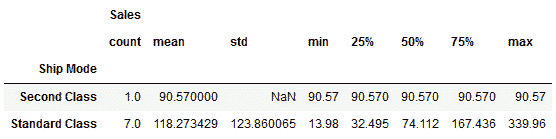

# *第四章*

# 深入学习使用 Python 进行数据整理

## 学习目标

到本章结束时，你将能够：

+   在 pandas DataFrame 上执行子集、过滤和分组操作

+   从 DataFrame 应用布尔过滤和索引以选择特定元素

+   在 pandas 中执行与 SQL 命令类似的 JOIN 操作

+   识别缺失或损坏的数据，并选择删除或应用插补技术处理缺失或损坏的数据

在本章中，我们将详细了解 pandas DataFrame。

## 简介

在本章中，我们将学习涉及 pandas DataFrame 和 NumPy 数组的几个高级操作。完成本章的详细活动后，你将处理真实数据集并理解数据整理的过程。

## 子集、过滤和分组

数据整理最重要的方面之一是从各种来源涌入组织或商业实体的数据洪流中精心整理数据。大量的数据并不总是好事；相反，数据需要是有用且高质量的，才能在数据科学管道的下游活动中有效使用，例如机器学习和预测模型构建。此外，一个数据源可以用于多个目的，这通常需要数据整理模块处理不同的数据子集。然后这些数据被传递到单独的分析模块。

例如，假设你正在对美国州级经济产出进行数据整理。这是一个相当常见的场景，一个机器学习模型可能需要大型和人口众多的州（如加利福尼亚州、德克萨斯州等）的数据，而另一个模型则要求为小型和人口稀少的州（如蒙大拿州或北达科他州）处理的数据。作为数据科学流程的前线，数据整理模块有责任满足这两个机器学习模型的要求。因此，作为一名数据整理工程师，你必须在处理并生成最终输出之前，根据州的（人口）过滤和分组数据。

此外，在某些情况下，数据源可能存在偏差，或者测量偶尔会损坏传入的数据。尝试仅过滤无错误、高质量的数据用于下游建模是个好主意。从这些例子和讨论中可以看出，过滤和分组/分桶数据是任何从事数据整理任务的工程师必备的技能。让我们继续学习 pandas 中的一些这些技能。

### 练习 48：从 Excel 文件中加载和检查超市的销售数据

在这个练习中，我们将加载并检查一个 Excel 文件。

1.  要将 Excel 文件读入 pandas，你需要在你的系统上安装一个名为 `xlrd` 的小型包。如果你在这个书的 Docker 容器内部工作，那么这个包可能在你下次启动容器时不可用，你必须遵循相同的步骤。使用以下代码安装 xlrd 包：

    ```py
    !pip install xlrd
    ```

1.  使用简单的 pandas 方法 `read_excel` 从 GitHub 加载 Excel 文件：

    ```py
    import numpy as np
    import pandas as pd
    import matplotlib.pyplot as plt
    df = pd.read_excel("Sample - Superstore.xls")
    df.head()
    ```

    检查所有列，看它们是否对分析有用：

    

    ###### 图 4.1 Excel 文件在 DataFrame 中的输出

    检查文件时，我们可以看到第一列，称为 **行 ID**，并不是很有用。

1.  使用 `drop` 方法从 DataFrame 中完全删除此列：

    ```py
    df.drop('Row ID',axis=1,inplace=True)
    ```

1.  检查新创建数据集的行数和列数。我们将在这里使用 `shape` 函数：

    ```py
    df.shape
    ```

    输出如下：

    ```py
    (9994, 20)
    ```

    我们可以看到数据集有 9,994 行和 20 列。

### 子集 DataFrame

**子集**涉及根据特定列和行提取部分数据，以满足业务需求。假设我们只对以下信息感兴趣：客户 ID、客户姓名、城市、邮政编码和销售额。为了演示目的，让我们假设我们只对 5 条记录感兴趣 - 第 5-9 行。我们可以使用一行 Python 代码来子集 DataFrame，只提取这么多信息。

使用 `loc` 方法通过列名和行索引来索引数据集：

```py
df_subset = df.loc[
    [i for i in range(5,10)],
    ['Customer ID','Customer Name','City','Postal Code',
     'Sales']]
df_subset
```

输出如下：


###### 图 4.2：按列名索引的 DataFrame

我们需要传递两个参数给 `loc` 方法 - 一个用于指示行，另一个用于指示列。这些应该是 Python 列表。

对于行，我们必须传递一个列表 [5,6,7,8,9]，但不是明确地写出，我们使用列表推导式，即 `[i for i in range(5,10)]`。

因为我们所感兴趣的列不是连续的，我们不能仅仅放置一个连续的范围，需要传递一个包含特定名称的列表。所以，第二个参数只是一个包含特定列名的简单列表。

该数据集展示了根据业务需求对 DataFrame 进行子集的基本概念。

### 一个示例用例：确定销售额和利润的统计数据

这一小节展示了子集的典型用例。假设我们想要计算记录 100-199 的销售额和利润的描述性统计（均值、中位数、标准差等）。这就是子集如何帮助我们实现这一点的方式：

```py
df_subset = df.loc[[i for i in range(100,200)],['Sales','Profit']]
df_subset.describe()
```

输出如下：


###### 图 4.3 数据的描述性统计输出

此外，我们可以从最终数据中创建销售额和利润数字的箱线图。

我们简单地提取了 100-199 条记录，并对其运行`describe`函数，因为我们不想处理所有数据！对于这个特定的问题，我们只对销售额和利润数字感兴趣，因此我们不应该走捷径，对全部数据进行描述。对于现实生活中的数据集，行和列的数量可能经常达到数百万，我们不想计算数据整理任务中未要求的数据。我们总是旨在子集化需要处理的确切数据，并在该部分数据上运行统计或绘图函数：


###### 图 4.4：销售额和利润的箱线图

### 练习 49：唯一函数

在继续使用过滤方法之前，让我们快速偏离一下，探索一个超级有用的函数，称为`unique`。正如其名所示，此函数用于快速扫描数据并提取列或行中的唯一值。

在加载超级商店销售数据后，你会注意到有一些像“国家”、“州”和“城市”这样的列。一个自然的问题将是询问数据集中有多少个国家/州/城市：

1.  使用一行简单的代码提取数据库中包含信息的国家/州/城市，如下所示：

    ```py
    df['State'].unique()
    ```

    输出如下：

    

    ###### 图 4.5：数据集中存在的不同状态

    你将看到所有在数据集中存在的州的列表。

1.  使用`nunique`方法来计数唯一值的数量，如下所示：

    ```py
    df['State'].nunique()
    ```

    输出如下：

    ```py
    49
    ```

    这对于此数据集返回 49。所以，在美国的 50 个州中，有一个州没有出现在这个数据集中。

同样，如果我们对国家列运行此函数，我们将得到一个只有一个元素的数组，`United States`。立即，我们可以看到我们根本不需要保留国家列，因为该列中除了所有条目都相同之外，没有有用的信息。这就是一个简单的函数如何帮助我们决定删除整个列——也就是说，删除 9,994 条不必要的数据！

### 条件选择和布尔过滤

通常，我们不想处理整个数据集，而只想选择满足特定条件的部分数据集。这可能是任何数据整理任务中最常见的用例。

在我们的超级商店销售数据集的背景下，考虑以下可能从业务分析团队的日常活动中出现的一些常见问题：

+   加利福尼亚的平均销售额和利润数字是多少？

+   哪些州的销售额最高和最低？

+   哪个消费者销售/利润的变异性最大？

+   在销售额最高的前 5 个州中，哪种运输方式和产品类别最受欢迎？

可以给出无数个例子，其中业务分析团队或高管团队希望从满足某些特定标准的数据子集中提取洞察。

如果你有任何 SQL 的先验经验，你会知道这类问题需要相当复杂的 SQL 查询编写。还记得 WHERE 子句吗？

我们将向您展示如何使用条件子集和布尔过滤来回答这类问题。

首先，我们需要理解布尔索引的关键概念。这个过程本质上接受一个条件表达式作为参数，并返回一个布尔数据集，其中`TRUE`值出现在条件满足的地方。以下代码展示了简单示例。为了演示目的，我们对一个包含 10 条记录和 3 个列的小数据集进行了子集操作：

```py
df_subset = df.loc[[i for i in range (10)],['Ship Mode','State','Sales']]
df_subset
```

输出如下：


###### 图 4.6：样本数据集

现在，如果我们只想知道销售额高于$100 的记录，我们可以编写以下代码：

```py
df_subset>100
```

这产生了以下布尔 DataFrame：


###### 图 4.7：销售额高于 100 美元的记录

注意**Sales**列中的 True 和 False 条目。**Ship Mode**和**State**列的值没有受到影响，因为比较的是数值量，而原始 DataFrame 中唯一的数值列是**Sales**。

现在，让我们看看如果我们将这个布尔 DataFrame 作为索引传递给原始 DataFrame 会发生什么：

```py
df_subset[df_subset>100]
```

输出如下：


###### 图 4.8：将布尔 DataFrame 作为索引传递给原始 DataFrame 后的结果

NaN 值来自前面的代码尝试仅使用 TRUE 索引（在布尔 DataFrame 中）创建 DataFrame 的事实。

在布尔 DataFrame 中为 TRUE 的值被保留在最终输出 DataFrame 中。

程序在数据不可用（因为它们由于销售额小于$100 而被丢弃）的行中插入了**NaN**值。

现在，我们可能不想与这个结果 DataFrame `Sales > $100`一起工作。我们可以通过仅传递`Sales`列来实现这一点：

```py
df_subset[df_subset['Sales']>100]
```

这产生了预期的结果：


###### 图 4.9：移除 NaN 值后的结果

我们不仅限于只涉及数字量的条件表达式。让我们尝试提取不涉及科罗拉多州的销售额较高的值（> $100）。

我们可以编写以下代码来完成这项任务：

```py
df_subset[(df_subset['State']!='Colorado') & (df_subset['Sales']>100)]
```

注意字符串条件的使用。在这个表达式中，我们通过&运算符连接了两个条件。两个条件都必须用括号括起来。

第一个条件表达式简单地匹配 `State` 列中的条目与字符串 `Colorado`，并相应地分配 TRUE/FALSE。第二个条件与之前相同。通过 & 运算符连接在一起，它们仅提取 `State` 不是 `Colorado` 且 `Sales` 大于 $100 的行。我们得到以下结果：


###### 图 4.10：`State` 不是加利福尼亚州且 `Sales` 大于 $100 的结果

#### **注意**

虽然理论上，你可以使用单个表达式和 &（逻辑与）和 |（逻辑或）运算符构建复杂的条件，但建议创建具有有限条件表达式的中间布尔 DataFrame，并逐步构建最终的 DataFrame。这使代码易于阅读和扩展。

### 练习 50：设置和重置索引

有时，我们可能需要重置或消除 DataFrame 的默认索引并分配新列作为索引：

1.  使用以下命令创建 `matrix_data`、`row_labels` 和 `column_headings` 函数：

    ```py
    matrix_data = np.matrix(
        '22,66,140;42,70,148;30,62,125;35,68,160;25,62,152')
    row_labels = ['A','B','C','D','E']
    column_headings = ['Age', 'Height', 'Weight']
    ```

1.  使用 `matrix_data`、`row_labels` 和 `column_headings` 函数创建一个 DataFrame：

    ```py
    df1 = pd.DataFrame(data=matrix_data, 
                       index=row_labels,
                       columns=column_headings)
    print("\nThe DataFrame\n",'-'*25, sep='')
    print(df1)
    ```

    输出如下：

    

    ###### 图 4.11：原始 DataFrame

1.  如此重置索引：

    ```py
    print("\nAfter resetting index\n",'-'*35, sep='')
    print(df1.reset_index())
    ```

    

    ###### 图 4.12：重置索引后的 DataFrame

1.  将 `drop` 设置为 `True` 来重置索引，如下所示：

    ```py
    print("\nAfter resetting index with 'drop' option TRUE\n",'-'*45, sep='')
    print(df1.reset_index(drop=True))
    ```

    

    ###### 图 4.13：设置 drop 选项为 true 后重置索引的 DataFrame

1.  使用以下命令添加新列：

    ```py
    print("\nAdding a new column 'Profession'\n",'-'*45, sep='')
    df1['Profession'] = "Student Teacher Engineer Doctor Nurse".split()
    print(df1)
    ```

    输出如下：

    

    ###### 图 4.14：添加名为 `Profession` 的新列后的 DataFrame

1.  现在，使用以下代码将 `Profession` 列设置为索引：

    ```py
    print("\nSetting 'Profession' column as index\n",'-'*45, sep='')
    print (df1.set_index('Profession'))
    ```

    输出如下：


###### 图 4.15：将职业设置为索引后的 DataFrame

### 练习 51：分组方法

分组涉及以下步骤之一或多个：

+   根据某些标准将数据拆分到组中

+   对每个组独立应用函数

+   将结果组合到数据结构中

在许多情况下，我们可以将数据集分成组并对这些组进行操作。在应用步骤中，我们可能希望执行以下操作之一：

+   **聚合**：对每个组计算汇总统计量（或统计量） - 总和、平均值等

+   **转换**：执行特定组的计算并返回类似索引的对象 - z 转换或用值填充缺失数据

+   **过滤**：根据组内计算评估 TRUE 或 FALSE 来丢弃少量组

当然，这个 `GroupBy` 对象有一个描述方法，它以 DataFrame 的形式生成汇总统计信息。

`GroupBy`不仅限于单个变量。如果你传递多个变量（作为一个列表），那么你将得到一个本质上类似于 Excel 中的数据透视表的结构。以下是一个例子，我们将整个数据集（快照仅显示部分视图）中的所有州和城市分组在一起。

#### 注意

对于那些之前使用过基于 SQL 的工具的人来说，名称`GroupBy`应该相当熟悉。

1.  使用以下命令创建一个 10 条记录的子集：

    ```py
    df_subset = df.loc[[i for i in range (10)],['Ship Mode','State','Sales']]
    ```

1.  使用以下命令创建一个 pandas DataFrame，如下所示：

    ```py
    byState = df_subset.groupby('State')
    ```

1.  使用以下命令按州计算平均销售额：

    ```py
    print("\nGrouping by 'State' column and listing mean sales\n",'-'*50, sep='')
    print(byState.mean())
    ```

    输出如下：

    

    ###### 图 4.16：按列表平均销售额分组州后的输出

1.  使用以下命令计算按州的总销售额：

    ```py
    print("\nGrouping by 'State' column and listing total sum of sales\n",'-'*50, sep='')
    print(byState.sum())
    ```

    输出如下：

    

    ###### 图 4.17：按列表销售额总和分组州后的输出

1.  对 DataFrame 进行特定州的子集处理并显示统计信息：

    ```py
    pd.DataFrame(byState.describe().loc['California'])
    ```

    输出如下：

    

    ###### 图 4.18：检查特定州的统计信息

1.  使用`Ship Mode`属性执行类似的汇总：

    ```py
    df_subset.groupby('Ship Mode').describe().loc[['Second Class','Standard Class']]
    ```

    输出如下：

    

    ###### 图 4.19：通过汇总 Ship Mode 属性检查销售

    注意 pandas 是如何首先按`State`分组，然后按每个州下的城市进行分组的。

1.  使用以下命令显示每个州每个城市的销售完整汇总统计信息——全部通过两行代码完成：

    ```py
    byStateCity=df.groupby(['State','City'])
    byStateCity.describe()['Sales']
    ```

    输出如下：


###### 图 4.20：检查销售汇总统计信息

## 检测异常值和处理缺失值

异常值检测和处理缺失值属于数据质量检查的微妙艺术。建模或数据挖掘过程本质上是一系列复杂的计算，其输出质量很大程度上取决于输入数据的质量和一致性。维护和监控这种质量的责任通常落在数据整理团队的肩上。

除了明显的数据质量问题外，缺失数据有时会对下游的机器学习（ML）模型造成破坏。一些 ML 模型，如贝叶斯学习，对异常值和缺失数据具有内在的鲁棒性，但像决策树和随机森林这样的常用技术由于这些技术的基本分割策略依赖于单个数据点而不是数据簇，因此存在处理缺失数据的问题。因此，在将数据传递给这样的 ML 模型之前，几乎总是必须对缺失数据进行插补。

异常值检测是一门微妙的艺术。通常，没有关于异常值的普遍认同的定义。从统计学的角度来看，一个落在某个范围之外的数据点可能经常被归类为异常值，但为了应用这个定义，你需要对数据内在统计分布的性质和参数有一个相当高的确定性。这需要大量的数据来建立这种统计确定性，即使如此，异常值可能不仅仅是不重要的噪声，而是更深层次线索的提示。让我们以一家美国快餐连锁餐厅的一些虚构销售数据为例。如果我们想将每日销售数据建模为时间序列，我们会观察到数据在四月中旬某处出现异常峰值：


###### 图 4.21：一家美国快餐连锁餐厅的虚构销售数据

一个优秀的数据科学家或数据整理员应该对这一数据点产生好奇心，而不仅仅是由于它超出了统计范围就拒绝它。在实际情况中，当天的销售额之所以大幅上升，是因为一个不寻常的原因。因此，数据是真实的。但仅仅因为数据是真实的，并不意味着它是有用的。在最终目标是构建一个平滑变化的时间序列模型的情况下，这个数据点不应该产生影响，应该被拒绝。但这里的关键是我们不能不关注这些异常值就拒绝它们。

因此，关键在于在数百万数据流中系统及时地检测异常值，或者在从基于云的存储中读取数据时。在这个主题中，我们将快速浏览一些用于检测异常值的基本统计测试和一些用于填充缺失数据的基本插补技术。

### Pandas 中的缺失值

用于检测缺失值的最有用函数之一是`isnull`。在这里，我们有一个名为`df_missing`的`DataFrame`的快照（部分从我们正在处理的大型超市 DataFrame 中采样）并包含一些缺失值：


###### 图 4.22：包含缺失值的 DataFrame

现在，如果我们简单地运行以下代码，我们将得到一个与原始数据集大小相同的 DataFrame，其中布尔值为 TRUE 表示遇到**NaN**的地方。因此，测试 DataFrame 的任何行或列中是否存在任何**NaN**/缺失值是简单的。你只需要添加这个布尔 DataFrame 的特定行和列。如果结果大于零，那么你就知道有一些 TRUE 值（因为这里的 FALSE 表示为 0，TRUE 表示为 1），相应地也有一些缺失值。尝试以下代码片段：

```py
df_missing=pd.read_excel("Sample - Superstore.xls",sheet_name="Missing")
df_missing
```

输出如下：


###### 图 4.23：包含 Excel 值的 DataFrame

在 DataFrame 上使用`isnull`函数并观察结果：

```py
df_missing.isnull()
```


###### 图 4.24：突出显示的缺失值输出

这是一个检测、计数和打印 DataFrame 每一列中缺失值的简单代码示例：

```py
for c in df_missing.columns:
    miss = df_missing[c].isnull().sum()
    if miss>0:
        print("{} has {} missing value(s)".format(c,miss))
    else:
        print("{} has NO missing value!".format(c))
```

此代码扫描 DataFrame 的每一列，调用 `isnull` 函数，并将返回的对象（在这种情况下是一个 pandas Series 对象）求和以计算缺失值的数量。如果缺失值大于零，则相应地打印出消息。输出如下所示：


###### 图 4.25：计数缺失值的输出

### 练习 52：使用 fillna 填充缺失值

要处理缺失值，您应该首先寻找方法不是完全删除它们，而是以某种方式填充它们。`fillna` 方法是执行此任务在 pandas DataFrame 上的一个有用函数。`fillna` 方法可能适用于字符串数据，但不适用于销售或利润等数值列。因此，我们应该将固定字符串替换限制在仅基于文本的非数值列上。`Pad` 或 `ffill` 函数用于向前填充数据，即从序列的前一个数据复制。

可以使用 `mean` 函数使用两个值的平均值进行填充：

1.  使用以下命令使用字符串 `FILL` 填充所有缺失值：

    ```py
    df_missing.fillna('FILL')
    ```

    输出如下：

    

    ###### 图 4.26：缺失值被替换为 FILL

1.  使用以下命令使用字符串 `FILL` 填充指定的列：

    ```py
    df_missing[['Customer','Product']].fillna('FILL')
    ```

    输出如下：

    

    ###### 图 4.27：指定的列被替换为 FILL

    #### 注意

    在所有这些情况下，函数都在原始 DataFrame 的副本上工作。因此，如果您想使更改永久，必须将这些函数返回的 DataFrame 赋值给原始 DataFrame 对象。

1.  使用以下命令通过 pad 或 backfill 填充值：

    ```py
    df_missing['Sales'].fillna(method='ffill')
    ```

1.  使用 `backfill` 或 `bfill` 向后填充，即从序列中的下一个数据复制：

    ```py
    df_missing['Sales'].fillna(method='bfill')
    ```

    

    ###### 图 4.28：使用前向填充和后向填充填充缺失数据

1.  您也可以使用 DataFrame 的平均值函数进行填充。例如，我们可能希望使用平均销售额填充销售中的缺失值。以下是我们可以这样做的方式：

    ```py
    df_missing['Sales'].fillna(df_missing.mean()['Sales'])
    ```


###### 图 4.29：使用平均值填充缺失数据

### 练习 53：使用 dropna 删除缺失值

此函数用于简单地删除包含 NaN/缺失值的行或列。然而，这里涉及一些选择。

如果轴参数设置为 0，则删除包含缺失值的行；如果轴参数设置为 1，则删除包含缺失值的列。如果 NaN 值不超过一定百分比，这些参数对于我们不希望删除特定行/列是有用的。

对于 `dropna()` 方法有用的两个参数如下：

+   `how` 参数确定当我们至少有一个 NaN 或所有 NaN 时，是否从 DataFrame 中删除行或列

+   `thresh` 参数要求保留许多非 NaN 值以保留行/列

1.  要将轴参数设置为 0 并删除所有缺失行，请使用以下命令：

    ```py
    df_missing.dropna(axis=0)
    ```

1.  要将轴参数设置为 1 并删除所有缺失行，请使用以下命令：

    ```py
    df_missing.dropna(axis=1)
    ```

    

    ###### 图 4.30：删除行或列以处理缺失数据

1.  将 axis 设置为 1 和 thresh 设置为 10 的值删除：

    ```py
    df_missing.dropna(axis=1,thresh=10)
    ```

    输出如下：


###### 图 4.31：使用 axis=1 和 thresh=10 删除值的 DataFrame

所有这些方法都在临时副本上工作。要永久更改，您必须设置 `inplace=True` 或将结果分配给原始 DataFrame，即覆盖它。

### 使用简单统计测试进行异常值检测

正如我们已经讨论过的，数据集中的异常值可能由许多因素以多种方式产生：

+   数据输入错误

+   实验误差（与数据提取相关的）

+   由于噪声或仪器故障导致的测量误差

+   数据处理错误（由于编码错误导致的数据操作或突变）

+   抽样误差（从错误或各种来源提取或混合数据）

无法确定一个通用的异常值检测方法。在这里，我们将向您展示一些使用标准统计测试对数值数据进行的一些简单技巧。

箱线图可能显示异常值。通过以下方式将两个销售额值设置为负数：

```py
df_sample = df[['Customer Name','State','Sales','Profit']].sample(n=50).copy()
df_sample['Sales'].iloc[5]=-1000.0
df_sample['Sales'].iloc[15]=-500.0
```

要绘制箱线图，请使用以下代码：

```py
df_sample.plot.box()
plt.title("Boxplot of sales and profit", fontsize=15)
plt.xticks(fontsize=15)
plt.yticks(fontsize=15)
plt.grid(True)
```

输出如下：


###### 图 4.32：销售额和利润的箱线图

我们可以创建简单的箱线图来检查任何异常/不合逻辑的值。例如，在上面的例子中，我们故意将两个销售额值设置为负数，它们在箱线图中很容易被发现。

注意，利润可能是负数，所以这些负数点通常并不可疑。但一般来说，销售额不能是负数，所以它们被检测为异常值。

我们可以创建一个数值量的分布，并检查位于极端值的位置，以查看它们是否真正是数据的一部分或异常值。例如，如果一个分布几乎是正态的，那么任何超过 4 或 5 个标准差的价值可能是有嫌疑的：


###### 图 4.33：远离主要异常值的价值

## 连接、合并和连接

将表或数据集合并或连接是数据整理专业人士日常工作中非常常见的操作。这些操作类似于关系数据库表中的 JOIN 查询。通常，关键数据分布在多个表中，这些记录需要被合并到一个匹配该公共键的单一表中。这在任何类型的销售或交易数据中都是一个极其常见的操作，因此数据整理者必须掌握这一技能。pandas 库提供了方便且直观的内置方法来执行涉及多个 DataFrame 对象的各种类型的 JOIN 查询。

### 练习 54：连接

我们将首先学习沿各个轴（行或列）连接 DataFrame 的方法。这是一个非常有用的操作，因为它允许你在新数据到来或需要在表中插入新特征列时扩展 DataFrame：

1.  从我们正在处理的原销售数据集中随机创建三个 DataFrame，每个 DataFrame 包含 4 条记录：

    ```py
    df_1 = df[['Customer Name','State','Sales','Profit']].sample(n=4)
    df_2 = df[['Customer Name','State','Sales','Profit']].sample(n=4)
    df_3 = df[['Customer Name','State','Sales','Profit']].sample(n=4)
    ```

1.  使用以下代码创建一个包含所有行连接的合并 DataFrame：

    ```py
    df_cat1 = pd.concat([df_1,df_2,df_3], axis=0)
    df_cat1
    ```

    

    

    ###### 图 4.34：将 DataFrame 连接在一起

1.  你也可以尝试沿列进行连接，尽管对于这个特定的例子来说，这没有任何实际意义。然而，pandas 在该操作中用 **NaN** 填充不可用的值：

    ```py
    df_cat2 = pd.concat([df_1,df_2,df_3], axis=1)
    df_cat2
    ```


###### 图 4.35：连接 DataFrame 后的输出

### 练习 55：通过公共键合并

通过公共键合并是数据表的一个极其常见的操作，因为它允许你在主数据库中合理化多个数据源——即如果它们有一些公共特征/键。

这通常是构建用于机器学习任务的大型数据库的第一步，其中每日传入的数据可能被放入单独的表中。然而，最终，最新的表需要与主数据表合并，以便输入到后端机器学习服务器中，然后更新模型及其预测能力。

在这里，我们将展示一个以客户名称为键的内部连接的简单示例：

1.  一个 DataFrame，`df_1`，与客户名称相关的运输信息相关联，另一个表，`df_2`，有产品信息表格。我们的目标是根据公共客户名称将这些表合并到一个 DataFrame 中：

    ```py
    df_1=df[['Ship Date','Ship Mode','Customer Name']][0:4]
    df_1
    ```

    输出如下所示：

    

    ###### 图 4.36：df_1 表中的条目

    第二个 DataFrame 如下所示：

    ```py
    df_2=df[['Customer Name','Product Name','Quantity']][0:4]
    df_2
    ```

    输出如下所示：

    

    ###### 图 4.37：df_2 表中的条目

1.  使用以下命令通过内部连接将这两个表连接起来：

    ```py
    pd.merge(df_1,df_2,on='Customer Name',how='inner')
    ```

    输出如下所示：

    

    ###### 图 4.38：df_1 和 df_2 表的内部连接

1.  使用以下命令删除重复项。

    ```py
    pd.merge(df_1,df_2,on='Customer Name',how='inner').drop_duplicates()
    ```

    输出如下：

    

    ###### 图 4.39：删除重复项后，在表 df_1 和表 df_2 上进行内连接

1.  提取另一个名为 `df_3` 的小表来展示外连接的概念：

    ```py
    df_3=df[['Customer Name','Product Name','Quantity']][2:6]
    df_3
    ```

    输出如下：

    

    ###### 图 4.40：创建表 df_3

1.  使用以下命令在 `df_1` 和 `df_3` 上执行内连接：

    ```py
    pd.merge(df_1,df_3,on='Customer Name',how='inner').drop_duplicates()
    ```

    输出如下：

    

    ###### 图 4.41：合并表 df_1 和表 df_3 并删除重复项

1.  使用以下命令在 `df_1` 和 `df_3` 上执行外连接：

    ```py
    pd.merge(df_1,df_3,on='Customer Name',how='outer').drop_duplicates()
    ```

    输出如下：


###### 图 4.42：在删除重复项后，在表 df_1 和表 df_2 上进行外连接

注意，由于找不到与这些记录对应的条目，因此自动插入了某些 `NaN` 和 `NaT` 值，因为这些条目是各自表中具有唯一客户名称的条目。`NaT` 代表“不是一个时间”对象，因为“发货日期”列中的对象是时间戳对象。

### 练习 56：连接方法

连接操作基于 **索引** **键** 进行，通过将两个可能具有不同索引的 DataFrame 的列合并成一个单一来完成。它提供了一种通过行索引完成合并的更快方式。如果不同表中的记录索引不同但代表相同的基本数据，并且您想将它们合并到一个表中，这很有用：

1.  使用以下命令创建以下表格，以客户名称作为索引：

    ```py
    df_1=df[['Customer Name','Ship Date','Ship Mode']][0:4]
    df_1.set_index(['Customer Name'],inplace=True)
    df_1
    df_2=df[['Customer Name','Product Name','Quantity']][2:6]
    df_2.set_index(['Customer Name'],inplace=True)
    df_2
    ```

    输出如下：

    

    ###### 图 4.43：DataFrame df_1 和 df_2

1.  使用以下命令在 `df_1` 和 `df_2` 上执行左连接：

    ```py
    df_1.join(df_2,how='left').drop_duplicates()
    ```

    输出如下：

    

    ###### 图 4.44：删除重复项后，在表 df_1 和表 df_2 上进行左连接

1.  使用以下命令在 `df_1` 和 `df_2` 上执行右连接：

    ```py
    df_1.join(df_2,how='right').drop_duplicates()
    ```

    输出如下：

    

    ###### 图 4.45：删除重复项后，在表 df_1 和表 df_2 上进行右连接

1.  使用以下命令在 `df_1` 和 `df_2` 上执行内连接：

    ```py
    df_1.join(df_2,how='inner').drop_duplicates()
    ```

    输出如下：

    

    ###### 图 4.46：删除重复项后，在表 df_1 和表 df_2 上进行内连接

1.  使用以下命令在 `df_1` 和 `df_2` 上执行外连接：

    ```py
    df_1.join(df_2,how='outer').drop_duplicates()
    ```

    输出如下：


###### 图 4.47：删除重复项后，在表 df_1 和表 df_2 上进行外连接

## 有用的 Pandas 方法

在这个主题中，我们将讨论 pandas 提供的一些小型实用函数，以便我们能够高效地与 DataFrame 一起工作。它们不属于任何特定的函数组，因此它们在这里在杂项类别下被提及。

### 练习 57：随机抽样

从大型 DataFrame 中随机采样一个随机分数通常非常有用，这样我们就可以在它们上练习其他方法并测试我们的想法。如果你有一个包含 100 万条记录的数据库表，那么在完整表上运行你的测试脚本在计算上可能不是有效的。

然而，你可能也不希望只提取前 100 个元素，因为数据可能已经按特定键排序，你可能会得到一个无趣的表格，这可能不会代表父数据库的完整统计多样性。

在这些情况下，`sample`方法非常有用，这样我们就可以随机选择 DataFrame 的一个受控分数：

1.  使用以下命令指定从 DataFrame 中所需的样本数量：

    ```py
    df.sample(n=5)
    ```

    输出如下：

    

    ###### 图 4.48：包含 5 个样本的 DataFrame

1.  使用以下命令指定要采样的数据的确切分数（百分比）：

    ```py
    df.sample(frac=0.1)
    ```

    输出如下：

    

    ###### 图 4.49：包含 0.1%数据采样的 DataFrame

    您也可以选择是否进行有放回的抽样，即是否可以选择相同的记录多次。默认的 replace 选择是 FALSE，即无重复，抽样将尝试只选择新元素。

1.  使用以下命令选择抽样：

    ```py
    df.sample(frac=0.1, replace=True)
    ```

    输出如下：


###### 图 4.50：包含 0.1%数据且启用重复的 DataFrame

### `value_counts`方法

我们之前讨论了`unique`方法，该方法从 DataFrame 中查找并计数唯一记录。在类似方面的另一个有用函数是`value_counts`。此函数返回一个包含唯一值计数的对象。在返回的对象中，第一个元素是最频繁使用的对象。元素按降序排列。

让我们考虑这个方法的一个实际应用来展示其效用。假设你的经理要求你列出从你拥有的大型销售数据库中排名前 10 的客户。因此，业务问题是：哪些 10 个客户的名称在销售表中出现频率最高？如果数据在 RDBMS 中，你可以使用 SQL 查询实现相同的功能，但在 pandas 中，可以通过使用一个简单的函数来完成：

```py
df['Customer Name'].value_counts()[:10]
```

输出如下：


###### 图 4.51：前 10 名客户列表

`value_counts` 方法返回一个按计数频率排序的所有唯一客户名称计数的序列。通过只请求该列表的前 10 个元素，此代码返回出现频率最高的前 10 个客户名称的序列。

### 交叉表功能

与 group by 类似，pandas 还提供了交叉表功能，这与 MS Excel 等电子表格程序中的交叉表功能相同。例如，在这个销售数据库中，您想了解按地区和州（两个索引级别）的平均销售额、利润和销售数量。

我们可以通过一段简单的代码提取此信息（我们首先随机抽取 100 条记录以保持计算快速，然后应用此代码）：

```py
df_sample = df.sample(n=100)
df_sample.pivot_table(values=['Sales','Quantity','Profit'],index=['Region','State'],aggfunc='mean')
```

输出如下（请注意，由于随机抽样，您的具体输出可能不同）：


###### 图 4.52：100 条记录的样本

### 练习 58：按列值排序 – sort_values 方法

按特定列对表格进行排序是分析师日常工作中最常用的操作之一。不出所料，pandas 提供了一个简单直观的排序方法，称为 `sort_values` 方法：

1.  随机抽取 15 条记录，然后展示如何按 Sales 列排序，然后按 Sales 和 State 列一起排序：

    ```py
    df_sample=df[['Customer Name','State','Sales','Quantity']].sample(n=15)
    df_sample
    ```

    输出如下：

    

    ###### 图 4.53：15 条记录的样本

1.  使用以下命令按 `Sales` 排序值：

    ```py
    df_sample.sort_values(by='Sales')
    ```

    输出如下：

    

    ###### 图 4.54：按 Sales 值排序的 DataFrame

1.  按照 Sales 和 State 排序值：

    ```py
    df_sample.sort_values(by=['State','Sales'])
    ```

    输出如下：


###### 图 4.55：按 Sales 和 State 排序的 DataFrame

### 练习 59：使用 apply 方法对用户定义函数的灵活性

pandas 库通过 `apply` 方法提供了极大的灵活性，用于处理任意复杂性的用户定义函数。与原生的 Python `apply` 函数类似，此方法接受用户定义的函数和额外的参数，并在对特定列的每个元素应用函数后返回一个新列。

例如，假设我们想创建一个基于销售价格列的类别特征列，如高/中/低。请注意，这是根据某些条件（销售阈值）将数值值转换为类别因子（字符串）的转换：

1.  创建一个用户定义的函数，如下所示：

    ```py
    def categorize_sales(price):
        if price < 50:
            return "Low"
        elif price < 200:
            return "Medium"
        else:
            return "High"
    ```

1.  从数据库中随机抽取 100 条记录：

    ```py
    df_sample=df[['Customer Name','State','Sales']].sample(n=100)
    df_sample.head(10)
    ```

    输出如下：

    

    ###### 图 4.56：数据库中的 100 条样本记录

1.  使用 `apply` 方法将分类函数应用于 `Sales` 列：

    #### 注意

    ```py
    df_sample['Sales Price Category']=df_sample['Sales'].apply(categorize_sales)
    df_sample.head(10)
    ```

    输出如下：

    

    ###### 图 4.57：在 Sales 列上使用 apply 函数后的 10 行 DataFrame

1.  `apply` 方法也适用于内置的 Python 原生函数。为了练习，让我们创建另一个用于存储客户名称长度的列。我们可以使用熟悉的 `len` 函数来完成此操作：

    ```py
    df_sample['Customer Name Length']=df_sample['Customer Name'].apply(len)
    df_sample.head(10)
    ```

    输出如下：

    

    ###### 图 4.58：包含新列的 DataFrame

1.  我们甚至可以直接将 lambda 表达式插入到 apply 方法中，而不是编写一个单独的函数。例如，假设我们正在推广我们的产品，并且想要显示原始价格大于 *> $200* 的折扣销售价格。我们可以使用 lambda 函数和 apply 方法来完成此操作：

    ```py
    df_sample['Discounted Price']=df_sample['Sales'].apply(lambda x:0.85*x if x>200 else x)
    df_sample.head(10)
    ```

    输出如下：


###### 图 4.59：Lambda 函数

#### 注意

Lambda 函数包含一个条件，并且对原始销售价格大于 $200 的记录应用折扣。

### 活动六：处理 Adult Income 数据集（UCI）

在这个活动中，您将使用来自 UCI 机器学习门户的 Adult Income 数据集。Adult Income 数据集已被许多解决分类问题的机器学习论文所使用。您将从 CSV 文件中读取数据到 pandas DataFrame，并在此章节中学习的高级数据处理上进行一些练习。

本活动的目的是练习各种高级 pandas DataFrame 操作，例如，对于子集选择、应用用户定义的函数、汇总统计、可视化、布尔索引、分组和异常值检测在一个真实数据集上。我们已经在磁盘上下载了 CSV 文件以供您方便使用。然而，建议您自己练习数据下载，以便您熟悉这个过程。

这是数据集的 URL：[`archive.ics.uci.edu/ml/machine-learning-databases/adult/`](https://archive.ics.uci.edu/ml/machine-learning-databases/adult/)。

这是数据集描述和变量的 URL：[`archive.ics.uci.edu/ml/machine-learning-databases/adult/adult.names`](https://archive.ics.uci.edu/ml/machine-learning-databases/adult/adult.names)。

这些步骤将帮助您解决此活动：

1.  加载必要的库。

1.  从以下 URL 读取 adult income 数据集：[`github.com/TrainingByPackt/Data-Wrangling-with-Python/blob/master/Chapter04/Activity06/`](https://github.com/TrainingByPackt/Data-Wrangling-with-Python/blob/master/Lesson04/Activity06/)。

1.  创建一个脚本，该脚本将逐行读取文本文件。

1.  将 `Income` 名称添加到响应变量中。

1.  找出缺失值。

1.  使用子集选择创建只包含年龄、教育和职业的 DataFrame。

1.  以 20 为 bin 大小绘制年龄直方图。

1.  创建一个函数来删除空白字符。

1.  使用 `apply` 方法将此函数应用于所有具有字符串值的列，创建一个新列，将新列的值复制到旧列中，然后删除新列。

1.  找出年龄在 30 到 50 岁之间的人数。

1.  根据年龄和教育分组记录，以找出平均年龄的分布情况。

1.  按职业分组并显示年龄的汇总统计。找出平均年龄最大的职业，以及在其劳动力中占最大份额的 75 分位数以上的职业。

1.  使用子集和分组方法查找异常值。

1.  在柱状图上绘制值。

1.  使用公共键合并数据。

    #### 注意

    该活动的解决方案可以在第 297 页找到。

## 摘要

在本章中，我们深入研究了 pandas 库，学习高级数据处理技术。我们从 DataFrame 的高级子集和过滤开始，通过学习布尔索引和数据子集的条件选择来总结这一部分。我们还介绍了如何设置和重置 DataFrame 的索引，尤其是在初始化时。

接下来，我们学习了一个与传统的数据库系统有深刻联系的主题——分组方法。然后，我们深入探讨了数据处理的重要技能——检查和处理缺失数据。我们展示了 pandas 如何使用各种插补技术来处理缺失数据。我们还讨论了删除缺失值的方法。此外，还展示了 DataFrame 对象的连接和合并的方法及其使用示例。我们看到了连接方法，以及它与 SQL 中类似操作的比较。

最后，我们介绍了 DataFrame 上的各种有用方法，例如随机抽样、`unique`、`value_count`、`sort_values` 和交叉表功能。我们还展示了使用 `apply` 方法在 DataFrame 上运行任意用户定义函数的示例。

在学习了 NumPy 和 pandas 库的基本和高级数据处理技术之后，数据获取的自然问题随之而来。在下一章中，我们将向您展示如何处理各种数据源，也就是说，您将学习如何在 pandas 中从不同来源读取表格格式的数据。
