# *第五章*

# 适应不同类型的数据源

## 学习目标

到本章结束时，你将能够：

+   将 CSV、Excel 和 JSON 文件读入 pandas DataFrame

+   将 PDF 文档和 HTML 表格读入 pandas DataFrame

+   使用如 Beautiful Soup 等强大且易于使用的库执行基本的网络爬取

+   从门户网站提取结构和文本信息

在本章中，你将接触到应用于网络爬取的实际数据整理技术。

## 简介

到目前为止，在这本书中，我们一直专注于学习 pandas DataFrame 对象作为应用整理技术的主体数据结构。现在，我们将学习各种技术，通过这些技术我们可以从外部来源将数据读入 DataFrame。其中一些来源可能是基于文本的（CSV、HTML、JSON 等），而另一些则可能是二进制的（Excel、PDF 等），即不是 ASCII 格式。在本章中，我们将学习如何处理存在于网页或 HTML 文档中的数据。这对于数据从业者的工作非常重要。

#### 注意

由于我们已经详细介绍了使用 NumPy 和 pandas 的基本操作示例，在本章中，我们将经常跳过诸如查看表格、选择列和绘图等琐碎的代码片段。相反，我们将专注于展示我们在此处旨在学习的新主题的代码示例。

## 从不同的基于文本（和非基于文本）来源读取数据

数据整理专业人士最宝贵且最广泛使用的技能之一是能够从各种来源提取和读取数据到结构化格式。现代分析管道依赖于它们扫描和吸收各种数据源的能力，以构建和分析一个富模式模型。这样一个功能丰富、多维度的模型将具有高度的预测和泛化准确性。它将被利益相关者和最终用户同样重视，对于任何数据驱动的产品。

在本章的第一个主题中，我们将探讨各种数据源以及它们如何导入到 pandas DataFrame 中，从而为整理专业人士提供极其宝贵的数据摄取知识。

### 本章提供的数据文件

因为这个主题是关于从各种数据源读取的，所以接下来的练习中我们将使用各种类型的小文件。所有数据文件都随 Jupyter 笔记本一起提供在代码仓库中。

### 本章需要安装的库

因为本章涉及读取各种文件格式，我们需要额外的库和软件平台的支持来实现我们的目标。

在你的 Jupyter 笔记本单元格中执行以下代码（不要忘记每行代码前的!）来安装必要的库：

```py
!apt-get update !apt-get install -y default-jdk
!pip install tabula-py xlrd lxml
```

### 练习 60：从缺少标题的 CSV 文件中读取数据

pandas 库提供了一个简单的直接方法，称为 `read_csv`，用于从逗号分隔的文本文件或 CSV 中读取表格格式的数据。这特别有用，因为 CSV 是一种轻量级但极其方便的数据交换格式，适用于许多应用，包括机器生成数据等域。它不是专有格式，因此被各种数据生成源普遍使用。

有时，CSV 文件可能缺少标题，你可能需要添加自己的正确标题/列名。让我们看看如何做到这一点：

1.  使用以下代码读取示例 CSV 文件（带有合适的标题）并检查生成的 DataFrame，如下所示：

    ```py
    import numpy as np
    import pandas as pd
    df1 = pd.read_csv("CSV_EX_1.csv")
    df1
    ```

    输出如下：

    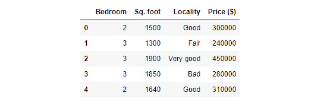

    ###### 图 5.1：示例 CSV 文件的输出

1.  使用 pandas DataFrame 读取没有标题的 `.csv` 文件：

    ```py
    df2 = pd.read_csv("CSV_EX_2.csv")
    df2
    ```

    输出如下：

    

    ###### 图 5.2：使用 DataFrame 读取的 .csv 的输出

    当然，顶部数据行被错误地读取为列标题。你可以指定 `header=None` 来避免这种情况。

1.  通过指定 `header=None` 来读取 `.csv` 文件，如下所示：

    ```py
    df2 = pd.read_csv("CSV_EX_2.csv",header=None)
    df2
    ```

    然而，如果没有标题信息，你将得到以下输出。默认标题将是一些从 0 开始的默认数值索引：

    

    ###### 图 5.3：具有数值列标题的 CSV 文件

    这可能适合数据分析目的，但如果你想使 DataFrame 真正反映正确的标题，那么你必须使用 `names` 参数添加它们。

1.  添加 `names` 参数以获取正确的标题：

    ```py
    df2 = pd.read_csv("CSV_EX_2.csv",header=None, names=['Bedroom','Sq.ft','Locality','Price($)'])
    df2
    ```

    最后，你将得到如下所示的 DataFrame：

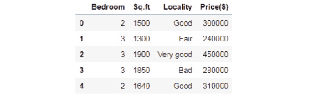

###### 图 5.4：具有正确列标题的 CSV 文件

### 练习 61：从非逗号分隔符的 CSV 文件中读取

虽然 CSV 代表逗号分隔值，但遇到分隔符/定界符不是逗号的原始数据文件相当常见：

1.  使用 pandas DataFrame 读取 `.csv` 文件：

    ```py
    df3 = pd.read_csv("CSV_EX_3.csv")
    df3
    ```

1.  输出将如下所示：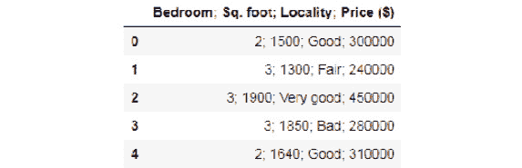

    ###### 图 5.5：以分号作为分隔符的 DataFrame

1.  显然，*;* 分隔符不是预期的，读取有误。一个简单的解决方案是在读取函数中明确指定分隔符/定界符：

    ```py
    df3 = pd.read_csv("CSV_EX_3.csv",sep=';')
    df3
    ```

    输出如下：

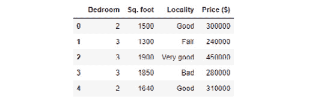

###### 图 5.6：从 DataFrame 中移除的分号

### 练习 62：跳过 CSV 文件的标题

如果你的 CSV 文件已经包含标题，但你想跳过它们并添加自己的标题，你必须特别设置 `header` `=` `0` 以实现这一点。如果你尝试将名称变量设置为你的标题列表，可能会发生意外的情况：

1.  为具有标题的 .csv 文件添加名称，如下所示：

    ```py
    df4 = pd.read_csv("CSV_EX_1.csv",names=['A','B','C','D'])
    df4
    ```

    输出如下：

    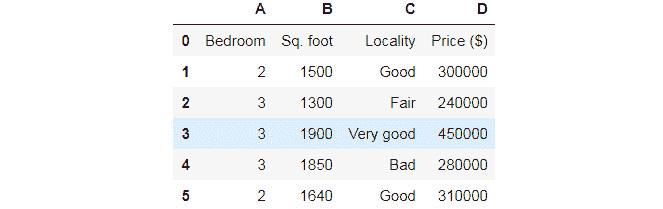

    ###### 图 5.7：标题重叠的 CSV 文件

1.  为了避免这种情况，将 `header` 设置为零并提供名称列表：

    ```py
    df4 = pd.read_csv("CSV_EX_1.csv",header=0,names=['A','B','C','D'])
    df4
    ```

    输出如下：

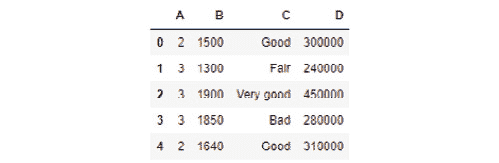

###### 图 5.8：具有定义标题的 CSV 文件

### 练习 63：读取 CSV 文件时跳过初始行和页脚

跳过初始行是一种广泛使用的方法，因为大多数情况下，CSV 数据文件的前几行是关于数据源或类似信息的元数据，这些信息不会被读入表格：


###### 图 5.9：CSV 文件的内容

#### 注意

CSV 文件的前两行是不相关的数据。

1.  读取 CSV 文件并检查结果：

    ```py
    df5 = pd.read_csv("CSV_EX_skiprows.csv")
    df5
    ```

    输出如下：

    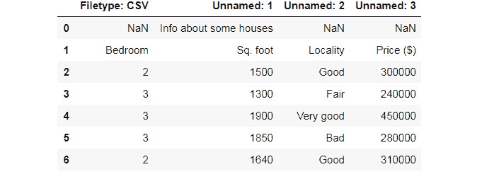

    ###### 图 5.10：带有意外错误的 DataFrame

1.  跳过前两行并读取文件：

    ```py
    df5 = pd.read_csv("CSV_EX_skiprows.csv",skiprows=2)
    df5
    ```

    输出如下：

    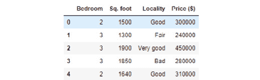

    ###### 图 5.11：跳过两行后的预期 DataFrame

1.  与跳过初始行类似，可能需要跳过文件的页脚。例如，我们不想读取以下文件末尾的数据：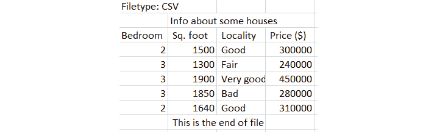

    ###### 图 5.12：CSV 文件的内容

    我们必须使用 `skipfooter` 和 `engine='python'` 选项来启用此功能。这些 CSV 读取函数有两个引擎——基于 C 或 Python，其中只有 Python 引擎支持 `skipfooter` 选项。

1.  在 Python 中使用 `skipfooter` 选项：

    ```py
    df6 = pd.read_csv("CSV_EX_skipfooter.csv",skiprows=2,
    skipfooter=1,engine='python')
    df6
    ```

    输出如下：

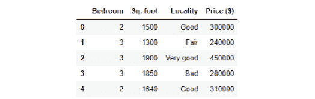

###### 图 5.13：没有页脚的 DataFrame

### 只读取前 N 行（特别是对于大文件非常有用）

在许多情况下，我们可能不想读取整个数据文件，而只想读取前几行。这对于非常大的数据文件尤其有用，我们可能只想读取前几百行来检查初始模式，然后决定稍后读取整个数据。读取整个文件可能需要很长时间，并减慢整个数据处理流程。

`read_csv` 函数中的一个简单选项，称为 `nrows`，使我们能够做到这一点：

```py
df7 = pd.read_csv("CSV_EX_1.csv",nrows=2)
df7
```

输出如下：


###### 图 5.14：CSV 文件的前几行 DataFrame

### 练习 64：结合 Skiprows 和 Nrows 以小块读取数据

在继续讨论读取非常大的数据文件时，我们可以巧妙地结合 `skiprows` 和 `nrows` 来以预定的较小块读取这样的大文件。以下代码演示了这一点：

1.  创建一个列表来存储 DataFrames：

    ```py
    list_of_dataframe = []
    ```

1.  将要读取的行数存储到变量中：

    ```py
    rows_in_a_chunk = 10
    ```

1.  创建一个变量来存储要读取的块数：

    ```py
    num_chunks = 5
    ```

1.  创建一个虚拟的 DataFrame 以获取列名：

    ```py
    df_dummy = pd.read_csv("Boston_housing.csv",nrows=2)
    colnames = df_dummy.columns
    ```

1.  遍历 CSV 文件以一次读取固定数量的行：

    ```py
    for i in range(0,num_chunks*rows_in_a_chunk,rows_in_a_chunk):
        df = pd.read_csv("Boston_housing.csv",header=0,skiprows=i,nrows=rows_in_a_chunk,names=colnames)
        list_of_dataframe.append(df)
    ```

注意 `iterator` 变量如何在 `range` 函数内部设置以将其分成块。假设块的数量是 5，每个块中的行数是 10。那么，迭代器将有一个范围 (0,5*10,10)，其中最后的 10 是步长，即它将以索引 (0,9,19,29,39,49) 迭代。

### 设置 skip_blank_lines 选项

默认情况下，`read_csv` 会忽略空白行。但有时，您可能希望将它们读取为 NaN，以便您可以计算原始数据文件中存在多少这样的空白条目。在某些情况下，这是默认数据流质量一致性的指标。为此，您必须禁用 `skip_blank_lines` 选项：

```py
df9 = pd.read_csv("CSV_EX_blankline.csv",skip_blank_lines=False)
df9
```

输出如下：

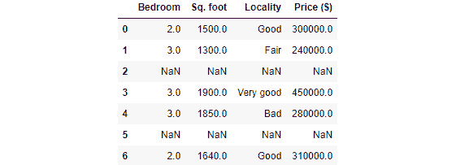

###### 图 5.15：具有空白行的 .csv 文件的 DataFrame

### 从 Zip 文件中读取 CSV

这是以 pandas 为例的一个很棒的功能，因为它允许您直接从压缩文件（如 `.zip`、`.gz`、`.bz2` 或 `.xz`）读取。唯一的要求是，目标数据文件（CSV）应该是压缩文件中唯一的文件。

在这个例子中，我们使用 7-Zip 程序压缩了示例 CSV 文件，并直接使用 `read_csv` 方法读取：

```py
df10 = pd.read_csv('CSV_EX_1.zip')
df10
```

输出如下：


###### 图 5.16：压缩 CSV 的 DataFrame

### 使用 sheet_name 读取 Excel 文件并处理不同的 sheet_name

接下来，我们将关注 Microsoft Excel 文件。事实证明，我们在之前的 CSV 文件练习中学习的许多选项和方法也直接适用于 Excel 文件的读取。因此，我们在这里不会重复它们。相反，我们将关注它们之间的差异。Excel 文件可以由多个工作表组成，我们可以通过传递特定的参数来读取特定的工作表，即 `sheet_name`。

例如，在相关的数据文件 `Housing_data.xlsx` 中，我们有三个标签页，以下代码将它们逐个读取到三个单独的 DataFrame 中：

```py
df11_1 = pd.read_excel("Housing_data.xlsx",sheet_name='Data_Tab_1')
df11_2 = pd.read_excel("Housing_data.xlsx",sheet_name='Data_Tab_2')
df11_3 = pd.read_excel("Housing_data.xlsx",sheet_name='Data_Tab_3')
```

如果 Excel 文件有多个不同的工作表，但 `sheet_name` 参数设置为 `None`，那么 `read_excel` 函数将返回一个有序字典。之后，我们可以简单地遍历该字典或其键来检索单个 DataFrame。

让我们考虑以下示例：

```py
dict_df = pd.read_excel("Housing_data.xlsx",sheet_name=None)
dict_df.keys()
```

输出如下：

```py
odict_keys(['Data_Tab_1', 'Data_Tab_2', 'Data_Tab_3'])
```

### 练习 65：读取通用分隔文本文件

通用文本文件可以像读取 CSV 文件一样轻松读取。然而，如果您使用的是除空格或制表符之外的分隔符，您必须传递正确的分隔符：

1.  以逗号分隔的文件，保存为 `.txt` 扩展名，如果未显式设置分隔符读取，将生成以下 DataFrame：

    ```py
    df13 = pd.read_table("Table_EX_1.txt")
    df13
    ```

    输出如下：

    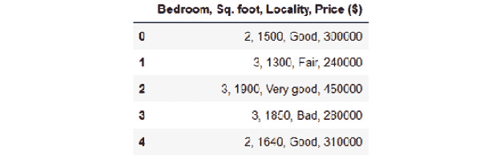

    ###### 图 5.17：具有逗号分隔的 CSV 文件的 DataFrame

1.  在这种情况下，我们必须显式设置分隔符，如下所示：

    ```py
    df13 = pd.read_table("Table_EX_1.txt",sep=',')
    df13
    ```

    输出结果如下：


###### 图 5.18：使用逗号分隔符读取的 DataFrame

### 直接从 URL 读取 HTML 表格

Pandas 库允许我们直接从 URL 读取 HTML 表格。这意味着它们已经内置了一些 HTML 解析器，可以处理给定页面的 HTML 内容，并尝试提取页面中的各种表格。

#### 注意

`read_html` 方法返回一个 DataFrame 列表（即使页面只有一个 DataFrame），你必须从列表中提取相关的表格。

考虑以下示例：

```py
url = 'http://www.fdic.gov/bank/individual/failed/banklist.html'
list_of_df = pd.read_html(url)
df14 = list_of_df[0]
df14.head()
```

这些结果如下所示：

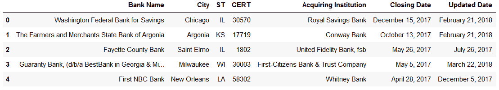

###### 图 5.19：读取 HTML 表格的结果

### 练习 66：进一步整理以获取所需数据

如前所述的练习中讨论的，这个 HTML 读取函数几乎总是为给定的 HTML 页面返回多个表格，我们必须进一步解析列表以提取我们感兴趣的特定表格：

1.  例如，如果我们想获取 2016 年夏季奥运会奖牌榜（按国家）的表格，我们可以轻松地搜索到一个页面，并将其传递给 Pandas。我们可以通过以下命令来完成：

    ```py
    list_of_df = pd.read_html("https://en.wikipedia.org/wiki/2016_Summer_Olympics_medal_table",header=0)
    ```

1.  如果我们检查返回列表的长度，我们会看到它是 6：

    ```py
    len(list_of_df)
    ```

    输出结果如下：

    ```py
     6
    ```

1.  为了查找表格，我们可以运行一个简单的循环：

    ```py
    for t in list_of_df:
        print(t.shape)
    ```

    输出结果如下：

    

    ###### 图 5.20：表格的形状

1.  看起来这个列表中的第二个元素就是我们正在寻找的表格：

    ```py
    df15=list_of_df[1]
    df15.head()
    ```

1.  输出结果如下：

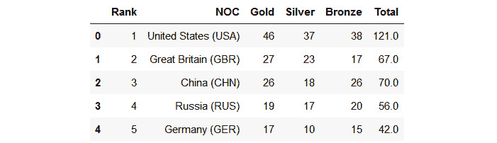

###### 图 5.21：第二张表格中的数据输出

### 练习 67：从 JSON 文件中读取

在过去的 15 年里，JSON 已经成为网络数据交换的通用选择。如今，它几乎成为所有公开可用的网络 API 的首选格式，同时也常用于私有网络 API。它是一种基于键值对和有序列表的无模式、基于文本的结构化数据表示。

Pandas 库提供了将数据直接从 JSON 文件读取到 DataFrame 中的出色支持。为了练习本章内容，我们包含了一个名为 `movies.json` 的文件。该文件包含自 1900 年以来几乎所有主要电影的演员、类型、标题和发行年份信息：

1.  提取 2012 年复仇者联盟电影的演员列表（来自漫威漫画）：

    ```py
    df16 = pd.read_json("movies.json")
    df16.head()
    ```

    输出结果如下：

    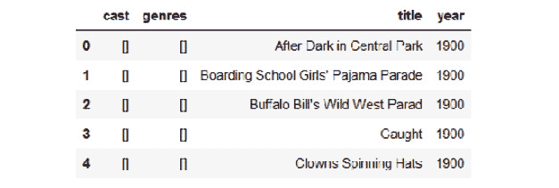

    ###### 图 5.22：显示复仇者联盟电影演员的 DataFrame

1.  为了查找标题为 "复仇者联盟" 的演员列表，我们可以使用过滤功能：

    ```py
    cast_of_avengers=df16[(df16['title']=="The Avengers") & (df16['year']==2012)]['cast']
    print(list(cast_of_avengers))
    ```

    输出结果将如下所示：

    ```py
     [['Robert Downey, Jr.', 'Chris Evans', 'Mark Ruffalo', 'Chris Hemsworth', 'Scarlett Johansson', 'Jeremy Renner', 'Tom Hiddleston', 'Clark Gregg', 'Cobie Smulders', 'Stellan SkarsgÃyrd', 'Samuel L. Jackson']]
    ```

### 读取 Stata 文件

pandas 库还提供了直接读取 Stata 文件的函数。Stata 是一个流行的统计建模平台，被许多政府机构和研究组织使用，尤其是经济学家和社会科学家。

读取 Stata 文件（`.dta` 格式）的简单代码如下：

```py
df17 = pd.read_stata("wu-data.dta")
```

### 练习 68：从 PDF 文件中读取表格数据

在各种数据源类型中，PDF 格式可能是最难以解析的。虽然有一些流行的 Python 包用于处理 PDF 文件的一般页面格式，但用于从 PDF 文件中提取表格的最佳库是 `tabula-py`。

从这个包的 GitHub 页面来看，`tabula-py` 是 `tabula-java` 的简单 Python 封装，可以从 PDF 中读取表格。您可以从 PDF 中读取表格并将它们转换为 pandas DataFrame。`tabula-py` 库还允许您将 PDF 文件转换为 CSV/TSV/JSON 文件。

在您运行此代码之前，需要在您的系统上安装以下包，但它们是免费的且易于安装：

+   urllib3

+   pandas

+   pytest

+   flake8

+   distro

+   pathlib

1.  在以下链接中找到 PDF 文件：https://github.com/TrainingByPackt/Data-Wrangling-with-Python/blob/master/Chapter05/Exercise60-68/Housing_data.xlsx。以下代码从两页中检索表格并将它们连接成一个表格：

    ```py
    from tabula import read_pdf
    df18_1 = read_pdf('Housing_data.pdf',pages=[1],pandas_options={'header':None})
    df18_1
    ```

    输出如下：

    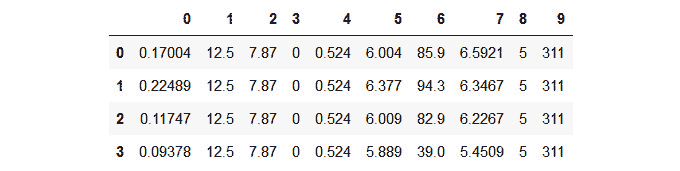

    ###### 图 5.23：通过合并 PDF 中跨越两页的表格得到的 DataFrame

1.  使用以下命令从同一 PDF 的另一页检索表格：

    ```py
    df18_2 = read_pdf('Housing_data.pdf',pages=[2],pandas_options={'header':None})
    df18_2
    ```

    输出如下：

    

    ###### 图 5.24：显示来自另一页的表格的 DataFrame

1.  要连接从前两个步骤中得到的表格，请执行以下代码：

    ```py
    df18=pd.concat([df18_1,df18_2],axis=1)
    df18
    ```

    输出如下：

    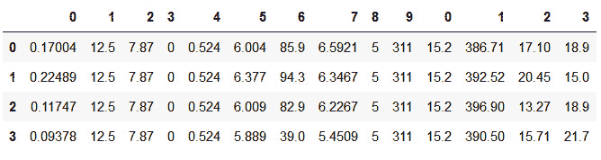

    ###### 图 5.25：通过连接两个表格得到的 DataFrame

1.  在 PDF 提取过程中，大多数情况下，标题将难以自动提取。您必须通过 `read-pdf` 函数中的 `names` 参数作为 `pandas_option` 传递标题列表，如下所示：

    ```py
    names=['CRIM','ZN','INDUS','CHAS','NOX','RM','AGE','DIS','RAD','TAX','PTRATIO','B','LSTAT','PRICE']
    df18_1 = read_pdf('Housing_data.pdf',pages=[1],pandas_options={'header':None,'names':names[:10]})
    df18_2 = read_pdf('Housing_data.pdf',pages=[2],pandas_options={'header':None,'names':names[10:]})
    df18=pd.concat([df18_1,df18_2],axis=1)
    df18
    ```

    输出如下：

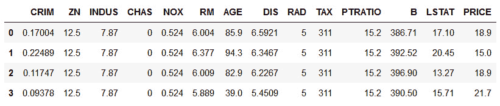

###### 图 5.26：具有正确列标题的 PDF 数据 DataFrame

在本章末尾，我们将进行一个完整的活动，阅读 PDF 报告中的表格并进行处理。

## Beautiful Soup 4 和网页解析简介

读取和理解网页的能力对于收集和格式化数据的人来说是至关重要的。例如，考虑收集有关电影数据并将其格式化以供下游系统使用的任务。电影数据最好通过像 IMDB 这样的网站获得，而这些数据并不是以预包装的格式（CSV、JSON 等）提供的，因此你需要知道如何下载和读取网页。

此外，你还需要具备网页结构的知识，这样你才能设计一个系统，可以从整个网页中搜索（查询）特定信息并获取其值。这涉及到理解标记语言语法，并能够编写可以解析它们的代码。做这件事，同时考虑到所有边缘情况，对于像 HTML 这样的东西已经非常复杂，如果你将定制标记语言的范围扩展到包括 XML，那么这将成为一个团队的全职工作。

幸运的是，我们正在使用 Python，Python 有一个非常成熟和稳定的库来为我们完成所有复杂的任务。这个库叫做`BeautifulSoup`（目前处于第 4 版，因此从现在起我们将简称为`bs4`）。`bs4`是一个从 HTML 或 XML 文档中获取数据的库，它为你提供了一种优雅、规范、惯用的方式来导航和查询文档。它不包含解析器，但它支持不同的解析器。

### HTML 结构

在我们深入研究`bs4`并开始使用它之前，我们需要检查 HTML 文档的结构。**超**文**字**标**记**语**言是一种向网页浏览器告知网页组织结构的方式，意味着哪种类型的元素（文本、图像、视频等）来自哪里，它们在页面内部的哪个位置出现，它们的样式是什么，它们包含什么，以及它们如何响应用户输入。HTML5 是 HTML 的最新版本。一个 HTML 文档可以被视为一棵树，正如我们可以在以下图中看到的那样：

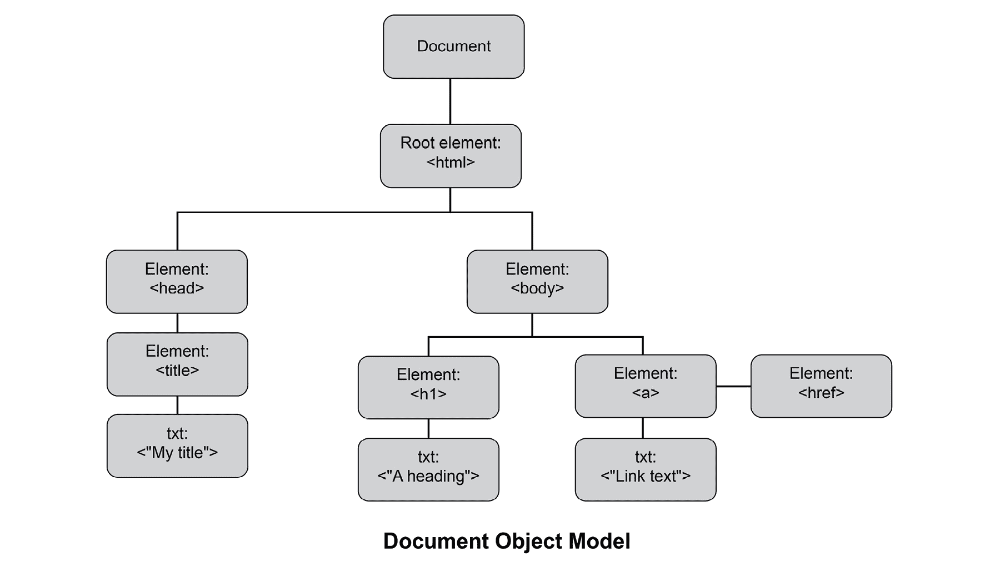

###### 图 5.27：HTML 结构

树中的每个节点代表文档中的一个元素。元素是以`<`开头并以`>`结尾的任何东西。例如，`<html>`、`<head>`、`<p>`、`<br>`、``等等都是各种 HTML 元素。一些元素有起始和结束元素，其中结束元素以`</`开头，并且与起始元素具有相同的名称，例如`<p>`和`</p>`，它们可以包含任意数量的其他类型的元素。一些元素没有结束部分，例如`<br />`元素，它们不能包含任何内容。

目前我们还需要了解关于元素的其他唯一事实是，元素可以有属性，这些属性用于修改元素的默认行为。一个 `<a>` 元素需要一个 `href` 属性来告诉浏览器当点击特定的 `<a>` 时应该导航到哪个网站，例如：`<a href="http://cnn.com">`。点击 CNN 新闻频道 `<a>` 将带你到 cnn.com：


###### 图 5.28：CNN 新闻频道超链接

因此，当你处于树中的特定元素时，你可以访问该元素的子元素以获取它们的内容和属性。

带着这些知识，让我们看看我们如何从 HTML 文档中读取和查询数据。

在这个主题中，我们将介绍网页的读取和解析，但我们不会从实时网站请求它们。相反，我们从磁盘读取它们。关于从互联网读取它们的章节将在未来的章节中介绍。

### 练习 69：使用 BeautifulSoup 读取 HTML 文件并提取其内容

在这个练习中，我们将做最简单的事情。我们将导入 `BeautifulSoup` 库，然后使用它来读取一个 HTML 文档。然后，我们将检查它返回的不同类型的对象。在练习这个主题时，你应该始终在文本编辑器中打开示例 HTML 文件，以便你可以检查不同的标签及其属性和内容：

1.  导入 `bs4` 库：

    ```py
    from bs4 import BeautifulSoup
    ```

1.  请下载以下测试 HTML 文件并将其保存到您的磁盘上，然后使用 bs4 从磁盘读取它：

    ```py
    with open("test.html", "r") as fd:    soup = BeautifulSoup(fd)    print(type(soup))
    ```

    输出如下：

    ```py
    <class 'bs4.BeautifulSoup'>
    ```

    你可以直接将文件句柄传递给 `BeautifulSoup` 对象的构造函数，它将从句柄附加的文件中读取内容。我们将看到返回类型是 `bs4.BeautifulSoup` 的一个实例。这个类包含了我们需要导航文档表示的 DOM 树的所有方法。

1.  通过使用类中的 `prettify` 方法以这种方式打印文件的漂亮内容：

    ```py
    print(soup.prettify())
    ```

    输出如下：

    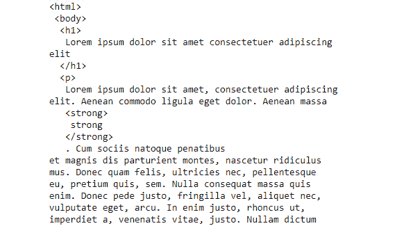

    ###### 图 5.29：HTML 文件内容

    同样的信息也可以通过使用 `soup.contents` 成员变量来获取。区别在于：首先，它不会打印出任何美观的内容，其次，它本质上是一个列表。

    如果我们仔细查看单独的文本编辑器中的 HTML 文件内容，我们会看到有许多段落标签，或 `<p>` 标签。让我们从一个这样的 `<p>` 标签中读取内容。我们可以使用简单的 `.` 访问修饰符来完成，就像我们会对类的普通成员变量做的那样。

1.  `bs4` 的魔力在于它给我们提供了这样一种优秀的方式来取消引用标签，作为 `BeautifulSoup` 类实例的成员变量：

    ```py
    with open("test.html", "r") as fd:
        soup = BeautifulSoup(fd)
        print(soup.p)
    ```

    输出如下：

    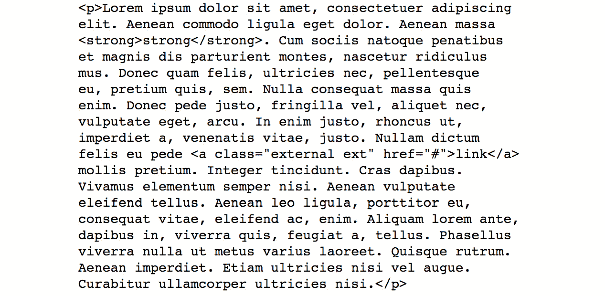

    ###### 图 5.30：<p> 标签中的文本

    如我们所见，这是 `<p>` 标签的内容。

    在上一个练习中，我们看到了如何读取一个标签，但我们可以很容易地看到这种方法的问题。当我们查看我们的 HTML 文档时，我们可以看到那里有多个 `<p>` 标签。我们如何访问所有的 `<p>` 标签？结果证明这是很容易的。

1.  使用 `findall` 方法从标签中提取内容：

    ```py
    with open("test.html", "r") as fd:
        soup = BeautifulSoup(fd)
        all_ps = soup.find_all('p')
        print("Total number of <p>  --- {}".format(len(all_ps)))
    ```

    输出如下：

    ```py
    Total number of <p>  --- 6
    ```

    这将打印出 6，这正是文档中 `<p>` 标签的数量。

    我们已经看到了如何访问相同类型的所有标签。我们也看到了如何获取整个 HTML 文档的内容。

1.  现在，我们将看到如何获取特定 HTML 标签下的内容，如下所示：

    ```py
    with open("test.html", "r") as fd:
        soup = BeautifulSoup(fd)
        table = soup.table
        print(table.contents)
    ```

    输出如下：

    

    ###### 图 5.31：`<table>` 标签下的内容

    在这里，我们正在从文档中获取（第一个）表格，然后使用相同的 "`.`" 表示法，来获取该标签下的内容。

    在上一个练习中，我们看到了如何访问特定标签下的全部内容。然而，HTML 被表示为树，我们能够遍历特定节点的子标签。有几种方法可以做到这一点。

1.  第一种方法是通过使用任何 `bs4` 实例的 `children` 生成器，如下所示：

    ```py
    with open("test.html", "r") as fd:
        soup = BeautifulSoup(fd)
        table = soup.table
        for child in table.children:
            print(child)
            print("*****")
    ```

    当我们执行代码时，我们将看到如下所示的内容：

    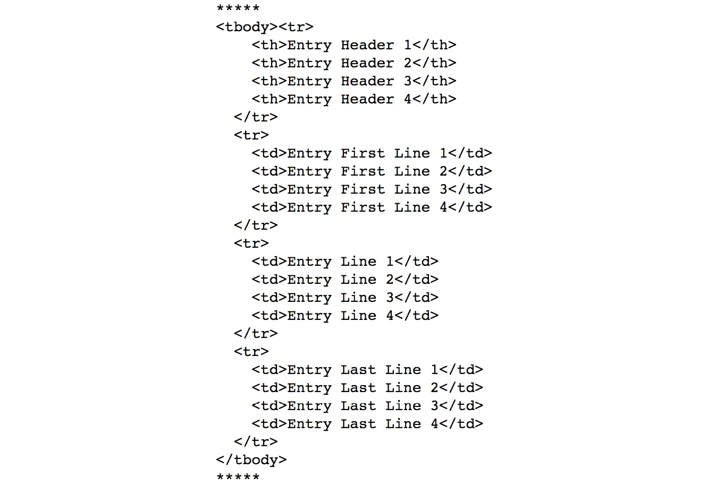

    ###### 图 5.32：遍历表格节点的子标签

    看起来循环只执行了两次！嗯，`"children"` 生成器的问题在于它只考虑了标签的直接子标签。我们在 `<table>` 下有 `<tbody>`，并且整个表格结构都被它包裹着。这就是为什么它被视为 `<table>` 标签的单个子标签。

    我们探讨了如何浏览一个标签的直接子标签。我们将看到如何浏览一个标签的所有可能子标签，而不仅仅是直接子标签。

1.  为了做到这一点，我们使用 `bs4` 实例中的 `descendants` 生成器，如下所示：

    ```py
    with open("test.html", "r") as fd:
        soup = BeautifulSoup(fd)
        table = soup.table
        children = table.children
        des = table.descendants
        print(len(list(children)), len(list(des)))
    ```

    输出如下：

    ```py
    9 61
    ```

代码块末尾的比较打印将显示 `children` 和 `descendants` 之间的差异。我们从 `children` 获取的列表长度仅为 9，而从 `descendants` 获取的列表长度为 61。

### 练习 70：DataFrames 和 BeautifulSoup

到目前为止，我们已经看到了一些使用 `bs4` 在 HTML 文档内部导航标签的基本方法。现在，我们将更进一步，利用 `bs4` 的力量与 pandas 的力量相结合，从纯 HTML 表格生成一个 DataFrame。这种特定的知识对我们非常有用。通过我们现在将获得的知识，我们将能够轻松地准备一个 pandas DataFrame 来执行 EDA（探索性数据分析）或建模。我们将在测试 HTML 文件的一个简单小表格上展示这个过程，但这个概念同样适用于任何任意大的表格：

1.  导入`pandas`并按以下方式读取文档：

    ```py
    import pandas as pd
    fd = open("test.html", "r")
    soup = BeautifulSoup(fd)
    data = soup.findAll('tr')
    print("Data is a {} and {} items long".format(type(data), len(data)))
    ```

    输出如下：

    ```py
    Data is a <class 'bs4.element.ResultSet'> and 4 items long
    ```

1.  检查 HTML 源中的原始表格结构。你会看到第一行是列标题，所有后续的行都是数据。我们为两个部分分配了两个不同的变量，如下所示：

    ```py
    data_without_header = data[1:]
    headers = data[0]
    header
    ```

    输出如下：

    ```py
    <tr>
    <th>Entry Header 1</th>
    <th>Entry Header 2</th>
    <th>Entry Header 3</th>
    <th>Entry Header 4</th>
    </tr>
    ```

    #### 注意

    请记住，抓取 HTML 页面的艺术与理解源 HTML 结构密不可分。因此，每次你想抓取一个页面时，你首先需要做的就是右键点击它，然后从浏览器中使用“查看源代码”来查看源 HTML。

1.  一旦我们分离了这两个部分，我们需要两个列表推导式来使它们准备好进入 DataFrame。对于标题，这很简单：

    ```py
    col_headers = [th.getText() for th in headers.findAll('th')]
    col_headers
    ```

    输出如下：

    ```py
    ['Entry Header 1', 'Entry Header 2', 'Entry Header 3', 'Entry Header 4']
    ```

1.  对于 pandas DataFrame 的数据准备有点棘手。你需要有一个二维列表，即列表的列表。我们以下这种方式完成：

    ```py
    df_data = [[td.getText() for td in tr.findAll('td')] for tr in data_without_header]
    df_data
    ```

    输出如下：

    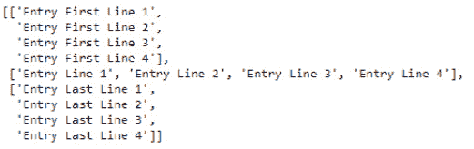

    ###### 图 5.33：以二维列表的形式输出

1.  调用`pd.DataFrame`方法，并使用以下代码提供正确的参数：

    ```py
    df = pd.DataFrame(df_data, columns=col_headers)
    df.head()
    ```

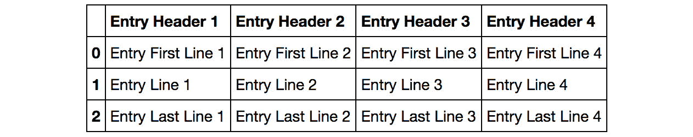

###### 图 5.34：带有列标题的表格格式输出

### 练习 71：将 DataFrame 导出为 Excel 文件

在这个练习中，我们将看到如何将 DataFrame 保存为 Excel 文件。Pandas 可以原生地做到这一点，但需要`openpyxl`库的帮助来实现这个目标：

1.  使用以下命令安装`openpyxl`库：

    ```py
    !pip install openpyxl
    ```

1.  要将 DataFrame 保存为 Excel 文件，请在 Jupyter 笔记本中使用以下命令：

    ```py
    writer = pd.ExcelWriter('test_output.xlsx')df.to_excel(writer, "Sheet1")writer.save()
    writer
    ```

    输出如下：

    ```py
    <pandas.io.excel._XlsxWriter at 0x24feb2939b0>
    ```

### 练习 72：使用 bs4 从文档中堆叠 URL

在之前（讨论堆栈时），我们解释了拥有一个堆栈的重要性，我们可以将网页中的 URL 推入堆栈，以便稍后弹出以跟踪每个 URL。在这里，在这个练习中，我们将看到它是如何工作的。

在给定的测试中，HTML 文件链接或`<a>`标签位于`<ul>`标签下，并且每个都包含在`</li>`标签内：

1.  使用以下命令查找所有`<a>`标签：

    ```py
    d = open("test.html", "r")
    soup = BeautifulSoup(fd)
    lis = soup.find('ul').findAll('li')
    stack = []
    for li in lis:    a = li.find('a', href=True)
    ```

1.  在循环开始之前定义一个堆栈。然后在循环内部，使用`append`方法将链接推入堆栈：

    ```py
    stack.append(a['href'])
    ```

1.  打印堆栈：

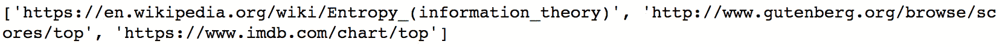

###### 图 5.35：堆栈的输出

### 活动七：从网页中读取表格数据并创建 DataFrame

在这个活动中，你已经得到了一个包含所有国家 GDP 的维基百科页面。你被要求从页面中提到的三个来源创建三个`DataFrame`（[`en.wikipedia.org/wiki/List_of_countries_by_GDP_(nominal)`](https://en.wikipedia.org/wiki/List_of_countries_by_GDP_(nominal))）：

你必须做以下事情：

1.  在单独的 Chrome/Firefox 标签页中打开页面，并使用类似**检查元素**的工具来查看源 HTML 并理解其结构

1.  使用 bs4 读取页面

1.  找到你需要处理的表格结构（有多少个表格？）

1.  使用 bs4 找到正确的表格

1.  将源名称及其对应的数据分开

1.  从你创建的源列表中获取源名称

1.  仅对第一个源将标题和数据从之前分开的数据中分离出来，然后使用这些数据创建一个 DataFrame

1.  对其他两个数据源重复最后一个任务

    #### 注意

    该活动的解决方案可以在第 308 页找到。

## 摘要

在这个主题中，我们研究了 HTML 文档的结构。HTML 文档是万维网的基础，考虑到其包含的数据量，我们可以轻易推断出 HTML 作为数据源的重要性。

我们学习了 bs4（BeautifulSoup4），这是一个 Python 库，它为我们提供了以 Python 方式读取和查询 HTML 文档的方法。我们使用 bs4 加载了一个 HTML 文档，并探索了多种不同的导航加载文档的方法。我们还获得了关于这些方法之间差异的必要信息。

我们探讨了如何从 HTML 文档（其中包含一个表格）创建 pandas DataFrame。尽管 pandas 中有一些内置的方法来完成这项工作，但一旦目标表格被编码在一个复杂的元素层次结构中，它们就会失败。因此，我们在本主题中通过逐步将 HTML 表格转换为 pandas DataFrame 所获得的知识是无价的。

最后，我们探讨了如何在代码中创建一个栈，将我们在读取 HTML 文件时遇到的全部 URL 推入栈中，然后在稍后时间使用它们。在下一章中，我们将讨论列表推导式、zip、格式化和异常值检测与清理。
