# 第九章：*第八章*

# RDBMS 和 SQL

## 学习目标

到本章结束时，你将能够：

+   使用 Python 将 RDBMS 的基本知识应用于查询数据库

+   将 SQL 中的数据转换为 pandas DataFrame

本章解释了数据库的概念，包括它们的创建、操作和控制，以及将表转换为 pandas DataFrame。

## 简介

我们数据之旅的本章专注于**RDBMS**（关系数据库管理系统）和**SQL**（结构化查询语言）。在前一章中，我们从文件中存储和读取数据。在本章中，我们将读取结构化数据，设计数据访问，并为数据库创建查询接口。

数据已经以 RDBMS 格式存储多年。背后的原因如下：

+   RDBMS 是存储、管理和检索数据的一种非常安全的方式。

+   它们有一个坚实的数学基础（关系代数和关系演算），并且提供了一个高效直观的声明性语言——SQL，以便轻松交互。

+   几乎每种语言都有丰富的库来与不同的 RDBMS 交互，并且使用它们的技巧和方法已经过良好的测试和理解。

+   扩展关系型数据库管理系统（RDBMS）是一个相当熟悉的任务，并且有许多受过良好训练、经验丰富的专业人士（数据库管理员或数据库管理员）来做这项工作。

如以下图表所示，DBMS 市场很大。此图表是基于**Gartner, Inc.**在**2016**年进行的市调产生的：

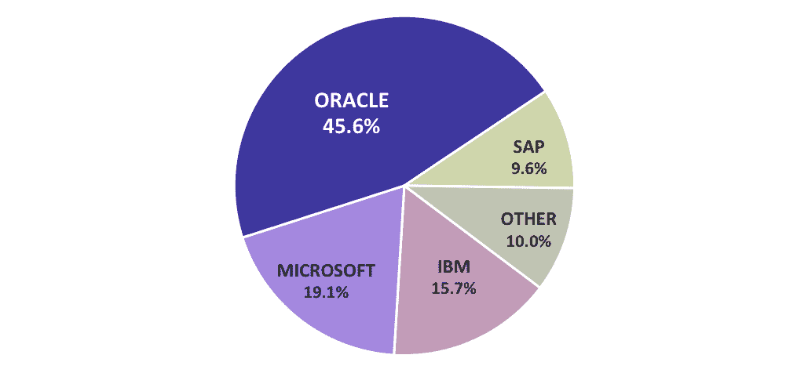

###### 图 8.1 2016 年商业数据库市场份额

在本章中，我们将学习和探索数据库和数据库管理系统的一些基本和基本概念。

## RDBMS 和 SQL 的复习

RDBMS 是一种管理数据（对于最终用户以表格形式表示）的软件，它使用 Codd 的关系模型构建，并存储在物理硬盘上。我们今天遇到的数据库大多数都是 RDBMS。近年来，整个行业向一种新型的数据库管理系统转变，称为**NoSQL**（**MongoDB**、**CouchDB**、**Riak**等）。这些系统虽然在某些方面遵循 RDBMS 的一些规则，但在大多数情况下拒绝或修改了它们。

### RDBMS 是如何结构的？

RDBMS 结构由三个主要元素组成，即存储引擎、查询引擎和日志管理。以下是显示 RDBMS 结构的图：

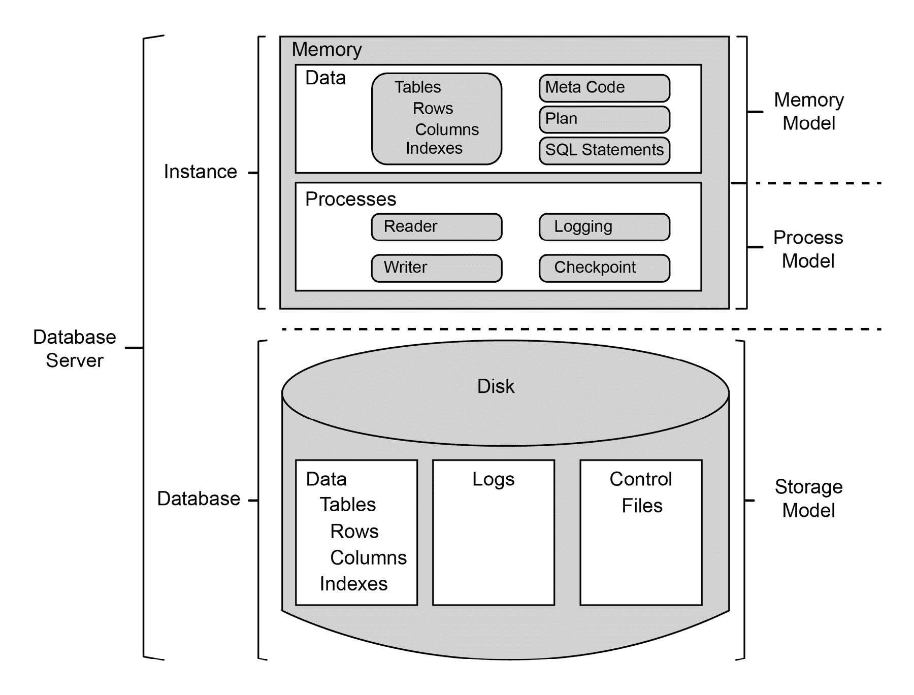

###### 图 8.2 RDBMS 结构

以下是一些 RDBMS 结构的主要概念：

+   **存储引擎**：这是 RDBMS 中负责以高效方式存储数据并在请求时以高效方式返回数据的部分。作为 RDBMS 系统的最终用户（应用程序开发人员被视为 RDBMS 的最终用户），我们永远不会需要直接与这一层交互。

+   **查询引擎**：这是 RDBMS 的部分，允许我们创建数据对象（表、视图等），操作它们（创建和删除列，创建/删除/更新行等），并使用简单而强大的语言查询它们（读取行）。

+   **日志管理**：RDBMS 的这部分负责创建和维护日志。如果你想知道为什么日志如此重要，那么你应该了解一下在现代 RDBMS（如 PostgreSQL）中如何使用所谓的 **Write Ahead Log**（或简称为 WAL）来处理复制和分区。

我们将在本章中关注查询引擎。

### SQL

**结构化查询语言**（**S**tructured **Q**uery **L**anguage 或 **SQL**，通常发音为 sequel）是一种领域特定语言，最初是基于 E.F. Codd 的关系模型设计的，并且在当今的数据库中广泛用于定义、插入、操作和从数据库中检索数据。它可以进一步细分为四个较小的子语言，即 **DDL**（数据定义语言）、**DML**（数据操作语言）、**DQL**（数据查询语言）和 **DCL**（数据控制语言）。使用 SQL 有几个优点，其中一些如下：

+   它基于一个坚实的数学框架，因此很容易理解。

+   它是一种声明性语言，这意味着我们实际上从未告诉它如何完成其工作。我们几乎总是告诉它要做什么。这使我们从编写数据管理自定义代码的大负担中解放出来。我们可以更专注于我们试图解决的查询问题，而不是烦恼于如何创建和维护数据存储。

+   它为你提供了一个快速且易于阅读的方式来处理数据。

+   SQL 提供了单次查询获取多个数据片段的现成方法。

下一个主题的主要关注领域将是 DDL、DML 和 DQL。DCL 部分更多是针对数据库管理员的。

+   `CREATE` `TABLE` 或 `DROP` `TABLE` 或 `ALTER` `TABLE`。

    #### 注意

    注意大写字母的使用。这并不是一个规范，你可以使用小写字母，但这是一个广泛遵循的约定，我们将在本书中使用它。

+   `INSERT` `INTO`、`DELETE` `FROM` 或 `UPDATE`。

+   `SELECT` 命令。我们还将看到并使用主键、外键、索引、连接等概念。

一旦你在数据库中定义并插入数据，它可以表示如下：

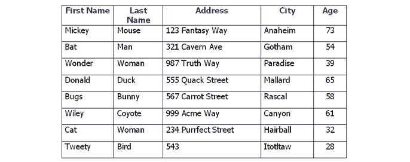

###### 图 8.3 显示示例数据的表

关于 RDBMS 另一件需要记住的事情是关系。通常，在一个表中，我们有一列或多列，每行在表中都有唯一值。我们称它们为该表的 **主键**。我们应该意识到，我们将在行之间遇到唯一值，这些值不是主键。它们与主键之间的主要区别是主键不能为空。

通过使用一个表的主键，并在另一个表中将其作为外键提及，我们可以在两个表之间建立关系。某个表可以与任何有限数量的表相关联。关系可以是 1:1，这意味着第二个表的每一行都与第一个表的唯一一行相关联，或者 1:N，N:1，或者 N:M。关系的一个例子如下：

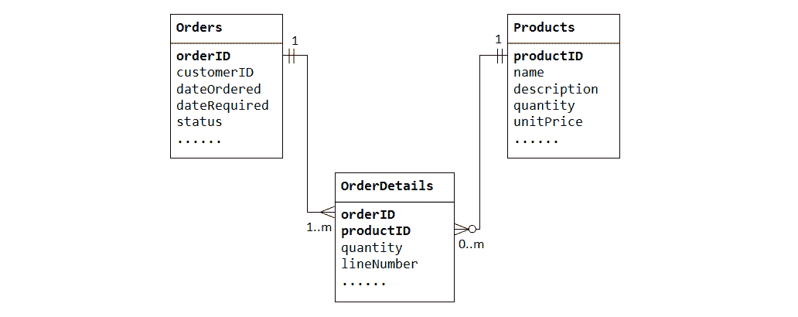

###### 图 8.4 显示关系的图

通过这个简短的复习，我们现在可以开始动手练习，并编写一些 SQL 来存储和检索数据。

## 使用 RDBMS（MySQL/PostgreSQL/SQLite）

在这个主题中，我们将关注如何编写一些基本的 SQL 命令，以及如何从 Python 连接到数据库并在 Python 中有效地使用它。我们将选择 SQLite 作为数据库。还有其他数据库，例如 `Oracle`、`MySQL`、`Postgresql` 和 `DB2`。你将要学习的主要技巧不会根据你使用的数据库而改变。但是，对于不同的数据库，你需要安装不同的第三方 Python 库（例如，`Postgresql` 的 `Psycopg2` 等）。它们之所以都以相同的方式（除了某些小细节外）运行，是因为它们都遵循 `PEP249`（通常称为 Python DB API 2）。

这是一个很好的标准化，在从一种 RDBMS 转移到另一种时，它能节省我们很多麻烦。

#### 注意

大多数用 Python 编写并使用某种 RDBMS 作为数据存储的行业标准项目，通常依赖于一个 ORM 或对象关系映射器。ORM 是一个高级库，在处理 RDBMS 时使许多任务变得更容易。它还提供了一个比在 Python 代码中编写原始 SQL 更 Pythonic 的 API。

### 练习 107：在 SQLite 中连接到数据库

在这个练习中，我们将探讨使用 Python 代码中的 RDBMS 的第一步。我们即将要做的是连接到数据库，然后关闭连接。我们还将了解如何最好地完成这项任务：

1.  使用以下命令导入 Python 的 `sqlite3` 库：

    ```py
    import sqlite3
    ```

1.  使用 `connect` 函数连接到数据库。如果你对数据库有一些经验，你会注意到我们没有使用任何 `服务器地址`、`用户名`、`密码` 或其他凭证来连接到数据库。这是因为这些字段在 `sqlite3` 中不是强制性的，而在 `Postgresql` 或 `MySQL` 中则是。SQLite 的主要数据库引擎是嵌入式的：

    ```py
    conn = sqlite3.connect("chapter.db")
    ```

1.  关闭连接，如下所示：

    ```py
    conn.close()
    ```

    这个 `conn` 对象是主要的连接对象，一旦我们想要与数据库交互，我们将来需要获取第二种类型的对象。我们需要小心关闭对数据库的任何打开连接。

1.  使用与文件相同的 `with` 语句，连接到数据库，如下所示：

    ```py
    with sqlite3.connect("chapter.db") as conn:
        pass
    ```

在这个练习中，我们已经使用 Python 连接到数据库。

### 练习 108：SQLite 中的 DDL 和 DML 命令

在这个练习中，我们将查看如何创建一个表，并且我们还将向其中插入数据。

如其名所示，DDL（数据定义语言）是提前与数据库引擎通信以定义数据外观的方式。数据库引擎根据提供的定义创建一个表对象，并对其进行准备。

要在 SQL 中创建一个表，使用 `CREATE TABLE` SQL 子句。这需要表名和表定义。表名是数据库引擎用于查找和在未来所有事务中使用表的唯一标识符。它可以是一切（任何字母数字字符串），只要它是唯一的。我们将以（column_name_1 数据类型，column_name_2 数据类型，……）的形式添加表定义。出于我们的目的，我们将使用 `text` 和 `integer` 数据类型，但通常标准数据库引擎支持更多的数据类型，例如 float、double、日期时间、布尔值等。我们还需要指定一个主键。主键是一个唯一、非空的标识符，用于在表中唯一标识一行。在我们的例子中，我们使用电子邮件作为主键。主键可以是整数或文本。

你需要知道的是，除非你对你刚刚执行的一系列操作（我们正式称之为“事务”）调用 `commit`，否则实际上不会执行任何操作并在数据库中反映出来。这个特性被称为**原子性**。实际上，为了使数据库成为行业标准（在实际生活中可用），它需要遵循 ACID（原子性、一致性、隔离性、持久性）特性：

1.  使用 SQLite 的 `connect` 函数连接到 `chapter.db` 数据库，如下所示：

    ```py
    with sqlite3.connect("chapter.db") as conn:
    ```

    #### 注意

    一旦你添加了第 3 步中的代码片段，此代码就会生效。

1.  通过调用 `conn.cursor()` 创建一个游标对象。游标对象作为与数据库通信的媒介。在 Python 中创建一个表，如下所示：

    ```py
        cursor = conn.cursor()
        cursor.execute("CREATE TABLE IF NOT EXISTS user (email text, first_name text, last_name text, address text, age integer, PRIMARY KEY (email))")
    ```

1.  按如下方式将行插入你创建的数据库中：

    ```py
    cursor.execute("INSERT INTO user VALUES ('bob@example.com', 'Bob', 'Codd', '123 Fantasy lane, Fantasy City', 31)")
    cursor.execute("INSERT INTO user VALUES ('tom@web.com', 'Tom', 'Fake', '456 Fantasy lane, Fantasu City', 39)")
    ```

1.  提交到数据库：

    ```py
    conn.commit()
    ```

这将创建一个表并将两行数据写入其中。

### 从 SQLite 数据库中读取数据

在前面的练习中，我们创建了一个表并在其中存储了数据。现在，我们将学习如何读取存储在此数据库中的数据。

`SELECT` 子句非常强大，对于数据从业者来说，掌握 `SELECT` 以及与之相关的所有内容（例如条件、连接、分组等）非常重要。

`SELECT` 后的 *** 告诉引擎从表中选择所有列。这是一个有用的缩写。我们还没有提到任何选择条件（例如年龄超过某个值、名字以某个字母序列开头等）。我们实际上是在告诉数据库引擎从表中选择所有行和所有列。如果我们有一个非常大的表，这将非常耗时且效率低下。因此，我们希望使用 `LIMIT` 子句来限制我们想要的行数。

您可以使用 SQL 中的 `SELECT` 子句来检索数据，如下所示：

```py
with sqlite3.connect("chapter.db") as conn:
    cursor = conn.cursor()
    rows = cursor.execute('SELECT * FROM user')
    for row in rows:
        print(row)
```

输出如下：

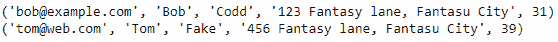

###### 图 8.5：SELECT 子句的输出

使用 `LIMIT` 与 `SELECT` 子句的语法如下：

```py
SELECT * FROM <table_name> LIMIT 50;
```

#### 注意

此语法是示例代码，在 Jupyter notebook 中无法工作。

这将选择所有列，但只从表中选取前 50 行。

### 练习 109：对数据库中存在的值进行排序

在这个练习中，我们将使用 `ORDER BY` 子句按年龄对用户表的行进行排序：

1.  按降序对 `chapter.db` 中的 `age` 进行排序，如下所示：

    ```py
    with sqlite3.connect("chapter.db") as conn:
        cursor = conn.cursor()
        rows = cursor.execute('SELECT * FROM user ORDER BY age DESC')
        for row in rows:
            print(row)
    ```

    输出如下：

    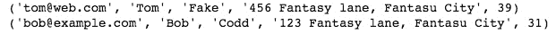

    ###### 图 8.6：按降序显示年龄的数据输出

1.  按升序对 `chapter.db` 中的 `age` 进行排序，如下所示：

    ```py
    with sqlite3.connect("chapter.db") as conn:
        cursor = conn.cursor()
        rows = cursor.execute('SELECT * FROM user ORDER BY age')
        for row in rows:
            print(row)
    ```

1.  输出如下：

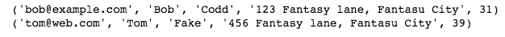

###### 图 8.7：按升序显示年龄的数据输出

注意，我们不需要指定 `ASC` 来按升序排序。

### 练习 110：修改表结构并更新新字段

在这个练习中，我们将使用 `ALTER` 添加一个列，并使用 `UPDATE` 更新新添加列中的值。

`UPDATE` 命令用于在插入后编辑/更新任何行。使用时请小心，因为没有选择性子句（如 `WHERE`）的 `UPDATE` 会影响整个表：

1.  使用以下命令建立与数据库的连接：

    ```py
    with sqlite3.connect("chapter.db") as conn:
        cursor = conn.cursor()
    ```

1.  在 `user` 表中添加另一列，并使用以下命令填充 `null` 值：

    ```py
    cursor.execute("ALTER TABLE user ADD COLUMN gender text")
    ```

1.  使用以下命令更新所有 `gender` 的值，使它们为 `M`：

    ```py
    cursor.execute("UPDATE user SET gender='M'")
    conn.commit()
    ```

1.  要检查修改后的表，请执行以下命令：

    ```py
    rows = cursor.execute('SELECT * FROM user')
    for row in rows:
            print(row)
    ```


###### 图 8.8：修改表后的输出

我们已通过将所有用户的性别设置为 `M`（代表男性）来更新整个表。

### 练习 111：在表中分组值

在这个练习中，我们将学习一个我们已经在 pandas 中学习过的概念。这就是 `GROUP BY` 子句。`GROUP BY` 子句是一种用于从数据库中检索不同值并将它们放入单独桶的技术。

以下图解说明了 GROUP BY 子句的工作原理：

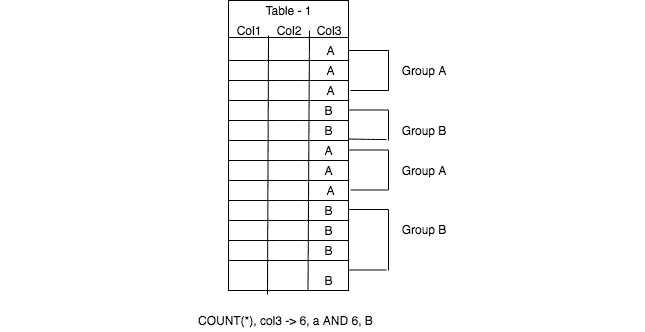

###### 图 8.9：GROUP BY 子句在表上的说明

在前面的图中，我们可以看到 `Col3` 列在所有行中只有两个唯一值，A 和 B。

用于检查每个组所属行总数的命令如下：

```py
SELECT count(*), col3 FROM table1 GROUP BY col3
```

向表中添加女性用户并根据性别进行分组：

1.  向表中添加一个女性用户：

    ```py
    cursor.execute("INSERT INTO user VALUES ('shelly@www.com', 'Shelly', 'Milar', '123, Ocean View Lane', 39, 'F')")
    ```

1.  运行以下代码以查看按性别划分的计数：

    ```py
    rows = cursor.execute("SELECT COUNT(*), gender FROM user GROUP BY gender")
    for row in rows:
            print(row)
    ```

    输出如下：


###### 图 8.10：GROUP BY 子句的输出

### 数据库中的关系映射

我们一直在使用单个表，对其进行修改，以及读取数据。然而，关系型数据库管理系统（RDBMS）的真正力量来自于处理不同对象（表）之间的关系。在本节中，我们将创建一个名为`comments`的新表，并以 1: N 的关系将其与用户表关联起来。这意味着一个用户可以有多个评论。我们将通过在`comments`表中添加`user`表的主键作为外键来实现这一点。这将创建一个 1: N 的关系。

当我们将两个表进行关联时，我们需要指定数据库引擎在父表中的行被删除，且在另一表中存在许多子行时应该执行什么操作。正如我们可以在以下图中看到的那样，当我们删除用户表中的行 1 时，我们想知道问号所在位置会发生什么：

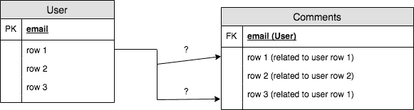

###### 图 8.11：关系说明

在非 RDBMS 的情况下，这种情况可能会迅速变得难以管理和维护。然而，在使用 RDBMS 的情况下，我们只需要非常精确地告诉数据库引擎在这种情况下应该做什么。数据库引擎会为我们完成剩下的工作。我们使用`ON` `DELETE`来告诉引擎当父行被删除时，我们应该如何处理表中的所有行。以下代码说明了这些概念：

```py
with sqlite3.connect("chapter.db") as conn:
    cursor = conn.cursor()
    cursor.execute("PRAGMA foreign_keys = 1")
    sql = """
        CREATE TABLE comments (
            user_id text,
            comments text,
            FOREIGN KEY (user_id) REFERENCES user (email) 
            ON DELETE CASCADE ON UPDATE NO ACTION
        )
    """
    cursor.execute(sql)
    conn.commit()
```

`ON` `DELETE` `CASCADE`行通知数据库引擎，当父行被删除时，我们希望删除所有子行。我们也可以为`UPDATE`定义操作。在这种情况下，对于`UPDATE`没有要执行的操作。

`FOREIGN KEY`修饰符修改一个列定义（在这种情况下为`user_id`），并将其标记为外键，它与另一个表的主键（在这种情况下为`email`）相关联。

你可能会注意到代码中看起来奇怪的`cursor.execute("PRAGMA foreign_keys = 1")`行。它之所以存在，仅仅是因为 SQLite 默认不使用正常的键外键功能。正是这一行启用了该功能。这是 SQLite 的典型做法，我们不需要为任何其他数据库使用它。

### 在`comments`表中添加行

我们已经创建了一个名为`comments`的表。在本节中，我们将动态生成一个插入查询，如下所示：

```py
with sqlite3.connect("chapter.db") as conn:
    cursor = conn.cursor()
    cursor.execute("PRAGMA foreign_keys = 1")
    sql = "INSERT INTO comments VALUES ('{}', '{}')"
    rows = cursor.execute('SELECT * FROM user ORDER BY age')
    for row in rows:
        email = row[0]
        print("Going to create rows for {}".format(email))
        name = row[1] + " " + row[2]
        for i in range(10):
            comment = "This is comment {} by {}".format(i, name)
            conn.cursor().execute(sql.format(email, comment))
    conn.commit()
```

注意我们如何动态生成插入查询，以便我们可以为每个用户插入 10 条评论。

### 连接

在这个练习中，我们将学习如何利用我们刚刚建立的关系。这意味着如果我们有一个表的键，我们可以从该表恢复所需的所有数据，以及从子表中的所有关联行。为了实现这一点，我们将使用一个称为**连接**的东西。

连接基本上是一种使用任何类型的键-外键关系从两个表中检索相关行的方法。有许多类型的连接，如`INNER`、`LEFT OUTER`、`RIGHT OUTER`、`FULL OUTER`和`CROSS`。它们用于不同的场景。然而，在简单的 1: N 关系中，我们通常使用`INNER`连接。在*第一章：使用 Python 进行数据整理的介绍*中，我们学习了集合，然后我们可以将`INNER`连接视为两个集合的交集。以下图表说明了这些概念：

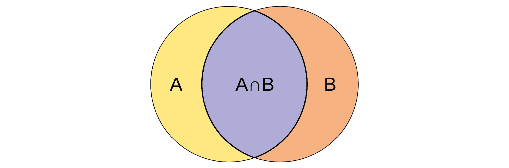

###### 图 8.12：交集连接

在这里，A 代表一个表，B 代表另一个表。拥有共同成员的意义是它们之间存在关系。它将 A 的所有行与 B 的所有行进行比较，以找到满足连接谓词的匹配行。这可能会迅速变成一个复杂且耗时的操作。连接可以是昂贵的操作。通常，我们在指定连接后使用某种`WHERE`子句，以缩短从表 A 或 B 中检索的行的范围以执行匹配。

在我们的例子中，我们的第一个表`user`有三个条目，主键是`email`。我们可以在查询中使用这一点来获取来自`Bob`的评论：

```py
with sqlite3.connect("chapter.db") as conn:
    cursor = conn.cursor()s
    cursor.execute("PRAGMA foreign_keys = 1")
    sql = """
        SELECT * FROM comments 
        JOIN user ON comments.user_id = user.email
        WHERE user.email='bob@example.com'
    """
    rows = cursor.execute(sql)
    for row in rows:
        print(row)
```

输出如下：

```py
('bob@example.com', 'This is comment 0 by Bob Codd', 'bob@example.com', 'Bob', 'Codd', '123 Fantasy lane, Fantasu City', 31, None)
('bob@example.com', 'This is comment 1 by Bob Codd', 'bob@example.com', 'Bob', 'Codd', '123 Fantasy lane, Fantasu City', 31, None)
('bob@example.com', 'This is comment 2 by Bob Codd', 'bob@example.com', 'Bob', 'Codd', '123 Fantasy lane, Fantasu City', 31, None)
('bob@example.com', 'This is comment 3 by Bob Codd', 'bob@example.com', 'Bob', 'Codd', '123 Fantasy lane, Fantasu City', 31, None)
('bob@example.com', 'This is comment 4 by Bob Codd', 'bob@example.com', 'Bob', 'Codd', '123 Fantasy lane, Fantasu City', 31, None)
('bob@example.com', 'This is comment 5 by Bob Codd', 'bob@example.com', 'Bob', 'Codd', '123 Fantasy lane, Fantasu City', 31, None)
('bob@example.com', 'This is comment 6 by Bob Codd', 'bob@example.com', 'Bob', 'Codd', '123 Fantasy lane, Fantasu City', 31, None)
('bob@example.com', 'This is comment 7 by Bob Codd', 'bob@example.com', 'Bob', 'Codd', '123 Fantasy lane, Fantasu City', 31, None)
('bob@example.com', 'This is comment 8 by Bob Codd', 'bob@example.com', 'Bob', 'Codd', '123 Fantasy lane, Fantasu City', 31, None)
('bob@example.com', 'This is comment 9 by Bob Codd', 'bob@example.com', 'Bob', 'Codd', '123 Fantasy lane, Fantasu City', 31, None)
```

###### 图 8.13：连接查询的输出

### 从 JOIN 查询中检索特定列

在上一个练习中，我们看到了我们可以使用连接来从两个表中检索相关行。然而，如果我们查看结果，我们会看到它返回了所有列，因此结合了两个表。这并不非常简洁。如果我们只想看到电子邮件和相关的评论，而不是所有数据呢？

有一些简洁的代码可以让我们做到这一点：

```py
with sqlite3.connect("chapter.db") as conn:
    cursor = conn.cursor()
    cursor.execute("PRAGMA foreign_keys = 1")
    sql = """
        SELECT comments.* FROM comments
        JOIN user ON comments.user_id = user.email
        WHERE user.email='bob@example.com'
    """
    rows = cursor.execute(sql)
    for row in rows:
        print(row)
```

只需更改`SELECT`语句，我们就可以使最终结果看起来如下：

```py
('bob@example.com', 'This is comment 0 by Bob Codd')
('bob@example.com', 'This is comment 1 by Bob Codd')
('bob@example.com', 'This is comment 2 by Bob Codd')
('bob@example.com', 'This is comment 3 by Bob Codd')
('bob@example.com', 'This is comment 4 by Bob Codd')
('bob@example.com', 'This is comment 5 by Bob Codd')
('bob@example.com', 'This is comment 6 by Bob Codd')
('bob@example.com', 'This is comment 7 by Bob Codd')
('bob@example.com', 'This is comment 8 by Bob Codd')
('bob@example.com', 'This is comment 9 by Bob Codd')
```

### 练习 112：删除行

在这个练习中，我们将从用户表中删除一行，并观察它对`comments`表产生的影响。运行此命令时要非常小心，因为它可能会对数据产生破坏性影响。请记住，它几乎总是需要与`WHERE`子句一起运行，以便我们只删除部分数据而不是全部：

1.  要从表中删除一行，我们使用`SQL`中的`DELETE`子句。要运行`user`表的删除操作，我们将使用以下代码：

    ```py
    with sqlite3.connect("chapter.db") as conn:
        cursor = conn.cursor()
        cursor.execute("PRAGMA foreign_keys = 1")
        cursor.execute("DELETE FROM user WHERE email='bob@example.com'")
        conn.commit()
    ```

1.  在用户表上执行`SELECT`操作：

    ```py
    with sqlite3.connect("chapter.db") as conn:
        cursor = conn.cursor()
        cursor.execute("PRAGMA foreign_keys = 1")
        rows = cursor.execute("SELECT * FROM user")
        for row in rows:
            print(row)
    ```

    观察到用户 Bob 已被删除。

    现在，让我们转到`comments`表，我们必须记住我们在创建表时提到了`ON DELETE CASCADE`。数据库引擎知道，如果从父表（`user`）中删除一行，所有相关的子表（`comments`）中的行都必须被删除。

1.  使用以下命令在评论表上执行选择操作：

    ```py
    with sqlite3.connect("chapter.db") as conn:
        cursor = conn.cursor()
        cursor.execute("PRAGMA foreign_keys = 1")
        rows = cursor.execute("SELECT * FROM comments")
        for row in rows:
            print(row)
    ```

    输出如下：

    ```py
    ('tom@web.com', 'This is comment 0 by Tom Fake')
    ('tom@web.com', 'This is comment 1 by Tom Fake')
    ('tom@web.com', 'This is comment 2 by Tom Fake')
    ('tom@web.com', 'This is comment 3 by Tom Fake')
    ('tom@web.com', 'This is comment 4 by Tom Fake')
    ('tom@web.com', 'This is comment 5 by Tom Fake')
    ('tom@web.com', 'This is comment 6 by Tom Fake')
    ('tom@web.com', 'This is comment 7 by Tom Fake')
    ('tom@web.com', 'This is comment 8 by Tom Fake')
    ('tom@web.com', 'This is comment 9 by Tom Fake')
    ```

    我们可以看到与 Bob 相关的所有行都被删除了。

### 在表中更新特定值

在这个练习中，我们将看到如何更新表中的行。我们以前已经看过这个，但正如我们提到的，只是在表级别。没有 WHERE 子句，更新通常不是一个好主意。

将 UPDATE 与 WHERE 结合使用，以选择性地更新具有电子邮件地址`tom@web.com`的用户的名字：`

```py
with sqlite3.connect("chapter.db") as conn:
    cursor = conn.cursor()
    cursor.execute("PRAGMA foreign_keys = 1")
    cursor.execute("UPDATE user set first_name='Chris' where email='tom@web.com'")
    conn.commit()
    rows = cursor.execute("SELECT * FROM user")
    for row in rows:
        print(row)
```

输出如下：

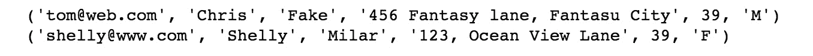

###### 图 8.14：更新查询的输出

### 练习 113：关系数据库管理系统和 DataFrame

我们已经探讨了从数据库存储和查询数据的许多基本方面，但作为一个数据整理专家，我们需要我们的数据打包并呈现为 DataFrame，这样我们就可以快速方便地对它们进行操作：

1.  使用以下代码导入`pandas`：

    ```py
    import pandas as pd
    ```

1.  创建一个包含`email`、`first name`、`last name`、`age`、`gender`和`comments`作为列名的列列表。同时创建一个空的数据列表：

    ```py
    columns = ["Email", "First Name", "Last Name", "Age", "Gender", "Comments"]
    data = []
    ```

1.  使用`SQLite`连接到`chapter.db`并获取游标，如下所示：

    ```py
    with sqlite3.connect("chapter.db") as conn:
        cursor = conn.cursor()
    Use the execute method from the cursor to set "PRAGMA foreign_keys = 1"
        cursor.execute("PRAGMA foreign_keys = 1")
    ```

1.  创建一个包含`SELECT`命令的`sql`变量，并使用`join`命令连接数据库：

    ```py
    sql = """
            SELECT user.email, user.first_name, user.last_name, user.age, user.gender, comments.comments FROM comments
            JOIN user ON comments.user_id = user.email
            WHERE user.email = 'tom@web.com'
        """
    ```

1.  使用游标的`execute`方法执行`sql`命令：

    ```py
        rows = cursor.execute(sql)
    ```

1.  将行追加到数据列表中：

    ```py
        for row in rows:
            data.append(row)
    ```

1.  使用数据列表创建 DataFrame：

    ```py
    df = pd.DataFrame(data, columns=columns)
    ```

1.  我们已经使用数据列表创建了 DataFrame。您可以使用`df.head`将值打印到 DataFrame 中。

### 活动 11：正确从数据库检索数据

在这个活动中，我们有人员表：

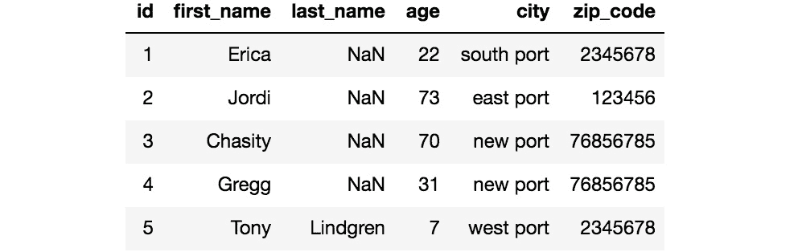

###### 图 8.15：人员表

我们有宠物表：

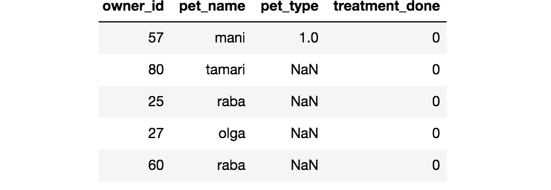

###### 图 8.16：宠物表

如我们所见，人员表中的`id`列（它是一个整数）是该表的主键，也是宠物表的外键，通过`owner_id`列进行链接。

人员表有以下列：

+   `first_name`: 人员的名字

+   `last_name`: 人员的姓氏（可以是“null”）

+   `age`: 人员的年龄

+   `city`: 他/她来自的城市

+   `zip_code`: 城市的邮政编码

宠物表有以下列：

+   `pet_name`: 宠物的名字。

+   `pet_type`: 宠物的类型，例如，猫、狗等。由于缺乏更多信息，我们不知道哪个数字代表什么，但它是一个整数，可以是空值。

+   `treatment_done`: 它也是一个整数列，这里的 0 代表“否”，而 1 代表“是”。

SQLite 数据库的名称是`petsdb`，它随活动笔记本一起提供。

这些步骤将帮助您完成此活动：

1.  连接到`petsDB`并检查连接是否成功。

1.  查找人员数据库中的不同年龄段。

1.  查找人数最多的年龄段。

1.  找出没有姓氏的人。

1.  查询有多少人拥有不止一只宠物。

1.  查询已接受治疗的宠物数量。

1.  查询已接受治疗且已知宠物类型的宠物数量。

1.  查询有多少宠物来自名为`east port`的城市。

1.  查询有多少宠物来自名为`east port`的城市，并且接受了治疗。

    #### 注意

    本活动的解决方案可以在第 324 页找到。

## 摘要

我们已经到达了数据库章节的结尾。我们学习了如何使用 Python 连接到 SQLite 数据库。我们复习了关系型数据库的基础知识，并学习了如何打开和关闭数据库。然后我们学习了如何将这个关系型数据库导出到 Python 的 DataFrames 中。

在下一章中，我们将对现实世界的数据集进行数据整理。
