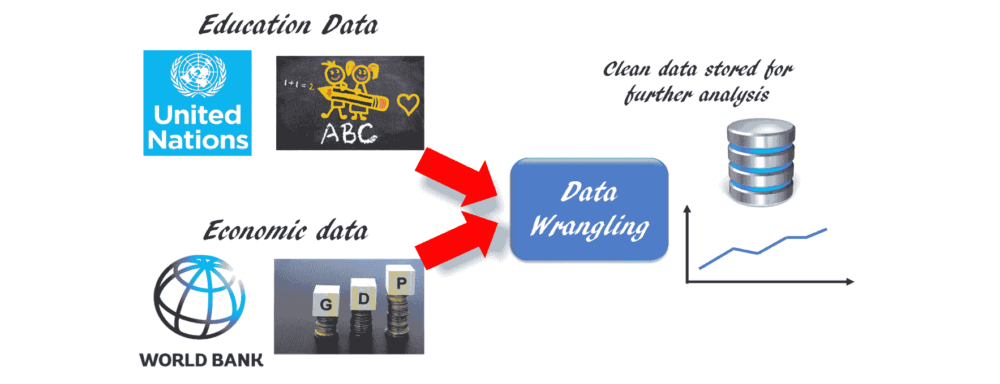
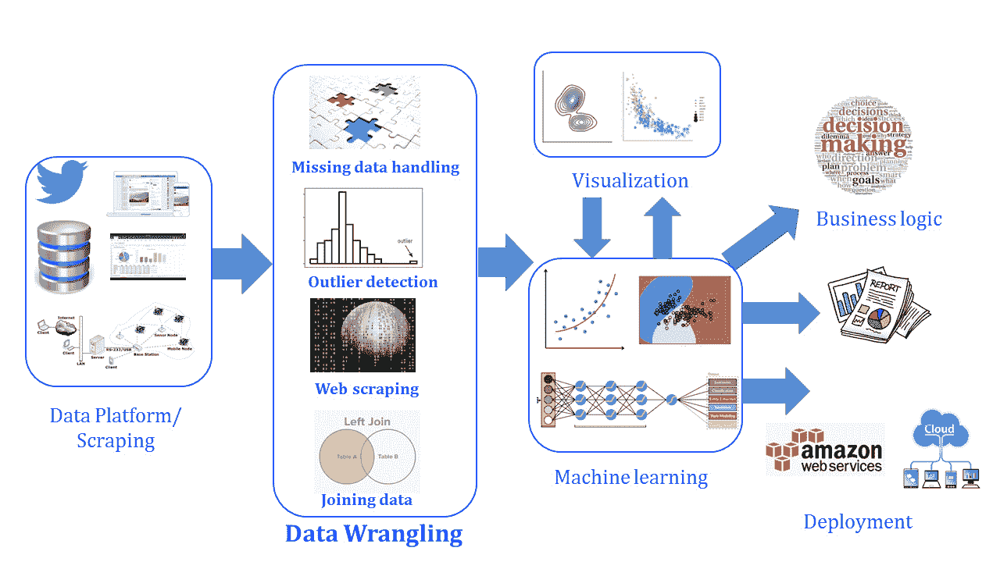

# *第九章*

# 数据处理在现实生活中的应用

## 学习目标

到本章结束时，你将能够：

+   对多个来自知名来源的完整数据集进行数据处理

+   创建一个统一的数据库，可以传递给数据科学团队进行机器学习和预测分析

+   将数据处理与版本控制、容器化、数据分析云服务以及大数据技术（如 Apache Spark 和 Hadoop）联系起来

在本章中，你将应用你在现实生活中的数据集上所积累的知识，并调查其各个方面。

## 简介

我们在上一章学习了数据库，所以现在是将数据处理和 Python 知识与实际场景相结合的时候了。在现实世界中，来自单一来源的数据通常不足以进行分析。通常，数据处理员必须区分相关数据和非相关数据，并从不同来源组合数据。

数据处理专家的主要工作是从多个来源提取数据，格式化和清理它（如果数据缺失，则进行数据插补），并最终以连贯的方式将其组合起来，为数据科学家或机器学习工程师准备进一步分析的数据集。

在这个主题中，我们将尝试通过下载和使用来自知名网络门户的两个不同数据集来模拟这样一个典型的任务流程。每个数据集都包含与被询问的关键问题相关的部分数据。让我们更仔细地检查一下。

## 将你的知识应用于实际生活中的数据处理任务

假设你被问到这个问题：**在过去 15 年里，印度的初等/中等/高等教育入学率是否随着人均 GDP 的提高而增加？** 实际的建模和分析将由一些资深数据科学家完成，他们将使用机器学习和数据可视化进行分析。作为数据处理专家，**你的工作将是获取并提供一个包含教育入学率和 GDP 数据的干净数据集，这些数据并排排列**。

假设你有一个来自联合国的数据集链接，你可以下载包含全球所有国家教育数据的数据集。但这个数据集有一些缺失值，而且它没有包含任何 GDP 信息。还有人给了你另一个单独的 CSV 文件（从世界银行网站下载），它包含 GDP 数据，但格式很混乱。

在这个活动中，我们将检查如何处理这两个不同的来源，清理数据以准备一个包含所需数据的简单最终数据集，并将其保存为本地驱动器上的 SQL 数据库文件：

###### 图 9.1：教育和经济数据合并的图示表示

鼓励您跟随笔记本中的代码和结果，尝试理解和内化数据处理流程的本质。您还被鼓励尝试从这些文件中提取各种数据，并回答您自己对一个国家的社会经济因素及其相互关系的问题。

#### 注意

提出关于社会、经济、技术和地缘政治主题的有趣问题，然后使用免费数据和一点编程知识来回答这些问题，这是学习任何数据科学主题最有趣的方式之一。您将在本章中了解到这个过程的一些内容。

**数据插补**

显然，我们缺少一些数据。假设我们决定通过在可用数据点之间进行简单线性插值来插补这些数据点。我们可以拿出笔和纸或计算器来计算这些值，并手动创建一个数据集。但作为一个数据处理员，我们当然会利用 Python 编程，并使用 pandas 插补方法来完成这项任务。

但要这样做，我们首先需要创建一个包含缺失值的 DataFrame，也就是说，我们需要将另一个包含缺失值的 DataFrame 附加到当前 DataFrame 上。

## 活动十二：数据处理任务 - 修复联合国数据

假设数据分析的议程是找出在过去 15 年中，人均 GDP 的提高是否导致了小学、中学或高等教育入学率的增加。为此任务，我们首先需要清理或整理两个数据集，即教育入学率和 GDP 数据。

联合国数据可在以下链接中找到：[`github.com/TrainingByPackt/Data-Wrangling-with-Python/blob/master/Chapter09/Activity12-15/SYB61_T07_Education.csv`](https://github.com/TrainingByPackt/Data-Wrangling-with-Python/blob/master/Lesson09/Activity12-15/SYB61_T07_Education.csv)。

#### 注意

如果您下载 CSV 文件并使用 Excel 打开它，您将看到“脚注”列有时包含有用的注释。我们可能不想一开始就删除它。如果我们对特定国家或地区的数据感兴趣（就像在这个任务中一样），那么“脚注”可能就是`NaN`，即空白。在这种情况下，我们可以在最后删除它。但对于某些国家或地区，它可能包含信息。

这些步骤将指导您找到解决方案：

1.  从以下链接下载联合国数据集：[`github.com/TrainingByPackt/Data-Wrangling-with-Python/blob/master/Chapter09/Activity13/India_World_Bank_Info.csv`](https://github.com/TrainingByPackt/Data-Wrangling-with-Python/blob/master/Lesson09/Activity13/India_World_Bank_Info.csv)。

    联合国数据存在缺失值。清理数据，准备一个包含所需数据的简单最终数据集，并将其保存到本地驱动器上的 SQL 数据库文件中。

1.  使用 pandas 的`pd.read_csv`方法创建一个 DataFrame。

1.  由于第一行不包含有用的信息，使用`skiprows`参数跳过它。

1.  删除区域/国家/地区和来源列。

1.  将以下名称分配为 DataFrame 的列：区域/县/地区、年份、数据、值和脚注。

1.  检查“脚注”列中有多少个独特的值。

1.  检查值列的类型。

1.  创建一个函数将值列转换为浮点数。

1.  使用`apply`方法将此函数应用于一个值。

1.  打印数据列中的独特值。

    #### 注意：

    本活动的解决方案可在第 338 页找到。

## 活动十三：数据整理任务 - 清理 GDP 数据

GDP 数据可在[`data.worldbank.org/`](https://data.worldbank.org/)找到，并在 GitHub 上可用，地址为[`github.com/TrainingByPackt/Data-Wrangling-with-Python/blob/master/Chapter09/Activity12-15/India_World_Bank_Info.csv`](https://github.com/TrainingByPackt/Data-Wrangling-with-Python/blob/master/Lesson09/Activity12-15/India_World_Bank_Info.csv)。

在本活动中，我们将清理 GDP 数据。

1.  从原始数据帧中通过筛选创建三个数据帧：`df_primary`、`df_secondary`和`df_tertiary`，分别对应小学、中学和大学的学生人数（单位为千）。

1.  绘制印度这类低收入国家和美国这类高收入国家小学学生入学人数的条形图。

1.  由于存在缺失数据，使用 pandas 的插补方法通过简单线性插值在数据点之间插补这些数据点。为此，创建一个包含缺失值的 DataFrame，并将一个包含缺失值的新的 DataFrame 附加到当前 DataFrame 中。

1.  （针对印度）添加对应缺失年份的行 - **2004 - 2009**，**2011 – 2013**。

1.  使用`np.nan`创建一个包含值的字典。请注意，有 9 个缺失数据点，因此我们需要创建一个包含相同值重复 9 次的列表。

1.  创建一个包含缺失值的 DataFrame（来自前面的字典），我们可以将其附加。

1.  将数据帧拼接在一起。

1.  按年份排序并使用`reset_index`重置索引。使用`inplace=True`在 DataFrame 本身上执行更改。

1.  使用线性插值方法进行线性插值。它通过线性插值值填充所有 NaN。有关此方法的更多详细信息，请参阅以下链接：[`pandas.pydata.org/pandas-docs/version/0.17/generated/pandas.DataFrame.interpolate.html`](http://pandas.pydata.org/pandas-docs/version/0.17/generated/pandas.DataFrame.interpolate.html)。

1.  对美国（或其他国家）重复相同的步骤。

1.  如果有未填写的值，使用`limit`和`limit_direction`参数与插值方法一起填充它们。

1.  使用新数据绘制最终图形。

1.  使用 pandas 的`read_csv`方法读取 GDP 数据。它通常会引发错误。

1.  为了避免错误，尝试使用`error_bad_lines` `=` `False`选项。

1.  由于文件中没有分隔符，添加`\t`分隔符。

1.  使用`skiprows`函数删除无用的行。

1.  检查数据集。使用表示与先前教育数据集相似的信息来过滤数据集。

1.  为这个新数据集重置索引。

1.  删除无用的行并重新索引数据集。

1.  正确重命名列。这对于合并两个数据集是必要的。

1.  我们将只关注 2003 年至 2016 年的数据。消除剩余的数据。

1.  创建一个新的 DataFrame，名为`df_gdp`，包含第 43 行到第 56 行的数据。

    #### 注意

    该活动的解决方案可以在第 338 页找到。

## 活动十四：数据处理任务 – 合并联合国数据和 GDP 数据

合并数据库的步骤如下：

1.  重置合并的索引。

1.  在年份列上合并两个 DataFrame，`primary_enrollment_india`和`df_gdp`。

1.  删除数据、脚注以及地区/县/区域。

1.  重新排列列以进行适当的查看和展示。

    #### 注意

    该活动的解决方案可以在第 345 页找到。

## 活动十五：数据处理任务 – 将新数据连接到数据库

将数据连接到数据库的步骤如下：

1.  导入 Python 的`sqlite3`模块，并使用`connect`函数连接到数据库。主要数据库引擎是嵌入式的。但对于像`Postgresql`或`MySQL`这样的不同数据库，我们需要使用那些凭据来连接它们。我们将`Year`指定为该表的`PRIMARY KEY`。

1.  然后，运行一个循环，逐行将数据集的行插入到表中。

1.  如果我们查看当前文件夹，我们应该看到一个名为`Education_GDP.db`的文件，如果我们使用数据库查看程序检查它，我们可以看到数据已传输到那里。

    #### 注意

    该活动的解决方案可以在第 347 页找到。

在这个笔记本中，我们检查了一个完整的数据处理流程，包括从网络和本地驱动器读取数据，过滤、清洗、快速可视化、插补、索引、合并，并将数据写回数据库表。我们还编写了自定义函数来转换一些数据，并展示了在读取文件时可能遇到错误的情况。

## 数据处理的扩展

这是本书的最后一章，我们希望向您提供一个广泛的概述，介绍一些您可能需要学习的令人兴奋的技术和框架，以便在数据处理之外工作，成为一名全栈数据科学家。数据处理是整个数据科学和数据分析流程的一个基本部分，但它不是全部。您在这本书中学到了宝贵的技能和技术，但总是好的，拓宽视野，看看其他工具可以在这个竞争激烈且不断变化的世界中给您带来优势。

### 成为数据科学家所需的其他技能

要成为一名合格的数据科学家/分析师，你应该在你的技能库中拥有一些基本技能，无论你选择专注于哪种特定的编程语言。这些技能和知识是语言无关的，可以根据你的组织和企业需求，在任何你必须接受的框架中使用。我们在这里简要描述它们：

+   **Git 和版本控制**：Git 版本控制对于代码管理来说，就像 RDBMS 对于数据存储和查询一样。这意味着在 Git 时代之前和之后，代码版本控制之间存在巨大的差距。正如你可能已经注意到的，这本书的所有笔记本都托管在 GitHub 上，这是为了利用强大的 Git VCS。它为你提供了开箱即用的版本控制、历史记录、不同代码的分支功能、合并不同代码分支以及 cherry picking、diff 等高级操作。这是一个非常必要的工具，你几乎可以肯定，在你的旅途中你会在某个时刻遇到它。Packt 有关于它的非常好的书籍。你可以查看以获取更多信息。

+   **Linux 命令行**：来自 Windows 背景（或者甚至 Mac，如果你之前没有进行过任何开发）的人通常不太熟悉命令行。那些操作系统的优越 UI 隐藏了使用命令行与操作系统交互的底层细节。然而，作为一名数据专业人士，了解命令行是非常重要的。你可以通过命令行执行的操作如此之多，以至于令人惊讶。

+   **SQL 和基本的关系数据库概念**：我们专门用了一整章来介绍 SQL 和 RDBMS。然而，正如我们之前提到的，这远远不够。这是一个庞大的主题，需要多年的学习才能掌握。尝试从书籍和在线资源中了解更多关于它的内容（包括理论和实践）。不要忘记，尽管现在使用了所有其他数据来源，我们仍然有数亿字节的结构化数据存储在传统的数据库系统中。你可以确信，迟早你会遇到这样的系统。

+   **Docker 和容器化**：自从 2013 年首次发布以来，Docker 已经改变了我们在基于服务器的应用程序中分发和部署软件的方式。它为底层操作系统提供了一个干净且轻量级的抽象，让你能够快速迭代开发，而无需为创建和维护适当的环境而烦恼。它在开发和生产阶段都非常有用。由于几乎没有竞争对手，它们正在迅速成为行业中的默认选择。我们强烈建议你深入了解它。

### 对大数据和云计算技术的基本了解

大数据和云平台是当前最新的趋势。我们将用一两句话来介绍它们，并鼓励你尽可能多地了解它们。如果你计划成为一名数据专业人士，那么你可以确信，没有这些必要的技能，你将很难过渡到下一个层次：

+   **大数据的基本特征**: 大数据仅仅是非常大规模的数据。这里的“规模”一词有点模糊。它可以指一个静态的数据块（如像印度或美国这样的大国的详细人口普查数据）或者随着时间的推移动态生成的大量数据。为了举例说明第二类，我们可以想想 Facebook 每天生成多少数据。大约是每天 500+ 太字节。你可以很容易地想象，我们将需要专门的工具来处理这么多的数据。大数据有三种不同的类别，即结构化、非结构化和半结构化。定义大数据的主要特征是体积、种类、速度和可变性。

+   **Hadoop 生态系统**: Apache Hadoop（及其相关生态系统）是一个旨在使用 Map-Reduce 编程模型简化大数据存储和处理的软件框架。它已经成为行业大数据处理的主要支柱之一。Hadoop 的模块设计时考虑到硬件故障是常见现象，并且应该由框架自动处理。Hadoop 的四个基础模块是 Common、HDFS、YARN 和 MapReduce。Hadoop 生态系统包括 Apache Pig、Apache Hive、Apache Impala、Apache Zookeeper、Apache HBase 等。它们是许多高需求和前沿数据管道中非常重要的基石。我们鼓励你更多地了解它们。它们在旨在利用数据的任何行业中都是必不可少的。

+   **Apache Spark**: Apache Spark 是一个通用的集群计算框架，最初由加州大学伯克利分校开发，并于 2014 年发布。它为你提供了一个接口，可以编程整个计算机集群，内置数据并行性和容错性。它包含 Spark Core、Spark SQL、Spark Streaming、MLib（用于机器学习）和 GraphX。现在，它是工业界用于基于流数据的实时处理大量数据的主要框架之一。如果你想要走向实时数据工程，我们鼓励你阅读并掌握它。

+   **亚马逊网络服务（AWS）**：亚马逊网络服务（通常缩写为 AWS）是由亚马逊提供的一系列托管服务，从基础设施即服务（IaaS）、数据库即服务（DBaaS）、机器学习即服务（MLaaS）、缓存、负载均衡器、NoSQL 数据库，到消息队列等多种类型。它们对各种应用都非常有用。它可以是一个简单的 Web 应用，也可以是一个多集群数据管道。许多知名公司都在 AWS 上运行其整个基础设施（如 Netflix）。他们提供按需提供、易于扩展、管理环境、流畅的用户界面来控制一切，以及一个非常强大的命令行客户端。他们还公开了一系列丰富的 API，我们几乎可以在任何编程语言中找到 AWS API 客户端。Python 的一个叫做 Boto3。如果你计划成为一名数据专业人士，那么几乎可以肯定地说，你最终会在某个时候使用他们的许多服务。

### 数据处理需要什么？

在*第一章*，*使用 Python 进行数据处理入门*中，我们了解到数据处理过程位于数据收集和高级分析（包括可视化和机器学习）之间。然而，存在于这些过程之间的边界可能并不总是严格和固定的。这很大程度上取决于组织文化和团队构成。

因此，我们不仅需要了解数据处理，还需要了解数据科学平台的其他组件，以有效地处理数据。即使你正在执行纯粹的数据处理任务，对数据来源和利用的良好掌握也将为你提供优势，以便提出独特且高效的解决方案来解决复杂的数据处理问题，并提高这些解决方案对机器学习科学家或业务领域专家的价值：

###### 图 9.2：数据处理过程

现在，实际上，我们已经在这本书中为数据处理平台部分打下了坚实的基础，假设它是数据处理工作流程的一个组成部分。例如，我们详细介绍了网络爬取、使用 RESTful API 以及使用 Python 库进行数据库访问和操作。

我们还简要介绍了使用 matplotlib 在 Python 中的基本可视化技术和绘图函数。然而，还有其他高级统计绘图库，如**Seaborn**，你可以掌握它来进行更复杂的数据科学任务的可视化。

商业逻辑和领域专业知识是最多样化的主题，而且只能在工作中学习，然而随着经验的积累，它最终会到来。如果你在金融、医学和医疗保健、工程等任何领域有学术背景和/或工作经验，那么这些知识将在你的数据科学职业生涯中派上用场。

数据清洗的辛勤工作在机器学习领域得到了充分的体现。它是使机器从数据中学习模式和洞察力，以进行预测分析和智能、自动决策的科学和工程，这些数据量巨大，人类无法有效分析。机器学习已成为现代技术景观中最受欢迎的技能之一。它确实已成为最具激动人心和最有希望的智力领域之一，其应用范围从电子商务到医疗保健，几乎涵盖所有领域。数据清洗与机器学习内在相关，因为它准备数据，使其适合智能算法处理。即使你从数据清洗开始你的职业生涯，也可能自然过渡到机器学习。

Packt 已经出版了大量的书籍，你应该探索这些书籍。在下一节中，我们将讨论一些可以采用的方法和 Python 库，以帮助你提高学习效率。

### 掌握机器学习的技巧和窍门

机器学习入门有一定难度。我们列出了一些结构化的 MOOCs 和令人难以置信的免费资源，以便你可以开始你的旅程：

+   理解人工智能、机器学习、深度学习和数据科学等术语的定义和区别。培养阅读优秀帖子或聆听专家关于这些主题的演讲的习惯，并了解它们在解决某些商业问题中的真正影响力和适用性。

+   通过观看视频、阅读像《终极学习机：对终极学习机的追求将如何重塑我们的世界》这样的书籍，以及阅读文章和关注像 KDnuggets、Brandon Rohrer 的博客、Open AI 关于他们研究的博客、Medium 上的《数据科学》出版物等有影响力的博客，来保持对最新趋势的了解。

+   当你学习新的算法或概念时，请暂停并分析如何将这些机器学习概念或算法应用到你的日常工作中。这是学习和扩展你的知识库的最佳方法。

+   如果你选择 Python 作为机器学习任务的优先语言，你将拥有一个出色的 ML 库**scikit-learn**。它是 Python 生态系统中使用最广泛的通用机器学习包。scikit-learn 拥有各种监督和非监督学习算法，这些算法通过一个稳定一致的接口公开。此外，它专门设计用于与其他流行的数据清洗和数值库无缝接口，如 NumPy 和 pandas。

+   在当今的就业市场上，深度学习是另一种热门技能。Packt 有许多关于这个主题的书籍，Bookra 也有关于深度学习的优秀 MOOC 书籍，你可以学习并练习。对于 Python 库，你可以学习并使用**TensorFlow**、**Keras**或**PyTorch**进行深度学习。

## 摘要

数据无处不在，它环绕着我们。在这九章中，我们学习了如何清理、纠正和合并来自不同类型和来源的数据。利用 Python 的力量以及你在本书中学到的数据处理知识和技巧，你已准备好成为一名数据整理师。
