# *附录*

## 关于

本节包含帮助学生执行书中活动的详细步骤，学生需要执行这些步骤以达到活动的目标。

### 活动一：处理列表的解决方案

这些是完成此活动的步骤：

1.  导入 `random` 库：

    ```py
    import random
    ```

1.  设置随机数的最大数量：

    ```py
    LIMIT = 100
    ```

1.  使用 `random` 库中的 `randint` 函数创建 100 个随机数。提示：尝试获取具有最少重复数的列表：

    ```py
    random_number_list = [random.randint(0, LIMIT) for x in range(0, LIMIT)]
    ```

1.  打印 `random_number_list`：

    ```py
    random_number_list
    ```

    样本输出如下：

    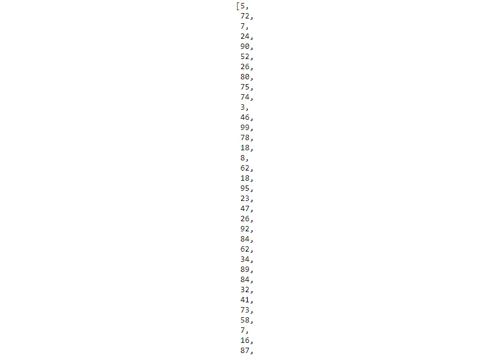

    ###### 图 1.16：random_number_list 的输出部分

1.  从 `random_number_list` 创建一个名为 `list_with_divisible_by_3` 的列表，其中只包含能被 `3` 整除的数字：

    ```py
    list_with_divisible_by_3 = [a for a in random_number_list if a % 3 == 0]
    list_with_divisible_by_3
    ```

    样本输出如下：

    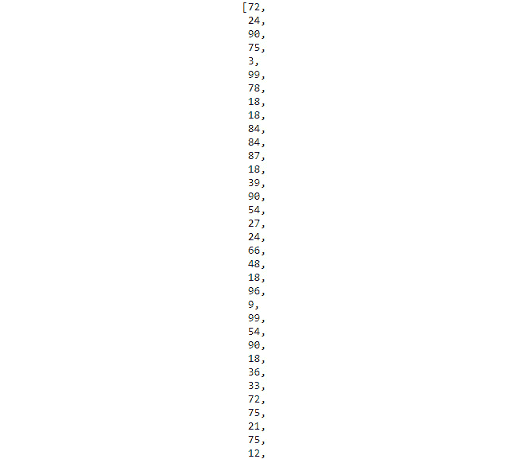

    ###### 图 1.17：random_number_list 能被 3 整除的输出部分

1.  使用 `len` 函数测量第一个列表和第二个列表的长度，并将它们存储在两个不同的变量中，`length_of_random_list` 和 `length_of_3_divisible_list`。在名为 `difference` 的变量中计算长度差异：

    ```py
    length_of_random_list = len(random_number_list)
    length_of_3_divisible_list = len(list_with_divisible_by_3)
    difference = length_of_random_list - length_of_3_divisible_list
    difference
    ```

    样本输出如下：

    ```py
    62
    ```

1.  将我们迄今为止执行的任务组合起来，并添加一个 while 循环。循环运行 10 次，并将差异变量的值添加到一个列表中：

    ```py
    NUMBER_OF_EXPERIMENTS = 10
    difference_list = []
    for i in range(0, NUMBER_OF_EXPERIEMENTS):
        random_number_list = [random.randint(0, LIMIT) for x in range(0, LIMIT)]
        list_with_divisible_by_3 = [a for a in random_number_list if a % 3 == 0]

        length_of_random_list = len(random_number_list)
        length_of_3_divisible_list = len(list_with_divisible_by_3)
        difference = length_of_random_list - length_of_3_divisible_list

        difference_list.append(difference)
    difference_list
    ```

    样本输出如下：

    ```py
    [64, 61, 67, 60, 73, 66, 66, 75, 70, 61]
    ```

1.  然后，计算你拥有的长度差异的算术平均值（普通平均值）：

    ```py
    avg_diff = sum(difference_list) / float(len(difference_list))
    avg_diff
    ```

    样本输出如下：

    ```py
    66.3
    ```

### 活动二：分析多行字符串并生成唯一单词计数的解决方案

这些是完成此活动的步骤：

1.  创建一个名为 `multiline_text` 的字符串，并将《傲慢与偏见》第一章中的文本复制到其中。使用 *Ctrl* *+* *A* 选择整个文本，然后使用 *Ctrl* *+* *C* 复制它，并将你刚刚复制的文本粘贴进去：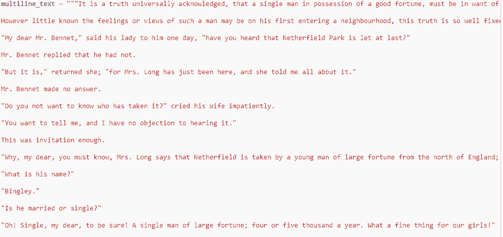

    ###### 图 1.18：初始化 mutliline_text 字符串

1.  使用 `type` 函数查找字符串的类型：

    ```py
    type(multiline_text)
    ```

    输出如下：

    ```py
    str
    ```

1.  现在，使用 `len` 函数找到字符串的长度：

    ```py
    len(multiline_text)
    ```

    输出如下：

    ```py
    4475
    ```

1.  使用字符串方法去除所有换行符（`\n` 或 `\r`）和符号。通过替换它们来移除所有换行符：

    ```py
    multiline_text = multiline_text.replace('\n', "")
    ```

    然后，我们将打印并检查输出：

    ```py
    multiline_text
    ```

    输出如下：

    

    ###### 图 1.19：移除换行符后的 multiline_text 字符串

1.  移除特殊字符和标点符号：

    ```py
    # remove special chars, punctuation etc.
    cleaned_multiline_text = ""
    for char in multiline_text:
        if char == " ":
            cleaned_multiline_text += char
        elif char.isalnum():  # using the isalnum() method of strings.
            cleaned_multiline_text += char
        else:
            cleaned_multiline_text += " "
    ```

1.  检查 `cleaned_multiline_text` 的内容：

    ```py
    cleaned_multiline_text
    ```

    输出如下：

    

    ###### 图 1.20：cleaned_multiline_text 字符串

1.  使用以下命令从清洗后的字符串生成所有单词的列表：

    ```py
    list_of_words = cleaned_multiline_text.split()
    list_of_words
    ```

    输出如下：

    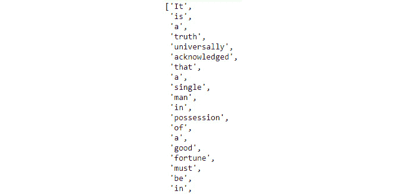

    ###### 图 1.21：显示单词列表的输出部分

1.  找出单词的数量：

    ```py
    len(list_of_words)
    ```

    输出为`852`。

1.  从你刚刚创建的列表中创建一个列表，其中只包含唯一单词：

    ```py
    unique_words_as_dict = dict.fromkeys(list_of_words)
    len(list(unique_words_as_dict.keys()))
    ```

    输出为`340`。

1.  计算每个唯一单词在清洗后的文本中出现的次数：

    ```py
    for word in list_of_words:
        if unique_words_as_dict[word] is None:
            unique_words_as_dict[word] = 1
        else:
            unique_words_as_dict[word] += 1
    unique_words_as_dict
    ```

    输出如下：

    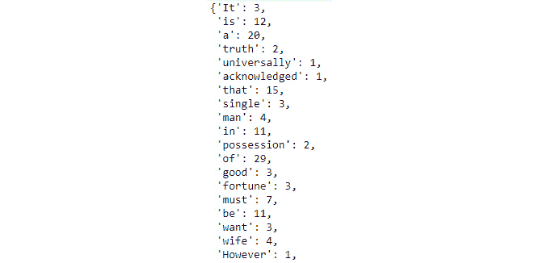

    ###### 图 1.22：显示唯一单词字典的输出部分

    你已经一步一步地创建了一个唯一单词计数器，使用了你刚刚学到的所有巧妙技巧。

1.  从`unique_words_as_dict`中找出前 25 个单词。

    ```py
    top_words = sorted(unique_words_as_dict.items(), key=lambda key_val_tuple: key_val_tuple[1], reverse=True)
    top_words[:25]
    ```

    完成此活动的步骤如下：

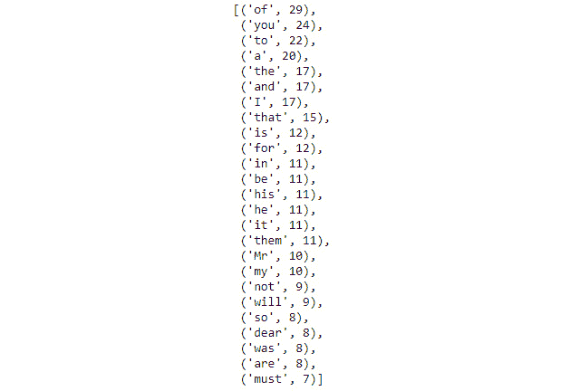

###### 图 1.23：多行文本中的前 25 个唯一单词

### 活动三的解决方案：排列、迭代器、Lambda、列表

解决这个活动的步骤如下：

1.  在`itertools`中查找`permutations`和`dropwhile`的定义。在 Jupyter 中查找函数定义的方法是：输入函数名，后跟*?*，然后按*Shift + Enter*：

    ```py
    from itertools import permutations, dropwhile
    permutations?
    dropwhile?
    ```

    在每个`?`之后，你会看到一个长列表的定义。这里我们将跳过它。

1.  编写一个表达式，使用 1、2 和 3 生成所有可能的三位数：

    ```py
    permutations(range(3))
    ```

    输出如下：

    ```py
    <itertools.permutations at 0x7f6c6c077af0>
    ```

1.  遍历你之前生成的迭代器表达式。使用`print`打印迭代器返回的每个元素。使用`assert`和`isinstance`确保元素是元组：

    ```py
    for number_tuple in permutations(range(3)):
        print(number_tuple)
        assert isinstance(number_tuple, tuple)
    ```

    输出如下：

    ```py
    (0, 1, 2)
    (0, 2, 1)
    (1, 0, 2)
    (1, 2, 0)
    (2, 0, 1)
    (2, 1, 0)
    ```

1.  再次编写循环。但这次，使用带有 Lambda 表达式的`dropwhile`来删除元组中的任何前导零。例如，`(0, 1, 2)`将变成`[0, 2]`。同时，将`dropwhile`的输出转换为列表。

    可以作为一个额外任务来检查`dropwhile`实际返回的类型而不进行类型转换：

    ```py
    for number_tuple in permutations(range(3)):
        print(list(dropwhile(lambda x: x <= 0, number_tuple)))
    ```

    输出如下：

    ```py
    [1, 2]
    [2, 1]
    [1, 0, 2]
    [1, 2, 0]
    [2, 0, 1]
    [2, 1, 0]
    ```

1.  将你之前编写的所有逻辑写出来，但这次写一个单独的函数，你将传递由`dropwhile`生成的列表，该函数将返回列表中的整个数字。例如，如果你将`[1, 2]`传递给函数，它将返回`12`。确保返回类型确实是一个数字而不是字符串。尽管可以使用其他技巧完成此任务，但我们要求你在函数中将传入的列表作为栈处理并生成数字：

    ```py
    import math
    def convert_to_number(number_stack):
        final_number = 0
        for i in range(0, len(number_stack)):
            final_number += (number_stack.pop() * (math.pow(10, i)))
        return final_number
    for number_tuple in permutations(range(3)):
        number_stack = list(dropwhile(lambda x: x <= 0, number_tuple))
        print(convert_to_number(number_stack))
    ```

    输出如下：

    ```py
    12.0
    21.0
    102.0
    120.0
    201.0
    210.0
    ```

### 活动四的解决方案：设计你自己的 CSV 解析器

完成此活动的步骤如下：

1.  从`itertools`导入`zip_longest`：

    ```py
    from itertools import zip_longest
    ```

1.  定义`return_dict_from_csv_line`函数，使其包含`header`、`line`和`fillvalue`作为`None`，并将其添加到`dict`中：

    ```py
    def return_dict_from_csv_line(header, line):
        # Zip them
        zipped_line = zip_longest(header, line, fillvalue=None)
        # Use dict comprehension to generate the final dict
        ret_dict = {kv[0]: kv[1] for kv in zipped_line}
        return ret_dict
    ```

1.  使用`with`块中的`r`模式打开随附的`sales_record.csv`文件。首先，检查它是否已打开，读取第一行，并使用字符串方法通过`open("sales_record.csv", "r") as fd`生成所有列名列表。当你读取每一行时，将那一行和标题列表传递给一个函数。该函数的工作是从这些中构建一个字典并填充`key:values`。请注意，缺失值应导致`None`：

    ```py
        first_line = fd.readline()
        header = first_line.replace("\n", "").split(",")
        for i, line in enumerate(fd):
            line = line.replace("\n", "").split(",")
            d = return_dict_from_csv_line(header, line)
            print(d)
            if i > 10:
                break
    ```

    输出如下：


###### 图 2.10：输出的一部分

### 活动五的解决方案：从 CSV 文件生成统计数据

完成此活动的步骤如下：

1.  加载必要的库：

    ```py
    import numpy as np
    import pandas as pd
    import matplotlib.pyplot as plt
    ```

1.  从本地目录读取波士顿住房数据集（以`.csv`文件形式给出）：

    ```py
    # Hint: The Pandas function for reading a CSV file is 'read_csv'.
    # Don't forget that all functions in Pandas can be accessed by syntax like pd.{function_name} 
    df=pd.read_csv("Boston_housing.csv")
    ```

1.  检查前 10 条记录：

    ```py
    df.head(10)
    ```

    输出如下：

    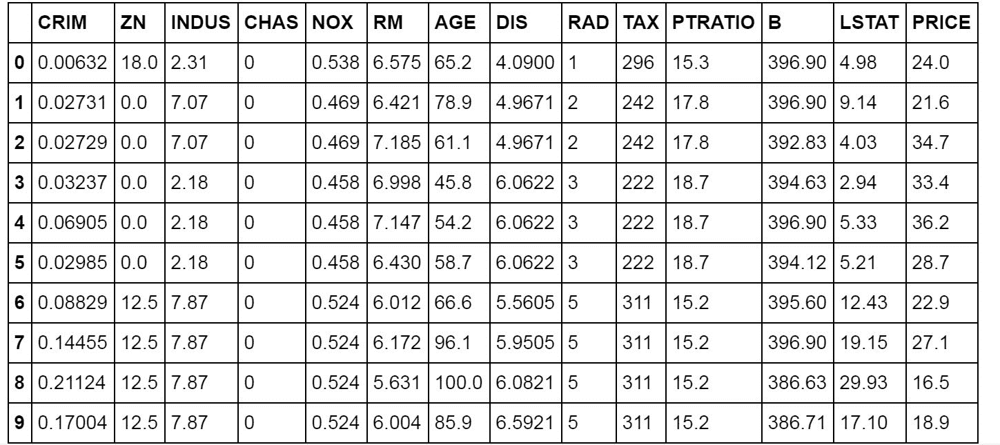

    ###### 图 3.23：显示前 10 条记录的输出

1.  查找记录总数：

    ```py
    df.shape
    ```

    输出如下：

    ```py
    (506, 14)
    ```

1.  创建一个包含不包括`CHAS`、`NOX`、`B`和`LSTAT`列的小型 DataFrame：

    ```py
    df1=df[['CRIM','ZN','INDUS','RM','AGE','DIS','RAD','TAX','PTRATIO','PRICE']]
    ```

1.  检查你刚刚创建的新 DataFrame 的最后 7 条记录：

    ```py
    df1.tail(7)
    ```

    输出如下：

    

    ###### 图 3.24：DataFrame 的最后七条记录

1.  使用`for`循环通过绘制新 DataFrame 中所有变量（列）的直方图：

    ```py
    for c in df1.columns:
        plt.title("Plot of "+c,fontsize=15)
        plt.hist(df1[c],bins=20)
        plt.show()
    ```

    输出如下：

    

    ###### 图 3.25：使用 for 循环绘制所有变量的图

1.  犯罪率可能是房价的指标（人们不愿意住在高犯罪率地区）。创建犯罪率与价格的散点图：

    ```py
    plt.scatter(df1['CRIM'],df1['PRICE'])
    plt.show()
    ```

    输出如下：

    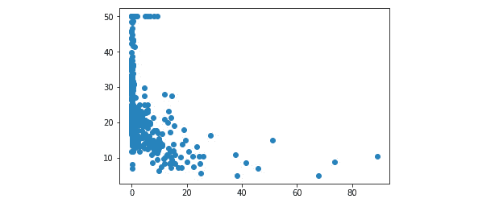

    ###### 图 3.26：犯罪率与价格的散点图

    如果我们绘制 log10(crime)与价格的关系图，我们可以更好地理解这种关系。

1.  创建 log10(crime)与价格的关系图：

    ```py
    plt.scatter(np.log10(df1['CRIM']),df1['PRICE'],c='red')
    plt.title("Crime rate (Log) vs. Price plot", fontsize=18)
    plt.xlabel("Log of Crime rate",fontsize=15)
    plt.ylabel("Price",fontsize=15)
    plt.grid(True)
    plt.show()
    ```

    输出如下：

    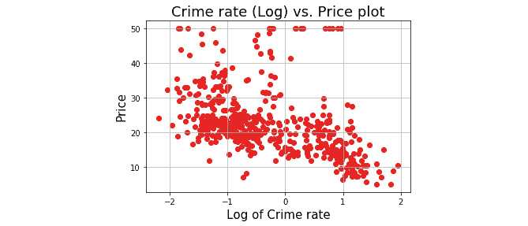

    ###### 图 3.27：犯罪率（Log）与价格的散点图

1.  计算每户平均房间数：

    ```py
    df1['RM'].mean()
    ```

    输出为`6.284634387351788`。

1.  计算中位数年龄：

    ```py
    df1['AGE'].median()
    ```

    输出为`77.5`。

1.  计算平均（均值）距离五个波士顿就业中心：

    ```py
    df1['DIS'].mean()
    ```

    输出为`3.795042687747034`。

1.  计算低价房屋（< $20,000）的百分比：

    ```py
    # Create a Pandas series and directly compare it with 20
    # You can do this because Pandas series is basically NumPy array and you have seen how to filter NumPy array
    low_price=df1['PRICE']<20
    # This creates a Boolean array of True, False
    print(low_price)
    # True = 1, False = 0, so now if you take an average of this NumPy array, you will know how many 1's are there.
    # That many houses are priced below 20,000\. So that is the answer. 
    # You can convert that into percentage by multiplying with 100
    pcnt=low_price.mean()*100
    print("\nPercentage of house with <20,000 price is: ",pcnt)
    ```

    输出如下：

    ```py
    0      False
    1      False
    2      False
    3      False
    4      False
    5      False
    6      False
    7      False
    8       True
    9       True
    10      True
    …
    500     True
    501    False
    502    False
    503    False
    504    False
    505     True
    Name: PRICE, Length: 506, dtype: bool
    Percentage of house with <20,000 price is:  41.50197628458498
    ```

### 活动六的解决方案：处理 UCI 成人收入数据集

完成此活动的步骤如下：

1.  加载必要的库：

    ```py
    import numpy as np
    import pandas as pd
    import matplotlib.pyplot as plt
    ```

1.  从本地目录读取成人收入数据集（以`.csv`文件形式给出）并检查前 5 条记录：

    ```py
    df = pd.read_csv("adult_income_data.csv")
    df.head()
    ```

    输出如下：

    

    ###### 图 4.61：显示 .csv 文件前五条记录的 DataFrame

1.  创建一个脚本，逐行读取文本文件并提取第一行，这是 .csv 文件的标题：

    ```py
    names = []
    with open('adult_income_names.txt','r') as f:
        for line in f:
            f.readline()
            var=line.split(":")[0]
            names.append(var)
    names
    ```

    输出如下：

    

    ###### 图 4.62：数据库中列的名称

1.  使用 `append` 命令将响应变量（最后一列）的名称 `Income` 添加到数据集中：

    ```py
    names.append('Income')
    ```

1.  使用以下命令再次读取新文件：

    ```py
    df = pd.read_csv("adult_income_data.csv",names=names)
    df.head()
    ```

    输出如下：

    

    ###### 图 4.63：添加了收入列的 DataFrame

1.  使用 `describe` 命令获取数据集的统计摘要：

    ```py
    df.describe()
    ```

    输出如下：

    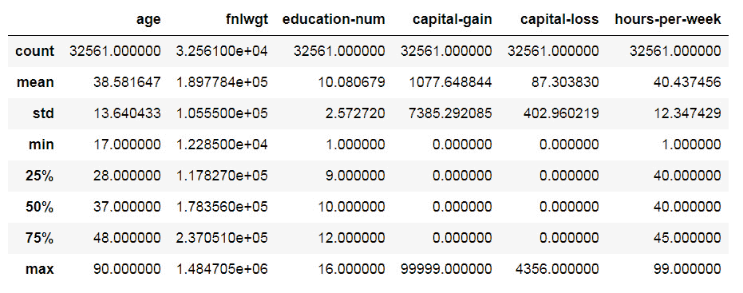

    ###### 图 4.64：数据集的统计摘要

    注意，只包含少量列。数据集中许多变量具有多个因素或类别。

1.  使用以下命令列出类中所有变量的列表：

    ```py
    # Make a list of all variables with classes
    vars_class = ['workclass','education','marital-status',
                  'occupation','relationship','sex','native-country']
    ```

1.  使用以下命令创建循环以计数并打印它们：

    ```py
    for v in vars_class:
        classes=df[v].unique()
        num_classes = df[v].nunique()
        print("There are {} classes in the \"{}\" column. They are: {}".format(num_classes,v,classes))
        print("-"*100)
    ```

    输出如下：

    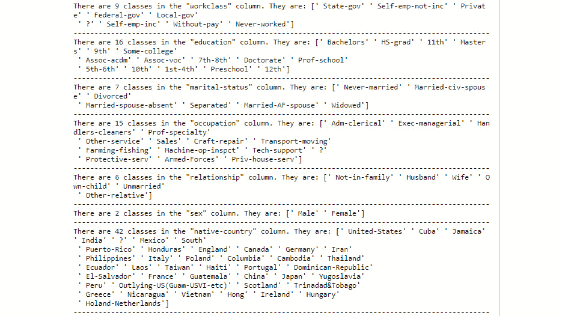

    ###### 图 4.65：不同因素或类别的输出

1.  使用以下命令查找缺失值：

    ```py
    df.isnull().sum()
    ```

    输出如下：

    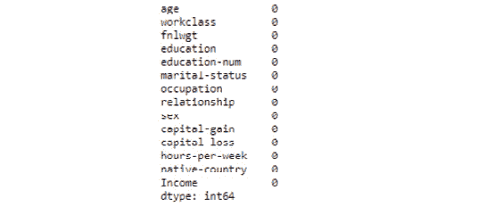

    ###### 图 4.66：查找缺失值

1.  使用子集选择创建只包含年龄、教育和职业的 DataFrame：

    ```py
    df_subset = df[['age','education','occupation']]
    df_subset.head()
    ```

    输出如下：

    

    ###### 图 4.67：子集 DataFrame

1.  以 20 为 bin 大小绘制年龄直方图：

    ```py
    df_subset['age'].hist(bins=20)
    ```

    输出如下：

    ```py
    <matplotlib.axes._subplots.AxesSubplot at 0x19dea8d0>
    ```

    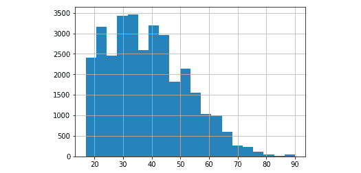

    ###### 图 4.68：20 个 bin 大小的年龄直方图

1.  以 25x10 的长图尺寸绘制按 `education` 分组的 `age` 的箱线图，并使 x 轴刻度字体大小为 15：

    ```py
    df_subset.boxplot(column='age',by='education',figsize=(25,10))
    plt.xticks(fontsize=15)
    plt.xlabel("Education",fontsize=20)
    plt.show()
    ```

    输出如下：

    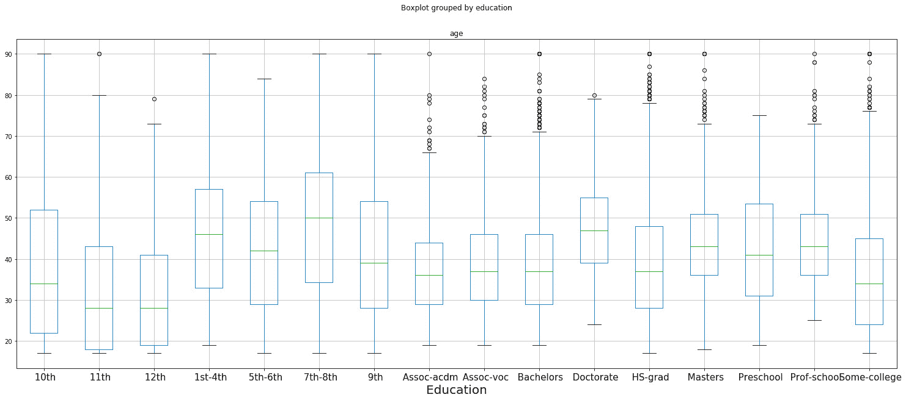

    ###### 图 4.69：按教育分组的年龄箱线图

    在进行任何进一步的操作之前，我们需要使用本章学到的 `apply` 方法。结果发现，当我们从 CSV 文件中读取数据集时，所有字符串前都带有空格字符。因此，我们需要从所有字符串中删除该空格。

1.  创建一个函数来删除空格字符：

    ```py
    def strip_whitespace(s):
        return s.strip()
    ```

1.  使用 `apply` 方法将此函数应用于所有具有字符串值的列，创建一个新列，将新列的值复制到旧列中，然后删除新列。这是首选方法，以免意外删除有价值的数据。大多数时候，您需要创建一个具有所需操作的新列，并在必要时将其复制回旧列。忽略打印出的任何警告信息：

    ```py
    # Education column
    df_subset['education_stripped']=df['education'].apply(strip_whitespace)
    df_subset['education']=df_subset['education_stripped']
    df_subset.drop(labels=['education_stripped'],axis=1,inplace=True)
    # Occupation column
    df_subset['occupation_stripped']=df['occupation'].apply(strip_whitespace)
    df_subset['occupation']=df_subset['occupation_stripped']
    df_subset.drop(labels=['occupation_stripped'],axis=1,inplace=True)
    ```

    这是您应该忽略的示例警告信息：

    

    ###### 图 4.70：忽略的警告信息

1.  使用以下命令找出 30 至 50 岁之间（包括）的人数：

    ```py
    # Conditional clauses and join them by & (AND) 
    df_filtered=df_subset[(df_subset['age']>=30) & (df_subset['age']<=50)]
    ```

    检查新数据集的内容：

    ```py
    df_filtered.head()
    ```

    输出如下：

    

    ###### 图 4.71：新 DataFrame 的内容

1.  查找过滤后的 DataFrame 的 `shape`，并将元组的索引指定为 0 以返回第一个元素：

    ```py
    answer_1=df_filtered.shape[0]
    answer_1
    ```

    输出如下：

    ```py
    1630
    ```

1.  使用以下命令打印 30 至 50 岁之间黑人的数量：

    ```py
    print("There are {} people of age between 30 and 50 in this dataset.".format(answer_1))
    ```

    输出如下：

    ```py
    There are 1630 black of age between 30 and 50 in this dataset.
    ```

1.  根据职业对记录进行分组，以找出平均年龄的分布情况：

    ```py
    df_subset.groupby('occupation').describe()['age']
    ```

    输出如下：

    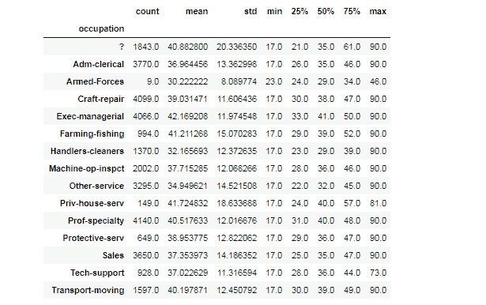

    ###### 图 4.72：按年龄和教育分组的数据 DataFrame

    代码返回 `79 rows × 1 columns.`（79 行 × 1 列。）

1.  按职业分组并显示年龄的汇总统计。找出平均年龄最大的职业以及在其劳动力中占比最大的 75 分位数以上的职业：

    ```py
    df_subset.groupby('occupation').describe()['age']
    ```

    输出如下：

    

    ###### 图 4.73：显示年龄汇总统计的 DataFrame

    是否有某个职业群体代表性非常低？也许我们应该删除这些数据，因为数据非常低，该群体在分析中不会很有用。实际上，仅通过查看前面的表格，你应该能够看到 `barh` 函数是 DataFrame 的索引，它是职业群体的汇总统计。我们可以看到 **武装部队** 群组几乎没有数据。这个练习教你，有时，异常值不仅仅是一个值，而可能是一个整个群体。这个群体的数据是好的，但太小，无法用于任何分析。因此，在这种情况下，它可以被视为异常值。但始终使用你的业务知识和工程判断来进行此类异常值检测以及如何处理它们。

1.  使用子集和分组来查找异常值：

    ```py
    occupation_stats= df_subset.groupby(
        'occupation').describe()['age']
    ```

1.  在条形图上绘制值：

    ```py
    plt.figure(figsize=(15,8))
    plt.barh(y=occupation_stats.index,
             width=occupation_stats['count'])
    plt.yticks(fontsize=13)
    plt.show()
    ```

    输出如下：

    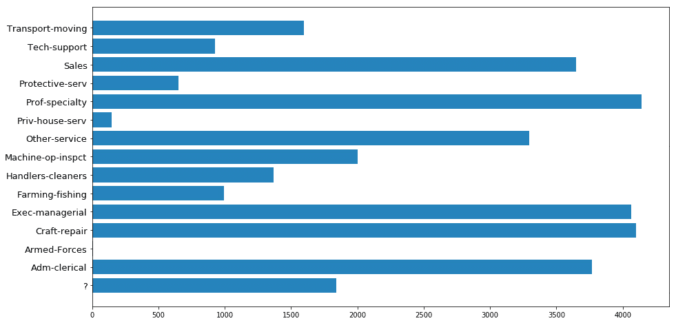

    ###### 图 4.74：显示职业统计的条形图

1.  通过公共键进行合并练习。假设你被给出了两个数据集，其中公共键是 `occupation`。首先，通过从完整数据集中随机抽取样本创建两个这样的非交集数据集，然后尝试合并。包括至少两个其他列，以及每个数据集的公共键列。注意，如果公共键不是唯一的，合并后的数据集可能比两个起始数据集中的任何一个都有更多的数据点：

    ```py
    df_1 = df[['age',
               'workclass',
               'occupation']].sample(5,random_state=101)
    df_1.head()
    ```

    输出如下：


###### 图 4.75：合并公共键后的输出

第二个数据集如下：

```py
df_2 = df[['education',
           'occupation']].sample(5,random_state=101)
df_2.head()
```

输出如下：


###### 图 4.76：合并公共键后的输出

将两个数据集合并在一起：

```py
df_merged = pd.merge(df_1,df_2,
                     on='occupation',
                     how='inner').drop_duplicates()
df_merged
```

输出如下：


###### 图 4.77：不同职业值的输出

### 活动第七部分的解决方案：从网页中读取表格数据并创建 DataFrame

完成此活动的步骤如下：

1.  使用以下命令通过以下命令导入 BeautifulSoup 并加载数据：

    ```py
    from bs4 import BeautifulSoup
    import pandas as pd
    ```

1.  使用以下命令打开 Wikipedia 文件：

    ```py
    fd = open("List of countries by GDP (nominal) - Wikipedia.htm", "r")
    soup = BeautifulSoup(fd)
    fd.close()
    ```

1.  使用以下命令计算表格：

    ```py
    all_tables = soup.find_all("table")
    print("Total number of tables are {} ".format(len(all_tables)))
    ```

    总共有 9 个表格。

1.  使用类属性通过以下命令查找正确的表格：

    ```py
    data_table = soup.find("table", {"class": '"wikitable"|}'})
    print(type(data_table))
    ```

    输出如下：

    ```py
    <class 'bs4.element.Tag'>
    ```

1.  使用以下命令通过以下命令分离来源和实际数据：

    ```py
    sources = data_table.tbody.findAll('tr', recursive=False)[0]
    sources_list = [td for td in sources.findAll('td')]
    print(len(sources_list))
    ```

    输出如下：

    ```py
    Total number of tables are 3.
    ```

1.  使用 `findAll` 函数通过以下命令从 `data_table` 的 `body` 标签中查找数据：

    ```py
    data = data_table.tbody.findAll('tr', recursive=False)[1].findAll('td', recursive=False)
    ```

1.  使用以下命令通过 `findAll` 函数从 `data_table` 的 `td` 标签中查找数据：

    ```py
    data_tables = []
    for td in data:
        data_tables.append(td.findAll('table'))
    ```

1.  使用以下命令查找 `data_tables` 的长度：

    ```py
    len(data_tables)
    ```

    输出如下：

    ```py
    3
    ```

1.  使用以下命令检查如何获取来源名称：

    ```py
    source_names = [source.findAll('a')[0].getText() for source in sources_list]
    print(source_names)
    ```

    输出如下：

    ```py
     ['International Monetary Fund', 'World Bank', 'United Nations']
    ```

1.  分离第一个来源的标题和数据：

    ```py
    header1 = [th.getText().strip() for th in data_tables[0][0].findAll('thead')[0].findAll('th')]
    header1
    ```

    输出如下：

    ```py
     ['Rank', 'Country', 'GDP(US$MM)']
    ```

1.  使用 `findAll` 通过以下命令从 `data_tables` 中查找行：

    ```py
    rows1 = data_tables[0][0].findAll('tbody')[0].findAll('tr')[1:]
    ```

1.  使用 `strip` 函数对每个 `td` 标签进行 `rows1` 中的数据查找：

    ```py
    data_rows1 = [[td.get_text().strip() for td in tr.findAll('td')] for tr in rows1]
    ```

1.  查找 DataFrame：

    ```py
    df1 = pd.DataFrame(data_rows1, columns=header1)
    df1.head()
    ```

    输出如下：

    

    ###### 图 5.35：从网页创建的 DataFrame

1.  使用以下命令对其他两个来源执行相同的操作：

    ```py
    header2 = [th.getText().strip() for th in data_tables[1][0].findAll('thead')[0].findAll('th')]
    header2
    ```

    输出如下：

    ```py
     ['Rank', 'Country', 'GDP(US$MM)']
    ```

1.  使用 `findAll` 通过以下命令从 `data_tables` 中查找行：

    ```py
    rows2 = data_tables[1][0].findAll('tbody')[0].findAll('tr')[1:]
    ```

1.  使用以下命令通过 `strip` 函数定义 `find_right_text`：

    ```py
    def find_right_text(i, td):
        if i == 0:
            return td.getText().strip()
        elif i == 1:
            return td.getText().strip()
        else:
            index = td.text.find("♠")
            return td.text[index+1:].strip()
    ```

1.  使用以下命令通过 `find_right_text` 从 `data_rows` 中查找行：

    ```py
    data_rows2 = [[find_right_text(i, td) for i, td in enumerate(tr.findAll('td'))] for tr in rows2]
    ```

1.  使用以下命令计算 `df2` DataFrame：

    ```py
    df2 = pd.DataFrame(data_rows2, columns=header2)
    df2.head()
    ```

    输出如下：

    ![图 5.36：DataFrame 输出]

    

    ###### 图 5.36：DataFrame 输出

1.  现在，使用以下命令对第三个 DataFrame 执行相同的操作：

    ```py
    header3 = [th.getText().strip() for th in data_tables[2][0].findAll('thead')[0].findAll('th')]
    header3
    ```

    输出如下：

    ```py
    ['Rank', 'Country', 'GDP(US$MM)']
    ```

1.  使用以下命令通过 `findAll` 从 `data_tables` 中查找行：

    ```py
    rows3 = data_tables[2][0].findAll('tbody')[0].findAll('tr')[1:]
    ```

1.  使用 `find_right_text` 通过以下命令从 `data_rows3` 中查找行：

    ```py
    data_rows3 = [[find_right_text(i, td) for i, td in enumerate(tr.findAll('td'))] for tr in rows2]
    ```

1.  使用以下命令计算 `df3` DataFrame：

    ```py
    df3 = pd.DataFrame(data_rows3, columns=header3)
    df3.head()
    ```

    输出如下：


###### 图 5.37：第三个 DataFrame

### 活动第八部分的解决方案：处理异常值和缺失数据

完成此活动的步骤如下：

1.  加载数据：

    ```py
    import pandas as pd
    import numpy as np
    import matplotlib.pyplot as plt
    %matplotlib inline
    ```

1.  读取 .csv 文件：

    ```py
    df = pd.read_csv("visit_data.csv")
    ```

1.  打印 DataFrame 中的数据：

    ```py
    df.head()
    ```

    输出如下：

    

    ###### 图 6.10：CSV 文件的内容

    如我们所见，有一些数据值缺失，如果我们检查这些数据，我们会看到一些异常值。

1.  使用以下命令检查重复项：

    ```py
    print("First name is duplicated - {}".format(any(df.first_name.duplicated())))
    print("Last name is duplicated - {}".format(any(df.last_name.duplicated())))
    print("Email is duplicated - {}".format(any(df.email.duplicated())))
    ```

    输出如下：

    ```py
    First name is duplicated - True
    Last name is duplicated - True
    Email is duplicated - False
    ```

    在名字的第一和最后部分都有重复，这是正常的。然而，正如我们所看到的，电子邮件没有重复，这是好的。

1.  检查是否有任何重要列包含`NaN`：

    ```py
    # Notice that we have different ways to format boolean values for the % operator
    print("The column Email contains NaN - %r " % df.email.isnull().values.any())
    print("The column IP Address contains NaN - %s " % df.ip_address.isnull().values.any())
    print("The column Visit contains NaN - %s " % df.visit.isnull().values.any())
    ```

    输出如下：

    ```py
    The column Email contains NaN - False 
    The column IP Address contains NaN - False 
    The column Visit contains NaN - True 
    ```

    访问列包含一些`None`值。鉴于手头的最终任务可能是预测访问次数，我们无法处理没有该信息的行。它们是一种异常值。让我们去除它们。

1.  去除异常值：

    ```py
    # There are various ways to do this. This is just one way. We encourage you to explore other ways.
    # But before that we need to store the previous size of the data set and we will compare it with the new size
    size_prev = df.shape
    df = df[np.isfinite(df['visit'])] #This is an inplace operation. After this operation the original DataFrame is lost.
    size_after = df.shape
    ```

1.  报告大小差异：

    ```py
    # Notice how parameterized format is used and then the indexing is working inside the quote marks
    print("The size of previous data was - {prev[0]} rows and the size of the new one is - {after[0]} rows".
    format(prev=size_prev, after=size_after))
    ```

    输出如下：

    ```py
    The size of previous data was - 1000 rows and the size of the new one is - 974 rows
    ```

1.  绘制箱线图以检查数据是否有异常值。

    ```py
    plt.boxplot(df.visit, notch=True)
    ```

    输出如下：

    ```py
    {'whiskers': [<matplotlib.lines.Line2D at 0x7fa04cc08668>,
      <matplotlib.lines.Line2D at 0x7fa04cc08b00>],
     'caps': [<matplotlib.lines.Line2D at 0x7fa04cc08f28>,
      <matplotlib.lines.Line2D at 0x7fa04cc11390>],
     'boxes': [<matplotlib.lines.Line2D at 0x7fa04cc08518>],
     'medians': [<matplotlib.lines.Line2D at 0x7fa04cc117b8>],
     'fliers': [<matplotlib.lines.Line2D at 0x7fa04cc11be0>],
     'means': []}
    ```

    箱线图如下：

    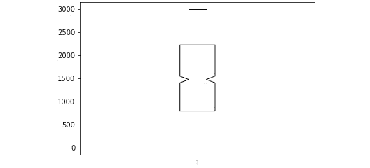

    ###### 图 6.43：使用数据的箱线图

    如我们所见，我们在这个列中有数据，在区间（0，3000）内。然而，数据的主要集中在大约 700 到大约 2300 之间。

1.  去除超过 2900 和低于 100 的值——这些对我们来说是异常值。我们需要去除它们：

    ```py
    df1 = df[(df['visit'] <= 2900) & (df['visit'] >= 100)]  # Notice the powerful & operator
    # Here we abuse the fact the number of variable can be greater than the number of replacement targets
    print("After getting rid of outliers the new size of the data is - {}".format(*df1.shape))
    ```

    去除异常值后，新数据的大小是`923`。

    这是本章活动的结束。

### 活动九的解决方案：从古腾堡提取前 100 本电子书

完成此活动的步骤如下：

1.  导入必要的库，包括`regex`和`beautifulsoup`：

    ```py
    import urllib.request, urllib.parse, urllib.error
    import requests
    from bs4 import BeautifulSoup
    import ssl
    import re
    ```

1.  检查 SSL 证书：

    ```py
    # Ignore SSL certificate errors
    ctx = ssl.create_default_context()
    ctx.check_hostname = False
    ctx.verify_mode = ssl.CERT_NONE
    ```

1.  从 URL 读取 HTML：

    ```py
    # Read the HTML from the URL and pass on to BeautifulSoup
    top100url = 'https://www.gutenberg.org/browse/scores/top'
    response = requests.get(top100url)
    ```

1.  编写一个小函数来检查网络请求的状态：

    ```py
    def status_check(r):
        if r.status_code==200:
            print("Success!")
            return 1
        else:
            print("Failed!")
            return -1
    ```

1.  检查`response`的状态：

    ```py
    status_check(response)
    ```

    输出如下：

    ```py
    Success!
    1
    ```

1.  解码响应并将其传递给`BeautifulSoup`进行 HTML 解析：

    ```py
    contents = response.content.decode(response.encoding)
    soup = BeautifulSoup(contents, 'html.parser')
    ```

1.  找到所有的`href`标签并将它们存储在链接列表中。检查列表的外观——打印前 30 个元素：

    ```py
    # Empty list to hold all the http links in the HTML page
    lst_links=[]
    # Find all the href tags and store them in the list of links
    for link in soup.find_all('a'):
        #print(link.get('href'))
        lst_links.append(link.get('href'))
    ```

1.  使用以下命令打印链接：

    ```py
    lst_links[:30]
    ```

    输出如下：

    ```py
    ['/wiki/Main_Page',
     '/catalog/',
     '/ebooks/',
     '/browse/recent/last1',
     '/browse/scores/top',
     '/wiki/Gutenberg:Offline_Catalogs',
     '/catalog/world/mybookmarks',
     '/wiki/Main_Page',
    'https://www.paypal.com/xclick/business=donate%40gutenberg.org&item_name=Donation+to+Project+Gutenberg',
     '/wiki/Gutenberg:Project_Gutenberg_Needs_Your_Donation',
     'http://www.ibiblio.org',
     'http://www.pgdp.net/',
     'pretty-pictures',
     '#books-last1',
     '#authors-last1',
     '#books-last7',
     '#authors-last7',
     '#books-last30',
     '#authors-last30',
     '/ebooks/1342',
     '/ebooks/84',
     '/ebooks/1080',
     '/ebooks/46',
     '/ebooks/219',
     '/ebooks/2542',
     '/ebooks/98',
     '/ebooks/345',
     '/ebooks/2701',
     '/ebooks/844',
     '/ebooks/11']
    ```

1.  使用正则表达式在这些链接中查找数字。这些是前 100 本书的文件编号。初始化一个空列表来保存文件编号：

    ```py
    booknum=[]
    ```

1.  原始链接列表中的第 19 到 118 号数字是前 100 本电子书的编号。遍历适当的范围并使用正则表达式在链接（href）字符串中查找数字。使用`findall()`方法：

    ```py
    for i in range(19,119):
        link=lst_links[i]
        link=link.strip()
        # Regular expression to find the numeric digits in the link (href) string
        n=re.findall('[0-9]+',link)
        if len(n)==1:
            # Append the filenumber casted as integer
            booknum.append(int(n[0]))
    ```

1.  打印文件编号：

    ```py
    print ("\nThe file numbers for the top 100 ebooks on Gutenberg are shown below\n"+"-"*70)
    print(booknum)
    ```

    输出如下：

    ```py
    The file numbers for the top 100 ebooks on Gutenberg are shown below
    ----------------------------------------------------------------------
    [1342, 84, 1080, 46, 219, 2542, 98, 345, 2701, 844, 11, 5200, 43, 16328, 76, 74, 1952, 6130, 2591, 1661, 41, 174, 23, 1260, 1497, 408, 3207, 1400, 30254, 58271, 1232, 25344, 58269, 158, 44881, 1322, 205, 2554, 1184, 2600, 120, 16, 58276, 5740, 34901, 28054, 829, 33, 2814, 4300, 100, 55, 160, 1404, 786, 58267, 3600, 19942, 8800, 514, 244, 2500, 2852, 135, 768, 58263, 1251, 3825, 779, 58262, 203, 730, 20203, 35, 1250, 45, 161, 30360, 7370, 58274, 209, 27827, 58256, 33283, 4363, 375, 996, 58270, 521, 58268, 36, 815, 1934, 3296, 58279, 105, 2148, 932, 1064, 13415]
    ```

1.  soup 对象的文本看起来是什么样子？使用`.`text`方法并仅打印前 2,000 个字符（不要打印整个内容，因为它太长了）。

    你会注意到这里和那里有很多空格/空白。忽略它们。它们是 HTML 页面标记和其随意性质的一部分：

    ```py
    print(soup.text[:2000])
    if (top != self) {
            top.location.replace (http://www.gutenberg.org);
            alert ('Project Gutenberg is a FREE service with NO membership required. If you paid somebody else to get here, make them give you your money back!');
          }

    ```

    输出如下：

    ```py
    Top 100 - Project Gutenberg
    Online Book Catalog
     Book  Search
    -- Recent  Books
    -- Top  100
    -- Offline Catalogs
    -- My Bookmarks
    Main Page
    …
    Pretty Pictures
    Top 100 EBooks yesterday —
      Top 100 Authors yesterday —
      Top 100 EBooks last 7 days —
      Top 100 Authors last 7 days —
      Top 100 EBooks last 30 days —
      Top 100 Authors last 30 days
    Top 100 EBooks yesterday
    Pride and Prejudice by Jane Austen (1826)
    Frankenstein; Or, The Modern Prometheus by Mary Wollstonecraft Shelley (1367)
    A Modest Proposal by Jonathan Swift (1020)
    A Christmas Carol in Prose; Being a Ghost Story of Christmas by Charles Dickens (953)
    Heart of Darkness by Joseph Conrad (887)
    Et dukkehjem. English by Henrik Ibsen (761)
    A Tale of Two Cities by Charles Dickens (741)
    Dracula by Bram Stoker (732)
    Moby Dick; Or, The Whale by Herman Melville (651)
    The Importance of Being Earnest: A Trivial Comedy for Serious People by Oscar Wilde (646)
    Alice's Adventures in Wonderland by Lewis Carrol
    ```

1.  使用正则表达式从 soup 对象中搜索提取的文本，以找到前 100 本电子书的名称（昨日的排名）：

    ```py
    # Temp empty list of Ebook names
    lst_titles_temp=[]
    ```

1.  创建一个起始索引。它应该指向`soup.text`的`splitlines`方法。它将 soup 对象的文本行分割成行：

    ```py
    start_idx=soup.text.splitlines().index('Top 100 EBooks yesterday')
    ```

1.  循环 1-100，将下一 100 行的字符串添加到这个临时列表中。提示：使用`splitlines`方法：

    ```py
    for i in range(100):
        lst_titles_temp.append(soup.text.splitlines()[start_idx+2+i])
    ```

1.  使用正则表达式从名称字符串中提取文本并将其追加到空列表中。使用 match 和 span 找到索引并使用它们：

    ```py
    lst_titles=[]
    for i in range(100):
        id1,id2=re.match('^[a-zA-Z ]*',lst_titles_temp[i]).span()
        lst_titles.append(lst_titles_temp[i][id1:id2])
    ```

1.  打印标题列表：

    ```py
    for l in lst_titles:
        print(l)
    ```

    输出如下：

    ```py
    Pride and Prejudice by Jane Austen 
    Frankenstein
    A Modest Proposal by Jonathan Swift 
    A Christmas Carol in Prose
    Heart of Darkness by Joseph Conrad 
    Et dukkehjem
    A Tale of Two Cities by Charles Dickens 
    Dracula by Bram Stoker 
    Moby Dick
    The Importance of Being Earnest
    Alice
    Metamorphosis by Franz Kafka 
    The Strange Case of Dr
    Beowulf
    …
    The Russian Army and the Japanese War
    Calculus Made Easy by Silvanus P
    Beyond Good and Evil by Friedrich Wilhelm Nietzsche 
    An Occurrence at Owl Creek Bridge by Ambrose Bierce 
    Don Quixote by Miguel de Cervantes Saavedra 
    Blue Jackets by Edward Greey 
    The Life and Adventures of Robinson Crusoe by Daniel Defoe 
    The Waterloo Campaign 
    The War of the Worlds by H
    Democracy in America 
    Songs of Innocence
    The Confessions of St
    Modern French Masters by Marie Van Vorst 
    Persuasion by Jane Austen 
    The Works of Edgar Allan Poe 
    The Fall of the House of Usher by Edgar Allan Poe 
    The Masque of the Red Death by Edgar Allan Poe 
    The Lady with the Dog and Other Stories by Anton Pavlovich Chekhov
    ```

### 活动第 10 项的解决方案：从 Gutenberg.org 提取前 100 本电子书

完成此活动的步骤如下：

1.  导入 `urllib.request`、`urllib.parse`、`urllib.error` 和 `json`：

    ```py
    import urllib.request, urllib.parse, urllib.error
    import json
    ```

1.  使用 `json.loads()` 从存储在同一文件夹中的 JSON 文件中加载秘密 API 密钥（你必须从 OMDB 网站获取一个并使用它；它有每天 1,000 次的限制），并将其存储在一个变量中：

    #### 注意

    以下单元格在解决方案笔记本中不会执行，因为作者无法提供他们的私人 API 密钥。

1.  学生/用户/讲师需要获取一个密钥并将其存储在一个名为 `APIkeys.json` 的 JSON 文件中。我们称此文件为 `APIkeys.json`。

1.  使用以下命令打开 `APIkeys.json` 文件：

    ```py
    with open('APIkeys.json') as f:
        keys = json.load(f)
        omdbapi = keys['OMDBapi']
    ```

    要传递的最终 URL 应该看起来像这样：[`www.omdbapi.com/?t=movie_name&apikey=secretapikey`](http://www.omdbapi.com/?t=movie_name&apikey=secretapikey)。

1.  使用以下命令将 OMDB 站点（[`www.omdbapi.com/?`](http://www.omdbapi.com/?)）作为字符串分配给名为 `serviceurl` 的变量：

    ```py
    serviceurl = 'http://www.omdbapi.com/?'
    ```

1.  创建一个名为 `apikey` 的变量，使用 URL 的最后一部分（`&apikey=secretapikey`），其中 `secretapikey` 是你自己的 API 密钥。电影名称部分是 `t=movie_name`，稍后将会说明：

    ```py
    apikey = '&apikey='+omdbapi
    ```

1.  编写一个名为 `print_json` 的实用函数，用于从 JSON 文件（我们将从该站点获取）中打印电影数据。以下是 JSON 文件的键：'Title'（标题）、'Year'（年份）、'Rated'（评级）、'Released'（上映日期）、'Runtime'（时长）、'Genre'（类型）、'Director'（导演）、'Writer'（编剧）、'Actors'（演员）、'Plot'（剧情）、'Language'（语言）、'Country'（国家）、'Awards'（奖项）、'Ratings'（评分）、'Metascore'（评分）、'imdbRating'（imdb 评分）、'imdbVotes'（imdb 投票数）和 'imdbID'（imdb ID）：

    ```py
    def print_json(json_data):
        list_keys=['Title', 'Year', 'Rated', 'Released', 'Runtime', 'Genre', 'Director', 'Writer', 
                   'Actors', 'Plot', 'Language', 'Country', 'Awards', 'Ratings', 
                   'Metascore', 'imdbRating', 'imdbVotes', 'imdbID']
        print("-"*50)
        for k in list_keys:
            if k in list(json_data.keys()):
                print(f"{k}: {json_data[k]}")
        print("-"*50)
    ```

1.  编写一个实用函数，根据 JSON 数据集中的信息下载电影的海报并将其保存在你的本地文件夹中。使用 `os` 模块。海报数据存储在 JSON 键 `Poster` 中。你可能需要拆分 `Poster` 文件名并提取文件扩展名。比如说，扩展名是 `jpg`。我们稍后会把这个扩展名和电影名称连接起来创建一个文件名，例如 `movie.jpg`。使用 open Python 命令打开文件并写入海报数据。完成后关闭文件。此函数可能不会返回任何内容，它只是将海报数据保存为图像文件：

    ```py
    def save_poster(json_data):
        import os
        title = json_data['Title']
        poster_url = json_data['Poster']
        # Splits the poster url by '.' and picks up the last string as file extension
        poster_file_extension=poster_url.split('.')[-1]
        # Reads the image file from web
        poster_data = urllib.request.urlopen(poster_url).read()

        savelocation=os.getcwd()+'\\'+'Posters'+'\\'
        # Creates new directory if the directory does not exist. Otherwise, just use the existing path.
        if not os.path.isdir(savelocation):
            os.mkdir(savelocation)

        filename=savelocation+str(title)+'.'+poster_file_extension
        f=open(filename,'wb')
        f.write(poster_data)
        f.close()
    ```

1.  编写一个名为 `search_movie` 的实用函数，通过电影名称搜索电影，打印下载的 JSON 数据（使用 `print_json` 函数进行此操作），并将电影海报保存在本地文件夹中（使用 `save_poster` 函数进行此操作）。使用 `try-except` 循环进行此操作，即尝试连接到网络门户。如果成功，则继续进行，如果不成功（即，如果引发异常），则仅打印错误消息。使用先前创建的变量 `serviceurl` 和 `apikey`。你必须传递一个包含键 `t` 和电影名称作为相应值的字典到 `urllib.parse.urlencode` 函数，然后将 `serviceurl` 和 `apikey` 添加到函数的输出以构造完整的 URL。此 URL 将用于访问数据。JSON 数据有一个名为 `Response` 的键。如果它是 `True`，则表示读取成功。在处理数据之前检查这一点。如果不成功，则打印 JSON 键 `Error`，它将包含电影数据库返回的适当错误消息：

    ```py
    def search_movie(title):
        try:
            url = serviceurl + urllib.parse.urlencode({'t': str(title)})+apikey
            print(f'Retrieving the data of "{title}" now... ')
            print(url)
            uh = urllib.request.urlopen(url)
            data = uh.read()
            json_data=json.loads(data)

            if json_data['Response']=='True':
                print_json(json_data)
                # Asks user whether to download the poster of the movie
                if json_data['Poster']!='N/A':
                    save_poster(json_data)
            else:
                print("Error encountered: ",json_data['Error'])

        except urllib.error.URLError as e:
            print(f"ERROR: {e.reason}"
    ```

1.  通过输入 `Titanic` 测试 `search_movie` 函数：

    ```py
    search_movie("Titanic")
    ```

    以下是为 `Titanic` 检索到的数据：

    ```py
    http://www.omdbapi.com/?t=Titanic&apikey=17cdc959
    --------------------------------------------------
    Title: Titanic
    Year: 1997
    Rated: PG-13
    Released: 19 Dec 1997
    Runtime: 194 min
    Genre: Drama, Romance
    Director: James Cameron
    Writer: James Cameron
    Actors: Leonardo DiCaprio, Kate Winslet, Billy Zane, Kathy Bates
    Plot: A seventeen-year-old aristocrat falls in love with a kind but poor artist aboard the luxurious, ill-fated R.M.S. Titanic.
    Language: English, Swedish
    Country: USA
    Awards: Won 11 Oscars. Another 111 wins & 77 nominations.
    Ratings: [{'Source': 'Internet Movie Database', 'Value': '7.8/10'}, {'Source': 'Rotten Tomatoes', 'Value': '89%'}, {'Source': 'Metacritic', 'Value': '75/100'}]
    Metascore: 75
    imdbRating: 7.8
    imdbVotes: 913,780
    imdbID: tt0120338
    --------------------------------------------------
    ```

1.  通过输入 `"Random_error"`（显然，这将找不到，你应该能够检查你的错误捕获代码是否正常工作）来测试 `search_movie` 函数：

    ```py
    search_movie("Random_error")
    ```

    检索 `"Random_error"` 的数据：

    ```py
    http://www.omdbapi.com/?t=Random_error&apikey=17cdc959
    Error encountered:  Movie not found!
    ```

在你工作的同一目录中查找名为 `Posters` 的文件夹。它应该包含一个名为 `Titanic.jpg` 的文件。检查该文件。

### 活动第 11 项的解决方案：正确从数据库检索数据

完成此活动的步骤如下：

1.  连接到提供的 `petsDB` 数据库：

    ```py
    import sqlite3
    conn = sqlite3.connect("petsdb")
    ```

1.  编写一个函数来检查连接是否成功：

    ```py
    # a tiny function to make sure the connection is successful
    def is_opened(conn):
        try:
            conn.execute("SELECT * FROM persons LIMIT 1")
            return True
        except sqlite3.ProgrammingError as e:
            print("Connection closed {}".format(e))
            return False
    print(is_opened(conn))
    ```

    输出如下：

    ```py
    True
    ```

1.  关闭连接：

    ```py
    conn.close()
    ```

1.  检查连接是否打开或关闭：

    ```py
    print(is_opened(conn))
    ```

    输出如下：

    ```py
    False
    ```

1.  查找 `persons` 数据库中的不同年龄组。连接到提供的 `petsDB` 数据库：

    ```py
    conn = sqlite3.connect("petsdb")
    c = conn.cursor()
    ```

1.  执行以下命令：

    ```py
    for ppl, age in c.execute("SELECT count(*), age FROM persons GROUP BY age"):
        print("We have {} people aged {}".format(ppl, age))
    ```

    输出如下：

    

    ###### 图 8.17：按年龄分组的输出部分

1.  要找出哪个年龄组的人数最多，请执行以下命令：

    ```py
    sfor ppl, age in c.execute(
        "SELECT count(*), age FROM persons GROUP BY age ORDER BY count(*) DESC"):
        print("Highest number of people is {} and came from {} age group".format(ppl, age))
        break
    ```

    输出如下：

    ```py
    Highest number of people is 5 and came from 73 age group
    ```

1.  要找出有多少人没有全名（姓氏为空/空值），请执行以下命令：

    ```py
    res = c.execute("SELECT count(*) FROM persons WHERE last_name IS null")
    for row in res:
        print(row)
    ```

    输出如下：

    ```py
    (60,)
    ```

1.  要找出有多少人有多于一只宠物，请执行以下命令：

    ```py
    res = c.execute("SELECT count(*) FROM (SELECT count(owner_id) FROM pets GROUP BY owner_id HAVING count(owner_id) >1)")
    for row in res:
        print("{} People has more than one pets".format(row[0]))
    ```

    输出如下：

    ```py
    43 People has more than one pets
    ```

1.  要找出接受过治疗的有多少宠物，请执行以下命令：

    ```py
    res = c.execute("SELECT count(*) FROM pets WHERE treatment_done=1")
    for row in res:
        print(row)
    ```

    输出如下：

    ```py
    (36,)
    ```

1.  要找出接受过治疗且已知宠物类型的宠物有多少，请执行以下命令：

    ```py
    res = c.execute("SELECT count(*) FROM pets WHERE treatment_done=1 AND pet_type IS NOT null")
    for row in res:
        print(row)
    ```

    输出如下：

    ```py
    (16,)
    ```

1.  要找出来自名为 "east port" 的城市的宠物有多少，请执行以下命令：

    ```py
    res = c.execute("SELECT count(*) FROM pets JOIN persons ON pets.owner_id = persons.id WHERE persons.city='east port'")
    for row in res:
        print(row)
    ```

    输出如下：

    ```py
    (49,)
    ```

1.  要找出有多少宠物来自名为“东港”的城市并且接受了治疗，执行以下命令：

    ```py
    res = c.execute("SELECT count(*) FROM pets JOIN persons ON pets.owner_id = persons.id WHERE persons.city='east port' AND pets.treatment_done=1")
    for row in res:
        print(row)
    ```

    输出结果如下：

    ```py
    (11,)
    ```

### 活动十二的解决方案：数据整理任务 - 修复联合国数据

完成此活动的步骤如下：

1.  导入所需的库：

    ```py
    import numpy as np
    import pandas as pd
    import matplotlib.pyplot as plt
    import warnings
    warnings.filterwarnings('ignore')s
    ```

1.  保存数据集的 URL 并使用 pandas 的`read_csv`方法直接传递此链接以创建 DataFrame：

    ```py
    education_data_link="http://data.un.org/_Docs/SYB/CSV/SYB61_T07_Education.csv"
    df1 = pd.read_csv(education_data_link)
    ```

1.  打印 DataFrame 中的数据：

    ```py
    df1.head()
    ```

    输出结果如下：

    

    ###### 图 9.3：联合国数据的 DataFrame

1.  由于第一行不包含有用的信息，使用`skiprows`参数删除第一行：

    ```py
    df1 = pd.read_csv(education_data_link,skiprows=1)
    ```

1.  打印 DataFrame 中的数据：

    ```py
    df1.head()
    ```

    输出结果如下：

    

    ###### 图 9.4：删除第一行后的 DataFrame

1.  删除 Region/Country/Area 和 Source 列，因为它们不太有帮助：

    ```py
    df2 = df1.drop(['Region/Country/Area','Source'],axis=1)
    ```

1.  将以下名称分配为 DataFrame 的列：`['Region/Country/Area','Year','Data','Value','Footnotes']`

    ```py
    df2.columns=['Region/Country/Area','Year','Data','Enrollments (Thousands)','Footnotes']
    ```

1.  打印 DataFrame 中的数据：

    ```py
    df1.head()
    ```

    输出结果如下：

    

    ###### 图 9.5：删除 Region/Country/Area 和 Source 列后的 DataFrame

1.  检查`Footnotes`列包含多少唯一值：

    ```py
    df2['Footnotes'].unique()
    ```

    输出结果如下：

    

    ###### 图 9.6：脚注列的唯一值

1.  将`Value`列数据转换为数值型，以便进一步处理：

    ```py
    type(df2['Enrollments (Thousands)'][0])
    ```

    输出结果如下：

    ```py
    str
    ```

1.  创建一个实用函数，将`Value`列中的字符串转换为浮点数：

    ```py
    def to_numeric(val):
        """
        Converts a given string (with one or more commas) to a numeric value
        """
        if ',' not in str(val):
            result = float(val)
        else:
            val=str(val)
            val=''.join(str(val).split(','))
            result=float(val)
        return result
    ```

1.  使用`apply`方法将此函数应用于`Value`列数据：

    ```py
    df2['Enrollments (Thousands)']=df2['Enrollments (Thousands)'].apply(to_numeric)
    ```

1.  打印`Data`列中数据的唯一类型：

    ```py
    df2['Data'].unique()
    ```

    输出结果如下：

    

    ###### 图 9.7：列中的唯一值

1.  通过过滤和选择从原始 DataFrame 中创建三个 DataFrame：

    +   **df_primary**：仅包含接受基础教育的学生（千）

    +   **df_secondary**：仅包含接受中等教育的学生（千）

    +   **df_tertiary**：仅包含接受高等教育的学生（千）：

        ```py
        df_primary = df2[df2['Data']=='Students enrolled in primary education (thousands)']
        df_secondary = df2[df2['Data']=='Students enrolled in secondary education (thousands)']
        df_tertiary = df2[df2['Data']=='Students enrolled in tertiary education (thousands)']
        ```

1.  使用条形图比较低收入国家和高收入国家的初级学生入学率：

    ```py
    primary_enrollment_india = df_primary[df_primary['Region/Country/Area']=='India']
    primary_enrollment_USA = df_primary[df_primary['Region/Country/Area']=='United States of America']
    ```

1.  打印`primary_enrollment_india`数据：

    ```py
    primary_enrollment_india
    ```

    输出结果如下：

    

    ###### 图 9.8：印度基础教育入学率的数据

1.  打印`primary_enrollment_USA`数据：

    ```py
    primary_enrollment_USA
    ```

    输出结果如下：

    

    ###### 图 9.9：美国基础教育入学率的数据

1.  绘制印度数据：

    ```py
    plt.figure(figsize=(8,4))
    plt.bar(primary_enrollment_india['Year'],primary_enrollment_india['Enrollments (Thousands)'])
    plt.title("Enrollment in primary education\nin India (in thousands)",fontsize=16)
    plt.grid(True)
    plt.xticks(fontsize=14)
    plt.yticks(fontsize=14)
    plt.xlabel("Year", fontsize=15)
    plt.show()
    ```

    输出结果如下：

    

    ###### 图 9.10：印度小学入学柱状图

1.  绘制美国的数据：

    ```py
    plt.figure(figsize=(8,4))
    plt.bar(primary_enrollment_USA['Year'],primary_enrollment_USA['Enrollments (Thousands)'])
    plt.title("Enrollment in primary education\nin the United States of America (in thousands)",fontsize=16)
    plt.grid(True)
    plt.xticks(fontsize=14)
    plt.yticks(fontsize=14)
    plt.xlabel("Year", fontsize=15)
    plt.show()
    ```

    输出结果如下：

    

    ###### 图 9.11：美国小学入学柱状图

    数据插补：显然，我们缺少一些数据。假设我们决定通过在可用数据点之间进行简单线性插值来插补这些数据点。我们可以拿出笔和纸或计算器来计算这些值，并手动创建一个数据集。但作为一个数据处理员，我们当然会利用 Python 编程，并使用 pandas 插补方法来完成这项任务。但要做到这一点，我们首先需要创建一个包含缺失值的 DataFrame – 也就是说，我们需要将另一个包含缺失值的 DataFrame 附加到当前 DataFrame 中。

    **（针对印度）附加对应缺失年份的行** – **2004 - 2009, 2011 – 2013**。

1.  找出缺失的年份：

    ```py
    missing_years = [y for y in range(2004,2010)]+[y for y in range(2011,2014)]
    ```

1.  打印`missing_years`变量中的值：

    ```py
    missing_years
    ```

    输出结果如下：

    ```py
    [2004, 2005, 2006, 2007, 2008, 2009, 2011, 2012, 2013]
    ```

1.  使用`np.nan`创建一个包含值的字典。注意，有 9 个缺失数据点，因此我们需要创建一个包含相同值重复 9 次的列表：

    ```py
    dict_missing = {'Region/Country/Area':['India']*9,'Year':missing_years,
                    'Data':'Students enrolled in primary education (thousands)'*9,
                    'Enrollments (Thousands)':[np.nan]*9,'Footnotes':[np.nan]*9}
    ```

1.  创建一个包含缺失值的 DataFrame（来自前面的字典），我们可以`append`：

    ```py
    df_missing = pd.DataFrame(data=dict_missing)
    ```

1.  将新的 DataFrames 附加到之前存在的 DataFrame 中：

    ```py
    primary_enrollment_india=primary_enrollment_india.append(df_missing,ignore_index=True,sort=True)
    ```

1.  打印`primary_enrollment_india`中的数据：

    ```py
    primary_enrollment_india
    ```

    输出结果如下：

    

    ###### 图 9.12：对印度小学入学数据进行附加数据后的数据

1.  按照年份排序并使用`reset_index`重置索引。使用`inplace=True`在 DataFrame 本身上执行更改：

    ```py
    primary_enrollment_india.sort_values(by='Year',inplace=True)
    primary_enrollment_india.reset_index(inplace=True,drop=True)
    ```

1.  打印`primary_enrollment_india`中的数据：

    ```py
    primary_enrollment_india
    ```

    输出结果如下：

    

    ###### 图 9.13：对印度小学入学数据进行排序后的数据

1.  使用`interpolate`方法进行线性插值。它通过线性插值值填充所有的`NaN`。有关此方法的更多详细信息，请查看此链接：[`pandas.pydata.org/pandas-docs/version/0.17/generated/pandas.DataFrame.interpolate.html`](http://pandas.pydata.org/pandas-docs/version/0.17/generated/pandas.DataFrame.interpolate.html)：

    ```py
    primary_enrollment_india.interpolate(inplace=True)
    ```

1.  打印`primary_enrollment_india`中的数据：

    ```py
    primary_enrollment_india
    ```

    输出结果如下：

    

    ###### 图 9.14：对印度小学入学数据进行插值后的数据

1.  绘制数据：

    ```py
    plt.figure(figsize=(8,4))
    plt.bar(primary_enrollment_india['Year'],primary_enrollment_india['Enrollments (Thousands)'])
    plt.title("Enrollment in primary education\nin India (in thousands)",fontsize=16)
    plt.grid(True)
    plt.xticks(fontsize=14)
    plt.yticks(fontsize=14)
    plt.xlabel("Year", fontsize=15)
    plt.show()
    ```

    输出结果如下：

    

    ###### 图 9.15：印度小学入学柱状图

1.  对美国重复相同的步骤：

    ```py
    missing_years = [2004]+[y for y in range(2006,2010)]+[y for y in range(2011,2014)]+[2016]
    ```

1.  打印`missing_years`中的值。

    ```py
    missing_years
    ```

    输出结果如下：

    ```py
    [2004, 2006, 2007, 2008, 2009, 2011, 2012, 2013, 2016]
    ```

1.  创建`dict_missing`，如下所示：

    ```py
    dict_missing = {'Region/Country/Area':['United States of America']*9,'Year':missing_years, 'Data':'Students enrolled in primary education (thousands)'*9, 'Value':[np.nan]*9,'Footnotes':[np.nan]*9}
    ```

1.  创建`df_missing`的 DataFrame，如下所示：

    ```py
    df_missing = pd.DataFrame(data=dict_missing)
    ```

1.  将此追加到`primary_enrollment_USA`变量，如下所示：

    ```py
    primary_enrollment_USA=primary_enrollment_USA.append(df_missing,ignore_index=True,sort=True)
    ```

1.  对`primary_enrollment_USA`变量中的值进行排序，如下所示：

    ```py
    primary_enrollment_USA.sort_values(by='Year',inplace=True)
    ```

1.  重置`primary_enrollment_USA`变量的索引，如下所示：

    ```py
    primary_enrollment_USA.reset_index(inplace=True,drop=True)
    ```

1.  按如下方式插值`primary_enrollment_USA`变量：

    ```py
    primary_enrollment_USA.interpolate(inplace=True)
    ```

1.  打印`primary_enrollment_USA`变量：

    ```py
    primary_enrollment_USA
    ```

    输出如下：

    

    ###### 图 9.16：完成所有操作后美国小学入学数据

1.  尽管如此，第一个值是空的。我们可以使用`limit`和`limit_direction`参数与插值方法来填充它。我们是如何知道这个的？通过在 Google 上搜索并查看这个 StackOverflow 页面。始终搜索你问题的解决方案，寻找已经完成的工作并尝试实现它：

    ```py
    primary_enrollment_USA.interpolate(method='linear',limit_direction='backward',limit=1)
    ```

    输出如下：

    

    ###### 图 9.17：限制数据后美国小学入学数据

1.  打印`primary_enrollment_USA`中的数据：

    ```py
    primary_enrollment_USA
    ```

    输出如下：

    

    ###### 图 9.18：美国小学入学数据

1.  绘制数据：

    ```py
    plt.figure(figsize=(8,4))
    plt.bar(primary_enrollment_USA['Year'],primary_enrollment_USA['Enrollments (Thousands)'])
    plt.title("Enrollment in primary education\nin the United States of America (in thousands)",fontsize=16)
    plt.grid(True)
    plt.xticks(fontsize=14)
    plt.yticks(fontsize=14)
    plt.xlabel("Year", fontsize=15)
    plt.show()
    ```

    输出如下：


###### 图 9.19：美国小学入学条形图

### 活动 13：数据处理任务 – 清洗 GDP 数据

完成此活动的步骤如下：

1.  印度 GDP 数据：我们将尝试从在世界银行门户中找到的 CSV 文件中读取印度的 GDP 数据。它已经提供给你，并且托管在 Packt GitHub 仓库上。但是，如果我们尝试正常读取它，Pandas 的`read_csv`方法将抛出错误。让我们看看如何一步一步地从这个文件中读取有用信息的指南：

    ```py
    df3=pd.read_csv("India_World_Bank_Info.csv")
    ```

    输出如下：

    ```py
    ---------------------------------------------------------------------------
    ParserError                               Traceback (most recent call last)
    <ipython-input-45-9239cae67df7> in <module>()
    …..
    ParserError: Error tokenizing data. C error: Expected 1 fields in line 6, saw 3
    ```

    我们可以尝试使用`error_bad_lines=False`选项在这种情况下。

1.  读取印度世界银行信息`.csv`文件：

    ```py
    df3=pd.read_csv("India_World_Bank_Info.csv",error_bad_lines=False)
    df3.head(10)
    ```

    输出如下：

    

    ###### 图 9.20：来自印度世界银行信息的 DataFrame

    #### 注意：

    有时，输出可能找不到，因为有三行而不是预期的单行。

1.  显然，此文件的分隔符是制表符（`\t`）：

    ```py
    df3=pd.read_csv("India_World_Bank_Info.csv",error_bad_lines=False,delimiter='\t')
    df3.head(10)
    ```

    输出如下：

    

    ###### 图 9.21：使用分隔符后的印度世界银行信息 DataFrame

1.  使用`skiprows`参数跳过前 4 行：

    ```py
    df3=pd.read_csv("India_World_Bank_Info.csv",error_bad_lines=False,delimiter='\t',skiprows=4)
    df3.head(10)
    ```

    输出如下：

    

    ###### 图 9.22：使用 skiprows 后的印度世界银行信息 DataFrame

1.  仔细检查数据集：在这个文件中，列是年度数据，行是各种类型的信息。通过用 Excel 检查文件，我们发现`Indicator Name`列是特定数据类型的名称所在的列。我们使用感兴趣的信息过滤数据集，并将其转置（行和列互换）以使其格式与先前的教育数据集相似：

    ```py
    df4=df3[df3['Indicator Name']=='GDP per capita (current US$)'].T
    df4.head(10)
    ```

    输出如下：

    

    ###### 图 9.23：关注人均 GDP 的 DataFrame

1.  没有索引，所以让我们再次使用`reset_index`：

    ```py
    df4.reset_index(inplace=True)
    df4.head(10)
    ```

    输出如下：

    

    ###### 图 9.24：使用 reset_index 从印度世界银行信息中创建的 DataFrame

1.  前三行没有用。我们可以重新定义 DataFrame 而不包括它们。然后，我们再次重新索引：

    ```py
    df4.drop([0,1,2],inplace=True)
    df4.reset_index(inplace=True,drop=True)
    df4.head(10)
    ```

    输出如下：

    

    ###### 在删除和重置索引后，从印度世界银行信息中创建的 DataFrame

1.  让我们适当地重命名列（这对于合并是必要的，我们将在稍后查看）：

    ```py
    df4.columns=['Year','GDP']
    df4.head(10)
    ```

    输出如下：

    

    ###### 图 9.26：关注年份和 GDP 的 DataFrame

1.  看起来我们有从 1960 年以来的 GDP 数据。但我们感兴趣的是 2003-2016 年。让我们检查最后 20 行：

    ```py
    df4.tail(20)
    ```

    输出如下：

    

    ###### 图 9.27：来自印度世界银行信息的 DataFrame

1.  因此，我们应该对 43-56 行感到满意。让我们创建一个名为`df_gdp`的 DataFrame：

    ```py
    df_gdp=df4.iloc[[i for i in range(43,57)]]
    df_gdp
    ```

    输出如下：

    

    ###### 图 9.28：来自印度世界银行信息的 DataFrame

1.  我们需要再次重置索引（为了合并）：

    ```py
    df_gdp.reset_index(inplace=True,drop=True)
    df_gdp
    ```

    输出如下：

    

    ###### 图 9.29：来自印度世界银行信息的 DataFrame

1.  此 DataFrame 中的年份不是`int`类型。因此，它将与教育 DataFrame 合并时出现问题：

    ```py
    df_gdp['Year']
    ```

    输出如下：

    

    ###### 图 9.30：关注年份的 DataFrame

1.  使用 Python 内置的`int`函数的`apply`方法。忽略任何抛出的警告：

    ```py
    df_gdp['Year']=df_gdp['Year'].apply(int)
    ```

### 活动第 14 题的解决方案：数据整理任务 – 合并联合国数据和 GDP 数据

完成此活动的步骤如下：

1.  现在，将两个 DataFrame，即`primary_enrollment_india`和`df_gdp`，在`Year`列上合并：

    ```py
    primary_enrollment_with_gdp=primary_enrollment_india.merge(df_gdp,on='Year')
    primary_enrollment_with_gdp
    ```

    输出如下：

    

    ###### 图 9.31：合并后的数据

1.  现在，我们可以删除`Data`、`Footnotes`和`Region/Country/Area`列：

    ```py
    primary_enrollment_with_gdp.drop(['Data','Footnotes','Region/Country/Area'],axis=1,inplace=True)
    primary_enrollment_with_gdp
    ```

    输出如下：

    

    ###### 图 9.32：删除数据、脚注和地区/国家/区域列后的合并数据

1.  对列进行重新排列，以便数据科学家能够正确查看和展示：

    ```py
    primary_enrollment_with_gdp = primary_enrollment_with_gdp[['Year','Enrollments (Thousands)','GDP']]
    primary_enrollment_with_gdp
    ```

    输出如下：

    

    ###### 图 9.33：重新排列列后的合并数据

1.  绘制数据：

    ```py
    plt.figure(figsize=(8,5))
    plt.title("India's GDP per capita vs primary education enrollment",fontsize=16)
    plt.scatter(primary_enrollment_with_gdp['GDP'],
                primary_enrollment_with_gdp['Enrollments (Thousands)'],
               edgecolor='k',color='orange',s=200)
    plt.xlabel("GDP per capita (US $)",fontsize=15)
    plt.ylabel("Primary enrollment (thousands)",fontsize=15)
    plt.xticks(fontsize=14)
    plt.yticks(fontsize=14)
    plt.grid(True)
    plt.show()
    ```

    输出如下：


###### 图 9.34：合并数据的散点图

### 活动 15：数据处理任务 – 将新数据连接到数据库

完成此活动的步骤如下：

1.  连接到数据库并写入值。我们首先导入 Python 的`sqlite3`模块，然后使用`connect`函数连接到数据库。将`Year`指定为该表的`PRIMARY KEY`：

    ```py
    import sqlite3
    with sqlite3.connect("Education_GDP.db") as conn:
        cursor = conn.cursor()
        cursor.execute("CREATE TABLE IF NOT EXISTS \
                       education_gdp(Year INT, Enrollment FLOAT, GDP FLOAT, PRIMARY KEY (Year))")
    ```

1.  对数据集的每一行运行循环，将它们逐个插入到表中：

    ```py
    with sqlite3.connect("Education_GDP.db") as conn:
        cursor = conn.cursor()
        for i in range(14):
            year = int(primary_enrollment_with_gdp.iloc[i]['Year'])
            enrollment = primary_enrollment_with_gdp.iloc[i]['Enrollments (Thousands)']
            gdp = primary_enrollment_with_gdp.iloc[i]['GDP']
            #print(year,enrollment,gdp)
            cursor.execute("INSERT INTO education_gdp (Year,Enrollment,GDP) VALUES(?,?,?)",(year,enrollment,gdp))
    ```

    如果我们查看当前文件夹，应该会看到一个名为`Education_GDP.db`的文件，如果我们使用数据库查看程序检查它，我们可以看到数据已传输到那里。

在这些活动中，我们检查了一个完整的数据处理流程，包括从网络和本地驱动器读取数据，过滤、清洗、快速可视化、插补、索引、合并，并将数据写回数据库表。我们还编写了自定义函数来转换一些数据，并了解了在读取文件时可能遇到错误的情况如何处理。
