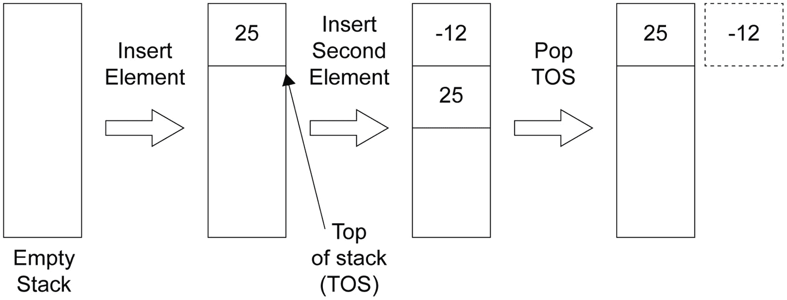
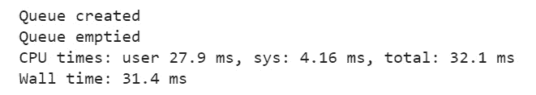
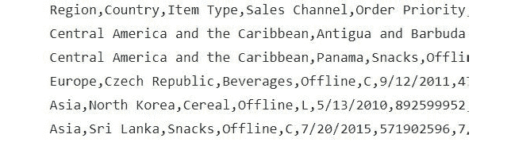

# 2. 内置数据结构的高级操作

概述

本章将介绍内置数据结构的高级数据操作。您可以使用这些数据结构来解决数据处理问题。阅读本章后，您将能够比较 Python 的高级数据结构并利用操作系统（OS）的文件处理操作。本章重点介绍 Python 中的数据结构和本书基础中的操作系统函数。到本章结束时，您将学会如何处理高级数据结构。

# 简介

在上一章中，我们介绍了不同基本数据结构的基本概念。我们学习了列表、集合、字典、元组和字符串。然而，到目前为止，我们只涵盖了这些数据结构的基本操作。一旦您学会了如何有效地利用它们，它们将提供更多功能。在本章中，我们将进一步探索数据结构的世界。我们将学习高级操作和操作，并使用基本数据结构来表示更复杂和更高级的数据结构；这在现实生活中处理数据时非常有用。这些高级主题将包括栈、队列、内部结构以及文件操作。

在本章中，我们还将学习如何使用内置的 Python 方法打开文件，以及许多不同的文件操作，例如读取和写入数据，以及完成操作后安全地关闭文件。我们还将探讨在处理文件时需要避免的一些问题。

# 高级数据结构

我们将从这个章节开始讨论高级数据结构。最初，我们将回顾列表。然后，我们将构建一个栈和一个队列，探索多元素成员检查以检查数据是否准确，并为了平衡，加入一些函数式编程。如果所有这些都听起来令人畏惧，请不要担心。我们将一步一步地进行，一旦完成本章，您将对自己的高级数据结构处理能力充满信心。

在我们深入构建数据结构之前，我们将查看一些用于操作它们的方法。

## 迭代器

在处理数据时，Python 中的迭代器非常有用，因为它们允许您逐个单元地解析数据。迭代器是有状态的，这意味着跟踪前一个状态将是有帮助的。迭代器是一个实现了`next`方法的对象——这意味着迭代器可以遍历列表、元组、字典等集合。实际上，这意味着每次我们调用该方法时，它都会从集合中给出下一个元素；如果列表中没有更多元素，则引发`StopIteration`异常。

注意

当迭代器没有更多值可以迭代时，使用迭代器的`next`方法会引发`StopIteration`异常。

如果你熟悉像 C、C++、Java、JavaScript 或 PHP 这样的编程语言，你可能已经注意到了这些语言中 `for` 循环的实现差异，它由三个不同的部分组成（初始化、递增和终止条件），而 Python 中的 `for` 循环则不同。在 Python 中，我们不使用那种 `for` 循环。我们在 Python 中使用的是更类似于 `foreach` 循环：

```py
for i in list_1 
```

这是因为，在底层，`for` 循环正在使用迭代器，因此我们不需要做所有额外的步骤。迭代器会为我们完成这些。

让我们了解我们可以与 `itertools` 一起使用的各种函数。在执行 `import` 语句之后的每一行代码后，你将能够看到有关该特定函数的功能和使用方法的详细信息：

```py
from itertools import (permutations, combinations, \
                       dropwhile, repeat, zip_longest)
permutations?
combinations?
dropwhile?
repeat?
zip_longest?
```

例如，执行 `zip_longest?` 后，我们将看到以下输出：

![Figure 2.1: Help file for the zip_longest function]

![img/B15780_02_01.jpg]

图 2.1：zip_longest 函数的帮助文件

上述截图显示了如何从 `itertools` 模块中使用 `zip_longest` 函数。

注意

要查找任何函数的定义，在 Jupyter Notebook 中输入函数名，然后跟一个 *?*，然后按 *Shift* + *Enter*。

让我们通过以下练习来了解如何使用迭代器遍历列表。

## 练习 2.01：介绍迭代器

在这个练习中，我们将生成一个包含数字的长列表。我们首先检查生成的列表占用的内存。然后，我们将检查如何使用 `iterator` 模块来减少内存利用率，最后，我们将使用这个迭代器来遍历列表。为此，让我们按照以下步骤进行：

1.  打开一个新的 Jupyter Notebook，生成一个包含 `10000000` 个一的列表。然后，将这个列表存储在一个名为 `big_list_of_numbers` 的变量中：

    ```py
    big_list_of_numbers = [1 for x in range (0, 10000000)] 
    big_list_of_numbers
    ```

    输出（部分显示）如下：

    ```py
    [1,
     1,
     1,
     1,
     1,
     1,
     1,
     1,
     1,
     1,
    ```

1.  检查这个变量的大小：

    ```py
    from sys import getsizeof
    getsizeof(big_list_of_numbers)
    ```

    输出如下：

    ```py
    81528056
    ```

    显示的值是 `81528056`（以字节为单位）。这是列表占用的巨大内存块。只有在列表推导完成后，`big_list_of_numbers` 变量才可用。如果你尝试太大的数字，它也可能超出系统可用内存。

1.  让我们使用 `itertools` 中的 `repeat()` 方法获取相同的数字，但占用更少的内存：

    ```py
    from itertools import repeat
    small_list_of_numbers = repeat(1, times=10000000)
    getsizeof(small_list_of_numbers)
    ```

    输出应该是：

    ```py
    56
    ```

    最后的行显示，我们的列表 `small_list_of_numbers` 的大小仅为 `56` 字节。此外，它是一种惰性方法，是函数式编程中使用的技巧，它将延迟方法或函数的执行几秒钟。在这种情况下，Python 不会最初生成所有元素。相反，当需要时，它会逐个生成它们，从而节省我们的时间。实际上，如果你在上面的代码中省略了 `repeat()` 方法的 `times` 关键字参数，那么你可以实际生成无限多个一。

1.  遍历新创建的迭代器：

    ```py
    for i, x in enumerate(small_list_of_numbers): 
        print(x)
        if i > 10:
            break
    ```

    输出如下：

    ```py
    1
    1
    1
    1
    1
    1
    1
    1
    1
    1
    1
    1
    ```

我们使用 `enumerate` 函数，以便我们得到循环计数器以及值。这有助于我们在达到一定数量（例如 `10`）时中断循环。

注意

要访问此特定部分的源代码，请参阅 [`packt.live/2N8odTH`](https://packt.live/2N8odTH)。

您也可以在 [`packt.live/3fAPFGa`](https://packt.live/3fAPFGa) 上在线运行此示例。

在这个练习中，我们首先学习了如何使用迭代器函数来减少内存使用。然后，我们使用迭代器遍历列表。现在，我们将看到如何创建栈。

## 栈

栈是一个非常有用的数据结构。如果您对 CPU 内部结构和程序执行方式有些了解，那么您就会知道栈在这些情况下是普遍存在的。它只是一个具有一个限制的列表，**后进先出**（**LIFO**），意味着当从栈中读取值时，最后进入的元素先出来。以下插图将使这一点更加清晰：




图 2.2：带有两个插入元素和一个弹出操作的栈

如您所见，我们有一个 LIFO（后进先出）策略来从栈中读取值。我们将使用 Python 列表来实现栈。Python 列表有一个名为 `pop` 的方法，它执行与前面插图中所见相同的 `pop` 操作。基本上，`pop` 函数将从栈中移除一个元素，使用 **后进先出**（**LIFO**）规则。我们将在以下练习中使用它来实现栈。

## 练习 2.02：在 Python 中实现栈

在这个练习中，我们将使用 Python 实现一个栈。我们首先创建一个空栈，并使用 `append` 方法向其中添加新元素。接下来，我们将使用 `pop` 方法从栈中取出元素。让我们按照以下步骤进行：

1.  导入必要的 Python 库并定义一个空栈：

    ```py
    import pandas as pd
    stack = []
    ```

    注意

    `pandas` 是 Python 中的一个开源数据分析库。

1.  使用 `append` 方法向栈中添加多个元素。多亏了 `append` 方法，元素将始终被追加到列表的末尾：

    ```py
    stack.append('my_test@test.edu')
    stack.append('rahul.subhramanian@test.edu')
    stack.append('sania.test@test.edu')
    stack.append('alec_baldwin@test.edu')
    stack.append('albert90@test.edu')
    stack.append('stewartj@test.edu')
    stack
    ```

    输出如下：

    ```py
    ['my_test@test.edu',
     'rahul.subhramanian@test.edu',
     'sania.test@test.edu',
     'alec_baldwin@test.edu',
     'albert90@test.edu',
     'stewartj@test.edu']
    ```

1.  让我们使用 `pop` 方法从我们的栈中读取一个值。此方法读取列表的当前最后一个索引并将其返回给我们。一旦读取完成，它也会删除该索引：

    ```py
    tos = stack.pop()
    tos
    ```

    输出如下：

    ```py
    'stewartj@test.edu'
    ```

    如您所见，栈的最后一个值已被检索。现在，如果我们向栈中添加另一个值，新值将被追加到栈的末尾。

1.  将 `Hello@test.com` 添加到栈中：

    ```py
    stack.append("Hello@test.com")
    stack
    ```

    输出如下：

    ```py
    ['my_test@test.edu',
     'rahul.subhramanian@test.edu',
     'sania.test@test.edu',
     'alec_baldwin@test.edu',
     'albert90@test.edu',
     'Hello@test.com']
    ```

    注意

    要访问此特定部分的源代码，请参阅 [`packt.live/3hACc2B`](https://packt.live/3hACc2B)。

    您也可以在 [`packt.live/2Yb4uct`](https://packt.live/2Yb4uct) 上在线运行此示例。

从练习中，我们可以看到基本的栈操作，`append` 和 `pop`，执行起来相当简单。

让我们可视化一个场景：你正在爬取一个网页，并希望跟随其中每个存在的 URL（反向链接）。让我们将这个问题的解决方案分为三个部分。在第一部分，我们将从页面上爬取的所有 URL 追加到栈中。在第二部分，我们将从栈中弹出每个元素，最后，我们将检查每个 URL，并对每个页面重复相同的流程。我们将在下一项练习中检查这个任务的一部分。

## 练习 2.03：使用用户定义的方法实现栈

在这个练习中，我们将继续上一项练习中的栈主题。这次，我们将通过创建用户定义的方法来实现`append`和`pop`函数。我们将实现一个栈，这次以一个商业用例为例（以维基百科作为来源）。这个练习的目标有两个。在前几个步骤中，我们将从网页中提取并追加 URL 到栈中，这也涉及到上一章讨论的`string`方法。在接下来的几个步骤中，我们将使用`stack_pop`函数遍历栈并打印它们。这个练习将展示 Python 的一个微妙特性以及它是如何处理将列表变量传递给函数的。让我们按以下步骤进行：

1.  首先，定义两个函数：`stack_push`和`stack_pop`。我们将其重命名，以避免命名空间冲突。同时，创建一个名为`url_stack`的栈以供以后使用：

    ```py
    def stack_push(s, value):
        return s + [value]
    def stack_pop(s):
        tos = s[-1]
        del s[-1]
        return tos
    url_stack = []
    url_stack
    ```

    输出如下：

    ```py
    []
    ```

    第一个函数接受已经存在的栈，并将其值添加到栈的末尾。

    注意

    注意值周围的方括号，使用`+`操作将其转换为单元素列表。第二个函数读取栈中当前`-1`索引的值，然后使用`del`运算符删除该索引，并最终返回它之前读取的值。

    现在，我们将有一个包含几个 URL 的字符串。

1.  分析字符串，以便我们在遇到 URL 时逐个将其推入栈中，然后使用`for`循环逐个弹出。让我们以维基百科文章的第一行为例（[`en.wikipedia.org/wiki/Data_mining`](https://en.wikipedia.org/wiki/Data_mining)）关于数据科学：

    ```py
    wikipedia_datascience = """Data science is an interdisciplinary field that uses scientific methods, processes, algorithms and systems to extract knowledge [https://en.wikipedia.org/wiki/Knowledge] and insights from data [https://en.wikipedia.org/wiki/Data] in various forms, both structured and unstructured,similar to data mining [https://en.wikipedia.org/wiki/Data_mining]""" 
    ```

    为了简化这个练习，我们在目标词旁边保留了方括号中的链接。

1.  查找字符串的长度：

    ```py
    len(wikipedia_datascience) 
    ```

    输出如下：

    ```py
    347
    ```

1.  使用字符串的`split`方法将这个字符串转换为列表，然后计算其长度：

    ```py
    wd_list = wikipedia_datascience.split()
    wd_list
    ```

    输出如下（部分输出）：

    ```py
    ['Data',
     'science',
     'is',
     'an',
     'interdisciplinary',
     'field',
     'that',
     'uses',
     'scientific',
     'methods,',
    ```

1.  检查列表的长度：

    ```py
    len(wd_list)
    ```

    输出如下：

    ```py
    34
    ```

1.  使用`for`循环遍历每个单词，并检查它是否是 URL。为此，我们将使用字符串的`startswith`方法，如果它是 URL，则将其推入栈中：

    ```py
    for word in wd_list:
        if word.startswith("[https://"):
            url_stack = stack_push(url_stack, word[1:-1])  
            print(word[1:-1])
    ```

    输出如下：

    ```py
    https://en.wikipedia.org/wiki/Knowledge
    https://en.wikipedia.org/wiki/Data
    https://en.wikipedia.org/wiki/Data_mining
    ```

    注意使用字符串切片来移除周围的引号`"[" "]"`。

1.  打印`url_stack`中的值：

    ```py
    print(url_stack) 
    ```

    输出如下：

    ```py
    ['https://en.wikipedia.org/wiki/Knowledge',
     'https://en.wikipedia.org/wiki/Data',
     'https://en.wikipedia.org/wiki/Data_mining']
    ```

1.  遍历列表并使用 `stack_pop` 函数逐个打印 URL：

    ```py
    for i in range(0, len(url_stack)):
        print(stack_pop(url_stack)) 
    ```

    输出如下：

    

    图 2.3：使用栈打印的 URL 输出

1.  再次打印以确保在最后的 `for` 循环之后栈为空：

    ```py
    print(url_stack) 
    ```

    输出如下：

    ```py
    []
    ```

    注意

    要访问此特定部分的源代码，请参阅 [`packt.live/2Y7oXyT`](https://packt.live/2Y7oXyT)。

    你也可以在 [`packt.live/3e9Smhz`](https://packt.live/3e9Smhz) 上在线运行此示例。

在这个练习中，我们在 `stack_pop` 方法中注意到一个奇怪的现象。我们传递了 `list` 变量到那里，并在函数内部使用了 `del` 操作符 *步骤 1*，但每次调用函数时都会通过删除最后一个索引来改变原始变量。如果你使用像 C、C++ 和 Java 这样的语言，那么这种行为是完全不可预期的，因为在那些语言中，这只能通过引用传递变量来实现，并且可能导致 Python 代码中的微妙错误。所以，在使用用户定义的方法时要小心。

## Lambda 表达式

通常，在函数内部改变变量的值不是一个好主意。任何传递给函数的变量都应被视为不可变的。这接近函数式编程的原则。然而，在这种情况下，我们可以使用既不可变也不可变的匿名函数，并且通常不会存储在变量中。在 Python 中，这样的表达式或函数称为 **lambda 表达式**，它是一种构建单行、无名的函数的方法，按照惯例，这些函数是无副作用的，并且通常被认为是实现了函数式编程。

让我们看看以下练习，以了解我们如何使用 lambda 表达式。

## 练习 2.04：实现 Lambda 表达式

在这个练习中，我们将使用 lambda 表达式来证明著名的三角恒等式：


图 2.4：三角恒等式

让我们按以下步骤进行操作：

1.  导入 `math` 包：

    ```py
    import math 
    ```

1.  使用 `def` 关键字定义两个函数，`my_sine` 和 `my_cosine`。我们声明这些函数的原因是 `math` 包中的原始 `sin` 和 `cos` 函数接受 `radians` 作为输入，但我们更熟悉 `degrees`。因此，我们将使用 lambda 表达式来定义 `sine` 和 `cosine` 的包装函数，然后使用它。这个 `lambda` 函数将自动将我们的度数输入转换为弧度，然后应用 `sin` 或 `cos` 并返回值：

    ```py
    def my_sine():
        return lambda x: math.sin(math.radians(x))
    def my_cosine():
        return lambda x: math.cos(math.radians(x)) 
    ```

1.  定义 `sine` 和 `cosine` 以满足我们的目的：

    ```py
    sine = my_sine()
    cosine = my_cosine()
    math.pow(sine(30), 2) + math.pow(cosine(30), 2) 
    ```

    输出如下：

    ```py
    1.0
    ```

注意，我们将`my_sine`和`my_cosine`的返回值分别赋给了两个变量，然后直接将它们用作函数。这种方法比显式使用它们要干净得多。注意，我们没有在 lambda 函数内显式地写`return`语句；这是默认的。

注意

要访问本节的源代码，请参阅[`packt.live/3fJW9mb`](https://packt.live/3fJW9mb)。

你也可以在[`packt.live/30Pn8by`](https://packt.live/30Pn8by)上运行这个示例。

现在，在下一节中，我们将使用 lambda 函数，也称为匿名函数，这些函数来自 lambda 演算。Lambda 函数用于创建未命名的临时函数。Lambda 表达式将接受一个输入，然后返回该输入的第一个字符。

## 练习 2.05：排序的 Lambda 表达式

在这个练习中，我们将探索`sort`函数以利用 lambda 函数。这个练习有用的地方在于，你将学习如何创建任何可以用于排序数据集的独特算法。Lambda 函数的语法如下：

```py
lambda x  :   <do something with x>
```

Lambda 表达式可以接受一个或多个输入。Lambda 表达式也可以通过使用`reverse`参数为`True`来逆序排序。我们将在本练习中同样使用逆序功能。让我们通过以下步骤进行：

1.  让我们将我们想要排序的元组列表存储在一个名为`capitals`的变量中：

    ```py
    capitals = [("USA", "Washington"), ("India", "Delhi"), ("France", "Paris"), ("UK", "London")]
    ```

1.  打印此列表的输出：

    ```py
    capitals 
    ```

    输出将如下所示：

    ```py
    [('USA', 'Washington'),
     ('India', 'Delhi'),
     ('France', 'Paris'),
     ('UK', 'London')]
    ```

1.  使用简单的 lambda 表达式按每个国家的首都名称对列表进行排序。以下代码使用 lambda 函数作为`sort`函数。它将根据每个元组的第一个元素进行排序：

    ```py
    capitals.sort(key=lambda item: item[1])
    capitals 
    ```

    输出将如下所示：

    ```py
    [('India', 'Delhi'),
     ('UK', 'London'),
     ('France', 'Paris'),
     ('USA', 'Washington')]
    ```

如我们所见，如果我们掌握了它们并在我们数据处理工作中使用 lambda 表达式，它们是非常强大的。它们也是无副作用的——这意味着它们不会改变传递给它们的变量的值。

注意

要访问本节的源代码，请参阅[`packt.live/2AzcTxv`](https://packt.live/2AzcTxv)。

你也可以在[`packt.live/3hDpe4o`](https://packt.live/3hDpe4o)上运行这个示例。

我们现在将进入下一节，我们将讨论每个元素的成员检查。成员检查是定性研究中的常用术语，描述了检查数据集中数据准确性的过程。

## 练习 2.06：多元素成员检查

在这个练习中，我们将使用`for`循环创建一个单词列表，以验证第一个列表中的所有元素都存在于第二个列表中。让我们看看如何：

1.  创建一个`list_of_words`列表，其中包含从文本语料库中抓取的单词：

    ```py
    list_of_words = ["Hello", "there.", "How", "are", "you", "doing?"] 
    list_of_words
    ```

    输出如下所示：

    ```py
    ['Hello', 'there.', 'How', 'are', 'you', 'doing?']
    ```

1.  定义一个`check_for`列表，它将包含`list_of_words`中的两个相似元素：

    ```py
    check_for = ["How", "are"] 
    check_for
    ```

    输出如下：

    ```py
    ['How', 'are']
    ```

    有一个详细解决方案，它涉及一个 `for` 循环和一些 `if`/`else` 条件（你应该尝试编写它），但还有一个优雅的 Pythonic 解决方案来解决这个问题，它只需要一行代码并使用 `all` 函数。`all` 函数在可迭代对象的所有元素都是 `True` 时返回 `True`。

1.  使用 `in` 关键字检查 `list_of_words` 中的 `check_for` 列表元素的成员资格：

    ```py
    all(w in list_of_words for w in check_for) 
    ```

    输出如下：

    ```py
    True
    ```

    注意

    要访问此特定部分的源代码，请参阅 [`packt.live/3d5pyVT`](https://packt.live/3d5pyVT)。

    你也可以在 [`packt.live/2C7GPB1`](https://packt.live/2C7GPB1) 上在线运行此示例。

它确实既优雅又简单，在处理列表时这个巧妙的方法非常重要。基本上，我们正在使用列表推导式遍历第一个列表，然后使用 `for` 循环遍历第二个列表。使这个方法优雅的是我们如何紧凑地表示这个复杂的过程。当使用非常复杂的列表推导式时，应该小心——你让它越复杂，就越难阅读。

让我们看看下一个数据结构：一个**队列**。

## 队列

除了栈之外，我们感兴趣的另一个高级数据结构类型是队列。队列就像栈一样，这意味着你一个接一个地继续添加元素。对于队列，元素的读取遵循**先进先出（FIFO）**策略。查看以下图表以更好地理解这一点：

![图 2.5：队列的示意图]

](img/B15780_02_05.jpg)

图 2.5：队列的示意图

我们将首先使用列表方法来完成这个任务，并展示它们在这种情况下是低效的。然后，我们将学习 Python 的 collections 模块中的 `dequeue` 数据结构。队列是一个非常重要的数据结构。我们可以考虑一个生产者-消费者系统设计的场景。在进行数据处理时，你经常会遇到必须处理非常大的文件的问题。处理这个问题的方法之一是将文件内容分成更小的部分，然后在创建小型专用工作进程的同时将它们推入队列，一次读取并处理一小部分。这是一个非常强大的设计，你甚至可以有效地使用它来设计大型多节点数据处理管道。

## 练习 2.07：在 Python 中实现队列

在这个练习中，我们将使用 Python 实现一个队列。我们将使用 `append` 函数向队列中添加元素，并使用 `pop` 函数从队列中取出元素。我们还将使用 `deque` 数据结构，并将其与队列进行比较，以了解完成操作所需的总墙时。为此，请执行以下步骤：

1.  使用 Python 的普通列表方法创建一个 Python 队列。为了记录队列数据结构中`append`操作所需的时间，我们使用`%%time`命令：

    ```py
    %%time
    queue = []
    for i in range(0, 100000):
        queue.append(i)
    print("Queue created")
    queue 
    ```

    注意

    `%%time`是 Python 中一个常见的内置魔术命令，用于捕获操作执行所需的时间。

    输出（部分显示）如下：

    

    图 2.6：队列中`append`函数记录的墙时

1.  如果我们要使用`pop`函数来清空队列并检查其中的项目：

    ```py
    for i in range(0, 100000):
        queue.pop(0)
    print("Queue emptied") 
    ```

    输出将如下所示：

    ```py
    Queue emptied
    ```

    然而，这次，我们将在执行前面的代码时使用`%%time`魔术命令，以查看它需要一段时间才能完成：

    ```py
    %%time
    for i in range(0, 100000):
        queue.pop(0)
    print("Queue emptied") 
    queue
    ```

    输出如下：

    

    图 2.7：队列中`pop`函数记录的墙时

    注意

    如果你正在使用 Google Colab 或其他虚拟环境，你将看到输出中额外的一行，指示 CPU 时间。这是 Google Colab（或任何其他虚拟环境）运行的服务器上的 CPU 时间。然而，如果你在自己的本地系统上工作，这些信息将不会是输出的一部分。

    在一台配备四核处理器和 8GB RAM 的现代 MacBook 上，完成所需时间大约为 1.20 秒。在 Windows 10 上，完成所需时间大约为 2.24 秒。它需要这么长时间是因为`pop(0)`操作，这意味着每次我们从列表的左侧（当前`0`索引）弹出值时，Python 都必须通过将其他所有元素向左移动一个位置来重新排列列表中的所有其他元素。确实，这不是一个很优化的实现。

1.  使用 Python 的`collections`包中的`deque`数据结构实现相同的队列，并在该数据结构上执行`append`和`pop`函数：

    ```py
    %%time
    from collections import deque
    queue2 = deque()
    for i in range(0, 100000):
        queue2.append(i)
    print("Queue created")
    for i in range(0, 100000):
        queue2.popleft()
    print("Queue emptied") 
    ```

    输出如下：

    

图 2.8：测量 deque 的墙时

使用 Python 标准库中的专用和优化队列实现，这两个操作所需的时间仅为大约 27.9 毫秒。这是对之前的一个巨大改进。

注意

要访问此特定部分的源代码，请参阅[`packt.live/30R69Wc`](https://packt.live/30R69Wc)。

你也可以在[`packt.live/3dazIEL`](https://packt.live/3dazIEL)在线运行此示例。

我们将在这里结束对数据结构的讨论。我们在这里讨论的只是冰山一角。数据结构是一个迷人的主题。还有许多其他的数据结构我们没有涉及，而且当它们被有效使用时，可以提供巨大的附加价值。我们强烈建议您更深入地探索数据结构。尽可能多地了解链表、树、图以及它们的各种变体；您会发现它们之间有许多相似之处，并且从学习它们中受益匪浅。它们不仅提供了学习的乐趣，而且也是数据从业者武器库中的秘密超级武器，每次面对困难的数据处理任务时都可以使用。

## 活动 2.01：排列、迭代器、Lambda 和列表

在这个活动中，我们将使用 `permutations` 来生成所有可能的由 `0`、`1` 和 `2` 组成的三位数。排列是一种数学方法，用于表示所有可能的结果。然后，我们将遍历这个迭代器，并使用 `isinstance` 和 `assert` 确保返回类型是元组。使用一行代码，结合 `dropwhile` 和 lambda 表达式，将所有元组转换为列表，同时去除任何前导零（例如，`(0, 1, 2)` 变为 `[1, 2]`）。最后，我们将编写一个函数，它接受一个列表作为输入，并返回列表中包含的实际数字。

这些步骤将指导您如何解决这个活动：

1.  查找 `itertools` 中 `permutations` 和 `dropwhile` 的定义。

1.  编写一个表达式，使用 `0`、`1` 和 `2` 生成所有可能的三位数。

1.  遍历之前生成的迭代器表达式。打印迭代器返回的每个元素。使用 `assert` 和 `isinstance` 确保元素是元组类型。

1.  再次编写循环，这次使用 `dropwhile` 和 lambda 表达式来去除元组中的前导零。例如，`(0, 1, 2)` 将变为 `[0, 2]`。同时，将 `dropwhile` 的输出转换为列表。

1.  检查 `dropwhile` 返回的实际类型。

1.  将前面的代码合并成一个代码块；这次，编写一个单独的函数，您将传递由 `dropwhile` 生成的列表，该函数将返回列表中包含的整个数字。例如，如果您将 `[1, 2]` 传递给函数，它将返回 `12`。确保返回类型确实是数字而不是字符串。尽管可以使用其他技巧完成此任务，但请将传入的列表在函数中视为栈，并通过读取栈中的各个数字来生成数字。

    最终输出应如下所示：

    ```py
    12.0
    21.0
    102.0
    120.0
    201.0
    210.0
    ```

    注意

    本活动的解决方案可以通过这个链接找到。

通过这个活动，我们完成了这个主题，并将继续到下一个主题，该主题涉及基本的文件级操作。

注意

我们鼓励您在没有使用我们在这里使用的高级操作和数据结构的情况下，考虑解决前面问题的解决方案。您很快就会意识到解决方案是多么复杂，以及它必须多么详细。然后，您将理解这些数据结构和操作的价值有多大。

# Python 中的基本文件操作

在上一个主题中，我们研究了一些高级数据结构，并且还学习了干净且有用的函数式编程方法来无副作用地操作它们。在本主题中，我们将学习 Python 中的一些 OS 级函数，例如处理文件，但这也可能包括处理打印机，甚至互联网。我们将主要关注与文件相关的函数，并学习如何打开文件，逐行读取数据或一次性读取所有数据，最后，如何干净地关闭我们打开的文件。文件关闭操作应该谨慎进行，这在大多数情况下被开发者忽略。在处理文件操作时，我们经常会遇到非常奇怪且难以追踪的 bug，因为某个进程打开了一个文件而没有正确关闭它。我们将应用我们学到的一些技术到一个我们将要读取的文件上，以进一步练习我们的数据处理技能。

## 练习 2.08：文件操作

在这个练习中，我们将学习 Python 的 OS 模块，并且我们还将探讨两种非常实用的方法来编写和读取环境变量。编写和读取环境变量的能力在设计和开发数据处理管道时通常非常重要。

注意

实际上，著名 12 因子应用程序设计的一个因素就是将配置存储在环境中的想法。您可以在以下 URL 中查看：[`12factor.net/config`](https://12factor.net/config)。

OS 模块的目的是为您提供与操作系统依赖功能交互的方法。一般来说，它是相当底层的，并且那里的大多数函数在日常使用中并不有用；然而，其中一些是值得学习的。`os.environ`是 Python 维护的集合，包含了您操作系统中的所有当前环境变量。它赋予您创建新变量的能力。`os.getenv`函数赋予您读取环境变量的能力：

1.  导入`os`模块。

    ```py
    import os 
    ```

1.  设置一些环境变量：

    ```py
    os.environ['MY_KEY'] = "MY_VAL"
    os.getenv('MY_KEY') 
    ```

    输出如下：

    ```py
    'MY_VAL'
    ```

1.  当未设置环境变量时打印：

    ```py
    print(os.getenv('MY_KEY_NOT_SET')) 
    ```

    输出如下：

    ```py
    None
    ```

1.  打印`os`环境：

    ```py
    print(os.environ) 
    ```

    注意

    由于安全原因，输出尚未添加。

    要访问本节的具体源代码，请参阅[`packt.live/2YCZAnC`](https://packt.live/2YCZAnC)。

    您也可以在[`packt.live/3fCqnaB`](https://packt.live/3fCqnaB)上在线运行此示例。

执行前面的代码后，你将能够看到你已成功打印了`MY_KEY`的值，当你尝试打印`MY_KEY_NOT_SET`时，它打印了`None`。因此，利用 OS 模块，你将能够在你的系统中设置环境变量的值。

## 文件处理

在本节中，我们将学习如何在 Python 中打开文件。我们将了解我们可以使用的不同模式以及它们在打开文件时的含义。Python 有一个内置的`open`函数，我们将使用它来打开文件。`open`函数接受一些输入参数。其中，第一个参数代表你想要打开的文件名，是唯一必须的。其他所有内容都有默认值。当你调用`open`时，Python 会使用底层系统级调用打开文件句柄并将其返回给调用者。

通常，文件可以用于读取或写入。如果我们以某种模式打开文件，则不支持其他操作。而读取通常意味着我们从现有文件的开始处开始读取，写入可以意味着从文件开始处创建新文件并写入，或者打开现有文件并附加到它。

下面是一个表格，展示了 Python 支持的所有不同文件打开模式：

![Figure 2.9: 读取文件的模式

![img/B15780_02_09.jpg]

图 2.9：读取文件的模式

此外，还有一个已弃用的模式`U`，在 Python 3 环境中没有任何作用。我们必须记住的是，Python 将始终区分`t`和`b`模式，即使底层操作系统不这样做。这是因为，在`b`模式下，Python 不会尝试解码它所读取的内容，而是返回`byteobject`，而在`t`模式下，它会尝试解码流并返回字符串表示。

你可以使用以下命令打开文件进行读取。路径（高亮显示）需要根据你系统上文件的位置进行更改。

```py
fd = open("../datasets/data_temporary_files.txt")
```

在下一节中，我们将讨论更多函数。

注意

文件可以在这里找到：[`packt.live/2YGpbfv`](https://packt.live/2YGpbfv)。

这是在`rt`模式下打开的（以`reading+text`模式打开）。如果你想以二进制模式打开相同的文件，也可以。要以二进制模式打开文件，请使用`rb (read, byte)`模式：

```py
fd = open('AA.txt',"rb")
fd
```

输出如下：

```py
<_io.BufferedReader name='../datasets/AA.txt'>
```

注意

文件可以在这里找到：[`packt.live/30OSkaP`](https://packt.live/30OSkaP)。

这是我们打开文件进行写入的方式：

```py
fd = open("../datasets/data_temporary_files.txt ", "w")
fd
```

输出如下：

```py
<_io.TextIOWrapper name='../datasets/data_temporary_files.txt ' mode='w' encoding='cp1252'>
```

让我们在下面的练习中练习这个概念。

## 练习 2.09：打开和关闭文件

在这个练习中，我们将学习如何在打开文件后关闭它。

注意

我们将要处理的文件可以在这里找到：[`packt.live/30OSkaP`](https://packt.live/30OSkaP)。

我们一旦打开文件，就必须关闭它。由于悬挂的文件处理器，即文件仍在被修改，尽管应用程序已经完成使用它，因此可能会发生许多系统级错误。一旦我们关闭文件，就无法使用该特定的文件处理器在该文件上执行任何进一步的操作。

1.  以二进制模式打开文件：

    ```py
    fd = open("../datasets/AA.txt", "rb")
    ```

    注意

    根据您系统上文件的位置更改高亮显示的路径。本练习的视频展示了如何在不同文件上使用相同的函数。在那里，您还将看到用于写入文件的函数的示例，您将在本章的后面部分学习到这一点。

1.  使用 `close()` 关闭文件：

    ```py
    fd.close()
    ```

Python 还为我们提供了文件处理器的 `closed` 标志。如果我们关闭文件之前打印它，那么我们会看到 `False`，而如果我们关闭文件之后打印它，那么我们会看到 `True`。如果我们需要检查文件是否已正确关闭，那么这就是我们想要使用的标志。

注意

要访问本节的源代码，请参阅 [`packt.live/30R6FDC`](https://packt.live/30R6FDC)。

您也可以在 [`packt.live/3edLoI8`](https://packt.live/3edLoI8) 上在线运行此示例。

## `with` 语句

在本节中，我们将学习 Python 中的 `with` 语句以及我们如何在打开和关闭文件的情况下有效地使用它。

Python 中的 `with` 命令是一个复合语句，类似于 `if` 和 `for`，旨在组合多行。像任何复合语句一样，`with` 也会影响其包含的代码的执行。在 `with` 的情况下，它用于将一段代码包裹在所谓的 Python 中的 *上下文管理器* 的作用域内。上下文管理器是一种方便的资源管理方式，有助于避免忘记关闭资源。关于上下文管理器的详细讨论超出了本练习的范围，但总的来说，如果上下文管理器是在 Python 中打开文件的 `open` 调用中实现的，那么如果我们在 `with` 语句中包裹它，就保证会自动执行关闭调用。

注意

关于 `with` 的整个 PEP 可以在 [`www.python.org/dev/peps/pep-0343/`](https://www.python.org/dev/peps/pep-0343/) 找到。我们鼓励您去查看。

## 使用 `with` 语句打开文件

使用 `with` 语句打开文件：

```py
with open("../datasets/AA.txt") as fd:
    print(fd.closed)
print(fd.closed) 
```

输出如下：

```py
False
True
```

如果我们执行前面的代码，我们会看到第一个 `print` 将打印 `False`，而第二个将打印 `True`。这意味着一旦控制流出 `with` 块，文件描述符就会自动关闭。

注意

这无疑是打开文件并获得文件描述符的最干净、最 Pythonic 的方式。我们鼓励您在需要自己打开文件时始终使用此模式。

## 练习 2.10：逐行读取文件

在这个练习中，我们将逐行读取文件。让我们按照以下步骤进行：

1.  打开一个文件，然后逐行读取文件并打印出我们读取的内容：

    ```py
    with open("../datasets/Alice`s Adventures in Wonderland, "\
              "by Lewis Carroll", encoding="utf8") as fd: 
        for line in fd: 
            print(line)
    readline, which reads one line at a time from a file.
    ```

1.  在第一个循环之后立即复制相同的`for`循环：

    ```py
    with open("../datasets/Alice`s Adventures in Wonderland, "\
              "by Lewis Carroll", encoding="utf8") as fd: 
        for line in fd:
            print(line)
        print("Ended first loop")
        for line in fd:
            print(line)
    ```

    注意

    不要忘记根据文件在您系统中的位置更改文件路径（突出显示）。

    输出（部分显示）如下：

    

图 2.11：打开文件的部分

注意

要访问此特定部分的源代码，请参阅[`packt.live/37B7aTX`](https://packt.live/37B7aTX)。

您也可以在[`packt.live/3fCqWBf`](https://packt.live/3fCqWBf)在线运行此示例。

让我们看看本章的最后一个练习。

## 练习 2.11：写入文件

在这个练习中，我们将通过向您展示如何从字典中读取并写入文件来探讨文件操作。我们将向文件中写入几行，并读取该文件：

注意

`data_temporary_files.txt`可以在[`packt.live/2YGpbfv`](https://packt.live/2YGpbfv)找到。

让我们通过以下步骤进行：

1.  使用文件描述符对象的`write`函数：

    ```py
    data_dict = {"India": "Delhi", "France": "Paris",\
                 "UK": "London", "USA": "Washington"}
    with open("../datasets/data_temporary_files.txt", "w") as fd:
        for country, capital in data_dict.items():
            fd.write("The capital of {} is {}\n"\
                     .format(country, capital))
    ```

    注意

    在整个练习过程中，不要忘记根据您存储文本文件的位置更改文件路径（突出显示）。

1.  使用以下命令读取文件：

    ```py
    with open("../datasets/data_temporary_files.txt", "r") as fd:
        for line in fd:
            print(line)
    ```

    输出如下：

    ```py
    The capital of India is Delhi
    The capital of France is Paris
    The capital of UK is London
    The capital of USA is Washington
    ```

1.  使用`print`函数通过以下命令写入文件：

    ```py
    data_dict_2 = {"China": "Beijing", "Japan": "Tokyo"}
    with open("../datasets/data_temporary_files.txt", "a") as fd:
        for country, capital in data_dict_2.items():
            print("The capital of {} is {}"\
                  .format(country, capital), file=fd)
    ```

1.  使用以下命令读取文件：

    ```py
    with open("\n, at the end of the string to be written. The print function does that automatically for us.To access the source code for this specific section, please refer to [`packt.live/2BkVh8j`](https://packt.live/2BkVh8j). You can also run this example online at [`packt.live/3hB7xT0`](https://packt.live/3hB7xT0).
    ```

通过这种方式，我们将结束这个主题。就像前面的主题一样，我们为您设计了一个活动来练习您新获得的知识。

## 活动二.02：设计您自己的 CSV 解析器

在作为数据从业者的一生中，您会遇到很多 CSV 文件。CSV 文件是一种以逗号分隔的文件，其中通常存储和用逗号分隔来自表格格式的数据，尽管也可以使用其他字符，如`tab`或`*`。以下是一个示例 CSV 文件：



图 2.12：CSV 文件的部分输出

在这个活动中，我们将被要求构建自己的 CSV 读取器和解析器。虽然如果我们试图涵盖所有用例和边缘情况，包括转义字符，这是一个大任务，但为了这个简短的活动，我们将保持我们的要求很小。我们将假设没有转义字符——这意味着如果您在行中的任何位置使用逗号，您将开始一个新列。我们还将假设我们唯一感兴趣的功能是能够逐行读取 CSV 文件，其中每次读取将生成一个新字典，列名作为键，行名作为值。

这里有一个例子：


图 2.13：包含示例数据的表格

我们可以将前表中数据转换为 Python 字典，其外观如下：`{"Name": "Bob", "Age": "24", "Location": "California"}`：

1.  从`itertools`导入`zip_longest`。创建一个将`header`、`line`和`fillvalue=None`压缩的函数。

    通过使用`with`块内的`r`模式，从 GitHub 链接([`packt.live/2Yb6iCh`](https://packt.live/2Yb6iCh))打开附带的`sales_record.csv`文件，并检查它是否已打开。

1.  读取第一行，并使用字符串方法生成所有列名的列表。

1.  开始读取文件。逐行读取。

1.  读取每一行，并将该行传递给一个函数，同时附带标题列表。该函数的工作是从这两个列表中构建一个`字典`，并填充`键:值`变量。请记住，缺失的值应导致`None`。

    此部分的输出应类似于以下内容：

![图 2.14：销售记录文件的局部输出

![图片 B15780_02_14.jpg]

图 2.14：销售记录文件的局部输出

注意

此活动的解决方案可以通过此链接找到。

通过这样，我们结束了本章。

# 摘要

本章涵盖了高级数据结构（如栈和队列）的操作技术。然后，我们关注了函数式编程的不同方法，包括迭代器，并将列表和函数结合起来。后来，我们探讨了操作系统级别的函数和环境变量的管理。我们检查了如何使用 Python 以各种方式打开、关闭甚至写入本地文件。知道如何以干净的方式处理文件是数据整理者技能库中的关键技能。最后，我们通过创建自己的 CSV 解析器来测试我们新学的技能。

在下一章中，我们将处理三个最重要的库，即`NumPy`、`pandas`和`matplotlib`。
