# 3. NumPy、Pandas 和 Matplotlib 简介

概述

在本章中，你将学习`NumPy`、`pandas`和`matplotlib`库的基础知识。你将学会创建一维和多维数组，并操作`pandas` DataFrame 和`series`对象。到本章结束时，你将能够使用`Matplotlib`库可视化和绘制数值数据，以及将`matplotlib`、`NumPy`和`pandas`应用于从 DataFrame 或矩阵中计算描述性统计。

# 简介

在前面的章节中，我们介绍了 Python 中的一些高级数据结构，例如栈、队列、迭代器和文件操作。在本章中，我们将介绍三个基本库，即`NumPy`、`pandas`和`matplotlib`。`NumPy`是 Python 中的一个高级数学库，具有广泛的功能。`pandas`是基于`NumPy`构建的库，允许开发者以类似于数据库的表格结构建模数据；另一方面，`matplotlib`是一个受 Matlab 影响的图表库。使用这些库，你将能够处理大多数数据整理任务。

# NumPy 数组

`NumPy`数组类似于列表，但在某些方面有所不同。在数据科学家的生活中，读取和操作数组是首要任务，也是最常见的任务。这些数组可以是一维列表、多维表格或充满数字的矩阵，可用于各种数学计算。

数组可以填充整数、浮点数、布尔值、字符串，甚至混合类型。然而，在大多数情况下，数值数据类型占主导地位。以下是一些你需要处理数值数组的场景示例：

+   读取一组电话号码和邮政编码并提取特定模式

+   创建一个包含随机数的矩阵，以在统计过程中运行蒙特卡洛模拟

+   为了缩放和归一化一个包含大量财务和交易数据的销售数字表

+   从一个大的原始数据表中创建一个包含关键描述性统计量的较小表格（例如，平均值、中位数、最小/最大范围、方差和四分位距）

+   为了读取并分析一维数组中的时间序列数据，例如一个组织一年内的股价或气象站每日温度数据

简而言之，数组和数值数据表无处不在。作为一名数据整理专业人士，能够读取和处理数值数组的能力至关重要。在处理数据时，经常需要使用数学函数对其进行修改。在这方面，`NumPy`数组是 Python 中你需要了解的最重要对象。

## NumPy 数组和功能

`NumPy` 和 `SciPy` 是 Python 的开源附加模块，它们提供预编译的快速函数，用于常见的数学和数值运算。多年来，这些模块已经发展成为高度成熟的库，提供了满足或甚至超过与常见商业软件（如 Matlab 或 Mathematica）相关功能的功能。

`NumPy` 模块的主要优势之一是它可以用来处理或创建一维或多维数组。这种高级数据结构/类是 `NumPy` 包的核心，它作为更高级概念（如 `pandas` 库和特定的 pandas DataFrame）的基本构建块，我们将在本章稍后介绍。

`NumPy` 数组与常见的 Python 列表不同，因为 Python 列表可以被视为简单的数组。`NumPy` 数组是为数学向量运算而构建的，这些运算只需一行代码就能处理大量的数值数据。`NumPy` 数组中的许多内置数学函数是用低级语言（如 C 或 Fortran）编写的，并且已经预编译以实现快速执行。

注意

`NumPy` 数组是针对数值分析优化的数据结构，这就是为什么它们对数据科学家来说如此重要的原因。

让我们通过本章的第一个练习来了解如何从列表创建一个 `NumPy` 数组。

## 练习 3.01：创建 NumPy 数组（从列表）

在这个练习中，我们将从列表创建一个 `NumPy` 数组。我们首先定义一个列表，然后使用 `NumPy` 库的数组函数将列表转换为数组。接下来，我们将从 `.csv` 文件中读取数据，并使用 `NumPy` 库的 `genfromtxt` 函数将数据存储在 `NumPy` 数组中。为此，让我们按照以下步骤进行：

1.  要使用 `NumPy`，我们必须导入它。按照惯例，我们在导入时给它一个简短的名字，np。这将使在 `NumPy` 包下引用对象变得有组织：

    ```py
    import numpy as np
    ```

1.  创建一个包含三个元素 `1`、`2` 和 `3` 的列表：

    ```py
    list_1 = [1,2,3]
    list_1
    ```

    输出如下：

    ```py
    [1, 2, 3]
    ```

1.  使用 `array` 函数将其转换为数组：

    ```py
    array_1 = np.array(list_1)
    array_1
    ```

    输出如下：

    ```py
    array([1, 2, 3])
    ```

    我们刚刚从常规 Python 列表对象 `list_1` 创建了一个名为 `array_1` 的 `NumPy` 数组对象。

1.  使用数组函数直接创建一个浮点类型元素的数组，即 `1.2`、`3.4` 和 `5.6`：

    ```py
    a = np.array([1.2, 3.4, 5.6])
    a
    ```

    输出如下：

    ```py
    array([1.2, 3.4, 5.6])
    ```

1.  让我们使用 `type` 函数检查新创建的对象 a 的类型：

    ```py
    type(a)
    ```

    输出如下：

    ```py
    numpy.ndarray
    ```

1.  使用 `type` 函数检查 `array_1` 的类型：

    ```py
    type(array_1)
    ```

    输出如下：

    ```py
    numpy.ndarray
    ```

    如我们所见，a 和 `array_1` 都是 `NumPy` 数组。

1.  现在，使用 `type` 在 `list_1` 上：

    ```py
    type(list_1)
    ```

    输出如下：

    ```py
    list
    ```

    如我们所见，`list_1` 实质上是一个 Python 列表，我们使用了 `NumPy` 库的数组函数从该列表创建了一个 `NumPy` 数组。

1.  现在，让我们使用 `NumPy` 库的 `genfromtxt` 函数读取一个 `.csv` 文件作为 `NumPy` 数组：

    ```py
    data = np.genfromtxt('../datasets/stock.csv', \
                         delimiter=',',names=True,dtype=None, \
                         encoding='ascii')
    data
    array([('MMM', 100), ('AOS', 101), ('ABT', 102), ('ABBV', 103),
           ('ACN', 104), ('ATVI', 105), ('AYI', 106), ('ADBE', 107),
           ('AAP', 108), ('AMD', 109), ('AES', 110), ('AET', 111),
           ('AMG', 112), ('AFL', 113), ('A', 114), ('APD', 115),
           ('AKAM', 116), ('ALK', 117), ('ALB', 118), ('ARE', 119),
           ('ALXN', 120), ('ALGN', 121), ('ALLE', 122), ('AGN', 123),
           ('ADS', 124), ('LNT', 125), ('ALL', 126), ('GOOGL', 127),
           ('GOOG', 128), ('MO', 129), ('AMZN', 130), ('AEE', 131),
           ('AAL', 132), ('AEP', 133), ('AXP', 134), ('AIG', 135),
           ('AMT', 136), ('AWK', 137), ('AMP', 138), ('ABC', 139),
           ('AME', 140), ('AMGN', 141), ('APH', 142), ('APC', 143),
           ('ADI', 144), ('ANDV', 145), ('ANSS', 146), ('ANTM', 147),
           ('AON', 148)], dtype=[('Symbol', '<U5'), ('Price', '<i8')])
    ```

1.  使用 `type` 函数检查 `data` 的类型：

    ```py
    type(data)
    ```

    输出如下：

    ```py
    numpy.ndarray
    ```

正如我们所见，数据变量也是一个 `NumPy` 数组。

注意

要访问此特定部分的源代码，请参阅 [`packt.live/2Y9pTTx`](https://packt.live/2Y9pTTx)。

您也可以在 [`packt.live/2URNcPz`](https://packt.live/2URNcPz) 上在线运行此示例。

从这个练习中，我们可以观察到 `NumPy` 数组与常规列表对象不同。需要记住的最重要的一点是 `NumPy` 数组没有与列表相同的方法，它们本质上是为数学函数设计的。

`NumPy` 数组就像数学对象一样——`NumPy` 数组，我们将第一个数组的第一个元素加到第二个数组的第一个元素上——在这个操作中有元素到元素的对应关系。这与 Python 列表形成对比，列表中的元素只是简单追加，没有元素到元素的关联。这是 `NumPy` 数组的真正力量：它们可以被当作数学向量来处理。

向量是一组数字，可以表示，例如，三维空间中点的坐标或图片中数字的颜色（RGB）。自然地，这种集合的相对顺序很重要，正如我们之前讨论的，`NumPy` 数组可以保持这种顺序关系。这就是为什么它们非常适合用于数值计算。

带着这些知识，我们将在下一个练习中执行 `NumPy` 数组的加法操作。

## 练习 3.02：添加两个 NumPy 数组

这个简单的练习将演示使用 `+` 符号将两个 `NumPy` 数组相加，并因此展示常规 Python 列表/数组与 `NumPy` 数组之间的关键区别。让我们执行以下步骤：

1.  导入 `NumPy` 库：

    ```py
    import numpy as np
    ```

1.  声明一个名为 `list_1` 的 Python 列表和一个 `NumPy` 数组：

    ```py
    list_1 = [1,2,3]
    array_1 = np.array(list_1)
    ```

1.  使用 `+` 符号将两个 `list_1` 对象连接起来，并将结果保存到 `list_2`：

    ```py
    list_2 = list_1 + list_1
    list_2
    ```

    输出如下：

    ```py
    [1, 2, 3, 1, 2, 3]
    ```

1.  使用相同的 `+` 符号将两个 `array_1` 对象连接起来，并将结果保存到 `array_2`：

    ```py
    array_2 = array_1 + array_1
    array_2
    ```

    输出如下：

    ```py
    [2 ,4, 6]
    ```

1.  加载一个 `.csv` 文件并将其与自身连接：

    ```py
    data = np.genfromtxt('../datasets/numbers.csv', \
                         delimiter=',', names=True)
    data = data.astype('float64')
    data + data
    array([202., 204., 206., 208., 210., 212., 214., 216., 218., 
           220., 222., 224., 226., 228., 230., 232., 234., 236., 
           238., 240., 242., 244., 246., 248., 250., 252., 254., 
           256., 258., 260., 262., 264., 266., 268., 270., 272., 
           274., 276., 278., 280., 282., 284., 286., 288., 290., 
           292., 294., 296.])
    ```

你注意到区别了吗？前六个元素，[`1, 2, 3, 1, 2, 3`]，但第二个 `NumPy` 数组（或向量）的元素是 `[2, 4, 6`]，这只是 `array_1` 各个元素的累加。正如我们之前讨论的，`NumPy` 数组设计得非常适合执行逐元素操作，因为存在元素到元素的对应关系。

注意

要访问此特定部分的源代码，请参阅 [`packt.live/3fyvSqF`](https://packt.live/3fyvSqF)。

您也可以在 [`packt.live/3fvUDnf`](https://packt.live/3fvUDnf) 上在线运行此示例。

`NumPy` 数组甚至支持逐元素指数运算。例如，假设有两个数组——第一个数组的元素将被提升到第二个数组元素的幂。

在以下练习中，我们将尝试在 `NumPy` 数组上进行一些数学运算。

## 练习 3.03：NumPy 数组上的数学运算

在这个练习中，我们将从 `.csv` 文件中提取值来生成一个 `NumPy` 数组。我们将使用乘法和除法运算符对生成的 `NumPy` 数组进行操作。让我们按以下步骤进行：

注意

将要使用的 `.csv` 文件是 `numbers.csv`；您可以在以下位置找到它：[`packt.live/30Om2wC`](https://packt.live/30Om2wC)。

1.  导入 `NumPy` 库并从 `.csv` 文件创建一个 `NumPy` 数组：

    ```py
    import numpy as np
    data = np.genfromtxt('../datasets/numbers.csv', \
                         delimiter=',', names=True)
    data = data.astype('float64')
    data
    array([101., 102., 103., 104., 105., 106., 107., 108., 109., 
           110., 111., 112., 113., 114., 115., 116., 117., 118., 
           119., 120., 121., 122., 123., 124., 125., 126., 127., 
           128., 129., 130., 131., 132., 133., 134., 135., 136., 
           137., 138., 139., 140., 141., 142., 143., 144., 145., 
           146., 147., 148.])
    ```

1.  将 `45` 乘以数组中的每个元素：

    ```py
    data * 45
    ```

    输出如下：

    ```py
    array([4545., 4590., 4635., 4680., 4725., 4770., 4815., 4860., 
           4905., 4950., 4995., 5040., 5085., 5130., 5175., 5220., 
           5265., 5310., 5355., 5400., 5445., 5490., 5535., 5580., 
           5625., 5670., 5715., 5760., 5805., 5850., 5895., 5940., 
           5985., 6030., 6075., 6120., 6165., 6210., 6255., 6300., 
           6345., 6390., 6435., 6480., 6525., 6570., 6615., 6660.])
    ```

1.  将数组除以 `67.7`：

    ```py
    data / 67.7
    ```

    输出如下：

    ```py
    array([1.49187592, 1.50664697, 1.52141802, 1.53618907, 
           1.55096012, 1.56573117, 1.58050222, 1.59527326, 
           1.61004431, 1.62481536, 1.63958641, 1.65435746, 
           1.66912851, 1.68389956, 1.69867061, 1.71344165, 
           1.7282127 , 1.74298375, 1.7577548 , 1.77252585, 
           1.7872969 , 1.80206795, 1.816839  , 1.83161004, 
           1.84638109, 1.86115214, 1.87592319, 1.89069424, 
           1.90546529, 1.92023634, 1.93500739, 1.94977843, 
           1.96454948, 1.97932053, 1.99409158, 2.00886263, 
           2.02363368, 2.03840473, 2.05317578, 2.06794682, 
           2.08271787, 2.09748892, 2.11225997, 2.12703102, 
           2.14180207, 2.15657312, 2.17134417, 2.18611521])
    ```

1.  使用以下命令将一个数组提升到第二个数组的幂：

    ```py
    list_1 = [1,2,3]
    array_1 = np.array(list_1)
    print("array_1 raised to the power of array_1: ", \
          array_1**array_1)
    ```

    输出如下：

    ```py
    array_1 raised to the power of array_1:  [ 1  4 27]
    ```

因此，我们可以观察到 NumPy 数组如何允许逐元素指数运算。

注意

要访问此特定部分的源代码，请参阅 [`packt.live/3hBZMw4`](https://packt.live/3hBZMw4)。

您也可以在此在线运行此示例 [`packt.live/2N4dE3Y`](https://packt.live/2N4dE3Y)。

在下一节中，我们将讨论如何将高级数学运算应用于 NumPy 数组。

# 高级数学运算

生成数值数组是一项相当常见的任务。到目前为止，我们一直是通过创建一个 Python 列表对象并将其转换为 `NumPy` 数组来做到这一点的。然而，我们可以绕过这一步骤，直接使用原生的 NumPy 方法。`arange` 函数根据您提供的最小和最大界限以及指定的步长创建一系列数字。另一个函数 `linspace` 创建一系列介于两个极端之间的中间点。

在下一个练习中，我们将创建一个列表，然后将其转换为 `NumPy` 数组。然后，我们将向您展示如何在该数组上执行一些高级数学运算。

## 练习 3.04：NumPy 数组上的高级数学运算

在这个练习中，我们将练习使用 `NumPy` 库的所有内置数学函数。在这里，我们将创建一个列表并将其转换为 `NumPy` 数组。然后，我们将对该数组执行一些高级数学运算。让我们按以下步骤进行：

注意

在这个练习中，我们将使用 `numbers.csv` 文件，您可以在以下位置找到它：[`packt.live/30Om2wC`](https://packt.live/30Om2wC)。

1.  导入 `pandas` 库并使用 `pandas` 从 `numbers.csv` 文件中读取。然后，将其转换为列表：

    ```py
    import pandas as pd
    df = pd.read_csv("../datasets/numbers.csv")
    list_5 = df.values.tolist()
    list_5
    ```

    注意

    不要忘记根据您系统上文件的位置更改路径（已突出显示）。

    输出（部分显示）如下：

    

    图 3.1：.csv 文件的部分输出

1.  使用以下命令将列表转换为 `NumPy` 数组：

    ```py
    import numpy as np
    array_5 = np.array(list_5)
    array_5
    ```

    输出（部分显示）如下：

    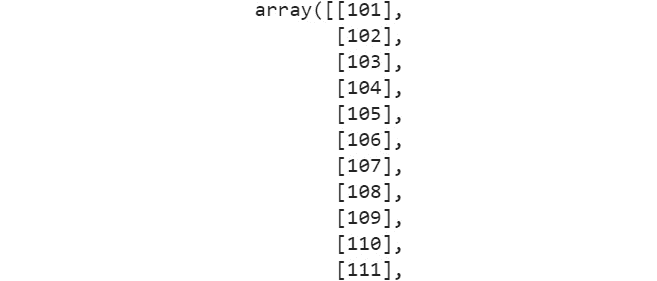

    图 3.2：NumPy 数组的部分输出

1.  使用以下命令查找数组的正弦值：

    ```py
    # sine function
    np.sin(array_5)
    ```

    输出（部分显示）如下：

    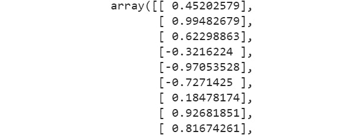

    图 3.3：正弦值的部分输出

1.  使用以下命令查找数组的对数值：

    ```py
    # logarithm
    np.log(array_5)
    ```

    输出（部分显示）如下：

    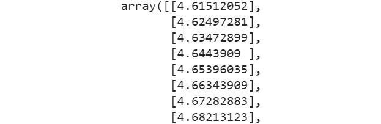

    图 3.4：对数数组的部分输出

1.  使用以下命令查找数组的指数值：

    ```py
    # Exponential
    np.exp(array_5)
    ```

    输出（部分显示）如下：

    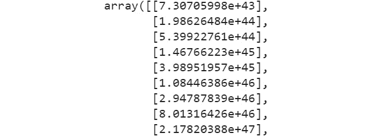

图 3.5：指数数组的部分输出

如我们所见，使用内置方法在`NumPy`数组上执行高级数学运算相当容易。

注意

要访问本节的源代码，请参阅[`packt.live/37NIyrf`](https://packt.live/37NIyrf)。

您也可以在[`packt.live/3eh0Xz6`](https://packt.live/3eh0Xz6)上在线运行此示例。

## 练习 3.05：使用 arange 和 linspace 方法生成数组

本练习将演示我们如何使用`arange`方法创建一系列数字。为了使列表线性间隔，我们将使用`linspace`方法。为此，让我们按照以下步骤进行：

1.  使用以下命令导入`NumPy`库并创建一系列数字：

    ```py
    import numpy as np
    np.arange(5,16)
    ```

    输出如下：

    ```py
    array([ 5, 6, 7, 8, 9, 10, 11, 12, 13, 14, 15])
    ```

1.  使用`arange`函数通过以下命令打印数字：

    ```py
    print("Numbers spaced apart by 2: ",\
          np.arange(0,11,2))
    print("Numbers spaced apart by a floating point number:   ",\
          np.arange(0,11,2.5))
    print("Every 5th number from 30 in reverse order\n",\
          np.arange(30,-1,-5))
    ```

    输出如下：

    ```py
    Numbers spaced apart by 2: [ 0 2 4 6 8 10]
    Numbers spaced apart by a floating point number:  
    [ 0. 2.5 5.0 7.5 10\. ]
    Every 5th number from 30 in reverse order
     [30 25 20 15 10  5  0]
    ```

1.  对于线性间隔的数字，我们可以使用`linspace`方法，如下所示：

    ```py
    print("11 linearly spaced numbers between 1 and 5: ",\
          np.linspace(1,5,11))
    ```

    输出如下：

    ```py
    11 linearly spaced numbers between 1 and 5: 
    [1. 1.4 1.8 2.2 2.6 3. 3.4 3.8 4.2 4.6 5\. ]
    ```

如我们所见，`linspace`方法帮助我们创建数组中的线性间隔元素。

注意

要访问本节的源代码，请参阅[`packt.live/2YOZGsy`](https://packt.live/2YOZGsy)。

您也可以在[`packt.live/3ddPcYG`](https://packt.live/3ddPcYG)上在线运行此示例。

到目前为止，我们只创建了单维数组。现在，让我们创建一些多维数组（例如线性代数中的矩阵）。

## 练习 3.06：创建多维数组

在本练习中，就像我们从简单的扁平列表创建一维数组一样，我们将从列表的列表中创建二维数组。

注意

本练习将使用`numbers2.csv`文件，该文件可在[`packt.live/2V8EQTZ`](https://packt.live/2V8EQTZ)找到。

让我们按照以下步骤进行：

1.  导入必要的 Python 库，加载`numbers2.csv`文件，并使用以下命令将其转换为二维`NumPy`数组：

    ```py
    import pandas as pd
    import numpy as np
    df = pd.read_csv("../datasets/numbers2.csv",\
                     header=None)
    list_2D = df.values
    mat1 = np.array(list_2D)
    print("Type/Class of this object:",\
          type(mat1))
    print("Here is the matrix\n----------\n",\
          mat1, "\n----------")
    Type/Class of this object: <class 'numpy.ndarray'>
    Here is the matrix
    ---------- 
    [[1 2 3] 
    [4 5 6] 
    [7 8 9]] 
    ----------
    ```

1.  可以使用以下代码将元组转换为多维数组：

    ```py
    tuple_2D = np.array([(1.5,2,3), (4,5,6)])
    mat_tuple = np.array(tuple_2D)
    print (mat_tuple)
    ```

    输出如下：

    ```py
    [[1.5 2\.  3\. ]
     [4\.  5\.  6\. ]]
    ```

因此，我们已经使用 Python 列表和元组创建了多维数组。

注意

要访问本节的具体源代码，请参阅[`packt.live/30RjJcc`](https://packt.live/30RjJcc)。

您也可以在[`packt.live/30QiIBm`](https://packt.live/30QiIBm)上运行此示例。

现在，让我们确定二维数组的维度、形状、大小和数据类型。

## 练习 3.07：二维数组的维度、形状、大小和数据类型

本练习将演示一些方法，让您检查数组的维度、形状和大小。

注意

`numbers2.csv`文件可以在[`packt.live/2V8EQTZ`](https://packt.live/2V8EQTZ)找到。

注意，如果是一个`3x2`矩阵，即它有`3`行和`2`列，那么形状将是(`3,2`)，但大小将是`6`，即`6 = 3x2`。要了解如何在 Python 中找出数组的维度，请按照以下步骤进行：

1.  导入必要的 Python 模块并加载`numbers2.csv`文件：

    ```py
    import pandas as pd
    import numpy as np
    df = pd.read_csv("../datasets/numbers2.csv",\
                     header=None) 
    list_2D = df.values
    mat1 = np.array(list_2D)
    ```

    注意

    不要忘记根据您系统上文件的位置更改路径（已突出显示）。

1.  使用`ndim`函数打印矩阵的维度：

    ```py
    print("Dimension of this matrix: ", mat1.ndim,sep='')
    ```

    输出如下：

    ```py
    Dimension of this matrix: 2
    ```

1.  使用`size`函数打印大小：

    ```py
    print("Size of this matrix: ", mat1.size,sep='')
    ```

    输出如下：

    ```py
    Size of this matrix: 9
    ```

1.  使用`shape`函数打印矩阵的形状：

    ```py
    print("Shape of this matrix: ", mat1.shape,sep='')
    ```

    输出如下：

    ```py
    Shape of this matrix: (3, 3)
    ```

1.  使用`dtype`函数打印维度类型：

    ```py
    print("Data type of this matrix: ", mat1.dtype,sep='')
    ```

    输出如下：

    ```py
    Data type of this matrix: int64
    ```

在这个练习中，我们查看了一些可用的实用方法，以检查数组的维度。我们使用了`ndim`、`shape`、`dtype`和`size`函数来查看数组的维度。

注意

要访问本节的具体源代码，请参阅[`packt.live/30PVEm1`](https://packt.live/30PVEm1)。

您也可以在[`packt.live/3ebSsoG`](https://packt.live/3ebSsoG)上运行此示例。

现在我们已经熟悉了 NumPy 中的基本向量（一维）和矩阵数据结构，我们将能够轻松地创建特殊矩阵。通常，您可能需要创建填充零、一、随机数或对角线一的特殊矩阵。单位矩阵是一个从左到右对角线填充零和一的矩阵。

## 练习 3.08：零矩阵、一矩阵、随机矩阵和向量

在这个练习中，我们将使用`NumPy`库的`zeros`函数创建一个零向量和一个零矩阵。然后，我们将使用`ones`函数创建一个五的矩阵，接着使用`eye`函数生成一个单位矩阵。我们还将使用`random`函数，创建一个填充随机值的矩阵。为此，请按照以下步骤进行：

1.  使用以下命令打印零向量：

    ```py
    import numpy as np
    print("Vector of zeros: ",np.zeros(5))
    ```

    输出如下：

    ```py
    Vector of zeros:  [0\. 0\. 0\. 0\. 0.]
    ```

1.  使用以下命令打印零矩阵：

    ```py
    print("Matrix of zeros: ",np.zeros((3,4)))
    ```

    输出如下：

    ```py
    Matrix of zeros:  [[0\. 0\. 0\. 0.]
     [0\. 0\. 0\. 0.]
     [0\. 0\. 0\. 0.]]
    ```

1.  使用以下命令打印五的矩阵：

    ```py
    print("Matrix of 5's: ",5*np.ones((3,3)))
    ```

    输出如下：

    ```py
    Matrix of 5's:  [[5\. 5\. 5.]
     [5\. 5\. 5.]
     [5\. 5\. 5.]]
    ```

1.  使用以下命令打印单位矩阵：

    ```py
    print("Identity matrix of dimension 2:",np.eye(2))
    ```

    输出如下：

    ```py
    Identity matrix of dimension 2: [[1\. 0.]
     [0\. 1.]]
    ```

1.  使用以下命令打印一个 `4x4` 维度的单位矩阵：

    ```py
    print("Identity matrix of dimension 4:",np.eye(4))
    ```

    输出如下：

    ```py
    Identity matrix of dimension 4: [[1\. 0\. 0\. 0.]
     [0\. 1\. 0\. 0.]
     [0\. 0\. 1\. 0.]
     [0\. 0\. 0\. 1.]]
    ```

1.  使用 `randint` 函数打印一个随机形状的矩阵：

    ```py
    print("Random matrix of shape(4,3):\n",\
          np.random.randint(low=1,high=10,size=(4,3)))
    ```

    示例输出如下：

    ```py
    Random matrix of shape (4,3):
     [[6 7 6]
     [5 6 7]
     [5 3 6]
     [2 9 4]]
    ```

如前所述的输出所示，生成了一个具有随机形状的矩阵。

注意

在创建矩阵时，需要传递整数元组作为参数。由于我们使用了随机数，输出可能会发生变化。

要访问此特定部分的源代码，请参阅 [`packt.live/2UROs5f`](https://packt.live/2UROs5f)。

您也可以在 [`packt.live/37J5hV9`](https://packt.live/37J5hV9) 上在线运行此示例。

随机数生成是一个非常有用的工具，需要掌握用于数据科学/数据处理任务。我们将在统计部分再次探讨随机变量和分布的主题，并了解 NumPy 和 pandas 内置的随机数和序列生成，以及操作函数。

`reshape` 是 `ravel` 函数，它将任何给定的数组展平为一维数组。这在许多机器学习和数据分析任务中是一个非常有用的操作。

## 练习 3.09：重塑、Ravel、最小值、最大值和排序

在这个练习中，我们将生成一个由两位数组成的随机一维向量，然后将该向量重塑为多维向量。让我们按以下步骤进行：

1.  使用以下代码创建一个包含 `30` 个随机整数（从 `1` 到 `99` 中采样）的数组，并使用以下代码将其重塑为两种不同的形式：

    ```py
    import numpy as np
    a = np.random.randint(1,100,30)
    b = a.reshape(2,3,5)
    c = a.reshape(6,5)
    ```

1.  使用以下代码使用 `shape` 函数打印形状：

    ```py
    print ("Shape of a:", a.shape)
    print ("Shape of b:", b.shape)
    print ("Shape of c:", c.shape)
    ```

    输出如下：

    ```py
    Shape of a: (30,)
    Shape of b: (2, 3, 5)
    Shape of c: (6, 5)
    ```

1.  使用以下代码打印数组 `a`、`b` 和 `c`：

    ```py
    print("\na looks like\n",a)
    print("\nb looks like\n",b)
    print("\nc looks like\n",c)
    ```

    示例输出如下：

    ```py
    a looks like
     [ 7 82  9 29 50 50 71 65 33 84 55 78 40 68 50 15 65 55 98 
     38 23 75 50 57 32 69 34 59 98 48]
    b looks like
     [[[ 7 82  9 29 50]
      [50 71 65 33 84]
      [55 78 40 68 50]]
     [[15 65 55 98 38]
      [23 75 50 57 32]
      [69 34 59 98 48]]]
    c looks like
     [[ 7 82  9 29 50]
     [50 71 65 33 84]
     [55 78 40 68 50]
     [15 65 55 98 38]
     [23 75 50 57 32]
     [69 34 59 98 48]]
    ```

    注意

    `b` 是一个三维数组——一种列表的列表的列表。由于我们使用了随机数，输出可能会发生变化。

1.  使用以下代码来处理 Ravel 文件 `b`：

    ```py
    b_flat = b.ravel()
    print(b_flat)
    ```

    示例输出如下（每次迭代的输出可能不同）：

    ```py
    [ 7 82  9 29 50 50 71 65 33 84 55 78 40 68 50 15 65 55 98 38 
     23 75 50 57 32 69 34 59 98 48]
    ```

    注意

    要访问此特定部分的源代码，请参阅 [`packt.live/2Y6KYh8`](https://packt.live/2Y6KYh8)。

    您也可以在 [`packt.live/2N4fDFs`](https://packt.live/2N4fDFs) 上在线运行此示例。

在这个练习中，你学习了如何使用 `shape` 和 `reshape` 函数来查看和调整数组的维度。这在处理数组时可以用于各种情况。

NumPy 数组的索引和切片与常规列表索引非常相似。我们甚至可以通过提供一个格式为（开始，步长，结束）的额外参数来遍历具有确定步长的元素向量。此外，我们可以传递一个列表作为参数来选择特定的元素。

注意

在多维数组中，你可以使用两个数字来表示一个元素的位置。例如，如果元素位于第三行第二列，其索引为 2 和 1（因为 Python 的零基索引）。

## 练习 3.10：索引和切片

在这个练习中，我们将学习如何在单维和多维数组上执行索引和切片。为了完成这个练习，让我们按照以下步骤进行：

1.  创建一个包含`10`个元素的数组，并通过使用略微不同的语法对数组进行切片和索引来检查其各种元素。请使用以下命令执行此操作：

    ```py
    import numpy as np
    array_1 = np.arange(0,11)
    print("Array:",array_1)
    ```

    输出如下：

    ```py
    Array: [ 0  1  2  3  4  5  6  7  8  9 10]
    ```

1.  使用以下命令打印第七位置的元素：

    ```py
    print("Element at 7th index is:", array_1[7])
    ```

    输出如下：

    ```py
    Element at 7th index is: 7
    ```

1.  使用以下命令打印第三到第六位置之间的元素：

    ```py
    print("Elements from 3rd to 5th index are:", array_1[3:6])
    ```

    输出如下：

    ```py
    Elements from 3rd to 5th index are: [3 4 5]
    ```

1.  使用以下命令打印直到第四位置的元素：

    ```py
    print("Elements up to 4th index are:", array_1[:4])
    ```

    输出如下：

    ```py
    Elements up to 4th index are: [0 1 2 3]
    ```

1.  使用以下命令反向打印元素：

    ```py
    print("Elements from last backwards are:", array_1[-1::-1])
    ```

    输出如下：

    ```py
    Elements from last backwards are: [10  9  8  7  6  5  4  3  2  1  0]
    ```

1.  使用以下命令通过向后索引打印元素，跳过三个值：

    ```py
    print("3 Elements from last backwards are:", array_1[-1:-6:-2])
    ```

    输出如下：

    ```py
    3 Elements from last backwards are: [10  8  6]
    ```

1.  使用以下命令创建一个名为`array_2`的新数组：

    ```py
    array_2 = np.arange(0,21,2)
    print("New array:",array_2)
    ```

    输出如下：

    ```py
    New array: [ 0  2  4  6  8 10 12 14 16 18 20]
    ```

1.  打印数组的第二、第四和第九个元素：

    ```py
    print("Elements at 2nd, 4th, and 9th index are:", \
          array_2[[2,4,9]])
    ```

    输出如下：

    ```py
    Elements at 2nd, 4th, and 9th index are: [ 4  8 18]
    ```

1.  使用以下命令创建一个多维数组：

    ```py
    matrix_1 = np.random.randint(10,100,15).reshape(3,5)
    print("Matrix of random 2-digit numbers\n ",matrix_1)
    ```

    样本输出如下：

    ```py
    Matrix of random 2-digit numbers
      [[21 57 60 24 15]
     [53 20 44 72 68]
     [39 12 99 99 33]]
    ```

    注意

    由于我们使用了随机数，输出可能会发生变化。

1.  使用以下命令通过双括号索引访问值：

    ```py
    print("\nDouble bracket indexing\n")
    print("Element in row index 1 and column index 2:", \
          matrix_1[1][2])
    ```

    样本输出如下：

    ```py
    Double bracket indexing
    Element in row index 1 and column index 2: 44
    ```

1.  使用以下命令通过单括号索引访问值：

    ```py
    print("\nSingle bracket with comma indexing\n")
    print("Element in row index 1 and column index 2:", \
          matrix_1[1,2])
    ```

    样本输出如下：

    ```py
    Single bracket with comma indexing
    Element in row index 1 and column index 2: 44
    ```

1.  使用以下命令通过行或列访问多维数组中的值：

    ```py
    print("\nRow or column extract\n")
    print("Entire row at index 2:", matrix_1[2])
    print("Entire column at index 3:", matrix_1[:,3])
    ```

    样本输出如下：

    ```py
    Row or column extract
    Entire row at index 2: [39 12 99 99 33]
    Entire column at index 3: [24 72 99]
    ```

1.  使用以下命令打印具有指定行和列索引的矩阵：

    ```py
    print("\nSubsetting sub-matrices\n")
    print("Matrix with row indices 1 and 2 and column "\
          "indices 3 and 4\n", matrix_1[1:3,3:5])
    ```

    样本输出如下：

    ```py
    Subsetting sub-matrices
    Matrix with row indices 1 and 2 and column indices 3 and 4
     [[72 68]
     [99 33]]
    ```

1.  使用以下命令打印具有指定行和列索引的矩阵：

    ```py
    print("Matrix with row indices 0 and 1 and column "\
          "indices 1 and 3\n", matrix_1[0:2,[1,3]])
    ```

    样本输出如下：

    ```py
    Matrix with row indices 0 and 1 and column indices 1 and 3
     [[57 24]
     [20 72]]
    ```

    注意

    由于我们使用了随机数，输出可能会发生变化。

    要访问此特定部分的源代码，请参阅[`packt.live/3fsxJ00`](https://packt.live/3fsxJ00)。

    您也可以在[`packt.live/3hEDYjh`](https://packt.live/3hEDYjh)上运行此示例。

在这个练习中，我们处理了`NumPy`数组以及各种子集方法，例如切片。在处理数组时，以这种方式处理是非常常见的。

## 条件子集

**条件子集**是一种根据某些数值条件选择特定元素的方法。它几乎像是 SQL 查询子集元素的简短版本。请看以下示例：

```py
matrix_1 = np.array(np.random.randint(10,100,15)).reshape(3,5)
print("Matrix of random 2-digit numbers\n",matrix_1)
print ("\nElements greater than 50\n", matrix_1[matrix_1>50])
```

在前面的代码示例中，我们创建了一个包含`10-100`之间 15 个随机值的数组。我们应用了`reshape`函数。然后，我们选择了小于`50`的元素。

样本输出如下（请注意，由于是随机的，您的确切输出可能会有所不同）：

```py
Matrix of random 2-digit numbers
 [[71 89 66 99 54]
 [28 17 66 35 85]
 [82 35 38 15 47]]
Elements greater than 50
 [71 89 66 99 54 66 85 82]
```

NumPy 数组操作就像数学矩阵一样，操作是逐元素进行的。

现在，让我们通过一个练习来了解如何执行数组操作。

## 练习 3.11：数组操作

在这个练习中，我们将创建两个矩阵（多维数组）并使用随机整数，演示逐元素数学运算，如加法、减法、乘法和除法。我们可以通过以下步骤展示指数运算（将一个数提升到某个幂）：

注意

由于随机数生成，您的具体输出可能与这里显示的不同。

1.  导入 `NumPy` 库并创建两个矩阵：

    ```py
    import numpy as np
    matrix_1 = np.random.randint(1,10,9).reshape(3,3)
    matrix_2 = np.random.randint(1,10,9).reshape(3,3)
    print("\n1st Matrix of random single-digit numbers\n",\
          matrix_1)
    print("\n2nd Matrix of random single-digit numbers\n",\
          matrix_2)
    ```

    样本输出如下（请注意，由于是随机的，您的确切输出将与您的不一样）：

    ```py
    1st Matrix of random single-digit numbers
     [[6 5 9]
     [4 7 1]
     [3 2 7]]
    2nd Matrix of random single-digit numbers
     [[2 3 1]
     [9 9 9]
     [9 9 6]]
    ```

1.  在矩阵上执行加法、减法、除法和线性组合：

    ```py
    print("\nAddition\n", matrix_1+matrix_2)
    print("\nMultiplication\n", matrix_1*matrix_2)
    print("\nDivision\n", matrix_1/matrix_2)
    print("\nLinear combination: 3*A - 2*B\n", \
          3*matrix_1-2*matrix_2)
    ```

    样本输出如下（请注意，由于是随机的，您的确切输出将与您的不一样）：

    ```py
    Addition
     [[ 8  8 10]
     [13 16 10]
     [12 11 13]] 
    Multiplication
     [[12 15  9]
     [36 63  9]
     [27 18 42]]
    Division
     [[3.       1.66666667 9.     ]
     [0.44444444 0.77777778 0.11111111]
     [0.33333333 0.22222222 1.16666667]]
    Linear combination: 3*A - 2*B
     [[ 14    9  25]
     [ -6    3 -15]
     [ -9 -12    9]]
    ```

1.  执行标量、指数矩阵立方和指数平方根的加法：

    ```py
    print("\nAddition of a scalar (100)\n", 100+matrix_1)
    print("\nExponentiation, matrix cubed here\n", matrix_1**3)
    print("\nExponentiation, square root using 'pow' function\n", \
          pow(matrix_1,0.5))
    ```

    样本输出如下（请注意，由于是随机的，您的确切输出将与您的不一样）：

    ```py
    Addition of a scalar (100)
     [[106 105 109]
     [104 107 101]
     [103 102 107]]
    Exponentiation, matrix cubed here
     [[216 125 729]
     [ 64 343    1]
     [ 27    8 343]]
    Exponentiation, square root using 'pow' function
     [[2.44948974 2.23606798 3.     ]
     [2.      2.64575131 1.     ]
     [1.73205081 1.41421356 2.64575131]]
    ```

    注意

    输出可能会变化，因为我们使用了随机数。

    要访问本节的具体源代码，请参阅 [`packt.live/3fC1ziH`](https://packt.live/3fC1ziH)。

    您也可以在 [`packt.live/3fy6j96`](https://packt.live/3fy6j96) 上在线运行此示例。

我们已经看到了如何使用数组来执行各种数学函数，例如标量加法和矩阵立方。

## 堆叠数组

将数组堆叠在一起（或并排）是数据处理中的一个有用操作。堆叠是将两个 NumPy 数组连接在一起的方式。以下是代码：

```py
a = np.array([[1,2],[3,4]])
b = np.array([[5,6],[7,8]])
print("Matrix a\n",a)
print("Matrix b\n",b)
print("Vertical stacking\n",np.vstack((a,b)))
print("Horizontal stacking\n",np.hstack((a,b)))
```

输出如下：

```py
Matrix a
 [[1 2]
 [3 4]]
Matrix b
 [[5 6]
 [7 8]]
Vertical stacking
 [[1 2]
 [3 4]
 [5 6]
 [7 8]]
Horizontal stacking
 [[1 2 5 6]
 [3 4 7 8]]
```

`NumPy` 有许多其他高级功能，主要与统计和线性代数函数相关，这些函数在机器学习和数据科学任务中得到了广泛使用。然而，并非所有这些对初学者级别的数据处理直接有用，因此我们在此不涉及。

在下一节中，我们将讨论 pandas DataFrame。

## Pandas DataFrame

`pandas` 库是一个 Python 包，它提供了快速、灵活且表达性强的数据结构，旨在使处理关系型或标记数据变得既简单又直观。它的目标是成为在 Python 中进行实际、现实世界数据分析的基本高级构建块。此外，它还有更广泛的目标，即成为任何语言中最强大和最灵活的开源数据分析/操作工具。

pandas 的两个主要数据结构是 Series（一维）和 DataFrame（二维），它们处理了绝大多数典型用例。`pandas` 是建立在 `NumPy` 之上的，旨在与许多第三方库在科学计算环境中良好集成。

让我们通过几个练习来了解使用 `pandas` 库的数据处理技术。

## 练习 3.12：创建 Pandas Series

在这个练习中，我们将学习如何从之前创建的数据结构中创建一个`pandas`系列对象。如果你已经将 pandas 导入为 pd，那么创建系列的功能就是`pd.Series`。让我们按照以下步骤进行：

1.  使用以下命令导入`NumPy`库并初始化标签、列表和字典：

    ```py
    import numpy as np
    labels = ['a','b','c']
    my_data = [10,20,30]
    array_1 = np.array(my_data)
    d = {'a':10,'b':20,'c':30}
    ```

1.  使用以下命令导入`pandas`为`pd`：

    ```py
    import pandas as pd
    ```

1.  使用以下命令从`my_data`列表创建一个系列：

    ```py
    print("\nHolding numerical data\n",'-'*25, sep='')
    print(pd.Series(array_1))
    ```

    输出如下：

    ```py
    Holding numerical data
    -------------------------
    0  10
    1  20
    2  30
    dtype: int64
    ```

1.  按照以下方式从`my_data`列表创建一个带有标签的系列：

    ```py
    print("\nHolding text labels\n",'-'*20, sep='')
    print(pd.Series(labels))
    ```

    输出如下：

    ```py
    Holding text labels
    --------------------
    0     a
    1     b
    2     c
    dtype: object
    ```

1.  然后，按照以下方式从`NumPy`数组创建一个系列：

    ```py
    print("\nHolding functions\n",'-'*20, sep='')
    print(pd.Series(data=[sum,print,len]))
    ```

    输出如下：

    ```py
    Holding functions
    --------------------
    0     <built-in function sum>
    1     <built-in function print>
    2     <built-in function len>
    dtype: object
    ```

1.  按照以下方式从字典创建一个系列：

    ```py
    print("\nHolding objects from a dictionary\n",'-'*40, sep='')
    print(pd.Series(data=[d.keys, d.items, d.values]))
    ```

    输出如下：

    ```py
    Holding objects from a dictionary
    ----------------------------------------
    0     <built-in method keys of dict object at 0x7fb8...
    1     <built-in method items of dict object at 0x7fb...
    2     <built-in method values of dict object at 0x7f...
    dtype: object
    ```

    注意

    你可能会得到不同的最终输出，因为系统可能会以不同的方式在内存中存储对象。

    要访问此特定部分的源代码，请参阅[`packt.live/2BkMJOL`](https://packt.live/2BkMJOL)。

    你也可以在[`packt.live/30XhxzQ`](https://packt.live/30XhxzQ)上在线运行此示例。

在这个练习中，我们创建了`pandas`系列，它们是`pandas`数据框的构建块。`pandas`系列对象可以存储多种类型的数据，如整数、对象、浮点数、双精度数等。这是构建更大表格的关键，其中多个系列对象堆叠在一起以创建类似数据库的实体。

## 练习 3.13：Pandas 系列和数据处理

在这个练习中，我们将使用`pd.series`函数创建一个`pandas`系列。然后，我们将使用各种处理技术操纵数据框中的数据。按照以下步骤进行：

1.  使用以下命令通过数值数据创建一个`pandas`系列：

    ```py
    import numpy as np
    import pandas as pd
    labels = ['a','b','c'] 
    my_data = [10,20,30] 
    array_1 = np.array(my_data)
    d = {'a':10,'b':20,'c':30} 
    print("\nHolding numerical data\n",'-'*25, sep='')
    print(pd.Series(array_1))
    ```

    输出如下：

    ```py
    Holding numerical data
    -------------------------
    0     10
    1     20
    2     30
    dtype: int32
    ```

1.  使用以下命令通过标签创建一个`pandas`系列：

    ```py
    print("\nHolding text labels\n",'-'*20, sep='')
    print(pd.Series(labels))
    ```

    输出如下：

    ```py
    Holding text labels
    --------------------
    0     a
    1     b
    2     c
    dtype: object
    ```

1.  使用以下命令通过函数创建一个`pandas`系列：

    ```py
    print("\nHolding functions\n",'-'*20, sep='')
    print(pd.Series(data=[sum,print,len]))
    ```

    输出如下：

    ```py
    Holding functions
    --------------------
    0     <built-in function sum>
    1     <built-in function print>
    2     <built-in function len>
    dtype: object
    ```

1.  使用以下命令通过字典创建一个`pandas`系列：

    ```py
    print("\nHolding objects from a dictionary\n",'-'*40, sep='')
    print(pd.Series(data=[d.keys, d.items, d.values]))
    ```

    输出如下：

    ```py
    Holding objects from a dictionary
    ----------------------------------------
    0     <built-in method keys of dict object at 0x0000...
    1     <built-in method items of dict object at 0x000...
    2     <built-in method values of dict object at 0x00...
    dtype: object
    ```

    注意

    要访问此特定部分的源代码，请参阅[`packt.live/3hzXRIr`](https://packt.live/3hzXRIr)。

    你也可以在[`packt.live/3endeC9`](https://packt.live/3endeC9)上在线运行此示例。

在这个练习中，我们使用各种类型的列表创建了 pandas 系列对象。

## 练习 3.14：创建 Pandas 数据框

`pandas`数据框类似于 Excel 表或关系数据库（SQL）表，它由三个主要组件组成：数据、索引（或行）和列。在底层，它是一系列`pandas`系列对象，这些对象本身建立在`NumPy`数组之上。因此，我们之前关于`NumPy`数组的知识在这里都适用。让我们按照以下步骤进行：

1.  从一个二维数字矩阵创建一个简单的 DataFrame。首先，代码从均匀分布中抽取`20`个随机整数。然后，我们需要将其重塑为(`5,4`)的 NumPy 数组——`5`行和`4`列：

    ```py
    import numpy as np
    import pandas as pd
    matrix_data = np.random.randint(1,10,size=20).reshape(5,4)
    ```

1.  将行标签定义为(`'A','B','C','D','E'`)，列标签定义为(`'W','X','Y','Z'`):

    ```py
    row_labels = ['A','B','C','D','E']
    column_headings = ['W','X','Y','Z']
    ```

1.  使用`pd.DataFrame`创建 DataFrame：

    ```py
    df = pd.DataFrame(data=matrix_data, index=row_labels, \
                      columns=column_headings)
    ```

1.  打印 DataFrame：

    ```py
    print("\nThe data frame looks like\n",'-'*45, sep='')
    print(df) 
    ```

    样本输出如下：

    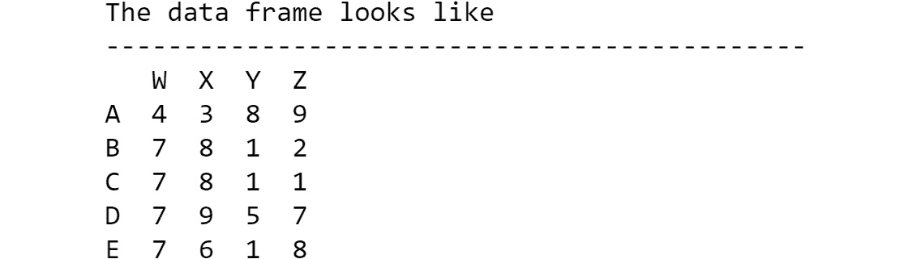

    图 3.6：DataFrame 的输出

1.  使用以下命令从整数列表的 Python 字典创建 DataFrame：

    ```py
    d={'a':[10,20],'b':[30,40],'c':[50,60]}
    ```

1.  将此字典作为数据参数传递给`pd.DataFrame`函数。传递一个行或索引列表。注意，字典键变成了列名，而值被分配到多行中：

    ```py
    df2=pd.DataFrame(data=d,index=['X','Y'])
    print(df2)
    ```

    输出如下：

    

图 3.7：DataFrame df2 的输出

注意

要访问此特定部分的源代码，请参阅[`packt.live/2UVTz4u`](https://packt.live/2UVTz4u).

您也可以在此在线运行此示例：[`packt.live/2CgBkAd`](https://packt.live/2CgBkAd).

在这个练习中，我们从头开始手动创建 DataFrame，这将使我们更好地理解 DataFrame。

注意

您将创建 pandas DataFrame 的最常见方式是从本地磁盘或互联网上的文件中读取表格数据——CSV、文本、JSON、HTML、Excel 等等。我们将在下一章中介绍其中的一些。

## 练习 3.15：部分查看 DataFrame

在上一个练习中，我们使用了`print(df)`来打印整个 DataFrame。对于大型数据集，我们只想打印数据的一部分。在这个练习中，我们将读取 DataFrame 的一部分。让我们学习如何做到这一点：

1.  导入`NumPy`库并执行以下代码以创建一个包含`25`行的 DataFrame。然后，用随机数填充它：

    ```py
    # 25 rows and 4 columns
    import numpy as np
    import pandas as pd
    matrix_data = np.random.randint(1,100,100).reshape(25,4)
    column_headings = ['W','X','Y','Z']
    df = pd.DataFrame(data=matrix_data,columns=column_headings)
    ```

1.  运行以下代码以仅查看 DataFrame 的前五行：

    ```py
    df.head()
    ```

    样本输出如下（请注意，由于随机性，您的输出可能不同）：

    

    图 3.8：DataFrame 的前五行

    默认情况下，`head`只显示五行。如果您想看到任何特定数量的行，只需将其作为参数传递。

1.  使用以下命令打印前八行：

    ```py
    df.head(8)
    ```

    样本输出如下：

    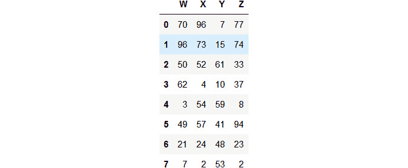

    图 3.9：DataFrame 的前八行

    就像`head`显示前几行一样，`tail`显示最后几行。

1.  使用`tail`命令打印 DataFrame，如下所示：

    ```py
    df.tail(10)
    ```

    样本输出（部分显示）如下：

    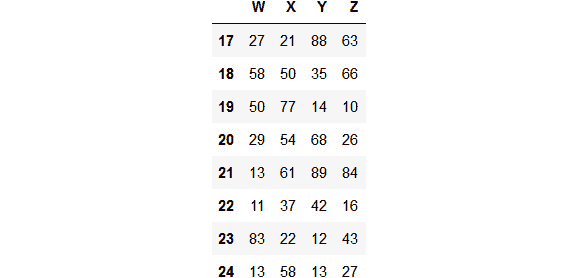

图 3.10：DataFrame 的最后几行

注意

要访问此特定部分的源代码，请参阅 [`packt.live/30UiXLB`](https://packt.live/30UiXLB)。

您也可以在 [`packt.live/2URYCTz`](https://packt.live/2URYCTz) 上在线运行此示例。

在本节中，我们学习了如何查看 DataFrame 的部分，而无需查看整个 DataFrame。在下一节中，我们将探讨两个功能：在 DataFrame 中索引和切片列。

## 索引和切片列

在 DataFrame 中索引和切片列有两种方法。它们如下：

+   `DOT` 方法

+   `括号` 方法

`df.column`。括号方法直观且易于理解。在此方法中，您可以通过列的通用名称/标题访问数据。

以下代码展示了这些概念。我们可以在我们的 Jupyter Notebook 中执行它们：

```py
print("\nThe 'X' column\n",'-'*25, sep='')
print(df['X'])
print("\nType of the column: ", type(df['X']), sep='')
print("\nThe 'X' and 'Z' columns indexed by passing a list\n",\
      '-'*55, sep='')
print(df[['X','Z']])
print("\nType of the pair of columns: ", \
      type(df[['X','Z']]), sep='')
```

输出如下（此处仅显示部分输出，因为实际列很长）：

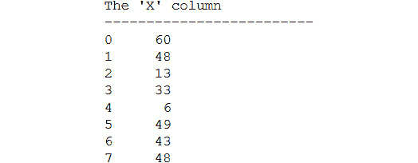

图 3.11：'X' 列的行

这是显示列类型的输出：


图 3.12：'X' 列的类型

这是显示通过传递列表索引 X 和 Z 列的输出：

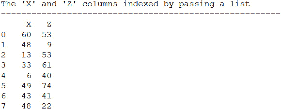

图 3.13：'Y' 列的行

这是显示列类型的输出：


图 3.14：'Y' 列的类型

注意

对于多个列，对象变为 DataFrame。但对于单个列，它是一个 `pandas` 系列对象。

到目前为止，我们已经看到了如何使用点方法和括号方法访问 DataFrame 的列。DataFrame 通常用于行/列数据。

现在，让我们看看如何索引和切片行。

## 行索引和切片

在 DataFrame 中索引和切片行也可以使用以下方法：

+   基于标签的 `loc` 方法

+   基于索引的 `iloc` 方法

`loc` 方法直观且易于理解。在此方法中，您可以通过行的通用名称访问数据。另一方面，`iloc` 方法允许您通过它们的数值索引访问行。这对于具有数千行的大型表格非常有用，尤其是在您想使用数值计数器在循环中遍历表格时。以下代码展示了 `iloc` 的概念：

```py
matrix_data = np.random.randint(1,10,size=20).reshape(5,4)
row_labels = ['A','B','C','D','E']
column_headings = ['W','X','Y','Z']
df = pd.DataFrame(data=matrix_data, index=row_labels, \
                  columns=column_headings)
print("\nLabel-based 'loc' method for selecting row(s)\n",\
      '-'*60, sep='')
print("\nSingle row\n")
print(df.loc['C'])
print("\nMultiple rows\n")
print(df.loc[['B','C']])
print("\nIndex position based 'iloc' method for selecting "\
      "row(s)\n", '-'*70, sep='')
print("\nSingle row\n")
print(df.iloc[2])
print("\nMultiple rows\n")
print(df.iloc[[1,2]])
```

样本输出如下：

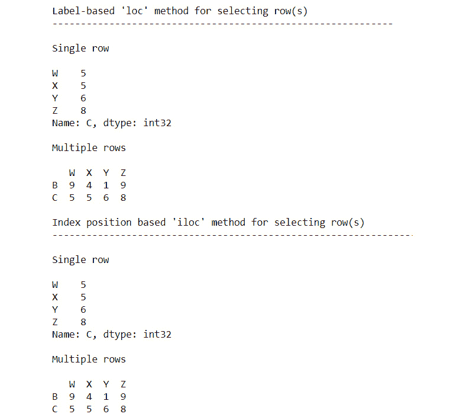

图 3.15：loc 和 iloc 方法的输出

数据整理中最常见的任务之一是从您的 DataFrame 中创建或删除数据列或行。有时，您可能希望根据某些涉及现有列的数学运算或转换来创建新列。这与操作数据库记录并在简单转换的基础上插入新列类似。我们将在接下来的练习中探讨这些概念。

## 练习 3.16：创建和删除新列或行

在这个练习中，我们将从 `stock.csv` 数据集中创建和删除新列或行。我们还将使用 `inplace` 函数来修改原始 DataFrame。

注意

`stock.csv` 文件可在此处找到：[`packt.live/3hxvPNP`](https://packt.live/3hxvPNP)。

让我们按以下步骤进行：

1.  导入必要的 Python 模块，加载 `stocks.csv` 文件，并使用以下代码片段创建新列：

    ```py
    import pandas as pd
    df = pd.read_csv("../datasets/stock.csv")
    df.head()
    print("\nA column is created by assigning it in relation\n",\
          '-'*75, sep='')
    df['New'] = df['Price']+df['Price']
    df['New (Sum of X and Z)'] = df['New']+df['Price']
    print(df)
    ```

    注意

    不要忘记根据您系统上文件的位置更改路径（突出显示）。

    样本输出（部分显示）如下：

    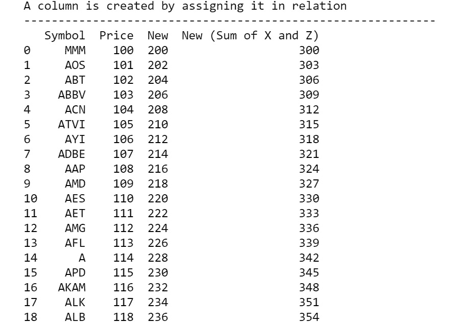

    图 3.16：DataFrame 的部分输出

1.  使用 `df.drop` 方法删除列：

    ```py
    print("\nA column is dropped by using df.drop() method\n",\
          '-'*55, sep='')
    df = df.drop('New', axis=1) # Notice the axis=1 option
    # axis = 0 is default, so one has to change it to 1
    print(df)
    ```

    样本输出（部分显示）如下：

    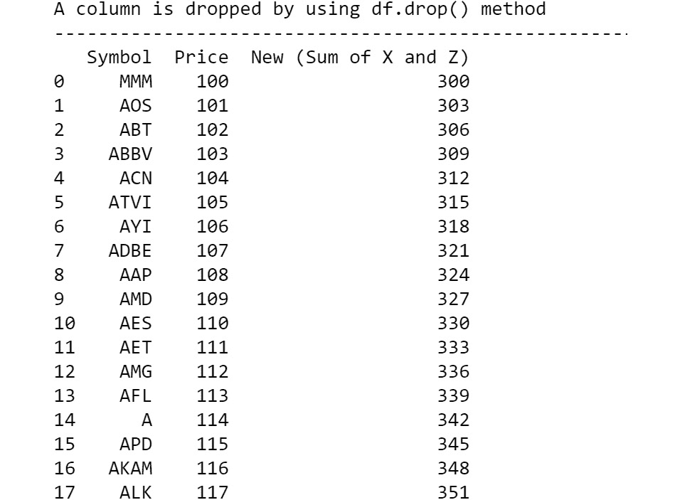

    图 3.17：DataFrame 的部分输出

1.  使用 `df.drop` 方法删除特定行：

    ```py
    df1=df.drop(1)
    print("\nA row is dropped by using df.drop method and axis=0\n",\
          '-'*65, sep='')
    print(df1)
    ```

    部分输出如下：

    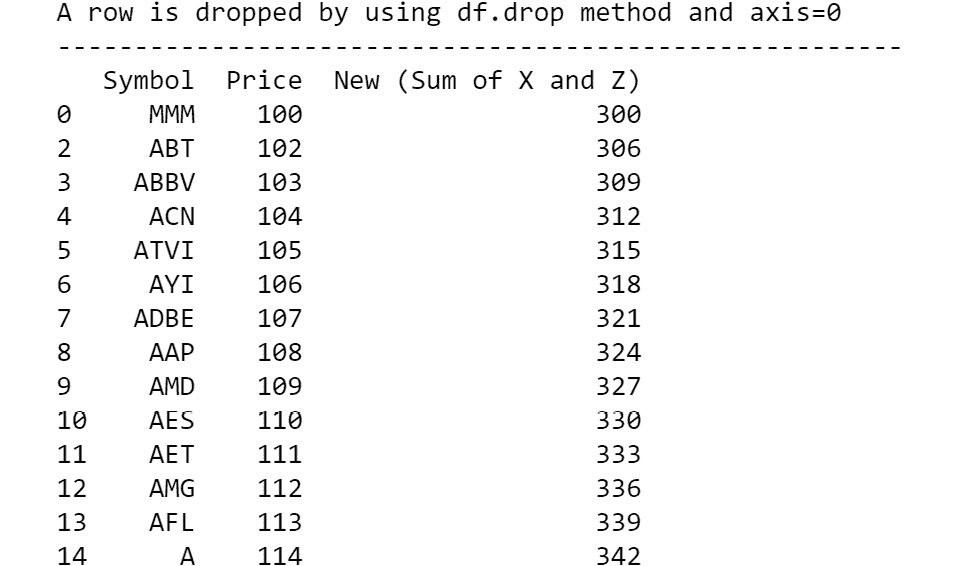

    图 3.18：DataFrame 的部分输出

    删除方法会创建 DataFrame 的副本，而不会更改原始 DataFrame。

1.  通过设置 `inplace` 参数为 `True` 来更改原始 DataFrame：

    ```py
    print("\nAn in-place change can be done by making ",\
          "inplace=True in the drop method\n",\
          '-'*75, sep='')
    df.drop('New (Sum of X and Z)', axis=1, inplace=True)
    print(df)
    ```

    样本输出如下：

    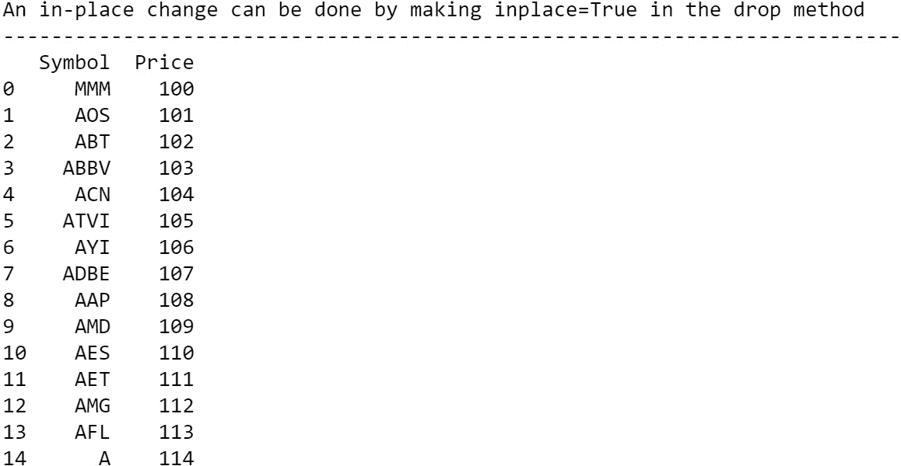

图 3.19：DataFrame 的部分输出

注意

要访问此特定部分的源代码，请参阅 [`packt.live/3frxthU`](https://packt.live/3frxthU)。

您也可以在此在线运行此示例 [`packt.live/2USxJyA`](https://packt.live/2USxJyA)。

我们现在已经学会了如何通过删除或添加行和列来修改 DataFrame。

注意

所有正常操作都不是就地进行的，也就是说，它们不会影响原始 DataFrame 对象，而是返回带有添加（或删除）的原始副本。前述代码的最后部分显示了如何使用 `inplace=True` 参数在现有 DataFrame 中进行更改。请注意，这种更改是不可逆的，应谨慎使用。

# 使用 NumPy 和 Pandas 进行统计和可视化

使用诸如 NumPy 和 pandas 等库的一个巨大优势是，我们可以获得大量的内置统计和可视化方法，我们不需要搜索和编写新代码。此外，这些子程序中的大多数都是使用 C 或 Fortran 代码（并预编译）编写的，这使得它们执行速度非常快。

## 基本描述性统计的复习

对于任何数据处理任务，提取基本描述性统计信息非常有用，这些信息应以均值、中位数和众数等方式描述数据，并创建一些简单的可视化或图表。这些图表通常是识别数据中的基本模式以及异常（如果有的话）的第一步。在任何统计分析中，描述性统计是第一步，随后是推断统计，它试图推断数据可能是由哪个潜在分布或过程生成的。你可以想象，描述性统计将告诉我们数据的基本特征，而推断统计将帮助我们理解我们正在处理的数据，以及我们可能正在实验的其他数据。

由于推断统计与数据科学管道的机器学习/预测建模阶段紧密相连，描述性统计自然与数据处理方面相关联。

描述性统计分析有两种主要方法：

+   **图形技术**：条形图、散点图、折线图、箱线图、直方图等

+   **计算集中趋势和离散程度**：平均值、中位数、众数、方差、标准差、极差等

在本节中，我们将展示如何使用 Python 完成这两项任务。除了 NumPy 和 pandas 之外，我们还需要学习另一个优秀的包的基础知识——`matplotlib`，这是 Python 中最强大和最通用的可视化库。

## 练习 3.17：通过散点图介绍 Matplotlib

在这个练习中，我们将通过创建关于几个人的年龄、体重和身高的自创数据来展示 matplotlib 的强大和简单性，创建一个简单的散点图。为此，让我们按照以下步骤进行：

1.  首先，我们将定义包含人名、年龄、体重（以千克为单位）和身高（以厘米为单位）的简单列表：

    ```py
    people = ['Ann','Brandon','Chen','David','Emily',\
              'Farook','Gagan','Hamish','Imran',\
              'Joseph','Katherine','Lily']
    age = [21,12,32,45,37,18,28,52,5,40,48,15]
    weight = [55,35,77,68,70,60,72,69,18,65,82,48]
    height = [160,135,170,165,173,168,175,159,105,\
              171,155,158]
    ```

1.  导入`matplotlib`中最重要的模块，称为`pyplot`：

    ```py
    import matplotlib.pyplot as plt
    ```

1.  创建简单的`年龄`与`体重`散点图：

    ```py
    plt.scatter(age,weight)
    plt.show()
    ```

    输出如下：

    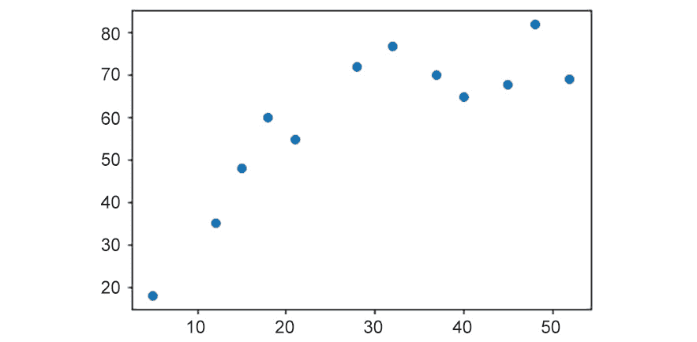

    图 3.20：包含年龄和体重的散点图的屏幕截图

    通过放大图形大小、自定义纵横比、添加适当字号的标题、添加自定义字号的 x 轴和 y 轴标签、添加网格线、将 y 轴限制在`0`到`100`之间、添加 x 和 y 刻度、自定义散点图的颜色以及改变散点的大小，可以改进前面的图表。

1.  改进图表的代码如下：

    ```py
    plt.figure(figsize=(8,6))
    plt.title("Plot of Age vs. Weight (in kgs)",\
              fontsize=20)
    plt.xlabel("Age (years)",fontsize=16)
    plt.ylabel("Weight (kgs)",fontsize=16)
    plt.grid (True)
    plt.ylim(0,100)
    plt.xticks([i*5 for i in range(12)],fontsize=15)
    plt.yticks(fontsize=15)
    plt.scatter(x=age,y=weight,c='orange',s=150,\
                edgecolors='k')
    plt.text(x=20,y=85,s="Weights after 18-20 years of age",\
             fontsize=15)
    plt.vlines(x=20,ymin=0,ymax=80,linestyles='dashed',\
               color=›blue›,lw=3)
    plt.legend([‹Weight in kgs›],loc=2,fontsize=12)
    plt.show()
    ```

    输出如下：

    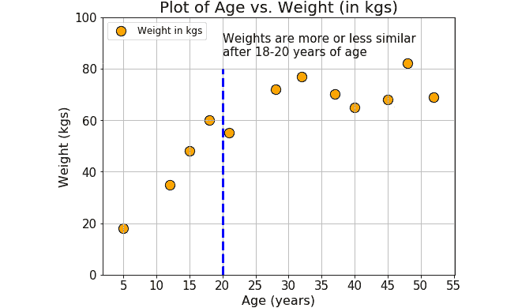

图 3.21：显示年龄与体重关系的散点图的屏幕截图

我们可以观察到以下事项：

+   将元组（`8,6`）作为图形大小的参数传递。

+   在`xticks`内部使用列表推导式来创建一个自定义的列表 5-10-15-…-55。

+   在`plt.text()`函数内部使用换行符（`\n`）来分割和将文本分布到两行。

+   在最后使用`plt.show()`函数。想法是持续添加各种图形属性（字体、颜色、轴限制、文本、图例、网格等），直到你满意，然后使用一个函数显示图表。如果没有这个最后的函数调用，图表将不会显示。

前面的图表相当直观。我们可以观察到，在 18-20 岁之后，体重的变化减少了。

注意

要访问此特定部分的源代码，请参阅[`packt.live/3hFzysK`](https://packt.live/3hFzysK)。

你也可以在[`packt.live/3eauxWP`](https://packt.live/3eauxWP)上在线运行此示例。

在这个练习中，我们学习了使用`matplotlib`这个流行的图表函数的基础。在下一节中，我们将探讨统计度量定义。

# 统计度量定义 – 中心趋势和离散程度

中心趋势度量是一个试图通过识别数据集中的中心位置来描述数据集的单个值。它们也被归类为汇总统计量：

+   **均值**: 均值是所有值的总和除以值的总数。

+   **中位数**: 中位数是中间的值。它是将数据集分成两半的值。要找到中位数，将你的数据从小到大排序，然后找到具有相等数量值在其上方和下方的数据点。

+   **模式**: 模式是你在数据集中出现频率最高的值。在柱状图中，模式对应的是最高的柱子。

通常，对于对称数据，均值是一个更好的度量标准，而对于具有偏斜（左重或右重）分布的数据，中位数是一个更好的度量标准。对于分类数据，你必须使用模式：

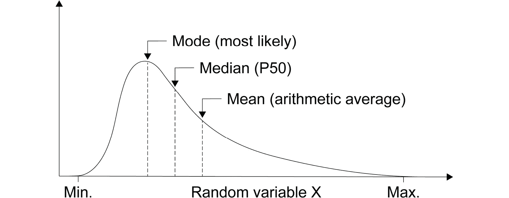

图 3.22：显示均值、中位数和模式的曲线截图

数据的离散程度是衡量数据集中的值可能偏离值均值的程度。如果所有值都紧密相邻，则离散程度低；另一方面，如果某些或所有值与均值（以及彼此）相差很大，则数据中存在较大的离散程度：

+   **方差**: 这是最常见的离散程度度量。方差是均值偏差平方的平均值。平方偏差确保正负偏差不会相互抵消。

+   **标准差**：由于方差是通过平方距离来计算的，其单位与原始数据不匹配。标准差是一种数学技巧，它恢复了平衡。它是方差的正平方根。

## 随机变量和概率分布

随机变量被定义为表示统计实验或过程结果的给定变量的值。

虽然听起来非常正式，但我们周围几乎所有可以测量的东西都可以被视为随机变量。

这种现象背后的原因是，几乎所有自然、社会、生物和物理过程都是大量复杂过程的最终结果，我们无法了解这些基本过程的细节。我们能做的只是观察和测量最终结果。

我们周围典型的随机变量例子如下：

+   一个国家的经济产出

+   患者的血压

+   工厂中化学过程的温度

+   一个人在 Facebook 上的朋友数量

+   公司的股票市场价格

这些值可以取任何离散或连续值，并遵循特定的模式（尽管这种模式可能随时间变化）。因此，它们都可以被归类为随机变量。

## 什么是概率分布？

概率分布是一个数学函数，它告诉你随机变量取每个不同可能值的可能性。换句话说，概率分布给出了给定情况下不同可能结果的概率。

假设你去了学校，并测量了随机选择的学生身高。在这里，身高是一个随机变量的例子。当你测量身高时，你可以创建一个身高分布。这种类型的分布在你需要知道哪些结果最有可能发生（即，哪些身高最常见），潜在值的范围以及不同结果的概率时非常有用。

中心趋势和离散的概念适用于分布，并用于描述分布的性质和行为。

统计学家通常将所有分布分为两大类：

+   离散分布

+   连续分布

## 离散分布

离散概率函数，也称为概率质量函数，可以假设离散的数值。例如，抛硬币和事件计数是离散函数。在抛硬币中，你只能有正面或反面。同样，如果你每小时计算到达车站的火车数量，你可以计算 11 或 12 辆火车，但中间没有。

一些显著的离散分布如下：

+   二项分布用于模拟二元数据，例如抛硬币

+   泊松分布用于模拟计数数据，例如每小时图书馆图书借阅次数

+   均匀分布用于模拟具有相同概率的多个事件，例如掷骰子

## 连续分布

连续概率函数也称为概率密度函数。如果你有一个连续分布，那么变量可以在任意两个值之间假设无限多个值。连续变量通常是实数尺度上的测量，例如身高、体重和温度。

最著名的连续分布是正态分布，也称为高斯分布或钟形曲线。这种对称分布适用于各种现象，例如人类身高和智商分数。

正态分布与著名的 `68%-95%-99.7%` 边界相关联。这一规则在工业、医学、经济学和社会科学中得到广泛应用：

![Figure 3.23: Curve showing the normal distribution of the famous 68-95-99.7 rule

![img/B15780_03_23.jpg]

图 3.23：显示著名 68-95-99.7 规则的正态分布曲线

# 统计和可视化中的数据处理

一个优秀的数据处理专业人员每天都会遇到令人眼花缭乱的各类数据源。正如我们之前解释的，由于众多复杂的子过程和相互作用的产生，这些数据都属于离散或连续随机变量的范畴。

如果所有这些数据继续被当作完全没有形状或模式的完全随机数据来处理，那么对于数据处理员或数据科学团队来说，这将极其困难且令人困惑。必须为这些随机数据流提供一个正式的统计基础，而开始这一过程的最简单方法之一就是测量它们的描述性统计。

将数据流分配给特定的分布函数（或许多分布的组合）实际上是推断统计的一部分。然而，推断统计只有在描述性统计与测量数据模式的所有重要参数同时进行时才开始。

因此，作为数据科学流程的前线，数据处理的过程必须处理测量和量化 incoming data 的描述性统计。除了格式化和清理后的数据，数据处理员的主要工作是将这些度量（有时还有相应的图表）交给分析团队的下一成员。

绘图和可视化也有助于数据处理团队识别 incoming data stream 中的潜在异常值和不符合的数据，并帮助他们采取适当的行动。我们将在下一章中看到一些此类任务的示例，其中我们将通过创建散点图或直方图来识别异常数据点，并对其进行插值或删除。

## 使用 NumPy 和 Pandas 计算基本描述性统计

现在我们已经对 `NumPy`、`pandas` 和 `matplotlib` 有了一些基本知识，我们可以探索一些与这些库相关的话题，例如如何将它们结合起来进行高级数据生成、分析和可视化。

## 使用 NumPy 生成随机数

`NumPy` 提供了一系列令人眼花缭乱的随机数生成实用函数，所有这些函数都对应于各种统计分布，如均匀分布、二项分布、高斯正态分布、Beta/Gamma 和卡方分布。这些函数中的大多数都非常有用，在高级统计数据挖掘和机器学习任务中出现了无数遍。强烈建议所有阅读这本书的人都对这些概念有一个扎实的理解。

在这里，我们将讨论三个在数据整理任务中可能很有用的最重要分布——**均匀分布**、**二项分布**和**高斯正态分布**。这里的目的是展示简单的函数调用示例，这些函数可以在用户需要时生成一个或多个随机数/数组。

**均匀分布**是一种与等可能发生的事件相关的概率分布。让我们通过以下练习来练习使用随机数进行均匀分布。

## 练习 3.18：从均匀分布生成随机数

在这个练习中，我们将从 1-10 的均匀分布中生成随机数。接下来，我们将使用 `NumPy` 库的 `random` 函数生成一些用于定制用例的人工数据。让我们按照以下步骤进行：

注意

由于我们将使用随机数，每次运行的结果都会不同。

1.  导入 `NumPy` 库：

    ```py
    import numpy as np
    ```

1.  生成一个介于 `1` 和 `10` 之间的随机整数：

    ```py
    x = np.random.randint(1,10)
    print(x)
    ```

    样本输出如下（您的输出可能会有所不同）：

    ```py
    1
    ```

1.  生成一个介于 `1` 和 `10` 之间的随机整数，但以 `size=1` 作为参数。这将生成一个大小为 `1` 的 `NumPy` 数组：

    ```py
    x = np.random.randint(1,10,size=1)
    print(x)
    ```

    样本输出如下（由于是随机抽取，您的输出可能会有所不同）：

    ```py
    [8]
    ```

    因此，我们可以轻松编写代码来生成掷骰子（一个普通的六面骰子）的 `10` 次试验的结果。

    那么我们是否可以摆脱整数，生成一些实数呢？比如说，我们想要生成 `20` 个成年人的体重（以千克为单位）的人工数据，并且我们可以精确测量到小数点后两位。

1.  使用以下命令生成十进制数据：

    ```py
    x = 50+50*np.random.random(size=15)
    x = x.round(decimals=2)
    print(x)
    ```

    样本输出如下：

    ```py
    [56.24 94.67 50.66 94.36 77.37 53.81 61.47 71.13 59.3 65.3 63.02 65.
     58.21 81.21 91.62]
    ```

    我们不仅限于使用一维数组。在下一步中，我们将使用多维数组。

1.  生成并显示一个 `3x3` 的随机数矩阵，数值介于 `0` 和 `1` 之间：

    ```py
    x = np.random.rand(3,3)
    print(x)
    ```

    样本输出如下（请注意，由于随机性，您的具体输出可能会有所不同）：

    ```py
    [[0.99240105 0.9149215  0.04853315]
     [0.8425871  0.11617792 0.77983995]
     [0.82769081 0.57579771 0.11358125]]
    ```

    注意

    要访问此特定部分的源代码，请参阅[`packt.live/2YIycEL`](https://packt.live/2YIycEL)。

    您也可以在[`packt.live/2YHqkDA`](https://packt.live/2YHqkDA)上在线运行此示例。

通过这个练习，我们有了如何创建随机数的基本概念，特别是基于概率的随机试验。

二项分布是在特定次数的试验中，事件以预定的概率或概率出现特定次数的概率分布。

最明显的例子是抛硬币。一枚公平的硬币正面和反面的概率可能相等，但一枚不公平的硬币可能更有可能出现正面或反面。我们可以使用`NumPy`库来模拟抛硬币。我们将在下一个练习中探讨这一点。

## 练习 3.19：从二项分布生成随机数和条形图

在这个练习中，我们将从二项分布生成随机数，并根据生成的 DataFrame 创建条形图。让我们考虑一个场景。假设我们有一枚偏心的硬币，其正面的概率为`0.6`。我们抛这枚硬币 10 次，并记录每次出现的正面次数。这就是一次试验或实验。现在，我们可以重复这个实验（10 次抛硬币）任意多次，比如 8 次。每次，我们记录正面次数。让我们使用`NumPy`库看看这是如何工作的：

1.  导入`NumPy`库：

    ```py
    import numpy as np
    ```

1.  让我们从二项分布生成随机数。这个实验可以通过以下代码来模拟：

    ```py
    x = np.random.binomial(10,0.6,size=8)
    print(x)
    ```

    样本输出如下（由于随机性，您的具体输出将不同）：

    ```py
    [6 6 5 6 5 8 4 5]
    ```

1.  使用条形图绘制结果：

    ```py
    import matplotlib.pyplot as plt
    plt.figure(figsize=(7,4))
    plt.title("Number of successes in coin toss",\
              fontsize=16)
    plt.bar(np.arange(1,9),height=x)
    plt.xlabel("Experiment number",fontsize=15)
    plt.ylabel("Number of successes",fontsize=15)
    plt.show()
    ```

    样本输出如下：

    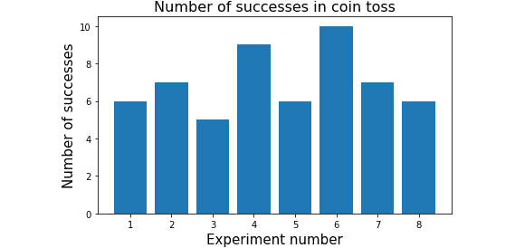

图 3.24：显示二项分布和条形图的图形截图

注意

由于涉及随机性，上述图表的结果可能会有所不同。

要访问此特定部分的源代码，请参阅[`packt.live/3hB2aTQ`](https://packt.live/3hB2aTQ)。

您也可以在[`packt.live/2N6jbaq`](https://packt.live/2N6jbaq)上在线运行此示例。

如我们从前面的图表中可以观察到的，条形图表示每次抽取中出现的成功次数或正面次数。我们之前在本章中讨论了正态分布，并提到它是最重要的概率分布，因为当样本数量大时，许多自然、社会和生物数据都紧密遵循这种模式。`NumPy`为我们提供了一个简单的方法来生成与这种分布相对应的随机数。

## 练习 3.20：从正态分布生成随机数和直方图

本练习将演示如何使用正态分布和直方图生成一些随机数。我们尚未查看使用 matplotlib 创建图表和创建双正态分布。在数据整理中，创建图表有时可以是一项有用的技能，尤其是在处理机器学习时。为此，让我们按照以下步骤进行：

1.  导入`NumPy`库：

    ```py
    import numpy as np
    ```

1.  使用以下命令从一个正态分布中抽取单个样本：

    ```py
    x = np.random.normal()
    print(x)
    ```

    样本输出如下（请注意，由于随机性，您的具体输出可能不同）：

    ```py
    -1.2423774071573694
    ```

    我们知道正态分布由两个参数定义——均值（µ）和标准差（σ）。实际上，此特定函数的默认值是µ = 0.0 和σ = 1.0。

    假设我们知道某所学校 12-16 岁青少年学生的身高呈正态分布，平均身高为 155 厘米，标准差为 10 厘米。

1.  使用以下命令生成 100 名学生的直方图：

    ```py
    import matplotlib.pyplot as plt
    # Code to generate the 100 samples (heights)
    heights = np.random.normal(loc=155,scale=10,size=100)
    # Plotting code
    #-----------------------
    plt.figure(figsize=(7,5))
    plt.hist(heights,color='orange',edgecolor='k')
    plt.title("Histogram of teenaged students' height",\
              fontsize=18)
    plt.xlabel("Height in cm",fontsize=15)
    plt.xticks(fontsize=15)
    plt.yticks(fontsize=15)
    plt.show()
    ```

    样本输出如下：

    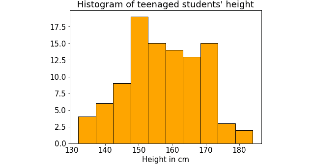

图 3.25：青少年学生身高的直方图

注意使用 loc 参数表示均值（`=155`）和 scale 参数表示标准差（`=10`）。该样本的生成中`size`参数设置为 100。

注意

要访问此特定部分的源代码，请参阅[`packt.live/2YHIODP`](https://packt.live/2YHIODP)。

您也可以在[`packt.live/3hvJrsR`](https://packt.live/3hvJrsR)上在线运行此示例。

## 练习 3.21：从 DataFrame 计算描述性统计

在这个练习中，我们将计算生成的 DataFrame 的基本统计量。DataFrame 和统计通常一起使用，并将是一个有用的工具来获取。我们将定义年龄、体重和身高参数，并将这些数据放入 DataFrame 中，通过使用`describe`方法计算它们的各种描述性统计。让我们执行以下步骤：

注意

与`pandas` DataFrame 一起工作的最佳部分是它有一个内置的实用函数，可以单行代码显示所有这些描述性统计。

1.  使用以下命令通过可用序列数据构建字典：

    ```py
    import numpy as np
    import pandas as pd
    people = ['Ann','Brandon','Chen',\
              'David','Emily','Farook',\
              'Gagan','Hamish','Imran',\
              'Joseph','Katherine','Lily']
    age = [21,12,32,45,37,18,28,52,5,40,48,15]
    weight = [55,35,77,68,70,60,72,69,18,65,82,48]
    height = [160,135,170,165,173,168,175,159,105,171,155,158]
    people_dict={'People':people,'Age':age,\
                 'Weight':weight,'Height':height}
    people_df=pd.DataFrame(data=people_dict)
    people_df
    ```

    输出如下：

    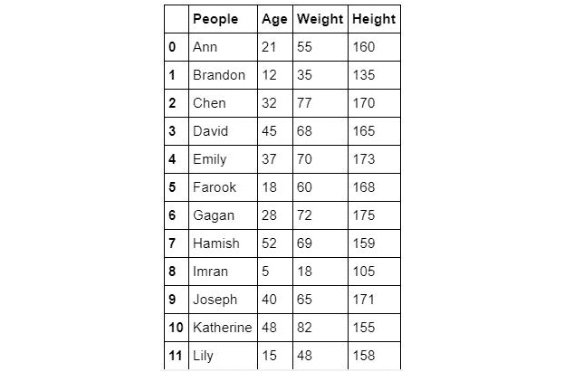

    图 3.26：创建的字典输出

1.  通过执行以下命令找到 DataFrame 的行数和列数：

    ```py
    print(people_df.shape)
    ```

    输出如下：

    ```py
    (12, 4)
    ```

1.  通过执行以下命令获取简单的计数（任何列都可以用于此目的）：

    ```py
    print(people_df['Age'].count())
    ```

    输出如下：

    ```py
    12
    ```

1.  使用以下命令计算年龄的总和：

    ```py
    print(people_df['Age'].sum())
    ```

    输出如下：

    ```py
    353
    ```

1.  使用以下命令计算平均年龄：

    ```py
    print(people_df['Age'].mean())
    ```

    输出如下：

    ```py
    29.416666666666668
    ```

1.  使用以下命令计算中位数体重：

    ```py
    print(people_df['Weight'].median())
    ```

    输出如下：

    ```py
    66.5
    ```

1.  使用以下命令计算最大身高：

    ```py
    print(people_df['Height'].max())
    ```

    输出如下：

    ```py
    175
    ```

1.  使用以下命令计算体重的标准差：

    ```py
    print(people_df['Weight'].std())
    ```

    输出如下：

    ```py
    18.45120510148239
    ```

    注意我们是如何直接从 DataFrame 对象调用统计函数的。

1.  要计算百分位数，我们可以从 `NumPy` 调用一个函数，并将特定的列（一个 `pandas` 序列）传递给它。例如，要计算年龄分布的 75 分位数和 25 分位数及其差（称为四分位距），请使用以下代码：

    ```py
    pcnt_75 = np.percentile(people_df['Age'],75)
    pcnt_25 = np.percentile(people_df['Age'],25)
    print("Inter-quartile range: ",pcnt_75-pcnt_25)
    ```

    输出如下：

    ```py
    Inter-quartile range:  24.0
    ```

1.  使用 `describe` 命令来查找 DataFrame 的详细描述：

    ```py
    print(people_df.describe())
    ```

    输出如下：

    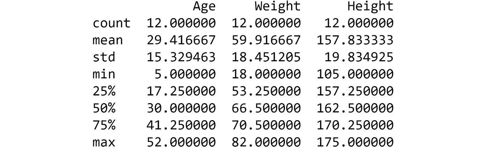

图 3.27：使用 describe 方法生成的 DataFrame 输出

我们现在已经看到了如何操作 DataFrame，它们是数据整理的基础。

注意

此函数仅适用于存在数值数据的列。它对非数值列没有影响，例如，此 DataFrame 中的人员。

要访问此特定部分的源代码，请参阅 [`packt.live/30S3agm`](https://packt.live/30S3agm)。

你也可以在 [`packt.live/2YHBFDF`](https://packt.live/2YHBFDF) 上运行此示例。

## 练习 3.22：内置绘图工具

在这个练习中，我们将学习 `matplotlib` 库中的基本内置绘图工具，并使用 DataFrame 中的数值数据创建有用的图表。我们将使用在 *练习 3.21*，*从 DataFrame 计算描述性统计* 中引用的 `people` DataFrame，并生成图表来直观地表示数据。为此，让我们按照以下步骤进行：

1.  导入必要的库：

    ```py
    import matplotlib.pyplot as plt
    import pandas as pd
    ```

1.  创建 `people` DataFrame：

    ```py
    people = ['Ann','Brandon','Chen',\
              'David','Emily','Farook',\
              'Gagan','Hamish','Imran',\
              'Joseph','Katherine','Lily']
    age = [21,12,32,45,37,18,28,52,5,40,48,15]
    weight = [55,35,77,68,70,60,72,69,18,65,82,48]
    height = [160,135,170,165,173,168,175,159,105,\
              171,155,158]
    people_dict={'People':people,'Age':age,\
                 'Weight':weight,'Height':height}
    people_df=pd.DataFrame(data=people_dict)
    ```

1.  通过使用 `hist` 函数来查找权重的直方图：

    ```py
    people_df['Weight'].hist()
    plt.show()
    ```

    输出如下：

    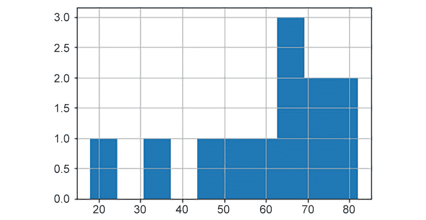

    图 3.28：体重的直方图

    从前面的直方图中，我们可以确定比其他任何组都有更多的人体重为 65 公斤。如果这不是由随机数生成的，那么这可能会是一个有用的观察。

1.  使用以下命令直接从 DataFrame 创建简单的散点图，以绘制 `weight` 和 `height` 之间的关系：

    ```py
    people_df.plot.scatter('Weight','Height',s=150,\
                           c='orange',edgecolor='k')
    plt.grid(True)
    plt.title("Weight vs. Height scatter plot",fontsize=18)
    plt.xlabel("Weight (in kg)",fontsize=15)
    plt.ylabel("Height (in cm)",fontsize=15)
    plt.show()
    ```

    输出如下：

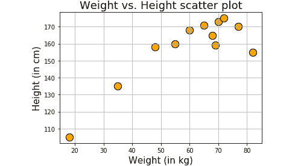

图 3.29：体重与身高的散点图

从前面的图中，我们可以推断出身高在 160-180 厘米范围内的人的体重在 60-80 公斤范围内。在数据整理的几个步骤之前和之后以各种图表形式绘制数据可以是一个强大的工具。在数据整理的几个步骤之前和之后以各种图表形式绘制数据并不罕见。

注意

你可以尝试在这个函数调用周围使用常规的 `matplotlib` 方法来使你的图表更美观。

在掌握了所有这些知识之后，让我们尝试一个活动。

## 活动三.01：从 CSV 文件生成统计数据

假设您正在处理波士顿住房价格数据集。这个数据集在机器学习社区中非常著名。可以针对这个数据集制定许多回归问题，并在此数据集上运行机器学习算法。您将通过将数据作为 `pandas` DataFrame 读取来执行基本的数据整理活动（包括绘制一些趋势），并对该 DataFrame 执行一些统计操作。

注意

波士顿住房数据集可以在以下链接找到：[`packt.live/2ZPdvc2`](https://packt.live/2ZPdvc2)。读取 CSV 文件的 `pandas` 函数是 `read_csv`。

这些步骤将帮助您完成此活动：

1.  加载必要的库。

1.  从本地目录读取波士顿住房数据集（以 `.csv` 文件给出）。

1.  检查前 `10` 条记录。找出记录总数。

1.  创建一个较小的 DataFrame，其中不包含 `CHAS`、`NOX`、`B` 和 `LSTAT` 列：

    `Chas`：查尔斯河虚拟变量

    `Nox`：一氧化氮浓度

    `B`：非洲裔美国人口比例

    `LSTAT`：低收入人口百分比

1.  检查您刚刚创建的新 DataFrame 的最后七条记录。

1.  绘制新 DataFrame 中所有变量（列）的直方图。

1.  使用 for 循环一次性绘制所有这些图表。尝试为图表添加一个独特的标题。

1.  绘制犯罪率与价格之间的散点图。

1.  绘制 `log10(crime)` 与 `price` 的关系图。

1.  计算一些有用的统计数据，例如每套住宅的平均房间数、中位数年龄、平均距离五个波士顿就业中心以及低价房屋（`< $20,000`）的百分比。

    使用 `$20,000`，创建一个包含 `PRICE` 列的 `pandas` 系列，并将其直接与 `20` 进行比较。您可以这样做，因为 `pandas` 系列基本上是一个 `NumPy` 数组，您已经在本章的练习中看到了如何过滤 `NumPy` 数组。

输出应如下所示：

每套住宅的平均房间数：`6.284634387351788`

中位数年龄：`77.5`

到五个波士顿就业中心的平均距离：`3.795042687747034`

低价房屋（`< $20,000`）的房屋百分比：`41.50197628458498`

注意

此活动的解决方案可以通过此链接找到。

# 摘要

在本章中，我们首先介绍了 `NumPy` 数组的基础知识，包括如何创建它们及其基本属性。我们讨论并展示了 `NumPy` 数组是如何针对向量化元素级操作进行优化的，以及它与常规 Python 列的不同之处。然后，我们继续练习在 `NumPy` 数组上执行各种操作，如索引、切片、过滤和重塑。我们还涵盖了特殊的一维和二维数组，例如零数组、单位数组、身份矩阵和随机数组。

在本章的第二大主题中，我们首先介绍了 `pandas` 系列对象，并迅速过渡到一个至关重要的对象——`pandas` 数据框。它们类似于 Excel 或 Matlab 或数据库表，但具有许多用于数据整理的有用属性。我们演示了数据框的一些基本操作，例如索引、子集、行和列的添加和删除。

接下来，我们介绍了使用 `matplotlib` 的绘图基础，这是最广泛使用且最受欢迎的 Python 可视化库。除了绘图练习，我们还回顾了描述性统计（如集中趋势和离散程度度量）和概率分布（如均匀分布、二项分布和正态分布）等概念。

在下一章中，我们将介绍更多高级操作，这些操作可用于 `pandas` 数据框，这对于你成为数据整理专家的旅程将非常有用。
