# 7. 高级网络爬虫和数据收集

概述

本章将向您介绍高级网络爬虫和数据收集的概念。它将使您能够使用`requests`和`BeautifulSoup`读取各种网页并从中收集数据。您可以使用**应用程序编程接口**（**API**）对 XML 文件和网页执行读取操作。您可以使用正则表达式技术从大量杂乱无章的文本语料库中抓取有用信息。到本章结束时，您将学会如何从网页、XML 文件和 API 中收集数据。

# 简介

上一章介绍了如何创建一个成功的数据整理管道。在本章中，我们将构建一个网络爬虫，数据整理专业人士可以使用我们迄今为止学到的所有技术在其日常任务中使用。本章建立在`BeautifulSoup`的基础上，并介绍了各种抓取网页和使用 API 收集数据的方法。

在当今互联的世界中，对于数据整理专业人士来说，最宝贵和最广泛使用的技能之一是能够从托管在网上的网页和数据库中提取和读取数据。大多数组织将数据托管在云端（公共或私有），而如今的大多数网络微服务都为外部用户提供某种 API 来访问数据。让我们看一下以下图表：


图 7.1：数据整理 HTTP 请求和 XML/JSON 响应

如图中所示，要从网络服务器或数据库获取数据，我们需要发起`XML/JSON`请求。作为一名数据整理工程师，了解网页结构和 Python 库的结构是必要的，这样您才能从网页中提取数据。**万维网**（**WWW**）是一个不断增长、不断变化的宇宙，其中使用了不同的数据交换协议和格式。其中一些被广泛使用，并已成为标准。

Python 自带内置模块，例如`urllib 3`，可以发起 HTTP 请求并从云端接收数据。然而，这些模块在低级别操作，需要深入了解 HTTP 协议、编码和请求。

# Requests 和 BeautifulSoup 库

本章我们将利用两个 Python 库：`requests`和`BeautifulSoup`。为了避免在较低级别处理 HTTP 方法，我们将使用`requests`库。它是一个基于纯 Python 网络实用库的 API，这使得发起 HTTP 请求变得简单直观。

`BeautifulSoup`是最受欢迎的 HTML 解析包之一。它解析您传递的 HTML 内容，并在页面上构建一个详细的标签和标记树，以便于直观地遍历。程序员可以使用这个树来查找特定的标记元素（例如，一个表格、一个超链接或特定`div` ID 内的文本块）以抓取有用的数据。

我们将进行几个练习，以展示如何使用 `requests` 库并解码从服务器获取数据时收到的响应内容。

## 练习 7.01：使用 Requests 库从维基百科首页获取响应

在这个练习中，我们将使用 `requests` 库从维基百科网页中提取数据。维基百科首页由许多元素和脚本组成，它们是 HTML、CSS 和 JavaScript 代码块的混合。当从维基百科首页（[`en.wikipedia.org/wiki/Main_Page`](https://en.wikipedia.org/wiki/Main_Page)）读取时，代码或标记元素/文本可能不太有用。因此，我们将剥离 HTML/CSS/JavaScript 层，以获取我们感兴趣的信息。让我们按照以下步骤进行：

1.  打开一个新的 Jupyter Notebook 并导入 `requests` 库：

    ```py
    import requests
    ```

1.  将首页 URL 分配给变量 `wiki_home`：

    ```py
    wiki_home = "https://en.wikipedia.org/wiki/Main_Page"
    ```

1.  使用 `requests` 库的 `get` 方法从该页面获取响应：

    ```py
    response = requests.get(wiki_home)
    response
    ```

    输出如下：

    ```py
    <Response [200]>
    ```

1.  要了解更多关于 `response` 对象的信息，请输入以下代码：

    ```py
    type(response)
    ```

    输出如下：

    ```py
    requests.models.Response
    ```

如我们所见，输出是一个对象，它模拟了 HTTP 响应的数据结构。它在 `requests` 库中定义。

网络是一个极其动态的地方。例如，当有人使用您的代码时，维基百科的首页可能已经改变，或者特定的 Web 服务器可能没有运行，您的请求将失败。如果您在未检查请求状态的情况下继续编写更复杂和详尽的代码，那么所有后续的工作都将徒劳无功。

一个网页请求通常会返回各种数字代码。它们是标准的 HTTP 响应代码。以下表格显示了您可能遇到的常见代码：


图 7.2：HTTP 响应代码

注意

要访问此特定部分的源代码，请参阅 [`packt.live/3d7qmK0.`](https://packt.live/3d7qmK0%20)

您也可以在此在线运行此示例：[`packt.live/3hEKbff`](https://packt.live/3hEKbff)。

在下一个练习中，我们将编写一个函数来检查返回代码，并根据需要打印出消息。这类小型辅助/实用函数对于复杂项目非常有用。

## 练习 7.02：检查 Web 请求状态

在这个练习中，我们将编写一个名为 `status_check` 的小型实用函数，用于检查从服务器收到的响应状态。我们的目标是编写一个函数来检查状态代码，并通过标记错误/无错误情况。我们将首先养成编写小型函数来完成小型模块化任务的习惯，而不是编写长脚本，因为长脚本难以调试和跟踪。让我们按照以下步骤进行：

1.  打开一个新的 Jupyter 笔记本并创建一个 `status_check` 函数，如下所示：

    ```py
    def status_check(r):
        if r.status_code==200:
            print("Success!")
            return 1
        else:
            print("Failed!")
            return -1
    ```

    注意，除了打印适当的消息外，我们从这个函数返回`1`或`-1`。这很重要，因为在利用此函数的代码中，我们将能够检查这个返回值以确定请求是否成功或失败。

1.  导入`requests`库：

    ```py
    import requests
    ```

1.  将主页 URL 分配给变量`wiki_home`：

    ```py
    wiki_home = "https://en.wikipedia.org/wiki/Main_Page"
    ```

1.  使用`requests`库的`get`方法从这个页面获取响应：

    ```py
    response = requests.get(wiki_home)
    ```

1.  将响应对象传递给`status_check`函数以检查响应的状态：

    ```py
    status_check(response)
    ```

    输出如下：

    ```py
    Success!
    1
    ```

    注意

    要访问此特定部分的源代码，请参阅[`packt.live/3hHcf1k.`](https://packt.live/3hHcf1k%20)。

    你也可以在这个网址上在线运行此示例：[`packt.live/3hDUhNp`](https://packt.live/3hDUhNp)。

在本章中，对于更复杂的编程活动，我们只有在获得`status_check`函数的返回值为`1`时才会继续进行，也就是说，我们将编写一个条件语句来检查返回值，然后根据它执行后续代码。

## 检查网页编码

我们也可以编写一个实用函数来检查网页的编码。任何 HTML 文档都可以使用各种编码，尽管最流行的是`UTF-8`。一些最流行的编码包括`ASCII`、`Unicode`和`UTF-8`。`ASCII`是最简单的，但它无法捕捉到全球各种口语和书面语言中使用的复杂符号，因此`UTF-8`已经成为当今网络开发的几乎通用标准。

当我们在维基百科主页上运行此函数时，我们会得到该页使用的特定编码类型。这个函数，就像之前的那个函数一样，接受一个`response`对象作为参数，并返回一个值：

```py
def encoding_check(r):
    return (r.encoding)
```

检查响应：

```py
response = requests.get("https://en.wikipedia.org/wiki/Main_Page")
encoding_check(response)
```

输出如下：

```py
'UTF-8'
```

这里，`'UTF-8'`表示目前数字媒体和互联网上使用的最流行的字符编码方案。它采用`1-4`字节的可变长度编码，从而表示世界各种语言的 Unicode 字符。

## 练习 7.03：解码响应内容并检查其长度

在这个练习中，我们将创建一个函数来获取维基百科页面的内容作为一个文本块或 Python 可以后续处理的字符串对象。我们首先发起一个请求以获取维基百科页面的内容，并将数据存储在`response`对象中。然后我们将解码这个`response`对象。为此，请按照以下步骤操作：

1.  打开一个新的 Jupyter Notebook 并导入`requests`库：

    ```py
    import requests
    ```

1.  将主页 URL 分配给变量`wiki_home`：

    ```py
    wiki_home = "https://en.wikipedia.org/wiki/Main_Page"
    ```

1.  使用`requests`库的`get`方法从这个页面获取响应：

    ```py
    response = requests.get(wiki_home)
    ```

1.  编写一个实用函数来解码响应的内容：

    ```py
    def encoding_check(r):
        return (r.encoding)
    def decode_content(r,encoding):
        return (r.content.decode(encoding))
    contents = decode_content(response,encoding_check(response))
    ```

1.  检查解码对象的类型，以查看我们最终得到的数据类型：

    ```py
    type(contents)
    ```

    输出如下：

    ```py
    str
    ```

    我们最终通过读取 HTML 页面得到了一个字符串对象。

1.  使用 `len` 函数检查对象的长度：

    ```py
    len(contents)
    ```

    输出如下：

    ```py
    74182
    ```

    注意

    此输出是可变的，并且会根据维基百科网页的更新而变化。

1.  使用以下代码打印此字符串的前 `10,000` 个字符。它看起来类似于以下内容：

    ```py
    contents[:10000]
    ```

    输出如下：

    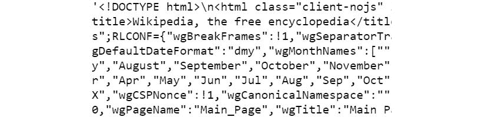

图 7.3：部分输出显示包含 HTML 标记标签、文本和元素名称及属性的混合块

显然，这是一个包含各种 HTML 标记标签、文本和元素名称/属性的混合块。我们无法期望从中提取出有意义的信息，用于高效分析，而不使用复杂的功能或方法。

注意

要访问此特定部分的源代码，请参阅 [`packt.live/2BfmUQq.`](https://packt.live/2BfmUQq%20)

你也可以在 [`packt.live/2UW2L8L`](https://packt.live/2UW2L8L) 上运行此示例。

幸运的是，`BeautifulSoup` 库或 `bs4` 库提供了这样的方法，我们将在接下来的练习中看到如何使用它们。

## 练习 7.04：从 BeautifulSoup 对象中提取可读文本

在这个练习中，我们将创建一个实用函数 `decode_content`，用于解码向维基百科网页发起请求后收到的响应。我们将使用 `BeautifulSoup` 库对 `response` 对象进行进一步处理，使其更容易从中提取任何有意义的信息。`BeautifulSoup` 有一个 `text` 方法，可以用来提取文本。让我们按照以下步骤进行：

1.  打开一个新的 Jupyter Notebook 并导入 `requests` 库：

    ```py
    import requests
    ```

1.  将主页 URL 分配给变量 `wiki_home`：

    ```py
    wiki_home = "https://en.wikipedia.org/wiki/Main_Page"
    ```

1.  使用 `requests` 库的 `get` 方法从该页面获取响应：

    ```py
    response = requests.get(wiki_home)
    ```

1.  编写一个实用函数以解码响应的内容：

    ```py
    def encoding_check(r):
        return (r.encoding)
    def decode_content(r,encoding):
        return (r.content.decode(encoding))
    contents = decode_content(response,encoding_check(response))
    ```

1.  导入包，然后将整个字符串（HTML 内容）传递给解析方法：

    ```py
    from bs4 import BeautifulSoup
    soup = BeautifulSoup(contents, 'html.parser')
    ```

1.  在你的笔记本中执行以下代码：

    ```py
    txt_dump=soup.text
    ```

1.  查找 `txt_dmp` 的类型：

    ```py
    type(txt_dump)
    ```

    输出如下：

    ```py
    str
    ```

1.  查找 `txt_dmp` 的长度：

    ```py
    len(txt_dump)
    ```

    输出如下：

    ```py
    15326
    ```

    注意

    此输出是可变的，并且会根据维基百科网页的更新而变化。

    现在，文本转储的长度比原始 HTML 字符串的长度小得多。这是因为 `bs4` 库已经解析了 HTML 并提取了仅用于进一步处理的可读文本。

1.  打印此文本的初始部分：

    ```py
    print(txt_dump[10000:11000])
    ```

    你将看到类似以下的内容：

    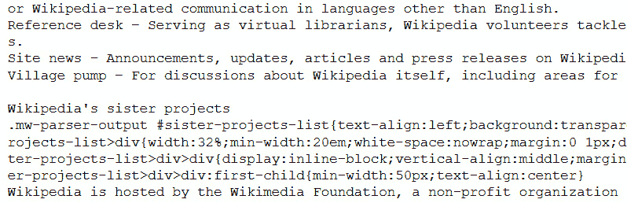

图 7.4：显示文本初始部分的输出

在这个练习中，我们介绍了 `BeautifulSoup` 或 `bs4` 的主要界面，我们还看到了如何使用 `bs4` 解析包含 HTML 和其他类型数据的原始字符串，并仅保留与 HTML 相关的数据。

注意

要访问此特定部分的源代码，请参阅 [`packt.live/2Cky5rt.`](https://packt.live/2Cky5rt%20)

您也可以在 [`packt.live/2Bj2Xbr`](https://packt.live/2Bj2Xbr) 上运行此示例。

网页正变得越来越动态，其中包含更多不同类型的元素和内容。作为一名数据整理工程师，您将不得不处理不断增长复杂性和数据的异构性。因此，了解我们刚才看到的将经常给您带来很大的优势。

## 从部分提取文本

现在，让我们继续进行更令人兴奋的数据整理任务。如果您打开维基百科主页，[`en.wikipedia.org/wiki/Main_Page,`](https://en.wikipedia.org/wiki/Main_Page) 您可能会看到一个名为 `From today's featured article` 的部分。这是当天特色文章的摘录，它是随机选择并在主页上推广的。这篇文章也可能在一天中发生变化：


图 7.5：突出显示“今天的特色文章”部分的样本维基百科页面

您需要从这部分提取文本。有几种方法可以完成这个任务。我们将在下面介绍一种简单直观的方法。

首先，我们尝试识别两个索引——行字符串的 *起始索引* 和 *结束索引*，这些索引标志着我们想要提取或读取的文本的开始和结束。在下一个屏幕截图中，索引被显示出来：


图 7.6：突出显示要提取文本的维基百科页面

以下代码完成了提取：

```py
idx1=txt_dump.find("From today's featured article")
idx2=txt_dump.find("Recently featured")
print(txt_dump[idx1+len("From today's featured article"):idx2])
```

注意，我们必须将 `From today's featured article` 字符串的长度添加到 `idx1` 中，然后将它作为起始索引传递。这是因为 `idx1` 找到 `From today's featured article` 字符串的起始位置。

它会打印出类似这样的内容（这是一个示例输出）：


图 7.7：提取的文本

注意

您得到的输出将根据当前的特色文章而变化。

如您所见，`BeautifulSoup` 库提供了一种高效的技术来从源中读取数据。了解特定一天发生的事件也会很有趣。

## 提取今天日期发生的重要历史事件

接下来，我们将尝试提取今天日期发生的重要历史事件的文本。这通常可以在以下截图的右下角找到：


图 7.8：突出显示“这一天”部分的维基百科页面

那么，我们能否应用我们在“从今天的特色文章”中使用的相同技术？显然不行，因为在我们想要提取结束的地方下面有文本，这与之前的情况不同。注意，在前一节中，固定的字符串“最近特色”出现在我们想要提取停止的确切位置，因此我们可以将其用于我们的代码中。然而，在这种情况下我们不能这样做，原因如下面的截图所示：


图 7.9：维基百科页面突出显示要提取的文本

所以，在本节中，我们只想找出围绕我们感兴趣的主要内容的文本看起来是什么样子。为此，我们必须找出`On this day`字符串的起始位置，并使用以下代码打印出接下来的 1,000 个字符：

```py
idx3=txt_dump.find("On this day")
print(txt_dump[idx3+len("On this day"):idx3+len("On this day")\
               +1000])
```

输出如下所示：


图 7.10：维基百科“这一天”部分的输出

如我们所见，除了我们真正感兴趣阅读的相关信息外，还有一些不必要的数据（如箭头所示）。为了解决这个问题，我们需要换一种思维方式，并使用一些除了`BeautifulSoup`之外的其他方法（并编写另一个实用函数）。

HTML 页面由许多标记标签组成，例如`<div>`，表示文本/图像的分区，以及`<ul>`，表示列表。在接下来的练习中，我们将使用`BeautifulSoup`库的高级技术从网页中提取相关信息。

## 练习 7.05：使用高级 BS4 技术提取相关文本

在这个练习中，我们将利用`BeautifulSoup`库的技术，提取包含我们感兴趣文本的元素。让我们执行以下步骤：

1.  使用此链接打开维基百科页面：[`en.wikipedia.org/wiki/Main_Page`](https://en.wikipedia.org/wiki/Main_Page)。

1.  在 Mozilla Firefox 浏览器中，右键单击并选择“检查元素”选项（在 Chrome 中，我们做同样的事情，只是菜单选项称为“检查”），如下面的截图所示：

    图 7.11：检查维基百科上的元素

    当你用鼠标悬停在这个上面时，你会看到页面上的不同部分被突出显示。通过这样做，很容易找出哪个精确的标记文本块是我们感兴趣的文本信息所负责的。在这里，我们可以看到某个`<ul>`块包含以下文本：

    

    图 7.12：识别包含我们感兴趣文本的 HTML 块

    现在，找到包含此`<ul>`块的`<div>`标签是明智的。通过查看与之前相同的屏幕，我们可以找到`<div>`及其`ID`：

    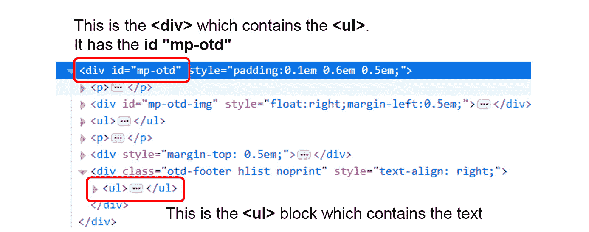

    图 7.13：包含文本的<ul>标签

    我们可以使用`bs4`函数做类似的事情。

1.  首先，导入`requests`和`BeautifulSoup`。同时，检索维基百科主页的内容（高亮显示）。

    ```py
    import requests 
    wiki_home = "https://en.wikipedia.org/wiki/Main_Page"
    response = requests.get(wiki_home) 
    def encoding_check(r): 
        return (r.encoding) 
    def decode_content(r,encoding):
        return (r.content.decode(encoding)) 
    contents = decode_content(response,encoding_check(response))
    from bs4 import BeautifulSoup 
    soup = BeautifulSoup(contents, 'html.parser')
    ```

1.  使用`BeautifulSoup`的`find_all`方法，该方法扫描 HTML 页面的所有标签（及其子元素）以找到并提取与这个特定的`<div>`元素相关的文本。创建一个空列表，并在遍历页面时将`NavigableString`类的文本追加到这个列表中：

    ```py
    text_list=[] #Empty list
    for d in soup.find_all('div'):
        if (d.get('id')=='mp-otd'):
            for i in d.find_all('ul'):
                text_list.append(i.text)
    ```

    `find_all`方法返回一个`NavigableString`类，它与一个有用的`text`方法相关联，用于提取。注意我们是如何利用`<div>`元素的`mp-otd` ID 来在数十个其他`<div>`元素中识别它的。现在，如果我们检查`text_list`列表，我们会看到它有三个元素。

1.  按标记分隔元素。我们会看到我们感兴趣的文本作为第一个元素出现：

    ```py
    for i in text_list:
        print(i)
        print('-'*100)
    ```

    输出如下：


图 7.14：高亮显示的文本

如我们所见，这是我们感兴趣列表的第一个元素。然而，确切的位臵将取决于网页。在这个练习中，我们介绍了一些`BeautifulSoup`的高级用法，并看到了我们如何使用其 API 提取有意义的信息。

注意

要访问此特定部分的源代码，请参阅[`packt.live/2USTDSg.`](https://packt.live/2USTDSg%20)

您也可以在[`packt.live/2zGIUTG`](https://packt.live/2zGIUTG)在线运行此示例。

接下来，我们将创建一个紧凑的函数来封装其中的一些。创建这样的函数有助于我们提高代码的可重用性。

如我们之前讨论的，尝试将特定任务功能化总是好的，尤其是在网络爬虫应用程序中。在接下来的练习中，我们将创建一个紧凑的函数。

## 练习 7.06：创建一个紧凑的函数，从维基百科主页提取“On this day”文本

在这个练习中，我们将创建一个函数，该函数将接受维基百科 URL（作为字符串），[`en.wikipedia.org/wiki/Main_Page`](https://en.wikipedia.org/wiki/Main_Page)，并返回对应于`On this day`部分的文本。函数式方法的好处是您可以从任何 Python 脚本中调用此函数，并在另一个程序中的任何地方将其用作独立模块。为此，让我们遵循以下步骤：

1.  创建紧凑的`def`函数。从维基百科主页的`On this day`部分提取文本，[`en.wikipedia.org/wiki/Main_Page`](https://en.wikipedia.org/wiki/Main_Page)。接受维基百科主页 URL 作为字符串。提供了一个默认的 URL：

    ```py
    def wiki_on_this_day(url="https://en.wikipedia.org/"\
                             "wiki/Main_Page"):
        import requests
        from bs4 import BeautifulSoup
        wiki_home = str(url)
        response = requests.get(wiki_home)
    ```

1.  创建一个函数，用于检查从网页收到的响应状态：

    ```py
        def status_check(r):
            if r.status_code==200:
                return 1
            else:
                return -1
        def encoding_check(r): 
            return (r.encoding)
        def decode_content(r,encoding): 
            return (r.content.decode(encoding))
        status = status_check(response)
        if status==1:
            contents = decode_content(response,\
                                      encoding_check(response))
        else:
            print("Sorry could not reach the web page!")
            return -1
    ```

1.  创建一个`BeautifulSoup`对象并读取网页内容：

    ```py
    soup = BeautifulSoup(contents, 'html.parser')
    text_list=[]
    for d in soup.find_all('div'):
        if (d.get('id')=='mp-otd'):
            for i in d.find_all('ul'):
                text_list.append(i.text)
    return (text_list[0])
    ```

1.  让我们看看这个函数的实际效果。

    ```py
    print(wiki_on_this_day())
    ```

    输出将如下：

    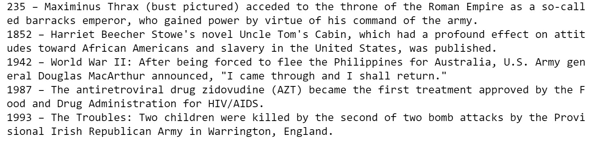

    图 7.15：wiki_on_this_day 的输出

1.  注意这个函数如何利用状态检查，如果请求失败则打印出错误信息。当我们用故意错误的 URL 测试这个函数时，它表现得如预期：

    ```py
    print(wiki_on_this_day\
          ("https://en.wikipedia.org/wiki/Main_Page1"))
    ```

    输出如下：

    ```py
    Sorry could not reach the web page!
    ```

在这个练习中，我们看到了如何编写一个函数来封装我们关于`BeautifulSoup`学到的许多重要内容。

注意

要访问此特定部分的源代码，请参阅[`packt.live/2YcaEJm`](https://packt.live/2YcaEJm)。

你也可以在[`packt.live/3hBS2dn`](https://packt.live/3hBS2dn)上在线运行此示例。

# 从 XML 读取数据

**XML**或**可扩展标记语言**是一种类似于 HTML 但具有显著灵活性的网络标记语言（用户方面），例如能够定义自己的标签。它是 20 世纪 90 年代和 21 世纪初最被炒作的技术之一。它是一种元语言，也就是说，一种允许我们使用其机制定义其他语言的语言，例如 RSS 和 MathML（一种广泛用于网络发布和显示数学密集型技术信息的数学标记语言）。XML 在互联网上的常规数据交换中也得到了广泛使用，作为一名数据整理专业人士，你应该对其基本特性有足够的了解，以便在需要为项目提取数据时随时访问数据流管道。

## 练习 7.07：创建 XML 文件和读取 XML 元素对象

在这个练习中，我们将创建一些随机数据并将其以 XML 格式存储。然后我们将从 XML 文件中读取并检查 XML 格式的数据字符串。让我们按照以下步骤进行：

1.  使用以下命令创建一个 XML 文件：

    ```py
    data = '''
    <person>
      <name>Dave</name>
      <surname>Piccardo</surname>
      <phone type="intl">
        +1 742 101 4456
      </phone>
      <email hide="yes">
        dave.p@gmail.com</email>
    </person>'''
    ```

    如我们所见，`phone`类型是一个三引号字符串或多行字符串。如果你打印这个对象，你会得到以下输出。这是一个树结构的 XML 格式数据字符串，正如我们将在解析结构和分解各个部分时看到的那样。

1.  为了处理和整理数据，我们必须使用 Python XML 解析器引擎将其读取为`Element`对象：

    ```py
    import xml.etree.ElementTree as ET
    tree = ET.fromstring(data)
    type (tree)
    ```

    输出如下：

    ```py
    xml.etree.ElementTree.Element
    ```

在这个练习中，我们看到了如何创建一个 XML 文件，如何读取一个 XML 文件，以及当我们读取一个 XML 文件时可以期待什么样的对象。

注意

要访问此特定部分的源代码，请参阅[`packt.live/37EDwgt`](https://packt.live/37EDwgt)。

你也可以在[`packt.live/3hDwUDv`](https://packt.live/3hDwUDv)上在线运行此示例。

## 练习 7.08：在树（元素）中查找各种数据元素

在这个练习中，我们将使用`find`方法在 XML 元素对象中搜索各种有用的数据，并使用`text`方法打印它们。我们还将使用`get`方法提取我们想要的特定属性。为此，让我们按照以下步骤进行：

1.  使用以下代码创建 XML 文件：

    ```py
    data = '''
    <person>
      <name>Dave</name>
      <surname>Piccardo</surname>
      <phone type="intl">
        +1 742 101 4456
      </phone>
      <email hide="yes">
        dave.p@gmail.com
      </email>
      </person>'''
    ```

1.  为了处理和整理数据，我们必须使用 Python XML 解析器引擎将其读取为`Element`对象：

    ```py
    import xml.etree.ElementTree as ET
    tree = ET.fromstring(data)
    ```

1.  使用`find`方法查找`Name`：

    ```py
    print('Name:', tree.find('name').text)
    ```

    输出结果如下：

    ```py
    Name: Dave
    ```

1.  使用`find`方法查找`Surname`：

    ```py
    print('Surname:', tree.find('surname').text)
    ```

    输出结果如下：

    ```py
    Surname: Piccardo
    ```

1.  使用`find`方法查找`Phone`。注意使用`strip`方法去除任何尾随空格/空白：

    ```py
    print('Phone:', tree.find('phone').text.strip())
    ```

    输出结果如下：

    ```py
    Phone: +1 742 101 4456
    ```

1.  使用`find`方法查找`email status`和`actual email`。注意使用`get`方法提取状态：

    ```py
    print('Email hidden:', tree.find('email').get('hide'))
    print('Email:', tree.find('email').text.strip())
    ```

    输出结果如下：

    ```py
    Email hidden: yes
    Email: dave.p@gmail.com
    ```

在这个练习中，我们看到了如何使用`find`方法从 XML 文件中读取相关信息。XML 是一种非常多样化的数据表示格式。除了遵循一些基本规则外，XML 文档中的其他内容都是可定制的。在这个练习中，我们看到了如何访问自定义 XML 元素并从中提取数据。

注意

要获取本节的源代码，请参阅[`packt.live/3dgSoTf`](https://packt.live/3dgSoTf)。

您也可以在[`packt.live/2CjDnU9`](https://packt.live/2CjDnU9)上运行此示例。

## 从本地 XML 文件读取到 ElementTree 对象

我们还可以从本地磁盘上保存的 XML 文件中读取。这是一种相当常见的情况，即前端网络爬虫模块已经通过读取网络上的数据表下载了大量 XML 文件，而数据处理员需要解析这个 XML 文件以提取有意义的数值和文本数据。

与本章相关联的文件名为`xml1.xml`。文件可在此处找到：[`packt.live/3e8jM7n`](https://packt.live/3e8jM7n)。

请确保您有文件在您运行 Jupyter 笔记本的同一目录中：

```py
tree2=ET.parse('../datasets/xml1.xml')
type(tree2)
```

输出结果如下：

```py
xml.etree.ElementTree.ElementTree
```

注意我们如何使用`parse`方法读取此 XML 文件。这与之前练习中使用的`fromstring`方法略有不同，当时我们直接从`string`对象中读取。这产生了一个`ElementTree`对象而不是简单的`Element`。

构建树形对象的想法与计算机科学和编程领域相同。让我们看看以下图表：

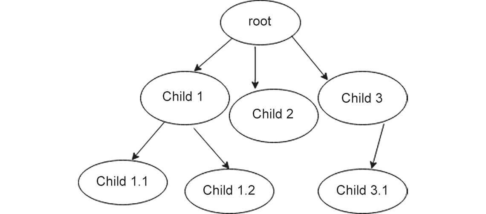

图 7.16：树形子节点

在前面的图表中，我们可以看到以下内容：

+   有一个根节点。

+   根节点下有子节点。

+   可能存在多个级别，即子节点的子节点，递归地向下。

+   树中的所有节点（包括根节点和子节点）都附加有包含数据的属性。

树遍历算法可以用来搜索特定的属性。如果提供，可以使用特殊方法更深入地探测节点。

每个 XML 树节点都有标签和属性。其想法如下：

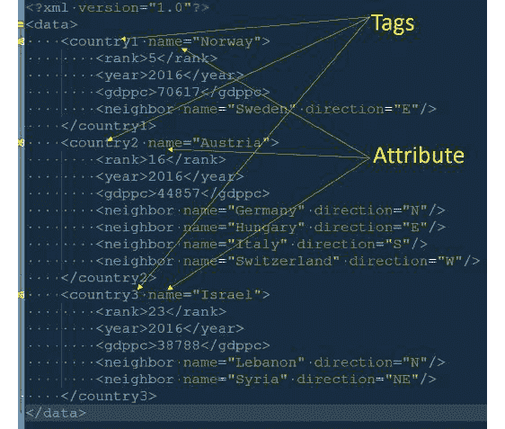

图 7.17：找到 XML 标签的根节点和子节点

由于文档以树的形式组织，我们可以使用树遍历算法遍历它并访问所有子节点，从根节点开始。

## 练习 7.09：遍历树，找到根节点，并探索所有子节点及其标签和属性

在这个练习中，我们将使用树遍历算法来遍历树，找到根节点，并探索所有子节点。我们首先定义一个名为 `tree2` 的变量，它将包含 `xml1.xml` 文件的内容。然后，我们将使用一个 `for` 循环遍历这个 XML 文档树。

XML 文件可以在以下位置找到：[`packt.live/3e8jM7n`](https://packt.live/3e8jM7n)。按照以下步骤进行：

1.  打开一个新的 Jupyter Notebook 并定义树：

    ```py
    import xml.etree.ElementTree as ET
    tree2=ET.parse('../datasets/xml1.xml')
    type(tree2)
    xml.etree.ElementTree.ElementTree
    ```

1.  使用以下代码探索这些标签和属性：

    ```py
    root=tree2.getroot()
    for child in root:
        print("Child:",child.tag, "| Child attribute:",\
              child.attrib)
    ```

    输出结果如下：

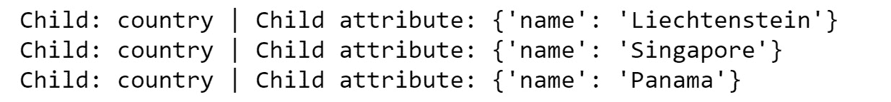

图 7.18：显示提取的 XML 标签的输出

在这个练习中，我们看到了如何遍历 XML 文档树。

注意

要访问此特定部分的源代码，请参阅 [`packt.live/2AEgqe1.`](https://packt.live/2AEgqe1%20)

您也可以在 [`packt.live/3ebu5re`](https://packt.live/3ebu5re) 上运行此示例。

记住，每个 XML 数据文件可能遵循不同的命名或结构格式，但使用元素树方法将数据放入一种结构化的流程中，可以系统地探索。然而，最好在尝试自动提取之前先检查原始 XML 文件结构一次，并理解（即使是在高层次上）数据格式。

在下面的练习中，我们将看到如何从树中提取相关信息。

## 练习 7.10：使用文本方法提取有意义的数据

在这个练习中，我们将使用 `text` 方法从 `BeautifulSoup` 库中提取 XML 文档树特定节点的不同类型的数据。我们可以几乎将 XML 树视为一个 **列表的列表** 并相应地进行索引。让我们按照以下步骤进行：

1.  打开一个新的 Jupyter Notebook 并定义树：

    ```py
    import xml.etree.ElementTree as ET
    tree2=ET.parse('../datasets/xml1.xml')
    type(tree2)
    xml.etree.ElementTree.ElementTree
    ```

1.  使用以下代码探索这些标签和属性：

    ```py
    root=tree2.getroot()
    ```

1.  使用以下代码通过 `root[0][2]` 元素访问：

    ```py
    root[0][2]
    ```

    输出结果如下：

    ```py
    <Element 'gdppc' at 0x00000000051FF278>
    ```

    因此，这指向了 `gdppc` 数据片段。在这里，`gdppc` 是标签，实际的人均 GDP 数据附加到这个标签上。

1.  使用 `text` 方法访问数据：

    ```py
    root[0][2].text
    ```

    输出结果如下：

    ```py
    '141100'
    ```

1.  使用 `tag` 方法访问 `gdppc`：

    ```py
    root[0][2].tag
    ```

    输出结果如下：

    ```py
    'gdppc'
    ```

1.  检查 `root[0]`：

    ```py
    root[0]
    ```

    输出结果如下：

    ```py
    <Element 'country1' at 0x00000000050298B8>
    ```

1.  检查标签：

    ```py
    root[0].tag
    ```

    输出结果如下：

    ```py
    'country'
    ```

1.  我们可以使用 `attrib` 方法来访问它：

    ```py
    root[0].attrib
    ```

    输出结果如下：

    ```py
    {'name': ' Liechtenstein '}
    ```

    因此，`root[0]` 仍然是一个元素，但它与 `root[0][2]` 的标签和属性集合不同。这是预期的，因为它们都是树的节点的一部分，但每个节点都与不同级别的数据相关联。

在这个练习中，我们看到了如何访问 XML 文档中的特定节点，以及如何从中获取数据、属性和其他相关内容。这种知识非常有价值，因为大量的数据仍然以 XML 格式呈现和交换。

注意

要访问此特定部分的源代码，请参阅 [`packt.live/3ee0mhl.`](https://packt.live/3ee0mhl%20)

你也可以在 [`packt.live/2YMqbyz`](https://packt.live/2YMqbyz) 上运行此示例。

这段代码的最后输出很有趣，因为它返回了一个字典对象。因此，我们可以通过其键来索引它。我们将在下一个练习中这样做。

## 使用循环提取和打印 GDP/人均信息

现在我们知道了如何读取 GDP/人均数据以及如何从树中获取字典，我们可以通过在树上运行循环来轻松构建一个简单的数据集：

```py
for c in root:
    country_name=c.attrib['name']
    gdppc = int(c[2].text)
    print("{}: {}".format(country_name,gdppc))
```

输出如下：

```py
Liechtenstein: 141100
Singapore: 59900
Panama: 13600
```

我们可以将这些内容放入一个 DataFrame 或 CSV 文件中，然后保存到本地磁盘以进行进一步处理，例如简单的绘图。

## 为每个国家找到所有邻近国家并打印它们

对于树结构，存在高效的搜索算法，其中一种针对 XML 树的方法是 `findall`。我们可以使用这个方法，在这个例子中，找到某个国家所有的邻近国家并将它们打印出来。

为什么我们需要使用 `findall` 而不是 `find`？嗯，因为并非所有国家都有相同数量的邻近国家，`findall` 搜索与特定节点关联的具有该标签的所有数据，而我们想要遍历所有这些：

```py
for c in root:
# Find all the neighbors
    ne=c.findall('neighbor') 
    print("Neighbors\n"+"-"*25)
# Iterate over the neighbors and print their 'name' attribute
    for i in ne: 
        print(i.attrib['name'])
    print('\n')
```

输出看起来可能像这样：

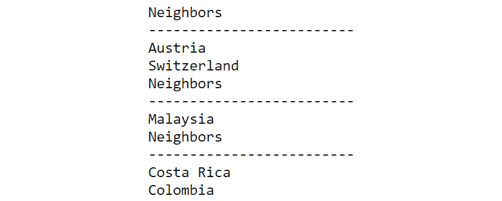

图 7.19：使用 findall 生成的输出

在本节中，我们探讨了如何使用预定义函数的形式的特定搜索算法来遍历 XML 文档，并从我们访问的节点中获取有趣的数据。

在本章的前一个主题中，我们学习了如何使用 `requests` 库进行简单的网络爬取。到目前为止，我们一直在处理静态 XML 数据，即来自本地文件或我们编写的字符串对象的数据。现在，是时候结合我们的学习，直接从互联网上读取 XML 数据了（正如你预期的那样，几乎所有的数据都是这样处理的）。

## 练习 7.11：使用网络爬取获得的 XML 数据的简单演示

在这个练习中，我们将使用网络爬取获取 XML 数据。我们将从一个名为 [`www.recipepuppy.com/`](http://www.recipepuppy.com/) 的网站上读取烹饪食谱，该网站包含各种其他网站的食谱聚合链接。接下来，我们将使用 `find` 方法从 XML 文件中提取适当的属性并显示相关内容。让我们按照以下步骤进行：

1.  导入必要的库：

    ```py
    import requests, urllib.parse
    ```

    从 [`www.recipepuppy.com/`](http://www.recipepuppy.com/) 网站读取：

    ```py
    serviceurl = 'http://www.recipepuppy.com/api/?'
    item = str(input('Enter the name of a food item '\
                     '(enter\'quit\' to quit): '))
    url = serviceurl + urllib.parse.urlencode({'q':item})\
          +'&p=1&format=xml'
    uh = requests.get(url)
    data = uh.text
    print('Retrieved', len(data), 'characters')
    ```

    此代码将要求用户输入。你必须输入一个食品项目的名称：`chicken tikka`。

    你将得到以下输出：

    ```py
    Enter the name of a food item (enter 'quit' to quit): chicken tikka
    Retrieved 2611 characters
    ```

    如果我们打印最后一个变量`data`，我们可能会看到它是一个合法的 XML 文档和一些附加的垃圾 HTML 的混合体。我们需要首先检查这是否是这种情况。

1.  使用 Python 的`find`方法。由于`data`是一个字符串，我们可以简单地这样做：

    ```py
    data.find("<!DOCTYPE html PUBLIC") 
    ```

    如果在`data`中找到该字符串，则应返回一个整数。否则，它将返回`–1`。如果我们得到一个正整数，那么我们知道——多亏了 Python 的`find`方法——它是我们正在搜索的字符串的起始索引。

1.  使用如下代码片段仅获取 XML 部分：

    ```py
    end_marker = data.find("<!DOCTYPE html PUBLIC")
    xml_text = data[:end_marker]
    ```

    然而，如果我们没有得到一个正整数，那么我们假设整个返回文本是有效的 XML，我们只需将`end_marker`设置为字符串的总长度。尽管如此，始终打印原始数据并检查它是否是纯 XML 或其中添加了一些垃圾数据是个好习惯。

1.  编写代码以获取 XML 格式的数据，并在创建 XML 树之前读取和解析它：

    ```py
    import xml.etree.ElementTree as ET
    end_marker = data.find("<!DOCTYPE html PUBLIC") \
                 if data.find("<!DOCTYPE html PUBLIC") != \
                 -1 else len(data)
    xml_text = data[:end_marker]
    tree3 = ET.fromstring(xml_text)
    ```

1.  现在，我们可以使用另一个有用的方法，称为`iter`，它基本上遍历一个元素下的节点。如果我们遍历树并提取文本，我们将得到以下输出：

    ```py
    for elem in tree3.iter():
        print(elem.text)
    ```

    输出（部分显示）如下：

    ![图 7.20：使用 iter 生成的输出]

    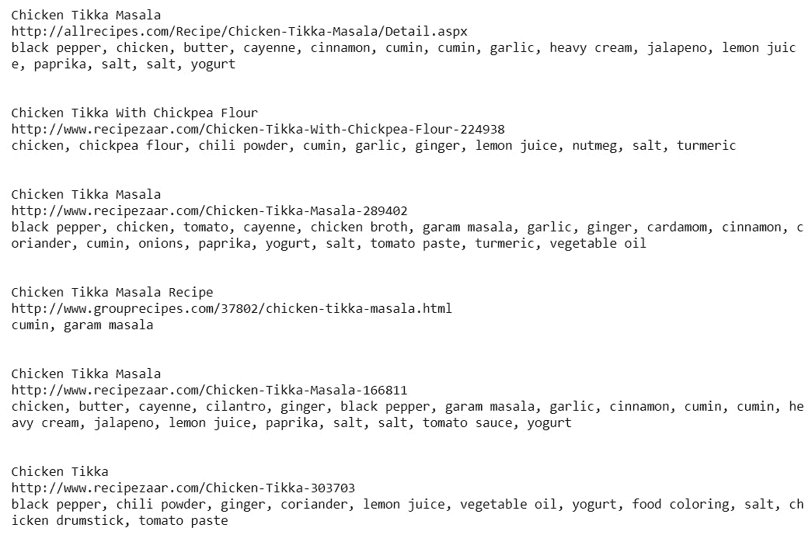

    图 7.20：使用 iter 生成的输出

    我们可以使用`find`方法来搜索适当的属性并提取其内容。这就是为什么手动扫描 XML 数据并检查使用了哪些属性很重要的原因。记住，这意味着扫描原始字符串数据，而不是树结构。

1.  打印原始字符串数据：

    ```py
    print(data)
    ```

    输出（部分显示）如下：

    ![图 7.21：原始字符串数据的输出]

    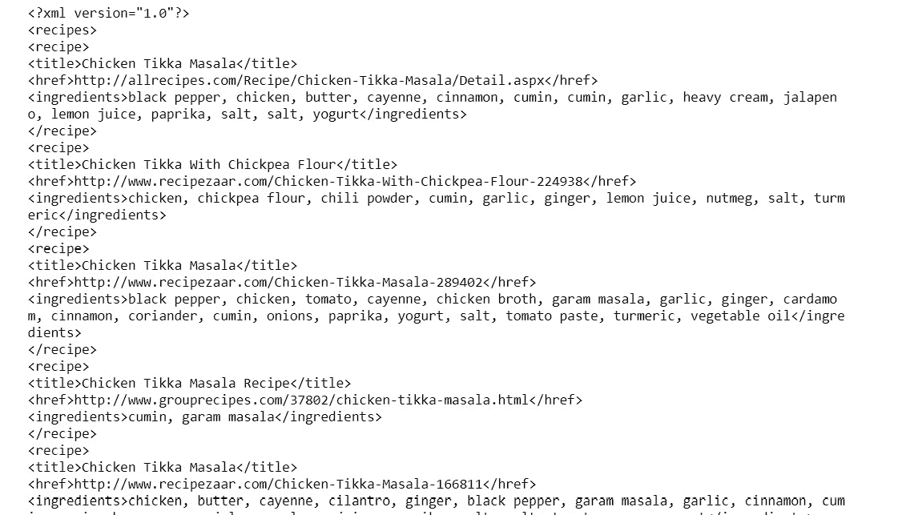

    图 7.21：原始字符串数据的输出

    让我们检查我们收到的 XML 数据，并定位`<title>`和`<href>`标签：

    ![图 7.22：显示提取的 href 标签的输出]

    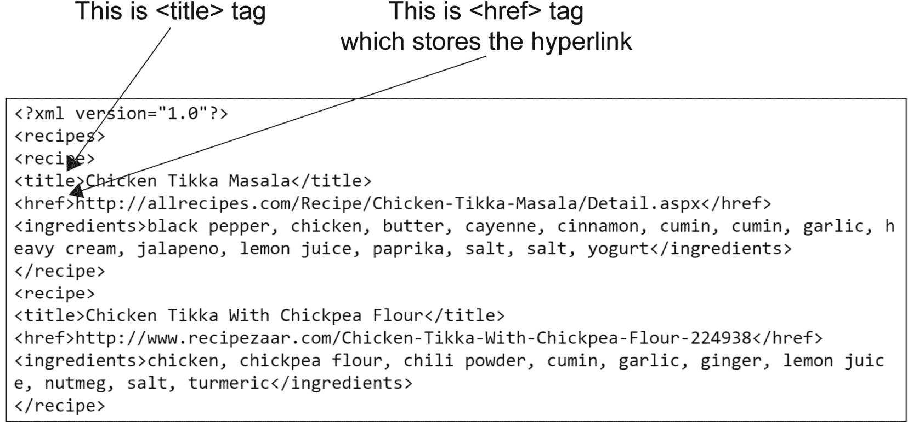

    图 7.22：显示提取的 href 标签的输出

    现在我们知道要搜索哪些标签。

1.  打印 XML 数据中的`<title>`和`<href>`超链接：

    ```py
    for e in tree3.iter():
        h=e.find('href')
        t=e.find('title')
        if h!=None and t!=None:
            print("Receipe Link for:",t.text)
            print(h.text)
            print("-"*100)
    ```

    最终输出（部分显示）如下：

![图 7.23：显示最终输出的输出]

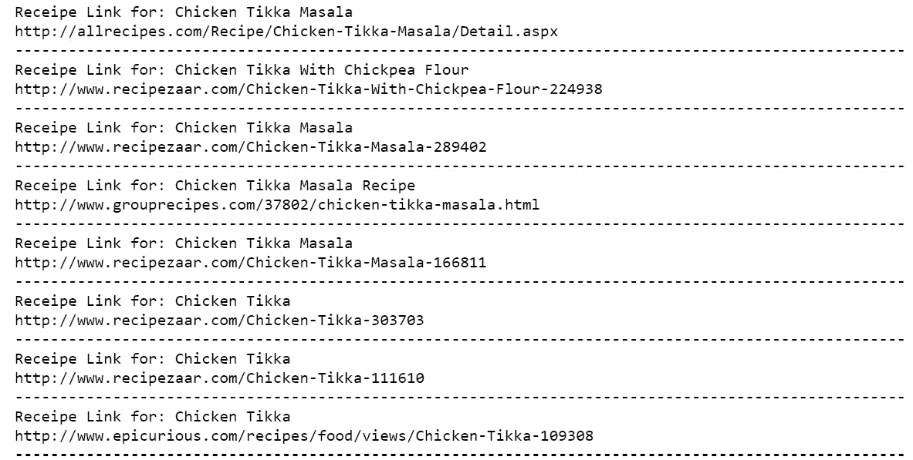

图 7.23：显示最终输出的输出

注意`h!=None`和`t!=None`的使用。当你第一次运行这类代码时，这些是难以预料的。你可能会得到一个错误，因为一些标签可能返回一个`None`对象，即它们在这个 XML 数据流中由于某种原因而为空。这种情况相当常见，无法事先预料。你必须使用你的 Python 知识和编程直觉来处理这种错误。在这里，我们只是在检查对象的类型，如果它不是`None`，那么我们需要提取与之相关的文本。

正如我们在这次练习的输出中可以看到的，我们得到了一个很好的输出，其中包含了与我们所搜索的食物相关的食谱链接。这就结束了这次练习。我们使用了我们关于制作 HTTP 请求和从互联网获取数据的知识，并结合了我们新获得的对解析和遍历 XML 文档的知识，来完成了一个小型但功能性的数据处理管道。这种数据处理管道的构建对于数据整理工程师来说是一项相当常见的任务。现在你知道如何去处理这个问题了。

注意

要访问这个特定部分的源代码，请参阅[`packt.live/2ALU6yZ`](https://packt.live/2ALU6yZ)。

你也可以在[`packt.live/3hBSMPH`](https://packt.live/3hBSMPH)上在线运行这个示例。

# 从 API 读取数据

基本上，API 或应用程序编程接口是访问计算资源（例如，操作系统或数据库表）的接口，它提供了一组公开的方法（函数调用），允许程序员访问该资源的特定数据或内部功能。

网络 API，正如其名所示，是在网络上的 API。请注意，它不是一个特定的技术或编程框架，而是一个架构概念。想象一下，API 就像快餐店的顾客服务台。内部有许多食品、原材料、烹饪资源和食谱管理系统，但你所能看到的是固定的菜单项，而你只能通过这些项进行交互。它就像一个可以使用 HTTP 协议访问的端口，并且如果使用得当，能够提供数据和服务的端口。

网络 API 在当今各种数据服务中极为流行。在第一章中，我们讨论了加州大学圣地亚哥分校的数据科学团队如何从 Twitter 动态中提取数据来分析森林火灾的发生情况。为此，他们不是去[twitter.com](http://twitter.com)通过查看 HTML 页面和文本来抓取数据。相反，他们使用了 Twitter API，该 API 以流式格式连续发送这些数据。

因此，对于数据整理专业人士来说，了解从网络 API 中提取数据的基本知识非常重要，因为你极有可能发现自己处于必须通过 API 读取大量数据进行处理和整理的情况。如今，大多数 API 以 JSON 格式流式传输数据。在本章中，我们将使用一个免费的 API 以 JSON 格式读取有关世界各地各种国家的信息，并进行处理。

我们将使用 Python 的内置`urllib`模块以及 pandas 来创建一个 DataFrame。因此，我们现在可以导入它们。我们还将导入 Python 的`json`模块：

```py
import urllib.request, urllib.parse
from urllib.error import HTTPError,URLError
import json
import pandas as pd
```

## 定义基本 URL（或 API 端点）

首先，我们需要设置基本 URL。当我们处理 API 微服务时，这通常被称为**API 端点**。因此，在你感兴趣的网站服务门户中寻找这样的短语，并使用他们提供的端点 URL：

```py
serviceurl = 'https://restcountries.eu/rest/v2/name/'
```

基于 API 的微服务在提供服务和数据方面具有极高的动态性。它们可以随时更改。在撰写本文时，我们发现这个特定的 API 是一个很好的选择，可以轻松提取数据，而不需要使用授权密钥（登录或特殊 API 密钥）。

对于大多数 API，然而，你需要有自己的 API 密钥。通过注册他们的服务来获得。基本使用（直到固定数量的请求或数据流限制）通常是免费的，但之后你将需要付费。为了注册 API 密钥，你通常需要输入信用卡信息。

我们希望避免所有这些麻烦来教你基础知识，这就是为什么我们选择了这个例子，它不需要这样的授权。但是，根据你工作中会遇到的数据类型，请准备好学习如何使用 API 密钥。

## 练习 7.12：定义和测试从 API 获取国家数据的函数

在这个练习中，我们将使用一个特定的 API，`https://restcountries.eu/rest/v2/name/`，它提供有关世界各地国家的基本信息。我们首先将与 API 建立连接。接下来，我们将创建一个用户定义的函数来获取特定国家的数据。让我们按照以下步骤进行：

1.  导入必要的库：

    ```py
    import urllib.request, urllib.parse
    from urllib.error import HTTPError,URLError
    import json
    import pandas as pd
    ```

1.  定义`service_url`变量：

    ```py
    serviceurl = 'https://restcountries.eu/rest/v2/name/'
    ```

1.  定义一个函数，当我们传递国家名称作为参数时，从中提取数据。操作的核心包含在以下两行代码中：

    ```py
    country_name = 'Switzerland' 
    url = serviceurl + country_name
    uh = urllib.request.urlopen(url)
    ```

    第一行代码将国家名称作为字符串附加到基本 URL 上，第二行向 API 端点发送`get`请求。如果一切顺利，我们将返回数据，对其进行解码，并将其读取为`JSON`文件。整个练习的代码如下，其中包括围绕我们之前讨论的基本操作的一些错误处理代码。

1.  定义`get_country_data`函数：

    ```py
    def get_country_data(country):
        """
        Function to get data about country
        from "https://restcountries.eu" API
        """
        country_name=str(country)
        url = serviceurl + country_name
        try: 
            uh = urllib.request.urlopen(url)
        except HTTPError as e:
            print("Sorry! Could not retrieve anything on {}"\
                  .format(country_name))
            return None
        except URLError as e:
            print('Failed to reach a server.')
            print('Reason: ', e.reason)
            return None
        else:
            data = uh.read().decode()
            print("Retrieved data on {}. Total {} characters  read."\
                  .format(country_name,len(data)))
            return data
    ```

    通过传递一些参数来测试这个函数。请注意，我们在这里使用`try..except`块。`try`块让你测试一段代码并查看是否有错误；`except`块让你处理错误。

1.  输入以下命令：

    ```py
    data = get_country_data(country_name)
    ```

    输出如下：

    ```py
    Retrieved data on Switzerland. Total 1090 characters read.
    ```

1.  在`country_name1`中输入错误数据：

    ```py
    country_name1 = 'Switzerland1'
    data1 = get_country_data(country_name1)
    ```

    我们传递了一个正确的名称和一个错误的名称。响应如下：

    ```py
    Sorry! Could not retrieve anything on Switzerland1
    ```

这是一个基本的错误处理示例。在构建实际的 Web 或企业应用程序时，你必须考虑各种可能性，并编写正确的代码来捕获并优雅地响应用户输入。

注意

要访问此特定部分的源代码，请参阅[`packt.live/30QU3MY.`](https://packt.live/30QU3MY%20)

你也可以在[`packt.live/2UUPc9I`](https://packt.live/2UUPc9I)上在线运行此示例。

现在我们已经编写了一个具有某种错误处理的函数来获取这些数据，我们可以继续进行下一部分，其中我们将处理我们刚刚获取的数据。

## 使用内置的 JSON 库读取和检查数据

如我们之前提到的，JSON 看起来很像 Python 字典。

我们将使用 Python 的`requests`模块来读取该格式的原始数据，并查看我们可以进一步处理的内容：

```py
import json
x=json.loads(data)
# Load the only element
y=x[0]
type(y)
```

输出将如下所示：

```py
dict
```

它将字符串数据类型读入一个字典列表。在这种情况下，列表中只有一个元素，所以我们提取它并检查其类型，以确保它是一个字典。

我们可以通过在字典上使用`keys()`方法来快速检查字典的键，即 JSON 数据（注意这里没有显示完整的截图）。

让我们尝试以下命令：

```py
y.keys()
```

输出（部分显示），如下所示：

![图 7.24：dict_keys 的输出]

![图片 B15780_07_24.jpg]

图 7.24：dict_keys 的输出

我们可以看到相关的国家数据，例如电话区号、人口、面积、时区、边界等。

## 打印所有数据元素

由于我们有现成的字典，这项任务非常简单。我们只需遍历字典，逐个打印键/项对即可：

```py
for k,v in y.items():
    print("{}: {}".format(k,v))
```

输出（部分显示）如下所示：

![图 7.25：使用字典的输出]

![图片 B15780_07_25.jpg]

图 7.25：使用字典的输出

注意，字典中的项不是同一类型，也就是说，它们不是相似的对象。有些是浮点数，例如`area`，许多是简单的字符串，但有些是列表或甚至是字典的列表。

这在 JSON 数据中相当常见。JSON 的内部数据结构可以是任意复杂和多层级的，也就是说，你可以有一个字典，其中包含列表、字典、列表的字典、列表的列表……等等。

注意

因此，很明显，对于 JSON 数据格式，没有通用的方法或处理函数，你必须根据特定的需求编写自定义循环和函数来从这样的字典对象中提取数据。

现在，我们将编写一个小循环来提取瑞士使用的语言。首先，让我们仔细检查字典，看看语言数据在哪里：

![图 7.26：标签]

![图片 B15780_07_26.jpg]

图 7.26：标签

因此，数据嵌套在一个字典的列表中，通过主字典的特定键来访问。

我们可以编写两行简单的代码来提取这些数据：

```py
for lang in y['languages']:
    print(lang['name'])
```

输出如下所示：

![图 7.27：显示语言的输出]

![图片 B15780_07_27.jpg]

图 7.27：显示语言的输出

## 使用提取包含关键信息的 DataFrame 的函数

在这里，我们感兴趣的是编写一个函数，该函数可以接受一个国家列表，并返回一个包含一些关键信息的`pandas` DataFrame：

+   首都

+   地区

+   子区域

+   人口

+   纬度/经度

+   面积

+   基尼系数

+   时区

+   货币

+   语言

    注意

    这是一种你通常在现实生活中的数据处理任务中需要编写的包装函数，即一个可以接受用户参数并输出一个包含从互联网上提取的关于用户感兴趣的项目关键信息的有效数据结构（或小型数据库类型对象）的实用函数。

我们首先展示整个函数，然后讨论一些关于它的关键点。这是一段稍微复杂且较长的代码。然而，凭借你的 Python 数据处理知识，你应该能够仔细检查这个函数并理解它在做什么：

```py
Exercise 7.13.ipynb
import pandas as pd
import json
def build_country_database(list_country):
    """
    Takes a list of country names.
    Output a DataFrame with key information about those countries.
    """
    # Define an empty dictionary with keys
    country_dict={'Country':[],'Capital':[],'Region':[],\
                  'Sub-region':[],'Population':[], \
                  'Latitude':[],'Longitude':[], 'Area':[],\
                  'Gini':[],'Timezones':[], 'Currencies':[],\
                  'Languages':[]}
The code has been truncated here. You can find the entire code for this function at the following GitHub link: https://packt.live/2YeRDpP.
```

关于这个函数的一些关键点如下：

+   它首先构建一个空的列表字典。这是最终传递给 pandas **DataFrame** 方法的格式，该方法接受此格式并返回一个具有列名设置为字典键名称的漂亮的 DataFrame。

+   我们使用之前定义的 `get_country_data` 函数来提取用户定义列表中每个国家的数据。为此，我们只需遍历列表并调用此函数。

+   我们检查 `get_country_data` 函数的输出。如果由于某种原因它返回一个 `None` 对象，我们将知道 API 读取没有成功，并将打印出一条合适的消息。这又是一个错误处理机制的例子，你必须在代码中实现它。没有这个小错误检查代码，你的应用程序将不足以应对偶尔的错误输入或 API 故障。

+   对于许多数据类型，我们只需从主 JSON 字典中提取数据并将其追加到我们数据字典中相应的列表中。

+   然而，对于特殊的数据类型，例如时区、货币和语言，我们编写一个特殊的循环来提取数据，而不会出错。

+   我们还注意到了这些特殊数据类型可能具有可变长度的事实，也就是说，一些国家可能有多种官方语言，但大多数只有一个条目。因此，我们检查列表的长度是否大于一个，并相应地处理数据。

## 练习 7.13：通过构建一个小型国家信息数据库来测试函数

在这个练习中，我们将使用上一节中使用的示例代码，并构建一个国家信息数据库。我们将通过传递一个国家名称列表来测试这个功能。

让我们按照以下步骤进行：

1.  导入必要的库：

    ```py
    import urllib.request, urllib.parse
    from urllib.error import HTTPError,URLError
    import pandas as pd
    ```

1.  定义 `service_url` 变量：

    ```py
    serviceurl = 'https://restcountries.eu/rest/v2/name/'
    ```

1.  定义 `get_country_data` 函数：

    ```py
    Exercise 7.13.ipynb
    def get_country_data(country):
        """
        Function to get data about a country
        from "https://restcountries.eu" API
        """
        country_name=str(country)
    The complete code for this step can be found at https://packt.live/2YeRDpP.
    ```

1.  定义国家名称：

    ```py
    country_name = 'Switzerland'
    ```

1.  输入以下命令：

    ```py
    data=get_country_data(country_name)
    ```

    输出如下：

    ```py
    Retrieved data on Switzerland. Total 1090 characters read.
    ```

1.  在 `country_name1` 中输入错误数据：

    ```py
    country_name1 = 'Switzerland1'
    data1 = get_country_data(country_name1)
    ```

    当传递错误名称时，响应如下：

    ```py
    Sorry! Could not retrieve anything on Switzerland1
    ```

1.  现在，导入 `json` 库：

    ```py
    import json
    ```

1.  按如下方式从字符串 `data` 加载：

    ```py
    x=json.loads(data)
    ```

1.  按如下方式加载唯一元素：

    ```py
    # Load the only element
    y=x[0]
    ```

1.  按如下方式检查 `y` 的类型：

    ```py
    type(y)
    ```

    这将返回 `dict`

1.  按如下方式打印 `y` 的键：

    ```py
    y.keys()
    ```

    输出如下：

    ```py
    dict_keys(['name', 'topLevelDomain', 'alpha2Code', 'alpha3Code', 'callingCodes', 'capital', 'altSpellings', 'region', 'subregion', 'population', 'latlng', 'demonym', 'area', 'gini', 'timezones', 'borders', 'nativeName', 'numericCode', 'currencies', 'languages', 'translations', 'flag', 'regionalBlocs', 'cioc'])
    ```

1.  遍历字典并逐个打印键/项对：

    ```py
    for k,v in y.items():
        print("{}: {}".format(k,v))
    ```

    输出的一部分如下：

    ```py
    name: Switzerland
    topLevelDomain: ['.ch']
    alpha2Code: CH
    alpha3Code: CHE
    callingCodes: ['41']
    capital: Bern
    altSpellings: ['CH', 'Swiss Confederation', 'Schweiz', 'Suisse', 'Svizzera', 'Svizra']
    region: Europe
    subregion: Western Europe
    population: 8341600
    latlng: [47.0, 8.0]
    demonym: Swiss
    ```

1.  创建循环以提取 `Switzerland` 中使用的语言：

    ```py
    for lang in y['languages']:
        print(lang['name'])
    ```

    输出如下：

    ```py
    German
    French
    Italian
    ```

1.  导入必要的库：

    ```py
    import pandas as pd
    import json
    ```

1.  定义 `build_country_database`：

    ```py
    Exercise 7.13.ipynb
    def build_country_database(list_country):
        """
        Takes a list of country names.
        Output a DataFrame with key information about those countries.
        """
        # Define an empty dictionary with keys
        country_dict={'Country':[],'Capital':[],'Region':[],'Sub-      region':[],'Population':[],
    The complete code for this step is available at: https://packt.live/2YFVYkM.
    ```

1.  为了测试其健壮性，我们传递了一个错误的名字，例如本例中的 `Turmeric`：

    ```py
    df1=build_country_database(['Nigeria','Switzerland','France',\
                                'Turmeric','Russia',\
                                'Kenya','Singapore'])
    ```

    输出如下：

    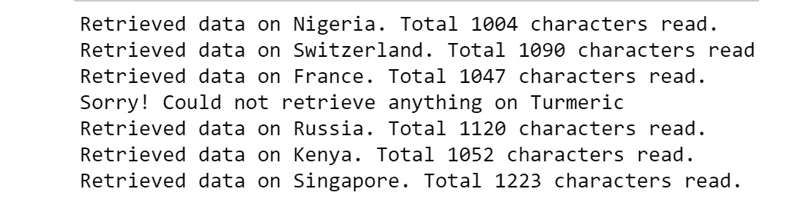

    图 7.28：国家数据库输出

    从输出中我们可以看到，它没有为错误条目返回任何数据，并打印出一条合适的消息。关键是，如果您在函数中没有错误检查和处理代码，那么它将在该条目上停止执行，并且不会返回预期的微型数据库。为了避免这种行为，错误处理代码是无价的。以下截图指向错误条目：

    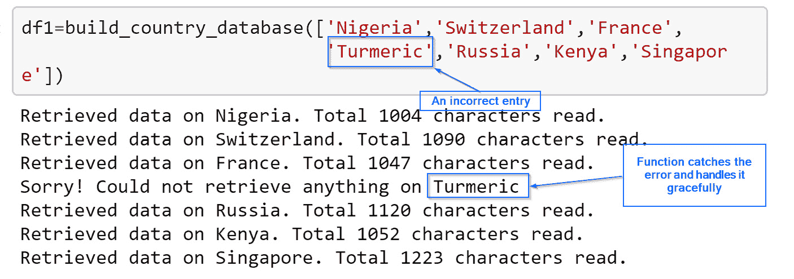

    图 7.29：高亮显示的错误条目

1.  打印 `pandas` DataFrame：

    ```py
    df1
    ```

    输出如下（仅显示部分输出）：

    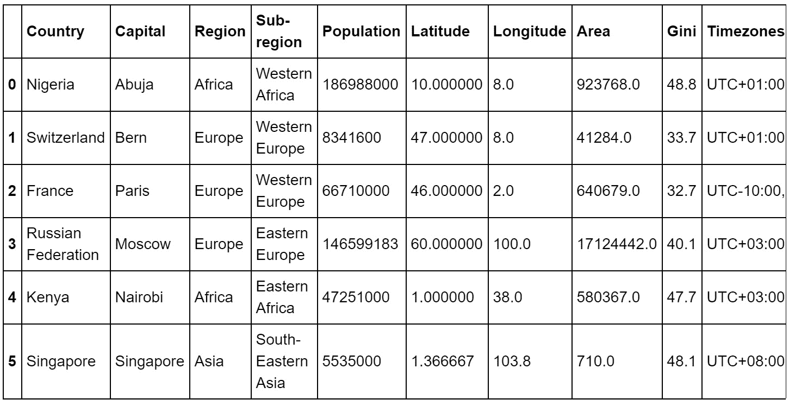

图 7.30：部分输出

让我们分析已提取的数据：

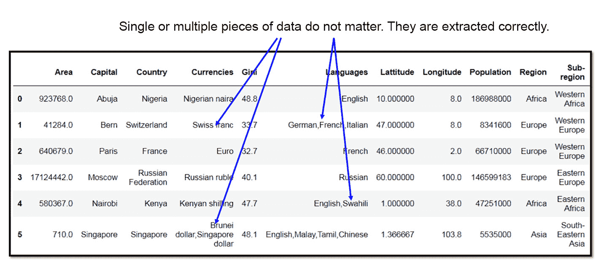

图 7.31：正确提取的数据

从输出中我们可以看到，单条以及多条数据都已被正确提取。

注意

要访问此特定部分的源代码，请参阅[`packt.live/2YeRDpP`](https://packt.live/2YeRDpP)。

您也可以在 [`packt.live/3fvAY6U`](https://packt.live/3fvAY6U) 上在线运行此示例。

# 正则表达式（RegEx）基础

**正则** **表达式** 或 **regex** 用于确定在给定的字符序列（字符串）中是否存在模式。它们有助于操作文本数据，这对于涉及文本挖掘的数据科学项目通常是先决条件。

## Web Scraping 中的 RegEx

网页通常充满了文本，虽然 `BeautifulSoup` 或 XML 解析器中有一些方法可以提取原始文本，但没有用于智能分析文本的方法。如果您作为数据整理员正在寻找特定的数据（例如，特殊格式的电子邮件 ID 或电话号码），您必须在大量语料库上进行大量字符串操作以提取电子邮件 ID 或电话号码。`RegEx` 非常强大，可以通过字符串操作节省数据整理专业人士的大量时间和精力，因为他们可以使用任意长度的通配符搜索复杂的文本模式。

`RegEx` 本身就像是一种微型编程语言，常见思想不仅用于 Python，还用于所有广泛使用的网络应用语言，如 JavaScript、PHP 和 Perl。`regex` 模块是 Python 内置的，您可以使用以下代码导入它：

```py
import re
```

在下一个练习中，我们将使用 `match` 方法来检查模式是否与字符串或序列匹配。

## 练习 7.14：使用 `match` 方法检查模式是否与字符串/序列匹配

在这个练习中，我们将使用最常用的正则表达式方法之一，`match`，来检查字符串开头的精确匹配或部分匹配。让我们按照以下步骤进行：

1.  导入 `regex` 模块：

    ```py
    import re
    ```

1.  定义一个字符串和一个模式：

    ```py
    string1 = 'Python'
    pattern = r"Python"
    ```

1.  编写一个条件表达式来检查匹配：

    ```py
    if re.match(pattern,string1):
        print("Matches!")
    else:
        print("Doesn't match.")
    ```

    输出应该是这样的：

    ```py
    Matches!
    ```

1.  使用一个仅第一个字母不同（变为小写）的字符串来测试它：

    ```py
    string2 = 'python'
    if re.match(pattern,string2):
           print("Matches!")
    else:
          print("Doesn't match.")
    ```

    输出如下：

    ```py
    Doesn't match.
    ```

    注意

    要访问此特定部分的源代码，请参阅 [`packt.live/2N8SKAW`](https://packt.live/2N8SKAW)。

    您也可以在 [`packt.live/3hHJOAr`](https://packt.live/3hHJOAr) 上运行此示例。

在这个练习中，我们只看到了如何进行最基本的正则表达式操作。本身可能看起来并不那么令人印象深刻，但我们将在这个基本想法的基础上在接下来的练习中构建更复杂的逻辑。

## 使用编译方法创建正则表达式程序

在程序或模块中，如果我们正在大量使用特定的模式，那么使用 `compile` 方法创建正则表达式程序并调用该程序的方法会更好。

这就是如何编译一个正则表达式程序：

```py
prog = re.compile(pattern)
prog.match(string1)
```

输出如下：

```py
<re.SRE_Match object; span=(0, 6), match='Python'>
```

这段代码产生了一个 `SRE.Match` 对象，其 `span` 为 (`0,6`)，匹配的字符串为 `Python`。这里的 `span` 简单地表示匹配模式的起始和结束索引。这些索引在文本挖掘程序中可能很有用，后续代码可以使用这些索引进行进一步搜索或决策。

编译对象就像函数一样，如果模式不匹配，则返回 `None`。这个概念在我们编写一个小型实用函数来检查正则表达式编译程序返回的对象类型并相应地操作时将很有用。我们无法确定模式是否会匹配给定的字符串，或者它是否会在文本语料库中（如果我们正在搜索文本中的任何位置）出现。根据情况，我们可能会遇到 `Match` 对象或 `None` 作为返回值，我们必须优雅地处理这种情况。让我们在以下练习中练习这个。

## 练习 7.15：编译程序以匹配对象

在这个练习中，我们将定义两个字符串和一个模式。我们将使用 `compile` 方法编译一个正则表达式程序。接下来，我们将编写一个小型条件表达式来测试编译对象是否与定义的模式匹配。让我们按照以下步骤进行：

1.  使用 `regex` 模块的 `compile` 函数：

    ```py
    import re
    def print_match(s):
        if prog.search(s)==None:
            print("No match")
        else:
            print(prog.search(s).group()) 
    string1 = 'Python'
    string2 = 'python'
    pattern = r"Python"
    prog = re.compile(pattern)
    ```

1.  将其与第一个字符串匹配：

    ```py
    if prog.match(string1)!=None:
        print("Matches!")
    else:
        print("Doesn't match.")
    ```

    输出如下：

    ```py
    Matches!
    ```

1.  将其与第二个字符串匹配：

    ```py
    if prog.match(string2)!=None:
        print("Matches!")
    else:
        print("Doesn't match.")
    ```

    输出如下：

    ```py
    Doesn't match.
    ```

因此，`compile` 方法返回特殊对象，如 `match` 对象。但如果它们不匹配，它将返回 `None`，因此我们仍然可以运行我们的条件循环。

注意

要访问此特定部分的源代码，请参阅[`packt.live/30SJ4m9.`](https://packt.live/30SJ4m9%20)

你也可以在[`packt.live/3hIBkJE`](https://packt.live/3hIBkJE)上在线运行此示例。

## 练习 7.16：在 `match` 方法中使用附加参数以检查位置匹配

在这个练习中，我们将使用 `match` 方法来检查字符串中特定位置是否存在匹配项。让我们按照以下步骤进行：

1.  在第二个位置匹配 `y`：

    ```py
    import re
    def print_match(s):
        if prog.search(s)==None:
            print("No match")
        else:
            print(prog.search(s).group()) 
    prog = re.compile(r'y')
    prog.match('Python',pos=1)
    ```

    输出如下：

    ```py
    <re.Match object; span=(1, 2), match='y'>
    ```

    这是我们之前提到的 `match` 对象。

1.  从 `pos=2` 开始检查名为 `thon` 的模式，即第三个字符：

    ```py
    prog = re.compile(r'thon')
    prog.match('Python',pos=2)
    ```

    输出如下：

    ```py
    <_re.SRE_Match object; span=(2, 6), match='thon'>
    ```

1.  使用以下命令在另一个字符串中查找匹配项：

    ```py
    prog.match('Marathon',pos=4)
    ```

    输出如下：

    ```py
    <_re.SRE_Match object; span=(4, 8), match='thon'>
    ```

因此，我们已经看到了如何使用正则表达式，并在各种用例中使用它。

注意

要访问此特定部分的源代码，请参阅[`packt.live/2CmKc7z.`](https://packt.live/2CmKc7z%20)

你也可以在[`packt.live/30OsDY6`](https://packt.live/30OsDY6)上在线运行此示例。

## 查找以 "ing" 结尾的单词数量

假设我们想找出给定的字符串是否有最后的三个字母 `ing`。这种查询可能会出现在文本分析/文本挖掘程序中，有人对查找现在进行时态单词的实例感兴趣，这些单词很可能以 `ing` 结尾。然而，名词也可能以 `ing` 结尾（正如我们将在本例中看到的那样）：

```py
prog = re.compile(r'ing')
words = ['Spring','Cycling','Ringtone']
```

创建一个 `for` 循环来查找以 `ing` 结尾的单词：

```py
for w in words:
    if prog.match(w,pos=len(w)-3)!=None:
        print("{} has last three letters 'ing'".format(w))
    else:
        print("{} does not have last three letter as 'ing'"\
              .format(w))
```

输出如下：

```py
Spring has last three letters 'ing'
Cycling has last three letters 'ing'
Ringtone does not have last three letter as 'ing'
```

## 正则表达式中的搜索方法

它看起来很普通，简单，你可能想知道为什么需要使用特殊的正则表达式模块来做这件事。简单的字符串方法应该就足够了。是的，对于这个特定的例子来说，这样做是可以的，但使用正则表达式的真正目的是能够使用非常复杂的字符串模式，这些模式在使用简单的字符串方法编写时并不明显。我们很快就会看到正则表达式与字符串方法相比的真正威力。但在那之前，让我们探索另一个最常用的方法，称为 `search`。

`search` 和 `match` 是相关概念，它们都返回相同的 `match` 对象。它们之间的真正区别在于 **match 只针对第一个匹配**（要么在字符串的开头，要么在指定的位置，就像我们在前面的练习中看到的那样），而 **search 则在字符串的任何位置寻找模式**，如果找到匹配项则返回位置。

## 练习 7.17：正则表达式中的搜索方法

在这个练习中，我们将使用 `search` 方法在正则表达式中查找 `ing` 模式。让我们按照以下步骤进行：

1.  使用 `compile` 方法查找匹配的字符串：

    ```py
    import re
    def print_match(s):
        if prog.search(s)==None:
            print("No match")
        else:
            print(prog.search(s).group())
    prog = re.compile('ing')
    if prog.match('Spring')==None:
        print("None")
    ```

    输出如下：

    ```py
    None
    ```

1.  使用以下命令搜索字符串：

    ```py
    prog.search('Spring')
    ```

    输出如下：

    ```py
    <_sre.SRE_Match object; span=(3, 6), match='ing'>
    ```

1.  让我们使用 `Ringtone` 作为搜索参数：

    ```py
    prog.search('Ringtone')
    ```

    输出如下：

    ```py
    <re.Match object; span=(1, 4), match='ing'>
    ```

如您所见，`match`方法对于输入`Spring`返回`None`，我们不得不编写代码来显式打印出来（因为在 Jupyter 笔记本中，对于`None`对象将不会显示任何内容）。但是`search`返回一个带有`span=(3,6)`的`match`对象，因为它找到了跨越这些位置的`ing`模式。

同样，对于`Ringtone`字符串，它找到了匹配的正确位置并返回`span=(1,4)`。

注意

要访问此特定部分的源代码，请参阅[`packt.live/3fDRmme.`](https://packt.live/3fDRmme%20)

你也可以在此在线运行此示例：[`packt.live/30U2WFm`](https://packt.live/30U2WFm)。

## 练习 7.18：使用 Match 对象的 span 方法定位匹配模式的起始位置

在这个练习中，我们将使用`Match`对象中的`span`来定位模式在字符串中的确切位置。让我们按照以下步骤进行：

1.  使用`ing`模式初始化`prog`：

    ```py
    import re
    def print_match(s):
        if prog.search(s)==None:
            print("No match")
        else:
            print(prog.search(s).group()) 
    prog = re.compile(r'ing')
    words = ['Spring','Cycling','Ringtone']
    ```

1.  创建一个函数以返回匹配的起始和结束位置的元组：

    ```py
    for w in words:
        mt = prog.search(w)
    # Span returns a tuple of start and end positions of the match
    # Starting position of the match
    start_pos = mt.span()[0]
    # Ending position of the match 
    end_pos = mt.span()[1] 
    ```

1.  打印以`ing`结尾的单词及其起始和结束位置：

    ```py
    print("The word '{}' contains 'ing' in the position {}-{}"\
          .format(w,start_pos,end_pos))
    ```

    输出如下：

    ```py
    The word 'Ringtone' contains 'ing' in the position 1-4
    ```

    注意

    要访问此特定部分的源代码，请参阅[`packt.live/2YIZB9y.`](https://packt.live/2YIZB9y%20)

    你也可以在此在线运行此示例：[`packt.live/37FXSG5`](https://packt.live/37FXSG5)。

现在，我们将通过各种有用的模式匹配示例开始深入了解正则表达式的实际应用。在以下练习中，我们将探索单字符匹配。

## 练习 7.19：使用 search 进行单字符模式匹配的示例

在这个练习中，我们将使用`group`方法，它将以字符串格式返回匹配的模式，这样我们就可以轻松地打印和处理它。让我们按照以下步骤进行：

1.  在`compile`方法中传递一个包含点（`.`）的正则表达式。它匹配任何单个字符，除了换行符：

    ```py
    import re
    prog = re.compile(r'py.')
    print(prog.search('pygmy').group())
    print(prog.search('Jupyter').group())
    ```

    输出如下：

    ```py
    pyg
    pyt
    ```

1.  在`compile`方法中传递一个包含`\w`（小写 w）的正则表达式。它匹配任何单个字母、数字或下划线：

    ```py
    prog = re.compile(r'c\wm')
    print(prog.search('comedy').group())
    print(prog.search('camera').group())
    print(prog.search('pac_man').group())
    print(prog.search('pac2man').group())
    ```

    输出如下：

    ```py
    com
    cam
    c_m
    c2m
    ```

1.  在`compile`方法中传递一个包含`\W`（大写 W）的正则表达式。它匹配`\w`未涵盖的任何内容：

    ```py
    prog = re.compile(r'4\W1')
    print(prog.search('4/1 was a wonderful day!').group())
    print(prog.search('4-1 was a wonderful day!').group())
    print(prog.search('4.1 was a wonderful day!').group())
    print(prog.search('Remember the wonderful day 04/1?').group())
    ```

    输出如下：

    ```py
    4/1
    4-1
    4.1
    4/1
    ```

1.  在`compile`方法中传递一个包含`\s`（小写 s）的正则表达式。它匹配单个空白字符，例如空格、换行符、制表符或回车符：

    ```py
    prog = re.compile(r'Data\swrangling')
    print(prog.search("Data wrangling is cool").group())
    print("-"*80)
    print("Data\twrangling is the full string")
    print(prog.search("Data\twrangling is the full string").group())
    print("-"*80)
    print("Data\nwrangling is the full string")
    print(prog.search("Data\nwrangling").group())
    ```

    输出如下：

    ```py
    Data wrangling
    --------------------------------------------------------------
    Data    wrangling is the full string
    Data    wrangling
    --------------------------------------------------------------
    Data
    wrangling is the full string
    Data
    wrangling
    ```

1.  在`compile`方法中传递一个包含`\d`的正则表达式。它匹配数字 0-9：

    ```py
    prog = re.compile(r"score was \d\d")
    print(prog.search("My score was 67").group())
    print(prog.search("Your score was 73").group())
    ```

    输出如下：

    ```py
    score was 67
    score was 73
    ```

如我们所见，我们可以使用`group`函数来返回一组匹配的字符。

注意

要访问此特定部分的源代码，请参阅[`packt.live/2YOJcAi.`](https://packt.live/2YOJcAi%20)

你也可以在此在线运行此示例：[`packt.live/3edPMHj`](https://packt.live/3edPMHj)。

在以下练习中，我们将使用模式匹配来操作字符串的开始或结束。

## 练习 7.20：处理字符串开头或结尾的模式匹配

在本练习中，我们将使用`^`（插入符）操作符匹配模式。重点是确定模式是否存在于字符串的开始或末尾。让我们按照以下步骤进行：

1.  编写一个函数来处理找不到匹配的情况，即处理返回的`None`对象：

    ```py
    import re
    def print_match(s):
        if prog.search(s)==None:
            print("No match")
        else:
            print(prog.search(s).group())
    ```

1.  使用`^`（插入符）来匹配字符串开头的模式：

    ```py
    prog = re.compile(r'^India')
    print_match("Russia implemented this law")
    print_match("India implemented that law")
    print_match("This law was implemented by India")
    ```

    输出如下：

    ```py
    No match
    India
    No match
    ```

1.  使用`$`（美元符号）来匹配字符串末尾的模式：

    ```py
    prog = re.compile(r'Apple$')
    print_match("Patent no 123456 belongs to Apple")
    print_match("Patent no 345672 belongs to Samsung")
    print_match("Patent no 987654 belongs to Apple")
    ```

    输出如下：

    ```py
    Apple
    No match
    Apple
    ```

    注意

    要访问本节的具体源代码，请参阅[`packt.live/3ddku23.`](https://packt.live/3ddku23%20)

    你也可以在[`packt.live/3djOXeV`](https://packt.live/3djOXeV)上在线运行此示例。

    对于这些示例和练习，也要考虑如何在不使用正则表达式的情况下实现它们，即通过使用简单的字符串方法和任何其他你可以想到的逻辑。然后，将此解决方案与使用正则表达式实现的解决方案进行比较，以实现简洁和高效。

## 练习 7.21：使用多个字符进行模式匹配

在本练习中，我们将使用`match`方法进行多字符匹配。让我们执行以下步骤：

1.  使用`*`来匹配前面正则表达式的`0`个或多个重复：

    ```py
    import re
    def print_match(s):
        if prog.search(s)==None:
            print("No match")
        else:
            print(prog.search(s).group())
    prog = re.compile(r'ab*')
    print_match("a")
    print_match("ab")
    print_match("abbb")
    print_match("b")
    print_match("bbab")
    print_match("something_abb_something")
    ```

    输出如下：

    ```py
    a
    ab
    abbb
    No match
    ab
    abb
    ```

1.  使用`+`会导致结果`RE`匹配前面正则表达式的`1`个或多个重复：

    ```py
    prog = re.compile(r'ab+')
    print_match("a")
    print_match("ab")
    print_match("abbb")
    print_match("b")
    print_match("bbab")
    print_match("something_abb_something")
    ```

    输出如下：

    ```py
    No match
    ab
    abbb
    No match
    ab
    abb
    ```

1.  `?`会导致结果`re`字符串精确匹配前面正则表达式的`0`个或`1`个重复：

    ```py
    prog = re.compile(r'ab?')
    print_match("a")
    print_match("ab")
    print_match("abbb")
    print_match("b")
    print_match("bbab")
    print_match("something_abb_something")
    ```

    输出如下：

    ```py
    a
    ab
    ab
    No match
    ab
    ab
    ```

在这里，我们看到了如何使用正则表达式按搜索模式中字符出现的顺序搜索和匹配一组字符。

注意

要访问本节的具体源代码，请参阅[`packt.live/310l7Jw.`](https://packt.live/310l7Jw%20)

你也可以在[`packt.live/3hCdnDz`](https://packt.live/3hCdnDz)上在线运行此示例。

正则表达式模式匹配的标准（默认）模式是**贪婪**的，即程序尝试尽可能多地匹配。有时，这种行为是自然的，但在某些情况下，你可能希望进行最小匹配。这被称为**非贪婪**匹配。

## 练习 7.22：贪婪与非贪婪匹配

在本练习中，我们将执行贪婪和非贪婪模式匹配。让我们按照以下步骤进行：

1.  编写代码以检查字符串匹配的贪婪方式，如下所示：

    ```py
    import re
    def print_match(s):
        if prog.search(s)==None:
            print("No match")
        else:
            print(prog.search(s).group())
    prog = re.compile(r'<.*>')
    print_match('<a> b <c>')
    ```

    输出如下：

    ```py
     <a> b <c>
    ```

    因此，前面的正则表达式找到了具有`<>`模式的两个标签，但如果我们只想匹配第一个标签并停止，该怎么办。

1.  通过在正则表达式后插入`?`使其变为非贪婪：

    ```py
    prog = re.compile(r'<.*?>')
    print_match('<a> b <c>')
    ```

    输出如下：

    ```py
    <a>
    ```

在以下练习中，我们将使用`match`处理重复。

注意

要访问本节的具体源代码，请参阅[`packt.live/37Hz944.`](https://packt.live/37Hz944%20)

你也可以在[`packt.live/2UVlK3q`](https://packt.live/2UVlK3q)上在线运行此示例。

## 练习 7.23：在文本中控制重复以匹配

在这个练习中，我们将检查文本中我们想要匹配的模式重复的次数。让我们按照以下步骤进行：

1.  `{m}`指定恰好`m`个`RE`的匹配。匹配次数少于`m`将导致不匹配并返回`None`：

    ```py
    import re
    def print_match(s):
        if prog.search(s)==None:
            print("No match")
        else:
            print(prog.search(s).group())
    prog = re.compile(r'A{3}')
    print_match("ccAAAdd")
    print_match("ccAAAAdd")
    print_match("ccAAdd")
    ```

    输出如下：

    ```py
    AAA
    AAA
    No match
    ```

1.  `{m,n}`指定恰好`m`到`n`个`RE`的匹配：

    ```py
    prog = re.compile(r'A{2,4}B')
    print_match("ccAAABdd")
    print_match("ccABdd")
    print_match("ccAABBBdd")
    print_match("ccAAAAAAABdd")
    ```

    输出如下：

    ```py
    AAAB
    No match
    AAB
    AAAAB
    ```

1.  省略`m`指定下界为零：

    ```py
    prog = re.compile(r'A{,3}B')
    print_match("ccAAABdd")
    print_match("ccABdd")
    print_match("ccAABBBdd")
    print_match("ccAAAAAAABdd")
    ```

    输出如下：

    ```py
    AAAB
    AB
    AAB
    AAAB
    ```

1.  省略`n`指定无限上界：

    ```py
    prog = re.compile(r'A{3,}B')
    print_match("ccAAABdd")
    print_match("ccABdd")
    print_match("ccAABBBdd")
    print_match("ccAAAAAAABdd")
    ```

    输出如下：

    ```py
    AAAB
    No match
    No match
    AAAAAAAB
    ```

1.  `{m,n}?`指定以非贪婪方式匹配`m`到`n`个`RE`：

    ```py
    prog = re.compile(r'A{2,4}')
    print_match("AAAAAAA")
    prog = re.compile(r'A{2,4}?')
    print_match("AAAAAAA")
    ```

    输出如下：

    ```py
    AAAA
    AA
    ```

    注意

    要访问此特定部分的源代码，请参阅[`packt.live/2YOzAWf.`](https://packt.live/2YOzAWf%20)

    你也可以在[`packt.live/2YKO7T4`](https://packt.live/2YKO7T4)上在线运行此示例。

让我们转到下一节。

## 匹配字符的集合

要匹配任意复杂的模式，我们需要能够将字符的逻辑组合作为一个整体包括在内。正则表达式提供了这种能力。

以下示例演示了正则表达式的这种用法。`[x,y,z]`匹配`x`、`y`或`z`：

```py
prog = re.compile(r'[A,B]')
print_match("ccAd")
print_match("ccABd")
print_match("ccXdB")
print_match("ccXdZ")
```

输出将如下：

```py
A
A
B
No match
```

可以使用`-`在集合内匹配字符范围。这是最广泛使用的正则表达式技术之一。

## 练习 7.24：匹配字符的集合

在这个练习中，我们将从定义的字符串中找到匹配字符的集合。我们将从一个字符串中查找电子邮件地址模式`<some name>@<some domain name>.<some domain identifier>`。让我们按照以下步骤进行：

1.  假设我们想要从某些文本中挑选出一个电子邮件地址：

    ```py
    import re
    def print_match(s):
        if prog.search(s)==None:
            print("No match")
        else:
            print(prog.search(s).group())
    prog = re.compile(r'[a-zA-Z]+@+[a-zA-Z]+\.com')
    print_match("My email is coolguy@xyz.com")
    print_match("My email is coolguy12@xyz.com")
    ```

    输出如下：

    ```py
    coolguy@xyz.com
    No match
    ```

    看看正则表达式模式内部的[ `…` ]。它是`a-zA-Z`。这涵盖了所有字母，包括小写和大写。使用这个简单的正则表达式，你能够匹配电子邮件该部分的任何（纯）字母字符串。现在，下一个模式是`@`，它通过`+`字符添加到之前的正则表达式中。这就是构建复杂正则表达式的方式：通过添加/堆叠单个正则表达式模式。我们同样使用相同的`[a-zA-Z]`作为电子邮件域名，并在末尾添加`.com`以完成模式，使其成为一个有效的电子邮件地址。为什么`\.`？因为，单独使用时，点（`.`）在正则表达式中用作特殊修饰符，但在这里我们只想使用点（`.`）作为点（`.`），而不是作为修饰符。因此，我们需要在它之前加上`\`。

    因此，使用这个正则表达式，我们可以完美地提取第一个电子邮件地址，但第二个却得到了“无匹配”的结果。第二个电子邮件 ID 发生了什么？

    正则表达式无法捕获它，因为它在名称中包含数字`12`。这个模式没有被表达式`[`a-zA-Z`]`捕获。

1.  让我们改变一下，并添加数字：

    ```py
    prog = re.compile(r'[a-zA-Z0-9]+@+[a-zA-Z]+\.com')
    print_match("My email is coolguy12@xyz.com")
    print_match("My email is coolguy12@xyz.org")
    ```

    输出如下：

    ```py
    coolguy12@xyz.com
    No match
    ```

    我们完美地捕获了第一个电子邮件 ID。但第二个电子邮件 ID 发生了什么？我们又得到了一个不匹配。原因是我们在那个电子邮件中将 `.com` 改为了 `.org`，而在我们的正则表达式表达式中，这部分是硬编码为 `.com` 的，所以它没有找到匹配项。

1.  让我们在以下正则表达式中尝试解决这个问题：

    ```py
    prog = re.compile(r'[a-zA-Z0-9]+@+[a-zA-Z]+\.+[a-zA-Z]{2,3}')
    print_match("My email is coolguy12@xyz.org")
    print_match("My email is coolguy12[AT]xyz[DOT]org")
    ```

    输出如下：

    ```py
    coolguy12@xyz.org
    No match
    ```

在这个正则表达式中，我们使用了这样一个事实，即大多数域名标识符有 2 到 3 个字符，所以我们使用了 `[a-zA-Z]{2,3}` 来捕获这一点。

第二个电子邮件 ID 发生了什么？这是一个例子，说明你可以进行一些小的调整，以领先于那些想要从在线论坛或任何其他文本语料库中抓取你的电子邮件 ID 的电话推销员。如果你不希望你的电子邮件被发现，你可以将 `@` 改为 `[AT]`，将 `.` 改为 `[DOT]`，并且希望这样应该能够击败一些正则表达式技术（但不是所有）。

注意

要访问此特定部分的源代码，请参阅 [`packt.live/2UXv6eS`](https://packt.live/2UXv6eS)。

你也可以在 [`packt.live/315GaL9`](https://packt.live/315GaL9) 上在线运行此示例。

## 练习 7.25：使用 OR 操作符的正则表达式使用 OR 操作符

在这个练习中，我们将使用正则表达式中的 `OR` 操作符。我们将尝试提取可能是电话号码的 10 位数字模式。我们可以通过使用 `|` 操作符来实现这一点。让我们按以下步骤进行：

1.  让我们从 `OR` 操作符开始：

    ```py
    import re
    def print_match(s):
        if prog.search(s)==None:
             print("No match")
        else:
             print(prog.search(s).group())
    prog = re.compile(r'[0-9]{10}')
    print_match("3124567897")
    print_match("312-456-7897")
    ```

    输出如下：

    ```py
    3124567897
    No match
    ```

    注意到使用 `{10}` 来表示模式中的确切的 `10` 位数字。但第二个数字由于明显的原因无法匹配——它在中间的数字组之间插入了 `-` 符号。

1.  使用多个较小的正则表达式，并通过以下命令逻辑组合它们：

    ```py
    prog = re.compile(r'[0-9]{10}|[0-9]{3}-[0-9]{3}-[0-9]{4}')
    print_match("3124567897")
    print_match("312-456-7897")
    ```

    输出如下：

    ```py
    3124567897
    312-456-7897
    ```

    电话号码以无数种方式书写，如果你在网上搜索，你会看到捕获电话号码的非常复杂的正则表达式示例（不仅是在 Python 中，还在其他广泛使用的网络应用程序语言中，如 JavaScript、C++、PHP 和 Perl）。

1.  创建四个字符串并在它们上执行 `print_match`：

    ```py
    p1= r'[0-9]{10}'
    p2=r'[0-9]{3}-[0-9]{3}-[0-9]{4}'
    p3 = r'\([0-9]{3}\)[0-9]{3}-[0-9]{4}'
    p4 = r'[0-9]{3}\.[0-9]{3}\.[0-9]{4}'
    pattern= p1+'|'+p2+'|'+p3+'|'+p4
    prog = re.compile(pattern)
    print_match("3124567897")
    print_match("312-456-7897")
    print_match("(312)456-7897")
    print_match("312.456.7897")
    ```

    输出如下：

    ```py
    3124567897
    312-456-7897
    (312)456-7897
    312.456.7897
    ```

所以，正如你所看到的，多亏了我们使用 `OR` 操作符添加的所有不同模式，我们能够检测到即使以非常不同的方式书写的电话号码。

注意

要访问此特定部分的源代码，请参阅 [`packt.live/3eeZc59`](https://packt.live/3eeZc59)。

你也可以在 [`packt.live/2APMFH5`](https://packt.live/2APMFH5) 上在线运行此示例。

## findall 方法

在本章中我们将要介绍的最后一个正则表达式方法是 `findall`。本质上，它是一个 **搜索和聚合** 方法，也就是说，它将给定文本中与正则表达式模式匹配的所有实例组合在一起，并以列表的形式返回它们。这非常有用，因为我们可以直接计算返回列表的长度来计算出现的次数，或者根据我们的需要逐个选择并使用返回的模式匹配词。

注意，尽管我们在本章中给出了单个句子的简短示例，但您在使用正则表达式时经常会处理大量文本。

在这些情况下，您可能从单个正则表达式模式搜索中获得许多匹配项。对于所有这些情况，`findall` 方法将是最有用的：

```py
ph_numbers = """Here are some phone numbers.
Pick out the numbers with 312 area code: 
312-423-3456, 456-334-6721, 312-5478-9999, 
312-Not-a-Number,777.345.2317, 312.331.6789"""
print(ph_numbers)
re.findall('312+[-\.][0-9-\.]+',ph_numbers)
```

输出如下：

```py
 Here are some phone numbers.
Pick out the numbers with 312 area code: 
312-423-3456, 456-334-6721, 312-5478-9999, 
312-Not-a-Number,777.345.2317, 312.331.6789
 ['312-423-3456', '312-5478-9999', '312.331.6789']
```

通过本章获得的所有知识，让我们开始解决以下活动。

## 活动 7.01：从古腾堡提取前 100 本电子书

古腾堡项目鼓励通过鼓励志愿者努力数字化和归档文化作品来创建和分发电子书。此活动旨在抓取古腾堡项目前 100 本电子书的 URL 以识别电子书的链接。它使用 `BeautifulSoup` 解析 HTML 并使用正则表达式代码来识别前 100 本电子书的文件编号。如果您想将书籍下载到本地驱动器，可以使用这些编号。

这些步骤将帮助您完成此活动：

1.  导入必要的库，包括 `regex` 和 `BeautifulSoup`。

1.  从 URL 读取 HTML。

1.  编写一个小的函数来检查网络请求的状态。

1.  解码响应并将其传递给 `BeautifulSoup` 进行 HTML 解析。

1.  找到所有的 `href` 标签并将它们存储在链接列表中。检查列表看起来像什么——打印前 30 个元素。

1.  使用正则表达式在这些链接中查找数字。这些是前 100 本电子书的文件编号。

1.  初始化一个空列表来存储文件编号，并在适当的范围内使用 `regex` 在链接 `href` 字符串中查找数字。`findall` 方法。

1.  `soup` 对象的文本看起来是什么样子？使用 `.text` 方法并仅打印前 2,000 个字符（不要打印整个内容，因为它太长了）。

1.  在从 `soup` 对象提取的文本中（使用正则表达式）搜索以找到前 100 本电子书的名称（昨天的排名）。

1.  创建一个起始索引。它应该指向文本 *Top 100 Ebooks yesterday*。使用 `soup.text` 的 `splitlines` 方法。它分割 `soup` 对象的文本行。

1.  运行 `for` 循环 `1-100` 以将下一 `100` 行的字符串添加到此临时列表中。`splitlines` 方法。

1.  使用正则表达式仅从名称字符串中提取文本并将其追加到空列表中。使用 `match` 和 `span` 来查找索引并使用它们。

1.  打印标题列表。

输出（部分显示）应该看起来像这样：

```py
Pride and Prejudice by Jane Austen 
Frankenstein
A Modest Proposal by Jonathan Swift 
A Christmas Carol in Prose
Heart of Darkness by Joseph Conrad 
Et dukkehjem
A Tale of Two Cities by Charles Dickens 
Dracula by Bram Stoker 
Moby Dick
The Importance of Being Earnest
Alice
Metamorphosis by Franz Kafka 
The Strange Case of Dr
Beowulf
…
The Russian Army and the Japanese War
Calculus Made Easy by Silvanus P
Beyond Good and Evil by Friedrich Wilhelm Nietzsche 
An Occurrence at Owl Creek Bridge by Ambrose Bierce 
Don Quixote by Miguel de Cervantes Saavedra 
Blue Jackets by Edward Greey 
The Life and Adventures of Robinson Crusoe by Daniel Defoe 
The Waterloo Campaign 
The War of the Worlds by H
Democracy in America 
Songs of Innocence
The Confessions of St
Modern French Masters by Marie Van Vorst 
Persuasion by Jane Austen 
The Works of Edgar Allan Poe 
The Fall of the House of Usher by Edgar Allan Poe 
The Masque of the Red Death by Edgar Allan Poe 
The Lady with the Dog and Other Stories by Anton Pavlovich Chekhov
```

注意

此活动的解决方案可以通过此链接找到。

## 活动 7.02：通过读取 API 构建自己的电影数据库

在这个活动中，您将通过与 OMDb 站点的免费 API 进行通信和接口，构建一个完整的电影数据库。[`www.omdbapi.com/?`](http://www.omdbapi.com/?).您将从 OMDb 网站获得一个唯一的用户密钥，当您的程序尝试访问 API 时必须使用此密钥。然后，您需要将此密钥值存储在一个 `.json` 文件中。

本活动的目标如下：

+   从网络（OMDb 数据库）检索并打印关于电影的基本数据（用户输入的标题）。

+   如果可以找到电影的海报，则下载文件并将其保存在用户指定的位置。

这些步骤将帮助您完成此活动：

1.  导入 `urllib.request`、`urllib.parse`、`urllib.error` 和 `json`。

1.  从存储在同一文件夹中的 JSON 文件中加载秘密 API 密钥（您必须从 OMDb 网站获取一个并使用它；它有每日 1,000 个 API 密钥的限制），并将其存储在一个变量中。

    `json.loads()`.

    学生/用户需要获取一个密钥并将其存储在 JSON 文件中。

1.  获取一个密钥并将其存储在 JSON 文件中作为 `APIkeys.json`。

1.  打开 `APIkeys.json` 文件。

1.  将 OMDb 站点 ([`www.omdbapi.com/?`](http://www.omdbapi.com/?)) 作为字符串分配给一个变量。

1.  创建一个名为 `apikey` 的变量，包含 URL 的最后一部分（`&apikey=secretapikey`），其中 `secretapikey` 是您自己的 API 密钥。

1.  编写一个名为 `print_json` 的实用函数，用于从 JSON 文件（我们将从该门户获取）打印电影数据。

1.  编写一个实用函数，根据 JSON 数据集中的信息下载电影海报，并将其保存在您的本地文件夹中。使用 `os` 模块。海报数据存储在一个名为 `Poster` 的 JSON 键中。使用 `open` Python 命令打开文件并写入海报数据。完成后关闭文件。此函数将海报数据保存为图像文件。

1.  编写一个名为 `search_movie` 的实用函数，通过电影名称搜索电影，打印下载的 `JSON` 数据，并将电影海报保存在本地文件夹中。为此使用 `try-except` 循环。使用之前创建的 `serviceurl` 和 `apikey` 变量。您必须传递一个包含键 `t` 和电影名称作为相应值的字典到 `urllib.parse.urlencode()` 函数，然后将 `serviceurl` 和 `apikey` 变量添加到函数的输出中，以构造完整的 URL。此 URL 将用于访问数据。`JSON` 数据有一个名为 `Response` 的键。如果它是 `True`，则表示读取成功。在处理数据之前检查这一点。如果不成功，则打印 `JSON` 键 `Error`，它将包含电影数据库返回的适当错误消息。

1.  通过输入 `Titanic` 测试 `search_movie` 函数。输出应如下所示：

    ```py
    http://www.omdbapi.com/?t=Titanic&apikey=<your API key>
    --------------------------------------------------
    Title: Titanic
    Year: 1997
    Rated: PG-13
    Released: 19 Dec 1997
    Runtime: 194 min
    Genre: Drama, Romance
    Director: James Cameron
    Writer: James Cameron
    Actors: Leonardo DiCaprio, Kate Winslet, Billy Zane, Kathy Bates
    Plot: A seventeen-year-old aristocrat falls in love with a kind but poor artist aboard the luxurious, ill-fated R.M.S. Titanic.
    Language: English, Swedish
    Country: USA
    Awards: Won 11 Oscars. Another 111 wins & 77 nominations.
    Ratings: [{'Source': 'Internet Movie Database', 'Value': '7.8/10'}, {'Source': 'Rotten Tomatoes', 'Value': '89%'}, {'Source': 'Metacritic', 'Value': '75/100'}]
    Metascore: 75
    imdbRating: 7.8
    imdbVotes: 913,780
    imdbID: tt0120338
    --------------------------------------------------
    ```

1.  通过输入`Random_error`来测试`search_movie`函数，并检索`Random_error`的数据（显然，这将找不到，你应该能够检查你的错误捕获代码是否正常工作）。预期的输出如下：

    ```py
    http://www.omdbapi.com/?t=Random_error&apikey=<your api key>
    Error encountered:  Movie not found!
    ```

    注意

    可以通过这个链接找到这个活动的解决方案。

在你工作的同一目录中寻找名为`Posters`的文件夹。它应该包含一个名为`Titanic.jpg`的文件。检查该文件。

在这个活动中，我们了解了一些处理 API 的通用技巧，这些技巧在其他流行的 API 服务（如 Google 和 Twitter）中也很常见。现在，你应该对编写更复杂的程序从这些服务中抓取数据充满信心。

# 摘要

在本章中，我们探讨了与高级数据收集和网络抓取相关的一些重要概念和学习模块。我们首先使用 Python 中最受欢迎的两个库——`requests`和`BeautifulSoup`——从网页中读取数据。在这个任务中，我们利用了上一章中关于 HTML 页面的一般结构和它们与 Python 代码交互的知识。在这个过程中，我们从维基百科主页中提取了有意义的资料。

然后，我们学习了如何从 XML 和 JSON 文件中读取数据——这两种在网络上最广泛使用的数据流/交换格式。对于 XML，我们向您展示了如何高效地遍历树形结构数据字符串以提取关键信息。对于 JSON，我们将其与使用 API 从网络中读取数据相结合。我们使用的 API 是 RESTful，这是网络 API 的主要标准之一。

在本章末尾，我们通过使用正则表达式技术在复杂的字符串匹配问题中进行了详细的练习，从解析自 HTML 的大量杂乱文本语料库中抓取有用的信息。这一章对于你在数据整理职业生涯中的字符串和文本处理任务将非常有用。

在下一章中，我们将学习使用 Python 处理数据库。
