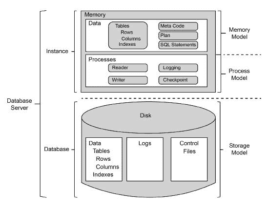
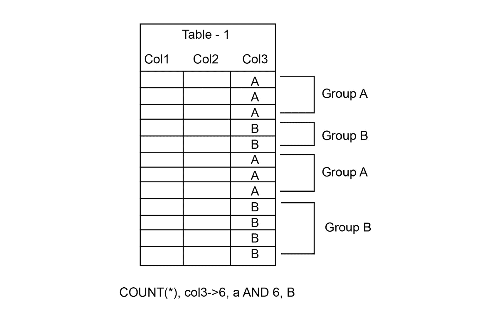
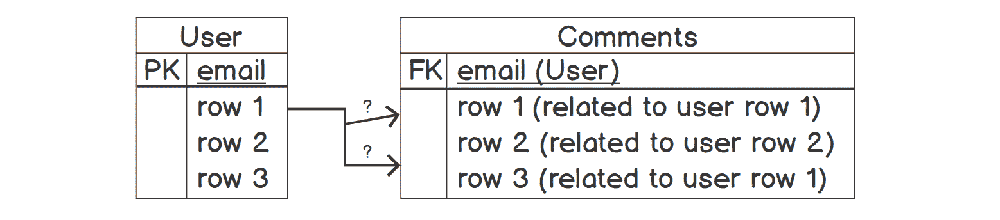
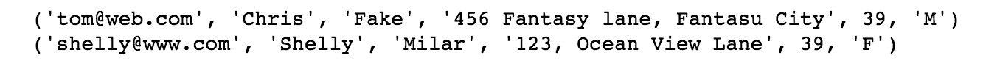
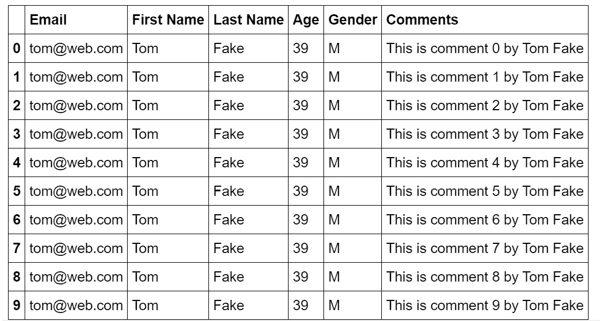
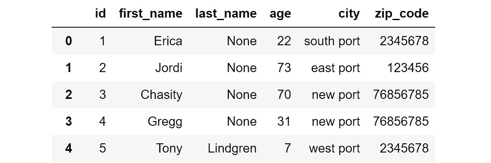
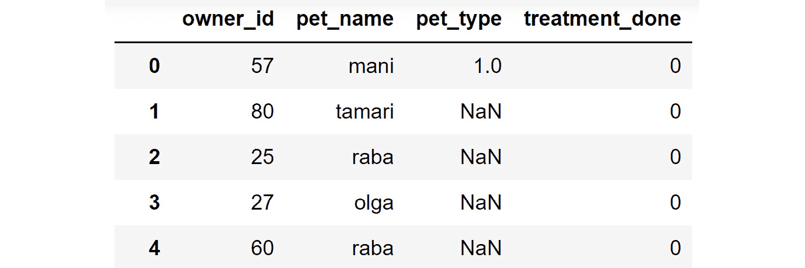
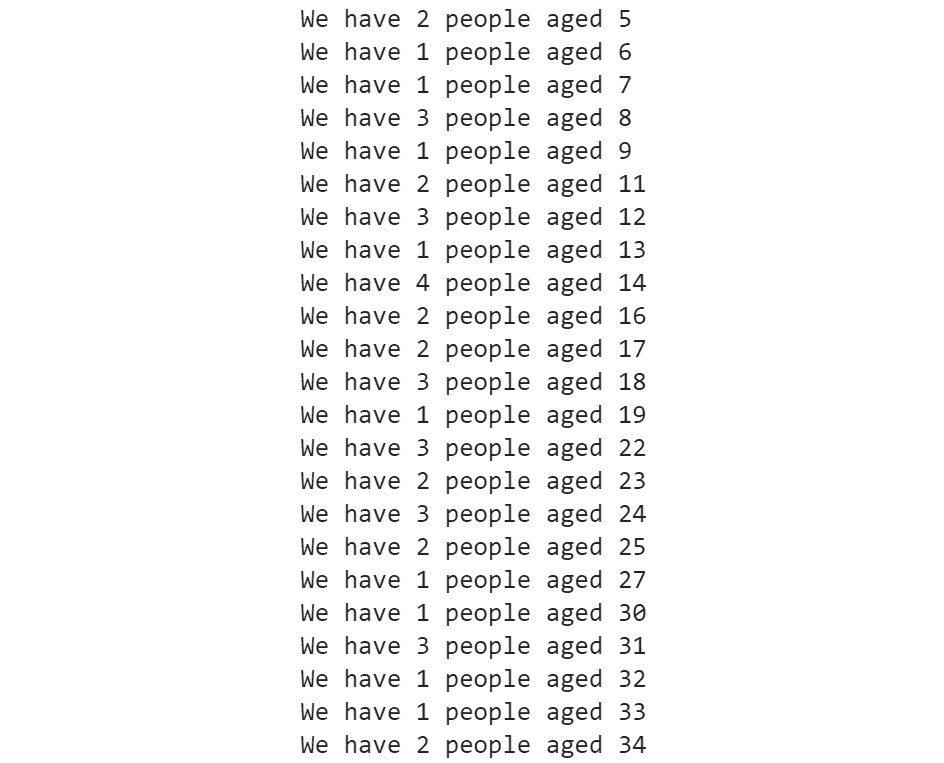

# 8. RDBMS 和 SQL

概述

本章将向您介绍使用 Python 查询数据库、将数据从 SQL 转换为然后存储在`pandas` DataFrame 中的 RDBMS 基础知识。它将解释数据库的概念，包括它们的创建、操作和控制，以及如何将表转换为`pandas` DataFrame。到本章结束时，您将学习一些基本的 SQL 命令。这些知识将使您能够熟练地添加、更新、检索和从数据库中删除数据；这对于成长中的数据整理专家来说是另一种宝贵的技能。

# 简介

我们数据之旅的这一章专注于**关系型数据库管理系统（RDBMS**）和**结构化查询语言（SQL**）。在前一章中，我们存储并从文件中读取数据。在本章中，我们将读取结构化数据，设计对数据的访问，并为数据库创建查询接口。

多年来，RDBMS 格式一直是存储数据的传统方式。RDBMS 是存储、管理和检索数据最安全的方式之一。它有一个坚实的数学基础（关系代数和关系演算），并暴露了一个高效直观的声明性语言——SQL，以便轻松交互。几乎每种语言都有丰富的库来与不同的 RDBMS 交互，使用它们的技巧和方法已经过充分测试和了解。

扩展关系型数据库管理系统（RDBMS）是一个相当熟悉的任务，有一群受过良好训练、经验丰富的专业人士（数据库管理员，简称 DBA）来执行这项工作。

因此，我们作为数据整理专业人员或数据工程师，在某个时候遇到 RDBMS 是完全可以理解的。我们将需要从本章获得工具和知识来处理 RDBMS。

正如我们在以下图表中可以看到的，数据库管理系统市场很大。这个图表是基于 Scalegrid 在 2019 年进行的市场研究制作的：

![图 8.1：ScaleGrid 在 2019 年发布的商业数据库市场份额]

![img/B15780_08_01.jpg]

图 8.1：ScaleGrid 在 2019 年发布的商业数据库市场份额

在本章中，我们将学习和探索数据库和关系型数据库管理系统的一些基本和基本概念。我们将从数据库的理论概念复习开始，然后将在我们的 Python 环境中创建和操作数据库。

# RDBMS 和 SQL 的复习

RDBMS 是一种管理数据（以表格形式表示给最终用户）的软件，它使用 Codd 的关系模型构建，并存储在物理硬盘上。我们今天遇到的大多数数据库都是 RDBMS。近年来，整个行业向一种新型的数据库管理系统转变，称为 NoSQL（MongoDB、CouchDB、Riak 等）。这些系统虽然在某些方面遵循 RDBMS 的一些规则，但在大多数情况下，它们拒绝或修改了这些规则。

## RDBMS 是如何结构的？

RDBMS 结构由三个主要元素组成，即存储引擎、查询引擎和日志管理。以下是一个演示 RDBMS 结构的图表：



图 8.2：RDBMS 结构

以下是一些 RDBMS 结构的主要概念：

+   **存储引擎**：这是 RDBMS 的部分，负责以高效的方式存储数据，并在需要时以高效的方式检索数据。作为 RDBMS 系统的最终用户（应用程序开发人员被视为 RDBMS 的最终用户），我们永远不会需要直接与这一层交互。

+   **查询引擎**：这是关系型数据库管理系统（RDBMS）的一部分，它允许我们创建数据对象（表、视图等），操作它们（创建和删除列，创建/删除/更新行等），并使用简单而强大的语言查询它们（读取行）。

+   **日志管理**：这是 RDBMS 的部分，负责创建和维护日志。如果你想知道为什么日志如此重要，那么你应该了解一下现代 RDBMS（如 PostgreSQL）如何使用所谓的**写入前日志**（或简称 **WAL**）来处理复制和分区。

我们将在本章中关注查询引擎。

## SQL

**SQL**（发音为 *sequel*），正如其通常所知，是一种基于 E.F. Codd 的关系模型最初设计的特定领域语言，在今天的数据库中广泛用于定义、插入、操作和从数据库中检索数据。它可以进一步细分为四个较小的子语言，即**数据定义语言**（**DDL**）、**数据操作语言**（**DML**）、**数据查询语言**（**DQL**）和**数据控制语言**（**DCL**）。使用 SQL 有几个优点，以下是一些：

+   它基于一个坚实的数学框架，因此易于理解。

+   它是一种声明性语言，这意味着我们实际上从未告诉它如何完成其工作。我们几乎总是告诉它要做什么。这使我们免去了编写数据管理自定义代码的大负担。我们可以更专注于我们试图解决的查询问题，而不是烦恼于如何创建和维护数据存储。

+   它提供了快速且易于阅读的方式来处理数据。

+   SQL 提供了通过单个查询获取多个数据片段的现成方法。

下一个主题的主要关注领域将是 DDL、DML 和 DQL。DCL 部分更多是针对数据库管理员的。让我们简要讨论一下：

+   `CREATE TABLE`、`DROP TABLE` 和 `ALTER TABLE`。

    注意

    注意大写字母的使用。这并不是一个要求，你可以使用小写字母，但这是一个广泛遵循的约定，我们将在本书中使用它。

+   `INSERT INTO`、`DELETE FROM` 或 `UPDATE`。

+   `SELECT` 命令。我们还将看到并使用主键、外键、索引、连接等概念。

一旦在数据库中定义并插入数据，它可以表示如下：

![图 8.3：显示样本数据的表]

![图片 B15780_08_03.jpg]

![图 8.3：显示样本数据的表]

关于 RDBMS 的另一件事要记住的是关系。通常，在一个表中，我们有一列或多列，这些列将为表中的每一行提供唯一的值。我们称它们为表的**主键**。我们应该意识到，我们将在行之间遇到唯一的值，这些值不是主键。它们与主键之间的主要区别是主键不能为空。

通过使用一个表的主键并将其作为另一个表的外键提及，我们可以在两个表之间建立关系。某个表可以与任何有限数量的表相关联。

关系可以是`1:1`，这意味着第二个表中的每一行都与第一个表中的一行唯一相关联，或者是`1:N`、`N:1`或`N:M`。以下是一个关系的示例：

![图 8.4：显示关系的图]

![图片 B15780_08_04.jpg]

![图 8.4：显示关系的图]

通过这个简短的复习，我们现在可以开始动手练习，并编写一些 SQL 来存储和检索数据。

## 使用 RDBMS（MySQL/PostgreSQL/SQLite）

在这个主题中，我们将关注如何编写一些基本的 SQL 命令，以及如何从 Python 连接到数据库并在 Python 中有效地使用它。我们将选择 SQLite 作为数据库。还有其他数据库，如 Oracle、MySQL、PostgreSQL 和 DB2。你将要学习的主要技巧不会因你使用的数据库而改变。然而，对于不同的数据库，你需要安装不同的第三方 Python 库（例如，对于 PostgreSQL，需要安装 Psycopg2）。它们之所以都以相同的方式（除了某些小细节外）运行，是因为它们都遵循 PEP249（通常称为 Python DB API 2）。

这是一个良好的标准化，在从一种关系型数据库管理系统（RDBMS）迁移到另一种时，可以节省我们很多麻烦。如果你已经对数据库有一些经验，那么你会注意到我们不会使用任何服务器地址、用户名、密码或其他凭证来连接到数据库。这是因为这些字段在 sqlite3 中不是必需的，与 PostgreSQL 或 MySQL 不同。SQLite 的主要数据库引擎是嵌入式的。

注意

大多数用 Python 编写并使用某种 RDBMS 作为数据存储的行业标准项目通常依赖于一个**对象关系映射器**（**ORM**）。ORM 是 Python 中的一个高级库，在处理 RDBMS 时使许多任务变得简单。它还提供了一个比在 Python 代码中编写原始 SQL 更 Pythonic 的 API。

## 练习 8.01：在 SQLite 中连接到数据库

在这个练习中，我们将探讨在 Python 代码中使用 RDBMS 的第一步。我们将连接到数据库`lesson.db`。然后我们将安全地关闭连接。让我们执行以下步骤：

1.  使用以下命令从 Python 导入 `sqlite3` 库：

    ```py
    import sqlite3
    ```

1.  使用 `connect` 函数连接到数据库：

    ```py
    conn = sqlite3.connect("../lesson.db")
    ```

1.  按如下方式关闭连接：

    ```py
    conn.close()
    ```

    此 `conn` 对象是主要连接对象，一旦我们想要与数据库交互，我们将需要它来获取第二种类型的对象。我们需要小心关闭对数据库的任何打开连接。

1.  使用与文件相同的 `with` 语句，连接到数据库，如下所示：

    ```py
    with sqlite3.connect("../lesson.db") as conn:
        pass
    ```

在这个练习中，我们使用 Python 连接到一个数据库。

注意

要访问此特定部分的源代码，请参阅 [`packt.live/2YMWrBD`](https://packt.live/2YMWrBD)。

你也可以在 [`packt.live/3df6q87`](https://packt.live/3df6q87) 上运行此示例。

在下一个练习中，我们将看到使用 Python 创建表并将数据放入表中的最佳方式。

## SQLite 中的 DDL 和 DML 命令

在 SQL 中创建一个表，使用 `CREATE TABLE` SQL 子句。这需要表名和表定义。表名是数据库引擎用来查找和使用表以进行所有未来事务的唯一标识符。它可以是一切（任何字母数字字符串），只要它是唯一的。我们以 (`column_name_1 data_type`, `column_name_2 data type`, `…` ) 的形式添加表定义。为了我们的目的，我们将使用文本和整数数据类型，但通常，标准数据库引擎支持更多的数据类型，例如浮点数、双精度浮点数、日期时间型和布尔型。我们还需要指定一个主键。主键是一个唯一、非空的标识符，用于在表中唯一标识一行。在我们的例子中，我们使用电子邮件作为主键。主键可以是整数或文本。

你需要知道的是，除非你对你刚刚执行的一系列操作（我们正式称之为事务）调用提交，否则实际上什么都不会执行并在数据库中反映出来。这个特性被称为原子性。实际上，为了使数据库成为行业标准（在现实生活中可用），它需要遵循 **原子性、一致性、隔离性、持久性**（**ACID**）特性。

如其名所示，**数据定义语言**（**DDL**）是提前与数据库引擎通信以定义数据将如何呈现的方式。数据库引擎根据提供的定义创建一个表对象，并对其进行准备。

## 练习 8.02：在 SQLite 中使用 DDL 和 DML 命令

在这个练习中，我们将连接到 `lesson.db` 数据库，然后创建一个 `user` 表。然后，我们将使用 DDL 和 DML 命令将数据插入到表中。让我们执行以下步骤：

1.  使用 SQLite 的 `connect` 函数连接到 `lesson.db` 数据库。通过调用 `conn.cursor()` 创建一个 `cursor` 对象。`cursor` 对象充当与数据库通信的中介：

    ```py
    import sqlite3
    with sqlite3.connect("../lesson.db") as conn:
        cursor = conn.cursor()
    ```

1.  按如下方式在 Python 中创建一个表：

    ```py
    cursor.execute("CREATE TABLE IF NOT EXISTS \
                    user (email text, first_name  text, \
                          last_name text, address text, age integer, \
                          PRIMARY KEY (email))")
    ```

1.  将行插入你创建的数据库中，如下所示：

    ```py
    cursor.execute("INSERT INTO user VALUES \
                   ('bob@example.com', 'Bob', 'Codd', \
                    '123  Fantasy lane, Fantasy City', 31)") 
    cursor.execute("INSERT INTO user VALUES \
                   ('tom@web.com', 'Tom', 'Fake', \
                    '456 Fantasy lane, Fantasy City', 39)")
    ```

1.  提交到数据库：

    ```py
    conn.commit()
    ```

这将创建表并将两行数据写入其中。

注意

要访问本节的具体源代码，请参阅[`packt.live/2YeniaH`](https://packt.live/2YeniaH)。

你也可以在[`packt.live/2BogE8J`](https://packt.live/2BogE8J)上运行此示例。

你必须执行整个 Notebook 才能得到期望的结果。

在下一节中，我们将读取我们刚刚存储的数据。

## 在 SQLite 中从数据库读取数据

在前面的练习中，我们创建了一个表格并将数据存储在其中。现在，我们将学习如何读取存储在这个数据库中的数据。

`SELECT`子句非常强大，对于数据从业者来说，掌握`SELECT`及其相关内容（如条件、连接和分组）非常重要。

`SELECT`后面的`*`告诉引擎从表中选取所有列。这是一个有用的缩写。我们没有提到任何选择条件（例如年龄超过某个值，名字以某个字母序列开头等）。如果我们有一个非常大的表，这样做既耗时又效率低下。因此，我们希望使用`LIMIT`子句来限制我们想要的行数。

你可以使用 SQL 中的`SELECT`子句检索数据，如下所示：

```py
import sqlite3
with sqlite3.connect("../lesson.db") as conn:
    cursor = conn.cursor()
    rows = cursor.execute('SELECT * FROM user')
    for row in rows:
        print(row)
```

输出如下：

```py
('bob@example.com', 'Bob', 'Codd', '123 Fantasy lane, Fantasy City', 31)
('tom@web.com', 'Tom', 'Fake', '456 Fantasy lane, Fantasy City', 39)
```

使用`LIMIT`与`SELECT`子句的语法如下：

```py
SELECT * FROM <table_name> LIMIT 50;
```

注意

这个语法是示例代码，在 Jupyter Notebooks 上不会工作。

这将选择所有列，但只从表中选取前`50`行。

现在我们已经看到了如何连接、写入和读取基本数据到数据库，在接下来的练习中，我们将探索更高级的操作，其中数据的排序将是下一个要学习的。

## 练习 8.03：排序数据库中存在的值

在这个练习中，我们将使用`ORDER BY`子句按`age`列的降序和升序对`user`表的行进行排序。让我们执行以下步骤：

1.  连接到`lesson.db`数据库，并按年龄降序排序，如下所示：

    ```py
    import sqlite3
    with sqlite3.connect("../lesson.db") as conn:
        cursor = conn.cursor()
        rows = cursor.execute('SELECT * FROM user ORDER BY age DESC')
        for row in rows:
            print(row)
    ```

    输出如下：

    ```py
    ('tom@web.com', 'Tom', 'Fake', '456 Fantasy lane, Fantasy City', 39)
    ('bob@example.com', 'Bob', 'Codd', '123 Fantasy lane, Fantasy City', 31)
    ```

1.  按年龄升序排序`lesson.db`数据库，如下所示：

    ```py
    with sqlite3.connect("../lesson.db") as conn:
        cursor = conn.cursor()
        rows = cursor.execute('SELECT * FROM user ORDER BY age')
        for row in rows:
            print(row)
    ```

    输出如下：

    ```py
    ('bob@example.com', 'Bob', 'Codd', '123 Fantasy lane, Fantasy City', 31)
    ('tom@web.com', 'Tom', 'Fake', '456 Fantasy lane, Fantasy City', 39)
    ```

注意，我们不需要指定`ASC`来按升序排序。

在这个练习中，我们看到了如何排序数据。排序是你经常需要执行的最重要操作之一。

注意

要访问本节的具体源代码，请参阅[`packt.live/37I7Iap`](https://packt.live/37I7Iap)。

你也可以在[`packt.live/2YOu4D5`](https://packt.live/2YOu4D5)上运行此示例。

你必须执行整个 Notebook 才能得到期望的结果。

在接下来的练习中，我们将看到如何更新已定义表的架构。

## ALTER 命令

`ALTER`是 RDBMS 用来向已存在的表中添加新列或更改列的数据类型的命令，而`UPDATE`命令用来更新数据库中一行或多行的一个或多个列的值。我们将在下一节中检查它们的使用。

## 练习 8.04：修改表结构并更新新字段

在这个练习中，我们将使用`ALTER`命令在`user`表中添加一个列`gender`。然后，通过使用`UPDATE`命令，我们将设置`gender`列的值。让我们按照以下步骤进行操作：

1.  使用以下命令与数据库建立连接：

    ```py
    import sqlite3
    with sqlite3.connect("../lesson.db") as conn:
        cursor = conn.cursor()
    ```

1.  使用以下命令在`user`表中添加另一列并填充 null 值：

    ```py
    cursor.execute("ALTER TABLE user ADD COLUMN gender text")
    conn.commit()
    ```

1.  使用以下命令更新所有性别值，使它们为`M`：

    ```py
    cursor.execute("UPDATE user SET gender='M'")
    conn.commit()
    ```

1.  要检查修改后的表，请执行以下命令：

    ```py
    with sqlite3.connect("../lesson.db") as conn:
        cursor = conn.cursor()
        rows = cursor.execute('SELECT * FROM user ORDER BY age')
        for row in rows:
            print(row)
    ```

    输出如下：

    ```py
    ('bob@example.com', 'Bob', 'Codd', '123 Fantasy lane, Fantasy City', 
     31, 'M')
    ('tom@web.com', 'Tom', 'Fake', '456 Fantasy lane, Fantasy City', 
     39, 'M')
    ```

在使用`UPDATE`时必须谨慎，因为没有选择性子句（如`WHERE`）的`UPDATE`会影响整个表。

注意

要访问此特定部分的源代码，请参阅[`packt.live/312BtBL`](https://packt.live/312BtBL)。

您也可以在[`packt.live/3ddIYbh`](https://packt.live/3ddIYbh)在线运行此示例。

您必须执行整个笔记本才能获得期望的结果。

## `GROUP BY`子句

我们将学习一个我们已经学习过的概念。这被称为`GROUP BY`子句。`GROUP BY`子句是一种用于从数据库中检索不同值并将它们放入单独桶中的技术。以下图表解释了`GROUP BY`子句是如何工作的：



图 8.5：GROUP BY 子句在表上的说明

在前面的图中，我们可以看到`col3`列在所有行中只有两个唯一的值，`A`和`B`。用于检查每个组所属行总数的命令如下：

```py
SELECT count(*), col3 FROM <tablename> GROUP BY col3
```

让我们通过以下练习来练习`GroupBy`子句。

## 练习 8.05：在表中分组值

在这个练习中，我们将使用`GROUP BY`子句来选择按`gender`分组的列。我们将向表中添加男性和女性的用户，并根据性别对他们进行分组。让我们按照以下步骤进行操作：

1.  使用以下命令与数据库建立连接：

    ```py
    import sqlite3
    with sqlite3.connect("../lesson.db") as conn:
        cursor = conn.cursor()
    ```

1.  将女性用户添加到表中：

    ```py
    cursor.execute("INSERT INTO user VALUES ('shelly@www.com', 'Shelly',\
                                             'Milar',\
                                             '123, Ocean View Lane',\
                                             39, 'F')")
    conn.commit()
    cursor = conn.cursor()
    rows = cursor.execute('SELECT * FROM user ORDER BY age DESC')
    for row in rows:
        print(row)
    ('tom@web.com', 'Tom', 'Fake', '456 Fantasy lane, Fantasy City', 
      39, 'M')
    ('shelly@www.com', 'Shelly', 'Milar', '123, Ocean View Lane', 
      39, 'F')
    ('bob@example.com', 'Bob', 'Codd', '123 Fantasy lane, Fantasy City', 
      31, 'M')
    ```

1.  运行以下代码以查看每个`gender`的计数：

    ```py
    rows = cursor.execute("SELECT COUNT(*), "\
                          "gender FROM user GROUP BY gender")
    for row in rows:
        print(row)
    ```

    输出如下：

    ```py
    (1, 'F')
    (2, 'M')
    ```

    注意

    要访问此特定部分的源代码，请参阅[`packt.live/3fEzV4N`](https://packt.live/3fEzV4N)。

    您也可以在[`packt.live/2N8kS7l`](https://packt.live/2N8kS7l)在线运行此示例。

到目前为止，我们已经了解了如何连接数据库、创建表以及在其中插入值。我们还探讨了诸如从表中读取值、排序和按共同值分组等主题。这些都是在处理数据库时非常必要的技能。然而，我们还没有探讨 RDBMS 的 "*关系*" 部分。这正是接下来要讨论的内容。

# 数据库中的关系映射

我们一直在使用单个表，对其进行修改，以及读取数据。然而，关系型数据库管理系统（RDBMS）的真正力量来自于处理不同对象（表）之间的关系。在本节中，我们将创建一个名为 comments 的新表，并以 `1: N` 的关系将其与用户表链接起来。这意味着一个用户可以有多个评论。我们将通过在 comments 表中添加用户表的主键作为外键来实现这一点。这将创建一个 `1: N` 的关系。

当我们链接两个表时，我们需要指定如果父行被删除，并且在其另一个表中有很多子行时，数据库引擎应该做什么。正如我们可以在以下图中看到的那样，当我们删除用户表的 `row1` 时，我们正在询问问号所在位置会发生什么：



图 8.6：关系说明图

在非 RDBMS 情况下，这种情况可能会迅速变得难以管理和维护。然而，使用 RDBMS，我们只需要非常精确地告诉数据库引擎在这种情况下应该做什么。数据库引擎会为我们完成剩下的工作。我们使用 `ON DELETE` 来告诉引擎当父行被删除时，我们应该如何处理表中的所有行。以下代码说明了这些概念：

```py
import sqlite3
with sqlite3.connect("../lesson.db") as conn:
    cursor = conn.cursor()
    cursor.execute("PRAGMA foreign_keys = 1")
    sql = """
    CREATE TABLE comments ( \
         user_id text, \
         comments text, \
         FOREIGN KEY (user_id) REFERENCES user (email) \
         ON DELETE CASCADE ON UPDATE NO ACTION \
    )
    """
    cursor.execute(sql)
    conn.commit()
```

`ON DELETE CASCADE` 行通知数据库引擎，当父行被删除时，我们希望删除所有子行。我们将在后续练习中详细讨论删除值。我们也可以为 `UPDATE` 定义操作。在这种情况下，对于 `UPDATE` 没有要执行的操作。

`FOREIGN KEY` 修饰符修改一个列定义（在这个例子中是 `user_id`）并将其标记为外键，这与其他表的主键（在这个例子中是 `email`）相关联。外键是两个表之间的链接。我们在一个表中定义主键，然后将其相同的值定义为另一个表的外键，从而在它们之间创建链接。

你可能会注意到代码中看起来奇怪的 `cursor.execute("PRAGMA foreign_keys = 1")` 行。它之所以存在，仅仅是因为 SQLite 默认不使用正常的 foreign key 功能。正是这一行启用了该功能。这是 SQLite 的典型做法，我们不需要为任何其他数据库使用它。

因此，我们已经涵盖了两个表之间关系的基本概念。一个表可以与任意数量的表相关联。存在不同类型的关系，例如`1:1`、`1:n`和`n:n`。鼓励读者详细了解这些内容。

在下一节中，我们将向新创建的表中插入行。

## 在评论表中添加行

我们创建了一个名为`comments`的表。在本节中，我们将动态生成一个`INSERT`查询，如下所示：

```py
import sqlite3
with sqlite3.connect("../lesson.db") as conn:
    cursor = conn.cursor()
    cursor.execute("PRAGMA foreign_keys = 1")
    sql = "INSERT INTO comments VALUES ('{}', '{}')"
    rows = cursor.execute('SELECT * FROM user ORDER BY age')
    for row in rows:
        email = row[0]
        print("Going to create rows for {}".format(email))
        name = row[1] + " " + row[2]
        for i in range(10):
            comment = "This is comment {} by {}".format(i, name)
            conn.cursor().execute(sql.format(email, comment))
            conn.commit()
```

请注意我们如何动态生成插入查询，以便为每个用户插入 10 条评论。

我们已经在新表中插入了一些行，并建立了这个表与之前表之间的关系。接下来，我们将讨论数据库中最重要概念之一——连接。它们帮助我们编写简洁的查询以从多个相关联的表中检索数据。

# 连接

现在，我们将学习如何利用我们刚刚建立的关系。这意味着如果我们有一个表的主键，我们可以从该表恢复所需的所有数据，以及从子表中的所有相关联行。为了实现这一点，我们将使用称为连接的东西。

连接基本上是一种通过使用任何类型的键（主键-外键关系）从两个表中检索相关联行的方法。存在许多类型的连接，包括`INNER`、`LEFT OUTER`、`RIGHT OUTER`、`FULL OUTER`和`CROSS`。它们用于不同的场景。然而，在大多数简单`1:N`关系中，我们最终会使用`INNER`连接。在*第一章*，*使用 Python 进行数据整理入门*中，我们学习了集合。我们可以将`INNER`连接视为两个集合的交集。以下图表说明了这些概念：


图 8.7：表示交集连接的图表

在这里，`A`代表一个表，`B`代表另一个表。拥有共同成员的意义是它们之间存在关系。它将`A`表的所有行与`B`表的所有行进行比较，以找到满足连接谓词的匹配行。这可能会迅速变成一个复杂且耗时的操作。连接操作可能非常昂贵。通常，在指定连接后，我们使用某种类型的`WHERE`子句来缩短从表`A`或`B`中检索的行以执行匹配的范围。

在我们的案例中，我们的第一个表，即用户表，有三个条目，主键是电子邮件。我们可以在查询中使用这一点来获取来自 Bob 的评论：

```py
import sqlite3
with sqlite3.connect("../lesson.db") as conn:
    cursor = conn.cursor()
    cursor.execute("PRAGMA foreign_keys = 1")
    sql = """
    SELECT * FROM comments \
    JOIN user ON comments.user_id = user.email \
    WHERE user.email='bob@example.com' \
    """
    rows = cursor.execute(sql)
    for row in rows:
        print(row)
```

输出如下：

```py
('bob@example.com', 'This is comment 0 by Bob Codd', 'bob@example.com', 'Bob', 'Codd', '123 Fantasy lane, Fantasy City', 31, 'M')
('bob@example.com', 'This is comment 1 by Bob Codd', 'bob@example.com', 'Bob', 'Codd', '123 Fantasy lane, Fantasy City', 31, 'M')
('bob@example.com', 'This is comment 2 by Bob Codd', 'bob@example.com', 'Bob', 'Codd', '123 Fantasy lane, Fantasy City', 31, 'M')
('bob@example.com', 'This is comment 3 by Bob Codd', 'bob@example.com', 'Bob', 'Codd', '123 Fantasy lane, Fantasy City', 31, 'M')
('bob@example.com', 'This is comment 4 by Bob Codd', 'bob@example.com', 'Bob', 'Codd', '123 Fantasy lane, Fantasy City', 31, 'M')
('bob@example.com', 'This is comment 5 by Bob Codd', 'bob@example.com', 'Bob', 'Codd', '123 Fantasy lane, Fantasy City', 31, 'M')
('bob@example.com', 'This is comment 6 by Bob Codd', 'bob@example.com', 'Bob', 'Codd', '123 Fantasy lane, Fantasy City', 31, 'M')
('bob@example.com', 'This is comment 7 by Bob Codd', 'bob@example.com', 'Bob', 'Codd', '123 Fantasy lane, Fantasy City', 31, 'M')
('bob@example.com', 'This is comment 8 by Bob Codd', 'bob@example.com', 'Bob', 'Codd', '123 Fantasy lane, Fantasy City', 31, 'M')
('bob@example.com', 'This is comment 9 by Bob Codd', 'bob@example.com', 'Bob', 'Codd', '123 Fantasy lane, Fantasy City', 31, 'M')
```

之前`JOIN`查询的输出，显示我们同时从两个表中读取数据，将查询范围限制在特定的电子邮件上。

我们刚刚探讨了所有操作中最重要的一项——连接操作。在接下来的章节中，我们将讨论其其他一些方面。

# 从 JOIN 查询中检索特定列

在上一个练习中，我们看到了我们可以使用`JOIN`来从两个表中检索相关行。然而，如果我们查看结果，我们会看到它返回了所有列，从而结合了两个表。这并不非常简洁。如果我们只想看到电子邮件和相关的评论，而不是所有数据呢？

有一些简洁的代码可以让我们做到这一点：

```py
import sqlite3
with sqlite3.connect("../lesson.db") as conn:
    cursor = conn.cursor()
    cursor.execute("PRAGMA foreign_keys = 1")
    sql = """
    SELECT comments.* FROM comments \
    JOIN user ON comments.user_id = user.email \
    WHERE user.email='bob@example.com' \
    """
    rows = cursor.execute(sql)
    for row in rows:
        print(row)
```

只需更改`SELECT`语句，我们就可以使最终结果如下，其中只包含`comments`表的列：

```py
('bob@example.com', 'This is comment 0 by Bob Codd')
('bob@example.com', 'This is comment 1 by Bob Codd')
('bob@example.com', 'This is comment 2 by Bob Codd')
('bob@example.com', 'This is comment 3 by Bob Codd')
('bob@example.com', 'This is comment 4 by Bob Codd')
('bob@example.com', 'This is comment 5 by Bob Codd')
('bob@example.com', 'This is comment 6 by Bob Codd')
('bob@example.com', 'This is comment 7 by Bob Codd')
('bob@example.com', 'This is comment 8 by Bob Codd')
('bob@example.com', 'This is comment 9 by Bob Codd')
```

我们现在已经看到了连接。它们非常有用，您在处理现实生活中的数据库时经常会使用它们。接下来是删除行的详细探讨。

## 从表中删除行

这将通过使用`DELETE`命令来完成。正如其名所示，这个命令有助于从表中删除行。这是一个不可逆的过程，意味着一旦删除，我们就无法恢复这些行。所以在运行此命令时要非常小心，因为它可能会对数据产生破坏性影响。请记住，它几乎总是需要与`WHERE`子句一起运行，以便我们只删除部分数据，而不是全部数据。

## 练习 8.06：从表中删除行

在这个练习中，我们将与两个表`user`和`comments`一起工作，这两个表是`lesson.db`数据库的一部分。

注意

这个练习的 GitHub 版本从我们刚才看到的前 4 个示例开始，首先是创建`comments`表。如果您已经执行了这些步骤，可以忽略这些步骤。

我们将从`user`表中删除一行，并观察它将对评论表产生的影响。包括所有之前提到的步骤。让我们执行以下步骤：

1.  要从表中删除一行，我们使用 SQL 中的`DELETE`子句。要运行对用户表的删除操作，我们将使用以下代码：

    ```py
    with sqlite3.connect("../lesson.db") as conn:
        cursor = conn.cursor()
        cursor.execute("PRAGMA foreign_keys = 1")
        cursor.execute("DELETE FROM user "\
                       "WHERE email='bob@example.com'")
        conn.commit()
    ```

1.  对用户表执行`SELECT`操作：

    ```py
    with sqlite3.connect("../lesson.db") as conn:
        cursor = conn.cursor()
        cursor.execute("PRAGMA foreign_keys = 1")
        rows = cursor.execute("SELECT * FROM user")
        for row in rows:
            print(row)
    ```

    输出如下：

    ```py
    ('tom@web.com', 'Tom', 'Fake', '456 Fantasy lane, Fantasy City', 
      39, 'M')
    ('shelly@www.com', 'Shelly', 'Milar', '123, Ocean View Lane', 
      39, 'F')
    ```

    注意，用户`Bob`已经被删除。

    现在，转向`comments`表，我们必须记住，在创建表时我们已经提到了`ON DELETE CASCADE`。数据库引擎知道，如果从父表（`user`）中删除一行，所有相关的子表（`comments`）中的行也必须被删除。

1.  使用以下命令对`comments`表执行`SELECT`操作：

    ```py
    with sqlite3.connect("../lesson.db") as conn:
        cursor = conn.cursor()
        cursor.execute("PRAGMA foreign_keys = 1")
        rows = cursor.execute("SELECT * FROM comments")
        for row in rows:
            print(row)
    ```

    输出（部分显示）如下：

    ```py
    ('tom@web.com', 'This is comment 0 by Tom Fake')
    ('tom@web.com', 'This is comment 1 by Tom Fake')
    ('tom@web.com', 'This is comment 2 by Tom Fake')
    ('tom@web.com', 'This is comment 3 by Tom Fake')
    ('tom@web.com', 'This is comment 4 by Tom Fake')
    ('tom@web.com', 'This is comment 5 by Tom Fake')
    ('tom@web.com', 'This is comment 6 by Tom Fake')
    ('tom@web.com', 'This is comment 7 by Tom Fake')
    ('tom@web.com', 'This is comment 8 by Tom Fake')
    ('tom@web.com', 'This is comment 9 by Tom Fake')
    ```

我们可以看到，与`Bob`相关的所有行都已从`comments`表中删除。

我们已经观察了`DELETE`命令，并且学习了如何安全地使用它。

注意

要访问此特定部分的源代码，请参阅[`packt.live/2YeutzP`](https://packt.live/2YeutzP)。

您也可以在[`packt.live/3fArsQb`](https://packt.live/3fArsQb)上在线运行此示例。

您必须执行整个笔记本才能得到期望的结果。

在以下部分，我们将看到如何更新表中的特定值。

## 在表中更新特定值

在本例中，我们将看到如何更新表中的行。没有`WHERE`子句，更新通常不是一个好主意。原因是我们可能最终会更新我们本不想更新的行。

我们可以将`UPDATE`与`WHERE`结合使用，以选择性地更新具有电子邮件地址 tom@web.com 的用户的首个名字，如下面的代码所示：

```py
with sqlite3.connect("../lesson.db") as conn:
    cursor = conn.cursor()
    cursor.execute("PRAGMA foreign_keys = 1")
    cursor.execute("UPDATE user set first_name='Chris' "\
                   "where email='tom@web.com'")
    conn.commit()
    rows = cursor.execute("SELECT * FROM user")
    for row in rows:
        print(row)
```

输出如下所示：



图 8.8：更新查询的输出，显示新更新的第一个名字

到目前为止，我们已经涵盖了与数据库相关的大量概念。我们学习了一套处理数据库级操作的重要技能。在下一节中，我们将结合两个世界；数据库的世界和 pandas 的世界。

我们已经探讨了从数据库存储和查询数据的基本方面，但作为一个数据整理专家，我们需要我们的数据打包并呈现为 DataFrame，这样我们就可以对它们进行快速方便的操作。

## 练习 8.07：关系数据库管理系统和 DataFrame

在这个练习中，我们将连接到`lesson.db`数据库并连接两个表，`user`和`comments`。我们将创建一个空的`data`列表，然后添加这个连接表的行到`data`中。接下来，我们将`data`的内容存储在一个`pandas` DataFrame 中。为了完成这个练习，让我们执行以下步骤：

1.  使用以下代码导入 pandas：

    ```py
    import pandas as pd
    ```

1.  使用电子邮件、名字、姓氏、年龄、性别和评论作为列名创建一个列列表。同时，创建一个空的`data`列表：

    ```py
    columns = ["Email", "First Name", "Last Name", \
               "Age", "Gender", "Comments"]
    data = []
    ```

1.  使用 SQLite 连接到`lesson.db`并获取一个游标，如下所示：

    ```py
    import sqlite3
    with sqlite3.connect("../lesson.db") as conn:
        cursor = conn.cursor()
    ```

1.  使用游标的`execute`方法设置`PRAGMA foreign_keys = 1`：

    ```py
    cursor.execute("PRAGMA foreign_keys = 1")
    ```

1.  创建一个包含`SELECT`命令的`sql`变量，并使用连接命令连接数据库：

    ```py
    sql = """
        SELECT user.email, user.first_name, user.last_name, \
        user.age, user.gender, comments.comments FROM comments \
        JOIN user ON comments.user_id = user.email \
        WHERE user.email = 'tom@web.com' \
         """
    ```

1.  使用`cursor`的`execute`方法执行`sql`命令：

    ```py
    rows = cursor.execute(sql)
    ```

1.  将行追加到数据列表中：

    ```py
    for row in rows:
        data.append(row)
    ```

1.  使用数据列表创建一个 DataFrame 并打印结果：

    ```py
    df = pd.DataFrame(data, columns=columns)
    df
    ```

    输出将如下所示：

    

图 8.9：DataFrame 的输出

注意

要访问此特定部分的源代码，请参阅[`packt.live/2YPSdZX`](https://packt.live/2YPSdZX)。

您也可以在[`packt.live/37HZaAi`](https://packt.live/37HZaAi)上在线运行此示例。

您必须执行整个笔记本才能获得期望的结果。

这标志着我们探索数据库世界的旅程结束。这是一个基本的介绍。尽管如此，我们还是成功地覆盖了众多基本主题。数据库管理系统及相关领域是计算机科学中的一个成熟分支，并且仍在积极发展和研究中。我们强烈建议读者了解更多相关信息。

## 活动八.01：从数据库中准确检索数据

本活动的目标是获取来自`persons`和`pets`两个表的数据，这两个表是`petsdb`数据库的一部分。

注意

你可以在[`packt.live/3dcH0rx`](https://packt.live/3dcH0rx)找到`petsdb`数据库。

`persons`表的定义如下：



图 8.10：人员表

`persons`表有以下列：

+   `first_name`：人的名字

+   `last_name`：人的姓氏（可以是`null`）

+   `age`：人的年龄

+   `city`：他们来自的城市

+   `zip_code`：城市的邮政编码

如我们所见，`persons`表中的`id`列（它是一个整数）是该表的主键，也是`pets`表的外键，通过`owner_id`列进行链接。

`pets`表的定义如下：



图 8.11：宠物表

宠物表有以下列：

+   `pet_name`：宠物的名字。

+   `pet_type`：宠物的类型，例如`cat`或`dog`。由于缺乏更多信息，我们不知道哪个数字代表什么，但它是一个整数，可以是`null`。

+   `treatment_done`：这也是一个整数列，其中`0`表示`否`，而`1`表示`是`。

在这个活动中，你首先将连接到`petsdb`数据库并检查连接是否成功。然后，你将创建并执行一些 SQL 命令来回答以下问题：

1.  人员表中不同年龄组的人数是多少？

1.  哪个年龄组的人数最多？

1.  有多少人没有姓氏？

1.  有多少人拥有不止一只宠物？

1.  接受了治疗的有多少宠物？

1.  有多少宠物接受了治疗，并且已知宠物的类型？

1.  来自名为 east port 的城市有多少宠物？

1.  来自名为 east port 的城市有多少宠物，并且谁接受了治疗？

输出应该如下所示：

问题 1 的答案（以下为部分输出）：



图 8.12：人员表中不同年龄组人数的部分输出

问题 2 的答案：

```py
Highest number of people is 5 and came from 73 age group
```

问题 3 的答案：

```py
(60,)
```

问题 4 的答案：

```py
43 people has more than one pet
```

问题 5 的答案：

```py
(36,)
```

问题 6 的答案：

```py
(16,)
```

问题 7 的答案：

```py
(49,)
```

问题 8 的答案：

```py
(11,)
```

注意

可以通过这个链接找到这个活动的解决方案。

在这个活动中，我们应用了本章关于数据库的所有技能。

# 摘要

我们已经到达了数据库章节的结尾。我们学习了如何使用 Python 连接到 SQLite 数据库。我们复习了关系数据库的基础知识以及如何打开和关闭数据库。然后我们学习了如何将这个关系数据库导出到 Python DataFrames。

在下一章中，我们将对用于商业用例的数据集进行数据处理。我们将使用不同类型的数据集，然后以有意义的方式进行数据清洗和处理。我们将能够将本书中迄今为止学到的所有技能和技巧应用于数据处理，并从中获得有价值的见解。
