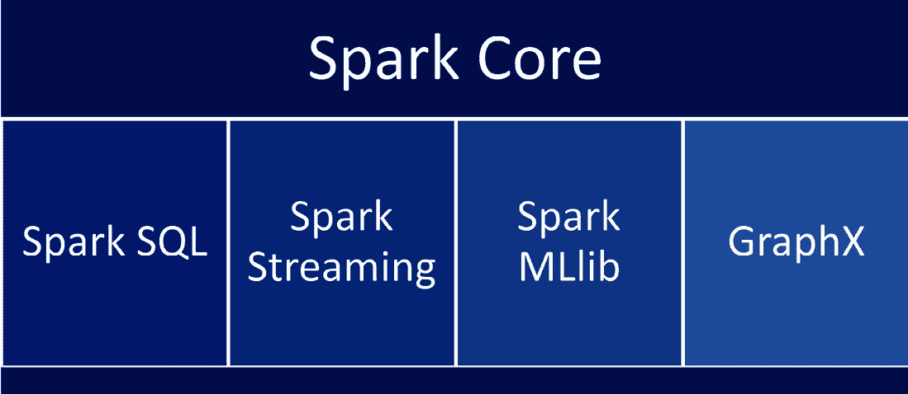
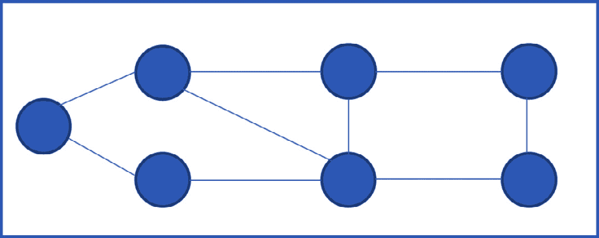

# 第二章：理解 Apache Spark 及其应用

随着机器学习和数据科学的兴起，世界正在经历一个范式转变。每秒钟都在收集大量的数据，而计算能力难以跟上这种快速数据增长的速度。为了利用所有这些数据，Spark 已经成为大数据处理的事实标准。将数据处理迁移到 Spark 不仅是一个节省资源的问题，让你能专注于你的业务；它也是一种现代化你的工作负载，利用 Spark 的能力和现代技术堆栈来创造新的商业机会的手段。

在本章中，我们将涵盖以下主题：

+   什么是 Apache Spark？

+   为什么选择 Apache Spark？

+   Spark 的不同组件

+   Spark 有哪些用例？

+   Spark 的用户是谁？

# 什么是 Apache Spark？

Apache Spark 是一个开源的大数据框架，用于多个大数据应用。Spark 的强大之处在于其卓越的并行处理能力，使其在其领域成为领导者。

根据其网站([`spark.apache.org/`](https://spark.apache.org/))，“*最广泛使用的可扩展计算引擎*”

## Apache Spark 的历史

Apache Spark 始于 2009 年在加州大学伯克利分校 AMPLab 的一个研究项目，并于 2010 年转为开源许可。后来，在 2013 年，它成为 Apache 软件基金会的一部分([`spark.apache.org/`](https://spark.apache.org/))。它在 2013 年之后获得了流行，如今，它已成为众多财富 500 强公司大数据产品的支柱，有成千上万的开发者正在积极为其工作。

Spark 的出现是由于 Hadoop MapReduce 框架的限制。MapReduce 的主要前提是从磁盘读取数据，将数据分发以进行并行处理，对数据应用 map 函数，然后将这些函数减少并保存回磁盘。这种来回读取和保存到磁盘的过程很快就会变得耗时且成本高昂。

为了克服这一限制，Spark 引入了内存计算的概念。除此之外，Spark 还拥有由不同研究倡议带来的几个能力。你将在下一节中了解更多关于它们的信息。

## 理解 Spark 的不同之处

Spark 的基础在于其主要能力，如内存计算、延迟评估、容错性和支持 Python、SQL、Scala 和 R 等多种语言。我们将在下一节中详细讨论每一个。

让我们从内存计算开始。

### 内存计算

Spark 基础构建的第一个主要区分性技术是它利用内存计算。记得我们讨论 Hadoop MapReduce 技术时吗？它的一个主要限制是在每个步骤都将数据写回磁盘。Spark 将其视为改进的机会，并引入了内存计算的概念。主要思想是数据在处理过程中始终保持在内存中。如果我们能够处理一次性存储在内存中的数据量，我们就可以消除在每个步骤中写入磁盘的需要。因此，如果我们能够处理所有计算的数据量，整个计算周期就可以在内存中完成。现在，需要注意的是，随着大数据的出现，很难将所有数据都包含在内存中。即使我们在云计算世界的重型服务器和集群中看，内存仍然是有限的。这就是 Spark 并行处理内部框架发挥作用的地方。Spark 框架以最有效的方式利用底层硬件资源。它将计算分布在多个核心上，并充分利用硬件能力。

这极大地减少了计算时间，因为只要数据可以适应 Spark 计算内存，写入磁盘和读取回磁盘的开销就会最小化。

### 延迟评估

通常，当我们使用编程框架时，后端编译器会查看每个语句并执行它。虽然这对于编程范式来说效果很好，但在大数据和并行处理的情况下，我们需要转向一种前瞻性的模型。Spark 因其并行处理能力而闻名。为了实现更好的性能，Spark 不会在读取代码时执行代码，而是在代码存在并且我们提交 Spark 语句以执行时，第一步是 Spark 构建查询的逻辑映射。一旦这个映射建立，然后它会规划最佳的执行路径。你将在 Spark 架构章节中了解更多关于其复杂性的内容。一旦计划确定，执行才会开始。即使执行开始，Spark 也会推迟执行所有语句，直到遇到一个“操作”语句。Spark 中有两种类型的语句：

+   转换

+   操作

你将在*第三章*中详细了解 Spark 语句的不同类型，其中我们讨论了 Spark 架构。以下是延迟评估的一些优点：

+   效率

+   代码可管理性

+   查询和资源优化

+   简化复杂性

### 弹性数据集/容错性

Spark 的基础是建立在**弹性分布式数据集**（**RDDs**）之上的。它是一个不可变的分布式对象集合，代表了一组记录。RDDs 分布在多个服务器上，它们在多个集群节点上并行计算。RDDs 可以通过代码生成。当我们从外部存储位置读取数据到 Spark 中时，RDDs 会保存这些数据。这些数据可以在多个集群之间共享，并且可以并行计算，从而为 Spark 提供了非常高效的在 RDD 数据上运行计算的方法。RDDs 被加载到内存中进行处理；因此，与 Hadoop 不同，不需要将数据加载到和从内存中进行计算。

RDDs 具有容错性。这意味着如果出现故障，RDDs 有自我恢复的能力。Spark 通过将这些 RDD 分布到不同的工作节点上，同时考虑到每个工作节点执行的任务，来实现这一点。这种对工作节点的处理由 Spark 驱动器完成。我们将在后续章节中详细讨论这一点。

RDDs 在弹性和容错性方面赋予了 Spark 很大的能力。这种能力，结合其他特性，使得 Spark 成为任何生产级应用的工具选择。

### 多语言支持

Spark 支持多种开发语言，如 Java、R、Scala 和 Python。这使用户能够灵活地使用任何选择的编程语言在 Spark 中构建应用程序。

## Spark 的组件

让我们来谈谈 Spark 的不同组件。正如你在*图 1.1*中可以看到的，Spark Core 是 Spark 操作的核心，横跨 Spark 的所有其他组件。本节我们将讨论的其他组件包括 Spark SQL、Spark Streaming、Spark MLlib 和 GraphX。

图 2.1：Spark 组件

让我们来看看 Spark 的第一个组件。

### Spark Core

Spark Core 是 Spark 所有其他组件的核心。它为所有不同的组件提供功能和核心特性。Spark SQL、Spark Streaming、Spark MLlib 和 GraphX 都使用 Spark Core 作为其基础。Spark 的所有功能和特性都由 Spark Core 控制。它提供了内存计算能力以提供速度，一个通用的执行模型以支持广泛的各类应用，以及 Java、Scala 和 Python API 以简化开发。

在所有这些不同的组件中，你可以使用支持的语言编写查询。然后 Spark 将这些查询转换为**有向无环图**（**DAGs**），而 Spark Core 负责执行它们。

Spark Core 的关键职责如下：

+   与存储系统交互

+   内存管理

+   任务分配

+   任务调度

+   任务监控

+   内存计算

+   容错性

+   优化

Spark Core 包含一个用于 RDDs 的 API，RDDs 是 Spark 的组成部分。它还提供了不同的 API 来交互和工作与 RDDs。Spark 的所有组件都使用底层的 RDDs 进行数据处理。RDDs 使得 Spark 能够拥有数据的历史记录，因为它们是不可变的。这意味着每次对 RDD 执行需要更改的操作时，Spark 都会为它创建一个新的 RDD。因此，它维护 RDD 及其对应操作的历史记录信息。

### Spark SQL

SQL 是数据库和数据仓库应用中最流行的语言。分析师使用这种语言进行所有基于关系数据库和传统数据仓库的探索性数据分析。Spark SQL 将这一优势添加到 Spark 生态系统中。Spark SQL 用于使用 DataFrame API 以 SQL 查询结构化数据。

如其名称所示，Spark SQL 为 Spark 提供了 SQL 支持。这意味着我们可以使用 DataFrame API 查询 RDD 和其他外部源中的数据。这是 Spark 的一个强大功能，因为它为开发者提供了在 RDD 和其他文件格式之上使用关系表结构的灵活性，并允许在上面编写 SQL 查询。这也增加了在必要时使用 SQL 的能力，并将其与分析应用程序和用例统一，从而提供了平台的统一。

使用 Spark SQL，开发者可以轻松完成以下操作：

+   他们可以从不同的文件格式和不同的来源读取数据到 RDDs 和 DataFrames 中

+   他们可以在 DataFrame 中的数据上运行 SQL 查询，从而为开发者提供使用编程语言或 SQL 处理数据的灵活性

+   一旦完成数据处理，他们就有能力将 RDDs 和 DataFrames 写入外部源

Spark SQL 包含一个基于成本的优化器，它优化查询，同时考虑资源；它还具有生成这些优化代码的能力，这使得这些查询非常快速和高效。为了支持更快的查询时间，它可以在 Spark Core 的帮助下扩展到多个节点，并提供诸如容错和弹性等特性。这被称为 Catalyst 优化器。我们将在*第五章*中了解更多关于它。

Spark SQL 最显著的特点如下：

+   它提供了一个高级结构化 API 的引擎

+   读取/写入到和从大量文件格式，如 Avro、Delta、**逗号分隔值**（**CSV**）和 Parquet

+   提供了**开放数据库连接**（**ODBC**）和**Java 数据库连接**（**JDBC**）连接器，用于连接商业智能（**BI**）工具，如 PowerBI 和 Tableau，以及流行的**关系数据库**（**RDBMs**）

+   提供了一种将文件中的结构化数据查询为表和视图的方法

+   它支持符合 ANSI SQL:2003 命令和 HiveQL

既然我们已经涵盖了 SparkSQL，让我们来讨论 Spark Streaming 组件。

### Spark Streaming

我们已经讨论了当今时代数据的快速增长。如果我们将这些数据分组，实际上有两种数据集类型，批处理和流式处理：

+   **批处理数据**是指存在一块数据，你必须一次性摄取并转换。想象一下，当你想要获取一个月内所有销售的报告时。你将拥有作为批处理的月度数据，并一次性处理它。

+   **流数据**是指你需要实时数据的输出。为了满足这一需求，你必须实时摄取和处理这些数据。这意味着每个数据点都可以作为一个单独的数据元素摄取，我们不会等待收集到数据块后再进行摄取。想象一下，自动驾驶汽车需要根据收集到的数据实时做出决策。所有数据都需要实时摄取和处理，以便汽车在特定时刻做出有效的决策。

有许多行业正在生成流数据。为了利用这些数据，你需要实时摄取、处理和管理这些数据。对于组织来说，使用流数据作为实时分析和其他用例已经成为一项基本要求。这使他们比竞争对手具有优势，因为这使他们能够实时做出决策。

Spark Streaming 使组织能够利用流数据。Spark Streaming 最重要的因素之一是它易于使用，并且可以与批处理数据一起使用。你可以在一个框架内结合批处理和流数据，并使用它来增强你的分析应用程序。Spark Streaming 还继承了 Spark Core 的弹性和容错特性，使其在行业中占据主导地位。它集成了大量流数据源，如 HDFS、Kafka 和 Flume。

Spark Streaming 的美丽之处在于，批处理数据可以作为流进行处理，以利用流数据的内置范式和回溯能力。当我们处理实时数据时，需要考虑某些因素。当我们处理实时数据流时，可能会因为系统故障或完全失败而错过一些数据。Spark Streaming 以无缝的方式处理这个问题。为了满足这些需求，它有一个内置机制，称为**检查点**。这些检查点的目的是跟踪传入的数据，了解下游处理了什么数据，以及在下一次周期中还有哪些数据需要处理。我们将在详细讨论 Spark Streaming 的第七章中了解更多关于这一点。

这使得 Spark 对故障具有弹性。如果有任何故障，您需要做最少的工作来重新处理旧数据。您还可以定义缺失数据或延迟处理数据的机制和算法。这为数据管道提供了很大的灵活性，并使它们在大规模生产环境中更容易维护。

### Spark MLlib

Spark 提供了一个用于分布式和可扩展机器学习的框架。它将计算分布在不同的节点上，从而在模型训练方面实现更好的性能。它还分布了超参数调整。您将在*第八章*中了解更多关于超参数调整的内容，我们将讨论机器学习。因为 Spark 可以扩展到大型数据集，所以它是机器学习生产管道的首选框架。当您构建产品时，执行和计算速度非常重要。Spark 让您能够处理大量数据，并构建运行非常高效的先进机器学习模型。与需要数天训练的模型相比，Spark 将时间缩短到数小时。此外，处理更多数据在大多数情况下会导致性能更好的模型。

大多数常用的机器学习算法都是 Spark 库的一部分。Spark 中有两个机器学习包可用：

+   Spark MLlib

+   Spark ML

这两个之间的主要区别是它们处理的数据类型。Spark MLlib 建立在 RDD 之上，而 Spark ML 与 DataFrame 一起工作。Spark MLlib 是较旧的库，现在已进入维护模式。更先进的库是 Spark ML。您还应注意，Spark ML 不是库本身的官方名称，但它通常用于指代 Spark 中基于 DataFrame 的 API。官方名称仍然是 Spark MLlib。然而，了解这些差异是很重要的。

Spark MLlib 包含了最常用的机器学习库，用于**分类**、**回归**、**聚类**和**推荐系统**。它还支持一些频繁模式挖掘算法。

当需要将这些模型服务于数百万甚至数十亿用户时，Spark 也非常有帮助。您可以使用 Spark 分发和并行化数据处理（**提取、转换、加载**（**ETL**））和模型评分。

### GraphX

GraphX 是 Spark 的图和图并行计算的 API。GraphX 扩展了 Spark 的 RDD 以支持图，并允许您使用图对象运行并行计算。这显著提高了计算速度。

这里有一个表示图外观的网络图。

图 2.2：一个网络图

图是一个具有顶点和边的对象。属性附加到每个顶点和边上。Spark 支持一些主要的图操作，例如`subgraph`和`joinVertices`。

主要前提是你可以使用 GraphX 进行探索性分析和 ETL，并使用 RDD 高效地转换和连接图。有两种类型的操作符——`Graph`和`GraphOps`。在此基础上，还有图聚合操作符。Spark 还包括许多在常见用例中使用的图算法。以下是一些最受欢迎的算法：

+   PageRank

+   连通分量

+   标签传播

+   SVD++

+   强连通分量

+   三角形计数

现在，让我们讨论为什么我们想在应用中使用 Spark 以及它提供的一些特性。

# 为什么选择 Apache Spark？

在本节中，我们将讨论 Apache Spark 的应用及其特性，例如速度、可重用性、内存计算以及 Spark 是如何成为一个统一平台的。

## 速度

Apache Spark 是目前可用的最快数据处理框架之一。它比 Hadoop MapReduce 快得多。主要原因在于其内存计算能力和延迟评估。我们将在下一章讨论 Spark 架构时了解更多关于这一点。

## 可重用性

可重用性对于使用现代平台的大型组织来说是一个非常重要的考虑因素。Spark 可以无缝地连接批处理和流数据。此外，你可以通过添加历史数据来增强数据集，以更好地满足你的用例。这为运行查询或构建现代分析系统提供了大量历史数据视图。

## 内存计算

使用内存计算，消除了读取和写入磁盘的所有开销。数据被缓存，在每一步中，所需的数据已经存在于内存中。在处理结束时，结果被汇总并发送回驱动程序以进行后续步骤。

所有这些都得益于 Spark 固有的 DAG 创建过程。在执行之前，Spark 创建必要的步骤的 DAG 并根据其内部算法对其进行优先排序。我们将在下一章中了解更多关于这一点。这些功能支持内存计算，从而实现快速处理速度。

## 统一平台

Spark 提供了一个统一的数据工程、数据科学、机器学习、分析、流处理和图处理平台。所有这些组件都与 Spark Core 集成。核心引擎非常高速，并概括了其其他组件所需的一些常用任务。这使得 Spark 在与其他平台相比时具有优势，因为其不同组件的统一。这些组件可以协同工作，为软件应用提供统一的体验。在现代应用中，这种统一使得使用变得容易，并且应用的不同部分可以充分利用这些组件的核心功能，而不会牺牲功能。

现在你已经了解了使用 Spark 的好处，让我们来谈谈 Spark 在行业中的不同用例。

# Spark 有哪些用例？

在本节中，我们将了解 Spark 在行业中的应用。目前 Spark 有各种用例，包括大数据处理、机器学习应用、近实时和实时流处理，以及使用图分析。

## 大数据处理

Spark 最流行的用例之一是大数据处理。你可能想知道什么是大数据，那么让我们来看看标记数据为大数据的组成部分。

大数据的第一个组成部分是**数据量**。按数据量来说，数据非常大，在某些情况下，数据量可能达到太字节、拍字节甚至更多。多年来，组织收集了大量的数据。这些数据可以用于分析。然而，在这个活动的第一步是处理这些大量的数据。此外，只有最近，计算能力才增长到能够处理如此庞大的数据量。

大数据的第二个组成部分是**数据速度**。数据速度指的是数据生成、摄取和分布的速度。这意味着近年来数据生成的速度已经大幅增加。以你的智能设备为例，它每秒向服务器发送数据。在这个过程中，服务器还需要跟上数据的摄取，然后可能需要将数据分布到不同的来源。

大数据的第三个组成部分是**数据多样性**。数据多样性指的是生成数据的不同来源。它还指的是生成的不同类型的数据。那些只有结构化格式可以保存为数据库中的表的数据生成时代已经过去了。目前，数据可以是结构化的、半结构化的或非结构化的。现在的系统必须处理所有这些不同的数据类型，工具应该能够操作这些不同的数据类型。想想需要处理的照片或可以使用高级分析进行分析的音频和视频文件。

还可以将其他一些组件添加到原始的三个 V 中，例如真实性和价值。然而，这些组件超出了我们讨论的范围。

大数据太大，常规机器无法处理。这就是为什么它被称为大数据。高容量、高速度、高多样性的大数据需要使用像 Spark 这样的高级分析工具进行处理，Spark 可以在不同的机器或集群之间分配工作负载，并并行处理以利用机器上的所有可用资源。因此，Spark 使我们能够将数据分成不同的部分，并在不同的机器上并行处理。这极大地加快了整个过程，并利用了所有可用资源。

由于上述所有原因，Spark 是使用最广泛的的大数据处理技术之一。大型组织利用 Spark 来分析和操作他们的大数据堆栈。Spark 在复杂分析用例中作为大数据处理的基础。

以下是一些大数据用例的例子：

+   报告和仪表板业务智能

+   复杂应用的数据仓库

+   应用监控的操作分析

这里需要特别注意的是，与 Spark 合作需要从单节点处理模式转变为大数据处理模式。你现在必须开始思考如何最好地利用和优化大型集群进行处理，以及并行处理的一些最佳实践。

## 机器学习应用

随着数据的增长，对机器学习模型利用更多数据的需要也在增加。目前在机器学习社区中普遍认为，提供给模型的数据越多，模型就越好。这导致了需要大量数据提供给模型进行预测分析的需求。当我们处理大量数据时，训练机器学习模型的挑战比数据处理更加复杂。原因是机器学习模型通过压缩数据并运行统计估计来达到最小误差点。为了达到这个最小误差，模型必须执行复杂的数学运算，如矩阵乘法。这些计算需要在内存中提供大量数据，并在其上运行计算。这为机器学习中的并行处理提供了案例。

机器学习为产品增加了预测元素。我们不再只是对已经发生的变化做出反应，而是可以根据历史数据和趋势主动寻找改进我们产品和服务的途径。组织的每个方面都可以利用机器学习进行预测分析。机器学习可以应用于许多行业，从医院到零售店再到制造组织。我们在互联网上完成任务时，如在线买卖、浏览和搜索网站、使用社交媒体平台，都遇到过某种机器学习算法。不知不觉中，机器学习已经成为我们生活的重要组成部分。

尽管在机器学习方面，组织可以利用大量用例，但我在这里只突出强调几个：

+   个性化购物

+   网站搜索和排名

+   银行和保险业的欺诈检测

+   客户情感分析

+   客户细分

+   推荐引擎

+   价格优化

+   预测性维护和支持

+   文本和视频分析

+   客户/患者 360 度

让我们继续讨论实时流处理。

## 实时流处理

实时流是 Spark 真正发光的用例之一。提供与 Spark Streaming 相同灵活性的竞争框架非常少。

Spark Streaming 提供了一种机制，可以从多个流数据源（如 Kafka 和 Amazon Kinesis）中摄取数据。一旦数据被摄取，就可以使用非常高效的 Spark Streaming 处理实时处理。

有许多实时用例可以利用 Spark Streaming。以下是一些例子：

+   自动驾驶汽车

+   实时报告和分析

+   提供股市数据的更新

+   物联网（IoT）数据摄取和处理

+   实时新闻数据处理

+   实时分析以优化库存和运营

+   信用卡实时欺诈检测系统

+   实时事件检测

+   实时推荐

大型全球组织利用 Spark Streaming 实时处理数十亿甚至数万亿的数据行。我们在日常生活中也能看到一些这样的应用。例如，当你外出购物时，你的信用卡阻止了一笔交易，这就是实时欺诈检测的一个例子。Netflix 和 YouTube 使用实时交互，视频平台推荐用户观看下一部视频。

随着我们进入一个每个设备都将数据发送回其服务器进行分析的世界，对流和实时分析的需求增加。使用 Spark Streaming 进行此类数据的主要优势之一是其内置的回溯和延迟处理数据的能力。我们之前也讨论了这种方法的实用性，并且由于这些能力，大量手动管道处理工作被移除。当我们讨论 Spark Streaming 时，我们将了解更多关于这一点，第七章 将会涉及。

## 图分析

图分析通过分析不同实体之间的关系，提供了一种独特的数据观察方式。图中的顶点代表实体，图的边代表两个实体之间的关系。以你在 Facebook 或 Instagram 上的社交网络为例。你代表一个实体，而你连接的人代表另一个实体。你和你朋友之间的联系（连接）就是边。同样，你在社交媒体上的兴趣可能都是不同的边。然后，可以有一个位置类别，属于同一位置的所有人都会与该位置有一个边（关系），依此类推。因此，可以与任何不同类型的实体建立联系。你连接得越多，你与志同道合的人或兴趣相连接的可能性就越高。这是衡量不同实体之间关系的一种方法。这些类型的图有几种用途。Spark 的美丽之处在于，它可以通过分布式处理这些图来快速找到这些关系。对于数十亿个实体，可能会有数百万甚至数十亿个连接。Spark 具有分配这些工作负载和快速计算复杂算法的能力。

以下是一些图分析的应用场景：

+   社交网络分析

+   欺诈检测

+   基于相关性的页面排名

+   天气预测

+   搜索引擎优化

+   供应链分析

+   在社交媒体上寻找影响者

+   洗钱和欺诈检测

随着图分析用例数量的不断增长，这证明在当今行业中，我们需要分析实体之间关系的网络，这是一个关键的应用场景。

在下一节中，我们将讨论 Spark 用户是谁以及他们在组织中的典型角色。

# Spark 用户是谁？

随着世界向数据驱动的决策方法转变，数据和能够利用它做出关键业务决策的不同类型用户的作用变得至关重要。在数据中存在不同类型的用户，他们可以利用 Spark 实现不同的目的。在本节中，我将介绍其中一些不同的用户。这不是一个详尽的列表，但它应该能给你一个关于今天数据驱动组织中存在的不同角色的概念。然而，随着行业的发展，许多新的角色正在出现，它们与以下章节中提到的角色相似，尽管每个角色可能都有其独特的职责。

我们将从数据分析师的角色开始。

## 数据分析师

在当今的数据领域，更传统的角色是数据分析师。数据分析师通常是数据的第一层级角色。这意味着数据分析师是组织决策的核心。这个角色跨越组织的不同业务部门，并且通常，数据分析师需要与多个业务利益相关者互动，以传达他们的需求。这需要了解业务领域及其流程。当分析师对业务及其目标有了解时，他们才能最好地履行他们的职责。此外，很多时候，需求是使当前流程更有效率，这最终会为业务带来更好的底线。因此，不仅需要了解业务目标，还需要了解它们是如何协同工作的，这是这个角色的一项主要要求。

数据分析师的一个典型工作角色可能如下所示：

1.  当数据分析师在一个组织中接到一个项目时，项目的第一步是从多个利益相关者那里收集需求。让我们用一个例子来说明。假设你加入了一个组织作为数据分析师。这个组织生产和销售计算机硬件。你被分配的任务是报告过去 10 年中每个月的收入。对你来说，第一步就是收集所有需求。可能有些利益相关者想知道每个月销售了多少个特定产品的单位，而其他人可能想知道收入是否持续增长。记住，你的报告的最终用户可能工作在组织的不同业务部门。

1.  一旦你收集了所有相关利益相关者的需求，接下来就是进行下一步，也就是寻找相关的数据源来回答你所负责的问题。你可能需要与组织或平台架构师中的数据库管理员交谈，以了解不同数据源的位置，这些数据源中包含对你提取信息有用的相关信息。

1.  一旦你有了所有相关的来源，那么你想要以编程方式（在大多数情况下）与这些来源连接，清理并合并一些数据，以满足你的要求，从而得出相关的统计数据。这就是 Spark 可以帮助你连接到这些不同的数据来源，并高效地读取和操作数据的地方。你还需要根据业务需求对数据进行切割和细分。一旦数据清理完成并生成了统计数据，你想要基于这些统计数据生成一些报告。市场上有很多生成报告的工具，如 Qlik 和 Tableau，你可以使用它们。一旦生成了报告，你可能想要与利益相关者分享你的结果。你可以向他们展示你的结果，或者与他们分享报告，具体取决于首选的媒介。这将帮助利益相关者做出基于数据的、信息化的、业务关键性的决策。

不同角色之间的协作对于数据分析师来说也起着重要的作用。由于组织已经收集数据很长时间了，最重要的事情是与多年来收集的所有数据进行工作，并从中找到意义，帮助企业在关键决策中做出贡献。帮助进行数据驱动的决策是成为一名成功的数据分析师的关键。

这是前几段讨论的项目中采取的步骤的总结：

1.  从利益相关者那里收集需求。

1.  确定相关的数据来源。

1.  与主题专家（SMEs）合作。

1.  切割和细分数据。

1.  生成报告。

1.  分享结果。

接下来让我们看看数据工程师。这个角色在当今行业中获得了很大的关注。

## 数据工程师

在行业中越来越普遍的新角色是数据工程师。这是一个相对较新的角色，但近年来获得了巨大的流行度。原因是数据增长速度极快。现在每秒钟产生的数据比几年前一个月产生的数据还要多。处理所有这些数据需要专业的技能。这些数据已经无法被大多数计算机的适度内存所容纳，因此我们必须利用云计算的巨大规模来满足这一需求。随着数据需求变得更加复杂，我们需要复杂的架构来处理和使用这些数据以进行商业决策。这就是数据工程师角色发挥作用的地方。数据工程师的主要工作是准备数据以供不同目的的摄取。利用这些准备好的数据的下游系统可能是基于这些数据运行报告的仪表板，也可能是与高级机器学习算法合作进行预测分析的解决方案，以便根据数据做出主动决策。

更广泛地说，数据工程师负责创建、维护、优化和监控为组织中的不同用例提供服务的管道。这些管道通常被称为提取、转换、加载（ETL）管道。主要区别在于数据工程师必须处理的数据规模之大。当有下游需求用于 BI 报告、高级分析以及/或机器学习时，这就是数据管道在大项目中发挥作用的地方。

组织中数据工程师的一个典型工作角色可能如下。当数据工程师被分配创建一个项目数据管道的任务时，他们首先需要考虑的是应用程序的整体架构。在一些组织中可能有数据架构师来帮助处理一些架构需求，但这并不总是如此。因此，数据工程师会提出如下问题：

+   数据的不同来源有哪些？

+   数据的大小是多少？

+   数据目前存储在哪里？

+   我们是否需要在不同的工具之间迁移数据？

+   我们如何连接到数据？

+   需要什么样的数据转换？

+   数据多久更新一次？

+   我们是否应该预期新数据会有模式变更？

+   如果出现故障，我们如何监控管道？

+   我们是否需要创建一个用于故障的通知系统？

+   我们是否需要为故障添加重试机制？

+   故障的超时策略是什么？

+   如果出现故障，我们如何运行过期的管道？

+   我们如何处理不良数据？

+   我们应该遵循什么策略——ETL 还是 ELT？

+   我们如何节省计算成本？

一旦他们回答了这些问题，他们就开始着手构建一个具有弹性的架构来构建数据管道。一旦这些管道运行并经过测试，下一步就是维护这些管道，使处理更加高效和易于故障检测。目标是构建这些管道，以便一旦运行完毕，数据的最终状态对于不同的下游用例是一致的。过于频繁的是，数据工程师必须与数据分析师和数据科学家合作，根据所需用例制定正确的数据转换要求。

让我们谈谈数据科学家，这是一个在多个论坛上被宣传为“*21 世纪最性感的工作*”的职位。

## 数据科学家

传统上，数据一直被用于基于过去发生的事情进行决策。这意味着组织是基于数据做出反应的。现在，在高级和预测分析方面已经发生了范式转变。这意味着组织在决策上可以变得主动，而不是被动。他们通过现在组织可用的所有数据来实现这一点。为了有效地利用这些数据，数据科学家扮演着重要的角色。他们将分析提升到下一个层次，而不是仅仅查看过去发生的事情，他们拥有复杂的机器学习算法来预测未来可能发生的事情。所有这些都是基于他们可用的海量数据。

在一个组织中，数据科学家的典型工作角色可能如下所示。

数据科学家被分配了一个需要解决的问题或一个需要回答的问题。首要任务是查看他们可以用来回答这个问题的数据类型。他们会基于给定的数据提出一些假设进行测试。如果结果积极，并且数据能够回答一些问题陈述，那么他们就会继续通过实验来处理数据，并寻求更有效地回答手头问题的方法。为此，他们会将不同的数据集合并在一起，并且也会转换数据，使其适合某些机器学习算法使用。在这个阶段，他们还需要决定他们旨在解决的机器学习问题类型。

他们可以使用三种主要的机器学习技术：

+   回归

+   分类

+   聚类

根据决定的技术和数据转换，他们接下来会使用几个机器学习算法进行原型设计，以创建一个基线模型。基线模型是一个非常基本的模型，用于回答原始问题。基于这个基线模型，可以创建其他模型，这些模型能够更好地回答问题。在某些情况下，一些预定义的规则也可以作为基线模型。这意味着企业可能已经在一些预定义的规则上运行，这些规则可以作为基准来比较机器学习模型。一旦完成初步的原型设计，数据科学家就会继续进行更高级的模型优化。他们可以与模型的不同的超参数一起工作，或者尝试不同的数据转换和样本大小。所有这些都可以在 Spark 或其他工具和语言中完成，具体取决于他们的偏好。Spark 具有并行运行这些算法的优势，使整个过程非常高效。一旦数据科学家根据不同的指标对模型结果感到满意，他们就会将模型移动到生产环境，在这些环境中，这些模型可以服务于客户解决特定问题。在这个阶段，他们会将这些模型交给机器学习工程师，开始将它们集成到管道中。

以下是前一段讨论的项目中采取的步骤总结：

1.  创建并测试一个假设。

1.  转换数据。

1.  我们决定使用哪种机器学习算法？

1.  使用不同的机器学习模型进行原型设计。

1.  创建一个基线模型。

1.  调整模型。

1.  调整数据。

1.  将模型过渡到生产环境。

接下来，让我们讨论机器学习工程师的角色。

## 机器学习工程师

与数据工程师一样，机器学习工程师也构建管道，但这些管道主要是为机器学习模型部署而构建的。机器学习工程师通常使用数据科学家创建的原型模型，并围绕它们构建机器学习管道。我们将讨论机器学习管道是什么，以及构建这些管道需要回答的一些问题。

机器学习模型是为了解决复杂问题并提供高级分析方法以服务于企业而构建的。在原型设计之后，这些模型需要在组织的生产环境中运行并部署以服务于客户。对于部署，需要考虑以下几个因素：

+   用于模型训练的数据有多少？

+   我们计划同时服务于多少客户？

+   我们需要多久重新训练一次模型？

+   我们预计数据多久会变化一次？

+   我们如何根据需求进行管道的扩展和缩减？

+   我们如何监控模型训练中的失败？

+   我们是否需要为失败发送通知？

+   我们是否需要为失败添加重试机制？

+   失败的超时策略是什么？

+   我们如何在生产中衡量模型性能？

+   我们如何应对数据漂移？

+   我们如何应对模型漂移？

一旦这些问题得到解答，下一步就是围绕这些模型构建一个管道。管道的主要目的是，当新数据到来时，预训练的模型能够根据新的数据集回答问题。

让我们用一个例子来更好地理解这些管道。我们将继续使用一个组织销售计算机硬件的第一个例子：

1.  假设该组织希望在网站上构建一个推荐系统，向用户推荐购买哪些产品。

1.  数据科学家已经构建了一个与测试数据表现良好的原型模型。现在，他们想将其部署到生产环境中。

1.  为了部署这个模型，机器学习工程师需要看看他们如何将这个模型整合到网站上。

1.  他们将从从网站上获取数据开始，以获取用户信息。

1.  一旦他们有了信息，他们就会将其通过数据管道进行清洗和合并数据。

1.  他们还可能想将一些预计算的特征添加到模型中，例如一年中的时间，以更好地了解是否是假日季节以及是否有一些特别优惠正在进行。

1.  然后，他们需要一个 REST API 端点来获取网站上每个用户的最新推荐。

1.  之后，网站需要连接到 REST 端点以服务实际客户。

1.  一旦这些模型部署到实际系统中（在我们的例子中是网站），就需要有一个监控系统来监控模型或数据中的任何错误和变化。这分别被称为**模型漂移**和**数据漂移**。

### 数据漂移

数据可能会随时间变化。在我们的例子中，人们的偏好可能会随着时间的推移或季节性而变化，数据可能不同。例如，在假日季节，人们的偏好可能会略有变化，因为他们正在寻找为朋友和家人购买礼物，因此根据这些偏好推荐相关产品对业务至关重要。监控这些趋势和数据变化将随着时间的推移产生更好的模型，并最终有利于业务。

### 模型漂移

与数据漂移类似，我们还有模型漂移的概念。这意味着模型会随时间变化，最初构建的旧模型在向网站访客推荐项目方面不再是表现最佳的。随着数据的变化，模型也需要不时地进行更新。为了了解何时需要更新模型，我们需要对模型进行监控。这种监控会持续比较旧模型的结果与新数据，看模型性能是否下降。如果是这样，那就需要更新模型了。

这个模型部署的全生命周期通常是机器学习工程师的责任。请注意，对于不同的问题，这个过程会有所不同，但总体思路保持不变。

# 摘要

在本章中，我们学习了 Apache Spark 的基础知识以及为什么 Spark 在工业界的大数据应用中变得越来越普遍。我们还学习了 Spark 的不同组件以及这些组件在应用开发方面的帮助。然后，我们讨论了当前行业中存在的不同角色以及谁可以利用 Spark 的能力。最后，我们讨论了 Spark 在不同行业用例中的现代应用。

# 样题

虽然这些问题不是 Spark 认证的一部分，但回答这些问题以评估你对 Spark 基础知识的理解是很好的：

1.  Spark 的核心组件有哪些？

1.  我们在什么时候想使用 Spark Streaming？

1.  Spark Streaming 中的回溯机制是什么？

1.  Spark 有哪些好的用例？

1.  在组织中哪些角色应该使用 Spark？
