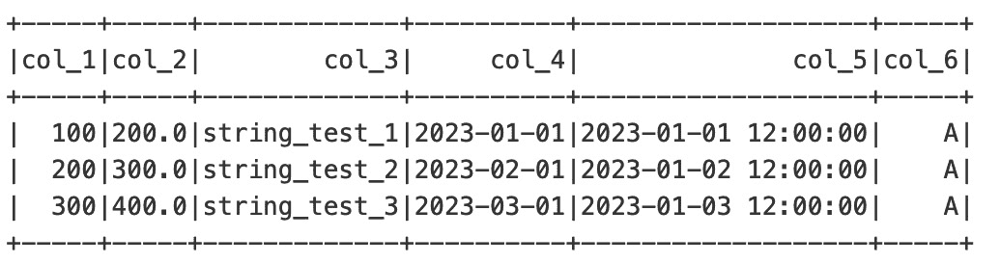
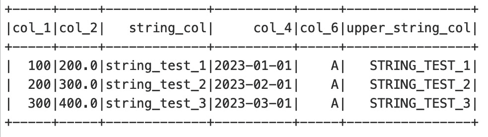

# Spark DataFrame 及其操作

在本章中，我们将学习 Spark 中的一些不同 API，并讨论它们的特性。我们还将开始学习 Spark 的 DataFrame 操作，并查看不同的数据查看和操作技术，例如过滤、添加、重命名和删除 Spark 中可用的列。

我们将在以下主题下介绍这些概念：

+   Spark DataFrame API

+   创建 DataFrame

+   查看 DataFrame

+   操作 DataFrame

+   聚合 DataFrame

到本章结束时，你将了解如何使用 PySpark DataFrame。你还将发现各种数据操作技术，并了解在操作数据后如何查看数据。

# PySpark 入门

在前面的章节中，我们讨论了 Spark 主要使用四种语言，即 Scala、Python、R 和 SQL。当使用这些语言中的任何一种时，底层的执行引擎是相同的。这为我们之前在*第二章*中提到的必要统一性提供了支持。这意味着开发者可以使用他们选择的任何语言，也可以在应用程序中在不同 API 之间切换。

对于本书的上下文，我们将重点关注 Python 作为主要语言。与 Python 一起使用的 Spark 被称为**PySpark**。

让我们开始安装 Spark。

## 安装 Spark

要开始使用 Spark，你首先需要在你的电脑上安装它。安装 Spark 有几种方法。在本节中，我们将只关注其中一种。

PySpark 提供了从**PyPI**的**pip**安装。你可以按照以下方式安装它：

```py
pip install pyspark
```

一旦 Spark 安装完成，你需要创建一个 Spark 会话。

## 创建 Spark 会话

一旦你在系统中安装了 Spark，你就可以开始创建 Spark 会话。Spark 会话是任何 Spark 应用程序的入口点。要创建 Spark 会话，你需要按照以下方式初始化它：

```py
from pyspark.sql import SparkSession
spark = SparkSession.builder.getOrCreate()
```

当你在 Spark shell 中运行代码时，Spark 会话会自动为你创建，因此你不需要手动执行此代码来创建 Spark 会话。这个会话通常在一个名为`spark`的变量中创建。

重要的是要注意，在任何给定时间，我们只能创建一个 Spark 会话。在 Spark 中无法复制 Spark 会话。

现在，让我们看看 Spark DataFrames 中的不同数据 API。

# Dataset API

Dataset 是添加到*Spark 1.6*的新接口。它是一个数据分布式集合。Dataset API 在 Java 和 Scala 中可用，但在 Python 和 R 中不可用。Dataset API 使用**Resilient Distributed Datasets**（**RDDs**），因此提供了 RDD 的附加功能，如固定类型。它还使用 Spark SQL 的优化引擎以实现更快的查询。

由于许多数据工程和数据科学社区已经熟悉 Python 并在生产中的数据架构中广泛使用它，PySpark 也为此提供了等效的 DataFrame API。让我们在下一节中看看它。

# DataFrame API

Spark DataFrame 的动机来自 Python 中的 Pandas DataFrame。DataFrame 实质上是一组行和列。你可以将其想象成一个表格，其中表格头作为列名，在这些头下面是相应排列的数据。这种类似表格的格式已经在诸如关系数据库和逗号分隔文件等工具的计算中存在很长时间了。

Spark 的 DataFrame API 是建立在 RDD 之上的。存储数据的底层结构仍然是 RDD，但 DataFrame 在 RDD 上创建了一个抽象，以隐藏其复杂性。正如 RDD 是惰性评估且不可变的一样，DataFrame 也是惰性评估且不可变的。如果你还记得前面的章节，惰性评估通过仅在需要时运行计算为 Spark 带来了性能提升和优化。这也使得 Spark 在其 DataFrame 中通过规划如何最佳地计算操作而拥有大量的优化。计算是在对 DataFrame 调用动作时开始的。有无数种不同的方法可以创建 Spark DataFrame。我们将在本章中学习其中的一些。

让我们看看在 Spark 中 DataFrame 是什么。

# 创建 DataFrame 操作

正如我们已经讨论过的，DataFrame 是 Spark 数据的主要构建块。它们由行和列数据结构组成。

PySpark 中的 DataFrame 是通过 `pyspark.sql.SparkSession.createDataFrame` 函数创建的。你可以使用列表、列表的列表、元组、字典、Pandas DataFrame、RDD 和 `pyspark.sql.Rows` 来创建 DataFrame。

Spark DataFrame 也有一个名为 **schema** 的参数，用于指定 DataFrame 的模式。你可以选择显式指定模式，或者让 Spark 从 DataFrame 本身推断模式。如果你在代码中没有指定此参数，Spark 将会自行推断模式。

在 Spark 中创建 DataFrame 有不同的方法。其中一些将在以下章节中解释。

## 使用数据行列表

我们看到创建 DataFrame 的第一种方法是通过使用数据行。你可以将数据行想象成列表。它们将为列表中的每个值共享共同的头值。

创建新的 DataFrame 时使用数据行列表的代码如下：

```py
import pandas as pd
from datetime import datetime, date
from pyspark.sql import Row
data_df = spark.createDataFrame([
    Row(col_1=100, col_2=200., col_3='string_test_1', col_4=date(2023, 1, 1), col_5=datetime(2023, 1, 1, 12, 0)),
    Row(col_1=200, col_2=300., col_3='string_test_2', col_4=date(2023, 2, 1), col_5=datetime(2023, 1, 2, 12, 0)),
    Row(col_1=400, col_2=500., col_3='string_test_3', col_4=date(2023, 3, 1), col_5=datetime(2023, 1, 3, 12, 0))
])
```

因此，你会看到具有我们指定的列及其数据类型的 DataFrame：

```py
DataFrame[col_1: bigint, col_2: double, col_3: string, col_4: date, col_5: timestamp]
```

现在，我们将看到如何可以显式指定 Spark DataFrame 的模式。

## 使用具有模式的行列表

DataFrame 的模式定义了 DataFrame 的每一行和每一列中可能存在的不同数据类型。显式定义模式有助于我们想要强制某些数据类型到数据集的情况。

现在，我们将明确告诉 Spark 我们创建的 DataFrame 应使用哪种模式。请注意，大部分代码保持不变——我们只是在创建 DataFrame 的代码中添加了一个名为`schema`的另一个参数，以明确指定哪些列将有什么样的数据类型：

```py
import pandas as pd
from datetime import datetime, date
from pyspark.sql import Row
data_df = spark.createDataFrame([
    Row(col_1=100, col_2=200., col_3='string_test_1', col_4=date(2023, 1, 1), col_5=datetime(2023, 1, 1, 12, 0)),
    Row(col_1=200, col_2=300., col_3='string_test_2', col_4=date(2023, 2, 1), col_5=datetime(2023, 1, 2, 12, 0)),
    Row(col_1=400, col_2=500., col_3='string_test_3', col_4=date(2023, 3, 1), col_5=datetime(2023, 1, 3, 12, 0))
], schema=' col_1 long, col_2 double, col_3 string, col_4 date, col_5 timestamp')
```

因此，您将看到包含我们指定列及其数据类型的 DataFrame：

```py
data_df
DataFrame[col_1: bigint, col_2: double, col_3: string, col_4: date, col_5: timestamp]
```

现在，让我们看看如何使用 Pandas DataFrame 创建 DataFrame。

## 使用 Pandas DataFrame

DataFrame 也可以使用 Pandas DataFrame 创建。为此，您首先需要在 Pandas 中创建一个 DataFrame。一旦创建，然后将其转换为 PySpark DataFrame。以下代码演示了此过程：

```py
from datetime import datetime, date
from pyspark.sql import SparkSession
spark = SparkSession.builder.getOrCreate()
rdd = spark.sparkContext.parallelize([
    (100, 200., 'string_test_1', date(2023, 1, 1), datetime(2023, 1, 1, 12, 0)),
    (200, 300., 'string_test_2', date(2023, 2, 1), datetime(2023, 1, 2, 12, 0)),
    (300, 400., 'string_test_3', date(2023, 3, 1), datetime(2023, 1, 3, 12, 0))
])
data_df = spark.createDataFrame(rdd, schema=['col_1', 'col_2', 'col_3', 'col_4', 'col_5'])
```

因此，您将看到包含我们指定列及其数据类型的 DataFrame：

```py
DataFrame[col_1: bigint, col_2: double, col_3: string, col_4: date, col_5: timestamp]
```

现在，让我们看看如何使用元组创建 DataFrame。

## 使用元组

创建 DataFrame 的另一种方式是通过元组。这意味着我们可以创建一个元组作为一行，并将每个元组作为 DataFrame 中的单独一行添加。每个元组将包含 DataFrame 中每列的数据。以下代码演示了这一点：

```py
import pandas as pd
from datetime import datetime, date
from pyspark.sql import Row
rdd = spark.sparkContext.parallelize([
    (100, 200., 'string_test_1', date(2023, 1, 1), datetime(2023, 1, 1, 12, 0)),
    (200, 300., 'string_test_2', date(2023, 2, 1), datetime(2023, 1, 2, 12, 0)),
    (300, 400., 'string_test_3', date(2023, 3, 1), datetime(2023, 1, 3, 12, 0))
])
data_df = spark.createDataFrame(rdd, schema=['col_1', 'col_2', 'col_3', 'col_4', 'col_5'])
```

因此，您将看到包含我们指定列及其数据类型的 DataFrame：

```py
DataFrame[col_1: bigint, col_2: double, col_3: string, col_4: date, col_5: timestamp]
```

现在，让我们看看在 Spark 中我们可以以不同的方式查看 DataFrame，并查看我们刚刚创建的 DataFrame 的结果。

# 如何查看 DataFrame

Spark 中有不同的语句用于查看数据。我们在上一节中通过不同方法创建的 DataFrame，其结果都与 DataFrame 相同。让我们看看几种不同的查看 DataFrame 的方法。

## 查看 DataFrame

显示 DataFrame 的第一种方式是通过`DataFrame.show()`语句。以下是一个示例：

```py
data_df.show()
```

因此，您将看到包含我们指定列及其数据类型的 DataFrame：

```py
+-----+-----+-------------+----------+-------------------+
|col_1|col_2|   col_3     |  col_4   |       col_5       |
+-----+-----+-------------+----------+-------------------+
|  100|200.0|string_test_1|2023-01-01|2023-01-01 12:00:00|
|  200|300.0|string_test_2|2023-02-01|2023-01-02 12:00:00|
|  300|400.0|string_test_3|2023-03-01|2023-01-03 12:00:00|
+-----+-----+-------------+----------+-------------------+
```

我们还可以在单个语句中选择要查看的总行数。让我们在下一个主题中看看如何做到这一点。

## 查看前 n 行

我们也可以在单个语句中指定要查看的行数。我们可以通过`DataFrame.show()`中的参数来控制这一点。以下是一个仅查看 DataFrame 前两行的示例。

如果您指定*n*为特定的数字，则只会显示那些行集。以下是一个示例：

```py
data_df.show(2)
```

因此，您将看到包含其前两行的 DataFrame：

```py
+-----+-----+-------------+----------+-------------------+
|col_1|col_2|    col_3    |   col_4  |        col_5      |
+------+------+-----------+----------+-------------------+
|  100|200.0|string_test_1|2023-01-01|2023-01-01 12:00:00|
|  200|300.0|string_test_2|2023-02-01|2023-01-02 12:00:00|
------+-----+-------------+----------+-------------------+
only showing top 2 rows.
```

## 查看 DataFrame 模式

我们还可以选择使用`printSchema()`函数查看 DataFrame 的模式：

```py
data_df.printSchema()
```

因此，您将看到 DataFrame 的模式，包括我们指定的列及其数据类型：

```py
root
 |-- col_1: long (nullable = true)
 |-- col_2: double (nullable = true)
 |-- col_3: string (nullable = true)
 |-- col_4: date (nullable = true)
 |-- col_5: timestamp (nullable = true)
```

## 垂直查看数据

当数据太长而无法适应屏幕时，以垂直格式查看数据而不是水平表格视图有时很有用。以下是一个示例，说明您如何以垂直格式查看数据：

```py
data_df.show(1, vertical=True)
```

因此，您将看到包含我们指定列及其数据但以垂直格式的 DataFrame：

```py
-RECORD 0------------------
 col_1   | 100
 col_2   | 200.0
 col_3   | string_test_1
 col_4   | 2023-01-01
 col_5   | 2023-01-01 12:00:00
only showing top 1 row
```

## 查看数据列

当我们只需要查看 DataFrame 中存在的列时，我们会使用以下方法：

```py
data_df.columns
```

因此，您将看到一个 DataFrame 中列的列表：

```py
['col_1', 'col_2', 'col_3', 'col_4', 'col_5']
```

## 查看摘要统计信息

现在，让我们看看我们如何查看 DataFrame 的摘要统计信息：

```py
Show the summary of the DataFrame
data_df.select('col_1', 'col_2', 'col_3').describe().show()
```

因此，您将看到一个 DataFrame，其中定义了每列的摘要统计信息：

```py
+-------+-------+-------+-------------+
|summary| col_1 | col_2 |    col_3    |
+-------+-------+-------+-------------+
|  count|   3   |   3   |            3|
|   mean| 200.0 | 300.0 |         null|
| stddev| 100.0 | 100.0 |         null|
|    min| 100   | 200.0 |string_test_1|
|    max| 300   | 400.0 |string_test_3|
+-------+-------+-------+-------------+
```

现在，让我们看一下 collect 语句。

# 收集数据

当我们想要将不同集群中正在处理的所有数据收集回驱动器时，会使用 collect 语句。在使用 collect 语句时，我们需要确保驱动器有足够的内存来存储处理后的数据。如果驱动器没有足够的内存来存储数据，我们将遇到内存不足错误。

这就是显示 collect 语句的方法：

```py
data_df.collect()
```

此语句将显示如下结果：

```py
[Row(col_1=100, col_2=200.0, col_3='string_test_1', col_4=datetime.date(2023, 1, 1), col_5=datetime.datetime(2023, 1, 1, 12, 0)),
 Row(col_1=200, col_2=300.0, col_3='string_test_2', col_4=datetime.date(2023, 2, 1), col_5=datetime.datetime(2023, 1, 2, 12, 0)),
 Row(col_1=300, col_2=400.0, col_3='string_test_3', col_4=datetime.date(2023, 3, 1), col_5=datetime.datetime(2023, 1, 3, 12, 0))]
```

有几种方法可以避免内存不足错误。我们将探讨一些避免内存不足错误的方法，例如 take、tail 和 head 语句。这些语句仅返回数据的一个子集，而不是 DataFrame 中的所有数据，因此，它们在无需将所有数据加载到驱动器内存中时非常有用。

现在，让我们看一下 take 语句。

## 使用 take

take 语句接受一个参数，用于从 DataFrame 顶部返回元素的数量。我们将在下面的代码示例中看到它是如何使用的：

```py
data_df.take(1)
```

因此，您将看到一个包含其顶部行的 DataFrame：

```py
[Row(col_1=100, col_2=200.0, col_3='string_test_1', col_4=datetime.date(2023, 1, 1), col_5=datetime.datetime(2023, 1, 1, 12, 0))]
```

在这个例子中，我们通过将`1`作为`take()`函数的参数值来仅返回 DataFrame 的第一个元素。因此，结果中只返回了一行。

现在，让我们看一下 tail 语句。

## 使用 tail

tail 语句接受一个参数，用于从 DataFrame 底部返回元素的数量。我们将在下面的代码示例中看到它是如何使用的：

```py
data_df.tail(1)
```

因此，您将看到一个包含其最后一行数据的 DataFrame：

```py
[Row(col_1=300, col_2=400.0, col_3='string_test_3', col_4=datetime.date(2023, 3, 1), col_5=datetime.datetime(2023, 1, 3, 12, 0))]
```

在这个例子中，我们通过将`1`作为`tail()`函数的参数值来仅返回 DataFrame 的最后一个元素。因此，结果中只返回了一行。

现在，让我们看一下 head 语句。

## 使用 head

head 语句接受一个参数，用于从 DataFrame 顶部返回元素的数量。我们将在下面的代码示例中看到它是如何使用的：

```py
data_df.head(1)
```

因此，您将看到一个包含其数据顶部行的 DataFrame：

```py
[Row(col_1=100, col_2=200.0, col_3='string_test_1', col_4=datetime.date(2023, 1, 1), col_5=datetime.datetime(2023, 1, 1, 12, 0))]
```

在这个例子中，我们通过将`1`作为`head()`函数的参数值来仅返回 DataFrame 的第一个元素。因此，结果中只返回了一行。

现在，让我们看看我们如何计算 DataFrame 中的行数。

## 计算数据行数

当我们只需要计算 DataFrame 中的行数时，我们会使用以下方法：

```py
data_df.count()
```

因此，您将看到一个 DataFrame 中的总行数：

```py
3
```

在 PySpark 中，有几种方法可以用于从 DataFrame 或 RDD 中检索数据，每种方法都有其自身的特性和用例。以下是我们在本节早期用于数据检索的 `take`、`collect`、`show`、`head` 和 `tail` 之间主要差异的总结。

### take(n)

此函数返回一个包含 DataFrame 或 RDD 的前 *n* 个元素的数组

+   它用于快速检查数据的小子集

+   它执行惰性评估，这意味着它只计算所需数量的元素

### collect()

此函数从 DataFrame 或 RDD 中检索所有元素，并将它们作为列表返回

+   应谨慎使用，因为它会将所有数据带到驱动节点，这可能导致大型数据集出现内存不足错误

+   它适用于小型数据集或处理适合内存的聚合结果时

### show(n)

此函数以表格格式显示 DataFrame 的前 *n* 行

+   它主要用于在 **探索性数据分析** （**EDA**） 或调试期间对数据进行视觉检查

+   它以具有列标题和格式的用户友好的方式显示数据

### head(n)

此函数返回 DataFrame 的前 *n* 行，作为 `Row` 对象的列表

+   它与 `take(n)` 类似，但返回 `Row` 对象而不是简单值

+   当处理结构化数据时，需要访问特定列值时经常使用

### tail(n)

此函数返回 DataFrame 的最后 *n* 行

+   它在检查数据集的末尾时很有用，尤其是在数据按降序排序的情况下

+   与 `head(n)` 相比，它执行的操作更昂贵，因为它可能涉及扫描整个数据集

总结来说，`take` 和 `collect` 用于检索数据元素，其中 `take` 更适合小子集，而 `collect` 用于检索所有数据（需谨慎）。`show` 用于视觉检查，`head` 检索前几行作为 `Row` 对象，而 `tail` 检索数据集的最后几行。每种方法都有不同的用途，应根据数据分析任务的具体要求进行选择。

当在 PySpark 中处理数据时，有时您需要在 DataFrames 上使用一些 Python 函数。为了实现这一点，您必须将 PySpark DataFrames 转换为 Pandas DataFrames。现在，让我们看看如何将 PySpark DataFrame 转换为 Pandas DataFrame。

# 将 PySpark DataFrame 转换为 Pandas DataFrame

在您的工作流程的各个阶段，您可能希望从 PySpark DataFrame 切换到 Pandas DataFrame。有选项可以将 PySpark DataFrame 转换为 Pandas DataFrame。此选项是 `toPandas()`。

这里需要注意的是，Python 本身不是分布式的。因此，当 PySpark DataFrame 转换为 Pandas 时，驱动程序需要收集其内存中的所有数据。我们需要确保驱动程序的内存能够收集自身的数据。如果数据无法适应驱动程序的内存，将导致内存不足错误。

以下是一个示例，说明如何将 PySpark DataFrame 转换为 Pandas DataFrame：

```py
data_df.toPandas()
```

因此，您将看到具有我们指定的列及其数据类型的 DataFrame：

|  | `col_1` | `col_2` | `col_3` | `col_4` | `col_5` |
| --- | --- | --- | --- | --- | --- |
| `0` | `100` | `200.0` | `String_test_1` | `2023-01-01` | `2023-01-01 12:00:00` |
| `1` | `200` | `300.0` | `String_test_2` | `2023-02-01` | `2023-01-02 12:00:00` |
| `2` | `300` | `400.0` | `String_test_3` | `2023-03-01` | `2023-01-03 12:00:00` |

表 4.1：我们指定的列和数据类型的 DataFrame

在下一节中，我们将了解不同的数据操作技术。您将需要根据不同的目的根据不同的标准对数据进行筛选、切片和切块。因此，数据操作在处理数据时是必不可少的。

# 如何在行和列上操作数据

在本节中，我们将学习如何在 Spark DataFrame 的行和列上执行不同的数据操作。

我们将首先看看如何在 Spark DataFrame 中选择列。

## 选择列

我们可以在 Spark DataFrame 中使用列函数在列级别进行数据操作。要选择 DataFrame 中的列，我们将使用 `select()` 函数如下：

```py
from pyspark.sql import Column
data_df.select(data_df.col_3).show()
```

因此，您将只看到 DataFrame 中的一个列及其数据：

```py
+-------------+
|    col_3    |
+-------------+
|string_test_1|
|string_test_2|
|string_test_3|
+-------------+
The important thing to note here is that the resulting DataFrame with one column is a new DataFrame. Recalling what we discussed in *Chapter 3*, RDDs are immutable. The underlying data structure for DataFrames is RDDs, therefore, DataFrames are also immutable. This means every time you make a change to a DataFrame, a new DataFrame would be created out of it. You would either have to assign the resultant DataFrame to a new DataFrame or overwrite the original DataFrame.
```

在 PySpark 中也有其他一些方法可以达到相同的结果。其中一些在这里进行了演示：

```py
data_df.select('col_3').show()
data_df.select(data_df['col_3']).show()
```

一旦我们选择了所需的列，就可能出现需要向 DataFrame 中添加新列的情况。现在我们将看看如何在 Spark DataFrame 中创建列。

## 创建列

我们可以使用 `withColumn()` 函数在 DataFrame 中创建新列。要创建新列，我们需要传递列名和列值以填充该列。在以下示例中，我们创建了一个名为 `col_6` 的新列，并在该列中放置了一个常量字面量 `A`：

```py
from pyspark.sql import functions as F
data_df = data_df.withColumn("col_6", F.lit("A"))
data_df.show()
```

因此，您将看到具有一个名为 `col_6` 的附加列，该列填充了多个 `A` 实例：



`lit()` 函数用于在列中填充常量值。

您还可以删除 DataFrame 中不再需要的列。现在我们将看看如何在 Spark DataFrame 中删除列。

## 删除列

如果我们需要从 Spark DataFrame 中删除列，我们将使用 `drop()` 函数。我们需要提供要删除的列的名称。以下是如何使用此函数的示例：

```py
data_df = data_df.drop("col_5")
data_df.show()
```

因此，您将看到 DataFrame 中已删除 `col_5`：

```py
+-----+-----+-------------+----------+------+
|col_1|col_2|    col_3    |  col_4   | col_6|
+-----+-----+-------------+----------+------+
|  100|200.0|string_test_1|2023-01-01|     A|
|  200|300.0|string_test_2|2023-02-01|     A|
|  300|400.0|string_test_3|2023-03-01|     A|
+-----+-----+-------------+----------+------+
```

我们已成功从该 DataFrame 中删除了 `col_5`。

你也可以在同一个删除语句中删除多个列：

```py
data_df = data_df.drop("col_4", "col_5")
```

还要注意，如果我们删除 DataFrame 中不存在的列，不会产生任何错误。结果 DataFrame 将保持原样。

就像删除列一样，你还可以在 Spark DataFrame 中更新列。现在，我们将看看如何在 Spark DataFrame 中更新列。

## 更新列

更新列也可以通过 Spark 中的 `withColumn()` 函数来完成。我们需要提供要更新的列的名称以及更新的值。注意，我们还可以使用此函数为列计算一些新值。以下是一个示例：

```py
data_df.withColumn("col_2", F.col("col_2") / 100).show()
```

这将给我们以下更新的框架：

```py
+-----+-----+-------------+----------+------+
|col_1|col_2|    col_3    |   col_4  | col_6|
+-----+-----+-------------+----------+------+
|  100|200.0|string_test_1|2023-01-01|     A|
|  200|300.0|string_test_2|2023-02-01|     A|
|  300|400.0|string_test_3|2023-03-01|     A|
+-----+-----+-------------+----------+------+
```

这里需要注意的是，在更新列时使用 `col` 函数。此函数用于列操作。如果我们不使用此函数，我们的代码将返回错误。

如果你只需要重命名列，而不需要更新 DataFrame 中的列，你不必总是更新列。现在，我们将看看如何在 Spark DataFrame 中重命名列。

## 重命名列

为了更改列名，我们会在 Spark 中使用 `withColumnRenamed()` 函数。我们需要提供需要更改的列名以及新的列名。以下是说明这一点的代码示例：

```py
data_df = data_df.withColumnRenamed("col_3", "string_col")
data_df.show()
```

因此，我们将看到以下变化：

```py
+-----+-----+-------------+----------+------+
|col_1|col_2|  string_col |   col_4  | col_6|
+-----+-----+-------------+----------+------+
|  100|200.0|string_test_1|2023-01-01|   A  |
|  200|300.0|string_test_2|2023-02-01|   A  |
|  300|400.0|string_test_3|2023-03-01|   A  |
+-----+-----+-------------+----------+------+
```

注意，更改后 `col_3` 现在被称为 `string_col`。

现在，让我们将注意力转向一些 Spark DataFrame 中的数据处理技术。你可以在 Spark DataFrame 中拥有类似搜索的功能，用于查找列中的不同值。现在，让我们看看如何在 Spark DataFrame 的列中查找唯一值。

## 在列中查找唯一值

查找唯一值是一个非常实用的函数，它将给我们列中的不同值。为此，我们可以使用 Spark DataFrame 的 `distinct()` 函数，如下所示：

```py
data_df.select("col_6").distinct().show()
```

这里是结果：

```py
+------+
|col_6 |
+------+
|   A  |
+------+
```

我们在 `col_6` 上应用了 `distinct` 函数，以获取该列中所有唯一的值。在我们的例子中，该列只有一个不同的值，即 `A`，所以显示了它。

我们还可以使用它来查找给定列中不同值的数量。以下是如何使用此函数的示例：

```py
data_df.select(F.countDistinct("col_6").alias("Total_Unique")).show()
```

这里是结果：

```py
+------+
|col_6 |
+------+
|  1   |
+------+
```

在这个例子中，我们可以看到 `col_6` 中不同值的总数。目前，它是这个列中唯一的不同值类型，因此返回了 `1`。

Spark 数据操作中另一个有用的函数是更改列的大小写。现在，让我们看看如何在 Spark DataFrame 中更改列的大小写。

## 更改列的大小写

Spark 中也存在一个用于更改列大小写的函数。我们不需要分别指定列的每个值来使用此函数。一旦应用，整个列的值都会更改大小写。以下是一个这样的例子：

```py
from pyspark.sql.functions import upper
data_df.withColumn('upper_string_col', upper(data_df.string_col)).show()
```

这里是结果：



在这个例子中，我们将 `string_col` 的字母大小写改为全部大写。我们需要将这个结果分配给一个新列，因此，我们创建了一个名为 `upper_string_col` 的列来存储这些大写值。同时，请注意，这个列没有被添加到原始的 `data_df` 中，因为我们没有将结果保存回 `data_df`。

在数据处理中，很多时候我们需要函数来过滤 DataFrame。现在，我们将看看如何在 Spark DataFrame 中过滤数据。

## 过滤 DataFrame

过滤 DataFrame 意味着我们可以从 DataFrame 中获取行或列的子集。有几种不同的方法可以过滤 Spark DataFrame。在这里，我们将看看一个例子：

```py
data_df.filter(data_df.col_1 == 100).show()
```

这里是结果：

```py
+-----+-----+-------------+----------+------+
|col_1|col_2| string_col  |   col_4  |col_6 |
+-----+-----+-------------+----------+------+
|  100|200.0|string_test_1|2023-01-01|   A  |
+-----+-----+-------------+----------+------+
```

在这个例子中，我们过滤 `data_df` 以仅包括 `col_1` 的列值等于 `100` 的行。只有一行满足这个标准，因此，结果 DataFrame 中只返回一行。

您可以使用此函数根据要求以多种方式对数据进行切片和切块。

由于我们正在讨论数据过滤，我们也可以根据逻辑运算符来过滤数据。现在，我们将看看如何在 DataFrames 中使用逻辑运算符来过滤数据。

## DataFrame 中的逻辑运算符

我们还可以将逻辑运算符与 DataFrame 中的过滤操作结合使用，这是一组重要的运算符。这些包括 AND 和 OR 运算符等。它们用于根据复杂条件过滤 DataFrame。让我们看看如何使用 AND 运算符：

```py
data_df.filter((data_df.col_1 == 100)
                  & (data_df.col_6 == 'A')).show()
```

这里是结果：

```py
+-----+------+-------------+----------+------+
|col_1| col_2|  string_col |   col_4  |col_6 |
+-----+------+-------------+----------+------+
|  100| 200.0|string_test_1|2023-01-01|   A  |
+-----+------+-------------+----------+------+
```

在这个例子中，我们试图获取 `col_1` 的值为 `100` 且 `col_6` 的值为 `A` 的行。目前，只有一行满足这个条件，因此，只有一行作为结果返回。

现在，让我们看看如何使用 OR 运算符来组合条件：

```py
data_df.filter((data_df.col_1 == 100)
                  | (data_df.col_2 == 300.00)).show()
```

此语句将给出以下结果：

```py
+-----+------+-------------+----------+------+
|col_1| col_2|  string_col |   col_4  | col_6|
+-----+------+-------------+----------+------+
|  100| 200.0|string_test_1|2023-01-01|   A  |
|  200| 300.0|string_test_2|2023-02-01|   A  |
+-----+------+-------------+----------+------+
```

在这个例子中，我们试图获取 `col_1` 的值为 `100` 或 `col_2` 的值为 `300.0` 的行。目前，有两行满足这个条件，因此，它们被作为结果返回。

在数据过滤中，还有一个重要的函数用于在列表中查找值。现在，我们将看看如何在 PySpark 中使用 `isin()` 函数。

## 使用 isin()

`isin()` 函数用于在 DataFrame 列中查找存在于列表中的值。为此，我们需要创建一个包含一些值的列表。一旦我们有了这个列表，我们就会使用 `isin()` 函数来查看列表中的某些值是否存在于 DataFrame 中。以下是一个演示此功能的例子：

```py
list = [100, 200]
data_df.filter(data_df.col_1.isin(list)).show()
```

这里是结果：

```py
+-----+-----+-------------+----------+------+
|col_1|col_2|  string_col |   col_4  |col_6 |
+-----+-----+-------------+----------+------+
|  100|200.0|string_test_1|2023-01-01|   A  |
|  200|300.0|string_test_2|2023-02-01|   A  |
+-----+-----+-------------+----------+------+
```

在这个例子中，我们可以看到值 `100` 和 `200` 出现在 `data_df` DataFrame 的两行中，因此，这两行都被返回。

我们还可以在 Spark DataFrames 的不同列中转换数据类型。现在，让我们看看如何在 Spark DataFrames 中转换不同的数据类型。

## 数据类型转换

在本节中，我们将看到在 Spark DataFrame 列中转换数据类型的不同方法。

我们将首先使用 Spark 中的 `cast` 函数。以下代码说明了这一点：

```py
from pyspark.sql.functions import col
from pyspark.sql.types import StringType,BooleanType,DateType,IntegerType
data_df_2 = data_df.withColumn("col_4",col("col_4").cast(StringType())) \
    .withColumn("col_1",col("col_1").cast(IntegerType()))
data_df_2.printSchema()
data_df.show()
```

这里是结果：

```py
root
 |-- col_1: integer (nullable = true)
 |-- col_2: double (nullable = true)
 |-- string_col: string (nullable = true)
 |-- col_4: string (nullable = true)
 |-- col_6: string (nullable = false)
+-----+-----+-------------+----------+-----+
|col_1|col_2|   string_col|     col_4|col_6|
+-----+-----+-------------+----------+-----+
|  100|200.0|string_test_1|2023-01-01|    A|
|  200|300.0|string_test_2|2023-02-01|    A|
|  300|400.0|string_test_3|2023-03-01|    A|
+-----+-----+-------------+----------+-----+
```

在前面的代码中，我们看到我们正在更改两个列的数据类型，即 `col_4` 和 `col_1`。首先，我们将 `col_4` 改为字符串类型。这个列之前是日期列。然后，我们将 `col_1` 从 `long` 类型改为整数类型。

这里是 `data_df` 的模式，仅供参考：

```py
root
 |-- col_1: long (nullable = true)
 |-- col_2: double (nullable = true)
 |-- string_col: string (nullable = true)
 |-- col_4: date (nullable = true)
 |-- col_5: timestamp (nullable = true)
 |-- col_6: string (nullable = false)
```

我们看到 `col_1` 和 `col_4` 是不同的数据类型。

下一个示例是通过使用 `selectExpr()` 函数来更改列的数据类型。以下代码说明了这一点：

```py
data_df_3 = data_df_2.selectExpr("cast(col_4 as date) col_4",
    "cast(col_1 as long) col_1")
data_df_3.printSchema()
data_df_3.show(truncate=False)
```

这里是结果：

```py
root
 |-- col_4: date (nullable = true)
 |-- col_1: long (nullable = true)
+----------+-----+
|  col_4   |col_1|
+----------+-----+
|2023-01-01|  100|
|2023-02-01|  200|
|2023-03-01|  300|
+----------+-----+
```

在前面的代码中，我们看到我们正在更改两个列的数据类型，即 `col_4` 和 `col_1`。首先，我们将 `col_4` 改回 `date` 类型。然后，我们将 `col_1` 改为 `long` 类型。

下一个示例是通过使用 SQL 来更改列的数据类型。以下代码说明了这一点：

```py
data_df_3.createOrReplaceTempView("CastExample")
data_df_4 = spark.sql("SELECT DOUBLE(col_1), DATE(col_4) from CastExample")
data_df_4.printSchema()
data_df_4.show(truncate=False)
```

这里是结果：

```py
root
 |-- col_1: double (nullable = true)
 |-- col_4: date (nullable = true)
+-----+----------+
|col_1|  col_4   |
+-----+----------+
|100.0|2023-01-01|
|200.0|2023-02-01|
|300.0|2023-03-01|
+-----+----------+
```

在前面的代码中，我们看到我们正在更改两个列的数据类型，即 `col_4` 和 `col_1`。首先，我们使用 `createOrReplaceTempView()` 创建一个名为 `CastExample` 的表。然后，我们使用这个表将 `col_4` 改回 `date` 类型。然后，我们将 `col_1` 改为 `double` 类型。

在数据分析领域，处理空值非常有价值。现在，让我们看看我们如何从 DataFrame 中删除空值。

## 从 DataFrame 中删除空值

有时，在数据中存在可能导致清洁数据变得混乱的空值。删除空值是许多数据分析师和数据工程师需要做的基本练习。PySpark 提供了相关的函数来完成这项工作。

让我们创建另一个名为 `salary_data` 的 DataFrame 来展示一些后续操作：

```py
salary_data = [("John", "Field-eng", 3500),
    ("Michael", "Field-eng", 4500),
    ("Robert", None, 4000),
    ("Maria", "Finance", 3500),
    ("John", "Sales", 3000),
    ("Kelly", "Finance", 3500),
    ("Kate", "Finance", 3000),
    ("Martin", None, 3500),
    ("Kiran", "Sales", 2200),
    ("Michael", "Field-eng", 4500)
  ]
columns= ["Employee", "Department", "Salary"]
salary_data = spark.createDataFrame(data = salary_data, schema = columns)
salary_data.printSchema()
salary_data.show()
```

这里是结果：

```py
root
 |-- Employee: string (nullable = true)
 |-- Department: string (nullable = true)
 |-- Salary: long (nullable = true)
+--------+----------+------+
|Employee|Department|Salary|
+--------+----------+------+
|    John| Field-eng| 3500 |
| Michael| Field-eng| 4500 |
|  Robert|      null| 4000 |
|   Maria|   Finance| 3500 |
|    John|     Sales| 3000 |
|   Kelly|   Finance| 3500 |
|    Kate|   Finance| 3000 |
|  Martin|      null| 3500 |
|   Kiran|     Sales| 2200 |
| Michael| Field-eng| 4500 |
+--------+----------+------+
```

现在，让我们看看 `dropna()` 函数；这将帮助我们删除 DataFrame 中的空值：

```py
salary_data.dropna().show()
```

这里是结果：

```py
+--------+----------+------+
|Employee|Department|Salary|
+--------+----------+------+
| John   | Field-eng| 3500 |
| Michael| Field-eng| 4500 |
| Maria  |   Finance| 3500 |
| John   |     Sales| 3000 |
| Kelly  |   Finance| 3500 |
| Kate   |   Finance| 3000 |
| Kiran  |     Sales| 2200 |
| Michael| Field-eng| 4500 |
+--------+----------+------+
```

在结果 DataFrame 中，我们看到当使用 `dropna()` 函数时，带有 `Robert` 和 `Martin` 的行从新的 DataFrame 中被删除。

去重数据是数据分析任务中经常需要的一种有用技术。现在，让我们看看我们如何从 DataFrame 中删除重复值。

## 从 DataFrame 中删除重复项

有时，在数据中存在冗余值，这会使清洁数据变得混乱。删除这些值可能在许多用例中是必要的。PySpark 提供了 `dropDuplicates()` 函数来执行此操作。以下是说明此操作的代码：

```py
new_salary_data = salary_data.dropDuplicates().show()
```

这里是结果：

```py
+--------+----------+------+
|Employee|Department|Salary|
+--------+----------+------+
|    John| Field-eng|  3500|
| Michael| Field-eng|  4500|
|   Maria|   Finance|  3500|
|    John|     Sales|  3000|
|   Kelly|   Finance|  3500|
|    Kate|   Finance|  3000|
|   Kiran|     Sales|  2200|
+--------+----------+------+
```

在这个例子中，我们看到在将 `dropDuplicates()` 函数应用于原始 DataFrame 后，名为 Michael 的员工在结果 DataFrame 中只显示一次。这个名称及其对应值在原始 DataFrame 中出现了两次。

现在我们已经了解了不同的数据过滤技术，接下来我们将看看如何在 PySpark DataFrame 中进行数据聚合。

## 在 DataFrame 中使用聚合

Spark 中用于聚合数据的一些方法如下：

+   `agg`

+   `avg`

+   `count`

+   `max`

+   `mean`

+   `min`

+   `pivot`

+   `sum`

我们将在下面的代码示例中看到一些实际操作。

### 平均值（avg）

在下面的示例中，我们看到如何在 Spark 中使用聚合函数。我们将从计算列中所有值的平均值开始：

```py
from pyspark.sql.functions import countDistinct, avg
salary_data.select(avg('Salary')).show()
```

这里是结果：

```py
+-----------+
|avg(Salary)|
+-----------+
|     3520.0|
+-----------+
```

这个示例计算了 `salary_data` DataFrame 中薪水列的平均值。我们将 `Salary` 列传递给了 `avg` 函数，它为我们计算了该列的平均值。

现在，让我们看看如何在 PySpark DataFrame 中计数不同的元素。

### 计数

在下面的代码示例中，我们可以看到如何在 Spark 中使用聚合函数：

```py
salary_data.agg({'Salary':'count'}).show()
```

这里是结果：

```py
+-------------+
|count(Salary)|
+-------------+
|           10|
+-------------+
```

这个示例计算了 `salary_data` DataFrame 中 `Salary` 列的值的总数。我们将 `Salary` 列传递给了 `agg` 函数，并将 `count` 作为其另一个参数，它为我们计算了该列的计数。

现在，让我们看看如何在 PySpark DataFrame 中计数不同的元素。

### 计数独立值

在下面的示例中，我们将查看如何在 PySpark DataFrame 中计数不同的元素：

```py
salary_data.select(countDistinct("Salary").alias("Distinct Salary")).show()
```

这里是结果：

```py
+---------------+
|Distinct Salary|
+---------------+
|              5|
+---------------+
```

这个示例计算了 `salary_data` DataFrame 中薪水列的总独立值。我们将 `Salary` 列传递给了 `countDistinct` 函数，它为我们计算了该列的计数。

现在，让我们看看如何在 PySpark DataFrame 中查找最大值。

### 查找最大值（max）

在下面的代码示例中，我们将查看如何在 PySpark DataFrame 的列中查找最大值：

```py
salary_data.agg({'Salary':'max'}).show()
```

这里是结果：

```py
+-----------+
|max(Salary)|
+-----------+
|       4500|
+-----------+
```

这个示例计算了 `salary_data` DataFrame 中 `Salary` 列的所有值的最大值。我们将 `Salary` 列传递给了 `agg` 函数，并将 `max` 作为其另一个参数，它为我们计算了该列的最大值。

现在，让我们看看如何在 PySpark DataFrame 中获取所有元素的总和。

### 总和

在下面的代码示例中，我们将查看如何在 PySpark DataFrame 中求和所有值：

```py
salary_data.agg({'Salary':'sum'}).show()
```

这里是结果：

```py
+-----------+
|sum(Salary)|
+-----------+
|      35200|
+-----------+
```

这个示例计算了 `salary_data` DataFrame 中 `Salary` 列所有值的总和。我们将 `Salary` 列传递给了 `agg` 函数，并将 `sum` 作为其另一个参数，它为我们计算了该列的总和。

现在，让我们看看如何在 PySpark DataFrame 中排序数据。

### 使用 OrderBy 排序数据

在下面的代码示例中，我们将查看如何在 PySpark DataFrame 中按升序排序数据：

```py
salary_data.orderBy("Salary").show()
```

这里是结果：

```py
+--------+----------+------+
|Employee|Department|Salary|
+--------+----------+------+
| Kiran  | Sales    | 2200 |
| Kate   | Finance  | 3000 |
| John   | Sales    | 3000 |
| John   | Field-eng| 3500 |
| Martin | null     | 3500 |
| Kelly  | Finance  | 3500 |
| Maria  | Finance  | 3500 |
| Robert | null     | 4000 |
| Michael| Field-eng| 4500 |
| Michael| Field-eng| 4500 |
+--------+----------+------+
```

本例根据`salary_data` DataFrame 中`Salary`列的值对整个 DataFrame 进行排序。我们将`Salary`列传递给`orderBy`函数，它根据此列对 DataFrame 进行了排序。

我们还可以通过向原始`orderBy`函数中添加另一个函数`desc()`来按降序格式对数据进行排序。以下示例说明了这一点：

```py
salary_data.orderBy(salary_data["Salary"].desc()).show()
```

这里是结果：

```py
+--------+----------+------+
|Employee|Department|Salary|
+--------+----------+------+
| Michael| Field-eng| 4500 |
| Michael| Field-eng| 4500 |
| Robert | null     | 4000 |
| Martin | null     | 3500 |
| Kelly  | Finance  | 3500 |
| Maria  | Finance  | 3500 |
| John   | Field-eng| 3500 |
| John   | Sales    | 3000 |
| Kate   | Finance  | 3000 |
| Kiran  | Sales    | 2200 |
+--------+----------+------+
```

本例中，根据`salary_data` DataFrame 中`Salary`列的值按降序对整个 DataFrame 进行排序。我们将`Salary`列传递给`orderBy`函数，并附加了`desc()`函数调用，它根据此列对 DataFrame 进行了降序排序。

# 摘要

在本章中，我们学习了如何在 Spark DataFrame 中操作数据。

我们讨论了 Spark DataFrame API 以及 Spark 中的不同数据类型。我们还学习了如何在 Spark 中创建 DataFrame 以及如何创建后查看这些 DataFrame。最后，我们学习了不同的数据操作和数据聚合函数。

在下一章中，我们将介绍 Spark 中与数据处理相关的一些高级操作。

# 样题

1. 以下哪个操作会触发评估？

1.  `DataFrame.filter()`

1.  `DataFrame.distinct()`

1.  `DataFrame.intersect()`

1.  `DataFrame.join()`

1.  `DataFrame.count()`

## 答案

1.  E
