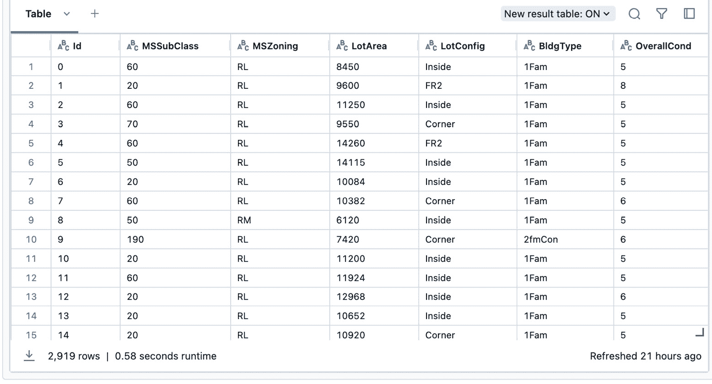

# 使用 Spark ML 进行机器学习

近年来，机器学习越来越受欢迎。在本章中，我们将全面探索 Apache Spark 上的强大框架 Spark **机器学习**（**ML**），它是一个用于可扩展机器学习的框架。我们将深入研究机器学习的基础概念以及 Spark ML 如何利用这些原则来实现高效和可扩展的数据驱动洞察。

我们将涵盖以下主题：

+   机器学习的关键概念

+   机器学习的不同类型

+   使用 Spark 进行机器学习

+   通过一个真实世界的例子考虑机器学习生命周期

+   机器学习的不同案例研究

+   Spark ML 和分布式机器学习的未来趋势

机器学习包含针对不同数据场景的多种方法。我们将从学习机器学习的不同关键概念开始。

# 机器学习简介

机器学习是一个研究领域，专注于开发算法和模型，使计算机系统能够在没有被明确编程的情况下学习和做出预测或决策。它是**人工智能**（**AI**）的一个子集，旨在为系统提供自动从数据和经验中学习和改进的能力。

在今天这个数据以前所未有的速度产生的大量数据的世界里，机器学习在提取有意义的洞察、做出准确预测和自动化决策过程中发挥着关键作用。随着数据的增长，机器可以更好地学习模式，从而更容易从这些数据中获得洞察。它在金融、医疗保健、营销、图像和语音识别、推荐系统等多个领域都有应用。

## 机器学习的核心概念

要理解机器学习，重要的是要掌握支撑其方法论的基本概念。

### 数据

数据是任何机器学习过程的基础。它可以是有结构的、半结构的或非结构的，并包括各种类型，如数值、分类、文本、图像等。机器学习算法需要高质量、相关和代表性的数据来学习模式和做出准确的预测。在处理机器学习问题时，拥有能够回答我们试图解决的问题的数据至关重要。在任何分析或模型构建过程中使用的数据质量将显著影响其结果和决策。不良或低质量的数据可能导致不准确、不可靠或误导性的结果，最终影响任何分析或模型的总体性能和可信度。

在不良数据上训练的机器学习模型可能会做出不准确或错误的预测或分类。例如，在不完整或具有偏见的数据上训练的模型可能会错误地将忠诚的客户识别为潜在的流失者，反之亦然。

依赖于从不良数据中得出的有缺陷或偏见的分析决策者可能会实施基于不准确洞察的策略。例如，由于有缺陷的流失预测而针对错误客户群体的营销活动可能导致资源浪费和错失机会。

因此，我们需要确保用于机器学习问题的数据能够代表我们想要构建模型的受众群体。另外一点需要注意的是，数据可能存在一些固有的偏差。我们有责任寻找这些偏差，并在使用这些数据构建机器学习模型时保持警觉。

### 特征

特征是机器学习算法用于做出预测或决策的数据的可测量属性或特征。它们是捕获数据中相关信息的变量或属性。在大量的数据中，我们希望了解哪些特征对解决特定问题是有用的。相关的特征会生成更好的模型。

特征工程，即选择、提取和转换特征的过程，在提高机器学习模型性能方面起着至关重要的作用。

### 标签和目标

标签或目标是指机器学习模型旨在预测或分类的期望输出或结果。在监督学习中，模型从标记数据中学习，标签代表与输入数据相关的正确答案或类别标签。在无监督学习中，模型在数据中识别模式或簇，而不需要任何明确的标签。

### 训练和测试

在机器学习中，模型使用可用数据的一个子集进行训练，这个子集被称为**训练集**。训练过程涉及将输入数据和相应的标签输入到模型中，模型从这些数据中学习以做出预测。一旦模型训练完成，其性能将使用另一个称为测试集的独立数据子集进行评估。这种评估有助于评估模型泛化能力和在未见数据上做出准确预测的能力。

### 算法和模型

机器学习算法是学习数据中的模式和关系的数学或统计过程，并做出预测或决策。它们可以分为各种类型，包括回归、分类、聚类、降维和强化学习。这些算法在数据上训练后，会生成捕获学习模式的模型，可用于对新未见数据做出预测。

深入讨论不同的机器学习算法超出了本书的范围。我们将在下一节讨论不同类型的机器学习问题。

## 机器学习的类型

机器学习问题可以大致分为两大类。在本节中，我们将探讨这两类。

### 监督学习

监督学习是一种机器学习方法，其中算法从标记的训练数据中学习以做出预测或决策。在监督学习中，训练数据包括输入特征和相应的输出标签或目标值。目标是学习一个映射函数，可以准确地预测新输入的输出。

监督学习的过程包括以下步骤：

1.  **数据准备**：第一步是收集和预处理训练数据。这包括清理数据、处理缺失值以及将数据转换成适合学习算法的格式。数据应分为特征（输入变量）和标签（输出变量）。

1.  **模型训练**：一旦数据已经准备好，监督学习算法就在标记的训练数据上训练。算法学习输入特征和相应输出标签之间的模式和关系。目标是找到一个可以很好地泛化到未见数据并做出准确预测的模型。

1.  **模型评估**：在训练模型后，需要评估其性能。这是通过使用称为测试集或验证集的单独数据集来完成的。将模型的预测与测试集中的实际标签进行比较，并计算各种评估指标，如准确率、精确率、召回率或均方误差。

1.  **模型部署和预测**：一旦模型经过训练和评估，就可以部署到对新数据做出预测。训练好的模型接受新数据的输入特征，并根据训练阶段学到的知识产生预测或决策。

监督学习算法的例子包括线性回归、逻辑回归、**支持向量机**（**SVM**）、决策树、随机森林、梯度提升和神经网络。再次强调，深入探讨这些算法超出了本书的范围。你可以在这里了解更多关于它们的信息：[`spark.apache.org/docs/latest/ml-classification-regression.html`](https://spark.apache.org/docs/latest/ml-classification-regression.html)。

### 无监督学习

无监督学习是一种机器学习类型，其中算法在没有任何标记输出的情况下学习数据中的模式和关系。在无监督学习中，训练数据仅由输入特征组成，目标是发现数据中的隐藏模式、结构或聚类。

无监督学习的过程包括以下步骤：

1.  **数据准备**：与监督学习类似，第一步是收集和预处理数据。然而，在无监督学习中，没有标记的输出值或目标变量。数据需要以适合特定无监督学习算法的方式转换和准备。

1.  **模型训练**：在无监督学习中，算法在没有任何特定目标变量的输入特征上训练。算法通过统计属性或相似度度量探索数据，并识别模式或聚类。目标是提取数据中的有意义信息，而不需要任何预定义的标签。

1.  **模型评估**（可选）：与监督学习不同，无监督学习没有基于已知标签的直接评估指标。无监督学习中的评估通常是主观的，并取决于特定的任务或问题领域。它也比监督学习更手动。评估可能包括可视化发现的聚类、评估降维的质量或使用领域知识来验证结果。

1.  **模式发现和洞察**：无监督学习的主要目标是发现数据中的隐藏模式、结构或聚类。无监督学习算法可以揭示关于数据的洞察，识别异常或离群值，执行降维或生成推荐。

无监督学习算法的例子包括 K-means 聚类、层次聚类、**主成分分析**（PCA）、关联规则挖掘和**自组织映射**（SOM）。

总结来说，监督学习和无监督学习是机器学习中的两种关键类型。监督学习依赖于标记数据来学习模式和进行预测，而无监督学习则在未标记数据中探索模式和结构。这两种类型都有它们自己的算法和技术，以及不同的选择。深入讨论无监督学习超出了本书的范围。

在下一节中，我们将探讨监督机器学习，这是人工智能和数据科学领域的一个基石，代表了构建预测模型和做出数据驱动决策的强大方法。

## 监督学习类型

如我们所知，监督学习是机器学习的一个分支，其中的算法从标记的训练数据中学习模式和关系。它涉及通过展示输入数据及其相应的输出标签来教授或监督模型，使算法能够学习输入和输出变量之间的映射。我们将探讨三种关键的监督学习类型——分类、回归和时间序列。

### 分类

分类是一种机器学习任务，其目标是根据其特征将数据分类或归类到预定义的类别或类别中。算法从标记的训练数据中学习，以构建一个可以预测新、未见数据实例类别标签的模型。

在分类中，输出是离散的，代表类别标签。用于分类任务的一些常见算法包括逻辑回归、决策树、随机森林、SVM 和朴素贝叶斯。

例如，考虑一个垃圾邮件分类任务，其目标是预测一封 incoming 邮件是否为垃圾邮件。算法在标记的邮件数据集上训练，其中每封邮件都与一个表示是否为垃圾邮件的类别标签相关联。训练好的模型可以根据其特征（如内容、主题或发件人）将新的邮件分类为垃圾邮件或非垃圾邮件。

### 回归

回归是另一种机器学习任务，它侧重于根据输入特征预测连续或数值值。在回归中，算法从标记的训练数据中学习，以构建一个模型，该模型可以估计或预测给定一组输入特征的目标变量的数值。

当输出是一个连续值时，例如预测房价、股票市场趋势或根据历史数据预测产品的销售，就会使用回归模型。一些常用的回归算法包括线性回归、决策树、随机森林、梯度提升和神经网络。

例如，考虑一个案例，你想要根据房屋的各种特征（如面积、卧室数量、位置等）来预测房价。在这种情况下，算法是在一个标记的房屋数据集上训练的，其中每座房屋都与相应的价格相关联。训练好的回归模型可以基于新房屋的特征来预测其价格。

### 时间序列

时间序列分析是机器学习的一个专门领域，它处理随时间收集的数据，其中观察的顺序很重要。在时间序列分析中，目标是理解和预测数据中的模式、趋势和依赖关系。

时间序列模型用于根据历史数据点预测未来值。它们在金融、股票市场预测、天气预报和需求预测等领域得到广泛应用。一些流行的时序算法包括**自回归积分移动平均**（**ARIMA**）、指数平滑方法和**长短期记忆**（**LSTM**）网络。

例如，假设你有一个特定公司的历史股票市场数据，包括日期和相应的股票价格。时间序列算法可以分析数据中的模式和趋势，并根据历史价格波动预测未来的股票价格。

总之，监督学习包括各种类型，如分类、回归和时间序列分析。每种类型都针对特定的学习任务，并需要不同的算法和技术。了解这些类型有助于选择适合特定数据分析与预测任务的最佳算法和方法。

接下来，我们将探讨如何利用 Spark 进行机器学习任务。

# Spark 机器学习

Spark 提供了一个强大且可扩展的平台，用于执行大规模机器学习任务。Spark 的**ML 库**，也称为**MLlib**，提供了一系列算法和工具，用于构建和部署机器学习模型。

使用 Spark 进行机器学习的优点包括其分布式计算能力、高效的数据处理、可扩展性和与其他 Spark 组件（如 Spark SQL 和 Spark Streaming）的集成。Spark 的 MLlib 支持批处理和流数据处理，使得实时机器学习应用的开发成为可能。

机器学习是一个变革性的领域，它使计算机能够从数据中学习并做出预测或决策。通过理解关键概念并利用 Spark 的 MLlib 等工具，我们可以利用机器学习的力量来获得洞察力，自动化流程，并在各个领域推动创新。

现在，让我们来看看使用 Spark 进行机器学习任务的好处。

## Apache Spark 在大规模机器学习中的优势

通过利用 Spark 的分布式计算能力和丰富的生态系统，数据科学家和工程师可以有效地解决大规模数据集上的复杂机器学习挑战。由于其分布式计算能力，它提供了各种优势，以下是一些：

+   **速度和性能**：Apache Spark 的一个关键优势是它能够以非凡的速度处理大规模数据。Spark 利用内存计算和优化的数据处理技术，如**数据并行**和**任务管道化**，来加速计算。这使得它在机器学习中常用的迭代算法中效率极高，显著减少了整体处理时间。

+   **分布式计算**：Spark 的分布式计算模型允许它在集群的多个节点上分配数据和计算，实现并行处理。这种分布式特性使得 Spark 能够水平扩展，利用多台机器的计算能力并行处理数据。这使得它非常适合需要处理大量数据的机器学习任务。

+   **容错性**：Apache Spark 的另一个优点是其内置的容错机制。Spark 自动跟踪**弹性分布式数据集**（RDDs）的 lineage，RDDs 是 Spark 中的基本数据抽象，这使得它能够从故障中恢复并重新运行失败的任务。这确保了 Spark 应用程序的可靠性和弹性，使其成为处理大规模机器学习工作负载的强大平台。

+   **通用性和灵活性**：Spark 提供了一整套 API 和库，这些库简化了各种数据处理和分析任务，包括机器学习。Spark 的 MLlib 库提供了一套丰富的分布式机器学习算法和实用工具，使得开发可扩展的机器学习模型变得容易。此外，Spark 与流行的数据处理框架和工具集成良好，能够无缝集成到现有的数据管道和生态系统中。

+   **实时和流处理能力**：正如我们在上一章中讨论的，Spark 通过其名为 Spark Streaming 的流组件扩展了其批处理之外的特性。这在需要基于持续到达的数据立即获得洞察或决策的场景中特别有价值，例如实时欺诈检测、传感器数据分析或社交媒体流上的情感分析。

+   **生态系统和社区支持**：Apache Spark 拥有一个充满活力和活跃的开发者和贡献者社区，确保了持续的开发、改进和支持。Spark 从丰富的工具和扩展生态系统中受益，提供了额外的功能性和集成选项。Spark 的社区驱动特性确保了丰富的资源、文档、教程和在线论坛，用于学习和故障排除。

因此，Apache Spark 为大规模 ML 任务提供了显著的优势。其速度、可扩展性、容错性、多功能性和实时能力使其成为处理大数据和开发可扩展 ML 模型的强大框架。

现在，让我们看看 Spark 提供的不同库，以在分布式框架中利用 ML 功能。

## Spark MLlib 与 Spark ML

Apache Spark 为 ML 提供了两个库：Spark MLlib 和 Spark ML。尽管它们名称相似，但在设计、API 和功能方面，这两个库之间有一些关键差异。让我们比较 Spark MLlib 和 Spark ML，以了解它们的特性和用例。

### Spark MLlib

Spark MLlib 是 Apache Spark 中的原始 ML 库。它在 Spark 的早期版本中引入，提供了一套丰富的分布式 ML 算法和实用工具。MLlib 是建立在 RDD API 之上的，这是 Spark 中的核心数据抽象。

Spark MLlib 与其他非分布式 ML 库（如 `scikit-learn`）相比，有几个关键特性使其脱颖而出。让我们看看其中的一些：

+   **基于 RDD 的 API**：MLlib 利用 RDD 抽象进行分布式数据处理，使其适用于批量处理和迭代算法。RDD API 允许进行高效的分布式计算，但对于某些用例来说可能低级且复杂。

+   **多样化的算法**：MLlib 提供了广泛的分布式 ML 算法，包括分类、回归、聚类、协同过滤、降维等。这些算法旨在处理大规模数据，并且可以在 ML 管道中处理各种任务。

+   **特征工程**：MLlib 提供了特征提取、转换和选择的实用工具。它包括处理分类和数值特征、文本处理和特征缩放的方法。

+   **模型持久化**：MLlib 支持模型持久化，允许将训练好的模型保存到磁盘，并在以后用于部署或进一步分析。

在下一节中，我们将探讨 Spark ML 库。这是另一个也提供 ML 功能的新库。

Spark ML

Spark ML 是在 Spark 2.0 中引入的 Apache Spark 中的较新 ML 库。它旨在更易于使用，具有高级 API 并专注于 DataFrame，这是 Spark SQL 中引入的具有结构和优化的分布式数据集合。

Spark ML 的关键特性如下：

+   **基于 DataFrame 的 API**：Spark ML 利用 DataFrame API，它比 RDD API 提供了更直观和更高层次的接口。DataFrame 提供了结构化和表格化的数据表示，使得处理结构化数据以及与 Spark SQL 集成变得更加容易。

+   **管道**：Spark ML 引入了管道的概念，为构建机器学习工作流程提供了更高层次的抽象。管道允许将多个数据转换和模型训练阶段链接成一个单一的管道，简化了复杂机器学习管道的开发和部署。

+   **集成特征转换器**：Spark ML 包含了一系列特征转换器，如 StringIndexer、OneHotEncoder、VectorAssembler 等。这些转换器与 DataFrame 无缝集成，简化了特征工程过程。

+   **统一 API**：Spark ML 统一了不同机器学习任务的 API，例如分类、回归、聚类和推荐。这为不同算法提供了一个一致且统一的编程接口，简化了学习曲线。

既然我们已经了解了 Spark MLlib 和 Spark ML 的关键特性，让我们来探讨何时使用它们。

在以下场景中，使用 Spark MLlib 将受益：

+   你正在使用不支持 Spark ML 的 Spark 旧版本

+   你需要低级控制，并需要直接与 RDDs 工作

+   你需要访问 Spark ML 中不可用的特定算法或功能

在以下场景中，你应该优先使用 Spark ML：

+   你正在使用 Spark 2.0 或更高版本

+   你偏好更高层次的 API，并希望利用 DataFrames 和 Spark SQL 的功能

+   你需要构建包含集成特征转换器和管道的端到端机器学习管道

Spark MLlib 和 Spark ML 都在 Apache Spark 中提供了强大的机器学习功能。正如我们所见，Spark MLlib 是原始库，拥有丰富的分布式算法集，而 Spark ML 是一个更新的库，具有更用户友好的 API 和与 DataFrames 的集成。两者之间的选择取决于你的 Spark 版本、对 API 风格的偏好以及你机器学习任务的具体要求。

# 机器学习生命周期

机器学习生命周期涵盖了开发和部署机器学习模型的端到端过程。它包括几个阶段，每个阶段都有其自身的任务和考虑因素。理解机器学习生命周期对于构建稳健且成功的机器学习解决方案至关重要。在本节中，我们将探讨机器学习生命周期的关键阶段：

1.  **问题定义**：机器学习生命周期的第一阶段是问题定义。这涉及到明确界定你想要解决的问题，以及理解你的机器学习项目的目标和目的。这一阶段需要领域专家和数据科学家之间的协作，以识别问题、定义成功指标和确定项目的范围。

1.  **数据获取和理解**：一旦问题被定义，下一步就是获取用于训练和评估的必要数据。数据获取可能涉及从数据库、API 或外部数据集中收集数据。确保数据质量、完整性和与当前问题的相关性非常重要。此外，数据理解涉及探索和分析获取到的数据，以深入了解其结构、分布和潜在问题。

1.  **数据准备和特征工程**：数据准备和特征工程是机器学习生命周期中的关键步骤。它涉及转换和预处理数据，使其适合训练机器学习模型。这包括诸如清理数据、处理缺失值、编码分类变量、缩放特征以及通过特征工程技术创建新特征等任务。适当的数据准备和特征工程对机器学习模型的性能和准确性有重大影响。

1.  **模型训练和评估**：在这个阶段，机器学习模型在准备好的数据上进行训练。模型训练涉及选择合适的算法、定义模型架构，并使用训练数据优化其参数。然后使用评估指标和验证技术对训练好的模型进行评估，以评估其性能。这个阶段通常需要迭代和微调模型，以达到所需的准确性和泛化能力。

1.  **模型部署**：一旦模型经过训练和评估，它就准备好进行部署。模型部署包括将模型集成到生产环境中，对新数据进行预测，并监控其性能。这可能涉及设置 API、创建批量或实时推理系统，并确保模型的可扩展性和可靠性。部署还包括对模型版本控制、监控和重新训练的考虑，以保持模型随时间保持有效性。

1.  **模型监控和维护**：一旦模型部署，持续监控其性能并保持其有效性至关重要。监控包括跟踪模型预测、检测异常，并从用户或领域专家那里收集反馈。它还包括使用新数据定期重新训练模型，以适应变化的模式或概念。模型维护涉及解决模型漂移、更新依赖项，并在生产环境中管理模型的生命周期。

1.  **模型迭代和改进**：机器学习生命周期是一个迭代的过程，模型通常需要随着时间的推移进行改进。基于用户反馈、性能指标和不断变化的企业需求，模型可能需要更新、重新训练或替换。迭代和改进对于保持模型更新并确保它们继续提供准确的预测至关重要。

机器学习生命周期包括问题定义、数据获取、数据准备、模型训练、模型部署、模型监控和模型迭代。每个阶段在开发成功的机器学习解决方案中都发挥着关键作用。通过遵循一个定义良好的生命周期，组织可以有效地构建、部署和维护机器学习模型，以解决复杂问题并从其数据中提取有价值的见解。

# 问题陈述

让我们深入一个案例研究，我们将探讨使用历史数据预测房价的艺术。想象一下：我们有一座关于房屋的宝贵信息宝库，包括分区、地块面积、建筑类型、整体状况、建造年份和销售价格等细节。我们的目标是利用机器学习的力量，准确预测即将到来的新房屋的价格。

为了完成这一壮举，我们将踏上构建一个专门用于预测房价的机器学习模型的旅程。该模型将利用现有的历史数据并纳入额外的特征。通过仔细分析和理解这些特征与相应销售价格之间的关系，我们的模型将成为估计任何新进入市场的房屋价值的可靠工具。

为了实现这一点，我们将回顾上一节中定义的一些步骤，其中我们讨论了机器学习生命周期。由于房价是连续的，我们将使用线性回归模型来预测这些价格。

我们将首先准备数据，使其可用于机器学习模型。

## 数据准备和特征工程

正如我们所知，数据准备和特征工程是机器学习过程中的关键步骤。适当的数据准备和特征工程技术可以显著提高模型的性能和准确性。在本节中，我们将通过代码示例探索常见的数据准备和特征工程任务。

### 数据集介绍

构建模型的第一步是找到相关数据。我们将为此目的使用房价数据（位于[`docs.google.com/spreadsheets/d/1caaR9pT24GNmq3rDQpMiIMJrmiTGarbs/edit#gid=1150341366`](https://docs.google.com/spreadsheets/d/1caaR9pT24GNmq3rDQpMiIMJrmiTGarbs/edit#gid=1150341366)）。这些数据有 2,920 行和 13 列。

该数据集有以下列：

+   `Id`: 数据表中每行的唯一标识符

+   `MSSubClass`: 房地产的子类

+   `MSZoning`: 房地产的分区

+   `LotArea`: 该房产所在地块的总面积

+   `LotConfig`: 地块配置 – 例如，是否为角地块

+   `BldgType`: 住宅类型 – 例如，单户住宅、联排别墅等

+   `OverallCond`: 房屋的一般状况

+   `YearBuilt`: 房屋建造的年份

+   `YearRemodAdd`: 进行任何翻修的年份

+   `Exterior1st`: 外部类型 – 例如，乙烯基、外墙板等

+   `BsmtFinSF2`: 完成地下室的总面积

+   `TotalBsmtSF`: 地下室的总面积

+   `SalePrice`: 房屋的销售价格

我们将从本节开头提供的链接下载这些数据。

现在我们已经了解了一些数据中的数据点，让我们学习如何加载数据。

### 加载数据

到目前为止，我们已经在我们的计算机和 Databricks 环境中下载了数据，并以 CSV 文件的形式存在。如您从前面的章节中回忆起来，我们学习了如何通过各种技术将数据集加载到 DataFrame 中。在这里，我们将使用 CSV 文件来加载数据：

```py
housing_data = spark.read.csv("HousePricePrediction.csv")
# Printing first 5 records of the dataset
housing_data.show(5)
```

我们可以在图 8.1 中看到结果。请注意，由于数据集太大，无法全部显示，我们只能看到部分结果：



让我们打印这个数据集的模式：

```py
housing_data.printSchema
```

我们将得到以下模式：

```py
<bound method DataFrame.printSchema of DataFrame[Id: bigint, MSSubClass: bigint, MSZoning: string, LotArea: bigint, LotConfig: string, BldgType: string, OverallCond: bigint, YearBuilt: bigint, YearRemodAdd: bigint, Exterior1st: string, BsmtFinSF2: bigint, TotalBsmtSF: bigint, SalePrice: bigint]>
```

如您可能已经注意到的，一些列的类型是字符串。我们将在下一节中清理这些数据。

### 清洗数据

数据清洗涉及处理缺失值、异常值和不一致的数据。在我们清理数据之前，我们将查看数据中有多少行。我们可以通过使用`count()`函数来完成：

```py
housing_data.count()
```

该语句的结果如下所示：

```py
2919
```

这意味着在我们应用任何清洗之前，数据中包含 2,919 行。现在，我们将从该数据集中删除缺失值，如下所示：

```py
# Remove rows with missing values
cleaned_data = housing_data.dropna()
cleaned_data.count()
```

以下是该代码的结果：

```py
1460
```

这表明我们删除了一些数据行，现在数据量变小了。

在下一节中，我们将讨论分类变量以及如何处理它们，特别是我们例子中用字符串表示的那些。

### 处理分类变量

在统计学和数据分析领域，分类变量是一种表示类别或组别的变量类型，它可以取有限、固定的不同值或级别。这些变量表示定性特征，不具有固有的数值意义或大小。相反，它们代表不同的属性或标签，将数据分类到特定的组或类别中。在训练机器学习模型之前，分类变量需要被编码成数值。

在我们的例子中，我们有一些是字符串类型的列。这些需要被编码成数值，以便模型能够正确使用它们。为此，我们将使用 Spark 的`StringIndexer`库来索引字符串列。

以下代码显示了如何使用`StringIndexer`：

```py
#import required libraries
from pyspark.ml.feature import StringIndexer
mszoning_indexer = StringIndexer(inputCol="MSZoning", outputCol="MSZoningIndex")
#Fits a model to the input dataset with optional parameters.
df_mszoning = mszoning_indexer.fit(cleaned_data).transform(cleaned_data)
df_mszoning.show()
```

在前面的代码中，我们正在将`MSZoning`列转换为索引列。为了实现这一点，我们创建了一个名为`mszoning`的`StringIndexer`值。我们将其`MSZoning`作为要处理的输入列。输出列的名称是`MSZoningIndex`。我们将在下一步中使用这个输出列。之后，我们将`mszoning_indexer`拟合到`cleaned_data`。

在生成的 DataFrame 中，您将注意到增加了一个名为`MSZoningIndex`的额外列。

现在，我们将使用管道来转换 DataFrame 中的所有特征。

**管道**汇集了一系列必要的步骤，每个步骤都致力于将原始数据转换为有价值的预测和分析。管道作为一个结构化的路径，由不同的阶段或组件组成，按照特定的顺序排列。每个阶段代表一个独特的操作或转换，它精炼数据，使其更适合机器学习任务。

管道（pipeline）的核心在于其无缝连接这些阶段的能力，形成一个协调一致的转换流程。这种编排确保数据能够轻松地通过每个阶段，一个阶段的输出成为下一个阶段的输入。它消除了手动干预的需要，自动化整个过程，节省了我们宝贵的时间和精力。我们将各种操作集成到管道中，如数据清洗、特征工程、编码分类变量、缩放数值特征等等。每个操作都在转换数据，使其可用于机器学习模型。

机器学习管道使我们能够简化我们的工作流程，尝试不同的转换组合，并在数据处理任务中保持一致性。它提供了一个结构化的框架，使我们能够轻松地重现和分享我们的工作，促进协作，并加深我们对数据转换过程的理解。

在机器学习和数据预处理中，**独热编码器**是一种将分类变量转换为数值格式的技术，使算法能够更好地理解和处理分类数据。当处理缺乏序数关系或数值表示的分类特征时，它特别有用。

我们将在管道中使用 `StringIndexer` 和 `OneHotEncoder`。让我们看看我们如何实现这一点：

```py
from pyspark.ml.feature import StringIndexer
from pyspark.ml.feature import OneHotEncoder
from pyspark.ml import Pipeline
mszoning_indexer = StringIndexer(inputCol="MSZoning", outputCol="MSZoningIndex")
lotconfig_indexer = StringIndexer(inputCol="LotConfig", outputCol="LotConfigIndex")
bldgtype_indexer = StringIndexer(inputCol="BldgType", outputCol="BldgTypeIndex")
exterior1st_indexer = StringIndexer(inputCol="Exterior1st", outputCol="Exterior1stIndex")
onehotencoder_mszoning_vector = OneHotEncoder(inputCol="MSZoningIndex", outputCol="MSZoningVector")
onehotencoder_lotconfig_vector = OneHotEncoder(inputCol="LotConfigIndex", outputCol="LotConfigVector")
onehotencoder_bldgtype_vector = OneHotEncoder(inputCol="BldgTypeIndex", outputCol="BldgTypeVector")
onehotencoder_exterior1st_vector = OneHotEncoder(inputCol="Exterior1stIndex", outputCol="Exterior1stVector")
#Create pipeline and pass all stages
pipeline = Pipeline(stages=[mszoning_indexer,
                            lotconfig_indexer,
                            bldgtype_indexer,
                            exterior1st_indexer,
                            onehotencoder_mszoning_vector,
                            onehotencoder_lotconfig_vector,
                            onehotencoder_bldgtype_vector,
                            onehotencoder_exterior1st_vector])
```

要开始我们的代码，我们需要从 PySpark 库中导入所需的模块。`StringIndexer` 和 `OneHotEncoder` 模块将被用来处理住房数据集的字符串列。

当我们开始将分类列转换为机器学习算法可以理解的数值表示的过程时，让我们更仔细地看看代码中发生的魔法。

第一步是为我们希望转换的每个分类列创建 `StringIndexer` 实例。每个实例接受一个输入列，例如 `MSZoning` 或 `LotConfig`，并生成一个相应的输出列，带有数值索引。例如，`MSZoningIndex` 列捕获了 `MSZoning` 列的转换索引值。

分类列成功索引后，我们进入下一阶段。现在，我们希望将这些索引转换为二进制向量。为此，我们可以使用 `OneHotEncoder`。生成的向量将每个分类值表示为一个二进制数组，其中值为 1 表示该类别的存在，否则为 0。

我们为每个索引列创建 `OneHotEncoder` 实例，例如 `MSZoningIndex` 或 `LotConfigIndex`，并生成包含二进制向量表示的新输出列。这些输出列，如 `MSZoningVector` 或 `LotConfigVector`，用于捕获编码信息。

随着代码的进展，我们组装了一个管道——一系列转换，其中每个转换代表一个阶段。在我们的案例中，每个阶段包括特定分类列的索引和独热编码步骤。我们在管道中安排这些阶段，确保转换的正确顺序。

通过构建我们的管道，我们协调了操作的流畅流程。管道连接了不同阶段之间的点，使得将这些转换应用到整个数据集上变得毫不费力。我们的管道充当指挥，引导数据通过转换，最终使其成为适合机器学习的格式。

现在，我们将此管道拟合到我们的清理数据集，以便所有列都可以一起转换：

```py
df_transformed = pipeline.fit(cleaned_data).transform(cleaned_data)
df_transformed.show(5)
```

结果 DataFrame 将包含我们在管道中通过转换创建的附加列。我们为每个字符串列创建了索引和向量列。

现在，我们需要从我们的数据集中删除不必要的冗余列。我们将在下一节中这样做。

### 数据清理

在这一步中，我们将确保我们只使用 ML 所需的特征。为了实现这一点，我们将删除不同的附加列，例如不服务于模型的身份列。此外，我们还将删除我们已经应用了转换的特征，例如字符串列。

以下代码展示了如何删除列：

```py
drop_column_list = ["Id", "MSZoning","LotConfig","BldgType", "Exterior1st"]
df_dropped_cols = df_transformed.select([column for column in df_transformed.columns if column not in drop_column_list])
df_dropped_cols.columns
```

这是结果：

```py
['MSSubClass',
 'LotArea',
 'OverallCond',
 'YearBuilt',
 'YearRemodAdd',
 'BsmtFinSF2',
 'TotalBsmtSF',
 'SalePrice',
 'MSZoningIndex',
 'LotConfigIndex',
 'BldgTypeIndex',
 'Exterior1stIndex',
 'MSZoningVector',
 'LotConfigVector',
 'BldgTypeVector',
 'Exterior1stVector']
```

如您从结果列列表中看到的，`Id`、`MSZoning`、`LotConfig`、`BldgType` 和 `Exterior1st` 列已从结果 DataFrame 中删除。

过程中的下一步是组装数据。

### 组装向量

在这一步中，我们将根据我们想要的特性组装一个向量。这一步对于 Spark ML 与数据一起工作来说是必要的。

以下代码捕捉了我们如何实现这一点：

```py
from pyspark.ml.feature import VectorAssembler
#Assembling features
feature_assembly = VectorAssembler(inputCols = ['MSSubClass',
 'LotArea',
 'OverallCond',
 'YearBuilt',
 'YearRemodAdd',
 'BsmtFinSF2',
 'TotalBsmtSF',
 'MSZoningIndex',
 'LotConfigIndex',
 'BldgTypeIndex',
 'Exterior1stIndex',
 'MSZoningVector',
 'LotConfigVector',
 'BldgTypeVector',
 'Exterior1stVector'], outputCol = 'features')
output = feature_assembly.transform(df_dropped_cols)
output.show(3)
```

在前面的代码块中，我们创建了一个包含组装向量的 `features` 列。在对其进行缩放后，我们将使用此列进行模型训练。

向量组装完成后，过程的下一步是对数据进行缩放。

### 特征缩放

特征缩放确保所有特征都在相似的尺度上，防止某些特征主导学习过程。

为了做到这一点，我们可以使用以下代码：

```py
#Normalizing the features
from pyspark.ml.feature import StandardScaler
scaler = StandardScaler(inputCol="features", outputCol="scaledFeatures",withStd=True, withMean=False)
# Compute summary statistics by fitting the StandardScaler
scalerModel = scaler.fit(output)
# Normalize each feature to have unit standard deviation.
scaledOutput = scalerModel.transform(output)
scaledOutput.show(3)
```

以下代码仅选择缩放后的特征和目标列——即 `SalePrice`：

```py
#Selecting input and output column from output
df_model_final = scaledOutput.select(['SalePrice', 'scaledFeatures'])
df_model_final.show(3)
```

我们将得到以下输出：

```py
+---------+--------------------+
|SalePrice|   scaledFeatures   |
+---------+--------------------+
|   208500|(37,[0,1,2,3,4,6,...|
|   181500|(37,[0,1,2,3,4,6,...|
|   223500|(37,[0,1,2,3,4,6,...|
+---------+--------------------+
```

如您所见，`df_model_final` 现在只有两列。`SalePrice` 是我们将要预测的列，因此是我们的目标列。`scaledFeatures` 包含我们将用于训练 ML 模型的所有特征。

这些示例展示了使用 PySpark 进行常见的数据准备和特征工程任务。然而，具体的技术和方法可能因数据集和机器学习任务的要求而异。理解数据的特征并选择适当的预处理和特征工程技术至关重要。适当的数据准备和特征工程是构建准确和稳健的机器学习模型的基础。

此过程的下一步是训练和评估机器学习模型。

## 模型训练和评估

模型训练和评估是机器学习过程中的关键步骤。在本节中，我们将探讨如何使用各种指标和技术来训练机器学习模型并评估其性能。我们将使用 PySpark 作为模型训练和评估的框架。

### 数据拆分

在训练模型之前，将数据集拆分为训练集和测试集非常重要。训练集用于训练模型，而测试集用于评估其性能。以下是如何使用 PySpark 拆分数据的示例：

```py
#test train split
df_train, df_test = df_model_final.randomSplit([0.75, 0.25])
```

在前面的代码中，我们正在进行数据的随机拆分，将 75%的数据放入训练集，将 25%的数据放入测试集。还有其他拆分技术。你应该仔细查看你的数据，然后定义最适合你的数据和模型训练的拆分方式。

我们拆分数据的原因是，一旦我们训练了模型，我们想看看训练好的模型在它从未见过的数据集上的预测效果如何。在这种情况下，那就是我们的测试数据集。这将帮助我们评估模型并确定模型的质量。基于此，我们可以采用不同的技术来改进我们的模型。

下一步是模型训练。

### 模型训练

数据拆分后，我们可以在训练数据上训练一个机器学习模型。PySpark 为各种类型的机器学习任务提供了一系列算法。在这个例子中，我们将使用线性回归作为我们的选择模型。

下面是一个训练线性回归模型的示例：

```py
from pyspark.ml.regression import LinearRegression
# Instantiate the linear regression model
regressor = LinearRegression(featuresCol = 'scaledFeatures', labelCol = 'SalePrice')
# Fit the model on the training data
regressor = regressor.fit(df_train)
```

在前面的代码中，我们正在使用训练数据并将其拟合到线性回归模型中。我们还添加了一个名为`labelCol`的参数，告诉模型这是我们的目标列，用于预测。

模型训练完成后，下一步是确定模型的好坏。我们将在下一节通过评估模型来完成这一步。

### 模型评估

模型训练后，我们需要评估其在测试数据上的性能。评估指标提供了关于模型性能的见解。

**均方误差**（**MSE**）是一个基本的统计指标，用于通过量化预测值和实际值之间平方差的平均值来评估回归模型的性能。

**R 平方**，通常表示为**R2**，是一个统计量，表示在回归模型中，因变量的方差中有多少是可预测的或由自变量解释的。它作为独立变量解释因变量变异性好坏的指标。

这里是使用均方误差（MSE）和 R2 指标评估回归模型的一个示例：

```py
#MSE for the train data
pred_results = regressor.evaluate(df_train)
print("The train MSE for the model is: %2f"% pred_results.meanAbsoluteError)
print("The train r2 for the model is: %2f"% pred_results.r2)
```

这里是结果：

```py
The MSE for the model is: 32287.153682
The r2 for the model is: 0.614926
```

我们可以检查测试数据的性能，如图所示：

```py
#Checking test performance
pred_results = regressor.evaluate(df_test)
print("The test MSE for the model is: %2f"% pred_results.meanAbsoluteError)
print("The test r2 for the model is: %2f"% pred_results.r2)
```

这里是结果：

```py
The MSE for the model is: 31668.331218
The r2 for the model is: 0.613300
```

根据模型的结果，我们可以进一步调整它。我们将在下一节中看到实现这一目标的一些技术。

### 交叉验证

交叉验证是提高机器学习模型性能的不同方法之一。

通过将数据分成多个子集进行训练和评估，交叉验证用于更稳健地评估模型性能。因此，我们不仅使用训练和测试数据，还使用一个验证集，模型从未见过这些数据，仅用于衡量性能。

交叉验证遵循一个简单的原则：而不是依赖于单一的训练-测试分割，我们将数据集分成多个子集，或称为**折**。每个折作为一个迷你训练-测试分割，其中一部分数据用于训练，其余部分保留用于测试。通过旋转折，我们确保每个数据点都有机会成为测试集的一部分，从而减轻偏差，提供更具有代表性的评估。

最常见的交叉验证形式是**k 折交叉验证**。在这种方法中，数据集被分为 k 个大小相等的折。模型被训练和评估 k 次，每次每个折作为测试集，而其余的折共同组成训练集。通过平均每次迭代获得的表现指标，我们得到对模型性能的更稳健估计。

通过交叉验证，我们获得了关于模型泛化能力的宝贵见解。它使我们能够衡量模型在不同数据子集中的性能，捕捉数据集中存在的固有变化和细微差别。这种技术帮助我们检测潜在的**过拟合**问题，即模型在训练集上表现异常出色，但无法泛化到未见过的数据。

除了 k 折交叉验证之外，还有针对特定场景的变体和扩展。**分层交叉验证**确保每个折保持与原始数据集相同的类别分布，从而保持分割的代表性。另一方面，**留一法交叉验证**将每个数据点视为一个单独的折，提供严格的评估，但代价是增加了计算复杂性。

接下来，我们将学习超参数调优。

### 超参数调优

**超参数调优**是优化机器学习算法超参数的过程，以提高其性能。超参数是模型外部的设置或配置，不能直接从训练数据中学习。与在训练过程中学习的模型参数不同，超参数需要在事先指定，并在确定机器学习模型的行为和性能方面至关重要。我们将使用超参数调优来提高模型性能。**超参数**是在训练之前设置的参数，不是从数据中学习的。调整超参数可以显著影响模型的表现。

想象一下：我们的模型是一个复杂的机械装置，由各种被称为超参数的旋钮和杠杆组成。这些超参数控制着我们的模型的行为和特征，影响着其学习、泛化和做出准确预测的能力。然而，找到这些超参数的最佳配置并非易事。

超参数调优是系统地搜索和选择最佳超参数组合的艺术。它使我们能够超越默认设置，发现与我们的数据和谐一致的配置，提取最有意义的见解并实现卓越的性能。

超参数调优的目标是获得最佳值。我们探索不同的超参数设置，穿越一个可能性的多维景观。这种探索可以采取多种形式，例如网格搜索、随机搜索，或者更高级的技术，如贝叶斯优化或遗传算法。

**网格搜索**是一种流行的方法，它涉及为每个超参数定义一个潜在值的网格。然后，模型在网格中的每个可能组合上进行训练和评估。通过彻底搜索网格，我们发现了产生最高性能的配置，为我们进一步优化提供了坚实的基础。

随机搜索采取不同的方法。它从预定义的分布中随机采样超参数值，并对每个采样的配置评估模型的性能。这种随机探索使我们能够覆盖更广泛的可能范围，可能发现非常规但非常有效的配置。

这些例子展示了使用 PySpark 进行模型训练和评估的过程。然而，具体算法、评估指标和技术可能因所面临的机器学习任务而异。理解问题域、选择合适的算法和选择相关的评估指标对于有效地训练和评估模型至关重要。

## 模型部署

模型部署是将训练好的机器学习模型用于生产环境的过程。在本节中，我们将探讨有效部署机器学习模型的多种方法和技巧：

+   **序列化和持久化**：一旦模型被训练，它需要被序列化并持久化到磁盘以供以后使用。序列化是将模型对象转换为可以存储的格式的过程，而持久化涉及将序列化的模型保存到存储系统中。

+   **模型服务**：模型服务涉及将训练好的模型作为 API 端点或服务提供，该服务可以接收输入数据并返回预测结果。这允许其他应用程序或系统集成并使用该模型进行实时预测。

## 模型监控和管理

一旦模型被部署，重要的是要监控其在生产环境中的性能和行为，并保持其长期的有效性。监控可以帮助识别数据漂移、模型退化或异常等问题。此外，模型管理涉及版本控制、跟踪和维护已部署模型的多个版本。这些做法确保模型保持最新状态，并随着时间的推移保持最佳性能。在本节中，我们将探讨模型监控和维护的关键方面：

+   **可扩展性和性能**：在部署机器学习模型时，可扩展性和性能是至关重要的考虑因素。模型应设计并部署为能够高效处理大量数据并满足高吞吐量需求的方式。例如，Apache Spark 等技术提供了分布式计算能力，使得可扩展且高性能的模型部署成为可能。

+   **模型更新和重新训练**：机器学习模型可能需要定期更新或重新训练，以适应变化的数据模式或提高性能。部署的模型应具备机制，以便在不中断服务流程的情况下方便地进行更新和重新训练。这可能涉及自动化流程，例如监控数据漂移或基于特定条件的重新训练触发器。

+   **性能指标**：为了监控已部署的模型，定义和跟踪相关的性能指标非常重要。这些指标可能因机器学习问题的类型和应用程序的具体要求而异。一些常用的性能指标包括准确率、精确率、召回率、F1 分数和**ROC 曲线下面积**（**AUC**）。通过定期评估这些指标，可以识别出与预期性能的偏差，这表明需要进行进一步调查或维护操作。

+   **数据漂移检测**：数据漂移是指输入数据的统计属性随时间变化的现象，这会导致模型性能下降。监控数据漂移对于确保部署的模型持续提供准确预测至关重要。可以使用诸如统计测试、特征分布比较和异常值检测等技术来检测数据漂移。当检测到数据漂移时，可能需要更新模型或使用更近期的数据进行重新训练。

+   **模型性能监控**：监控部署模型的性能涉及跟踪其预测并将其与真实值进行比较。这可以通过定期采样预测子集并评估其实际结果来实现。监控还可以包括分析预测错误、识别模式或异常以及调查任何性能下降的根本原因。通过定期监控模型的性能，可以及早发现问题并采取纠正措施。

+   **模型重新训练和更新**：在生产中部署的模型可能需要定期更新或重新训练以保持其有效性。当有新数据可用或应用领域发生重大变化时，使用新鲜数据重新训练模型可以帮助提高其性能。此外，错误修复、功能增强或算法改进可能需要更新部署的模型。建立良好的流程和基础设施来高效地处理模型重新训练和更新至关重要。

+   **版本控制和模型治理**：维护部署模型的适当版本控制和治理对于跟踪变更、保持可重复性和确保合规性至关重要。版本控制系统可用于管理模型版本、跟踪变更并提供模型更新的历史记录。此外，维护与模型变更、依赖关系和相关流程相关的文档有助于有效的模型治理。

+   **协作与反馈**：模型监控和维护通常涉及不同利益相关者之间的协作，包括数据科学家、工程师、领域专家和业务用户。建立反馈和沟通渠道可以促进见解的交流、问题的识别和必要变更的实施。定期的会议或反馈循环有助于将模型的性能与应用的演变需求保持一致。

总体而言，模型部署是机器学习生命周期中的关键步骤。它涉及序列化和持久化训练好的模型，将它们作为 API 或服务提供，监控其性能，确保可扩展性和性能，以及管理更新和重新训练。

通过积极监控和维护部署的模型，组织可以确保其机器学习系统持续提供准确和可靠的预测。有效的模型监控技术与主动维护策略相结合，能够及时识别性能问题，并支持必要的行动，以保持模型更新并与业务目标保持一致。

## 模型迭代与改进

模型迭代与改进是机器学习生命周期中的一个关键阶段，专注于提升部署模型的性能和有效性。通过持续优化和改进模型，组织可以实现更好的预测，并从其机器学习项目中获得更大的价值。在本节中，我们将探讨模型迭代和改进的关键方面：

+   **收集反馈和获取洞察**：模型迭代和改进的第一步是从各种利益相关者那里收集反馈，包括最终用户、领域专家和业务团队。反馈可以提供有关模型性能、改进领域和在实际场景中遇到的潜在问题的宝贵见解。可以通过调查、用户访谈或在生产环境中监控模型的运行行为来收集此类反馈。

+   **分析模型性能**：为了确定改进领域，重要的是要彻底分析模型的性能。这包括检查性能指标、评估预测误差以及深入分析被错误分类或预测不佳的实例。通过了解模型的优点和缺点，数据科学家可以将精力集中在需要关注的特定领域。

+   **探索新特征和数据**：提升模型性能的一种方法是通过整合新特征或利用额外的数据源。探索性数据分析有助于识别可能对预测有重大影响的潜在特征。可以使用特征工程技术，如创建交互项、缩放或转换变量，来增强数据的表示。此外，整合来自不同来源的新数据可以提供新的见解并提高模型的一般化能力。

+   **算法选择和超参数调整**：通过实验不同的算法和超参数，可以显著提升模型性能。数据科学家可以探索替代算法或现有算法的变体，以确定针对特定问题的最佳方法。可以使用网格搜索或贝叶斯优化等超参数调整技术来找到模型参数的最优值。这一迭代过程有助于确定最佳算法和参数设置，从而产生更优的结果。

+   **集成方法**：集成方法涉及结合多个模型以创建更稳健和准确的预测。可以应用诸如 bagging、boosting 或 stacking 等技术，从多个基础模型构建集成模型。集成方法通常可以通过减少偏差、方差和过拟合来提高模型性能。尝试不同的集成策略和模型组合可以进一步提高预测准确性。

+   **A/B 测试和受控实验**：可以在受控环境中进行 A/B 测试或受控实验，以评估模型改进的影响。通过随机分配用户或数据样本到不同版本的模型，组织可以衡量新模型与现有模型的性能。这种方法提供了具有统计学意义的成果，以确定所提出的更改是否导致了预期的改进。

+   **持续监控与评估**：一旦改进后的模型部署，持续的监控与评估对于确保其持续性能至关重要。监控数据漂移、分析性能指标以及定期评估有助于识别潜在的退化或进一步改进的需求。这个反馈循环允许对部署的模型进行持续迭代和优化。

通过拥抱迭代和改进的文化，组织可以持续提升其机器学习模型的性能和准确性。通过收集反馈、分析模型性能、探索新的特性和算法、进行实验以及持续监控，模型可以迭代优化以实现更好的预测并推动可衡量的业务成果。

# 案例研究和现实世界案例

在本节中，我们将探讨机器学习的两个突出用例：客户流失预测和欺诈检测。这些示例展示了机器学习技术在解决现实世界挑战和实现显著商业价值方面的实际应用。

## 客户流失预测

客户流失是指客户与公司终止关系的现象，通常是通过取消订阅或转向竞争对手来实现的。预测客户流失对商业至关重要，因为它允许企业主动识别有离开风险的客户并采取适当的措施来留住他们。机器学习模型可以分析各种客户属性和行为模式来预测流失的可能性。让我们深入了解一个客户流失预测案例研究。

### 案例研究 – 电信公司

一家电信公司希望通过预测哪些客户最有可能取消他们的订阅来降低客户流失率。公司收集了大量的客户数据，包括人口统计信息、通话记录、服务使用情况和客户投诉。通过利用机器学习，他们旨在识别客户流失的关键指标并构建一个预测模型来预测未来的流失者：

+   **数据准备**：公司收集并预处理客户数据，确保数据清洁、格式化并准备好分析。他们将客户档案与历史流失信息相结合，创建标记数据集。

+   **特征工程**：为了捕捉有意义的模式，公司从可用数据中工程相关特征。这些特征可能包括平均通话时长、投诉数量、月度服务使用量和任期等变量。

+   **模型选择和训练**：公司选择合适的机器学习算法，例如逻辑回归、决策树或随机森林，来构建流失预测模型。他们将数据集分为训练集和测试集，在训练数据上训练模型，并在测试数据上评估其性能。

+   **模型评估**：使用评估指标如准确率、精确率、召回率和 F1 分数来评估模型的表现。公司分析模型正确识别流失客户和非流失客户的能力，在误报和漏报之间取得平衡。

+   **模型部署和监控**：一旦模型达到预期的性能标准，它就被部署到生产环境中。模型持续监控传入的客户数据，生成流失预测，并为处于风险中的客户触发适当的保留策略。

## 欺诈检测

欺诈检测是机器学习的另一个关键应用，旨在识别欺诈活动并防止财务损失。机器学习模型可以从历史数据中学习欺诈行为的模式，并在实时中标记可疑的交易或活动。让我们探讨一个欺诈检测案例研究。

### **案例研究 - 金融机构**

一家金融机构希望实时检测欺诈交易，以保护其客户并防止货币损失。该机构收集交易数据，包括交易金额、时间戳、商户信息和客户详情。通过利用机器学习算法，他们旨在构建一个强大的欺诈检测系统：

+   **数据预处理**：金融机构处理和清理交易数据，确保数据完整性和一致性。他们还可能通过整合额外的信息，如 IP 地址或设备标识符，来增强欺诈检测能力。

+   **特征工程**：从交易数据中提取相关特征，以捕捉潜在的欺诈活动指标。这些特征可能包括交易金额、频率、地理位置、与典型消费模式的偏差以及客户交易历史。

+   **模型训练**：金融机构选择合适的机器学习算法，例如异常检测技术或监督学习方法（例如，逻辑回归和梯度提升），以训练欺诈检测模型。该模型在标记为欺诈或非欺诈的历史数据上训练。

+   **实时监控**：一旦模型经过训练，它就会被部署以实时分析传入的交易。模型为每笔交易分配一个欺诈概率分数，超过一定阈值的交易将被标记为需要进一步调查或干预。

+   **持续改进**：金融机构通过监控其性能并整合新数据，持续优化欺诈检测模型。他们定期评估模型的有效性，调整阈值，并更新模型以适应不断变化的欺诈模式和技巧。

通过将 ML 技术应用于客户流失预测和欺诈检测，组织可以增强其决策过程，提高客户保留率，并减轻财务风险。这些案例研究突出了 ML 在现实场景中的实际应用，展示了其在各个行业中的价值。

# Spark ML 和分布式 ML 的未来趋势

随着机器学习领域的持续发展，我们可以在 Spark ML 和分布式 ML 领域期待一些未来的趋势和进步。以下是一些关键领域值得关注：

+   **深度学习集成**：Spark ML 很可能将更深入地与深度学习框架（如 TensorFlow 和 PyTorch）集成。这将使用户能够无缝地将深度学习模型集成到他们的 Spark ML 管道中，释放神经网络在复杂任务（如图像识别和自然语言处理）中的力量。

+   **自动化机器学习**：自动化将在简化并加速机器学习过程中发挥重要作用。我们可以在 Spark ML 中期待自动化特征工程、超参数调整和模型选择技术的进步。这些进步将使用户能够以最小的手动努力构建高性能模型。

+   **可解释人工智能**：随着机器学习模型中透明度和可解释性的需求增长，Spark ML 很可能将采用模型可解释性的技术。这将使用户能够理解和解释模型做出的预测，使模型更加可靠，并符合监管要求。

+   **生成式人工智能（GenAI）**：GenAI 是当前的热门话题。随着 GenAI 用例的需求增加，现有平台可能会整合一些用于 GenAI 的 LLMs（大型语言模型）。

+   **边缘计算和物联网**：随着边缘计算和 **物联网（IoT）** 的兴起，Spark ML 预计将扩展其功能，以支持在边缘设备上进行 ML 推理和训练。这将实现实时、低延迟的预测和跨边缘设备的分布式学习，为智能城市、自动驾驶汽车和工业物联网等领域的应用开辟新的可能性。

由此，我们结束了本书的学习部分。让我们简要回顾一下我们所学的内容。

# 概述

总结来说，Spark ML 为分布式机器学习任务提供了一个强大且可扩展的框架。它与 Apache Spark 的集成在处理大规模数据集、并行计算和容错方面提供了显著优势。在本章中，我们探讨了 Spark ML 的关键概念、技术和实际应用案例。

我们讨论了机器学习生命周期，强调了数据准备、模型训练、评估、部署、监控和持续改进的重要性。我们还比较了 Spark MLlib 和 Spark ML，突出了它们各自的特点和用例。

在本章中，我们讨论了与 Spark ML 相关的各种关键概念和技术。我们探讨了不同类型的机器学习，如分类、回归、时间序列分析、监督学习和无监督学习。我们强调了数据准备和特征工程在构建有效的机器学习管道中的重要性。我们还简要提到了 Spark ML 中的容错和可靠性方面，确保了鲁棒性和数据完整性。

此外，我们考察了实际应用案例，包括客户流失预测和欺诈检测，以展示 Spark ML 在解决复杂商业挑战中的实际应用。这些案例研究展示了组织如何利用 Spark ML 来增强决策能力、提高客户保留率并减轻财务风险。

在你继续使用 Spark ML 进行机器学习之旅时，重要的是要记住该领域的迭代和动态特性。保持对最新进展的了解，探索新技术，并拥抱持续学习和改进的心态。

通过利用 Spark ML 的力量，你可以从数据中解锁有价值的见解，构建复杂的机器学习模型，并做出推动业务成功的明智决策。因此，利用 Spark ML 的能力，拥抱未来趋势，踏上掌握分布式机器学习的旅程。

本章到此结束。希望它能帮助你在机器学习模型世界的精彩旅程中取得进步。接下来的两章是模拟测试，旨在帮助你为认证考试做好准备。

# 第五部分：模拟试卷

本部分将提供两份模拟试卷，帮助读者通过练习题目来准备认证考试。

本部分包含以下章节：

+   *第九章**,* *模拟试卷 1*

+   *第十章**,* *模拟试卷 2*
