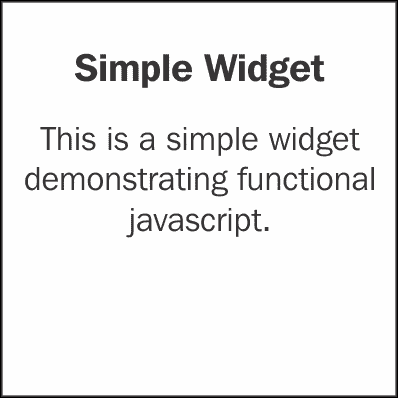

# 第一章. 使用 D3.js 入门

本章我们将涵盖：

+   设置简单的 D3 开发环境

+   设置基于 NPM 的开发环境

+   理解 D3 风格的 JavaScript

# 简介

本章旨在帮助您开始使用 D3.js，涵盖基本方面，例如 D3.js 是什么，以及如何设置典型的 D3.js 数据可视化环境。本章还特别介绍了一些 D3.js 依赖的、不太为人所知的 JavaScript 领域。

什么是 D3？D3 指的是 **数据驱动文档**，根据官方 D3 Wiki：

> D3.js 是一个基于数据的 JavaScript 库，用于操作文档。D3 帮助您使用 HTML、SVG 和 CSS 使数据生动起来。D3 对网络标准的强调让您能够充分利用现代浏览器的全部功能，而不必绑定到任何专有框架，结合强大的可视化组件和数据驱动的 DOM 操作方法。
> 
> D3 Wiki (2013, 八月)

在某种意义上，D3 是一个专门的 JavaScript 库，它允许您通过利用现有的网络标准，以更简单（数据驱动）的方法创建惊人的数据可视化。D3.js 由 Mike Bostock ([`bost.ocks.org/mike/`](http://bost.ocks.org/mike/)) 创建，并取代了他之前在名为 Protovis 的不同 JavaScript 数据可视化库上的工作。有关 D3 的创建以及影响 Protovis 和 D3.js 的理论的信息，请参阅以下信息框中的链接。在本书中，我们将更多地关注如何使用 D3.js 来驱动您的可视化。最初，由于 D3 在使用 JavaScript 进行数据可视化方面采用了不同的方法，一些方面可能会有些令人困惑。我希望在本书的整个过程中，大量的话题，从基础到高级，都将使您对 D3 感到舒适和有效。一旦正确理解，D3 可以通过数量级的方式提高您在数据可视化方面的生产力和表现力。

### 注意

要更正式地了解 D3 背后的理念，请参阅 Mike Bostock 在 IEEE InfoVis 2010 上发表的 *Declarative Language Design for Interactive Visualization* 论文，网址为 [`vis.stanford.edu/papers/protovis-design`](http://vis.stanford.edu/papers/protovis-design)。

如果您想了解 D3 是如何产生的，我建议您查看 Mike Bostock 在 IEEE InfoVis 2011 上发表的 *D3: Data-Driven Document* 论文，网址为 [`vis.stanford.edu/papers/d3`](http://vis.stanford.edu/papers/d3)。

D3.js 的前身 Protovis，也是由 Mike Bostock 和斯坦福可视化小组的 Jeff Heer 创建，可以在 [`mbostock.github.io/protovis/`](http://mbostock.github.io/protovis/) 找到。

# 设置简单的 D3 开发环境

开始一个由 D3 驱动的数据可视化项目时，你首先需要的是一个工作开发环境。在本食谱中，我们将向您展示如何在几分钟内设置一个简单的 D3 开发环境。

## 准备工作

在我们开始之前，请确保你已经安装并准备好你喜欢的文本编辑器。

## 如何操作...

我们将首先下载 D3.js：

1.  从[`d3js.org/`](http://d3js.org/)下载 D3.js 的最新稳定版本。你可以从[`github.com/mbostock/d3/tags`](https://github.com/mbostock/d3/tags)下载存档的旧版本。此外，如果你有兴趣尝试 master 分支上最新的 D3 构建，你可以分叉[`github.com/mbostock/d3`](https://github.com/mbostock/d3)。

1.  下载并解压后，你将在提取的文件夹中找到三个文件 `d3.v3.js`、`d3.v3.min.js` 以及其许可证。对于开发，建议使用 `d3.v3.js`，即“未压缩”版本，因为它可以帮助你在 D3 库内部追踪和调试 JavaScript。一旦提取，将 `d3.v3.js` 文件放置在与包含以下 HTML 的 `index.html` 文件相同的文件夹中：

    ```py
    <!-- index.html -->
    <!DOCTYPE html>
    <html>
    <head>
        <meta charset="utf-8">
        <title>Simple D3 Dev Env</title>
        <script type="text/javascript" src="img/d3.v3.js"></script>
    </head>
    <body>

    </body>
    </html>
    ```

### 提示

如果你从源或标记版本下载 D3，JavaScript 文件名将略有不同。它将简单地被称为 `d3.js` 而不是 `d3.v3.js`。

这就是创建一个最简单的 D3 驱动的数据可视化开发环境所需的所有内容。有了这个设置，你可以基本上使用你喜欢的文本编辑器打开 HTML 文件开始开发，也可以通过在浏览器中打开文件来查看你的可视化。

### 注意

本菜谱的源代码可以在[`github.com/NickQiZhu/d3-cookbook/tree/master/src/chapter1/simple-dev-env`](https://github.com/NickQiZhu/d3-cookbook/tree/master/src/chapter1/simple-dev-env)找到。

## 它是如何工作的...

D3 JavaScript 库非常自给自足。它不依赖于任何浏览器已经提供的 JavaScript 库。实际上，它甚至可以在非浏览器环境（如 **Node.js**）中使用，只需进行一些基本的设置（我将在后面的章节中更详细地介绍这一点）。

### 提示

如果你的可视化目标浏览器环境包括 Internet Explorer 9，建议使用兼容性库 **Aight**，它可以在[`github.com/shawnbot/aight`](https://github.com/shawnbot/aight)找到，以及 **Sizzle 选择器引擎**在[`sizzlejs.com/`](http://sizzlejs.com/)。

在头部部分包含以下字符编码指令是至关重要的：

```py
    <meta charset="utf-8">
```

字符编码指示浏览器和验证器在渲染网页时使用哪些字符集。否则，由于 D3 使用 utf-8 字符集来表示某些符号（如 π），你的浏览器将无法加载 D3 JavaScript 库。

### 注意

D3 是完全开源的，并且它是在其作者 Michael Bostock 创建的自定义许可协议下开源的。这个许可协议与流行的 MIT 许可证非常相似，只有一个例外，即它明确指出，未经许可，不得使用 Michael Bostock 的名字来认可或推广由此软件派生的产品。

## 还有更多...

在整个食谱集中，将提供多个食谱代码示例。所有示例源代码都提供并托管在 GitHub（[`github.com/`](https://github.com/)）这个流行的开源社交编码仓库平台上。

### 如何获取源代码

获取所有所需食谱源代码的最简单方法是通过克隆这本书的 Git 仓库（[`github.com/NickQiZhu/d3-cookbook`](https://github.com/NickQiZhu/d3-cookbook)）。如果你不打算为食谱设置开发环境，那么你可以安全地跳过这一节。

### 小贴士

如果你不太熟悉 Git，克隆的概念类似于其他版本控制软件中的检出（check-out）概念。然而，克隆不仅仅只是检出文件，它还会将所有分支和版本历史复制到你的本地机器上，实际上是将整个仓库克隆到你的本地机器，这样你就可以在这个克隆的仓库中完全离线工作。

首先，在你的电脑上安装一个 Git 客户端。你可以在[`git-scm.com/downloads`](http://git-scm.com/downloads)找到 Git 客户端软件列表，以及如何在不同的操作系统上安装它的详细指南[`git-scm.com/book/en/Getting-Started-Installing-Git`](http://git-scm.com/book/en/Getting-Started-Installing-Git)。

### 小贴士

另一种使 Git 和 GitHub 工作起来更流行的方式是安装 GitHub 客户端，它比单纯的 Git 提供了更丰富的功能。然而，在撰写本文时，GitHub 只为 Windows 和 Mac OS 提供了客户端软件。

GitHub for Windows: [`windows.github.com/`](http://windows.github.com/).

GitHub for Mac: [`mac.github.com/`](http://mac.github.com/).

一旦安装了 Git 客户端，只需执行以下命令即可将所有食谱源代码下载到你的电脑上：

```py
> git clone git://github.com/NickQiZhu/d3-cookbook.git

```

### 小贴士

或者，如果你选择使用 GitHub 客户端，只需在仓库页面[`github.com/NickQiZhu/d3-cookbook`](https://github.com/NickQiZhu/d3-cookbook)上点击**Fork**按钮。这将使这个仓库出现在你的 GitHub 客户端中。

# 设置基于 NPM 的开发环境

当你在进行一个需要使用多个 JavaScript 库的更复杂的数据可视化项目时，我们之前讨论的简单解决方案可能会变得有些笨拙和难以操作。在本节中，我们将展示一个使用**Node Packaged Modules**（**NPM**）的改进设置——这是一个事实上的 JavaScript 库仓库管理系统。如果你和我一样急切，想要直接进入书的核心部分——食谱，你可以安全地跳过这一节，在你需要为项目设置一个更成熟的运行环境时再回来。

## 准备工作

在我们开始之前，请确保你已经正确安装了 NPM。NPM 是 Node.js 安装的一部分。你可以从 [`nodejs.org/download/`](http://nodejs.org/download/) 下载 Node.js。选择适合你的操作系统的正确 Node.js 二进制构建。一旦安装，`npm` 命令将在你的终端控制台中可用。

```py
> npm -v 
1.2.14

```

上述命令将打印出你的 NPM 客户端版本号，表明安装成功。

## 如何做到这一点...

在安装了 NPM 之后，现在我们可以创建一个包描述文件来自动化一些手动设置步骤。

1.  首先，在你的项目文件夹下创建一个名为 `package.json` 的文件，包含以下代码：

    ```py
    {
      "name": "d3-project-template",
      "version": "0.1.0",
      "description": "Ready to go d3 data visualization project template",
      "keywords": [
        "data visualization",
        "d3"
      ],
      "homepage": "<project home page>",
      "author": {
        "name": "<your name>",
        "url": "<your url>"
      },
      "repository": {
        "type": "git",
        "url": "<source repo url>"
      },
      "dependencies": {
          "d3":"3.x"
      },
      "devDependencies": {
          "uglify-js": "2.x"
      }
    }
    ```

1.  一旦定义了 `package.json` 文件，你就可以简单地运行：

    ```py
    > npm install
    ```

## 它是如何工作的...

`package.json` 文件中的大多数字段仅用于信息目的，例如名称、描述、主页、作者和仓库。如果你决定将来将你的库发布到 NPM 仓库，将使用名称和版本字段。目前我们真正关心的是 `dependencies` 和 `devDependencies` 字段。

+   `dependencies` 字段描述了你的项目在浏览器中正常运行所需的运行时库依赖，这意味着你的项目需要的库。在这个简单的例子中，我们只有一个对 d3 的依赖。`d3` 是 D3 库在 NPM 仓库中发布的名称。版本号 `3.x` 表示该项目与任何 3 版本兼容，并且 NPM 应该检索最新的稳定版本 3 构建来满足这个依赖。

    ### 小贴士

    D3 是一个自给自足的库，没有外部运行时依赖。然而，这并不意味着它不能与其他流行的 JavaScript 库一起工作。我经常使用 D3 与其他库一起工作，以使我的工作更简单，例如 JQuery、Zepto.js、Underscore.js 和 Backbone.js。

+   `devDependencies` 字段描述了开发时间（编译时间）库依赖。这意味着，在这个类别下指定的库仅用于构建此项目，而不是运行你的 JavaScript 项目所必需的。

### 注意

详细 NPM 包 JSON 文件文档可以在 [`npmjs.org/doc/json.html`](https://npmjs.org/doc/json.html) 找到。

执行 `npm install` 命令将自动触发 NPM 下载你的项目所需的所有依赖项，包括你的依赖项的依赖项。所有依赖库都将下载到你的项目根目录下的 `node_modules` 文件夹中。完成此操作后，你只需创建一个 HTML 文件，就像在之前的菜谱中展示的那样，并直接从 `node_modules/d3/d3.js` 加载你的 D3 JavaScript 库。

这个菜谱的源代码以及自动构建脚本可以在 [`github.com/NickQiZhu/d3-cookbook/tree/master/src/chapter1/npm-dev-env`](https://github.com/NickQiZhu/d3-cookbook/tree/master/src/chapter1/npm-dev-env) 找到。

依赖 NPM 是一种简单而有效的方法，可以让你免于手动下载 JavaScript 库的所有麻烦，以及不断保持它们更新的需求。然而，一个敏锐的读者可能已经注意到，有了这种力量，我们可以轻松地将我们的环境设置提升到下一个层次。想象一下，如果你正在构建一个大型可视化项目，其中将创建数千行 JavaScript 代码，显然我们这里描述的简单设置就不再足够了。然而，模块化 JavaScript 开发本身就可以填满一本书；因此，我们不会尝试涵盖这个主题，因为我们的重点是数据可视化和 D3。如果你对此感兴趣，请参考这个菜谱的源代码，其中展示了如何在简单自动化构建脚本的之上实现更模块化的方法。在后面的章节中，当讨论与单元测试相关的菜谱时，我们将扩展这个主题的范围，以展示如何增强我们的设置以运行自动化单元测试。

## 还有更多...

尽管在前面的章节中提到，你可以直接使用浏览器打开你创建的 HTML 页面来查看你的可视化结果，但这种方法确实有其局限性。一旦我们需要从单独的数据文件中加载数据（这是我们将在后面的章节中做的，也是你日常工作中最可能的情况），由于浏览器的内置安全策略，这种简单的方法就会失效。为了绕过这个安全限制，强烈建议你设置一个本地 HTTP 服务器，这样你的 HTML 页面和数据文件就可以从这个服务器上提供服务，而不是直接从文件系统中加载。

### 设置本地 HTTP 服务器

根据你使用的操作系统和你决定使用的软件包来充当 HTTP 服务器，可能有一打方法在你的电脑上设置 HTTP 服务器。在这里，我将尝试涵盖一些最受欢迎的设置。

#### Python 简单 HTTP 服务器

这是我最喜欢的用于开发和快速原型制作的方法。如果你已经在你的操作系统上安装了 Python，这对于任何 Unix/Linux/Mac OS 发行版来说通常是情况，你只需在终端中输入这个命令即可：

```py
> python –m SimpleHTTPServer 8888

```

或者使用更新的 Python 发行版：

```py
> python –m http.server 

```

这个小巧的 Python 程序将启动一个 HTTP 服务器，并从程序启动的文件夹开始服务任何文件。这可能是迄今为止在任意操作系统上运行 HTTP 服务器最简单的方法。

### 注意

如果你还没有在电脑上安装 Python，你可以从 [`www.python.org/getit/`](http://www.python.org/getit/) 获取它。它适用于所有现代操作系统，包括 Windows、Linux 和 Mac。

#### Node.js HTTP 服务器

如果你已经安装了 Node.js，也许是我们之前章节中进行的开发环境设置练习的一部分，那么你可以简单地安装 **http-server** 模块。类似于 Python Simple HTTP Server，这个模块将允许你从任何文件夹启动一个轻量级 HTTP 服务器，并立即开始服务页面。

首先安装 http-server 模块：

```py
> npm install http-server –g

```

在这个命令中，`-g` 选项会将 http-server 模块全局安装，这样它就会自动在你的命令行终端中可用。一旦完成，你就可以通过简单地输入以下命令从你所在的任何文件夹启动服务器：

```py
> http-server .

```

此命令将在默认端口 8080 上启动一个由 Node.js 驱动的 HTTP 服务器，或者如果你想的话，可以使用 `–p` 选项为它提供一个自定义的端口号。

### 小贴士

如果你正在 Linux/Unix/Mac OS 上运行 `npm install` 命令，你需要以 `sudo` 模式或作为 root 运行命令，才能使用 `–g` 全局安装选项。

# 理解 D3 风格的 JavaScript

D3 是使用函数式风格的 JavaScript 设计和构建的，这可能对更习惯于过程式或面向对象 JavaScript 风格的人来说显得陌生甚至不熟悉。本食谱旨在涵盖 D3 中一些最基本的概念，这些概念对于理解 D3 至关重要，并且还能让你能够以 D3 风格编写可视化代码。

## 准备工作

在你的网络浏览器中打开以下文件的本地副本：[`github.com/NickQiZhu/d3-cookbook/blob/master/src/chapter1/functional-js.html`](http:// https://github.com/NickQiZhu/d3-cookbook/blob/master/src/chapter1/functional-js.html)

## 如何做...

让我们深入探讨 JavaScript 的优点——更函数式的一面。看看以下代码片段：

```py
function SimpleWidget(spec) {
  var instance = {}; // <-- A

  var headline, description; // <-- B

  instance.render = function () {
    var div = d3.select('body').append("div");

    div.append("h3").text(headline); // <-- C

    div.attr("class", "box")
    .attr("style", "color:" + spec.color) // <-- D
      .append("p")
      .text(description); // <-- E

    return instance; // <-- F
  };

  instance.headline = function (h) {
    if (!arguments.length) h; // <-- G
      headline = h;
    return instance; // <-- H
  };

  instance.description = function (d) {
    if (!arguments.length) d;
      description = d;
    return instance;
  };

  return instance; // <-- I
}

  var widget = SimpleWidget({color: "#6495ed"})
    .headline("Simple Widget")
    .description("This is a simple widget demonstrating functional javascript.");
  widget.render();
```

这段代码片段在你的网页上生成以下简单的小部件：



一个使用函数式 JavaScript 的简单小部件

## 它是如何工作的...

尽管这个小部件的界面很简单，但它与 D3 风格的 JavaScript 有着不可否认的相似性。这不是巧合，而是通过利用一种名为函数式对象的 JavaScript 编程范式来实现的。像许多有趣的话题一样，这也是一个可以单独填满一本书的话题；尽管如此，我仍将尝试在本节中涵盖这个特定范式最重要的和最有用的方面，这样你，作为读者，不仅能够理解 D3 的语法，还能够以这种方式创建一个库。正如 D3 项目 Wiki 上所述，这种函数式编程风格给了 D3 很大的灵活性：

> D3 的函数式风格通过一系列组件和插件允许代码重用。
> 
> D3 Wiki (2013, 八月)

### 函数是对象

JavaScript 中的函数是对象。就像任何其他对象一样，函数只是一个名称和值对的集合。函数对象与普通对象之间的唯一区别是函数可以被调用，并且还关联着两个隐藏属性：函数上下文和函数代码。这可能会让人感到惊讶和不自然，尤其是如果你来自更注重过程式编程的背景。尽管如此，这却是我们大多数人需要的关键洞察，以便理解 D3 使用函数的一些奇怪方式。

### 注意

现在的 JavaScript 通常被认为不是非常面向对象，然而，函数对象可能是它超越其他一些更面向对象的同类的方面之一。

现在有了这个洞察，让我们再次看看代码片段：

```py
  var instance = {}; // <-- A

  var headline, description; // <-- B

  instance.render = function () {
    var div = d3.select('body').append("div");

    div.append("h3").text(headline); // <-- C

    div.attr("class", "box")
      .attr("style", "color:" + spec.color) // <-- D
      .append("p")
      .text(description); // <-- E

    return instance; // <-- F
  };
```

在标记为 A、B 和 C 的行中，我们可以清楚地看到 `instance`、`headline` 和 `description` 都是 `SimpleWidget` 函数对象的内部私有变量。而 `render` 函数是与 `instance` 对象关联的函数，该对象本身被定义为对象字面量。由于函数只是一个对象，它也可以存储在对象/函数、其他变量、数组中，并且可以作为函数参数传递。函数 `SimpleWidget` 执行的结果是在 I 行返回对象实例。

```py
function SimpleWidget(spec) {
...
  return instance; // <-- I
}
```

### 注意

`render` 函数使用了我们尚未介绍的一些 D3 函数，但在这里我们不必过多关注它们，因为我们将在接下来的几章中深入探讨每个函数。此外，它们基本上只是渲染这个小部件的视觉表示，与我们当前的主题关系不大。

### 小贴士

**下载示例代码**

您可以从您在 [`www.packtpub.com`](http://www.packtpub.com) 的账户下载您购买的所有 Packt 书籍的示例代码文件。如果您在其他地方购买了这本书，您可以访问 [`www.packtpub.com/support`](http://www.packtpub.com/support) 并注册，以便将文件直接通过电子邮件发送给您。

### 静态变量作用域

现在好奇的读者可能正在问，在这个例子中变量作用域是如何解决的，因为渲染函数似乎可以访问`instance`、`headline`、`description`变量，甚至传递给基本`SimpleWidget`函数的`spec`变量。这种看似奇怪的作用域实际上是受一个简单的静态作用域规则决定的。这个规则可以这样理解：在搜索变量引用时，首先在本地执行变量搜索。当找不到变量声明（如行 C 上的`headline`）时，搜索将继续到父对象（在这种情况下，`SimpleWidget`函数是其静态父对象，`headline`变量声明在行 B 上找到）。如果仍然找不到，则此过程将递归地继续到下一个静态父对象，依此类推，直到达到全局变量定义，如果仍然找不到，则为此变量生成一个引用错误。这种作用域行为与一些最流行的语言（如 Java 和 C#）中的变量解析规则非常不同；这可能需要一些时间来适应，但是如果你仍然觉得困惑，不要过于担心。通过更多的实践并牢记静态作用域规则，你很快就会适应这种作用域。

### 提示

这里有一个需要注意的地方——同样适用于来自 Java 和 C# 背景的开发者——JavaScript 不实现块作用域。我们描述的静态作用域规则仅适用于函数/对象，而不适用于块级别。

```py
for(var i = 0; i < 10; i++){
  for(var i = 0; i < 2; i++){
    console.log(i);
  }
}
```

### 提示

你可能会认为这段代码应该生成 20 个数字。然而，在 JavaScript 中，这段代码会创建一个无限循环。这是因为 JavaScript 不实现块作用域，所以内层循环中的`i`与外层循环中使用的`i`是同一个。因此，它会被内层循环重置，从而永远无法结束外层循环。

与更流行的基于原型的**伪经典模式**相比，这种模式通常被称为功能模式。功能模式的优势在于它提供了一个更好的机制来实现信息隐藏和封装，因为私有变量——在我们的例子中是`headline`和`description`变量——只能通过嵌套函数通过静态作用域规则访问，因此`SimpleWidget`函数返回的对象既灵活又更难以篡改和损坏。

> 如果我们以函数式风格创建一个对象，并且如果该对象的所有方法都不使用这个变量，那么这个对象就是持久的。持久对象只是作为能力集合的函数集合。
> 
> (Crockfort D. 2008)

### 变量参数函数

在线 G 上发生了一些奇怪的事情：

```py
instance.headline = function (h) {
  if (!arguments.length) h; // <-- G
  headline = h;
  return instance; // <-- H
};
```

你可能想知道第 G 行的 `arguments` 变量是从哪里来的。在这个例子中，它从未在任何地方被定义过。`arguments` 变量是一个内置的隐藏参数，当函数被调用时，它对函数是可用的。`arguments` 变量包含了一个函数调用的所有参数的数组。

### 小贴士

事实上，`arguments` 并不是一个真正的 JavaScript 数组对象。它有长度并且可以通过索引访问，然而它并没有与典型 JavaScript 数组对象相关联的许多方法，例如 `slice` 或 `concat`。当你需要在 `arguments` 上使用标准的 JavaScript 数组方法时，你需要使用 apply 调用模式：

```py
var newArgs = Array.prototype.slice.apply(arguments);
```

这个隐藏参数与 JavaScript 中省略函数参数的能力结合使用，允许你编写一个像 `instance.headline` 这样的函数，它具有未指定的参数数量。在这种情况下，我们既可以有一个参数 `h`，也可以没有。因为当没有传递参数时，`arguments.length` 返回 0；因此，如果没有传递参数，`headline` 函数返回 `h`，否则如果提供了参数 `h`，它就变成了一个设置器。为了澄清这个解释，让我们看看以下代码片段：

```py
var widget = SimpleWidget({color: "#6495ed"})
    .headline("Simple Widget"); // set headline
console.log(widget.headline()); // prints "Simple Widget"
```

这里你可以看到如何使用不同的参数将标题函数用作设置器和获取器。

### 函数链接

这个特定示例的下一个有趣方面是函数相互链接的能力。这也是 D3 库主要采用的函数调用模式，因为大多数 D3 函数都是设计成可链接的，以提供更简洁和上下文相关的编程接口。一旦你理解了可变参数函数的概念，这实际上是非常简单的。由于可变参数函数——例如 `headline` 函数——可以同时作为设置器和获取器，那么当它作为设置器返回 `instance` 对象时，允许你立即在调用结果上调用另一个函数；这就是链接。

让我们看看以下代码：

```py
var widget = SimpleWidget({color: "#6495ed"})
  .headline("Simple Widget")
  .description("This is ...")
  .render();
```

在这个例子中，`SimpleWidget` 函数返回 `instance` 对象（如第 I 行所示）。然后，`headline` 函数作为设置器被调用，它也返回 `instance` 对象（如第 H 行所示）。然后可以直接在返回值上调用 `description` 函数，它再次返回 `instance` 对象。然后最后调用 `render` 函数。

现在我们已经了解了功能 JavaScript 和一个现成的 D3 数据可视化开发环境，我们准备深入探索 D3 提供的丰富概念和技术。然而在我们起飞之前，我想再覆盖几个重要领域——如何寻找和分享代码，以及当你遇到困难时如何寻求帮助。

## 还有更多...

让我们看看一些额外的有用资源。

### 寻找和分享代码

与其他可视化选项相比，D3 的一个优点是它提供了丰富的示例和教程，您可以从中汲取灵感。在创建我自己的开源可视化图表库和本书的过程中，我大量借鉴了这些资源。我将列出一些在这个方面最受欢迎的选项。这个列表绝对不是全面的目录，而是一个供您探索的起点：

+   D3 画廊 ([`github.com/mbostock/d3/wiki/Gallery`](https://github.com/mbostock/d3/wiki/Gallery)) 包含了一些您可以在网上找到的关于 D3 使用的最有趣的示例。它包括不同可视化图表的示例、特定技术以及一些有趣的野外可视化实现等。

+   BioVisualize[(http://biovisualize.github.io/d3visualization](http://(http://biovisualize.github.io/d3visualization)) 是另一个带有分类的 D3 画廊，可以帮助您快速在线找到所需的可视化示例。

+   D3 教程页面 ([`github.com/mbostock/d3/wiki/Tutorials`](https://github.com/mbostock/d3/wiki/Tutorials)) 收集了各种贡献者在不同时间创建的教程、演讲和幻灯片，详细展示了如何使用许多 D3 概念和技术。

+   D3 插件 ([`github.com/d3/d3-plugins`](https://github.com/d3/d3-plugins)). 可能 D3 对于您的可视化需求缺少一些功能？在您决定实现自己的功能之前，请务必查看 D3 插件仓库。它包含了许多插件，这些插件提供了可视化领域中一些常见和有时不常见的功能。

+   D3 API ([`github.com/mbostock/d3/wiki/API-Reference`](https://github.com/mbostock/d3/wiki/API-Reference)) 非常详细地记录了。在这里，您可以找到 D3 库提供的每个函数和属性的详细解释。

+   Mike Bostock 的 Blocks ([`bl.ocks.org/mbostock`](http://bl.ocks.org/mbostock)) 是一个 D3 示例网站，其中可以找到一些更引人入胜的可视化示例，并由其作者 Mike Bostock 维护。

+   JS Bin ([`jsbin.com/ugacud/1/edit`](http://jsbin.com/ugacud/1/edit)) 是一个完全在线托管的前置 D3 测试和实验环境。您可以使用这个工具轻松地原型化一个简单的脚本，或者与社区中的其他成员分享您的创作。

+   JS Fiddle ([`jsfiddle.net/qAHC2/`](http://jsfiddle.net/qAHC2/)) 与 JS Bin 类似；它也是一个在线托管 JavaScript 代码原型和共享平台。

### 如何获取帮助

即使有所有这些示例、教程和食谱，当你在创建可视化时可能仍然会遇到挑战。好消息是，D3 拥有一个广泛且活跃的支持社区。简单地“谷歌”你的问题通常可以找到令人满意的答案。即使没有，也不要担心；D3 拥有一个强大的基于社区的支撑：

+   D3.js 在 Stack Overflow ([`stackoverflow.com/questions/tagged/d3.js`](http://stackoverflow.com/questions/tagged/d3.js)): Stack Overflow 是技术人员的最受欢迎的基于社区的免费问答网站。D3 是 Stack Overflow 网站上的一个特定类别，帮助你快速找到专家并得到问题的答案。

+   D3 Google 群组 ([`groups.google.com/forum/?fromgroups#!forum/d3-js`](https://groups.google.com/forum/?fromgroups#!forum/d3-js)): 这不仅是 D3 的官方用户群，还包括其生态系统中的其他相关库。
