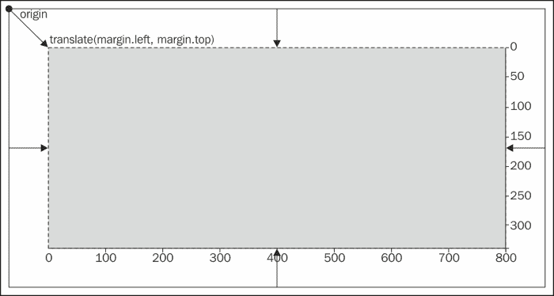
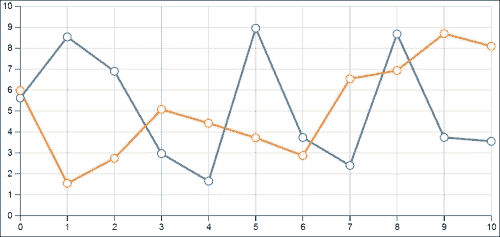
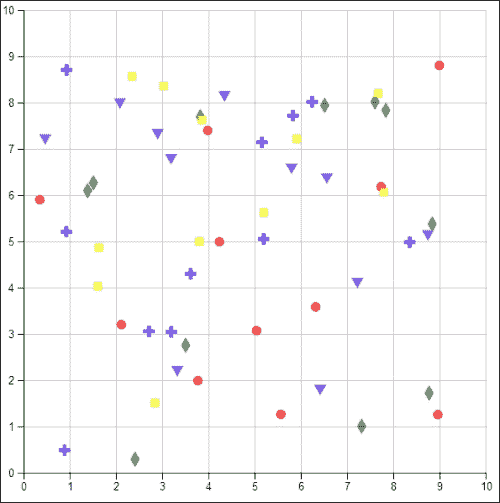
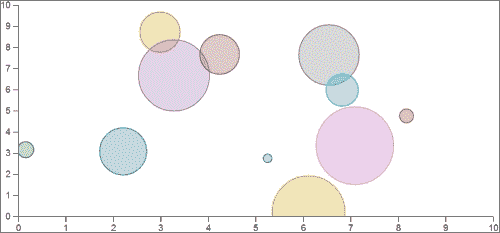
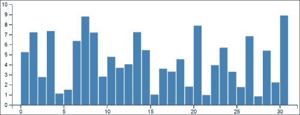

# 第八章. 图表化

在本章中，我们将涵盖以下内容：

+   创建折线图

+   创建面积图

+   创建散点图图表

+   创建气泡图

+   创建条形图

# 简介

在本章中，我们将把注意力转向数据可视化中最古老且最值得信赖的伴侣之一——图表。图表是对数据进行良好定义和理解的图形表示；以下定义只是证实了这一点：

> （在图表中）数据通过符号表示，例如条形图中的条形、折线图中的线条或饼图中的切片。
> 
> Jensen C. & Anderson L. (1991)

当图表用于数据可视化时，它们被广泛理解的图形语义和语法减轻了您的可视化观众学习图形隐喻含义的负担。因此，他们可以专注于数据本身以及通过可视化生成的信息。本章的目标不仅是介绍一些常用的图表类型，还演示了我们将学到的一些主题和技术如何结合并利用 D3 来制作流畅的交互式图表。

本章中的食谱比我们迄今为止遇到的食谱要长得多，因为它们旨在实现功能齐全的可重用图表。我已经尝试将其分解为不同的部分，并使用一致的图表结构来简化您的阅读体验。然而，仍然强烈建议在阅读本章时，同时打开浏览器中的配套代码示例和您的文本编辑器，以最大限度地减少潜在的混淆并最大化收益。

**D3 图表惯例**：在我们深入创建第一个可重用图表之前，我们需要了解 D3 社区中普遍接受的某些图表惯例，否则我们可能会冒着创建让用户困惑而不是帮助他们的图表库的风险。

### 注意

如您所想象，D3 图表通常使用 SVG 而不是 HTML 来实现；然而，我们在这里讨论的惯例也适用于基于 HTML 的图表，尽管实现细节将有所不同。

让我们先看看以下图表：



D3 图表惯例

### 注意

要了解 D3 创建者的这一惯例解释，请访问[`bl.ocks.org/mbostock/3019563`](http://bl.ocks.org/mbostock/3019563)

如此图表所示，SVG 图像中的原点（0, 0）位于其左上角，这是预期的，然而，这一惯例最重要的方面是关于如何定义图表边距，以及进一步轴线的位置。

+   **边距**：首先，让我们看看这一惯例最重要的方面——边距。正如我们所看到的，对于每个图表，都有四个不同的边距设置：左边距、右边距、上边距和下边距。灵活的图表实现应该允许用户为这些边距中的每一个设置不同的值，我们将在后面的食谱中看到如何实现这一点。

+   **坐标平移**：其次，这个约定还建议使用 SVG 的 `translate` 变换 `translate(margin.left, margin.top)` 来定义图表主体（灰色区域）的坐标参考。这种平移有效地将图表主体区域移动到所需的位置，这种方法的一个额外好处是，通过改变图表主体坐标的参考框架，简化了在图表主体内部创建子元素的工作，因为边距大小变得无关紧要。对于图表主体内部的任何子元素，其原点（0, 0）现在位于图表主体区域的左上角。

+   **轴**：最后，这个约定的最后一个方面是关于图表轴如何放置以及放置在哪里。如图所示，图表轴放置在图表边距内部，而不是作为图表主体的一部分。这种方法的优势在于将轴视为图表中的外围元素，因此不会混淆图表主体的实现，并且还使轴的渲染逻辑与图表无关且易于重用。

现在，让我们利用迄今为止学到的所有知识和技巧，创建我们的第一个可重用的 D3 图表。

# 创建折线图

折线图是一种常见的基本图表类型，在许多领域得到广泛应用。这种图表由一系列通过直线段连接的数据点组成。折线图通常由两条垂直的轴：x 轴和 y 轴所包围。在本食谱中，我们将看到如何使用 D3 将这种基本图表实现为一个可重用的 JavaScript 对象，该对象可以配置为在不同的尺度上显示多个数据系列。此外，我们还将展示实现带有动画的动态多数据系列更新的技术。

## 准备工作

在您的网络浏览器中打开以下文件的本地副本：

[`github.com/NickQiZhu/d3-cookbook/blob/master/src/chapter8/line-chart.html`](https://github.com/NickQiZhu/d3-cookbook/blob/master/src/chapter8/line-chart.html)

非常推荐在阅读本食谱时打开相应的代码示例。

## 如何做到这一点...

让我们看看实现这种图表类型的代码。由于代码长度较长，我们在这里只展示代码的概要，具体细节将在接下来的 *工作原理...* 部分中详细介绍。

```py
<script type="text/javascript">
// First we define the chart object using a functional objectfunction lineChart() { // <-1A
...
    // main render function 
    _chart.render = function () { // <-2A
    ...
    };

    // axes rendering function
    function renderAxes(svg) {
    ...
    }
  ...

    // function to render chart body
    function renderBody(svg) { // <-2D        
    ...
    }

    // function to render lines
    function renderLines() {
    ...
    }

 // function to render data points
    function renderDots() {

    }

    return _chart; // <-1E
}
```

本食谱生成以下图表：



折线图

## 工作原理...

如我们所见，这个食谱比我们迄今为止遇到的所有内容都要复杂得多，因此现在我将将其分解成多个具有不同重点的详细部分。

**图表对象和属性**：首先，我们将看看这个图表对象是如何创建的，以及如何检索和设置与图表对象关联的属性。

```py
function lineChart() { // <-1A
  var _chart = {};

  var _width = 600, _height = 300, // <-1B
    _margins = {top: 30, left: 30, right: 30, bottom: 30},
    _x, _y,
    _data = [],
    _colors = d3.scale.category10(),
    _svg,
    _bodyG,
    _line;
  ...
  _chart.height = function (h) {// <-1C
    if (!arguments.length) return _height;
    _height = h;
    return _chart;
  };

  _chart.margins = function (m) {
    if (!arguments.length) return _margins;
    _margins = m;
    return _chart;
  };
...
  _chart.addSeries = function (series) { // <-1D
    _data.push(series);
    return _chart;
  };
...
   return _chart; // <-1E
}

...

var chart = lineChart()
  .x(d3.scale.linear().domain([0, 10]))
  .y(d3.scale.linear().domain([0, 10]));

data.forEach(function (series) {
  chart.addSeries(series);
});

chart.render();
```

如我们所见，图表对象是在第 1A 行使用名为`lineChart`的函数定义的，遵循我们在第一章中讨论的函数对象模式，*使用 D3.js 入门*。利用函数对象模式提供的信息隐藏的更大灵活性，我们定义了一系列内部属性，所有属性名都以下划线开头（第 1B 行）。其中一些属性通过提供访问器函数（第 1C 行）公开。公开可访问的属性包括：

+   `width`: 图表 SVG 总宽度（以像素为单位）

+   `height`: 图表 SVG 总高度（以像素为单位）

+   `margins`: 图表边距

+   `colors`: 用于区分不同数据系列的图表序数颜色刻度

+   `x`: x 轴刻度

+   `y`: y 轴刻度

    访问器函数是通过我们在第一章中介绍的技术实现的，*使用 D3.js 入门*，有效地将获取器和设置器函数结合在一个函数中，当没有提供参数时作为获取器使用，当提供参数时作为设置器使用（第 1C 行）。此外，`lineChart`函数及其访问器都返回一个图表实例，从而允许函数链式调用。最后，图表对象还提供了一个`addSeries`函数，该函数简单地将数据数组（`series`）推入其内部数据存储数组（`_data`），见第 1D 行。

    **图表主体框架渲染**：在介绍基本图表对象及其属性之后，本可重用图表实现的下一个方面是图表主体`svg:g`元素的渲染及其裁剪路径生成。

    ```py
    _chart.render = function () { // <-2A
      if (!_svg) {
        _svg = d3.select("body").append("svg") // <-2B
          .attr("height", _height)
          .attr("width", _width);

        renderAxes(_svg);

        defineBodyClip(_svg);
      }

      renderBody(_svg);
    };
    ...
    function defineBodyClip(svg) { // <-2C
      var padding = 5;

      svg.append("defs")
        .append("clipPath")
        .attr("id", "body-clip")
        .append("rect")
        .attr("x", 0 - padding)
        .attr("y", 0)
        .attr("width", quadrantWidth() + 2 * padding)
        .attr("height", quadrantHeight());
      }

    function renderBody(svg) { // <-2D
      if (!_bodyG)
        _bodyG = svg.append("g")
          .attr("class", "body")
          .attr("transform", "translate(" 
            + xStart() + "," 
            + yEnd() + ")") // <-2E
          .attr("clip-path", "url(#body-clip)");        

      renderLines();

      renderDots();
    }
    ...
    ```

    在第 2A 行定义的`render`函数负责创建`svg:svg`元素并设置其`width`和`height`（第 2B 行）。之后，它创建一个覆盖整个图表主体区域的`svg:clipPath`元素。`svg:clipPath`元素用于限制可以应用绘画的区域。在我们的例子中，我们使用它来限制线条和点可以绘制的地方（仅限于图表主体区域）。此代码生成以下 SVG 元素结构，该结构定义了图表主体：

    

    ### 注意

    关于裁剪和遮罩的更多信息，请访问[`www.w3.org/TR/SVG/masking.html`](http://www.w3.org/TR/SVG/masking.html)

    在第 2D 行定义的`renderBody`函数生成一个`svg:g`元素，该元素将所有图表主体内容包裹起来，并设置了一个根据我们在前一部分讨论的图表边距约定进行的平移（第 2E 行）。

    **渲染坐标轴**：坐标轴在`renderAxes`函数（第 3A 行）中渲染。

    ```py
    function renderAxes(svg) { // <-3A
      var axesG = svg.append("g")
        .attr("class", "axes");

      renderXAxis(axesG);

      renderYAxis(axesG);
    }
    ```

    如前一章所述，x 轴和 y 轴都渲染在图表边距区域内。我们不会深入讨论坐标轴渲染的细节，因为我们已经在第五章中详细讨论了这一主题，*玩转坐标轴*。

    **渲染数据系列**：到目前为止，我们在这个食谱中讨论的所有内容并不仅限于这种图表类型，而是一个与其他笛卡尔坐标系图表类型共享的框架。最后，现在我们将讨论如何为多个数据系列创建线段和点。让我们看一下以下负责数据系列渲染的代码片段。

    ```py
    function renderLines() { 
      _line = d3.svg.line() // <-4A
        .x(function (d) { return _x(d.x); })
        .y(function (d) { return _y(d.y); });

      _bodyG.selectAll("path.line")
        .data(_data)
        .enter() // <-4B
        .append("path")                
        .style("stroke", function (d, i) { 
          return _colors(i); // <-4C
        })
        .attr("class", "line");

      _bodyG.selectAll("path.line")
        .data(_data)
        .transition() // <-4D
        .attr("d", function (d) { return _line(d); });
    }

    function renderDots() {
      _data.forEach(function (list, i) {
        _bodyG.selectAll("circle._" + i) // <-4E
          .data(list)
          .enter()
          .append("circle")
          .attr("class", "dot _" + i);

        _bodyG.selectAll("circle._" + i)
          .data(list)                    
          .style("stroke", function (d, i) { 
            return _colors(i); // <-4F
          })
          .transition() // <-4G
          .attr("cx", function (d) { return _x(d.x); })
          .attr("cy", function (d) { return _y(d.y); })
          .attr("r", 4.5);
        });
    }
    ```

    线段和点是通过我们在第七章中介绍的技术生成的，*进入形状*。`d3.svg.line`生成器在第 4A 行创建，用于创建映射数据系列的`svg:path`。使用 Enter-and-Update 模式创建数据线（第 4B 行）。第 4C 行根据其索引为每条数据线设置不同的颜色。最后，第 4E 行在更新模式下设置过渡，以便在每次更新时平滑地移动数据线。`renderDots`函数执行类似的渲染逻辑，生成代表每个数据点的`svg:circle`元素集合（第 4E 行），根据数据系列索引（第 4F 行）协调其颜色，并在第 4G 行上最终启动过渡，这样点就可以在数据更新时与线一起移动。

    如本食谱所示，创建一个可重用的图表组件实际上需要做很多工作。然而，在创建外围图形元素和访问器方法时，需要超过三分之二的代码。因此，在实际项目中，你可以提取这部分逻辑，并将此实现的大部分用于其他图表；尽管我们没有在我们的食谱中这样做，以减少复杂性，这样你可以快速掌握图表渲染的所有方面。由于本书的范围有限，在后面的食谱中，我们将省略所有外围渲染逻辑，而只关注与每种图表类型相关的核心逻辑。

# 创建面积图

面积图或面积图与折线图非常相似，在很大程度上是基于折线图实现的。面积图与折线图的主要区别在于，在面积图中，轴和线之间的区域被填充了颜色或纹理。在本食谱中，我们将探讨实现一种称为**分层面积图**的面积图技术。

## 准备工作

在您的网络浏览器中打开以下文件的本地副本：

[`github.com/NickQiZhu/d3-cookbook/blob/master/src/chapter8/area-chart.html`](https://github.com/NickQiZhu/d3-cookbook/blob/master/src/chapter8/area-chart.html)

## 如何做...

由于面积图实现主要基于折线图实现，并且它共享许多常见的图形元素，如轴和裁剪路径，因此在本食谱中，我们只展示与面积图实现特定相关的代码：

```py
...
function renderBody(svg) {
  if (!_bodyG)
    _bodyG = svg.append("g")
      .attr("class", "body")
      .attr("transform", "translate(" 
        + xStart() + "," 
        + yEnd() + ")") 
      .attr("clip-path", "url(#body-clip)");        

  renderLines();

  renderAreas();

  renderDots();
}

function renderLines() {
  _line = d3.svg.line()
    .x(function (d) { return _x(d.x); })
    .y(function (d) { return _y(d.y); });

  _bodyG.selectAll("path.line")
    .data(_data)
    .enter()
    .append("path")
    .style("stroke", function (d, i) { 
      return _colors(i); 
    })
    .attr("class", "line");

  _bodyG.selectAll("path.line")
    .data(_data)
    .transition()
    .attr("d", function (d) { return _line(d); });
}

function renderDots() {
  _data.forEach(function (list, i) {
    _bodyG.selectAll("circle._" + i)
      .data(list)
      .enter().append("circle")
      .attr("class", "dot _" + i);

    _bodyG.selectAll("circle._" + i)
      .data(list)
      .style("stroke", function (d, i) { 
        return _colors(i); 
      })
      .transition()
      .attr("cx", function (d) { return _x(d.x); })
      .attr("cy", function (d) { return _y(d.y); })
      .attr("r", 4.5);
  });
}

function renderAreas() {
 var area = d3.svg.area() // <-A
 .x(function(d) { return _x(d.x); })
 .y0(yStart())
 .y1(function(d) { return _y(d.y); });

 _bodyG.selectAll("path.area")
 .data(_data)
 .enter() // <-B
 .append("path")
 .style("fill", function (d, i) { 
 return _colors(i); 
 })
 .attr("class", "area");

 _bodyG.selectAll("path.area")
 .data(_data)
 .transition() // <-C
 .attr("d", function (d) { return area(d); });
}
...
```

本食谱生成了以下分层面积图：


分层面积图

## 它是如何工作的...

如前所述，由于区域图实现基于我们的线形图实现，实现的大部分内容是相同的。事实上，区域图需要渲染线形图中实现的精确线和点。关键的区别在于`renderAreas`函数。在本教程中，我们依赖于第七章中讨论的区域生成技术，即“形状入门”。在行 A 上创建了`d3.svg.area`生成器，其上边线与线匹配，而下边线（`y0`）固定在 x 轴上。

```py
var area = d3.svg.area() // <-A
  .x(function(d) { return _x(d.x); })
  .y0(yStart())
  .y1(function(d) { return _y(d.y); });
```

一旦定义了区域生成器，就采用经典的“进入并更新”模式来创建和更新区域。在进入情况（行 B）中，为每个数据系列创建了一个`svg:path`元素，并使用其系列索引进行着色，以便它与我们的线和点匹配颜色（行 C）。

```py
_bodyG.selectAll("path.area")
  .data(_data)
  .enter() // <-B
  .append("path")
  .style("fill", function (d, i) { 
    return _colors(i); // <-C
  })
  .attr("class", "area");
```

当数据更新时，以及对于新创建的区域，我们开始一个过渡（行 D）来更新区域`svg:path`元素的`d`属性到所需的形状（行 E）。

```py
_bodyG.selectAll("path.area")
  .data(_data)
  .transition() // <-D
  .attr("d", function (d) { 
    return area(d); // <-E
  });
```

由于我们知道线形图实现更新时会同时动画化线和点，因此我们这里的区域更新过渡有效地允许区域根据图表中的线和点进行动画化和移动。

最后，我们还添加了`path.area`的 CSS 样式以降低其不透明度，使区域变得透明；因此，允许我们期望的分层效果。

```py
.area {
    stroke: none;
    fill-opacity: .2;
}
```

# 创建散点图图表

散点图或散点图是另一种常见的图表类型，用于在笛卡尔坐标系中显示具有两个不同变量的数据点。散点图在探索聚类和分类问题时特别有用。在本教程中，我们将学习如何在 D3 中实现多系列散点图图表。

## 准备工作

在您的网络浏览器中打开以下文件的本地副本：

[`github.com/NickQiZhu/d3-cookbook/blob/master/src/chapter8/scatterplot-chart.html`](https://github.com/NickQiZhu/d3-cookbook/blob/master/src/chapter8/scatterplot-chart.html)

## 如何做...

散点图是另一种使用笛卡尔坐标的图表。因此，其实现的大部分内容与我们之前介绍过的图表非常相似，因此有关外围图形元素的代码在此书中再次省略以节省空间。请查阅配套代码以获取完整的实现。

```py
...
_symbolTypes = d3.scale.ordinal() // <-A
  .range(["circle",
    "cross",
    "diamond",
    "square",
    "triangle-down",
    "triangle-up"]);
...
function renderBody(svg) {
  if (!_bodyG)
    _bodyG = svg.append("g")
      .attr("class", "body")                    
      .attr("transform", "translate(" 
        + xStart() + "," 
        + yEnd() + ")") 
      .attr("clip-path", "url(#body-clip)");

  renderSymbols();
}

function renderSymbols() { // <-B
  _data.forEach(function (list, i) {
    _bodyG.selectAll("path._" + i)
      .data(list)
      .enter()
      .append("path")
      .attr("class", "symbol _" + i);

    _bodyG.selectAll("path._" + i)
      .data(list)
      .classed(_symbolTypes(i), true)
      .transition()
      .attr("transform", function(d){
        return "translate("
          + _x(d.x)
          + ","
          + _y(d.y)
          + ")";
      })
      .attr("d", 
    d3.svg.symbol().type(_symbolTypes(i)));
  });
}
...
```

本教程生成散点图图表：



散点图图表

## 它是如何工作的...

散点图图表的内容主要由第 B 行的 `renderSymbols` 函数渲染。你可能已经注意到，`renderSymbols` 函数的实现与我们在 *创建折线图* 菜谱中讨论的 `renderDots` 函数非常相似。这并非偶然，因为两者都试图在二维笛卡尔坐标系上绘制数据点（x 和 y）。在绘制点的情况下，我们创建 `svg:circle` 元素，而在散点图中，我们需要创建 `d3.svg.symbol` 元素。D3 提供了一系列预定义的符号，可以轻松生成并使用 `svg:path` 元素渲染。在第 A 行中，我们定义了一个序数比例，允许将数据系列索引映射到不同的符号类型：

```py
_symbolTypes = d3.scale.ordinal() // <-A
  .range(["circle",
    "cross",
    "diamond",
    "square",
    "triangle-down",
    "triangle-up"]);
```

使用符号绘制数据点相当直接。首先，我们遍历数据系列数组，并为每个数据系列创建一组 `svg:path` 元素，代表系列中的每个数据点。

```py
_data.forEach(function (list, i) {
  _bodyG.selectAll("path._" + i)
    .data(list)
    .enter()
    .append("path")
    .attr("class", "symbol _" + i);
    ...
});
```

每当数据系列更新时，以及对于新创建的符号，我们使用带有过渡效果的更新（第 C 行），将它们放置在正确的坐标位置，并使用 SVG 平移变换（第 D 行）。

```py
_bodyG.selectAll("path._" + i)
  .data(list)
    .classed(_symbolTypes(i), true)
  .transition() // <-C
    .attr("transform", function(d){
      return "translate(" // <-D
        + _x(d.x) 
        + "," 
        + _y(d.y) 
        + ")";
    })
    .attr("d", 
      d3.svg.symbol() // <-E
      .type(_symbolTypes(i))
  );
```

最后，每个 `svg:path` 元素的 `d` 属性是通过 `d3.svg.symbol` 生成函数生成的，如第 E 行所示。

# 创建气泡图

气泡图是一种典型的可视化，能够显示三个数据维度。每个具有三个数据点的数据实体在笛卡尔坐标系上被可视化为一个气泡（或圆盘），使用两个不同的变量通过 x 轴和 y 轴表示，类似于散点图图表。而第三个维度则使用气泡的半径（圆盘的大小）表示。气泡图在帮助理解数据实体之间的关系时特别有用。

## 准备工作

在您的网络浏览器中打开以下文件的本地副本：

[`github.com/NickQiZhu/d3-cookbook/blob/master/src/chapter8/bubble-chart.html`](https://github.com/NickQiZhu/d3-cookbook/blob/master/src/chapter8/bubble-chart.html)

## 如何做...

在本菜谱中，我们将探讨使用 D3 实现典型气泡图的技术和方法。以下代码示例显示了气泡图的重要实现方面，省略了访问器和外围图形实现细节。

```py
...
var _width = 600, _height = 300,
  _margins = {top: 30, left: 30, right: 30, bottom: 30},
  _x, _y, _r, // <-A
  _data = [],
  _colors = d3.scale.category10(),
  _svg,
  _bodyG;

  _chart.render = function () {
    if (!_svg) {
      _svg = d3.select("body").append("svg")
      .attr("height", _height)
      .attr("width", _width);

    renderAxes(_svg);

    defineBodyClip(_svg);
  }

  renderBody(_svg);
};
...
function renderBody(svg) {
  if (!_bodyG)
    _bodyG = svg.append("g")
      .attr("class", "body")
      .attr("transform", "translate(" 
        + xStart() 
        + "," 
        + yEnd() + ")")
      .attr("clip-path", "url(#body-clip)");
  renderBubbles();
}

function renderBubbles() {
 _r.range([0, 50]); // <-B

 _data.forEach(function (list, i) {
 _bodyG.selectAll("circle._" + i)
 .data(list)
 .enter()
 .append("circle") // <-C
 .attr("class", "bubble _" + i);

 _bodyG.selectAll("circle._" + i)
 .data(list)
 .style("stroke", function (d, j) { 
 return _colors(j); 
 })
 .style("fill", function (d, j) { 
 return _colors(j); 
 })
 .transition()
 .attr("cx", function (d) { 
 return _x(d.x); // <-D
 })
 .attr("cy", function (d) { 
 return _y(d.y); // <-E
 })
 .attr("r", function (d) { 
 return _r(d.r); // <-F
 });
 });
}
...
```

此菜谱生成了以下可视化：



气泡图

## 它是如何工作的...

总体而言，气泡图实现遵循本章迄今为止介绍的其他图表实现的相同模式。然而，由于在气泡图中我们想要可视化三个不同的维度（x、y 和半径）而不是两个，因此在此实现中添加了一个新的比例 `_r`（第 A 行）。

```py
var _width = 600, _height = 300,
  _margins = {top: 30, left: 30, right: 30, bottom: 30},
  _x, _y, _r, // <-A
  _data = [],
  _colors = d3.scale.category10(),
  _svg,
  _bodyG;
```

大多数气泡图相关的实现细节都由 `renderBubbles` 函数处理。它从设置半径刻度上的范围（行 B）开始。当然，我们也可以在我们的图表实现中使半径范围可配置；然而，为了简单起见，我们选择在这里显式设置它：

```py
function renderBubbles() {
  _r.range([0, 50]); // <-B

  _data.forEach(function (list, i) {
    _bodyG.selectAll("circle._" + i)
      .data(list)
      .enter()
      .append("circle") // <-C
      .attr("class", "bubble _" + i);

    _bodyG.selectAll("circle._" + i)
      .data(list)
      .style("stroke", function (d, j) { 
        return _colors(j); 
      })
      .style("fill", function (d, j) { 
        return _colors(j); 
      })
      .transition()
      .attr("cx", function (d) { 
        return _x(d.x); // <-D
      })
      .attr("cy", function (d) { 
        return _y(d.y); // <-E
      })
      .attr("r", function (d) { 
        return _r(d.r); // <-F
      });
  });
}
```

一旦设置了范围，然后我们遍历我们的数据系列，并为每个系列创建一组 `svg:circle` 元素（行 C）。最后，我们在最后一节中处理新创建的气泡及其更新，其中 `svg:circle` 元素通过其 `cx` 和 `cy` 属性着色并放置到正确的坐标（行 D 和 E）。最后，气泡的大小通过其半径属性 `r` 控制使用我们之前定义的 `_r` 缩放（行 F）。

### 小贴士

在某些气泡图实现中，实现者还利用每个气泡的颜色来可视化第四个数据维度，尽管有些人认为这种视觉表示难以理解且多余。

# 创建条形图

条形图是一种使用水平（行图）或垂直（柱状图）矩形条进行可视化的图表，其长度与它们所代表的值成比例。在这个配方中，我们将使用 D3 实现一个柱状图。柱状图能够同时通过其 y 轴视觉表示两个变量；换句话说，条形的高度和其 x 轴。x 轴的值可以是离散的或连续的（例如，直方图）。在我们的例子中，我们选择在 x 轴上可视化连续值，从而有效地实现直方图。然而，相同的技巧也可以用于处理离散值。

## 准备工作

在您的网络浏览器中打开以下文件的本地副本：

[`github.com/NickQiZhu/d3-cookbook/blob/master/src/chapter8/bar-chart.html`](https://github.com/NickQiZhu/d3-cookbook/blob/master/src/chapter8/bar-chart.html)

## 如何操作...

以下代码示例展示了直方图的重要实现方面，省略了访问器和外围图形实现细节。

```py
...
var _width = 600, _height = 250,
  _margins = {top: 30, left: 30, right: 30, bottom: 30},
  _x, _y,
  _data = [],
  _colors = d3.scale.category10(),
  _svg,
  _bodyG;

  _chart.render = function () {
    if (!_svg) {
      _svg = d3.select("body").append("svg")
        .attr("height", _height)
        .attr("width", _width);

    renderAxes(_svg);

    defineBodyClip(_svg);
  }

  renderBody(_svg);
};
...
function renderBody(svg) {
  if (!_bodyG)
    _bodyG = svg.append("g")
      .attr("class", "body")
      .attr("transform", "translate(" 
        + xStart() 
        + "," 
        + yEnd() + ")")
      .attr("clip-path", "url(#body-clip)");

  renderBars();
  }

function renderBars() {
 var padding = 2; // <-A

 _bodyG.selectAll("rect.bar")
 .data(_data)
 .enter()
 .append("rect") // <-B
 .attr("class", "bar");

 _bodyG.selectAll("rect.bar")
 .data(_data) 
 .transition()
 .attr("x", function (d) { 
 return _x(d.x); // <-C
 })
 .attr("y", function (d) { 
 return _y(d.y); // <-D 
 })
 .attr("height", function (d) { 
 return yStart() - _y(d.y); // <-E
 })
 .attr("width", function(d){
 return Math.floor(quadrantWidth() / _data.length) - padding;
 });
}
...
```

这个配方生成了以下可视化：



条形图（直方图）

## 它是如何工作的...

这里的一个主要区别是条形图实现不支持多个数据系列。因此，与迄今为止我们处理其他图表时使用的一个存储多个数据系列的二维数组不同，在这个实现中，`_data` 数组直接存储一组数据点。与条形图相关的可视化逻辑主要位于 `renderBars` 函数中。

```py
function renderBars() {
  var padding = 2; // <-A
  ...
}
```

在第一步中，我们定义了条之间的填充（行 A），这样我们就可以在以后自动计算每个条的宽度。之后，我们为每个数据点生成一个 `svg:rect` 元素（条）。然后，我们打开以下链接：

```py
_bodyG.selectAll("rect.bar")
  .data(_data)
  .enter()
  .append("rect") // <-B
  .attr("class", "bar");
```

然后在更新部分，我们使用每个条的`x`和`y`属性（行 C 和 D）将其放置在正确的坐标位置，并将每个条延伸到底部，使其与 x 轴接触，高度自适应地计算在行 E。

```py
_bodyG.selectAll("rect.bar")
  .data(_data)
  .transition()
  .attr("x", function (d) { 
    return _x(d.x); // <-C
  })
  .attr("y", function (d) { 
    return _y(d.y); // <-D 
  })
  .attr("height", function (d) { 
    return yStart() - _y(d.y); // <-E
  })
```

最后，我们使用条的数量以及我们之前定义的填充值来计算每个条的最优宽度。

```py
.attr("width", function(d){
  return Math.floor(quadrantWidth() / _data.length) - padding;
});
```

当然，在更灵活的实现中，我们可以将填充宽度设置为可配置的，而不是固定为 2 像素。

## 参见

在计划为您的下一个可视化项目实现自己的可重用图表之前，请确保您还检查以下基于 D3 的开放源代码可重用图表项目：

+   NVD3: [`nvd3.org/`](http://nvd3.org/).

+   Rickshaw: [`code.shutterstock.com/rickshaw/`](http://code.shutterstock.com/rickshaw/).
