# 第九章. 布局它们

在本章中，我们将涵盖：

+   构建饼图

+   构建堆叠面积图

+   构建树状图

+   构建树

+   构建围栏图

# 简介

本章的重点是 D3 的**布局**——这是一个我们之前未曾遇到的概念。正如预期的那样，D3 布局是一组算法，用于计算和生成一组元素的放置信息。然而，在我们深入具体细节之前，有一些关键属性值得提及：

+   **布局是数据**：布局完全是数据驱动的，它们不会直接生成任何图形或显示相关的输出。这使得它们可以与 SVG 或 canvas 一起使用，甚至在没有图形输出的情况下也可以重复使用

+   **抽象和可重用**：布局是抽象的，允许高度灵活性和可重用性。您可以通过各种不同的有趣方式组合和重用布局。

+   **布局是不同的**：每个布局都是不同的。D3 提供的每个布局都专注于一个非常特殊的图形需求和数据结构。

+   **无状态**：布局主要是无状态的，以简化其使用。这里的无状态意味着布局通常像函数一样，可以用不同的输入数据多次调用，并生成不同的布局输出。

布局是 D3 中有趣且强大的概念。在本章中，我们将通过创建利用这些布局的完整功能可视化来探索 D3 中最常用的布局。

# 构建饼图

饼图或圆形图是一个包含多个扇区的圆形图，用于说明数值比例。在本配方中，我们将探索涉及 D3 **饼图布局**的技术，以构建一个功能齐全的饼图。在第七章“进入形状”中，很明显，直接使用 D3 弧生成器是一个非常繁琐的工作。每个弧生成器都期望以下数据格式：

```py
var data = [
  {startAngle: 0, endAngle: 0.6283185307179586}, 
  {startAngle: 0.6283185307179586, endAngle: 1.2566370614359172},
  ...
  {startAngle: 5.654866776461628, endAngle: 6.283185307179586}
];
```

这本质上需要计算整个圆周`2 * Math.PI`中每个切片的角度分区。显然，这个过程可以通过一个算法自动完成，这正是`d3.layout.pie`设计的目的。在本配方中，我们将看到如何使用饼图布局来实现一个功能齐全的饼图。

## 准备工作

在您的网络浏览器中打开以下文件的本地副本：

[`github.com/NickQiZhu/d3-cookbook/blob/master/src/chapter9/pie-chart.html`](https://github.com/NickQiZhu/d3-cookbook/blob/master/src/chapter9/pie-chart.html).

## 如何做...

饼图或圆形图是一个分为扇区（切片）的圆形图。饼图在许多领域都很受欢迎，广泛用于展示不同实体之间的关系，尽管并非没有批评。让我们首先看看如何使用`d3.pie.layout`实现饼图。

```py
<script type="text/javascript">
  function pieChart() {
    var _chart = {};

    var _width = 500, _height = 500,
      _data = [],
      _colors = d3.scale.category20(),
      _svg,
      _bodyG,
      _pieG,
      _radius = 200,
      _innerRadius = 100;

      _chart.render = function () {
        if (!_svg) {
          _svg = d3.select("body").append("svg")
            .attr("height", _height)
            .attr("width", _width);
        }

      renderBody(_svg);
  };

  function renderBody(svg) {
    if (!_bodyG)
      _bodyG = svg.append("g")
        .attr("class", "body");

    renderPie();
  }

  function renderPie() {
    var pie = d3.layout.pie()
      .sort(function (d) {
        return d.id;
      })
      .value(function (d) {
        return d.value;
      });

    var arc = d3.svg.arc()
      .outerRadius(_radius)
      .innerRadius(_innerRadius);

    if (!_pieG)
      _pieG = _bodyG.append("g")
        .attr("class", "pie")
        .attr("transform", "translate(" + _radius + "," + _radius + ")");

    renderSlices(pie, arc);

    renderLabels(pie, arc);
  }

  function renderSlices(pie, arc) {
  // explained in detail in the'how it works...' section
  ...
  }

  function renderLabels(pie, arc) {
  // explained in detail in the 'how it works...' section
  ...
  }
  ...
  return _chart;
}
...
</script>
```

此配方生成了以下饼图：

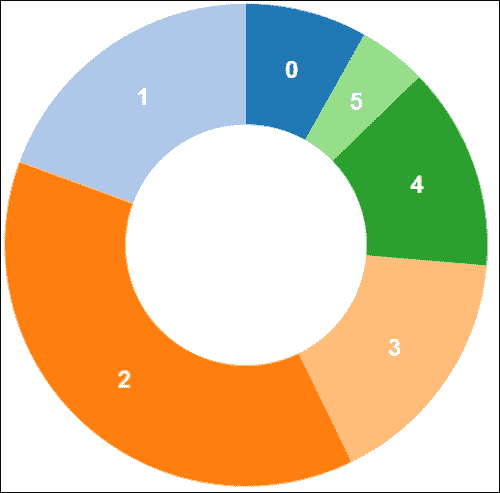

圆环图

## 它是如何工作的...

这个配方是在我们学到的第七章，*进入形状*的基础上构建的。一个主要的不同之处在于，我们依赖于`d3.layout.pie`来为我们转换原始数据为弧数据。饼图布局在行 A 上创建，同时指定了排序和值访问器。

```py
var pie = d3.layout.pie() // <-A
  .sort(function (d) {
    return d.id;
  })
  .value(function (d) {
    return d.value;
  });
```

`sort`函数告诉饼图布局按其 ID 字段对切片进行排序，这样我们就可以在切片之间保持稳定的顺序。如果没有排序，默认情况下，饼图布局将按值对切片进行排序，导致每次我们更新饼图时切片都会交换。`value`函数用于提供值访问器，在我们的例子中返回`value`字段。现在，在饼图布局中渲染切片时，我们直接将饼图布局作为数据（记住布局是数据）来生成弧`svg:path`元素（行 B）。

```py
function renderSlices(pie, arc) {
  var slices = _pieG.selectAll("path.arc")
    .data(pie(_data)); // <-B

  slices.enter()
    .append("path")
    .attr("class", "arc")
    .attr("fill", function (d, i) {
      return _colors(i);
    });

  slices.transition()
    .attrTween("d", function (d) {
      var currentArc = this.__current__;//<-C

      if (!currentArc)
        currentArc = {startAngle: 0, 
          endAngle: 0};

      var interpolate = d3.interpolate(
        currentArc, d);
      this.__current__ = interpolate(1);//<-D
        return function (t) {
          return arc(interpolate(t));
        };
    });
}
```

其余的渲染逻辑基本上与我们学到的第七章，*进入形状*中相同，只有一个例外是在行 C。在行 C 中，我们从元素中检索当前弧值，以便过渡可以从当前角度开始而不是从零开始。然后在行 D 中，我们将当前弧值重置为最新值，这样下次我们更新饼图数据时，我们可以重复状态性过渡。

### 小贴士

**技术 – 状态性可视化**

在 DOM 元素上注入值的技术是将状态性引入你的可视化的常见方法。换句话说，如果你需要你的可视化记住它们之前的状态，你可以在 DOM 元素中保存它们。

最后，我们还需要在每个切片上渲染标签，以便我们的用户可以理解每个切片代表什么。这是通过`renderLabels`函数完成的。

```py
function renderLabels(pie, arc) {
  var labels = _pieG.selectAll("text.label")
    .data(pie(_data)); // <-E

  labels.enter()
    .append("text")
    .attr("class", "label");

  labels.transition()
    .attr("transform", function (d) {
      return "translate(" 
        + arc.centroid(d) + ")"; //<-F
      })
    .attr("dy", ".35em")
    .attr("text-anchor", "middle")
    .text(function (d) {
      return d.data.id;
    });
}
```

再次使用饼图布局作为数据来生成`svg:text`元素。标签的位置是通过`arc.centroid`（行 F）计算的。此外，标签位置通过过渡进行动画处理，这样它们就可以与弧一起移动。

## 更多...

饼图在许多不同的领域中被广泛使用。然而，由于它们对于人类眼睛来说难以比较给定饼图的各个部分，以及它们的信息密度低，因此它们也受到了广泛的批评。因此，强烈建议将部分数量限制在 3 个以下，其中 2 个是理想的。否则，你总是可以使用条形图或小型表格在精度和传达能力更好的地方替换饼图。

## 参见

+   在第七章的*使用弧生成器*配方中，*进入形状*

+   在第七章的*实现弧过渡*配方中，*进入形状*

# 构建堆叠面积图

在第八章的`Creating an area chart`食谱中，我们探讨了如何使用 D3 实现基本分层面积图。在本食谱中，我们将基于我们在面积图食谱中学到的知识来实现堆叠面积图。堆叠面积图是标准面积图的一种变体，其中不同的区域堆叠在一起，不仅使观众能够单独比较不同的数据系列，而且还能比较它们与总量的比例关系。

## 准备工作

在您的网页浏览器中打开以下文件的本地副本：

[`github.com/NickQiZhu/d3-cookbook/blob/master/src/chapter9/stacked-area-chart.html`](https://github.com/NickQiZhu/d3-cookbook/blob/master/src/chapter9/stacked-area-chart.html).

## 如何实现...

本食谱是在我们在第八章中实现的`Chart Them Up`的基础上构建的，因此，在以下代码示例中，仅包含与堆叠面积图特别相关的部分：

```py
<script type="text/javascript">
function stackedAreaChart() {
  var _chart = {};

  var _width = 900, _height = 450,
    _margins = {top: 30, left: 30, right: 30, bottom: 30},
    _x, _y,
    _data = [],
    _colors = d3.scale.category10(),
    _svg,
    _bodyG,
    _line;

  _chart.render = function () {
    if (!_svg) {
      _svg = d3.select("body").append("svg")
      .attr("height", _height)
      .attr("width", _width);

    renderAxes(_svg);

    defineBodyClip(_svg);
  }

  renderBody(_svg);
};
...
function renderBody(svg) {
  if (!_bodyG)
    _bodyG = svg.append("g")
      .attr("class", "body")
      .attr("transform", "translate("
        + xStart() + ","
        + yEnd() + ")")
      .attr("clip-path", "url(#body-clip)");

  var stack = d3.layout.stack() //<-A
    .offset('zero');
  stack(_data); //<-B

  renderLines(_data);

  renderAreas(_data);
}

function renderLines(stackedData) {
  // explained in details in the'how it works...' section
...
}

function renderAreas(stackedData) {
  // explained in details in the 'how it works...' section
...
}
...
```

本食谱生成了以下可视化效果：

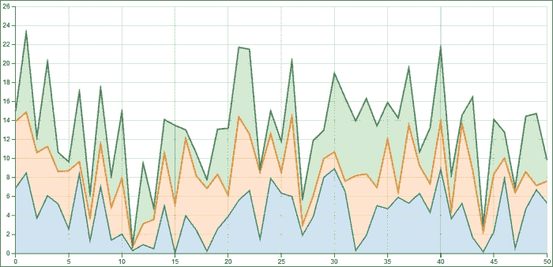

堆叠面积图

## 工作原理...

与标准面积图相比，本食谱的主要区别在于堆叠。本食谱中展示的堆叠效果是通过在行 A 上创建的`d3.layout.stack`实现的。

```py
var stack = d3.layout.stack() //<-A
  .offset('zero');
stack(_data); //<-B
```

在堆叠布局上，我们唯一进行的自定义是将其`offset`设置为`zero`。D3 堆叠布局支持几种不同的偏移模式，这些模式决定了使用哪种堆叠算法；这是我们将在本食谱和下一食谱中探讨的内容。在这种情况下，我们使用`zero`偏移堆叠，它生成一个零基线的堆叠算法，这正是本食谱所想要的。接下来，在行 B 上，我们对给定的数据数组调用了堆叠布局，生成了以下布局数据：

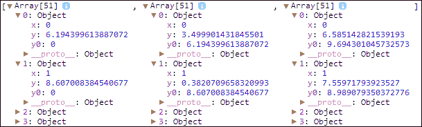

堆叠数据

如所示，堆叠布局自动为我们的三个不同数据系列中的每个数据项计算一个基线`y0`。现在，我们有了这个堆叠数据集，我们可以轻松地生成堆叠线。

```py
function renderLines(stackedData) {
  _line = d3.svg.line()
    .x(function (d) {
      return _x(d.x); //<-C
    })
    .y(function (d) {
      return _y(d.y + d.y0); //<-D
    });
  _bodyG.selectAll("path.line")
    .data(stackedData)
    .enter()
    .append("path")
    .style("stroke", function (d, i) {
      return _colors(i);
    })
    .attr("class", "line");

  _bodyG.selectAll("path.line")
    .data(stackedData)
    .transition()
    .attr("d", function (d) {
      return _line(d);
    });
}
```

创建了一个 D3 线生成函数，其 x 值直接映射到`x`（行 C），其 y 值映射到`y + y0`（行 D）。这就是进行线堆叠所需做的全部工作。`renderLines`函数的其余部分基本上与基本面积图实现相同。面积堆叠逻辑略有不同：

```py
function renderAreas(stackedData) {
  var area = d3.svg.area()
    .x(function (d) {
      return _x(d.x); //<-E
    })
    .y0(function(d){return _y(d.y0);}) //<-F
    .y1(function (d) {
      return _y(d.y + d.y0); //<-G
    });
  _bodyG.selectAll("path.area")
    .data(stackedData)
    .enter()
    .append("path")
    .style("fill", function (d, i) {
      return _colors(i);
    })
    .attr("class", "area");

  _bodyG.selectAll("path.area")
    .data(_data)
    .transition()
    .attr("d", function (d) {
      return area(d);
    });
}
```

在渲染面积时，与线渲染逻辑类似，我们唯一需要更改的地方是在`d3.svg.area`生成器设置中。对于面积，`x`值仍然直接映射到`x`（行 E），其`y0`直接映射到`y0`，最后`y1`是`y`和`y0`的和（行 G）。

如我们所见，D3 堆叠布局设计得非常好，可以与不同的 D3 SVG 生成函数兼容。因此，使用它来生成堆叠效果非常直接和方便。

## 更多内容...

让我们看看堆叠面积图的几个变体。

### 扩展面积图

我们提到`d3.layout.stack`支持不同的偏移模式。除了我们之前看到的`zero`偏移之外，还有一种对面积图非常有用的偏移模式，称为`expand`。在`expand`模式下，堆叠布局将不同层标准化以填充[0, 1]的范围。如果我们更改此食谱中的偏移模式和 y 轴域为[0, 1]，我们将得到下面显示的扩展（标准化）面积图。

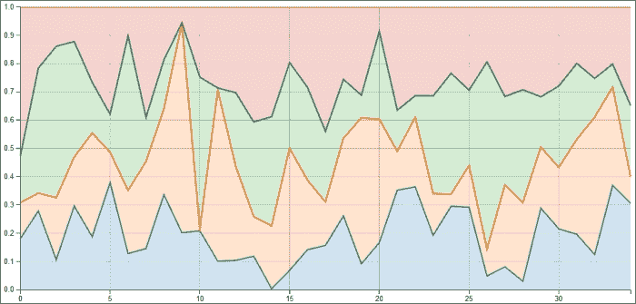

扩展面积图

对于完整的配套代码示例，请访问：[`github.com/NickQiZhu/d3-cookbook/blob/master/src/chapter9/expanded-area-chart.html`](https://github.com/NickQiZhu/d3-cookbook/blob/master/src/chapter9/expanded-area-chart.html)。

### 流图

另一种有趣的堆叠面积图变体被称为流图。流图是一种围绕中心轴显示的堆叠面积图，它创造出一个流动和有机的形状。流图最初由李·拜伦开发，并于 2008 年在《纽约时报》一篇关于电影票房收入的文章中普及。D3 堆叠布局内置了对这种堆叠算法的支持，因此将基于零的堆叠面积图转换为流图是微不足道的。关键区别在于流图使用`wiggle`作为其布局偏移模式。

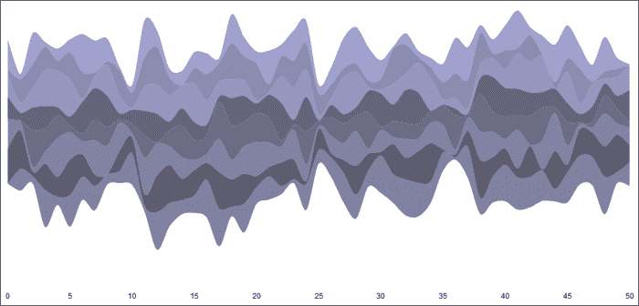

流图

对于完整的配套代码示例，请访问：[`github.com/NickQiZhu/d3-cookbook/blob/master/src/chapter9/streamgraph.html`](https://github.com/NickQiZhu/d3-cookbook/blob/master/src/chapter9/streamgraph.html)。

## 参考资料也

+   `d3.layout.stack`提供了一些额外的函数来定制其行为；有关堆叠布局的更多信息，请访问[`github.com/mbostock/d3/wiki/Stack-Layout`](https://github.com/mbostock/d3/wiki/Stack-Layout)。

+   在第八章“Chart Them Up”的*创建面积图*食谱中，第八章。

# 构建树状图

树状图是由本·施奈德曼在 1991 年提出的。树状图将层次树状数据显示为一系列递归划分的矩形。换句话说，它将树的每一分支显示为一个大的矩形，然后使用代表子分支的小矩形进行平铺。这个过程会一直重复，直到达到树的叶子。

### 注意

关于树状图的更多信息，请参阅本·施奈德曼在[`www.cs.umd.edu/hcil/treemap-history/`](http://www.cs.umd.edu/hcil/treemap-history/)上的这篇论文。

在我们深入代码示例之前，让我们首先定义一下我们所说的**层次数据**。

到目前为止，我们已经学习了多种能够表示通常存储在一维或二维数组中的平面数据结构的可视化类型。在本章的剩余部分，我们将把我们的重点转向数据可视化中另一种常见的类型——层次数据结构。与平面数据结构中使用数组不同，层次数据通常以根树的形式组织。以下 JSON 文件展示了在数据可视化项目中可能会遇到的典型层次数据：

```py
{
  "name": "flare",
  "children": [
  {
    "name": "analytics",
    "children": [
    {
      "name": "cluster",
      "children": [
        {"name": "AgglomerativeCluster", "size": 3938},
        {"name": "CommunityStructure", "size": 3812},
        {"name": "MergeEdge", "size": 743}
      ]
    },
    {
      "name": "graph",
      "children": [
        {"name": "BetweennessCentrality", "size": 3534},
        {"name": "LinkDistance", "size": 5731}
      ]
    },
    {
      "name": "optimization",
      "children": [
        {"name": "AspectRatioBanker", "size": 7074}
      ]
    }
  ]  
  ]
}
```

这是从 D3 社区中用于演示目的的流行层次数据集的一个简略版本。这些数据是从一个流行的基于 Flash 的数据可视化库 Flare 中提取的，该库由加州大学伯克利分校可视化实验室创建。它显示了库中不同包之间的大小和层次关系。

### 注意

查看官方 Flare 网站以获取有关项目的更多信息：[`flare.prefuse.org/`](http://flare.prefuse.org/)。

如我们很容易看到的，这个特定的 JSON 数据流的结构是一个典型的单链根树，每个节点有一个父节点和存储在`children`数组中的多个子节点。这是组织您的层次数据以便由 D3 层次布局消费的最自然方式。在本章的其余部分，我们将使用这个特定的数据集来探索 D3 提供的不同层次数据可视化技术。

## 准备工作

在您的网络浏览器中打开以下文件的本地副本：

[`github.com/NickQiZhu/d3-cookbook/blob/master/src/chapter9/treemap.html`](https://github.com/NickQiZhu/d3-cookbook/blob/master/src/chapter9/treemap.html)。

## 如何实现...

现在，让我们看看如何使用 D3 树状图布局来直观地表示这类层次数据。

```py
function treemapChart() {
  var _chart = {};

  var _width = 1600, _height = 800,
    _colors = d3.scale.category20c(),
   _svg,
   _nodes,
   _x = d3.scale.linear().range([0, _width]),
   _y = d3.scale.linear().range([0, _height]),
   _valueAccessor = function (d) {
      return 1;
    },
  _bodyG;

  _chart.render = function () {
    if (!_svg) {
      _svg = d3.select("body").append("svg")
        .attr("height", _height)
        .attr("width", _width);
    }

    renderBody(_svg);
  };

  function renderBody(svg) {
    // explained in details in the 'how it works...' section
    ... 

    renderCells(cells);
  }

  function renderCells(cells){
    // explained in details in the 'how it works...' section
    ...
  }

  // accessors omitted
  ...

  return _chart;
}

d3.json("flare.json", function (nodes) {
  var chart = treemapChart();
  chart.nodes(nodes).render();
});
```

此配方生成了以下树状图可视化：

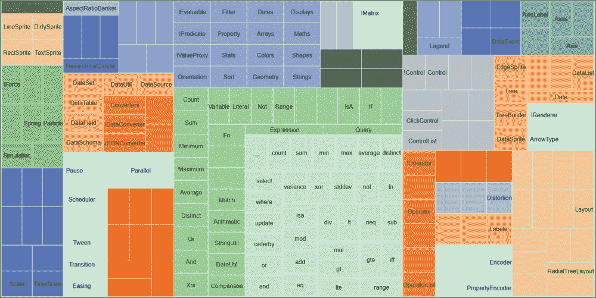

树状图

## 它是如何工作的...

到目前为止，你可能对实现如此复杂的数据可视化所需的代码如此之少感到惊讶。这是因为大部分繁重的工作都是由`d3.layout.treemap`完成的。

```py
function renderBody(svg) {
  if (!_bodyG) {
    _bodyG = svg.append("g")
      .attr("class", "body");

      _treemap = d3.layout.treemap() //<-A
        .round(false)
        .size([_width, _height])
        .sticky(true);
      }

      _treemap.value(_valueAccessor); //<-B

  var nodes = _treemap.nodes(_nodes) //<-C
    .filter(function (d) {
      return !d.children; //<-D
    });

  var cells = svg.selectAll("g") //<-E
    .data(nodes);

  renderCells(cells);
    }
```

树状图布局在行 A 上定义，并包含一些基本的自定义设置：

+   `round(false)`: 如果开启舍入，树状图布局将舍入到精确的像素边界。当你想要避免 SVG 中的抗锯齿伪影时，这非常有用。

+   `size([_width, _height])`: 它将布局边界设置为 SVG 的大小。

+   `sticky(true)`: 在粘性模式下，树状图布局将尝试在过渡过程中保持节点（在我们的例子中是矩形）的相对排列。

+   `value(_valueAccessor)`: 此配方提供的一项功能是能够在运行时切换树状图值访问器。值访问器用于树状图访问每个节点的值字段。在我们的例子中，它可以是以下函数之一：

    ```py
    function(d){ return d.size; } // visualize package size
    function(d){ return 1; } // visualize package count
    ```

+   要在 Flare JSON 数据源上应用树状图布局，我们只需将树状图布局中的`nodes`设置为我们的 JSON 树中的根节点（行 C）。然后，在行 D 中进一步过滤树状图节点以删除父节点（有子节点的节点），因为我们只想可视化叶子节点，同时使用着色来突出显示此树状图实现中的包分组。树状图布局生成的布局数据包含以下结构：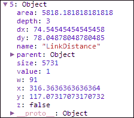

    树状图节点对象

如所示，树状图布局已使用其算法为每个节点标注和计算了许多属性。其中许多属性在可视化时非常有用，在本教程中，我们主要关注以下属性：

+   `x`: 单元 x 坐标

+   `y`: 单元 y 坐标

+   `dx`: 单元宽度

+   `dy`: 单元高度

在行 E 中，为给定的节点创建了一组`svg:g`元素。然后，`renderCells`函数负责创建矩形及其标签：

```py
function renderCells(cells){
  var cellEnter = cells.enter().append("g")
    .attr("class", "cell");

  cellEnter.append("rect")
  cellEnter.append("text");

  cells.transition().attr("transform", function (d) {
    return "translate("+d.x+","+d.y+")"; //<-F
  })
  .select("rect")
    .attr("width", function (d) {return d.dx - 1;})
    .attr("height", function (d) {return d.dy - 1;})
    .style("fill", function (d) {
      return _colors(d.parent.name); //<-G
    });

  cells.select("text") //<-H
    .attr("x", function (d) {return d.dx / 2;})
    .attr("y", function (d) {return d.dy / 2;})
    .attr("dy", ".35em")
    .attr("text-anchor", "middle")
    .text(function (d) {return d.name;})
    .style("opacity", function (d) {
      d.w = this.getComputedTextLength();
      return d.dx > d.w ? 1 : 0; //<-I
    );

  cells.exit().remove();
}
```

每个矩形放置在其位置`(x, y)`上，该位置由行 F 上的布局确定，然后其宽度和高度设置为`dx`和`dy`。在行 G 中，我们使用每个单元的父节点名称着色每个单元，从而确保属于同一父节点的所有子节点都以相同的方式着色。从行 H 开始，我们为每个矩形创建标签（`svg:text`）元素，并将其文本设置为节点名称。这里值得提到的一个方面是，为了避免显示比单元格宽度更大的标签，如果标签比单元格宽度大，则将标签的不透明度设置为 0（行 I）。

### 小贴士

**技术 - 自动隐藏标签**

在行 I 中，我们看到的是可视化中实现自动隐藏标签的有用技术。这项技术可以一般地考虑以下形式：

```py
.style("opacity", function (d) {
    d.w = this.getComputedTextLength();
    return d.dx > d.w ? 1 : 0;
)
```

## 相关内容

+   本教程灵感来源于 Mike Bostock 的树状图布局示例，您可以在[`mbostock.github.io/d3/talk/20111018/treemap.html`](http://mbostock.github.io/d3/talk/20111018/treemap.html)找到。

# 构建树

当处理分层数据结构时，树（树图）可能是最自然和常见的可视化方式之一，通常用于展示不同数据元素之间的结构依赖关系。树是一个无向图，其中任意两个节点（顶点）通过一条且仅有一条简单路径连接。在本教程中，我们将学习如何使用树布局实现树可视化。

## 准备工作

在您的网络浏览器中打开以下文件的本地副本：

[`github.com/NickQiZhu/d3-cookbook/blob/master/src/chapter9/tree.html`](https://github.com/NickQiZhu/d3-cookbook/blob/master/src/chapter9/tree.html)。

## 如何操作...

现在让我们看看`d3.layout.tree`的实际应用：

```py
function tree() {
  var _chart = {};

  var _width = 1600, _height = 800,
    _margins = {top:30, left:120, right:30, bottom:30},
    _svg,
    _nodes,
    _i = 0,
    _tree,
    _diagonal,
    _bodyG;

  _chart.render = function () {
    if (!_svg) {
      _svg = d3.select("body").append("svg")
        .attr("height", _height)
        .attr("width", _width);
    }

    renderBody(_svg);
  };

  function renderBody(svg) {
    if (!_bodyG) {
      _bodyG = svg.append("g")
        .attr("class", "body")
        .attr("transform", function (d) {
          return "translate(" + _margins.left 
            + "," + _margins.top + ")";
          });
    }

    _tree = d3.layout.tree()
      .size([
        (_height - _margins.top - _margins.bottom), 
        (_width - _margins.left - _margins.right)
      ]);

    _diagonal = d3.svg.diagonal()
      .projection(function (d) {
        return [d.y, d.x];
      });

    _nodes.x0 = (_height-_margins.top-_margins.bottom) / 2;
    _nodes.y0 = 0;

    render(_nodes);
  }

  function render(source) {
    var nodes = _tree.nodes(_nodes);

    renderNodes(nodes, source);

    renderLinks(nodes, source);
  }

  function renderNodes(nodes, source) {
    // will be explained in the 'how it works...' section
    ...
  }

  function renderLinks(nodes, source) {
    // will be explained in the 'how it works...' section
    ...
  }

  // accessors omitted
  ...

  return _chart;
}
```

本教程生成的以下树状图可视化：

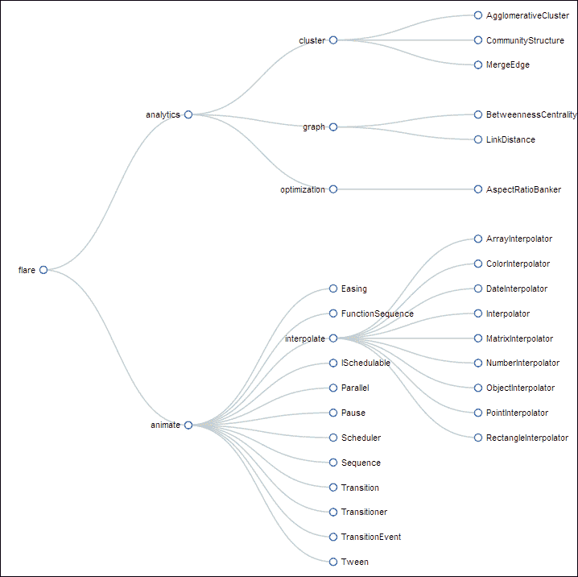

树

## 工作原理...

如我们之前提到的，这个食谱是在 D3 树布局之上构建的。`d3.layout.tree`是专门设计用来将层次数据结构转换为适合生成树图的视觉布局数据的。我们的树布局实例定义如下：

```py
_tree = d3.layout.tree()
  .size([
    (_height - _margins.top - _margins.bottom), 
    (_width - _margins.left - _margins.right)
  ]);
```

我们在这里提供的唯一设置是我们可视化的尺寸，即我们的 SVG 图像尺寸减去边距。然后`d3.layout.tree`将处理其余部分，并相应地计算每个节点的位置。要使用树布局，你只需调用其`nodes`函数。

```py
var nodes = _tree.nodes(_nodes);

```

如果你查看`nodes`布局数据，它包含看起来像这样的节点数据：

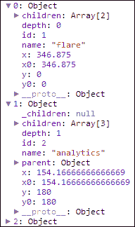

树布局数据

在这个食谱中，我们需要提到的一个新的 D3 SVG 形状生成器是`d3.svg.diagonal`。对角线生成器旨在创建连接两个点的`svg:path`。在这个食谱中，我们使用对角线生成器与树布局的`links`函数一起生成连接树中每个节点的路径。

```py
_diagonal = d3.svg.diagonal()
  .projection(function (d) {
    return [d.y, d.x];
  });
```

在这种情况下，我们配置对角线生成器使用笛卡尔方向投影，并简单地依赖于树布局计算出的 x 和 y 坐标进行定位。实际的渲染由以下函数执行。首先让我们看看`renderNodes`函数：

```py
function renderNodes(nodes, source) {
  nodes.forEach(function (d) {
    d.y = d.depth * 180; 
  });
```

在这里，我们遍历所有节点，并人为地在它们之间分配 180 像素的间距。你可能想知道为什么我们使用 y 坐标而不是 x 坐标。原因是，在这个食谱中，我们想要渲染一个水平树而不是垂直树；因此，我们必须在这里反转 x 和 y 坐标。

```py
  var node = _bodyG.selectAll("g.node")
    .data(nodes, function (d) {
      return d.id || (d.id = ++_i);
    });
```

现在我们将树布局生成的节点绑定到数据，以生成树节点元素。在这个时候，我们还使用索引为每个节点分配一个 ID，以获得对象一致性。

```py
  var nodeEnter = node.enter().append("svg:g")
    .attr("class", "node")
    .attr("transform", function (d) {
      return "translate(" + source.y0 
        + "," + source.x0 + ")";
    });
```

在这一点上，我们创建节点并将它们移动到在`renderBody`函数中设置的相同原点。

```py
  nodeEnter.append("svg:circle")
    .attr("r", 1e-6);

  var nodeUpdate = node.transition()
    .attr("transform", function (d) {
      return "translate(" + d.y + "," + d.x + ")";
    });

  nodeUpdate.select("circle")
    .attr("r", 4.5);
```

现在我们开始在更新部分开始一个转换，将节点移动到它们正确的位置。

```py
  var nodeExit = node.exit().transition()
    .attr("transform", function (d) {
      return "translate(" + source.y 
        + "," + source.x + ")";
      })
    .remove();

  nodeExit.select("circle")
    .attr("r", 1e-6);

  renderLabels(nodeEnter, nodeUpdate, nodeExit);
}
```

最后，我们处理退出情况，并在简短的折叠效果动画后移除节点。`renderLabels`函数相当简单，所以我们不会在这里详细说明。请参阅完整的在线代码伴侣以获取详细信息。

现在让我们看看更有趣的`renderLinks`函数。

```py
function renderLinks(nodes, source) {
  var link = _bodyG.selectAll("path.link")
    .data(_tree.links(nodes), function (d) {
      return d.target.id;
    });
```

首先，我们使用`d3.layout.tree`上的`links`函数生成数据绑定。`links`函数返回一个包含指向适当树节点的`{source, target}`字段的链接对象数组。

```py
  link.enter().insert("svg:path", "g")
    .attr("class", "link")
    .attr("d", function (d) {
      var o = {x: source.x0, y: source.y0};
      return _diagonal({source: o, target: o});
    });
```

在 `enter` 部分中，创建了 `svg:path` 元素来直观地表示源节点和目标节点之间的链接。为了生成路径元素的 `d` 属性，我们依赖于我们之前定义的 `d3.svg.diagonal` 生成器。在创建过程中，我们暂时将链接设置为长度为零的路径，通过将源和目标都设置为同一点来设置。因此，当我们后来将链接过渡到其适当长度时，它将生成扩展效果。

```py
  link.transition()
    .attr("d", _diagonal);
```

现在我们使用树布局生成的链接数据，将链接过渡到其适当的长度和位置。

```py
  link.exit().transition()
    .attr("d", function (d) {
      var o = {x: source.x, y: source.y};
      return _diagonal({source: o, target: o});
    })
  .remove();
```

当我们再次移除节点时，我们依靠同样的技巧，将链接设置为长度为零的父节点位置，以模拟折叠效果。

## 参考以下内容

+   `d3.layout.tree` 提供了几个函数，允许自定义。更多详情，请参阅其 API 文档，链接为 [`github.com/mbostock/d3/wiki/Tree-Layout`](https://github.com/mbostock/d3/wiki/Tree-Layout)。

+   `d3.svg.diagonal` 生成器能够使用笛卡尔方向、径向和其他方向进行投影。更多详情，请参阅其 API 文档，链接为 [`github.com/mbostock/d3/wiki/SVG-Shapes#wiki-diagonal`](https://github.com/mbostock/d3/wiki/SVG-Shapes#wiki-diagonal)。

+   在第六章“Transition with Style”的*动画多个元素*菜谱中，有关于对象恒常性的解释。

+   这个菜谱受到了 Mike Bostock 的树布局示例的启发，您可以在 [`mbostock.github.io/d3/talk/20111018/tree.html`](http://mbostock.github.io/d3/talk/20111018/tree.html) 找到它。

# 构建封装图

封装图是一种有趣的层次数据结构的可视化，它使用递归圆形封装算法。它使用包含（嵌套）来表示层次结构。对于数据树中的每个叶节点，都会创建一个圆，其大小与每个数据元素的一个特定定量维度成比例。在这个菜谱中，我们将学习如何使用 D3 封装布局实现这种可视化。

## 准备工作

在您的网络浏览器中打开以下文件的本地副本：

[`github.com/NickQiZhu/d3-cookbook/blob/master/src/chapter9/pack.html`](https://github.com/NickQiZhu/d3-cookbook/blob/master/src/chapter9/pack.html)

## 如何做...

在这个菜谱中，让我们看看如何使用 `d3.layout.pack` 实现一个封装图。

```py
function pack() {
  var _chart = {};

  var _width = 1280, _height = 800,
    _svg,
    _r = 720,
    _x = d3.scale.linear().range([0, _r]),
    _y = d3.scale.linear().range([0, _r]),
    _nodes,
    _bodyG;

  _chart.render = function () {
    if (!_svg) {
      _svg = d3.select("body").append("svg")
        .attr("height", _height)
        .attr("width", _width);
    }

    renderBody(_svg);
  };

  function renderBody(svg) {
    if (!_bodyG) {
      _bodyG = svg.append("g")
        .attr("class", "body")
        .attr("transform", function (d) {
          return "translate(" 
            + (_width - _r) / 2 + "," 
            + (_height - _r) / 2 
            + ")";
        });
    }

    var pack = d3.layout.pack()
      .size([_r, _r])
      .value(function (d) {
        return d.size;
      });

    var nodes = pack.nodes(_nodes);

    renderCircles(nodes);

    renderLabels(nodes);
  }

  function renderCircles(nodes) {
    // will be explained in the 'how it works...' section
    ...
  }

  function renderLabels(nodes) {
    // omitted
    ...
  }

  // accessors omitted
  ...

  return _chart;
}
```

这个菜谱生成了以下可视化：

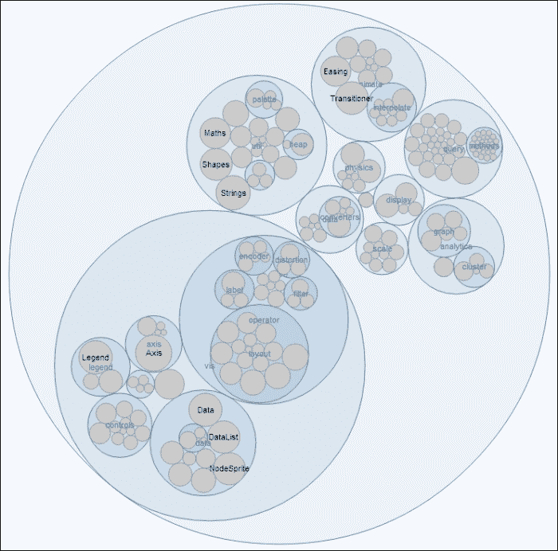

封装图

## 工作原理...

在这个菜谱中，我们首先需要关注的是定义我们的布局；在这种情况下，我们需要使用 `d3.layout.pack` 布局。

```py
var pack = d3.layout.pack()
  .size([_r, _r])
  .value(function (d) {
    return d.size;
  });

var nodes = pack.nodes(_nodes);
```

现在我们使用外圆的半径设置布局的大小，并将值设置为使用 Flare 包的大小，这反过来将决定每个圆的大小；因此，有效地使每个圆的大小与我们的数据源中的包大小成比例。一旦布局创建完成，我们就通过其`nodes`函数将我们的数据元素传递进去，生成具有以下结构的布局数据：

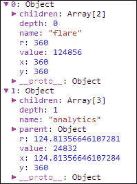

打包布局数据

圆形渲染是在`renderCircle`函数中完成的：

```py
function renderCircles(nodes) {
  var circles = _bodyG.selectAll("circle")
    .data(nodes);

  circles.enter().append("svg:circle");
```

然后，我们简单地绑定布局数据，并为每个节点创建`svg:circle`元素。

```py
  circles.transition()
    .attr("class", function (d) {
      return d.children ? "parent" : "child";
    })
    .attr("cx", function (d) {return d.x; })
    .attr("cy", function (d) {return d.y; })
    .attr("r", function (d) {return d.r; });
```

对于更新，我们将`cx`、`cy`和`radius`设置为打包布局为我们每个圆计算出的值。

```py
  circles.exit().transition()
    .attr("r", 0)
    .remove();
}
```

最后，在移除圆之前，我们首先将圆的大小减小到零，然后再移除它们以生成更平滑的过渡。在这个配方中，标签渲染相当直接，得益于我们在本章中引入的自动隐藏技术，因此我们不会在这里详细说明该函数。

## 参见

+   `d3.layout.pack`提供了几个函数，允许自定义。有关更多详细信息，请查看其 API 文档，链接为[`github.com/mbostock/d3/wiki/Pack-Layout`](https://github.com/mbostock/d3/wiki/Pack-Layout)

+   关于自动隐藏标签技术的*构建树状图*配方。

+   这个配方灵感来源于 Mike Bostock 的打包布局示例，您可以在[`mbostock.github.io/d3/talk/20111018/pack.html`](http://mbostock.github.io/d3/talk/20111018/pack.html)找到。
