# 第十一章。使用力

在本章中，我们将介绍以下内容：

+   使用重力和电荷

+   生成动量

+   设置链接约束

+   使用力辅助可视化

+   操作力

+   构建力导向图

# 简介

> 用力，卢克！
> 
> 大师对学徒的智慧之言

在本章中，我们将介绍 D3 中最迷人的方面之一：力。力模拟是您可以添加到可视化中的最具震撼力的技术之一。通过一系列高度交互和完全功能性的示例，我们将帮助您探索 D3 力的典型应用（例如，力导向图），以及力操作的其他基本方面。

D3 力模拟支持并非作为一个独立的功能，而是一个额外的 D3 布局。正如我们在第九章中提到的，“布局”，D3 布局是非视觉数据导向的布局管理程序，旨在与不同的可视化一起使用。力布局最初是为了实现一种特定的可视化类型——**力导向图**而创建的。其实施使用基于标准 **verlet 集成**的粒子运动模拟，并支持简单的约束。

换句话说，D3 实现了一种数值方法，能够在粒子层面上松散地模拟牛顿的运动方程，并以简单的约束作为粒子之间的链接进行模拟。当然，这种布局在实现力导向图时是理想的；然而，通过本章中的配方，我们还将发现力布局能够生成许多其他有趣的可视化效果，这得益于其在自定义力操作方面的灵活性。本章介绍的技术应用甚至超出了数据可视化领域，并在许多其他领域有实际应用，例如用户界面设计。当然，我们还将介绍力布局的经典应用：本章中的力导向图。

# 使用重力和电荷

在本配方中，我们将向您介绍前两个基本力：重力和电荷。正如我们之前提到的，力布局设计的目的是松散地模拟牛顿的粒子运动方程，而这种模拟的一个主要特征就是电荷力。此外，力布局还实现了伪重力或更准确地说是一种通常以 SVG 为中心的弱几何约束，可以利用它来防止您的可视化逃离 SVG 画布。在以下示例中，我们将学习如何利用这两种基本且有时相反的力，通过粒子系统生成各种效果。

## 准备工作

在您的网页浏览器中打开以下文件的本地副本：

[`github.com/NickQiZhu/d3-cookbook/blob/master/src/chapter11/gravity-and-charge.html`](https://github.com/NickQiZhu/d3-cookbook/blob/master/src/chapter11/gravity-and-charge.html).

## 如何做...

在以下示例中，我们将实验力布局的重力和电荷设置，以便您更好地理解涉及的不同对抗力及其相互作用：

```py
<script type="text/javascript">
    var w = 1280, h = 800,
        force = d3.layout.force()
            .size([w ,h])
            .gravity(0)
            .charge(0)
            .friction(0.7);

    var svg = d3.select("body")
        .append("svg")
            .attr("width", w)
            .attr("height", h);

    force.on("tick", function () {
        svg.selectAll("circle")
            .attr("cx", function (d) {return d.x;})
            .attr("cy", function (d) {return d.y;});
    });

    svg.on("mousemove", function () {
        var point = d3.mouse(this),
            node = {x: point[0], y: point[1]}; // <-A

        svg.append("circle")
                .data([node])
            .attr("class", "node")
            .attr("cx", function (d) {return d.x;})
            .attr("cy", function (d) {return d.y;})
            .attr("r", 1e-6)
        .transition()
            .attr("r", 4.5)
        .transition()
            .delay(7000)
            .attr("r", 1e-6)
            .each("end", function () {
                force.nodes().shift(); // <-B
            })
            .remove();

        force.nodes().push(node); // <-C
        force.start(); // <-D
    });

    function changeForce(charge, gravity) {
        force.charge(charge).gravity(gravity);
    }
</script>

<div class="control-group">
    <button onclick="changeForce(0, 0)">
        No Force
    </button>
    <button onclick="changeForce(-60, 0)">
        Mutual Repulsion
    </button>
    <button onclick="changeForce(60, 0)">
        Mutual Attraction
    </button>
    <button onclick="changeForce(0, 0.02)">
        Gravity
    </button>
    <button onclick="changeForce(-30, 0.1)">
        Gravity with Repulsion
    </button>    
</div>
```

这个配方生成一个具有力功能的粒子系统，能够在以下图中显示的模式下运行：


力模拟模式

## 它是如何工作的...

在我们动手编写前面的代码示例之前，让我们先深入探讨一下重力、电荷和摩擦的概念，这样我们就能更容易地理解在这个配方中我们将使用到的所有神奇数字设置。

### 电荷

电荷被指定来模拟粒子之间的相互 n 体力。负值导致节点相互排斥，而正值导致节点相互吸引。电荷的默认值是`-30`。电荷值也可以是一个函数，该函数将在力模拟开始时为每个节点进行评估。

### 重力

力布局中的重力模拟并不是为了模拟物理重力，这可以通过使用正电荷来模拟。相反，它被实现为一个类似于虚拟弹簧的弱几何约束，连接到布局的每个节点。默认的重力强度设置为`0.1`。随着节点远离中心，重力强度以线性比例增加，而接近布局中心时，重力强度几乎为零。因此，重力将在某个时刻克服排斥电荷，从而防止节点逃离布局。

### 摩擦

D3 力布局中的摩擦并不代表标准的物理摩擦系数，而是实现为一个速度衰减。在模拟粒子的每个时间步长中，速度会通过指定的摩擦系数进行缩放。因此，`1`的值对应于无摩擦环境，而`0`的值会使所有粒子立即冻结，因为它们失去了速度。建议不要使用范围之外的值 `[0, 1]`，因为它们可能会使布局不稳定。

好的，现在我们已经了解了干燥的定义，让我们来看看如何利用这些力来生成有趣的视觉效果。

### 设置零力布局

首先，我们简单地设置一个没有重力和电荷的力布局。力布局可以通过使用`d3.layout.force`函数来创建：

```py
var w = 1280, h = 800,
        force = d3.layout.force()
            .size([w ,h])
            .gravity(0)
            .charge(0)
            .friction(0.7);
```

在这里，我们将布局的大小设置为我们的 SVG 图形的大小，这是一个常见的做法，尽管不是强制性的。在某些用例中，您可能会发现有一个比 SVG 大或小的布局是有用的。同时，我们在设置`friction`为`0.7`的同时禁用了重力和电荷。有了这个设置，我们就可以在用户移动鼠标时在 SVG 上创建表示为`svg:circle`的额外节点：

```py
svg.on("mousemove", function () {
        var point = d3.mouse(this),
            node = {x: point[0], y: point[1]}; // <-A

        svg.append("circle")
                .data([node])
            .attr("class", "node")
            .attr("cx", function (d) {return d.x;})
            .attr("cy", function (d) {return d.y;})
            .attr("r", 1e-6)
        .transition()
            .attr("r", 4.5)
        .transition()
            .delay(7000)
            .attr("r", 1e-6)
            .each("end", function () {
                force.nodes().shift(); // <-B
            })
            .remove();

        force.nodes().push(node); // <-C
        force.start(); // <-D
});
```

节点对象最初在行 A 上创建，其坐标设置为当前鼠标位置。像所有其他 D3 布局一样，力布局没有感知并且没有视觉元素。因此，我们创建的每个节点都需要在行 C 上添加到布局的节点数组中，并在行 B 上移除这些节点的视觉表示。在行 D 上，我们调用`start`函数以开始力模拟。在没有重力和电荷的情况下，布局基本上允许我们通过鼠标移动放置一串节点，如下面的截图所示：

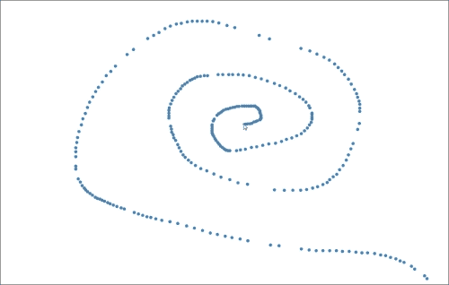

无重力或电荷

### 设置相互排斥

在下一个模式中，我们将电荷设置为负值，同时保持重力为零，以产生相互排斥的力场：

```py
function changeForce(charge, gravity) {
    force.charge(charge).gravity(gravity);
}
changeForce(-60, 0);
```

这些行告诉力布局对每个节点应用`-60`电荷，并根据每个 tick 的模拟结果相应地更新节点的`{x, y}`坐标。然而，仅此还不够将粒子移动到 SVG 上，因为布局没有关于视觉元素的知识。接下来，我们需要编写一些代码将力布局正在操作的数据连接到我们的图形元素。以下是要执行此操作的代码：

```py
force.on("tick", function () {
        svg.selectAll("circle")
            .attr("cx", function (d) {return d.x;})
            .attr("cy", function (d) {return d.y;});
});
```

在这里，我们注册了一个`tick`事件监听器函数，该函数根据力布局的计算更新所有圆元素到其新位置。Tick 监听器在模拟的每个 tick 上触发。在每个 tick 上，我们将`cx`和`cy`属性设置为`d`上的`x`和`y`值。这是因为我们已将节点对象作为 datum 绑定到这些圆元素上，因此它们已经包含了力布局计算出的新坐标。这有效地建立了力布局对所有粒子的控制。

除了`tick`之外，力布局还支持一些其他事件：

+   `start`: 当模拟开始时触发

+   `tick`: 在模拟的每个 tick 上触发

+   `end`: 当模拟结束时触发

此力设置产生以下视觉效果：

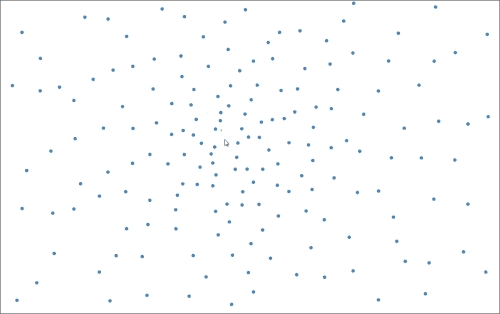

相互排斥

### 设置相互吸引

当我们将电荷更改为正值时，粒子之间产生相互吸引：

```py
function changeForce(charge, gravity) {
    force.charge(charge).gravity(gravity);
}
changeForce(60, 0);
```

这产生了以下视觉效果：

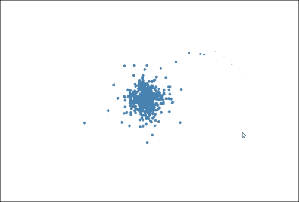

相互吸引

### 设置重力

当我们打开重力并关闭电荷时，它会产生类似于相互吸引的效果；然而，你可以注意到当鼠标从中心移开时，重力吸引的线性缩放：

```py
function changeForce(charge, gravity) {
    force.charge(charge).gravity(gravity);
}
changeForce(0, 0.02);
```

仅使用重力时，这个菜谱会产生以下效果：

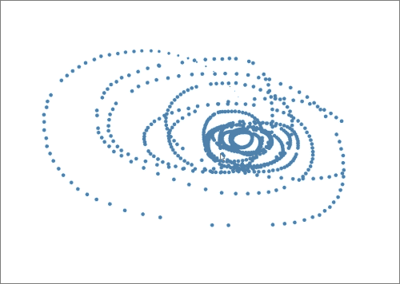

重力

### 使用带有排斥力的重力

最后，我们可以打开重力和相互排斥。结果是力的平衡，使所有粒子保持某种稳定性，既不会逃离布局，也不会相互碰撞：

```py
function changeForce(charge, gravity) {
    force.charge(charge).gravity(gravity);
}
changeForce(-30, 0.1);
```

这是这种力平衡的外观：

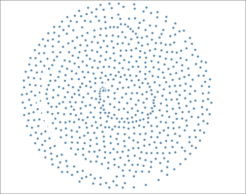

带有排斥力的重力

## 参见

+   Verlet 集成：[`en.wikipedia.org/wiki/Verlet_integration`](http://en.wikipedia.org/wiki/Verlet_integration)

+   可扩展、多功能且简单的约束图布局：[`www.csse.monash.edu.au/~tdwyer/Dwyer2009FastConstraints.pdf`](http://www.csse.monash.edu.au/~tdwyer/Dwyer2009FastConstraints.pdf)

+   物理模拟：[`www.gamasutra.com/resource_guide/20030121/jacobson_pfv.htm`](http://www.gamasutra.com/resource_guide/20030121/jacobson_pfv.htm)

+   本章内容受 Mike Bostock 在 D3 力方面的精彩演讲启发：[`mbostock.github.io/d3/talk/20110921/`](http://mbostock.github.io/d3/talk/20110921/)

+   第十章, *与可视化交互*，了解更多关于如何在 D3 中使用鼠标交互的详细信息

+   D3 力布局 API 文档，了解更多关于力布局的详细信息：[`github.com/mbostock/d3/wiki/Force-Layout`](https://github.com/mbostock/d3/wiki/Force-Layout)

# 生成动量

在我们之前的菜谱中，我们提到了力布局节点对象及其 `{x, y}` 属性，这些属性决定了节点在布局中的位置。在这个菜谱中，我们将讨论物理运动模拟的另一个有趣方面：动量。D3 力布局内置了对动量模拟的支持，这依赖于节点对象上的 `{px, py}` 属性。让我们看看在这个菜谱中描述的示例中如何实现这一点。

## 准备工作

在您的网络浏览器中打开以下文件的本地副本：

[`github.com/NickQiZhu/d3-cookbook/blob/master/src/chapter11/momentum-and-friction.html`](https://github.com/NickQiZhu/d3-cookbook/blob/master/src/chapter11/momentum-and-friction.html).

## 如何操作...

在这个菜谱中，我们将通过首先禁用重力和电荷，然后给新添加的节点一些初始速度来修改之前的菜谱。结果现在鼠标移动得越快，每个节点的初始速度和动量就越高。以下是实现这一点的代码：

```py
<script type="text/javascript">
    var force = d3.layout.force()
            .gravity(0)
            .charge(0)
            .friction(0.95);

    var svg = d3.select("body").append("svg:svg");

    force.on("tick", function () {
        // omitted, same as previous recipe
       ...
    });

    var previousPoint;

    svg.on("mousemove", function () {
        var point = d3.mouse(this),
            node = {
                x: point[0],
                y: point[1],
                px: previousPoint ? previousPoint[0] : point[0],
                py: previousPoint ? previousPoint[1] : point[1]
            };

        previousPoint = point;

        // omitted, same as previous recipe
       ...
    });
</script> 
```

这个菜谱生成一个粒子系统，其初始方向速度与用户的鼠标移动成正比，如以下截图所示：

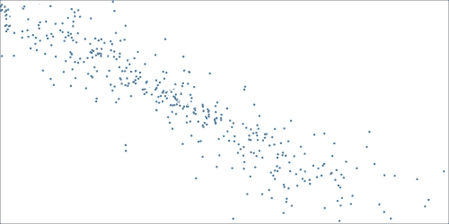

动量

## 它是如何工作的...

这个菜谱的整体结构与之前的非常相似。它也像用户移动鼠标一样生成粒子。此外，一旦力模拟开始，粒子位置就完全由其`tick`事件监听器函数中的力布局控制。然而，在这个菜谱中，我们关闭了重力和电荷，以便我们可以更清晰地专注于动量。我们留下了一些摩擦，使得速度衰减使模拟看起来更真实。以下是我们的力布局配置：

```py
var force = d3.layout.force()
            .gravity(0)
            .charge(0)
            .friction(0.95);
```

在这个菜谱中的主要区别是，我们不仅跟踪当前鼠标位置，还跟踪前一个鼠标位置。此外，每当用户移动鼠标时，我们都会生成一个包含当前位置`{x, y}`以及前一个位置`{px, py}`的节点对象：

```py
    var previousPoint;

    svg.on("mousemove", function () {
        var point = d3.mouse(this),
            node = {
                x: point[0],
                y: point[1],
                px: previousPoint ? previousPoint[0] : point[0],
                py: previousPoint ? previousPoint[1] : point[1]
            };

        previousPoint = point;
        ...
    }
```

由于用户鼠标位置是在固定间隔上采样的，用户移动鼠标的速度越快，这两个位置之间的距离就越远。这个属性加上从这两个位置获得的方向信息，被力布局自动很好地转换成我们在这个菜谱中展示的每个粒子的初始动量。

除了我们之前讨论的`{x, y, px, py}`属性之外，力布局节点对象还支持一些其他有用的属性，我们将在此列出供您参考：

+   `index`：节点在节点数组中的零基索引。

+   `x`：当前节点位置的 x 坐标。

+   `y`：当前节点位置的 y 坐标。

+   `px`：前一个节点位置的 x 坐标。

+   `py`：前一个节点位置的 y 坐标。

+   `fixed`：一个布尔值，表示节点位置是否被锁定。

+   `weight`：节点权重；关联的链接数量。链接用于在力布局中连接节点，我们将在下一菜谱中深入探讨。

## 参见

+   在第十章的*与你的可视化交互*中，*与你的可视化交互*的*与鼠标事件交互*菜谱，了解更多关于如何在 D3 中与鼠标交互的细节

+   D3 Force Layout Nodes API，有关力布局节点属性的更多详细信息 [`github.com/mbostock/d3/wiki/Force-Layout#wiki-nodes`](https://github.com/mbostock/d3/wiki/Force-Layout#wiki-nodes)

# 设置链接约束

到目前为止，我们已经涵盖了力布局的一些重要方面，如重力、电荷、摩擦和动量。在这个菜谱中，我们将讨论另一个关键功能：链接。正如我们在介绍部分提到的，D3 力布局实现了一个可扩展的简单图约束，在这个菜谱中，我们将演示如何结合其他力利用链接约束。

## 准备工作

打开以下文件的本地副本到您的网页浏览器中：

[`github.com/NickQiZhu/d3-cookbook/blob/master/src/chapter11/link-constraint.html`](https://github.com/NickQiZhu/d3-cookbook/blob/master/src/chapter11/link-constraint.html).

## 如何操作...

在这个配方中，每当用户点击鼠标时，我们都会生成一个由节点之间的链接约束的力导向粒子环。以下是它的实现方式：

```py
<script type="text/javascript">
    var force = d3.layout.force()
            .gravity(0.1)
            .charge(-30)
            .friction(0.95)
            .linkDistance(20)
            .linkStrength(1);

    var duration = 60000; // in milliseconds

    var svg = d3.select("body").append("svg:svg");

    force.size([1100, 600])
        .on("tick", function () {
            // omitted, will be discussed in details later
            ...
        });

    function offset() {
        return Math.random() * 100;
    }

    function createNodes(point) {
        var numberOfNodes = Math.round(Math.random() * 10);
        var nodes = [];

        for (var i = 0; i < numberOfNodes; ++i) {
            nodes.push({
                x: point[0] + offset(), 
                y: point[1] + offset()
            });
        }

        return nodes;
    }

    function createLinks(nodes) {
        // omitted, will be discussed in details later
        ...
    }

    svg.on("click", function () {
        var point = d3.mouse(this),
                nodes = createNodes(point),
                links = createLinks(nodes);

        nodes.forEach(function (node) {
            svg.append("circle")
                    .data([node])
                .attr("class", "node")
                .attr("cx", function (d) {return d.x;})
                .attr("cy", function (d) {return d.y;})
                .attr("r", 1e-6)
                .call(force.drag)
                    .transition()
                .attr("r", 7)
                    .transition()
                    .delay(duration)
                .attr("r", 1e-6)
                .each("end", function () {force.nodes().shift();})
                .remove();
        });

        links.forEach(function (link) {
            // omitted, will be discussed in details later
            ...
        });

        nodes.forEach(function (n) {force.nodes().push(n);});
        links.forEach(function (l) {force.links().push(l);});

        force.start();
    });
</script>
```

此配方在鼠标点击时生成力导向的粒子环，如下面的截图所示：

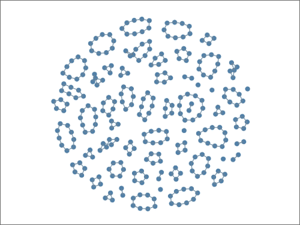

力导向粒子环

## 工作原理...

链接约束为力辅助可视化添加了另一个有用的维度。在这个配方中，我们使用以下参数设置我们的力布局：

```py
var force = d3.layout.force()
            .gravity(0.1)
            .charge(-30)
            .friction(0.95)
            .linkDistance(20)
            .linkStrength(1);
```

除了重力、电荷和摩擦之外，这次我们还有两个额外的参数：链接距离和链接强度。这两个参数都是与链接相关的：

+   `linkDistance`: 可以为一个常量或一个函数；默认为 20 像素。链接距离在布局开始时进行评估，并且它被实现为弱几何约束。对于布局的每一次迭代，都会计算每对链接节点之间的距离，并将其与目标距离进行比较；然后链接会相互靠近或远离。

+   `linkStength`: 可以为一个常量或一个函数；默认为 1。链接强度设置链接的强度（刚性），其值在`[0, 1]`范围内。链接强度也在布局开始时进行评估。

当用户点击鼠标时，会创建一定数量的节点并将其置于力布局的控制之下，这与我们在之前的配方中所做的一样。在这个配方中的主要新增内容是链接的创建及其控制逻辑，如下面的代码片段所示：

```py
    function createLinks(nodes) {
        var links = [];
        for (var i = 0; i < nodes.length; ++i) { // <-A
            if(i == nodes.length - 1) 
                links.push(
                    {source: nodes[i], target: nodes[0]}
                );
            else
                links.push(
                    {source: nodes[i], target: nodes[i + 1]}
                );
        }
        return links;
    }
...
svg.on("click", function () {
        var point = d3.mouse(this),
                nodes = createNodes(point),
                links = createLinks(nodes);
    ...

        links.forEach(function (link) {
            svg.append("line") // <-B
                    .data([link])
                .attr("class", "line")
                .attr("x1", function (d) {
                   return d.source.x;
                    })
                .attr("y1", function (d) {
                   return d.source.y;
})
                .attr("x2", function (d) {
                   return d.target.x;
                    })
                .attr("y2", function (d) {
                   return d.target.y;
    })
                    .transition()
                    .delay(duration)
                .style("stroke-opacity", 1e-6)
                .each("end", function () {
                   force.links().shift();
    })
                .remove();
        });

        nodes.forEach(function (n) {force.nodes().push(n);});
        links.forEach(function (l) { // <-C
          force.links().push(l);
   });

        force.start();
}
```

在`createLinks`函数中，创建了`n-1`个链接对象，将一组节点连接成一个环（在 A 行上的 for 循环）。每个链接对象必须指定两个属性，即`source`和`target`，告诉力布局哪些节点对通过此链接对象连接。一旦创建，我们决定在这个配方中使用`svg:line`元素（B 行）来可视化链接。在下一个配方中，我们将看到这并不总是必须如此。事实上，你可以使用几乎所有东西来可视化（包括隐藏它们，但保留链接以进行布局计算），只要这对你的可视化观众有意义。之后，我们还需要将链接对象添加到力布局的链接数组中（C 行），以便它们可以置于力布局的控制之下。最后，我们需要在`tick`函数中为每个链接将力布局生成的位置数据转换为 SVG 实现，类似于我们对节点所做的那样：

```py
force.size([1100, 600])
        .on("tick", function () {
            svg.selectAll("circle")
                .attr("cx", function (d) {return d.x;})
                .attr("cy", function (d) {return d.y;});

            svg.selectAll("line")
                .attr("x1", function (d) {return d.source.x;})
                .attr("y1", function (d) {return d.source.y;})
                .attr("x2", function (d) {return d.target.x;})
                .attr("y2", function (d) {return d.target.y;});
        });
```

如我们所见，D3 力布局再次承担了大部分繁重的工作，因此我们只需要在`tick`函数中的`svg:line`元素上简单地设置`{x1, y1}`和`{x2, y2}`。为了参考，以下截图是链接对象在经过力布局操作后的样子：

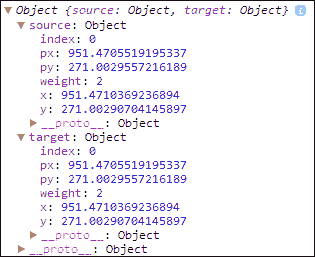

链接对象

在本配方中，还有一个值得提及的额外技术，即力启用拖动。本配方生成的所有节点都是“可拖动的”，并且当用户拖动环时，力布局会自动重新计算所有力和约束，如下截图所示：

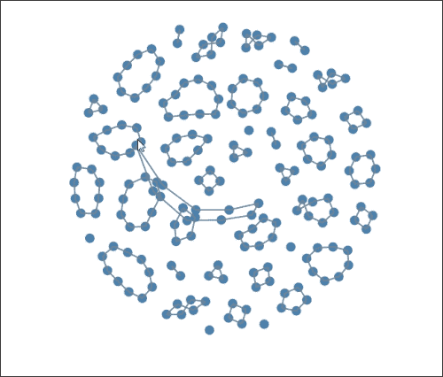

力布局拖动

D3 力布局内置了拖动功能，因此，通过在 `svg:circle` 选择器上简单地调用 `force.drag`，就可以轻松实现这种花哨的效果（代码行 D）：

```py
nodes.forEach(function (node) {
            svg.append("circle")
                    .data([node])
                .attr("class", "node")
                ...
                .call(force.drag) // <-D
                    .transition()
                ...
                .each("end", function () {force.nodes().shift();})
                .remove();
        });
```

## 参考以下

+   可扩展、多功能且简单的约束图布局：[`www.csse.monash.edu.au/~tdwyer/Dwyer2009FastConstraints.pdf`](http://www.csse.monash.edu.au/~tdwyer/Dwyer2009FastConstraints.pdf)

+   `force.links()`: [`github.com/mbostock/d3/wiki/Force-Layout#wiki-links`](https://github.com/mbostock/d3/wiki/Force-Layout#wiki-links)

+   `force.linkDistance()`: [`github.com/mbostock/d3/wiki/Force-Layout#wiki-linkDistance`](https://github.com/mbostock/d3/wiki/Force-Layout#wiki-linkDistance)

+   `force.linkStrength()`: [`github.com/mbostock/d3/wiki/Force-Layout#wiki-linkStrength`](https://github.com/mbostock/d3/wiki/Force-Layout#wiki-linkStrength)

+   `force.drag`: [`github.com/mbostock/d3/wiki/Force-Layout#wiki-drag`](https://github.com/mbostock/d3/wiki/Force-Layout#wiki-drag)

# 使用力辅助可视化

到目前为止，我们已经学会了如何使用力布局可视化粒子及其链接，类似于在经典应用中（如力导向图）使用力布局。这种可视化正是力布局最初设计的目的。然而，这绝对不是利用力进行可视化的唯一方式。在本配方中，我们将探讨我称之为力辅助可视化的技术。利用这种技术，您可以通过利用力来为您的可视化添加一些随机性和任意性。

## 准备工作

在您的网络浏览器中打开以下文件的本地副本：

[`github.com/NickQiZhu/d3-cookbook/blob/master/src/chapter11/arbitrary-visualization.html`](https://github.com/NickQiZhu/d3-cookbook/blob/master/src/chapter11/arbitrary-visualization.html).

## 如何操作...

在本配方中，我们将生成用户鼠标点击时的气泡。这些气泡由填充渐变颜色的 `svg:path` 元素组成。尽管 `svg:path` 元素不是严格由力布局控制的，但它们受到力的影响，因此，赋予它们所需的随机性来模拟现实生活中的气泡：

```py
<svg>
    <defs>
        <radialGradient id="gradient" cx="50%" cy="50%" r="100%" fx="50%" fy="50%">
            <stop offset="0%" style="stop-color:blue;stop-opacity:0"/>
            <stop offset="100%" style="stop-color:rgb(255,255,255);stop-opacity:1"/>
        </radialGradient>
    </defs>
</svg>

<script type="text/javascript">
    var force = d3.layout.force()
            .gravity(0.1)
            .charge(-30)
            .friction(0.95)
            .linkDistance(20)
            .linkStrength(0.5);

    var duration = 10000;

    var svg = d3.select("svg");

    var line = d3.svg.line()
            .interpolate("basis-closed")
            .x(function(d){return d.x;})
            .y(function(d){return d.y;});

    force.size([svg.node().clientWidth, svg.node().clientHeight])
        .on("tick", function () {
            // omitted, will be discussed in details later
            ...
        });

    function offset() {
        return Math.random() * 100;
    }

    function createNodes(point) {
        // omitted, same as previous recipe
       ...
    }

    function createLinks(nodes) {
        // omitted, same as previous recipe
       ...
    }

    svg.on("click", function () {
        // omitted, will be discussed in details later
        ...
    });
</script>
```

本配方在用户鼠标点击时生成力辅助气泡，如下截图所示：

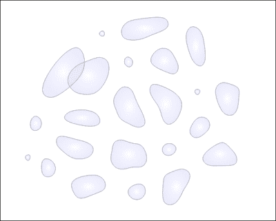

力辅助气泡

## 如何工作...

这个配方建立在之前配方的基础上，因此其整体方法与上一个配方（我们在用户鼠标点击时创建力控制的粒子环）非常相似。这个配方与上一个配方的主要区别在于，我们决定使用`d3.svg.line`生成器来创建轮廓我们气泡的`svg:path`元素，而不是使用`svg:circle`和`svg:line`：

```py
var line = d3.svg.line() // <-A
            .interpolate("basis-closed")
            .x(function(d){return d.x;})
            .y(function(d){return d.y;});
...
svg.on("click", function () {
        var point = d3.mouse(this),
                nodes = createNodes(point),
                links = createLinks(nodes);

        var circles = svg.append("path")
                .data([nodes])
            .attr("class", "bubble")
            .attr("fill", "url(#gradient)") // <-B
            .attr("d", function(d){return line(d);}) // <-C
                .transition().delay(duration)
            .attr("fill-opacity", 0)
            .attr("stroke-opacity", 0)
            .each("end", function(){d3.select(this).remove();});

        nodes.forEach(function (n) {force.nodes().push(n);});
        links.forEach(function (l) {force.links().push(l);});

        force.start();
});
```

在线 A 上，我们使用`basis-closed`插值模式创建了一个线生成器，因为这样可以给我们气泡最平滑的轮廓。每当用户点击鼠标时，就会创建一个`svg:path`元素，连接所有节点（线 C）。此外，我们还用我们预定义的渐变填充气泡，使其看起来很漂亮（线 B）。最后，我们还需要在`tick`函数中实现基于力的定位：

```py
force.size([svg.node().clientWidth, svg.node().clientHeight])
        .on("tick", function () {
            svg.selectAll("path")
                .attr("d", line);
        });
```

在`tick`函数中，我们简单地重新调用线生成器函数来更新每个路径的`d`属性，从而使用力布局计算来动画化气泡。

## 相关内容

+   SVG 渐变和图案：[`www.w3.org/TR/SVG/pservers.html`](http://www.w3.org/TR/SVG/pservers.html)

+   在第七章的“塑形”一节中，有关 D3 线生成器的*使用线生成器*配方，获取更多信息

# 力操纵

到目前为止，我们已经探索了 D3 力布局的许多有趣方面和应用；然而，在所有这些先前的配方中，我们只是直接将力布局的计算（重力、电荷、摩擦和动量）应用于我们的可视化。在这个配方中，我们将更进一步，实现自定义力操纵，从而创建我们自己的力类型。

在这个配方中，我们首先生成五组彩色粒子，然后我们为用户的触摸分配相应的颜色和分类力，从而只拉动匹配颜色的粒子。由于这个配方比较复杂，我在这里给出一个例子：如果我用我的第一个手指触摸可视化，它将生成一个蓝色圆圈并将所有蓝色粒子拉到那个圆圈，而我的第二个触摸将生成一个橙色圆圈，并且只拉动橙色粒子。这种力操纵通常被称为分类多焦点。

## 准备工作

在您的网络浏览器中打开以下文件的本地副本：

[`github.com/NickQiZhu/d3-cookbook/blob/master/src/chapter11/multi-foci.html`](https://github.com/NickQiZhu/d3-cookbook/blob/master/src/chapter11/multi-foci.html).

## 如何做到这一点...

下面是如何在代码中实现它的方法：

```py
<script type="text/javascript">
    var svg = d3.select("body").append("svg:svg"),
            colors = d3.scale.category10(),
            w = 900,
            h = 600;

    svg.attr("width", w).attr("height", h);

    var force = d3.layout.force()
            .gravity(0.1)
            .charge(-30)
            .size([w, h]);

    var nodes = force.nodes(),
            centers = [];

    for (var i = 0; i < 5; ++i) {
        for (var j = 0; j < 50; ++j) {
            nodes.push({x: w / 2 + offset(), 
              y: h / 2 + offset(), 
              color: colors(i), // <-A
              type: i}); // <-B
        }
    }

    function offset() {
        return Math.random() * 100;
    }

    svg.selectAll("circle")
                .data(nodes).enter()
            .append("circle")
            .attr("class", "node")
            .attr("cx", function (d) {return d.x;})
            .attr("cy", function (d) {return d.y;})
            .attr("fill", function(d){return d.color;})
            .attr("r", 1e-6)
                .transition()
            .attr("r", 4.5);

    force.on("tick", function(e) {
          // omitted, will discuss in detail
    ...
    });

    d3.select("body")
        .on("touchstart", touch)
        .on("touchend", touch);

    function touch() {
        // omitted, will discuss in detail
        ...
    }

    force.start();
</script>
```

此配方在触摸时生成多分类焦点，如下截图所示：

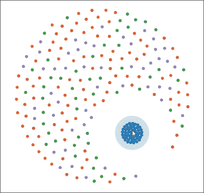

触摸时的多分类焦点

## 它是如何工作的...

此配方的第一步是创建彩色粒子以及重力和排斥力之间的标准力平衡。所有节点对象都包含单独的颜色和类型 ID 属性（行 A 和 B），这样它们就可以在以后轻松识别。接下来，我们需要在用户触摸时创建一个`svg:circle`元素来表示触摸点：

```py
function touch() {
        d3.event.preventDefault();

        centers = d3.touches(svg.node());

        var g = svg.selectAll("g.touch")
                .data(centers, function (d) {
                    return d.identifier;
                });

        g.enter()
            .append("g")
            .attr("class", "touch")
            .attr("transform", function (d) {
                return "translate(" + d[0] + "," + d[1] + ")";
            })
            .append("circle")
                .attr("class", "touch")
                .attr("fill", function(d){
                   return colors(d.identifier);
                })
                    .transition()
                .attr("r", 50);

        g.exit().remove();

        force.resume();
}
```

一旦确定了接触点，所有自定义的力魔法都在`tick`函数中实现。现在，让我们来看看`tick`函数：

```py
force.on("tick", function(e) {
          var k = e.alpha * .2;
          nodes.forEach(function(node) {
            var center = centers[node.type];
            if(center){
                node.x += (center[0] - node.x) * k; // <-C
                node.y += (center[1] - node.y) * k; // <-D
            }
          });

          svg.selectAll("circle")
              .attr("cx", function(d) { return d.x; })
              .attr("cy", function(d) { return d.y; });
});
```

我们在这里遇到的第一种新概念是 alpha 参数。Alpha 是力布局使用的内部冷却参数。Alpha 从`0.1`开始，随着布局的 tick 值向`0`移动。简单来说，alpha 值越高，力越混乱，当 alpha 接近`0`时，布局变得更加稳定。在这个实现中，我们利用 alpha 值来使我们的自定义力实现与内置的其他力同步冷却，因为粒子的运动是通过`k`系数（alpha 的导数）在行 C 和 D 上计算的，将它们移动到匹配的触摸点附近。

## 参见

+   在第十章的*与你的可视化交互*部分，*与多触点设备交互*的配方，了解更多关于 D3 多触点支持的信息

# 构建力导向图

最后，我们将展示如何实现一个力导向图，这是 D3 力布局的经典应用。然而，我们认为，凭借你从本章学到的所有技术和知识，实现力导向图应该感觉相当直接。

## 准备工作

在你的网络浏览器中打开以下文件的本地副本：

[`github.com/NickQiZhu/d3-cookbook/blob/master/src/chapter11/force-directed-graph.html`](https://github.com/NickQiZhu/d3-cookbook/blob/master/src/chapter11/force-directed-graph.html)。

## 如何做...

在这个配方中，我们将可视化 flare 数据集作为一个力导向树（树是图的一种特殊类型）：

```py
<script type="text/javascript">
    var w = 1280,
        h = 800,
        z = d3.scale.category20c();

    var force = d3.layout.force()
        .size([w, h]);

    var svg = d3.select("body").append("svg")
        .attr("width", w)
        .attr("height", h);

    d3.json("/data/flare.json", function(root) {
      var nodes = flatten(root),
          links = d3.layout.tree().links(nodes); // <-B

      force
          .nodes(nodes)
          .links(links)
          .start();

      var link = svg.selectAll("line")
          .data(links)
        .enter().insert("line")
          .style("stroke", "#999")
          .style("stroke-width", "1px");

      var node = svg.selectAll("circle.node")
          .data(nodes)
        .enter().append("circle")
          .attr("r", 4.5)
          .style("fill", function(d) { 
             return z(d.parent && d.parent.name); 
})
          .style("stroke", "#000")
          .call(force.drag);

      force.on("tick", function(e) {
        link.attr("x1", function(d) { return d.source.x; })
            .attr("y1", function(d) { return d.source.y; })
            .attr("x2", function(d) { return d.target.x; })
            .attr("y2", function(d) { return d.target.y; });

        node.attr("cx", function(d) { return d.x; })
            .attr("cy", function(d) { return d.y; });
      });
    });

    function flatten(root) { // <-A
      var nodes = [];
      function traverse(node, depth) {
        if (node.children) {
          node.children.forEach(function(child) {
            child.parent = node;
            traverse(child, depth + 1);
          });
        }
        node.depth = depth;
        nodes.push(node);
      }
      traverse(root, 1);
      return nodes;
    }
</script>
```

这个配方将层次化的 flare 数据集可视化为一个力导向树：

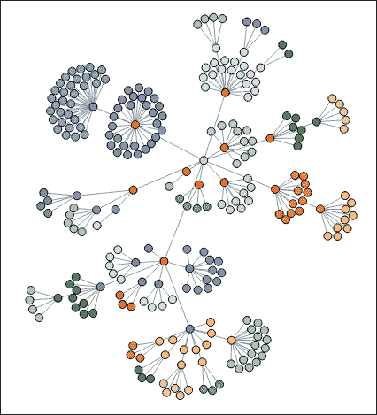

力导向图（树）

## 它是如何工作的...

如我们所见，这个菜谱相当简短，四分之一的代码实际上用于数据处理。这是因为力导向图最初就是为了力布局而设计的。因此，除了简单地应用正确的数据结构来布局之外，实际上并没有太多的事情要做。首先，我们在`flatten`函数（行 A）中使层次化数据集扁平化，因为这是力布局所期望的。其次，我们利用`d3.layout.tree.links`函数在树节点之间生成适当的链接。`d3.layout.tree.links`函数返回一个表示从父节点到子节点的链接对象的数组，换句话说，构建树结构。一旦数据格式正确，剩下的这个菜谱就应用标准的力布局用法，几乎没有任何定制。

## 参见

+   关于 D3 树布局的更多信息，请参阅第九章的*构建树*菜谱，*布局它们*

+   想了解更多关于力导向图的信息，请访问网站：[`en.wikipedia.org/wiki/Force-directed_graph_drawing`](http://en.wikipedia.org/wiki/Force-directed_graph_drawing)
