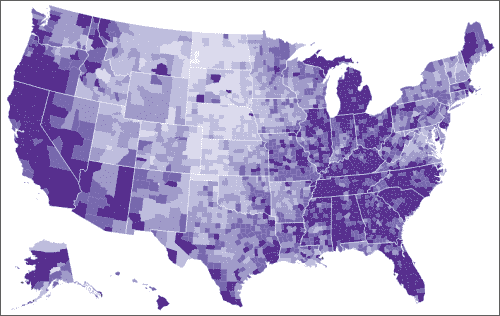

# 第十二章。了解你的地图

在本章中，我们将涵盖：

+   投影美国地图

+   投影世界地图

+   构建渐变色地图

# 简介

能够将数据点投影并关联到地理区域的能力在许多类型的可视化中至关重要。地理可视化是一个复杂的话题，许多标准正在今天的技术中竞争和成熟。D3 提供了几种不同的方式来可视化地理和制图数据。在本章中，我们将介绍基本的 D3 制图可视化技术以及如何在 D3 中实现一个功能齐全的渐变色地图（一种特殊用途的彩色地图）。

# 投影美国地图

在这个菜谱中，我们将从使用 D3 地图 API 投影美国地图开始，同时熟悉描述地理数据的几种不同的 JSON 数据格式。让我们首先看看地理数据通常是如何在 JavaScript 中表示和消费的。

## GeoJSON

我们将要接触的第一个标准 JavaScript 地理数据格式被称为 **GeoJSON**。GeoJSON 格式与其他 GIS 标准的不同之处在于，它是由一个开发者的互联网工作组编写和维护的。

> GeoJSON 是一种用于编码各种地理数据结构的格式。GeoJSON 对象可以表示几何形状、特征或特征集合。GeoJSON 支持以下几何类型：点（Point）、线字符串（LineString）、多边形（Polygon）、多点（MultiPoint）、多线字符串（MultiLineString）、多边形（MultiPolygon）和几何集合（GeometryCollection）。GeoJSON 中的特征包含一个几何对象和额外的属性，而特征集合表示特征列表。
> 
> 来源：[`www.geojson.org/`](http://www.geojson.org/)

GeoJSON 格式是编码 GIS 信息的非常流行的标准，被众多开源和商业软件支持。GeoJSON 格式使用经纬度点作为其坐标，因此，它要求包括 D3 在内的任何软件找到适当的投影、缩放和转换方法，以便可视化其数据。以下 GeoJSON 数据描述了以特征坐标表示的阿拉巴马州的状态：

```py
{
  "type":"FeatureCollection",
  "features":[{
    "type":"Feature",
    "id":"01",
    "properties":{"name":"AL"},
    "geometry":{
      "type":"Polygon",
      "coordinates":[[
        [-87.359296,35.00118],
        [-85.606675,34.984749],
        [-85.431413,34.124869],
        [-85.184951,32.859696],
        ...
        [-88.202745,34.995703],
        [-87.359296,35.00118]
      ]]
  }]
}
```

GeoJSON 目前是 JavaScript 项目中事实上的 GIS 信息标准，并且得到了 D3 的良好支持；然而，在我们直接跳入使用这种数据格式进行 D3 地理可视化之前，我们还想向您介绍另一种与 GeoJSON 密切相关的正在兴起的科技。

### TopoJSON

> TopoJSON 是 GeoJSON 的一个扩展，用于编码拓扑。在 TopoJSON 文件中，几何形状不是离散表示的，而是由称为弧的共享线段拼接而成的。TopoJSON 消除了冗余，提供了比 GeoJSON 更紧凑的几何形状表示；典型的 TopoJSON 文件比其 GeoJSON 等效文件小 80%。此外，TopoJSON 促进了使用拓扑的应用，如拓扑保持形状简化、自动地图着色和地图变形。
> 
> TopoJSON Wiki https://github.com/mbostock/topojson

TopoJSON 是由 D3 的作者**Mike Bostock**创建的，旨在克服 GeoJSON 的一些缺点，同时在描述地理信息时提供类似的功能集。在大多数涉及地图可视化的情况下，TopoJSON 可以作为 GeoJSON 的替代品，具有更小的体积和更好的性能。因此，在本章中，我们将使用 TopoJSON 而不是 GeoJSON。尽管如此，本章中讨论的所有技术也可以与 GeoJSON 完美配合。我们不会在这里列出 TopoJSON 的示例，因为其基于弧的格式不太适合人类阅读。然而，您可以使用 GDAL 提供的命令行工具`ogr2ogr`轻松地将您的**shapefiles**（流行的开源地理矢量格式文件）转换为 TopoJSON（[`www.gdal.org/ogr2ogr.html`](http://www.gdal.org/ogr2ogr.html)）。

现在我们有了这些背景信息，让我们看看如何在 D3 中制作地图。

## 准备工作

在您的本地 HTTP 服务器上托管的网络浏览器中打开以下文件的本地副本：

[`github.com/NickQiZhu/d3-cookbook/blob/master/src/chapter12/usa.html`](https://github.com/NickQiZhu/d3-cookbook/blob/master/src/chapter12/usa.html)

## 如何操作...

在这个配方中，我们将加载美国 TopoJSON 数据并使用 D3 Geo API 进行渲染。以下是代码示例：

```py
<script type="text/javascript">
    var width = 960, height = 500;

    // use default USA Albers projection
    var path = d3.geo.path();

    var svg = d3.select("body").append("svg")
            .attr("width", width)
            .attr("height", height);

    var g = svg.append('g')
            .call(d3.behavior.zoom()
                  .scaleExtent([1, 10])
                  .on("zoom", zoom));

    d3.json("/data/us.json", function (error, topology) { // <-A
        g.selectAll("path") 
                .data(topojson.feature(topology, 
                   topology.objects.states).features)
                .enter().append("path")
                .attr("d", path);
    });

    function zoom() {
        g.attr("transform", "translate("
                + d3.event.translate
                + ")scale(" + d3.event.scale + ")");
    }
</script>
```

此配方使用 Albers USA 模式投影美国地图：


使用 Albers USA 模式投影的美国地图

## 如何工作...

如您所见，使用 TopoJSON 和 D3 投影美国地图所需的代码相当简短，尤其是关于地图投影的部分。这是因为 D3 地理 API 和 TopoJSON 库都是专门构建的，以便尽可能简化开发者的工作。要制作地图，首先您需要加载 TopoJSON 数据文件（行 A）。以下截图显示了加载后的拓扑数据的外观：


TopoJSON 拓扑数据

一旦加载了拓扑数据，我们只需使用 TopoJSON 库的`topojson.feature`函数将拓扑弧转换为类似于 GeoJSON 格式提供的坐标，如下面的截图所示：


使用 topojson.feature 函数转换的特征集合

然后`d3.geo.path`将自动识别并使用坐标来生成以下代码片段中突出显示的`svg:path`：

```py
var path = d3.geo.path();
...
g.selectAll("path") 
                .data(topojson.feature(topology, 
                   topology.objects.states).features)
                .enter().append("path")
                .attr("d", path);
```

就这样！这就是使用 TopoJSON 在 D3 中投影地图所需的所有操作。此外，我们还向父`svg:g`元素附加了一个缩放处理程序：

```py
var g = svg.append('g')
            .call(d3.behavior.zoom()
                  .scaleExtent([1, 10])
                  .on("zoom", zoom));
```

这允许用户在我们的地图上执行简单的几何缩放。

## 相关内容

+   GeoJSON v1.0 规范：[`www.geojson.org/geojson-spec.html`](http://www.geojson.org/geojson-spec.html)

+   TopoJSON Wiki：[`github.com/mbostock/topojson/wiki`](https://github.com/mbostock/topojson/wiki)

+   更多关于从 shapefiles 制作 TopoJSON 的信息：[`bost.ocks.org/mike/map/`](http://bost.ocks.org/mike/map/)

+   第三章, *处理数据*, 了解异步数据加载的相关信息

+   第十章, *与你的可视化交互*, 了解如何实现缩放的相关信息

+   基于本菜谱的 Mike Bostock 关于 Albers USA 投影的帖子 [`bl.ocks.org/mbostock/4090848`](http://bl.ocks.org/mbostock/4090848)

# 投影世界地图

如果我们的可视化项目不仅仅是关于美国，而是涉及整个世界呢？不用担心，D3 提供了各种内置的投影模式，这些模式在本菜谱中我们将探讨。

## 准备工作

在您的本地 HTTP 服务器上托管您的网络浏览器中打开以下文件的本地副本：

[`github.com/NickQiZhu/d3-cookbook/blob/master/src/chapter12/world.html`](https://github.com/NickQiZhu/d3-cookbook/blob/master/src/chapter12/world.html)

## 如何操作...

在本菜谱中，我们将使用不同的 D3 内置投影模式来投影世界地图。以下是代码示例：

```py
<script type="text/javascript">
    var width = 300, height = 300,
        translate = [width / 2, height / 2];

    var projections = [ // <-A
        {name: 'azimuthalEqualArea', fn: 
          d3.geo.azimuthalEqualArea()
                .scale(50)
                .translate(translate)},
        {name: 'conicEquidistant', fn: d3.geo.conicEquidistant()
             .scale(35)
                .translate(translate)},
        {name: 'equirectangular', fn: d3.geo.equirectangular()
             .scale(50)
                .translate(translate)},
        {name: 'mercator', fn: d3.geo.mercator()
             .scale(50)
                .translate(translate)},
        {name: 'orthographic', fn: d3.geo.orthographic()
                   .scale(90)
                      	.translate(translate)},
        {name: 'stereographic', fn: d3.geo.stereographic()
                                .scale(35)
                                .translate(translate)}
    ];

    d3.json("/data/world-50m.json", function (error, world) {//<-B    
        projections.forEach(function (projection) {
            var path = d3.geo.path() // <-C
                    .projection(projection.fn);

            var div = d3.select("body")
                    .append("div")
                    .attr("class", "map");

            var svg = div
                    .append("svg")
                    .attr("width", width)
                    .attr("height", height);

            svg.append("path") // <-D
                    .datum(topojson.feature(world, 
                       world.objects.land))
                    .attr("class", "land")
                    .attr("d", path);

            svg.append("path") // <-E
                    .datum(topojson.mesh(world, 
                       world.objects.countries))
                    .attr("class", "boundary")
                    .attr("d", path);

            div.append("h3").text(projection.name);
        });
    });
</script>
```

本菜谱生成了具有不同投影模式的世界地图，如下面的截图所示：


世界地图投影

## 它是如何工作的...

在本菜谱中，我们首先在行 A 上定义了一个包含六个不同 D3 投影模式的数组。在行 B 上加载了世界拓扑数据。与之前的菜谱类似，我们在行 C 上定义了一个`d3.geo.path`生成器；然而，在本菜谱中，我们为地理路径生成器自定义了投影模式，通过调用其`projection`函数。本菜谱的其余部分几乎与之前所做的相同。`topojson.feature`函数被用来将拓扑数据转换为地理坐标，以便`d3.geo.path`可以生成用于地图渲染所需的`svg:path`（行 D 和 E）。

## 相关内容

+   D3 wiki 地理投影页面 ([`github.com/mbostock/d3/wiki/Geo-Projections`](https://github.com/mbostock/d3/wiki/Geo-Projections))，了解更多关于不同投影模式以及如何实现原始自定义投影的信息

# 构建着色图

着色图是一种专题地图，换句话说，它是一种专门设计的地图，而不是通用目的的地图，它通过使用不同的颜色阴影或图案在地图上展示统计变量的测量值；或者有时简单地被称为地理热图。在前两个菜谱中，我们已经看到 D3 中的地理投影由一组`svg:path`元素组成，因此，它们可以被像其他任何`svg`元素一样操作，包括着色。我们将在本菜谱中探索这个特性，并实现一个着色图。

## 准备工作

在您的本地 HTTP 服务器上托管您的网络浏览器中打开以下文件的本地副本：

[`github.com/NickQiZhu/d3-cookbook/blob/master/src/chapter12/choropleth.html`](https://github.com/NickQiZhu/d3-cookbook/blob/master/src/chapter12/choropleth.html)

## 如何操作...

在渐变地图中，不同的地理区域根据其相应的变量着色，在本例中基于 2008 年美国各县的失业率。现在，让我们看看如何在代码中实现它：

```py
<script type="text/javascript">
    var width = 960, height = 500;

    var color = d3.scale.threshold() // <-A
            .domain([.02, .04, .06, .08, .10])
            .range(["#f2f0f7", "#dadaeb", "#bcbddc", 
             "#9e9ac8", "#756bb1", "#54278f"]);

    var path = d3.geo.path();

    var svg = d3.select("body").append("svg")
            .attr("width", width)
            .attr("height", height);

var g = svg.append("g")
...
    d3.json("/data/us.json", function (error, us) {
        d3.tsv("/data/unemployment.tsv", function (error, 
                                            unemployment) {
            var rateById = {};
            unemployment.forEach(function (d) { // <-B
                rateById[d.id] = +d.rate;
            });

            g.append("g")
                    .attr("class", "counties")
                    .selectAll("path")
                    .data(topojson.feature(us, 
                            us.objects.counties).features)
                    .enter().append("path")
                    .attr("d", path)
                    .style("fill", function (d) {
                        return color(rateById[d.id]); // <-C
                    });

            g.append("path")
                    .datum(topojson.mesh(us, us.objects.states, function(a, b) { return a !== b; }))
                    .attr("class", "states")
                    .attr("d", path);
        });
});
...
</script>
```

本食谱生成以下渐变地图：



2008 年失业率渐变地图

## 工作原理...

在本食谱中，我们加载了两个不同的数据集：一个用于美国拓扑结构，另一个包含 2008 年各县的失业率。这种技术通常被认为是分层，并不一定仅限于两层。失业数据通过其 ID（B 行和 C 行）与县连接。区域着色是通过使用阈值刻度（A 行）实现的。最后一点值得提的是，用于渲染州边界的`topojson.mesh`函数。`topojson.mesh`在高效渲染复杂对象的线条时非常有用，因为它只渲染多个特征共享的边一次。

## 参考信息

+   TopoJSON Wiki，了解更多关于网格函数的信息：[`github.com/mbostock/topojson/wiki/API-Reference#wiki-mesh`](https://github.com/mbostock/topojson/wiki/API-Reference#wiki-mesh)

+   D3 Wiki，了解更多关于阈值刻度的信息：[`github.com/mbostock/d3/wiki/Quantitative-Scales#wiki-threshold`](https://github.com/mbostock/d3/wiki/Quantitative-Scales#wiki-threshold)

+   Mike Bostock 关于渐变地图的帖子，本食谱基于此：[`bl.ocks.org/mbostock/4090848`](http://bl.ocks.org/mbostock/4090848)
