# 1 在 Power BI 中使用 R 和 Python 脚本的哪里和如何使用

Power BI 是微软的旗舰**自助式商业智能**产品。它由一套本地应用程序和基于云的服务组成，通过用户友好的界面帮助组织从各种源系统中整合、转换和分析数据。

平台不仅限于数据可视化。当考虑到其分析引擎（**Vertipaq**）与**SQL Server Analysis Services**（**SSAS**）和**Azure Analysis Services**相同，并且它还使用**Power Query**作为其数据提取和转换引擎时，Power BI 远不止于此。我们可以在 Analysis Services 和**Excel**中找到这个引擎，它配备了一个非常强大且多功能的公式语言（**M**）和 GUI，这使得您可以将任何类型的数据“磨碎”并塑造成任何形式。

此外，Power BI 支持**DAX**作为数据分析公式语言，它可以用于对已加载到表格数据模型中的数据进行高级计算和查询。

这样一个多功能且强大的工具对于需要进行数据摄取和转换以构建仪表板和报告来总结公司业务的人来说是上帝赐予的礼物。

最近，大量数据的可用性以及机器计算能力的可扩展性使得**高级分析**领域更具吸引力。因此，为了提供丰富的见解，新的数学和统计工具变得必要。因此，在 Power BI 中集成了分析语言，如**Python**和**R**。

在 Power BI 中，R 或 Python 脚本只能使用特定的功能。了解哪些 Power BI 工具可以将 R 或 Python 脚本注入 Power BI，对于理解您想要解决的问题是否可以通过这些分析语言实现至关重要。

本章将涵盖以下主题：

+   将 R 或 Python 脚本注入 Power BI

+   使用 R 和 Python 与您的数据交互

+   R 和 Python 在 Power BI 产品中的限制

## 技术要求

本章要求您已在您的计算机上安装了**Power BI Desktop**（您可以从这里下载：[`aka.ms/pbiSingleInstaller`](https://aka.ms/pbiSingleInstaller)）。

## 将 R 或 Python 脚本注入 Power BI

在本节的第一部分，将详细介绍允许您使用 Python 或 R 脚本的 Power BI Desktop 工具。具体来说，您将了解如何在**数据加载**、**数据转换**和**数据查看**阶段添加自己的代码。

### 数据加载

在 Power BI Desktop 中处理数据的第一步之一是从外部源**导入**它：

1.  根据各自的数据源，有许多连接器允许你这样做，但你也可以通过 Python 和 R 的脚本来实现。实际上，如果你点击功能区中的**获取数据**图标，不仅会显示最常用的连接器，而且你可以通过点击**更多...**来选择一个更完整的列表中的其他连接器：

    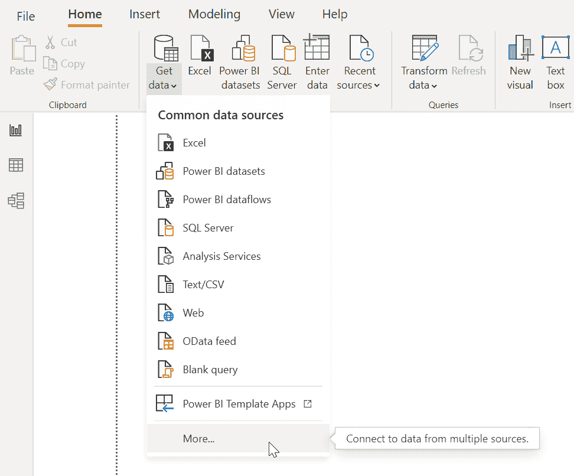

    图 1.1 – 浏览更多连接器以加载数据

1.  在弹出的新**获取数据**窗口中，只需在搜索文本框中输入字符串`script`，立即就会显示通过 Python 或 R 导入数据的两个选项：

    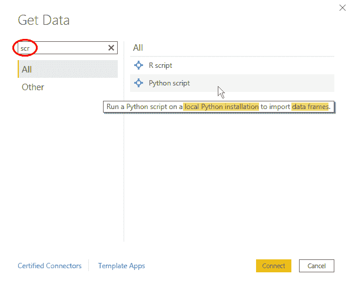

    图 1.2 – 显示 R 脚本和 Python 脚本到“获取数据”窗口

1.  阅读通过将鼠标悬停在**Python 脚本**选项上获得的工具提示内容，两个应该立即跳入你的眼帘：a)需要本地安装 Python。B)可以通过 Python 导入的是数据框。当选择**R 脚本**时，同样的两个观察结果也适用。唯一的区别是，当使用 Python 时，可以导入**pandas DataFrame**（DataFrame 是 pandas 包提供的数据结构），而 R 使用的是默认提供的类似二维数组的**R 数据框**数据结构。

1.  点击**Python 脚本**选项后，将显示一个包含用于编写 Python 代码的文本框的新窗口：

    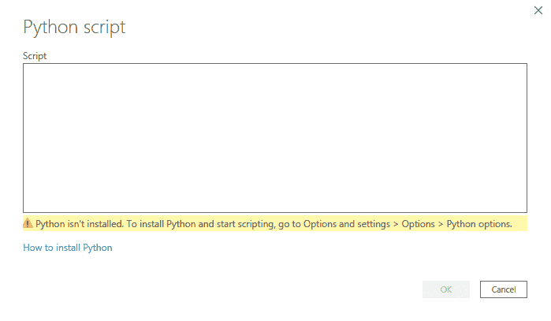

    图 1.3 – 显示 Python 脚本编辑器的窗口

    如你所见，这确实是一个非常简陋的编辑器，但在*第三章，使用 Power BI 配置 Python*中，你将看到如何使用你喜欢的 IDE 来开发你自己的脚本。

1.  查看警告信息，Power BI 提醒我们尚未检测到 Python 引擎，因此必须安装。点击**如何安装 Python**链接将打开一个 Microsoft Docs 网页，解释安装 Python 的步骤。Microsoft 建议安装基础 Python 发行版，但为了遵循一些关于**环境**的最佳实践，我们将安装**Miniconda**发行版。如何进行此操作以及原因将在第三章中介绍。

1.  如果你点击了**R 脚本**，则会弹出一个用于在 R 中输入代码的窗口，类似于*图 1.4*中所示：

    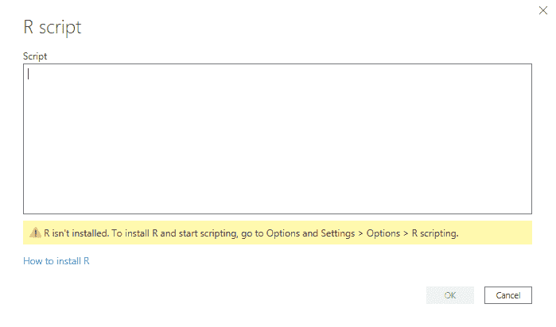

    图 1.4 – 显示 R 脚本编辑器的窗口

    与 Python 一样，为了在 R 中运行代码，你需要在你的机器上安装 R 引擎。点击**如何安装 R**链接将打开一个 Microsoft Docs 页面，其中 Microsoft 建议安装**Microsoft R Open**或经典的**CRAN R**。*第二章，使用 Power BI 配置 R*将向你展示如何选择引擎以及如何配置你喜欢的 IDE 以编写 R 代码。

为了使用 Python 或 R 导入数据，您需要在*图 1.3*和*图 1.4*中显示的编辑器中编写代码，将 pandas DataFrame 或 R 数据框分配给变量。您将在本书中看到具体的示例。

接下来，让我们看看如何转换数据。

### 数据转换

可以使用 R 或 Python 中的脚本对已导入或正在导入的数据应用转换。如果您想即时测试，可以直接从网络上导入以下 CSV 文件：[`bit.ly/iriscsv`](http://bit.ly/iriscsv)。请按照以下步骤操作：

1.  简单地点击**获取数据**，然后点击**网页**以直接从网页导入数据：

    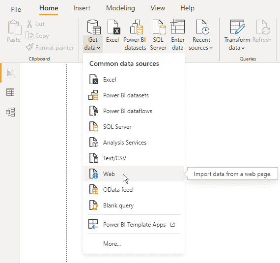

    图 1.5 – 选择 Web 连接器从网页导入数据

1.  您现在可以在弹出的窗口中输入之前提到的 URL：

    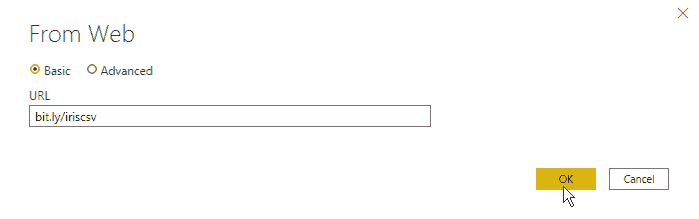

    图 1.6 – 从网络上导入 Iris 数据

    点击**确定**后，将弹出一个窗口，显示即将导入的数据预览。

1.  在这种情况下，不是直接导入数据，而是点击**转换数据**以访问 Power Query 数据转换窗口：

    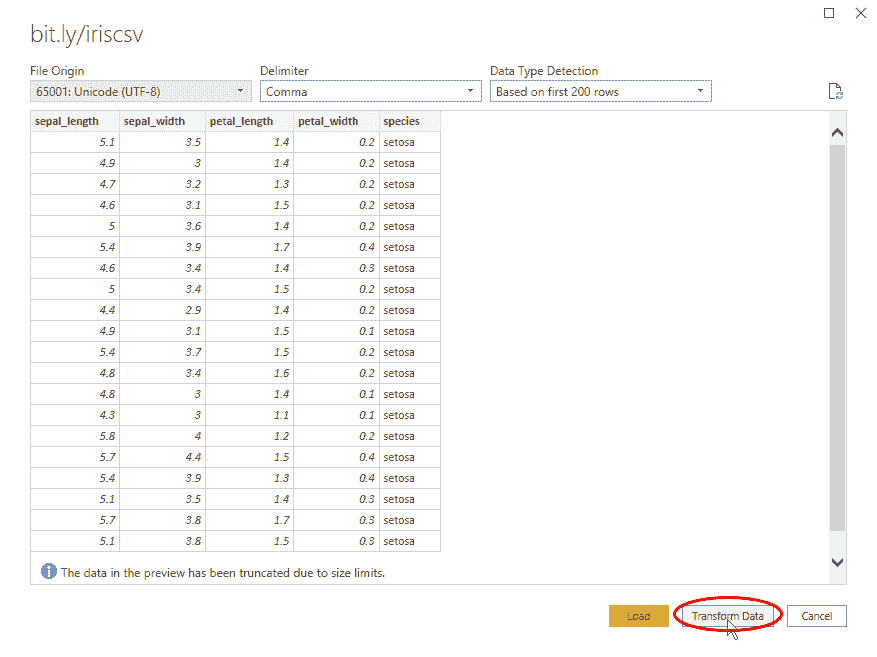

    图 1.7 – 导入数据预览

1.  在此阶段，您可以通过在**Power Query 编辑器**中选择**转换**选项卡来添加使用 Python 或 R 脚本的转换步骤：

    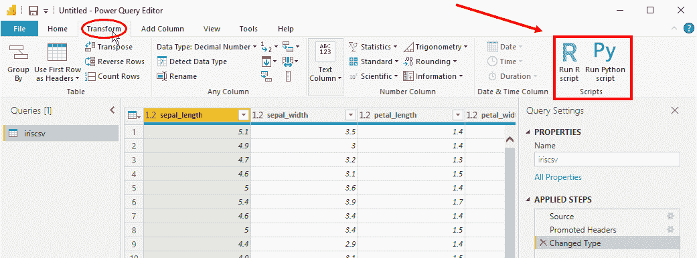

    图 1.8 – 将 R 和 Python 脚本工具集成到 Power Query 编辑器中

1.  通过点击**运行 Python 脚本**，将弹出一个与数据导入阶段中您已经看到的类似的窗口：

    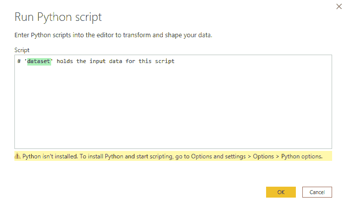

    图 1.9 – 运行 Python 脚本编辑器

    如果您仔细阅读文本框中的注释，您会看到`dataset`变量已经初始化，并包含 Power Query 编辑器中当前时刻存在的数据，包括已应用的所有转换。在此阶段，您可以在文本框中插入 Python 代码以将数据转换为所需的形式。

1.  如果您点击**运行 R 脚本**，将打开一个类似的窗口：

    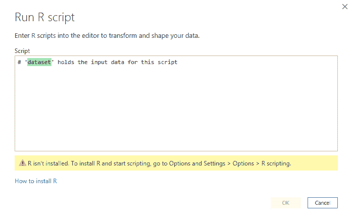

    图 1.10 – 运行 R 脚本编辑器

    此外，在这种情况下，`dataset`变量已经初始化，并包含 Power Query 编辑器中当前时刻存在的数据。然后您可以添加自己的 R 代码，并引用`dataset`变量以最合适的方式转换您的数据。

接下来，让我们看看如何可视化数据。

### 数据可视化

最后，您可以将自己的 Python 或 R 脚本添加到 Power BI 中，以创建新的可视化，而不仅仅是工具中已经存在的可视化：

1.  假设我们继续上一节开始的数据导入活动，一旦加载了 `Iris` 数据集，只需在**运行 R 脚本**窗口中点击**取消**，然后在 Power Query 编辑器的**主页**选项卡中点击**关闭并应用**：

    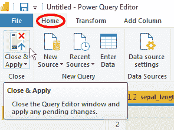

    图 1.11 – 点击关闭并应用以导入 Iris 数据

1.  数据导入完成后，您可以在 Power BI 的**可视化**窗格中选择**R 脚本可视化**或**Python 脚本可视化**选项：

    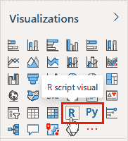

    图 1.12 – R 和 Python 脚本可视化

1.  如果您点击**Python 脚本可视化**，会弹出一个窗口请求允许启用脚本代码执行，因为可能存在安全或隐私风险：

    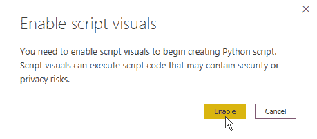

    图 1.13 – 启用脚本代码执行

1.  启用代码执行后，在 Power BI Desktop 中，您可以在报告画布上看到 Python 可视化图像的占位符，以及在底部有一个 Python 脚本编辑器：

    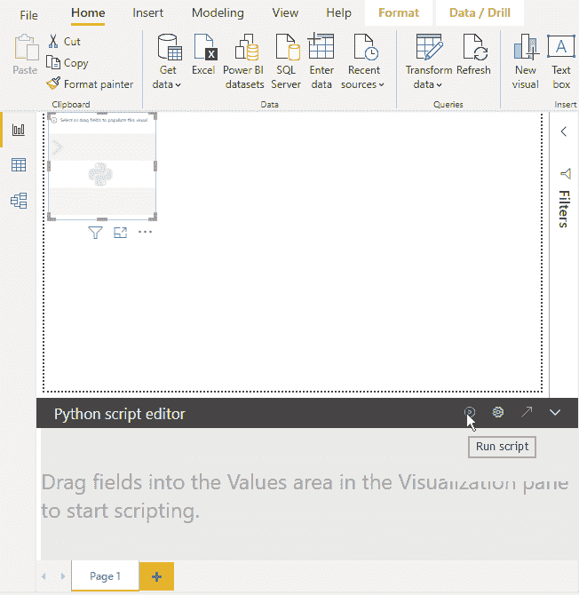

    图 1.14 – Python 可视化布局

    您现在可以在 Python 编辑器中编写自己的自定义代码，并通过**图 1.14**中突出显示的**运行脚本**图标运行它以生成 Python 可视化。

选择**R 脚本可视化**时，会出现几乎相同的布局。

## 使用 R 和 Python 与您的数据交互

在上一节中，您看到了所有通过 R 或 Python 脚本在 Power BI 中与您的数据交互的方式。除了知道如何以及在哪里将代码注入 Power BI 之外，了解您的代码将如何与数据交互也非常重要。在这里，我们看到通过 Power Query 编辑器注入的脚本和用于可视化的脚本之间存在很大的差异：

+   **通过 Power Query 编辑器的脚本**：此类脚本将转换数据并在模型中**持久化**转换。这意味着始终可以从 Power BI 中的任何对象检索转换后的数据。此外，一旦脚本执行并生效，*除非数据刷新，否则它们将不会重新执行*。因此，当您打算在其他可视化或数据模型中使用生成的洞察时，建议通过 Power Query 编辑器注入 R 或 Python 代码。

+   **可视化中的脚本**：R 和 Python 脚本可视化中使用的脚本从数据中提取特定的洞察，并通过**可视化**仅让用户明显看到。像报告页面上所有其他可视化一样，R 和 Python 脚本可视化也与其他可视化相互连接。这意味着脚本可视化会受到**交叉过滤**的影响，因此*每次您与报告中的其他可视化交互时，它们都会刷新*。尽管如此，无法在数据模型中持久化从可视化脚本中获得的结果。

> **提示**
> 
> 由于 R 和 Python 脚本可视化具有跨过滤器的交互性，因此可以注入用于从数据中提取 **实时洞察** 的代码，也可以从外部来源（你将在 *第八章*，*调用外部 API 丰富您的数据* 中看到）中提取。重要的是要记住，正如之前所述，那时只能可视化此类信息，或者最多将其写入外部存储库（你将在 *第七章*，*将 Power BI 数据记录到外部存储库* 中看到）。

在本章的最后部分，让我们看看使用 R 和 Python 在各种 Power BI 产品中的局限性。

## Power BI 产品上的 R 和 Python 局限性

一旦您清楚在 Power BI 中注入 R 和 Python 脚本的位置，第一个问题可能是：“*在所有 Power BI 产品中允许使用 R 和 Python 代码吗？*”为了简要回顾各种 Power BI 产品及其一般用途，以下是一个简明的列表：

+   **Power BI 服务**：有时被称为 **Power BI 在线**，它是 Power BI 的 **软件即服务**（SaaS）版本。它的创建是为了通过仪表板和报告促进用户之间可视化分析的共享。

+   **Power BI 报告服务器**：这是 Power BI 的本地版本，它扩展了 **SQL Server 报告服务**的功能，使得可以在 **Power BI 桌面版（用于报告服务器）** 中创建的报告之间共享。

+   **Power BI 嵌入式**：一个 Microsoft Azure 服务，允许将仪表板和报告嵌入到没有 Power BI 账户的用户的应用程序中。

+   **Power BI 桌面版**：一个免费的 Windows 桌面应用程序，允许您使用 Power BI 提供的几乎所有功能。这不是用户之间共享结果的正确工具，但它允许您在 Power BI 服务和 Power BI 报告服务器上共享它们。允许在两个提到的服务上发布桌面版本是不同的。

+   **Power BI 移动版**：一个可在 Windows、Android 和 iOS 上使用的移动应用程序，允许安全访问 Power BI 服务和 Power BI 报告服务器，并允许您浏览和共享仪表板和报告，但不能编辑它们。

除了许可证（我们在这里不讨论），以下是之前提到的产品之间关系的摘要图：

图 1.15 – Power BI 产品之间的交互

不幸的是，在这些产品中，只有 **Power BI 服务**、**Power BI 嵌入式** 和 **Power BI 桌面版** 允许您通过代码在 R 和 Python 中丰富数据：

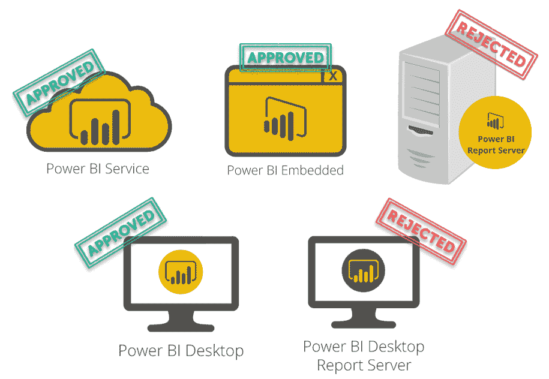

图 1.16 – Power BI 产品与 R 和 Python 的兼容性

> **重要提示**
> 
> 从现在开始，当我们谈论与分析语言兼容性的 *Power BI 服务* 时，我们所说的 *也将适用于 Power BI Embedded*。

因此，如果您需要通过 R 和 Python 进行高级分析来开发报告，请确保目标平台支持它们。

## 摘要

本章详细概述了您可以在 Power BI Desktop 中使用 R 和 Python 脚本的所有方法。在数据摄取和数据处理阶段，Power Query 编辑器允许您添加包含 R 或 Python 代码的步骤。您还可以利用 Power BI Desktop 提供的 R 和 Python 脚本可视化在数据可视化阶段使用这些分析语言。

了解 R 和 Python 代码如何与已加载或正在加载到 Power BI 中的数据进行交互也非常重要。如果您使用 Power Query 编辑器，无论是在加载数据还是转换数据时，脚本处理的结果都将持久保存在数据模型中。另外，如果您想再次运行相同的脚本，您必须刷新数据。另一方面，如果您使用 R 和 Python 脚本可视化，代码结果只能显示，并不会保存在数据模型中。在这种情况下，脚本执行会在报告中的其他可视化触发交叉筛选时发生。

很遗憾，在撰写本文时，您无法在其他任何 Power BI 产品中运行 R 和 Python 脚本。唯一提供运行分析脚本的是 Power BI Desktop 和 Power BI 服务。

在下一章中，我们将了解如何最佳配置 R 引擎和 RStudio 以与 Power BI Desktop 集成。
