# 第三章：2 配置 R 与 Power BI

Power BI Desktop 默认没有配备上一章中提到的分析语言引擎。因此，有必要安装这些引擎并正确配置 Power BI Desktop 以正确地与它们接口。还建议安装一个**集成开发环境**（**IDE**），让你能够以最舒适的方式工作。

我们将探讨如何启动这些引擎，并给你一些关于如何根据你的需求选择最合适的引擎的一般指南。之后，我们将探讨如何使这些引擎与 Power BI Desktop 和 Power BI 服务接口。

最后，我们将提供一些关于如何克服 Power BI 服务上 R 可视化严格限制的重要提示。

尤其是本章将详细讨论以下主题：

+   可用的 R 引擎

+   选择要安装的 R 引擎

+   安装 R 开发用的 IDE

+   配置 Power BI Desktop 以使用 R

+   配置 Power BI 服务以使用 R

+   R 可视化的限制

## 技术要求

本章要求你有一个工作的互联网连接，并且你的机器上已经安装了**Power BI Desktop**。它还要求你在本章的最后部分注册了 Power BI 服务（这里有一个教程：[`bit.ly/signup-powerbiservice`](http://bit.ly/signup-powerbiservice))。一个**Power BI 免费版**许可证就足够测试本书中的所有代码，因为你将仅在个人**工作区**中共享报告。

## 可用的 R 引擎

市面上有多个 R 发行版可供免费使用，你可以用于你的高级分析项目。在本节中，我们将探索每个的主要细节。

### CRAN R 发行版

当提到安装 R 引擎时，我们几乎总是想到由一群贡献者多年共同开发的开源软件环境**出类拔萃**，这个环境被称为**CRAN R**，也称为**base R**([`cran.r-project.org`](https://cran.r-project.org))。更确切地说，**综合 R 存档网络**（**CRAN**）是一个全球范围内的网络，包括网页服务器和 FTP 服务器，其目标是保存多个相同且最新的 R 源代码版本以及社区开发的整个 R 包生态系统，以及所有的 R 文档。

CRAN R 最大的优点之一是其非常活跃的开发者社区。他们对 CRAN 上新包创建的贡献是无价的。这就是为什么如果你认为你需要某个特定功能来处理你的数据，几乎可以肯定的是，它已经被 R 社区开发并作为免费可用的 R 包发布。

然而，并非每个人都了解 CRAN R 不是市场上唯一的 R 发行版。

### 微软 R Open 发行版和 MRAN

即使微软也通过发布适用于 Windows 和 Linux 的自己的开源 R“发行版”，在**通用公共许可证版本 2**的条款下对社区做出了贡献。从 2016 年开始，微软发布了其自己的 R 发行版，称为**Microsoft R Open**（**MRO**），有时简称为**Microsoft R**，它与 CRAN R 发布的版本相同，并且 100%兼容。

> **重要提示**
> 
> 如果你使用任何 CRAN 包编写的代码，并使用相同版本的 MRO 引擎运行，一切都会正常工作。

此外，只有少数由微软拥有的函数（包括**RevoUtils**和**RevoUtilsMath**）返回有关引擎安装（如路径和内存使用）以及**数学内核库**（**MKL**）可以运行的最大线程数的信息。

MRO 发布的优势在于它为 R 社区带来了重要的改进：

+   预装的多线程**Intel MKL**

+   **Microsoft R 应用程序网络**（**MRAN**，[`mran.microsoft.com`](https://mran.microsoft.com)）是 CRAN 仓库的高性能镜像，它提供了一个“时间机器”工具，让您能够获取选定时间的 CRAN 包快照

让我们详细看看它们是什么。

#### MRO 中的多线程

虽然 CRAN R 最初是作为单线程创建的，但它也有能力链接到多线程的**基本线性代数子程序**（**BLAS**）和**线性代数包**（**LAPACK**）库，但这些手动操作并不简单。

安装 MRO 的好处是，由于 MKL，引擎已经预先配置并针对英特尔处理器进行了优化，目的是并行执行数学计算。为了了解计算时间上的收益，请查看*图 2.1*（来源：[`bit.ly/msropen-bnchmrk`](http://bit.ly/msropen-bnchmrk)）中比较 R-3.4.1 和 MRO 3.4.1 的基准结果：

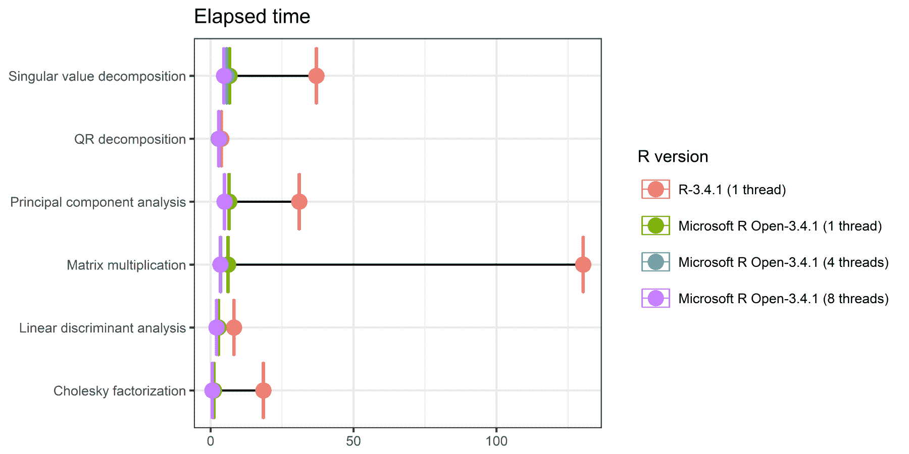

图 2.1 – 同一台机器上每个基准测试的总耗时

如您所见，CRAN R（未链接 BLAS 库直接安装）在矩阵计算中所需的时间显著高于 MRO。因此，如果您在数据科学、工程、金融分析等领域大量使用数学函数，强烈建议使用 MRO。

#### 使用检查点重现结果

当使用 R 进行复杂分析时，结果脚本很可能基于一个或多个 CRAN 软件包。R 中最常见的问题之一是结果的可重复性，因为 CRAN 上的软件包每天都在变化。因此，可能会发生这种情况：几周前运行良好的脚本在更新软件包后开始产生之前从未见过的错误，或者当您在另一台机器上运行它时。更隐蔽的是，由于软件包更新，可能会在不经意间得到错误的结果。

因此，从 2014 年 9 月开始，微软推出了自己的 CRAN R 软件包分发版，这些软件包按整个存储库的每日快照组织，由 **checkpoint 服务器** 在 UTC 午夜进行快照并持久化在 MRAN 上：

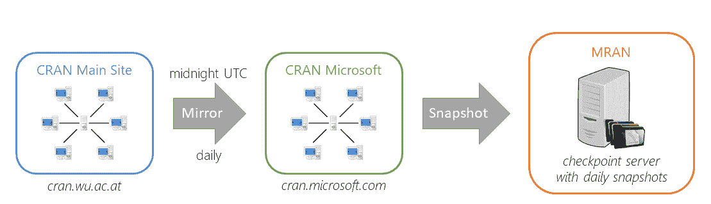

图 2.2 – 在 MRAN 中持久化 CRAN 每日快照的过程

从那时起，R 社区能够访问 CRAN 软件包的特定快照，其版本被冻结在特定日期。

> **重要提示**
> 
> 您不需要使用 MRO 来利用 checkpoint 服务器提供的免费服务。CRAN R 用户也可以使用它。

通常，当您在 R 中调用 `install.packages` 来安装一个或多个软件包时，会安装每个指定软件包的最新 CRAN 版本。使用 `checkpoint` 软件包，您有权引用过去某一天 CRAN 存储库的特定快照，如下所示：

```py
library(checkpoint)
checkpoint("YYYY-MM-DD") # Replace the data you want here
install.packages("dplyr")
```

使用前面的代码示例，您和任何其他用户都确保始终使用从您想要使用的 CRAN 存储库快照中下载的 `dplyr` 软件包的相同版本。

MRO 安装包括 `checkpoint` 软件包，并默认将快照日期设置为正在安装的 MRO 版本的发布日期。您可以通过 MRAN 门户上可用的 **CRAN 时间机器** 工具轻松验证由特定版本的 MRO 设置的快照日期（[`mran.microsoft.com/timemachine`](https://mran.microsoft.com/timemachine)）：

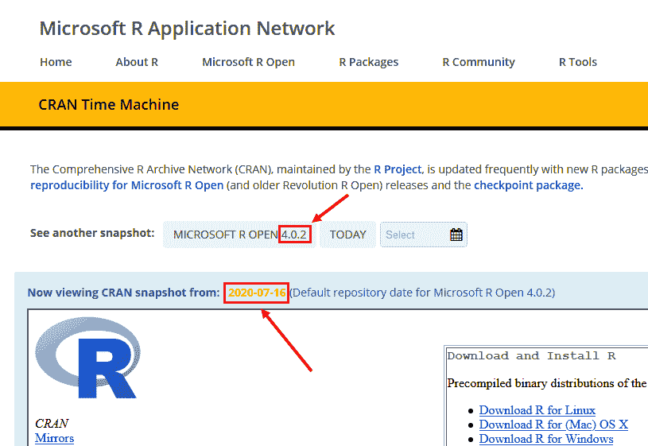

图 2.3 – 在 MRAN 中持久化 CRAN 每日快照的过程

您也可以按以下方式以编程方式检查默认软件包存储库：

```py
getOption("repos")
```

您将得到类似以下输出：

```py
 CRAN 
"https://mran.microsoft.com/snapshot/2020-07-16"
```

使用此示例代码，如果您安装任何 R 软件包，安装的版本将是 2020 年 7 月 16 日午夜在 CRAN 中存在的版本。

### 微软 R 客户端

微软还发布了一个名为**Microsoft R 客户端**的 R 版本，免费提供给 Windows 和 Linux 用户。这个版本完全基于 MRO，允许您运行在 CRAN R 上运行的任何代码。此外，还有一些微软的 R 函数库([`bit.ly/ml-r-funcions`](http://bit.ly/ml-r-funcions))没有开源。这些函数是多线程的，允许您即使与通常无法包含在机器内存中的数据集（使用微软的本地产品**SQL Server**和**Machine Learning Server**）一起工作。是的，没错：如果您不知道，微软的关系型数据库管理系统（**RDBMS**）SQL Server 允许您在其存储过程中使用 R、Python 和 Java 代码。因此，如果您的数据源是 SQL Server 本身，并且您需要从那里持久化的数据中提取洞察，请考虑直接使用 SQL Server 中的存储过程应用高级分析算法的可能性，将 R 和 Python 代码嵌入其中。

使用 Microsoft R 客户端，由于之前提到的性能良好的**MicrosoftML**和**RevoScale**包，可以将需要非平凡计算复杂性的算法委托给 SQL Server 或 Machine Learning Server。

与 MRO 不同，Microsoft R 客户端不是与每个 CRAN R 版本并行更新，而是遵循在 Machine Learning Server 发布时包含的 MRO 版本。例如，截至今天，CRAN R 是 4.0.2 版本，MRO 也是 4.0.2 版本，而 Microsoft R 客户端是 3.5.2 版本，这是由 Machine Learning Server 9.4 支持的版本。

在描述了最流行的 R 发行版的主要功能后，让我们继续选择要在您的机器上安装的引擎。

## 选择要安装的 R 引擎

安装 R 引擎时的第一个问题是，“我应该安装哪个版本？我是选择标准的 CRAN R，还是选择任何 Microsoft R 版本？”这类问题的通常答案是，“视情况而定！”在我们的情况下，目标是使用 Power BI 中的 R 引擎，因此我们需要了解哪些引擎被允许在它们内部使用 R 的不同产品所使用。

### Power BI 使用的 R 引擎

在*第一章*，*在哪里以及如何使用 Power BI 中的 R 和 Python 脚本*中，我们了解到只有两个 Power BI 产品允许使用 R 和 Python 脚本：Power BI 桌面版和 Power BI 服务（记住，当提到 Power BI 服务时，Power BI 嵌入式是隐含包含在内的）。因此，答案“视情况而定！”现在有了更明确的含义：如果您需要与组织内部的人共享报告，那么您必须安装与 Power BI 服务兼容的引擎；如果您需要为自己创建报告，甚至不需要在**我的工作区**上发布，您也可以安装适合 Power BI 桌面版的引擎。

这两个产品在分析引擎的使用上存在重大差异。**Power BI Desktop** 依赖于安装在运行 Power BI Desktop 的同一台机器上的 R 引擎。用户选择安装哪些引擎版本和哪些包。Power BI Desktop 确保通过其界面输入的任何 R 代码都直接在该引擎上运行。

**Power BI 服务** 是 Power BI 覆盖的 **软件即服务**（**SaaS**）产品之一。用户不需要承担其底层 IT 基础设施的维护工作，也不能随意决定在其上安装组件。

> **重要注意事项**
> 
> Power BI 服务用于 **R 可视化** 的 R 引擎和包是预先安装在云上的，因此用户必须适应服务采用的版本。

确切了解 Power BI 服务中 R 可视化使用的 R 发行版也很重要。

> **重要注意事项**
> 
> 到目前为止，Power BI 服务在实现 R 可视化时依赖于 **MRO 3.4.4** 运行时。每次发布时，都要密切关注 R 引擎和 Power BI 服务提供的包的版本，以确保要发布的报告能够正常工作。更多信息请见以下链接：[`bit.ly/powerbi-r-limits`](http://bit.ly/powerbi-r-limits)。

如果您必须使用 R 脚本进行数据摄取或数据转换，并且需要刷新您的数据，Power BI 服务在这种情况下不会使用相同的引擎用于 R 可视化。

> **重要注意事项**
> 
> 在数据刷新阶段，Power BI 服务用于 *Power Query 中的 R 脚本* 的 R 引擎必须在服务之外您选择的任何机器上安装，并且在该同一台机器上您必须安装 **本地数据网关** 的 **个人模式**。请注意，即使要刷新的数据不通过网关流动，而是来自网关本身未引用的数据源，您也必须使用外部引擎。

只要要通过数据网关引用的 R 引擎只有一个，那么它们都安装在同一台机器上就足够了。否则，以下注意事项适用。

> **重要注意事项**
> 
> 如果您需要在机器上安装的多个 R 引擎中为 Power Query 转换使用，您还必须安装 **Power BI Desktop**。它允许您通过其选项切换数据网关的路由到所选引擎，更新配置文件 `C:\Users\<your-username>\AppData\Local\PowerBIScripting\RSettings.xml`。此文件允许覆盖数据网关默认引用的 R 引擎。

如果您需要了解更多关于本地数据网关（**企业**和**个人**模式）的信息，我们建议阅读以下链接的 Microsoft Docs 页面：[`bit.ly/onprem-data-gateway`](http://bit.ly/onprem-data-gateway)。

总结来说，考虑到前面的场景，如果你需要在桌面上进行个人使用的报告，你对使用的 R 引擎没有任何限制，因此你可以安装最适合你的 R 版本和包。然而，如果你事先知道你将要创建的报告包含 R 可视化，并且打算在 Power BI 服务中与同事共享，那么对版本和预安装在服务中的包都有严格的限制。

现在让我们继续进行引擎的安装。

### 安装建议的 R 引擎

长期来看，管理为 Power BI 服务开发的报告中注入的 R 脚本的依赖项可能很复杂。考虑到可以在同一台机器上安装多个 R 引擎，我们建议以下技巧。

> **提示**
> 
> 我们建议你 *专门为 Power BI 报告运行 R 引擎的机器*。我们的建议是为 Power Query 中开发 R 脚本或在 R 可视化中可能出现的每个可能的需求安装一个 R 引擎。

#### 数据转换的 R 引擎

你已经看到，在 Power Query 中用于更改数据模型的 R 脚本必须通过个人模式中的本地数据网关使用外部 R 引擎，即使你使用 Power BI 服务。

> **提示**
> 
> 我们建议安装 CRAN R 或 MRO 的最新可用版本。鉴于相同的版本在代码操作方面可以互换，我们认为安装 *MRO* 可以从 MKL 库的性能优势中受益。

安装 MRO 非常简单：

1.  前往 [`mran.microsoft.com/download`](https://mran.microsoft.com/download)。

1.  点击对应你操作系统的 **Download** 按钮。在我的情况下，这是 Windows：

    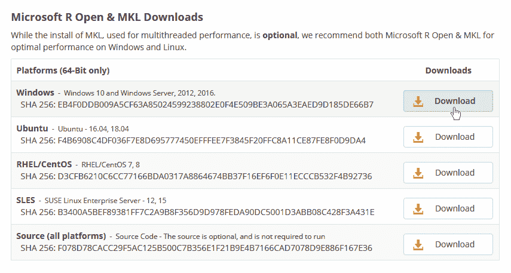

    图 2.4 – Windows 下载 MRO

1.  下载完 `microsoft-r-open-x.x.x.exe` 文件（其中 `x.x.x` 对应实际选择的版本）后，双击它，然后在弹出的 **Let’s get started** 窗口中点击 **Continue**。

1.  下一个屏幕，**配置安装**，要求你确认或更改安装路径，以及选择一些安装选项：

    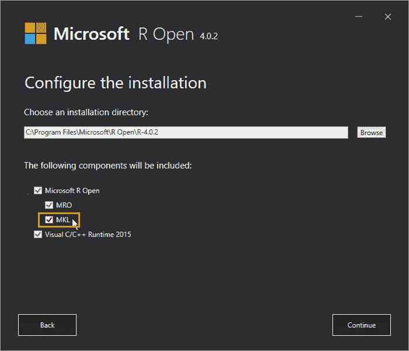

    图 2.5 – MRO 安装选项

    唯一的可选选择是安装 **MKL**。由于你现在已经非常清楚的原因，我们建议安装它。然后点击 **Continue**。

1.  在下一个窗口中，你可以阅读安装 MRO 的 Microsoft 许可协议。勾选 **I acknowledge the above licensing information** 后，点击 **Continue**。

1.  类似地，在下一个窗口中，你可以阅读 MKL 的许可协议。勾选 **I accept these terms** 后，点击 **Continue**。

1.  现在出现一个摘要窗口，要求你点击 **Install** 以开始安装 MRO。

1.  安装结束时，一个 **完成** 窗口将通知您安装已成功完成。

就这样！您现在就可以在 MRO 上编写和运行您的 R 代码了。

> **重要提示**
> 
> 通常，您在 Power BI Desktop 上开发报告的安装位置与选定的 Power BI 服务 R 引擎机器分开，数据网关也经常安装在该机器上。在这种情况下，您还必须在安装 Power BI Desktop 实例的机器上安装 R 引擎。

如果您愿意，您现在就可以在 MRO 默认安装的非常基础的 GUI 上编写代码：

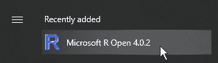

图 2.6 – MRO 安装的 rGUI

我们将在本章后面看到如何安装所有 R 开发者都偏好的 IDE：**RStudio**。

#### Power BI 服务上 R 可视化的 R 引擎

如前所述，在 Power BI 服务上发布的 R 可视化脚本在云中预安装的 R 引擎上运行，其版本可能会根据 Power BI 服务的最新发布而更改。如果您需要与同事分享包含 R 可视化的报告，您需要确保您的 R 代码在预安装的引擎上正确运行。

> **提示**
> 
> 我们强烈建议您在自己的机器上也安装与 Power BI 服务用于 R 可视化的相同版本的 MRO。

为了安装 Power BI 服务提供的相同版本的 MRO，过程非常简单：

1.  访问 [`bit.ly/powerbi-r-limits`](http://bit.ly/powerbi-r-limits) 并检查 Power BI 服务使用的实际 MRO 版本：

    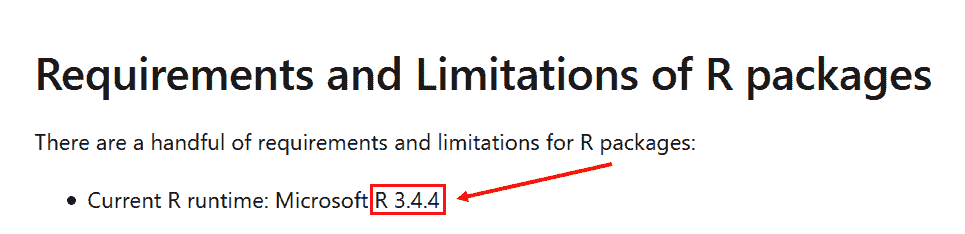

    图 2.7 – Power BI 服务使用的实际 MRO 版本

1.  然后转到 [`mran.microsoft.com/release-history`](https://mran.microsoft.com/release-history) 并检查与步骤 1 中看到的相同版本的 MRO（在我们的案例中，**3.4.4**）：

    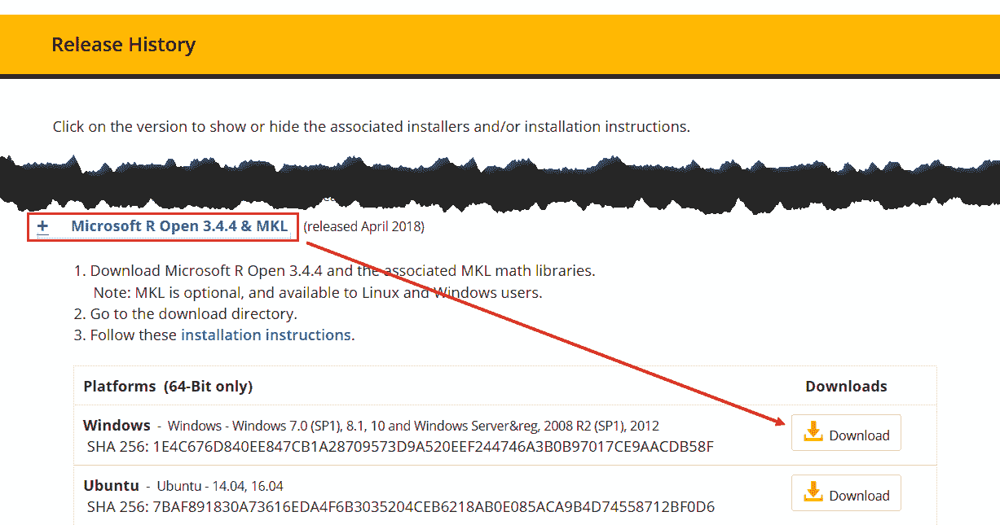

    图 2.8 – 下载选定的 MRO 版本

1.  下载可执行文件后，只需遵循上一节中概述的步骤来安装此特定版本的 MRO 引擎。

#### 当 Power BI 服务升级 R 引擎时应该做什么

可能的情况是，您已经在某个日期安装了一个特定版本的 MRO，以与 Power BI 服务上的 R 可视化引擎保持一致，之后微软更新了 Power BI 服务，同时也升级了预安装的 R 引擎。这种情况会导致两个独立的事件：

+   R 引擎比其前身更新，可能包含可能导致先前开发的报告不可用的破坏性更改。这种情况非常罕见，因为通常通过引入“已弃用”函数或参数来缓解这些更改，从而确保向后兼容性。

+   在上一个 R 引擎发布日期安装的大多数包都将更新到较新版本，对应于新版本 R 引擎的发布日期。将包更新到新版本是因脚本与包的旧版本不兼容而导致错误的最常见原因之一。

在这种情况下，您应验证所有包含 R 可视化并发布到 Power BI 服务的报告也能与对服务进行的更新兼容。

> **提示**
> 
> 考虑到前面的观察结果，以及预安装的 Power BI 服务 R 引擎很少更新的事实，最好直接在您的机器上安装新的 MRO 版本，并测试您的报告，确保 Power BI Desktop 引用了新版本的引擎。您需要修复那些 R 可视化中存在的任何代码问题，之后您可以将这些报告重新发布到 Power BI 服务。

一旦您确认所有前面的报告都运行正常，您就可以决定是否要卸载 MRO 的旧版本以释放磁盘空间并避免在处理这些特定报告时产生混淆。

到此为止，我们可以继续安装一个比 MRO 默认安装的 rGUI 功能更丰富的 IDE。

## 安装 R 开发 IDE

在 Power BI 中开发代码需要安装最先进的 IDE，这源于需要所有必要的工具来识别任何错误，并快速测试代码片段的结果。

> **提示**
> 
> 强烈建议在 IDE 中测试您的 R 代码并验证结果，然后再在 Power BI 中使用它。

市场上有很多用于 R 开发的 IDE。一些例子是 **R-Brain IDE**（**RIDE**）、**IntelliJ IDEA** 和 **Jupyter Lab**，但据估计，超过 90% 的 R 程序员使用 **RStudio** 作为他们的主要 IDE。这就是为什么我们建议您也使用这个 IDE 来测试本书中会遇到的所有代码。

### 安装 RStudio

在您的机器上安装 RStudio 非常简单：

1.  前往 [`rstudio.com/products/rstudio/download/`](https://rstudio.com/products/rstudio/download/) 并在 **RStudio Desktop** 列表下点击 **下载**。

    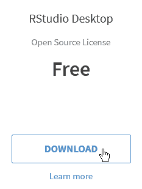

    图 2.9 – 前往 RStudio 下载页面

1.  然后点击 **下载 RStudio for Windows** 按钮：

    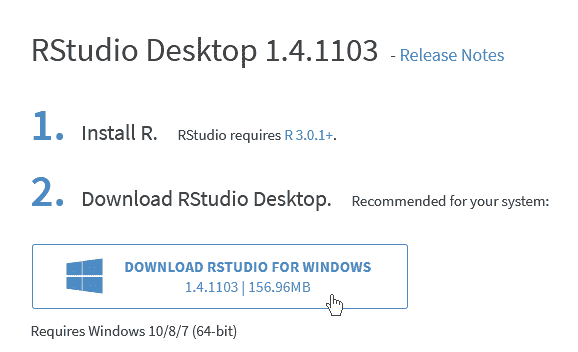

    图 2.10 – 下载 RStudio for Windows

1.  下载成功完成后，双击可执行文件，并在 RStudio 安装欢迎窗口中点击 **下一步** 按钮。

1.  在下一个窗口中，您会被要求选择安装 RStudio 的文件夹。保留默认设置并点击 **下一步**。

1.  以下窗口会要求您选择创建快捷方式的开始菜单文件夹。保留默认设置并点击 **安装**。

1.  安装完成后，点击**完成**。

为了确保一切安装顺利，请检查你是否有从 RStudio 选项中选择两个新安装的 R 引擎之一的选项：

1.  从**开始**菜单打开新安装的 RStudio：

    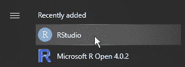

    图 2.11 – 从开始菜单运行 RStudio

1.  一旦打开，你可能会被问及是否希望匿名发送任何崩溃报告给 RStudio 以改进产品。根据你的选择选择**是**或**否**。

1.  如你所见，RStudio 已经默认选择了一个 R 引擎。在我们的例子中，它是我们机器上安装的最新版本。此外，请注意 MKL 已经启动：

    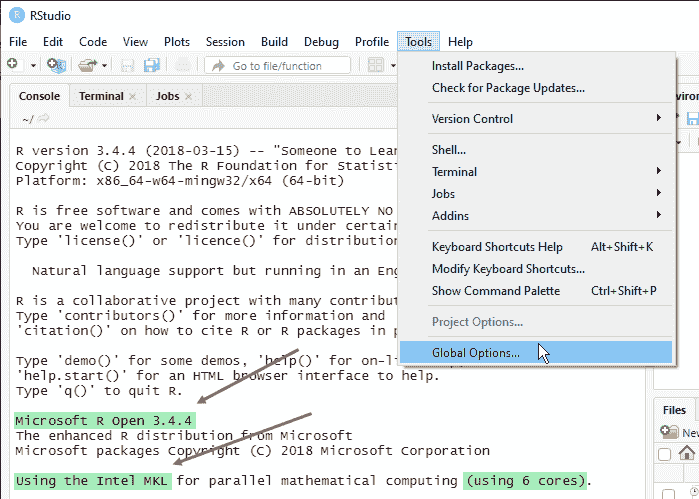

    图 2.12 – RStudio 和全局选项中默认选择的 R 引擎

    现在，点击**工具**菜单，然后点击**全局选项…**以查看可用的引擎。

1.  在**选项**窗口的**常规**菜单中，你可以通过点击**更改...**然后选择一个可用的引擎来选择你想要在 RStudio 中使用的引擎：

    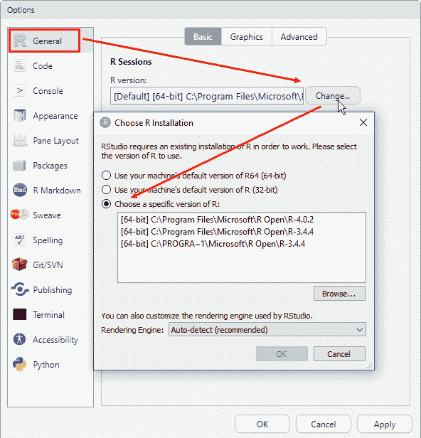

    图 2.13 – 选择您首选的 R 引擎与 RStudio 一起使用

    通常，我们不会建议将包含“`“C:\PROGRA~1\...”`”的引擎视为路径的根。它只是当前在 RStudio 中选择的引擎。只需从列表中选择其他引擎之一。

1.  现在，选择最新的 R 版本（在我们的例子中，是 4.0.2），然后在**选择 R 安装**窗口中点击**确定**。你将收到通知，表示你需要重启 RStudio 以使所选更改生效。

1.  在**更改 R 版本**窗口中点击**确定**，然后在**选项**窗口中点击**确定**。有时你将有机会通过在随后显示的对话框中选择**是**来重启。如果没有，只需从 RStudio 中退出并重新打开即可。

干得好！现在你已经准备好在 Power BI Desktop 中正确配置 R 引擎，并设置你需要发布到 Power BI 服务的相关内容。

## 配置 Power BI Desktop 以与 R 一起工作

一旦你安装了用于报告开发和 RStudio IDE 的必要 R 引擎，你必须配置 Power BI Desktop 以正确引用这些工具。这实际上是一个非常简单的任务：

1.  在 Power BI Desktop 中，转到**文件**菜单，点击**选项和设置**选项卡，然后点击**选项**：

    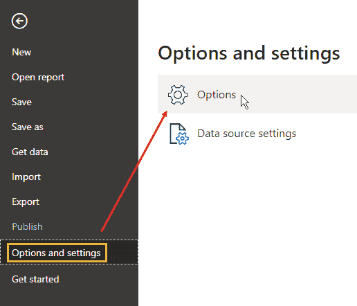

    图 2.14 – 打开 Power BI Desktop 选项和设置窗口

1.  在**选项**窗口中，点击左侧的**R 脚本**选项卡。右侧面板的内容将更新，为你提供选择要引用的 R 引擎和使用于 R 可视化的 R IDE 的选项：

    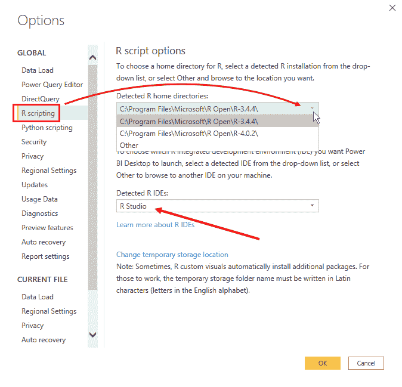

    图 2.15 – 在 Power BI Desktop 中选择要使用的引擎和 IDE

1.  如您所见，Power BI Desktop 自动识别已安装的 R 引擎和 IDE。目前，请选择引擎的最新版本（在我们的例子中是 4.0.2），以确保与 RStudio 中已选择的版本保持一致。

当我们在 *第十二章，数据探索分析* 中介绍 R 和 Python 脚本可视化时，您将了解如何从 Power BI Desktop 与 IDE 交互。

## 配置 Power BI 服务以使用 R

如您在本章的 *Power BI 使用的 R 引擎* 部分所学，Power BI 服务根据脚本是在 R 可视化中还是 Power Query 数据转换中使用，使用不同的 R 引擎。在前一种情况下，引擎在云上预先安装；在后一种情况下，您需要在任何您选择的机器上以个人模式安装 **本地数据网关**，以便 Power BI 服务与您在该机器上安装的 R 引擎通信。

### 以个人模式安装本地数据网关

我们强调您需要以个人模式安装数据网关，这是出于一个重要原因：在 *企业模式* 下，*企业数据网关* 不支持 R 脚本。

在您的情况下，您将在已安装 R 引擎和 Power BI Desktop 的同一台笔记本电脑上安装数据网关。执行此操作的步骤如下：

1.  确保您能登录到 Power BI 服务 ([`app.powerbi.com`](https://app.powerbi.com))。您将看到如下主页，带有您公司的标志：

    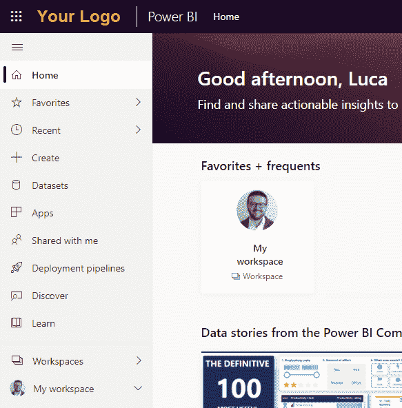

    图 2.16 – Power BI 服务主页

1.  在主页右上角，您会注意到一个向下指的箭头，允许您访问下载菜单。点击此箭头，然后选择 **数据网关**：

    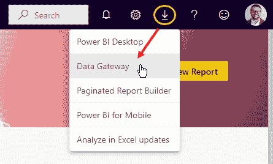

    图 2.17 – Power BI 服务主页上的下载菜单

1.  您将被重定向到一个网页，您可以从该网页下载数据网关。请确保下载 **个人模式** 版本：

    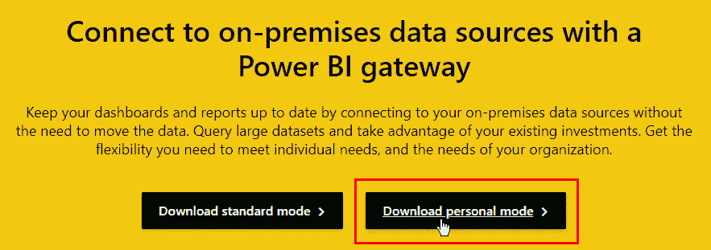

    图 2.18：下载数据网关的个人模式版本

1.  立即运行新下载的可执行文件将打开一个初始窗口，要求您检查链接中给出的最小安装要求，设置软件的安装文件夹，并接受软件的使用条款：

    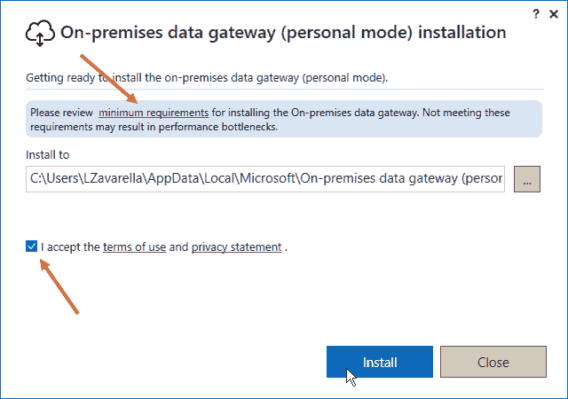

    图 2.19 – 数据网关安装窗口

    您可以选择默认文件夹，点击使用条款接受复选框，然后点击 **安装** 以继续。

1.  数据网关安装完成后，将打开一个登录窗口，您需要输入您在 Power BI 服务上注册时使用的电子邮件地址，然后输入您的密码：

    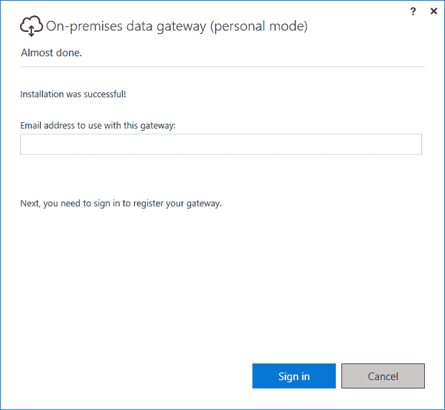

    图 2.20 – 数据网关登录窗口

1.  当登录操作成功时，会出现一个绿色的勾选标记，并显示文字**网关已上线并准备好使用**：

    

    图 2.21 – 数据网关运行中

1.  您可以关闭本地数据网关窗口。

在此时刻，Power BI 服务直接连接到您的机器，并在需要刷新与您新安装的数据网关关联的已发布数据集时可以访问它。

> **重要提示**
> 
> 请记住，Power BI 用户**只能关联一个**数据网关。如果您尝试在多台不同的机器上以个人模式安装多个本地数据网关，登录其中一台将强制断开所有其他数据网关的连接。

### 在 Power BI 服务中共享使用 R 脚本的报表

在前面的章节中，您了解到，由于在个人模式下新安装的数据网关，您当然可以将使用 R 脚本的报表发布到您的个人工作区。但是，假设您拥有 Pro 许可证，您是否也可以将此报表发布到共享工作区？对此经常存在很多混淆。

> **重要提示**
> 
> 没有人禁止您在共享工作区发布您的报表！尽管您已在个人模式下使用数据网关，但其他用户可以查看您的报表。不仅如此！其他用户还可以刷新报表背后的数据集。他们将代表您这样做，指向由您的数据网关引用的机器。重要的是您的机器是开启的！

那么，如果您仍然可以使用个人模式下的数据网关与他人共享报表，使用企业模式下的数据网关的优势是什么？

使用**单个**数据网关在企业模式下，您的组织中的**多个用户**可以访问他们已经具有访问权限的本地数据。不言而喻，其他用户可以查看和刷新您的报表，但他们不能通过使用 R 引擎通过您的个人数据网关引用您的机器来开发他们自己的报表。这是真正的限制。

鉴于上述情况，公司中经常使用一种**非官方架构**，允许**所有使用 R 代码在 Power Query 中**的报表引用已使用个人数据网关安装 R 引擎的**单个机器**。

> **提示**
> 
> 这种非官方架构利用了一个与物理人员无关的个人数据网关，而是与一个 *虚构的“服务”用户* 相关。该用户的凭据在所有使用 R 代码将数据转换为报告的分析员之间共享。此外，由于数据网关引用的 R 引擎的机器是共享的，它必须在计划活动期间保持开启状态。因此，在这个架构中，经常使用一个同时运行 R 引擎和数据网关的 Azure Windows 虚拟机。

由于“一图胜千言”，*图 2.22* 总结了此架构：

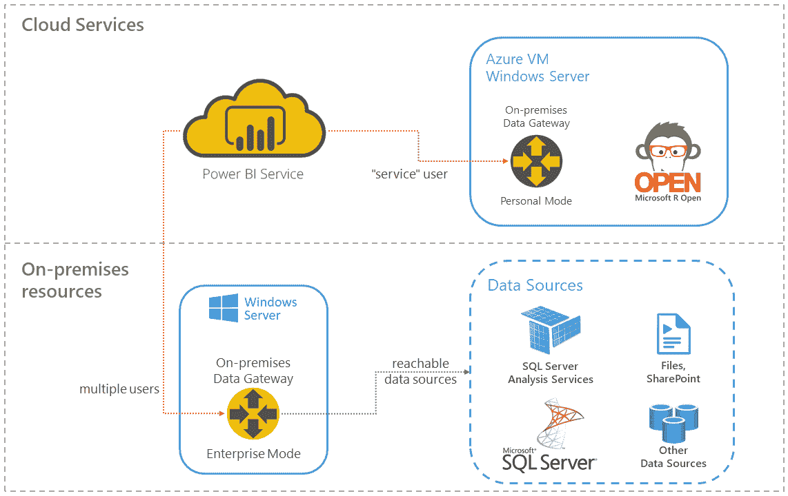

图 2.22 – 使用 R 进行数据转换的企业架构

多亏了这个架构，才使得一组分析师能够在他们的报告中使用 R 脚本，尽管个人模式下的本地数据网关施加了限制。

话虽如此，除了 Power Query 中 R 脚本的局限性之外，还有一些重要的局限性需要注意。

## R 可视化局限性

R 可视化在处理数据方面有一些重要的局限性，无论是作为输入还是输出：

+   R 可视化可以处理一个 *只有 150,000 行的 dataframe*。如果有超过 150,000 行，则只使用前 150,000 行，并在图像上显示相关消息。

+   R 可视化的 *输出大小限制为 2MB*。

您还必须小心不要超过 R 可视化的 *5 分钟运行时计算*，以避免超时错误。此外，为了避免性能问题，请注意 *R 可视化图表的分辨率固定为 72 DPI*。

如您所想象，R 可视化的局限性取决于您是在 Power BI Desktop 还是 Power BI 服务上运行该可视化。

要在 *Power BI Desktop* 中创建报告，您可以执行以下任何一项操作：

+   在您的引擎中为 R 可视化安装任何类型的软件包（CRAN、GitHub 或自定义）。

+   在您的引擎中仅安装 CRAN 软件包以用于自定义 R 可视化（您将在 *第十四章，R 中的交互式自定义可视化* 中看到一个示例）。

+   从 R 可视化和自定义 R 可视化访问互联网。

在 *Power BI 服务* 中创建报告时，请注意以下事项：

+   对于 R 可视化和自定义 R 可视化，您可以使用 *此链接中列出的 CRAN 软件包*：[`bit.ly/powerbi-r-limits`](https://bit.ly/powerbi-r-limits)。

+   您无法从 R 可视化或自定义 R 可视化访问互联网。

如您可能已经注意到的，尽管在 Power BI 服务上可用于 R 可视化的 CRAN 软件包有限，但您仍然可以数出列表中的 900 多个软件包！除了 R 是第一个被引入 Power BI 的分析语言之外，这还表明 R 实际上被认为是创建引人入胜的可视化中最灵活和最专业的语言之一。

如你所知，一旦你的报告在 Power BI 服务上发布，你可以决定通过“发布到网页”选项将其分享到你的博客、你的网站或社交媒体上。R 可视化不允许发布到网页。

> **重要提示**
> 
> 自定义 R 可视化克服了发布到网页的限制。

因此，如果你必须将报告发布到网页上，并且该报告包含使用 R 代码创建的可视化，你必须开发一个自定义 R 可视化。

## 摘要

在本章中，你学习了社区中最受欢迎的免费 R 引擎。特别是，你了解了微软将其 R 分发版推向市场所引入的优势。

注意到 Power BI Desktop 和 Power BI 服务的独特功能，你已经学会了如何正确选择引擎以及如何安装它们。

你还了解到了 R 社区中最受欢迎的集成开发环境（IDE）以及如何安装它。

此外，你还了解了在开发或企业环境中，如何使用 R 正确配置 Power BI Desktop 和 Power BI 服务的最佳实践。

最后，你了解了一些使用 R 与 Power BI 相关的限制，这些知识对于避免在开发和部署报告时犯错误至关重要。

在下一章中，我们将看到在 Power BI 中需要安装和配置哪些 Python 引擎和 IDE，以便在舒适的环境中开发和测试 Python 脚本。
