# 4 导入未处理的数据对象

在本章中，您将探讨在报告创建通常的第一阶段使用 R 和 Python：**数据摄取**。从这一角度看，Power BI 是一个非常强大的工具，因为它自带了许多连接到各种数据源的工具。除了能够通过连接数据源直接导入数据外，您还可以使用 Power BI 轻松解决更复杂的数据加载场景。例如，您可以直接从 Power BI 中动态合并多个 CSV 文件或多个 Excel 工作簿的多个工作表，甚至可以使用**M 语言**在合并步骤中应用特殊逻辑。您还可以通过仅点击网页内容而不使用任何代码来抓取任何网页。所有这一切都归功于 Power BI 的标准功能，无需使用 R 或 Python。

然而，有些情况下，要导入并用于 Power BI 中的数据来自**外部系统上进行的处理**，这些系统以 Power BI 无法直接管理的数据格式持久化数据。想象一下，您是一名 Power BI 报告开发者，需要与一组数据科学家进行接口。他们可能对相当大的数据集进行的某些复杂处理可能需要非平凡的运行时间。这就是为什么数据科学家经常将此类处理的**结果序列化**到可接受大小的文件中，以便在需要时可以非常快速地进行反序列化。现在假设数据科学家团队向您提供了一个用 R 或 Python 序列化的这些文件之一，并要求您使用它来完成报告创建中所需的某些计算。您将如何做？

在本章中，您将了解如何在 Power BI 中处理来自 R（`.rds`）和 Python（`.pkl`）的序列化文件。本章将讨论以下主题：

+   在 R 中导入 RDS 文件

+   在 Python 中导入 PKL 文件

## 技术要求

本章要求您在计算机上已经安装了可用的互联网连接和**Power BI Desktop**。您必须已按照*第二章，配置 Power BI 中的 R*和*第三章，配置 Power BI 中的 Python*中概述的方式正确配置了 R 和 Python 引擎以及 IDE。

## 在 R 中导入 RDS 文件

在本节中，您将主要开发 R 代码，在各个示例中，我们将为您概述我们将要做什么。如果您对 R 的经验不多，您应该通过以下快速入门来熟悉 R 提供的数据结构：[`bit.ly/r-data-struct-quickstart`](http://bit.ly/r-data-struct-quickstart)。查看*参考*部分以获取更深入的信息。

### Tidyverse 简介

使用 R 作为数据分析语言和数据科学分析的数据科学家必须了解名为 **Tidyverse** 的软件包集合（[`www.tidyverse.org`](https://www.tidyverse.org)）。它提供了数据整理和可视化的所有必需工具，为分析师提供了一个对其提供的整个软件包生态系统的统一方法。这样，它试图解决由未达成共同框架的开发者开发的软件包提供的 R 功能的“混乱”初始情况。

> **注意**
> 
> 如果你刚开始使用 R，你可能想从 Software Carpentry 的这个快速入门开始，熟悉主要概念：[`bit.ly/tidy-quickstart`](http://bit.ly/tidy-quickstart)。*参考文献*部分还包含有关 Tidyverse 的深入信息的链接。

在 Tidyverse 中，要能够处理表格数据，需要了解的基本数据类型是 **tibble**。Tibbles（新西兰人发音“tables”的方式）是 R 的 **dataframes** 的现代版本。从 tibble 开始，你可以使用 Tidyverse 包提供的简单函数执行所有想要的数据转换。

现在，你经常会在 Tidyverse 世界中进行的数据分析中看到 **%>% 管道**（R 语言允许用 `%` 包裹的符号定义为函数，`>` 表示链式操作）的使用。这个管道是从 Tidyverse 包中包含的 **magrittr** 包借用的，它具有将左侧对象作为右侧函数的第一个参数传递的功能。简而言之，如果你需要从 `my_tbl` tibble 中选择 `my_col` 列，而不是使用 `select(my_tbl, my_col)`，你可以使用管道形式 `my_tbl %>% select(my_col)`，使代码更易于阅读。

> **重要提示**
> 
> 目前，R Core 正在计划引入一个新的管道图形形式，即 `|>`。所以，当它们使其可用时，请准备好使用它。

为了简要理解本节中使用的代码，我们将逐块描述它，解释每个 R 对象的功能。

### 创建序列化的 R 对象

现在想象一下，你是一名数据科学家团队的一员，需要处理数据集的复杂处理，然后将获得的结果序列化到文件中以便按需重用。首先要做的事情是配置环境以安装 Tidyverse 的最新版本。

#### 配置环境和安装 Tidyverse

打开 RStudio，按照以下步骤操作：

1.  确保选择了最新的 R 引擎（在我们的例子中是 4.0.2），通过 **工具** 和 **全局选项…** 进行选择。

1.  通过点击右上角的 **项目** 图标，然后选择 **新建项目...** 来创建一个新的项目：

    

    图 4.1 – 创建一个新的 RStudio 项目

    RStudio 项目使得将你的工作分成多个上下文变得简单，每个上下文都有自己的工作目录、工作空间、历史记录和源文档。

1.  点击**新建目录**然后点击**新建项目**。

1.  现在为项目文件夹输入一个名称，选择你想要放置它的文件夹，然后点击**创建项目**：

    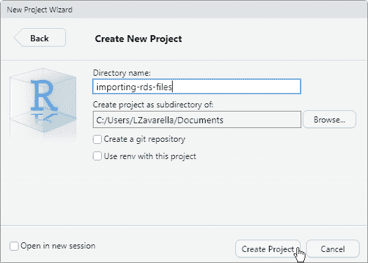

    图 4.2 – 创建新的项目文件夹

    你也可以在这里找到为你准备好的项目在 GitHub 仓库中：`Chapter04\importing-rds-files\importing-rds-files.Rproj`。RStudio 将重新启动 R 会话，你刚刚创建的项目文件夹将成为你的项目工作目录。

1.  如果你还记得，在*第三章，配置 Power BI 中的 Python*中，你已经禁用了使用较早日期创建的快照来下载包的 MRO 限制。这是为了安装包的最新版本。问题是，该操作的效果是临时的。为了看到这一点，现在在控制台中运行`getOption("repos")`命令。你会看到默认仓库仍然是 MRO 设置的快照。

1.  为了在项目级别永久覆盖仓库，你必须将之前使用的相同代码写入项目文件夹中的`.Rprofile`文件。为此，前往控制台并输入`file.edit(".Rprofile")`。如果不存在，这将创建项目文件夹中的`.Rprofile`文件，并在 RStudio 的编辑器窗口中打开它。此时，输入以下代码：

    ```py
    local({r <- getOption("repos")
      r["CRAN"] <- "https://cloud.r-project.org/"
      options(repos = r)
    })
    message("Default repo replaced with 'https://cloud.r-project.org/'")
    ```

    现在通过按*Ctrl + S*（或**文件** | **保存**）保存`.Rprofile`文件，然后通过点击右上角的**项目**图标（一个包含“R”的立方体）关闭项目，然后点击**关闭项目**：

    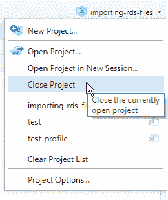

    图 4.3 – 关闭当前的 RStudio 项目

1.  重新打开你刚刚关闭的项目（你可以在右上角常规项目菜单中的列表中找到它，或者你可以在项目文件夹中找到`.Rproj`文件）。你会在控制台中注意到消息："默认仓库已替换为'https://cloud.r-project.org/'"。

1.  再次在控制台中输入`getOption("repos")`命令并按*Enter*。现在你会看到新的 CRAN 仓库作为默认仓库：

    

    图 4.4 – 将新的 CRAN 仓库设置为默认

1.  现在，只需在控制台中运行以下命令即可安装所有 Tidyverse 包：`install.packages("tidyverse")`（它相当于通过 GUI 点击右下角的**包**选项卡然后点击**安装**来安装）。

太棒了！现在你确定你已经安装了 Tidyverse 的最新版本。

#### 创建 RDS 文件

我们现在将指导你创建 R 对象的序列化到 RDS 文件中。假设创建此对象所需的计算时间非常长。我们还将让你创建一个不是简单 tibble 的对象，这个对象可以首先导出为 CSV 文件，然后导入到 Power BI 中。让我们开始：

1.  通过按 *Ctrl + Shift + N*（或点击 **+** **新建文件** 图标然后选择 **R 脚本**）在你的项目中打开一个新的 R 脚本。

1.  现在，你将使用 `library` 命令加载 Tidyverse 包，并使用 `data` 命令加载包含在 **tidyr** 包中的 *growth population* tibble（人口增长数据），这些数据是从 *世界卫生组织全球结核病报告* 中选取的子集：

    ```py
    library(tidyverse)
    data("population")
    # Let’s have a look at the tibble
    population
    ```

    最后一条命令（与 tibble 的名称匹配）允许你观察 tibble 的前几行内容及其列的数据类型。突出显示所有命令并按 *Ctrl + Enter*（或在面板右上角点击 **运行** 图标）来运行它们。你会看到以下结果：

    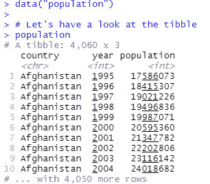

    图 4.5 – 加载“population” tibble

    所有以 **#** 开头的都是注释。

1.  现在让我们检查 tibble 中有多少个不同的国家。你将使用 `distinct` 函数，然后使用 `pull` 函数来提取 tibble 中的单个不同国家列，并以向量格式提取：

    ```py
    population %>% 
      distinct(country) %>% 
      pull()
    ```

    你将看到所有不同的国家列表，如下所示：

    

    图 4.6 – 不同国家的列表

    尝试突出显示代码直到包括 `distinct(country)` 并运行突出显示的代码。你将始终看到不同的国家，但仍然作为 tibble 的一部分。

1.  现在我们想要将年份和人口信息分组到每个国家的单独 tibble 中。简而言之，我们想要有一个包含国家的 tibble，并为每个国家创建另一个包含按年份的人口信息的 tibble。你可以使用 `nest` 函数做到这一点：

    ```py
    nested_population_tbl <- population %>% 
      tidyr::nest( demographic_data = -country )
    nested_population_tbl
    ```

    你刚刚将 `nested_population_tbl` 变量分配给包含嵌套人口数据的新的 tibble。观察我们如何通过从 `tidyr` 源包调用 `::` 来显式调用 `nest` 函数。同时，观察将除国家列之外的所有内容“嵌套”到新 `demografic_data` 列中的 tibble 列表是多么容易。突出显示并运行前面的代码块，你会看到以下结果：

    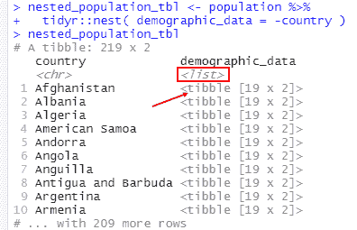

    图 4.7 – 嵌套人口数据表

    注意，新的 `demographic_data` 列是一个 tibble 的列表。

1.  现在，你可以最终使用 `saveRDS` 函数将 `nested_population_tbl` 对象序列化到 RDS 文件中：

    ```py
    saveRDS(nested_population_tbl, "nested_population_tbl.rds")
    ```

你可以在与本书相关的 GitHub 仓库中找到这里显示的 R 代码，在 `Chapter04\importing-rds-files\01-create-object-to-serialize.R` 文件中。为了正确执行文件中的代码，你应该首先打开 RStudio 项目，双击 `Chapter04\importing-rds-files\importing-rds-files.Rproj` 文件。然后你可以使用 RStudio 右下角的 **文件** 选项卡打开之前提到的 R 脚本。

太棒了！你可以通过查看相同的面板来验证文件是否已正确序列化：

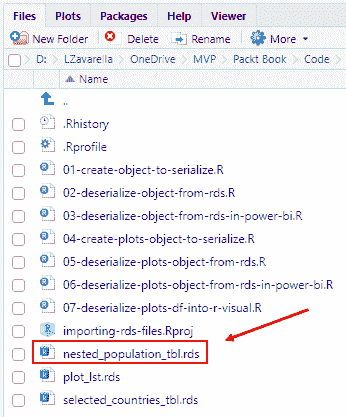

图 4.8 – 正确创建的 RDS 文件

同样地，你将创建一个包含四个选定国家时间序列视图的 RDS 对象。时间序列数据与之前看到的人口增长数据相同。让我们看看你如何生成这个文件：

1.  通过在 RStudio 控制台中输入 `install.packages("timetk")` 命令安装由 Matt Dancho 开发的出色的 **timetk** 包。它使得可视化、整理和特征工程时间序列数据以进行预测和机器学习预测变得容易。更多详情请查看这里：[`business-science.github.io/timetk/`](https://business-science.github.io/timetk/)。

1.  在 RStudio 中打开 `Chapter04\importing-rds-files\04-create-plots-object-to-serialize.R` 文件。文件的前一部分包含在上一节中已经看到的代码，用于生成人口嵌套 tibble。

1.  在创建嵌套 tibble 立即之后，你将看到如何绘制与瑞典相关的时序数据。每个使用的 R 函数都在代码中有解释：

    ```py
    selected_country <- "Sweden"
    nested_population_tbl %>% 
      # Get the row related to the selected country
      filter( country == selected_country ) %>% 
      # Get the content of 'demografic_data' for
      # that row. Note that it is a list
      pull( demographic_data ) %>%
      # Extract the 'demografic_data' tibble from
      # the list (it has only 1 element)
      pluck(1) %>% 
      # Now plot the time series declaring the date variable
      # and the value one. 
      timetk::plot_time_series(
        .date_var = year,
        .value = population,
        .title = paste0("Global population of ", selected_country),
        .smooth = FALSE,     # --> remove the smooth line
        .interactive = FALSE # --> generate a static plot
      )
    ```

    这是结果：

    

    图 4.9 – 瑞典人口增长时间序列图

1.  现在，你将根据之前的示例为嵌套 tibble 中的每个国家创建一个时间序列图。好事是，多亏了 `purrr` 包中 **map 函数** 提供的 **函数式编程** 的力量，你可以通过一个函数一次性完成这个操作。像往常一样，你将在代码中找到详细的解释：

    ```py
    nested_population_plots_tbl <- nested_population_tbl %>%
      # Select a subset of countries
      filter( country %in% c("Italy", "Sweden", "France", "Germany") ) %>%
      # Add a new column called 'plot' applying the plot_time_series
      # function to the values of the demographic_data tibble (.x)
      # for each country (.y) in the 'country' field.
      # Do this thanks to the map2 function.
      mutate( plot = map2( demographic_data, country, ~ timetk::plot_time_series(.data = .x, 
         .date_var = year,
          .value = population,
          .title = paste0("Global population of ", .y),
          .smooth = FALSE,
          .interactive = FALSE) )
      ) %>%
      # Return just the 'country' and 'plot' columns.
      select( country, plot )
    ```

1.  之后，只有由 `nested_population_plots_tbl` tibble 提取的图表列表被序列化到一个 RDS 文件中：

    ```py
    # The index of list items corresponds to the country_id values                   # into the selected countries tibble.
    plots_lst <- nested_population_plots_tbl$plot
    # Serialize the list of plots
    saveRDS(plots_lst, "plots_lst.rds")
    ```

干得好！你已经将你的 R 对象序列化到了 RDS 文件中。如果你想尝试反序列化它们，你可以按照 GitHub 仓库中的 `02-deserialize-object-from-rds.R` 和 `05-deserialize-plots-object-from-rds.R` 文件中的代码进行操作。

现在，你已经准备好直接在 Power BI 中使用文件中序列化的嵌套 tibble。

### 在 Power BI 中使用 RDS 文件

很明显，必须通过 R 脚本在 Power BI 中使用 RDS 文件。如您现在可能已经学到的，有两种 Power BI 对象可以通过它们使用 R 脚本：**Power Query 编辑器**和**R 可视化**。让我们从最简单的情况开始，即将 RDS 文件导入 Power Query 编辑器。

#### 将 RDS 文件导入 Power Query 编辑器

当您知道*可以从对象中提取表格信息*并希望将其持久化到 Power BI 数据模型中时，您将导入一个序列化的 R 对象到 Power Query 编辑器中。让我们看看它是如何完成的：

1.  打开 RStudio 并通过按 *Ctrl + Shift + N* 创建一个新的 R 脚本到项目中。您可以复制并粘贴 `02-deserialize-object-from-rds.R` 文件的内容（或者如果您使用了 GitHub `.Rproj` 文件打开项目，可以直接打开它）。

1.  通过 `readRDS` 函数加载 RDS 文件，并将其分配给新的 `deserialized_tbl` 变量，如下所示：

    ```py
    library(tidyverse)
    project_folder <- "C:/<your>/<absolute>/<project_folder>/<path>"
    deserialized_tbl <- readRDS( file.path(project_folder, "nested_population_tbl.RDS") )
    ```

    注意，我们正在使用绝对路径来读取 RDS 文件，尽管我们处于 RStudio 项目中并且可以不使用路径引用该文件。这是因为*Power BI 没有 RStudio 那样的“项目”概念，因此需要绝对路径*来正确定位文件。另外，请注意，在 R 中，您可以使用双反斜杠（`\\`）或简单斜杠（`/`）作为路径字符串中的分隔符。

1.  现在尝试以下方式从嵌套的 tibble 中提取瑞典的人口统计数据：

    ```py
    sweden_population_tbl <- deserialized_tbl %>% 
      filter( country == "Sweden" ) %>% 
      pull( demographic_data ) %>%
      pluck(1)
    sweden_population_tbl
    ```

    在这段代码中，我们将 `sweden_population_tbl` 变量分配给 `deserialized_tbl` 变量的内容，我们对它应用以下转换：a) 使用过滤函数过滤国家瑞典（从而获得与瑞典相关的行）。b) 从该行中，使用 `pull` 函数从原始 tibble 中分离出 `demographic_data` 字段的内容（您将得到一个列表）。c) 由于 `demographic_data` 列的内容是一个只包含一个 tibble 的列表，因此必须使用 `pluck` 函数取消列表。结果是组织在一个 tibble 中的瑞典人口数据，如图 *4.11* 所示：

    

    图 4.10 – 以 tibble 格式组织的瑞典人口数据内容

1.  现在，打开 Power BI Desktop 并确保它引用的是最早的 MRO。然后点击**获取数据**，然后点击**更多…**。在搜索框中开始键入 `script`，然后双击 R 脚本。R 脚本编辑器将会弹出。

1.  将 `03-deserialize-object-from-rds-in-power-bi.R` 文件的内容复制并粘贴到 R 脚本编辑器中，相应地更改 RDS 文件的绝对路径，然后点击**确定**。

1.  将会打开**导航器**窗口，您可以选择要导入哪个数据框：

    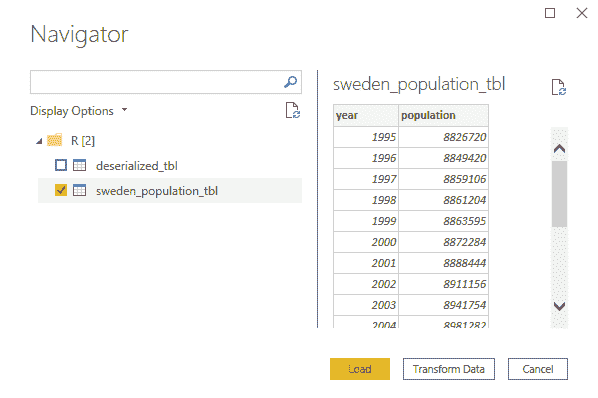

    图 4.11 – 将反序列化的数据框导入 Power BI

    你将在你的脚本中定义了多少个 dataframe（记住 tibbles 是 dataframe 的特殊化），就会看到多少个 dataframe。选择**sweden_population_tbl** dataframe 并点击**Load**。

1.  当加载完成后，点击 Power BI Desktop 左侧菜单中的表格图标，以验证数据是否已正确以表格形式导入：

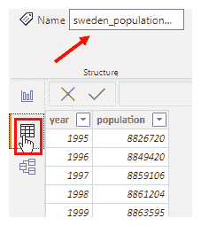

图 4.12 – dataframe 已正确导入

太棒了！你已经正确地将你的 RDS 文件导入 Power BI，以便以最合适的方式使用 Power Query 中的内容。

> **重要提示**
> 
> 如你所注意到的，*Power BI 可以工作的唯一 R 数据结构是具有标准数据类型的 dataframe（或 datatable）*。无法导入任何其他类型的 R 对象。如果你直接导入了*deserialized_tbl* dataframe，那么*demographic_data*列中的值将生成错误，并且将不可用。

有时候可能发生这样的情况，你无法在 Power Query 编辑器中反序列化 RDS 文件，以将其信息以表格格式提取出来，以便在 Power BI 数据模型中持久化。你可能需要在 R 视觉中动态地反序列化 RDS 文件的内容，以便在可视化中使用其信息。你将在下一节中看到如何解决这种情况。

#### 在 R 视觉中导入 RDS 文件

现在假设你从数据科学家团队那里收到了包含每个国家时间序列图表的 RDS 文件。你的目标是允许报告用户通过选择一个国家来查看图表。

你面临的问题是：你知道，为了通过 R 脚本从 Power Query 编辑器导入任何信息，它必须以表格格式，并且必须使用标准数据类型。数据科学家提供的图表以*ggplot*格式分组在一个列表中（**ggplot**为 R 提供了创建优雅且复杂的图形的强大图形语言），它本身不是标准数据类型。你该如何将它们导入 Power BI？你需要一点*横向思维*。

> **重要提示**
> 
> 如你可能已经知道的，在 R 中可以将任何编程对象序列化为它的**字节表示**（R 中的原始向量）。字节表示可以进一步转换为它的**字符串表示**。一旦你有字符串（这是一个标准数据类型），你就可以将它们组织成一个 dataframe。完成之后，你可以将这个 dataframe 导入 Power BI。

当你需要“提供”R 视觉数据时，请记住以下考虑因素：

> **重要提示**
> 
> 当你在 Power BI 数据模型中选择多个表中的多个列（它们之间必须有关系）作为 R 视觉的值时，这些值*将形成一个单一的 dataframe（去重后）*，在视觉的 R 脚本中引用。

此外，请记住以下事项：

> **提示**
> 
> 在某些情况下，你可能想 *不删除重复行*。在这种情况下，你可以在你的数据集中添加一个索引字段（行号），这将使所有行都被视为唯一，并防止分组。

如果你在 Power Query 编辑器中导入包含某种字符串表示的数据框，却无法将其转换回原始对象，那就没有意义。幸运的是，之前提到的直接转换操作都是可逆的，因此你可以在 R 可视化中使用逆转换来适当地提取和显示图表。此外，这个过程还包括了 R 可视化中处理数据的一个似乎未记录的限制。

> **重要提示**
> 
> 如果一个字符串长度超过 32,766 个字符，一旦传递到默认的数据框以在 R 可视化中引用，*它将被截断*。为了避免截断，有必要将字符串拆分成更小的块（我们选择了一个任意的长度为 10,000）并在使用数据到 R 可视化之前将这些块持久化到数据框的列中。

话虽如此，总的来说，在本节中你将执行以下操作：

1.  在 **Power Query 编辑器** 中导入包含命名列表的图表的 RDS 文件。从中，提取包含国家名称的数据框和包含图表信息的数据框。

1.  使用具有单选选项的筛选器中的国家数据框。

1.  每次从筛选器中选择一个国家时，**R 可视化**将显示该国家人口增长的时间序列图。

让我们在一个包含你将在代码中找到的函数的图中总结处理图表数据的所有过程：

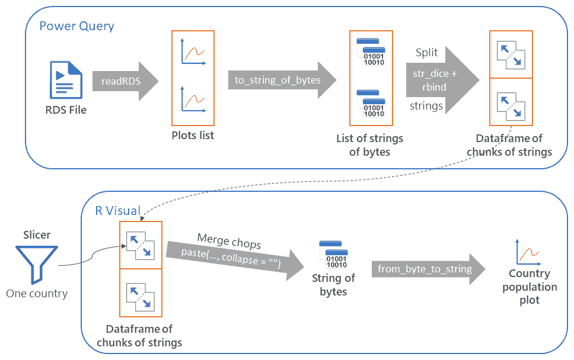

图 4.13 – 将 RDS 文件内容反序列化为 R 可视化

> **重要提示**
> 
> 由于 R 引擎返回了一个神秘的 **ENVSXP 错误**，无法直接导入包含国家名称和相应图表的单一数据框。一个命名列表工作得很好。

在以下步骤中，我们不会详细解释所有使用的函数，仅仅是因为我们将参考与本书相关的 GitHub 中共享的代码，其中每个细节都有注释。所以，让我们开始：

1.  打开 Power BI Desktop，转到 **获取数据**，然后 **更多…**，然后 **R 脚本** 以导入 RDL 文件。

1.  从 GitHub 仓库打开 `06-deserialize-plots-object-from-rds-in-power-bi.R` 文件，复制内容，相应地更改 RDL 文件的绝对路径，将其粘贴到 R 脚本编辑器中，然后点击 **确定**。

1.  Power Query 将检测到你在脚本中创建的三个数据框。仅选择 **plots_df** 数据框（包含图表字节的字符串表示），以及 **selected_countries_df** 数据框。然后点击 **加载**：

    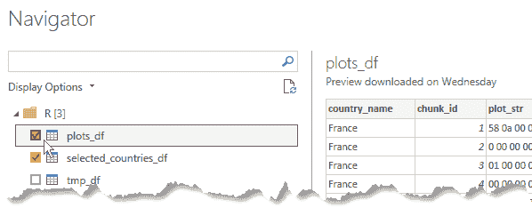

    图 4.14 – 选择包含有用数据的两个数据框

1.  点击左侧工具栏上的**数据**图标，然后点击**管理关系**按钮：

    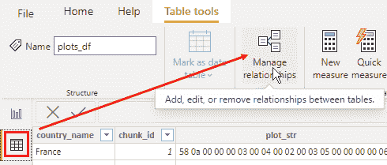

    图 4.15 – 管理关系按钮

1.  引擎已自动创建了两个导入表之间的关系：

    

    图 4.16 – 自动检测到的表格之间的关系

    点击**关闭**。

1.  点击左侧工具栏上的**报告**图标返回报告画布：

    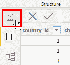

    图 4.17 – 报告图标

1.  现在点击**切片器**图标：

    

    图 4.18 – 切片器图标

1.  在画布中保持**切片器**视觉区域选中，点击**字段**面板上的**selected_countries_df**表，并选择**country**字段：

    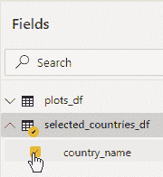

    图 4.19 – 为切片器视觉选择 country_name 列

1.  然后点击**切片器**的**格式**图标并启用**单选**选项：

    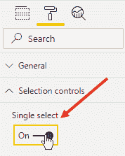

    图 4.20 – 只允许单选

    设置**单选**非常重要，因为**R 视觉内部的逻辑将管理单个图表的反序列化**。

1.  现在，切片器视觉将显示包含在**selected_countries_tbl**中的所有国家：

    

    图 4.21 – 这就是切片器视觉的样子

1.  点击报告画布以取消选择**切片器**视觉元素，然后点击**R 脚本视觉**图标：

    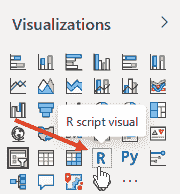

    图 4.22 – R 脚本视觉图标

    常规的**启用脚本视觉**窗口弹出。点击**启用**。

1.  移动并拉伸 R 视觉的边框，使其几乎覆盖整个报告画布。保持选中状态，点击**字段**面板中的**plots_df**表，并选择**chunk_id**、**country_id**和**plot_str**字段：

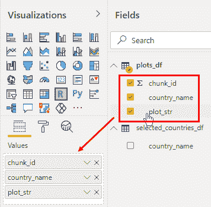

图 4.23 – 选择要在 R 视觉中使用的字段

在**格式**选项卡中，你可以自由地关闭 R 视觉的标题。

1.  从 GitHub 仓库打开`07-deserialize-plots-df-into-r-visual.R`文件，复制内容，并将其粘贴到 R 视觉的脚本编辑器中。然后点击 R 脚本编辑器右上角的**运行**图标。

1.  现在，你可以点击切片器中的每个国家，以查看其人口时间序列：

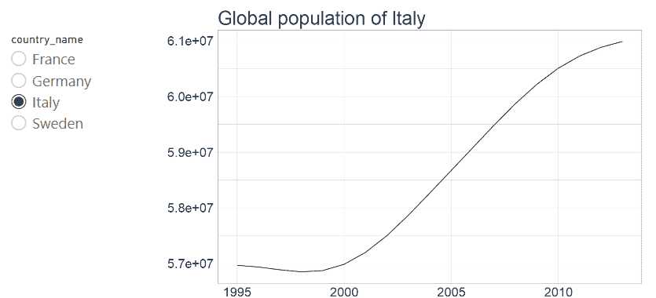

图 4.24 – 显示意大利的人口增长

太棒了！你刚刚创建了一个很少有人能做出来的报告。

> **重要提示**
> 
> 当你需要构建 R 中需要使用 Power BI 服务中 R 视觉未提供的包的复杂可视化时，这种技术非常有用。这些可视化可以制作成“离线”的，序列化到文件，然后在服务上的共享报告中使用。

你刚刚看到了如何在 Power BI 中导入 RDS 文件，尽管它不是 Power BI 的默认功能，以及如何直接在 R 视觉中使用它。

在下一节中，你将看到如何对使用 Python 序列化的文件执行相同操作。

## 在 Python 中导入 PKL 文件

让我们通过 GitHub 上的 Python 代码概述你要实现的内容。如果你不熟悉 Python，你应该通过这个教程熟悉基本结构：[`bit.ly/py-data-struct-quickstart`](http://bit.ly/py-data-struct-quickstart)。对于如何实现 Python 中的算法和数据结构的更详细研究，我们建议这本免费电子书：[`bit.ly/algo-py-ebook`](http://bit.ly/algo-py-ebook)。

### 对 PyData 世界的简要介绍

**PyData**世界由对数据分析充满热情并喜欢使用开源数据工具的用户和开发者组成。PyData 社区还喜欢分享数据管理、处理、分析和可视化的最佳实践、新方法和新兴技术。Python 数据管理社区使用的重要且流行的包如下：

+   **NumPy**：这是 Python 中科学计算的主要库。它提供了一个高性能的多维数组对象以及用于处理数据的工具。

+   **Pandas**：*Python 数据分析库*（pandas 来自*面板数据*）建立在 NumPy 之上，以表格格式（如 CSV 文件、TSV 文件或 SQL 数据库表）接收数据，以便创建一个具有行和列的 Python 对象，称为**DataFrame**。此对象与统计软件中的表格非常相似，熟悉 R 概念的人将 pandas DataFrame 与 R 的 dataframe 数据类型概念上等同起来。

+   **Matplotlib**：这是一个用于生成图表的 Python 包。它始于 2000 年代初的一个项目，旨在使用 Python 可视化癫痫患者大脑中的电子信号。Matplotlib 的创建者是一位神经生物学家，他正在寻找一种方法来使用 Python 复制 MATLAB 的绘图功能。

+   **Scikit-learn**：也称为**sklearn**，其名称来源于两个词“SciPy”和“Toolkit”的结合。这是一个为 Python 设计的免费且强大的机器学习库，旨在与 NumPy、SciPy、pandas、Matplotlib 等库交互。

详细介绍这些库可以做什么不是本书的目的。

> **注意**

如果您想通过利用这些库来开始学习如何在 Python 中处理数据，我们建议从这本免费书籍开始：[`bit.ly/data-science-py-ebook`](http://bit.ly/data-science-py-ebook)。在那之后，为了进一步学习，您绝对不能错过这本精彩的书：Sebastian Raschka 所著的*Python Machine Learning: Machine Learning and Deep Learning with Python, Scikit-Learn, and TensorFlow 2, 第三版*，由 Packt 出版。

为了简要了解本节中使用的代码，我们将尝试逐块描述其功能，并请您参考 GitHub 代码中的注释以获取更多详细信息。

### 创建一个序列化的 Python 对象

如前节所述，现在假设您是另一支需要使用 Python 进行一些复杂、耗时数据分析的数据科学家团队的一员。由于需要重复使用在其他过程中获得的结果，团队决定使用**Pickle 文件**（PKL）。这是通过使用**pickle**库将任何 Python 对象序列化然后写入文件来获得的。正如您在前一节中已经看到的，序列化意味着将内存中的对象转换为可以保存到磁盘或通过网络发送的字节流。显然，这是一个容易逆转的操作。事实上，还有可能反序列化一个序列化的对象。

> **重要提示**
> 
> 在开始之前，请确保您解压 GitHub 仓库 ZIP 文件的路径**不包含任何包含在其中的文件夹名称中的空格**，否则 Python 脚本执行将会出现错误。

那么，让我们开始安装我们环境中需要的东西，并适当地初始化 IDE。

#### 配置环境和安装 PyData 包

打开您的**Anaconda Prompt**（从**开始**菜单），按照以下步骤操作：

1.  确保使用`pbi_powerquery_env`环境，输入以下代码：

    ```py
    conda activate pbi_powerquery_env
    ```

    现在您将安装一些必要的缺失包，以便能够使用本节中的代码。

1.  输入以下命令来安装**matplotlib**：`pip install matplotlib`。

太好了！您的 Python 环境现在已准备好运行您的脚本。现在打开 Visual Studio Code，按照以下步骤操作：

1.  前往**文件**，然后**打开文件夹…**。确保选择包含在您之前解压的 GitHub 仓库中的**importing-pkl-files**文件夹，位于**Chapter04**文件夹下。点击**选择文件夹**。

1.  打开`01-create-object-to-serialize-in-pkl.py`文件，在右侧的选定的文件夹中点击它。

1.  记住您必须选择运行脚本的环境。因此，按*Ctrl + Shift + P*打开 Visual Studio Code 调色板，并开始输入文本“interpreter。”然后，选择**Python: Select Interpreter**，然后选择`pbi_powerquery_env`环境。

极好！现在您已准备好序列化您的第一个 Python 对象。

#### 创建 PKL 文件

Python 中最常用的两种数据结构是 **列表** 和 **字典**。到目前为止，您已经熟悉列表，您在 R 中之前已经见过，如果您从未在编程语言中开发过，那么字典可能对您来说可能是个新概念。字典是由一组 **键值对** 组成的数据结构。您可以使用花括号（`{…}`）来定义它们。具体来说，在本节中，您将创建一个包含国家名称和包含该国人口增长数据的 dataframe 的键值对字典。

您将使用的数据与上一节中使用的数据相同。这次，您将直接从 CSV 文件中加载它，而不是从内存中的包中加载。让我们开始吧：

1.  由于 `01-create-object-to-serialize-in-pkl.py` 文件已经在 Visual Studio Code 中打开，只需通过右上角的绿色箭头图标（**在终端中运行 Python 文件**）运行代码即可。这样，整个脚本将会执行。

1.  在控制台中您不会看到任何特别的内容，只有运行 `python.exe` 并将当前脚本路径作为参数的命令。但如果您在左侧的资源管理器中查看，您会看到 `nested_population_dict.pkl` 文件已正确创建：

    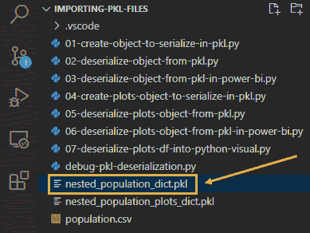

    图 4.25 – 您的第一个 PKL 文件已创建

1.  就像在 Rstudio 中一样，您只能通过突出显示代码并按 *Ctrl + Enter* 来运行代码片段。您需要更改一个设置选项，以便允许使用 Python 的 **交互窗口**。转到 **设置**，按 *Ctrl + ,*（逗号），然后在搜索栏中开始输入 `Send Selection To Interactive Window` 并检查选定的选项：

    

    图 4.26 – 在 Jupyter 交互窗口中启用 Python 代码块的执行

1.  现在，您需要将 *IPython 内核* (`ipykernel`) 安装到您的 `pbi_powerquery_env` 环境中。通常，这个操作会由 Visual Studio Code 自动完成，但有时您可能会遇到错误。因此，手动操作会更好。打开您的 Anaconda Prompt 并输入以下命令：`conda install --name pbi_powerquery_env ipykernel -y`。

1.  现在，选择从开始（`import pandas as pd`）到定义 `countries` 的行（`countries = population_df.country.unique()`），然后按 *Shift + Enter*。您的代码块将会发送到交互窗口：

    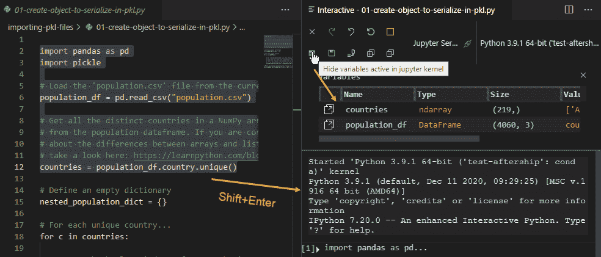

    图 4.27 – 在 Visual Studio Code 中运行选定的脚本块

    如 *图 4.28* 所示，在交互窗口中点击 **变量** 图标，您也可以检查每个变量的内容。

嘿，可能你没有注意到，但只需付出最小的努力，你就已经创建了你的第一个 PLK 文件！你可以通过运行 `02-deserialize-object-from-pkl.py` 文件中的代码来训练自己反序列化新创建的 PKL 文件。

现在，我们将指导你创建一个包含序列化字典的第二个 PKL 文件，该字典由国家和相应的人口增长时间序列的成对组成。这次，为了简单起见，你将只保留字典中的四个国家。让我们继续：

1.  从左侧的资源管理器打开 `04-create-plots-object-to-serialize-in-pkl.py` 文件。

1.  你可以分步骤运行代码，以更好地理解其工作原理。在脚本大约一半的地方，你会找到以下代码：

    ```py
    # Let's try to plot the time series for Sweden
    selected_country = "Sweden"
    x = nested_population_dict[selected_country].year
    y = nested_population_dict[selected_country].population
    # Create a figure object
    fig_handle = plt.figure()
    # Plot a simple line for each (x,y) point
    plt.plot(x, y)
    # Add a title to the figure
    plt.title("Global population of " + selected_country)
    # Show the figure
    fig_handle.show()
    ```

1.  运行那部分代码后，将打开一个交互式窗口，显示瑞典的时间序列图：

    

    图 4.28 – 显示瑞典时间序列图的交互式窗口

    如果你想要创建新的图形，请保持打开状态，否则你可能会遇到奇怪的错误。

1.  最后一段代码创建了一个包含每个国家图形的新字典，并将其序列化到文件中。一旦执行，你可以在左侧的资源管理器中看到 `nested_population_plots_dict.pkl` 文件：

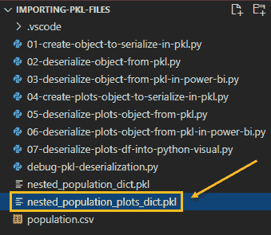

图 4.29 – 新的字典已正确序列化到 PKL 文件中

太棒了！你也序列化了第二个字典。你可以使用 `05-deserialize-plots-object-from-pkl.py` 脚本中的代码来练习反序列化它。

现在，你已准备好在 Power BI 中测试你的 PKL 文件，无论是在 Power Query 编辑器中还是在 Python 可视化中。

### 在 Power BI 中使用 PKL 文件

很明显，在 Power BI 中必须通过 Python 脚本来使用 PKL 文件。因此，有两个 Power BI 对象可以通过它们使用 Python 脚本：**Power Query 编辑器**和**Python 可视化**。让我们从最简单的情况开始，即将 PKL 文件导入到 Power Query 编辑器中。

#### 在 Power Query 编辑器中导入 PKL 文件

当你知道如何从对象中提取表格信息并将其持久化到 Power BI 数据模型中后，你将把一个序列化的 Python 对象导入到 Power Query 编辑器中。让我们看看如何做：

1.  打开 Power BI Desktop，并确保它引用的是 `pbi_powerquery_env` 环境。然后点击**获取数据**，然后**更多…**。在搜索框中开始输入 `script`，然后双击 Python 脚本。Python 脚本编辑器将弹出。

1.  在 Visual Studio Code 中打开 `03-deserialize-object-from-pkl-in-power-bi.py` 文件，并复制其内容。然后将其粘贴到 Power BI Desktop 中的 Python 脚本编辑器中，相应地更改 PKL 文件的绝对路径，并点击**确定**。

1.  **导航器**窗口将打开，让你选择要导入哪个 dataframe：

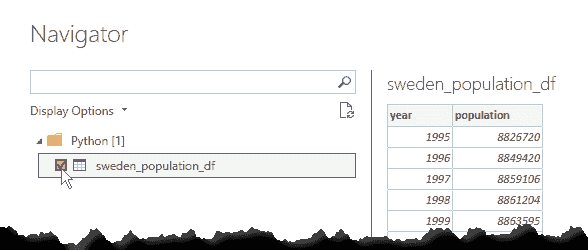

图 4.30 – 将反序列化的数据框导入 Power BI

选择 **sweden_population_tbl** 数据框并点击 **加载**。

1.  加载完成后，点击 Power BI Desktop 左侧菜单中的表格图标以验证数据是否已正确以表格形式导入：


图 4.31 – 数据框已正确导入

干得好！你已经正确地将你的 PKL 文件导入到 Power BI 中，以便以最合适的方式使用其内容 与 Power Query。

> **重要提示**
> 
> 与 R 脚本一样，**Power BI 能够处理的数据结构只有具有标准数据类型的 pandas DataFrame**。无法导入任何其他类型的 Python 对象。这就是为什么你无法直接导入字典的原因。

如前所述，可能发生 PKL 文件不包含可以在 Power Query 编辑器中提取的表格格式信息的情况。你可能需要在 Python 可视化中直接反序列化 PKL 文件的内容，以便使用这些信息创建图表。你将在下一节中看到如何解决这种情况。

#### 在 Python 可视化中导入 PKL 文件

现在假设你收到了数据科学家团队发送的包含每个国家时间序列图的 PKL 文件。你的目标是允许报告用户通过选择一个国家来查看这些图表。

你面临的问题是这样的：你知道为了通过 Python 脚本将任何信息导入 Power Query 编辑器，它必须是表格格式，并且必须使用标准数据类型。数据科学家提供的图表以 **Matplotlib** 的 **图像格式**分组在字典中，而 Matplotlib 本身不是标准数据类型。那么，你如何将字典导入 Power BI 呢？与之前章节中用于 R 的相同“技巧”适用。

总结来说，在本节中你将执行以下操作：

1.  在 Power Query 编辑器中导入包含图表字典的 PKL 文件。提取其键（国家）并在数据框中公开它们。使用其字节流表示形式填充另一个数据框。

1.  使用包含国家的数据框作为单选切片器。

1.  每次从切片器中选择一个国家时，Python 可视化将反序列化字节流到输入数据框中，并显示该国人口增长的时间序列图。

> **重要提示**
> 
> 此外，在这种情况下，当你从 Power BI 数据模型中的多个表（它们之间必须有关系）中选择多个列作为 Python 可视化的值时，这些值 *将形成一个单一的数据框（去重后）*，在视觉的 Python 脚本中引用。

此外，适用于 R 数据框输入的相同建议也适用：

> **技巧**
> 
> 在某些情况下，你可能不想 *删除重复行*。在这种情况下，你可以在你的 Pandas 数据集中添加一个索引字段（行号），这将使所有行都被视为唯一，并防止分组。

再次，即使是 Python 可视化也对其导入的数据添加了一个似乎未记录的大小限制：

> **重要提示**
> 
> 如果字符串长度超过 32,766 个字符，*它将被截断*，一旦传递到 Python 可视化的输入数据框中。为了避免截断，我们需要将字符串分成每个 32,000 个字符的块（这是我们选择的任意值），并在使用 Python 可视化中的数据之前将这些块持久化到数据框的列中。

这里用一张图总结了整个过程，图中包含了你将在代码中找到的函数：

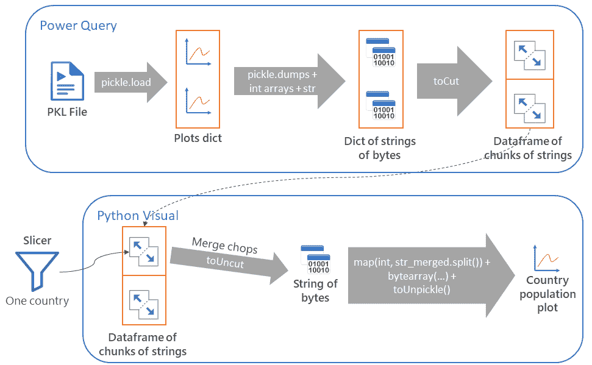

图 4.32 – 将 PKL 文件内容反序列化为 Python 可视化

在以下步骤中，我们不会详细解释所有使用的 Python 函数，仅仅因为我们将会参考与本书相关的 GitHub 仓库中共享的代码，其中每个细节都有注释。所以，让我们开始吧：

1.  打开 Power BI Desktop，转到 **获取数据**，然后 **更多…**，然后 **Python 脚本** 以导入 PKL 文件。

1.  从 GitHub 仓库打开 `06-deserialize-plots-object-from-pkl-in-power-bi.py` 文件，复制内容，将其粘贴到 Python 脚本编辑器中，相应地更改 PKL 文件的绝对路径，然后点击 **确定**。

1.  Power Query 将检测到你在脚本中创建的三个数据框。仅选择 `plots_df`（包含每个图表的字节字符串块的）和 selected `_countries_df`（包含国家名称的）数据框：

    

    图 4.33 – 选择包含有用数据的两个数据框

    然后点击 **加载**。

1.  在左侧工具栏中点击 **数据** 图标，然后点击 **管理关系** 按钮：

    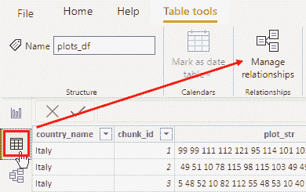

    图 4.34 – 管理关系按钮

1.  引擎已自动创建了两个导入表之间的关系：

    

    图 4.35 – 表格之间自动检测到的关系

    点击 **关闭** 并使用左侧工具栏中的 **报告** 图标返回报告画布。

1.  现在点击 **Slicer** 可视化图标：

    

    图 4.36 – Slicer 可视化图标

1.  在画布上保持 Slicer 可视化区域被选中，点击 **字段** 面板上的 **selected_countries_df** 表，并选择 **country_name** 字段：

    

    图 4.37 – 为 Slicer 可视化选择 country_name 列

1.  然后，像上一节那样点击 Slicer 的**格式**图标，并启用**单选**选项。Slicer 可视化将显示包含在**selected_countries_df**表中的所有国家名称。设置**单选**非常重要，因为*Python 可视化内部的逻辑将管理单个图表的反序列化*。

1.  点击报告画布以取消选择 Slicer 可视化区域，然后点击**Python 可视化**图标：

    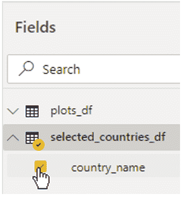

    图 4.39 – Python 可视化图标

    常见的**启用脚本可视化**窗口弹出。点击**启用**。

1.  移动并拉伸 Python 可视化边框，以便几乎覆盖整个报告画布。保持选中状态，点击**字段**面板中的**plots_df**表，并选择所有三个`chunk_id`、`country_id`和`plot_str`字段：

    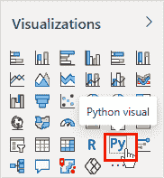

    图 4.40 – 选择在 Python 可视化中使用的字段

    在**格式**选项卡中，你可以自由地关闭 Python 可视化标题。

1.  从 GitHub 仓库打开`07-deserialize-plots-df-into-python-visual.py`文件，复制内容，并将其粘贴到 Python 可视化脚本编辑器中。然后，点击 Python 脚本编辑器右上角的**运行**图标。

1.  现在，你可以点击滑块中的每个国家，以查看人口时间序列：

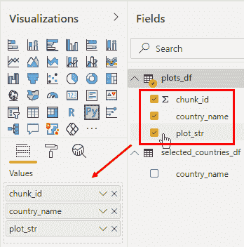

图 4.41 – 显示德国的人口增长

太棒了！你刚刚使用了一种世界上很少有人知道的方法创建了一份报告。

> **重要提示**
> 
> 当你需要使用 Power BI 服务中 Python 可视化未提供的包来构建复杂可视化时，这项技术非常有用。这些可视化可以离线制作，序列化到文件中，然后在该服务的共享报告中使用。

## 摘要

在本章中，你学习了 Tidyverse 方法在 R 开发中的应用，以及如何将 R 对象序列化到文件中。之后，你学习了如何在 Power Query 编辑器和 R 可视化中使用这些序列化文件。

你随后使用 Python 解决了相同的问题。具体来说，你学习了 PyData 社区最常用的包，学习了如何将 Python 对象序列化到文件中，以及如何在 Power BI 中（在 Power Query 编辑器和 Python 可视化中）使用它们。

在下一章中，你将有机会了解正则表达式和模糊字符串匹配有多么强大，以及它们可以为你的 Power BI 报告带来哪些好处。

## 参考文献

对于额外的阅读，请参阅以下书籍和文章：

+   *《R 入门》* by R Core ([`cran.r-project.org/doc/manuals/r-release/R-intro.html`](https://cran.r-project.org/doc/manuals/r-release/R-intro.html))。

+   *《数据科学中的 R》* by Hadley Wickham ([`r4ds.had.co.nz/index.html`](https://r4ds.had.co.nz/index.html))。

+   *《使用 R 进行机器学习：预测建模的高级技巧，第 3 版》* 由 Brett Lantz 著，Packt Publishing 出版 ([`www.packtpub.com/product/mastering-machine-learning-with-r-third-edition/9781789618006`](https://www.packtpub.com/product/mastering-machine-learning-with-r-third-edition/9781789618006)).
