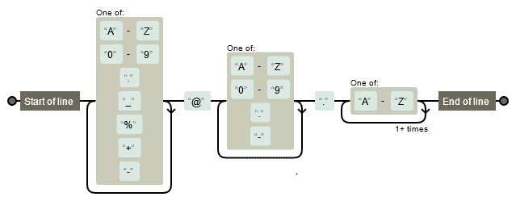

# 5 在 Power BI 中使用正则表达式

通常，许多数据清洗任务涉及在字符串之间执行复杂的搜索和替换。通常的搜索和替换工具有时不足以获得所需的结果。例如，假设你需要匹配字符串，不是通过精确的方式（例如，通过相等条件）而是使用它们之间的相似标准。了解如何使用正则表达式（别名为 regex）或模糊字符串搜索可以在需要高质量数据的项目中起到关键作用。多亏了 R 和 Python，你可以将这些工具添加到你的工具库中。

本章我们将涵盖以下主题：

+   正则表达式的简要介绍

+   在 Power BI 中使用正则表达式验证数据

+   在 Power BI 中使用正则表达式加载复杂的日志文件

+   在 Power BI 中使用正则表达式从文本中提取值

## 技术要求

本章要求你拥有一个正常工作的互联网连接，并且**Power BI 桌面版**已经安装在你的机器上。你需要按照*第二章*、*配置 Power BI 中的 R*和*第三章*、*配置 Power BI 中的 Python*中概述的方式正确配置 R 和 Python 引擎和 IDE。

## 正则表达式的简要介绍

**正则表达式**（通常简称为**regex**）由一系列字符定义，这些字符*标识一个抽象的搜索模式*。本质上，它是一种在 1951 年由形式语言和理论计算机科学专家开发的数学技术。它用于**验证**输入数据或从文本中*搜索和提取*信息。

如果你不知道正则表达式的语法，乍一看，它可能看起来非常复杂：


图 5.1 – 正则表达式模式的示例

幸运的是，有一些在线正则表达式可视化工具可以使理解模式变得更加容易（你可以在[`regexper.com`](https://regexper.com)找到其中之一）。例如，*图 5.1*中高亮显示的正则表达式可以如下可视化：



图 5.2 – 正则表达式的可视化

从*图 5.2*中，可以直观地推断出*图 5.1*中的正则表达式将识别文本中的电子邮件地址。

在本节中，我们当然不会深入讲解如何像专业人士一样使用正则表达式，这不是本节的目的。在这里，我们将解释一些基本规则，这将使你能够创建简单而有效的搜索模式。更多细节，请参阅本章末尾的*参考文献*部分。

### 正则表达式的基础知识

我们将通过使用示例来尝试解释正则表达式的基本原理，这可能是开始使用它们的直接方式。每个后续的小节将解释正则表达式的一个功能。为了测试我们的正则表达式，我们将使用在[`www.regexpal.com/`](https://www.regexpal.com/)提供的工具。让我们开始吧！

#### 文本字符

要在正则表达式中包含一个或多个字面字符，必须使用“搜索”功能。让我们尝试在 *May the power of extending Power BI with Python and R be with you!* 文本中搜索 *owe* 字符串：


图 5.3 – 使用正则表达式搜索 "owe"

注意，该工具在默认的搜索中使用了 **Global search** **标志**。特定的标志用字母（在我们的情况下，**g**）表示，紧随正则表达式分隔符 **/.../** 之后。可用的标志如下：

+   **g (global)**：这将匹配所有出现，并保留最后一个匹配的索引。

+   **m (multiline)**：当启用时，字符串锚定符（你稍后会看到它们）将匹配行的开始和结束，而不是整个字符串。

+   **i (ignore case)**：这将忽略字符串的大小写（大写或小写）来搜索模式。

请记住，并非所有编程语言都使用标志语法，如前所述。例如，Python 的 `re` 包（正则表达式的默认包）在 `search`、`match` 和 `sub` 函数中提供参数：

```py
re.search('test', 'TeSt', re.IGNORECASE)
re.match('test', 'TeSt', re.IGNORECASE)
re.sub('test', 'xxxx', 'TesTing', flags=re.IGNORECASE)
```

这与 R 的 `stringr` 包中的 `regex()` 函数相同：

```py
str_detect('tEsT this', regex('test', ignore_case=TRUE))
```

你还可以直接在你的正则表达式模式中使用 **global modifiers**。这些是 `(?i)` 用于不区分大小写和 `(?m)` 用于多行。例如，在 R 中，你也可以运行以下脚本：

```py
str_detect('tEsT this', regex("(?i)test"))
```

注意，Python 不允许使用内联全局修饰符。

#### 特殊字符

正则表达式使用 12 个特殊字符（也称为 **元字符**），每个都有特殊含义。它们是管道 `|`；反斜杠 `\`；美元符号 `$`；问号 `?`；脱字符 `^`；星号 `*`；加号 `+`；点 `.`；括号 `(` 和 `)`；开方括号 `` 和开花括号 `{`。

如果你需要搜索之前提到的一个字符，你必须使用反斜杠来转义它。所以，如果你想精确匹配 `123$`，你需要使用 `123\$` 作为正则表达式模式。

接下来，你将学习元字符的含义和使用方法。

#### ^ 和 $ 锚定符

锚定字符是特殊字符，因为它们用于将正则表达式匹配放置在字符串的特定位置。脱字符 `^` 用于指示 *字符串的开始*（或行），而美元符号 `$` 用于指示 *字符串的结束*（或行）。一个示例可视化胜过千言万语：

![图 5.4 – 不区分大小写的全局搜索图 5.4 – 不区分大小写的全局搜索在 *图 5.4* 中，通过点击 **flags** 图标并勾选“ignore case”来设置“忽略大小写”标志。这样，两个出现都会被匹配。现在，在 `m` 字符之前添加一个脱字符 `^`：

图 5.5 – 使用脱字符 ^ 进行不区分大小写的全局搜索

在这种情况下，只有第一次出现（即字符串的开头）的匹配项会被匹配。

如果你也在正则表达式的末尾添加一个美元符号，则不会进行匹配，因为你正在请求匹配以`may the power`字符串开始并且也结束文本的匹配项。

#### OR 运算符

你可能需要匹配单个字符集或字符串集。例如，为了匹配`ye`字符串之后的任何`s`和`t`字符，你应该在`ye[st]`正则表达式内部使用**字符类**`[st]`。这样它将匹配`yes`和`yet`字符串。字符类还可以用来匹配字符范围内的一个出现，使用连字符`-`。例如，`[0-9]`匹配 0 到 9 之间的单个数字，而`[A-Z]`匹配从 A 到 Z 的单个大写字母。此外，你还可以将多个范围组合成一个字符类。例如，`[A-Z0-9]`只匹配数字或大写字母。

为了匹配两个字符串中的一个，你可以在括号内使用管道符`|`来分隔它们，例如`(string1|string2)`。以下是一个完整的示例：


图 5.6 – OR 运算符的完整示例

字符类还可以用来匹配任何不同于特定字符的字符。这是由于**否定字符类**的作用。

#### 否定字符类

开方括号后出现的撇号会否定字符类的内容。例如，`[^"]`正则表达式匹配所有不是双引号的字符。

#### 简写字符类

有些字符类使用得非常频繁。因此，我们定义了一些缩写，以便你能够快速地将它们包含在正则表达式中。以下是最常用的列表：

+   `\w`: 这会匹配一个字母数字字符，包括下划线。

+   `\W`: 这是`\w`的对立面，因此它匹配一个非字母数字字符，不包括下划线。例如，它可以匹配空格和标点符号。

+   `\d`: 这会匹配一个单个数字。

+   `\D`: 这是`\d`的对立面，因此它匹配一个非数字字符。

+   `\s`: 这会匹配“空白字符”，例如空格、制表符、换行符和回车符。

我们将在本章中相对频繁地使用简写字符类。

#### 量词

量词表示一个**字符**或**表达式**必须匹配的次数。以下是最常用的列表：

+   `+`: 这会匹配其前面的内容一次或多次。例如，`test\d+`将匹配`test`字符串后跟一个或多个数字。`test(-\d\d)+`正则表达式将匹配`test`字符串后跟一个或多个由连字符和两个数字组成的序列：

    

    图 5.7 – 使用`+`重复一组字符

+   `{n}`: 这将匹配其前面的内容重复 *n* 次。例如，`\d{4}` 将匹配由 4 位数字组成的任何整数。

+   `{n,m}`: 这将匹配其前面的内容，重复 *n* 到 *m* 次。例如，`prod-\d{2,6}` 将匹配 `prod-` 字符串后跟由 2 到 6 位数字组成的整数。

+   `{n,}`: 这将匹配 *n* 次或更多次其前面的内容。

+   `?`: 这将匹配其前面的一个或零次。例如，`Mar(ch)?` 将匹配 `March` 和 `Mar`。或者，`colou?red` 正则表达式将匹配 `colored` 和 `coloured`。

+   `*`: 这将匹配其前面的内容零次或多次。例如，`code\d*` 将匹配 `code`、`code1` 或 `code173846`。

#### 点

点对应于单个字符，无论该字符是什么，除了换行符。这是一个非常强大的正则表达式元字符，并给你一个偷懒的机会。这正是为什么你必须小心不要滥用它，因为有时你可能会在匹配中包含意外结果。

#### 贪婪和懒惰匹配

`+`、`*` 和 `{…}` 的重复是**贪婪量词**。贪婪意味着它们将消耗尽可能长的字符串。假设你只想匹配 `<em>Power BI rocks</em>` 字符串中使用的标签。初学者可能会尝试使用 `<.+>` 正则表达式，用文字表达就是“获取 `<`，然后获取一个或多个非换行符，最后，在末尾获取 `>`。”预期的结果是两个匹配项，`<em>` 和 `</em>`。让我们看看结果：


图 5.8 – .+ 的贪婪性

很明显，`.+` 的组合捕获了从 `<` 的第一次出现到 `>` 的最后一次出现之间的所有内容，因此量词的贪婪性得到了定义。

那么，是否可以强制贪婪量词在检测到下一个字符的第一个出现时停止，防止它“吃掉”任何内容，直到相同字符的最后一个出现？换句话说，是否可以将贪婪量词转换为**懒惰**量词？答案是“可以”，可以通过在 `+` 后面添加 `?` 元字符来实现。因此，`<.+>` 正则表达式变为 `<.+?>`。以下是结果：


图 5.9 – 利用 ? 元字符使贪婪量词变得懒惰

然而，请注意，**懒惰量词性能较差**。只要可能，总是更倾向于使用否定字符类。在我们的例子中，只需使用 `<[^>]+>` 正则表达式（即一个 `<` 字符，一个或多个非 `>` 字符，以及一个 `>` 字符）就可以达到相同的结果，而不会消耗计算资源：


图 5.9 – 使用否定字符类代替懒惰量词

到目前为止，你关于正则表达式所学的知识，是你理解我们将在接下来的几个例子中使用的更复杂正则表达式的最低基础。

### 检查电子邮件地址的有效性

如果你被要求使用你刚刚学到的概念来验证电子邮件地址，你的第一次尝试可能看起来像以下这样：`^.+@.+\..+$`。将这个正则表达式翻译成口语，我们得到以下内容：

1.  `^`: 如果启用了多行标志，则匹配字符串的开始或一行。

1.  `.+`: 匹配任何字符一次或多次，除了换行符。

1.  `@`: 匹配一个 "@" 字符。

1.  `.+`: 匹配任何字符一次或多次，除了换行符。

1.  `\.`: 匹配一个 "." 字符。

1.  `.+`: 匹配任何字符一次或多次，除了换行符。

当然，这个正则表达式将验证正确的电子邮件地址。但你确定它也能检测到明显错误的电子邮件地址的语法错误吗？让我们在 [`www.regexpal.com/`](https://www.regexpal.com/) 上进行测试，使用错误的电子邮件地址 `example@example.c`（顶级域名，即点之后的部分，必须包含至少两个字符）：


图 5.10 – 使用简单的正则表达式验证错误的电子邮件地址

嗯，这并不是什么结果：一个明显错误的电子邮件地址会被错误地认为是正确的。因此，通常需要使用更复杂的正则表达式，这些正则表达式可以尊重定义良好的语法规则。

在这个特定的情况下，我们将使用我们在生产中经常采用的特定正则表达式来验证电子邮件地址。它还考虑了是否使用了域名 IP。为了完整地显示它，正则表达式如下：

```py
^(([^<>()[\]\\.,;:\s@\""]+(\.[^<>()[\]\\.,;:\s@\""]+)*)|(\"".+\""))@((\[?[0-9]{1,3}\.[0-9]{1,3}\.[0-9]{1,3}\.[0-9]{1,3}\]?)|(([a-zA-Z\-0-9]+\.)+[a-zA-Z]{2,}))$
```

初看之下，这个正则表达式肯定会引起混淆。然而，如果我们尝试将其分解为其基本部分，它就变得容易阅读多了。

然而，如果你认为这个正则表达式真的很复杂，那么请看看考虑了所有（是的，所有）由 *Arpa Internet 文本消息格式标准* 提供的语法规则的那个正则表达式，你可以在 [`www.ex-parrot.com/pdw/Mail-RFC822-Address.html`](http://www.ex-parrot.com/pdw/Mail-RFC822-Address.html) 找到它！相当令人印象深刻，不是吗？

电子邮件地址的格式定义为 *本地部分@域名*。你可以在维基百科上找到完整的规范 [`en.wikipedia.org/wiki/Email_address`](https://en.wikipedia.org/wiki/Email_address)。我们将匹配允许我们验证大量不同电子邮件地址的最小规则（不是所有规则！）所以，考虑到我们将匹配域名或域名 IP，正则表达式的一般结构如下：


图 5.11 – 用于电子邮件验证的复杂正则表达式的结构

在 *图 5.11* 中，`{0}`、`{1}` 和 `{2}` 字符串只是占位符，不是要匹配的字符。话虽如此，让我们首先定义每个标记：

1.  `{0}` 符号匹配电子邮件的**本地部分**正则表达式。在这种情况下，使用图表比用文字解释本地部分正则表达式要容易得多。在 *图 5.12* 中，标签解释了每个子部分的每个细节：

    

    图 5.12 – 详细解释的本地部分正则表达式

    请记住，*括号将正则表达式模式组合在一起*。括号允许你将正则表达式运算符应用于整个分组表达式，并将匹配的一部分作为结果数组中的单独项获取。与正则表达式表达式对应的文本被捕获在其中作为**编号组**，并且可以使用编号反向引用来重用。你将在以后学习如何使用此功能。记住，为了使元字符的匹配成为一个真实字符，必须在它之前放置转义反斜杠。所以，例如，`\]` 将是 `]` 字符。

1.  `{1}` 符号匹配电子邮件的**域名**。同样，我们将使用图表来解释域名正则表达式的作用：

    

    图 5.13 – 详细解释的域名正则表达式

1.  `{2}` 符号匹配电子邮件的**域名 IP**。这是较简单的子正则表达式，你可以通过查看 *图 5.14* 来了解它匹配的内容：


图 5.14 – 详细解释的域名 IP 正则表达式

如果你想要查看整个正则表达式的可视化，请参考以下链接，它来自 [`jex.im/regulex`](https://jex.im/regulex)：


图 5.14 – 整个电子邮件正则表达式的可视化

现在，让我们继续验证另一种重要类型的信息的验证，这种信息经常受到输入错误的影响：**日期**。

### 检查日期的有效性

即使在日期的情况下，无知的正则表达式开发者可能会认为以下正则表达式足以验证日期（格式为 `dd-mm-yyyy`）：`^\d{1,2}([\-\/])\d{1,2}\1(?:\d{4}|\d{2})$`。有两个新的表达式，以前从未遇到过，值得探索：

+   `\1`: 这是对组 1 的**反向引用**。正如我们在上一节中解释的那样，括号还可以帮助捕获字符串的一部分，你可以在正则表达式的其余部分中引用它。在这种情况下，`\1` 语法表示，在确切的位置，你可以期望与第一对括号匹配的相同字符串部分。请注意，在 Python 中，你需要使用 `\g<1>` 语法而不是 `\1`。

+   `(?: … )`：这是所谓的**非捕获组**。有时，你需要括号来正确应用量词，但你不想在结果中报告其内容。

将整个正则表达式翻译成口语，我们得到以下内容：

1.  `^`：这匹配字符串的开始或一行，如果启用了多行标志。

1.  `\d{1,2}`：这匹配 1 到 2 次重复的任何数字。

1.  `([\-\/])`：这匹配位于 `-` 和 `/` 之间的任何字符，并将结果捕获为组 1。

1.  `\d{1,2}`：这匹配 1 到 2 次重复的任何数字。

1.  `\1`：这指的是捕获组 1。因此，它期望任何位于 `-` 和 `/` 之间的字符。

1.  `.+`：这匹配一个或多个字符，除了换行符。

1.  `(?:\d{4}|\d{2})`：这匹配以下两种选择之一：恰好 4 次重复的任何数字和恰好 2 次重复的任何数字。

你可以这样可视化整个正则表达式：


图 5.15 – 验证日期的正则表达式的第一次尝试的可视化

如你所猜，这个正则表达式验证以下格式的日期：`dd-mm-yyyy`、`dd-mm-yy`、`d-m-yyyy` 和 `d-m-yy`，使用 `/` 或 `-` 作为分隔符。然而，它不考虑由于无效日期（如 2 月 30 日或 9 月 31 日）引起的错误。

如果你想要一个也考虑这些错误的正则表达式，那么你必须使用以下：

```py
^(?:(?:31\-\/|(1[02]))\-\/?\d\d)|(?:(?:29|30)\-\/|(?:1[0-2]))\-\/?\d\d)|(?:29[\-\/]0?2\-\/(?:(?:[02468][048])|(?:[13579][26])))|(?:(?:(?:0?[1-9])|(?:1\d)|(?:2[0-8]))\-\/|(?:1[0-2]))\-\/?\d\d))$
```

再次，以这种方式查看，这个正则表达式很难解释。然而，如果你稍微“从上面”看，你会意识到它由四个选择项组成：


图 5.16 – 复杂日期验证正则表达式的结构

此外，在这种情况下，`{0}`, `{1}`, `{2}`, 和 `{3}` 字符串只是占位符，不是用于匹配的字符。话虽如此，让我们首先定义 `{0}` 令牌。

`{0}` 令牌匹配具有 31 日的日期。与之前的案例一样，用可视化来解释这个正则表达式比用文字来说明要容易得多。在 *图 5.17* 中，标签解释了每个子部分的每一个细节：


图 5.17 – 详细解释具有 31 日的日期的正则表达式部分

用于其他占位符的正则表达式与我们刚才解释的非常相似。因此，我们将把其他正则表达式的解释留给读者作为练习。如果你想看到整个正则表达式的可视化，请参考以下图表，该图表来自 [`jex.im/regulex`](https://jex.im/regulex)：


图 5.18 – 整个日期正则表达式的可视化

我们刚才检查的正则表达式允许验证 `dd-mm-yyyy` 格式及其所有变体。在代码中，我们将演示如何在 Power BI 中实现日期验证。此外，你还将找到允许你验证 `mm-dd-yyyy` 和 `yyyy-mm-dd` 格式及其所有变体的正则表达式（其中年份由两位数字组成，月份由一位数字组成，等等）。

现在你已经理解了之前展示的复杂正则表达式的原理，让我们继续在 Power BI 中实现它们以验证你的数据。

## 在 Power BI 中使用正则表达式验证数据

到目前为止，Power BI 在 Power Query 中没有原生的功能来执行正则表达式操作。有些情况下，你无法避免使用正则表达式从文本形式的数据中提取有用信息。能够使用正则表达式的唯一方法是使用 R 脚本或 Python 脚本。在这种情况下，你唯一的缺点是，如果你需要将报告发布到 Power BI 服务，为了让 Power Query 能够使用外部 R 或 Python 引擎，你必须也以个人模式安装本地数据网关。

然而，让我们直接进入现实世界的例子。

假设你在一个零售公司工作，公司里有一个团队专门负责识别欺诈客户。一旦团队成员识别出一名欺诈者，他们就会填写一个 Excel 表格，其中包含 *Email* 和 *BannedDate* 列以及其他列。你的任务是把这个 Excel 文件中的数据加载到 Power BI 中，并从其他数据源中选择欺诈者的信息，以便对这些购买进行特定分析。

在 Excel 文件中拥有正确的欺诈者电子邮件对于能够正确地与其他数据连接至关重要。拥有正确的禁用日期也很重要，以便知道在那之后该欺诈者是否有进一步的订单漏网。正如你所知，多个用户填写 Excel 文件时没有任何数据验证；因此，它容易受到人为错误的影响。因此，在填写某些字段时识别任何错误并突出显示它们，可以让欺诈团队能够纠正它们。正是在这种情况下，正则表达式才会对你有所帮助。

### 在 Power BI 中使用 Python 使用正则表达式验证电子邮件

在本书附带的重构库中，你可以在 `Chapter05` 文件夹中找到 `Users.xlsx` Excel 文件。其内容类似于 *图 5.15*：


图 5.19 – Users.xlsx 文件的内容

在本节中，我们将专注于**电子邮件**列。这包含欺诈团队手动输入的欺诈者的电子邮件地址，这在节的开头已经描述过。这些电子邮件地址并非都是语法正确的。此外，在 Excel 文件中，还有一个名为 `IsEmailValidByDefinition` 的列，其值（*1=是*；*0=否*）表示对应值的电子邮件实际上是否有效。

Python 有一个内置的包，称为 `re`，其中包含你处理正则表达式所需的所有函数。此外，在 `pandas` 中，有几个用于序列或数据框对象的方法，这些方法接受正则表达式以在字符串中查找模式。这些方法的工作方式与你在 Python 的 `re` 模块中找到的方法相同。我们很快将使用 `match` 方法。

你将学习如何使用 `r'...'` 语法来创建字符串。这是一个**原始字符串**，允许你将反斜杠（`\`）视为一个字面字符，而不是一个转义字符。

因此，打开你的 Power BI Desktop，确保你使用的 Python 环境是 `pbi_powerquery_env`，然后让我们开始吧：

1.  从功能区点击**Excel**图标以从 Excel 导入数据：

    

    图 5.20 – 从 Excel 导入数据

1.  从**打开**对话框中，选择之前提到的 `Users.xlsx` 文件。

1.  从**导航器**窗口中，选择**用户**表，然后点击**转换数据**：

    

    图 5.21 – 选择用户表并点击转换数据

1.  点击**转换**菜单，然后点击**运行 Python 脚本**。

1.  然后，将以下代码复制并粘贴到 Python 脚本编辑器中，并点击**确定**：

    ```py
    import pandas as pd
    import re
    df = dataset
    regex_local_part = r'([^<>()[\]\\.,;:\s@\""]+(\.[^<>()[\]\\.,;:\s@\""]+)*)|(\"".+\"")'
    regex_domain_name = r'(([a-zA-Z\-0-9]+\.)+[a-zA-Z]{2,})'
    regex_domain_ip_address = r'(\[?[0-9]{1,3}\.[0-9]{1,3}\.[0-9]{1,3}\.[0-9]{1,3}\]?)'
    pattern = r'^({0})@({1}|{2})$'.format(regex_local_part, regex_domain_name, regex_domain_ip_address)
    df['isEmailValidFromRegex'] = df['Email'].str.match(pattern).astype(int)
    ```

    你也可以在书附带仓库的 `Chapter05\validating-data-using-regex` 文件夹中的 `01-validate-emails-with-regex-with-python.py` 文件中找到这个 Python 脚本。

1.  Power BI Desktop 可能会显示一个如下所示的警告：**需要提供有关数据隐私的信息**。如果是这样，请点击**继续**，并遵循*步骤 2*；否则，你可以跳到*步骤 3*。

1.  **隐私级别**窗口弹出。在这里，您将指定一个隔离级别，该级别定义了一个数据源将与其他数据源隔离的程度。您可以选择忽略**隐私级别检查**，但这可能会使机密数据暴露给未经授权的人员。您将被要求为 Python 脚本和从 Excel 加载的数据集选择隐私级别。如果您为两者都选择**组织**级别，Power BI 桌面上的所有操作都正常。然而，如果您计划将报告发布到*Power BI 服务（或嵌入式）*，您*必须使用“公共”级别*。有关更多详细信息，请参阅[`bit.ly/pbi-privacy-levels`](http://bit.ly/pbi-privacy-levels)。目前，为这两个选项选择**组织**级别。

1.  目前，我们只对`df`数据集感兴趣。因此，点击其**表**值：

    

    图 5.22 – 选择 Python 脚本转换后的 df 数据集

1.  如您所见，新增了**isEmailValidFromRegex**列，它包含通过正则表达式验证电子邮件得到的布尔值。如果您进行检查，您会发现它们与**IsEmailValidByDefinition**列中定义的值一致：

    

    图 5.23 – 电子邮件正则表达式验证结果

    您的正则表达式做得很好！现在您可以回到**主页**菜单并点击**关闭并应用**。

多亏了**isEmailValidFromRegex**列，您现在可以适当地过滤正确的和错误的电子邮件地址，也许甚至可以将问题报告给专门的欺诈团队。

### 在 Power BI 中使用正则表达式和 R 验证电子邮件

如果您想使用 R 通过正则表达式进行电子邮件验证，过程基本上相同，只是有几处不同。

首先，从 4.0.0 版本开始，*R 只允许使用原始字符串*。此外，原始字符串的语法略有不同。您可以使用`r'(...)'`、`r'[...]'`或`r'{...}'`来无差别地使用，而不是`r'...'`。另外，与 Python 中在字符串内部的括号中使用数字占位符并通过`format()`函数分配不同，在 R 中，您可以直接在括号中使用变量名作为占位符。

话虽如此，您需要注意的第二件事是：在 R 中，不仅`]`被视为元字符，``也是。因此，当您想使用方括号作为普通字符时，您必须为两者都添加反斜杠转义字符（`\`）。因此，正则表达式中识别电子邮件本地部分正则表达式中的字符类的部分略有不同：

![图 5.24 – 在 R 中将开方括号作为普通字符使用时必须进行转义

图 5.24 – 在 R 中，当开方括号是字面字符时，必须对其进行转义

R:Base 提供了两个函数，使您能够使用正则表达式：`grep()` 和 `grepl()`：

+   `grepl()` 根据模式是否存在于字符字符串中返回一个布尔值。

+   `grep()` 返回包含匹配或特定字符串匹配的字符向量中的索引。

由于我们想采用 *Tidyverse 模式*，我们将使用 **stringr** 包提供的包装函数，分别是 `str_detect()` 和 `str_which()`。

明确了这些差异后，使用 R 脚本在 Power BI 中验证 `Users.xlsx` Excel 文件中存在的电子邮件的过程实际上与上一节中我们使用 Python 讨论的过程相同：

1.  重复上一节中的 *步骤 1 到 3* 以导入 `Users.xlsx` 文件中的数据。

1.  点击 **变换** 菜单，然后点击 **运行 R 脚本**。

1.  然后，将以下代码复制并粘贴到 R 脚本编辑器中，并点击 **确定**：

    ```py
    library(dplyr)
    library(stringr)
    regex_local_part <- r'(([^<>()\[\]\\.,;:\s@\"]+(\.[^<>()\[\]\\.,;:\s@\"]+)*)|(\".+\"))'
    regex_domain_name <- r'((([a-zA-Z\-0-9]+\.)+[a-zA-Z]{2,}))'
    regex_domain_ip_address <- r'((\[?[0-9]{1,3}\.[0-9]{1,3}\.[0-9]{1,3}\.[0-9]{1,3}\]?))'
    pattern <- str_glue(
      '^({regex_local_part})@({regex_domain_name}|{regex_domain_ip_address})$'
    )
    df <- df %>% 
      mutate( isEmailValidFromRegex = as.integer(str_detect(Email, pattern)) )
    ```

    您还可以在随书提供的 `02-validate-emails-with-regex-with-r.R` 文件中找到此 R 脚本，该文件位于 `Chapter05\validating-data-using-regex` 文件夹中。

1.  Power BI Desktop 可能会显示一条通知，内容如下：**需要提供关于数据隐私的信息**。如果是这样，请点击 **继续**，并遵循此处说明。否则，您可以跳转到 *步骤 5*。此外，选择 R 脚本的 *组织* 级别。有时，您可能会发现数据集和分析脚本的兼容级别不兼容。在这种情况下，Power BI 可能会向您发出警报，例如 **公式.防火墙：查询 'XXX'（步骤 'YYY'）正在访问具有无法一起使用的隐私级别的数据源。请重新构建此数据组合**。在这种情况下，只需按照以下方式打开 **数据源设置** 窗口：

    

    图 5.25 – 打开 Power Query 数据源设置窗口

    之后，您必须确保所有数据源具有相同的隐私级别（在我们的案例中为 *组织*），如果需要，通过 **编辑权限…** 选项为每个数据源更改它：

    

    图 5.26 – 编辑数据源的隐私权限

    到目前为止，您可以通过点击 **刷新预览** 来刷新预览数据。

1.  此外，在这种情况下，我们只对 `df` 数据集感兴趣。因此，点击其 **表** 值：

    

    图 5.27 – 选择 R 脚本转换后的 df 数据集

1.  如您所见，已添加了`isEmailValidFromRegex`列，它包含通过您的正则表达式验证电子邮件得到的布尔值（转换为 1 和 0）。如果您进行检查，它们将与`IsEmailValidByDefinition`列中定义的值相符。您正则表达式做得非常出色！现在您可以返回到**主页**菜单，然后点击**关闭并应用**。

多亏了`isEmailValidFromRegex`列，您现在可以适当地过滤报告中的正确和错误电子邮件地址。

现在，让我们看看如何在 Power BI 中使用 Python 验证日期。

### 使用 Python 在 Power BI 中验证日期的正则表达式

作为验证日期的示例，我们将使用之前使用的`Users.xlsx` Excel 文件。它包含一个名为*BannedDate*的列，该列包含表示`mm/dd/yyyy`格式的日期的字符串值，包括所有变体。此外，在 Excel 文件中，还有一个名为*IsDateValidByDefinition*的列，其值（*1=是*；*0=否*）指示匹配该值的日期是否有效。

到目前为止，您已经知道了使用正则表达式所需的 Python 函数。那么，让我们开始吧：

1.  重复*使用 Python 在 Power BI 中验证电子邮件的步骤 1 到 3*部分，以导入`Users.xlsx`文件中的数据。

1.  点击**转换**菜单，然后点击**运行 Python 脚本**。

1.  然后，将以下代码复制并粘贴到 Python 脚本编辑器中，然后点击**确定**：

    ```py
    import pandas as pd
    import re
    df = dataset
    regex_dates_having_day_31 = r'(?:(?:(?:0?[13578])|(?:1[02]))[\-\/]31\-\/?\d\d)'
        regex_non_leap_dates_having_days_29_30 = r'(?:(?:(?:0?[13-9])|(?:1[0-2]))\-\/\-\/?\d\d)'
        regex_leap_dates_having_day_29 = r'(?:0?2[\-\/]29\-\/?(?:(?:[02468][048])|(?:[13579][26])))'
        regex_remaining_dates = r'(?:(?:(?:0?[1-9])|(?:1[0-2]))\-\/|(?:0?[1-9])|(?:2[0-8]))\-\/?\d\d)'
    pattern = r'^(?:{0}|{1}|{2}|{3})$'.format(regex_dates_having_day_31, regex_non_leap_dates_having_days_29_30, regex_leap_dates_having_day_29, regex_remaining_dates)
    df['isValidDateFromRegex'] = df['BannedDate'].str.match(pattern).astype(int)
    ```

    您可以在与本书一起提供的存储库中的`Chapter05\validating-data-using-regex`文件夹中找到的`03-validate-dates-with-regex-with-python.py`文件中找到一个更全面的 Python 脚本。该脚本处理`mm-dd-yyyy`、`dd-mm-yyyy`和`yyyy-mm-dd`格式的日期，包括所有变体，包括`-`和`/`作为分隔符。

1.  如果 Power BI 要求您提供数据隐私信息，您已经知道如何根据我们之前讨论的内容进行操作。

1.  如您所见，已添加了`isValidDateFromRegex`列，它包含通过您的正则表达式验证电子邮件得到的布尔值。如果您进行检查，它们将与`IsDateValidByDefinition`列中定义的值相符：

    

    图 5.28 – 日期的正则表达式验证结果

    您的正则表达式做得非常出色！现在您可以返回到**主页**菜单并点击**关闭并应用**。

多亏了`isValidDateFromRegex`列，您现在可以过滤正确和错误的电子邮件地址，并适当地处理它们。

### 使用 R 在 Power BI 中验证日期的正则表达式

如果你想要使用 R 语言通过正则表达式进行日期验证，在这种情况下，过程基本上与你在 *使用 R 语言在 Power BI 中验证电子邮件的正则表达式* 部分中学到的相同，只是有所不同。从我们在上一节中使用的相同的 `Users.xlsx` Excel 文件开始，以下是需要遵循的步骤：

1.  重复 *使用 Python 在 Power BI 中验证电子邮件的正则表达式* 部分的 *步骤 1 到 3* 以导入 `Users.xlsx` 文件中的数据。

1.  点击 **转换** 菜单，然后点击 **运行 R 脚本**。

1.  然后，将以下代码复制并粘贴到 R 脚本编辑器中，并点击 **确定**：

    ```py
    library(dplyr)
    library(stringr)
    df <- dataset
    regex_dates_having_day_31 <- r'((?:(?:(?:0?[13578])|(?:1[02]))[\-\/]31\-\/?\d\d))'
    regex_non_leap_dates_having_days_29_30 <- r'((?:(?:(?:0?[13-9])|(?:1[0-2]))\-\/\-\/?\d\d))'
    regex_leap_dates_having_day_29 <- r'((?:0?2[\-\/]29\-\/?(?:(?:[02468][048])|(?:[13579][26]))))'
    regex_remaining_dates <- r'((?:(?:(?:0?[1-9])|(?:1[0-2]))\-\/|(?:0?[1-9])|(?:2[0-8]))\-\/?\d\d))'
    pattern <- str_glue(
      '^(?:{regex_dates_having_day_31}|{regex_non_leap_dates_having_days_29_30}|{regex_leap_dates_having_day_29}|{regex_remaining_dates})$'
    )
    df <- df %>% 
      mutate( isDateValidFromRegex = as.integer(str_detect(BannedDate, pattern)) )
    ```

    你可以在与本书一起提供的存储库中的 `Chapter05\validating-data-using-regex` 文件夹中找到更详尽的 R 脚本 `04-validate-dates-with-regex-with-r.R` 文件。该脚本处理 `mm-dd-yyyy`、`dd-mm-yyyy` 和 `yyyy-mm-dd` 格式的日期，包括所有变体，包括 `-` 和 `/` 作为分隔符。

1.  如果 Power BI 需要你提供数据隐私信息，你根据我们在前几节中讨论的内容已经知道如何操作。

1.  如你所见，已添加了 **isValidDateFromRegex** 列，它包含通过你的正则表达式验证电子邮件产生的布尔值。如果你进行检查，它们与 **IsDateValidByDefinition** 列中定义的值相一致。你的正则表达式做得很好！现在你可以回到 **主页** 菜单并点击 **关闭并应用**。

多亏了 **isDateValidFromRegex** 列，你现在可以适当地过滤报告中的正确和错误日期。

在下一节中，你将学习如何使用 Python 和 R 语言导入半结构化日志文件的内容。

## 使用正则表达式在 Power BI 中加载复杂日志文件

日志文件是开发人员和计算机系统管理员非常有用的工具。它们记录了系统发生的事情、何时发生以及哪个用户实际生成了事件。多亏了这些文件，你可以找到有关任何系统故障的信息，从而允许更快地诊断这些故障的原因。

日志通常是 **半结构化数据**，即不能以生成时的格式持久化在关系数据库中的信息。为了能够使用常规工具进行分析，首先，必须将此数据转换为更合适的格式。

由于它们不是结构化数据，直接导入 Power BI 是困难的，除非有人开发了专门的连接器来处理这种情况。在这些场景中，使用 Python 或 R 等语言中的正则表达式可以帮助我们获得所需的结果。

### Apache 访问日志

假设你的公司通过 Apache 网络服务器发布了一个网站。你的经理要求你进行一项分析，以确定网站上哪些网页被点击得最多。获取这些信息的唯一方法是分析 *访问日志文件*。该文件记录了所有对网络服务器的请求。以下是一个 Apache 访问日志的示例：


图 5.29 – Apache 访问日志的一个示例

如你所见，乍一看，这个日志中的信息结构相当有组织。如果没有人定制 Apache 日志文件的输出，它默认使用 **通用日志格式**（**CLF**）。你可以在与本书一起提供的存储库中的 `apache_logs.txt` 文件中找到一个 Apache 访问日志的真实示例，该文件位于 `Chapter05\loading-complex-log-files-using-regex` 文件夹中。我们在 GitHub 存储库中找到了它，[`bit.ly/apache-access-log`](http://bit.ly/apache-access-log)（点击 **Download** 查看它）。

如果你继续阅读那些日志文件的文档，你会推断出访问日志中记录的信息遵循 *NCSA 扩展/组合日志格式*。因此，记录的数据如下：

1.  远程主机名（IP 地址）。

1.  远程日志名（如果为空，你会看到一个破折号；在样本文件中未使用）。

1.  如果请求被认证的远程用户（如果为空，你会看到一个破折号）。

1.  请求接收的日期时间，格式为 `[18/Sep/2011:19:18:28 -0400]`。

1.  请求服务器之间的双引号中的第一行请求。

1.  请求的 HTTP 状态码。

1.  响应的大小（以字节为单位），不包括 HTTP 头部（可能是一个破折号）。

1.  `Referer` HTTP 请求头部，其中包含发起请求的页面的绝对或部分地址。

1.  `User-Agent` HTTP 请求头部，其中包含一个字符串，用于标识请求用户代理的应用程序、操作系统、供应商和/或版本。

一旦你知道日志中写入信息的性质以及它的形式，你就可以利用正则表达式提供的强大工具来更好地结构化这些信息并将其导入 Power BI。

### 使用 Python 将 Apache 访问日志导入 Power BI

如前所述，你可以在与本书一起提供的存储库中的 `apache_logs.txt` 文件中找到一个 Apache 访问日志的真实示例，该文件位于 `Chapter05\loading-complex-log-files-using-regex` 文件夹中。你将使用 Python 脚本来加载这个文件中的信息，而不是使用 Power BI 连接器。

与你之前关于正则表达式和 Python 的学习相比，在 `01-apache-access-log-parser-python.py` Python 脚本（你可以在前面的文件夹中找到）中，你会遇到这些新的结构：

+   要在 Python 中逐行读取文本文件，你将使用 `open(file, mode)` 函数和 `readlines()` 方法。具体来说，你将按顺序读取 `apache_logs.txt` 文件，将其作为只读文件（`'r'`）读取，并将每一行存储在列表中。

在正则表达式中，除了可以通过数字索引引用由圆括号标识的组之外，还可以通过名称来引用。这要归功于**命名捕获组**。通常，用于给组分配名称的正则表达式语法是 `(?<group-name>...)`。在 Python 中是 `(?P<group-name>...)`：

+   在 Python 中，你可以定义一个可以合并在一起的正则表达式部分列表（使用分隔符 `join`），分隔符由正则表达式本身定义（`\s+`）：

    ```py
    regex_parts = [
        r'(?P<hostName>\S+)',
        r'\S+',
        r'(?P<userName>\S+)',
        r'\[(?P<requestDateTime>[\w:/]+\s[+\-]\d{4})\]',
        r'"(?P<requestContent>\S+\s?\S+?\s?\S+?)"',
        r'(?P<requestStatus>\d{3}|-)',
        r'(?P<responseSizeBytes>\d+|-)',
        r'"(?P<requestReferrer>[^"]*)"',
        r'"(?P<requestAgent>[^"]*)?"',
    ]
    pattern = re.compile(r'\s+'.join(regex_parts) + r'$')
    ```

    注意，在这种情况下，使用了 `re.compile()` 函数，因为必须在日志的所有行上多次进行匹配；因此，预编译正则表达式可能具有计算优势。

+   对日志中的每一行都进行模式匹配：

    ```py
    for line in access_log_lines:    
        log_data.append(pattern.match(line).groupdict())
    ```

    `groupdict()` 方法返回一个字典，其中以组名为键，以匹配字符串为值。每行的所有字典都附加到 `log_data` 列表中。

我们将如何解释每个正则表达式部分如何捕获所需字符串的细节留给读者去理解。

现在我们已经澄清了代码中的几个要点，让我们将日志导入 Power BI：

1.  在 Power BI Desktop 中，务必使用 `pbi_powerquery_env` 环境。

1.  前往 **获取数据** 并选择 Python 脚本。

1.  将 `01-apache-access-log-parser-python.py` 文件中的脚本复制并粘贴到 Python 脚本编辑器中，然后点击 **确定**。

1.  然后，从 **导航器** 窗口中选择 **df** 数据框，并点击 **加载**：

    

    图 5.30 – 选择由 Python 脚本返回的 df 数据框

1.  如果你点击 **数据** 图标，你可以查看作为结构化表格加载的整个日志：


图 5.31 – 使用 Python 在 Power BI 中加载 Apache 访问日志

太棒了！多亏了正则表达式的强大功能，你刚刚轻松地将看似复杂的日志文件导入到 Power BI 中。

### 使用 R 将 Apache 访问日志导入 Power BI

在本节中，你将使用 R 脚本来加载 `apache_logs.txt` 文件的信息。

与你之前在 R 中学习的关于正则表达式的知识相比，在 `02-apache-access-log-parser-r.R` 脚本（你可以在同一前一个文件夹中找到）中，你会遇到这些新的结构：

+   要在 R 中逐行读取文本文件，你将使用 `read_lines()` 函数从 `readr` 包中。具体来说，你将按顺序读取 `apache_logs.txt` 文件的每一行，以便将它们持久化到向量中。

+   为了充分利用 R 中的命名捕获组，你需要安装并使用一个名为 **namedCapture** 的新包的功能。多亏了这个包，命名组的正则表达式语法都允许：标准的 `(?<group-name>…)` 正则表达式语法和 `(?P<group-name>…)` 正则表达式语法。

+   就像我们在 Python 脚本中所做的那样，在 R 中，你也将定义一个正则表达式部分的向量，然后使用 `paste(..., collapse = '...')` 函数将其合并。这个函数的任务是通过 `\s+` 分隔符将正则表达式部分连接起来。合并所有部分后，使用 `paste0(…)` 函数将 `$` 字符添加到结果字符串的末尾。记住，R 中的原始字符串语法与 Python 不同。在这种情况下，我们将使用 `r'{...}'` 语法：

    ```py
    regex_parts <- c(
        r'{(?P<hostName>\S+)}'
      , r'{\S+}'
      , r'{(?P<userName>\S+)}'
      , r'{\[(?P<requestDateTime>[\w:/]+\s[+\-]\d{4})\]}'
      , r'{"(?P<requestContent>\S+\s?\S+?\s?\S+?)"}'
      , r'{(?P<requestStatus>\d{3}|-)}'
      , r'{(?P<responseSizeBytes>\d+|-)}'
      , r'{"(?P<requestReferrer>[^"]*)"}'
      , r'{"(?P<requestAgent>[^"]*)?"}'
    )
    pattern <- paste0( paste(regex_parts, collapse = r'{\s+}'), '$' )
    ```

+   使用 `namedCapture` 包的 `str_match_named()` 函数在整个日志向量上执行模式匹配，通过一条单行命令：

    ```py
    df <- as.data.frame( str_match_named( access_log_lines, pattern = pattern ) )
    ```

同样，我们将解释每个正则表达式部分如何捕获所需字符串的任务留给读者。

现在我们已经澄清了代码中的几个要点，让我们将日志导入 Power BI：

1.  首先，你需要安装 `namedCapture` 包。因此，打开 RStudio 并确保在 **全局选项** 中引用的是最新版本。然后，在新的脚本中运行以下代码以临时将 CRAN 设置为下载包的存储库：

    ```py
    local({
      r <- getOption("repos")
      r["CRAN"] <- "https://cloud.r-project.org/"
      options(repos = r)
    })
    ```

    所有这些都是为了下载 `namedCapture` 包的最新版本。

1.  现在，转到控制台并输入并运行以下代码：

    ```py
    install.packages("namedCapture")
    ```

1.  打开 Power BI Desktop，转到 **获取数据**，并选择 R 脚本。

1.  将 `02-apache-access-log-parser-r.R` 文件中的脚本复制并粘贴到 R 脚本编辑器中，然后点击 **确定**。

1.  然后，从 **导航器** 窗口中选择 **df** 数据框，并点击 **加载**：

    

    图 5.32 – 选择由 R 脚本返回的 df 数据框

1.  如果你点击 **数据** 图标，你可以查看加载为结构化表的整个日志：


图 5.33 – 使用 R 在 Power BI 中加载的 Apache 访问日志

干得好！你甚至使用 R 成功地将半结构化日志文件导入 Power BI。

## 在 Power BI 中使用正则表达式从文本中提取值

我们想要展示的最后一种用例在处理向客户发货时非常常见。有时，会发生欺诈者设法窃取寄给客户的货物的情况；因此，公司必须向客户退款。被欺诈的客户随后联系客户服务部要求退款。如果提供给客户服务操作员的管理系统不允许以结构化的方式输入退款信息，操作员必须求助于唯一可能的方法：与订单关联的*自由文本备注*，其中指定了*金额*、*原因*和*退款日期*。

你已经知道，以自由文本形式输入的信息是每位分析师的噩梦，尤其是当你的老板要求你分析这些臭名昭著的备注中的信息时。

在本书附带的重构库中，你可以在`Chapter05`文件夹中找到`OrderNotes.xlsx` Excel 文件。其内容与图 5.34 所示的内容类似：


图 5.34 – 操作员为某些订单输入的自由文本备注

如你所见，通过查看 Excel 文件的内容，从备注中需要提取的相关信息如下：

+   退款金额

+   退款原因

+   退款日期

问题在于客户服务操作员在输入这些信息时使用了大量的想象力，而没有一丝预先设定的结构化规则。从这一点我们可以看出以下情况：

+   退款金额被输入为*EUR xx.yy*、*EURxx.yy*、*xx.yy EUR*、*€ xx.yy*、*xx.yy€*和*xx.yy €*。

+   所有信息片段之间的“分隔符”可以由一个或多个空格或由一个或多个空格包围的破折号组成。

+   退款日期始终以`dd/mm/yyyy`格式（你很幸运！）。

+   退款原因可以包含任何文本。

考虑到输入备注的这种普遍性，你是否能够正确提取老板要求分析所需的信息？如果你知道如何最好地使用正则表达式，答案无疑是“是的”。

### 一个正则表达式统治一切

在前几节中积累的经验将使你立即理解我们将要提出的解决方案。考虑以下正则表达式部分：

+   **货币**: `(?:EUR|€)`

+   **分隔符**: `(?:\s+)?-?(?:\s+)?`

+   **退款金额**: `\d{1,}\.?\d{0,2}`

+   **退款原因**: `.*?`

+   **退款日期**: `\d{2}[\-\/]\d{2}[\-\/]\d{4}`

记住非捕获组的语法 `(?:…)`?。使用这种语法，你明确告诉正则表达式引擎你不想捕获括号内的内容，因为这些内容不是提取的重要信息。话虽如此，最终的正则表达式不过是这些部分的多个替代组合，就像你在图 5.35 中看到的那样：


图 5.35 – 提取笔记信息的完整正则表达式结构

如果你想查看完整的正则表达式，最终的完整正则表达式如下：

```py
^(?:(?:(?:EUR|€)(?:\s+)?-?(?:\s+)?(?P<RefundAmount>\d{1,}\.?\d{0,2})(?:\s+)?-?(?:\s+)?(?P<RefundReason>.*?)(?:\s+)?-?(?:\s+)?(?P<RefundDate>\d{2}[\-\/]\d{2}[\-\/]\d{4})(?:\s+)?-?(?:\s+)?)|(?:(?P<RefundAmount>\d{1,}\.?\d{0,2})(?:\s+)?-?(?:\s+)?(?:EUR|€)(?:\s+)?-?(?:\s+)?(?P<RefundReason>.*?)(?:\s+)?-?(?:\s+)?(?P<RefundDate>\d{2}[\-\/]\d{2}[\-\/]\d{4})(?:\s+)?-?(?:\s+)?)|(?:(?P<RefundDate>\d{2}[\-\/]\d{2}[\-\/]\d{4})(?:\s+)?-?(?:\s+)?(?:EUR|€)(?:\s+)?-?(?:\s+)?(?P<RefundAmount>\d{1,}\.?\d{0,2})(?:\s+)?-?(?:\s+)?(?P<RefundReason>.*?)(?:\s+)?-?(?:\s+)?)|(?:(?P<RefundDate>\d{2}[\-\/]\d{2}[\-\/]\d{4})(?:\s+)?-?(?:\s+)?(?P<RefundAmount>\d{1,}\.?\d{0,2})(?:\s+)?-?(?:\s+)?(?:EUR|€)(?:\s+)?-?(?:\s+)?(?P<RefundReason>.*?)(?:\s+)?-?(?:\s+)?))$
```

让我们在 Power BI 中使用 Python 实现它。

### 使用 Python 在 Power BI 中提取值

如您在*图 5.35*中看到的，我们的正则表达式包含被多次*重复使用*的命名组。不幸的是，Python `re`模块不支持在正则表达式中重复使用相同的命名组，顺便说一下，这个模块也是`pandas`背后使用的模块。为了使用更高级的正则表达式功能，例如之前提到的*同名组*或*向后查找*和*向前查找*语法（这些内容在本章中未探讨），您必须使用`regex`模块。因此，首先，您必须在您的*pbi_powerquery_env*环境中安装它。然后，您必须将位于`Chapter05`文件夹中的`OrderNotes.xlsx` Excel 文件加载到 Power BI Desktop 中。之后，您可以使用 Python 脚本转换该数据集。那么，让我们开始吧：

1.  打开您的 Anaconda Prompt，使用`conda activate pbi_powerquery_env`命令切换到您的`pbi_powerquery_env`环境，然后使用以下代码安装`regex`包：`pip install regex`。

1.  打开您的 Power BI Desktop，确保在**选项**中引用的 Python 环境是`pbi_powerquery_env`。

1.  从功能区点击**Excel**图标，从 Excel 导入数据并打开`OrderNotes.xlsx`文件。

1.  从**导航器**窗口中选择**Sheet1**数据集，并点击**转换数据**：

    

    图 5.36 – 从 Excel 加载订单笔记并转换数据

1.  通过点击**使用第一行作为标题**，将加载的数据的第一行声明为列标题：

    

    图 5.37 – 使用第一行作为标题的按钮

1.  然后，转到**转换**菜单并点击**运行 Python 脚本**。

1.  打开位于`Chapter05\extracting-values-from-text-using-regex`文件夹中的`01-order-notes-parser-python.py`文件中的 Python 脚本，将其复制并粘贴到**运行 Python 脚本**编辑器中，然后点击**确定**。

1.  如果数据集的兼容性级别存在问题，只需打开**数据源设置**窗口，使用**编辑权限…**将每个数据集的权限设置为*组织*。然后，点击**刷新预览**。

1.  我们只对`df`数据集感兴趣。因此，点击其**表**值：

    

    图 5.38 – 选择 Python 脚本转换后的 df 数据集

1.  你可以看到，结果表多了三列，每一列都与一个命名组相关：

    

    图 5.39 – 使用 Python 和正则表达式从自由笔记中提取的值

    最后，转到 **主页** 菜单并点击 **关闭并应用**。

太棒了！你刚刚成功地使用 Python 中的正则表达式重新组织了订单笔记中的数据。你的老板一定会非常满意！

### 使用 R 在 Power BI 中通过正则表达式提取值

在 R 中，我们仍然可以使用 `namedCapture` 包来管理在同一个正则表达式中多次重复使用的命名组。我们可以通过在其前面放置 `(?J)` 修饰符来实现这一点（这允许多个命名捕获组共享相同的名称）。与 Python 不同，在 R 中，`namedCapture` 包的 `str_match_named()` 函数不会返回由命名组捕获的一次性结果。它返回的列数与它被使用的次数一样多：


图 5.40 – 返回与命名组使用次数相同的列数

因此，我们不得不进一步处理结果；首先，通过将空字符替换为 `NA` 的空值，其次，通过应用 `dplyr` 的 `coalesce()` 函数，该函数通过保留非空值将多个列合并为一列。

> **重要提示**
> 
> 我们将这个限制指出了 `namedCapture` 包的作者 Toby Dylan Hocking，他最近在包的新版本中实现了这个功能，名为 `nc`。你可以在 [`github.com/tdhock/namedCapture/issues/15`](https://github.com/tdhock/namedCapture/issues/15) 找到实现的详细信息。在撰写本文时，`nc` 包的新版本尚未发布到 CRAN。因此，我们认为在代码中保持使用 `namedCapture` 包是合适的。然而，你可以自由地在你未来的项目中采用新的 `nc` 包。

话虽如此，让我们开始使用 R 在 Power BI 中从订单笔记中提取值：

1.  打开你的 Power BI Desktop，并确保引用的 R 引擎是最新版本（在我们的例子中，这是 *MRO 4.0.2*）。

1.  从功能区点击 **Excel** 图标以从 Excel 导入数据，并打开位于 `Chapter05` 文件夹中的 `OrderNotes.xlsx` 文件。

1.  从 **导航器** 窗口中选择 **Sheet1** 数据集，并点击 **转换数据**：

    

    图 5.41 – 从 Excel 加载订单笔记并转换数据

1.  通过点击 **使用第一行作为标题** 将加载数据的第 一行声明为列标题。

1.  然后，转到 **转换** 菜单并点击 **运行 R 脚本**。

1.  打开位于 `Chapter05\extracting-values-from-text-using-regex` 文件夹中的 `02-order-notes-parser-r.R` 文件中的 R 脚本，将其复制并粘贴到**运行 R 脚本**编辑器中，然后点击**确定**。

1.  我们只对 `df` 数据集感兴趣。因此，点击其**表**值：

    

    图 5.42 – 选择 R 脚本转换后的 df 数据集

1.  你可以看到，结果表有另外三列，每一列都与一个命名组相关：

    

    图 5.43 – 使用 Python 正则表达式从自由笔记中提取的值

    最后，转到**首页**菜单并点击**关闭并应用**。

太棒了！你刚刚证明了你知道如何使用正则表达式重新排列订单笔记中的数据，即使使用 R。

## 摘要

在本章中，你被介绍了如何使用正则表达式的基础知识。使用最基本的方法，你能够有效地在 Power BI 中使用 Python 和 R 验证表示电子邮件地址和日期的字符串。

此外，你还学会了如何通过使用正则表达式从半结构化日志文件中提取信息，以及如何以结构化的方式将提取的信息导入 Power BI。

最后，你通过销售订单相关笔记的实际情况，学会了如何在 Python 和 R 中使用正则表达式从看似无法处理的自由文本中提取信息。

在下一章中，你将学习如何在 Power BI 中使用一些脱敏技术来匿名化或伪匿名化在导入 Power BI 之前以纯文本形式显示敏感个人数据的数据集。

## 参考文献

为了进一步阅读，请参考以下书籍和文章：

1.  *正则表达式：完整教程，作者：Jan Goyvaerts* ([`www.princeton.edu/~mlovett/reference/Regular-Expressions.pdf`](https://www.princeton.edu/~mlovett/reference/Regular-Expressions.pdf))

1.  *Power BI/Power Query 中的数据隐私设置，第一部分：性能影响* ([`blog.crossjoin.co.uk/2017/05/24/data-privacy-settings-in-power-bipower-query-part-1-performance-implications/`](https://blog.crossjoin.co.uk/2017/05/24/data-privacy-settings-in-power-bipower-query-part-1-performance-implications/))
