# 6 在 Power BI 中匿名化和伪匿名化您的数据

对于为特定客户开发软件产品的开发者来说，经常发生的情况是他们想要**重新包装**该软件并将其出售给对类似功能感兴趣的另一个客户。然而，如果您想向新客户展示一些软件的演示截图，您应该避免展示任何可能敏感的数据。手动进入原始软件数据库的副本并尝试屏蔽数据，无疑是那些可怜的开发者在过去不得不做的任务之一，也许甚至在演示前几天。

描述的场景不需要将数据与第三方接收者共享，而是旨在通过显示类似真实的数据来成功向客户演示产品。因此，没有必要担心专业分析师可能进行的暴力破解攻击，其目的是在去标识化操作之前推导出原始数据。

当您需要与第三方接收者共享整个数据集时，情况肯定会发生变化。自 2018 年以来，这个问题变得更加敏感，尤其是在欧洲，因为公司必须更加关注数据隐私和**个人可识别信息**（PII），以符合**通用数据保护条例**（GDPR）的要求。

本章的目标是介绍使用 **Python** 或 **R** 脚本的去标识化技术，这些技术可以帮助 **Power BI** 开发者防止将个人的身份与报告上显示的信息联系起来。

在本章中，您将学习以下内容：

+   去标识化数据

+   在 Power BI 中匿名化数据

+   在 Power BI 中伪匿名化数据

## 技术要求

本章要求您拥有一个有效的互联网连接，并且**Power BI Desktop**已经安装在本机上。您必须已按照第二章、*配置 Power BI 中的 R* 和第三章、*配置 Power BI 中的 Python* 中概述的方式正确配置了 R 和 Python 引擎以及 IDE。

## 去标识化数据

**PII**（个人可识别信息），也称为**个人信息**或**个人数据**，是指与可识别个人相关的任何信息。PII 有两种类型——*直接*和*间接*。**直接标识符**的例子包括您的姓名、您的地址、您的照片或与您关联的 RFID（无线电频率识别）。另一方面，**间接标识符**是所有那些不明确指明您作为个人的信息，但以某种方式使识别您变得更容易的信息。间接标识符的例子包括您的车牌号码、您的银行账户号码、您在社交网络上的个人资料链接或您的工作地点。

**去标识化**数据的做法是操纵 PPI（个人可识别信息）以便无法再识别生成它们的人。

处理直接和间接个人标识符有两种选择——要么你决定完全销毁它们，要么你决定将它们与数据的其他部分分开，实施安全措施以防止任何人重新识别数据主体。但让我们首先探索一些最常见的去标识化技术。

### 去标识化技术

**去标识化**是一个对最终用户不可见的过程。经过与一组分析师的仔细研究后，通常是由数据管理员（或代表他们行事的人）决定哪些信息应该被去标识化。在接下来的章节中，我们将讨论最常用的去标识化技术。

#### 信息删除

最简单的去标识化形式是从数据集中删除敏感信息：

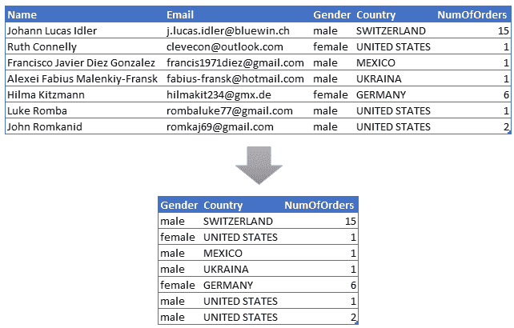

图 6.1 – 匿名化，信息删除

很明显，这种简单方法的缺点之一可能是最终数据集不再符合必须消费它的应用程序预期的模式。

#### 数据掩码

**数据掩码**隐藏了特定角色的用户不应看到的信息。这可能包括使用单词或字符替换修改数据。例如，你可以用一个符号，如`*`或`x`来替换一个值字符。以下是一个典型的数据掩码示例：

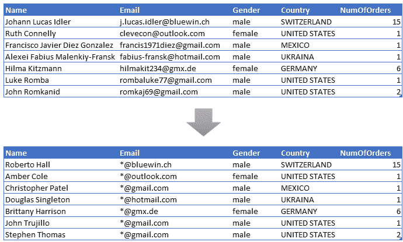

图 6.2 – 匿名化，数据掩码

请记住，如果电子邮件地址中可读的域名不是公开的，而是属于一个可识别的法律实体，那么应用的数据掩码不符合 GDPR 规则，因为工作场所变得可识别。

一些产品自带**动态数据掩码**解决方案。这些根据用户的角色、位置和权限屏蔽或阻止敏感信息。

> **注意**
> 
> 例如，**Microsoft SQL Server**和**Azure SQL Database**提供动态数据掩码作为避免向未经授权的用户暴露敏感数据的解决方案。数据库中的数据没有改变，因为掩码规则是在查询结果中应用的。

#### 数据交换

**数据交换**是指在整个数据集中对包含敏感数据的列的值进行洗牌。例如，如果你有一个包含个人出生日期的列，这完全可以使用交换技术匿名化，并取得非常好的效果。

#### 泛化

**泛化**是指用表示更广泛类别的其他值替换点值，该类别包含初始值。例如：

+   一个`25`岁的*年龄*可以转换为`>=18`，或*在 18 到 30 岁之间*。

+   一个像`04/11/1989`这样的*出生日期*可以被替换为*出生年份* `1989`。

+   一个*邮政编码*可以被更广泛的*区域邮政编码*所替代。

#### 数据扰动

**数据扰动**是一种技术，通过添加一些随机噪声或创建合成数据来替换原始值。这种转换导致信息丢失，使得数据本身变得无用。

#### 令牌化

**令牌化**是一种技术，用随机生成的字母数字值替换原始敏感值，称为**令牌**。完全随机的令牌提供最高的安全性，因为内容无法被重新工程。背后没有数学算法可以通过逆变换来获取原始值。因此，令牌与原始值之间的关联通常在安全的数据库中维护，并且令牌通常由特定的令牌服务器生成。只有令牌服务器与令牌数据库通信。

#### 哈希

**哈希**是一种类似于令牌化的技术，区别在于生成的*令牌*，称为**哈希值**，是由数学算法生成的，具有固定长度，几乎不可能转换回原始值。如果你使用相同的哈希函数和相同的输入值，你总是会得到相同的哈希值作为输出。通常，还会添加一些额外的文本，称为*盐*，以使输入值更复杂，从而使得暴力攻击逆向工程哈希值更加困难。

#### 加密

与哈希类似，**加密**使用数学算法来转换敏感数据。与哈希不同，它是一种双向转换，需要解密密钥来逆向工程加密值。使用加密映射表可以在解密数据时提高性能。

大多数生产力工具和数据库系统现在都内置了端到端加密功能。

> **注意**
> 
> 两个例子是 Microsoft SQL Server 或 Azure SQL 数据库，它们自带了*始终加密*功能。它通过在客户端加密数据并隐藏服务器上的加密密钥来实现。即使数据库管理员在没有明确权限的情况下也无法读取加密列中存储的信息。

现在你已经了解了用于去识别敏感信息最常见的转换方法，你将看到它们在匿名化和匿名化中的应用。

### 理解匿名化

**匿名化**是一种去识别过程，它将直接或间接的标识符与数据的其他部分分开，同时注意确保以下内容：

+   用**假名**（一个随机真实姓名，但更常见的是随机数字或字母数字标识符）替换一个或多个 PII，确保主体不被识别。由于假名对于相同的输入始终相同，因此保证了分析相关性。因此，对匿名化数据的分析不会失去价值。

+   不销毁原始 PII，确保整个数据集可以通过，例如，PII 和化名之间的查找表或数字密钥来重建（数据重新识别）。

+   采取适当的技术和组织措施，使从剩余数据中追踪个人的身份变得困难。

在此过程中，可以对一些你希望在可访问数据中保留的 PII 进行去标识化转换。例如，你可以用看起来相似的化名替换 PII 值，同时确保跟踪替换，以保证重新识别。

匿名化过程的示例显示在*图 6.2*中，其中使用查找表来保证逆转换的映射：

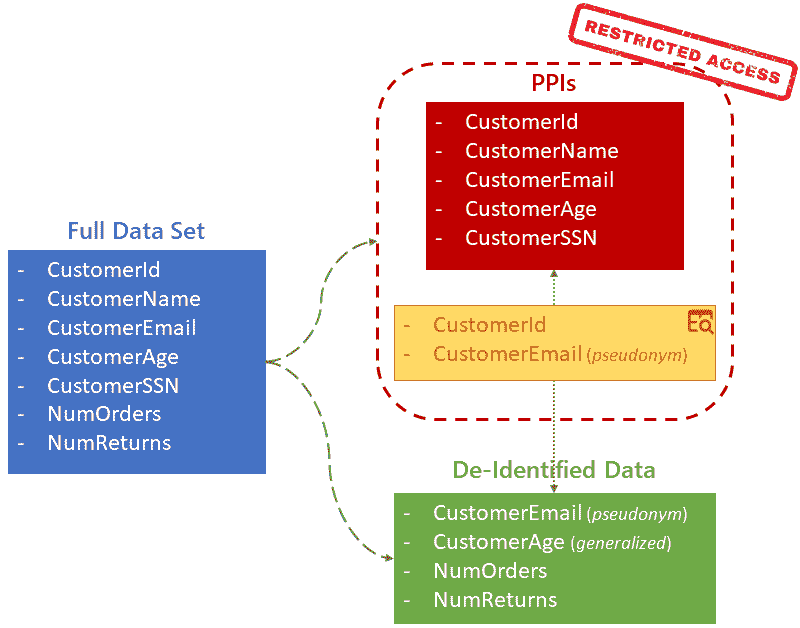

图 6.3 – 匿名化过程

这种类型的架构还保证了满足个人删除个人数据请求（如 GDPR 所要求的）的可能性，以下条件必须满足：

+   从那一刻起，仅通过从查找表中删除与它相关的关联，将无法识别该主体。

+   将避免完全丢失对数据分析有用的统计信息，因为可以使用不消除分析相关性的去标识化转换。

> **重要提示**
> 
> 请记住，当你**永久失去**一行可访问数据及其相应 PPI 之间的链接时，该行就变得**完全匿名化**，从而脱离 GDPR 的控制。

因此，我们引入了匿名化的概念。让我们看看这意味着什么。

### 什么是匿名化？

**匿名化**完全销毁直接和间接标识符，或者销毁与去标识化对应方的链接，因此不存在任何危险（或者至少是非常不可能的）任何攻击者能够重建数据所涉及主体的身份。它以**过程的不可逆性**为主要目标。因此，以下适用：

> **重要提示**
> 
> 匿名化数据超出了 GDPR 的范畴和控制，因为匿名化数据已不再是**个人数据**。

匿名化的最明显缺点是它从涉及的数据中移除了显著的价值。这是因为，在过程完成后，无法追踪生成这些数据的人的身份。因此，在匿名化任何数据集之前评估所有相关风险是明智的。

匿名化的第二个缺点是它通常使用随机生成的去标识化字符串，因此**数据集的一些统计信息将永久丢失**，使得数据科学家所做的任何工作都变得徒劳。

匿名化数据可能容易受到**去匿名化攻击**的影响。这些攻击包括通过可用外部信息丰富匿名化数据集，从而推断匿名化项。由于匿名化数据丰富、粒度细、随时间和上下文相对稳定，因此这些攻击更有可能成功。

通常，用于安全匿名化的最常用的去标识化技术如下：

+   令牌化

+   加密

现在我们来看看如何使用 Power BI 将这些概念应用于实际案例。

## 在 Power BI 中匿名化数据

在你作为 Power BI 报告开发者的职业生涯中可能会遇到以下一种可能的场景。想象一下，你被分配了一个**Excel**数据集，需要将其导入 Power BI 以创建一个报告展示给公司另一个部门。该 Excel 数据集包含敏感的个人数据，例如多次尝试用信用卡支付订单的人的姓名和电子邮件地址。以下是 Excel 文件内容的示例：

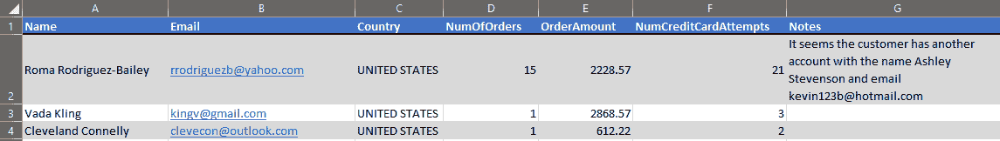

图 6.4 – 待匿名化的 Excel 数据

在匿名化敏感数据的同时，你会被要求创建报告。

第一眼就能注意到的是，你不仅需要匿名化**姓名**和**电子邮件**列，而且一些姓名或电子邮件地址可能包含在某些**备注**的文本中。虽然使用正则表达式定位电子邮件地址相对容易，但在自由文本中定位人名则不那么容易。为此，有必要采用一种名为**自然语言处理**（**NLP**）的技术，该技术被称为**命名实体识别**（**NER**）。多亏了 NER，我们可以在自由文本中识别和分类命名实体（如人名、地点等）。

基本思想是将全名和电子邮件地址都替换为随机**令牌**。根据所使用的分析语言，有不同解决方案，由不同包提供，但都导致相同的结果。

### 使用 Python 匿名化数据

Python 是在匿名化过程中执行去标识化转换最广泛使用的语言之一。有大量的包实现了这样的解决方案。特别是，微软发布了开源包 **Presidio** ([`microsoft.github.io/presidio/`](https://microsoft.github.io/presidio/))，迄今为止，它是数据保护和匿名化方面最好的解决方案之一。它为在自由文本和图像中发现的实体提供快速识别和匿名化形式，例如信用卡号码、姓名、位置、社会保险号码、电子邮件地址、财务数据等。**PII 识别器** 通过在多种语言中识别相关上下文，利用 NER、正则表达式、基于规则的逻辑和校验和。幕后，Presidio 采用 NLP 引擎来识别实体——它支持 **SpaCy**（默认）和 **Stanza**。Presidio 最有趣的功能之一是其 *可扩展性*。实际上，通过添加 *自定义 PII 实体* 可以非常容易地扩展 Presidio 分析器。

一旦识别出敏感实体，您需要用令牌替换它们。这些令牌是在 Python 中使用 `secrets` 模块生成的。

也就是说，您可以在随书提供的 GitHub 仓库的 `Chapter06` 文件夹中的 Python 文件 `01-anonymize-data-in-power-bi-python.py` 中找到这个实现的实现。它执行以下操作：

1.  加载执行代码所需的库。您将使用 `pandas` 模块，`presidio_analyzer` 和 `presidio_anonymizer` 模块的一些函数，以及 `secrets` 模块。

1.  定义两个自定义函数，一个用于匿名化电子邮件，另一个用于匿名化个人姓名。这两个函数都使用 `analyzer.analyze()` Presidio 函数来识别需要匿名化的实体，并使用 `secrets` 模块生成令牌到 `anonymizer.anonymize()` 函数中。

1.  初始化 **Presidio 分析器** 和 **Presidio 匿名化器** 的主要对象。

1.  对于之前在 Power BI Desktop 中加载的数据集的每一行（或者如果您想在 **VSCode** 中测试代码，则通过 `pandas` 的 `read_excel()` 函数），将 `anonymizeEmail` 函数应用于 `Email` 和 `Notes` 列，并将 `anonymizeName` 函数应用于 `Name` 和 `Notes` 列。为了将函数应用于列中的每个单独值，我们采用了 `apply()` 函数，后面跟着一个名为 **lambda 函数** 的结构（由关键字 `lambda` 引入）。这是一个没有名称（匿名）的小函数，用于内联使用。以下是一个示例：

    ```py
    df.Name = df.Name.apply(lambda x: anonymizeName(x))
    ```

为了继续进行，然而，有必要配置一个新的**Python 环境**。这是因为，截至目前，Presidio 仅支持 Python 3.6 到 3.8 版本。您的 `pbi_powerquery_env` 环境安装了更新的 Python 版本，因此您需要创建一个新的环境，并使用 Python 3.8。一旦创建，您必须安装运行代码所需的模块。

配置新环境所需的步骤如下：

1.  打开您的 **Anaconda Prompt**。

1.  输入并运行以下代码以创建新的 `presidio_env` 环境并使用 Python 3.8：

    ```py
    conda create --name presidio_env python=3.8
    ```

1.  输入并运行以下代码以切换到新创建的环境：

    ```py
    conda activate presidio_env
    ```

1.  输入并运行以下代码以安装 Presidio 分析器：

    ```py
    pip install presidio_analyzer
    ```

1.  输入并运行以下代码以安装 Presidio 匿名化器：

    ```py
    pip install presidio_anonymizer
    ```

1.  分析器在幕后还安装了 SpaCy。因此，您还必须使用此代码安装 SpaCy 的 *训练有素的英文文本管道*（我们选择用于博客、新闻和评论的那个）：

    ```py
    python -m spacy download en_core_web_lg 
    ```

    这是 SpaCy 使用的最大管道，占用大约 788 MB。

1.  输入并运行以下代码以安装 **pandas**：

    ```py
    pip install pandas
    ```

1.  如果您想使用 pandas 直接用 Python 加载 Excel 并在将其输入 Power BI 之前测试代码，您还需要 `openpyxl` 模块：

    ```py
    pip install openpyxl
    ```

1.  输入并运行以下代码以安装 `matplotlib`，这是与 Python 脚本一起使用的 Power BI 包装器所需的：

    ```py
    pip install matplotlib
    ```

现在，您已经准备好在 Power BI 中对 `Chapter06` 文件夹中找到的 `CustomersCreditCardAttempts.xlsx` Excel 文件的内容应用匿名化。

那么，让我们开始吧：

1.  打开您的 Power BI Desktop。确保引用的 Python 环境在选项中是 `presidio_env`（其主目录应为 `C:\Users\<your-username>\miniconda3\envs\presidio_env`）。请记住，如果您找不到特定环境的路径，请在 Anaconda Prompt 中激活它（`conda activate <your-env>`），然后输入 `where python`。

1.  从功能区，点击 **Excel** 图标以从 Excel 导入数据：

    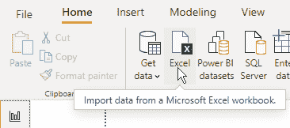

    图 6.5 – 从 Excel 导入数据

1.  从 **Open** 对话框，选择上述 `CustomersCreditCardAttempts.xlsx` 文件。

1.  从 **Navigator** 窗口，选择 `Customers` 工作表，然后点击 **Transform Data**：

    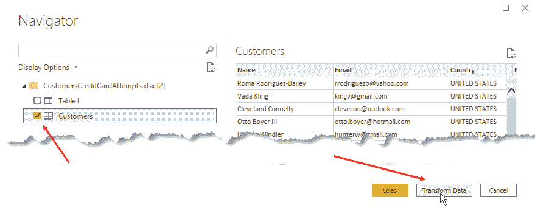

    图 6.6 – 选择 Customers 工作表并点击 Transform Data

1.  点击 **Transform** 菜单，然后点击 **Run Python Script**。

1.  将 `01-anonymize-data-in-power-bi-python.py` 文件中的脚本复制到 Python 脚本编辑器中，然后点击 **OK**。

1.  如果 Power BI 需要您提供数据隐私信息，您已经知道如何根据您在 *第五章* 中看到的，使用 Power BI 中的正则表达式来操作。

1.  我们只对 `df` 数据集感兴趣。因此，点击其 **Table** 值：

    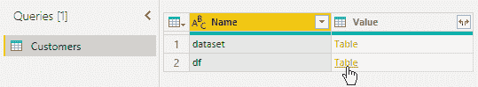

    图 6.7 – Python 脚本转换结果选择数据集 df

1.  如您所见，`Name` 和 `Notes` 列中的人名以及 `Email` 和 `Notes` 列中的电子邮件地址已经正确进行了匿名化：

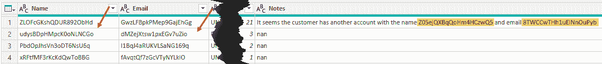

图 6.8 – Python 脚本转换结果的数据集

您现在可以点击 **主页** 选项卡中的 **关闭并应用**。

注意到 `Notes` 列中包含的人名也已经进行了匿名化。这是应用 **SpaCy** 引擎使用的 NER 算法的结果，该引擎在 Presidio 的底层运行。

此外，所使用的去标识化技术（分词）并不保留数据集的统计特性，因为将程序应用于相同的个人数据不会返回相同的去标识化字符串。

> **注意**
> 
> 当您发布已经对数据进行匿名化的报告时，相应的数据集也将被发布。只能访问数据集（而不能访问源 Excel 文件）的用户将只能看到匿名化数据，而没有能力了解被替换的原数据之间的关联。

多亏了匿名化，现在您可以在不担心暴露敏感数据风险的情况下开发您的报告。

让我们看看如何在 R 中做同样的事情。

### 使用 R 匿名化数据

您同样可以在 R 中实现数据匿名化过程。只要您在 R 中使用正则表达式识别字符串，处理速度就相当快。然而，当需要实现自然语言处理技术，如命名实体识别（NER）时，最广泛采用的 R 包通常是由其他语言开发的开源模块的包装。例如，**openNLP** R 包是 **Apache OpenNLP** 工具包的接口，基于用 **Java** 编写的机器学习算法。为了让 `openNLP` 包与 **OpenNLP** 软件接口，其安装还需要作为依赖项安装 `rJava` 包，该包使得 R 和 Java 世界之间能够进行对话。

为了在 R 中实现上一节中在 Python 中开发的相同匿名化功能，你将使用另一个广泛使用的 R 包，用于 NLP 操作，称为`spacyr`。这个库提供了一个方便的 R 包装器，围绕 Python 的`spacy`模块。在上一节中，你看到名为`presidio`的 Python 模块在幕后安装了与`spacyr`相同的`spacy`模块。如果你想知道如何从 R 模块中运行 Python 代码，请记住，在*第三章*，*配置 Power BI 中的 Python*，你通过名为`reticulate`的 R 包使用**RStudio**运行了 Python 代码。正如`rJava`负责处理 R 与 Java VM 的接口一样，`reticulate`允许 R 与 Python 环境接口并执行 Python 代码。简而言之，你将要开发的 R 代码所做的不过是执行你在上一节中使用的`spacy` Python 模块的功能。

> **注意**
> 
> 记住，你可以使用正则表达式将电子邮件地址替换为虚拟数据。相反，在自由文本中替换人名只能使用一个识别命名实体的 NLP 函数。因此，需要使用像`spacyr`这样的包。

正如你在上一节中所做的那样，这里你也将通过分词来匿名化 Excel 文件`CustomersCreditCardAttempts.xlsx`的内容。在 R 中，将使用`stringi`包生成标记。

话虽如此，你可以在`Chapter06`文件夹中找到的`02-anonymize-data-in-power-bi-r.R`文件中的 R 代码执行以下操作：

1.  加载执行代码所需的库。特别是，你将使用`Tidyverse`中的`stringr`、`dplyr`和`purrr`进行数据处理；`spacyr`和`stringi`用于数据匿名化。

1.  定义用于将电子邮件匿名化到自由文本的`anonymizeEmails`函数。它使用`spacyr`函数的`spacy_parse()`，并附加`like_email`属性。由于它可以识别单个文本中的多个电子邮件地址，因此使用`str_replace_all()`函数将所有找到的实例替换为`stringi`包的`stri_rand_strings`函数生成的标记。

1.  定义用于将人名匿名化到自由文本的`anonymizeNames`函数。它包含比上一个函数更复杂的逻辑，因为一个人的名字可以由多个标记组成，这些标记不一定总是由空格分隔（例如，名字`Roma Rodriguez-Bailey`）。因此，为了识别指向单个个人的所有标记的集合，我们必须构建一个引用第一个和最后一个标记的正则表达式（例如，`Roma.*?Bailey`），它能够匹配整个名字。正如你所看到的，在上一节中不需要实现所有这些逻辑，因为 Python Presidio 模块处理了所有这些情况。

1.  你必须初始化`spacyr`，使其引用一个包含已安装`spacy`模块的 Python 环境。通常，如果你还没有在一个环境中安装`spacy`，你可以使用`spacyr`的`spacy_install()`函数，该函数设置一个新的 Python 环境，包含使它正常工作的所有必需内容。在我们的案例中，我们已经在上一节中创建了 Python 环境`presidio_env`，其中包含`spacy`模块和用于从网络中提取语言属性的已训练的`en_core_web_lg`模型。然后，只需在`spacy_initialize()`函数中引用环境`presidio_env`的路径，就可以正确配置`spacyr`。以下是代码：

    ```py
    spacy_initialize(
      model = "en_core_web_lg",
      condaenv = r"{C:\Users\<your-username>\miniconda3\envs\presidio_env}",
      entity = TRUE
    )
    ```

    如果你在 RStudio 中运行它，如果一切正常，你会得到以下类似的消息：

    ```py
    successfully initialized (spaCy Version: 2.3.0, language model: en_core_web_lg)
    (python options: type = "condaenv", value = "C:\Users\<your-username>\miniconda3\envs\presidio_env")
    ```

1.  对于之前在 Power BI 中加载的（或使用`readxl`包在 RStudio 中测试代码）数据集的每一行，将`anonymizeEmail`函数应用于`Email`和`Notes`列，将`anonymizeName`函数应用于`Name`和`Notes`列。为了将之前定义的两个函数应用于列中的每个元素，我们使用了`purrr`包的`map()`函数。更具体地说，`map_chr()`返回字符串向量的输出，以便它可以替换列内容。

简要解释了 R 脚本的用途后，让我们开始正事。为了使用`spacyr` R 包，它必须在最新的 R 引擎（在我们的案例中是 MRO 4.0.2）中安装。以下是必要的步骤：

1.  打开**Rstudio**，并确保在**全局选项**中按照*第二章*，*配置 Power BI 中的 R*的步骤选择你已安装的最新 MRO 引擎。

1.  由于 MRO 按照定义会从默认的**CRAN（综合 R 档案网络）**快照中下载新包，为了下载`CRAN`中的最新版本包，你需要运行以下代码来覆盖引用的仓库：

    ```py
    local({
      r <- getOption("repos")
      r["CRAN"] <- "https://cloud.r-project.org/"
      options(repos = r)
    })
    ```

1.  然后，在控制台中运行以下代码来安装`spacyr`包：

    ```py
    install.packages("spacyr")
    ```

你现在可以使用 R 在 Power BI 中对`CustomersCreditCardAttempts.xlsx` Excel 文件的内容进行匿名化。

那么，让我们开始吧：

1.  打开你的 Power BI 桌面版，并确保在**全局选项**中引用的 R 引擎是最新版本的 MRO。

1.  从功能区点击**Excel**图标以从 Excel 导入数据。

1.  从**打开**对话框中，选择上述的`CustomersCreditCardAttempts.xlsx`文件。

1.  从**导航器**窗口中，选择**客户**表，然后点击**转换数据**：

    

    图 6.9 – 选择客户表并点击转换数据

1.  点击**转换**菜单，然后点击**运行 R 脚本**。

1.  将`02-anonymize-data-in-power-bi-r.R`文件中的脚本复制到 R 脚本编辑器中，并点击**确定**。请记住更改你机器的环境路径。

1.  如果 Power BI 需要你提供数据隐私信息，你根据在*第五章*中看到的，*在 Power BI 中使用正则表达式*，已经知道如何操作。

1.  我们只对`df`数据集感兴趣。因此，点击其**表**值：

    

    图 6.10 – R 脚本转换结果选择数据集 df

1.  正如你所见，`Name`和`Notes`列中的人名以及`Email`和`Notes`列中的电子邮件已经正确匿名化：

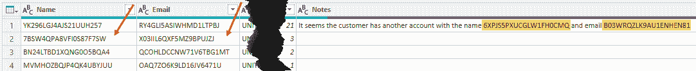

图 6.11 – R 脚本执行结果转换后的数据集

你可以在**主页**选项卡中点击**关闭并应用**。

正如你所见，执行 R 脚本的时间比 Python 脚本长。显然，通过`reticulate`传递信息产生的开销造成了差异。

> **重要提示**
> 
> 如果你需要匿名化一个不太大的数据集，建议直接使用 Python 脚本进行，以获得更好的性能。

再次强调，本报告发布的数据集将仅包含匿名化数据，不会赋予 Power BI 用户检索原始数据的能力。

现在我们来看看如何在 Power BI 中实现数据的匿名化。

## Power BI 中的数据匿名化

与匿名化不同，匿名化通过将相同的输入字符串转换为相同的输出字符串来保持数据集的统计特性，并跟踪发生的替换，允许那些有权访问此映射信息的人重新获得原始数据集。

此外，匿名化通过将敏感数据替换为与原始数据具有相同**形式**的**虚假字符串**（**假名**），使得去标识化数据更加真实。

根据所使用的分析语言，有不同解决方案，由不同包提供，但最终达到相同的结果。让我们看看如何将 Power BI 中的匿名化应用于之前章节中使用的 Python 的同一 Excel 文件内容。

### 使用 Python 进行数据匿名化

你将使用的模块和代码结构与之前用于匿名化的那些非常相似。一个不同之处在于，一旦识别出敏感实体，它们就会被相同类型的虚假实体所替代。Python 中出类拔萃的虚假数据生成器有两个：**Faker** ([`faker.readthedocs.io/`](https://faker.readthedocs.io/)) 和 **Mimesis** ([`mimesis.readthedocs.io/`](https://mimesis.readthedocs.io/))。在我们的例子中，我们将使用 Faker，它受到了之前为 **PHP**、**Perl** 和 **Ruby** 开发的同名库的启发。

此外，变化的是用于去识别实体的两个自定义函数的逻辑，以及添加了两个字典（`emails_dict` 和 `names_dict`）的管理，以维护个人数据与虚假数据之间的映射。

我们还在处理虚假数据方面添加了一些“盐” – 考虑到数据集中每个个体的国家，生成人员姓名和电子邮件地址，将其作为自定义函数中的参数传递。例如，如果个人是德国人，生成的姓名将是典型的德国姓名。

让我们详细看看这是怎么回事。相关的 Python 文件是 `03-pseudonymize-data-in-power-bi-python.py`，您可以在 `Chapter06` 文件夹中找到它：

1.  在匿名化的情况下，使用了 `anonymizer.anonymize()` 函数一次性替换了使用 `analyzer.analyze()` 函数识别的所有实体。现在，在相同的实体识别之后，我们必须 **首先检查每个已识别的单个实体是否已经映射到一个虚假字符串**。如果实体在其特定的字典中，您将检索相关的虚假字符串并使用它来匿名化文本。否则，您将生成一个新的虚假字符串并将其添加到字典中，将其与相关的实体关联。

1.  当所有预期列的匿名化完成时，映射字典（包括名称和电子邮件）将持久化到 `pkl` 文件中。这些字典在需要匿名化新的 Excel 数据以及数据集每次刷新时都会被解包并用作映射字典。这确保了相同的化名始终用于相同的个人数据，以及新的 Excel 行。

为了使用之前提到的 `faker` 模块，您需要以下方式在 `presidio_env` 环境中安装它：

1.  打开您的 Anaconda Prompt。

1.  输入并运行以下代码以切换到新创建的环境：

    ```py
    conda activate presidio_env
    ```

1.  输入并运行以下代码以安装 `Faker`：

    ```py
    pip install Faker
    ```

完成此操作后，您可以在 Power BI 中开始实施匿名化：

1.  打开您的 Power BI Desktop，确保引用的 Python 环境是 `presidio_env` 在 **选项** 中（其主目录应为 `C:\Users\<your-username>\miniconda3\envs\presidio_env`）。

1.  从 Power BI 菜单栏中，点击 **Excel** 图标以从 Excel 导入数据。

1.  从 **打开** 对话框中，选择上述 `CustomersCreditCardAttempts.xlsx` 文件。

1.  从 **导航器** 窗口中，选择 **客户** 工作表，然后点击 **转换数据**：

    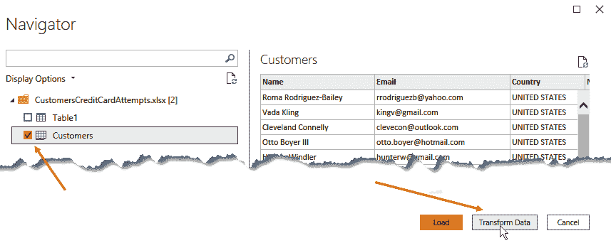

    图 6.12 – 选择客户工作表并点击转换数据

1.  点击 **转换** 菜单，然后点击 **运行 Python 脚本**。

1.  将 `03-pseudonymize-data-in-power-bi-python.py` 文件中的脚本复制到 Python 脚本编辑器中，然后点击 **确定**。请记住更改您机器的环境路径。

1.  如果 Power BI 需要您提供数据隐私信息，您已经知道如何根据您在*第五章*，*在 Power BI 中使用正则表达式*中看到的内容进行操作。

1.  我们只对`df`数据集感兴趣。因此，点击其**表**值：

    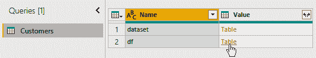

    图 6.13 – 选择 Python 脚本转换后的数据集 df

1.  如您所见，`Name`和`Notes`列中的人名和`Email`和`Notes`列中的电子邮件已经被正确地匿名化：

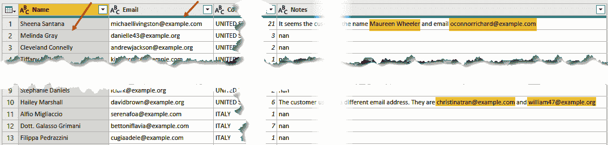

图 6.14 – Python 脚本转换后的数据集

然后，您可以在**主页**选项卡中点击**关闭并应用**。

就像匿名化一样，`Name`、`Email`和`Notes`列已经被正确地去标识化。除此之外，我们还有以下内容：

+   人的名字和电子邮件与个人国家的相一致性，尽管`Faker`目前不允许您在生成的名字和相应的电子邮件之间保持一致性。例如，在*图 6.14*中，您可以看到第 11 行（名字*Alfio Migliaccio*未用于电子邮件）使用了一个不同的意大利名字的意大利名字和电子邮件。

+   使用`emails_dict`和`names_dict`映射字典确保可以对匿名化数据集进行统计分析。

+   之所以能够追踪原始数据，归功于这些持久化到磁盘的映射字典。

在这种情况下，当您将报告发布以与 Power BI 用户共享时，您有以下内容：

> **注意**
> 
> 只能访问数据集的 Power BI 用户将只能看到去标识化的数据。通过向具有正确权限的人提供映射字典，您确保他们可以在任何法律需求下追踪原始数据。

你注意到吗，由于 Python 脚本，您能够将 Power BI 中执行的数据处理结果写入文件吗？

> **注意**
> 
> 与在 PKL 文件中使用序列化字典不同，例如，您可以将信息写入**CSV**或 Excel 文件。

简而言之，您有在 Power BI 之外记录信息的能力。您将在*第七章*，*从 Power BI 到外部存储库记录数据*中了解更多关于这种可能性。

现在我们来看看如何在 R 中实现匿名化。

### 使用 R 进行数据匿名化

我们将在 R 中用于数据匿名化的库与用于 R 中匿名化的库非常相似。为了完全模拟前一小节中开发的 Python 脚本的功能，我们还需要一个 R 包来生成*假数据*以替换*敏感数据*，例如人名和电子邮件地址。在 Python 中，我们使用了 Faker 模块，这是该目的最广泛使用的模块之一。在 R 中，也开发了一个具有相同功能的包，它受到了与 Faker 相同的代码的启发，并被称为**charlatan** ([`github.com/ropensci/charlatan`](https://github.com/ropensci/charlatan))。此外，R 中匿名化的代码将遵循前一小节中 Python 脚本中已实现的相同逻辑，以下是一些细微的差异：

+   与字典不同，命名列表用于将化名映射到原始实体。

+   命名列表被序列化和持久化在**RDS**文件中，而不是**PKL**文件中。

为了使用`charlatan` R 包，它必须在最新的 R 引擎（在我们的案例中，MRO 4.0.2）中安装。以下是必须遵循的步骤：

1.  打开 Rstudio，并确保在**全局选项**中选择你按照*第二章*，*配置 R 与 Power BI*中步骤安装的最新 MRO 引擎。

1.  由于 MRO 按照定义会从默认的 CRAN 快照中下载新包，为了下载 CRAN 中包的最新版本，你需要通过运行以下代码来覆盖引用的存储库：

    ```py
    local({
      r <- getOption("repos")
      r["CRAN"] <- "https://cloud.r-project.org/"
      options(repos = r)
    })
    ```

1.  然后，在控制台中运行以下代码来安装`charlatan`包：

    ```py
    install.packages("charlatan")
    ```

现在，你已准备好使用 R 在 Power BI 中对`CustomersCreditCardAttempts.xlsx` Excel 文件的内容应用匿名化。让我们开始吧：

1.  打开你的 Power BI 桌面版，并确保在**全局选项**中引用的 R 引擎是你的最新 MRO 版本。

1.  从功能区点击**Excel**图标以从 Excel 导入数据。

1.  从**打开**对话框中，选择上述`CustomersCreditCardAttempts.xlsx`文件。

1.  从**导航器**窗口中，选择**客户**表，然后点击**转换数据**：

    

    图 6.15 – 选择客户表并点击转换数据

1.  点击**转换**菜单，然后点击**运行 R 脚本**。

1.  将`04-pseudonymize-data-in-power-bi-r.R`文件中的脚本复制到 R 脚本编辑器中，并点击**确定**。请记住在代码中更改所需的路径。

1.  如果 Power BI 需要你提供数据隐私信息，你已经知道如何根据你在*第五章*，*在 Power BI 中使用正则表达式*中看到的进行操作。

1.  我们只对`df`数据集感兴趣。因此，点击其**表**值：

    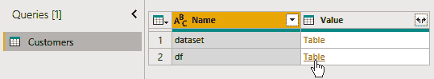

    图 6.16 – R 脚本转换的结果选择数据集 df

1.  如你所见，`Name`和`Notes`列中的人名以及`Email`和`Notes`列中的电子邮件已经正确匿名化：

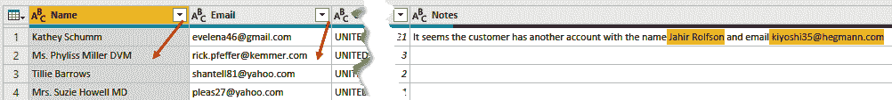

图 6.17 – R 脚本转换的结果转换后的数据集

然后，你可以在**主页**选项卡中点击**关闭并应用**。

不幸的是，charlatan 目前还不支持`it_IT`区域设置。但是，由于它是一个开源项目，社区可能会很快实现它。然而，这并不会阻止我们获得非常好的数据集和将在 Power BI 服务上发布的报告的脱敏化，因为，在没有特定区域设置的情况下，始终使用默认的区域设置（`en_US`）。

据说，在 R 中实现去标识化程序的性能肯定不如 Python。然而，可以通过引入多任务操作的并行化来部分弥补这一差距。我们将在第八章中详细探讨这项技术，即*调用外部 API 以丰富您的数据*。

## 摘要

在本章中，你学习了匿名化和脱敏化之间的主要区别。你还学习了哪些技术最常用于采用这两种去标识化过程。

你还使用 Python 和 R 在 Power BI 中应用了通过标记化进行的匿名化过程，以及通过生成相似的假名进行的脱敏化过程。

在下一章中，你将学习如何将使用**Power Query**在 Power BI 中执行的操作生成的数据记录到外部存储库。

## 参考文献

对于额外的阅读，请参阅以下书籍和文章：

1.  *脱敏化、匿名化和 GDPR* ([`www.termsfeed.com/blog/gdpr-pseudonymization-anonymization/`](https://www.termsfeed.com/blog/gdpr-pseudonymization-anonymization/))

1.  *对称和不对称加密* ([`medium.com/hackernoon/symmetric-and-asymmetric-encryption-5122f9ec65b1`](https://medium.com/hackernoon/symmetric-and-asymmetric-encryption-5122f9ec65b1))

1.  *Python 密码学教程* ([`www.tutorialspoint.com/cryptography_with_python/`](https://www.tutorialspoint.com/cryptography_with_python/))

1.  *使用 cyphr 在 R 中进行加密* ([`docs.ropensci.org/cyphr/articles/cyphr.html`](https://docs.ropensci.org/cyphr/articles/cyphr.html))
