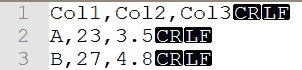
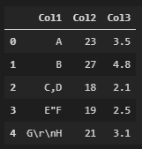
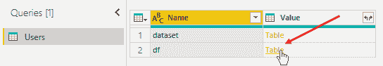
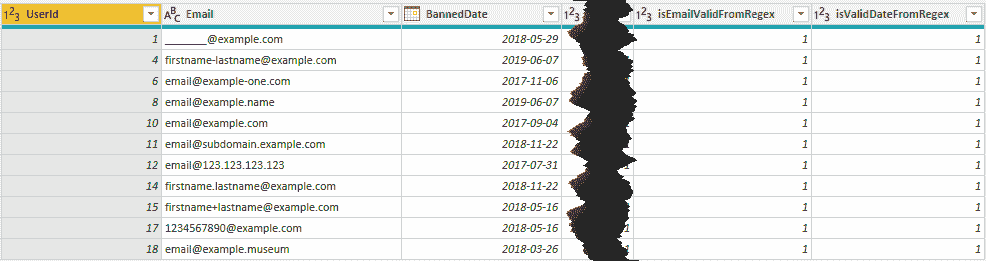

# 第八章：7 从 Power BI 记录数据到外部源

如您从前几章所学，**Power BI** 使用 **Power Query** 作为 **提取、转换、加载** （**ETL**）操作的工具。这个工具实际上非常强大——它允许您从各种数据源中提取数据，然后通过非常用户友好的选项轻松转换它，以便将其持久化到 Power BI 数据模型中。这是一个只能从外部读取信息的工具。实际上，Power Query 最严格的限制是其无法将信息写入 Power BI 之外。然而，由于与 **Python** 和 **R** 等分析语言的集成，您将能够将 Power Query 加载和转换过程的信息持久化到外部文件或系统中。在本章中，您将学习以下主题：

+   记录到 **CSV** 文件

+   记录到 **Excel** 文件

+   记录到 **Azure** **SQL Server**

## 技术要求

本章要求您拥有一个正常工作的互联网连接，并且您的机器上已经安装了 **Power BI Desktop**。您必须已按照 *第二章*、*配置 Power BI 中的 R* 和 *第三章*、*配置 Power BI 中的 Python* 中概述的方式正确配置了 R 和 Python 引擎和 IDE。

## 记录到 CSV 文件

将表格结构化信息记录到文件的格式中，最广泛使用的一种是 **逗号分隔值** （**CSV**）。由于 CSV 文件仍然是平面文本文件，CSV 是在异构应用程序之间交换信息最流行的格式。

CSV 文件是矩形数据集（**矩阵**）的表示，包含数字或字符串列。矩阵的每一行由一系列值（每列一个）表示，这些值由逗号分隔，并且应该有相同数量的值。有时，可以使用其他值分隔符，如制表符（`\t`）、冒号（`:`）和分号（`;`）字符。第一行可能包含列标题名称。通常，使用由 **CRLF** （**回车换行符**）字符（通常输入为 `\r\n`）或简单地使用 Unix 系统中的 **LF** （`\n`）创建的 **换行符** 作为 **行分隔符**。因此，CSV 文件内容的示例可能如下所示：



图 7.1 – CSV 文件内容的示例

注意空格，因为它们成为字符串值的一部分！例如，`V1, V2` 行的第二个值将是 `[空格]V2`。

可能会发生字符串值包含换行符（`CRLF`）、双引号或逗号（如通常在“注释”等自由文本字段中发生的情况）。在这种情况下，值应该用双引号括起来，并且任何字面双引号必须使用另一个双引号进行转义。例如，对于 `Col1` 列的值 `"` `C,D"`、“`E""F`” 和 `"G[CRLF]H"` 在 CSV 文件中的格式如下所示：


图 7.2 – 包含逗号、双引号或 CRLF 的 CSV 值示例

> **重要提示**
> 
> 重要的是要记住，CSV 文件本身没有大小限制。

由于它是一个平面文本文件，其最大大小由文件系统施加的限制决定。例如，Windows 的默认文件系统是**新技术文件系统**（**NTFS**），其当前实现允许的最大文件大小为*16 TB*。然而，其设计的理论极限是*16 EB*（16 × 2⁶⁴字节）减去*1 KB*。

然而，旧的**文件分配表**文件系统，在其 32 位（**FAT32**）变体中，只能处理最大大小为*4 GB*。

> **重要提示**
> 
> 请记住，处理大型 CSV 文件会导致内存和/或 CPU 瓶颈。如果待加载的 CSV 文件大小超过您可用的 RAM，并且您的库不使用并行性/分布式/延迟加载机制，那么您很可能遇到`OutOfMemory`错误。您将在*第八章*，*在 Power BI 中加载超过可用 RAM 的大型数据集*中学习如何处理这样的大型 CSV 文件。

让我们看看如何使用 Python 读取和写入 CSV 文件。

### 使用 Python 记录到 CSV 文件

Python 有一个内置的 CSV 模块，它提供了一些读取和写入 CSV 文件的功能。然而，非常常见的情况是，您需要导入一个 CSV 文件，其内容将通过 Pandas 函数进行转换，或者您必须将之前通过 Pandas 处理过的 DataFrame 以 CSV 格式导出。这就是为什么在这些情况下，直接使用内置的 pandas 函数与 DataFrame 对象一起使用要方便得多。您可以在`Chapter07/Python`文件夹中找到`01-read-csv-file-in-python.py`和`02-write-csv-file-in-python.py`文件，这些文件将向您展示如何使用 CSV 模块。在下一节中，我们将专注于 pandas 提供的功能。

让我们详细看看可用于处理 CSV 文件的 pandas 函数。

#### 使用 pandas 模块

`pandas`模块提供的用于读取和写入 CSV 文件的功能非常简单直接。您可以使用`read_csv()`函数从 CSV 文件中读取数据。以下是可以将`example.csv`文件的内容加载到 DataFrame 中的代码：

#### `Chapter07\Python\03-read-csv-file-with-pandas.py`

```py
import pandas as pd
data = pd.read_csv(r'D:\<your-path>\Chapter07\example.csv')
data.head(10)
```

这里是使用**VS Code** **交互窗口**的输出：



图 7.3 – 使用示例 CSV 文件内容加载的 pandas DataFrame 的输出

`read_csv`函数还允许您传递`sep`参数来定义在读取文件时使用的值分隔符。

如果您需要从 DataFrame 的内容中写入 CSV 文件，则可以使用`to_csv()`函数。以下是一个您可能使用的代码示例：

#### `Chapter07\Python\04-write-csv-file-with-pandas.py`

```py
import pandas as pd
data = {
    'Col1' : ['A', 'B', 'C,D', 'E"F', 'G\r\nH'],
    'Col2' : [23, 27, 18, 19, 21],
    'Col3' : [3.5, 4.8, 2.1, 2.5, 3.1]
}
data_df = pd.DataFrame(data)
data_df.to_csv(r'D:\<your-path>\Chapter07\example-write.csv', index=False)
```

`to_csv()` 函数还允许您传递 `sep` 参数，以便定义您在文件中打算使用的值分隔符。

如您所见，在 Python 中处理 CSV 文件非常简单。在下一节中，您将在 Power BI 中将其付诸实践。

#### 使用 Python 在 Power BI 中将电子邮件记录到 CSV 文件中

作为生成 CSV 文件的示例，我们将使用第五章，“使用正则表达式在 Power BI 中”中提供的相同场景，其中您需要验证电子邮件地址和禁用日期。目标是导出包含不正确电子邮件的行到 CSV 文件，并从数据集中过滤它们，以便在 Power BI 中只保留有效的电子邮件。我们将使用 pandas 提供的 `to_csv()` 函数。必要的步骤如下：

1.  按照第五章，“使用正则表达式在 Power BI 中验证电子邮件”中“使用 regex 在 Power BI 中验证电子邮件的 Python”部分的步骤进行，但不要点击 **关闭并应用**。

1.  然后，点击 **运行 Python 脚本**，输入以下脚本，然后点击 **确定**：

    ```py
    import pandas as pd
    filter = (dataset['isEmailValidFromRegex'] == 0)
    dataset[filter].to_csv(r'D:\<your-path>\Chapter07\Python\wrong-emails.csv', index=False)
    df = dataset[~filter]
    ```

    您也可以在 `Python\05-log-wrong-emails-csv-in-power-bi.py` 文件中找到此 Python 脚本。注意，这里的 `~` 字符在这种情况下是 `filter` 变量定义的布尔条件的否定。

1.  点击 `df` 数据集的 **表** 值：

    

    图 7.4 – 选择 Python 脚本转换后的 df 数据集

1.  仅保留包含有效电子邮件的行：

    

    图 7.5 – 仅包含有效电子邮件的表格

    此外，`wrong-emails.csv` 文件已创建在您的 `Chapter07\Python` 文件夹中。

1.  返回到 **主页** 菜单，然后点击 **关闭并应用**。

如果您检查创建的 CSV 文件的内容，它将与以下内容匹配：

```py
UserId,Email,BannedDate,IsEmailValidByDefinition,IsDateValidByDefinition,isEmailValidFromRegex
2,example1@example.com/example2@example.com,06/07/2019,0,1,0
3,example33@example.com.,02/05/2018,0,1,0
5,example@example.com --> check,02/29/18,0,0,0
9,example,10/22/2018,0,1,0
13,.@example.com,04/24/018,0,0,0
16,example@example.c,6/7/2019,0,1,0
```

如您所见，CSV 文件中的电子邮件都是无效的。在此阶段，您可以与同事分享之前的文件，以便他们可以纠正无效的电子邮件。

干得好！您刚刚学会了如何使用 Python 从 Power BI 将信息记录到 CSV 文件中。现在，让我们看看您如何使用 R 做同样的事情。

### 使用 R 将日志记录到 CSV 文件中

基本的 R 语言提供了一些现成的函数用于处理 CSV 文件。然而，还有 `readr` 包，它是 **Tidyverse** 生态系统的一部分，提供了类似的功能，但在加载较大的 CSV 文件时速度更快。

让我们详细看看如何使用它们。

#### 使用 Tidyverse 函数

`readr` 包提供了一些与使用 R 基础读取和写入 CSV 文件时看到的函数相似的函数。这些函数的优势在于，除了尊重 Tidyverse 世界中函数提供的通用接口外，它们的速度比标准函数快五倍，并且还有进度条。请确保你已经安装了至少版本 1.4.0 的包，否则请更新它。

像上一节中做的那样，始终使用 `example.csv` 文件，你可以通过以下方式使用 `readr` 包的 `read_csv()` 函数加载数据：

```py
library(readr)
data_df <- read_csv(r'{D:\<your-path>\Chapter07\example.csv}')
```

作为输出，你可以看到以下规范：

```py
-- Column specification -----------------------------------
cols(
  Col1 = col_character(),
  Col2 = col_double(),
  Col3 = col_double()
)
```

除了 `read_csv()` 函数输出的是 **tibble** 而不是 DataFrame 之外，还有一个重要点需要注意：

> **重要提示**
> 
> 有趣的是，`read_csv()` 函数默认正确地导入换行符。

如果你检查新导入的 tibble，你将看到以下内容：


图 7.6– read_csv 正确导入字符 \r\n

就像 R 基础一样，`readr` 包也提供了相同的函数，`read_csv2()`、`read_tsv()` 和 `read_delim()`，以确保类似的接口，从而易于使用。

要将数据持久化到 CSV 文件，`readr` 包提供了 `write_csv()` 函数及其整个函数家族（类似于 R 基础的 `write_csv2`、`write_tsv` 和 `write_delim`）。与 `write.csv()` 不同，这些函数不包括行名作为文件中的列。此外，默认的行结束分隔符只是一个新行（`\n`）。因此，如果你想使用 `\r\n` 字符作为行分隔符来导出你的数据，你必须通过 `eol` 参数传递它们：

```py
library(readr)
data_df <- data.frame(
  Col1 = c('A', 'B', 'C,D', 'E"F', 'G\r\nH'),
  Col2 = c(23, 27, 18, 19, 21),
  Col3 = c(3.5, 4.8, 2.1, 2.5, 3.1)
)
write_csv(data_df, file = r'{D:\<your-path>\Chapter07\R\example-write.csv}', eol = '\r\n')
```

注意，在这种情况下，如果你想以完全相同的方式提取它们，你必须在你的数据中使用这两个字符（`\r\n`）。

正如你所见，在 R 中处理 CSV 文件与在 Python 中一样简单。在下一节中，你将使用 R 在 Power BI 中记录电子邮件和日期。

#### 在 Power BI 中使用 R 将日期记录到 CSV 文件中

我们将始终使用 *第五章* 中介绍的情景，即 *在 Power BI 中使用正则表达式*，其中需要验证电子邮件地址和禁止日期。这次，我们将使用 R 将无效的禁止日期导出到 CSV 文件。必要的步骤如下：

1.  按照第五章 *在 Power BI 中使用正则表达式* 中 *使用 regex 在 Power BI 中用 R 验证日期* 部分的所有步骤进行操作，但不要点击 **关闭并应用**。

1.  然后点击 **运行 R 脚本**，输入以下脚本，然后点击 **确定**：

    ```py
    library(readr)
    library(dplyr)
    dataset %>%
      filter( isDateValidFromRegex == 0 ) %>%
      write_csv( r'{D:\<your-path>\Chapter07\R\wrong-dates.csv}', eol = '\r\n' )
    df <- dataset %>%
      filter( isDateValidFromRegex == 1 )
    ```

    你也可以在 `R\01-log-wrong-emails-in-r.R` 文件中找到这个 R 脚本。

1.  点击 `df` 数据集的 **表** 值：

    

    图 7.7 – 选择 R 脚本转换后的 df 数据集

1.  只有包含有效电子邮件的行将被保留：

    

    图 7.8 – 仅包含有效电子邮件的表格

    此外，`wrong-dates.csv` 文件已创建在您的 `Chapter07\R` 文件夹中。

1.  返回 **主页** 菜单，然后点击 **关闭并应用**。

在此阶段，您可以与同事分享刚刚创建的 `wrong-emails.csv` 文件，以便他们可以纠正无效的电子邮件。

太棒了！您刚刚学会了如何使用 R 从 Power BI 将信息记录到 CSV 文件中。现在让我们看看如何使用 Excel 文件来记录您的信息。

## 将日志记录到 Excel 文件中

如您可能已经知道，Microsoft Excel 是 **电子表格** 软件，可在 **Microsoft** **办公套件** 中使用。它是世界上用于以表格格式存储和组织数据的工具之一，应用非常广泛。它在公司中非常受欢迎，因为它允许业务数据在部门之间共享，并使个人用户能够直接快速地进行数据分析，而无需 IT 部门帮助。

Excel 的早期版本以 **Excel 工作表**（**XLS**）格式存储信息。这是一个专有的 Microsoft 格式，基于 **二进制交换文件格式**（**BIFF**）。它一直是 v7.0（Excel 95）到 v11.0（Excel 2003）版本的标准格式。从 v8.0 到 v11.0，XLS 格式可以处理 *64K（2¹⁶ = 65,536) 行* 和 *256 列（2⁸）*。从 v12.0（Excel 2007）版本开始，默认格式已更改为 **Excel Open XML 电子表格**（**XLSX**）。这是基于 **Office Open XML** 格式，它基于使用 XML 定义所有参数的文本文件。

> **注意**
> 
> 您知道吗？XLSX 文件包含在 **ZIP** 格式压缩的多个 XML 文件中的数据？如果您想验证这一点，只需将您的 XLSX 文件重命名，例如，将 `example.xlsx` 改名为添加 `.zip` 扩展名（例如，`example.xlsx.zip`）。然后，使用 **文件资源管理器** 或任何其他 Zip 客户端（如 **7-Zip**）提取其内容。

XLSX 格式可以处理 *1024K（2²⁰ = 1,048,576) 行和 16,384（2¹⁴）列*。

自从 **Power Pivot**（从 Excel 2013 开始）和 **Power Query**（从 Excel 2016 开始）被引入以来，大多数用于生成原型数据模型的数据摄取和分析活动通常由高级用户通过 Microsoft Excel 完成。Power Query 为您提供了一个丰富的工具集，用于在一个地方转换数据。Power Pivot 通过克服 Excel 的 1,048,576 行限制，使您能够处理大量数据。一旦导入，您可以使用数据透视表和 **DAX** 公式语言对它们进行操作，因为后台引擎与 **分析服务表格** 和 Power BI 相同。这就是为什么 Excel 和 Power BI 是 **Microsoft** **数据平台** 上自助 BI 的顶级工具。

现在，让我们看看如何在 Python 中与 Excel 文件交互。从现在开始，我们将使用最新的 XLSX 格式。

### 使用 Python 将日志记录到 Excel 文件

在 Python 中与 Excel 文件交互最快的方法是使用 pandas 提供的函数。然而，你需要在 `pbi_powerquery_env` 环境中安装 `openpyxl` 包。如果你记得正确，你已经在 *第六章* 中安装了此包，即在 *Power BI 中的数据匿名化和假名化* 环境中。为了在 `pbi_powerquery_env` 环境中安装此包，只需按照以下步骤操作：

1.  打开你的 **Anaconda** **提示符**

1.  将当前环境设置为 `pbi_powerquery_env`，输入以下命令并按**Enter**键：

    ```py
    conda activate pbi_powerquery_env
    ```

1.  输入以下命令并按**Enter**键：

    ```py
    pip install openpyxl
    ```

例如，你将在 `Chapter07` 文件夹中找到 `example.xlsx` 文件。让我们看看如何使用 Python 导入其内容。

#### 使用 pandas 模块

你可以使用此代码轻松地将数据导入到 pandas DataFrame 中：

#### `Chapter07\Python\06-read-excel-file-with-pandas.py`

```py
import pandas as pd
data = pd.read_excel(r'D:\<your-path>\Chapter07\example.xlsx')
```

如果你在 VS Code 中可视化 DataFrame，你会看到如下内容：


图 7.9 – 加载 example.xlsx 文件内容的 pandas DataFrame 的输出

在这种情况下，如果 Excel 单元格包含带有 `\r\n` 字符的字符串，导入后换行符（`\r`）会丢失，正如你在 *图 7.11* 中可以看到的。

如你可能已经知道，Excel 文件（**工作簿**）可以包含一个或多个工作表（**工作表**），其中包含数据。如果你需要从特定工作表导入数据，你可以使用此代码：

```py
data = pd.read_excel(r'D:\<your-path>\Chapter07\example.xlsx', sheet_name='<your-worksheet-name>')
```

同样，你可以使用此代码将 DataFrame 的内容写入 Excel 文件：

#### `Chapter07\Python\07-write-excel-file-with-pandas.py`

```py
import pandas as pd
data = {
    'Col1' : ['A', 'B', 'C,D', 'E"F', 'G\r\nH'],
    'Col2' : [23, 27, 18, 19, 21],
    'Col3' : [3.5, 4.8, 2.1, 2.5, 3.1]
}
data_df = pd.DataFrame(data)
data_df.to_excel(r'D:\<your-path>\Chapter07\Python\example-write.xlsx', index = False)
```

生成的 Excel 文件将有一个默认的 `Sheet1` 工作表，其内容如下所示：


图 7.10 – 使用 pandas 函数创建的 Excel 文件的内容

如果你将单元格 `A6` 的内容复制到一个高级编辑器中，你可以验证 `\r\n` 字符是否被保留。

如果你想要将数据集的内容写入到一个新的 Excel 文件中的特定命名工作表，你可以使用以下代码：

```py
data_df.to_excel(r'D:\<your-path>\Chapter07\Python\example-write-named-sheet.xlsx', sheet_name='My data', index = False)
```

结果将是以下内容：


图 7.11 – 内容现在已写入到命名工作表中

如果你想要将数据集的内容写入到一个现有的 Excel 文件中的特定命名工作表，你必须使用 pandas 的 `ExcelWriter` 类，如下所示：

#### `Chapter07\Python\08-write-excel-file-named-sheet-with-pandas.py`

```py
with pd.ExcelWriter(r'D:\<your-path>\Chapter07\Python\ example-write-named-sheet.xlsx', mode='a') as writer: 
     data_df.to_excel(writer, sheet_name='My data', index = False)
```

注意，`mode='a'`是用于*“追加”*。现在，让我们看看如何使用之前提到的 pandas 函数在 Power BI 中登录的一个例子。

#### 使用 Python 在 Power BI 中记录电子邮件和日期到 Excel 文件

让我们回到前面章节中使用的相同场景，即我们在*第五章*，*在 Power BI 中使用正则表达式*中已经分析过的场景，其中你需要验证电子邮件地址和禁止日期。然而，这次的目标是将无效的电子邮件和无效的日期导出到 Excel 文件中的两个单独的工作表，然后与团队共享。

现在，打开你的 Power BI 桌面版，确保要使用的 Python 环境是`pbi_powerquery_env`，然后我们开始吧：

1.  从功能区点击**Excel**图标以从 Excel 导入数据。

1.  从**打开**对话框中选择你可以在`Chapter05`文件夹中找到的`Users.xlsx`文件。

1.  从**导航器**窗口中选择**用户**表单，然后点击**转换数据**。

1.  点击**转换**菜单，然后点击**运行 Python 脚本**。

1.  复制你可以在`Chapter07/Python`文件夹中的`09-validate-emails-dates-with-regex-in-power-bi.py`文件中找到的代码，并将其粘贴到 Python 脚本编辑器中。这段代码只是你之前用来分别验证电子邮件和日期的脚本的合并。然后，点击**确定**。

1.  仅选择与`df`表名相关的**表**值，你将看到类似以下内容：

    

    图 7.11 – 转换后的数据包含有效电子邮件和日期的标志

    现在，你有了`isEmailValidFromRegex`和`isValidDateFromRegex`这两个标志，它们允许你选择电子邮件和正确的日期。

1.  再次点击**运行 Python 脚本**，输入你可以在`10-log-wrong-emails-dates-excel-in-power-bi.py`文件中找到的脚本，然后点击**确定**。

1.  仅选择与`df`表名相关的**表**值，你将看到一个只保留包含有效电子邮件和日期的行的表格：

    

    图 7.12 – 输出数据包含包含有效电子邮件和日期的行

    此外，`wrong-data.xlsx`文件已经创建在你的`Chapter07/Python`文件夹中，它包含两个工作表：`Wrong emails`和`Wrong dates`。

1.  返回到**主页**菜单，然后点击**关闭并应用**。

太棒了！你刚刚学会了如何使用 Python 从 Power BI 将信息记录到多个工作表的 Excel 文件中。现在，让我们看看如何使用 R 做同样的事情。

### 使用 R 记录到 Excel 文件

要在 R 中读取和写入 Excel 文件，我们建议使用两个独立的包：

+   **readxl**：这是一个属于 Tidyverse 世界的包，允许你以最简单和最灵活的方式读取 Excel 文件中的信息。

+   **openxlsx**：这是一个提供创建和编辑 Excel 文件高级界面的包。与其他执行相同任务的包相比，`openxlsx`消除了背后对**Java**的依赖。

首先，你需要安装`openxlsx`包：

1.  打开**RStudio**，确保你的最新**MRO**引擎在**全局选项**（在我们的案例中，MRO 4.0.2）中被选中。

1.  在控制台中输入`install.packages("openxlsx")`命令。请记住，它会安装与你的 MRO 安装定义的**CRAN**快照对应的版本。

现在你已经准备好学习如何读取和写入 Excel 文件中的数据了。

#### 使用 readxl 和 openxlsx 包

`readxl`包提供了两个独立的函数——`read_xls()`，用于读取 XLS 格式的 Excel 文件，以及`read_xlsx()`，用于读取 XLSX 格式的文件。如果你想读取位于`Chapter07`文件夹中的`example.xlsx`文件的内容，你可以使用以下代码：

```py
library(readxl)
data_tbl <- read_xlsx(r'{D:\<your-path>\Chapter07\example.xlsx}')
```

结果将是一个 tibble：


图 7.13 – 使用 read_xlsx 函数读取的 Excel 数据

如你所见，回车和换行字符（`\r\n`）被保留。如果你想从特定的工作表读取数据，你可以使用以下代码：

```py
data_tbl <- read_xlsx(r'{D:\<your-path>\Chapter07\example.xlsx}', sheet = 'My sheet')
```

要将你的数据写入到 Excel 文件中，你可以使用`openxlsx`包的`write.xlsx()`函数，如下所示：

```py
library(dplyr)
library(openxlsx)
data_df <- data.frame(
    Col1 = c('A', 'B', 'C,D', 'E"F', 'G\nH'),
    Col2 = c(23, 27, 18, 19, 21),
    Col3 = c(3.5, 4.8, 2.1, 2.5, 3.1)
)
data_df %>% 
    write.xlsx(file = r'{D:\<your-path>\Chapter07\R\example-write.xlsx}', colNames = TRUE)
```

观察在这种情况下，你必须使用“Unix 约定”来处理换行，即只使用字符串中的`\n`字符，以便在 Excel 中拥有标准的 Windows 字符`\r\n`。

如果你想要将数据集的内容写入到一个新的 Excel 文件中的特定命名工作表中，你可以使用以下代码：

```py
data_df %>% 
    write.xlsx(file = r'{D:\<your-path>\Chapter07\R\example-write.xlsx}', colNames = TRUE, sheetName = 'My data', append = FALSE)
```

如果，相反，你需要向一个现有的 Excel 文件中添加一个工作表，你必须使用命名列表的 DataFrame/tibbles 作为`write.xlsx`函数的输入。如果你可以手动为每个工作表分配一个字符串名称，以下是你可以使用的代码：

```py
df_named_lst <- list("My data 1" = data_df, "My data 2" = data_df)
write.xlsx(df_named_lst, file = r'{D:\<your-path>\Chapter07\R\example-write.xlsx}')
```

请记住，如果你需要分别使用 DataFrame/tibbles 的列表（`df_lst`）和工作表名称的列表（`names_lst`），你可以使用以下代码将所有数据写入一个 Excel 工作簿中：

```py
df_named_lst <- setNames(df_lst, names_lst)
write.xlsx(df_named_lst, file = r'{D:\<your-path>\<your-file>.xlsx}')
```

让我们现在看看使用之前 R 函数在 Power BI 中登录的示例。

#### 在 Power BI 中使用 R 将电子邮件和日期记录到 Excel 中

我们将使用的示例仍然是来自*第五章*，*在 Power BI 中使用正则表达式*的示例，其中你需要验证电子邮件地址和禁止日期。最终目标始终是将无效的电子邮件和无效的日期导出到 Excel 文件中的两个单独的工作表中，然后与团队共享。

现在打开你的 Power BI Desktop，确保你的最新 MRO 在选项中被引用，然后我们开始吧：

1.  从功能区点击**Excel**图标以从 Excel 导入数据。

1.  从**打开**对话框中，选择你可以在`Chapter05`文件夹中找到的`Users.xlsx`文件。

1.  从**导航器**窗口中，选择**用户**工作表，然后点击**转换数据**。

1.  点击**转换**菜单，然后点击**运行 R 脚本**。

1.  将你可以在 `Chapter07/R` 文件夹中的 `02-validate-emails-dates-with-regex-in-power-bi.R` 文件中找到的代码复制到 R 脚本编辑器中。这段代码只是将你之前用来分别验证电子邮件和日期的脚本合并在一起。然后点击**确定**。

1.  仅选择与 `df` 表名相关的**表格**值，你将看到类似以下内容：

    

    图 7.14 – 转换后的数据包含有效电子邮件和日期的标志

    现在，你有了 `isEmailValidFromRegex` 和 `isDateValidFromRegex` 标志，允许你选择正确的电子邮件和日期。

1.  再次点击**运行 R 脚本**，输入你可以在 `03-log-wrong-emails-dates-excel-in-power-bi.R` 文件中找到的脚本，然后点击**确定**。请记住在代码中更改路径。

1.  仅选择与 `df` 表名相关的**表格**值，你将看到一个表格，其中只保留包含有效电子邮件和日期的行：

    

    图 7.15 – 输出数据包含包含有效电子邮件和日期的行

    此外，`wrong-data.xlsx` 文件已创建在你的 `Chapter07/R` 文件夹中，它包含两个工作表：`错误的电子邮件`和`错误的日期`。

1.  返回**主页**菜单，然后点击**关闭并应用**。

太棒了！你刚刚学会了如何使用 R 从 Power BI 将信息记录到多个工作表的 Excel 文件中。

在下一节中，你将学习如何将信息从 Power BI 记录到**本地** **SQL 服务器**或**Azure** **SQL 服务器**。

## 记录到 Azure SQL 服务器

在绝大多数公司中，业务信息持久化在**关系数据库管理系统**（**RDBMS**）中。如果公司采用 Microsoft 数据平台，Microsoft 的典型关系数据库是其本地版本的 **SQL Server**。否则，它是**Azure SQL Server**，这是一个**平台即服务**（**PaaS**）的云托管数据库。

通常，将一个公司的所有关键信息集中在一个单一存储库中是一个好主意。这就是为什么了解如何将信息从 Power BI 流程中记录到 SQL 服务器数据库或 Azure SQL 数据库中可能很有用。

如果您已经可以访问本地或 Azure SQL 服务器上的 SQL Server 实例，您只需确保您的机器上已安装**SQL Server ODBC 驱动程序**。实际上，Python 和 R 将通过 ODBC 连接连接到(Azure) SQL Server。您可以选择直接在您的机器上安装驱动程序（通过链接[`bit.ly/ODBC-SQLServer`](http://bit.ly/ODBC-SQLServer)），但更常见的情况是在安装管理任何 SQL 基础设施的最终客户端时间接安装此驱动程序，即**SQL Server Management Studio**（**SSMS**）。

另一方面，如果您无法访问本地 SQL Server 实例或 Azure SQL 数据库，那么您在本节中测试示例有两个选择：

+   安装一个免费的**SQL Server Express Edition**（或**开发者版**）实例。

+   使用您的账户从 Azure 门户创建一个 Azure SQL 数据库。

让我们详细看看如何为这些选项中的每一个进行操作。

### 安装 SQL Server Express

在本节中，我们将展示如何安装 SQL Server 的 Express 版。这是 Microsoft 数据库引擎的免费版本，也可以用于桌面和小型服务器数据驱动应用程序的生产。显然，Express 版有一些限制，使其与高端**企业版**区分开来。以下是一些例子：

+   数据库引擎实例使用的最大内存为 1,410 MB。

+   单个数据库的最大大小为 10 GB。

+   单个实例使用的计算能力限制在单个插槽或四个核心中的较小者。

尽管存在这些限制，SQL Server Express 仍然是一个用于生产小型应用程序的优秀解决方案。另一方面，如果您需要能够测试引擎的更高级功能，因为您知道您的应用程序在生产中将使用更完整的版本（标准版或企业版），您可以在您的机器上安装**开发者版**。这个版本允许您在不支付企业版许可证的情况下测试企业版的所有功能。当然，最严格的限制是开发者版不能用于生产。

话虽如此，目前有大量关于如何安装 SQL Server Express 最新版本（2019）的教程。我们建议您遵循以下教程进行安装：

[`www.sqlshack.com/how-to-install-sql-server-express-edition`](https://www.sqlshack.com/how-to-install-sql-server-express-edition)

只需将这些观察结果记在心里：

1.  **功能选择**屏幕还建议安装**SQL Server 复制**。如果您还想单独测试 R、Python 和 SQL Server 中可用的全文搜索，我们建议选择以下选项，排除复制和 Java 选项：

    

    图 7.16 – 建议的实例特征

    重要的是要保持**共享功能**默认选中，以便安装连接到实例所需的 ODBC 驱动程序。

1.  记住将`sa`（系统管理员）用户的密码保存在安全的地方，因为它提供了作为管理员安装实例的访问权限。

1.  教程会在**步骤 5**中要求你安装 SSMS。如果你还没有安装，现在就安装它。

1.  为了使用 SSMS 连接到你的 SQL Server Express 实例，而不是计算机名和实例名，你也可以使用`.\SQLExpress`作为**服务器名**。话虽如此，教程建议使用**SQL Server 身份验证**和**sa**账户凭证测试你的连接。记住，你也可以直接使用**Windows 身份验证**连接到你的实例，因为你的用户会被自动添加到**SQL Server 管理员**组。正如教程所说，如果在点击**连接**后登录窗口没有任何问题地关闭，这意味着连接工作正常。

只需停在**Windows 身份验证**部分。以下适用：

> **重要提示**
> 
> 确保从 SSMS 到新的`SQLExpress`实例的连接工作正常非常重要。这确认了实例安装正确。

安装完成后，你可以通过以下步骤验证 ODBC 驱动程序是否已安装：

1.  点击 Windows**开始**按钮，并开始输入字符串`ODBC`。你会看到类似以下的内容：

    

    图 7.17 – Windows ODBC 数据源配置工具

1.  点击 32 位应用程序或 64 位应用程序，然后点击**驱动程序**选项卡。你会看到已安装的**ODBC Driver 17 for SQL Server**：


图 7.18 – 正确安装的 ODBC Driver 17 for SQL Server

太棒了！现在你的`SQLExpress`实例工作正常。

让我们看看如何通过 Azure 门户配置 Azure SQL 数据库。

### 创建 Azure SQL 数据库

为了创建 Azure SQL 数据库，你必须订阅 Azure 服务。这让你能够访问**Azure 门户**([`portal.azure.com/`](https://portal.azure.com/))来管理你租户的所有 Azure 资源。一旦你访问了门户，请按照以下步骤操作：

1.  在主搜索框中搜索`SQL 数据库`并点击它：

    

    图 7.19 – 在 Azure 门户中选择 SQL 数据库

1.  点击页面中间的**创建 SQL 数据库**：

    

    图 7.20 – 点击创建 SQL 数据库

1.  你需要选择与你的账户关联的**订阅**（通常，如果你只有一个订阅，则选中的默认订阅即可）。然后选择一个**资源组**来收集你想要创建的所有资源（例如，一个虚拟文件夹）。如果你已经创建了一个，就选择它；如果需要，就创建一个新的。

1.  你还必须提供**数据库名称**和**服务器**。作为数据库名称，使用`SystemsLogging`。如果你是第一次创建 Azure SQL 数据库，你还需要创建一个新的服务器。因此，点击**创建新服务器**并提供一个服务器名称、登录名、相关的密码以及你偏好的位置。点击**确定**后，你会看到类似以下的内容：

    

    图 7.21 – 输入数据库名称和新服务器

1.  由于我们正在创建一个用于测试目的的 Azure SQL 数据库，我们可以选择一个**标准**数据库事务单元（**DTU**）工作负载。因此，点击**计算+存储**下的**配置数据库**：

    

    图 7.22 – 配置计算

    默认选择**通用用途**选项。因此，点击左上角的**寻找基本、标准、高级？**链接，然后点击**标准**工作负载选项。然后，点击**应用**按钮。

1.  在**附加设置**选项卡中，通过点击**示例**来选择安装示例数据（来自演示**AdventureWorkLT**数据库）：

    

    图 7.2 – 选择安装示例数据库

1.  点击**审查+创建**，然后点击**创建**以部署你全新的 Azure SQL 数据库。

1.  部署完成后，点击**转到资源**以访问新创建资源的通用仪表板。在右上角，你会注意到服务器的名称采用以下形式：

    ```py
    <your-server-name>.database.windows.net
    ```

1.  为了从任何客户端访问你的 Azure SQL 数据库，你必须声明客户端的 IP 地址在服务器防火墙规则中。为此，点击仪表板顶部的**设置服务器防火墙**：

    

    图 7.24 – 在 Azure SQL 服务器防火墙上设置规则

    除了其他选项外，你还会看到用于输入**规则名称**、**起始 IP**和**结束 IP**的文本框。此外，门户还会显示你当前连接的 IP 地址：

    

    图 7.25 – 复制当前 IP 地址并在规则中使用它

    如果您将从同一台机器连接到 Azure SQL 数据库，可以将您的客户端 IP 地址作为起始和结束 IP 地址输入。请注意，如果您的机器的公共 IP 地址不是静态的，它将在下一次重启时假设一个新的 IP 地址，与之前的地址不同。因此，如果您需要经常从您的机器连接到 Azure SQL 数据库，请确保创建一个 **静态公共 IP 地址**。如果您刚刚创建了一个新的 Azure 虚拟机，Azure 将在您第一次停止它时询问您是否想要将其当前公共 IP 地址设置为静态。如果您选择是，Azure 将自动完成所有操作。否则，您可以通过遵循以下教程轻松地在以后配置它：[`bit.ly/AzureVM-assign-static-ip`](http://bit.ly/AzureVM-assign-static-ip) 点击 **保存** 以保留防火墙设置中的更改。

1.  到这一步，您可以使用 SSMS 测试到您新 Azure SQL 数据库的连接。如果您还没有安装它，请现在通过从链接 [`aka.ms/ssms`](http://aka.ms/ssms) 下载安装程序进行安装。安装完成后，从 **开始** 菜单打开 **Microsoft SQL Server Management Studio** 应用程序（您可以在 **Microsoft SQL Server 工具 XX** 文件夹下找到它）。使用 `<your-server-name>.database.windows.net` 格式的服务器名称，选择 **SQL Server 身份验证** 作为身份验证方法，然后输入您在创建 Azure SQL 数据库时使用的登录名和密码。然后点击 **连接**：

    

    图 7.26 – 使用 SSMS 连接到您的 Azure SQL 数据库

1.  如果 **连接到服务器** 窗口消失了，那么您已经连接到您的服务器。实际上，如果您在左侧的 **对象资源管理器** 中打开 **数据库** 节点，您可以看到包含 `AdventureWorkLT` 表的 `SystemsLogging` 数据库：


图 7.27 – 您已连接到您的 Azure SQL 数据库

太棒了！您的 Azure SQL 数据库正在运行，并准备好使用。

现在我们尝试使用 Python 读取和写入 SQL Server 或 Azure SQL 数据库中的数据。

### 使用 Python 记录到 Azure SQL 服务器

**pyodbc** 是最广泛使用的 Python 模块，用于连接通过 ODBC 驱动程序可以连接的数据库。因此，首先您需要在 `pbi_powerquery_env` 环境中安装此包：

1.  打开 Anaconda Prompt。

1.  通过输入以下命令切换到 `pbi_powerquery_env` 环境：

    ```py
    conda activate pbi_powerquery_env
    ```

1.  通过输入以下命令安装新包：

    ```py
    pip install pyodbc
    ```

到这一步，您可以使用 Python 与您的数据库实例进行交互。

#### 使用 pyodbc 模块

首先，你需要*创建一个连接*到你的数据库实例。你可以通过`connect()`函数来完成，该函数接受一个*连接字符串*作为参数。根据你是否需要连接到本地 SQL 服务器实例或 Azure SQL 数据库，连接字符串仅在服务器参数上有所不同。

你可以使用以下代码使用 Windows 认证建立与本地实例的连接：

```py
import pyodbc
conn = pyodbc.connect(
    'Driver={ODBC Driver 17 for SQL Server};'
    r'Server=.\SQLExpress;'
    'Database=master;'
    'Trusted_Connection=yes;')
```

你也可以在`Chapter07\Python`文件夹中的`11-read-write-on-azure-sql-server-with-python.py`文件中找到这里使用的代码片段。与存储库中找到的其他 Python 脚本不同，在这个脚本中你可以找到像`# %%`这样的注释。它们是 VS Code 识别为**Jupyter-like 代码单元**的占位符。当 VS Code 识别到一个单元时，它会自动添加命令以在交互窗口中执行其内容，这使得用户与代码的交互更加容易。

如果你想使用 SQL 认证而不是 Windows 认证来连接到相同的实例，你可以使用以下代码：

```py
import pyodbc
conn = pyodbc.connect(
    'Driver={ODBC Driver 17 for SQL Server};'
    r'Server=.\SQLExpress;'
    'Database=master;'
    'Uid=sa;'
    'Pwd=<your-password>)
```

即使你想连接到 Azure SQL 数据库，之前的连接字符串格式仍然保持不变。你必须使用 `<your-server-name>.database.windows.net` 作为服务器名称。认证模式必须是 SQL 认证模式。因此，连接到你的 Azure SQL 数据库的代码如下：

```py
import pyodbc
conn = pyodbc.connect(
    'Driver={ODBC Driver 17 for SQL Server};'
    'Server=<your-server-name>.database.windows.net;'
    'Database=SystemsLogging;'
    'Uid=<your-username>;'
    'Pwd=<your-password>')
```

一旦你连接到了你选择的实例，你可以通过 pandas 的`read_sql()`函数从表或视图中读取数据，该函数接受一个 SQL 查询（在我们的案例中，是 SQL Server 的**T-SQL**）作为参数。例如，无论你连接到的是本地实例还是 Azure，你都可以运行以下代码来读取实例中可用的数据库信息：

```py
import pandas as pd
data = pd.read_sql("SELECT database_id, name FROM sys.databases", conn)
data.head()
```

在 Azure SQL 的情况下，你会看到以下结果：


图 7.28 – Azure SQL 数据库中的查询结果

让我们尝试将一些内容写入数据库。首先，在你的本地实例的情况下，你需要创建一个新的数据库来写入你的数据。你可以在 SSMS 中按照以下步骤完成：

1.  点击**连接**，然后点击**数据库引擎…**：

    

    图 7.29 – 在 SSMS 中连接到数据库引擎

1.  使用 Windows 认证，并以字符串`.\SQLExpress`作为服务器名称连接到你的`SQLExpress`实例。然后，点击**连接**：

    

    图 7.30 – 连接到你的 SQLExpress 实例

1.  点击工具栏顶部的**新建查询**：

    

    图 7.31– 打开新的查询编辑器

1.  输入 `CREATE DATABASE SystemsLogging` 脚本，然后点击带有绿色箭头的**执行**按钮（或者直接按**F5**键）。

1.  在**对象资源管理器**中打开**数据库**节点，你现在可以看到全新的`SystemsLogging`数据库：


图 7.32 – 你的 SQLExpress 实例中的新 SystemsLogging 数据库

现在你可以创建`SystemsLogging`数据库中的新`WrongEmails`表。通常，直接在 SSMS 中运行**数据定义语言**（**DDL**）（如`CREATE`）命令（如`CREATE`）更可取。在这种情况下，我们将通过 Python 来展示一些特殊的命令。你首先从`conn`连接创建一个`cursor`对象，然后调用它的`execute()`方法，传递给它一个`CREATE TABLE`查询：

```py
conn = pyodbc.connect(
    'Driver={ODBC Driver 17 for SQL Server};'
    r'Server=.\SQLExpress;'
    'Database=SystemsLogging;'
    'Trusted_Connection=yes;')
cursor = conn.cursor()
cursor.execute('''
               CREATE TABLE WrongEmails
               (
               UserId int,
               Email nvarchar(200)
               )
               ''')
conn.commit()
```

请记住，Azure SQL Server 数据库将其对象（表、视图等）收集在**SQL 模式**中。通常，当你创建数据库对象时，你也会在`CREATE`语句中指定模式。对于一个表，你通常使用`CREATE TABLE <your-schema>.<table-name>`脚本。`WrongEmails`表是在没有指定任何模式的情况下创建的。因此，它假定默认模式，即`dbo`。

确保在你的 Azure SQL 数据库中创建相同的表：

```py
conn = pyodbc.connect(
    'Driver={ODBC Driver 17 for SQL Server};'
    'Server=<your-server-name>.database.windows.net;'
    'Database=SystemsLogging;'
    'Uid=<your-username>;'
    'Pwd=<your-password>')
cursor = conn.cursor()
cursor.execute('''
               CREATE TABLE WrongEmails
               (
               UserId int,
               Email nvarchar(200)
               )
               ''')
conn.commit()
```

在这个阶段，你可以使用`cursor.execute()`方法，逐行在`WrongEmails`表内写入*pandas DataFrame 内容*，传递给它一个`INSERT INTO`查询。在示例中，我们将使用 Azure SQL 数据库，因为那里也有`SalesLT.Customer`表（注意`SalesLT`模式），我们可以从中读取一些客户数据写入到`WrongEmails`表：

```py
# Get data from sample Customers
data = pd.read_sql('SELECT TOP 10 CustomerID, EmailAddress FROM SalesLT.Customer', conn)
# Write Customers data into the WrongEmails table
cursor = conn.cursor()
# Write a dataframe into a SQL Server table row by row:
for index, row in data.iterrows():
    cursor.execute("INSERT INTO WrongEmails (UserId, Email) values(?,?)", row.CustomerID, row.EmailAddress)
conn.commit()
cursor.close()
```

`iterrows()`函数遍历 DataFrame 的列，并返回一个包含列名和以 series 形式的内容的元组。请记住，如果你想要写入到本地 SQL 服务器，你只需要更改连接字符串，而你刚才看到的语法仍然有效。你无法直接在你的`SQLExpress`实例中运行代码，因为那里没有`AdventureWorksLT`示例数据，所以它会给你一个错误。

要显示`WrongEmails`表的前几行，你可以使用以下代码：

```py
df = pd.read_sql('SELECT TOP 10 UserId, Email FROM WrongEmails', conn)
df.head()
```

你在 VS Code 中会看到类似的内容：


图 7.33 – WrongEmails 表的内容

现在，确保使用以下命令清空`WrongEmails`表，以便它可以准备用于后续使用：

```py
cursor = conn.cursor()
cursor.execute('TRUNCATE TABLE WrongEmails')
conn.commit()
```

当你在数据库实例上完成所有读写操作后，记得按照以下方式关闭连接：

```py
conn.close()
```

嘿！你刚刚学会了如何通过 Python 从 SQL Server 或 Azure SQL 数据库读取和写入数据。简单，不是吗？让我们将你学到的知识应用到 Power BI 中。

#### 使用 Python 在 Power BI 中将电子邮件和日期记录到 Azure SQL 数据库

在本节中，我们将使用 *第五章* 中提供的相同场景，即 *在 Power BI 中使用正则表达式*，其中您验证了电子邮件地址和禁用日期。目标是记录包含不正确电子邮件的数据集的行到 Azure SQL 数据库，并从数据集中过滤它们，以便在 Power BI 中只保留有效的电子邮件。为了正确执行以下 Python 代码，您需要确保您已创建了前面部分讨论的 Azure SQL `SystemsLogging` 数据库和 `WrongEmails` 表。如果您愿意，您也可以使用您本地的 SQL Server 实例，只需在连接字符串中适当更改服务器名称。在这种情况下，请确保 `SystemsLogging` 数据库和 `WrongEmails` 表存在。

必要的步骤如下：

1.  按照第五章 *在 Power BI 中使用正则表达式* 的 *使用 regex 在 Power BI 中验证电子邮件的 Python 部分* 中的所有步骤进行操作，但不要点击 **关闭并应用**。

1.  然后点击 **运行 Python 脚本**，输入您可以在 `Python\12-log-wrong-emails-azure-sql-in-power-bi.py` 文件中找到的脚本，然后点击 **确定**。

1.  点击 `df` 数据集的 **表** 值。

1.  只会保留包含有效电子邮件的行：

    

    图 7.34 – 仅包含有效电子邮件的表

    此外，无效的电子邮件已经写入您的 `SystemsLogging` Azure SQL 数据库的 `WrongEmails` 表中。

1.  返回到 **主页** 菜单，然后点击 **关闭并应用**。

为了验证无效的电子邮件确实已写入前面的表，您可以使用 SSMS 进行以下操作：

1.  使用 `<your-server-name>.database.windows.net` 字符串作为 **服务器名称** 和 SQL 身份验证连接到 SSMS 的 Azure SQL 数据库。

1.  打开 **数据库** 节点，然后打开 **表** 节点，右键单击 **dbo.WrongEmails** 表，然后点击 **选择前 1000 行**：

    

    图 7.35 – 在 SSMS 中查询 WrongEmails 表

    您将看到以下输出：


图 7.36 – SSMS 中 WrongEmails 表的内容

现在，第三方系统可以简单地访问您的 Azure SQL 数据库（甚至可以使用 Excel，参见 *参考文献* 部分）来读取无效的电子邮件并动员适当的团队进行纠正。

干得好！您刚刚学会了如何使用 Python 从 Power BI 将信息记录到 Azure SQL 数据库（您只需更改连接字符串即可将相同的内容写入本地 SQL Server 数据库）。现在，让我们看看如何使用 R 来完成同样的操作。

### 使用 R 记录到 Azure SQL 服务器

要通过 R 中的 ODBC 驱动程序连接到数据库，我们将使用两个包：`DBI` 和 `odbc`。`DBI` 包的任务是将数据库连接分为一个 *前端* 和一个 *后端*。您将要编写的 R 代码将仅使用公开的前端 API。后端将通过其他包安装提供的特殊驱动程序与特定的 DBMS 进行通信。在我们的例子中，`odbc` 包将使我们能够与 SQL Server 实例进行接口，无论是在本地还是在 Azure 上。因此，首先您需要在这些最新的 MRO 引擎中安装这些包：

1.  打开 RStudio，并确保它在 **全局选项** 中引用您最新的 MRO。

1.  将此命令输入到控制台：

    ```py
    install.packages(c('odbc', 'DBI'))
    ```

到目前为止，您可以使用 R 与您的数据库实例进行交互。

#### 使用 DBI 和 odbc 包

此外，在这种情况下，您需要 *创建一个连接* 到您的数据库实例。您可以使用 DBI 包的 `dbConnect()` 函数来完成此操作，该函数接受一个 *驱动对象*（在我们的例子中是来自 `odbc` 包的 `odbc()`）和一个 *连接字符串* 作为参数。

您可以使用以下代码使用 Windows 认证建立与本地 `SQLExpress` 实例的连接：

#### `R\04-read-write-on-azure-sql-server-with-r.R`

```py
library(odbc)
library(DBI)
conn <- dbConnect(
  odbc::odbc(), server = r'{.\SQLExpress}', 
  database = 'SystemsLogging', trusted_connection = 'yes',
  driver = '{ODBC Driver 17 for SQL Server}'
)
```

如果您想使用 SQL 认证而不是使用相同的实例，可以使用以下代码：

```py
conn <- dbConnect(
  odbc::odbc(), server = r'{.\SQLExpress}', 
  database = 'SystemsLogging', uid = 'sa',
  pwd = '<your-password>',
  driver = '{ODBC Driver 17 for SQL Server}'
)
```

即使您想要连接到 Azure SQL 数据库，之前的连接字符串格式仍然保持不变。您只需使用 `<your-server-name>.database.windows.net` 格式作为服务器名称。在这种情况下，认证模式必须是 SQL 认证。因此，连接到您的 Azure SQL 数据库的代码如下：

```py
conn <- dbConnect(
  odbc::odbc(), server = '<your-server>.database.windows.net',
  database = 'SystemsLogging', uid = '<your-username>',
  pwd = '<your-password>',
  driver = '{ODBC Driver 17 for SQL Server}'
)
```

一个有趣的事情是，一旦建立了连接，RStudio 允许您通过右上角的 **连接** 选项卡浏览服务器内的数据库。例如，*图 7.37* 显示了 `SQLExpress` 实例的 `SystemLogging` 数据库的内容，包括表中的各个列的详细信息：


图 7.37 – RStudio 的连接对象浏览器

记住，`WrongEmails` 表是在前面的部分创建的。

一旦您已连接到所选实例，您就可以轻松地通过 `DBI` 的 `dbGetQuery()` 函数从表或视图中读取数据，该函数接受一个 SQL 查询（在我们的例子中是 SQL Server 的 T-SQL）作为参数。例如，与 Python 一样，您可以运行以下代码来读取本地实例和 Azure SQL 服务器上可用的数据库信息：

```py
data <- DBI::dbGetQuery(conn, "SELECT database_id, name FROM sys.databases")
head(data)
```

在 Azure SQL 的情况下，您将看到以下结果：


图 7.38 – Azure SQL 数据库查询的结果

让我们尝试将一些内容写入数据库。例如，你可以使用 `dbAppendTable()` 方法将 R DataFrame 内容写入 `WrongEmails` 表。它简单地接受连接对象、目标表名称以及包含源数据的 DataFrame。你只需在从数据库读取时，使用别名在 SQL 查询中（使用 `AS` 关键字）正确重命名源数据列，以确保名称与目标表列匹配。我们将使用 Azure SQL 数据库作为示例，因为还有一个 `SalesLT.Customer` 表，可以从其中获取源数据：

```py
customers_df <- dbGetQuery(conn, "SELECT TOP 10 CustomerID AS UserId, EmailAddress AS Email FROM SalesLT.Customer")
dbAppendTable(conn, name = 'WrongEmails', value = customers_df)
```

请记住，如果你需要创建目标表并填充它，可以使用一次性的 `dbCreateTable()` 方法，该方法获取与 `dbAppendTable()` 方法相同的参数。要显示 `WrongEmails` 表的前几行，你可以使用以下代码：

```py
df <- dbGetQuery(conn, "SELECT TOP 10 UserId, Email FROM WrongEmails")
head(df)
```

你在 VS Code 中会看到类似的内容：


图 7.39 – WrongEmails 表的内容

现在，请确保使用 `dbSendQuery()` 方法中的 `TRUNCATE TABLE` SQL 命令清空 `WrongEmails` 表（该方法仅执行查询而不检索任何数据），以便它可以准备使用：

```py
dbSendQuery(conn, "TRUNCATE TABLE WrongEmails") 
```

当你完成对数据库实例的所有读取和写入操作后，请记住按照以下方式关闭连接：

```py
dbDisconnect(conn)
```

哇！你刚刚学会了如何使用 R 读取和写入 SQL 服务器或 Azure SQL 数据库中的数据！让我们将你所学应用到 Power BI 中。

#### 使用 R 在 Power BI 中记录电子邮件和日期

在本节中，我们将使用之前用于展示如何从 Power BI 记录到 Azure SQL 的相同场景。为了正确执行以下 R 代码，你需要确保你已经创建了 Azure SQL 的 `SystemsLogging` 数据库和 `WrongEmails` 表，正如在 *使用 Python 记录到 Azure SQL 服务器* 部分中讨论的那样。如果你愿意，你也可以使用你的本地 SQL Server 实例，只需适当地更改连接字符串中的服务器名称。在这种情况下，请确保 `SystemsLogging` 数据库和 `WrongEmails` 表存在。必要的步骤如下：

1.  按照第五章 *在 Power BI 中使用正则表达式* 的 *使用正则表达式在 Power BI 中使用 regex 验证电子邮件* 部分的所有步骤进行操作，直到结束，但不要点击 **Close & Apply**。

1.  然后，点击 **Run R Script**，输入你可以在 `R\05-log-wrong-emails-azure-sql-in-power-bi.R` 文件中找到的脚本，然后点击 **OK**。请记住在代码中编辑服务器的名称和你的凭据。

1.  点击 `df` 数据集的 **Table** 值。

1.  只有包含有效电子邮件的行将被保留：

    

    图 7.40 – 仅包含有效电子邮件的表

    此外，无效的电子邮件已经写入你的 Azure SQL 数据库中的 `WrongEmails` 表。

1.  返回**主页**菜单，然后点击**关闭并应用**。

如前所述，您可以使用 SSMS 验证无效的电子邮件是否已写入上一个表。您将看到以下输出：


图 7.41 – SSMS 中 WrongEmails 表的内容

太棒了！您已使用 R 从 Power BI 将错误的电子邮件记录到您的 (Azure) SQL Server 数据库中。

## 摘要

在本章中，您学习了如何使用非常简单直接命令，在 Python 和 R 中将 Power Query 处理的一些信息记录到 CSV 文件、Excel、本地 SQL 服务器和 Azure SQL 中。

在下一章中，您将了解如何处理由于您的机器 RAM 大小不足而无法从 Power BI Desktop 加载的非常大的 CSV 文件。

## 参考文献

如需进一步阅读，请查看以下书籍和文章：

1.  *逗号分隔值 (CSV) 文件的常见格式和 MIME 类型* ([`tools.ietf.org/html/rfc4180`](https://tools.ietf.org/html/rfc4180))

1.  *Excel (.xlsx) 扩展 Office Open XML 电子表格文件格式* ([`docs.microsoft.com/en-us/openspecs/office_standards/ms-xlsx/`](https://docs.microsoft.com/en-us/openspecs/office_standards/ms-xlsx/))

1.  *将 Excel 连接到 Azure SQL 数据库中的数据库* ([`docs.microsoft.com/en-us/azure/azure-sql/database/connect-excel`](https://docs.microsoft.com/en-us/azure/azure-sql/database/connect-excel))
