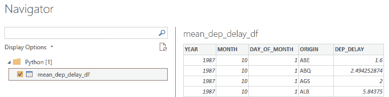

# 在 Power BI 中加载超过可用 RAM 的大型数据集

在上一章中，你学习了如何使用 Python 和 R 从 CSV 文件中读取和写入数据。当涉及到读取文件时，无论你使用 Power BI 的标准数据导入功能还是上一章中展示的技术，文件大小的主要限制是由于 Power BI Desktop 安装的机器上可用的 RAM 量。

在数据丰富阶段，可能需要从非常大的文件（以 TB 为单位的大小）中提取用于持续分析所需的信息。在这些情况下，几乎总是需要实施大数据解决方案来处理如此大量的数据。然而，非常常见的情况是需要导入比可用 RAM 稍大的文件，以便提取汇总信息，然后将其持久化到一个小表中，以便在处理过程中重复使用。在这种情况下，没有必要烦恼于要求苛刻的大数据平台，但可以利用 Python 和 R 中实现分布式计算系统的特定包提供的灵活性，而无需求助于基于 Apache Spark 的后端。

在本章中，你将学习以下主题：

+   使用大型数据集的典型分析场景

+   使用 Python 导入大型数据集

+   使用 R 导入大型数据集

## 技术要求

本章要求你有一个工作的互联网连接，并且**Power BI Desktop**已经安装在你的机器上。你必须已经按照*第二章*、*配置 Power BI 中的 R*和*第三章*、*配置 Power BI 中的 Python*中概述的方式正确配置了 R 和 Python 引擎和 IDE。

## 使用大型数据集的典型分析场景

数据科学家最频繁的活动之一是分析与业务场景相关的信息数据集。分析的目标是能够识别变量之间的关联和关系，这有助于以某种方式发现业务的新可衡量方面（见解），然后可以用来使业务更好地增长。可能的情况是，可用的数据可能不足以确定变量之间的强关联，因为任何额外的变量可能都没有被考虑。在这种情况下，尝试获取新的数据，这些数据不是由你的业务生成的，但可以丰富你的数据集的背景（一个**数据增强**过程），可以提高你变量之间统计关联的强度。例如，能够将天气预报数据与报告大坝水位测量的数据集联系起来，无疑引入了重要的变量，以更好地解释现象。

在这种情况下，你经常发现自己需要从外部数据源下载的 CSV 文件中提取信息。例如，假设你被分配了一个分析从 1987 年到 2012 年在美国主要机场的鞋店连锁店的盈利性受哪些因素影响的任务。首先出现在你脑海中的可能是，航班延误可能与人们留在机场有关。如果你必须花时间在机场，你肯定有更多的时间去参观那里的各种商店，因此你购买的机会也会增加。那么，你如何找到每个美国机场每年每一天的平均航空公司延误数据呢？幸运的是，*研究和创新技术管理局 (RITA)*，*运输统计局*提供了包含美国所有商业航班到达和出发详细信息的汇总统计数据([`bit.ly/airline-stats`](http://bit.ly/airline-stats))和原始数据([`bit.ly/airline-stats-data`](http://bit.ly/airline-stats-data))。一套包含从 1987 年到 2012 年每月航空公司数据的 CSV 文件已经由微软收集并压缩，你可以直接从以下链接下载：[`bit.ly/AirOnTime87to12`](http://bit.ly/AirOnTime87to12)。如果你想了解更多关于文件字段的信息，请参阅 `AirOnTime87to12.dataset.description.txt` 文件。

有关的问题压缩文件大约有 4 GB 大小，一旦解压，包含从 1987 年到 2012 年间在美国完成的许多 CSV 文件，详细记录了航班数据，总大小为 30 GB！你的目标是计算每个出发机场的平均每日航班延误，并将结果数据集保存为 CSV 文件。你如何在 Power BI 中导入所有这些数据呢？让我们看看如何在 Python 中完成这项任务。

## 使用 Python 导入大型数据集

在 *第三章*，*配置 Power BI 中的 Python* 中，我们建议你在环境中安装一些最常用的数据管理包，包括 NumPy、pandas 和 scikit-learn。这些包的最大限制是它们*无法处理大于它们所使用机器 RAM 的数据集*，因此它们无法扩展到多台机器。为了遵守这一限制，通常使用基于 **Spark** 的分布式系统，Spark 已成为大数据分析领域的主导工具。然而，转向这些系统迫使开发者必须重新思考已经用 API 编写的代码，该 API 称为 **PySpark**，它旨在使用 Python 对 Spark 对象进行操作。这个过程通常被视为导致项目交付延迟，并给开发者带来挫败感，因为开发者对标准 Python 中可用的库有更大的信心。

针对前面提到的问题，社区开发了一个名为 **Dask** 的新库，用于 Python 的并行计算（[`dask.org/`](https://dask.org/))。这个库为开发者提供了透明的方式来更原生地扩展 pandas、scikit-learn 和 NumPy 工作流程，而无需进行大量的重写。Dask API 几乎是那些模块 API 的复制品，这使得开发者的工作更加容易。

Dask 的一大优势是*你不需要设置一个由多台机器组成的集群来操作 100+ GB 的数据集*。你只需要一台配备多核 CPU 和 32 GB RAM 的笔记本电脑就可以轻松处理它们。因此，得益于 Dask，你可以在自己的笔记本电脑上对中等规模的数据集进行分析，而无需承担集群的典型开销，例如在各个节点上使用 Docker 镜像和复杂的调试。

> **重要提示**
> 
> 显然，即使是 Spark 团队也意识到了开发者使用 PySpark 时，习惯于以 pandas 作为数据处理模块进行开发所带来的不便。因此，他们推出了 **Koalas**（[`koalas.readthedocs.io`](https://koalas.readthedocs.io)），它为 Apache Spark 提供了 pandas API。

事实仍然是，Dask 在仅使用笔记本电脑上的分布式系统方面比 Spark 具有许多优势。例如，Spark 基于一个 **Java 虚拟机**（**JVM**）基础设施，因此需要安装 Java 和其他组件，而 Dask 则是用纯 Python 编写的。此外，使用 Dask 可以更快地从笔记本电脑过渡到云端的集群，这可以通过 Azure 等平台轻松分配。这一切都得益于 **Dask Cloud Provider** 包（[`cloudprovider.dask.org/`](https://cloudprovider.dask.org/)），它提供了在各个云平台上创建和管理临时 Dask 集群的类。如果你需要通过 Azure Spot 虚拟机或在 Azure 机器学习计算集群（例如使用 NVIDIA RAPIDS 进行 GPU 加速的数据科学）中利用 Azure 机器学习来创建 Dask 集群，请查看相关参考。

回到我们的话题，让我们看看如何在你的笔记本电脑上安装 Dask。

### 在你的笔记本电脑上安装 Dask

你将在已经安装了 pandas 和 NumPy 库的 `pbi_powerquery_env` 环境上安装 Dask。这次，仅仅运行 `pip install dask` 命令是不够的，因为这样你只会安装 Dask 的核心部分。对于 Dask 用户来说，正确的方式是安装所有组件。为了显示 Dask 操作执行计划的图形，还必须安装 **Graphviz** 模块。为了完成所有这些，请按照以下步骤操作：

1.  打开你的 Anaconda 提示符。

1.  切换到你的 `pbi_powerquery_env` 环境，输入以下命令：

    ```py
    conda activate pbi_powerquery_env
    ```

1.  输入以下命令来安装 Dask 的所有组件：

    ```py
    pip install "dask[complete]"
    ```

1.  输入以下命令来安装 Graphviz 的所有组件：

    ```py
    pip install graphviz
    ```

你还需要在 Windows 中安装 Graphviz 可执行文件：

1.  访问[`www.graphviz.org/download/`](http://www.graphviz.org/download/)，然后下载并安装稳定的 Windows 安装包。

1.  在安装过程中，选择将 Graphviz 添加到当前用户的系统路径中。

在此，让我们探讨 Dask 提供的结构，这些结构允许你扩展常见的接口，例如 NumPy、pandas 和 Python 迭代器，以处理比可用内存更大的对象。

### 创建 Dask DataFrame

**Dask DataFrame** 是 Dask *大数据* 集合的一部分，允许 pandas、NumPy 和 Python 迭代器轻松扩展。除了 Dask DataFrame，它是 pandas DataFrame 的对应物之外，**Dask Array**（模仿 NumPy）、**Dask Bag**（模仿迭代器）和**Dask Delayed**（模仿循环）也是集合的一部分。然而，我们将专注于 Dask DataFrame，这将使我们能够实现本章开头设定的分析目标。

Dask DataFrame 实际上不过是一组 pandas DataFrame，它们可以驻留在单个机器的磁盘上，或者驻留在集群的多个节点上，允许你管理比笔记本电脑 RAM 更大的数据集。我们假设你已经解压了本章开头提到的包含 1987 年至 2012 年美国航班数据的 CSV 文件，并将其放置在`D:\<your-path>\AirOnTimeCSV`文件夹中。

> **重要提示**
> 
> 如果你的笔记本电脑没有足够的硬件资源（至少 16 GB 的 RAM），你应该首先导入 CSV 文件的一个子集（例如 40-50 个文件）来测试脚本，以免等待过长的执行时间或发生内存错误。

然后，你可以非常容易地以下述方式创建你的 Dask DataFrame：

```py
import os
import dask.dataframe as dd
main_path = os.path.join('D:\\', 'your-path', 'AirOnTimeCSV')
ddf = dd.read_csv(
    os.path.join(main_path, 'airOT*.csv'),                 
    encoding='latin-1',
    usecols =['YEAR', 'MONTH', 'DAY_OF_MONTH', 'ORIGIN', 'DEP_DELAY']
)
```

注意到通配符`*`字符允许捕获文件夹中所有形式为`airOTyyyymm.csv`的 CSV 文件，其中`yyyy`表示年份，`mm`表示航班出发日期的月份。此外，CSV 文件的编码声明为`latin-1`。

> **重要提示**
> 
> 下载的 CSV 文件没有指示其编码。简单地尝试导入它们而不声明（因此默认假设为`utf-8`），加载会返回以下奇怪的错误：`UnicodeDecodeError: 'utf-8' codec can't decode byte 0xe4 in position 4: invalid continuation byte`。在网上搜索，很容易发现这种错误与编码有关，而`latin-1`是正确的编码。

此外，通过`usecols`参数仅指定感兴趣的列是一个好主意，以限制要读取的列。这种做法还保证了只读取你确信不是完全空的列，从而避免由于与实际类型不同的推断数据类型而导致的读取错误。

> **重要提示**
> 
> 可能会发生某些列在开始时具有许多空值，因此 Dask 无法推断正确的数据类型，因为它使用样本来做到这一点。在这种情况下，你应该通过使用 `dtype` 参数特别声明这些列的数据类型。

现在 Dask DataFrame 已经创建，让我们看看如何使用它来提取我们所需的信息。

### 从 Dask DataFrame 中提取信息

如果你已经运行了读取所有 CSV 文件的代码，你会注意到操作花费了非常少的时间。回想起来，这真的是读取 30 GB 数据所需的时间太少了。难道读取没有成功吗？大多数并行计算框架的秘密就与这个特性紧密相连：读取操作并没有真正执行，而是被添加到了一个可能的操作队列中，当你明确请求使用数据时，这些操作将被执行。这个概念被称为 **延迟评估** 或 **延迟计算**。

然后，你的 Dask DataFrame 可以在后续操作中使用，就像它已经包含数据一样。在我们的案例中，由于需要计算美国每个机场每年每一天的平均航空延误，考虑使用以下代码：

```py
mean_dep_delay_ddf = ddf.groupby(['YEAR', 'MONTH', 'DAY_OF_MONTH', 'ORIGIN'])[['DEP_DELAY']].mean().reset_index()
```

如果你稍微熟悉 pandas DataFrame 的转换，你会注意到 Dask DataFrame 也使用了相同的方法。与 pandas 一样，你必须使用 *双方括号* 来输出 DataFrame；否则，你会得到一个单对括号的一维序列（查看这里：[`bit.ly/pandas-subset-df`](http://bit.ly/pandas-subset-df)）。此外，为了将 `groupby()` 方法创建的索引作为 DataFrame 的列使用，你需要在 `reset_index()` 方法中重置它们（更多详情，请参阅：[`bit.ly/pandas-groupby`](http://bit.ly/pandas-groupby)）。

执行这段代码也花费了非常少的时间。正如你所想象的，平均操作已经在数据读取操作之后在转换队列中排队，在这个例子中，它被分配给了 `mean_dep_delay_ddf` DataFrame。如果你想更好地了解到目前为止转换队列的执行计划，你可以创建一个图来表示它。为了简单起见，我们将使用单个 CSV 文件作为输入来实现这个图。以下是必要的步骤：

1.  创建一个名为 `AirOnTimeCSVplot` 的文件夹。

1.  只复制你之前解压缩的第一个 CSV 文件到之前的文件夹中。

1.  在 Visual Studio Code 中打开一个新的 Python 脚本并运行以下代码：

    ```py
    import os
    import dask.dataframe as dd
    main_path = r'C:\<your-path>\AirOnTimeCSVplot'
    ddf_1_month = dd.read_csv(
        os.path.join(main_path, 'airOT*.csv'),                 
        encoding='latin-1',
        usecols =['YEAR', 'MONTH', 'DAY_OF_MONTH', 'ORIGIN', 'DEP_DELAY']
    )
    mean_dep_delay_1_month_ddf = ddf_1_month.groupby(['YEAR', 'MONTH', 'DAY_OF_MONTH', 'ORIGIN'])[['DEP_DELAY']].mean().reset_index()
    mean_dep_delay_1_month_ddf.visualize(filename='mean_dep_delay_1_month_dask.pdf')
    ```

`visualize()` 方法允许你可视化由引擎估计的任务图，以实现排队的转换，甚至在它们执行之前。具体来说，代码将在你运行的脚本所在的同一文件夹中生成一个 PDF 文件。

从*图 8.1*的底部开始，它表示新生成的 PDF 文件的内容，你可以看到单个源 CSV 文件被`read-csv`函数从由引擎分割的两个块中读取。`dataframe-groupby-count-chunk`和`dataframe-groupby-sum-chunk`函数应用于每个块，因为对于由分组操作的键定义的每个元组（`YEAR`，`MONTH`，`DAY_OF_MONTH`和`ORIGIN`），我们需要知道延迟总和（`DEP_DELAY`）和发生次数的总和来计算平均值。之后，`dataframe-groupby-sum-agg`函数对两个块上的两个`dataframe-groupby-sum-chunk`操作的结果进行聚合。同样，`dataframe-groupby-count-agg`函数聚合了两个`dataframe-groupby-count-chunk`操作的输出。一旦确定了总和和计数的数据框，就使用`truediv`函数计算每个分组之间的比率（即平均值）。最后，`reset_index`函数提供了所需的 DataFrame，这是分布式平均操作的结果。

如果你仔细思考，被称为**分而治之**（也称为**Divide et Impera**）的著名问题解决策略已经被采用。它包括将原始问题分解成更小且通常更简单的子问题，每个子问题递归解决。然后，将这些子问题的解决方案适当地组合起来，以获得原始问题的解决方案。如果你在 Hadoop 世界中有所经验，**MapReduce**范式遵循相同的哲学，后来 Spark 对其进行了维护和优化。


图 8.1 – 任务图背后的计算

话虽如此，让我们回到最初的脚本。我们定义了`mean_dep_delay_ddf` Dask DataFrame。获取所需结果所需的所有转换都已排队。你如何告诉 Dask 实际进行所有计算？你必须通过`compute()`方法显式请求结果。

> **重要提示**
> 
> 注意到`compute()`返回的是内存中的结果。它将 Dask DataFrames 转换为 pandas DataFrames，Dask 数组转换为 NumPy 数组，Dask bags 转换为列表。这是一个只有在确定结果将舒适地适合你的机器的 RAM 时才应调用的方法。否则，你可以使用特定的方法，如`to_textfiles()`或`to_parquet()`，将你的数据写入磁盘。

如果你实例化了集群，你可以决定使用`persist()`方法将计算出的数据持久化到内存中，而不是磁盘上。结果仍然是一个分布式 Dask 对象，但它引用的是分布在集群内存中的预计算结果。

为了给你的脚本增添一些魔法，你可以使用`ProgressBar()`对象，它允许你监控计算进度。不幸的是，即使进度条达到 100%，工作者完成处理仍需要一些时间：


图 8.2 – Visual Studio Code 上的进度条

所以，不要放弃！在运行以下代码之前，请记住，在拥有 32GB RAM 和 6 核心处理器的机器上处理大约需要 10 分钟。脚本如下：

```py
with ProgressBar():
    mean_dep_delay_df = mean_dep_delay_ddf.compute()
```

你的笔记本电脑将把所有可用的逻辑处理器都用于并行计算，你将在**任务管理器**的**逻辑处理器**视图中看到这一点：


图 8.3 – 任务管理器中显示的并行计算

当处理完成后，你的 pandas DataFrame 将可用内存中，你可以如下查看它的几行：

```py
mean_dep_delay_df.head(10)
```

输出将是以下内容：


图 8.4 – 输出 pandas DataFrame 的前 10 行

你可以在`Chapter08\Python`文件夹中的`01-load-large-dataset-in-python.py`文件中找到创建 Dask DataFrame 并从中提取信息的完整脚本。

最后，你能够通过处理高达 30GB 的 CSV 集来得到平均每家机场每天的航班延误数据集！

如果你想要将 Dask DataFrame 的内容写入 CSV 文件，而不经过生成 pandas DataFrame 的过程，你可以直接调用`to_csv()`方法，将生成文件的路径作为参数传递，如下例所示：

```py
ddf.to_csv(r'D\<your-path>\mean_dep_delay_df.csv')
```

如你所想，调用`to_csv()`方法会触发所有排队转换的实际执行，就像调用`compute()`方法一样，因为你正在强制 Dask 读取 DataFrame 内容以便将其写入磁盘。因此，如果你需要生成 CSV 文件并创建稍后用于代码中的 pandas DataFrame，你不应该首先从 Dask DataFrame 调用`to_csv()`，然后调用`compute()`来获取 pandas DataFrame，因为你将强制转换管道的实际执行两次。在这种情况下，首先使用`compute()`生成 pandas DataFrame，然后从它生成 CSV 或 Excel 文件，就像你在*第七章*，*从 Power BI 记录数据到外部源*中学到的那样，会更方便。

现在我们来尝试应用你在 Power BI 中学到的知识。

### 使用 Python 在 Power BI 中导入大型数据集

你了解到 Power BI 可以直接使用 Python 脚本导入数据，并且数据必须以 pandas DataFrame 的形式组织，才能在数据模型中使用。因此，你将要开发一个脚本，使用前一小节中展示的对象来实例化一个包含美国航班延误平均数据的 pandas DataFrame。然后，从这个 DataFrame 中生成一个 CSV 文件。以下是实现它在 Power BI 中的步骤：

1.  打开 Power BI 桌面版，确保它正在引用你的 Python `pbi_powerquery_env`环境。

1.  点击**获取数据**，开始输入`Python`，然后双击**Python 脚本**。

1.  将`02-load-large-dataset-in-power-bi.py`文件的内容复制到`Chapter08/Python`文件夹中，并将其内容粘贴到 Python 脚本编辑器中。记得编辑 CSV 文件路径（`main_path`）和要生成的 CSV 文件的目标路径，然后点击**确定**。

1.  大约 11 分钟后（使用一个 6 核心的笔记本电脑，32 GB 的 RAM），你将看到**导航器**窗口显示`mean_dep_delay_df` DataFrame 中的聚合数据：

    

    图 8.5 – 在 Power BI 中加载的 mean_dep_delay_df DataFrame

    选择 DataFrame，然后点击**加载**。之后，将出现一个**加载**弹出窗口，并保持活跃大约五分钟：

    

    图 8.6 – 将数据加载到 Power BI 的最终阶段

    当它消失时，你的数据已经加载到数据模型中。此外，脚本还生成了包含你的聚合数据的 CSV 文件。你将在文件夹中找到大约 60 MB 的`mean_dep_delay_df.csv`文件：


图 8.7 – 从 Power BI 中的 Python 脚本创建的 CSV 文件内容

太棒了！你只用几行 Python 代码就成功将 30 GB 的数据导入到 Power BI 桌面版中，恭喜你！

你知道你还可以用 R 来做这件事吗？让我们看看怎么做。

## 使用 R 导入大型数据集

对于用于操作数据的 Python 包所展示的相同可伸缩性限制，在**Tidyverse**生态系统中的 R 包也存在。即使在 R 中，也无法使用大于机器可用 RAM 的数据集。在这些情况下采用的第一种解决方案也是切换到基于 Spark 的分布式系统，这些系统提供了**SparkR**语言。它提供了 R 中常用的 DataFrame 的分布式实现，支持过滤、聚合和选择操作，就像使用`dplyr`包一样。对于我们这些 Tidyverse 世界的粉丝来说，RStudio 积极开发`sparklyr`包，允许您使用`dplyr`的所有功能，即使是分布式 DataFrame。然而，由于运行所需的所有 Java 基础设施带来的开销，采用基于 Spark 的系统来处理总共占用略多于机器上可用 RAM 的 CSV 文件可能有些过度。

在这种情况下，采用`disk.frame`包（[`github.com/xiaodaigh/disk.frame`](https://github.com/xiaodaigh/disk.frame)）是获胜的方法。`disk.frame`允许您将大于 RAM 的数据集分成块，并将每个块存储在文件夹中的单独文件中。**块文件**是小于初始 DataFrame 的压缩`fst`格式的序列化，由`fst`包（[`github.com/fstpackage/fst`](https://github.com/fstpackage/fst)）引入。它专门设计用来释放现代计算机中容易找到的固态硬盘的*速度和并行性*。存储在`fst`格式中的 DataFrame 具有完整的随机访问，包括列和行，因此能够从并行计算中受益。

> **重要提示**
> 
> 如果您想从`disk.frame`包引入的并行性中受益，您必须必然将源 CSV 文件持久化存储在 SSD 磁盘上。如果您没有 SSD，并且使用 HDD 磁盘，您的处理将花费太长时间，而且不值得。

您可以通过指定您想要使用的并行工作进程的数量来定义`disk.frame`将使用的并行度。对于每个工作进程，它将使用`future`包提供的并行机制创建一个**R 会话**。

让我们详细看看如何使用`disk.frame`。

### 在您的笔记本电脑上安装 disk.frame

首先，您需要在您的 R 引擎中安装`disk.frame`包：

1.  打开 RStudio 并确保它引用的是您最新的 CRAN（综合 R 档案网络）R 引擎（在我们的例子中，版本 4.0.2）。

1.  点击控制台提示并输入此命令：`install.packages("disk.frame")`。确保您安装了该包的最新版本（在我们的例子中，版本 0.5.0）。

到目前为止，您已经准备好在 RStudio 上测试它了。

### 创建 disk.frame 实例

为了创建一个 `disk.frame` 实例（基于磁盘的 DataFrame），您必须首先定义您想要初始化的并行工作器的数量。显然，工作器数量越多，`disk.frame` 实例创建得越快。但您不能初始化任何大量工作器，因为您可以使用并行线程的数量取决于您的机器的处理器。此外，您可以定义从工作器到另一个工作器可以交换的数据量的最大限制。因此，在开始使用 `disk.frame` 的脚本中，您会找到以下内容：

```py
library(dplyr)
library(disk.frame)
n_cores <- future::availableCores() - 1
setup_disk.frame(workers = n_cores)
options(future.globals.maxSize = Inf)
```

`availableCores()` 函数计算您机器上可用的逻辑处理器数量。通常，对于计算密集型任务，最好留出一个，这样机器就不会变得无响应。`setup_disk.frame()` 函数创建用于计算的工人集群。此外，工作器之间可以交换的数据量没有限制（`Inf` 代表 **无限**）。

我们假设您已经解压了包含 1987 年至 2012 年美国航班数据的 CSV 文件，如本章开头所述，在 `D:\<your-path>\AirOnTimeCSV` 文件夹中。

> **重要提示**
> 
> 如果您没有足够的硬件资源的笔记本电脑，您应该首先导入 CSV 文件的一个子集（例如 40-50 个文件）来测试脚本，而无需等待过长的执行时间。

您必须使用 `list.files()` 函数定义每个 CSV 文件的路径列表，然后您可以使用 `csv_to_disk.frame()` 函数继续创建 `disk.frame`：

```py
main_path <- 'D:/<your-path>/AirOnTime'
air_files <- list.files( paste0(main_path, '/AirOnTimeCSV'), full.names=TRUE )
start_time <- Sys.time()
dkf <- csv_to_disk.frame(
    infile = air_files,
    outdir = paste0(main_path, '/AirOnTime.df'),
    select = c('YEAR', 'MONTH', 'DAY_OF_MONTH', 'ORIGIN', 'DEP_DELAY')
)
end_time <- Sys.time()
(create_dkf_exec_time <- end_time - start_time)
```

创建 `disk.frame` 实例包括两个步骤：

1.  该过程在每个分配给临时文件夹的每个工作器中创建与 CSV 文件数量相同的块。

1.  块在输出文件夹（由 `outdir` 参数定义）中聚合并持久化，该文件夹与 `disk.frame` 关联。

简而言之，`disk.frame` 是一个文件夹，最好带有 `.df` 扩展名，其中包含从源文件生成的聚合块（`.fst` 文件）。正如您已经通过 Dask 看到的，通过 `select` 参数仅指定感兴趣的列是一个好主意，这样可以限制要读取的列。这种做法也保证了只读取您确信不是完全空的列，从而避免了由于与实际数据类型不同的推断数据类型而导致的读取错误。

> **重要提示**
> 
> 可能会发生某些列在开头有大量空值的情况，因此 `disk.frame` 无法推断正确的数据类型，因为它使用样本来执行此操作。在这种情况下，您应该使用 `colClasses` 参数特别声明这些列的数据类型。

注意，一旦`create_dkf_exec_time`变量分配了值，圆括号就会将其打印在屏幕上，全部在一行中。在拥有 6 个核心和 32GB 的机器上，使用 11 个工作者的情况下，创建时间大约是 1 分 17 秒。

一旦`disk.frame`创建完成，构成集群的多个 R 会话可以保持活跃。为了强制断开连接，可以使用以下命令：

```py
future:::ClusterRegistry("stop")
```

这样，机器资源就完全释放了。

> **重要提示**
> 
> 正确创建的`disk.frame`可以通过使用`disk.frame()`函数并传入`.df`文件夹的路径来在以后引用，无需再次创建。

你可以在`Chapter08\R`文件夹中的`01-create-diskframe-in-r.R`文件中找到创建`disk.frame`的完整脚本。

现在让我们看看如何从新创建的`disk.frame`中获取信息。

### 从 disk.frame 提取信息

由于我们感兴趣的是获取美国每个机场每年每一天的平均航空公司延误，因此需要对整个`disk.frame`进行分组操作。为了优化执行时间，在这种情况下，还需要实例化一个工作者的集群，该集群将并行读取新创建的`disk.frame`中的信息。你可以使用从`dplyr`包中了解的语法来转换`disk.frame`实例。此外，为了优化机器资源，你将强制引擎只读取对请求的计算严格必要的列，使用`disk.frame`包中的`srckeep()`函数。在我们的案例中，选择列是不必要的，因为我们创建`disk.frame`实例时只保留了那些严格必要的列，但以下建议适用。

> **重要提示**
> 
> 在聚合数据提取脚本中始终使用`srckeep()`函数是一个好习惯，因为如果`disk.frame`实例包含所有初始列，该操作会导致机器崩溃。

应使用以下代码来提取聚合数据：

```py
library(dplyr)
library(disk.frame)
n_cores <- future::availableCores() - 1
setup_disk.frame(workers = n_cores)
options(future.globals.maxSize = Inf)
main_path <- ' D:/<your-path>/AirOnTime'
dkf <- disk.frame( paste0(main_path, '/AirOnTime.df') )
start_time <- Sys.time()
mean_dep_delay_df <- dkf %>%
    srckeep(c("YEAR", "MONTH", "DAY_OF_MONTH", "ORIGIN", "DEP_DELAY")) %>%
    group_by(YEAR, MONTH, DAY_OF_MONTH, ORIGIN) %>%
    summarise(avg_delay = mean(DEP_DELAY, na.rm = TRUE)) %>%
    collect()
end_time <- Sys.time()
(aggregate_exec_time <- end_time - start_time)
future:::ClusterRegistry("stop")
```

同样，正如在 Python 中的 Dask 所看到的，存在一些函数可以收集所有排队的转换并触发计算的执行。在`disk.frame`的情况下，该函数是`collect()`。这个操作的持续时间大约是 20 分钟，使用一个拥有 6 个核心的 32GB 机器，并使用 11 个工作者。

最终结果是包含所需空气延迟平均值的 tibble：


图 8.8 – 包含延迟平均值的 tibble 的前几行

在这个情况下，你也能够通过处理高达 30GB 的 CSV 集来获取平均飞行延误的几千行数据集！

你可以在`Chapter08\R`文件夹中的`02-extract-info-from-diskframe-in-r.R`文件中找到从`disk.frame`提取聚合数据的完整脚本。

以下常识性观察也适用于此。

> **重要提示**
> 
> 如果之前耗时较长的处理结果需要经常重用，最好是将其以可重用格式 *持久化到磁盘上*。这样，你就可以避免再次执行所有繁重的排队转换处理。

`disk.frame` 实例没有像 Dask DataFrame 那样的直接方法，允许其内容在所有排队转换之后写入磁盘。由于结果是 tibble，从所有意义上说它是一个 DataFrame，你可以按照你在 *第七章*，*从 Power BI 记录数据到外部来源*中学到的指示将其写入磁盘。

因此，让我们看看你如何在 Power BI 中应用到目前为止学到的知识。

### 使用 R 在 Power BI 中导入大型数据集

使用 R 通过 Power BI 加载大于可用 RAM 的数据集的最佳解决方案是能够在 Power BI 本身通过 R 脚本直接创建 `disk.frame` 实例。

> **重要提示**
> 
> 不幸的是，从各种 CSV 文件创建 `disk.frame` 实例的操作在过程的第二阶段（将各种块聚合到 `disk.frame` 文件夹中）中在 Power BI 中会触发一个错误。

因此，为了从 Power BI 中的 `disk.frame` 实例提取信息，你必须首先在 RStudio（或任何其他 IDE 或任何自动化脚本）中创建它。一旦创建了 `disk.frame` 实例，就可以在 Power BI 中如下使用它：

1.  确保你已使用 RStudio 正确创建了 `disk.frame` 实例，方法是运行 `Chapter08/R` 文件夹中 `01-create-diskframe-in-r.R` 文件中的代码。

1.  打开 Power BI Desktop 并确保它引用的是你最新的 CRAN R 引擎。

1.  点击 **获取数据**，开始输入 `script`，然后双击 **R 脚本**。

1.  将 `03-extract-info-from-diskframe-in-power-bi.R` 文件的内容复制到 `Chapter08\R` 文件夹，并将其粘贴到 R 脚本编辑器中。请记住编辑要生成的 CSV 文件的目标路径，然后点击 **确定**。

1.  大约 30 分钟后（使用具有 6 个核心和 32 GB RAM 的笔记本电脑），你将看到 **导航器** 窗口显示 `mean_dep_delay_df` DataFrame 中的聚合数据：

    

    图 8.9 – 在 Power BI 中加载的 mean_dep_delay_df DataFrame

    选择 DataFrame 并点击 **加载**。之后，将出现一个 **加载** 弹出窗口，它将保持活跃约 10 分钟：

    

    图 8.10 – 将数据加载到 Power BI 的最后阶段

    当它消失时，你的数据已加载到数据模型中。此外，脚本还生成了包含你的聚合数据的 CSV 文件。你将在你的文件夹中找到大小约为 60 MB 的 `mean_dep_delay_df.csv` 文件：


图 8.11 – 从 Power BI 中的 R 脚本创建的 CSV 文件内容

太棒了！你曾经想过只用几行代码就将 30 GB 的数据导入 Power BI Desktop 中，从中提取信息吗？好吧，你刚刚就做到了。

## 摘要

在本章中，你学习了如何将比你的笔记本电脑可用的 RAM 更大的数据集导入 Python 和 R。你还将这些知识应用于导入一组 CSV 文件，这些文件总共占用的空间超过了你机器上可用的 RAM。

在下一章中，你将学习如何使用用户可用的网络服务提取的外部信息来丰富你的数据。

## 参考文献

对于额外的阅读，请参阅以下书籍和文章：

1.  *使用 Azure（Spot）VMs 在 Azure 上创建 Dask 集群* ([`cloudprovider.dask.org/en/latest/azure.html`](https://cloudprovider.dask.org/en/latest/azure.html))

1.  *在 Microsoft Azure ML 上使用 Dask 和 NVIDIA RAPIDS 进行大规模加速机器学习* ([`github.com/drabastomek/GTC/tree/master/SJ_2020/workshop`](https://github.com/drabastomek/GTC/tree/master/SJ_2020/workshop))
