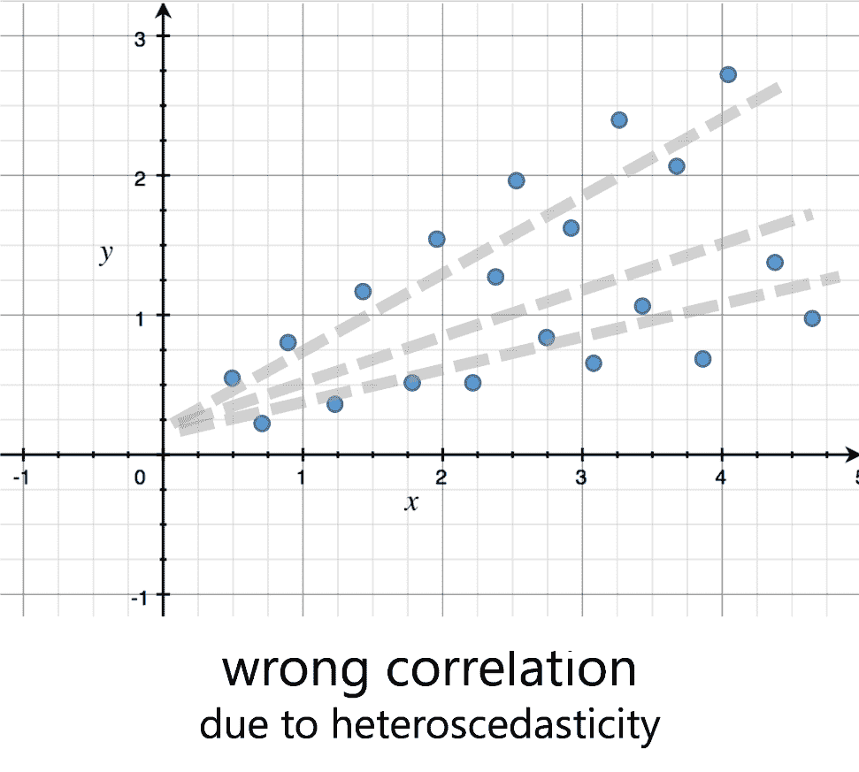
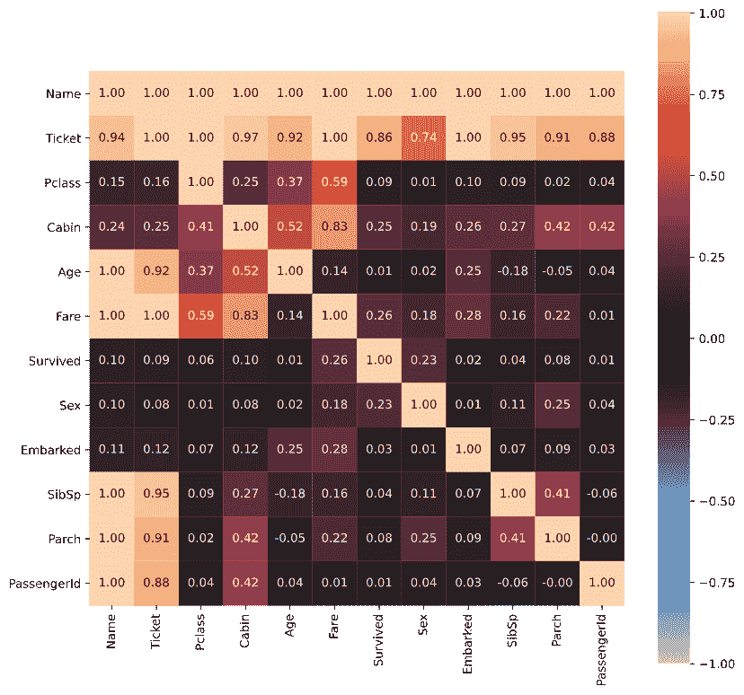

# 第十二章：11 添加统计洞察：关联

如你在上一章所见，通过应用复杂算法可以丰富你的数据。除了距离和线性规划之外，统计学通常可以成为数据分析的终极武器。我们将解释一些旨在从你的数据中提取关于变量之间关联的相关洞察的统计程序的基本概念。

本章，你将学习以下主题：

+   探索变量之间的关联

+   数值变量之间的相关性

+   类别变量和数值变量之间的相关性

## 技术要求

本章要求你拥有一个正常工作的互联网连接，并且**Power BI Desktop**已经安装在你的机器上。你必须已经按照*第二章*、*配置 Power BI 中的 R*和*第三章*、*配置 Power BI 中的 Python*中概述的方式正确配置了 R 和 Python 引擎和 IDE。

## 探索变量之间的关联

初看之下，你可能会想知道寻找变量之间关系的目的何在。能够理解一对变量的行为并识别它们行为中的模式，有助于企业主识别关键因素，将公司健康指标转向对其有利的方向。了解绑定两个变量趋势的模式，让你能够通过了解其中一个来以某种确定性预测另一个。因此，了解揭示这些模式的方法，赋予你一种对商业主总是有吸引力的分析超级能力。

通常情况下，当其中一个变量的值以某种方式与另一个变量的值相关时，两个变量是**相关的**。当你能够以某种方式测量两个变量关联的程度时，这被称为**相关性**。当两个变量是数值时，相关性概念立即适用。让我们看看如何。

## 数值变量之间的相关性

我们通常做的第一件事是理解两个数值变量之间是否存在关联，就是将它们表示在两个笛卡尔轴上，以获得一个**散点图**：


图 11.1 – 一个简单的散点图

使用散点图，可以识别可能的关联的三个重要特征：

+   **方向**：它可以是*正的*（增加），*负的*（减少），或者*未定义的*（未找到关联或增加和减少）。如果一个变量的增量与另一个变量的增量相对应，则方向为正；否则，为负：

    

    图 11.2 – 关联的方向类型

+   **形式**：它描述了关联在其最简单意义上的一般形式。显然，有许多可能的形式，但有一些更常见，例如*线性*和*曲线*（非线性）形式：

    

    图 11.3 – 关联的形状

+   **强度**：关联的强度取决于散点图中点如何接近描绘关联通用形状的线。


图 11.4 – 关联的强度

随着这些视觉模式通过应用数学概念变得可测量，我们可以定义数值变量之间不同类型的关联。

### 卡尔·皮尔逊的相关系数

**皮尔逊相关系数**（**r**）衡量分析变量之间关联的线性程度。这意味着如果 *r = 1* 或 *r = -1*，那么两个变量处于**完美的线性关系**中。系数的符号确定关联的方向。如果 *r* 在负或正方向上接近 0，则意味着变量之间的关联**非常弱**。系数的值不能超出 [-1, 1] 的范围。

皮尔逊相关系数的平方（*R²*）被称为**确定系数**，它衡量一个变量的**方差**（衡量观测值与其平均值之间的分散程度）中有多少百分比是由于另一个变量的方差，假设关联是线性的。例如，如果一个人的体重和身高变量之间的相关系数 *r* 为 0.45，那么可以说大约 20%（0.45 x 0.45）的体重变化（方差）是由于身高变化引起的。

计算相关系数 r 很少用手动完成，因为任何数据管理平台都提供了一个易于计算它的函数。如果你好奇，给定一个包含 *n* 个实体的数据集，确定你想要计算相关系数的变量 *x* 和 *y* – 这是计算它的公式：


图 11.5 – 皮尔逊相关系数的公式

*x̄* 和 *ȳ* 的值对应于数据集中同义变量的平均值。请注意，皮尔逊相关函数是**对称的**，这意味着计算时列的顺序并不重要。

*图 11.6* 中展示了为一些特定关联（**Boigelot 分布**）计算的相关系数 *r* 的示例：


图 11.6 – 在 Boigelot 分布上计算的皮尔逊相关系数

*图 11.6* 中散点图的第一行给出了关联强度如何通过相关性的大小来衡量，趋向于线性关系。

第二行显示，无论线性关系的角度如何，相关系数 *r* 的绝对值总是等于 1，也就是说，它总是正确地识别线性关系及其方向。唯一的例外是中心水平线性关系的情况，对于这种情况，系数 *r* 是未定义的，因为对于所有 *x* 的值，都有一个唯一的 *y* 值。

第三行显示了相关系数的一个最重要的局限性：

> **重要提示**
> 
> 皮尔逊相关系数在检测两个变量之间的非线性关联模式方面不如后者。

这些是其他局限性：

+   在一个非常小的数据集大小（比如说，3-6 个观测值）的情况下，可能会出现关联存在的情况，尽管实际上并不存在。

+   相关系数对异常值（位于大多数其他值较远处的观测值）非常敏感。也可能发生异常值给出关于存在关联的虚假印象：

    

    图 11.7 – 由于异常值导致的错误相关值

    我们将在*第十二章*中更详细地介绍异常值，*添加统计洞察、异常值和缺失值*。

+   如果数据集中的观测值被分为不同的聚类，这可能会产生虚假的关联感：

    

    图 11.8 – 由于聚类导致的错误相关值

+   用于计算相关系数的变量必须在连续尺度上定义。对于基于离散尺度的变量，例如服务的 1-10 级评分，您必须使用斯皮尔曼秩相关系数，我们将在下一节中探讨。

+   如果在一个关联中存在一个变量与第二个变量的值域具有不等的变异性，我们就面临了**异方差性**的情况。散点图假设典型的锥形形状，就像*图 11.1*中的那样。在这种情况下，相关系数可能会识别出错误线性关系（多个线性关系都可能满足散点图的锥形形式）：

    

    图 11.9 – 由于异方差性导致的错误相关值

+   计算皮尔逊相关系数涉及的变量不应高度**偏斜**，也就是说，变量的分布必须不相对于对称的钟形曲线（正态分布，其中均值、中位数和众数相等）扭曲或不对称，否则可能会发生相关程度真实大小的减少：


图 11.10 – 分布偏态类型

在明确了这些限制之后，首先出现的问题是：当关联是非线性的，变量基于顺序尺度，或者它们具有偏斜分布时，我该如何计算两个数值变量之间的相关系数？这个问题的一个可能解决方案是由查尔斯·斯皮尔曼提供的。

### 查尔斯·斯皮尔曼的相关系数

查尔斯·斯皮尔曼引入了皮尔逊相关系数的非参数替代方案。**非参数统计方法**指的是它不假设其计算的数据遵循由少量参数描述的特定模型。这种方法总结在一个新的相关系数中，称为**斯皮尔曼等级相关系数**（用**ρ**，*rho*表示）。斯皮尔曼系数衡量两个变量之间关联的强度和方向，一旦它们的观测值根据其值进行排序。计算它的公式如下：


图 11.11 – 斯皮尔曼等级相关系数公式

值**D**是每个观测值的两个等级之间的差值。要了解更多计算细节，请查看参考文献。请注意，斯皮尔曼的相关函数也是对称的。

斯皮尔曼相关系数的范围从-1 到+1。系数的符号表示它是正单调关联还是负单调关联。

> **斯皮尔曼相关系数的重要特征**
> 
> 因为斯皮尔曼相关系数适用于等级，它提供了两个连续随机变量之间**单调关联**的度量，并且是顺序变量的最佳拟合相关系数。由于其计算方式与皮尔逊相关系数不同，斯皮尔曼相关系数对异常值**稳健**。

记住，如果一个关联在其整个定义域内是增加的或减少的（而不是两者的组合），则称其为**单调关联**：


图 11.12 – 单调和非单调关联

> **重要提示**
> 
> 检查关联的单调性很重要，因为一般来说，
> 
> 相关系数无法准确描述非单调关系。

计算 Boigelot 分布的斯皮尔曼相关系数，我们得到以下结果：


图 11.13 – 在 Boigelot 分布上计算的斯皮尔曼相关系数

即使斯皮尔曼相关系数也无法捕捉到你在*图 11.13*第三行分布中观察到的非线性模式。这并不是由于上述关联的非线性，而是由于它们的非单调性。相比之下，对于单调非线性关联，斯皮尔曼相关系数比皮尔逊相关系数更适合：


图 11.14 – 非线性单调关联中的皮尔逊和斯皮尔曼相关系数

斯皮尔曼相关系数并不是唯一使用数据排序进行计算的。肯德尔也使用这种策略。让我们来看看它的特点。

### 莫里斯·肯德尔的相关系数

**肯德尔秩相关系数**（τ，tau）也是一种检测两个变量之间关联的非参数方法。其计算基于**一致对**和**不一致对**的概念（更多细节请参阅*参考文献*部分）。用于计算肯德尔相关系数的公式如下：


图 11.15 – 肯德尔相关系数公式

*n[c]*值表示一致对的数量，而*n[d]*值表示不一致对的数量。与其他相关函数一样，肯德尔的相关性也是对称的。

为斯皮尔曼相关系数所做的所有假设也适用于肯德尔。以下是两种相关系数的比较：

+   这两种相关系数都能很好地处理有序数据和非线性连续单调数据。

+   这两种相关系数对异常值都具有鲁棒性。

+   当样本量小且存在许多相同等级时，肯德尔相关系数比斯皮尔曼相关系数更受欢迎。

+   肯德尔的系数通常比斯皮尔曼的小。

+   肯德尔相关系数的计算复杂度比斯皮尔曼的相关系数更高。

话虽如此，让我们在一个实际案例中使用这三个相关系数。

### 实际案例的描述

您的老板要求您执行一个客户要求的全球人口分析。具体来说，您需要了解在过去的年份中，预期寿命和人均国内生产总值（GDP）之间是否存在关系以及关系的程度。

在网上寻找有用的数据时，您意识到有一个名为 **Gapminder** 的网站可以帮助您（[`www.gapminder.org/`](https://www.gapminder.org/)）。它对抗毁灭性的误解，并推广一个基于事实的世界观，每个人都可以理解，通过将来自多个来源的数据结合成独特的时间序列，这些时间序列在其他地方找不到。该网站精确地揭示了关于预期寿命的数据（[`bit.ly/life-expectancy-data`](http://bit.ly/life-expectancy-data)）和关于人均 GDP 的数据（[`bit.ly/gdp-per-capita-data`](http://bit.ly/gdp-per-capita-data)）。此外，还有一个人已经将数据转换成更适合我们目的的形式，并在 CSV 文件中与社区分享了他的工作（[`bit.ly/gdp-life-expect-data`](http://bit.ly/gdp-life-expect-data)）。

太棒了！您已经拥有了开始 Python 分析所需的一切。

### 在 Python 中实现相关系数

要运行本节中的代码，您需要在您的 `pbi_powerquery_env` 环境中安装 Seaborn 模块。如您现在可能已经学到的，请按以下步骤操作：

1.  打开 Anaconda 提示符。

1.  输入命令 `conda activate pbi_powerquery_env`。

1.  输入命令 `pip install seaborn`。

本节中提供的代码可在 `Chapter11\Python` 文件夹中的 `01-gdp-life-expectancy-analysis-in-python.py` 文件中找到。

在这一点上，让我们快速查看上述 CSV 文件中的数据，同时导入后续操作所需的表单：

```py
import pandas as pd
import matplotlib.pyplot as plt
import seaborn as sb
dataset_url = 'http://bit.ly/gdp-life-expect-data'
df = pd.read_csv(dataset_url)
df.head()
# If you’re not using VS Code run this instead
# print(df.head())
```

您会看到类似这样的：


图 11.16 – GDP 和预期寿命数据集的样本

我们感兴趣的变量是 `lifeExp` 和 `gdpPercap`。在绘制这两个变量的散点图之前，让我们也看一下每个变量的分布。因此，让我们定义我们将用于绘图的函数并绘制分布图：

```py
def distPlot(data, var, title, xlab, ylab, bins=100):
    hplot = sb.distplot(data[var], kde=False, bins=bins)
    plt.title(title, fontsize=18)
    plt.xlabel(xlab, fontsize=16)
    plt.ylabel(ylab, fontsize=16)

    return hplot
def scatterPlot(data, varx, vary, title, xlab, ylab):
    hplot = sb.scatterplot(varx, vary, data=data)
    plt.title(title, fontsize=18)
    plt.xlabel(xlab, fontsize=16)
    plt.ylabel(ylab, fontsize=16)

    return hplot
distPlot(data=df, var='lifeExp', title='Life Expectancy', xlab='Life Expectancy years', ylab='Frequency')
# In case you're not using a Jupyter notebook run also the following:
# plt.show()
distPlot(data=df, var='gdpPercap', title='GDP / capita', xlab='GDP / capita ($)', ylab='Frequency')
# In case you're not using a Jupyter notebook run also the following:
# plt.show()
```

创建的图表如下：


图 11.17 – 预期寿命和 GDP 变量的分布

如您所见，预期寿命的分布大致符合正态分布，而 GDP 的分布则是完全正偏斜。如果这两个变量之间存在显著的关联，那么您应该预期散点图可能是非线性的。让我们来看看：

```py
scatterPlot(data=df, varx='lifeExp', vary='gdpPercap', title='Life Expectancy vs GDP/Capita', xlab='lifeExp', ylab='gdpPercap')
# In case you're not using a Jupyter notebook run also the following:
# plt.show()
```

您会得到这个：


图 11.18 – 预期寿命与人均 GDP 的散点图

从*图 11.18*中，您可以清楚地看到两个变量之间的关联性，并且正如预期的那样，是非线性的（背景箭头）。更重要的是，存在一些异常值，它们在顶部被突出显示。因此，您面临两个使皮尔逊相关系数无效的假设。幸运的是，这种关联是单调递增的，因此斯皮尔曼和肯德尔相关系数应该能更准确地检测到模式。

pandas 已经提供了三种相关系数的 Python 实现。因此，相关性分析非常直接：

```py
df[['lifeExp','gdpPercap']].corr(method='pearson')
df[['lifeExp','gdpPercap']].corr(method='spearman')
df[['lifeExp','gdpPercap']].corr(method='kendall')
```

pandas 数据框的`corr()`函数返回其数值列的每一对的相关计算。由于相关函数是对称的（即，计算时列的顺序无关紧要），这三个调用返回三个数据框，每个数据框都将所有数值特征作为行和列，并将特征之间的相关系数作为值：


图 11.19 – 人均寿命与人均 GDP 的相关性

如您所见，所有三个相关系数都表明两个变量之间存在正相关关系。正如预期的那样，皮尔逊相关系数检测到的强度最弱（*r = 0.58*）。相比之下，斯皮尔曼和肯德尔相关系数的幅度更高，分别为*ρ = 0.83*和*τ = 0.64*。特别是从斯皮尔曼相关系数来看，两个变量之间存在强烈的关联性。

在数据科学项目中，通常需要选择最具有预测性的变量来预测目标变量，尤其是在有大量列的情况下。相关性技术当然可以帮助我们做到这一点：假设目标变量是人均 GDP，我们可以决定保留所有与目标变量相关系数大于 0.7 的变量作为预测变量。您理解在这种情况下，考虑正确的相关性方法非常重要，否则，您可能会拒绝与目标变量强相关的变量。

太好了！让我们看看如何使用 R 复制这个分析。

### 在 R 中实现相关系数

我们在 R 中推荐使用的用于计算相关系数的包之一是**corrr** ([`github.com/tidymodels/corrr`](https://github.com/tidymodels/corrr))。它允许你根据 Tidyverse 建议的实践非常容易地探索和重新排列`correlate()`函数返回的 tibbles。

1.  打开 RStudio 并确保它引用的是您最新的 CRAN R（在我们的例子中是版本 4.0.2）。

1.  点击**控制台**窗口，输入以下命令：`install.packages('corrr')`。然后按*Enter*键。

您将在本节中找到的代码可在`Chapter11\R`文件夹中的`01-gdp-life-expectancy-analysis-in-r.R`文件中找到。

因此，让我们继续导入必要的库，从网络上的 CSV 文件中加载数据到 tibble 中，并显示前几行：

```py
library(readr)
library(dplyr)
library(corrr)
library(ggplot2)
dataset_url <- 'http://bit.ly/gdp-life-expect-data'
tbl <- read_csv(dataset_url)
tbl
```

您将在控制台中看到以下内容：


图 11.20 – 人口 tibble 的前几行

此外，在这种情况下，我们定义了绘制分布图和散点图所需的函数，并使用它们生成变量`lifeExp`和`gdpPercap`的分布图：

```py
distPlot <- function(data, var, title, xlab, ylab, bins=100) {
    p <- ggplot( data=data, aes_string(x=var) ) + 
        geom_histogram( bins=bins, fill="royalblue3", color="steelblue1", alpha=0.9) +
        ggtitle(title) + xlab(xlab) + ylab(ylab) +
        theme( plot.title = element_text(size=20), axis.title = element_text(size=16) )
    return(p)
}
scatterPlot <- function(data, varx, vary, title, xlab, ylab) {
    p <- ggplot( data=data, aes_string(x=varx, y=vary)) + 
        geom_point(
            color='steelblue1', fill='royalblue3',
            shape=21, alpha=0.8, size=3
        ) +
        ggtitle(title) + xlab(xlab) + ylab(ylab) +
        theme( plot.title = element_text(size=20), axis.title = element_text(size=16) )
    return(p)
}
distPlot(data = tbl, var = 'lifeExp', title = 'Life Expectancy',          xlab = 'Life Expectancy (years)', ylab = 'Frequency')
distPlot(data = tbl, var = 'gdpPercap', title = 'GDP / capita', xlab = 'GDP / capita ($)', ylab = 'Frequency')
```

这是您得到的图表：


图 11.21 – 生命预期和人均 GDP 的分布图

您可以通过以下方式获取两个变量之间的散点图：

```py
scatterPlot(data = tbl, varx = 'lifeExp', vary = 'gdpPercap', title = 'Life Expectancy vs GDP/Capita', xlab = 'lifeExp', ylab = 'gdpPercap')
```

这是您得到的图形：


图 11.22 – 生命预期与人均 GDP 之间的散点图

通过`corrr`包的`correlate()`函数，可以简单地获得（持久化在 tibbles 中的）相关矩阵，如下所示：

```py
tbl %>% select( lifeExp, gdpPercap ) %>% correlate( method = 'pearson' )
tbl %>% select( lifeExp, gdpPercap ) %>% correlate( method = 'spearman' )
tbl %>% select( lifeExp, gdpPercap ) %>% correlate( method = 'kendall' )
```

这是控制台的结果：


图 11.23 – tibbles 中的相关系数

简单易懂，对吧？现在您知道了如何在 Python 和 R 中获取相关系数，让我们在 Power BI 中实现您所学的知识。

### 使用 Python 和 R 在 Power BI 中实现相关系数

Power BI 凭借 DAX 功能，能够为已加载到数据模型中的数据引入最少量的统计分析。您可以在以下链接中找到您可以使用的一系列统计函数：`http://bit.ly/dax-stats-func`。至于简单的**皮尔逊相关系数**，您可以通过预定义的快速度量来使用它，这些度量在幕后为您添加了一些有时非平凡的 DAX 代码。更多详情，您可以点击此链接：[`bit.ly/power-bi-corr-coef`](http://bit.ly/power-bi-corr-coef)。然而，没有简单的方法来实现斯皮尔曼和肯德尔相关系数。

此外，您可能已经听说过在 Microsoft 的 AppSource 中可用的**相关系数图**([`bit.ly/power-bi-corr-plot`](https://bit.ly/power-bi-corr-plot))。您可能会认为可以使用它来获取相关系数。首先，该图仅显示皮尔逊相关系数，而不显示斯皮尔曼和肯德尔系数。此外，您无法从视觉或自定义视觉中提取系数以持久化它们，以便在表中使用它们进行后续计算（例如，特征选择）。因此，在这种情况下，相关系数图的想法完全偏离了目标。

唯一的方法是使用 Python 或 R。让我们看看如何做到这一点。

在这种情况下，由于代码的简单性，我们将在一个项目中实现 Python 和 R 中的相关系数。

首先，请确保 Power BI Desktop 在**选项**中引用了正确的 Python 和 R 版本。然后按照以下步骤操作：

1.  点击**获取数据**，选择**网络**，然后点击**连接**：

    

    图 11.24 – 从网络获取数据

1.  将`http://bit.ly/gdp-life-expect-data`字符串输入到**URL**文本框中，然后点击**确定**。

1.  您将看到数据预览。然后点击**转换数据**。

1.  在功能区点击**转换**，然后点击**运行 Python 脚本**。

1.  输入以下 Python 脚本，然后点击**确定**：

    ```py
    import pandas as pd
    corr_df = dataset.corr(method='pearson')
    # You need to convert row names into a column
    # in order to make it visible in Power BI
    corr_df.index.name = 'rowname'
    corr_df.reset_index(inplace=True)
    ```

    您可以在`Chapter11\Python`文件夹中的文件`02-gdp-life-expectancy-analysis-in-power-bi-with-python.py`中找到此代码。

1.  我们只对`corr_df`中的数据感兴趣。因此，点击其**表**值。

1.  您将看到数据集中所有数值列的皮尔逊相关系数预览。

1.  在功能区点击**主页**，然后点击**关闭并应用**。

1.  重复步骤 1 到 3。

1.  在功能区点击**转换**，然后点击**运行 R 脚本**。

1.  输入以下 R 脚本，然后点击**确定**：

    ```py
    library(dplyr)
    library(corrr)
    # You need to select only numeric columns
    # in order to make correlate() work
    corr_tbl <- tbl %>% 
        select( where(is.numeric) ) %>% 
        correlate( method = 'spearman' )
    ```

    您可以在`Chapter11\R`文件夹中的文件`02-gdp-life-expectancy-analysis-in-power-bi-with-r.R`中找到此代码。

1.  我们只对`corr_tbl`中的数据感兴趣。因此，点击其**表**值。

1.  您将看到数据集中所有数值列的斯皮尔曼相关系数预览。

1.  在功能区点击**主页**，然后点击**关闭并应用**。

太棒了！您刚刚使用 Python 和 R 在 Power BI 中计算了源数据集数值列的皮尔逊和斯皮尔曼相关系数。简单，不是吗？

您可能想知道，“好吧，关于数值变量我都很清楚。如果我有分类（非数值）变量怎么办？我如何计算它们之间的相关性？那么数值变量和分类变量之间的相关性又是如何呢？”让我们看看如何进行这类分析。

## 分类变量与数值变量之间的相关性

我们已经展示了，在两个数值变量的情况下，通过查看它们的散点图，您可以了解它们之间的关联。显然，当其中一个或两个变量是分类变量时，这种策略不能使用。请注意，当变量取值为名称或标签时，该变量是**分类的**（或定性的，或名义的）。例如，智能手机操作系统（iOS、Android、Linux 等）。

让我们看看如何分析两个分类变量的情况。

### 考虑两个变量都是分类的

那么，是否存在一种图形表示法可以帮助我们理解两个分类变量之间是否存在显著的关联？答案是肯定的，它的名字就是 **mosaic plot**。在本节中，我们将以泰坦尼克号灾难数据集作为参考数据集。为了了解 mosaic plot 的外观，让我们考虑变量 `Survived`（取值为 `1` 和 `0`）和 `Pclass`（*乘客舱位*，取值为 `1`、`2` 和 `3`）。由于我们想要研究这两个变量之间的关联，我们考虑由它们生成的以下 mosaic plot： 


图 11.25 – Survived 和 Pclass 变量的 mosaic plot

简而言之，mosaic plot 的目标是，通过表示所讨论元素对的瓷砖颜色，一眼就能看出每个变量各个元素之间的关联强度。

> **重要提示**
> 
> 基本上，当瓷砖的颜色趋向于 *深蓝色* 时，与变量相互独立时预期的数量相比，该瓷砖所代表的观察值就越多。
> 
> 另一方面，当瓷砖的颜色趋向于 *深红色* 时，与变量相互独立时预期的数量相比，该瓷砖所代表的观察值就越少。

查看 *图 11.25* 中与 *Survived = 0* 相关的顶部一行瓷砖，我们可以说，在非幸存者中，超过 50%的人属于三等舱，并且这个数字比没有幸存者与舱位之间关联时预期的数字要大。因此，总的来说，我们可以这样说，非幸存者与三等舱之间存在中等强度的 *正相关*。换句话说，在非幸存者中找到三等舱的人的可能性相当高。相比之下，非幸存者中头等舱的人数远低于没有幸存者与舱位之间关联时预期的数字。因此，非幸存者与头等舱之间存在强烈的负相关。因此，头等舱的人很可能不在非幸存者中。

相反，关注 *图 11.25* 中瓷砖的底部一行，我们证实了我们之前所说的：在幸存者中找到头等舱的人的可能性非常高，而在三等舱的人中找到的可能性非常低。

*图 11.25* 中图表后面的数字基于条件概率，可以通过计算由分析中每个分类变量的各个元素生成的 **列联表**（也称为 **交叉表**）来找到：


图 11.26 – Survived 和 Pclass 变量的 mosaic plot

请参阅*参考*部分以获取关于列联表和马赛克图的更多详细信息。

但总的来说，我们如何数值地确定两个分类变量之间关联的全局强度？答案在于*图 11.26*中突出显示的系数，即*Cramér 的 V*。让我们看看这是怎么回事。

#### Harald Cramér 的相关系数

**Cramér 的相关系数**（**V**）衡量两个分类变量之间关联的强度，其范围从 0 到+1（与之前看到的系数不同，它不接受负值）。这个系数基于**Pearson 的卡方(χ2)统计量**，用于测试两个分类变量是否独立。Cramér 的 V 公式如下：


图 11.27 – Cramér 的 V 公式

在*图 11.27*的公式中，值*N*是样本大小，*k*是关联中每个分类变量中不同元素的最小数量。

Cramér 的 V 系数是一个对称函数，可以使用*图 11.28*的指南来确定其效应大小的范围：


图 11.28 – Cramér 的 V 效应大小范围

*V*是一个对称函数的事实导致重要信息丢失。让我们看看为什么。

#### Henri Theil 的不确定性系数

假设你在以下数据集中有两个分类变量`IsFraudster`和`Hobby`：


图 11.29 – 分类变量的样本数据集

`Hobby`变量的每个值都可以与`IsFraudster`变量的唯一值相关联（例如，*Chess → Fraudster*）。然而，反之则不成立（例如，*Fraudster → [Chess, Body building]*）。因此，`Hobby → Fraudster`关联的强度（我知道`Hobby`并需要确定`IsFraudster`）比`Fraudster → Hobby`关联的强度（我知道`IsFraudster`并需要确定`Hobby`）更大。不幸的是，使用 Cramér 的系数*V*会导致这种区别消失，因为它是一个对称函数。为了保持关系的非对称性，我们必须引入 Theil 的不确定性系数。

**Theil 的不确定性系数**，也称为**熵系数**，在两个变量*X*和*Y*之间，其范围为[0, 1]，定义为以下：


图 11.30 – Theil 的不确定性系数公式

它基于**熵**的概念，它提供了关于一个变量中包含的信息的变异或多样性（因此是不确定性）的信息，由*H(X)*给出。然后它还基于**条件熵**（或**联合熵**）*H(X|Y)*，它衡量与两个变量*X*和*Y*相关的数据多样性。

例如，始终考虑泰坦尼克号灾难数据集，系数*U(Survived|Pclass)*是 0.06；相反，*U(Pclass|Survived)*是 0.09。

让我们看看在处理一个变量是数值的另一个变量是分类的关联时应该考虑哪个系数。

### 考虑一个数值变量和一个分类变量

如果你想要图形化地表示一个数值变量和一个分类变量之间的关联，箱线图或小提琴图就是适合的图形表示类型。如果你已经遇到过需要通过突出显示关键统计量来表示变量分布的问题，那么你应该熟悉**箱线图**：


图 11.31 – 箱线图的图形解释

**小提琴图**不过是同一变量的直方图/分布图和箱线图的组合：


图 11.32 – 小提琴图的图形解释

你可以在参考文献中找到更多关于箱线图和小提琴图的信息。

当你需要将一个数值变量与一个分类变量相关联时，你可以为分类变量的每个元素构建一个小提琴图。回到泰坦尼克号灾难数据集的例子，考虑到`Pclass`（分类）和`Age`（数值）变量，你得到这个多小提琴图：


图 11.33 – 小提琴图的图形解释

如果你仔细观察每个小提琴图内部，你会看到每个黑色箱线图内部都有一个白色点。这些点代表`Pclass`变量每个元素中`Age`变量分布的平均值。由于它们彼此之间的高度相当不同，`Pclass`变量可能是`Age`变量的良好预测因子。但我们如何衡量数值和分类变量之间关联的强度呢？答案是*相关比*给出的。

#### 卡尔·皮尔逊的相关比

再次感谢卡尔·皮尔逊，我们有了计算分类变量和数值变量之间非线性关联程度的工具。这就是**相关比**（**η**，eta），它在方差分析（ANOVA）的研究中引入，其范围从 0 到+1。

正如*r²*可以解释为另一个变量线性解释的一个变量的方差百分比，*η²*（也称为**类内相关系数**）表示由独立（预测）变量线性或非线性解释的因变量（目标）变量的方差百分比。为了使这种解释有效，需要因变量是数值的，而独立变量是分类的。

当分类变量是序数变量（即星期几可以转换为整数）时，相关比才是一个非对称函数；否则，它只有一个方向上的意义。从类内相关系数公式（通过应用平方根我们可以立即得到相关比）如下：


图 11.34 – 相关比公式

该值是按类别 *x* 分解的 *y* 的平均值，也是整个 *y*（跨类别）的平均值。由于 *σ* 代表变量的 *方差*，我们可以将 *η²* 读作变量 *y* 的分散度与每个 *x* 类别加权的比率的比值，与 *y* 的总分散度。

> **重要提示**
> 
> 当 *η²* 趋近于 1 时，每个个体类别围绕其平均值分散的观察值就越少。因此，数值变量的总分散度完全归因于类别的分解，而不是每个类别的个体分散度。这就是为什么在这种情况下我们可以说数值变量和分类变量之间存在强烈的关联。

为了更好地理解上述概念，考虑分析三个科目所取得的分数。如果每个科目的分数都分散，你有一个确定的 eta。另一方面，如果每个科目的分数都一致，那么 eta 等于 1。这个陈述在 *图 11.35* 中表示，其中每个观察值都作为小提琴图中的一个点来绘制：


图 11.35 – 改变每个主题的等级分布后 η 的差异

因此，现在让我们在 Python 中实现本节中描述的相关系数。

### 在 Python 中实现相关系数

Python 社区非常幸运，因为 Shaked Zychlinski 开发了一个包含许多数据分析工具的库，其中包括一个考虑 pandas dataframe 列的数据类型并生成具有适当相关性的 dataframe 的函数。这个库是 **Dython** ([`shakedzy.xyz/dython/`](http://shakedzy.xyz/dython/))，可以通过 `pip` 安装。此外，如果你想要创建马赛克图，还必须在你的 `pbi_powerquery_env` 环境中安装 **statsmodels** ([`www.statsmodels.org/`](https://www.statsmodels.org/))。正如你可能已经学到的，按照以下步骤操作：

1.  打开 Anaconda 提示符。

1.  输入命令 `conda activate pbi_powerquery_env`。

1.  输入命令 `pip install dython`。

1.  输入命令 `pip install statsmodels`。

本节中提供的代码可在 `Chapter11\Python` 文件夹中的 `03-titanic-disaster-analysis-in-python.py` 文件中找到。

在 Dython 的所有实用工具中，我们需要 `nominal` 模块中的那些。在加载主要库之后，我们还创建了一个辅助函数来绘制小提琴图。

到目前为止，你可以从网络上公开的 CSV 文件中加载泰坦尼克号灾难数据，并将数值列`Survived`和`Pclass`（乘客等级）转换为字符串，因为它们是分类变量：

```py
dataset_url = 'http://bit.ly/titanic-data-csv'
df = pd.read_csv(dataset_url)
categ_cols = ['Survived', 'Pclass']
df[categ_cols] = df[categ_cols].astype(str)
```

然后可以计算上述两个分类变量之间的*Cramér's V*系数：

```py
cramers_v(df['Survived'], df['Pclass'])
```

它返回一个值为`0.34`，表示中等的相关强度。

你也可以计算给定`Pclass`变量的`Survived`变量的*Theil's U*不确定性系数：

```py
theils_u(df['Survived'], df['Pclass'])
```

返回值是`0.087`。反过来，你可以计算给定`Survived`变量的`Pclass`变量的相同系数，以展示函数的不对称性：

```py
theils_u(df['Pclass'], df['Survived'])
```

这个函数返回`0.058`。所以很明显，关联*Pclass → Survived*比相反的关联更强。

我们来计算变量`Age`（乘客年龄）和`Pclass`之间的*相关性比率η*如何？让我们来试试：

```py
correlation_ratio(categories=df['Pclass'], measurements=df['Age'])
```

结果是`0.366`。现在，如果你想要得到每个列对的相关值，而不考虑它们的数据类型，那么`associations()`函数就是我们的好朋友。你只需指定是否想要使用 Theil 的 U 系数（`nom_nom_assoc = 'theil'`）或 Cramér 的 V 系数（`nom_nom_assoc = 'cramer'`）来处理分类变量，然后就可以了：

```py
ass = associations(df, nom_nom_assoc = 'theil',
                   num_num_assoc = 'pearson',
                   figsize=(10,10), clustering=True)
```

结果，你会得到一个美丽的热图，帮助你一眼看出哪些列具有最强的相关性：



图 11.36 – 相关性热图

如你所注意到的，你也可以通过`num_num_assoc`参数选择在数值变量之间使用哪种类型的相关性（皮尔逊、斯皮尔曼、肯德尔）。此外，你可以使用代码`ass['corr']`访问系数数据框。

现在我们来看看如何在 R 中实现相同的事情。

### 在 R 中实现相关性系数

在 CRAN 上没有与 Dython 类似的 R 包允许你在不考虑数据类型的情况下计算 tibble 中列之间的相关性。也没有一个包定义了之前定义的相关性比率。因此，基于 Dython 包的源代码，我们从头开始创建了它们。

相反，我们使用了 CRAN 包，这些包公开了之前章节中介绍的一些相关性函数。特别是，这些包如下：

+   **rstatix** ([`github.com/kassambara/rstatix`](https://github.com/kassambara/rstatix))，一个直观且易于管道操作的框架，用于基本统计测试。我们用它来使用`cramer_v()`函数。

+   **DescTools** ([`andrisignorell.github.io/DescTools/`](https://andrisignorell.github.io/DescTools/))，一个包含各种基本统计函数的集合。我们用它来使用`UncertCoef()`函数。

+   **vcd** ([`cran.r-project.org/web/packages/vcd/index.html`](https://cran.r-project.org/web/packages/vcd/index.html))，一个用于分类数据的可视化技术和工具集合。

+   **sjPlot** ([`strengejacke.github.io/sjPlot/`](https://strengejacke.github.io/sjPlot/))，一组用于数据可视化的绘图和表格输出函数。

因此，你需要在你拥有的最新版本的 CRAN R 中安装这些包：

1.  打开 RStudio 并确保它引用的是你最新的 CRAN R（在我们的例子中是版本 4.0.2）。

1.  点击 **控制台** 窗口并输入以下命令：`install.packages('rstatix')`。然后按 *Enter*。

1.  点击 **控制台** 窗口并输入以下命令：`install.packages('DescTools')`。然后按 *Enter*。

1.  点击 **控制台** 窗口并输入以下命令：`install.packages('vcd')`。然后按 *Enter*。

1.  点击 **控制台** 窗口并输入以下命令：`install.packages('sjPlot')`。然后按 *Enter*。

本节中提供的代码可在 `Chapter11\R` 文件夹中的文件 `03-titanic-survive-class-analysis-in-r.R` 中找到。

在加载最重要的库之后，我们再次创建了一个辅助函数来绘制小提琴图。之后，我们定义了 `correlation_ratio()` 函数来计算 η 和 `calc_corr()` 函数来计算 tibble 的关联度，无论给定列的数据类型如何。

在这一点上，你可以从网络上公开的 CSV 文件中加载泰坦尼克号灾难数据，并将数值列 `Survived` 和 `Pclass`（乘客等级）转换为因子，因为它们是分类变量：

```py
dataset_url <- 'http://bit.ly/titanic-data-csv'
tbl <- read_csv(dataset_url)
tbl <- tbl %>% 
    mutate( across(c('Survived', 'Pclass'), as.factor) )
```

然后可以计算上述两个分类变量之间的 *Cramér 的 V* 系数：

```py
rstatix::cramer_v(x=tbl$Survived, y=tbl$Pclass)
```

它返回一个值为 `0.34`，表示中等关联强度。

你还可以计算给定 `Pclass` 变量的 `Survived` 变量的 *Theil 的 U* 不确定性系数：

```py
DescTools::UncertCoef(tbl$Survived, tbl$Pclass, direction = 'row')
```

返回值是 `0.087`。在这种情况下，我们还可以计算数值变量 `Age` 和分类变量 `Pclass` 之间的 *关联比 η*：

```py
correlation_ratio( categories = tbl$Pclass, measurements = tbl$Age, numeric_replace_value = 0)
```

结果是 `0.366`。现在你可以获取每对列的关联值，无论它们的数据类型如何。我们实现了 `calc_corr()` 函数来达到这个目的。你只需指定是否想使用 Theil 的 U 系数（`theil_uncert=True`）或 Cramér 的 V 系数（`theil_uncert=False`）来处理分类变量即可：

```py
# Create two data frames having the only column containing the tibble column names as values
row <- data.frame(row=names(tbl))
col <- data.frame(col=names(tbl))
# Create the cross join data frame from the previous two ones
ass <- tidyr::crossing(row, col)
# Add the corr column containing correlation values
corr_tbl <- ass %>% 
    mutate( corr = map2_dbl(row, col, ~ calc_corr(data = tbl, row_name = .x, col_name = .y, theil_uncert = T)) )
corr_tbl
```

你将看到如下结果：


图 11.37 – 从泰坦尼克号数据中得到的关联 tibble

你还可以使用以下代码绘制刚刚创建的关联 tibble 的热图：

```py
corr_tbl %>% 
    ggplot( aes(x=row, y=col, fill=corr) ) +
    geom_tile() +
    geom_text(aes(row, col, label = round(corr, 2)), color = "white", size = 4)
```

这里是结果：


图 11.38 – 关联 tibble 的热图

太棒了！你已经在 R 中实现了本章研究的所有相关系数。现在让我们看看如何在 Power BI 中实现它们，无论是使用 Python 还是 R。

### 在 Power BI 中使用 Python 和 R 实现相关系数

显然，Power BI 并非作为高级统计分析工具而诞生，因此你不会找到例如实现前几节中看到的所有相关系数所需的所有功能。在这种情况下，Python 和 R 提供的支持对于此目的至关重要。

此外，在这种情况下，由于代码的简单性，我们将在一个项目中实现 Python 和 R 中的相关系数。

首先，确保 Power BI Desktop 在**选项**中引用了 Python 和 R 的正确版本。然后按照以下步骤操作：

1.  点击**获取数据**，选择**网页**，然后点击**连接**。

1.  将`http://bit.ly/titanic-dataset-csv` URL 输入到**URL**文本框中，然后点击**确定**。

1.  你将看到数据的预览。然后点击**转换数据**。

1.  在功能区点击**转换**，然后**运行 Python 脚本**。

1.  将你可以在文件`04-correlation-analysis-in-power-bi-with-python.py`中找到的脚本输入到`Chapter11\Python`文件夹中。

1.  我们只对`result_df`中的数据感兴趣。因此，点击其**表格**值。

1.  你将看到数据集中所有列之间的所有相关系数的预览。

1.  在功能区点击**主页**，然后点击**关闭并应用**。

1.  重复步骤 1 到 3。

1.  在功能区点击**转换**，然后**运行 R 脚本**。

1.  将你可以在`Chapter11\R`文件夹中找到的文件`04-correlation-analysis-in-power-bi-with-r.R`中的脚本输入。

1.  我们只对`corr_tbl`中的数据感兴趣。因此，点击其**表格**值。

1.  你将看到数据集中所有列之间的所有相关系数的预览。

1.  在功能区点击**主页**，然后点击**关闭并应用**。

太棒了！你刚刚使用 Python 和 R 在 Power BI 中计算了源数据集中所有数值列的相关系数！

## 摘要

在本章中，你学习了如何根据皮尔逊、斯皮尔曼和肯德尔计算两个数值变量的相关系数。然后你还学习了如何通过卡方和泰尔不确定性系数计算两个分类变量的相关系数。最后，你还学习了如何通过相关比计算一个数值变量和一个分类变量的相关系数。

在下一章中，你将看到统计在确定数据集中的异常值和填补缺失值中的真正重要性。

## 参考文献

对于进一步阅读，请参阅以下书籍和文章：

1.  *斯皮尔曼秩相关系数* ([`statistics.laerd.com/statistical-guides/spearmans-rank-order-correlation-statistical-guide.php`](https://statistics.laerd.com/statistical-guides/spearmans-rank-order-correlation-statistical-guide.php))

1.  *一致对和矛盾对* ([`www.statisticshowto.com/concordant-pairs-discordant-pairs/`](https://www.statisticshowto.com/concordant-pairs-discordant-pairs/))

1.  *马赛克图和卡方检验* ([`towardsdatascience.com/mosaic-plot-and-chi-square-test-c41b1a527ce4`](https://towardsdatascience.com/mosaic-plot-and-chi-square-test-c41b1a527ce4))

1.  *理解箱线图* ([`towardsdatascience.com/understanding-boxplots-5e2df7bcbd51`](https://towardsdatascience.com/understanding-boxplots-5e2df7bcbd51))

1.  *小提琴图解析* ([`towardsdatascience.com/violin-plots-explained-fb1d115e023d`](https://towardsdatascience.com/violin-plots-explained-fb1d115e023d))

1.  *寻找分类相关性* ([`towardsdatascience.com/the-search-for-categorical-correlation-a1cf7f1888c9`](https://towardsdatascience.com/the-search-for-categorical-correlation-a1cf7f1888c9))
