# 12 添加统计洞察：异常值和缺失值

为了通过统计函数扩展 Power BI 中的数据丰富可能性，我们将探讨一些在您的数据集中检测单变量和多变量异常值的方法。此外，还将探讨在数据集和时间序列中插补可能缺失值的高级方法。对于经验丰富的分析师来说，了解这些技术至关重要，因为 Power BI 默认不提供此类目的的有用工具。

在本章中，我们将涵盖以下主题：

+   异常值是什么以及如何处理它们

+   识别异常值

+   实施异常值检测算法

+   缺失值是什么以及如何处理它们

+   诊断缺失值

+   实施缺失值插补算法

## 技术要求

本章要求您拥有有效的互联网连接，并在您的机器上安装**Power BI 桌面版**。您必须已按照*第二章，配置 Power BI 中的 R*和*第三章，配置 Power BI 中的 Python*中概述的配置了 R 和 Python 引擎以及 IDE。

## 异常值是什么以及如何处理它们

通常，异常值被定义为那些与其他数据样本中的观察值距离异常远的观察值。换句话说，它们是数据集中的*不常见值*。我们所说的异常距离显然没有固定的测量标准，而是严格依赖于您正在分析的数据集。简单来说，这将由分析师根据他们的经验和业务现实的功能知识来决定，即基于数据集的异常距离，超过这个距离将考虑其他异常距离。

> **重要提示**
> 
> 对于数值变量或按分类变量的元素分组的数值变量来说，讨论异常值是有意义的。仅对分类变量讨论异常值是没有意义的。

但为什么会有这么多关注于管理异常值？答案是，它们往往会对某些统计操作产生不希望看到的宏观影响。最显著的例子是在“不舒服”位置存在异常值时的线性相关，以及消除异常值后计算出的相同结果：

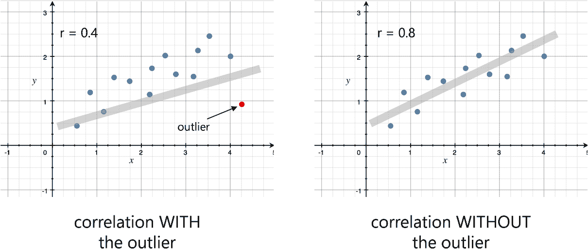

图 12.1 – 一个简单的散点图

如*图 12.1*所示，以及从*第十一章，添加统计洞察：关联*中学到的，皮尔逊相关系数*r*很容易受到异常值的影响。

但然后，是否总是足够通过**事先**移除异常值来解决您在分析中可能遇到的问题？正如您所想象的那样，答案是“不”，因为这完全取决于您正在处理的异常值类型。

### 异常值产生的原因

在考虑对变量的异常值采取任何行动之前，有必要考虑可能产生它们的原因。一旦确定了原因，可能立即就可以修复异常值。以下是可能的原因分类：

+   **数据录入错误**：可能存在一个分析师在收集数据时犯了错误。例如，如果一个分析师正在收集一组人的出生日期，他们可能会错误地写成 177 而不是 1977。如果他们收集的日期属于 1900 到 2100 的范围，那么纠正由于录入错误而造成的异常值相当容易。在其他情况下，可能无法恢复正确的值。

+   **有意异常值**：非常常见的是，受测量影响的个人有意引入“错误”。例如，青少年通常不会准确报告他们消费的酒精量。

+   **数据处理错误**：通常应用于分析解决方案的数据转换过程可能会引入意外的错误，这反过来又可能导致可能的异常值。

+   **抽样误差**：有时，你进行分析的数据必须是从一个更大的数据集中抽取的样本。在这种情况下，分析师可能没有选择代表整个数据集总体的数据子集。例如，你需要测量运动员的身高，但错误地包括了某些篮球运动员在你的数据集中。

+   **自然异常值**：所谓的“自然”异常值存在，因为它们是商业性质的一部分，而不是任何错误的结果。例如，圣诞节期间购物中心销售更多产品几乎是肯定的。

一旦确定了特定异常值的性质，当然更容易尝试尽可能多地纠正它们。我们如何进行？有一些常见的纠正异常值的方法可以考虑。

### 处理异常值

处理异常值的最常用方法如下：

+   **删除它们**：分析师得出结论，完全消除异常值可以保证最终分析结果更好。

+   **对它们进行上限处理**：当确定所有极端观测值的行为与具有上限值的观测值相同的情况下，通常会对超过该值（绝对值）的所有观测值分配一个固定的极端值（上限）。

+   **分配新值**：在这种情况下，通过用空值替换异常值来消除异常值，并使用最简单的一种技术对这些空值进行估计：用固定值替换空值，例如，可以是所讨论变量的均值或中位数。你将在下一节中看到更复杂的估计策略。

+   **转换数据**：当分析师处理自然异常值时，变量分布的直方图往往呈现出偏斜的形状。右偏分布非常常见，如果直接使用这些分布，许多假设正态分布的统计测试将给出错误的结果。在这种情况下，通常通过应用单调函数来转换变量，这种方式在某种程度上“校正”了不平衡（例如，`log()` 函数就是这样）。一旦转换，新的变量满足测试的要求，因此可以无错误地进行分析。一旦从转换后的变量中获得结果，必须使用最初使用的函数的逆函数再次转换（如果使用了 `log()`，则逆函数是 `exp()`），以便得到与所分析的业务变量一致的价值。

现在你已经了解了处理异常值最常见的方法，你需要弄清楚如何识别它们。

## 识别异常值

根据你是逐个分析变量（**单变量分析**）还是同时分析多个变量（**多元分析**），有不同的方法用于检测异常值。在单变量情况下，分析相对简单。然而，多元情况则更为复杂。让我们详细考察它们。

### 单变量异常值

识别单个变量的异常值最直接且广泛使用的方法之一是利用箱形图，这是你在*第十一章，添加统计洞察：关联*中学到的。箱形图的一些关键点是**四分位距**（**IQR**），定义为从**第一四分位数**（**Q1**）到**第三四分位数**（**Q3**）的距离，**下须**（Q1 - 1.5 x IQR），和**上须**（Q3 + 1.5 x IQR）：

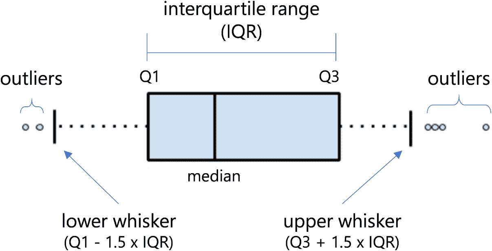

图 12.2 – 盒形图的主要特征

具体来说，所有在下须之前和上须之后的观测值都被识别为异常值。这也被称为**图基方法**。

当处理多个变量时，识别变得更加复杂。

### 多元异常值

当你处理多个变量（**多元异常值**）时，识别异常值并不总是直接的。这取决于涉及的变量数量和数据类型。

#### 数值变量和分类变量

只要你需要分析数值变量如何在分类变量的不同元素之间分布，使用到目前为止看到的工具仍然是可行的。事实上，只需为按分类变量的每个元素分组的数值变量的值绘制箱形图即可：

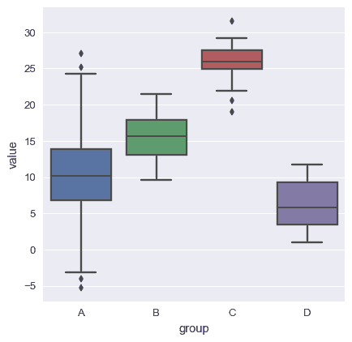

图 12.3 – 数值变量与分类变量

实际上，可能数值变量本身并没有显示出任何异常值，但当它被按分类变量的元素分解时，却揭示了一些异常值。

#### 所有数值变量

通常，没有经验的分析师在只有数值变量的情况下，倾向于简化多维情况中异常值的确定。

> **重要提示**
> 
> 一个人可能会假设在任何变量中极端的观测值也是多变量异常值，这通常是正确的。然而，情况并非总是如此：当变量相关时，可以有一个在任一变量中都不是单变量异常值的多变量异常值。

当只处理数值变量时，仍然可以使用测量分布中心距离的算法。让我们以两个数值变量的情况为例，这使我们能够通过散点图可视化异常值：

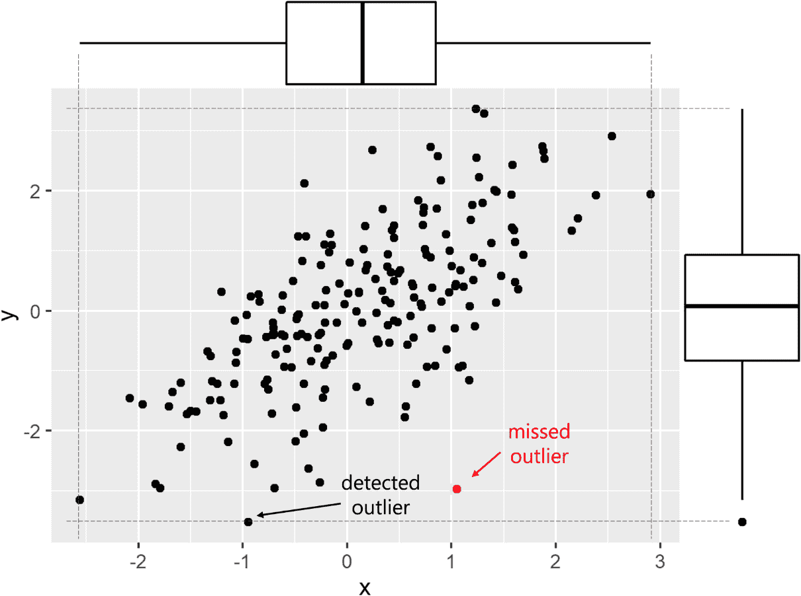

图 12.4 – 两个数值变量的散点图

正如你在*图 12.4*中可以看到的，我们在边缘也添加了每个分析变量的两个箱线图，以验证对于每一个，都没有异常值，除了底部检测到的那个。你还可以看到有一个异常值，它显然与其他所有观测值不同，但并未被两个箱线图检测到。

想象一下固定一个假设的分布中心，并定义一个距离（欧几里得距离），超过这个距离的观测值将被认为是异常值：

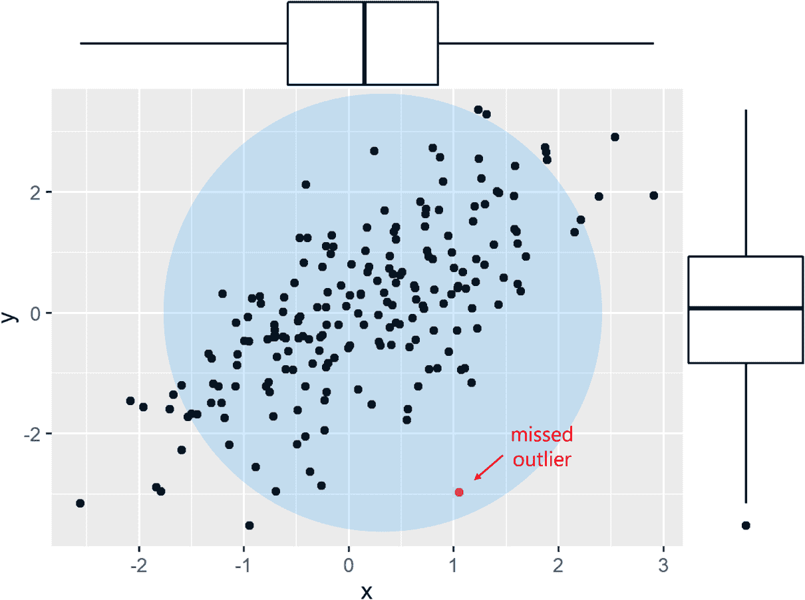

图 12.5 – 分布中心的欧几里得距离

上述规则定义了一个以分布中心为中心的圆。考虑到*图 12.5*中看到的半径，你将识别出一些（可能是假阳性？）异常值，这些异常值仅通过查看箱线图是无法识别的，但之前未能识别的异常值在此情况下仍然未被识别。正如你可以很好地理解的那样，问题是分布具有沿笛卡尔平面主对角线分布的椭圆形形状。使用圆形来拟合不同形状的分布显然是不合适的。

如果有一种距离同时考虑了分布的形状呢？这正是**马氏距离**的情况。这种新的距离与其他距离的不同之处在于它考虑了两个变量之间的**协方差**。协方差和皮尔逊相关系数是与非常相似的概念相关的两个量，因此在某些情况下它们可以互换（参考相关文献）。马氏距离考虑两个变量之间的相关性的事实在*图 12.6*中显而易见：

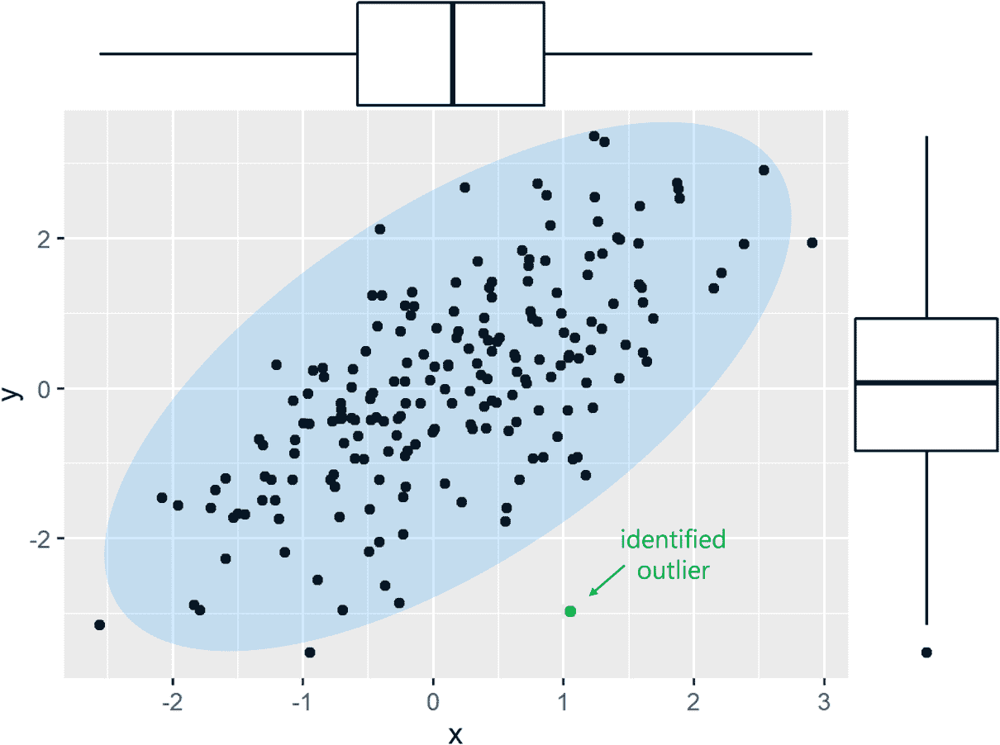

图 12.6 – 分布中心的马氏距离

对于好奇者，这是计算它的公式：

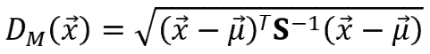

图 12.7 – 马氏距离公式

是一个多变量观察值，是所有观察值的多变量均值，*S* 是协方差矩阵。马氏距离依赖于所有观察值的均值（一个非常不稳定的度量，对异常值非常敏感）和协方差矩阵，这让你意识到对于皮尔逊系数遇到的相同限制也适用，如下所示：

+   在不便利的位置出现的可能异常值可能会极大地影响由所有观察值的均值定义的多变量中心。如果中心计算不当，那么使用马氏距离的结果很可能识别出错误的异常值。这个问题可以通过通过基于中位数的方法计算中心来解决，这种方法对极端观察值的出现更加稳健。

+   如果存在极端异常值，协方差矩阵也可能受到负面影响。这个问题也可以通过采用协方差矩阵的稳健版本（**最小协方差行列式**，**MCD**）来解决。除了提供稳健的协方差矩阵外，这种方法还返回观察值中心的稳健估计。

+   在存在偏斜、非线性或异方差分布的情况下，使用马氏距离很可能返回错误的异常值。在这些情况下，有必要在应用距离计算之前尽可能地对涉及的变量进行变换。变换的目标是获得尽可能正常的分布，并使各种变量之间的关联尽可能线性。在这些情况下，使用**Box-Cox 变换**或**Yeo-Johnson 变换**。

当处理大于两个的混合变量（数值和分类变量）时，识别异常值变得更加复杂。有必要使用不同的数据科学技术（用于分类变量的特征工程技术、处理不平衡数据集等）并应用特定的机器学习异常检测算法。因此，这类情况超出了范围。

一旦识别出异常值（单变量和多变量），分析师就有责任决定采用哪种方法来尝试修复它，如果可能的话。

现在我们来看看如何根据前面章节中学到的知识来实现异常检测算法。

## 实现异常检测算法

你首先需要做的是在 Python 中实现你刚刚学到的内容。

### 在 Python 中实现异常检测

在本节中，我们将使用由 Paulo Cortez 等人创建的 *Wine Quality* 数据集（[`archive.ics.uci.edu/ml/datasets/wine+quality`](https://archive.ics.uci.edu/ml/datasets/wine+quality)）来展示如何在 Python 中检测异常值。该数据集包含与不同类型的红葡萄酒一样多的观测值，每种红葡萄酒都由变量测量的感官特性描述，除了 `quality` 变量，它使用从 1 到 10 的离散等级尺度来衡量产品的质量。

您可以在 `Chapter12\Python` 文件夹中的 `01-detect-outliers-in-python.py` 文件中找到本节使用的代码。

一旦您将来自 `winequality-red.csv` 文件的数据直接加载到 `df` 变量中，让我们首先检查 `sulphates` 变量。让我们通过显示其箱线图来检查它是否包含任何异常值，该箱线图是通过我们定义在代码中的包装函数获得的：

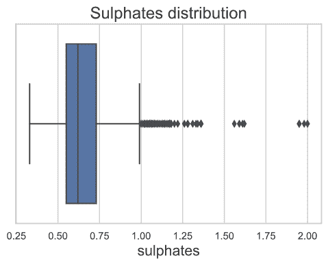

图 12.8 – 硫酸盐箱线图

显然，在 1.0 之后有很多值。为了能够在数据集中定位它们，我们创建了一个函数，该函数接受一个数据框作为输入以及要考虑的数值列的名称，作为输出返回添加了布尔值列的数据框，当列的值为异常值时包含 `True`，否则为 `False`：

```py
def add_is_outlier_IQR(data, col_name):
    col_values = data[col_name]

    Q1=col_values.quantile(0.25)
    Q3=col_values.quantile(0.75)
    IQR=Q3-Q1

    outliers_col_name = f'is_{col_name.replace(" ", "_")}_outlier'
    data[outliers_col_name] = ((col_values < (Q1 - 1.5 * IQR)) | (col_values > (Q3 + 1.5 * IQR)))

    return data
add_is_outlier_IQR(df, 'sulphates')
```

一旦我们确定了 `sulphates` 变量的初始分布的异常值，我们可以通过移除异常值来绘制其箱线图，以查看发生了什么变化：

```py
df_no_outliers = df.loc[~df['is_sulphates_outlier']]
```

结果箱线图如下：

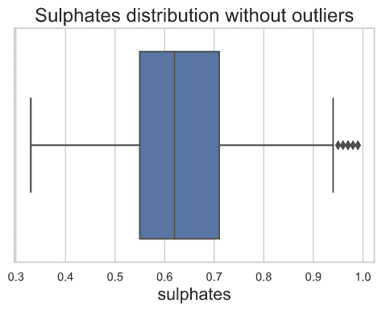

图 12.9 – 移除异常值后的硫酸盐箱线图

如您所见，一些异常值仍然可见。这是由于从初始分布中移除异常值导致分布发生变化（其统计特性发生了变化）。因此，*图 12.9* 中显示的是新创建的分布的异常值。

如前所述，分析师需要确定识别出的异常值是否可以以某种方式纠正、消除或保留在原处。假设在这种情况下，第二个分布中的异常值是自然异常值。让我们尝试将新的分布分解为 `quality` 变量的单个值，并为每个值绘制一个箱线图：

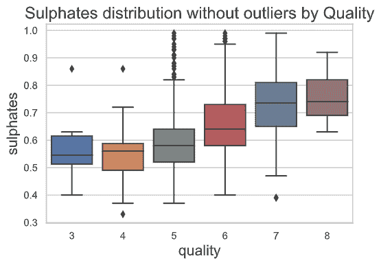

图 12.10 – 每个质量值的硫酸盐箱线图

如 *图 12.10* 所示，获得 5 等级的葡萄酒的硫酸盐分布有几个异常值。这可能会促使分析师试图了解硫酸盐的存在对用户给予葡萄酒的最终评分影响有多大，特别关注到被认为是平均质量的葡萄酒的情况。

另一方面，如果我们想识别数据集中所有数值变量的多元异常值，排除质量变量，我们需要改变方法，尝试应用马氏距离，正如你在上一节中学到的。我们假设每个变量的异常值消除已经得到验证。因此，现在让我们尝试确定`df_no_outliers`数据框中的数值变量是否存在多元异常值。首先，然而，有必要检查分析变量的分布是否偏斜。因此，我们尝试为每个变量绘制直方图：

```py
df_no_outliers.drop('quality', axis=1).hist(figsize=(10,10))
plt.tight_layout()
plt.show()
```

结果的图表如下：

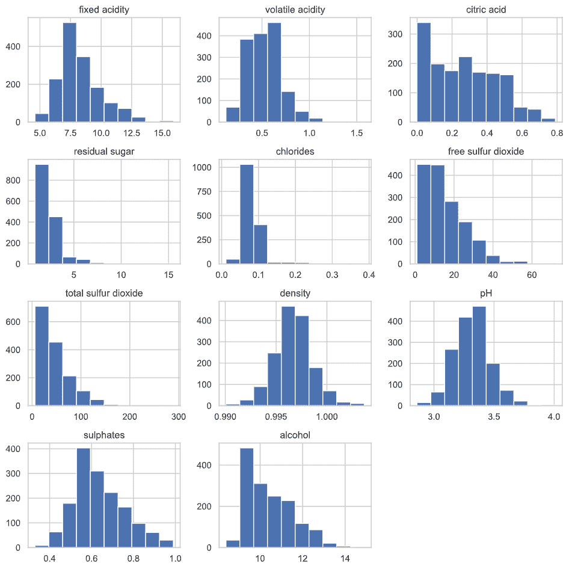

图 12.11 – 无异常值的所有葡萄酒质量变量的直方图

很明显，其中一些变量（如*残留糖分*、*氯化物*、*总二氧化硫*等）极端右偏斜，因此有必要尝试应用尝试“标准化”单个分布的变换。通常，应用*Box-Cox 变换*。但由于在这种情况下，分布的一些值不是正数，因此无法应用它们。因此，有必要使用其他具有相同目标的变换，称为*Yeo-Johnson*。有关这些变换的更多详细信息，请参阅参考文献。

为了方便起见，我们创建了一个包装函数，该函数通过应用 Yeo-Johnson 变换将仅包含数值变量的 pandas 数据框进行转换，并返回相应的 lambda 值：

```py
from sklearn.preprocessing import PowerTransformer
def yeo_johnson_transf(data):
    pt = PowerTransformer(method='yeo-johnson', standardize=True)
    pt.fit(data)
    lambdas = pt.lambdas_
    df_yeojohnson = pd.DataFrame( pt.transform(data), columns=data.columns.values ) 
    return df_yeojohnson, lambdas
```

然后，一旦将数据框转换成对象，你可以尝试绘制变换后变量的分布直方图，以查看偏斜是否已经平滑：

```py
df_transf, lambda_arr = yeo_johnson_transf(df_no_outliers[numeric_col_names])
df_transf.hist(figsize=(10,10))
plt.tight_layout()
plt.show()
```

这是你得到的图表：

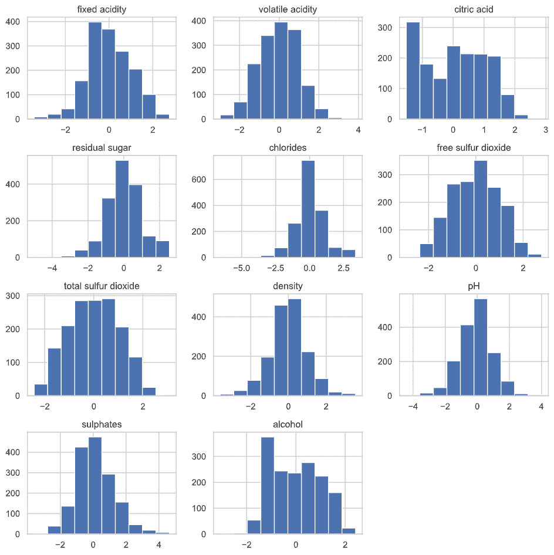

图 12.12 – 所有葡萄酒质量变量变换后的直方图

很明显，现在分布看起来更像是正态分布的“钟形”。现在你可以计算马氏距离，有把握它会以更少的错误检测到异常值。

异常值的识别使用的是协方差的鲁棒估计器，即*MCD*。由于平方马氏距离的行为类似于卡方分布（见参考文献），我们可以通过传递给其*百分位数函数*（`ppf()`）所需的截止值来计算高于该值的阈值，将其视为异常值：

```py
from sklearn.covariance import MinCovDet
robust_cov = MinCovDet(support_fraction=0.7).fit(df_transf)
center = robust_cov.location_
D = robust_cov.mahalanobis(df_transf - center)
cutoff = 0.98
degrees_of_freedom = df_transf.shape[1]
cut = chi2.ppf(cutoff, degrees_of_freedom)
```

一旦确定了阈值值，你可以在数据框中添加两列：一列用于标识观察值（行）是否为马氏距离的异常值，另一列报告观察值非异常值的概率：

```py
is_outlier_arr = (D > cut)
outliers_stat_proba = np.zeros(len(is_outlier_arr))
for i in range(len(is_outlier_arr)):
    outliers_stat_proba[i] = chi2.cdf(D[i], degrees_of_freedom)
df['is_mahalanobis_outlier'] = is_outlier_arr
df['mahalanobis_outlier_stat_sign'] = outliers_stat_proba
df[df['is_mahalanobis_outlier']]
```

你将看到一个类似以下的数据框块：

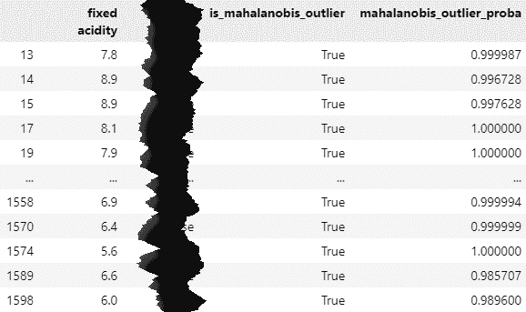

图 12.13 – 数据框中显示的异常值信息

哇！仅凭最少的统计学知识，您就能在 Python 中识别出数值变量的多元异常值。

使用 R 也可以得到相同的结果。让我们看看如何做到。

### 在 R 中实现异常值检测

您可以在`Chapter12\R`文件夹中的`01-detect-outliers-in-r.R`文件中找到本节使用的代码。为了正确运行，您需要安装新包：

1.  打开 RStudio 并确保它引用的是您最新的 CRAN R（在我们的案例中是版本 4.0.2）。

1.  点击**控制台**窗口并输入以下命令：`install.packages('robust')`。然后按*Enter*键。

1.  输入以下命令：`install.packages('recipes')`。然后按*Enter*键。

一旦您已将`winequality-red.csv`文件中的数据直接加载到`df`变量中，您将使用`boxPlot()`包装函数绘制`sulphates`变量的箱线图：

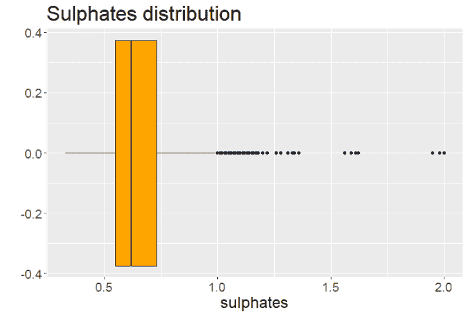

图 12.14 – 硫酸盐变量的箱线图

由于*图 12.14*中存在许多异常值，它们使用`add_is_outlier_IQR()`函数被识别，该函数向数据框添加一个标识列。正如其名称所示，该函数基于四分位数范围确定异常值。在此阶段，再次绘制相同变量的箱线图，这次消除了之前识别出的异常值：

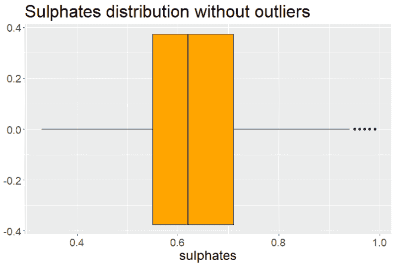

图 12.15 – 移除异常值后的硫酸盐变量箱线图

假设您现在想识别多元异常值，首先查看各个变量的直方图以查看是否存在显著的偏度是有意义的。直方图使用以下`dataframeHist()`函数绘制：

```py
dataframeHist <- function(data, bins = 10) {
    data %>% 
        tidyr::pivot_longer( cols = everything() ) %>% 
        ggplot( aes(value) ) +
        geom_histogram( fill='orange', na.rm = TRUE, bins = bins )+ 
        theme( ... ) +
        facet_wrap(~ name, scales = "free")
}
```

该函数的一个特殊功能是使用`tidyr`包的`pivot_longer()`函数对所有列进行操作，以将它们的名称垂直化到新的`name`列中，对应于新`value`列中的初始值。结果如下：

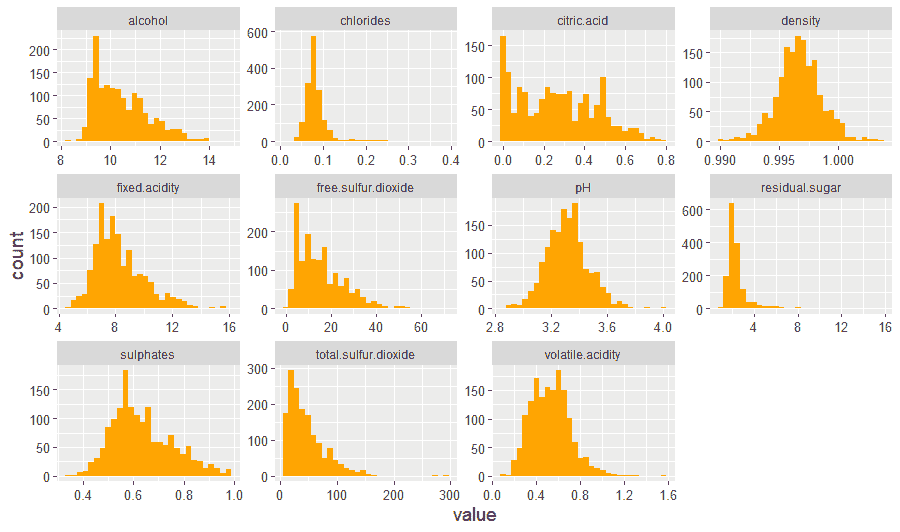

图 12.16 – 每个数值变量的多个直方图

由于偏度明显，您可以使用我们为您创建的`yeo_johnson_transf()`包装函数应用 Yeo-Johnson 变换。这个函数的特殊之处在于它利用了`recipes`包中的一个现成步骤，这简化了整个预处理阶段。要了解更多关于`recipes`的使用，请查看参考文献。

如前节所述，Yeo-Johnson 变换在此情况下很好地解决了偏度问题。因此，可以尝试通过以下代码应用马氏距离来检测异常值：

```py
data <- df_transf %>%
    select( numeric_col_names )
cov_obj <- data %>% 
    covRob( estim="mcd", alpha=0.7 )
center <- cov_obj$center
cov <- cov_obj$cov
distances <- data %>%
    mahalanobis( center=center, cov=cov )
```

在此阶段，给定一个与我们要用来确定异常值的统计显著性相关的截止值，您可以获得相应的阈值，超过该阈值即可认为观察值是异常值。一旦计算了阈值，创建一个用于异常值的指示列就变得非常简单。还可以通过`pchisq()`函数添加一个列，表示观察值可能不是偶然地被认为是异常值的概率：

```py
cutoff <- 0.98
degrees_of_freedom <- ncol(data)
outliers_value_cutoff <- qchisq(cutoff, degrees_of_freedom)
data <- data %>% 
    mutate(
        is_mahalanobis_outlier    = distances > outliers_value_cutoff,
        mahalanobis_outlier_proba = pchisq(distances, ncol(data)) )
data %>% filter( is_mahalanobis_outlier == TRUE )
```

最终结果部分展示了以下输出：

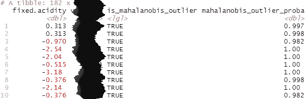

图 12.17 – 包含多变量异常值信息的最终 tibble

干得好！您能够在 R 中识别出多变量异常值。

到目前为止，将 Python 和 R 代码应用于 Power BI 是显而易见的。

### 在 Power BI 中实现异常值检测

Power BI 有工具允许您通过悬停来图形化地查看异常值并进行分析。其中之一是在 2020 年 11 月发布的，是**异常检测**功能。另一个是**异常值检测**自定义可视化。让我们看看它们的主要区别：

+   **异常检测**功能一旦作为预览功能启用（目前处于预览状态），即可直接在 Power BI 中使用。它**仅支持包含轴字段中时间序列数据的折线图可视化**。

+   **异常值检测**是一个开源的 R 自定义可视化工具，需要单独安装（[`bit.ly/power-bi-outliers-detection`](https://bit.ly/power-bi-outliers-detection)）。它实现了五种不同的异常值检测方法，并且对于单变量和双变量数据集表现良好。应避免使用多变量数据集。

如您所注意到的，这两个工具都是 Power BI 可视化工具。

> **重要提示**
> 
> 在 Python 或 R 可视化中执行的所有转换都会修改将来的可视化对象的数据框，但这些更改不能以任何方式持久保存在数据模型中。

正是因为这个原因，我们决定展示一些可以在 Power Query 中使用 Python 或 R 实现的检测异常值的方法。这样，您只需通过适当过滤数据模型表即可识别出异常值。由于代码的简单性，在这种情况下，我们还将在一个项目中实现 Python 和 R 中的相关系数。

首先，请确保 Power BI 桌面版在**选项**中引用了正确的 Python 和 R 版本。然后按照以下步骤操作：

1.  点击**获取数据**，搜索`web`，选择**Web**，然后点击**连接**：

1.  将[`archive.ics.uci.edu/ml/machine-learning-databases/wine-quality/winequality-red.csv`](https://archive.ics.uci.edu/ml/machine-learning-databases/wine-quality/winequality-red.csv)输入到 URL 文本框中，然后点击**确定**。

1.  您将看到数据的预览。然后点击**转换数据**。

1.  在功能区点击**转换**，然后**运行 Python 脚本**。

1.  在`Chapter12\Python`文件夹中的`02-detect-outliers-in-power-bi-with-python copy.py`文件中输入脚本。

1.  我们只对`dataset`中的数据感兴趣。因此，点击其**表格**值。

1.  你将看到数据集的预览，其中也包含用于识别异常值的新列。

1.  在功能区点击**主页**，然后点击**关闭并应用**。

1.  重复步骤 1 到 3。

1.  在功能区点击**转换**，然后**运行 R 脚本**。

1.  在`Chapter12\R`文件夹中的`02-detect-outliers-in-power-bi-with-r.R`文件中输入脚本。

1.  我们只对`data` tibble 感兴趣。因此，点击其**表格**值。

1.  你将看到数据集的预览，其中也包含用于识别异常值的新列。

1.  在功能区点击**主页**，然后点击**关闭并应用**。

太棒了！你刚刚使用 Python 和 R 在 Power BI 中识别了一个数值数据集的异常值！

## 缺失值是什么以及如何处理它们

描述现实世界现象的数据通常有很多缺失数据。数据不足是一个不容忽视的事实，尤其是如果分析师想要对数据集进行高级研究，以了解其中变量之间的相关性程度。

处理缺失值不当的后果可能很多：

+   具有缺失值的变量的*统计功效*会降低，尤其是在单个变量缺失大量值时。

+   缺失值的数据集的*代表性*也可能降低，因此，所讨论的数据集可能无法正确代表现象所有观察值的实质性特征。

+   任何统计估计可能不会收敛到整个总体的值，从而*产生偏差*。

+   进行分析的结果可能不正确。

但让我们看看可能导致数据集中缺失值的原因可能是什么。

### 缺失值的原因

缺失值可能有许多原因，由故意或无意的行为决定。以下是一个非详尽的列表：

+   由于书写、读取或传输过程中的错误导致的数据损坏

+   用空值替换过度扭曲数据集的异常值

+   拒绝回答调查中的问题

+   对调查问题中提出的问题缺乏了解

然而，所有这些原因都可以总结为*四种情况*：

+   **完全随机缺失**（**MCAR**）：产生空值的成因完全独立于如果赋值（Y）的假设值，以及数据集中其他变量的值（X）。它们仅依赖于外部变量（Z）。从统计角度来看，MCAR 数据的优势在于，仅包含变量 X 和 Y 完整值的整个数据集是整个总体的**无偏样本**。不幸的是，MCAR 案例在现实世界数据中很少见。

+   **随机缺失（MAR**）：部分不完整变量（Y）的缺失数据与数据集中某些其他变量（X）有关，这些变量没有空值，但与不完整变量本身的值（Y）无关。在 MAR 情况下，仅包含 X 和 Y 两个变量完整值的样本数据集构成了整个总体的**有偏样本**，因为它肯定会错过所有那些 Y 的空值所依赖的 X 的值，从而导致一个不能代表整个现象的数据集。MAR 比 MCAR 是一个更现实的假设。

+   **由于外部变量 Z 导致的非随机缺失（MNAR Z**）：部分不完整变量（Y）的缺失数据依赖于数据集中未包含的变量（外部变量）。例如，给定一个没有“性别”变量的数据集，可能会有年龄值为零的观测值。可能的情况是，不提供此信息的受访者大多是女性，因为她们典型地不愿意透露自己的年龄。因此，消除“年龄”变量非空值的观测值将生成一个**有偏的数据集**。

+   **由于缺失值 Y 导致的非随机缺失（MNAR Y**）：部分不完整变量（Y）的缺失数据依赖于它们如果被赋值时的假设值。例如，众所周知，青少年倾向于从不透露他们饮酒的事实。因此，如果我们从数据集中移除那些酒精消费值为空的观测值，我们隐含地冒着从数据集中移除大多数与青少年相关的观测值的风险，从而获得一个**有偏的数据集**。

也有一些统计测试可以帮助你理解缺失数据的分布是否为 MCAR（参见参考文献）。但是，如前所述，MCAR 的情况非常罕见，因此最好假设考虑中的数据集缺失值的分布要么是 MAR，要么是 MNAR。

根据缺失数据分布的类型，可以采用特定的策略来清理缺失值。

### 处理缺失值

当可能时，首先要做的是与数据的相关方一起了解数据集中缺失值的原因，以及是否有可能恢复它们。不幸的是，大多数时候无法从源数据中恢复缺失数据，因此必须根据具体情况采用不同的策略。

#### 简单的手动推断

可能存在一些变量，它们的手动**推断**是**显而易见的**。例如，在“颜色”变量的“蓝色”值对应的情况下，你会注意到“重量”变量总是取值为 2.4，除了少数几个值为空的情况。在这些情况下，根据“蓝色”颜色值为 2.4，很容易推断出“重量”变量的缺失值。

#### 丢弃数据

分析师首先想到的缺失值解决方案无疑是消除问题的根源，即消除缺失值。消除它们有几种方法：

+   **完全案例分析**（**CCA**）**删除**：这种方法涉及**删除任何包含至少一个缺失数据元素的观测值（行）**。当缺失值的数量较少，观测值数量足够大时，通常应用这种方法。正如你在四种缺失数据类型的分类中所看到的，唯一不会导致数据集有偏的情况是 MCAR，这在描述现实世界现象的数据集中是非常罕见的。因此，当数据集中观测值的数量足够高时，面对 MCAR 的情况，列表删除并不是一个好的策略。

+   **成对**或**可用案例分析**（**ACA**）**删除**：根据统计分析中考虑的变量，这种方法**仅删除那些对于涉及的唯一变量具有空值的观测值（行）**。不涉及分析的变量中的空值不是删除观测值的原因。同样，只有当分析中的案例是 MCAR 时，采用这种方法才不会生成有偏的数据集。这种方法最明显的缺点是，如果你需要比较不同的分析，你不能应用它，因为样本中观测值的数量会随着不同分析中涉及的变量的变化而变化。

+   **变量删除**：这种方法考虑在研究分析中**从分析中删除整个变量**（而不是从先验数据集中删除！）当缺失值的比例在 60%及以上时。如果在仔细研究后得出结论，该变量不包含当前分析的重要信息，那么删除变量是有意义的。否则，始终更倾向于尝试插补方法。一般来说，删除变量总是最后的选项，并且只有在最终分析确实从中受益时才应考虑。

即使在尝试应用这些消除技术之后，分析师仍然必须解决缺失值的问题，他们必须求助于插补技术。让我们看看最常用的方法。

#### 均值、中位数和众数插补

这是一个直观吸引人的方法，也称为**单值插补**，其中你用预定义的值填充缺失值。不幸的是，简单性被一些不可忽视的问题所抵消。

可能最常用的缺失值替代方法是使用变量的分布**均值**，这是在忽略缺失值的情况下得到的。这种选择的动机在于*均值是随机从正态分布中抽取的观察值的合理估计*。然而，如果所讨论的分布是偏斜的，即使数据集的缺失值分布是 MCAR，分析师也有可能做出严重偏颇的估计。

可以通过使用变量的**中位数**来解决偏斜问题。然而，事实仍然是，单次插补的常见问题是用一个单一值来替代缺失值，然后将其视为真实值。因此，单次插补忽略了不确定性，并且几乎总是低估方差（记住方差与信息同义；方差为 0 的变量是常数值变量，通常不会丰富统计分析）。

**众数**（出现频率最高的值）插补通常用于表示为数字的分类数据。即使这种方法在没有强有力的理论依据的情况下使用，也会引入偏差，以至于有时分析师更愿意为缺失值创建一个新的类别。

多重插补通常比单次插补更可取，因为它通过考虑插补内和插补间方差来克服低估方差的问题。让我们看看这是怎么回事。

#### 多重插补

多亏了 Donald B. Rubin，1987 年公开了一种处理单次插补情况下方差低估问题的方法。这种方法被称为**多重插补**，包括以下步骤：

1.  **插补**：这一步骤与单次插补步骤非常相似，只是这次，对于每个缺失值，从分布中提取*m*次值。这一操作的结果是一组*m*个插补数据集，其中所有观测值始终相同，而插补值则根据各自分布的不确定性而不同。

1.  **分析**：您使用所有*m*个插补数据集进行所需的统计分析。这一步骤的结果是通过对每个*m*个插补数据集应用相关分析而获得的*m*个结果（或分析）。

1.  **合并**：将*m*个结果合并，以获得具有正确统计特性的无偏估计。将每个缺失值的*m*个估计值合并，以便得到一个估计方差，该方差结合了通常的抽样方差（**插补内方差**）和由缺失数据引起的额外方差（**插补间方差**）。

整个过程可以用*图 12.18*来概括：

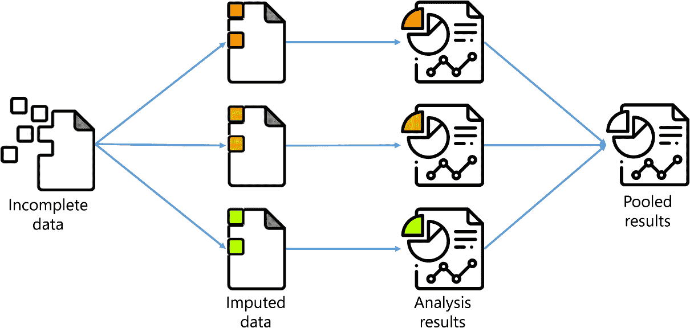

图 12.18 – 多重插补过程

在数据是 MCAR（完全随机缺失）、MAR（条件随机缺失）甚至当数据是 MNAR（非随机缺失）且有足够辅助变量的情况下，可以使用多重插补。

多重插补最常见的实现方式如下：

+   **链式方程多重插补**（**MICE**）：这种方法专注于一次填补一个变量的缺失值。一旦专注于一个变量，MICE 将使用数据集中的所有其他变量（或适当选择的这些变量的子集）来预测该变量的缺失值。缺失值的预测基于数值变量的线性回归模型和分类变量的逻辑回归模型。

+   **Amelia II**：这个名字是为了纪念阿梅莉亚·埃尔哈特，一位美国航空先驱，她在 1937 年尝试成为首位完成全球环球飞行第一人时，在太平洋中央失踪。Amelia II 结合了基于自助法的算法和**期望最大化**（**EM**）算法，使其快速且可靠。它也非常适合时间序列数据。

最近，已经使用深度学习算法实现了多重插补。特别是，**去噪自编码器多重插补**（**MIDAS**）算法在准确性和效率方面相较于其他多重插补策略具有显著优势，尤其是在应用于具有复杂特征的大型数据集时。

#### 单变量时间序列插补

缺失数据的问题不仅困扰着多元表格数据集，也影响着时间序列数据集。例如，持续收集现象数据的传感器可能在任何时候停止工作，从而在序列中产生空缺。通常，分析师面对的是含有缺失值的时间序列，必须以某种方式对这些值进行插补，因为提交序列的流程无法处理空值。

时间维度给出的事件后果约束迫使分析师使用特定的插补方法来处理时间序列。让我们看看最常用的方法：

+   **最后观测值前推（LOCF）和下一观测值后推（NOCB）**：在 LOCF 方法中，使用变量最后观测到的（即非空）测量值来填补所有后续的缺失值。LOCF 无偏的唯一条件是缺失数据完全随机，且用作 LOCF 插补基础的数据与未知缺失数据的分布完全相同。由于无法证明这些分布完全相同，所有利用 LOCF 的分析都存在嫌疑，并且几乎肯定会生成有偏的结果。NOCB 方法与 LOCF 类似，但方向相反，它使用缺失值之后的第一个（非空）观测值来替换缺失值。显然，它具有与 LOCF 相同的局限性。

+   **指数加权移动平均（EMWA）**：一般来说，移动平均在时间序列中常用于平滑短期效应引起的波动，并突出长期趋势或周期。EWMA 的设计使得较老的观测值赋予较低的权重。随着观测值的变老，权重呈指数下降（因此得名“指数加权”）。缺失值通过使用结果“平滑”时间序列的值进行插补。

+   **插值**：插值技术是从时间序列中插补缺失数据最广泛使用的技术之一。基本思想是使用一个简单的函数（例如线性函数、多项式函数或样条函数）来拟合缺失值附近的非零点，然后对缺失观测值进行插值。

+   **季节分解插补**：如果分析的时间序列具有季节性，这种方法可能会给出非常好的结果。采用的程序是从时间序列中移除季节性成分，对季节调整后的序列进行插补，然后将季节性成分加回。

对于多变量时间序列，也有用于插补缺失值的算法。

#### 多变量时间序列插补

这个主题超出了本章的范围，但我们只是想说明，我们之前讨论的*Amelia II*算法也用于多变量时间序列的缺失值插补，而它不适用于单变量时间序列的插补。

为了确定是否要插补缺失值，我们必须首先在数据集中识别它们。让我们看看如何做到这一点。

## 在 R 和 Python 中诊断缺失值

在考虑在数据集中插补缺失值之前，我们必须首先了解缺失值对每个变量影响的程度。

您可以在本节的`Chapter12\R\03-diagnose-missing-values-in-r.R`和`Chapter12\Python\03-diagnose-missing-values-in-python.py`文件中找到使用的代码。为了正确运行代码以及后续章节的代码，您需要按照以下方式安装所需的 R 和 Python 包：

1.  打开 Anaconda 提示符。

1.  输入`conda activate pbi_powerquery_env`命令。

1.  输入`pip install missingno`命令。

1.  输入`pip install upsetplot`命令。

1.  然后，打开 RStudio 并确保它正在引用您最新的 CRAN R（在我们的案例中是版本 4.0.2）。

1.  点击**控制台**窗口并输入`install.packages('naniar')`。然后按*Enter*。

1.  输入`install.packages('imputeTS')`。然后按*Enter*。

1.  输入`install.packages('forecast')`。然后按*Enter*。

1.  输入`install.packages('ggpubr')`。然后按*Enter*。

1.  输入`install.packages('missForest')`。然后按*Enter*。

1.  输入`install.packages('mice')`。然后按*Enter*。

1.  输入`install.packages('miceadds')`。然后按*Enter*。

让我们看看在您面对数据集中缺失值分析时，哪些功能会派上用场。

R 包`naniar`提供了`vis_miss()`函数，该函数可以在单个图像中显示整个数据框的缺失值：

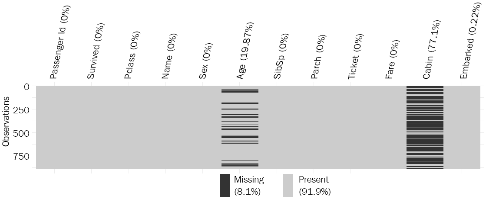

图 12.19 – 整个数据集中缺失值的图

您可以利用`missingno`库在 Python 中绘制类似的图表（[`github.com/ResidentMario/missingno`](https://github.com/ResidentMario/missingno)）。

仅知道与考虑的变量的总值相比的缺失值百分比可能有限。这就是为什么通常还很有用通过`miss_var_summary()`函数了解每个列的详细信息：

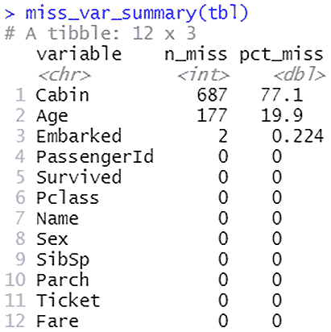

图 12.20 – 缺失值摘要

我们在代码库中开发了一个类似的功能。

能够可视化缺失值组合以及变量之间的缺失交集将很有趣。R 包`naniar`（[`github.com/njtierney/naniar`](https://github.com/njtierney/naniar)）通过`gg_miss_upset()`函数允许您进行此类分析：

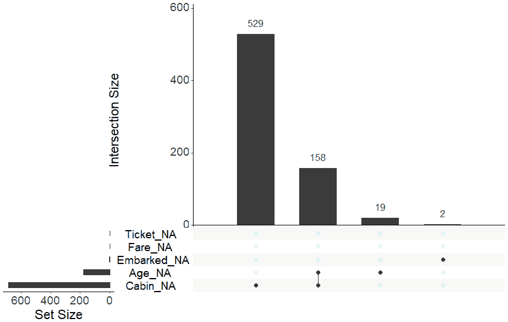

图 12.21 – 数据集缺失值的 UpSet 图

要在 Python 中实现相同的图，过程要复杂一些。您必须首先使用`upsetplot`模块（[`github.com/jnothman/UpSetPlot`](https://github.com/jnothman/UpSetPlot)）。问题在于提供该包暴露的`UpSet()`函数所需的输入数据框格式。因此，我们创建了辅助函数`upsetplot_miss()`，您可以在代码中找到它，以便在 Python 中轻松创建缺失值的 upset 图。

如果您需要了解时间序列中的缺失值，`imputeTS` R 包提供的`ggplot_na_distribution()`函数可以非常清楚地显示时间序列中的空洞：

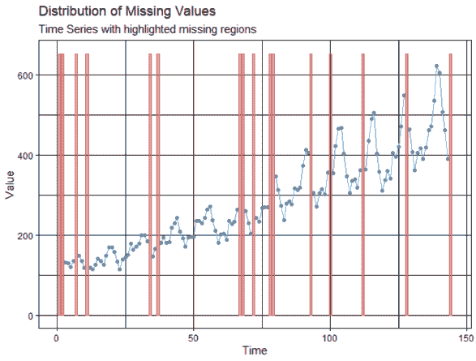

图 12.22 – 时间序列中检测缺失值

如果您需要获取关于时间序列中缺失值统计的更完整细节，`statsNA()`函数就是您所需要的：

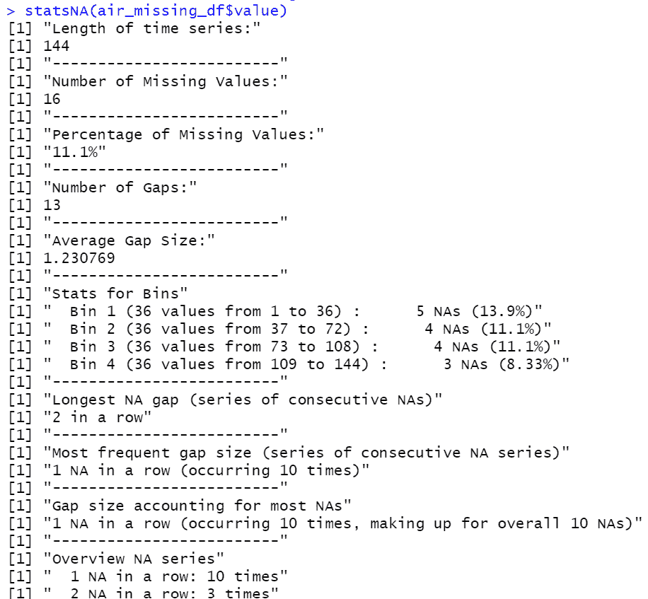

图 12.23 – 时间序列中缺失值的统计

一旦您仔细研究了每个变量的缺失值分布及其交集，您就可以决定在数据集中保留哪些变量，以及将哪些变量提交给各种插补策略。让我们看看如何在 R 和 Python 中实现插补。

## 实现缺失值插补算法

从现在开始，所有缺失值分析都将使用 R 来完成，因为为这种语言开发了非常统计专业且易于使用的包，而在 Python 生态系统中不存在这些包。

假设我们需要计算泰坦尼克号灾难数据集中两个数值变量`Age`和`Fare`之间的皮尔逊相关系数。让我们首先考虑删除缺失值的情况。

### 删除缺失值

应用列表和成对删除技术对泰坦尼克号数据集中数值变量之间的皮尔逊相关系数计算的影响是明显的。让我们加载数据并仅选择数值特征：

```py
library(dplyr)
dataset_url <- 'http://bit.ly/titanic-data-csv'
tbl <- readr::read_csv(dataset_url)
tbl_num <- tbl %>% 
  select( where(is.numeric) )
```

如果你现在分别计算两种技术的相关矩阵，你会注意到差异：

```py
# Listwise deletion
cor( tbl_num, method = 'pearson', use = 'complete.obs' )
# Pairwise deletion
cor( tbl_num, method = 'pearson', use = 'pairwise.complete.obs' )
```

你将看到以下结果：

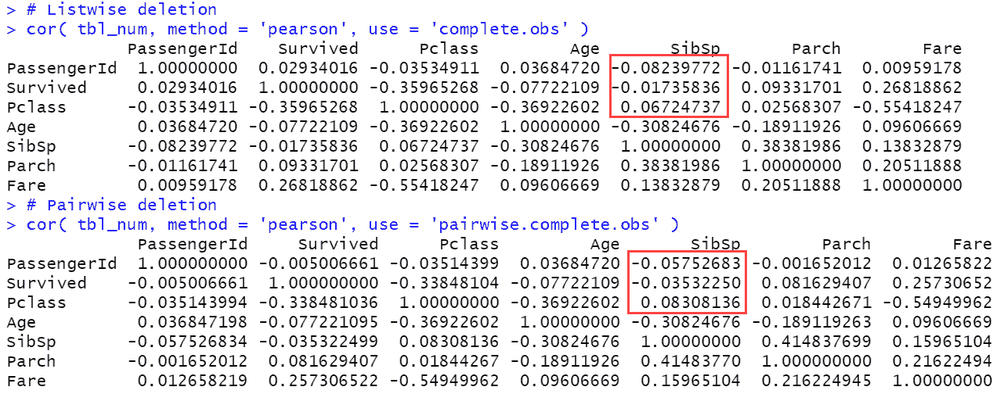

图 12.24 – 使用列表和成对删除计算的相关矩阵

让我们看看如何在表格数据集的情况下插补缺失值。

### 插补表格数据

你可以在`Chapter12\R\04-handle-tabular-missing-values-in-r.R`文件中找到本节使用的代码。

再次，从泰坦尼克号灾难数据集开始，你需要做的第一件事是删除`Name`和`Ticket`列，因为它们有大量的不同值。

> **重要提示**
> 
> 重要的是要消除具有大量不同值的分类变量，否则 MICE 算法会因为所需的 RAM 过多而失败。通常，高基数变量对于其他变量的缺失值插补没有用。在某些情况下，这些变量中包含的信息对于插补可能是基本的（例如，邮政编码）。在这种情况下，需要使用变换来降低基数，同时不丢失变量中包含的信息。有关更多信息，请参阅参考文献。

由于`Cabin`列中的缺失值占所有值的 70%以上，我们决定也删除它。之后，分类变量`Survived`、`Sex`和`Embarked`被转换为因子：

```py
tbl_cleaned <- tbl %>% 
  select( -Cabin, -Name, -Ticket ) %>% 
  mutate(
    Survived = as.factor(Survived),
    Sex = as.factor(Sex),
    Embarked = as.factor(Embarked)
  )
```

在这一点上，可以通过应用 Rubin 在多次插补中提供的池化技术来计算每对数值变量的皮尔逊相关系数。`miceadds`包暴露了包装函数，简化了以`mice()`函数的结果作为参数的最常见统计分析操作。在我们的情况下，感兴趣的函数是`micombine.cor()`，我们在`corr_impute_missing_values()`函数中使用它：

```py
corr_impute_missing_values <- function(df, m = 5, variables, method = c('pearson', 'spearman')) {
  method <- method[1]
  df_imp_lst <- mice(df, m = m, printFlag = FALSE)
  corr_tbl <- miceadds::micombine.cor(df_imp_lst, variables = variables, method = method) %>% 
    as_tibble() %>% 
    arrange( variable1, variable2 )
  return( corr_tbl )
}
```

因此，很容易获得上述相关系数：

```py
# Get the indexes of numeric columns
numeric_col_idxs <- which(sapply(tbl_cleaned, is.numeric))
corr_tbl <- corr_impute_missing_values(tbl_cleaned, variables = numeric_col_idxs, method = 'pearson')
corr_tbl
```

这里是结果：

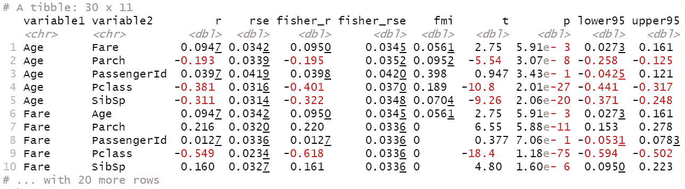

图 12.25 – 多次插补数据集的相关性统计推断

不深入其他领域的细节，变量之间的相关系数由`r`列给出。由于*r*系数是推断过程的结果，`lower95`和`upper95`列定义了上下 95%置信区间的界限。

> **重要提示**
> 
> 如果你遇到像**Error in matchindex(yhatobs, yhatmis, donors) : function 'Rcpp_precious_remove' not provided by package 'Rcpp'**这样的错误，那么很可能是你正在运行一个使用较早版本的`Rcpp`编译的包的最新版本。使用`install.packages('Rcpp')`命令更新`Rcpp`应该可以解决这个问题。

有时，分析的目标不是从统计函数中获得结果，而是简单地填补缺失值留下的空白，因为相关的数据集必须用于训练一个不允许空值的机器学习算法。scikit-learn 的最新版本（目前处于实验阶段）公开了带有`SimpleImputer`、`KNNImputer`和`IterativeImputer`方法的插补模块。这样，就可以通过机器学习算法（k-最近邻；线性回归）以及其他更简单的方法（使用固定值、均值、中位数或众数替换）来插补数据集的缺失值，并且还可以获得算法整体表现的平均分数（交叉验证均方误差）。你将在*第十三章，使用无高级或嵌入式容量的机器学习*中看到一个这些方法的例子。

如果，另一方面，你需要从一元时间序列中插补缺失值，你会怎么做？让我们看看。

### 插补时间序列数据

你可以在`Chapter12\R\05-handle-time-series-missing-values-in-r.R`文件中找到本节使用的代码。

我们考虑一个每月平均飞机乘客数量的时间序列。让我们复制它，并从中随机删除 10%的值，此外，我们手动删除几个重复的值。然后，我们将两个时间序列合并成一个单一的 tibble：

```py
air_df <- read.csv('https://bit.ly/airpassengers')
# Create 10% of missing values in the vector
set.seed(57934)
value_missing <- missForest::prodNA(air_df['value'], noNA = 0.1)
# Force a larger gap in the vector
value_missing[67:68,] <- NA
# Add the vector with missing values to the dataframe
air_missing_df <- air_df %>% 
    mutate( date = ymd(date) ) %>% 
    rename( complete = value ) %>% 
    bind_cols( value = value_missing )
```

结果可以在*图 12.22*中看到。`imputeTS`包公开了方便的函数，实现了在*一元时间序列插补*部分已描述的缺失值插补。一旦使用不同的算法和参数插补了值，就可以计算准确性，因为你也知道完整的时间序列。我们使用`forecast`包公开的`accuracy()`函数，使用各种指标（如*平均绝对误差*和*均方根误差*）来计算最终的准确性：

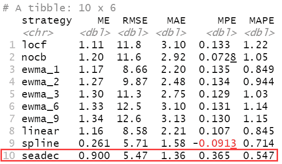

图 12.24 – 时间序列中插补值的误差指标

**季节分解插补**（**seadec**）策略似乎是最好的。以下是根据此策略绘制缺失值的图表：

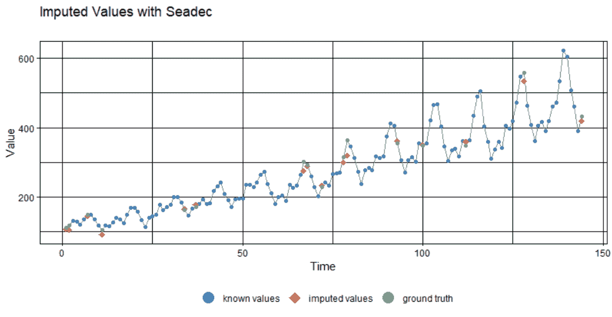

图 12.25 – 时间序列中插补值的表示

现在我们来看看如何在 Power BI 中应用我们迄今为止关于缺失值的所学知识。

### 在 Power BI 中插补缺失值

我们深入探讨了缺失值插补的理论和技术，无论是处理表格数据集还是时间序列数据，这正是因为在 Power BI 中，除了用默认值（如固定值、平均值或中位数）替换它们的简单解决方案外，没有其他原生工具可以采用它们。实际上，当业务分析师发现自己需要填补数据中的空白时，他们通常会寻求数据科学家或具有统计知识的人的帮助来解决该问题。现在你已经学习了这一章，你能够自己解决这个问题了！

让我们应用我们在前几节中为 Power BI 中的表格和时间序列数据所做的操作：

1.  打开 Power BI 桌面版，并确保它引用的是最新引擎。

1.  点击**获取数据**，搜索`web`，然后双击**Web**连接器。

1.  输入以下 URL 并点击**确定**：[`bit.ly/titanic-dataset-csv`](http://bit.ly/titanic-dataset-csv)。

1.  在下一个导入屏幕上，点击**转换数据**。

1.  切换到**转换**选项卡，点击**运行 R 脚本**，复制`Chapter12\R`文件夹中的`06-impute-tabular-missing-values-in-power-bi-with-r.R`文件中的脚本，将其粘贴到编辑器中，然后点击**确定**。

1.  你可能需要配置 R 脚本和 CSV 文件的隐私级别。在这种情况下，选择**组织**和**公共**级别。

1.  我们只对`corr_tbl`中的数据感兴趣。因此，点击其**表**值。

1.  因此，你会看到包含使用 MICE 和多元插补技术提供的池化方法计算的相关系数的表格：

    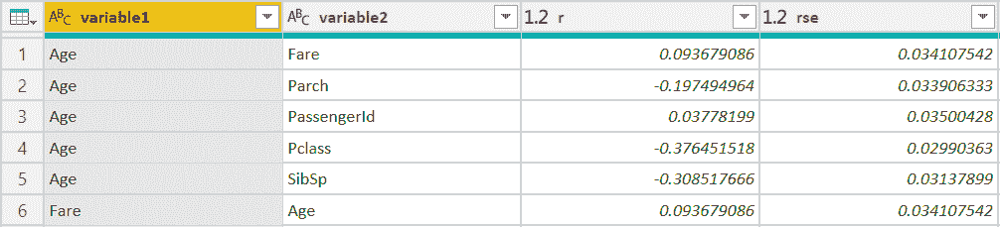

    图 12.26 – 使用多元插补技术计算的相关表

1.  切换到**主页**标签页，然后点击**关闭并应用**。

1.  点击**获取数据**，然后双击**文本/CSV**连接器。

1.  在**Chapter12**文件夹中找到`air.csv`文件，然后点击**打开**。

1.  在下一个导入屏幕上，点击**转换数据**。

1.  Power BI 自动将`date`文本字段解释为日期字段，因此应用了一个从文本到日期的**更改类型**操作。为了正确处理使用`lubridate`包的 R 脚本中的日期，你必须删除**更改类型**步骤，在插入 R 脚本之前点击红色的叉号：

    

    图 12.27 – 删除更改类型步骤

1.  转到**转换**选项卡，点击**运行 R 脚本**，复制`Chapter12\R`文件夹中`07-impute-time-series-missing-values-in-power-bi-with-r.R`文件中的脚本，将其粘贴到编辑器中，然后点击**确定**。

1.  可能需要您配置 R 脚本和 CSV 文件的隐私级别。在这种情况下，请选择**组织**和**公共**级别。

1.  因此，您将看到包含原始时间序列（`value`列）和通过不同插补算法获得的其他时间序列（每个都在不同的列中）的表格：

    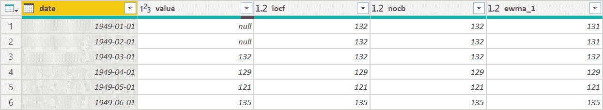

    图 12.28 – 填充时间序列的表格

1.  转到**主页**选项卡，然后点击**关闭并应用**。

太棒了！您成功地将最复杂的缺失值插补算法应用于 Power BI 中的表格数据集和时间序列，而且几乎不费吹灰之力。恭喜您！

## 摘要

在本章中，您学习了什么是异常值，它们通常由什么引起，以及如何处理它们。您还学习了如何根据涉及的变量数量和它们的给定类型，在 Python 和 R 中识别它们。

您还涉及的一个重要主题是如何在表格和时间序列数据集中填充缺失值。您学习了如何诊断它们并使用 R 进行插补。

之后，您在 Power BI 中实现了值插补算法。

在下一章中，您将了解如何在 Power BI 中使用机器学习算法，而无需使用高级版或嵌入式功能。

## 参考文献

对于额外的阅读，请参阅以下书籍和文章：

1.  *在 R 中使用 ggExtra 包将边际图添加到 ggplot2 散点图* ([`statisticsglobe.com/ggplot2-graphic-with-marginal-plot-in-r`](https://statisticsglobe.com/ggplot2-graphic-with-marginal-plot-in-r))

1.  *关于协方差你应该知道的 5 件事* ([`towardsdatascience.com/5-things-you-should-know-about-covariance-26b12a0516f1`](https://towardsdatascience.com/5-things-you-should-know-about-covariance-26b12a0516f1))

1.  *马氏距离及其局限性* ([`rpubs.com/jjsuarestra99/mahalanobis`](https://rpubs.com/jjsuarestra99/mahalanobis))

1.  *Box-Cox 转换解释* ([`towardsdatascience.com/box-cox-transformation-explained-51d745e34203`](https://towardsdatascience.com/box-cox-transformation-explained-51d745e34203))

1.  *如何在 R 中使用 Power Transforms 进行机器学习* ([`machinelearningmastery.com/power-transforms-with-scikit-learn/`](https://machinelearningmastery.com/power-transforms-with-scikit-learn/))

1.  *马氏距离与卡方分布的关系* ([`markusthill.github.io/mahalanbis-chi-squared/`](https://markusthill.github.io/mahalanbis-chi-squared/))

1.  *使用 recipes 包进行简单的预处理* ([`www.rebeccabarter.com/blog/2019-06-06_pre_processing/`](http://www.rebeccabarter.com/blog/2019-06-06_pre_processing/))

1.  *异常检测* ([`docs.microsoft.com/en-us/power-bi/visuals/power-bi-visualization-anomaly-detection`](https://docs.microsoft.com/en-us/power-bi/visuals/power-bi-visualization-anomaly-detection))

1.  *缺失数据：机制、方法和信息* ([`www.i-deel.org/uploads/5/2/4/1/52416001/chapter_4.pdf`](http://www.i-deel.org/uploads/5/2/4/1/52416001/chapter_4.pdf))

1.  *多重插补通过链式方程：它是怎样的，以及它是如何工作的？* ([`www.ncbi.nlm.nih.gov/pmc/articles/PMC3074241/`](https://www.ncbi.nlm.nih.gov/pmc/articles/PMC3074241/))

1.  *Amelia II：缺失数据处理程序* ([`www.jstatsoft.org/article/view/v045i07`](https://www.jstatsoft.org/article/view/v045i07))

1.  *关于分类变量编码的所有内容* ([`towardsdatascience.com/all-about-categorical-variable-encoding-305f3361fd02`](https://towardsdatascience.com/all-about-categorical-variable-encoding-305f3361fd02))
